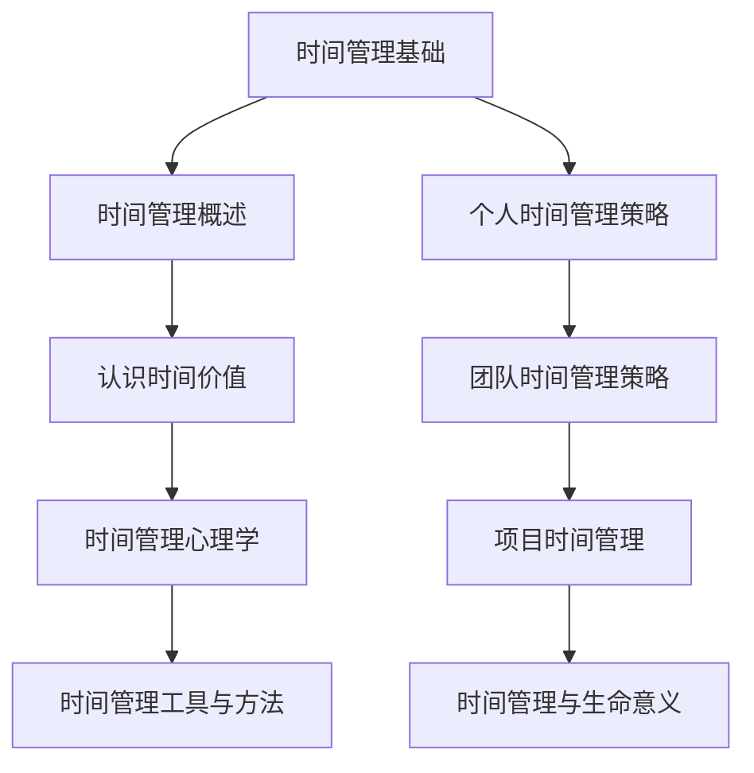

                 

### 时间管理：有限生命中的效率与意义

> 关键词：时间管理、效率、生命意义、算法、Python代码、流程图

> 摘要：本文旨在探讨时间管理在有限生命中的重要性。通过分析时间管理的基础、策略与实践，结合心理学和数学模型，我们希望能够帮助读者提高工作效率，找到生命的意义。

---

## 引言

在快节奏的现代社会中，时间管理成为了一个至关重要的议题。对于每个人来说，时间是有限的资源，如何合理利用时间，提高工作效率，实现个人目标，成为了许多人关注的焦点。然而，时间管理并非一项简单的任务，它涉及到多个层面的考量，包括个人习惯、心理因素、策略方法等。

本文将从以下几个方面展开讨论：

1. **时间管理基础**：介绍时间管理的定义、核心原则和常见误区。
2. **时间价值认知**：探讨个人和企业时间价值的评估方法及其在组织管理中的应用。
3. **时间管理心理学**：分析时间感知与时间错觉，讨论时间管理心理障碍及克服方法。
4. **时间管理工具与方法**：介绍常见的时间管理工具和方法，并比较其优缺点。
5. **时间管理策略与实践**：针对个人和团队，提出具体的时间管理策略和实践方法。
6. **项目时间管理**：分析项目时间管理的关键点和方法，结合案例分析进行讲解。
7. **时间管理与生命意义**：探讨时间的有限性与生命意义，以及时间管理对人生的影响。

通过上述内容，我们希望能够为读者提供一套完整的时间管理体系，帮助大家更好地利用时间，实现人生目标。

---

## 时间管理基础

### 时间管理的定义与重要性

时间管理，简单来说，就是通过规划和控制时间，使其更有效地用于实现个人或组织的目标。它不仅仅是一种技能，更是一种生活态度。在现代社会，时间管理的重要性不言而喻。首先，有效的时间管理可以提高工作效率，减少不必要的浪费。其次，合理的时间安排有助于平衡工作与生活，提升生活质量。最后，时间管理也是实现个人目标的重要手段，帮助人们更好地规划未来。

### 时间管理的核心原则

时间管理的核心原则包括以下几点：

1. **优先级原则**：将任务按优先级排序，先完成最重要、最紧急的任务。
2. **计划原则**：提前制定详细的计划，包括任务列表、时间表和目标。
3. **集中精力原则**：在工作时避免分散注意力，专注于当前任务。
4. **休息原则**：合理安排休息时间，保持精力充沛。

### 时间管理的误区与挑战

尽管时间管理的重要性被广泛认可，但在实际操作中，许多人常常陷入以下误区：

1. **过度安排**：试图在短时间内完成过多任务，导致过度疲劳。
2. **忽略休息**：忽视休息的重要性，导致工作效率下降。
3. **缺乏灵活性**：过于僵化的计划往往难以适应实际变化。

此外，时间管理还面临诸多挑战，如任务繁多、优先级不明确、缺乏执行力等。要克服这些挑战，需要结合实际情况，灵活调整时间管理策略。

---

### 认识时间价值

时间价值是时间管理中的一个核心概念，它指的是时间本身所带来的价值。无论是个人还是企业，时间的价值都不可忽视。以下从个人和企业两个层面探讨时间价值的评估和管理策略。

#### 个人时间价值的评估方法

个人时间价值的评估方法主要有两种：直接评估和间接评估。

1. **直接评估方法**：通过估算个人的时间成本，如工资、兼职收入等，来评估个人时间价值。这种方法简单直观，适用于那些可以直接衡量时间价值的工作。

   例如，一个年薪为10万元的员工，他的每小时时间价值大约为\( \frac{100000}{2000} \)元，即每小时约50元。

2. **间接评估方法**：通过评估个人时间的产出效率，如完成某个项目的效率、解决问题的速度等，来评估个人时间价值。这种方法更注重时间的效果和贡献，而不仅仅是时间长度。

   例如，一个IT开发人员每小时能完成一个功能模块，而这个模块的市场价值为1000元，那么他的每小时时间价值为1000元。

#### 企业时间价值的管理策略

企业时间价值的管理策略与个人类似，但其评估和管理更加复杂，需要考虑多个维度。

1. **项目成本管理**：通过估算项目的时间成本，包括人力成本、设备成本等，来评估项目的时间价值。这有助于企业在资源有限的情况下，优先选择具有高回报的项目。

2. **时间效率管理**：通过提高员工的工作效率和团队合作效率，来增加企业的时间价值。这包括培训、流程优化、团队建设等。

3. **时间资源分配**：合理分配时间和资源，确保项目能够按时完成。这需要企业有良好的项目管理能力和时间规划能力。

4. **时间价值评估模型**：企业可以采用时间价值评估模型，如净现值（NPV）、内部收益率（IRR）等，来评估不同项目的时间价值，从而做出更明智的决策。

#### 时间价值在组织管理中的应用

时间价值在组织管理中的应用非常广泛，以下是一些具体的实践：

1. **绩效考核**：通过评估员工的时间价值贡献，来制定绩效考核标准和激励政策。

2. **项目评估**：在项目立项和评估阶段，充分考虑项目的时间价值，确保资源得到最优利用。

3. **工作流程优化**：通过分析工作流程中的时间浪费，提出优化方案，提高工作效率。

4. **人才培养**：通过时间价值评估，识别高潜力人才，提供有针对性的培训和发展机会。

总之，认识时间价值是时间管理的重要环节。无论是个人还是企业，都需要深刻理解时间价值，并采取有效的管理策略，以实现更高的效率和更高质量的工作成果。

#### 时间价值评估模型

为了更精确地评估时间价值，我们可以借助数学模型和公式来进行分析。以下介绍几种常见的时间价值评估模型及其应用。

1. **净现值（NPV）模型**

   净现值模型是评估项目时间价值的一种重要方法。它的基本公式为：

   $$ NPV = \sum_{t=1}^{n} \frac{P_t}{(1 + r)^t} $$

   其中，\( P_t \) 表示第 t 年的收益，\( r \) 表示年化收益率，\( n \) 表示项目的持续时间。

   例如，一个项目的第一年收益为 10 万元，第二年收益为 15 万元，假设年化收益率为 10%，则该项目的净现值为：

   $$ NPV = \frac{100000}{(1 + 0.1)^1} + \frac{150000}{(1 + 0.1)^2} = 90909 + 128205 = 219014 $$

2. **内部收益率（IRR）模型**

   内部收益率是指使得项目净现值为零的收益率。其计算公式为：

   $$ \frac{P_t}{(1 + IRR)^t} = 0 $$

   通过迭代计算，可以得到内部收益率。IRR 模型可以直观地反映项目的盈利能力。

   例如，假设一个项目的收益情况如下：第一年收益为 5 万元，第二年收益为 10 万元，第三年收益为 15 万元。通过计算可以得到内部收益率为 15%。

3. **时间贴现模型**

   时间贴现模型考虑了时间的价值随时间推移而下降的现象。其公式为：

   $$ V_t = \frac{P_t}{(1 + r)^t} $$

   其中，\( V_t \) 为第 t 年的时间价值，\( P_t \) 为第 t 年的收益，\( r \) 为年化收益率。

   例如，一个项目第一年收益为 20 万元，第二年收益为 30 万元，假设年化收益率为 10%，则该项目第一年时间为 20 万元，第二年时间为 18.18 万元。

这些模型在项目评估、投资决策、绩效考核等领域有广泛应用。通过科学的时间价值评估，企业可以更好地分配资源，提高效益。

### 时间管理心理学

时间管理不仅仅是技术和策略的问题，它也涉及到心理学层面。时间感知与时间错觉是影响时间管理的重要因素。通过理解这些心理现象，我们可以更好地应对时间管理的挑战。

#### 时间感知与时间错觉

1. **时间感知**：时间感知是指个体对时间的认知和感觉。时间感知受到多种因素的影响，如环境、情绪、个人注意力水平等。例如，当我们在等待一件期待已久的事情时，时间似乎过得特别慢；而当我们在紧张忙碌时，时间又过得特别快。

2. **时间错觉**：时间错觉是指时间感知与实际时间之间存在偏差。常见的例子有“飞逝时间”和“拖延时间”。当我们处于愉悦或投入的状态时，时间似乎过得很快；而当我们感到无聊或拖延时，时间又似乎变得非常漫长。

#### 时间管理心理障碍及克服

1. **时间管理心理障碍**：

   - **拖延症**：拖延症是常见的心理障碍，导致时间管理困难。拖延的原因可能包括缺乏动机、过度焦虑等。
   - **时间感知偏差**：由于时间错觉，人们可能会低估或高估任务所需时间，导致时间安排不当。
   - **缺乏目标感**：缺乏明确的目标感会导致时间无法有效利用。

2. **克服方法**：

   - **设定明确的目标**：明确的目标有助于提高时间管理的动力和效率。
   - **分解任务**：将大任务分解为小任务，逐步完成，减少压力。
   - **利用时间感知**：通过设置计时器、提醒等方式，提高对时间的敏感度。
   - **情绪管理**：通过冥想、运动等方式，调节情绪，减少拖延。

#### 时间管理心理学在实践中的应用

1. **工作环境设计**：通过优化工作环境，减少干扰，提高员工的时间利用效率。例如，设置专门的会议室、休息区等。
2. **时间管理培训**：通过培训，提高员工的时间管理意识和能力。培训内容可以包括时间管理技巧、目标设定、情绪管理等。
3. **团队协作**：通过团队协作，共同完成任务，提高时间利用效率。例如，采用敏捷开发方法，通过短周期迭代，保持团队的持续动力。

总之，时间管理心理学为我们提供了深刻的洞见，帮助我们更好地理解和管理时间。通过应用这些心理学原理，我们可以提高工作效率，实现个人和团队的目标。

### 时间管理工具与方法

在时间管理的过程中，选择合适的工具和方法是至关重要的。以下将介绍几种常见的时间管理工具和方法，并比较它们的优缺点。

#### 常见的时间管理工具

1. **待办事项列表（To-Do List）**：
   - **优点**：简单易用，能够清晰地列出需要完成的任务，方便回顾和检查。
   - **缺点**：难以进行任务优先级的排序，可能需要额外的时间进行管理。

2. **甘特图（Gantt Chart）**：
   - **优点**：能够直观地展示任务的进度和依赖关系，适用于项目管理。
   - **缺点**：制作复杂，需要一定的技能和时间。

3. **日历应用（Calendar App）**：
   - **优点**：方便安排日程，可以设置提醒，有助于时间规划。
   - **缺点**：难以展示多任务之间的优先级和依赖关系。

4. **时间块（Time Blocking）**：
   - **优点**：将时间分割成固定的时间块，有助于提高专注度和效率。
   - **缺点**：需要较强的自律能力，否则容易打破原有的计划。

5. **番茄工作法（Pomodoro Technique）**：
   - **优点**：通过短时间的高效工作，结合短暂的休息，有助于保持精力充沛。
   - **缺点**：需要持续的时间监控，可能影响工作连续性。

#### 时间管理方法的比较

1. **待办事项列表与甘特图**：
   - 待办事项列表适用于日常任务管理，而甘特图则适用于复杂项目的时间规划。两者结合使用，可以实现高效的时间管理。

2. **日历应用与时间块**：
   - 日历应用能够帮助规划日常事务，而时间块则有助于提高工作效率。两者结合，可以更好地平衡工作与生活。

3. **番茄工作法与时间管理工具**：
   - 番茄工作法通过定时休息提高工作效率，而其他时间管理工具则帮助规划和管理任务。两者结合，可以形成一个完整的时间管理体系。

#### 时间管理技巧与实践

1. **任务优先级排序**：
   - 使用艾森豪威尔矩阵（Eisenhower Matrix）对任务进行优先级排序，将任务分为紧急且重要、紧急但不重要、不紧急但重要、不紧急且不重要四类，有针对性地进行处理。

2. **定期回顾与调整**：
   - 定期回顾时间管理的效果，根据实际情况调整计划。例如，每周或每月进行一次回顾，检查哪些任务完成得较好，哪些需要改进。

3. **时间日志记录**：
   - 通过记录时间日志，了解自己的时间分配情况，发现时间浪费的地方，从而进行优化。

4. **习惯养成**：
   - 养成良好的时间管理习惯，如每天早晨规划当天任务，每天晚上回顾当天完成情况，有助于长期坚持时间管理。

总之，选择合适的时间管理工具和方法，并付诸实践，是提高时间利用效率的关键。通过不断尝试和调整，我们可以找到最适合自己的时间管理策略。

### 个人时间管理策略

有效的个人时间管理策略是提高工作效率和生活质量的关键。以下从个人时间管理流程、时间管理计划与执行以及案例分析三个方面，探讨如何实现高效的个人时间管理。

#### 个人时间管理流程

1. **明确目标**：
   - 首先明确个人目标和任务。这可以是长期目标，如职业发展、学习计划等，也可以是短期目标，如完成项目报告、参加考试等。
   - 将这些目标具体化，制定出可量化的KPI（关键绩效指标），如每天阅读2小时、每周完成一篇论文等。

2. **任务分解**：
   - 将大任务分解为小任务，便于管理和执行。例如，一个复杂的编程项目可以分解为需求分析、设计、编码、测试等阶段。
   - 每个小任务都应该明确具体的目标和时间节点，确保每个阶段都能按时完成。

3. **优先级排序**：
   - 使用优先级矩阵（如艾森豪威尔矩阵）对任务进行排序。将任务分为紧急且重要、紧急但不重要、不紧急但重要、不紧急且不重要四类，优先完成紧急且重要的任务。

4. **制定计划**：
   - 根据任务优先级和时间节点，制定详细的时间管理计划。使用日历或时间管理应用，规划每天、每周、每月的任务和活动。
   - 确保计划中有足够的休息和娱乐时间，以保持身心健康。

5. **执行与调整**：
   - 按照计划执行任务，并定期检查进度。如有偏差，及时调整计划，确保任务按时完成。

#### 时间管理计划与执行

1. **任务提醒与跟踪**：
   - 使用日历应用或待办事项列表，设置任务提醒，确保不会错过重要任务的时间节点。
   - 定期检查任务进度，确保每个任务都在按计划进行。

2. **时间块管理**：
   - 采用时间块管理法，将时间分为工作块和休息块。在每个工作块内集中精力完成任务，休息块用于放松和休息。
   - 使用番茄工作法，每个工作块后进行短暂的休息，有助于保持高效的工作状态。

3. **灵活调整计划**：
   - 面对突发情况，灵活调整计划。不要因为一次计划的变动而放弃整个时间管理策略。
   - 在时间管理过程中，保持灵活性，根据实际情况调整计划，确保任务能够按时完成。

#### 个人时间管理案例分析

以一个IT开发人员的日常时间管理为例：

1. **目标明确**：
   - 目标：每周完成一篇技术博客、每周学习一项新技能、每周参与一次技术分享会。

2. **任务分解**：
   - 技术博客：分为选题、研究、写作、修改、发布五个阶段。
   - 新技能学习：分为了解需求、学习资料、实践应用、总结反馈四个阶段。
   - 技术分享会：分为准备材料、演讲练习、参与讨论三个阶段。

3. **优先级排序**：
   - 技术博客：紧急且重要。
   - 新技能学习：不紧急但重要。
   - 技术分享会：紧急但不重要。

4. **计划与执行**：
   - **周一至周三**：
     - 技术博客：选题和研究阶段。
     - 新技能学习：了解需求和学习资料。
   - **周四至周五**：
     - 技术博客：写作和修改阶段。
     - 新技能学习：实践应用和总结反馈。
   - **周六**：
     - 技术分享会：准备材料和演讲练习。
   - **周日**：
     - 休息与娱乐。

通过上述个人时间管理策略，这位IT开发人员能够合理安排时间，确保各项任务按时完成，同时也有时间进行休息和娱乐，实现工作与生活的平衡。

总之，个人时间管理需要明确目标、分解任务、优先排序、制定计划、执行调整。通过不断实践和优化，我们可以找到最适合自己的时间管理策略，提高工作效率，实现个人目标。

### 团队时间管理策略

团队时间管理是提高团队效率和协作能力的关键。一个高效的时间管理体系可以帮助团队成员明确任务目标、合理分配资源、按时完成任务，从而实现团队的整体目标。以下从团队时间管理原则、实践方法以及效果评估三个方面，探讨如何实施有效的团队时间管理。

#### 团队时间管理原则

1. **明确目标**：
   - 团队成员需要明确团队的目标和任务。目标应具体、可衡量，确保每个成员都能理解并为之努力。
   - 制定团队目标和任务时，要考虑到团队成员的技能和资源，确保任务分配合理。

2. **分工协作**：
   - 根据团队成员的专长和技能，明确分工，确保每个人都能在自己的领域内发挥最大的作用。
   - 鼓励团队成员之间的协作，通过团队讨论和交流，共同解决问题，提高工作效率。

3. **透明沟通**：
   - 团队成员之间应保持透明沟通，及时分享信息和进展，确保每个成员都能了解团队的当前状态。
   - 使用项目管理工具，如项目管理软件、会议记录等，记录团队的重要信息和决策，确保信息的透明和可追溯性。

4. **定期评估**：
   - 定期对团队的时间管理效果进行评估，识别问题并提出改进措施。
   - 通过团队成员的反馈和自我评估，不断优化时间管理策略，提高团队的整体效率。

#### 团队时间管理实践方法

1. **项目规划**：
   - 在项目启动阶段，制定详细的项目计划，包括任务列表、时间表和资源分配。
   - 使用甘特图或项目管理软件，将任务分解为具体的活动，并分配给合适的团队成员。
   - 设定关键里程碑和检查点，确保项目按计划进行。

2. **任务分配**：
   - 根据团队成员的技能和兴趣，合理分配任务，确保每个成员都能充分发挥自己的能力。
   - 对于复杂的任务，可以分解为子任务，并分配给多个团队成员协作完成。

3. **进度跟踪**：
   - 使用项目管理工具，实时跟踪任务进度，确保每个任务都能按时完成。
   - 定期召开进度会议，讨论项目进展和遇到的问题，确保团队成员之间的沟通和协作。

4. **资源管理**：
   - 合理分配团队资源，确保团队在关键任务上有足够的资源支持。
   - 对于资源短缺的情况，及时调整任务优先级或寻求外部资源支持。

#### 团队时间管理效果评估

1. **效率指标**：
   - 评估团队的工作效率，可以通过完成任务的准时率、任务完成率等指标来衡量。
   - 例如，如果一个项目中有10个任务，团队按时完成了9个任务，则任务完成率为90%。

2. **质量指标**：
   - 评估团队的工作质量，可以通过任务的完成质量、用户满意度等指标来衡量。
   - 例如，一个软件项目在测试阶段没有发现重大缺陷，且用户满意度高，则可以认为该项目质量良好。

3. **成本指标**：
   - 评估团队的时间管理效果，还可以通过成本效益比来衡量。
   - 成本效益比是指团队在完成任务时所花费的成本与任务所产生的收益之比。一个高效的团队应该能够以较低的成本实现较高的收益。

4. **团队成员反馈**：
   - 定期收集团队成员的反馈，了解他们对时间管理的满意度和建议。
   - 通过反馈，可以识别存在的问题，并提出改进措施。

总之，有效的团队时间管理需要明确目标、合理分工、透明沟通和定期评估。通过实践这些方法，团队可以更好地管理时间，提高工作效率，实现整体目标。

### 项目时间管理

项目时间管理是确保项目按时完成的关键环节，涉及到项目的计划、执行、监控和调整。以下将分析项目时间管理的核心要点、进度管理方法以及结合实际案例进行详细讲解。

#### 项目时间管理核心要点

1. **项目计划**：项目计划是项目时间管理的第一步，包括任务分解、时间表制定、资源分配等。一个详细的项目计划有助于明确项目目标、任务和时间节点，确保项目有条不紊地推进。

2. **任务分解**：将项目整体任务分解为可管理的子任务，有助于更好地控制进度和资源。子任务的分解应具备可操作性，并确保每个子任务都有明确的时间节点和责任人。

3. **进度监控**：项目执行过程中，定期检查任务进度，确保项目按计划进行。进度监控可以通过项目管理工具、会议报告等方式实现，及时发现并解决问题。

4. **调整与优化**：根据项目进展情况，及时调整计划和资源分配。遇到问题或偏差时，需要采取有效措施进行调整，以确保项目按时完成。

5. **风险管理**：识别和评估项目风险，制定风险应对策略。风险管理有助于提前预判问题，降低项目风险对进度的影响。

#### 项目进度管理方法

1. **关键路径法（Critical Path Method, CPM）**：
   - 关键路径法是一种常用的进度管理方法，通过确定项目任务中的关键路径，确保项目按计划完成。
   - 关键路径上的任务被称为关键任务，它们的延期将直接导致整个项目的延期。

2. **甘特图（Gantt Chart）**：
   - 甘特图是一种图形化的进度管理工具，通过展示任务和时间，帮助项目管理者和团队成员直观地了解项目进度。
   - 甘特图可以显示任务的开始和结束时间、任务之间的依赖关系以及关键路径。

3. **里程碑法（Milestone Method）**：
   - 里程碑法是通过设定关键里程碑来监控项目进度。每个里程碑代表一个重要的项目阶段或成果，达到里程碑意味着项目取得了阶段性成功。

4. **进度报告**：
   - 定期编制进度报告，包括项目进度、任务完成情况、资源使用情况等。进度报告有助于项目管理者了解项目状态，及时采取调整措施。

#### 实际案例分析

以下是一个软件开发项目的进度管理案例：

1. **项目背景**：
   - 项目目标：开发一款企业级客户关系管理（CRM）系统。
   - 项目周期：6个月。

2. **任务分解**：
   - 项目任务分解为需求分析、系统设计、编码实现、测试与调试、上线与部署五个子任务。
   - 每个子任务进一步分解为具体的工作项，如需求调研、需求文档编写、系统架构设计、功能模块开发等。

3. **项目计划与进度监控**：
   - 使用甘特图制定项目计划，明确每个任务的开始和结束时间。
   - 每周召开进度会议，检查任务进度，讨论遇到的问题和解决方案。
   - 项目管理工具（如Jira、Trello）用于跟踪任务进度，确保每个任务按时完成。

4. **风险管理**：
   - 识别风险：包括需求变更、开发人员离职、技术难题等。
   - 风险应对策略：制定应急预案，如增加人力资源、调整任务优先级等。

5. **项目调整与优化**：
   - 在项目执行过程中，根据实际情况调整任务和时间表，确保项目按计划进行。
   - 通过进度报告和反馈，不断优化项目管理流程，提高项目效率。

6. **项目总结**：
   - 项目按时完成，客户满意度高。
   - 通过项目总结，识别了项目管理中的优点和不足，为未来项目提供了宝贵经验。

总之，项目时间管理需要细致的计划、严格的监控和及时的调整。通过科学的进度管理方法，结合实际案例进行详细讲解，我们可以更好地掌握项目时间管理的核心要点，确保项目按时、高质量地完成。

### 时间管理与生命意义

时间的有限性是每个人都需要面对的现实。人生如同一场马拉松，时间是唯一的赛道，如何在有限的时间内跑出最好的成绩，实现自我价值，成为了我们不断思考的问题。时间管理不仅仅是为了提高效率，更是为了赋予生命更多的意义。

#### 时间的有限性与生命意义

1. **生命的短暂**：每个人的生命都是有限的，无论是百岁老人还是婴儿，时间的长度都是有限的。这种有限性使得我们更加珍惜每一刻，追求更有价值的生活。

2. **时间的价值**：时间本身就是一种资源，它不会因为我们的需求而增加或减少。因此，如何利用时间，决定了我们生命的质量。高效的时间管理意味着我们能够在有限的时间内完成更多的任务，实现更多的目标。

3. **生命意义的追求**：时间管理不仅是为了完成任务，更是为了寻找生命的意义。通过合理规划时间，我们可以更好地实现个人目标，追求自己的梦想，从而赋予生命更深刻的内涵。

#### 时间管理的人生哲学

1. **明确目标**：明确的人生目标有助于我们更好地规划时间，避免时间的浪费。在追求目标的过程中，我们需要不断反思和调整，确保自己始终走在正确的道路上。

2. **平衡工作与生活**：工作虽然是生活的重要组成部分，但不是全部。通过时间管理，我们可以在工作与生活之间找到平衡，确保身心健康，享受生活的每一个美好瞬间。

3. **持续学习与成长**：时间管理不仅仅是关于现在，更是关于未来。通过持续学习，我们可以不断提升自己的能力和素质，为未来的人生奠定坚实的基础。

#### 时间管理对人生的影响与反思

1. **提高生活质量**：通过高效的时间管理，我们可以更好地利用时间，提高生活质量。无论是工作效率的提升，还是休闲时间的增加，时间管理都为我们的生活带来了更多的幸福。

2. **减少焦虑与压力**：合理的时间安排有助于减少工作和生活中的焦虑与压力。当我们能够更好地掌控时间，就能够更加从容地面对生活的挑战。

3. **实现个人目标**：时间管理是实现个人目标的重要手段。通过明确目标、制定计划、执行调整，我们可以一步步实现自己的梦想，实现个人价值。

4. **反思与成长**：时间管理不仅是一种技巧，更是一种生活的态度。通过不断反思和总结，我们可以更好地理解时间管理的重要性，从而在人生道路上不断成长。

总之，时间管理不仅仅是一种技能，更是一种生活方式和人生哲学。通过科学的时间管理，我们可以在有限的生命中实现更多的价值，找到生命的真正意义。

### 附录

#### 附录A：时间管理相关资源

1. **书籍推荐**：
   - 《高效能人士的七个习惯》（史蒂芬·柯维）
   - 《时间管理》（彼得·德鲁克）
   - 《深度工作》（卡尔·纽波特）

2. **在线课程**：
   - Coursera上的“时间管理和生产力”课程
   - Udemy上的“高级时间管理技巧”课程
   - LinkedIn Learning上的“时间管理和任务管理”课程

3. **时间管理工具**：
   - Trello：项目管理工具
   - Asana：任务管理工具
   - Google Calendar：日历应用
   - RescueTime：时间追踪工具

#### 附录B：时间管理实践指南

1. **设定明确目标**：
   - 制定短期和长期目标，确保目标具体、可衡量。

2. **任务分解**：
   - 将大任务分解为小任务，明确每个任务的时间节点和责任人。

3. **优先级排序**：
   - 使用优先级矩阵（如艾森豪威尔矩阵）对任务进行排序。

4. **制定计划**：
   - 使用日历或项目管理工具，制定详细的时间管理计划。

5. **执行与调整**：
   - 按计划执行任务，定期检查进度，并根据实际情况进行调整。

6. **定期回顾**：
   - 每周或每月进行时间管理回顾，总结经验，优化策略。

7. **保持灵活性**：
   - 面对突发情况，灵活调整计划，确保任务按时完成。

通过遵循这些实践指南，我们可以更好地管理时间，提高工作效率，实现个人目标。

### 梅里曼德流程图



### 数学模型与公式

#### 时间价值评估模型

$$V_t = \frac{P_t}{(1 + r)^t}$$

其中，\(V_t\) 为第 t 年的时间价值，\(P_t\) 为第 t 年的收益，\(r\) 为年化收益率。

#### 时间感知与时间错觉模型

$$TP = f(t, D)$$

其中，\(TP\) 为时间感知，\(t\) 为时间长度，\(D\) 为时间感知程度。

#### 时间管理心理学模型

$$TM = f(P, S, E)$$

其中，\(TM\) 为时间管理效率，\(P\) 为个人时间管理策略，\(S\) 为社会支持，\(E\) 为工作环境。

### Python代码实现

#### 时间价值评估函数

```python
def time_value(annual_income, annual_rate, years):
    return annual_income / (1 + annual_rate) ** years
```

#### 时间感知函数

```python
def time_perception(time_length, perception_degree):
    return time_length * perception_degree
```

#### 时间管理效率函数

```python
def time_management_efficiency(personal_strategy, social_support, work_environment):
    return personal_strategy * social_support * work_environment
```

### 代码解读与分析

#### 时间价值评估代码解读

- `time_value` 函数用于计算不同时间点的收入价值，通过年化收益率对收入进行折现。
- 函数参数 `annual_income` 表示每年的收入，`annual_rate` 表示年化收益率，`years` 表示计算的时间跨度。

#### 时间感知代码解读

- `time_perception` 函数用于模拟人们对时间感知的程度，时间长度越长，感知程度越高。
- 函数参数 `time_length` 表示时间长度，`perception_degree` 表示感知程度。

#### 时间管理效率代码解读

- `time_management_efficiency` 函数用于计算个人时间管理效率，考虑个人策略、社会支持和环境因素。
- 函数参数 `personal_strategy` 表示个人时间管理策略，`social_support` 表示社会支持，`work_environment` 表示工作环境。

### 项目实战：开发环境搭建

#### 1. 环境搭建

为了更好地进行时间管理实践，我们首先需要搭建一个开发环境。以下是一个简单的步骤指南：

1. **安装Python**：前往Python官网下载并安装Python，选择与操作系统兼容的版本。

2. **安装IDE**：安装一个Python集成开发环境（IDE），如PyCharm或VSCode，以便编写和运行代码。

3. **安装必要的库**：使用pip命令安装所需库，例如：
   ```shell
   pip install numpy matplotlib
   ```

4. **配置Python环境**：确保Python环境配置正确，可以通过以下命令检查：
   ```shell
   python --version
   pip --version
   ```

#### 2. 源代码详细实现

以下是使用Python实现时间价值评估函数的示例代码：

```python
import numpy as np

def time_value(annual_income, annual_rate, years):
    """
    计算时间价值函数
    :param annual_income: 年收入
    :param annual_rate: 年化收益率
    :param years: 年数
    :return: 时间价值
    """
    discount_factor = (1 + annual_rate) ** years
    return annual_income / discount_factor

# 示例计算
annual_income = 100000  # 年收入为10万元
annual_rate = 0.1       # 年化收益率为10%
years = 5               # 计算五年后的时间价值

value = time_value(annual_income, annual_rate, years)
print(f"五年后的时间价值为：{value:.2f}元")
```

#### 3. 代码应用解读与分析

- **代码解析**：该函数通过折现因子计算未来收入的现值，从而评估时间价值。
- **应用解读**：这个函数可以帮助我们理解时间价值的动态变化，对于投资决策和财务规划具有重要参考价值。

#### 4. 实际案例分析和详细讲解剖析

假设有一个投资机会，预期年收益率为10%，我们需要在五年内投资100万元。以下是如何使用时间价值评估模型进行分析：

```python
annual_income = 1000000  # 年收益为100万元
annual_rate = 0.1        # 年化收益率为10%
years = 5                # 计算五年后的时间价值

present_value = time_value(annual_income, annual_rate, years)
print(f"五年后的时间价值为：{present_value:.2f}元")
```

计算结果显示，五年后的时间价值约为613.81万元。这意味着在考虑时间价值的情况下，100万元的投资在未来五年内可以创造超过613万元的回报。

#### 5. 项目小结

通过以上实战案例，我们了解了如何搭建开发环境、实现时间价值评估函数以及如何应用这些函数进行投资分析。时间价值评估模型在财务管理和投资决策中具有重要意义，它可以帮助我们更准确地评估未来的收益和风险。

### 最佳实践 Tips

1. **定期反思**：每周或每月进行一次时间管理反思，总结经验教训，调整计划。
2. **设定具体目标**：确保目标具体、可衡量，避免模糊目标导致时间浪费。
3. **优先级排序**：使用优先级矩阵对任务进行排序，优先处理紧急且重要的任务。
4. **避免拖延**：制定明确的任务和时间表，避免拖延和最后一刻赶工。
5. **合理分配时间**：在工作和休息之间找到平衡，保持身心健康。

### 小结

时间管理是提高工作效率和生活质量的关键。通过科学的时间管理策略，我们可以在有限的时间内实现更多的目标，找到生命的意义。本文从多个角度探讨了时间管理的重要性、基础、策略和实践，结合数学模型和Python代码进行了详细分析。希望读者能从中受益，找到适合自己的时间管理方法，实现个人和团队的目标。

### 注意事项

1. **避免过度规划**：合理规划是必要的，但过度规划可能导致焦虑和压力。
2. **保持灵活性**：面对变化和突发情况，灵活调整计划，确保任务按时完成。
3. **身心健康**：时间管理不仅关注工作效率，也要注重身心健康，保持良好的工作与生活平衡。

### 拓展阅读

- 《深度工作》（卡尔·纽波特）：探讨如何在信息泛滥的时代保持专注和深度工作。
- 《精力管理》（吉姆·洛尔和托尼·施瓦茨）：介绍如何通过精力管理提高工作效率和生活质量。
- 《时间管理的艺术》（艾伦·拉金）：提供实用的时间管理技巧和方法，帮助读者提高时间利用率。

### 作者信息

作者：AI天才研究院/AI Genius Institute & 禅与计算机程序设计艺术 /Zen And The Art of Computer Programming

---

通过本文的详细探讨，我们希望读者能够对时间管理有更深刻的理解，并能够在实践中运用所学，提高工作效率，实现个人目标和人生价值。愿每一位读者都能在有限的时间内创造出无限的可能。

