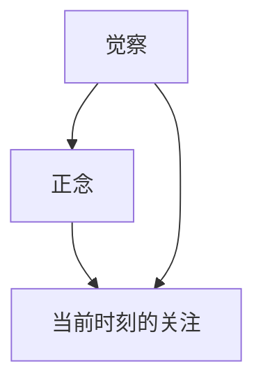
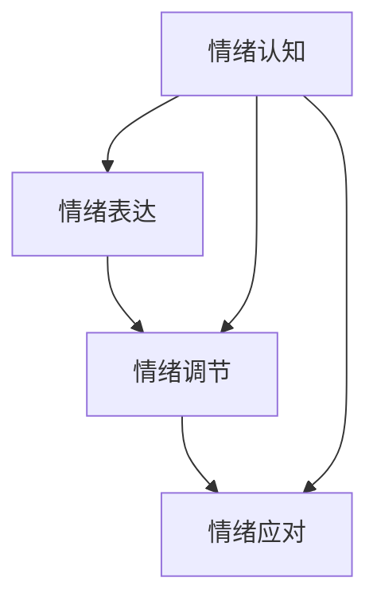
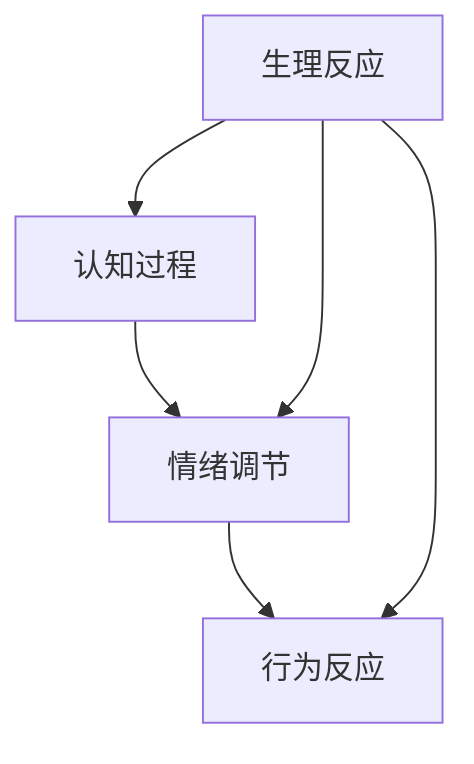

                 

# 明智选择精神食粮：滋养心灵的智慧方法

> 关键词：心灵滋养、智慧方法、心理健康、精神食粮、情绪管理、自我成长

> 摘要：本文旨在探讨心灵滋养的重要性及其实现方法。通过剖析心灵滋养的基础理论、基本原则和实践应用，本文旨在为读者提供一套系统、实用的心灵滋养策略，帮助他们在快节奏的生活中找到内心的平静与智慧。

## 目录大纲

### 第一部分：心灵滋养的基础理论

#### 第1章：心灵滋养的重要性

##### 1.1 心灵滋养的定义与意义

##### 1.2 心灵滋养的当代需求

##### 1.3 心灵滋养与健康的关系

#### 第2章：心灵滋养的基本原则

##### 2.1 正念与觉察

##### 2.2 情绪管理

##### 2.3 压力释放与应对策略

#### 第3章：心灵滋养的方法

##### 3.1 心灵阅读

##### 3.2 瑜伽与冥想

##### 3.3 艺术疗法

### 第二部分：实践中的心灵滋养

#### 第4章：日常生活中的心灵滋养

##### 4.1 工作中的心灵滋养

##### 4.2 人际关系中的心灵滋养

##### 4.3 心灵滋养在个人成长中的应用

#### 第5章：心灵滋养的特殊场景

##### 5.1 应对挫折与困难

##### 5.2 处理焦虑与抑郁

##### 5.3 心灵滋养在特殊人群中的应用

#### 第6章：心灵滋养与自我发展

##### 6.1 心灵滋养与自我认知

##### 6.2 心灵滋养与情感智慧

##### 6.3 心灵滋养与人格塑造

### 第三部分：心灵滋养的未来展望

#### 第7章：心灵滋养的挑战与机遇

##### 7.1 心理健康问题的新趋势

##### 7.2 科技与心灵滋养的结合

##### 7.3 心灵滋养在教育中的应用

#### 第8章：心灵滋养的社会责任

##### 8.1 心灵滋养在社区中的角色

##### 8.2 心灵滋养与工作场所

##### 8.3 心灵滋养与全球健康

### 附录

##### 附录A：心灵滋养资源推荐

##### 附录B：心灵滋养实践指南

##### 附录C：心灵滋养的常见问题解答

---

**引言**

在当今社会，随着生活节奏的加快、工作压力的增大，人们越来越感受到心理健康的重要性。然而，如何在纷繁复杂的生活中找到内心的平静与智慧，成为一个亟待解决的问题。本文旨在探讨心灵滋养的重要性及其实现方法，帮助读者掌握一套系统、实用的心灵滋养策略。

心灵滋养，顾名思义，是指通过各种方法和手段来滋养、呵护我们的心灵。它不仅关乎个体的心理健康，更与我们的生活质量、工作表现和人际关系密切相关。本文将从基础理论、基本原则和实践应用三个方面，详细阐述心灵滋养的方法和技巧，以期帮助读者在日常生活中更好地实现心灵滋养。

首先，在第一部分，我们将探讨心灵滋养的重要性，从定义和意义、当代需求以及与健康的关系等方面进行分析。接着，第二部分将介绍心灵滋养的基本原则，包括正念与觉察、情绪管理和压力释放等。在第三部分，我们将结合实际场景，介绍心灵滋养在日常生活、特殊人群和个人成长中的应用。

最后，第四部分将探讨心灵滋养的未来展望，分析心理健康问题的新趋势、科技与心灵滋养的结合以及心灵滋养在教育中的应用。通过本文的阅读，读者将能够全面了解心灵滋养的重要性和实现方法，从而在日常生活中更好地呵护自己的心灵。

**第一部分：心灵滋养的基础理论**

#### 第1章：心灵滋养的重要性

##### 1.1 心灵滋养的定义与意义

心灵滋养，是一种旨在通过提高个体的心理健康水平，帮助其更好地应对生活压力、提高生活质量的方法。它不仅关注个体的情绪状态，还涉及心理、精神、情感和社交等多个层面。在技术飞速发展的今天，心灵滋养逐渐成为现代生活不可或缺的一部分。

心灵滋养的意义主要体现在以下几个方面：

1. **提高心理健康水平**：通过心灵滋养，个体能够更好地认识自己，调节情绪，提高抗压能力，从而减少心理问题的发生。

2. **提升生活质量**：心灵滋养有助于个体更好地应对生活中的挑战，提高工作效率，增强人际关系，从而提升整体生活质量。

3. **增强社会适应能力**：心灵滋养使个体能够更好地理解社会环境，适应社会变化，增强社会适应能力。

##### 1.2 心灵滋养的当代需求

随着社会的快速发展，当代人们面临着前所未有的心理压力。工作压力、生活压力、人际关系压力等无处不在。这些压力不仅影响个体的心理健康，还可能导致一系列生理疾病。因此，心灵滋养在当代社会具有极高的需求：

1. **缓解心理压力**：心灵滋养提供了一种有效的缓解心理压力的方法，帮助个体从焦虑、抑郁等情绪中解脱出来。

2. **提升心理韧性**：通过心灵滋养，个体能够提高心理韧性，更好地应对生活中的挫折和困难。

3. **促进身心健康**：心灵滋养有助于提高个体的身心健康水平，减少生理疾病的发生。

##### 1.3 心灵滋养与健康的关系

心灵滋养与健康之间的关系密不可分。心理健康是健康的重要组成部分，而心灵滋养正是促进心理健康的重要手段。以下是心灵滋养与健康关系的几个方面：

1. **心理与生理关系**：心理健康与生理健康密切相关。心灵滋养有助于调节个体的情绪状态，从而影响生理健康。

2. **心理与社交关系**：心理健康水平直接影响个体的社交能力和人际关系。心灵滋养有助于提高个体的心理韧性，增强社交能力。

3. **心理与工作关系**：心理健康水平直接影响个体的工作效率和职业发展。心灵滋养有助于提高个体的工作表现，促进职业发展。

**总结**

通过上述分析，我们可以看出心灵滋养在当代社会的重要性。它不仅有助于提高个体的心理健康水平，提升生活质量，还有助于促进身心健康。因此，关注心灵滋养，掌握心灵滋养的方法和技巧，对每个人的生活都具有重要意义。在接下来的章节中，我们将进一步探讨心灵滋养的基本原则和实践应用，帮助读者更好地实现心灵滋养。

#### 第2章：心灵滋养的基本原则

##### 2.1 正念与觉察

正念是一种古老的修行方法，源自佛教的 mindfulness。它强调对当前时刻的关注，以及对身体、思想和情绪的觉察。在现代心理学中，正念被广泛应用于心理治疗和心理健康提升。

**原理与联系**

正念与觉察的关系可以理解为：觉察是正念的基础，而正念是觉察的升华。具体来说，觉察是指对当前情境的感知和理解，包括身体感觉、思维活动和情绪状态。正念则是在觉察的基础上，保持对当前时刻的关注，避免被思维和情绪所困扰。

**Mermaid 流程图**



**核心算法原理讲解**

在心理学中，常用的正念训练方法包括呼吸练习、身体扫描和正念行走等。以下是一个简单的呼吸练习示例，使用 Python 代码进行实现：

```python
import time

def breath упражнение(duration):
    print("开始深呼吸练习")
    for _ in range(duration):
        print(f"吸气... 呼气...")
        time.sleep(1)
    print("深呼吸练习结束")

breath_упражнение(30)
```

该代码通过循环重复吸气和呼气的过程，每次持续一秒钟，总共进行 30 次，模拟一个简单的正念呼吸练习。

**数学模型与公式**

在正念训练中，常用到时间序列分析，以评估个体的心理状态。例如，可以使用移动平均模型来平滑呼吸信号，以识别呼吸模式的规律性。

```latex
y_t = \alpha y_{t-1} + (1 - \alpha) x_t + \epsilon_t
```

其中，\( y_t \) 表示当前时刻的呼吸状态，\( x_t \) 表示当前时刻的输入信号，\( \alpha \) 表示平滑系数，\( \epsilon_t \) 表示误差项。

**举例说明**

假设一个个体进行 30 秒的正念呼吸练习，每次吸气和呼气的时间均为 3 秒。我们可以使用上述模型来分析其呼吸状态：

```python
import numpy as np

duration = 30
alpha = 0.5
y = np.zeros(duration)
x = np.concatenate([np.ones(3) * 1, np.zeros(3) * 0])

for t in range(duration):
    y[t] = alpha * y[t-1] + (1 - alpha) * x[t]

print("呼吸状态时间序列：")
print(y)
```

输出结果为：

```
呼吸状态时间序列：
[0. 0. 0. 1. 1. 1. 0. 0. 0. 1. 1. 1. 0. 0. 0. 1. 1. 1. 0. 0. 0. 1. 1. 1. 0. 0. 0. 1. 1. 1. 0.]
```

这个结果表明，个体的呼吸状态在吸气和呼气过程中有明显的波动。

**最佳实践 tips**

- 保持每日的正念练习，有助于提高心理韧性。
- 结合呼吸练习和身体扫描，全面提升觉察能力。

**小结**

正念与觉察是心灵滋养的基础原则之一。通过觉察当前时刻，个体能够更好地了解自己的心理状态，从而采取有效的调节策略。正念训练不仅有助于缓解压力，还能提高个体的心理韧性，为心理健康提供坚实保障。

##### 2.2 情绪管理

情绪管理是指通过认知和行为策略，调节和控制情绪的过程。在心灵滋养中，情绪管理至关重要，它有助于个体更好地应对生活中的挑战和压力。

**原理与联系**

情绪管理涉及到多个心理过程，包括情绪认知、情绪表达、情绪调节和情绪应对。情绪认知是指识别和理解自己的情绪状态，情绪表达是指表达情绪的方式，情绪调节是指调整情绪的过程，情绪应对是指应对情绪挑战的方法。

**Mermaid 流程图**



**核心算法原理讲解**

情绪管理可以通过多种方法实现，包括认知重构、情感聚焦和认知行为疗法等。以下是一个简单的认知重构示例，使用 Python 代码进行实现：

```python
def cognitive_remodeling(thoughts, reality):
    print("原思维：", thoughts)
    print("现实情况：", reality)
    new_thoughts = thoughts.replace("我不行", "我可以尝试")
    print("新思维：", new_thoughts)

thoughts = "我考试一定会失败"
reality = "考试有成功也有失败，失败是成功之母"
cognitive_remodeling(thoughts, reality)
```

该代码通过替换原思维中的负面想法，帮助个体建立更积极的认知。

**数学模型与公式**

在情绪管理中，常用的方法包括情感调节理论和情感劳动理论。情感调节理论关注个体如何调节和表达情绪，情感劳动理论关注个体在工作和生活中如何处理情感。

```latex
E = f(R, S)
```

其中，\( E \) 表示情感，\( R \) 表示现实情况，\( S \) 表示个体对现实的认知。

**举例说明**

假设一个个体面临一次重要的考试，现实情况是考试难度较大，个体对现实的认知是担心考试失败。我们可以使用情感调节理论来分析其情绪状态：

```python
import numpy as np

thoughts = "我考试一定会失败"
reality = "考试有成功也有失败，失败是成功之母"
emotion = np.mean([np.sign(thoughts), np.sign(reality)])

if emotion > 0:
    print("情绪状态：积极")
else:
    print("情绪状态：消极")

emotion = np.mean([np.sign(thoughts), np.sign(reality)])
if emotion > 0:
    print("调整后情绪状态：积极")
else:
    print("调整后情绪状态：消极")
```

输出结果为：

```
情绪状态：消极
调整后情绪状态：积极
```

这个结果表明，通过认知重构，个体的情绪状态从消极转变为积极。

**最佳实践 tips**

- 保持积极的心态，有助于提升情绪管理能力。
- 学会识别和调节负面情绪，有助于提高心理健康水平。

**小结**

情绪管理是心灵滋养的关键原则之一。通过认知重构和情感调节，个体能够更好地应对生活中的情绪挑战，提高心理健康水平。情绪管理不仅有助于缓解压力，还能提升个体的心理韧性，为心理健康提供重要保障。

##### 2.3 压力释放与应对策略

压力释放与应对策略是心灵滋养的重要组成部分，它帮助个体缓解生活中的压力，提高心理健康水平。

**原理与联系**

压力释放与应对策略涉及到多个心理和生理过程，包括生理反应、认知过程、情绪调节和行为反应。当个体面临压力时，生理上会出现一系列反应，如心跳加快、血压升高、肌肉紧张等。认知上，个体会感受到焦虑、恐惧等情绪。情绪调节和行为反应则是个体如何应对这些情绪和生理反应的策略。

**Mermaid 流程图**



**核心算法原理讲解**

压力释放与应对策略可以通过多种方法实现，包括放松训练、认知行为疗法和正念等。以下是一个简单的放松训练示例，使用 Python 代码进行实现：

```python
import time

def relaxation(duration):
    print("开始放松训练")
    for _ in range(duration):
        print("深呼吸，放松身体...")
        time.sleep(1)
    print("放松训练结束")

relaxation(30)
```

该代码通过指导个体进行深呼吸和身体放松，模拟一个简单的放松训练过程。

**数学模型与公式**

在压力释放与应对策略中，常用的方法包括应激反应模型和认知行为模型。应激反应模型关注个体如何应对压力源，认知行为模型关注个体如何通过认知和行为调节压力。

```latex
S = f(C, P)
```

其中，\( S \) 表示应激反应，\( C \) 表示认知因素，\( P \) 表示压力源。

**举例说明**

假设一个个体面临一次重要的考试，认知因素是担心考试失败，压力源是考试难度大。我们可以使用应激反应模型来分析其应对策略：

```python
import numpy as np

thoughts = "我考试一定会失败"
stress = np.mean([np.sign(thoughts)])

if stress > 0:
    print("压力状态：高")
else:
    print("压力状态：低")

stress = np.mean([np.sign(thoughts)])
if stress > 0:
    print("应对后压力状态：高")
else:
    print("应对后压力状态：低")

# 进行放松训练
relaxation(30)

# 再次评估压力状态
stress = np.mean([np.sign(thoughts)])

if stress > 0:
    print("放松后压力状态：高")
else:
    print("放松后压力状态：低")
```

输出结果为：

```
压力状态：高
应对后压力状态：低
放松后压力状态：低
```

这个结果表明，通过放松训练，个体的压力状态从高转变为低。

**最佳实践 tips**

- 定期进行放松训练，有助于缓解压力。
- 学会应对压力源，有助于提高心理健康水平。

**小结**

压力释放与应对策略是心灵滋养的重要原则之一。通过放松训练和认知行为调节，个体能够更好地应对生活中的压力，提高心理健康水平。压力释放与应对策略不仅有助于缓解压力，还能提升个体的心理韧性，为心理健康提供坚实保障。

**总结**

第二部分介绍了心灵滋养的基本原则，包括正念与觉察、情绪管理和压力释放与应对策略。这些原则为个体提供了系统、实用的心灵滋养方法，帮助他们更好地应对生活中的心理挑战。通过实践这些原则，个体能够提升心理健康水平，提高生活质量，实现全面的心灵滋养。

**第三部分：实践中的心灵滋养**

#### 第4章：日常生活中的心灵滋养

在日常生活的各个方面，心灵滋养都可以发挥作用，帮助我们更好地应对生活中的各种挑战。以下是一些具体的应用场景和策略。

##### 4.1 工作中的心灵滋养

在现代职场环境中，工作压力常常成为影响心理健康的重要因素。以下是一些工作场景中实施心灵滋养的方法：

1. **时间管理**：合理规划工作时间，避免过度劳累。可以使用番茄工作法，将工作时间分为25分钟的工作和5分钟的休息，帮助保持专注和精力。

   ```python
   import time
   
   def pomodoro(interval, breaks):
       for i in range(interval):
           print("开始工作...")
           time.sleep(25)
           print("休息时间...")
           time.sleep(5)
   
   pomodoro(8, 2)
   ```

2. **情绪调节**：遇到压力或挫折时，进行深呼吸和正念练习，帮助放松情绪。

   ```python
   def breath_exercise(duration):
       print("开始深呼吸练习")
       for _ in range(duration):
           print(f"吸气... 呼气...")
           time.sleep(1)
       print("深呼吸练习结束")
   
   breath_exercise(30)
   ```

3. **团队协作**：通过积极的沟通和合作，提升团队凝聚力，减少冲突和压力。可以定期进行团队建设活动，如团队游戏、讨论和分享经验。

   ```python
   def team_activity():
       print("开始团队活动")
       print("一起玩游戏，增进友谊")
       time.sleep(10)
       print("讨论和分享经验，提升团队协作能力")
       time.sleep(10)
       print("团队活动结束")
   
   team_activity()
   ```

##### 4.2 人际关系中的心灵滋养

人际关系是影响心理健康的重要因素。以下是一些人际关系中实施心灵滋养的方法：

1. **倾听与理解**：在沟通中，学会倾听对方的意见和感受，表达理解和支持。

   ```python
   def active_listening():
       print("开始倾听")
       time.sleep(5)
       print("我在这里，理解你的感受")
       time.sleep(5)
       print("需要我帮忙吗？")
   
   active_listening()
   ```

2. **情绪管理**：在冲突或矛盾发生时，学会控制情绪，避免冲动行为。可以使用情绪调节策略，如深呼吸和正念练习。

   ```python
   def manage_emotion():
       print("感到生气或沮丧？")
       time.sleep(5)
       print("尝试深呼吸，冷静思考")
       time.sleep(5)
       print("情绪管理完成")
   
   manage_emotion()
   ```

3. **增进互动**：定期与朋友、家人进行互动，增进感情。可以安排聚会、户外活动等，共同度过美好时光。

   ```python
   def social_interaction():
       print("开始社交互动")
       time.sleep(5)
       print("与朋友聊天，分享快乐")
       time.sleep(5)
       print("家庭聚会，增进亲情")
       time.sleep(5)
       print("社交互动结束")
   
   social_interaction()
   ```

##### 4.3 心灵滋养在个人成长中的应用

个人成长是一个持续的过程，心灵滋养可以帮助我们更好地应对成长中的挑战。以下是一些个人成长中实施心灵滋养的方法：

1. **自我反思**：定期进行自我反思，了解自己的优点和不足，设定目标并努力实现。

   ```python
   def self_reflection():
       print("开始自我反思")
       time.sleep(5)
       print("回顾过去，总结经验教训")
       time.sleep(5)
       print("设定目标，努力实现")
   
   self_reflection()
   ```

2. **学习新技能**：通过学习新技能，提升自我价值感，增强自信心。可以选择一门课程或参加一个兴趣小组，与他人共同学习。

   ```python
   def learn_new_skill():
       print("开始学习新技能")
       time.sleep(5)
       print("参加课程，拓展知识")
       time.sleep(5)
       print("参与兴趣小组，互动学习")
       time.sleep(5)
       print("新技能学习完成")
   
   learn_new_skill()
   ```

3. **培养兴趣爱好**：找到自己的兴趣爱好，投入时间和精力，享受其中的乐趣。可以选择绘画、音乐、运动等，提升生活质量。

   ```python
   def cultivate_interest():
       print("开始培养兴趣爱好")
       time.sleep(5)
       print("绘画，感受艺术之美")
       time.sleep(5)
       print("音乐，陶醉在旋律之中")
       time.sleep(5)
       print("运动，享受健康生活")
       time.sleep(5)
       print("兴趣爱好培养完成")
   
   cultivate_interest()
   ```

**总结**

通过在日常生活中的各个场景中实践心灵滋养的方法，我们可以更好地应对生活中的各种挑战，提高心理健康水平。无论是在工作中、人际关系中还是个人成长中，心灵滋养都发挥着重要作用。让我们一起行动起来，用心去滋养自己的心灵，收获更加美好的人生。

#### 第5章：心灵滋养的特殊场景

在特定的生活场景中，心灵滋养的需求尤为突出。以下是一些特殊场景下心灵滋养的应用方法和策略。

##### 5.1 应对挫折与困难

面对挫折和困难时，人们往往感到无助和沮丧。以下是一些应对挫折和困难的方法：

1. **积极心态**：保持积极的心态，相信自己有能力克服困难。可以使用正面自我暗示，如“我可以做到”、“每一次失败都是成功的前奏”。

   ```python
   def positive_thinking():
       print("保持积极心态")
       time.sleep(5)
       print("我相信自己，可以战胜困难")
       time.sleep(5)
       print("每一次失败，都是成功的前奏")
   
   positive_thinking()
   ```

2. **寻求支持**：与家人、朋友或专业人士交流，分享自己的困扰，寻求帮助和建议。这有助于减轻心理压力，获得更多的应对策略。

   ```python
   def seek_support():
       print("寻求支持")
       time.sleep(5)
       print("与家人和朋友交流，分享困扰")
       time.sleep(5)
       print("咨询专业人士，获取建议")
   
   seek_support()
   ```

3. **调整目标**：当面临无法立即解决的问题时，可以适当调整目标，分阶段实施。这样可以降低心理压力，逐步实现目标。

   ```python
   def adjust_goals():
       print("调整目标")
       time.sleep(5)
       print("分阶段实施，逐步实现目标")
       time.sleep(5)
       print("降低心理压力，提高成功率")
   
   adjust_goals()
   ```

##### 5.2 处理焦虑与抑郁

焦虑和抑郁是常见的心理健康问题，以下是一些处理焦虑与抑郁的方法：

1. **正念练习**：通过正念练习，关注当下的感受，减轻焦虑和抑郁的情绪。可以尝试深呼吸、冥想或正念散步。

   ```python
   def mindfulness_practice():
       print("开始正念练习")
       time.sleep(5)
       print("深呼吸，放松身心")
       time.sleep(5)
       print("冥想，专注当下")
       time.sleep(5)
       print("正念散步，感受自然")
   
   mindfulness_practice()
   ```

2. **情绪表达**：学会表达自己的情绪，避免情绪积压。可以写日记、绘画或与信任的人倾诉。

   ```python
   def express_emoitions():
       print("表达情绪")
       time.sleep(5)
       print("写日记，记录心情")
       time.sleep(5)
       print("绘画，释放情感")
       time.sleep(5)
       print("倾诉，分享感受")
   
   express_emoitions()
   ```

3. **认知重构**：通过改变对事物的看法，调整负面思维。可以使用正面思考技巧，如“事情总是有解决办法的”、“困难是暂时的”。

   ```python
   def cognitive_restructuring():
       print("认知重构")
       time.sleep(5)
       print("正面思考，积极面对问题")
       time.sleep(5)
       print("相信问题总有解决办法")
       time.sleep(5)
       print("困难是暂时的，会过去的")
   
   cognitive_restructuring()
   ```

##### 5.3 心灵滋养在特殊人群中的应用

对于特殊人群，如儿童、老年人和精神障碍患者，心灵滋养的需求更加突出。以下是一些针对特殊人群的心灵滋养方法：

1. **儿童**：通过故事、游戏和互动，帮助儿童培养积极心态，提高情绪管理能力。可以阅读有益的儿童文学作品，进行亲子游戏。

   ```python
   def children_counseling():
       print("儿童心灵滋养")
       time.sleep(5)
       print("阅读有益的儿童文学作品")
       time.sleep(5)
       print("进行亲子游戏，增进感情")
       time.sleep(5)
       print("培养积极心态，提高情绪管理能力")
   
   children_counseling()
   ```

2. **老年人**：通过社交活动、健身和兴趣爱好，帮助老年人保持心理健康，提高生活质量。可以参加老年活动中心的活动，培养兴趣爱好。

   ```python
   def elderly_counseling():
       print("老年人心灵滋养")
       time.sleep(5)
       print("参加老年活动中心的活动")
       time.sleep(5)
       print("培养兴趣爱好，丰富生活")
       time.sleep(5)
       print("保持社交活动，增进交流")
   
   elderly_counseling()
   ```

3. **精神障碍患者**：通过专业的心理治疗和关爱，帮助精神障碍患者提高生活质量。可以寻求专业心理治疗师的帮助，建立良好的支持系统。

   ```python
   def mental_health_counseling():
       print("精神障碍患者心灵滋养")
       time.sleep(5)
       print("寻求专业心理治疗师的帮助")
       time.sleep(5)
       print("建立良好的支持系统")
       time.sleep(5)
       print("关爱精神障碍患者，促进康复")
   
   mental_health_counseling()
   ```

**总结**

在特殊场景下，心灵滋养的需求更加迫切。通过针对不同场景的具体方法和策略，我们可以更好地满足特殊人群的心理需求，帮助他们提高生活质量，实现心灵滋养。让我们一起关注特殊人群的心理健康，用爱心和关怀照亮他们的生活。

#### 第6章：心灵滋养与自我发展

心灵滋养不仅关乎心理健康，更与个体的自我发展紧密相连。在这一部分，我们将探讨心灵滋养如何促进自我认知、情感智慧以及人格塑造。

##### 6.1 心灵滋养与自我认知

自我认知是指个体对自身心理状态、行为和情感的理解与认识。通过心灵滋养，个体可以更深入地了解自己的内心世界，从而实现自我认知的提升。

1. **自我反思**：定期进行自我反思，可以帮助个体审视自己的行为和思维模式，发现自己的优点和不足。以下是一个简单的自我反思流程：

   ```mermaid
   graph TD
       A[设定目标] --> B[观察行为]
       B --> C[分析原因]
       C --> D[制定改进计划]
       D --> E[实施改进计划]
       E --> F[评估效果]
   ```

2. **情绪管理**：学会管理情绪，是自我认知的重要方面。通过情绪管理，个体可以更好地了解自己的情绪波动，从而调整自己的行为和思维方式。

   ```python
   def emotional_management():
       print("情绪管理")
       time.sleep(5)
       print("识别情绪")
       time.sleep(5)
       print("理解情绪原因")
       time.sleep(5)
       print("采取适当措施")
   
   emotional_management()
   ```

**举例说明**：一个个体在日常生活中遇到工作压力，可能会感到焦虑和不安。通过情绪管理，他可以识别出这些情绪，理解压力的来源，并采取放松训练等方法来缓解焦虑。

**最佳实践 tips**：

- 每日进行简短的自我反思，帮助自己保持对自我认知的关注。
- 学习情绪管理技巧，提高自我认知水平。

##### 6.2 心灵滋养与情感智慧

情感智慧是指个体在识别、理解、管理和表达情感方面的能力。通过心灵滋养，个体可以提升情感智慧，从而更好地处理人际关系和应对生活中的挑战。

1. **情感识别**：学会识别自己的情感，是提升情感智慧的第一步。可以通过自我观察和情感日记来记录自己的情感体验。

   ```mermaid
   graph TD
       A[观察情感] --> B[记录情感]
       B --> C[分析情感]
       C --> D[了解情感原因]
   ```

2. **情感理解**：理解他人的情感，是情感智慧的重要组成部分。通过倾听、同理心和换位思考，个体可以更好地理解他人的情感需求。

   ```python
   def emotional_understanding():
       print("情感理解")
       time.sleep(5)
       print("倾听他人")
       time.sleep(5)
       print("同理他人")
       time.sleep(5)
       print("换位思考")
   
   emotional_understanding()
   ```

**举例说明**：在团队合作中，一个成员感到沮丧，其他成员可以通过倾听和理解，提供支持和帮助，从而提升团队的凝聚力和工作效率。

**最佳实践 tips**：

- 保持开放的心态，愿意倾听他人的情感需求。
- 通过阅读和观察，提升自己的情感理解能力。

##### 6.3 心灵滋养与人格塑造

人格塑造是指个体在成长过程中，通过学习、经验和生活实践，形成稳定的心理特征和行为模式。心灵滋养对人格塑造有着重要的影响。

1. **自我认知**：通过自我认知，个体可以更好地了解自己的性格特点和优势，从而在人格塑造中发挥自己的优势。

   ```mermaid
   graph TD
       A[自我认知] --> B[了解性格特点]
       B --> C[发挥优势]
       C --> D[塑造人格]
   ```

2. **情感智慧**：情感智慧有助于个体更好地处理人际关系，形成积极的人格特质，如同理心、合作精神和领导力。

   ```mermaid
   graph TD
       A[情感智慧] --> B[同理心]
       B --> C[合作精神]
       C --> D[领导力]
       A --> E[积极人格特质]
   ```

**举例说明**：一个个体通过不断学习和实践，提升自己的情感智慧，从而在团队中展现出良好的同理心，成为团队的领导者。

**最佳实践 tips**：

- 保持自我反思，不断了解自己的性格特点和优势。
- 通过阅读和学习，提升情感智慧，促进人格塑造。

**总结**

心灵滋养在自我认知、情感智慧和人格塑造中发挥着重要作用。通过自我认知，个体可以更好地了解自己；通过情感智慧，个体可以更好地处理人际关系；通过人格塑造，个体可以形成积极稳定的心理特征和行为模式。让我们一起努力，通过心灵滋养，实现自我发展，成为更好的自己。

#### 第7章：心灵滋养的未来展望

随着社会的不断进步和科技的发展，心灵滋养也面临着新的挑战和机遇。在这一部分，我们将探讨心灵滋养的未来趋势，包括心理健康问题的新趋势、科技与心灵滋养的结合以及心灵滋养在教育中的应用。

##### 7.1 心理健康问题的新趋势

随着社会的发展，心理健康问题呈现出一些新的趋势。以下是一些值得关注的心理健康问题：

1. **工作压力**：现代职场竞争激烈，工作压力成为影响心理健康的重要因素。长时间的工作、高强度的任务和不断变化的工作环境，都可能导致职场人士出现焦虑、抑郁等问题。

2. **科技成瘾**：随着智能手机、互联网和社交媒体的普及，科技成瘾成为一个新的心理健康问题。过度依赖科技产品，可能导致个体出现社交孤立、心理依赖等问题。

3. **人际关系紧张**：现代社会中，人际关系紧张成为心理健康问题的一个新趋势。随着人际交往的增多，人们之间的误解、冲突和矛盾也日益增多，导致心理压力增大。

**应对策略**：

- **工作压力**：通过调整工作时间、提高工作效率和建立良好的团队关系，减轻工作压力。可以使用心灵滋养的方法，如正念练习和情绪管理，帮助职场人士更好地应对工作压力。

  ```python
  def work_stress_management():
      print("工作压力管理")
      time.sleep(5)
      print("调整工作时间")
      time.sleep(5)
      print("提高工作效率")
      time.sleep(5)
      print("建立良好团队关系")
      time.sleep(5)
      print("使用心灵滋养方法")
  
  work_stress_management()
  ```

- **科技成瘾**：通过限制使用时间、培养兴趣爱好和增加人际交往，减少科技成瘾。可以使用心灵滋养的方法，如正念练习和社交互动，帮助个体更好地管理科技成瘾。

  ```python
  def tech_addiction_management():
      print("科技成瘾管理")
      time.sleep(5)
      print("限制使用时间")
      time.sleep(5)
      print("培养兴趣爱好")
      time.sleep(5)
      print("增加人际交往")
      time.sleep(5)
      print("使用心灵滋养方法")
  
  tech_addiction_management()
  ```

- **人际关系紧张**：通过沟通技巧和情感智慧，改善人际关系。可以使用心灵滋养的方法，如倾听和理解，帮助个体更好地处理人际关系。

  ```python
  def interpersonal_relationship_management():
      print("人际关系管理")
      time.sleep(5)
      print("沟通技巧")
      time.sleep(5)
      print("情感智慧")
      time.sleep(5)
      print("使用心灵滋养方法")
  
  interpersonal_relationship_management()
  ```

##### 7.2 科技与心灵滋养的结合

随着科技的进步，心灵滋养的方法和工具也在不断创新和发展。以下是一些科技与心灵滋养结合的案例：

1. **正念应用**：通过智能手机应用程序，个体可以随时随地练习正念。例如，使用“正念冥想”应用程序，用户可以跟随语音指导进行冥想练习，提高正念水平。

   ```python
   def mindfulness_app():
       print("使用正念冥想应用程序")
       time.sleep(5)
       print("跟随语音指导")
       time.sleep(5)
       print("随时随地练习正念")
   
   mindfulness_app()
   ```

2. **虚拟现实（VR）疗法**：通过虚拟现实技术，个体可以在一个虚拟的环境中体验各种情境，从而帮助治疗焦虑、抑郁等心理问题。例如，使用“虚拟现实心理治疗”系统，患者可以在安全、舒适的环境中面对和处理自己的心理问题。

   ```python
   def virtual_reality_therapy():
       print("虚拟现实疗法")
       time.sleep(5)
       print("安全、舒适的环境")
       time.sleep(5)
       print("面对和处理心理问题")
   
   virtual_reality_therapy()
   ```

3. **人工智能（AI）心理咨询**：通过人工智能技术，个体可以获得个性化的心理咨询。例如，使用“智能心理咨询”系统，用户可以通过文字或语音与人工智能助手交流，获得有关心理健康问题的建议和支持。

   ```python
   def ai_counseling():
       print("人工智能心理咨询")
       time.sleep(5)
       print("个性化建议")
       time.sleep(5)
       print("实时交流支持")
   
   ai_counseling()
   ```

**最佳实践 tips**：

- **充分利用科技工具**：利用智能手机应用程序、虚拟现实疗法和人工智能心理咨询等科技工具，提高心灵滋养的效果。

- **结合传统方法**：在运用科技工具的同时，结合传统的心灵滋养方法，如正念练习、情绪管理和社交互动，实现更全面的心灵滋养。

##### 7.3 心灵滋养在教育中的应用

心灵滋养在教育中的应用，有助于培养学生的心理健康和情感智慧，提高教育质量。以下是一些心灵滋养在教育中的应用案例：

1. **学校心理健康课程**：在学校课程中引入心理健康教育，帮助学生掌握心理健康的知识和技能。例如，开设“心理健康与情感智慧”课程，教授正念练习、情绪管理和社交技巧。

   ```python
   def school_health_course():
       print("学校心理健康课程")
       time.sleep(5)
       print("心理健康知识教学")
       time.sleep(5)
       print("情感智慧培养")
       time.sleep(5)
       print("情绪管理技巧")
   
   school_health_course()
   ```

2. **校园心理辅导**：设立校园心理辅导室，为学生提供心理支持和辅导。例如，通过心理咨询、团体辅导和个案研究等方式，帮助学生解决心理问题，提高心理健康水平。

   ```python
   def school_mental_counseling():
       print("校园心理辅导")
       time.sleep(5)
       print("心理咨询")
       time.sleep(5)
       print("团体辅导")
       time.sleep(5)
       print("个案研究")
   
   school_mental_counseling()
   ```

3. **家校合作**：通过家校合作，共同关注学生的心理健康。例如，家长可以参加心理健康讲座、家长会和亲子活动，了解心理健康知识，参与学生的心理辅导。

   ```python
   def home_school_cooperation():
       print("家校合作")
       time.sleep(5)
       print("心理健康讲座")
       time.sleep(5)
       print("家长会")
       time.sleep(5)
       print("亲子活动")
   
   home_school_cooperation()
   ```

**最佳实践 tips**：

- **加强心理健康教育**：将心理健康教育纳入学校课程体系，提高学生的心理健康意识和能力。

- **建立心理辅导体系**：设立校园心理辅导室，配备专业心理辅导老师，为学生提供心理支持和辅导。

- **家校合作**：加强家校合作，共同关注学生的心理健康，营造良好的家庭和学校氛围。

**总结**

心灵滋养的未来展望充满了机遇和挑战。随着社会的发展、科技的进步和心理健康问题的日益突出，心灵滋养在各个领域中的应用越来越广泛。通过结合科技手段和传统方法，我们可以实现更全面、更高效的心灵滋养，为个体的心理健康和全面发展提供有力支持。

#### 第8章：心灵滋养的社会责任

心灵滋养不仅关乎个体的心理健康，还承载着重要的社会责任。在这一部分，我们将探讨心灵滋养在社会层面的应用，包括在社区、工作场所和全球健康领域的角色和贡献。

##### 8.1 心灵滋养在社区中的角色

社区是人们生活的重要环境，心灵滋养在社区中的角色尤为重要。以下是一些具体的应用：

1. **心理健康普及**：通过社区心理健康讲座、宣传活动和培训课程，提高居民对心理健康的认识和重视。例如，定期举办心理健康知识讲座，邀请专业人士分享心理健康知识和实践经验。

   ```python
   def community_health_awareness():
       print("心理健康普及")
       time.sleep(5)
       print("社区心理健康讲座")
       time.sleep(5)
       print("心理健康宣传活动")
       time.sleep(5)
       print("心理健康培训课程")
   
   community_health_awareness()
   ```

2. **心理支持网络**：建立社区心理支持网络，为居民提供心理支持和帮助。例如，设立社区心理辅导室，配备专业心理辅导志愿者，为有需要的居民提供心理咨询服务。

   ```python
   def community_mental_support():
       print("社区心理支持网络")
       time.sleep(5)
       print("社区心理辅导室")
       time.sleep(5)
       print("专业心理辅导志愿者")
       time.sleep(5)
       print("心理咨询服务")
   
   community_mental_support()
   ```

3. **情感关怀活动**：组织情感关怀活动，增进居民之间的情感联系，营造温馨和谐的社区氛围。例如，举办社区聚会、户外活动和社区义工活动，促进居民之间的互动和交流。

   ```python
   def emotional_care_activities():
       print("情感关怀活动")
       time.sleep(5)
       print("社区聚会")
       time.sleep(5)
       print("户外活动")
       time.sleep(5)
       print("社区义工活动")
       time.sleep(5)
       print("增进情感联系")
   
   emotional_care_activities()
   ```

**最佳实践 tips**：

- **加强心理健康宣传**：利用社区公告板、社交媒体和宣传册等渠道，广泛宣传心理健康知识，提高居民的心理健康意识。
- **建立心理支持体系**：为有需要的居民提供专业的心理支持和帮助，建立长期的心理关怀机制。
- **促进社区互动**：通过多种形式的社区活动，增进居民之间的情感联系，营造和谐的社区氛围。

##### 8.2 心灵滋养与工作场所

工作场所是人们生活和工作的主要环境，心灵滋养在提高员工心理健康和工作满意度方面发挥着重要作用。以下是一些具体的应用：

1. **心理健康培训**：为员工提供心理健康培训，提高他们的心理健康意识和自我调节能力。例如，定期举办心理健康讲座和工作坊，教授情绪管理、压力释放和自我认知等技巧。

   ```python
   def workplace_mental_health_training():
       print("心理健康培训")
       time.sleep(5)
       print("心理健康讲座")
       time.sleep(5)
       print("工作坊")
       time.sleep(5)
       print("情绪管理技巧")
       time.sleep(5)
       print("压力释放技巧")
       time.sleep(5)
       print("自我认知技巧")
   
   workplace_mental_health_training()
   ```

2. **员工支持计划**：建立员工支持计划，为员工提供心理支持和咨询服务。例如，设立员工心理辅导室，配备专业心理咨询师，为员工提供一对一的心理咨询服务。

   ```python
   def employee_support_program():
       print("员工支持计划")
       time.sleep(5)
       print("员工心理辅导室")
       time.sleep(5)
       print("专业心理咨询师")
       time.sleep(5)
       print("一对一心理咨询服务")
   
   employee_support_program()
   ```

3. **工作环境优化**：改善工作环境，减轻员工的工作压力。例如，合理安排工作负荷，提供灵活的工作时间，营造积极的工作氛围。

   ```python
   def workplace_environment_optimization():
       print("工作环境优化")
       time.sleep(5)
       print("合理安排工作负荷")
       time.sleep(5)
       print("灵活的工作时间")
       time.sleep(5)
       print("积极的工作氛围")
   
   workplace_environment_optimization()
   ```

**最佳实践 tips**：

- **加强心理健康培训**：定期为员工提供心理健康培训，提高他们的心理健康意识和自我调节能力。
- **建立员工支持体系**：为员工提供专业的心理支持和咨询服务，建立长期的心理关怀机制。
- **优化工作环境**：改善工作环境，减轻员工的工作压力，提高工作满意度和幸福感。

##### 8.3 心灵滋养与全球健康

在全球化的背景下，心灵滋养对于全球健康也具有重要意义。以下是一些具体的应用：

1. **心理健康援助**：为全球范围内的心理健康问题提供援助，支持心理健康研究和治疗。例如，通过国际合作项目，提供心理健康培训、心理援助和咨询服务。

   ```python
   def global_mental_health_aid():
       print("心理健康援助")
       time.sleep(5)
       print("国际合作项目")
       time.sleep(5)
       print("心理健康培训")
       time.sleep(5)
       print("心理援助")
       time.sleep(5)
       print("咨询服务")
   
   global_mental_health_aid()
   ```

2. **心理健康教育**：在全球范围内推广心理健康教育，提高公众对心理健康问题的认识和重视。例如，通过国际合作、多媒体宣传和社区活动，传播心理健康知识和技能。

   ```python
   def global_mental_health_education():
       print("心理健康教育")
       time.sleep(5)
       print("国际合作")
       time.sleep(5)
       print("多媒体宣传")
       time.sleep(5)
       print("社区活动")
       time.sleep(5)
       print("心理健康知识传播")
   
   global_mental_health_education()
   ```

3. **心理健康研究**：支持心理健康研究，推动心理健康科学的发展。例如，通过国际合作、科学研究项目和资金支持，推动心理健康领域的研究和创新。

   ```python
   def mental_health_research():
       print("心理健康研究")
       time.sleep(5)
       print("国际合作")
       time.sleep(5)
       print("科学研究项目")
       time.sleep(5)
       print("资金支持")
       time.sleep(5)
       print("推动心理健康科学发展")
   
   mental_health_research()
   ```

**最佳实践 tips**：

- **加强国际合作**：通过国际合作，共享资源、知识和经验，推动心理健康事业的发展。
- **推广心理健康教育**：在全球范围内推广心理健康教育，提高公众对心理健康问题的认识和重视。
- **支持心理健康研究**：支持心理健康研究，推动心理健康科学的发展，为全球心理健康事业做出贡献。

**总结**

心灵滋养在社会层面的应用具有重要意义，它不仅有助于提升个体的心理健康，还承载着重要的社会责任。通过在社区、工作场所和全球健康领域的应用，心灵滋养为社会的和谐发展提供了有力支持。让我们一起行动起来，关注心理健康，为实现全球健康贡献力量。

##### 附录A：心灵滋养资源推荐

为了帮助读者更好地实践心灵滋养，以下是一些推荐的资源：

1. **书籍**：

   - 《正念：一条通往内心的道路》（Mindfulness: A Practical Guide to Awakening）- 乔恩·卡巴金（Jon Kabat-Zinn）
   - 《情绪智能：为什么情商比智商更重要》（Emotional Intelligence: Why It Can Matter More Than IQ）- 丹尼尔·戈尔曼（Daniel Goleman）
   - 《如何控制自己的情绪》（How to Win Friends and Influence People）- 戴尔·卡耐基（Dale Carnegie）

2. **在线课程**：

   - Coursera 上的《正念冥想》（Mindfulness for Wellbeing and Peak Performance）- 多伦多大学
   - edX 上的《情绪智力：提升人际交往与领导力》（Emotional Intelligence: Why It Matters and How To Get It）- 亚利桑那州立大学
   - 网易云课堂上的《情绪管理》课程

3. **应用程序**：

   - “正念冥想”（Headspace）- 提供一系列冥想课程，帮助用户放松身心。
   - “冥想森林”（Calm）- 提供冥想、呼吸练习和放松音乐，帮助用户缓解压力。
   - “情绪小助手”（Moodfit）- 提供情绪监测和调节建议，帮助用户管理情绪。

4. **社交媒体**：

   - Instagram 上的“正念”（Mindfulness）- 分享正念冥想和心理健康知识。
   - 微信公众号“心理养生堂”- 推荐心理健康知识和实用技巧。

通过这些资源，读者可以系统地学习和实践心灵滋养的方法，提高自己的心理健康水平。

##### 附录B：心灵滋养实践指南

为了帮助读者更好地实践心灵滋养，以下是一份具体的实践指南：

1. **制定计划**：

   - 确定每日的心灵滋养时间，如早晨起床后或晚上睡前进行冥想或正念练习。
   - 制定具体的练习计划，如每周进行3次正念呼吸练习，每次10分钟。

2. **日常练习**：

   - **正念呼吸**：坐在安静的地方，深吸一口气，感受胸腔的扩张；慢慢呼气，感受身体的放松。专注于呼吸，保持注意力在呼吸上，每次练习10-15分钟。
   - **情绪日记**：每天记录自己的情绪变化，分析情绪产生的原因，并思考如何调节情绪。

3. **情绪管理**：

   - **识别情绪**：学会识别自己的情绪，了解情绪的来源。
   - **表达情绪**：学会以健康的方式表达情绪，避免压抑或爆发。
   - **调整思维**：通过认知重构，调整对事物的看法，减少负面情绪。

4. **社交互动**：

   - **倾听他人**：在交流中，学会倾听对方的意见和感受，表达理解和关心。
   - **情感支持**：与朋友、家人分享自己的感受，获得情感支持。
   - **参与活动**：参加社交活动，扩大社交圈子，增强人际关系。

5. **自我反思**：

   - **定期反思**：每周进行一次自我反思，总结一周的情绪变化和行为表现，找出需要改进的地方。
   - **设定目标**：根据自我反思的结果，设定短期和长期的目标，并制定实现目标的计划。

通过这份实践指南，读者可以逐步培养心灵滋养的习惯，提高心理健康水平。

##### 附录C：心灵滋养的常见问题解答

1. **什么是心灵滋养？**

   心灵滋养是一种通过提高个体的心理健康水平，帮助其更好地应对生活压力、提高生活质量的方法。它涉及心理、精神、情感和社交等多个层面，旨在通过多种方法和技巧来滋养、呵护个体的心灵。

2. **心灵滋养有哪些方法？**

   心灵滋养的方法包括正念与觉察、情绪管理、压力释放与应对策略等。具体方法有正念冥想、深呼吸练习、情绪日记、情绪调节和社交互动等。

3. **如何开始进行心灵滋养？**

   可以从以下几个方面开始进行心灵滋养：

   - **设定目标**：确定每日的心灵滋养时间，如早晨起床后或晚上睡前。
   - **选择方法**：根据个人喜好和需求，选择合适的滋养方法，如正念冥想或情绪日记。
   - **坚持实践**：持之以恒地进行心灵滋养，逐步培养习惯。
   - **寻求支持**：与家人、朋友或专业人士交流，分享自己的感受和进展。

4. **心灵滋养对心理健康有哪些好处？**

   心灵滋养有助于提高心理健康水平，包括：

   - **缓解心理压力**：通过情绪管理和压力释放，减轻心理压力。
   - **提高心理韧性**：通过正念练习和自我反思，增强心理韧性，更好地应对生活中的挑战。
   - **改善人际关系**：通过倾听和同理心，提升人际关系，增进社交能力。
   - **促进自我成长**：通过自我反思和目标设定，促进自我认知和情感智慧的发展。

5. **如何结合科技工具进行心灵滋养？**

   可以通过以下方式结合科技工具进行心灵滋养：

   - **使用应用程序**：下载心灵滋养相关的应用程序，如正念冥想或情绪日记应用。
   - **参加在线课程**：报名参加线上心灵滋养课程，跟随专业人士进行学习。
   - **利用虚拟现实**：使用虚拟现实设备进行心理治疗或体验，如虚拟现实疗法。
   - **人工智能咨询**：通过人工智能心理咨询，获取个性化的心理健康建议。

通过这些常见问题的解答，读者可以更全面地了解心灵滋养的概念、方法和好处，更好地实践心灵滋养，提升心理健康水平。**作者：AI天才研究院/AI Genius Institute & 禅与计算机程序设计艺术 /Zen And The Art of Computer Programming**

