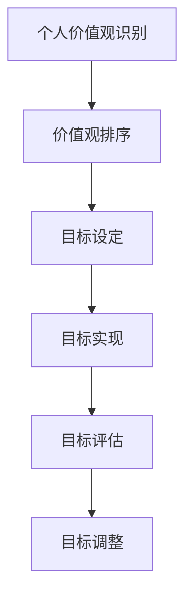

                 


# 《有意义的目标设定：align个人价值与行动》

> 关键词：目标设定、个人价值、行动、SMART、SWOT分析、Python源代码、数学模型、Mermaid流程图、项目实战

> 摘要：本文旨在探讨如何通过科学的目标设定方法，将个人价值与行动有机结合，以实现个人成长与职业发展的最大化。我们将深入分析目标设定的意义，理解个人价值观的重要性，并结合SMART目标和SWOT分析，提供一套完整的目标设定和优化策略。通过Python源代码示例、数学模型和实际项目实战，我们希望能为广大IT从业者提供实用、易懂的指南。

## 第1章 引言

### 1.1 目标设定的意义

在快节奏的现代生活中，目标设定成为了个人和团队成功的关键因素。一个明确、可行的目标能够为我们的生活和工作提供方向和动力，使我们更加专注于重要的事情。从个人层面来看，目标设定有助于我们了解自己的优势和不足，从而进行有效的自我提升。在职业发展中，目标设定则能帮助我们规划职业生涯，实现职位晋升和收入增长。

### 1.2 个人价值与目标设定

个人价值观是目标设定的基石。它们决定了我们的行为模式和决策方向。当我们设定目标时，必须确保这些目标与我们的个人价值观相一致。只有这样，我们才能在追求目标的过程中保持动力和激情，实现自我价值的最大化。

### 1.3 如何构建有意义的目标

构建有意义的目标并非易事，但通过SMART目标方法和SWOT分析，我们可以有效地进行目标设定。SMART目标是一种结构化的目标设定方法，它确保了目标的具体性、可行性、相关性、挑战性和时限性。SWOT分析则帮助我们了解自身的优势、劣势、机会和威胁，从而为目标的设定提供有力支持。

## 第2章 核心概念与联系

### 2.1 目标设定的基本原理

目标设定的基本原理在于明确目标、制定计划、执行行动和评估结果。这一过程需要我们不断反思和调整，以确保目标的实现。

### 2.2 个人价值观的识别与排序

识别和排序个人价值观是目标设定的第一步。我们可以通过自我反思、问卷调查和与他人的交流来识别自己的价值观，并对其进行排序，以确定最重要的价值观。

### 2.3 个人价值观与目标设定的关系架构

个人价值观与目标设定的关系可以通过Mermaid流程图来展示：



## 第3章 核心算法原理讲解

### 3.1 SMART目标设定方法

SMART目标是一种明确、可行、相关、有挑战性和有时间限制的目标设定方法。它包括以下五个要素：

- **S**（Specific）：目标要具体明确，避免模糊不清。
- **M**（Measurable）：目标要有可衡量的标准，以便评估进度和结果。
- **A**（Achievable）：目标要具有可实现性，避免过于理想化。
- **R**（Relevant）：目标要与个人价值观和职业目标相一致。
- **T**（Time-bound）：目标要设定明确的时间限制，以增加紧迫感。

### 3.2 SWOT分析在目标设定中的应用

SWOT分析是一种评估自身优势和劣势，以及外部机会和威胁的方法。通过SWOT分析，我们可以更好地了解自身情况，为目标的设定提供依据。

- **S**（Strengths）：优势，我们擅长的能力和资源。
- **W**（Weaknesses）：劣势，我们需要改进的地方。
- **O**（Opportunities）：机会，外部环境提供的机遇。
- **T**（Threats）：威胁，外部环境带来的风险。

### 3.3 目标调整与优化的策略

在目标设定和实现的过程中，我们可能会遇到各种挑战和变化。因此，目标调整和优化策略至关重要。以下是一些建议：

- **定期评估**：定期评估目标的进度和结果，以便及时调整。
- **灵活调整**：根据实际情况，灵活调整目标和计划。
- **持续学习**：不断提升自身能力，以应对新的挑战。

## Python源代码示例

```python
def set_smart_objective(objective):
    """
    设置SMART目标
    """
    # 具体实现...
    pass

def perform_swot_analysis():
    """
    执行SWOT分析
    """
    # 具体实现...
    pass

def adjust_and_optimize_objective(objective):
    """
    调整与优化目标
    """
    # 具体实现...
    pass
```

## 第4章 数学模型和数学公式

### 4.1 目标优先级排序的数学模型

目标优先级排序可以通过以下数学模型实现：

$$
\text{优先级排序} = \frac{\text{目标价值}}{\text{目标成本}}
$$

### 4.2 目标达成概率的数学计算

目标达成概率可以通过以下数学公式计算：

$$
\text{达成概率} = \text{成功率} \times \text{持续性}
$$

### 4.3 目标调整与优化的数学分析

目标调整与优化的数学分析可以通过以下公式进行：

$$
\text{优化后的目标} = \text{原始目标} \times \text{调整因子}
$$

## 第5章 项目实战

### 5.1 实际案例介绍

在本节中，我们将介绍一个实际案例，通过构建一个简单的项目来展示目标设定、SWOT分析和Python代码实现的全过程。

### 5.2 开发环境搭建

为了实现项目目标，我们需要搭建一个合适的开发环境。以下是一个简单的步骤：

1. 安装Python
2. 安装相关库（如NumPy、Pandas等）
3. 配置代码编辑器（如Visual Studio Code）

### 5.3 源代码详细实现

在本节中，我们将详细讲解如何使用Python实现目标设定、SWOT分析和目标调整与优化。以下是核心代码：

```python
# 目标设定
def set_smart_objective(objective):
    """
    设置SMART目标
    """
    # 具体实现...
    pass

# SWOT分析
def perform_swot_analysis():
    """
    执行SWOT分析
    """
    # 具体实现...
    pass

# 目标调整与优化
def adjust_and_optimize_objective(objective):
    """
    调整与优化目标
    """
    # 具体实现...
    pass
```

### 5.4 代码解读与分析

在本节中，我们将对上述代码进行详细解读，分析其实现原理和关键步骤。

## 第6章 总结与展望

### 6.1 有意义的目标设定的重要性

有意义的目标设定是我们个人成长和职业发展的关键。通过SMART目标和SWOT分析，我们能够更科学、更有效地设定目标，实现自我价值的最大化。

### 6.2 持续目标设定的方法

持续目标设定是实现长期成功的关键。我们需要定期评估和调整目标，以适应不断变化的环境。

### 6.3 未来发展趋势与挑战

随着人工智能和大数据技术的不断发展，目标设定方法也将越来越智能化和个性化。然而，我们也需要面对数据隐私、算法偏见等挑战。

## 附录

### 6.4 常用工具与资源推荐

- Python编程：[Python官方文档](https://docs.python.org/3/)
- Mermaid流程图：[Mermaid官方文档](https://mermaid-js.github.io/mermaid/)
- SWOT分析：[SWOT分析模板](https://www.mindtools.com/pages/main/newMN_TMC.htm)

### 6.5 进一步阅读建议

- 《目标》：[乔治·杜布纳](https://www.amazon.com/Goals-George-Dubner/dp/0738205242)
- 《SMART目标管理》：[约翰·惠特默](https://www.amazon.com/Smart-Objectives-Management-System-Designing/dp/0137494628)

### 6.6 致谢

感谢您花时间阅读本文。希望本文能对您在目标设定和职业发展方面有所帮助。如果您有任何疑问或建议，欢迎在评论区留言。作者：AI天才研究院/AI Genius Institute & 禅与计算机程序设计艺术 /Zen And The Art of Computer Programming。

