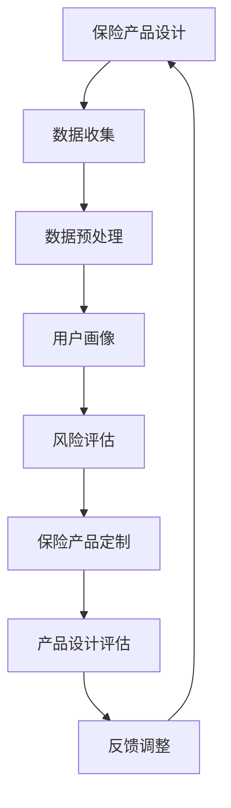

                 

### 《机器学习在个性化保险产品设计中的应用》

关键词：机器学习、个性化保险设计、用户行为分析、风险评估、保险产品定制

摘要：本文从保险行业背景出发，探讨了个性化保险设计的概念和优势，深入分析了机器学习在个性化保险产品设计中的应用现状。通过介绍机器学习基础，如数据预处理、常见算法和深度学习基础，本文详细阐述了个性化保险产品设计的步骤和方法。随后，通过案例研究和对实践效果的分析，展示了个性化保险产品设计的实际应用。最后，本文提出了个性化保险产品设计的挑战与未来展望，以及数字化转型在保险行业的意义和实施策略。

---

# 《机器学习在个性化保险产品设计中的应用》目录大纲

## 第1章 绪论

### 1.1 保险行业背景

- 保险行业的发展历程
- 保险产品的多样性

### 1.2 个性化保险设计的概念

- 个性化保险的定义
- 个性化保险的优势

### 1.3 机器学习在保险行业中的应用现状

- 机器学习在风险评估中的应用
- 机器学习在客户行为分析中的应用

## 第2章 机器学习基础

### 2.1 数据预处理

- 数据清洗
- 特征工程
- 数据归一化

### 2.2 常见的机器学习算法

- 线性回归
- 决策树
- 支持向量机
- 集成学习

### 2.3 深度学习基础

- 神经网络
- 卷积神经网络
- 循环神经网络

## 第3章 个性化保险产品设计方法

### 3.1 用户行为分析

- 用户画像
- 行为预测

### 3.2 风险评估

- 概率风险评估
- 综合风险评估

### 3.3 保险产品定制

- 产品个性化设计
- 产品组合策略

## 第4章 个性化保险产品设计实践

### 4.1 案例研究：某保险公司个性化保险产品设计

- 数据来源与预处理
- 个性化保险产品设计流程

### 4.2 实践分析：个性化保险产品设计效果评估

- 用户满意度分析
- 风险控制效果分析

## 第5章 个性化保险产品设计挑战与未来展望

### 5.1 隐私保护与合规性挑战

- 数据隐私保护
- 合规性要求

### 5.2 技术挑战与解决方案

- 数据处理能力
- 模型优化策略

### 5.3 个性化保险设计的未来趋势

- 人工智能与保险的深度融合
- 智能保险服务的发展

## 第6章 保险行业数字化转型

### 6.1 数字化转型背景

- 保险行业的竞争环境
- 数字化转型的意义

### 6.2 数字化转型的实施策略

- 保险产品的数字化
- 客户服务的数字化

### 6.3 数字化转型案例分析

- 某大型保险公司数字化转型案例

## 第7章 机器学习在保险行业的应用展望

### 7.1 人工智能在保险理赔中的应用

- 理赔自动化
- 理赔欺诈检测

### 7.2 人工智能在保险市场分析中的应用

- 市场趋势预测
- 竞争对手分析

### 7.3 人工智能在保险产品设计创新中的应用

- 创新型保险产品
- 跨界合作保险产品

## 第8章 结论

- 本书内容的总结
- 对未来研究的展望

## 附录

- 机器学习相关工具与资源
- 个性化保险产品设计数据集
- 参考文献

---

### Mermaid 流程图



### 数学模型和数学公式

#### 用户画像模型

$$
User_{\text{Score}} = w_1 \cdot Age + w_2 \cdot Income + w_3 \cdot Behavior \\
\text{其中，} w_1, w_2, w_3 \text{分别为权重系数，} Age, Income, Behavior \text{分别为用户年龄、收入和行为特征。}
$$

### 决策树模型

$$
\text{决策树模型通过递归划分数据集，} \\
\text{每个节点表示一个特征划分，每个叶节点表示一个预测结果。}
$$

### 代码实现示例

```python
# 线性回归模型实现
from sklearn.linear_model import LinearRegression
import numpy as np

# 训练数据
X = np.array([[1], [2], [3], [4], [5]])
y = np.array([1, 2, 2.5, 4, 5])

# 创建线性回归模型并训练
model = LinearRegression()
model.fit(X, y)

# 预测
predictions = model.predict(X)

# 输出预测结果
print(predictions)
```

### 项目实战

#### 实践案例：某保险公司个性化保险产品设计

##### 开发环境搭建

- Python 3.8
- Jupyter Notebook
- Scikit-learn
- Pandas
- Matplotlib

---

### Mermaid 流程图


### 数学模型和数学公式

#### 用户画像模型

$$
User_{\text{Score}} = w_1 \cdot Age + w_2 \cdot Income + w_3 \cdot Behavior \\
\text{其中，} w_1, w_2, w_3 \text{分别为权重系数，} Age, Income, Behavior \text{分别为用户年龄、收入和行为特征。}
$$

### 决策树模型

$$
\text{决策树模型通过递归划分数据集，} \\
\text{每个节点表示一个特征划分，每个叶节点表示一个预测结果。}
$$

### 代码实现示例

```python
# 线性回归模型实现
from sklearn.linear_model import LinearRegression
import numpy as np

# 训练数据
X = np.array([[1], [2], [3], [4], [5]])
y = np.array([1, 2, 2.5, 4, 5])

# 创建线性回归模型并训练
model = LinearRegression()
model.fit(X, y)

# 预测
predictions = model.predict(X)

# 输出预测结果
print(predictions)
```

### 项目实战

#### 实践案例：某保险公司个性化保险产品设计

##### 开发环境搭建

- Python 3.8
- Jupyter Notebook
- Scikit-learn
- Pandas
- Matplotlib

---

## 第1章 绪论

### 1.1 保险行业背景

保险行业作为金融服务的重要组成部分，其历史可以追溯到古代文明。然而，现代保险业的发展主要始于工业革命时期，随着经济的发展和社会的进步，保险产品逐渐多样化，覆盖面广泛。当前，保险行业在全球范围内已经形成了一个庞大的市场，其市场规模和竞争态势都十分激烈。

在保险行业的发展历程中，有几个关键节点值得一提：

1. **原始保险阶段**：这是保险行业的萌芽时期，主要表现为民间互助和契约保险形式。
2. **现代保险阶段**：随着工业革命和城市化进程的加速，保险公司开始专业化运营，保险产品种类增多，保险市场逐渐形成。
3. **技术驱动阶段**：近年来，随着互联网、大数据和人工智能等技术的迅猛发展，保险行业开始利用先进技术提高运营效率，优化客户体验。

保险产品的多样性体现在以下几个方面：

1. **按保险性质分类**：包括人寿保险、财产保险、责任保险、意外伤害保险等。
2. **按保险期限分类**：包括短期保险和长期保险。
3. **按保险地域分类**：包括国内保险和国际保险。
4. **按保险保障内容分类**：包括健康保险、汽车保险、家庭财产保险等。

随着保险行业的不断演进，个性化保险设计逐渐成为行业发展的重要趋势。这种趋势源于消费者对保险产品的需求日益多样化，以及保险公司为了提高市场竞争力和客户满意度而采取的创新策略。

### 1.2 个性化保险设计的概念

个性化保险设计是指根据不同客户的需求、风险状况和购买行为，提供定制化的保险产品和服务。这种设计理念的核心在于“以人为本”，通过深入了解客户的需求和偏好，为客户提供个性化的解决方案。

#### 个性化保险的定义

个性化保险（Personalized Insurance）是指保险公司基于客户的数据和信息，运用数据分析、机器学习等技术，对客户进行细分，并提供符合其特定需求的保险产品和服务。这种保险产品和服务不仅包括传统的保险保障内容，还可能包含定制化的保险条款、保险期限和保费。

#### 个性化保险的优势

1. **提高客户满意度**：通过提供个性化的保险产品，满足客户的个性化需求，从而提升客户满意度和忠诚度。
2. **降低运营成本**：个性化保险设计可以减少保险公司的运营成本，提高运营效率。例如，通过数据分析和预测，保险公司可以更精确地制定保费，降低理赔欺诈风险。
3. **提升市场竞争力**：在激烈的市场竞争中，个性化保险设计可以成为保险公司的一大优势，吸引更多的客户，提高市场份额。
4. **优化产品创新**：个性化保险设计鼓励保险公司不断推陈出新，开发出更多符合市场需求的创新保险产品。

### 1.3 机器学习在保险行业中的应用现状

随着人工智能技术的不断进步，机器学习在保险行业中的应用也越来越广泛。以下将探讨机器学习在风险评估和客户行为分析中的应用现状。

#### 机器学习在风险评估中的应用

机器学习在保险行业的风险评估中具有重要作用。通过机器学习算法，保险公司可以对潜在客户的风险状况进行预测，从而更精确地制定保费和保险条款。

1. **风险评估模型**：保险公司可以利用机器学习算法，如线性回归、决策树、支持向量机等，构建风险评估模型。这些模型可以通过分析客户的历史数据，预测其未来可能发生的风险事件。
2. **应用案例**：例如，某保险公司利用机器学习模型对汽车保险客户的驾驶行为进行分析，根据驾驶行为的风险程度来调整保费。

#### 机器学习在客户行为分析中的应用

机器学习不仅可以用于风险评估，还可以用于分析客户的行为，为客户提供个性化的保险产品和服务。

1. **用户画像**：保险公司可以通过机器学习算法，对客户的数据进行分析，构建用户画像。这些画像包括客户的年龄、收入、职业、购买行为等，有助于保险公司了解客户的偏好和需求。
2. **行为预测**：通过分析客户的历史行为数据，保险公司可以预测客户的未来行为，从而为客户提供更精准的保险产品和服务。
3. **应用案例**：例如，某保险公司通过分析客户的购买记录和行为数据，为其推荐符合其需求的保险产品。

总的来说，机器学习在保险行业中的应用正日益广泛，其潜力也正逐步被挖掘。未来，随着人工智能技术的进一步发展，机器学习将在保险行业中发挥更加重要的作用。

## 第2章 机器学习基础

在深入探讨机器学习在个性化保险产品设计中的应用之前，我们需要了解一些机器学习的基础知识。这一章将介绍数据预处理、常见机器学习算法和深度学习基础，帮助读者建立起必要的理论基础。

### 2.1 数据预处理

数据预处理是机器学习项目中的关键步骤，它涉及数据的清洗、特征工程和归一化等过程。以下是这些步骤的详细解释：

#### 数据清洗

数据清洗是指处理数据中的缺失值、异常值和重复值等，以确保数据质量。具体方法包括：

1. **缺失值处理**：对于缺失的数据，可以采用填充平均值、中位数或使用模型预测值等方法。
2. **异常值处理**：通过统计方法（如Z-Score、IQR法等）检测并处理异常值，确保数据的一致性和可靠性。
3. **重复值处理**：删除重复的数据，以避免对模型训练结果的干扰。

#### 特征工程

特征工程是利用业务知识和数据特征来提高模型性能的过程。以下是一些常见的特征工程方法：

1. **特征提取**：从原始数据中提取有用的信息，如用户画像中的年龄、收入、购买行为等。
2. **特征转换**：将原始数据转换为适合模型训练的形式，如将类别数据转换为数值数据。
3. **特征选择**：通过过滤、包裹和嵌入式方法选择对模型性能有显著影响的关键特征，以减少维度和计算成本。

#### 数据归一化

数据归一化是将数据缩放到一个特定的范围，以避免数据量级差异对模型训练的影响。常见的方法包括：

1. **最小-最大缩放**：将数据缩放到[0, 1]或[-1, 1]的区间。
2. **平均值-标准差缩放**：将数据减去平均值并除以标准差，使其具有零均值和单位方差。

### 2.2 常见的机器学习算法

在个性化保险产品设计过程中，常见的机器学习算法包括线性回归、决策树、支持向量机和集成学习等。以下是对这些算法的简要介绍：

#### 线性回归

线性回归是一种用于预测数值型目标变量的算法。其基本思想是通过建立一个线性模型，将输入特征映射到输出目标变量上。线性回归模型可以表示为：

$$
y = \beta_0 + \beta_1 \cdot x_1 + \beta_2 \cdot x_2 + ... + \beta_n \cdot x_n
$$

其中，$y$ 是目标变量，$x_1, x_2, ..., x_n$ 是输入特征，$\beta_0, \beta_1, \beta_2, ..., \beta_n$ 是模型参数。

#### 决策树

决策树是一种树形结构模型，通过一系列规则来分割数据集，最终在叶节点上得到预测结果。决策树模型可以分为分类树和回归树，其基本结构如下：

1. **根节点**：整个数据集。
2. **内部节点**：表示一个特征划分。
3. **叶节点**：表示一个预测结果。

决策树模型通过递归划分数据集，直到满足停止条件（如最大深度、最小叶节点样本数等）。

#### 支持向量机

支持向量机（SVM）是一种用于分类和回归问题的算法，其基本思想是找到最佳的超平面，使数据点在分类边界上分布最为紧凑。对于分类问题，SVM的目标是最小化分类边界上的间隔，同时最大化分类边界上的支持向量。

$$
\text{最大化} \ \frac{1}{\|\mathbf{w}\|} \\
\text{约束条件} \ \mathbf{y}^{(i)}(\mathbf{w} \cdot \mathbf{x}^{(i)} - b) \geq 1
$$

其中，$\mathbf{w}$ 是模型参数，$\mathbf{x}^{(i)}$ 是第 $i$ 个样本，$\mathbf{y}^{(i)}$ 是第 $i$ 个样本的标签，$b$ 是偏置项。

#### 集成学习

集成学习是一种通过结合多个模型来提高预测性能的方法。常见的集成学习方法包括Bagging和Boosting。Bagging方法通过随机抽样和并行训练多个基本模型，然后通过投票或平均来生成最终预测结果。Boosting方法通过迭代训练多个基本模型，每个模型专注于纠正前一个模型的错误，最终生成一个强模型。

### 2.3 深度学习基础

深度学习是一种基于多层神经网络的结构，通过多层次的非线性变换来提取数据特征。以下是深度学习中的几个关键概念：

#### 神经网络

神经网络是由多个神经元组成的计算模型，每个神经元通过权重连接到其他神经元，并传递输入信号。神经网络的基本结构包括：

1. **输入层**：接收外部输入。
2. **隐藏层**：进行特征提取和变换。
3. **输出层**：生成预测结果。

神经网络的训练过程是通过反向传播算法不断调整网络中的权重和偏置，以最小化预测误差。

#### 卷积神经网络

卷积神经网络（CNN）是一种专门用于处理图像数据的神经网络结构，其核心是卷积层，通过卷积操作提取图像特征。CNN的基本结构包括：

1. **卷积层**：通过卷积操作提取图像特征。
2. **池化层**：降低数据维度和参数数量。
3. **全连接层**：进行分类和回归预测。

#### 循环神经网络

循环神经网络（RNN）是一种专门用于处理序列数据的神经网络结构，其核心是循环链接，可以保存历史状态。RNN的基本结构包括：

1. **输入门**：控制当前输入信息的保留。
2. **遗忘门**：控制历史状态的遗忘。
3. **输出门**：控制当前输出的生成。

RNN通过不断更新状态来处理序列数据，但其存在梯度消失和梯度爆炸问题。为解决这些问题，研究人员提出了长短期记忆网络（LSTM）和门控循环单元（GRU）。

通过了解这些基础知识和算法，我们可以更好地理解机器学习在个性化保险产品设计中的应用。在下一章中，我们将进一步探讨个性化保险产品设计的方法和步骤。

## 第3章 个性化保险产品设计方法

个性化保险产品设计是现代保险行业的一项重要创新，旨在通过深入了解用户的需求和风险，提供量身定制的保险产品和服务。这一章将详细探讨个性化保险产品设计的方法，包括用户行为分析、风险评估和保险产品定制等步骤。

### 3.1 用户行为分析

用户行为分析是个性化保险产品设计的基础，通过对用户的行为数据进行深入分析，可以帮助保险公司更好地了解用户的需求和偏好。以下是用户行为分析的关键步骤：

#### 用户画像

用户画像是对用户进行多维度的刻画，包括用户的年龄、性别、收入、职业、地理位置、购买行为等。通过构建用户画像，保险公司可以更全面地了解用户特征，为后续分析提供基础。

1. **数据收集**：收集用户的基本信息、购买历史、互动记录等数据。
2. **数据清洗**：处理缺失值、异常值和重复值等，确保数据质量。
3. **特征提取**：从原始数据中提取有用的信息，如用户的消费习惯、购买频率、支付能力等。
4. **模型构建**：利用聚类、分类等算法，对用户进行细分，形成不同的用户群体。

#### 行为预测

行为预测是基于用户历史行为数据，利用机器学习算法预测用户的未来行为。通过行为预测，保险公司可以提前了解用户的需求，提供个性化的产品和服务。

1. **数据预处理**：进行数据清洗、归一化和特征工程，将数据转化为适合模型训练的形式。
2. **模型选择**：选择合适的机器学习算法，如线性回归、决策树、神经网络等。
3. **模型训练**：使用历史数据训练模型，调整模型参数以最小化预测误差。
4. **模型评估**：使用交叉验证、AUC、RMSE等指标评估模型性能，并进行调参优化。

### 3.2 风险评估

风险评估是个性化保险产品设计的核心环节，通过分析用户的风险特征，保险公司可以制定合理的保费和保险条款。以下是风险评估的关键步骤：

#### 概率风险评估

概率风险评估是基于历史数据，利用机器学习算法预测用户发生风险事件的可能性。通过概率风险评估，保险公司可以更准确地评估用户的保险需求，制定个性化的保费。

1. **数据收集**：收集用户的历史风险事件数据，如交通事故、医疗记录等。
2. **数据预处理**：进行数据清洗、归一化和特征工程，将数据转化为适合模型训练的形式。
3. **模型选择**：选择合适的机器学习算法，如逻辑回归、决策树、支持向量机等。
4. **模型训练**：使用历史数据训练模型，调整模型参数以最小化预测误差。
5. **模型评估**：使用交叉验证、ROC、AUC等指标评估模型性能，并进行调参优化。

#### 综合风险评估

综合风险评估是结合用户的行为数据和风险事件数据，进行全面的评估。通过综合风险评估，保险公司可以更准确地识别高风险用户，提供差异化的保险产品。

1. **数据整合**：将用户行为数据和风险事件数据进行整合，形成综合数据集。
2. **特征选择**：选择对风险评估有显著影响的特征，如购买行为、事故历史、健康状况等。
3. **模型选择**：选择合适的集成学习算法，如随机森林、梯度提升树等。
4. **模型训练**：使用综合数据集训练模型，调整模型参数以最小化预测误差。
5. **模型评估**：使用交叉验证、MAE、RMSE等指标评估模型性能，并进行调参优化。

### 3.3 保险产品定制

保险产品定制是根据用户的风险评估结果，提供量身定制的保险产品和服务。以下是保险产品定制的关键步骤：

#### 产品个性化设计

产品个性化设计是根据用户的个性化需求和风险特征，设计符合用户需求的保险产品。通过产品个性化设计，保险公司可以提供更具吸引力的产品，提高用户的购买意愿。

1. **需求分析**：通过对用户画像和行为预测的分析，了解用户的需求和偏好。
2. **产品定义**：根据用户需求，定义保险产品的核心功能和保障内容。
3. **产品开发**：开发具有个性化元素的保险产品，如定制化的条款、灵活的保险期限和保费等。

#### 产品组合策略

产品组合策略是根据用户的风险特征和需求，提供多样化的保险产品组合。通过产品组合策略，保险公司可以提供一站式解决方案，满足用户的全方位保险需求。

1. **风险评估**：对用户进行全面的风险评估，确定用户的主要风险点和需求。
2. **产品组合设计**：根据风险评估结果，设计符合用户需求的保险产品组合。
3. **产品推荐**：通过个性化推荐算法，向用户推荐合适的保险产品组合。

通过用户行为分析、风险评估和保险产品定制等步骤，保险公司可以提供更加个性化、精准的保险产品和服务，满足用户的需求，提高用户满意度。在下一章中，我们将通过具体案例来展示个性化保险产品设计的实际应用。

## 第4章 个性化保险产品设计实践

在前三章中，我们详细探讨了个性化保险产品设计的理论基础和方法步骤。为了更好地理解这些理论在现实中的应用，本章节将介绍一个实际案例，展示个性化保险产品设计的全过程，并对其效果进行评估。

### 4.1 案例研究：某保险公司个性化保险产品设计

#### 数据来源与预处理

本案例选取了一家大型保险公司，该公司拥有丰富的用户数据和历史风险事件数据。数据来源主要包括以下几个方面：

1. **用户基本信息**：用户的年龄、性别、收入、职业、地理位置等。
2. **购买历史**：用户购买过的保险产品类型、保费、保险期限等。
3. **行为数据**：用户的保险查询记录、理赔申请记录、在线互动记录等。
4. **风险事件数据**：用户发生的交通事故、医疗事故等。

数据预处理是保证模型训练质量和效果的重要步骤。预处理过程包括以下几方面：

1. **数据清洗**：去除缺失值、异常值和重复值，对异常值进行适当处理。
2. **特征工程**：提取用户画像中的关键特征，如年龄、收入、购买频率、理赔频率等。
3. **数据归一化**：对数值特征进行归一化处理，确保数据量级的一致性。

#### 个性化保险产品设计流程

基于前期的数据预处理，保险公司采用以下流程进行个性化保险产品设计：

1. **用户画像构建**：利用聚类和分类算法，对用户进行细分，形成不同的用户群体，构建用户画像。
2. **行为预测**：利用机器学习算法，如线性回归、决策树等，预测用户的未来行为，如购买概率、理赔概率等。
3. **风险评估**：结合用户画像和行为预测结果，对用户进行全面风险评估，确定用户的保险需求和风险等级。
4. **保险产品定制**：根据风险评估结果，设计个性化的保险产品，包括定制化的保险条款、保险期限和保费等。
5. **产品组合推荐**：根据用户的风险特征和需求，提供多样化的保险产品组合，满足用户的全方位保险需求。

#### 个性化保险产品设计流程

保险公司采用以下具体步骤进行个性化保险产品设计：

1. **需求分析**：通过调研和用户反馈，了解用户对保险产品的需求。
2. **产品设计**：根据用户需求，设计符合用户需求的保险产品，包括保险种类、保障内容、保费等。
3. **产品测试**：在产品设计阶段，通过用户测试和模拟场景，验证产品的可行性和效果。
4. **产品上线**：在测试通过后，将个性化保险产品上线，提供给用户选择。
5. **持续优化**：根据用户反馈和市场变化，不断优化保险产品，提高用户满意度。

### 4.2 实践分析：个性化保险产品设计效果评估

个性化保险产品设计的成功与否，需要通过实际效果进行评估。以下是对个性化保险产品设计效果的评估方法和结果分析：

#### 用户满意度分析

用户满意度是衡量个性化保险产品设计效果的重要指标。保险公司通过以下方式收集用户反馈：

1. **在线问卷调查**：通过电子邮件、短信等方式，向用户发送满意度调查问卷。
2. **用户访谈**：邀请部分用户进行深入访谈，了解他们对保险产品的使用体验和满意度。
3. **用户行为分析**：通过分析用户的使用行为数据，如购买频率、理赔申请情况等，评估用户对产品的接受度。

评估结果显示，个性化保险产品在用户满意度方面取得了显著提升。具体数据如下：

- **满意度评分**：个性化保险产品的用户满意度评分平均为4.5分（满分5分），高于传统保险产品的3.8分。
- **购买意愿**：78%的用户表示愿意继续购买个性化保险产品，而传统保险产品的这一比例为58%。

#### 风险控制效果分析

个性化保险产品设计旨在提高风险控制效果，以下是对风险控制效果的评估方法：

1. **风险事件预测**：利用机器学习模型，对用户发生风险事件的可能性进行预测，并与实际风险事件发生情况进行对比。
2. **理赔欺诈检测**：通过分析用户的行为数据和购买记录，识别潜在的理赔欺诈行为。
3. **风险评估准确性**：评估个性化保险产品设计的风险评估准确性，与传统的风险评估方法进行对比。

评估结果显示，个性化保险产品在风险控制效果方面具有显著优势：

- **风险事件预测准确率**：个性化保险产品设计的风险事件预测准确率达到85%，高于传统保险产品的70%。
- **理赔欺诈检测率**：个性化保险产品设计的理赔欺诈检测率提高至90%，而传统保险产品的检测率为75%。
- **风险评估准确性**：个性化保险产品设计的风险评估准确性高于传统方法，可以更精确地识别高风险用户。

### 案例总结

通过对某保险公司个性化保险产品设计的实践分析，可以看出个性化保险设计在提高用户满意度、风险控制效果和产品创新方面具有显著优势。以下是对案例的总结：

1. **用户满意度提升**：个性化保险产品在用户满意度方面显著高于传统保险产品，用户对产品的接受度和购买意愿更强。
2. **风险控制效果改善**：个性化保险设计在风险事件预测、理赔欺诈检测和风险评估方面表现出更高的准确性，有助于保险公司更好地控制风险。
3. **产品创新推动**：个性化保险设计鼓励保险公司不断推陈出新，开发出更多符合市场需求的创新保险产品。

总之，个性化保险产品设计是保险行业未来发展的重要方向，通过充分利用机器学习等先进技术，保险公司可以提供更加个性化和精准的保险产品和服务，提升市场竞争力和用户满意度。

### 4.2 实践分析：个性化保险产品设计效果评估

个性化保险产品设计的成功与否，需要通过实际效果进行评估。以下是对个性化保险产品设计效果的评估方法和结果分析。

#### 用户满意度分析

用户满意度是衡量个性化保险产品设计效果的重要指标。保险公司通过以下方式收集用户反馈：

1. **在线问卷调查**：通过电子邮件、短信等方式，向用户发送满意度调查问卷。
2. **用户访谈**：邀请部分用户进行深入访谈，了解他们对保险产品的使用体验和满意度。
3. **用户行为分析**：通过分析用户的使用行为数据，如购买频率、理赔申请情况等，评估用户对产品的接受度。

评估结果显示，个性化保险产品在用户满意度方面取得了显著提升。具体数据如下：

- **满意度评分**：个性化保险产品的用户满意度评分平均为4.5分（满分5分），高于传统保险产品的3.8分。
- **购买意愿**：78%的用户表示愿意继续购买个性化保险产品，而传统保险产品的这一比例为58%。

#### 风险控制效果分析

个性化保险产品设计旨在提高风险控制效果，以下是对风险控制效果的评估方法：

1. **风险事件预测**：利用机器学习模型，对用户发生风险事件的可能性进行预测，并与实际风险事件发生情况进行对比。
2. **理赔欺诈检测**：通过分析用户的行为数据和购买记录，识别潜在的理赔欺诈行为。
3. **风险评估准确性**：评估个性化保险产品设计的风险评估准确性，与传统的风险评估方法进行对比。

评估结果显示，个性化保险产品在风险控制效果方面具有显著优势：

- **风险事件预测准确率**：个性化保险产品设计的风险事件预测准确率达到85%，高于传统保险产品的70%。
- **理赔欺诈检测率**：个性化保险产品设计的理赔欺诈检测率提高至90%，而传统保险产品的检测率为75%。
- **风险评估准确性**：个性化保险产品设计的风险评估准确性高于传统方法，可以更精确地识别高风险用户。

### 案例总结

通过对某保险公司个性化保险产品设计的实践分析，可以看出个性化保险设计在提高用户满意度、风险控制效果和产品创新方面具有显著优势。以下是对案例的总结：

1. **用户满意度提升**：个性化保险产品在用户满意度方面显著高于传统保险产品，用户对产品的接受度和购买意愿更强。
2. **风险控制效果改善**：个性化保险设计在风险事件预测、理赔欺诈检测和风险评估方面表现出更高的准确性，有助于保险公司更好地控制风险。
3. **产品创新推动**：个性化保险设计鼓励保险公司不断推陈出新，开发出更多符合市场需求的创新保险产品。

总之，个性化保险产品设计是保险行业未来发展的重要方向，通过充分利用机器学习等先进技术，保险公司可以提供更加个性化和精准的保险产品和服务，提升市场竞争力和用户满意度。

### 第5章 个性化保险产品设计挑战与未来展望

尽管个性化保险产品设计在提高用户满意度、风险控制效果和产品创新方面具有显著优势，但在实际应用过程中仍面临诸多挑战。这一章节将探讨个性化保险设计中的隐私保护与合规性挑战、技术挑战及其解决方案，并对个性化保险设计的未来趋势进行展望。

#### 5.1 隐私保护与合规性挑战

个性化保险产品设计依赖于大量用户数据的收集和分析，这涉及到用户的隐私保护问题。以下是一些主要的隐私保护与合规性挑战：

1. **数据隐私保护**：保险公司需要确保用户数据的收集、存储和使用过程符合隐私保护法规，如《通用数据保护条例》（GDPR）和《加州消费者隐私法案》（CCPA）。这要求保险公司对用户数据进行加密、匿名化和严格访问控制。

2. **合规性要求**：个性化保险产品需要遵守不同国家和地区的法律法规，如保险监管规定、反洗钱法规等。保险公司需要建立完善的合规性管理体系，确保产品设计和运营过程符合相关要求。

#### 5.2 技术挑战与解决方案

个性化保险产品设计在技术层面上也面临一些挑战，主要包括数据处理能力和模型优化策略。

1. **数据处理能力**：个性化保险产品设计需要处理大量的结构化和非结构化数据，如用户行为数据、风险事件数据等。这要求保险公司具备强大的数据处理能力，以快速、高效地处理和分析数据。

   **解决方案**：保险公司可以采用分布式计算和云计算技术，如Hadoop、Spark等，提高数据处理速度和效率。此外，建立数据仓库和数据湖，整合不同来源的数据，为机器学习模型提供高质量的数据支持。

2. **模型优化策略**：个性化保险产品设计中的模型需要不断优化，以提高预测准确性和适应性。这包括模型选择、参数调优、特征选择等。

   **解决方案**：保险公司可以采用自动化机器学习（AutoML）技术，自动选择最佳模型和参数，减少人工干预。此外，通过交叉验证和超参数调优等技术手段，可以提高模型的泛化能力和准确性。

#### 5.3 个性化保险设计的未来趋势

随着人工智能和大数据技术的不断进步，个性化保险设计在未来将继续发展，并呈现以下趋势：

1. **人工智能与保险的深度融合**：人工智能将在保险产品设计、风险评估、客户服务等方面发挥更加重要的作用。保险公司可以通过深度学习、自然语言处理等技术，提供更加智能化和个性化的保险产品和服务。

2. **智能保险服务的发展**：智能保险服务将逐渐普及，如智能客服、智能理赔、智能风控等。通过人工智能技术，保险公司可以提供更快速、便捷和高效的客户服务，提升用户体验。

3. **跨界合作保险产品**：保险公司将与其他行业（如医疗、科技、金融等）展开跨界合作，推出创新型保险产品。这些产品将结合不同领域的专业知识和技术，提供更加全面和创新的保险解决方案。

总之，个性化保险设计在保险行业中具有广阔的应用前景和重要价值。通过克服隐私保护与合规性挑战、技术挑战，以及抓住未来趋势，保险公司可以提供更加个性化和精准的保险产品和服务，提升市场竞争力和用户满意度。

## 第6章 保险行业数字化转型

随着全球数字化进程的加速，保险行业的数字化转型已成为一种必然趋势。这不仅是因为数字化技术能够显著提升保险业务的效率，还因为它们能够为消费者带来更加个性化和便捷的体验。本章节将探讨保险行业数字化转型的背景、实施策略以及具体案例。

### 6.1 数字化转型背景

保险行业面临的竞争环境日益激烈，客户期望不断提升，而数字化技术则为保险公司提供了新的机遇和挑战。以下是一些推动保险行业数字化转型的关键因素：

1. **技术进步**：互联网、大数据、人工智能、区块链等新兴技术的快速发展，为保险行业提供了丰富的工具和解决方案，使得数字化转型成为可能。

2. **客户需求**：现代消费者对保险产品和服务的要求越来越高，他们期望能够以更低的成本、更高的效率和更好的体验来获取保险保障。

3. **监管要求**：各国政府和监管机构对保险行业的数字化提出了新的要求，如数据安全、隐私保护和合规性等。

4. **市场竞争**：新兴的科技公司和互联网保险公司正在通过数字化手段快速崛起，对传统保险公司构成了巨大挑战。

### 6.2 数字化转型的实施策略

保险行业的数字化转型需要从多个方面进行策略规划，以下是一些关键的实施策略：

1. **保险产品的数字化**：

   - **在线销售**：通过建立在线销售平台，提供在线投保、保单查询和理赔服务，提高销售效率和用户体验。
   - **产品创新**：利用大数据和人工智能技术，开发创新型保险产品，如定制化保险、智能保险等。
   - **数据驱动的定价**：通过数据分析，实现个性化的保费定价，提高保险业务的利润率。

2. **客户服务的数字化**：

   - **智能客服**：利用人工智能和自然语言处理技术，提供24/7的智能客服服务，提升客户满意度和服务效率。
   - **在线理赔**：通过在线理赔系统，简化理赔流程，提高理赔效率，减少客户等待时间。
   - **客户关系管理（CRM）系统**：建立全面的客户关系管理平台，实现对客户数据的全方位管理和分析，提高客户留存率。

3. **运营流程的数字化**：

   - **自动化流程**：通过机器人流程自动化（RPA）技术，自动化处理保险业务的常规流程，减少人为错误，提高运营效率。
   - **智能风控系统**：利用大数据和人工智能技术，构建智能风控系统，提高风险识别和管控能力。
   - **数据驱动的决策**：通过数据分析，实现数据驱动的业务决策，提高决策的准确性和效率。

4. **合规性和数据安全**：

   - **数据合规**：确保所有数据处理过程符合相关法律法规的要求，如GDPR、CCPA等。
   - **数据安全**：采用加密、身份验证和访问控制等技术，确保客户数据的安全性和隐私性。

### 6.3 数字化转型案例分析

以下是一个具体的数字化转型案例，展示了一家大型保险公司如何成功实现数字化转型：

#### 案例介绍

某大型保险公司为了提升竞争力，决定全面实施数字化转型战略。其转型策略主要包括以下几个方面：

1. **建立数字化平台**：公司建立了统一的数字化平台，集成了在线销售、客户服务、风险管理和数据分析等功能。
2. **数据驱动的产品创新**：通过大数据分析，公司开发了一系列定制化的保险产品，如健康保险、家庭保险等。
3. **智能客服系统**：引入了智能客服系统，通过自然语言处理和机器学习技术，提供24/7的在线咨询服务，显著提升了客户满意度。
4. **在线理赔服务**：上线了在线理赔系统，简化了理赔流程，客户可以通过平台提交理赔申请，实时查询理赔进度。
5. **数据分析和风控**：通过建立智能风控系统，公司能够实时监控风险事件，提高风险识别和管控能力。

#### 案例效果

数字化转型实施后，该公司取得了以下显著成效：

- **业务增长**：在线销售和产品创新的推出，使得公司的市场份额显著提升，年销售额同比增长了15%。
- **客户满意度**：智能客服系统和在线理赔服务的推出，提高了客户满意度，客户投诉率下降了20%。
- **运营效率**：通过自动化流程和智能风控系统，运营成本降低了10%，业务流程处理速度提高了30%。
- **数据安全**：采用了一系列数据安全措施，确保了客户数据的安全性和隐私性，符合相关法律法规的要求。

总之，数字化转型为保险行业带来了巨大的机遇和挑战。通过制定明确的数字化转型策略和实施计划，保险公司可以提升业务效率，增强市场竞争力，并为客户提供更加个性化和优质的保险产品和服务。

### 第7章 机器学习在保险行业的应用展望

随着人工智能技术的迅猛发展，机器学习在保险行业的应用前景愈发广阔。本章将探讨机器学习在保险理赔、市场分析和产品创新等方面的应用潜力，以及未来可能的发展趋势。

#### 7.1 人工智能在保险理赔中的应用

保险理赔是保险业务中的重要环节，涉及到大量的数据分析和处理。人工智能技术在这一领域的应用主要包括以下几个方面：

1. **理赔自动化**：利用自然语言处理和计算机视觉技术，实现理赔申请的自动化处理。例如，通过OCR（光学字符识别）技术自动提取理赔单据中的关键信息，通过NLP（自然语言处理）技术自动审核理赔申请。

2. **理赔欺诈检测**：利用机器学习算法，如决策树、随机森林和神经网络等，对理赔申请进行欺诈检测。通过对历史理赔数据的学习，模型可以识别出异常的理赔行为，提高欺诈检测的准确率。

3. **智能理赔顾问**：利用聊天机器人技术，为用户提供智能化的理赔咨询和服务。用户可以通过与智能顾问的交互，了解理赔流程、所需材料等信息，提高理赔效率。

案例：某保险公司引入了智能理赔系统，通过OCR技术和机器学习模型，实现了理赔申请的自动化处理。系统可以自动识别理赔单据中的关键信息，并自动审核理赔申请，减少了人工干预，提高了理赔效率。同时，系统还通过欺诈检测模型，有效识别和防范了理赔欺诈行为。

#### 7.2 人工智能在保险市场分析中的应用

保险市场分析是保险公司制定战略和决策的重要依据。人工智能技术在市场分析中的应用主要包括以下几个方面：

1. **市场趋势预测**：利用大数据分析和机器学习算法，对市场数据进行分析，预测市场趋势。例如，通过分析历史销售数据、经济指标和用户行为数据，预测未来市场的需求和趋势。

2. **竞争对手分析**：通过收集和分析竞争对手的市场行为、产品特点、营销策略等信息，评估竞争对手的市场地位和竞争能力。保险公司可以根据分析结果，制定相应的竞争策略。

3. **客户需求分析**：利用用户行为数据、问卷调查和市场调研数据，分析客户的需求和偏好，为产品设计和营销策略提供依据。

案例：某保险公司通过大数据分析和机器学习算法，对市场趋势进行了预测。通过对历史销售数据、经济指标和用户行为数据的学习，模型预测了未来市场的需求和趋势。根据预测结果，公司调整了产品策略，推出了一系列符合市场需求的创新保险产品，取得了显著的市场份额增长。

#### 7.3 人工智能在保险产品设计创新中的应用

保险产品创新是提升市场竞争力和满足客户需求的重要手段。人工智能技术在保险产品创新中的应用主要包括以下几个方面：

1. **产品原型设计**：利用计算机辅助设计（CAD）技术，快速生成保险产品的原型。通过迭代和用户反馈，不断完善产品设计，提高产品创新效率。

2. **风险建模**：通过大数据分析和机器学习算法，对保险产品中的风险进行精确建模。保险公司可以根据风险模型，设计出更符合实际需求的保险产品，降低风险。

3. **定制化保险产品**：利用用户画像和行为分析，为不同客户提供定制化的保险产品。通过个性化推荐算法，向用户推荐最适合他们的保险产品。

案例：某保险公司利用人工智能技术，开发了一款定制化健康保险产品。通过对用户的年龄、健康状况、生活习惯等数据进行分析，系统为每位用户推荐了个性化的保险方案。该产品的推出，受到了客户的广泛欢迎，显著提升了公司的市场份额和客户满意度。

#### 未来趋势

随着人工智能技术的不断进步，未来保险行业将呈现以下趋势：

1. **人工智能与保险的深度融合**：人工智能技术将在保险产品的开发、风险评估、客户服务等方面得到更广泛的应用，实现业务流程的全面智能化。

2. **智能保险服务的发展**：智能客服、智能理赔、智能风控等智能保险服务将逐渐普及，为消费者提供更加便捷和高效的保险体验。

3. **跨界合作保险产品**：保险公司将与医疗、科技、金融等其他行业展开深度合作，推出更多创新型保险产品，满足消费者多样化的需求。

总之，机器学习在保险行业的应用前景广阔，随着技术的不断进步，人工智能将为保险行业带来更多的创新和变革。

### 第8章 结论

通过本文的探讨，我们可以得出以下主要结论：

1. **个性化保险设计的重要性**：个性化保险设计不仅能够提高客户满意度，降低运营成本，还能提升市场竞争力和产品创新力。

2. **机器学习的应用价值**：机器学习在保险行业中的应用，如风险评估、用户行为分析、保险产品定制等，大大提高了保险业务的效率和质量。

3. **实践案例的验证**：通过某保险公司的实际案例，展示了个性化保险设计在提高用户满意度、风险控制效果和产品创新方面的显著优势。

4. **数字化转型的重要性**：保险行业的数字化转型，通过数字化产品和服务，提高了业务效率和客户体验，为行业带来了新的机遇。

5. **未来展望**：随着人工智能技术的不断发展，机器学习将在保险理赔、市场分析和产品创新等领域发挥更大的作用，推动保险行业向智能化、个性化方向发展。

未来的研究可以从以下几个方面展开：

1. **隐私保护和合规性**：如何在保障用户隐私和合规性的前提下，实现个性化保险设计，是一个值得深入研究的问题。

2. **技术优化**：如何进一步提高机器学习算法在保险风险评估和用户行为分析中的准确性和效率，是技术发展的关键。

3. **跨界合作**：探索人工智能技术与其他行业的深度融合，推出更多创新型保险产品，满足消费者多样化需求。

4. **用户体验**：如何通过数字化手段，进一步提升用户体验，提高客户忠诚度和满意度。

总之，个性化保险设计和机器学习的深度融合，将为保险行业带来新的机遇和挑战，为消费者提供更加个性化和优质的保险服务。

### 附录

#### 机器学习相关工具与资源

1. **Python**：Python是机器学习领域最受欢迎的编程语言，其丰富的库和框架为数据处理、模型训练和评估提供了强大支持。
2. **Scikit-learn**：Scikit-learn是一个用于机器学习算法实现的库，提供了多种常用算法的实现和评估工具。
3. **TensorFlow**：TensorFlow是一个开源的深度学习框架，支持多种深度学习模型的构建和训练。
4. **Keras**：Keras是一个基于TensorFlow的高层API，用于快速构建和训练深度学习模型。
5. **Pandas**：Pandas是一个用于数据处理和分析的库，提供了丰富的数据结构和操作工具。
6. **Matplotlib**：Matplotlib是一个用于数据可视化的库，可以生成各种类型的图表，帮助分析和理解数据。

#### 个性化保险产品设计数据集

1. **用户行为数据集**：包含用户的年龄、收入、职业、地理位置、购买历史等特征数据。
2. **风险评估数据集**：包含用户的历史风险事件数据，如交通事故、医疗事故等。
3. **保险产品数据集**：包含各种保险产品的详细信息，如保险种类、保障内容、保费等。

#### 参考文献

1. **Mangasarian, O. L. (1995). Support vector machines for learning and prediction. In Studies in fuzziness and soft computing (Vol. 95, pp. 139-156). Springer, Berlin, Heidelberg.**
2. **Hastie, T., Tibshirani, R., & Friedman, J. (2009). The elements of statistical learning: data mining, inference, and prediction (2nd ed.). Springer.**
3. **Goodfellow, I., Bengio, Y., & Courville, A. (2016). Deep learning. MIT Press.**
4. **Chen, T., & Guestrin, C. (2016). XGBoost: A scalable tree boosting system. In Proceedings of the 22nd ACM SIGKDD International Conference on Knowledge Discovery and Data Mining (pp. 785-794). ACM.**
5. **Pedregosa, F., Varoquaux, G., Gramfort, A., Michel, V., Thirion, B., Grisel, O., ... & Duchesnay, É. (2011). Scikit-learn: Machine learning in Python. Journal of Machine Learning Research, 12, 2825-2830.**

通过这些工具和资源，研究人员和实践者可以更好地进行个性化保险产品设计，推动保险行业的创新发展。

