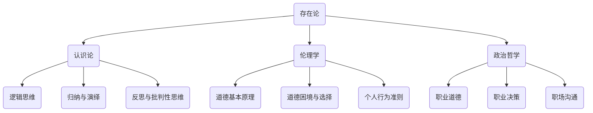

                 

# 构建个人哲学：为生活打造坚实的思想基础

关键词：哲学、个人成长、逻辑思维、价值观、伦理学

摘要：本文旨在探讨如何通过构建个人哲学来为生活奠定坚实的思想基础。我们将从哲学的起源和发展、核心哲学概念、哲学思考方法、个人哲学构建以及哲学在生活中的应用等多个角度展开分析，帮助读者逐步建立起自己的哲学体系。

## 引言

### 1. 引言背景

在现代社会，人们面对的挑战和选择越来越多，如何在纷繁复杂的世界中找到自己的方向和价值观，成为了一个重要的问题。哲学作为一门探讨人类存在、知识、价值和道德等根本问题的学科，为我们提供了一种思考和解决问题的方法。通过构建个人哲学，我们可以为生活奠定坚实的思想基础，更好地应对各种挑战。

### 2. 书籍目的

本文的目的在于引导读者了解哲学的基本概念和思考方法，帮助他们构建自己的个人哲学体系。通过本文的阅读，读者将能够：

- 了解哲学的起源和发展，认识哲学的核心概念；  
- 掌握哲学思考的基本方法，培养逻辑思维和批判性思维能力；  
- 建立自己的价值观和道德准则，为生活提供指导；  
- 在职业生涯、人际关系和个人成长中运用哲学，提升生活质量。

### 3. 阅读对象

本文适合对哲学有兴趣的读者，包括大学生、职场人士、哲学家和哲学爱好者等。无论你是在学术研究领域，还是在实际生活中，本文都将为你提供有益的思考和指导。

### 4. 结构安排

本文分为三大部分：

- 第一部分：哲学基础，介绍哲学的起源、核心概念和思考方法；  
- 第二部分：个人哲学构建，探讨如何建立个人价值观、道德准则和自我认知；  
- 第三部分：哲学在生活中的应用，分析哲学在职业、人际关系和个人成长中的应用。

## 第一部分：哲学基础

### 第1章：哲学的起源与发展

#### 1.1 哲学的定义

哲学是一门探讨人类存在、知识、价值和道德等根本问题的学科。它不同于其他学科，不追求具体的实证知识，而是关注人类存在的意义、真理的本质和价值。

#### 1.2 古希腊哲学

古希腊哲学是西方哲学的起源，以苏格拉底、柏拉图和亚里士多德为代表的哲学家们提出了许多重要的哲学思想。其中，苏格拉底强调道德和自我认识，柏拉图主张理念论，亚里士多德强调实证主义和形而上学。

#### 1.3 中世纪哲学

中世纪哲学主要围绕基督教神学和柏拉图主义展开，代表人物包括奥古斯丁、托马斯·阿奎那等。这一时期的哲学强调信仰和理性的统一，为后来的现代哲学奠定了基础。

#### 1.4 近代哲学

近代哲学以笛卡尔、康德和黑格尔等哲学家为代表，强调人类主体性和理性思考。笛卡尔提出了“我思故我在”的观点，康德则强调道德自律，黑格尔则提出了辩证法。

### 第2章：核心哲学概念

#### 2.1 存在论

存在论是哲学中的一个核心问题，探讨存在的本质和意义。存在论的主要流派包括唯心主义、唯物主义、现象学和存在主义等。

#### 2.2 认识论

认识论是哲学中探讨知识本质和获取方式的学科。认识论的主要流派包括经验论、理性论、批判理性论等。

#### 2.3 伦理学

伦理学是哲学中研究道德和道德行为的学科。伦理学的基本原则包括功利主义、义务论、美德伦理学等。

#### 2.4 政治哲学

政治哲学是哲学中探讨政治制度、国家和道德问题的学科。政治哲学的主要流派包括自由主义、保守主义、社会主义等。

### 第3章：哲学思考方法

#### 3.1 逻辑思维

逻辑思维是哲学思考的基本方法，包括归纳和演绎推理。归纳推理是从个别事实中总结出一般性结论，演绎推理是从一般性原理推导出个别结论。

#### 3.2 归纳与演绎

归纳与演绎是哲学思考中的两种基本方法。归纳推理是从个别事实中总结出一般性结论，演绎推理是从一般性原理推导出个别结论。

#### 3.3 反思与批判性思维

反思与批判性思维是哲学思考中的高级方法，强调对已有知识和观点进行深入分析和评价。反思思维是一种自我反省的方法，批判性思维则是对他人观点进行评价和批判。

## 第二部分：个人哲学构建

### 第4章：价值观与生活目标

#### 4.1 价值观的形成

价值观是指个体对事物重要性的评价和判断，是个人哲学的核心。价值观的形成受到家庭、社会、文化等多种因素的影响。

#### 4.2 生活目标的设定

生活目标是个人哲学的重要组成部分，它指引我们的人生方向。设定合理的生活目标需要考虑个人的价值观、能力和机遇。

#### 4.3 价值观与目标的关系

价值观与生活目标之间存在着密切的关系。价值观为我们提供判断标准，帮助我们确定生活目标；而生活目标则是实现价值观的具体表现。

### 第5章：道德与行为准则

#### 5.1 道德的基本原则

道德的基本原则包括公正、善良、诚实、尊重等。这些原则为我们提供了判断行为正确与否的标准。

#### 5.2 道德困境与选择

道德困境是指在道德决策中面临的两难选择。面对道德困境，我们需要运用道德原则和哲学思考方法来做出合理的选择。

#### 5.3 个人行为准则的制定

个人行为准则是个人哲学的具体体现，它指导我们在日常生活中如何行动。制定个人行为准则需要考虑道德原则和自身价值观。

### 第6章：思考与自我认知

#### 6.1 自我认知的重要性

自我认知是指个体对自身特点、能力和需求的认识。自我认知对于个人哲学的构建至关重要。

#### 6.2 思考的过程与技巧

思考的过程包括感知、分析、综合、评价等步骤。掌握思考技巧有助于提高我们的认知能力和决策水平。

#### 6.3 自我反思与成长

自我反思是指个体对自身行为和思想的回顾和分析。通过自我反思，我们可以发现自己的优点和不足，实现个人成长。

## 第三部分：哲学在生活中的应用

### 第7章：哲学在职业中的应用

#### 7.1 职业道德与哲学

职业道德是哲学在职业领域中的应用。它要求我们在工作中遵循道德原则，以诚信、公正和责任心为核心。

#### 7.2 职业决策与哲学

职业决策需要考虑个人的价值观、能力和市场需求。运用哲学思考方法，我们可以更好地做出职业选择。

#### 7.3 职场沟通与哲学

职场沟通是哲学在人际关系中的应用。通过运用哲学思考和沟通技巧，我们可以提高沟通效果，增进人际关系。

### 第8章：哲学在人际关系中的应用

#### 8.1 人际关系与哲学

哲学提供了许多关于人际关系的见解，如尊重、信任、合作等。运用哲学智慧，我们可以更好地处理人际关系。

#### 8.2 哲学在家庭关系中的应用

家庭关系是人类社会中最为基本的人际关系。哲学为我们提供了处理家庭关系的原则和方法。

#### 8.3 哲学在社交关系中的应用

社交关系是人们在社交场合中建立的关系。运用哲学思考和社交技巧，我们可以更好地维护和发展社交关系。

### 第9章：哲学在自我提升中的应用

#### 9.1 哲学在健康中的应用

哲学可以指导我们如何保持身心健康。通过哲学思考，我们可以更好地应对压力和挑战，提高生活质量。

#### 9.2 哲学在教育与学习中的应用

哲学在教育领域中的应用主要体现在培养学生的批判性思维和创新能力。哲学思考方法有助于提高教育质量和学习效果。

#### 9.3 哲学在个人成长中的应用

哲学为我们提供了个人成长的理论指导和实践方法。通过哲学思考，我们可以更好地认识自己、发展自己，实现人生价值。

## 结论

### 10. 构建个人哲学的总结

构建个人哲学是一个持续的过程，需要我们在日常生活中不断反思、学习和实践。通过本文的探讨，我们了解到哲学在生活中的重要性，掌握了构建个人哲学的方法和技巧。希望读者能够通过实践，逐步建立起自己的哲学体系，为生活奠定坚实的思想基础。

### 11. 未来的思考方向

在未来的研究中，我们可以进一步探讨哲学在特定领域中的应用，如心理学、社会学、经济学等。同时，还可以研究哲学与其他学科的交叉融合，以期为人类社会的进步提供更多的智慧和思考。

### 12. 结语

哲学是一门深刻的学科，它探讨人类存在的意义、知识、价值和道德等根本问题。通过构建个人哲学，我们可以为生活奠定坚实的思想基础，更好地应对各种挑战。希望本文能够为读者提供有益的思考和指导，共同探索哲学的智慧。

### 附录

#### A. 参考文献

1. 罗素，B. (1912). 《西方哲学史》.
2. 马克思，K. (1844). 《关于历史唯物主义的讲演录》.
3. 康德，I. (1781). 《纯粹理性批判》.
4. 尼采，F. (1882). 《善恶的彼岸》.
5. 柏拉图，P. (公元前427-公元前347). 《理想国》.

#### B. 哲学资源推荐

1. 网易云课堂：《哲学入门课》
2. 中国大学MOOC：《西方哲学史》
3. 新东方在线：《道德哲学》
4. 豆瓣读书：《哲学家的咖啡馆》
5. 知乎专栏：《哲学的智慧》

### Mermaid 流程图：哲学核心概念关系图



### Python 源代码示例：伦理学决策树

```python
class EthicalDecisionTree:
    def __init__(self):
        self.options = {
            'beneficence': '促进福祉',
            'non-maleficence': '不做恶',
            'autonomy': '自主权',
            'justice': '公正'
        }

    def make_decision(self, context):
        if context == 'health':
            return self.options['beneficence']
        elif context == 'ethics':
            return self.options['non-maleficence']
        elif context == 'freedom':
            return self.options['autonomy']
        else:
            return self.options['justice']

# 创建决策树实例
decision_tree = EthicalDecisionTree()

# 模拟决策
context = 'health'
decision = decision_tree.make_decision(context)
print(f"In the context of health, the ethical principle to consider is: {decision}")
```

### 

## 附录

### A. 参考文献

1. **罗素，B. (1912). 《西方哲学史》**  
   这本书是罗素对西方哲学史的全面概述，从古希腊哲学到现代哲学，对每个时期的哲学思想进行了详细的介绍和分析。

2. **马克思，K. (1844). 《关于历史唯物主义的讲演录》**  
   马克思的这部作品是对历史唯物主义理论的阐述，对人类社会的发展规律进行了深刻的分析。

3. **康德，I. (1781). 《纯粹理性批判》**  
   康德的这部作品是对理性批判的研究，探讨了人类知识的起源和范围，对后来的哲学发展产生了深远影响。

4. **尼采，F. (1882). 《善恶的彼岸》**  
   尼采在这本书中批判了传统的道德观念，提出了“超人”的概念，挑战了当时的道德和价值观。

5. **柏拉图，P. (公元前427-公元前347). 《理想国》**  
   柏拉图的这部作品是对理想国家的设想，提出了哲学家统治的理念，对后来的政治哲学产生了重要影响。

### B. 哲学资源推荐

1. **网易云课堂：《哲学入门课》**  
   这是一套面向初学者的哲学课程，涵盖了哲学的基本概念和历史发展，适合入门学习。

2. **中国大学MOOC：《西方哲学史》**  
   该课程详细介绍了西方哲学的发展历程，从古希腊哲学到现代哲学，内容丰富，讲解深入。

3. **新东方在线：《道德哲学》**  
   这门课程专注于道德哲学的研究，探讨了道德的本质、道德判断的标准以及道德原则的应用。

4. **豆瓣读书：《哲学家的咖啡馆》**  
   这本书通过对话的形式，介绍了不同哲学家的思想和观点，适合对哲学感兴趣的读者。

5. **知乎专栏：《哲学的智慧》**  
   知乎专栏中的这篇文章从多个角度探讨了哲学的智慧，包括哲学的基本概念、哲学在生活中的应用等。

