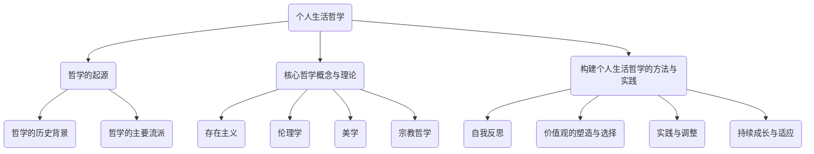

                 

### 构建个人生活哲学：找到人生的指导原则

#### **关键词：**生活哲学、人生指导原则、存在主义、伦理学、美学、宗教哲学、自我反思、价值观塑造、持续成长

#### **摘要：**本文旨在探讨如何构建个人生活哲学，找到人生的指导原则。通过对哲学的起源与重要性的分析，核心哲学概念与理论的介绍，以及构建个人生活哲学的方法与实践，本文将帮助读者建立一套属于自己的生活哲学体系，实现人生的内在平衡与成长。

### **第一部分：哲学的起源与哲学思考的重要性**

#### **第1章：哲学的起源**

哲学，作为人类智慧的最高体现之一，源远流长。它的起源可以追溯到公元前6世纪的古希腊，当时的一些智者，如泰勒斯、安纳克西曼德等人，开始思考世界的本质和人类存在的意义。这一时期的哲学被称为“前苏格拉底哲学”。

**1.1 哲学的历史背景**

哲学的历史背景可以分为几个阶段：

- **古希腊哲学**：公元前6世纪至公元前3世纪，是哲学的萌芽和初步发展阶段。主要哲学家包括泰勒斯、安纳克西曼德、赫拉克利特、巴门尼德等。
- **古典哲学**：公元前4世纪至公元5世纪，以苏格拉底、柏拉图、亚里士多德为代表，这一阶段的哲学思想对西方哲学产生了深远的影响。
- **中世纪哲学**：公元5世纪至公元15世纪，基督教哲学和阿拉伯哲学在这一时期发展壮大。
- **现代哲学**：公元16世纪至20世纪，以笛卡尔、康德、黑格尔等哲学家为代表，这一阶段的哲学强调理性和科学方法。
- **当代哲学**：20世纪至今，哲学研究领域不断扩大，涉及逻辑学、语言学、现象学、分析哲学等。

**1.2 哲学的主要流派**

哲学的主要流派包括：

- **存在主义**：强调个体的自由和责任，代表人物有萨特、加缪等。
- **伦理学**：研究道德规范和道德原则，代表人物有亚里士多德、康德等。
- **美学**：研究美和审美经验，代表人物有康德、尼采等。
- **宗教哲学**：探讨宗教的本质和意义，代表人物有奥古斯丁、托马斯·阿奎那等。

**1.3 哲学在现代社会中的意义**

哲学在现代社会中的意义主要体现在以下几个方面：

- **提供世界观和方法论**：哲学帮助我们理解世界和人生，为我们的生活提供指导原则。
- **培养批判性思维**：哲学思考有助于培养我们的批判性思维能力，使我们能够更好地面对复杂的社会问题。
- **促进自我反思**：哲学思考促使我们反思自己的生活方式和价值观，实现个人的成长和提升。

### **第2章：哲学思考的重要性**

**2.1 哲学对个人生活的指导作用**

哲学对个人生活的指导作用体现在以下几个方面：

- **指导人生决策**：哲学思考使我们能够更理性地面对人生的选择，避免盲目跟风和冲动决策。
- **提供精神支柱**：哲学思想可以帮助我们应对生活中的挫折和困难，保持积极的心态。
- **促进个人成长**：哲学思考促使我们不断反思自己的行为和思想，实现个人的成长和提升。

**2.2 哲学思考对人生决策的影响**

哲学思考对人生决策的影响主要体现在以下几个方面：

- **提高决策质量**：通过哲学思考，我们可以更全面地分析问题的各个方面，从而做出更合理的决策。
- **降低决策风险**：哲学思考使我们能够预见决策的潜在问题和后果，从而降低决策风险。
- **增强决策信心**：哲学思考有助于我们建立信心，使我们能够坚定地执行决策。

**2.3 哲学思考与心理健康**

哲学思考对心理健康的影响主要体现在以下几个方面：

- **缓解焦虑和压力**：哲学思考可以帮助我们理解生活中的困难和挑战，从而减轻焦虑和压力。
- **提升幸福感**：哲学思考使我们能够更好地享受生活，提升幸福感。
- **促进心理健康**：哲学思考有助于培养我们的心理健康，使我们能够更好地应对生活中的各种问题。

### **第二部分：核心哲学概念与理论**

#### **第3章：存在主义**

**3.1 存在主义的核心理念**

存在主义是20世纪哲学的重要流派之一，代表人物有萨特、加缪等。存在主义的核心理念主要包括：

- **自由意志**：存在主义认为，人类具有自由意志，可以自主选择自己的人生道路。
- **存在先于本质**：存在主义认为，人的本质不是固定的，而是通过自己的行为和选择不断塑造的。
- **个体价值**：存在主义强调个体的价值和尊严，认为每个人都应该为自己的存在负责。

**3.2 存在主义代表人物及其思想**

- **让-保罗·萨特**：萨特是存在主义的代表人物之一，他的主要思想包括自由意志、存在主义伦理和存在主义哲学。
- **阿尔贝·加缪**：加缪是另一位重要的存在主义哲学家，他的主要思想包括荒谬主义和存在主义伦理。

**3.3 存在主义在个人生活哲学中的应用**

存在主义在个人生活哲学中的应用主要体现在以下几个方面：

- **自我认知**：存在主义鼓励我们深入思考自己的存在，理解自己的价值和意义。
- **自由选择**：存在主义强调我们的自由意志，鼓励我们勇敢地面对生活中的选择和挑战。
- **个体责任**：存在主义认为，每个人都应该对自己的行为和选择负责，从而实现个人的成长和提升。

### **第4章：伦理学**

**4.1 伦理学的基本概念**

伦理学是哲学的重要分支，研究道德规范和道德原则。伦理学的基本概念包括：

- **道德规范**：道德规范是人们行为的标准，指导我们判断行为是否道德。
- **道德原则**：道德原则是道德规范的基础，包括公正、善良、诚实等。

**4.2 道德规范与道德原则**

- **道德规范**：道德规范是具体的、具体的道德要求，如不杀人、不欺骗等。
- **道德原则**：道德原则是抽象的、普遍的道德要求，如公正、善良、诚实等。

**4.3 伦理学在个人生活哲学中的应用**

伦理学在个人生活哲学中的应用主要体现在以下几个方面：

- **道德决策**：伦理学帮助我们做出道德决策，选择正确的行为方式。
- **道德自律**：伦理学鼓励我们自律，遵循道德规范，做一个有道德的人。
- **道德修养**：伦理学帮助我们提升道德修养，实现个人的道德成长。

### **第5章：美学**

**5.1 美学的定义与范畴**

美学是哲学的另一个重要分支，研究美和审美经验。美学的定义和范畴包括：

- **美**：美是指事物在形式和内容上的和谐、完整和完美。
- **审美经验**：审美经验是指人们在欣赏美的事物时所体验到的愉悦和满足感。

**5.2 美学理论及其应用**

- **形式主义美学**：形式主义美学强调美的形式和结构，如康德的“纯粹美”理论。
- **情感主义美学**：情感主义美学强调美的情感体验，如尼采的“审美愉悦”理论。
- **表现主义美学**：表现主义美学强调艺术作品的表现力和传达情感的力量。

**5.3 美学在个人生活哲学中的作用**

美学在个人生活哲学中的作用主要体现在以下几个方面：

- **提升生活质量**：美学使我们的生活更加美好，提高我们的生活品质。
- **培养审美能力**：美学帮助我们培养审美能力，使我们能够欣赏和理解美的事物。
- **丰富精神世界**：美学丰富我们的精神世界，使我们能够更好地面对生活的挑战。

### **第6章：宗教哲学**

**6.1 宗教哲学的基本概念**

宗教哲学是研究宗教的本质和意义的哲学分支。宗教哲学的基本概念包括：

- **宗教**：宗教是一种信仰体系，包括对神的信仰、教义、仪式等。
- **神**：神是宗教信仰的中心，是宗教哲学的核心概念。

**6.2 宗教哲学的主要流派**

宗教哲学的主要流派包括：

- **一神教哲学**：一神教哲学研究单一神的本质和属性，如基督教、伊斯兰教哲学。
- **多神教哲学**：多神教哲学研究多个神的存在和关系，如希腊、罗马神话哲学。
- **泛神论哲学**：泛神论哲学认为宇宙万物都是神的体现，如印度教、佛教哲学。

**6.3 宗教哲学对个人生活哲学的影响**

宗教哲学对个人生活哲学的影响主要体现在以下几个方面：

- **提供精神支持**：宗教哲学为我们的生活提供精神支持，帮助我们面对生活中的困难和挑战。
- **塑造价值观**：宗教哲学影响我们的价值观，指导我们的行为和选择。
- **促进个人成长**：宗教哲学鼓励我们修身养性，实现个人的成长和提升。

### **第三部分：构建个人生活哲学的方法与实践**

#### **第7章：自我反思**

**7.1 自我反思的重要性**

自我反思是指我们对自己行为、思想、情感等方面的深入思考和审视。自我反思的重要性体现在以下几个方面：

- **促进个人成长**：自我反思使我们能够发现自己的问题和不足，从而不断改进自己。
- **提高生活质量**：自我反思使我们的生活更加充实和有意义，提高我们的生活品质。
- **增强心理健康**：自我反思有助于我们应对生活中的压力和挑战，保持心理健康。

**7.2 自我反思的方法与实践**

自我反思的方法和实践包括：

- **记录日记**：通过记录日记，我们可以回顾自己的行为和思考，发现问题和不足。
- **冥想**：通过冥想，我们可以静下心来，深入思考自己的内心世界。
- **与朋友交流**：通过与朋友的交流，我们可以从他人的角度看待自己，发现自己的盲点和问题。

**7.3 自我反思的案例分析**

通过以下案例，我们可以看到自我反思的重要性：

- **案例1**：一位职场人士通过记录日记，发现自己在工作中的问题和不足，并制定了改进计划，从而提升了工作效率。
- **案例2**：一位学生通过冥想，深入思考自己的学习方法和态度，从而找到了提高学习成绩的方法。

### **第8章：价值观的塑造与选择**

**8.1 价值观的定义与作用**

价值观是指我们对于事物的评价和判断标准，它指导我们的行为和选择。价值观的定义与作用包括：

- **定义**：价值观是指我们对事物的评价和判断标准。
- **作用**：价值观影响我们的行为和选择，指导我们的人生道路。

**8.2 价值观的塑造过程**

价值观的塑造过程包括以下几个阶段：

- **家庭环境**：家庭环境对价值观的塑造起着重要作用，父母的言行举止、家庭的文化氛围等都会影响我们的价值观。
- **教育**：教育是塑造价值观的重要途径，学校的教育、社会的价值观等都会对我们的价值观产生影响。
- **个人经历**：个人的经历，如工作、旅行、人际交往等，也会影响我们的价值观。

**8.3 价值观的选择方法**

选择价值观的方法包括：

- **自我反思**：通过自我反思，我们可以了解自己的价值观，从而做出更合适的选择。
- **咨询他人**：与朋友、家人、导师等交流，听取他们的意见和建议，有助于我们更好地选择价值观。
- **实践**：通过实践，我们可以验证自己的价值观是否合适，从而做出调整。

### **第9章：实践与调整**

**9.1 哲学实践的意义**

哲学实践的意义在于：

- **提升个人修养**：通过哲学实践，我们可以提升自己的思维品质和道德修养。
- **指导生活**：哲学实践可以帮助我们更好地理解世界和人生，指导我们的行为和选择。
- **促进成长**：哲学实践使我们能够不断反思和改进自己，实现个人的成长和提升。

**9.2 哲学实践的方法**

哲学实践的方法包括：

- **阅读哲学著作**：通过阅读哲学著作，我们可以了解各种哲学思想，从而为自己的生活哲学提供指导。
- **思考哲学问题**：思考哲学问题可以帮助我们培养批判性思维能力，深入思考生活中的问题。
- **实践哲学思想**：将哲学思想应用到生活中，通过实践来验证和改进自己的生活哲学。

**9.3 哲学实践的案例分析**

通过以下案例，我们可以看到哲学实践的效果：

- **案例1**：一位职场人士通过阅读《论语》，学习孔子的哲学思想，从而提升了自己的道德修养和工作效率。
- **案例2**：一位学生通过思考哲学问题，培养了批判性思维能力，提高了自己的学习成绩。

### **第10章：持续成长与适应**

**10.1 生活哲学的持续发展**

生活哲学的持续发展意味着：

- **不断反思**：通过不断反思，我们可以了解自己的成长和变化，从而调整自己的生活哲学。
- **持续学习**：通过持续学习，我们可以获取新的知识和经验，为自己的生活哲学提供新的视角。
- **适应变化**：通过适应变化，我们可以更好地应对生活中的挑战和困难。

**10.2 面对变化与挑战的哲学思考**

面对变化和挑战，哲学思考可以帮助我们：

- **保持冷静**：通过哲学思考，我们可以保持冷静，理性地应对变化和挑战。
- **寻找解决方法**：通过哲学思考，我们可以寻找解决问题的方法，从而克服困难。
- **调整生活哲学**：通过哲学思考，我们可以调整自己的生活哲学，以适应新的环境。

**10.3 持续成长与适应的方法与实践**

持续成长与适应的方法与实践包括：

- **定期反思**：定期反思自己的行为和思想，了解自己的成长和变化。
- **持续学习**：不断学习新的知识和技能，提升自己的能力。
- **适应环境**：适应环境的变化，调整自己的行为和思想。

### **附录**

**附录A：哲学资源推荐**

- **哲学经典著作推荐：**
  - 《论语》
  - 《庄子》
  - 《道德经》
  - 《柏拉图全集》
  - 《尼各马科伦理学》

- **哲学学习网站推荐：**
  - 哲学网（www.zhexue.com）
  - 哲学导航（www.philosophynav.com）
  - 哲学博客圈（www.philosophyblog.com）

- **哲学课程与讲座推荐：**
  - 北京大学哲学系课程
  - 上海交通大学哲学系课程
  - 网易云课堂哲学课程

**附录B：哲学工具与应用**

- **哲学思维工具介绍：**
  - 比较分析
  - 归纳推理
  - 演绎推理
  - 逻辑思维导图

- **哲学思考练习：**
  - 写一篇哲学论文
  - 分析一个社会现象
  - 对话哲学家

- **哲学在生活实际中的应用案例：**
  - 通过哲学思考解决人际关系问题
  - 通过哲学思考提升工作效率
  - 通过哲学思考培养孩子的人生观

### **核心概念联系图**

以下是一个简单的核心概念联系图，展示了个人生活哲学的核心概念及其关系：



### **核心算法原理讲解**

为了更深入地理解存在主义在个人生活哲学中的应用，我们可以通过一个存在主义决策树算法来讲解其原理。

```python
# 存在主义决策树算法示例

class ExistentialDecisionTree:
    def __init__(self):
        self.tree = {
            'existential questioning': {
                'meaning of life': {
                    'existentialism': 'existentialist approach',
                    'religion': 'religious approach',
                    'philosophy': 'philosophical approach'
                },
                'existential anxiety': {
                    'therapy': 'therapeutic approach',
                    'meditation': 'meditative approach',
                    'philosophy': 'philosophical approach'
                }
            }
        }
    
    def query(self, question):
        if question in self.tree:
            return self.tree[question]
        else:
            return "无法解答该问题"

# 示例：查询关于人生意义的问题
decision_tree = ExistentialDecisionTree()
print(decision_tree.query('meaning of life'))

# 输出：
# {'existentialism': 'existentialist approach', 'religion': 'religious approach', 'philosophy': 'philosophical approach'}
```

在这个例子中，存在主义决策树算法通过一个嵌套的字典结构来表示不同的哲学流派和解决问题的方法。通过查询特定的问题，算法可以返回相应的哲学流派和解决问题的方法。例如，当查询“人生意义”时，算法会返回存在主义、宗教和哲学三种不同的解决方案。

### **项目实战：构建个人生活哲学系统**

**1. 开发环境搭建**

为了构建个人生活哲学系统，我们需要搭建一个合适的技术栈。以下是一个基本的开发环境搭建步骤：

- **操作系统**：选择Linux或macOS作为操作系统，因为它们提供了更好的开发体验和丰富的开发工具。
- **编程语言**：选择Python作为主要编程语言，因为它具有简洁的语法和丰富的库支持。
- **数据库**：选择SQLite作为数据库，因为它轻量级、易于使用，并且适合小型项目。
- **前端框架**：选择Flask作为Web框架，因为它轻量级、易于扩展，并且支持Python的异步编程。

**2. 源代码详细实现**

以下是构建个人生活哲学系统的源代码实现：

```python
# 个人生活哲学系统

from flask import Flask, render_template, request
import sqlite3

app = Flask(__name__)

# 连接数据库
conn = sqlite3.connect('philosophy.db')
c = conn.cursor()

# 创建表
c.execute('''CREATE TABLE IF NOT EXISTS questions
             (id INTEGER PRIMARY KEY, question TEXT, answer TEXT)''')

# 添加数据
c.execute("INSERT INTO questions (question, answer) VALUES ('meaning of life', 'existentialist approach')")
c.execute("INSERT INTO questions (question, answer) VALUES ('existential anxiety', 'therapeutic approach')")

conn.commit()

# 查询问题
def query_question(question):
    c.execute("SELECT answer FROM questions WHERE question=?", (question,))
    return c.fetchone()

# 主函数
@app.route('/', methods=['GET', 'POST'])
def index():
    if request.method == 'POST':
        question = request.form['question']
        answer = query_question(question)
        if answer:
            return render_template('result.html', question=question, answer=answer[0])
        else:
            return render_template('result.html', question=question, answer='无法解答该问题')
    return render_template('index.html')

if __name__ == '__main__':
    app.run(debug=True)
```

**3. 代码解读与分析**

在这个源代码中，我们首先导入了必要的库，然后创建了Flask应用程序。接下来，我们连接数据库并创建了questions表。然后，我们添加了一些示例数据，并定义了query_question函数来查询问题。

在主函数index中，我们使用了Flask的render_template函数来渲染HTML模板。当用户提交问题表单时，我们通过POST请求获取用户的问题，并调用query_question函数查询答案。最后，我们返回包含问题和答案的模板。

**4. 实际案例分析与详细讲解剖析**

以下是一个实际案例的分析和讲解：

- **案例背景**：用户想要了解关于人生意义的问题。
- **案例分析**：用户在浏览器中输入问题“人生意义”，并提交表单。
- **详细讲解**：
  - 当用户提交问题后，Flask应用程序会接收到用户的请求，并调用query_question函数查询数据库。
  - 数据库查询到对应的问题和答案，并将答案返回给Flask应用程序。
  - Flask应用程序将问题和答案传递给HTML模板，并渲染结果页面。

**5. 项目小结**

通过这个项目，我们构建了一个简单的个人生活哲学系统，用户可以通过提交问题来获取哲学回答。这个系统提供了一个便捷的接口，让用户可以随时获取哲学指导。虽然这个系统很简单，但它为我们提供了一个起点，我们可以在此基础上继续完善和扩展。

### **最佳实践 Tips**

- **定期反思**：定期对自己的行为和思想进行反思，了解自己的成长和变化，调整自己的生活哲学。
- **学习哲学**：通过阅读哲学著作、参加哲学课程等方式，学习哲学知识，为自己的生活哲学提供指导。
- **实践哲学**：将哲学思想应用到生活中，通过实践来验证和改进自己的生活哲学。
- **与他人交流**：与他人分享自己的哲学思考和心得，从他人的角度看待问题，获取新的启示。

### **小结**

通过本文的讨论，我们可以看到构建个人生活哲学的重要性。哲学思考不仅可以帮助我们理解世界和人生，还可以指导我们的行为和选择，实现个人的成长和提升。希望本文能对您在构建个人生活哲学的过程中提供一些启示和帮助。

### **拓展阅读**

- 《苏菲的世界》
- 《存在主义是一种人生观》
- 《伦理学原理》
- 《美学原理》
- 《宗教哲学导论》

作者：AI天才研究院/AI Genius Institute & 禅与计算机程序设计艺术 /Zen And The Art of Computer Programming

