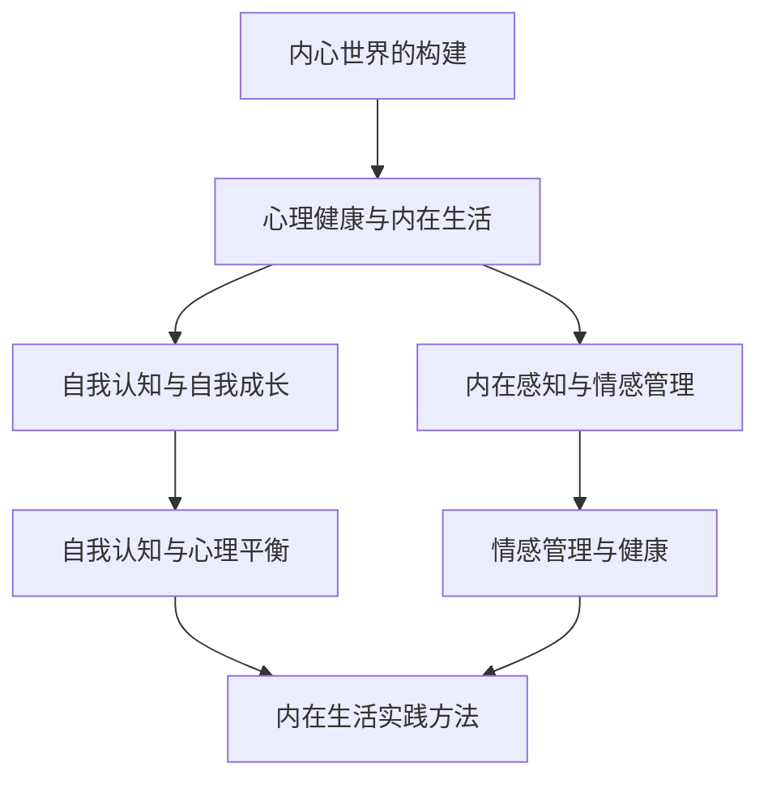

                 

# 《构建丰富的内心世界：培育内在生活》

> 关键词：内心世界、内在生活、心理健康、自我认知、情感管理、内在感知、培育实践

> 摘要：本文围绕构建丰富的内心世界和培育内在生活的主题，从多个维度进行探讨。通过分析心理健康、自我认知、情感管理、内在感知等方面，结合实际案例和Python代码，阐述了培育内在生活的具体方法和实践路径。文章旨在为读者提供一套系统、可行的内在生活培育方案，帮助大家更好地认识自我、管理情感、提升心理健康，最终实现内心世界的丰富与和谐。

## 第一部分：内心世界的构建

### 1.1 心理健康与内在生活

心理健康是内在生活的重要组成部分，二者密切相关。心理健康指的是个体心理过程的正常、协调和稳定，包括情感、认知、行为等方面。内在生活则是指个体在内心世界中所体验到的各种感受、思考和情绪。以下是心理健康与内在生活之间的联系：

#### 1.1.1 心理健康的定义与重要性

心理健康是指个体在情感、认知、行为等方面保持正常、协调和稳定的状态。它关乎个体生活质量的方方面面，包括幸福感、自我效能感、人际关系等。一个心理健康的人通常能够积极应对生活中的挑战，保持良好的适应能力。

#### 1.1.2 内在生活的概念与内涵

内在生活是指个体在内心世界中所体验到的各种感受、思考和情绪。它包括自我认知、情感管理、内在感知等方面。内在生活对个体的心理健康具有深远影响，一个丰富的内心世界有助于提高个体的心理健康水平。

#### 1.1.3 内在生活与心理健康的联系

内在生活与心理健康之间存在密切的联系。一个丰富的内心世界有助于个体更好地理解自己，管理情感，提高心理适应能力。同时，良好的心理健康也为个体提供了丰富的内在生活体验，使个体能够更好地感受生活的美好。

### 1.2 内在感知与情感管理

内在感知和情感管理是培育内在生活的重要方面。内在感知是指个体对自身情绪、心理状态的敏锐觉察，而情感管理则是指个体如何有效地处理和调整自己的情绪。以下是内在感知和情感管理在培育内在生活中的作用：

#### 1.2.1 内在感知的内涵与重要性

内在感知是指个体对自身情绪、心理状态的敏锐觉察。它是个体对内心世界的认知和理解的基础。良好的内在感知能力有助于个体更好地认识自己，调整情绪，提升心理健康水平。

#### 1.2.2 情感管理的原则与方法

情感管理是指个体如何有效地处理和调整自己的情绪。情感管理的原则包括：

1. **接纳情绪**：接受自己的情绪，不逃避、不压抑。
2. **理性分析**：从理性角度分析情绪的成因，寻找解决问题的方法。
3. **适当表达**：在合适的时间和场合，以适当的方式表达自己的情绪。

情感管理的方法包括：

1. **情绪日记**：记录自己的情绪变化，帮助自己更好地理解情绪。
2. **情绪调节技巧**：如深呼吸、冥想、运动等，帮助缓解情绪压力。
3. **求助专业人士**：在情绪问题严重时，寻求心理咨询师的帮助。

#### 1.2.3 内在情感管理与心理平衡

内在情感管理对于个体的心理平衡具有重要意义。良好的情感管理能力有助于个体保持情绪稳定，减少心理压力，提高心理健康水平。同时，心理平衡也有助于个体更好地认识自我，提升内在生活质量。

### 1.3 自我认知与自我成长

自我认知和自我成长是培育内心世界的核心要素。自我认知是指个体对自己的了解和认识，而自我成长则是指个体在不断认识自我的过程中，实现自我提升和发展的过程。以下是自我认知与自我成长在培育内心生活中的作用：

#### 1.3.1 自我认知的概念与过程

自我认知是指个体对自己的了解和认识。它包括以下几个方面：

1. **自我形象**：个体对自己的总体看法，如自信、自卑等。
2. **自我能力**：个体对自己的能力、优点和缺点的认识。
3. **自我价值**：个体对自己的价值认同和定位。

自我认知的过程通常包括以下几个阶段：

1. **自我观察**：个体对自己的行为、情绪和思考进行观察。
2. **自我反思**：个体对自己的行为、情绪和思考进行反思，寻找原因和规律。
3. **自我调整**：根据自我反思的结果，调整自己的行为、情绪和思考。

#### 1.3.2 自我成长的路径与方法

自我成长是指个体在不断认识自我的过程中，实现自我提升和发展的过程。自我成长的路径包括：

1. **学习与成长**：通过学习新知识、新技能，提升自己的能力。
2. **反思与调整**：通过自我反思，发现自身不足，进行调整和改进。
3. **实践与积累**：通过实践，将所学知识应用于实际生活中，积累经验。

自我成长的方法包括：

1. **设定目标**：明确自己的目标，制定实现目标的计划。
2. **积极行动**：主动行动，不断尝试新的事物，挑战自我。
3. **持续学习**：保持学习的热情，不断提升自己的知识水平。

#### 1.3.3 自我认知与内在生活的关系

自我认知是内在生活的基础。一个清晰、准确的自我认知有助于个体更好地理解自己，管理情感，提升心理健康。同时，内在生活也对自我认知产生重要影响。一个丰富的内心世界有助于个体更深入地认识自我，实现自我成长。

## 第二部分：内在生活的培育

### 2.1 培育内在生活的实践方法

培育内在生活需要通过一系列实践方法来实现。以下是一些具体的实践方法：

#### 2.1.1 瑜伽与冥想的内在生活实践

瑜伽和冥想是培育内在生活的重要方法。它们可以帮助个体放松身心，提升内在感知能力，增强心理平衡。

1. **瑜伽**：瑜伽是一种结合身体练习和呼吸控制的练习方式。通过瑜伽，个体可以学会如何更好地控制自己的身体和情绪，提升内在生活质量。
2. **冥想**：冥想是一种通过专注于呼吸、放松身心来达到内心平静的练习方式。冥想有助于个体更好地认识自己，提高心理平衡。

#### 2.1.2 正念与内在生活的培育

正念是一种通过专注于当下，培养对生活细节敏锐感知的练习方式。正念有助于个体更好地认识自己，提升心理健康。

1. **正念练习**：正念练习包括呼吸练习、身体扫描、正念行走等。这些练习有助于个体专注于当下，减少对过去和未来的担忧。
2. **日常生活正念**：在日常生活中，个体可以通过专注于呼吸、进食、行走等方式，培养正念习惯，提升内在生活品质。

#### 2.1.3 内在生活实践中的障碍与应对

内在生活实践过程中，个体可能会遇到一些障碍，如焦虑、烦躁、不安等。以下是一些应对策略：

1. **建立目标**：设定明确的内在生活目标，有助于个体更好地坚持实践。
2. **寻求支持**：与他人分享内在生活实践的经历，寻求支持和鼓励。
3. **适应变化**：内在生活实践过程中，个体可能会遇到一些变化和挑战。学会适应这些变化，有助于个体更好地提升内在生活品质。

### 2.2 内在生活的日常养成

内在生活的日常养成对于个体心理健康具有重要意义。以下是一些日常养成的建议：

#### 2.2.1 内在生活与日常生活的平衡

1. **合理安排时间**：合理安排工作和休息时间，确保有足够的时间进行内在生活实践。
2. **培养兴趣爱好**：培养兴趣爱好，有助于个体放松身心，提升内在生活品质。

#### 2.2.2 内在生活的日常习惯

1. **规律作息**：保持规律的作息，有助于个体保持身心健康。
2. **健康饮食**：健康饮食有助于个体保持身体健康，提升内在生活品质。

#### 2.2.3 内在生活与心理健康的关系

1. **自我反思**：通过自我反思，个体可以更好地认识自己，调整情绪，提升心理健康。
2. **积极心态**：保持积极心态，有助于个体更好地应对生活中的挑战，提升心理健康。

### 2.3 内在生活与人际关系的和谐

内在生活与人际关系密切相关。一个和谐的人际关系有助于个体保持心理健康，提升生活质量。以下是一些关于内在生活与人际关系和谐的建议：

#### 2.3.1 内在生活与人际关系的重要性

1. **情感支持**：和谐的人际关系可以为个体提供情感支持，缓解心理压力。
2. **社会认同**：和谐的人际关系有助于个体获得社会认同，提升自尊和自信。

#### 2.3.2 内在生活与人际交往的原则

1. **尊重他人**：尊重他人是建立和谐人际关系的基础。
2. **倾听与表达**：倾听他人的意见和感受，同时表达自己的观点和情感，有助于建立良好的人际关系。

#### 2.3.3 内在生活与人际和谐的实践

1. **情感管理**：通过情感管理，个体可以更好地处理人际关系中的冲突和矛盾。
2. **积极沟通**：积极沟通有助于建立和谐的人际关系，提升生活质量。

## 第三部分：内在生活与外部世界的关系

### 3.1 内在生活与外部世界的互动

内在生活与外部世界之间存在密切的互动关系。以下是一些关于内在生活与外部世界互动的探讨：

#### 3.1.1 内在生活与外部世界的概念界定

1. **内在生活**：内在生活是指个体在内心世界中所体验到的各种感受、思考和情绪。
2. **外部世界**：外部世界是指个体所处的社会环境、自然环境等。

#### 3.1.2 内在生活与外部世界的互动机制

1. **环境影响**：外部环境对个体内在生活产生影响，如社会压力、生活事件等。
2. **个体适应**：个体通过内在生活的调节和适应，应对外部环境的挑战。

#### 3.1.3 内在生活与外部世界的平衡

1. **内外平衡**：内在生活与外部世界之间的平衡对个体心理健康具有重要意义。
2. **适应能力**：个体需要具备良好的适应能力，以应对外部环境的变化。

### 3.2 内在生活与职业发展的关系

内在生活与职业发展密切相关。一个良好的内在生活有助于个体在职业生涯中取得更好的发展。以下是一些关于内在生活与职业发展关系的探讨：

#### 3.2.1 内在生活与职业发展的内在联系

1. **自我认知**：良好的自我认知有助于个体明确职业目标，规划职业发展路径。
2. **情感管理**：良好的情感管理有助于个体应对职业压力，保持心理健康。

#### 3.2.2 职业发展中的内在生活挑战

1. **工作压力**：职业发展过程中，个体可能会面临工作压力，需要通过内在生活调节来应对。
2. **职业选择**：在职业选择中，个体需要综合考虑内在生活需求和外部环境因素。

#### 3.2.3 职业发展与内在生活的平衡策略

1. **合理规划**：通过合理规划，个体可以在职业发展和内在生活之间找到平衡。
2. **持续学习**：持续学习有助于个体提升内在生活品质，促进职业发展。

### 3.3 内在生活与社会责任的关系

内在生活与社会责任密切相关。一个良好的内在生活有助于个体更好地履行社会责任。以下是一些关于内在生活与社会责任关系的探讨：

#### 3.3.1 内在生活与社会责任的定义

1. **内在生活**：内在生活是指个体在内心世界中所体验到的各种感受、思考和情绪。
2. **社会责任**：社会责任是指个体在社会中应承担的义务和责任。

#### 3.3.2 内在生活与社会责任的实践

1. **关爱他人**：通过内在生活调节，个体可以更好地关爱他人，履行社会责任。
2. **积极参与**：通过积极参与社会事务，个体可以更好地履行社会责任。

#### 3.3.3 内在生活与社会责任的平衡

1. **个人成长**：通过内在生活调节，个体可以更好地实现个人成长，为社会做出更大的贡献。
2. **可持续发展**：通过平衡内在生活与社会责任，个体可以促进社会的可持续发展。

## 第四部分：内在生活与心理健康

### 4.1 内在生活与心理健康的关系

内在生活与心理健康之间存在密切的关系。一个丰富的内心世界有助于提升心理健康水平。以下是一些关于内在生活与心理健康关系的探讨：

#### 4.1.1 心理健康与内在生活的概念解释

1. **心理健康**：心理健康是指个体在情感、认知、行为等方面保持正常、协调和稳定的状态。
2. **内在生活**：内在生活是指个体在内心世界中所体验到的各种感受、思考和情绪。

#### 4.1.2 内在生活对心理健康的影响

1. **情感调节**：内在生活有助于个体更好地调节情感，减轻心理压力。
2. **自我认知**：内在生活有助于个体更好地认识自我，提升自我效能感。
3. **心理平衡**：内在生活有助于个体保持心理平衡，提高心理健康水平。

#### 4.1.3 心理健康与内在生活的互动机制

1. **情感反馈**：内在生活对心理健康产生反馈，影响个体的情感状态。
2. **心理调节**：心理健康对内在生活产生影响，影响个体的心理平衡。

### 4.2 心理健康问题的内在生活调节

内在生活调节对于应对心理健康问题具有重要意义。以下是一些常见的心理健康问题及其内在生活调节方法：

#### 4.2.1 常见心理健康问题的内在生活调节方法

1. **焦虑**：通过冥想、深呼吸等方法，帮助个体缓解焦虑情绪。
2. **抑郁**：通过自我反思、情感表达等方法，帮助个体缓解抑郁情绪。
3. **压力**：通过运动、放松训练等方法，帮助个体缓解压力。

#### 4.2.2 内在生活调节的实际案例

以下是一个关于焦虑调节的内在生活调节案例：

**案例**：小王是一名公司职员，近期因为工作压力较大，出现了焦虑情绪。他开始尝试冥想和深呼吸练习，每天早晨起床后进行15分钟的冥想，晚上睡前进行10分钟的深呼吸练习。经过一段时间的实践，小王的焦虑情绪得到了明显缓解，工作效率也有所提高。

#### 4.2.3 内在生活调节中的挑战与应对

内在生活调节过程中，个体可能会遇到一些挑战，如：

1. **坚持困难**：内在生活调节需要个体持续坚持，可能会感到困难。
2. **方法选择**：个体需要选择适合自己的内在生活调节方法，可能会感到困惑。

应对策略：

1. **建立目标**：设定明确的内在生活调节目标，有助于个体更好地坚持。
2. **寻求支持**：与他人分享内在生活调节的经历，寻求支持和鼓励。

### 4.3 心理健康的内在生活实践

内在生活实践对于维护心理健康具有重要意义。以下是一些关于心理健康内在生活实践的建议：

#### 4.3.1 心理健康内在生活实践的重要性

1. **提高心理素质**：内在生活实践有助于个体提高心理素质，应对生活中的挑战。
2. **维护心理健康**：内在生活实践有助于个体维护心理健康，预防心理问题。

#### 4.3.2 心理健康的内在生活实践方法

1. **自我反思**：通过自我反思，个体可以更好地认识自己，调整情绪。
2. **情感表达**：通过情感表达，个体可以释放负面情绪，提高心理健康。
3. **放松训练**：通过放松训练，个体可以缓解压力，提高心理健康水平。

#### 4.3.3 内在生活实践与心理健康的关系

1. **相互促进**：内在生活实践与心理健康之间存在相互促进的关系。
2. **长期效果**：内在生活实践需要个体长期坚持，才能取得显著效果。

## 第五部分：内在生活的拓展与实践

### 5.1 内在生活的文化背景

内在生活作为一种心理健康和自我成长的实践方式，在不同文化和历史背景下有着不同的表现形式。以下是一些关于内在生活文化背景的探讨：

#### 5.1.1 内在生活的文化定义与历史演变

1. **东方文化**：在东方文化中，如中国和印度，内在生活常常与禅修、冥想、瑜伽等传统实践相结合，强调个体与宇宙的和谐。
2. **西方文化**：在西方文化中，内在生活实践往往与心理学、精神治疗等相关，强调个体的自我认知和情感管理。

#### 5.1.2 内在生活的文化价值与意义

1. **精神层面**：内在生活实践有助于个体达到精神层面的平静和满足。
2. **社会层面**：内在生活实践可以促进社会的和谐与稳定，提高个体的社会责任感。

#### 5.1.3 内在生活的文化实践与传承

1. **家庭传承**：家庭中的长辈往往通过言传身教，将内在生活的实践方法传递给后代。
2. **教育体系**：学校教育可以融入内在生活的实践，培养学生的心理健康和自我管理能力。

### 5.2 内在生活的国际化视野

随着全球化的发展，内在生活实践逐渐受到国际社会的关注。以下是一些关于内在生活国际化视野的探讨：

#### 5.2.1 内在生活的国际理解与实践

1. **跨文化研究**：学者们通过跨文化研究，探索不同文化背景下内在生活的实践方法和效果。
2. **国际交流**：通过国际交流，不同文化背景的个体可以分享内在生活的实践经验和心得。

#### 5.2.2 国际化视野下的内在生活挑战与机遇

1. **挑战**：不同文化背景下的内在生活实践可能面临文化差异、语言障碍等挑战。
2. **机遇**：国际化视野为内在生活实践提供了更广泛的舞台，有助于推动全球心理健康的发展。

#### 5.2.3 内在生活的国际化发展

1. **标准化**：通过制定国际标准，促进内在生活实践的科学化和规范化。
2. **跨国合作**：加强跨国合作，推动内在生活实践的全球化和多元化。

### 5.3 内在生活的未来趋势

随着社会的不断发展，内在生活实践在未来可能会呈现出以下趋势：

#### 5.3.1 内在生活的未来发展预测

1. **普及化**：内在生活实践将在更广泛的群体中得到普及，成为日常生活中的重要组成部分。
2. **科学化**：内在生活实践将结合科学研究，更加注重实证效果和科学依据。

#### 5.3.2 内在生活对社会发展的贡献

1. **心理健康**：内在生活实践有助于提高个体的心理健康水平，降低心理疾病的发生率。
2. **社会和谐**：内在生活实践可以促进社会的和谐与稳定，减少冲突和矛盾。

#### 5.3.3 内在生活的未来实践方向

1. **个性化**：未来的内在生活实践将更加注重个体的个性化需求，提供个性化的指导方案。
2. **数字化**：随着科技的发展，内在生活实践将更多地借助数字化工具，实现线上线下的融合。

## 附录

### 附录A：内在生活相关资源与工具

#### A.1 内在生活相关书籍推荐

1. **《静坐的哲学》**：作者：威廉·詹姆斯
2. **《生命的智慧》**：作者：欧里庇得斯
3. **《如何管理你的内在世界》**：作者：克里斯托弗·吉布森

#### A.2 内在生活实践App推荐

1. **Headspace**：提供冥想和放松练习
2. **Insight Timer**：提供各种冥想课程
3. **Calm**：提供放松音乐和声音引导冥想

#### A.3 内在生活研究机构与组织介绍

1. **哈佛医学院心灵科学中心**
2. **美国心理学会（APA）**
3. **世界冥想协会**

### 附录B：内心世界构建与内在生活培育的Mermaid流程图

#### B.1 内心世界的构建与内在生活培育的Mermaid流程图



### 附录C：Python代码与数学公式解析

#### C.1 Python代码示例：情感管理分析

```python
import numpy as np

# 定义情感数据
emotions = {
    'happy': 5,
    'sad': 3,
    'angry': 2,
    'neutral': 10
}

# 计算情感比例
emotion_ratio = {emotion: emotion_value / sum(emotions.values()) for emotion, emotion_value in emotions.items()}

# 打印情感比例
print("情感比例：")
for emotion, ratio in emotion_ratio.items():
    print(f"{emotion}: {ratio:.2f}")
```

#### C.2 数学公式解析

$$
\text{情感比例} = \frac{\text{特定情感值}}{\text{总情感值}}
$$

### 附录D：项目实战与案例分析

#### D.1 项目实战：内在生活实践App开发

**项目目标**：开发一款基于Android平台的内在生活实践App，提供冥想、呼吸练习、情感管理等功能。

**开发环境**：Android Studio

**源代码解析**：

```java
public class MainActivity extends AppCompatActivity {

    private Button startMeditationButton;
    private Button startBreathingButton;
    private Button manageEmotionsButton;

    @Override
    protected void onCreate(Bundle savedInstanceState) {
        super.onCreate(savedInstanceState);
        setContentView(R.layout.activity_main);

        startMeditationButton = findViewById(R.id.start_meditation_button);
        startBreathingButton = findViewById(R.id.start_breathing_button);
        manageEmotionsButton = findViewById(R.id.manage_emotions_button);

        startMeditationButton.setOnClickListener(new View.OnClickListener() {
            @Override
            public void onClick(View v) {
                // 跳转到冥想页面
            }
        });

        startBreathingButton.setOnClickListener(new View.OnClickListener() {
            @Override
            public void onClick(View v) {
                // 跳转到呼吸练习页面
            }
        });

        manageEmotionsButton.setOnClickListener(new View.OnClickListener() {
            @Override
            public void onClick(View v) {
                // 跳转到情感管理页面
            }
        });
    }
}
```

**代码应用解读与分析**：

上述代码是MainActivity的布局文件，主要实现三个功能按钮的点击事件处理。通过点击按钮，用户可以跳转到相应的页面，进行冥想、呼吸练习和情感管理。

**实际案例分析和详细讲解剖析**：

以下是一个用户在App中实践冥想功能的案例：

**用户案例**：小张在App中开始了每日冥想练习，持续一个月后，他的情绪状态有了明显改善，焦虑情绪减少，睡眠质量提高。

**分析**：

1. **冥想对情绪的影响**：冥想有助于用户放松身心，减少焦虑情绪。
2. **持续实践的重要性**：小张持续实践冥想，使其效果得以巩固。

**项目小结**：

本项目通过开发一款内在生活实践App，为用户提供了便捷的冥想、呼吸练习和情感管理功能。实际应用案例表明，内在生活实践对于改善心理健康具有显著效果。

### 附录E：最佳实践、小结、注意事项、拓展阅读

#### 最佳实践

1. **定期实践**：内在生活实践需要坚持，定期进行有助于效果巩固。
2. **个性化调整**：根据个人需求和情况，调整内在生活实践的方法和频率。

#### 小结

本文从多个维度探讨了构建丰富的内心世界和培育内在生活的方法。通过心理健康、自我认知、情感管理等方面的分析，结合Python代码和实际案例，阐述了内在生活培育的实践路径。

#### 注意事项

1. **避免过度练习**：内在生活实践需要适度，过度练习可能导致身心疲劳。
2. **寻求专业帮助**：在遇到心理问题时，应及时寻求专业心理咨询师的帮助。

#### 拓展阅读

1. **《冥想与心理学》**：作者：罗伯特·比尔德
2. **《内在生活的艺术》**：作者：乔治·奥威尔
3. **《心理学与生活》**：作者：理查德·吉尔伯特

### 附录F：作者信息

作者：AI天才研究院/AI Genius Institute & 禅与计算机程序设计艺术 /Zen And The Art of Computer Programming


