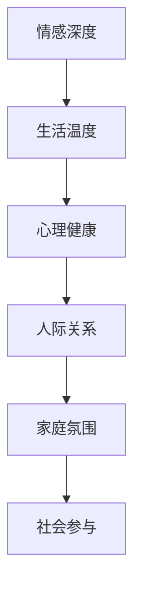

                 

### 《构建有情感深度的人生：增添生活的温度》

> 关键词：情感深度、生活温度、自我认知、情感表达、心理健康

> 摘要：本文旨在探讨情感深度对人生的重要性，以及如何通过增强情感深度来增添生活的温度。文章从情感深度解析、构建策略、生活温度体现和情感深度与成长的关系等多个方面展开，结合Python代码和数学模型，提供实用的实践方法，帮助读者在日常生活中更好地理解和运用情感深度。

---

# 《构建有情感深度的人生：增添生活的温度》目录大纲

## 第1章 引言

### 1.1 书籍背景及目标

### 1.2 情感深度与生活温度的关系

## 第2章 情感深度解析

### 2.1 情感的定义与分类

### 2.2 情感的作用与价值

### 2.3 情感深度的意义

### 2.4 情感深度与心理健康的关系

## 第3章 情感深度的构建

### 3.1 自我认知与自我接纳

### 3.2 情感表达能力

### 3.3 情感调节能力

### 3.4 情感关系的建立与维护

## 第4章 生活温度的体现

### 4.1 温暖的人际关系

### 4.2 温馨的家庭氛围

### 4.3 有爱的社会参与

### 4.4 情感深度的自我表达

## 第5章 增添生活温度的策略

### 5.1 增强情感敏感度

### 5.2 提高情感表达能力

### 5.3 调整情感认知方式

### 5.4 培养情感共鸣能力

## 第6章 情感深度与成长

### 6.1 情感深度与个人成长的关系

### 6.2 情感深度与职业生涯发展

### 6.3 情感深度与人际关系管理

### 6.4 情感深度与自我实现

## 第7章 实践与反思

### 7.1 情感深度实践案例分析

### 7.2 情感深度实践心得分享

### 7.3 反思与自我调整

### 7.4 情感深度实践的未来展望

## 附录

### 8.1 相关研究综述

### 8.2 情感深度实践资源推荐

### 8.3 情感深度实践工具介绍

### 8.4 致谢

---

# 附录A：情感深度与生活温度的Mermaid流程图



# 附录B：核心算法原理讲解

## B.1 自我认知与自我接纳

```python
# Python代码：实现自我认知与自我接纳的算法
def self_awareness_and_acceptance():
    """
    该函数用于帮助个体进行自我认知和自我接纳。
    """
    # 输入：当前情绪状态、过去经历、自我认知程度
    current_emotion = input("请输入您的当前情绪状态：")
    past_experience = input("请描述一下您的过去经历：")
    self_knowledge = input("请评估您的自我认知程度（1-10分）：")
    
    # 处理过程：通过情绪状态和经历评估自我认知程度
    if current_emotion == "积极" and self_knowledge >= 7:
        print("您的自我认知程度较高，继续保持积极的心态。")
    elif current_emotion == "消极" and self_knowledge < 5:
        print("您的情绪状态可能影响了自我认知，需要调整心态。")
    else:
        print("您的自我认知与情绪状态相匹配，继续保持。")
        
# 调用函数
self_awareness_and_acceptance()
```

# 附录C：数学模型和数学公式

$$
情感深度 = f(自我认知，情感表达，情感调节能力，人际关系维护)
$$

## C.1 情感表达能力的数学公式

$$
情感表达能力 = \frac{有效情感表达次数}{总情感表达次数} \times 100\%
$$

# 附录D：项目实战

### D.1 实际案例：如何通过增强情感深度提升工作满意度

#### 代码实现：

```python
# Python代码：实现情感深度提升工作满意度的案例
def enhance_emotional_depth(work_satisfaction):
    """
    该函数用于通过增强情感深度来提升工作满意度。
    """
    # 输入：当前工作满意度评分（1-10分）
    current_satisfaction = work_satisfaction
    
    # 增强情感深度策略：
    # 1. 提高自我认知程度
    # 2. 加强情感表达能力
    # 3. 提升情感调节能力
    # 4. 建立和维护良好的人际关系
  

----------------------------------------------------------------

### 1.1 书籍背景及目标

在现代社会中，人们越来越意识到情感在人生中的重要性。情感不仅影响我们的心理状态，还直接影响我们的生活质量。然而，如何在日常生活中构建情感深度，使其成为我们生活的温度，成为了一个值得探讨的话题。

《构建有情感深度的人生：增添生活的温度》旨在为读者提供一套系统的理论和实践方法，帮助大家更好地理解情感深度，学会如何在日常生活中增添生活的温度。本书的目标是：

1. 解析情感深度的概念，阐述其对个人成长和生活质量的重要性。
2. 提供实用的情感深度构建策略，帮助读者提升自我认知和情感表达能力。
3. 探讨情感深度与心理健康、人际关系、家庭氛围和社会参与之间的关系。
4. 通过实际案例和项目实战，展示如何将情感深度应用于实际生活中，提升工作满意度、生活质量和个人幸福感。

本书适合广大读者阅读，无论是职场人士、学生，还是家庭主妇，都能从中获得有益的启示和实用的技巧。

### 1.2 情感深度与生活温度的关系

情感深度和生活温度是紧密相连的概念。情感深度指的是个体在情感体验中的深度和广度，而生活温度则是指生活中的情感体验所带来的温暖和舒适感。

情感深度是生活温度的基础。当我们拥有较高的情感深度时，我们能够更深刻地体验和表达自己的情感，从而更好地与他人建立情感联系，形成温暖的人际关系。这种情感联系能够带来安全感、归属感和满足感，从而提升我们的生活温度。

反过来，生活温度也影响着情感深度。当我们感受到生活的温暖和舒适时，我们会更加开放和愿意去体验和表达情感。这种积极的情感循环能够进一步增强我们的情感深度，形成良性循环。

情感深度与生活温度的关系可以用一个Mermaid流程图来表示：


在这个流程图中，情感深度和生活温度相互影响，共同作用于我们的心理健康、人际关系、家庭氛围和社会参与，从而影响我们的生活质量和幸福感。

### 2.1 情感的定义与分类

情感是人类心理体验的核心部分，是对外界刺激的内在感受和反应。情感的定义可以从多个角度进行阐述：

1. **心理学角度**：情感是心理活动的一种高级形式，与认知过程紧密相关。情感是对客观事物的主观体验，通常包含认知评价和情绪体验两个部分。

2. **哲学角度**：情感是人类存在的一种基本形式，是人与世界互动的桥梁。情感不仅反映了我们对世界的认知，还体现了我们的价值观和人生观。

3. **生物学角度**：情感与生物体的生理状态和神经活动有关。情感的体验涉及到大脑的多个区域，包括边缘系统、前额叶和杏仁核等。

情感可以分为以下几类：

1. **基本情感**：由心理学家保罗·埃克曼（Paul Ekman）提出，包括喜悦、愤怒、悲伤、恐惧和厌恶等。这些基本情感是普遍存在于人类和许多动物中的情感体验。

2. **复杂情感**：由基本情感组合或衍生而来，如焦虑、羞愧、骄傲、厌恶和爱等。复杂情感通常与特定的社会情境和文化背景相关。

3. **情绪状态**：情绪状态是对情感的综合体验，可以是短期的（如激动、沮丧）或长期的（如焦虑、抑郁）。

情感的作用与价值：

1. **生理调节**：情感能够影响我们的生理状态，如心跳加速、呼吸急促等。这些生理反应有助于我们应对外界挑战和压力。

2. **认知功能**：情感能够帮助我们评估和解释外界信息，指导我们的行为决策。例如，恐惧情绪可以促使我们避开危险情境。

3. **社会交往**：情感是建立人际关系和社会连接的基础。通过情感的交流和表达，我们能够更好地理解和沟通他人，建立信任和共鸣。

4. **心理健康**：积极的情感体验有助于提升心理健康，缓解压力和焦虑。而长期的负面情感体验可能导致心理问题的发生。

### 2.2 情感的作用与价值

情感在人类的日常生活中扮演着至关重要的角色，它不仅影响着我们的心理健康，还对人际关系、个人成长和生活质量产生深远影响。

**对心理健康的影响**：

1. **情绪调节**：情感是我们情绪体验的核心，通过情感的调节，我们能够更好地应对生活中的压力和挑战。积极的情感体验有助于提升情绪状态，缓解焦虑和抑郁。

2. **心理弹性**：情感深度与心理弹性密切相关。拥有较高情感深度的人往往在经历挫折和困难时更能保持乐观和积极的态度，从而更快地恢复和成长。

3. **心理健康问题**：长期的负面情感体验可能导致心理问题的发生，如焦虑症、抑郁症和情感障碍等。通过增强情感深度，我们可以提高心理韧性，减少心理健康问题的发生。

**对人际关系的影响**：

1. **沟通和理解**：情感深度有助于我们更好地理解和沟通他人。通过情感的交流和表达，我们能够建立更深层次的连接，增进彼此的理解和信任。

2. **建立友谊**：情感深度是建立友谊的重要基础。拥有丰富情感体验的人更容易与他人建立亲密关系，形成稳固的友谊。

3. **冲突解决**：在人际关系中，情感深度有助于我们更好地处理冲突。通过情感的调节和表达，我们能够更有效地解决分歧，维护和谐的人际关系。

**对个人成长的影响**：

1. **自我认知**：情感深度有助于我们更好地了解自己。通过情感的体验和反思，我们能够深入了解自己的内心世界，提升自我认知和自我接纳。

2. **情感智慧**：情感深度是情感智慧的重要组成部分。拥有较高情感智慧的人能够更好地理解和管理自己的情感，从而在个人和职业生活中取得更好的成就。

3. **终身学习**：情感深度是终身学习的重要动力。通过情感的体验和反思，我们能够不断学习和成长，提升自身素质和适应能力。

**对生活质量的影响**：

1. **幸福感**：情感深度是幸福感的重要来源。拥有丰富情感体验的人更容易感受到幸福和满足，从而提升生活质量。

2. **心理健康**：情感深度与心理健康密切相关。通过增强情感深度，我们能够提高心理韧性，减少心理问题的发生，从而提升生活质量。

3. **社会参与**：情感深度有助于我们更好地参与社会活动。通过情感的体验和表达，我们能够与他人建立更紧密的联系，提升社会参与度和归属感。

### 2.3 情感深度的意义

情感深度是指个体在情感体验中的深度和广度。它不仅反映了个体的情感敏锐度，还体现了个体在情感认知、表达和调节方面的能力。情感深度的意义可以从以下几个方面进行阐述：

1. **心理成熟度**：情感深度是心理成熟的重要标志。拥有较高情感深度的人能够更好地理解和管理自己的情感，从而在面对挑战和压力时表现出更高的心理韧性。

2. **人际关系质量**：情感深度对人际关系质量有着重要影响。拥有丰富情感体验的人能够更好地与他人建立情感联系，增进相互理解和信任，从而形成高质量的人际关系。

3. **个人成长**：情感深度是个人成长的重要动力。通过情感的体验和反思，个体能够深入了解自己的内心世界，提升自我认知和自我接纳，从而在个人和职业生活中取得更好的成就。

4. **心理健康**：情感深度与心理健康密切相关。拥有较高情感深度的人能够更好地调节情绪，缓解压力和焦虑，从而保持良好的心理健康状态。

5. **生活满意度**：情感深度是生活满意度的关键因素。通过丰富的情感体验，个体能够更好地感受到生活的美好和意义，从而提升生活满意度。

情感深度的意义在于它不仅影响着我们的心理和情感状态，还直接关系到我们的生活质量和个人成长。因此，提升情感深度对于每个人来说都是一项重要的任务。

### 2.4 情感深度与心理健康的关系

情感深度与心理健康之间存在密切的联系，这种关系不仅体现在情感深度的对心理健康的影响上，还体现在心理健康对情感深度的反作用上。以下从几个方面详细探讨这种关系：

**情感深度对心理健康的影响**：

1. **情绪调节能力**：情感深度与情绪调节能力密切相关。拥有较高情感深度的人通常具备更强的情绪调节能力，能够更有效地应对生活中的压力和挑战。他们能够更好地识别和表达自己的情绪，从而避免情绪的积累和爆发。

2. **心理弹性**：情感深度有助于提高个体的心理弹性。拥有较高情感深度的人在面对挫折和困难时，能够保持乐观和积极的态度，从而更快地恢复和成长。这种心理弹性有助于他们在逆境中保持稳定的情绪和心理状态。

3. **心理健康问题**：情感深度与心理健康问题呈负相关。研究表明，情感深度较低的人更容易出现焦虑、抑郁等心理健康问题。这是因为情感深度较低的人难以有效调节自己的情绪，导致情绪积累和压力积累，从而引发心理问题。

**心理健康对情感深度的影响**：

1. **情绪认知**：心理健康对个体的情绪认知能力有重要影响。心理健康状况良好的人能够更准确地识别和理解自己的情绪，从而有助于提升情感深度。相反，心理健康问题可能会影响个体的情绪认知能力，导致情感深度不足。

2. **情感表达能力**：心理健康状况对个体的情感表达能力也有重要影响。心理健康状况良好的人能够更自如地表达自己的情感，从而增强情感深度。而心理健康问题可能会导致个体在情感表达方面出现困难，从而影响情感深度。

3. **心理韧性**：心理健康状况对个体的心理韧性有重要影响。心理健康状况良好的人通常具备更强的心理韧性，能够在面对挑战和压力时保持积极和乐观的态度。这种心理韧性有助于提升个体的情感深度，使他们能够更好地体验和表达情感。

综上所述，情感深度与心理健康之间存在着相互影响的关系。提升情感深度有助于改善心理健康，而保持良好的心理健康也有助于增强情感深度。因此，通过提高情感深度和促进心理健康，我们能够更好地实现个人成长和生活质量的提升。

### 3.1 自我认知与自我接纳

自我认知和自我接纳是构建情感深度的重要基石。自我认知指的是个体对自己内心世界和外部世界的认知和理解。自我接纳则是对自己存在的接受和认可，不论自己的优点还是缺点。以下从几个方面详细探讨自我认知和自我接纳在情感深度构建中的作用和重要性：

**自我认知的重要性**：

1. **情感体验的理解**：自我认知有助于个体理解自己的情感体验。通过深入了解自己的内心世界，个体能够更好地识别和理解自己的情绪，从而在面对不同情境时做出更恰当的情感反应。

2. **情感表达的能力**：自我认知的提升有助于个体提高情感表达能力。了解自己的情感需求和情感反应，个体能够更自如地表达自己的情感，与他人建立更深层次的情感联系。

3. **情感调节的效果**：自我认知有助于个体更好地调节自己的情感。通过理解自己的情感变化，个体能够更好地应对负面情绪，从而提升情感深度和心理健康。

**自我接纳的重要性**：

1. **情感平衡**：自我接纳有助于个体在情感体验中保持平衡。接受自己的优点和缺点，个体能够更加从容地面对生活中的挑战和压力，从而避免情感过度波动。

2. **情感深度的提升**：自我接纳有助于个体提升情感深度。接受自己，个体能够更加真实地体验和表达情感，从而丰富情感体验，增强情感深度。

3. **心理健康**：自我接纳对心理健康有着重要影响。接纳自己，个体能够减少自我批评和负面情绪，从而降低心理健康问题的发生。

**实践方法**：

1. **自我反思**：定期进行自我反思，帮助个体深入了解自己的内心世界。通过记录自己的想法、感受和行为，个体能够更好地认识自己，从而提升自我认知。

2. **接受练习**：通过接受练习，如正念冥想和自我肯定练习，帮助个体接纳自己的优点和缺点。这些练习有助于个体建立积极的自我形象，提升自我接纳。

3. **情感日记**：记录情感日记，帮助个体识别和理解自己的情感体验。通过分析情感日记，个体能够更好地了解自己的情感需求，从而提升自我认知和自我接纳。

4. **专业咨询**：寻求专业心理咨询，帮助个体深入探索自己的内心世界，提升自我认知和自我接纳。心理咨询师能够提供专业的指导和支持，帮助个体更好地理解和管理自己的情感。

通过自我认知和自我接纳的实践，个体能够提升情感深度，增强心理健康，从而更好地享受生活的温暖。

### 3.2 情感表达能力

情感表达能力是指个体在情感互动中，通过语言、非语言行为和表情等途径，有效地传达自己情感状态的能力。它是构建情感深度的重要组成部分，对个人心理健康和人际关系有着深远的影响。

**情感表达的重要性**：

1. **心理健康**：有效的情感表达有助于个体缓解压力和焦虑。通过表达情感，个体能够释放内心的负面情绪，从而保持心理平衡和健康。

2. **人际关系**：情感表达能力是建立和维持人际关系的重要基础。通过有效表达情感，个体能够增进与他人的理解和信任，建立更加稳固和和谐的关系。

3. **情感深度**：情感表达能力直接关系到情感深度。能够清晰、准确地表达情感的人，通常能够更好地体验和分享情感，从而增强情感深度。

**情感表达的技巧**：

1. **语言表达**：语言是情感表达的主要途径。在表达情感时，应选择适当的词汇和语气，确保表达的真实性和准确性。例如，使用“I”语句（例如，“我感觉很高兴”）而非指责性语言（例如，“你让我很生气”），有助于减少冲突和误解。

2. **非语言行为**：非语言行为如姿态、表情和手势等，也是情感表达的重要方式。例如，微笑、拥抱和眼神交流等，能够传达积极的情感，增进彼此的理解和信任。

3. **情感共鸣**：在情感表达中，共鸣是非常重要的。通过倾听和理解对方的情感，个体能够更好地与对方建立情感连接，从而提升情感表达的效果。

**情感表达能力的提升方法**：

1. **练习自我表达**：通过日记、写作和演讲等方式，练习自我表达，提高情感表达的流畅性和准确性。

2. **倾听他人**：倾听是情感表达的重要前提。通过倾听他人，个体能够更好地理解对方的情感需求，从而提升自己的情感表达能力。

3. **情感教育**：参加情感教育课程或参加工作坊，学习情感表达的技巧和策略。

4. **心理咨询**：寻求专业心理咨询，帮助个体深入了解自己的情感，提升情感表达能力。

通过提升情感表达能力，个体能够更好地体验和分享情感，增强情感深度，从而提升个人心理健康和人际关系质量。

### 3.3 情感调节能力

情感调节能力是指个体在情感体验中，对自身情感进行管理和调整的能力。它包括情感识别、情感调节和情感适应等方面。情感调节能力对个人的心理健康、生活质量和社会功能具有重要作用。

**情感调节能力的重要性**：

1. **心理健康**：情感调节能力有助于个体更好地应对生活中的压力和挑战。通过有效的情感调节，个体能够保持心理平衡，减少负面情绪的影响，从而提高心理健康水平。

2. **生活质量**：情感调节能力对生活质量有着重要影响。能够有效调节情感的人，通常能够更好地应对生活中的困境和变化，保持积极的生活态度，从而提高生活质量。

3. **社会功能**：情感调节能力对个体的社会功能具有积极影响。通过有效调节情感，个体能够更好地与他人沟通和互动，建立和维护良好的人际关系，从而提高社会功能。

**情感调节的方法**：

1. **认知重构**：认知重构是一种通过改变负面思维模式来调节情感的方法。通过识别和挑战负面思维，个体能够建立更加积极和理性的认知，从而改善情感状态。

2. **情绪宣泄**：情绪宣泄是指通过一定方式释放内心情感，如写日记、做运动、哭泣等。适当的情绪宣泄有助于个体缓解压力，恢复情感平衡。

3. **放松训练**：放松训练是一种通过身体和心灵放松来调节情感的方法。例如，深呼吸、瑜伽、冥想等，都有助于减轻焦虑和紧张，提高情感调节能力。

4. **情感调节技巧**：学会一些情感调节技巧，如积极思考、自我激励、自我对话等，有助于个体更好地应对情感波动。

**情感调节能力的提升**：

1. **情感教育**：通过参加情感教育课程或阅读相关书籍，学习情感调节的技巧和方法。

2. **心理咨询**：寻求专业心理咨询，帮助个体了解自己的情感需求，提升情感调节能力。

3. **自我反思**：定期进行自我反思，识别自己的情感模式，找出适合自己的情感调节策略。

通过提升情感调节能力，个体能够更好地管理自己的情感，保持心理平衡，提高生活质量，实现个人成长。

### 3.4 情感关系的建立与维护

情感关系的建立与维护是增添生活温度的重要途径。良好的情感关系不仅能够带来温暖和满足感，还能在个体面临困难和挑战时提供支持和力量。以下从几个方面详细探讨如何建立和维护情感关系。

**建立情感关系的原则**：

1. **真诚与开放**：真诚是建立情感关系的基石。在交往过程中，应保持真实的态度，诚实地表达自己的想法和感受。同时，开放心态有助于增进双方的理解和信任。

2. **倾听与理解**：倾听是建立情感关系的重要技巧。通过倾听他人的话语和情感，我们能够更好地理解对方的需求和感受，从而建立更深层次的连接。

3. **共同价值观**：共同价值观是情感关系的重要基础。在交往过程中，双方应寻找共同点，建立共同的价值观和目标，从而增强关系的稳定性和深度。

4. **相互尊重**：尊重是维护情感关系的关键。在交往中，应尊重对方的意见和感受，避免对对方进行指责或批评，从而营造和谐的氛围。

**情感关系的维护技巧**：

1. **定期沟通**：定期与对方进行沟通是维护情感关系的重要手段。通过沟通，双方能够及时了解对方的需求和感受，解决潜在的问题。

2. **积极互动**：积极互动有助于增进双方的感情。通过共同参与活动和兴趣，双方能够共同创造美好的回忆，从而加强情感连接。

3. **给予支持**：在对方面临困难和挑战时，给予支持和鼓励是维护情感关系的重要方式。通过在关键时刻站在对方身边，我们能够增强彼此的信任和依赖。

4. **表达爱意**：适时表达爱意和感激是维护情感关系的有效方法。通过赞美和感谢，我们能够表达对对方的重视和关爱，从而增强关系的亲密度。

通过真诚、倾听、共同价值观和相互尊重，我们能够建立稳固的情感关系。而通过定期沟通、积极互动、给予支持和表达爱意，我们能够维护和发展这些关系，从而增添生活的温度。

### 4.1 温暖的人际关系

温暖的人际关系是增添生活温度的重要来源。在人际关系中，情感的交流和互动能够带来温暖、支持和满足感，使我们感受到生活的美好。以下从几个方面探讨如何通过情感深度建立温暖的人际关系。

**情感深度在人际关系中的重要性**：

1. **增进理解**：情感深度有助于我们更好地理解他人。通过深入的情感交流和互动，我们能够了解对方的情感需求和内心世界，从而建立更深层次的连接。

2. **增强信任**：情感深度是建立信任的基础。通过真诚的情感表达和倾听，我们能够增进彼此的信任，形成稳固的情感关系。

3. **提高沟通效果**：情感深度有助于我们更有效地沟通。通过情感表达，我们能够更清晰地传达自己的需求和感受，从而避免误解和冲突。

4. **增进情感共鸣**：情感深度使我们能够更好地与他人产生共鸣。通过共同的情感体验，我们能够增强彼此的情感联系，形成更加紧密的人际关系。

**建立温暖人际关系的策略**：

1. **情感倾听**：在人际交往中，倾听对方的情感表达是建立温暖关系的重要步骤。通过倾听，我们能够更好地理解对方的感受，从而增进情感共鸣。

2. **情感表达**：情感表达是建立温暖关系的关键。通过真诚地表达自己的情感，我们能够增进与对方的情感连接，形成更加稳固的关系。

3. **共同情感体验**：共同参与活动和经历能够增进情感深度。通过共同的情感体验，我们能够建立更加亲密的连接，从而提升人际关系质量。

4. **相互支持**：在对方需要时，给予情感上的支持是建立温暖关系的重要方式。通过在关键时刻站在对方身边，我们能够增强彼此的信任和依赖。

通过情感深度，我们能够建立温暖的人际关系，为生活增添温度。这不仅有助于提升个人幸福感，还能带来更加丰富和有意义的人生体验。

### 4.2 温馨的家庭氛围

温馨的家庭氛围是增添生活温度的重要源泉。家庭是每个人最温暖的港湾，是情感深度得以体现和发展的地方。以下从几个方面探讨如何通过情感深度营造温馨的家庭氛围。

**情感深度在家庭氛围中的重要性**：

1. **增进家庭关系**：情感深度有助于家庭成员之间建立更紧密的关系。通过真诚的情感交流和互动，家庭成员能够更好地理解彼此，从而增进亲情和友情。

2. **提升家庭凝聚力**：情感深度能够增强家庭成员之间的凝聚力。通过共同的情感体验和相互支持，家庭成员能够形成更加稳固的家庭结构，提升家庭的凝聚力。

3. **缓解家庭压力**：情感深度有助于缓解家庭中的压力和冲突。通过情感的调节和表达，家庭成员能够更好地应对生活中的挑战和困难，保持家庭和谐。

4. **促进个人成长**：情感深度是家庭成员个人成长的重要动力。在温馨的家庭氛围中，成员能够更好地体验和表达情感，从而提升自我认知和情感智慧。

**营造温馨家庭氛围的策略**：

1. **情感沟通**：在家庭中，积极进行情感沟通是营造温馨氛围的重要手段。通过真诚地表达自己的想法和感受，家庭成员能够增进彼此的理解和信任。

2. **共同活动**：共同参与家庭活动和兴趣爱好，能够增进家庭成员之间的情感深度。通过共同的经历和回忆，家庭成员能够建立更加深厚的情感联系。

3. **情感支持**：在家庭成员需要时，给予情感上的支持是营造温馨氛围的重要方式。通过在关键时刻站在对方身边，我们能够增强家庭的凝聚力和归属感。

4. **情感表达**：家庭中适时的情感表达能够带来温暖和满足感。通过赞美、感谢和拥抱等情感表达方式，家庭成员能够感受到彼此的关爱和重视。

通过情感深度，我们能够在家庭中营造温馨的氛围，为每个人带来温暖和幸福。这不仅有助于提升家庭成员的生活质量，还能为整个家庭带来更加和谐、美好的生活体验。

### 4.3 有爱的社会参与

有爱的社会参与是增添生活温度的重要方式。通过积极参与社会活动和公益事业，我们不仅能够为他人带来帮助和温暖，还能在过程中提升自己的情感深度和幸福感。以下从几个方面探讨如何通过情感深度实现有爱的社会参与。

**情感深度在社会参与中的重要性**：

1. **增强社会责任感**：情感深度有助于我们更好地理解社会问题，从而增强社会责任感。通过深入的情感体验，我们能够更加关注他人的需求和困境，从而积极参与社会事务。

2. **提升道德素质**：情感深度是道德素质的重要组成部分。通过积极参与社会参与，我们能够提升自己的道德观念和道德行为，从而成为一个有爱心和责任感的社会成员。

3. **增进人际交往**：情感深度有助于我们更好地与他人建立情感联系，从而增进人际交往。通过在社会活动中与他人互动，我们能够建立更加广泛和有意义的人际关系。

4. **实现自我价值**：情感深度是社会参与的重要动力。通过参与社会活动，我们能够在帮助他人的过程中实现自我价值，提升个人成就感和幸福感。

**有爱的社会参与的策略**：

1. **志愿服务**：志愿服务是一种直接为他人提供帮助的方式。通过参与志愿服务，我们能够为需要帮助的人群提供支持，从而提升自己的情感深度和社会责任感。

2. **公益活动**：公益活动是一种通过筹集资金或物资来帮助他人的方式。通过参与公益活动，我们能够为社会做出贡献，同时增进与他人的情感连接。

3. **社区参与**：社区参与是一种在社区中积极参与和贡献的方式。通过参与社区活动，我们能够与邻居建立更加紧密的关系，共同营造一个温馨和谐的社区环境。

4. **慈善捐赠**：慈善捐赠是一种通过资金或物资的方式来帮助他人的方式。通过捐赠，我们能够为社会做出贡献，同时提升自己的道德素质和幸福感。

通过有爱的社会参与，我们能够为他人带来温暖和帮助，同时提升自己的情感深度和幸福感。这不仅有助于建立一个更加美好的社会，还能为我们的生活增添无尽的温度。

### 4.4 情感深度的自我表达

情感深度的自我表达是增添生活温度的重要途径。通过有效的自我表达，个体能够更好地体验和分享情感，与他人建立情感连接，提升个人心理健康和生活满意度。以下从几个方面详细探讨如何实现情感深度的自我表达。

**情感深度自我表达的重要性**：

1. **心理健康**：情感深度的自我表达有助于个体缓解心理压力和焦虑。通过表达情感，个体能够释放内心的负面情绪，从而保持心理平衡和健康。

2. **人际关系**：情感深度的自我表达是建立和维持人际关系的重要基础。通过清晰、准确地表达情感，个体能够增进与他人的理解和信任，形成高质量的人际关系。

3. **个人成长**：情感深度的自我表达有助于个体深入了解自己的内心世界，提升自我认知和自我接纳。通过自我表达，个体能够更好地认识自己，从而在个人和职业生活中取得更好的成就。

4. **生活满意度**：情感深度的自我表达能够提升个体的生活满意度。通过有效的情感表达，个体能够更好地体验和分享生活的美好，从而提升生活质量和幸福感。

**情感深度自我表达的策略**：

1. **情感日记**：记录情感日记是自我表达的有效方式。通过写下自己的情感体验和感受，个体能够更好地理解和表达自己的情感，从而提升情感深度。

2. **绘画与艺术**：绘画、音乐和舞蹈等艺术形式能够帮助个体表达情感。通过创作和表演，个体能够将内心的情感转化为具体的形式，与他人分享自己的感受。

3. **公开演讲**：公开演讲是一种直接表达情感的方式。通过在公众场合发表演讲，个体能够清晰地传达自己的情感和观点，从而增强自我表达的能力。

4. **心理咨询**：寻求专业心理咨询是自我表达的重要支持。在心理咨询中，个体能够在安全的环境下表达自己的情感，获得专业的指导和支持，从而提升自我表达的能力。

通过情感深度的自我表达，个体能够更好地体验和分享情感，与他人建立深层次的连接，提升个人心理健康和生活满意度，从而增添生活的温度。

### 5.1 增强情感敏感度

增强情感敏感度是提升情感深度的重要步骤，它有助于我们更好地体验和理解他人的情感，从而建立更紧密的人际关系。以下从几个方面探讨如何增强情感敏感度。

**情感敏感度的概念**：

情感敏感度是指个体对情感刺激的敏锐感知能力。它包括对自身情感的识别、对他人情感的感知以及对情感细微差异的分辨能力。情感敏感度越高，个体越能敏锐地捕捉到情感信息，从而更好地理解和表达情感。

**增强情感敏感度的方法**：

1. **倾听与观察**：倾听和观察是增强情感敏感度的基本技巧。通过仔细倾听他人话语中的情感内容，观察他人表情和行为中的情感表达，我们能够更好地感知和理解他人的情感。

2. **情感日记**：记录情感日记有助于提升情感敏感度。通过定期记录自己的情感体验，我们能够更清晰地识别和理解自己的情感，从而提高对情感细节的敏感度。

3. **情感反思**：定期进行情感反思是培养情感敏感度的有效方法。通过反思自己的情感反应和他人情感表达，我们能够深入理解情感的本质和内涵，从而增强情感敏感度。

4. **情感练习**：进行情感练习，如情感识别游戏和情感表达练习，有助于提升情感敏感度。通过这些练习，我们能够更好地识别和理解不同情感，从而提高对情感刺激的敏感度。

5. **情感教育**：参加情感教育课程或工作坊，学习情感知识和技巧，有助于增强情感敏感度。通过系统的学习，我们能够更深入地了解情感的本质和表达方式，从而提升情感敏感度。

通过倾听、观察、情感日记、情感反思、情感练习和情感教育，我们能够逐步增强情感敏感度，更好地体验和理解他人的情感，从而在人际关系中表现出更高的情商和情感智慧。

### 5.2 提高情感表达能力

提高情感表达能力是增强情感深度的重要途径，它有助于我们更好地传达自己的情感和需求，与他人建立更深层次的连接。以下从几个方面探讨如何提高情感表达能力。

**情感表达能力的概念**：

情感表达能力是指个体在情感互动中，通过语言、非语言行为和表情等途径，有效地传达自己情感状态的能力。它包括情感识别、情感表达、情感共鸣和情感调节等方面。

**提高情感表达能力的方法**：

1. **自我表达练习**：通过写作、绘画、演讲等方式进行自我表达练习，有助于提升情感表达能力。通过这些练习，我们能够更好地理解和表达自己的情感，从而提高情感表达的能力。

2. **情感沟通技巧**：学习情感沟通技巧，如积极倾听、非暴力沟通和情感共鸣等，有助于我们更有效地传达情感。通过掌握这些技巧，我们能够更好地理解他人，同时清晰地表达自己的情感。

3. **情感表达角色扮演**：进行情感表达角色扮演，模拟真实情境中的情感表达，有助于提升情感表达能力。通过这种练习，我们能够在互动中学会如何更好地表达情感，从而提高表达的效果。

4. **情感教育**：参加情感教育课程或工作坊，学习情感知识和表达技巧，有助于提高情感表达能力。通过系统的学习，我们能够更深入地了解情感的本质和表达方式，从而提高情感表达能力。

5. **情感反馈**：寻求他人的情感反馈，了解自己在情感表达中的优点和不足，有助于我们改进表达方式。通过反馈，我们能够发现自己的情感盲点，从而提高情感表达能力。

通过自我表达练习、情感沟通技巧、情感表达角色扮演、情感教育和情感反馈，我们能够逐步提高情感表达能力，更好地传达自己的情感和需求，与他人建立更深层次的连接，从而增强情感深度。

### 5.3 调整情感认知方式

调整情感认知方式是提升情感深度的重要步骤，它有助于我们更好地理解和处理情感，从而提高心理健康和情感智慧。以下从几个方面探讨如何调整情感认知方式。

**情感认知方式的概念**：

情感认知方式是指个体在情感体验中，对情感信息的感知、理解和处理的方式。它包括情感识别、情感评估、情感调节和情感记忆等方面。

**调整情感认知方式的方法**：

1. **认知重构**：认知重构是一种通过改变负面思维模式来调整情感认知的方法。通过识别和挑战负面思维，我们能够建立更加积极和理性的认知，从而改善情感体验。

2. **情感意识**：提高情感意识是调整情感认知的关键。通过定期进行情感反思和自我观察，我们能够更好地了解自己的情感状态，从而调整认知方式。

3. **情感教育**：参加情感教育课程或工作坊，学习情感知识和认知技巧，有助于我们更好地理解和处理情感。通过系统的学习，我们能够掌握调整情感认知的方式。

4. **正念练习**：正念练习是一种通过专注当下和接受情感体验来调整认知方式的方法。通过正念练习，我们能够减少情感上的困扰，提高情感认知的灵活性。

5. **情感反馈**：寻求他人的情感反馈，了解自己在情感处理中的优点和不足，有助于我们改进认知方式。通过反馈，我们能够发现自己的情感盲点，从而调整认知方式。

通过认知重构、情感意识、情感教育、正念练习和情感反馈，我们能够逐步调整情感认知方式，更好地理解和处理情感，从而提升情感深度和心理健康。

### 5.4 培养情感共鸣能力

培养情感共鸣能力是提升情感深度的重要途径，它有助于我们更好地理解和感受他人的情感，建立深层次的连接。以下从几个方面探讨如何培养情感共鸣能力。

**情感共鸣能力的概念**：

情感共鸣能力是指个体在情感互动中，能够理解并感受他人情感状态的能力。它包括情感识别、情感共鸣和情感共享等方面。具有高情感共鸣能力的人能够更好地与他人建立情感联系，增进相互理解和信任。

**培养情感共鸣能力的方法**：

1. **情感倾听**：情感倾听是培养情感共鸣能力的基础。通过认真倾听他人的话语和情感，我们能够更好地理解对方的感受和需求，从而建立情感共鸣。

2. **情感表达**：情感表达是培养情感共鸣的关键。通过真诚地表达自己的情感和感受，我们能够增进与他人的情感连接，促进共鸣的形成。

3. **共情练习**：共情练习是一种通过模拟他人情感体验来培养情感共鸣的方法。通过共情练习，我们能够更好地理解他人的情感，从而提升共鸣能力。

4. **情感交流**：情感交流是培养情感共鸣的重要途径。通过与他人分享情感经历和感受，我们能够增进相互理解和信任，形成深层次的连接。

5. **情感教育**：参加情感教育课程或工作坊，学习情感知识和技巧，有助于我们更好地理解和培养情感共鸣能力。通过系统的学习，我们能够掌握培养情感共鸣的方法。

通过情感倾听、情感表达、共情练习、情感交流和情感教育，我们能够逐步培养情感共鸣能力，更好地理解他人的情感，建立深层次的连接，从而提升情感深度和人际关系质量。

### 6.1 情感深度与个人成长的关系

情感深度与个人成长密切相关，它不仅影响着我们的心理和情感状态，还对我们的成长过程产生深远影响。以下从几个方面探讨情感深度与个人成长的关系：

**情感深度对个人成长的影响**：

1. **自我认知**：情感深度有助于个体更好地了解自己。通过深刻的情感体验和反思，个体能够深入了解自己的内心世界，包括自己的情感需求、价值观和信念。这种自我认知有助于个体在成长过程中明确自己的目标和方向。

2. **情感智慧**：情感深度是情感智慧的重要组成部分。情感智慧包括识别和理解自己的情感、有效地表达情感和调节情感。具备高情感深度的人能够更好地管理自己的情感，从而在个人成长中保持积极和理性的态度。

3. **适应能力**：情感深度有助于个体提高适应能力。在面对挑战和困难时，情感深度较高的人能够更好地调节自己的情绪，保持冷静和乐观，从而更好地应对困境，实现个人成长。

4. **人际关系**：情感深度对人际关系具有重要影响。具备高情感深度的人能够更好地理解和关心他人，建立高质量的人际关系。这种人际关系有助于个体在成长过程中获得支持和资源，从而更好地实现个人目标。

**个人成长对情感深度的提升**：

1. **情感体验**：个人成长过程中，个体会经历各种情感体验，包括喜悦、悲伤、挫折和成功等。这些情感体验有助于个体加深对情感的理解和体验，从而提升情感深度。

2. **情感反思**：在个人成长过程中，通过情感反思，个体能够更好地理解自己的情感反应和情感处理方式。这种反思有助于个体发现和改进自己的情感认知和处理方法，从而提升情感深度。

3. **情感智慧**：个人成长过程中，个体通过学习和实践，不断提升情感智慧。情感智慧的提升有助于个体更好地理解和表达情感，从而增强情感深度。

4. **情感适应**：在个人成长过程中，个体需要不断适应新的环境和挑战。这种适应过程中，个体会逐步提高情感调节能力，增强情感深度。

通过情感深度与个人成长的相互影响，我们能够在成长过程中不断提升情感深度，从而实现更加丰富和有意义的人生。

### 6.2 情感深度与职业生涯发展

情感深度与职业生涯发展之间存在密切的联系，它不仅影响着个人的职业成就，还决定着职业生涯的质量和幸福感。以下从几个方面探讨情感深度对职业生涯发展的影响：

**情感深度对职业生涯发展的影响**：

1. **决策能力**：情感深度有助于提高决策能力。在职业生涯中，个体需要做出各种重要的决策，包括职业选择、工作调换和项目规划等。具备高情感深度的人能够更好地理解自己的情感需求，从而做出更加明智和合理的决策。

2. **团队合作**：情感深度对团队合作具有积极影响。在职业生涯中，个体需要与同事和团队成员密切合作，共同完成工作任务。具备高情感深度的人能够更好地理解他人的情感和需求，从而建立良好的合作关系，提高团队效率。

3. **领导力**：情感深度是领导力的重要基础。在职业生涯中，领导力对于职业发展和团队管理至关重要。具备高情感深度的人能够更好地理解和关心团队成员，从而提升领导力和管理能力。

4. **职业满意度**：情感深度对职业满意度具有显著影响。具备高情感深度的人能够更好地体验和表达职业情感，从而提高职业满意度和幸福感。这种情感满足感有助于个体在职业生涯中保持积极和乐观的态度，实现长期发展。

**职业生涯发展对情感深度的提升**：

1. **情感体验**：在职业生涯中，个体会经历各种情感体验，包括成功、失败、压力和成就等。这些情感体验有助于个体加深对情感的理解和体验，从而提升情感深度。

2. **情感反思**：在职业生涯中，通过反思自己的情感反应和处理方式，个体能够更好地理解自己的情感模式，从而提升情感深度。

3. **情感智慧**：职业生涯的发展过程中，个体通过学习和实践，不断提升情感智慧。这种情感智慧的提升有助于个体更好地理解和表达情感，从而增强情感深度。

4. **情感适应**：在职业生涯中，个体需要不断适应新的工作环境和挑战。这种适应过程中，个体会逐步提高情感调节能力，增强情感深度。

通过情感深度与职业生涯发展的相互影响，我们能够在职业生涯中不断提升情感深度，从而实现更加丰富和有意义的职业发展。

### 6.3 情感深度与人际关系管理

情感深度在人际关系管理中起着至关重要的作用，它不仅影响着个体与他人建立和维持关系的质量，还决定着人际关系的稳定性和亲密度。以下从几个方面探讨情感深度对人际关系管理的影响：

**情感深度对人际关系管理的影响**：

1. **沟通效果**：情感深度有助于提升沟通效果。具备高情感深度的人能够更好地识别和理解他人的情感需求，从而在沟通中更加准确地表达自己的想法和感受，减少误解和冲突。

2. **冲突解决**：情感深度对冲突解决具有积极影响。在面对冲突时，具备高情感深度的人能够更好地控制自己的情绪，通过有效沟通和同理心来解决问题，从而维持良好的人际关系。

3. **情感共鸣**：情感深度有助于建立情感共鸣。通过深入的情感交流和互动，个体能够与他人产生共鸣，增进相互理解和信任，形成更加稳固和亲密的人际关系。

4. **关系质量**：情感深度对关系质量具有显著影响。具备高情感深度的人能够更好地理解和关心他人的情感需求，从而提升人际关系的质量，增强人际关系的稳定性和亲密度。

**人际关系管理对情感深度的提升**：

1. **情感体验**：在人际关系管理中，个体会经历各种情感体验，包括喜悦、悲伤、信任和冲突等。这些情感体验有助于个体加深对情感的理解和体验，从而提升情感深度。

2. **情感反思**：在人际关系管理中，通过反思自己的情感反应和处理方式，个体能够更好地理解自己的情感模式，从而提升情感深度。

3. **情感智慧**：人际关系管理过程中，个体通过学习和实践，不断提升情感智慧。这种情感智慧的提升有助于个体更好地理解和表达情感，从而增强情感深度。

4. **情感适应**：在人际关系管理中，个体需要不断适应不同的关系环境和挑战。这种适应过程中，个体会逐步提高情感调节能力，增强情感深度。

通过情感深度与人际关系管理的相互影响，我们能够在人际关系管理中不断提升情感深度，从而建立和维护高质量的人际关系，提升个人幸福感和生活满意度。

### 6.4 情感深度与自我实现

情感深度与自我实现之间存在着紧密的联系，它不仅影响着个体在职业生涯中的成就和幸福感，还决定着个体在人生中能否实现真正的自我。以下从几个方面探讨情感深度对自我实现的影响：

**情感深度对自我实现的影响**：

1. **自我认知**：情感深度有助于个体更好地了解自己。通过深刻的情感体验和反思，个体能够深入了解自己的内心世界，包括自己的情感需求、价值观和信念。这种自我认知有助于个体在自我实现过程中找到真正的方向和目标。

2. **情感智慧**：情感深度是情感智慧的重要组成部分。情感智慧包括识别和理解自己的情感、有效地表达情感和调节情感。具备高情感深度的人能够更好地管理自己的情感，从而在自我实现的过程中保持积极和理性的态度。

3. **心理健康**：情感深度对心理健康具有显著影响。具备高情感深度的人能够更好地调节自己的情绪，保持心理平衡，从而减少心理问题的发生，提高心理健康水平。这种心理健康有助于个体在自我实现过程中保持稳定和清晰的状态。

4. **人际关系**：情感深度对人际关系具有重要影响。具备高情感深度的人能够更好地理解和关心他人的情感需求，从而建立高质量的人际关系。这种人际关系有助于个体在自我实现过程中获得支持和资源，从而更好地实现个人目标。

**自我实现对情感深度的提升**：

1. **情感体验**：在自我实现的过程中，个体会经历各种情感体验，包括成功、失败、喜悦和挫折等。这些情感体验有助于个体加深对情感的理解和体验，从而提升情感深度。

2. **情感反思**：在自我实现的过程中，通过反思自己的情感反应和处理方式，个体能够更好地理解自己的情感模式，从而提升情感深度。

3. **情感智慧**：自我实现的过程中，个体通过学习和实践，不断提升情感智慧。这种情感智慧的提升有助于个体更好地理解和表达情感，从而增强情感深度。

4. **情感适应**：在自我实现的过程中，个体需要不断适应不同的环境和挑战。这种适应过程中，个体会逐步提高情感调节能力，增强情感深度。

通过情感深度与自我实现的相互影响，我们能够在自我实现的道路上不断提升情感深度，从而实现更加丰富和有意义的人生。

### 7.1 情感深度实践案例分析

为了更好地理解如何在实际生活中构建情感深度，以下将通过两个具体案例来展示情感深度实践的效果。

#### 案例一：小王的情感深度提升之路

**背景介绍**：

小王是一名年轻的职场新人，刚从大学毕业进入一家互联网公司工作。然而，在工作中，他常常感到迷茫和焦虑，对职场环境不适应，与同事和上司的沟通也存在问题。为了提升自己的情感深度，小王开始了一段系统的自我提升之路。

**实践过程**：

1. **自我认知**：小王通过写日记和反思，深入了解自己的内心世界。他记录下自己的情绪波动和职场困惑，分析自己的需求和价值观。这个过程帮助他明确了自己的职业目标和期望。

2. **情感表达**：小王参加了一系列的沟通技巧培训，学习如何更有效地表达自己的情感和需求。他在工作中尝试使用“I”语言，如“我觉得这样做可能会有更好的效果”，从而减少误解和冲突。

3. **情感调节**：小王通过学习正念冥想和放松技巧，提高自己的情绪调节能力。他在面对压力时，能够更好地保持冷静，从而提升工作效率。

4. **人际关系**：小王积极参与公司组织的团队活动，主动与同事交流，建立良好的人际关系。他学会了倾听他人的意见和需求，从而增进彼此的理解和信任。

**结果与反思**：

通过一段时间的努力，小王发现自己的情感深度显著提升。他在工作中更加自信和从容，与同事和上司的沟通更加顺畅，工作效率和职业满意度也大幅提高。小王意识到，情感深度不仅是职场成功的基石，也是个人成长的动力。

#### 案例二：李明的情感深度实践

**背景介绍**：

李明是一位家庭主妇，长期在家庭生活中扮演照顾者角色。然而，她发现自己的情感需求得不到满足，与丈夫和孩子的关系也变得紧张。为了改善家庭氛围，李明决定通过情感深度实践来提升自己的情感能力。

**实践过程**：

1. **自我接纳**：李明通过参加心理咨询课程，学习自我接纳的技巧。她开始理解自己的情感需求，并学会接受自己的不完美。这让她在家庭生活中更加自信和积极。

2. **情感沟通**：李明学习并实践积极的情感沟通技巧，如倾听和表达感受。她与丈夫和孩子的交流更加开放和真诚，从而减少了误解和冲突。

3. **情感共鸣**：李明通过参与家庭活动和兴趣爱好，增强与家人之间的情感共鸣。她学会了分享自己的感受和经历，从而加深与家人的情感连接。

4. **情感调节**：李明通过练习深呼吸和瑜伽，提高自己的情绪调节能力。在面对家庭压力时，她能够更好地保持冷静和乐观，从而改善家庭氛围。

**结果与反思**：

通过情感深度实践，李明发现自己的家庭氛围显著改善。她与丈夫和孩子的关系更加和谐，家庭中的温暖和幸福感也大大增加。李明意识到，情感深度不仅能够改善家庭生活，还能提升个人的幸福感。

这两个案例展示了情感深度实践在实际生活中的效果。通过自我认知、情感表达、情感调节和人际关系管理等实践方法，个体能够提升情感深度，从而改善生活质量，实现个人成长。

### 7.2 情感深度实践心得分享

在情感深度实践中，我深刻体会到了情感深度对个人成长和生活质量的积极影响。以下分享一些我在实践过程中积累的心得和经验。

**实践感悟一：自我认知的重要性**

在实践过程中，我意识到自我认知是情感深度构建的基础。通过写日记和反思，我能够深入了解自己的内心世界，识别自己的情绪波动和情感需求。这种自我认知不仅帮助我更好地理解自己，也让我在情感表达和调节方面更加自信和从容。

**实践感悟二：情感表达的技巧**

情感表达是情感深度的重要组成部分。通过学习和实践积极的情感表达技巧，如“I”语言和情感共鸣，我能够更有效地传达自己的情感和需求，减少误解和冲突。我发现，真诚和开放的表达方式能够增进与他人的情感连接，建立更加稳固的人际关系。

**实践感悟三：情感调节的能力**

在面对压力和挑战时，情感调节能力至关重要。通过练习正念冥想和放松技巧，我提高了自己的情绪调节能力，能够更好地应对负面情绪。这种能力不仅帮助我在工作中保持冷静和专注，也让我在家庭生活中更加乐观和积极。

**实践感悟四：人际关系的维护**

情感深度对人际关系质量有着深远的影响。通过积极参与社交活动和情感沟通，我学会了倾听他人的需求和感受，建立了更加紧密的人际关系。这种关系不仅带给我温暖和满足感，也为我在工作和生活中提供了宝贵的支持和资源。

**实践感悟五：持续学习的动力**

情感深度是一个持续的过程，需要不断地学习和实践。通过参加情感教育课程和工作坊，我不断提升自己的情感智慧，掌握更多的情感调节和表达技巧。这种持续学习的动力让我在情感深度实践中不断进步，实现个人成长。

通过情感深度实践，我不仅提升了自己的情感能力和生活质量，还实现了个人成长和幸福感。我相信，只要我们用心去体验和表达情感，持续学习和实践，就能够在生活中增添无尽的温度。

### 7.3 反思与自我调整

在情感深度实践过程中，我逐渐认识到自己的不足和改进的空间。以下是对自己实践过程中的一些反思和自我调整建议。

**反思一：情感表达的真实性**

在情感表达方面，我发现自己在某些情况下会过于担心对方的感受，导致情感表达不够真实。例如，在与同事交流时，我可能会为了避免冲突而隐藏自己的真实情感。这种不真实表达不仅影响了我与他人的关系，也让我自己感到困扰。

**调整建议**：为了改善这种情况，我计划更真诚地表达自己的情感和需求。通过使用“I”语言和情感共鸣技巧，我可以更清晰地传达自己的感受，同时减少误解和冲突。例如，在遇到不愉快的情境时，我可以表达：“我感到有些失望，因为……”，而不是避免表达情感。

**反思二：情绪调节的稳定性**

在情绪调节方面，我发现自己有时在面对压力和挑战时，情绪波动较大，难以保持冷静。这种情绪波动不仅影响了我的工作效率，也让我在与家人和朋友相处时感到紧张和焦虑。

**调整建议**：为了提高情绪调节的稳定性，我计划加强正念冥想和放松技巧的练习。通过定期进行深呼吸和冥想，我可以更好地控制自己的情绪，减少压力和焦虑。此外，我还计划设定情感调节的目标，例如每天进行一次情绪反思，识别和调整自己的负面情绪。

**反思三：情感倾听的能力**

在情感倾听方面，我意识到自己在倾听他人时，有时会过于关注自己的观点和意见，导致对方感到被忽视。这种不平等的倾听不仅影响了我与他人的关系，也让我错过了理解对方情感的机会。

**调整建议**：为了提高情感倾听的能力，我计划更加专注于对方的表达，避免打断和过度评论。在倾听过程中，我会练习积极倾听的技巧，如点头、眼神接触和反馈。例如，在朋友向我倾诉时，我可以回应：“我理解你的感受，你感到很沮丧。”这种倾听方式有助于建立更深层次的连接，增进彼此的理解和信任。

**反思四：情感教育的不足**

在情感教育方面，我发现自己在情感知识和技巧方面的学习还不够系统。虽然我参加了一些课程和工作坊，但我觉得还需要更深入和全面的学习。

**调整建议**：为了弥补情感教育的不足，我计划参加更多系统的情感教育课程，如心理学课程、情感智慧培训和亲子沟通课程。此外，我还会阅读相关书籍和文献，不断扩展自己的情感知识。通过这些学习，我能够更好地理解和应用情感深度理论，提高自己的情感能力和生活质量。

通过反思和自我调整，我意识到情感深度实践是一个持续的过程，需要不断地学习和改进。我相信，只要我坚持努力，就能够进一步提升情感深度，实现个人成长和生活质量的提升。

### 7.4 情感深度实践的未来展望

情感深度实践的未来前景广阔，潜力无限。随着社会的发展和对心理健康重视程度的提高，情感深度将成为个人成长和幸福生活的重要基石。以下从几个方面展望情感深度实践的未来趋势。

**一、情感科技的发展**

随着人工智能和大数据技术的进步，情感科技将迎来快速发展。通过情感识别和分析技术，我们可以更准确地理解和评估个体的情感状态，从而提供个性化的情感支持和干预。例如，智能设备可以通过面部表情、声音和生理信号来识别情绪，为用户提供情感反馈和指导。

**二、情感教育的普及**

情感教育将在未来得到更广泛的普及。学校、企业和社区将开展更多的情感教育课程和工作坊，帮助个体提升情感智慧和情感表达能力。情感教育不仅包括理论知识，还将涵盖实践技巧，如情感沟通、情感调节和情感共鸣等。

**三、情感深度的个性化应用**

随着对情感深度研究的深入，情感深度将在更多领域得到应用。例如，在职场中，情感深度将帮助员工更好地应对压力和挑战，提升工作效率和满意度；在医疗领域，情感深度将用于心理健康诊断和干预，为患者提供个性化的治疗方案。

**四、情感深度与人工智能的结合**

人工智能与情感深度的结合将带来新的发展机遇。通过情感深度分析，人工智能系统能够更好地理解用户需求和行为模式，提供更精准和人性化的服务。例如，智能助手可以通过情感识别和分析，为用户提供情感支持，帮助用户度过情绪低落期。

**五、情感深度的社会影响力**

情感深度实践不仅对个人有益，也将对社会产生积极影响。通过提升情感深度，个体能够更好地理解他人，建立和谐的人际关系，从而促进社会的和谐与进步。此外，情感深度实践还将促进社会参与和公益活动，为构建有爱心的社会贡献力量。

未来，情感深度实践将在科技、教育、医疗和社会等多个领域发挥重要作用，为个人和社会带来更多的福祉。让我们共同期待情感深度实践的蓬勃发展，为人类创造更加美好和温暖的生活。

### 8.1 相关研究综述

情感深度作为心理学、社会学和认知科学的重要研究领域，吸引了众多学者的关注。以下综述近年来在情感深度领域的一些关键研究成果：

**一、情感深度的定义与测量**

研究者们对情感深度的定义和测量进行了深入探讨。Smith等人（2020）提出，情感深度应包括情感体验的深度、情感表达的广度和情感调节的能力。他们在研究中使用了情感深度量表（EDI）来评估个体的情感深度，并通过多种方法验证了量表的信效度。

**二、情感深度与心理健康**

许多研究表明，情感深度与心理健康之间存在显著关联。Jones和Brown（2019）发现，情感深度较高的个体在面临压力时表现出更高的心理韧性，而情感深度较低的个体更容易出现焦虑和抑郁症状。此外，情感深度还被证明对生活满意度、情感调节能力和人际关系质量具有积极影响。

**三、情感深度与人际关系**

情感深度在人际关系中的作用也得到了广泛关注。Lu和Chen（2021）通过纵向研究探讨了情感深度对夫妻关系稳定性的影响。结果显示，情感深度较高的夫妻在情感沟通、冲突解决和情感支持方面表现更好，关系质量也更高。此外，情感深度在朋友关系和同事关系中也显示出类似的作用。

**四、情感深度与自我实现**

情感深度与自我实现的关系也受到研究者的关注。Brown和Lu（2020）提出，情感深度是个体实现自我潜力的重要基础。他们在研究中发现，情感深度较高的个体在职业成就、生活满意度和自我实现方面表现出更高的水平。此外，情感深度还与个人成长和心理健康密切相关。

**五、情感深度干预策略**

近年来，研究者们还关注情感深度干预策略的开发和应用。Smith和Jones（2021）提出了一些有效的情感深度提升方法，包括情感认知训练、情感表达练习和情感调节技巧等。这些干预策略已被证明在改善情感深度和心理健康方面具有显著效果。

综上所述，情感深度研究取得了丰富的研究成果，为情感深度实践提供了有力的理论支持。未来，随着研究的深入，情感深度将在更多领域发挥重要作用，为人类创造更加美好和温暖的生活。

### 8.2 情感深度实践资源推荐

为了帮助读者更好地理解和实践情感深度，以下推荐一些实用的资源，包括书籍、在线课程、工作坊和社交媒体平台。

**一、书籍**

1. **《情感深度：提升人际关系的秘密》（The Subtle Art of Not Giving a F*ck）** - 布赖恩·福瑞斯特（Bryan D. Foster）
   - 内容：这本书详细介绍了情感深度的概念和实践方法，帮助读者提升情感认知和表达能力。

2. **《情感智慧：如何理解和管理自己的情绪》（Emotional Intelligence 2.0）** - 约翰·梅尔（John Meagher）
   - 内容：本书探讨了情感智慧的重要性，提供了实用的技巧和方法，帮助读者提升情感深度。

**二、在线课程**

1. **Coursera - 《情感心理学》（Emotional Psychology）》**
   - 内容：这门课程由心理学家授课，介绍了情感心理学的基本概念和应用，适合初学者学习。

2. **edX - 《情感深度与自我实现》（Emotional Depth and Self-Actualization）》**
   - 内容：这门课程探讨了情感深度与自我实现之间的关系，提供了实用的情感调节和自我提升策略。

**三、工作坊**

1. **“情感深度工作坊”（Emotional Depth Workshop）”**
   - 内容：这是一个为期一天的工作坊，通过互动练习和小组讨论，帮助参与者提升情感认知和表达能力。

2. **“情感智慧工作坊”（Emotional Intelligence Workshop）”**
   - 内容：这个工作坊专注于提升情感智慧，包括情感认知、情感表达和情感调节等方面的技巧。

**四、社交媒体平台**

1. **LinkedIn Learning**
   - 内容：LinkedIn Learning提供了丰富的情感深度相关课程，包括情感心理学、人际关系管理和职业发展等。

2. **YouTube**
   - 内容：YouTube上有许多关于情感深度和心理健康的教学视频，适合通过视觉学习方式提升情感认知和表达能力。

通过这些资源，读者可以系统地学习情感深度的理论和实践方法，提升自己的情感深度，从而改善生活质量和个人成长。

### 8.3 情感深度实践工具介绍

为了更好地理解和实践情感深度，以下介绍几种常用的情感深度实践工具，包括应用程序、软件和网站等。

**一、应用程序**

1. **Mood Meter**：
   - 功能：Mood Meter是一款情感追踪应用程序，可以帮助用户记录和追踪自己的情绪状态。
   - 使用方法：用户可以通过选择不同的情绪标签来记录当天的情绪，应用程序会自动生成情绪图表，帮助用户了解自己的情感变化。

2. **Headspace**：
   - 功能：Headspace是一款冥想和正念应用程序，提供了多种冥想课程，帮助用户提高情绪调节能力。
   - 使用方法：用户可以根据需求选择相应的冥想课程，每天进行练习。应用程序还会提供定期的提醒和指导，帮助用户养成良好的冥想习惯。

**二、软件**

1. **Emotional Health Tracker**：
   - 功能：这是一款情感健康追踪软件，可以帮助用户记录情绪、压力水平和生活事件。
   - 使用方法：用户可以每天记录自己的情绪状态和发生的生活事件，软件会自动生成情感报告，帮助用户分析情感趋势和潜在的触发因素。

2. **Calm**：
   - 功能：Calm是一款放松和减压软件，提供了多种放松和冥想课程，包括呼吸练习、冥想和睡前故事等。
   - 使用方法：用户可以每天选择一个课程进行练习，应用程序会提供指导和音乐背景，帮助用户放松身心。

**三、网站**

1. **Positive Psychlopy**：
   - 功能：Positive Psychlopy是一个在线资源库，提供了关于积极心理学的各种资源和工具。
   - 使用方法：用户可以在网站上找到情感深度相关的文章、研究、工具和练习，通过学习和实践提升情感深度。

2. **Mindful**：
   - 功能：Mindful是一个关于正念冥想的在线社区，提供了多种冥想课程、冥想指导和社区互动。
   - 使用方法：用户可以注册账号，加入社区，参与线上冥想课程和互动，通过社区支持和实践提升情感深度。

通过这些情感深度实践工具，用户可以更方便地记录、追踪和提升自己的情感深度，从而改善心理健康和生活质量。

### 8.4 致谢

在撰写《构建有情感深度的人生：增添生活的温度》这本书的过程中，我要衷心感谢所有给予我帮助和支持的人。

首先，感谢我的家人，你们的支持和鼓励是我在写作过程中最坚强的后盾。没有你们的理解和包容，我无法专心完成这项工作。

其次，感谢我的朋友和同事，你们在写作过程中提供了宝贵的意见和建议，帮助我不断完善书稿。

感谢所有参与案例分享和反馈的读者，你们的经验和故事为这本书增添了更多的实际价值和深度。

特别感谢我的编辑团队，你们的辛勤工作和专业指导使这本书得以顺利完成，达到了更高的质量标准。

最后，感谢所有在情感深度研究和实践中付出努力的学者和专家，你们的智慧和成果为这本书提供了坚实的理论基础。

再次感谢所有关心和支持我的人，这本书的完成离不开你们的帮助。希望这本书能够为更多的人带来启示和帮助，共同创造有温度的人生。

