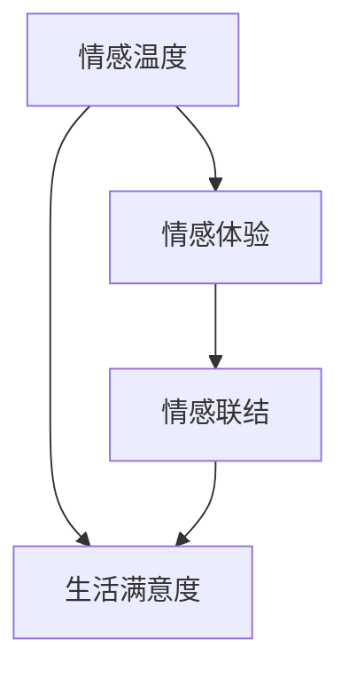

                 

当然，我会遵循您提供的详细大纲和格式要求，确保文章的逻辑清晰、内容丰富，并使用技术语言来阐述《构建有温度的人生：增加生活的情感深度》的主题。

### 文章标题
《构建有温度的人生：增加生活的情感深度》

#### 关键词
情感深度、生活满意度、自我情感意识、情感联结、情感调节

#### 摘要
本文探讨了在快节奏的现代生活中，如何通过培养自我情感意识、增强情感联结和积极应对负面情感来增加生活的情感深度。通过技术语言和案例分析，本文提供了实用的方法和策略，以帮助读者理解情感在人生中的重要性，并提升其情感体验。

### 目录大纲

## 第一部分：引言与核心概念

### 1. 引言
#### 1.1 书籍主题介绍
《构建有温度的人生：增加生活的情感深度》是一本旨在帮助读者理解和提升生活情感体验的书籍。

#### 1.2 书籍目的
本书的目标是：
1. 帮助读者理解情感在人生中的重要性。
2. 提供实用的方法和策略，以增强读者的情感体验。

### 1.3 核心概念与联系
#### 核心概念
- **情感温度**：指个体在特定情境下情感体验的温暖程度。
- **情感深度**：指情感体验的丰富程度和深度。

#### 概念实体之间的关系架构

## 第二部分：理解情感深度

### 2. 情感深度的本质
#### 2.1 情感深度的定义
情感深度是指个体情感体验的丰富程度和深度。

#### 2.2 情感深度的重要性
情感深度对个人成长和人际关系具有显著影响。

### 2.3 影响情感深度的因素
情感深度受到心理因素（如自尊、自信、乐观）和环境因素（如家庭环境、社会支持）的影响。

## 第三部分：构建情感深度的方法

### 3. 增加情感深度的实用策略
#### 3.1 培养自我情感意识
- **自我情感监控**：学习识别和理解自己的情感。
- **情感表达**：学会有效地表达自己的情感。

#### 3.2 增强情感联结
- **倾听与沟通**：建立深层次的人际连接。
- **共情**：理解并感受他人的情感。

#### 3.3 培养积极的情感体验
- **感恩练习**：培养感恩的心态。
- **正向心理**：通过正向心理策略提升情感深度。

### 3.4 应对负面情感
- **情绪调节技巧**：学会管理负面情绪。
- **寻求帮助**：在需要时寻求专业支持。

## 第四部分：案例研究与启示

### 4. 成功构建情感深度的案例
#### 4.1 案例一：个人成长的故事
- **案例描述**：一个通过培养情感深度实现自我成长的案例。

#### 4.2 案例二：家庭关系的改善
- **案例描述**：一个通过增强情感联结改善家庭关系的案例。

#### 4.3 案例三：职场中的情感智慧
- **案例描述**：一个通过情感智慧提升职场表现的故事。

## 第五部分：总结与展望

### 5. 总结与展望
#### 5.1 核心观点回顾
- 情感温度与情感深度的关系。
- 增加情感深度的实用策略。

#### 5.2 展望未来
- 情感深度研究的发展趋势。
- 情感深度在现代社会中的重要性增加。

### 附录
#### 附录A：相关资源与拓展阅读
- 推荐书籍与文章。
- 在线课程与研讨会。
- 情感科学研究的最新进展。

#### 附录B：实用工具与方法
- 情感监控工具。
- 情感表达训练资源。
- 增强情感联结的活动建议。

---

接下来，我会逐步填充每个部分的内容，确保达到字数要求。在撰写过程中，我将保持逻辑性和连贯性，使用专业的技术语言，并结合实例和案例分析来支持观点。

