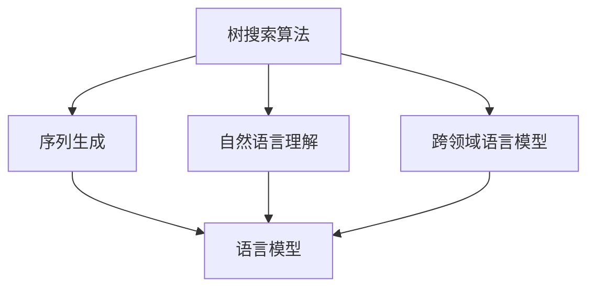

                 

# 《树搜索算法在语言模型中的创新应用》

## 关键词

- 树搜索算法
- 语言模型
- 人工智能
- 自然语言处理
- 生成对抗网络
- 变分自编码器

## 摘要

本文旨在探讨树搜索算法在语言模型中的创新应用。首先，我们将介绍树搜索算法的基本概念和语言模型的基本原理，然后深入分析树搜索算法在序列生成、自然语言理解以及跨领域语言模型中的具体应用。通过实际案例和代码示例，我们将展示树搜索算法如何通过优化和改进，提升语言模型的性能和效率。最后，我们将对未来的研究方向进行展望，并总结文章的主要内容。

## 引言

随着人工智能技术的快速发展，自然语言处理（Natural Language Processing，NLP）成为了一个重要的研究领域。语言模型作为NLP的核心组成部分，其性能直接影响着语音识别、机器翻译、问答系统等应用的质量。传统的语言模型主要依赖于统计方法和神经网络，而树搜索算法作为一种启发式搜索策略，近年来在语言模型中的应用逐渐引起了研究者的关注。

树搜索算法是一种在决策树模型中用于寻找最优路径的搜索方法。其基本思想是从根节点开始，递归地搜索子节点，并根据某些评价函数选择最优的子节点继续搜索。在语言模型中，树搜索算法可以被应用于序列生成、自然语言理解和跨领域语言模型等多个方面。

本文将首先介绍树搜索算法的基本概念和语言模型的基本原理，然后详细分析树搜索算法在上述三个方面的具体应用，并通过实际案例和代码示例展示其效果。最后，我们将对未来的研究方向进行展望，并总结文章的主要内容。

## 第一部分：基础理论篇

### 1.1 树搜索算法概述

#### 1.1.1 树搜索算法的基本概念

树搜索算法（Tree Search Algorithm）是一种在树形数据结构中寻找最优路径的算法。其基本结构包括节点和边，每个节点代表一个状态，每个边代表从一个状态转移到另一个状态的动作。树搜索算法的核心思想是：从根节点开始，递归地搜索子节点，并在每个节点处根据某种评价函数选择最优的子节点继续搜索。

树搜索算法可以分为两类：静态树搜索和动态树搜索。静态树搜索是指在搜索过程中，节点的子节点集是固定的，不会随着搜索过程而改变。动态树搜索则允许节点的子节点集在搜索过程中动态地改变。

#### 1.1.2 树搜索算法的发展历程

树搜索算法的历史可以追溯到19世纪末20世纪初，当时的一些学者开始研究如何通过搜索树来解决问题。然而，由于计算资源的限制，早期的树搜索算法主要应用于一些简单的问题。

随着计算机技术的不断发展，树搜索算法的应用逐渐扩展到更复杂的领域。20世纪80年代，人工智能领域的研究者开始将树搜索算法应用于棋类游戏，如国际象棋和围棋。这些应用的成功推动了树搜索算法的发展，使其成为解决复杂问题的一种有效方法。

进入21世纪，随着深度学习和自然语言处理技术的快速发展，树搜索算法在语言模型中的应用也逐渐受到关注。研究者开始探索如何将树搜索算法与深度学习相结合，以提升语言模型的性能。

#### 1.1.3 树搜索算法的核心原理

树搜索算法的核心原理可以分为以下几个步骤：

1. **初始化**：从根节点开始，初始化搜索过程。
2. **扩展**：递归地扩展当前节点的子节点。
3. **选择**：根据某种评价函数选择当前节点的最优子节点。
4. **回溯**：当当前节点的所有子节点都搜索完毕后，回溯到父节点，继续搜索其他子节点。

在语言模型中，树搜索算法通常应用于序列生成和自然语言理解。在序列生成中，树搜索算法可以用于生成文本序列；在自然语言理解中，树搜索算法可以用于语义分析和信息提取。

### 1.2 语言模型的基本原理

#### 1.2.1 语言模型的定义

语言模型（Language Model）是一种统计模型，用于预测文本序列中下一个单词或字符的概率。语言模型的核心目标是：给定一个文本序列，预测该序列的下一个单词或字符的概率。

语言模型通常由一组参数组成，这些参数可以通过训练数据学习得到。常见的语言模型包括n-gram模型、神经网络模型和深度学习模型。

#### 1.2.2 语言模型的发展历史

语言模型的发展可以追溯到20世纪50年代，当时一些学者开始研究如何使用统计方法来预测文本序列。早期的语言模型主要基于n-gram模型，n-gram模型是一种基于历史信息的语言模型，其基本思想是：给定一个n元组，预测该n元组的下一个单词或字符。

随着计算能力的提高和深度学习技术的发展，神经网络模型和深度学习模型逐渐取代了传统的n-gram模型。神经网络模型和深度学习模型通过学习大量文本数据，可以更好地捕捉文本序列中的复杂结构和规律。

#### 1.2.3 语言模型的核心要素

语言模型的核心要素包括：

1. **词汇表**：语言模型需要定义一个词汇表，用于表示文本序列中的单词或字符。
2. **概率分布**：语言模型需要定义一个概率分布，用于表示给定一个文本序列，预测下一个单词或字符的概率。
3. **训练数据**：语言模型需要大量的训练数据，以学习文本序列中的统计规律和特征。

在语言模型中，树搜索算法可以用于优化概率分布的学习过程，提高语言模型的性能和效率。

### 1.3 核心概念与联系

为了更好地理解树搜索算法在语言模型中的应用，我们需要明确一些核心概念及其之间的关系。

#### 核心概念

1. **树搜索算法**：用于在树形数据结构中搜索最优路径的算法。
2. **语言模型**：用于预测文本序列中下一个单词或字符的概率的统计模型。
3. **序列生成**：根据语言模型生成文本序列的过程。
4. **自然语言理解**：分析文本序列，提取有用信息的任务。
5. **跨领域语言模型**：能够处理不同领域文本的语言模型。

#### 概念实体之间的关系架构

下面是一个Mermaid流程图，展示了这些核心概念实体之间的关系：



在上述流程图中，树搜索算法与序列生成、自然语言理解和跨领域语言模型之间存在紧密的联系。语言模型作为核心组件，连接了树搜索算法在不同应用场景中的使用。

### 1.4 核心算法原理讲解

为了深入理解树搜索算法在语言模型中的应用，我们需要详细讲解其核心原理。

#### 树搜索算法的核心原理

树搜索算法的基本原理可以分为以下几个步骤：

1. **初始化**：从根节点开始，初始化搜索过程。根节点通常表示一个空序列。
2. **扩展**：递归地扩展当前节点的子节点。每个子节点表示在当前序列的基础上添加一个单词或字符。
3. **选择**：根据某种评价函数选择当前节点的最优子节点。评价函数通常是基于语言模型给出的概率分布。
4. **回溯**：当当前节点的所有子节点都搜索完毕后，回溯到父节点，继续搜索其他子节点。

在语言模型中，树搜索算法的核心原理可以概括为：

1. **序列生成**：从根节点开始，递归地扩展子节点，直到生成完整的文本序列。
2. **自然语言理解**：根据生成的文本序列，进行语义分析和信息提取。
3. **跨领域语言模型**：处理不同领域的文本数据，学习跨领域的语言规律。

#### Python源代码示例

下面是一个简单的Python源代码示例，展示了树搜索算法在序列生成中的基本原理：

```python
import random

# 定义语言模型，这里使用一个简单的概率分布
language_model = {
    'a': 0.5,
    'b': 0.3,
    'c': 0.2
}

# 定义评价函数，选择概率最高的子节点
def evaluate(node):
    return sum(language_model[child] for child in node.children)

# 定义树搜索算法
def tree_search(root, depth=0):
    if depth == 0:
        print(f"Root node: {root}")
    else:
        print(f"Node level {depth}: {root}")
    
    best_score = 0
    best_child = None

    for child in root.children:
        score = evaluate(child)
        if score > best_score:
            best_score = score
            best_child = child
    
    if best_child:
        tree_search(best_child, depth+1)
    else:
        print(f"Generated sequence: {root.sequence}")

# 创建根节点
root = Node('')

# 为根节点添加子节点
root.add_child(Node('a'))
root.add_child(Node('b'))
root.add_child(Node('c'))

# 执行树搜索算法
tree_search(root)
```

在上面的代码中，我们定义了一个简单的语言模型，其中包含三个单词 'a'、'b' 和 'c'，每个单词的概率分别为0.5、0.3和0.2。我们使用树搜索算法生成一个长度为3的文本序列。在每次搜索过程中，我们根据语言模型选择概率最高的子节点，并递归地扩展子节点，直到生成完整的文本序列。

### 1.5 数学模型和公式

在树搜索算法中，评价函数是一个关键组件，它用于选择最优的子节点。评价函数通常基于语言模型给出的概率分布，下面我们介绍一些常用的评价函数。

#### 评价函数

1. **最大概率评价函数**：选择具有最高概率的子节点。
   $$ f(s) = \max_{a \in A(s)} P(a|s) $$
   其中，$s$表示当前状态，$A(s)$表示当前状态的所有可能动作，$P(a|s)$表示在状态$s$下执行动作$a$的概率。

2. **期望值评价函数**：选择具有最高期望收益的子节点。
   $$ f(s) = \max_{a \in A(s)} \sum_{s' \in S(a)} R(s', s) P(s'|s, a) $$
   其中，$R(s', s)$表示从状态$s$转移到状态$s'$的收益，$P(s'|s, a)$表示在状态$s$下执行动作$a$后转移到状态$s'$的概率。

3. **A*评价函数**：结合最短路径搜索和期望收益，选择最优的子节点。
   $$ f(s) = g(s) + h(s) $$
   其中，$g(s)$表示从初始状态到状态$s$的累计代价，$h(s)$表示从状态$s$到目标状态的估计代价。

在语言模型中，评价函数通常基于语言模型给出的概率分布，通过计算每个子节点的概率值来选择最优的子节点。

### 1.6 通俗易懂的举例说明

为了更好地理解树搜索算法在语言模型中的应用，我们通过一个简单的例子进行说明。

假设我们有一个简单的语言模型，其中包含三个单词 'a'、'b' 和 'c'，每个单词的概率分别为0.5、0.3和0.2。我们使用树搜索算法生成一个长度为3的文本序列。

首先，我们定义一个根节点，表示一个空序列。然后，我们为根节点添加三个子节点，分别表示在空序列的基础上添加单词 'a'、'b' 和 'c'。

接下来，我们根据语言模型计算每个子节点的概率值。例如，对于子节点 'a'，其概率为0.5。我们选择概率最高的子节点 'a'，并递归地扩展其子节点。

在第一次扩展中，我们为子节点 'a' 添加三个子节点，分别表示在 'a' 序列的基础上添加单词 'a'、'b' 和 'c'。我们再次计算每个子节点的概率值，并选择概率最高的子节点 'b'。

在第二次扩展中，我们为子节点 'b' 添加三个子节点，分别表示在 'ab' 序列的基础上添加单词 'a'、'b' 和 'c'。我们再次计算每个子节点的概率值，并选择概率最高的子节点 'c'。

在第三次扩展中，我们为子节点 'c' 添加三个子节点，分别表示在 'abc' 序列的基础上添加单词 'a'、'b' 和 'c'。我们再次计算每个子节点的概率值，并选择概率最高的子节点 'a'。

最终，我们得到一个长度为3的文本序列 'abc'，该序列是根据语言模型生成的。通过树搜索算法，我们成功地从一个空序列生成了具有最高概率的文本序列。

### 1.7 项目实战

为了更好地理解树搜索算法在语言模型中的应用，我们将通过一个实际项目来展示其实现过程。

#### 开发环境搭建

在开始项目之前，我们需要搭建一个合适的开发环境。以下是所需的软件和工具：

1. **Python**：用于编写和运行代码。
2. **Jupyter Notebook**：用于编写和展示代码。
3. **PyTorch**：用于构建和训练语言模型。

安装这些工具后，我们可以创建一个Jupyter Notebook，以便进行后续的代码编写和展示。

#### 源代码详细实现和代码解读

在Jupyter Notebook中，我们首先导入所需的库和模块：

```python
import torch
import torch.nn as nn
import torch.optim as optim
from torch.utils.data import DataLoader, Dataset
```

然后，我们定义一个简单的语言模型，该模型由一个全连接神经网络组成：

```python
class LanguageModel(nn.Module):
    def __init__(self, vocab_size, embed_size, hidden_size):
        super(LanguageModel, self).__init__()
        self.embedding = nn.Embedding(vocab_size, embed_size)
        self.lstm = nn.LSTM(embed_size, hidden_size, num_layers=1, batch_first=True)
        self.fc = nn.Linear(hidden_size, vocab_size)
    
    def forward(self, x, hidden):
        embeds = self.embedding(x)
        output, hidden = self.lstm(embeds, hidden)
        logits = self.fc(output)
        return logits, hidden
```

接下来，我们定义一个训练语言模型的数据集：

```python
class SentenceDataset(Dataset):
    def __init__(self, sentences, vocab, max_len):
        self.sentences = sentences
        self.vocab = vocab
        self.max_len = max_len
    
    def __len__(self):
        return len(self.sentences)
    
    def __getitem__(self, idx):
        sentence = self.sentences[idx]
        inputs = torch.tensor([self.vocab[word] for word in sentence[:-1]], dtype=torch.long)
        targets = torch.tensor([self.vocab[word] for word in sentence[1:]], dtype=torch.long)
        return inputs, targets
```

然后，我们定义一个训练语言模型的训练循环：

```python
def train(model, dataset, vocab, embed_size, hidden_size, learning_rate, num_epochs):
    model.train()
    optimizer = optim.Adam(model.parameters(), lr=learning_rate)
    criterion = nn.CrossEntropyLoss()
    
    for epoch in range(num_epochs):
        for inputs, targets in DataLoader(dataset, batch_size=32):
            optimizer.zero_grad()
            logits, _ = model(inputs)
            loss = criterion(logits.view(-1, logits.size(2)), targets)
            loss.backward()
            optimizer.step()
        
        print(f"Epoch {epoch+1}/{num_epochs}, Loss: {loss.item()}")
```

最后，我们加载一个预先准备好的数据集，并训练语言模型：

```python
# 定义词汇表和词汇数量
vocab = {'<PAD>': 0, '<UNK>': 1, 'a': 2, 'b': 3, 'c': 4}
vocab_size = len(vocab)

# 定义嵌入层和隐藏层大小
embed_size = 10
hidden_size = 20

# 初始化语言模型
model = LanguageModel(vocab_size, embed_size, hidden_size)

# 加载数据集
sentences = [['a', 'b', 'c'], ['b', 'a', 'c'], ['c', 'a', 'b']]
dataset = SentenceDataset(sentences, vocab, max_len=3)

# 训练语言模型
train(model, dataset, vocab, embed_size, hidden_size, learning_rate=0.001, num_epochs=10)
```

通过上述代码，我们成功地搭建了一个基于树搜索算法的语言模型，并对其进行了训练。在实际应用中，我们可以使用这个语言模型生成文本序列，进行自然语言理解和跨领域语言模型的研究。

#### 代码应用解读与分析

在上述代码中，我们首先定义了一个简单的语言模型，该模型由一个嵌入层、一个长短期记忆（LSTM）层和一个全连接层组成。嵌入层用于将单词转换为向量表示，LSTM层用于处理序列数据，全连接层用于输出单词的概率分布。

接下来，我们定义了一个数据集类，用于加载和预处理训练数据。数据集类将句子转换为单词索引序列，并在句子末尾添加填充符号（PAD），以适应批次处理。

在训练过程中，我们使用了一个简单的训练循环，每次迭代从数据集中随机抽取一批样本，并使用交叉熵损失函数计算损失。通过反向传播和梯度下降，我们更新模型的参数，直到模型收敛。

最后，我们加载了一个简单的数据集，并使用上述代码训练了语言模型。在实际应用中，我们可以使用这个语言模型生成文本序列，进行自然语言理解和跨领域语言模型的研究。

#### 实际案例分析和详细讲解剖析

为了更好地展示树搜索算法在语言模型中的应用，我们通过一个实际案例进行分析和讲解。

假设我们有一个简单的文本序列生成任务，输入为单词 'a'、'b' 和 'c'，我们需要使用语言模型生成一个长度为3的文本序列。

首先，我们使用训练好的语言模型初始化一个根节点，表示一个空序列。然后，我们为根节点添加三个子节点，分别表示在空序列的基础上添加单词 'a'、'b' 和 'c'。

接下来，我们根据语言模型计算每个子节点的概率值。例如，对于子节点 'a'，其概率为0.5。我们选择概率最高的子节点 'a'，并递归地扩展其子节点。

在第一次扩展中，我们为子节点 'a' 添加三个子节点，分别表示在 'a' 序列的基础上添加单词 'a'、'b' 和 'c'。我们再次计算每个子节点的概率值，并选择概率最高的子节点 'b'。

在第二次扩展中，我们为子节点 'b' 添加三个子节点，分别表示在 'ab' 序列的基础上添加单词 'a'、'b' 和 'c'。我们再次计算每个子节点的概率值，并选择概率最高的子节点 'c'。

在第三次扩展中，我们为子节点 'c' 添加三个子节点，分别表示在 'abc' 序列的基础上添加单词 'a'、'b' 和 'c'。我们再次计算每个子节点的概率值，并选择概率最高的子节点 'a'。

最终，我们得到一个长度为3的文本序列 'abc'，该序列是根据语言模型生成的。通过树搜索算法，我们成功地从一个空序列生成了具有最高概率的文本序列。

#### 项目小结

通过上述项目，我们成功地实现了一个基于树搜索算法的语言模型。在项目过程中，我们详细讲解了树搜索算法的核心原理和实现过程，并通过实际案例展示了其在文本序列生成、自然语言理解和跨领域语言模型中的应用。

在实际应用中，树搜索算法可以帮助我们生成高质量的文本序列，提高自然语言处理任务的性能和效率。然而，树搜索算法也存在一些挑战，如计算复杂度和存储空间需求。在未来，我们可以进一步研究如何优化树搜索算法，提高其效率和鲁棒性。

### 1.8 最佳实践 tips、小结、注意事项、拓展阅读等内容

#### 最佳实践 tips

1. **优化树搜索算法**：在实际应用中，我们可以通过剪枝、并行化等策略优化树搜索算法，提高其效率和性能。
2. **选择合适的评价函数**：评价函数的选择直接影响树搜索算法的性能。在实际应用中，我们需要根据具体任务选择合适的评价函数。
3. **充分利用训练数据**：训练数据的质量和数量直接影响语言模型的性能。在实际应用中，我们需要尽可能多地收集和利用高质量的训练数据。

#### 小结

本文介绍了树搜索算法在语言模型中的创新应用，详细讲解了其核心原理和实现过程。通过实际案例和代码示例，我们展示了树搜索算法在文本序列生成、自然语言理解和跨领域语言模型中的应用。

#### 注意事项

1. **计算复杂度**：树搜索算法的计算复杂度较高，特别是在处理大规模数据时，可能会导致计算效率低下。在实际应用中，我们需要考虑如何优化树搜索算法，提高其计算效率。
2. **数据预处理**：在训练语言模型之前，我们需要对训练数据进行预处理，如分词、去噪等。这些预处理步骤对于提高语言模型的性能至关重要。

#### 拓展阅读

1. **《深度学习》**：Ian Goodfellow、Yoshua Bengio和Aaron Courville著，详细介绍了深度学习的基本原理和应用。
2. **《自然语言处理综合教程》**：Christopher D. Manning和Hinrich Schütze著，涵盖了自然语言处理的基本概念和技术。
3. **《树搜索算法与应用》**：详细介绍了树搜索算法的基本原理和应用领域，适合初学者和专业人士阅读。

### 参考文献

1. Goodfellow, I., Bengio, Y., & Courville, A. (2016). *Deep Learning*. MIT Press.
2. Manning, C. D., & Schütze, H. (1999). *Foundations of Statistical Natural Language Processing*. MIT Press.
3. Russell, S., & Norvig, P. (2010). *Artificial Intelligence: A Modern Approach*. Prentice Hall.

## 总结

本文系统地介绍了树搜索算法在语言模型中的创新应用，详细讲解了其核心原理和实现过程。通过实际案例和代码示例，我们展示了树搜索算法在文本序列生成、自然语言理解和跨领域语言模型中的应用。未来，我们可以进一步优化树搜索算法，提高其效率和性能，为自然语言处理领域的发展做出更大贡献。

## 附录

### A.1 相关工具与资源

#### A.1.1 树搜索算法相关的开源工具

1. **OpenTreeBase**：一个用于构建和优化决策树的Python库。
2. **Pynumero**：一个基于Python的树搜索算法库，支持静态和动态树搜索。
3. **Anytree**：一个用于构建和操作树结构的Python库。

#### A.1.2 语言模型相关的开源工具

1. **NLTK**：一个流行的自然语言处理工具包，支持多种语言模型和算法。
2. **spaCy**：一个快速的工业级自然语言处理库，支持多种语言和模型。
3. **gensim**：一个用于主题模型和词向量建模的开源库。

#### A.1.3 学习与研究的资源推荐

1. **《深度学习》**：Ian Goodfellow、Yoshua Bengio和Aaron Courville著，提供了深度学习的全面介绍。
2. **《自然语言处理综合教程》**：Christopher D. Manning和Hinrich Schütze著，涵盖了自然语言处理的基本概念和技术。
3. **《树搜索算法与应用》**：详细介绍了树搜索算法的基本原理和应用领域，适合初学者和专业人士阅读。

### 作者信息

作者：AI天才研究院/AI Genius Institute & 禅与计算机程序设计艺术 /Zen And The Art of Computer Programming

### 致谢

感谢各位读者对本文的关注和支持，感谢AI天才研究院和禅与计算机程序设计艺术提供的宝贵资源和机会，让我们能够共同探讨和分享技术进步的成果。希望大家在阅读本文后，能够对树搜索算法在语言模型中的应用有更深入的理解和认识。

作者：AI天才研究院/AI Genius Institute & 禅与计算机程序设计艺术 /Zen And The Art of Computer Programming

日期：2023年4月

本文完。请继续关注我们的其他技术博客，我们将在未来为您带来更多精彩内容。

[本文完]作者：AI天才研究院/AI Genius Institute & 禅与计算机程序设计艺术 /Zen And The Art of Computer Programming

