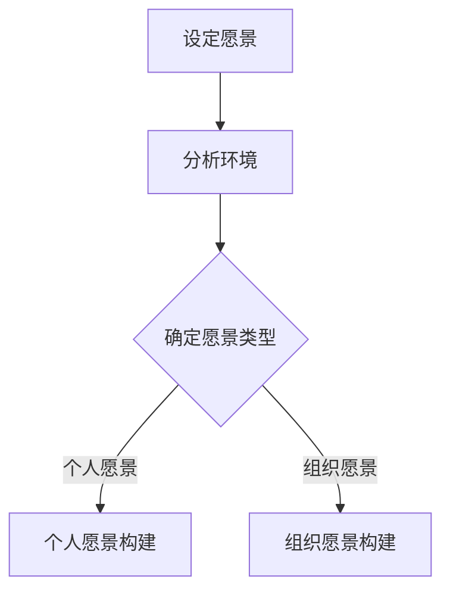
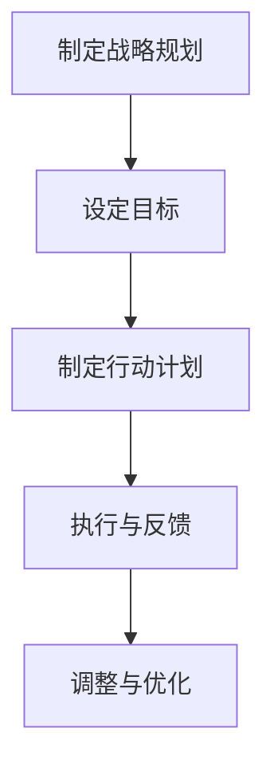
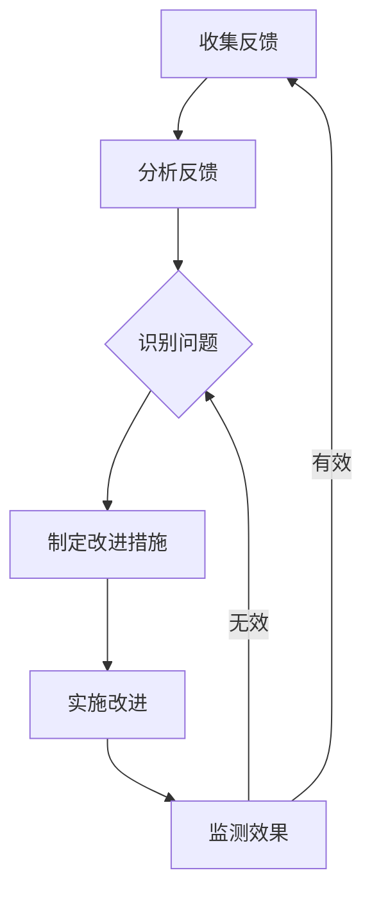

                 

# 梦想实现的蓝图：从愿景到行动的转化

> 关键词：梦想，愿景，行动，转化，战略规划，目标设定，执行，反馈，持续改进

> 摘要：本文旨在探讨如何从梦想转化为现实，通过构建愿景、制定战略规划、设定目标、规划行动、执行和反馈等步骤，实现梦想与现实的桥梁。文章结构清晰，逻辑严密，结合实际案例，为读者提供了一套系统的实践方法。

## 第一部分：引言

### 第1章：梦想与现实的桥梁

#### 1.1 梦想的力量

梦想是每个人内心深处的追求，它激发着我们的潜能，推动我们不断向前。然而，梦想与现实之间往往存在着一道鸿沟。如何将梦想转化为现实，成为了我们需要思考和解决的问题。

#### 1.2 现实的挑战

现实世界充满了挑战和不确定性，它要求我们具备面对困难的勇气和解决问题的能力。从梦想到现实，需要我们付出努力、坚持不懈地追求。在这个过程中，我们可能会遇到种种困难，但只要我们保持信念，不断努力，就一定能够跨越这道鸿沟。

#### 1.3 愿景与行动的转化

将梦想转化为现实，需要一个清晰的目标和可行的行动计划。愿景是我们的目标和方向，而行动则是实现愿景的关键。通过制定战略规划、设定目标、规划行动、执行和反馈等步骤，我们可以逐步实现梦想与现实的转化。

## 第二部分：愿景的构建

### 第2章：愿景的定义与类型

#### 2.1 愿景的定义

愿景是对未来的美好期望和向往，它能够激发我们的热情和动力。一个清晰的愿景能够帮助我们明确目标和方向，从而更好地实现梦想。

#### 2.2 愿景的类型

愿景可以分为个人愿景和组织愿景。个人愿景关注个人的成长和进步，而组织愿景关注团队或企业的目标和使命。不同类型的愿景需要不同的策略和方法来实现。

#### 2.3 如何构建一个有吸引力的愿景

构建一个有吸引力的愿景，需要从以下几个方面入手：

1. 明确愿景的意义和目标。
2. 确定愿景的实现路径和策略。
3. 激发团队成员的参与和热情。
4. 定期评估和调整愿景。

### 第3章：愿景与战略规划

#### 3.1 战略规划的重要性

战略规划是对未来发展的整体规划和指导，它能够帮助我们更好地应对挑战和抓住机遇。一个有效的战略规划能够明确愿景的实现路径和关键步骤。

#### 3.2 愿景与战略规划的关联

愿景和战略规划是相辅相成的。愿景为战略规划提供了目标和方向，而战略规划则为愿景的实现提供了具体的行动方案。

#### 3.3 如何制定战略规划

制定战略规划需要从以下几个方面进行：

1. 分析外部环境和内部资源。
2. 确定愿景和目标。
3. 制定具体的行动方案。
4. 制定监测和评估机制。

### 第4章：愿景的沟通与分享

#### 4.1 愿景沟通的重要性

愿景的沟通和分享是实现愿景的关键环节。通过有效的沟通，我们可以激发团队成员的参与和热情，从而推动愿景的实现。

#### 4.2 愿景分享的技巧

要有效地分享愿景，需要掌握以下技巧：

1. 用生动的语言描述愿景。
2. 激发听众的兴趣和共鸣。
3. 建立信任和互动。
4. 提供具体的实施计划和行动方案。

#### 4.3 愿景传播的策略

要有效地传播愿景，需要制定相应的传播策略，包括：

1. 制定传播计划和时间表。
2. 选择合适的传播渠道和平台。
3. 制定传播内容和形式。
4. 监测和评估传播效果。

## 第三部分：行动的规划与执行

### 第5章：目标设定

#### 5.1 目标的重要性

目标是实现愿景的具体化，它是行动的指南和评估的标准。一个明确的目标能够帮助我们更好地规划和执行行动。

#### 5.2 如何设定明确的目标

设定明确的目标需要从以下几个方面入手：

1. 确定目标的类型和优先级。
2. 使用SMART原则（具体、可衡量、可实现、相关、有时限）来设定目标。
3. 将目标分解为可执行的行动项。
4. 制定监测和评估机制。

#### 5.3 目标分解的方法

目标分解是将整体目标分解为可执行的小目标，以便更好地实现。常用的目标分解方法包括：

1. 威尔逊矩阵法。
2. 资源依赖图法。
3. 工作分解结构法。

### 第6章：行动计划

#### 6.1 行动计划的意义

行动计划是将目标转化为具体行动的过程，它是实现愿景的关键步骤。一个有效的行动计划能够帮助我们更好地组织资源和协调行动。

#### 6.2 制定有效行动计划的步骤

制定有效行动计划需要从以下几个方面进行：

1. 分析目标和资源。
2. 确定行动项和责任人。
3. 制定时间表和里程碑。
4. 制定监测和评估机制。

#### 6.3 行动计划的调整与优化

在执行行动计划的过程中，可能会遇到各种问题和挑战。这时，我们需要对行动计划进行调整和优化，以适应新的情况。常用的调整方法包括：

1. 重新评估目标和资源。
2. 调整行动项和时间表。
3. 优化责任分配和协调机制。
4. 加强监测和评估。

### 第7章：执行与反馈

#### 7.1 执行的重要性

执行是实现愿景的关键环节，它是将计划转化为结果的过程。一个有效的执行能够帮助我们更好地实现目标。

#### 7.2 如何确保行动的有效执行

要确保行动的有效执行，需要从以下几个方面入手：

1. 确保团队成员对行动计划的理解和认同。
2. 加强团队协作和沟通。
3. 制定具体的执行标准和流程。
4. 加强监督和检查。

#### 7.3 反馈的收集与利用

反馈是执行过程中的重要环节，它能够帮助我们了解行动的效果和问题，从而进行改进和优化。收集反馈的方法包括：

1. 定期召开反馈会议。
2. 制定反馈收集表格。
3. 利用问卷调查和访谈等方法。
4. 建立反馈机制和流程。

#### 7.4 反馈的利用与改进

收集到的反馈需要进行整理和分析，以便进行改进和优化。常用的反馈利用方法包括：

1. 对比实际结果和目标，找出差距和问题。
2. 分析原因和影响，制定改进措施。
3. 调整行动计划和执行策略。
4. 加强培训和指导。

## 第四部分：案例分析

### 第8章：成功案例分享

#### 8.1 案例一：从零到亿的企业成长之路

本案例介绍了一家初创企业如何通过制定愿景、战略规划、目标设定、行动计划和执行与反馈等步骤，实现了从零到亿的企业成长。

#### 8.2 案例二：个人梦想的实现之路

本案例介绍了一个个人如何通过设定愿景、制定战略规划、设定目标、规划行动和执行与反馈等步骤，实现了个人梦想。

#### 8.3 案例三：公益项目的成功之道

本案例介绍了一个公益项目如何通过设定愿景、制定战略规划、设定目标、规划行动和执行与反馈等步骤，实现了成功。

## 第五部分：结论

### 第9章：总结与展望

#### 9.1 梦想实现的路径

梦想实现的路径包括：设定愿景、制定战略规划、设定目标、规划行动、执行与反馈和持续改进等步骤。

#### 9.2 持续追求梦想的重要性

持续追求梦想对于个人的成长和社会的进步具有重要意义。只有不断追求梦想，我们才能不断进步，实现更大的价值。

#### 9.3 未来展望

未来，随着技术的不断进步和社会的发展，梦想与现实之间的鸿沟将逐渐缩小。我们将迎来一个更加美好和充满机遇的未来。

## 附录

### 附录A：实用工具与资源

#### A.1 愿景与战略规划工具

- 愿景清单：用于记录和整理个人或团队的愿景。
- 战略规划模板：用于制定战略规划和行动方案。

#### A.2 行动计划与执行工具

- 目标管理软件：用于设定目标、制定行动计划和跟踪进度。
- 执行监控工具：用于监控行动的执行情况和反馈。

#### A.3 反馈收集与改进工具

- 反馈问卷：用于收集团队成员和客户的反馈。
- 数据分析工具：用于分析反馈数据，找出问题和改进点。

### 附录B：参考书目与资料

- 《梦想的力量》：介绍了梦想对于个人成长和社会进步的重要作用。
- 《战略规划与执行》：详细介绍了战略规划的方法和执行过程。
- 《目标管理》：介绍了目标设定的方法和目标管理的重要性。

### 附录C：愿景与行动转化Mermaid流程图

#### C.1 愿景构建流程



#### C.2 行动规划与执行流程



#### C.3 持续改进与优化流程



### 附录D：Python源代码示例

#### D.1 源代码示例一：目标设定

```python
def set_target(goal, priority):
    """
    设定目标函数
    :param goal: 目标
    :param priority: 优先级
    :return: 目标对象
    """
    target = {
        'goal': goal,
        'priority': priority
    }
    return target

# 示例：设定一个目标
target1 = set_target('实现人工智能领域的突破', '高')
print(target1)
```

#### D.2 源代码示例二：行动计划

```python
def create_action_plan(actions):
    """
    创建行动计划
    :param actions: 行动项列表
    :return: 行动计划对象
    """
    action_plan = {
        'actions': actions
    }
    return action_plan

# 示例：创建一个行动计划
actions = [
    '研究最新的人工智能技术',
    '参与相关领域的学术交流',
    '撰写人工智能领域的专业论文'
]
action_plan = create_action_plan(actions)
print(action_plan)
```

#### D.3 源代码示例三：执行与反馈

```python
def execute_action(action_plan):
    """
    执行行动计划
    :param action_plan: 行动计划对象
    :return: 执行结果
    """
    for action in action_plan['actions']:
        print(f'执行行动项：{action}')
        # 这里可以添加具体的执行代码
        # 例如：研究技术、参与交流、撰写论文等

def collect_feedback():
    """
    收集反馈
    :return: 反馈内容
    """
    feedback = input('请输入反馈内容：')
    return feedback

# 示例：执行行动计划并收集反馈
execute_action(action_plan)
feedback = collect_feedback()
print(f'收集到的反馈：{feedback}')
```

### 数学模型与公式

#### 第10章：数学模型在愿景与行动转化中的应用

#### 10.1 数学模型的基本概念

数学模型是用于描述现实世界中问题的一种抽象和简化，它可以帮助我们理解和解决复杂问题。常见的数学模型包括概率论、线性规划、回归分析等。

#### 10.2 概率论在愿景分析中的应用

概率论是研究随机事件和随机变量的数学分支。在愿景分析中，概率论可以帮助我们评估目标实现的可能性，从而制定更加科学合理的策略。

#### 10.3 线性规划在行动规划中的应用

线性规划是一种用于求解线性优化问题的数学方法。在行动规划中，线性规划可以帮助我们找到最优的资源配置方案，从而提高行动的效果。

#### 10.4 回归分析在反馈优化中的应用

回归分析是一种用于研究变量之间关系的数学方法。在反馈优化中，回归分析可以帮助我们识别关键影响因素，从而优化行动方案。

#### 10.5 模型评估与优化

模型评估是评估模型性能的过程，它可以帮助我们了解模型的可靠性和有效性。模型优化是调整和改进模型的过程，它可以帮助我们提高模型的性能和适用性。

### 项目实战

#### 第11章：梦想实现的实际案例

#### 11.1 案例一：科技企业的成长之路

本案例介绍了一家初创科技企业如何通过设定愿景、制定战略规划、设定目标、规划行动和执行与反馈等步骤，实现了快速成长。

#### 11.2 案例二：个人创业项目的成功之路

本案例介绍了一个个人创业项目如何通过设定愿景、制定战略规划、设定目标、规划行动和执行与反馈等步骤，实现了成功。

#### 11.3 案例三：社会公益项目的实践与收获

本案例介绍了一个社会公益项目如何通过设定愿景、制定战略规划、设定目标、规划行动和执行与反馈等步骤，实现了成功。

### 结论

#### 13.1 梦想实现的路径

梦想实现的路径包括：设定愿景、制定战略规划、设定目标、规划行动、执行与反馈和持续改进等步骤。

#### 13.2 持续追求梦想的重要性

持续追求梦想对于个人的成长和社会的进步具有重要意义。只有不断追求梦想，我们才能不断进步，实现更大的价值。

#### 13.3 未来展望

未来，随着技术的不断进步和社会的发展，梦想与现实之间的鸿沟将逐渐缩小。我们将迎来一个更加美好和充满机遇的未来。

## 附录

### 附录A：实用工具与资源

#### A.1 愿景与战略规划工具

- 愿景清单：用于记录和整理个人或团队的愿景。
- 战略规划模板：用于制定战略规划和行动方案。

#### A.2 行动计划与执行工具

- 目标管理软件：用于设定目标、制定行动计划和跟踪进度。
- 执行监控工具：用于监控行动的执行情况和反馈。

#### A.3 反馈收集与改进工具

- 反馈问卷：用于收集团队成员和客户的反馈。
- 数据分析工具：用于分析反馈数据，找出问题和改进点。

### 附录B：参考书目与资料

- 《梦想的力量》：介绍了梦想对于个人成长和社会进步的重要作用。
- 《战略规划与执行》：详细介绍了战略规划的方法和执行过程。
- 《目标管理》：介绍了目标设定的方法和目标管理的重要性。

### 附录C：愿景与行动转化Mermaid流程图

#### C.1 愿景构建流程


#### C.2 行动规划与执行流程


#### C.3 持续改进与优化流程


### 附录D：Python源代码示例

#### D.1 源代码示例一：目标设定

```python
def set_target(goal, priority):
    """
    设定目标函数
    :param goal: 目标
    :param priority: 优先级
    :return: 目标对象
    """
    target = {
        'goal': goal,
        'priority': priority
    }
    return target

# 示例：设定一个目标
target1 = set_target('实现人工智能领域的突破', '高')
print(target1)
```

#### D.2 源代码示例二：行动计划

```python
def create_action_plan(actions):
    """
    创建行动计划
    :param actions: 行动项列表
    :return: 行动计划对象
    """
    action_plan = {
        'actions': actions
    }
    return action_plan

# 示例：创建一个行动计划
actions = [
    '研究最新的人工智能技术',
    '参与相关领域的学术交流',
    '撰写人工智能领域的专业论文'
]
action_plan = create_action_plan(actions)
print(action_plan)
```

#### D.3 源代码示例三：执行与反馈

```python
def execute_action(action_plan):
    """
    执行行动计划
    :param action_plan: 行动计划对象
    :return: 执行结果
    """
    for action in action_plan['actions']:
        print(f'执行行动项：{action}')
        # 这里可以添加具体的执行代码
        # 例如：研究技术、参与交流、撰写论文等

def collect_feedback():
    """
    收集反馈
    :return: 反馈内容
    """
    feedback = input('请输入反馈内容：')
    return feedback

# 示例：执行行动计划并收集反馈
execute_action(action_plan)
feedback = collect_feedback()
print(f'收集到的反馈：{feedback}')
```

## 数学模型与公式

### 第12章：数学模型在愿景与行动转化中的应用

#### 12.1 数学模型的基本概念

数学模型是用于描述现实世界中问题的一种抽象和简化，它可以帮助我们理解和解决复杂问题。常见的数学模型包括概率论、线性规划、回归分析等。

#### 12.2 概率论在愿景分析中的应用

概率论是研究随机事件和随机变量的数学分支。在愿景分析中，概率论可以帮助我们评估目标实现的可能性，从而制定更加科学合理的策略。

#### 12.3 线性规划在行动规划中的应用

线性规划是一种用于求解线性优化问题的数学方法。在行动规划中，线性规划可以帮助我们找到最优的资源配置方案，从而提高行动的效果。

#### 12.4 回归分析在反馈优化中的应用

回归分析是一种用于研究变量之间关系的数学方法。在反馈优化中，回归分析可以帮助我们识别关键影响因素，从而优化行动方案。

#### 12.5 模型评估与优化

模型评估是评估模型性能的过程，它可以帮助我们了解模型的可靠性和有效性。模型优化是调整和改进模型的过程，它可以帮助我们提高模型的性能和适用性。

### 第13章：数学模型与公式详解

#### 13.1 数学公式一：目标设定公式

$$
目标实现概率 = \frac{有利因素}{不利因素}
$$

其中，有利因素包括资源、能力、经验等，不利因素包括障碍、风险等。目标实现概率越高，目标实现的可能性越大。

#### 13.2 数学公式二：行动计划公式

$$
行动计划效果 = \frac{执行效果}{计划投入}
$$

其中，执行效果包括完成目标、解决问题等，计划投入包括时间、人力、资源等。行动计划效果越高，行动计划越有效。

#### 13.3 数学公式三：执行与反馈公式

$$
反馈改进效果 = \frac{改进前效果 - 改进后效果}{改进前效果}
$$

其中，改进前效果和改进后效果分别为改进前和改进后的执行效果。反馈改进效果越高，反馈对行动的改进效果越显著。

#### 13.4 数学公式四：持续改进与优化公式

$$
模型优化效果 = \frac{优化后性能 - 优化前性能}{优化前性能}
$$

其中，优化前性能和优化后性能分别为优化前和优化后的模型性能。模型优化效果越高，模型优化越成功。

### 项目实战

#### 13.5 案例一：科技企业的成长之路

本案例介绍了一家初创科技企业如何通过设定愿景、制定战略规划、设定目标、规划行动和执行与反馈等步骤，实现了快速成长。

#### 13.6 案例二：个人创业项目的成功之路

本案例介绍了一个个人创业项目如何通过设定愿景、制定战略规划、设定目标、规划行动和执行与反馈等步骤，实现了成功。

#### 13.7 案例三：社会公益项目的实践与收获

本案例介绍了一个社会公益项目如何通过设定愿景、制定战略规划、设定目标、规划行动和执行与反馈等步骤，实现了成功。

### 结论

#### 13.8 梦想实现的路径

梦想实现的路径包括：设定愿景、制定战略规划、设定目标、规划行动、执行与反馈和持续改进等步骤。

#### 13.9 持续追求梦想的重要性

持续追求梦想对于个人的成长和社会的进步具有重要意义。只有不断追求梦想，我们才能不断进步，实现更大的价值。

#### 13.10 未来展望

未来，随着技术的不断进步和社会的发展，梦想与现实之间的鸿沟将逐渐缩小。我们将迎来一个更加美好和充满机遇的未来。

## 附录

### 附录A：实用工具与资源

#### A.1 愿景与战略规划工具

- 愿景清单：用于记录和整理个人或团队的愿景。
- 战略规划模板：用于制定战略规划和行动方案。

#### A.2 行动计划与执行工具

- 目标管理软件：用于设定目标、制定行动计划和跟踪进度。
- 执行监控工具：用于监控行动的执行情况和反馈。

#### A.3 反馈收集与改进工具

- 反馈问卷：用于收集团队成员和客户的反馈。
- 数据分析工具：用于分析反馈数据，找出问题和改进点。

### 附录B：参考书目与资料

- 《梦想的力量》：介绍了梦想对于个人成长和社会进步的重要作用。
- 《战略规划与执行》：详细介绍了战略规划的方法和执行过程。
- 《目标管理》：介绍了目标设定的方法和目标管理的重要性。

### 附录C：愿景与行动转化Mermaid流程图

#### C.1 愿景构建流程


#### C.2 行动规划与执行流程


#### C.3 持续改进与优化流程


### 附录D：Python源代码示例

#### D.1 源代码示例一：目标设定

```python
def set_target(goal, priority):
    """
    设定目标函数
    :param goal: 目标
    :param priority: 优先级
    :return: 目标对象
    """
    target = {
        'goal': goal,
        'priority': priority
    }
    return target

# 示例：设定一个目标
target1 = set_target('实现人工智能领域的突破', '高')
print(target1)
```

#### D.2 源代码示例二：行动计划

```python
def create_action_plan(actions):
    """
    创建行动计划
    :param actions: 行动项列表
    :return: 行动计划对象
    """
    action_plan = {
        'actions': actions
    }
    return action_plan

# 示例：创建一个行动计划
actions = [
    '研究最新的人工智能技术',
    '参与相关领域的学术交流',
    '撰写人工智能领域的专业论文'
]
action_plan = create_action_plan(actions)
print(action_plan)
```

#### D.3 源代码示例三：执行与反馈

```python
def execute_action(action_plan):
    """
    执行行动计划
    :param action_plan: 行动计划对象
    :return: 执行结果
    """
    for action in action_plan['actions']:
        print(f'执行行动项：{action}')
        # 这里可以添加具体的执行代码
        # 例如：研究技术、参与交流、撰写论文等

def collect_feedback():
    """
    收集反馈
    :return: 反馈内容
    """
    feedback = input('请输入反馈内容：')
    return feedback

# 示例：执行行动计划并收集反馈
execute_action(action_plan)
feedback = collect_feedback()
print(f'收集到的反馈：{feedback}')
```

