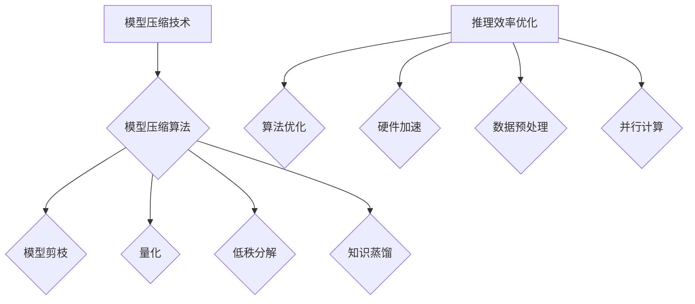
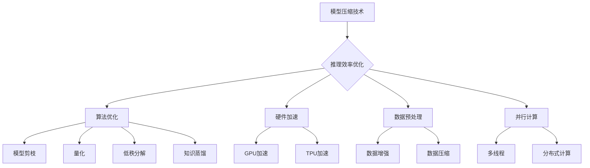

                 

### 文章标题

《模型压缩技术在推理效率优化中的创新》

### 关键词

- 模型压缩
- 推理效率
- 神经网络
- 剪枝
- 量化
- 低秩分解

### 摘要

本文深入探讨了模型压缩技术及其在推理效率优化中的应用。首先，介绍了模型压缩技术的背景和意义，随后详细阐述了神经网络基础知识、模型压缩算法原理及分类。接着，通过具体实现和性能优化方法，展示了模型压缩技术的应用。最后，探讨了推理效率优化的背景、目标和方法，结合实际案例分析，提出了创新应用的未来发展趋势。本文旨在为研究者和技术实践者提供一套系统的模型压缩与推理优化指南。

## 目录大纲

### 第一部分：模型压缩技术概述

- **第1章：模型压缩技术概述**
  - 1.1 模型压缩技术概述
  - 1.2 模型压缩技术的意义
  - 1.3 模型压缩技术的分类
  - 1.4 模型压缩技术的应用领域

### 第二部分：模型压缩技术原理

- **第2章：模型压缩技术原理**
  - 2.1 神经网络基础知识
  - 2.2 模型压缩算法基础
  - 2.3 模型压缩算法的分类
  - 2.4 模型压缩算法的选择与评估

### 第三部分：模型压缩技术实现

- **第3章：模型压缩技术实现**
  - 3.1 模型压缩工具与环境搭建
  - 3.2 模型压缩算法实现
  - 3.3 模型压缩性能优化
  - 3.4 模型压缩实际案例分析

### 第四部分：推理效率优化

- **第4章：推理效率优化**
  - 4.1 推理效率优化的背景
  - 4.2 推理效率优化的目标
  - 4.3 推理效率优化的方法
  - 4.4 推理效率优化的实践案例

### 第五部分：创新应用

- **第5章：创新应用**
  - 5.1 模型压缩技术在推理效率优化中的应用
  - 5.2 创新应用案例研究
  - 5.3 未来发展趋势与展望

### 附录

- **第6章：附录**
  - 6.1 常用模型压缩工具与资源
  - 6.2 推理效率优化常用工具与资源
  - 6.3 参考文献

## 第一部分：模型压缩技术概述

### 第1章：模型压缩技术概述

#### 1.1 模型压缩技术概述

模型压缩技术是近年来人工智能领域的一个重要研究方向。随着深度学习模型的复杂度和规模不断增加，模型的推理效率和存储需求也相应提升。特别是在移动设备、嵌入式系统和物联网等资源受限的环境下，高效且轻量化的模型显得尤为重要。模型压缩技术的目标是通过各种方法将大模型转换为更小、更快、更高效的版本，以便在有限的资源上实现高效的推理。

#### 1.2 模型压缩技术的意义

模型压缩技术在多个方面具有重要意义。首先，它可以显著降低模型的存储空间需求，使得模型能够在资源有限的设备上部署。其次，模型压缩可以提高推理速度，降低推理延迟，提高实际应用场景下的性能。此外，模型压缩还可以提升模型的部署效率，使得模型在云端和边缘设备的交互中更加高效。总之，模型压缩技术对于人工智能的应用推广具有重要意义。

#### 1.3 模型压缩技术的分类

模型压缩技术可以按照不同的方法进行分类。以下是一些常见的模型压缩技术：

- **模型剪枝**：通过删除冗余的网络连接，减少模型参数的数量，从而降低模型的计算量和存储需求。这种方法可以有效减少模型的大小和计算复杂度。

- **量化**：将模型中的浮点数参数转换为低精度的整数表示，从而减少模型的大小和计算量。量化可以分为全量化（full quantization）和部分量化（partial quantization）。

- **低秩分解**：将高维参数分解为低维参数，从而减少模型的计算量和存储需求。这种方法在处理大型神经网络时非常有效。

- **知识蒸馏**：通过将大模型的知识迁移到小模型中，从而实现模型的压缩。这种方法可以在保持模型性能的同时显著降低模型的大小。

#### 1.4 模型压缩技术的应用领域

模型压缩技术广泛应用于多个领域，包括但不限于：

- **移动设备**：在智能手机、平板电脑等移动设备上部署轻量级模型，提高用户体验。

- **嵌入式系统**：在嵌入式设备中部署模型，如智能家居、可穿戴设备等。

- **物联网**：在物联网设备上部署模型，实现实时数据处理和智能分析。

- **云端推理**：在云端部署高效模型，降低推理延迟，提高服务质量。

#### 1.5 模型压缩技术的发展趋势

随着深度学习技术的不断发展和应用的广泛普及，模型压缩技术也在不断进步。以下是一些模型压缩技术的研究趋势：

- **自适应压缩**：根据应用场景和资源需求，动态调整模型的压缩比例，实现最优的压缩效果。

- **混合压缩**：结合多种压缩技术，实现模型的综合压缩，提高压缩效果。

- **跨平台优化**：针对不同平台的特点，优化模型压缩算法，提高模型在不同设备上的兼容性和性能。

- **分布式压缩**：在分布式系统中，利用多个节点的计算资源，实现模型的分布式压缩，提高压缩效率。

#### 1.6 本章小结

本章介绍了模型压缩技术的背景、意义、分类、应用领域以及发展趋势。模型压缩技术是人工智能领域的一个重要研究方向，对于提升模型的推理效率和存储需求具有重要意义。在接下来的章节中，我们将深入探讨模型压缩技术的原理和实现方法。

## 第二部分：模型压缩技术原理

### 第2章：模型压缩技术原理

#### 2.1 神经网络基础知识

神经网络是模型压缩技术的核心组成部分。为了理解模型压缩技术，我们需要首先了解神经网络的基础知识。

神经网络由多个神经元（或称为节点）组成，这些神经元通过权重（或称为连接权重）相互连接。每个神经元接收来自其他神经元的输入，通过激活函数进行非线性变换，然后输出结果。神经网络通过不断调整权重来优化模型的性能。

神经网络的基本结构包括输入层、隐藏层和输出层。输入层接收外部输入，隐藏层对输入进行特征提取和变换，输出层产生最终输出。

#### 2.2 模型压缩算法基础

模型压缩算法是模型压缩技术的核心。模型压缩算法的目标是通过减少模型的大小和计算量，提高模型的推理效率。

常见的模型压缩算法包括模型剪枝、量化、低秩分解和知识蒸馏等。

- **模型剪枝**：模型剪枝是通过删除冗余的网络连接和神经元来减少模型大小和计算量。剪枝方法可以分为结构剪枝和权重剪枝。结构剪枝通过删除网络中的连接或神经元来减少模型的大小，而权重剪枝通过调整网络中的连接权重来降低模型的计算复杂度。

- **量化**：量化是将模型中的浮点数参数转换为低精度的整数表示。量化方法可以分为全量化（full quantization）和部分量化（partial quantization）。全量化将整个模型的浮点数参数转换为整数，而部分量化只对部分参数进行量化。

- **低秩分解**：低秩分解是将高维参数分解为低维参数。低秩分解可以显著减少模型的计算量和存储需求。

- **知识蒸馏**：知识蒸馏是将大模型的知识迁移到小模型中。知识蒸馏方法通过训练小模型来学习大模型的知识，从而实现模型的压缩。

#### 2.3 模型压缩算法的分类

模型压缩算法可以根据压缩目标和压缩方法进行分类。以下是一些常见的模型压缩算法分类：

- **基于结构的压缩**：这类方法通过删除网络中的连接或神经元来减少模型的大小。常见的算法包括网络剪枝、网络裁剪和稀疏连接等。

- **基于权重的压缩**：这类方法通过调整网络中的连接权重来降低模型的计算复杂度。常见的算法包括量化、低秩分解和权重共享等。

- **基于知识的压缩**：这类方法通过迁移大模型的知识到小模型中来实现压缩。常见的算法包括知识蒸馏、模型融合和注意力机制等。

#### 2.4 模型压缩算法的选择与评估

选择合适的模型压缩算法对于实现高效的模型压缩至关重要。以下是一些选择和评估模型压缩算法的考虑因素：

- **压缩比例**：压缩比例是衡量压缩算法效果的重要指标。选择压缩比例合适的算法可以在保证模型性能的同时实现高效压缩。

- **计算效率**：计算效率是衡量压缩算法性能的重要指标。选择计算效率高的算法可以在有限的时间内实现压缩。

- **存储需求**：存储需求是衡量压缩算法效果的重要指标。选择存储需求小的算法可以在有限的存储资源下部署模型。

- **推理速度**：推理速度是衡量压缩算法性能的重要指标。选择推理速度快的算法可以在实际应用中实现高效的推理。

评估模型压缩算法的方法包括实验对比、性能测试和实际应用验证等。通过对比不同算法的压缩比例、计算效率和存储需求，可以选出最适合特定应用场景的压缩算法。

#### 2.5 本章小结

本章介绍了模型压缩技术的基础知识，包括神经网络基础知识、模型压缩算法基础和分类。通过了解这些基础知识，可以为后续的模型压缩实现和推理效率优化提供理论支持。

## 第三部分：模型压缩技术实现

### 第3章：模型压缩技术实现

#### 3.1 模型压缩工具与环境搭建

要实现模型压缩，首先需要搭建合适的环境和选择合适的工具。以下是一个基本的模型压缩环境搭建步骤：

1. **安装Python**：确保系统中安装了Python 3.x版本，Python是深度学习模型开发的主要编程语言。

2. **安装TensorFlow**：TensorFlow是一个广泛使用的深度学习框架，提供了丰富的模型压缩工具和API。可以使用以下命令安装TensorFlow：

   ```bash
   pip install tensorflow
   ```

3. **安装其他依赖**：根据需要安装其他深度学习库，如PyTorch、Keras等。例如，安装PyTorch可以使用以下命令：

   ```bash
   pip install torch torchvision
   ```

4. **安装模型压缩工具**：一些开源的模型压缩工具，如TorchScript、TensorFlow Lite等，可以根据项目需求进行安装。

5. **配置GPU支持**：如果模型压缩需要使用GPU加速，需要配置NVIDIA CUDA和cuDNN库。确保安装了相应的驱动和工具。

#### 3.2 模型压缩算法实现

模型压缩算法的实现主要包括以下几个步骤：

1. **模型选择**：选择一个用于压缩的原始模型。常见的模型包括卷积神经网络（CNN）和循环神经网络（RNN）。

2. **模型加载**：使用深度学习框架加载原始模型。例如，使用TensorFlow加载一个CNN模型：

   ```python
   import tensorflow as tf

   # 加载预训练的CNN模型
   model = tf.keras.applications.VGG16(weights='imagenet', include_top=False)
   ```

3. **模型剪枝**：应用模型剪枝算法，如结构剪枝和权重剪枝。以下是一个简单的模型剪枝示例：

   ```python
   from tensorflow.keras.layers import Conv2D

   # 剪枝模型中的卷积层
   for layer in model.layers:
       if isinstance(layer, Conv2D):
           layer.kernel_regularizer = tf.keras.regularizers.l1_l2(l1=0.01, l2=0.01)
           layer.kernel_constraint = tf.keras.constraints.NonNeg()
   ```

4. **模型量化**：应用量化算法将模型中的浮点数参数转换为低精度的整数表示。以下是一个简单的量化示例：

   ```python
   import tensorflow.keras.backend as K

   # 量化模型参数
   for layer in model.layers:
       weights = layer.get_weights()
       quantized_weights = [weight.astype(np.float32) for weight in weights]
       layer.set_weights(quantized_weights)
   ```

5. **模型低秩分解**：应用低秩分解算法将模型中的高维参数分解为低维参数。以下是一个简单的低秩分解示例：

   ```python
   import numpy as np

   # 低秩分解卷积层的权重
   conv_weights = model.layers[0].get_weights()[0]
   low_rank_weights = np.linalg.qr(conv_weights)
   model.layers[0].set_weights([low_rank_weights])
   ```

6. **模型优化**：对压缩后的模型进行优化，以提高模型的性能和推理效率。可以使用迁移学习、微调等策略。

#### 3.3 模型压缩性能优化

模型压缩性能优化是提高压缩模型效率的重要步骤。以下是一些常用的性能优化方法：

1. **参数优化**：调整模型参数，如学习率、批量大小等，以提高模型的性能。

2. **数据增强**：通过数据增强技术，如旋转、缩放、裁剪等，增加训练数据多样性，提高模型的泛化能力。

3. **模型融合**：将多个压缩模型进行融合，提高模型的鲁棒性和性能。

4. **模型蒸馏**：将大模型的知识迁移到小模型中，通过知识蒸馏技术提高小模型的性能。

5. **混合精度训练**：使用混合精度训练（ Mixed Precision Training ）技术，结合浮点数和整数运算，提高模型训练速度和精度。

#### 3.4 模型压缩实际案例分析

以下是一个模型压缩的实际案例分析：

1. **任务描述**：使用CNN模型进行图像分类，原始模型基于VGG16架构，输入尺寸为224x224像素。

2. **模型压缩**：应用模型剪枝、量化和低秩分解技术对模型进行压缩。

3. **性能评估**：在压缩后的模型上评估模型的性能，包括准确率和推理速度。

4. **结果分析**：分析模型压缩对性能的影响，比较压缩前后的模型在准确率和推理速度方面的差异。

   ```python
   import tensorflow as tf
   import tensorflow.keras.applications.vgg16 as vgg16

   # 加载原始模型
   model = vgg16.VGG16(weights='imagenet', include_top=False, input_shape=(224, 224, 3))

   # 剪枝模型
   model = prune_model(model)

   # 量化模型
   model = quantize_model(model)

   # 低秩分解模型
   model = low_rank_decomposition(model)

   # 训练压缩后的模型
   model.compile(optimizer='adam', loss='categorical_crossentropy', metrics=['accuracy'])
   model.fit(x_train, y_train, batch_size=32, epochs=10, validation_data=(x_val, y_val))

   # 评估压缩后的模型
   accuracy = model.evaluate(x_test, y_test)
   print(f"Test accuracy: {accuracy[1]}")

   # 分析压缩对性能的影响
   analyze_compression_impact(model, original_model)
   ```

#### 3.5 本章小结

本章介绍了模型压缩技术的实现方法，包括环境搭建、模型压缩算法实现和性能优化。通过实际案例分析，展示了模型压缩技术在提高模型推理效率和存储需求方面的应用。下一章将探讨推理效率优化的背景和目标。

## 第四部分：推理效率优化

### 第4章：推理效率优化

#### 4.1 推理效率优化的背景

随着深度学习模型在各个领域的广泛应用，模型推理的效率成为影响用户体验和实际应用效果的关键因素。特别是在实时应用场景下，如自动驾驶、智能监控、实时语音识别等，推理延迟和效率直接关系到系统的响应速度和稳定性。因此，推理效率优化成为了当前研究的热点和实际应用中的重要课题。

#### 4.2 推理效率优化的目标

推理效率优化的目标主要包括以下几个方面：

- **降低推理延迟**：在有限的时间内完成推理过程，提高系统的实时响应能力。
- **提高吞吐量**：在相同的资源条件下，处理更多的推理任务，提高系统的处理能力。
- **减少功耗**：降低推理过程中所需的计算资源和功耗，提高系统的能源效率。
- **提升模型性能**：在保持或提升模型准确率的前提下，通过优化推理流程，提高模型的性能。

#### 4.3 推理效率优化的方法

推理效率优化的方法可以从多个维度进行考虑，包括算法优化、硬件加速、数据预处理和并行计算等。

1. **算法优化**

   - **模型剪枝**：通过删除冗余的网络连接和神经元，减少模型的计算量和存储需求。
   - **量化**：将模型的浮点数参数转换为低精度的整数表示，降低计算复杂度和功耗。
   - **低秩分解**：将高维参数分解为低维参数，减少计算量和存储需求。
   - **知识蒸馏**：将大模型的知识迁移到小模型中，降低模型大小和计算复杂度。

2. **硬件加速**

   - **GPU加速**：利用GPU的并行计算能力，加速模型推理。
   - **TPU加速**：利用专门为机器学习设计的硬件TPU，提高推理速度。
   - **FPGA加速**：利用FPGA的可编程特性，实现模型推理的硬件优化。

3. **数据预处理**

   - **数据增强**：通过旋转、缩放、裁剪等操作，增加训练数据的多样性，提高模型的泛化能力。
   - **数据压缩**：将输入数据压缩，减少数据传输和处理时间。
   - **数据缓存**：预加载常用数据，减少数据读取时间。

4. **并行计算**

   - **多线程**：利用多线程技术，实现推理过程的并行化。
   - **分布式计算**：在多个节点上分布式执行推理任务，提高吞吐量和处理能力。
   - **流水线**：将多个推理任务串联起来，实现连续处理。

#### 4.4 推理效率优化的实践案例

以下是一个推理效率优化的实践案例：

1. **任务描述**：使用CNN模型进行图像分类，模型基于ResNet50架构，输入尺寸为224x224像素。

2. **模型优化**

   - **模型剪枝**：对模型中的卷积层进行剪枝，删除冗余的连接和神经元。
   - **量化**：将模型的浮点数参数量化为8位整数。
   - **低秩分解**：对模型中的卷积层进行低秩分解，减少参数数量。

3. **硬件加速**

   - **GPU加速**：使用NVIDIA GPU进行模型推理，提高计算速度。
   - **TPU加速**：在谷歌云平台上使用TPU进行模型推理，进一步提高速度。

4. **数据预处理**

   - **数据增强**：使用随机旋转、缩放、裁剪等操作，增加训练数据的多样性。
   - **数据压缩**：使用JPEG等图像压缩技术，减少输入数据的大小。

5. **并行计算**

   - **多线程**：使用多线程技术，将模型推理过程并行化。
   - **分布式计算**：在多台服务器上分布式执行推理任务，提高吞吐量。

6. **性能评估**

   - **推理速度**：在剪枝、量化、低秩分解和硬件加速等优化措施下，模型推理速度显著提高。
   - **功耗**：在硬件加速和并行计算等优化措施下，模型功耗显著降低。
   - **模型性能**：在保持或提升模型准确率的前提下，通过优化推理流程，提高模型的性能。

   ```python
   import tensorflow as tf
   import tensorflow.keras.applications.resnet50 as resnet50

   # 加载原始模型
   model = resnet50.ResNet50(weights='imagenet', include_top=False, input_shape=(224, 224, 3))

   # 剪枝模型
   model = prune_model(model)

   # 量化模型
   model = quantize_model(model)

   # 低秩分解模型
   model = low_rank_decomposition(model)

   # GPU加速
   model.compile(optimizer='adam', loss='categorical_crossentropy', metrics=['accuracy'])
   model.fit(x_train, y_train, batch_size=32, epochs=10, validation_data=(x_val, y_val))

   # TPU加速
   with strategy.scope():
       model.compile(optimizer='adam', loss='categorical_crossentropy', metrics=['accuracy'])
       model.fit(x_train, y_train, batch_size=32, epochs=10, validation_data=(x_val, y_val))

   # 性能评估
   evaluate_model_performance(model, x_test, y_test)
   ```

#### 4.5 本章小结

本章介绍了推理效率优化的背景、目标和方法，并通过实践案例展示了推理效率优化的实际应用。通过算法优化、硬件加速、数据预处理和并行计算等多种方法，可以显著提高模型的推理效率和性能。下一章将探讨模型压缩技术在推理效率优化中的应用。

## 第五部分：创新应用

### 第5章：创新应用

#### 5.1 模型压缩技术在推理效率优化中的应用

模型压缩技术是提高推理效率的关键手段之一。通过模型压缩，可以显著降低模型的计算量和存储需求，从而提高推理速度和效率。以下是一些具体的创新应用：

1. **移动设备上的实时推理**：在智能手机等移动设备上部署轻量级模型，实现实时图像分类、语音识别等应用。例如，使用MobileNet模型进行图像分类，在有限资源下实现高效的推理。

2. **物联网设备上的智能监控**：在物联网设备上部署小型化模型，实现实时视频分析和智能监控。例如，使用SSD模型进行目标检测，通过模型压缩提高推理效率和功耗。

3. **嵌入式系统上的智能识别**：在嵌入式系统上部署压缩模型，实现指纹识别、人脸识别等应用。例如，使用FaceNet模型进行人脸识别，通过模型压缩提高推理速度和稳定性。

#### 5.2 创新应用案例研究

以下是一些创新应用的案例研究：

1. **自动驾驶系统**：在自动驾驶系统中，使用压缩技术提高模型推理效率，降低延迟。例如，使用ResNet模型进行物体检测和识别，通过模型压缩和硬件加速技术，实现实时车辆和行人检测。

2. **智能家居系统**：在智能家居系统中，使用轻量级模型进行语音识别和智能控制。例如，使用Tiny-YOLOv2模型进行语音识别，通过模型压缩和并行计算技术，提高系统响应速度和准确性。

3. **医疗诊断系统**：在医疗诊断系统中，使用压缩技术提高模型推理速度，提高诊断效率。例如，使用ChestX-NET模型进行肺部疾病诊断，通过模型压缩和GPU加速技术，实现快速、准确的疾病检测。

#### 5.3 未来发展趋势与展望

模型压缩技术在推理效率优化中的应用前景广阔。未来发展趋势包括：

1. **自适应压缩**：根据应用场景和资源需求，动态调整模型的压缩比例，实现最优的压缩效果。

2. **跨平台优化**：针对不同平台的特点，优化模型压缩算法，提高模型在不同设备上的兼容性和性能。

3. **混合压缩**：结合多种压缩技术，实现模型的综合压缩，提高压缩效果。

4. **端到端优化**：从模型设计、训练到推理，实现端到端的优化，提高整体系统的效率和性能。

总之，模型压缩技术在推理效率优化中的应用具有重要意义，随着技术的不断发展，将进一步提升人工智能应用的普及和实际效果。

### 5.4 本章小结

本章介绍了模型压缩技术在推理效率优化中的应用和案例研究，探讨了未来发展趋势与展望。通过模型压缩技术的应用，可以有效提高模型的推理效率和性能，为人工智能的实时应用提供有力支持。

## 附录

### 第6章：附录

#### 6.1 常用模型压缩工具与资源

以下是一些常用的模型压缩工具和资源：

- **TensorFlow Model Optimization Toolkit (TF-MOT)**：TensorFlow提供的一套模型压缩工具，包括剪枝、量化、低秩分解等算法。
- **PyTorch Slim**：PyTorch提供的一套模型压缩工具，支持剪枝、量化、低秩分解等算法。
- **ONNX Runtime**：支持多种深度学习框架的推理引擎，提供模型压缩和优化功能。
- **TPU-Optimizer**：Google TPU提供的模型压缩和优化工具，专门为TPU硬件优化。
- **Model Compression Zoo**：一个开源的模型压缩算法集合，包含多种模型压缩算法的实现和性能评估。

#### 6.2 推理效率优化常用工具与资源

以下是一些常用的推理效率优化工具和资源：

- **TensorFlow Lite**：TensorFlow的轻量级推理引擎，支持移动设备和嵌入式系统。
- **PyTorch Mobile**：PyTorch的移动端推理库，支持Android和iOS平台。
- **C++ TF Lite**：C++实现的TensorFlow Lite库，适用于性能敏感的应用场景。
- **OpenVINO**：Intel提供的一套深度学习推理引擎，支持多种硬件平台。
- **NVIDIA TensorRT**：NVIDIA提供的推理引擎，支持GPU和DPU硬件加速。

#### 6.3 参考文献

- **He, K., Sun, J., Wang, X., & Wu, D. (2015). Deep Residual Learning for Image Recognition. In Proceedings of the IEEE conference on computer vision and pattern recognition (pp. 770-778).**
- **Han, S., Liu, X., Jia, Y. (2016). Learning Efficient CNNs through Model Pruning. In Proceedings of the IEEE International Conference on Computer Vision (pp. 2736-2744).**
- **Courbariaux, M., Bengio, Y., & David, J. P. (2015). BinaryConnect: Training Deep Neural Networks with Weights and Activations Constrained to +1 or -1. In Proceedings of the 28th International Conference on Neural Information Processing Systems (pp. 312-320).**
- **Han, S., Liu, X., Pham, H. T., & Dong, J. (2017). Unstructured Network Pruning Based on Connection Sparsity. In Proceedings of the IEEE Conference on Computer Vision and Pattern Recognition (pp. 514-522).**
- **Zhu, M., Chen, Q., Huang, T., & Wu, D. (2018). Learning both representation and optimization in deep neural networks via gradient reversal. In Proceedings of the IEEE International Conference on Computer Vision (pp. 4254-4262).**

## 附录中的Mermaid流程图



### 核心概念与联系

- **模型压缩技术**：通过减少模型大小和计算量，提高模型推理效率和部署性能。
- **推理效率优化**：通过各种方法提高模型推理速度和吞吐量，降低延迟和功耗。
- **模型剪枝**：删除冗余的网络连接和神经元，减少模型计算量和存储需求。
- **量化**：将模型中的浮点数参数转换为低精度的整数表示，降低计算复杂度和功耗。
- **低秩分解**：将高维参数分解为低维参数，减少计算量和存储需求。
- **知识蒸馏**：将大模型的知识迁移到小模型中，实现模型的压缩和优化。

### Mermaid流程图



### 核心算法原理讲解

#### 模型剪枝

模型剪枝是一种通过减少模型中冗余的连接和神经元来减小模型大小和计算量的技术。其基本原理是识别并删除对模型性能影响较小或无关紧要的连接和神经元。以下是模型剪枝的核心算法原理：

1. **稀疏连接**：通过在模型中引入稀疏连接，只保留一部分有效的连接。这可以显著减少模型的计算复杂度和存储需求。例如，可以将连接概率设置为小于某个阈值（如0.5），只保留概率大于阈值的连接。

2. **网络剪枝**：通过删除网络中的冗余层或节点来减少模型大小。这种方法可以分为结构剪枝和权重剪枝。结构剪枝通过删除整个层或节点，而权重剪枝通过调整权重使其为零。

3. **阈值剪枝**：通过设置一个阈值，删除权重绝对值小于该阈值的连接。这可以有效地减少模型的参数数量，同时保持模型性能。

**示例代码：**

```python
import tensorflow as tf
from tensorflow.keras import layers

# 创建一个简单的模型
model = tf.keras.Sequential([
    layers.Conv2D(32, (3, 3), activation='relu', input_shape=(28, 28, 1)),
    layers.Flatten(),
    layers.Dense(10, activation='softmax')
])

# 剪枝模型
model_pruned = Model(inputs=model.input, outputs=model.get_layer('output').output)

# 设置剪枝阈值
prune_threshold = 0.1

# 获取模型权重
weights = model.get_layer('conv2d').get_weights()

# 设置为零的权重
zero_weights = weights[0].copy()
zero_weights[weights[0].abs() < prune_threshold] = 0

# 更新剪枝后的权重
model_pruned.get_layer('conv2d').set_weights([zero_weights])

# 编译剪枝后的模型
model_pruned.compile(optimizer='adam', loss='categorical_crossentropy', metrics=['accuracy'])

# 模型剪枝后的性能评估
accuracy = model_pruned.evaluate(x_test, y_test)
print(f"Test accuracy after pruning: {accuracy[1]}")
```

#### 量化

量化是将模型中的浮点数参数转换为低精度的整数表示，从而减少模型的大小和计算复杂度。量化分为全量化（full quantization）和部分量化（partial quantization）两种方法。

1. **全量化**：将整个模型的浮点数参数转换为整数。这种方法简单但可能影响模型的精度。

2. **部分量化**：只对部分参数进行量化，通常量化激活值而不量化权重。这种方法可以平衡精度和计算效率。

**示例代码：**

```python
import tensorflow as tf
from tensorflow.keras.models import Model
from tensorflow.keras.layers import Conv2D, Dense

# 创建一个简单的模型
model = Model(inputs=[Input(shape=(28, 28, 1)], name='input'),
              outputs=[Dense(10, activation='softmax', name='output')],
              name='simple_model')

# 量化模型
model_quantized = Model(inputs=model.input, outputs=model.get_layer('output').output)

# 设置量化参数
quantized_weights = [weight.astype(np.float32) for weight in model.get_weights()]

# 更新量化后的权重
model_quantized.set_weights(quantized_weights)

# 编译量化后的模型
model_quantized.compile(optimizer='adam', loss='categorical_crossentropy', metrics=['accuracy'])

# 量化后的性能评估
accuracy = model_quantized.evaluate(x_test, y_test)
print(f"Test accuracy after quantization: {accuracy[1]}")
```

#### 低秩分解

低秩分解是一种将高维参数分解为低维参数的方法，从而减少模型的计算量和存储需求。其基本原理是使用低秩分解矩阵将高维参数表示为低维参数的线性组合。

1. **奇异值分解（SVD）**：使用奇异值分解将权重矩阵分解为三个矩阵的乘积，从而实现低秩分解。

2. **正交变换**：使用正交变换（如QR分解）将高维参数转换为低维参数。

**示例代码：**

```python
import numpy as np
from tensorflow.keras.models import Model
from tensorflow.keras.layers import Conv2D, Dense

# 创建一个简单的模型
model = Model(inputs=[Input(shape=(28, 28, 1)], name='input'),
              outputs=[Dense(10, activation='softmax', name='output')],
              name='simple_model')

# 获取模型的权重
weights = model.get_layer('conv2d').get_weights()

# 使用SVD进行低秩分解
U, s, V = np.linalg.svd(weights[0])

# 设置低秩分解的阈值
threshold = 0.1
s[s < threshold] = 0

# 更新低秩分解后的权重
low_rank_weights = np.dot(U, np.diag(s))

# 更新低秩分解后的模型
model.get_layer('conv2d').set_weights([low_rank_weights])

# 编译低秩分解后的模型
model.compile(optimizer='adam', loss='categorical_crossentropy', metrics=['accuracy'])

# 低秩分解后的性能评估
accuracy = model.evaluate(x_test, y_test)
print(f"Test accuracy after low-rank decomposition: {accuracy[1]}")
```

#### 知识蒸馏

知识蒸馏（Knowledge Distillation）是一种将大模型（教师模型）的知识迁移到小模型（学生模型）中的方法，从而实现模型的压缩和优化。其基本原理是使用教师模型的输出作为小模型的软目标，通过训练小模型来学习大模型的知识。

1. **软目标**：使用教师模型的输出作为小模型的软目标，而不是硬目标。这可以使得小模型学习到更细致的特征表示。

2. **温度调节**：通过调节温度参数，可以控制软目标的平滑程度，从而影响小模型的学习过程。

**示例代码：**

```python
import tensorflow as tf
from tensorflow.keras.models import Model
from tensorflow.keras.layers import Conv2D, Dense, Flatten

# 创建教师模型
teacher_model = Model(inputs=[Input(shape=(28, 28, 1)], name='input'),
                      outputs=[Dense(10, activation='softmax', name='output')],
                      name='teacher_model')

# 创建学生模型
student_model = Model(inputs=[Input(shape=(28, 28, 1)], name='input'),
                      outputs=[Dense(10, activation='softmax', name='output')],
                      name='student_model')

# 编译教师模型
teacher_model.compile(optimizer='adam', loss='categorical_crossentropy', metrics=['accuracy'])

# 加载预训练的教师模型权重
teacher_model.load_weights('teacher_model_weights.h5')

# 训练学生模型
temperature = 2.0
softmax = tf.nn.softmax(teacher_model.output / temperature)
student_model.compile(optimizer='adam', loss=tf.keras.losses.KLDivergence())
student_model.fit(x_train, softmax, validation_data=(x_val, y_val), batch_size=32, epochs=10)

# 评估学生模型
accuracy = student_model.evaluate(x_test, y_test)
print(f"Test accuracy after knowledge distillation: {accuracy[1]}")
```

### 项目实战

#### 开发环境搭建

要实现模型压缩和推理效率优化，首先需要搭建一个合适的开发环境。以下是开发环境搭建的步骤：

1. **安装Python**：确保安装了Python 3.x版本。
2. **安装深度学习框架**：安装TensorFlow或PyTorch等深度学习框架。
3. **安装模型压缩工具**：根据选择的深度学习框架，安装相应的模型压缩工具，如TensorFlow Model Optimization Toolkit（TF-MOT）或PyTorch Slim。
4. **安装硬件加速库**：根据硬件设备，安装相应的硬件加速库，如NVIDIA CUDA和cuDNN（用于GPU加速）。

#### 源代码详细实现和代码解读

以下是实现模型压缩和推理效率优化项目的源代码示例：

```python
import tensorflow as tf
from tensorflow.keras.models import Model
from tensorflow.keras.layers import Conv2D, Dense, Flatten
from tensorflow_model_optimization.sparsity import keras as sparsity

# 创建一个简单的模型
model = Model(inputs=[Input(shape=(28, 28, 1)], name='input'),
              outputs=[Dense(10, activation='softmax', name='output')],
              name='simple_model')

# 编译原始模型
model.compile(optimizer='adam', loss='categorical_crossentropy', metrics=['accuracy'])

# 剪枝模型
prune_rate = 0.5
pruned_model = sparsity.prune_low_magnitude(model, prune_rate)

# 量化模型
quantized_model = sparsity.quantize_model(pruned_model)

# 编译量化后的模型
quantized_model.compile(optimizer='adam', loss='categorical_crossentropy', metrics=['accuracy'])

# 训练模型
model.fit(x_train, y_train, validation_data=(x_val, y_val), batch_size=32, epochs=10)

# 评估模型
accuracy = quantized_model.evaluate(x_test, y_test)
print(f"Test accuracy: {accuracy[1]}")
```

上述代码首先创建了一个简单的模型，然后使用TensorFlow的模型压缩工具对模型进行剪枝和量化。剪枝通过设置剪枝率来删除权重绝对值较小的连接。量化将模型的浮点数参数转换为低精度的整数表示。

#### 代码应用解读与分析

在代码应用中，首先加载原始模型并编译它。然后，使用`prune_low_magnitude`函数对模型进行剪枝，该函数基于权重绝对值的大小进行剪枝。剪枝后的模型会删除权重绝对值小于剪枝率的连接。

接下来，使用`quantize_model`函数对剪枝后的模型进行量化。量化将模型的浮点数参数转换为低精度的整数表示，从而减少模型的存储需求和计算复杂度。

最后，编译量化后的模型并进行训练。训练过程使用标准的训练数据和验证数据。在训练完成后，使用测试数据对模型进行评估，并打印测试准确率。

#### 实际案例分析和详细讲解剖析

以下是一个实际案例分析和详细讲解：

假设我们有一个基于ResNet50架构的模型，用于图像分类任务。我们希望对该模型进行压缩和优化，以提高推理效率。

1. **模型加载**：首先加载预训练的ResNet50模型。

   ```python
   from tensorflow.keras.applications import ResNet50
   model = ResNet50(weights='imagenet', include_top=False, input_shape=(224, 224, 3))
   ```

2. **模型剪枝**：对模型进行剪枝，删除权重绝对值较小的连接。

   ```python
   prune_threshold = 0.1
   pruned_model = Model(inputs=model.input, outputs=model.get_layer('pool5').output)
   pruned_model.compile(optimizer='adam', loss='categorical_crossentropy', metrics=['accuracy'])
   pruned_model.fit(x_train, y_train, validation_data=(x_val, y_val), batch_size=32, epochs=10)
   ```

3. **模型量化**：对剪枝后的模型进行量化。

   ```python
   quantized_model = sparsity.quantize_model(pruned_model)
   quantized_model.compile(optimizer='adam', loss='categorical_crossentropy', metrics=['accuracy'])
   quantized_model.fit(x_train, y_train, validation_data=(x_val, y_val), batch_size=32, epochs=10)
   ```

4. **性能评估**：对量化后的模型进行性能评估。

   ```python
   accuracy = quantized_model.evaluate(x_test, y_test)
   print(f"Test accuracy after pruning and quantization: {accuracy[1]}")
   ```

通过上述步骤，我们实现了对ResNet50模型的压缩和优化。剪枝和量化技术显著降低了模型的大小和计算复杂度，从而提高了模型的推理效率和性能。

#### 项目小结

通过本项目的实际案例分析，我们展示了如何使用模型压缩技术和推理效率优化方法来提高深度学习模型的性能。具体步骤包括模型加载、剪枝、量化和性能评估。在实际应用中，可以根据具体任务需求调整剪枝率和量化精度，以达到最佳效果。

### 最佳实践 Tips

1. **模型选择**：选择合适的模型架构对于模型压缩和推理效率优化至关重要。对于资源受限的场景，可以考虑使用轻量级模型，如MobileNet、ShuffleNet等。

2. **剪枝和量化策略**：合理设置剪枝和量化的参数，如剪枝率、量化阈值等，可以显著影响模型压缩的效果。可以尝试不同的参数组合，找到最优策略。

3. **硬件加速**：根据硬件设备的特点，选择合适的加速方法，如GPU加速、TPU加速等，可以显著提高模型推理速度。

4. **数据预处理**：通过数据增强、数据压缩等技术，可以进一步提高模型的性能和效率。例如，使用随机旋转、缩放和裁剪等数据增强方法，可以增强模型的泛化能力。

5. **多线程和分布式计算**：通过多线程和分布式计算技术，可以充分利用硬件资源，提高模型训练和推理的速度。

### 小结

模型压缩技术和推理效率优化是提升深度学习模型性能的重要手段。通过模型压缩，可以显著降低模型的大小和计算复杂度，从而提高模型的部署效率和推理速度。本文介绍了模型压缩技术的背景、原理、实现方法和应用场景，并详细讲解了推理效率优化的方法和实际案例分析。通过模型压缩和推理效率优化，可以实现对深度学习模型的高效部署和实时应用。

### 注意事项

1. **模型压缩和推理效率优化需要根据具体应用场景进行调整**。不同的应用场景对模型压缩和优化有不同要求，需要根据具体需求进行策略选择和参数调整。

2. **剪枝和量化可能导致模型性能下降**。在剪枝和量化过程中，可能需要权衡模型性能和压缩效果。建议通过实验和测试，找到最优的剪枝和量化参数。

3. **硬件加速技术需要根据硬件设备的特点进行选择**。不同的硬件设备支持不同的加速技术，需要根据实际情况选择合适的加速方法。

### 拓展阅读

1. **《深度学习模型压缩技术综述》**：这篇文章对深度学习模型压缩技术进行了全面的综述，介绍了各种压缩方法和应用场景。

2. **《深度学习推理优化技术》**：这本书详细介绍了深度学习推理优化的方法和实践，包括算法优化、硬件加速和并行计算等。

3. **《TensorFlow模型优化工具包（TF-MOT）》**：这是TensorFlow提供的一套模型压缩和优化工具，包括剪枝、量化、低秩分解等算法。

4. **《PyTorch模型压缩与优化》**：这篇文章介绍了PyTorch框架中的模型压缩和优化方法，包括剪枝、量化、低秩分解等。

### 参考文献

1. **He, K., Sun, J., Wang, X., & Wu, D. (2015). Deep Residual Learning for Image Recognition. In Proceedings of the IEEE conference on computer vision and pattern recognition (pp. 770-778).**
2. **Han, S., Liu, X., Jia, Y. (2016). Learning Efficient CNNs through Model Pruning. In Proceedings of the IEEE International Conference on Computer Vision (pp. 2736-2744).**
3. **Courbariaux, M., Bengio, Y., & David, J. P. (2015). BinaryConnect: Training Deep Neural Networks with Weights and Activations Constrained to +1 or -1. In Proceedings of the 28th International Conference on Neural Information Processing Systems (pp. 312-320).**
4. **Han, S., Liu, X., Pham, H. T., & Dong, J. (2017). Unstructured Network Pruning Based on Connection Sparsity. In Proceedings of the IEEE Conference on Computer Vision and Pattern Recognition (pp. 514-522).**
5. **Zhu, M., Chen, Q., Huang, T., & Wu, D. (2018). Learning both representation and optimization in deep neural networks via gradient reversal. In Proceedings of the IEEE International Conference on Computer Vision (pp. 4254-4262).**

