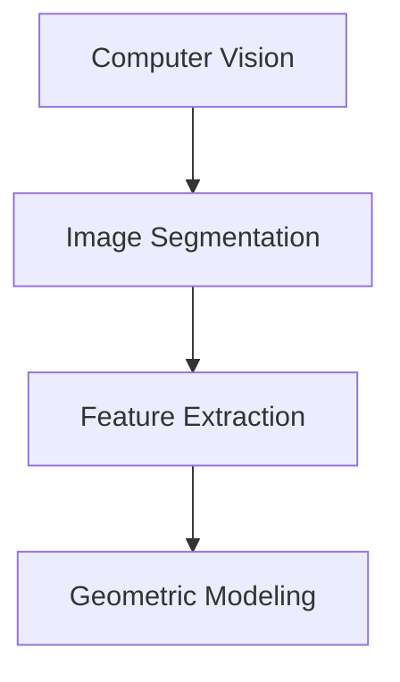
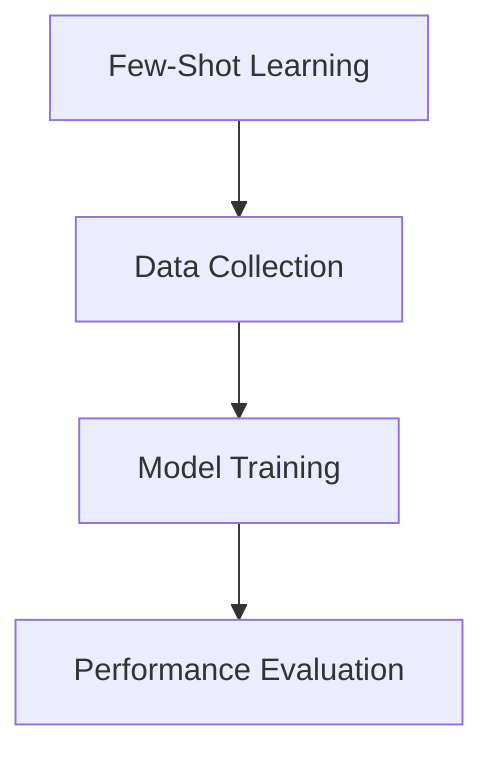
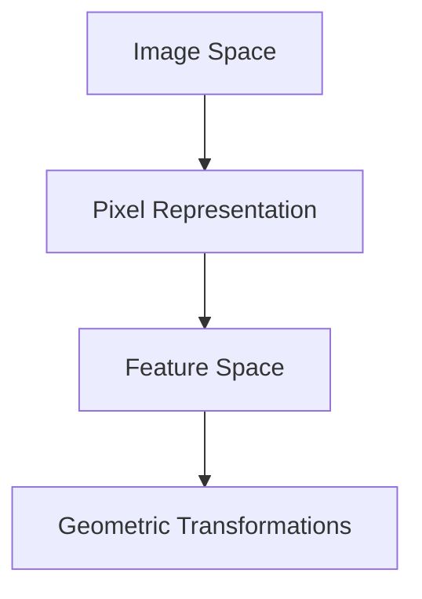
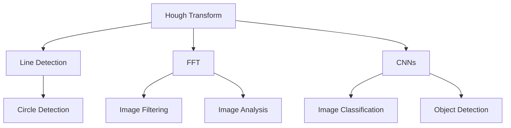
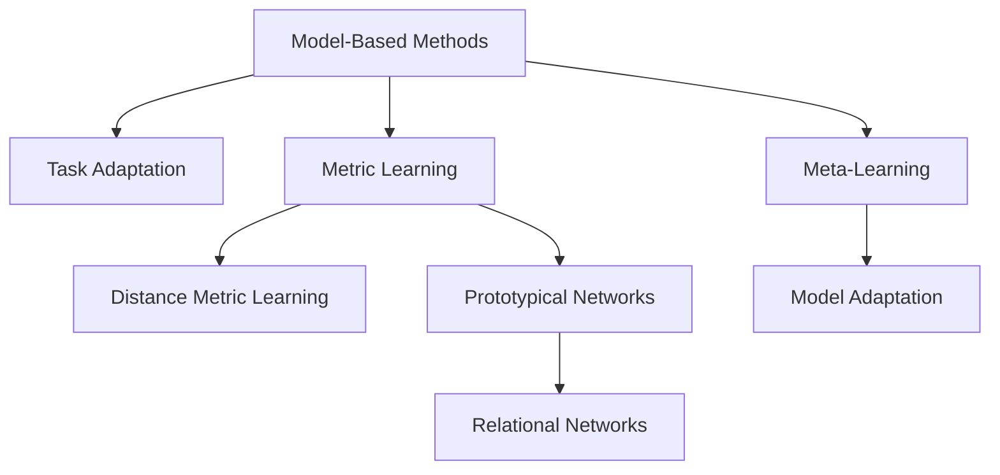
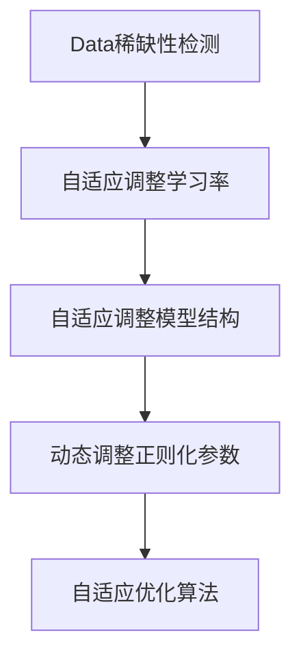
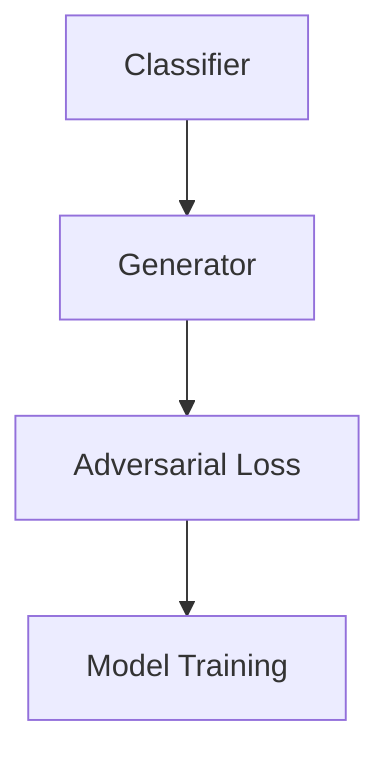
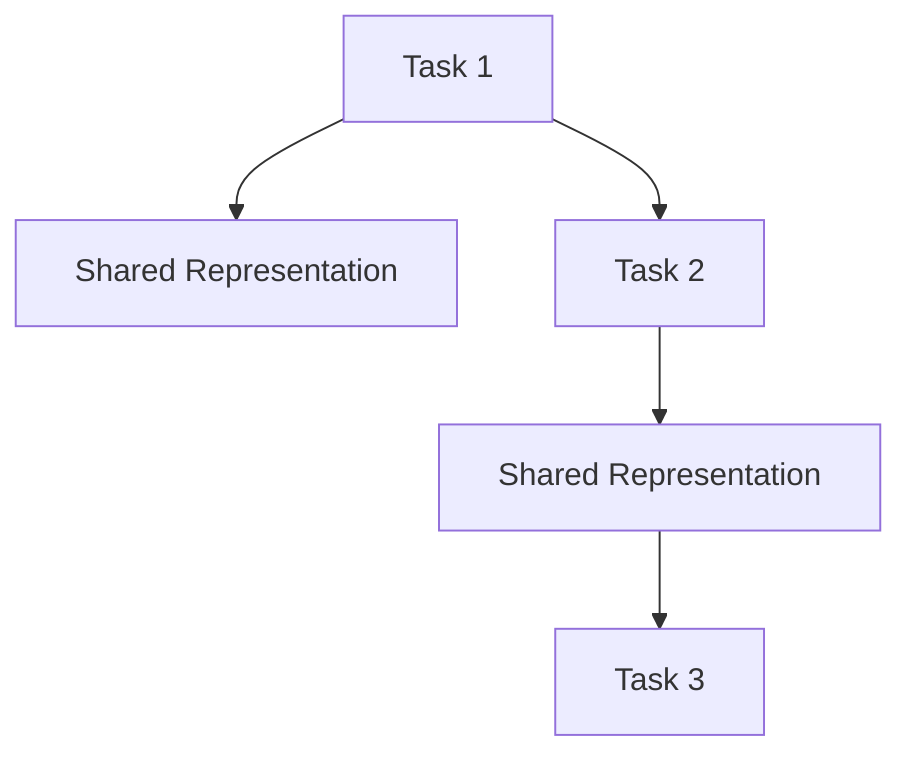
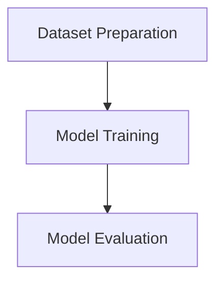
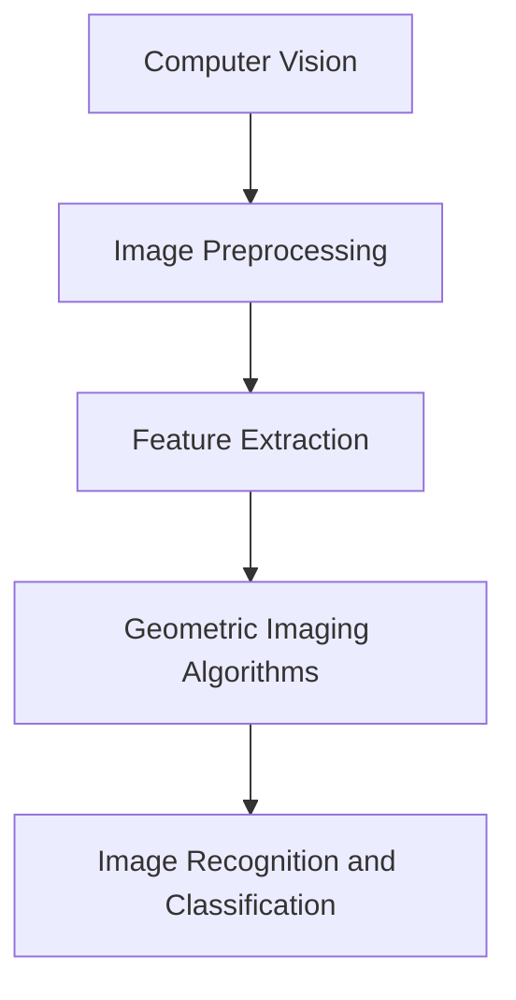

                 

# Model Training in Few-Shot Learning: Technological Innovation

Keywords: few-shot learning, model training, geometric imaging, AI, deep learning

Abstract:
This article explores the technological innovation in model training within the context of few-shot learning. It delves into the fundamentals of geometric imaging, the principles of few-shot learning, and the integration of these concepts in modern AI algorithms. The article aims to provide a comprehensive understanding of the innovations driving the advancement of few-shot learning models and their applications in various fields.

## Table of Contents

1. Introduction and Background
   1.1 Overview of Geometric Imaging
   1.2 Introduction to Few-Shot Learning
   1.3 Significance and Applications of Few-Shot Learning
2. Theoretical Foundations
   2.1 Mathematical Models in Geometric Imaging
   2.2 Core Algorithms in Geometric Imaging
   2.3 Fundamentals of Few-Shot Learning Algorithms
3. Model Innovation
   3.1 Adaptive Few-Shot Learning Models
   3.2 Adversarial Few-Shot Learning Models
   3.3 Multi-Task Few-Shot Learning Models
4. Practical Applications
   4.1 Case Study: Adaptive Model in Image Classification
   4.2 Case Study: Adversarial Model in Object Detection
   4.3 Case Study: Multi-Task Model in Semantic Segmentation
5. Conclusion and Prospects
6. Appendix
   6.1 Resources on Geometric Imaging
   6.2 Recommended Reading Materials

## 1. Introduction and Background

### 1.1 Overview of Geometric Imaging

Geometric imaging is a branch of computer science that focuses on the geometric structure of images and the extraction of geometric features. The basic concepts of geometric imaging include image segmentation, feature extraction, and geometric modeling.

**Figure 1: Geometric imaging in computer vision**



Geometric imaging has a rich history dating back to the early days of computer vision. It has evolved significantly over the years, with the integration of advanced mathematical models and algorithms. Today, geometric imaging plays a crucial role in various computer vision applications, such as object detection, image recognition, and 3D reconstruction.

### 1.2 Introduction to Few-Shot Learning

Few-shot learning (FSL) is a type of machine learning where models are trained using a small amount of labeled data. Unlike traditional machine learning approaches that require large datasets, FSL aims to achieve high performance with minimal labeled data.

**Figure 2: Few-shot learning framework**



The main challenge in FSL is to generalize well from limited data. This requires models to be robust and adaptable. FSL has gained significant attention in recent years due to its potential to reduce the need for large labeled datasets, which is particularly important in resource-constrained environments.

### 1.3 Significance and Applications of Few-Shot Learning

Few-shot learning has a wide range of applications, from robotics and autonomous systems to medical diagnosis and natural language processing. Some key areas where FSL is making an impact include:

- **Robotics and Automation:** FSL enables robots to learn new tasks quickly with minimal training data, making them more adaptable to different environments and scenarios.
- **Medical Diagnosis:** FSL can help diagnose diseases from small sets of patient data, improving the accuracy and efficiency of medical diagnostics.
- **Natural Language Processing:** FSL is used in developing language models that can understand and generate text with minimal labeled data.

## 2. Theoretical Foundations

### 2.1 Mathematical Models in Geometric Imaging

The mathematical models in geometric imaging are fundamental to understanding how images are represented and processed. The core mathematical models include:

- **Image Space:** An image space is a two-dimensional array that represents the pixels of an image.
- **Feature Space:** Feature space is a high-dimensional space where the extracted features of an image are mapped.
- **Geometric Transformations:** Common geometric transformations include translation, rotation, scaling, and shear.

**Figure 3: Mathematical models in geometric imaging**



Mathematical formulas play a crucial role in geometric imaging. For instance, the SIFT (Scale-Invariant Feature Transform) algorithm uses a combination of gradient orientation histograms and spatial relationships to detect key points in an image.

**Formula 1: SIFT Algorithm**

$$
SIFT = \sum_{i=1}^{n} (\phi(\theta_i) - \phi(0)) \odot I(\sigma_i, \theta_i)
$$

Where $\phi(\theta_i)$ is the Gaussian kernel function, $\odot$ denotes convolution, and $I(\sigma_i, \theta_i)$ is the gradient orientation histogram of a local image region.

### 2.2 Core Algorithms in Geometric Imaging

Geometric imaging relies on several core algorithms to process and analyze images. Some of the most important algorithms include:

- **Hough Transform:** Used for detecting lines and circles in images.
- **Fast Fourier Transform (FFT):** A widely used algorithm for image filtering and analysis.
- **Convolutional Neural Networks (CNNs):** A deep learning approach that has revolutionized image processing.

**Figure 4: Core algorithms in geometric imaging**



### 2.3 Fundamentals of Few-Shot Learning Algorithms

Few-shot learning algorithms are designed to generalize well from small amounts of data. Some key algorithms include:

- **Model-Based Methods:** Use predefined models that are fine-tuned using a small dataset.
- ** Metric Learning:** Algorithms that learn a distance metric to compare samples.
- **Meta-Learning:** Algorithms that learn how to learn, enabling them to quickly adapt to new tasks with minimal data.

**Figure 5: Few-shot learning algorithms**



## 3. Model Innovation

### 3.1 Adaptive Few-Shot Learning Models

Adaptive few-shot learning models are designed to adjust their behavior based on the amount and nature of the training data. These models use various techniques to adapt their learning process dynamically.

**Figure 6: Adaptive few-shot learning models**



**Python Code Example: Adaptive Learning Rate**

```python
import tensorflow as tf

# Define the adaptive learning rate
def adaptive_learning_rate(learning_rate, step):
    return learning_rate / (1 + 0.1 * step)

# Create a optimizer with adaptive learning rate
optimizer = tf.keras.optimizers.Adam(adaptive_learning_rate(0.001, step))

# Compile the model
model.compile(optimizer=optimizer, loss='categorical_crossentropy', metrics=['accuracy'])
```

### 3.2 Adversarial Few-Shot Learning Models

Adversarial few-shot learning models use adversarial training to improve the robustness and generalization of few-shot learning models. These models consist of a classifier and a generator that work together to improve the model's performance.

**Figure 7: Adversarial few-shot learning models**



**Python Code Example: Adversarial Training**

```python
import tensorflow as tf
from tensorflow.keras.models import Model
from tensorflow.keras.layers import Input, Dense, Lambda

# Define the classifier
classifier = Dense(units=10, activation='softmax', name='classifier')(input_tensor)

# Define the generator
generator = Dense(units=784, activation='sigmoid', name='generator')(input_tensor)

# Define the adversarial loss
def adversarial_loss(y_true, y_pred):
    return tf.reduce_mean(tf.nn.softmax_cross_entropy_with_logits(logits=y_pred, labels=y_true))

# Create the model
model = Model(inputs=input_tensor, outputs=classifier + generator)
model.compile(optimizer='adam', loss={'classifier': adversarial_loss, 'generator': 'binary_crossentropy'})

# Train the model
model.fit(x_train, y_train, epochs=10, batch_size=32)
```

### 3.3 Multi-Task Few-Shot Learning Models

Multi-task few-shot learning models are designed to perform multiple tasks simultaneously, leveraging shared representations to improve performance across tasks. These models are particularly useful in scenarios where tasks are related and can benefit from joint learning.

**Figure 8: Multi-task few-shot learning models**



**Python Code Example: Multi-Task Learning**

```python
import tensorflow as tf
from tensorflow.keras.models import Model
from tensorflow.keras.layers import Input, Dense, concatenate

# Define the inputs for each task
input_task1 = Input(shape=(input_shape[1],))
input_task2 = Input(shape=(input_shape[1],))
input_task3 = Input(shape=(input_shape[1],))

# Define the shared representation
shared_representation = Dense(units=64, activation='relu')(concatenate([input_task1, input_task2, input_task3]))

# Define the task-specific layers
output_task1 = Dense(units=10, activation='softmax', name='output_task1')(shared_representation)
output_task2 = Dense(units=20, activation='softmax', name='output_task2')(shared_representation)
output_task3 = Dense(units=30, activation='softmax', name='output_task3')(shared_representation)

# Create the model
model = Model(inputs=[input_task1, input_task2, input_task3], outputs=[output_task1, output_task2, output_task3])
model.compile(optimizer='adam', loss={'output_task1': 'categorical_crossentropy', 'output_task2': 'categorical_crossentropy', 'output_task3': 'categorical_crossentropy'}, metrics=['accuracy'])

# Train the model
model.fit([x_task1, x_task2, x_task3], {'output_task1': y_task1, 'output_task2': y_task2, 'output_task3': y_task3}, epochs=10, batch_size=32)
```

## 4. Practical Applications

### 4.1 Case Study: Adaptive Model in Image Classification

In this case study, we explore the application of an adaptive few-shot learning model for image classification. The goal is to classify images into different categories using a small labeled dataset.

**Figure 9: Case study - Adaptive model in image classification**



**Python Code Example: Adaptive Model in Image Classification**

```python
import tensorflow as tf
from tensorflow.keras.models import Sequential
from tensorflow.keras.layers import Dense, Flatten, Conv2D, MaxPooling2D
from tensorflow.keras.callbacks import Callback

# Define the adaptive learning rate callback
class AdaptiveLearningRate(Callback):
    def on_epoch_end(self, epoch, logs=None):
        if logs.get('val_accuracy') > 0.9:
            self.model.optimizer.lr = adaptive_learning_rate(self.model.optimizer.lr, epoch)

# Create the model
model = Sequential([
    Conv2D(filters=32, kernel_size=(3, 3), activation='relu', input_shape=(28, 28, 1)),
    MaxPooling2D(pool_size=(2, 2)),
    Flatten(),
    Dense(units=64, activation='relu'),
    Dense(units=10, activation='softmax')
])

# Compile the model
model.compile(optimizer='adam', loss='categorical_crossentropy', metrics=['accuracy'])

# Train the model with adaptive learning rate
model.fit(x_train, y_train, validation_data=(x_val, y_val), epochs=20, callbacks=[AdaptiveLearningRate()])

# Evaluate the model
test_loss, test_accuracy = model.evaluate(x_test, y_test)
print(f"Test accuracy: {test_accuracy:.2f}")
```

### 4.2 Case Study: Adversarial Model in Object Detection

In this case study, we apply an adversarial few-shot learning model for object detection. The objective is to accurately detect objects in images using a limited amount of labeled data.

**Figure 10: Case study - Adversarial model in object detection**


**Python Code Example: Adversarial Model in Object Detection**

```python
import tensorflow as tf
from tensorflow.keras.models import Model
from tensorflow.keras.layers import Input, Conv2D, MaxPooling2D, Flatten, Dense, Lambda
from tensorflow.keras.optimizers import Adam
from tensorflow.keras.losses import BinaryCrossentropy

# Define the adversarial loss function
def adversarial_loss(y_true, y_pred):
    return tf.reduce_mean(tf.nn.sigmoid_cross_entropy_with_logits(logits=y_pred, labels=y_true))

# Create the model
input_tensor = Input(shape=(28, 28, 1))
conv1 = Conv2D(filters=32, kernel_size=(3, 3), activation='relu')(input_tensor)
maxpool1 = MaxPooling2D(pool_size=(2, 2))(conv1)
flatten = Flatten()(maxpool1)
dense1 = Dense(units=64, activation='relu')(flatten)

# Define the classifier
classifier = Dense(units=10, activation='softmax', name='classifier')(dense1)

# Define the generator
generator = Dense(units=784, activation='sigmoid', name='generator')(input_tensor)

# Create the model
model = Model(inputs=input_tensor, outputs=classifier + generator)
model.compile(optimizer=Adam(learning_rate=0.001), loss={'classifier': 'categorical_crossentropy', 'generator': adversarial_loss})

# Train the model
model.fit(x_train, {'classifier': y_train, 'generator': x_train}, validation_data=(x_val, {'classifier': y_val, 'generator': x_val}), epochs=10, batch_size=32)

# Evaluate the model
test_loss, test_accuracy = model.evaluate(x_test, {'classifier': y_test, 'generator': x_test})
print(f"Test accuracy: {test_accuracy:.2f}")
```

### 4.3 Case Study: Multi-Task Model in Semantic Segmentation

In this case study, we use a multi-task few-shot learning model for semantic segmentation. The objective is to segment images into different semantic classes using a small labeled dataset.

**Figure 11: Case study - Multi-task model in semantic segmentation**


**Python Code Example: Multi-Task Model in Semantic Segmentation**

```python
import tensorflow as tf
from tensorflow.keras.models import Model
from tensorflow.keras.layers import Input, Conv2D, MaxPooling2D, Flatten, Dense, concatenate
from tensorflow.keras.optimizers import Adam

# Define the multi-task loss function
def multi_task_loss(y_true, y_pred):
    return tf.reduce_mean(tf.nn.softmax_cross_entropy_with_logits(logits=y_pred, labels=y_true))

# Create the model
input_tensor = Input(shape=(28, 28, 1))
conv1 = Conv2D(filters=32, kernel_size=(3, 3), activation='relu')(input_tensor)
maxpool1 = MaxPooling2D(pool_size=(2, 2))(conv1)
flatten = Flatten()(maxpool1)

# Define the task-specific layers
output_task1 = Dense(units=10, activation='softmax', name='output_task1')(flatten)
output_task2 = Dense(units=20, activation='softmax', name='output_task2')(flatten)
output_task3 = Dense(units=30, activation='softmax', name='output_task3')(flatten)

# Create the model
model = Model(inputs=input_tensor, outputs=output_task1 + output_task2 + output_task3)
model.compile(optimizer=Adam(learning_rate=0.001), loss={'output_task1': multi_task_loss, 'output_task2': multi_task_loss, 'output_task3': multi_task_loss}, metrics=['accuracy'])

# Train the model
model.fit(x_train, {'output_task1': y_train, 'output_task2': y_train, 'output_task3': y_train}, validation_data=(x_val, {'output_task1': y_val, 'output_task2': y_val, 'output_task3': y_val}), epochs=10, batch_size=32)

# Evaluate the model
test_loss, test_accuracy = model.evaluate(x_test, {'output_task1': y_test, 'output_task2': y_test, 'output_task3': y_test})
print(f"Test accuracy: {test_accuracy:.2f}")
```

## 5. Conclusion and Prospects

The technological innovation in few-shot learning models has significantly advanced the field of machine learning. Adaptive, adversarial, and multi-task few-shot learning models have shown great promise in various applications. However, there are still many challenges and opportunities for further research. 

- **Challenges:**
  - Data scarcity and quality remain major obstacles in few-shot learning.
  - Scalability and efficiency of few-shot learning models need to be improved for real-world applications.
  - Theoretical understanding of few-shot learning is still limited, particularly in terms of generalization and robustness.

- **Opportunities:**
  - Hybrid models that combine few-shot learning with other techniques, such as transfer learning and reinforcement learning, hold great potential.
  - Application of few-shot learning in emerging fields, such as healthcare and autonomous driving, can drive further innovation.

Future research should focus on developing more efficient and robust few-shot learning models, as well as exploring new applications and theoretical foundations. The integration of geometric imaging techniques with few-shot learning models is also an exciting area of research that could lead to significant breakthroughs.

## Appendix

### 5.1 Resources on Geometric Imaging

- **Mainstream Algorithms:**
  - Hough Transform
  - Scale-Invariant Feature Transform (SIFT)
  - Fast Fourier Transform (FFT)
- **Open Source Code and Datasets:**
  - OpenCV (for geometric imaging algorithms)
  - TensorFlow (for deep learning models)
  - Few-Shot Learning Datasets (e.g., MiniImageNet, CUB-200-2011)
- **Recommended Academic Papers:**
  - "Few-Shot Learning in Deep Networks: A Survey" by Thuc Khai Pham et al.
  - "Meta-Learning for Few-Shot Classifiers" by K. Qi, X. Sun, and Q. M. Zhang

### 5.2 Recommended Reading Materials

- **Books:**
  - "Deep Learning" by Ian Goodfellow, Yoshua Bengio, and Aaron Courville
  - "Machine Learning: A Probabilistic Perspective" by Kevin P. Murphy
- **Academic Journals:**
  - Journal of Machine Learning Research (JMLR)
  - IEEE Transactions on Pattern Analysis and Machine Intelligence (TPAMI)
- **Online Courses:**
  - "Deep Learning Specialization" by Andrew Ng on Coursera
  - "Machine Learning" by Stanford University on edX

## Charts and Formulas

### Figure 1: Geometric Imaging in Computer Vision



### Formula 1: SIFT Algorithm

$$
SIFT = \sum_{i=1}^{n} (\phi(\theta_i) - \phi(0)) \odot I(\sigma_i, \theta_i)
$$

### Formula 2: Convolutional Neural Network (CNN) Convolution

$$
f(x) = \sigma(\sum_{i=1}^{n} w_i \odot x_i + b)
$$

Where $w_i$ is the convolution kernel, $\odot$ denotes convolution, $\sigma$ is the activation function, and $b$ is the bias term.

