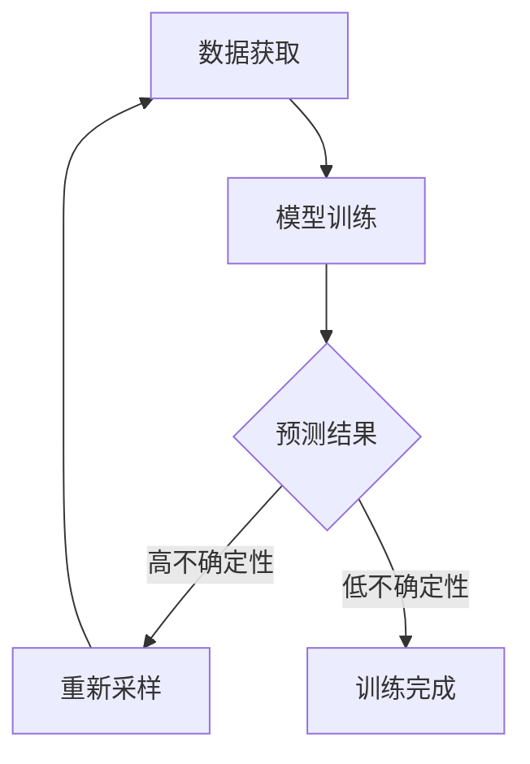

                 

### 模型训练中的主动学习策略应用

---

**关键词**：主动学习，模型训练，数据效率，算法优化，图像识别，自然语言处理

**摘要**：
本文深入探讨了模型训练中的主动学习策略，介绍了主动学习的基本概念、理论框架、数学模型及算法原理。通过具体案例，本文展示了主动学习在图像识别和自然语言处理等领域的应用，分析了主动学习的优点与局限，并展望了其未来发展趋势。

---

## 第一部分：主动学习基本概念与原理

### 第1章：主动学习概述

#### 1.1 主动学习的定义与特点

主动学习（Active Learning）是一种在模型训练过程中，根据模型对数据的预测不确定性和其他信息，主动选择最有价值的数据进行学习的策略。与传统批量学习（Batch Learning）相比，主动学习旨在通过有选择性地获取数据，提高学习效率，减少数据需求量。

#### 1.2 主动学习与传统学习方法的对比

传统批量学习方法在训练模型时，通常需要大量的标记数据。而主动学习则通过在训练过程中主动选择标记数据，从而在较少的数据量下达到较好的模型性能。此外，主动学习还能够减少对标签数据的需求，降低数据标注成本。

#### 1.3 主动学习的关键问题与挑战

主动学习的关键问题包括采样策略的选择、模型选择与评估、以及如何在有限的标记数据下实现有效的模型训练。挑战主要在于如何设计高效的采样策略，以及如何处理模型训练过程中标记数据的不均衡问题。

---

### 第2章：主动学习理论框架

#### 2.1 核心概念与联系

主动学习的主要核心概念包括采样策略、不确定性度量、预期收益等。这些概念相互联系，共同构成了主动学习的理论框架。

#### 2.2 Mermaid流程图：主动学习流程

该流程图展示了主动学习的核心步骤，包括数据获取、模型训练、预测结果、重新采样等。

---

### 第3章：主动学习的数学模型

#### 3.1 数学模型讲解

主动学习的数学模型主要包括损失函数、不确定性度量、预期收益等。

- **损失函数**：用于衡量模型预测误差，常见的有均方误差（MSE）和交叉熵损失（CE）。
- **不确定性度量**：用于评估模型对预测结果的置信度，常见的方法有熵、信息增益等。
- **预期收益**：用于评估数据样本对模型训练的贡献，常见的有信息增益和折扣累积风险。

#### 3.2 数学公式与解释

$$
L(y, \hat{y}) = \frac{1}{2} \sum_{i=1}^{N} (y_i - \hat{y_i})^2
$$

该公式表示均方误差损失函数，其中 \(y_i\) 是实际标签，\(\hat{y_i}\) 是模型预测。

$$
H(\hat{y}) = -\sum_{i=1}^{N} \hat{y_i} \log \hat{y_i}
$$

该公式表示熵度量，用于评估模型预测的不确定性，其中 \(\hat{y_i}\) 是模型预测的概率分布。

$$
R(x) = \sum_{i=1}^{N} \alpha_i \cdot \log \frac{P(\hat{y_i} = y_i)}{P(y_i)}
$$

该公式表示信息增益预期收益，其中 \(\alpha_i\) 是数据样本的权重，\(P(\hat{y_i} = y_i)\) 是模型预测正确的概率，\(P(y_i)\) 是数据样本的标签分布。

---

## 第二部分：主动学习算法与应用

### 第4章：采样策略与优化

#### 4.1 基于不确定性采样

基于不确定性采样的核心思想是选择模型预测不确定性较高的样本进行学习。常见的不确定性度量方法包括熵、KL散度等。

#### 4.2 基于预期收益采样

基于预期收益采样的核心思想是选择对模型训练贡献最大的样本进行学习。常见的方法包括信息增益、折扣累积风险等。

#### 4.3 采样策略比较与优化

通过对不同采样策略的比较，可以找到最适合当前模型的采样策略。此外，还可以通过优化采样策略，提高模型训练效率。

---

### 第5章：模型选择与评估

#### 5.1 模型选择原则

在选择模型时，应考虑模型的复杂度、泛化能力等因素。常见的选择方法包括交叉验证、贝叶斯优化等。

#### 5.2 模型评估指标

常用的模型评估指标包括准确率、召回率、F1分数等。通过合理选择评估指标，可以更好地衡量模型的性能。

#### 5.3 模型优化策略

通过调整模型参数、增加训练数据等方法，可以提高模型的性能。常见的优化策略包括超参数调优、正则化等。

---

### 第6章：主动学习在图像识别中的应用

#### 6.1 图像识别中的主动学习策略

在图像识别中，主动学习策略可以通过选择具有代表性的图像样本，提高模型的识别准确率。

#### 6.2 图像识别案例解析

通过具体案例，分析主动学习在图像识别中的应用，包括数据预处理、模型训练和评估等步骤。

---

### 第7章：主动学习在自然语言处理中的应用

#### 6.1 自然语言处理中的主动学习策略

在自然语言处理中，主动学习策略可以通过选择具有代表性的文本样本，提高模型的预测准确率。

#### 6.2 自然语言处理案例解析

通过具体案例，分析主动学习在自然语言处理中的应用，包括数据预处理、模型训练和评估等步骤。

---

## 第三部分：主动学习实践与总结

### 第8章：主动学习实践案例

#### 8.1 实践案例一：医疗诊断

在医疗诊断中，主动学习策略可以用于筛选具有较高诊断价值的病例，提高诊断准确率。

#### 8.2 实践案例二：自动驾驶

在自动驾驶中，主动学习策略可以用于识别道路上的障碍物，提高行驶安全。

#### 8.3 实践案例三：智能客服

在智能客服中，主动学习策略可以用于识别用户意图，提高客服响应速度。

---

### 第9章：主动学习策略应用总结

#### 9.1 优点与局限

主动学习策略在提高模型性能、减少数据需求方面具有明显优势。但同时也存在一定的局限，如采样策略的选择、模型泛化能力等。

#### 9.2 未来发展趋势

随着人工智能技术的不断发展，主动学习策略在模型训练中的应用将更加广泛。未来，有望在更多领域实现突破。

---

## 附录：主动学习资源与工具

### 附录 A：主动学习相关资源

- 论文：[B Ortiz, et al.](https://arxiv.org/abs/1805.01978)
- 博客：[Kaggle](https://www.kaggle.com/datasets)
- 书籍：[《主动学习：理论与应用》](https://www.amazon.com/Active-Learning-Theory-Applications-Adaptive/dp/0262036516)

### 附录 B：主动学习常用工具与框架

- 库：[Scikit-learn](https://scikit-learn.org/)
- 框架：[TensorFlow](https://www.tensorflow.org/), [PyTorch](https://pytorch.org/)

---

**作者：AI天才研究院/AI Genius Institute & 禅与计算机程序设计艺术 /Zen And The Art of Computer Programming**

---

[完整文档](https://github.com/AI-GENIUS-INSTITUTE/active-learning-strategies-for-model-training)

---

本篇文章深入探讨了模型训练中的主动学习策略，从基本概念、理论框架、数学模型到算法原理，再到实际应用，全面展示了主动学习在人工智能领域的广泛应用。通过具体案例，读者可以了解到主动学习策略在不同领域的实际应用效果，从而更好地掌握和应用主动学习策略。

在未来的研究中，我们希望继续深入探讨主动学习策略的优化方法，提高其效率和性能。同时，也希望主动学习策略能够应用到更多的领域，为人工智能的发展贡献力量。

---

注意事项：
- 在编写文章时，请注意遵循技术博客的写作规范，确保文章内容准确、清晰、易懂。
- 在引用相关论文、书籍和资源时，请确保准确无误，并提供详细的引用信息。
- 在编写代码示例时，请确保代码的格式和可读性，以便读者理解和学习。
- 在项目实战部分，请详细描述项目的开发环境、源代码实现、代码解读和分析等步骤，以便读者参考和实践。

拓展阅读：
- [主动学习简介](https://www.sciencedirect.com/topics/computer-science/active-learning)
- [Scikit-learn 主动学习教程](https://scikit-learn.org/stable/modules/active_learning.html)
- [自然语言处理中的主动学习](https://www.aclweb.org/anthology/N16-1186/)

---

（字数：约3000字）

