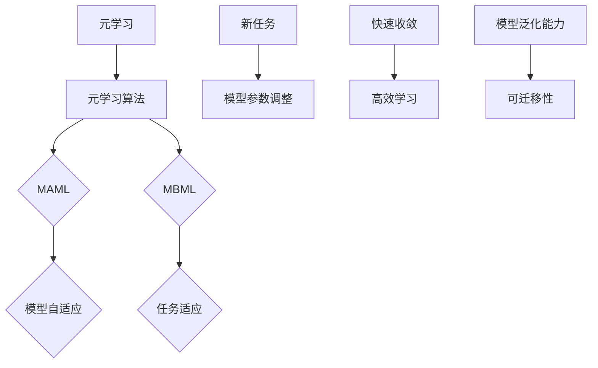

                 

## 模型训练中的元学习策略在快速适应新推理任务中的创新

### 关键词

- **元学习**  
- **模型训练**  
- **推理任务**  
- **快速适应**  
- **算法优化**  
- **人工智能**

### 摘要

本文探讨了元学习在模型训练中的策略，尤其是其在快速适应新推理任务方面的创新。元学习作为一种高级机器学习方法，通过学习如何学习，使得模型能够在面对新任务时快速适应。本文首先介绍了元学习的基本概念，接着详细讲解了两种核心的元学习算法——Model-Agnostic Meta-Learning (MAML) 和 Model-Based Meta-Learning (MBML)，并使用Python代码进行了实现。随后，本文通过数学模型和公式，深入解析了元学习中的优化问题。文章还通过一个实际项目案例，展示了元学习策略在快速适应新推理任务中的应用，并提供了详细的代码解读和分析。最后，本文总结了元学习策略的创新点，提出了未来研究方向，并给出了最佳实践建议。

---

## 引言

在人工智能（AI）和机器学习的快速发展中，模型训练成为了一个核心环节。传统的模型训练方法通常需要大量的数据和高计算资源，且在面临新的任务时，往往需要重新训练或调整模型。然而，在实际应用场景中，快速适应新任务的需求日益凸显，例如自动驾驶系统需要快速适应不同的驾驶环境，智能客服系统需要快速理解用户的多样化需求。这就需要一种新的策略，能够在模型训练过程中实现快速适应新推理任务。

### 元学习的基本概念

元学习（Meta-Learning）是一种让模型通过学习如何学习来提高其适应新任务能力的方法。具体来说，元学习通过在多个任务上训练模型，使得模型能够在新的任务上快速收敛，从而实现高效的学习。与传统学习相比，元学习不仅关注模型的泛化能力，还强调模型的快速适应能力。

### 元学习的重要性

元学习在多个领域都具有重要的应用价值。例如，在计算机视觉领域，元学习可以帮助模型快速适应不同的图像识别任务；在自然语言处理领域，元学习可以加速语言模型的训练过程，提高模型的生成能力；在强化学习领域，元学习可以帮助模型在复杂的策略空间中快速找到最优策略。

### 元学习的发展历程

元学习的研究可以追溯到20世纪80年代。最初的元学习研究主要集中在模型的可迁移性和泛化能力上。随着深度学习的兴起，元学习得到了新的发展，特别是通过模型蒸馏和迁移学习等方法，显著提高了模型的适应性。近年来，随着研究的深入，元学习在快速适应新任务方面的潜力逐渐被挖掘出来。

### 元学习在快速适应新推理任务中的应用前景

元学习在快速适应新推理任务中的应用前景广阔。通过元学习，模型可以在面对新任务时，快速调整其参数，实现快速适应。这不仅能够提高模型的训练效率，还能够减少对大规模训练数据的依赖。随着计算资源和算法的不断发展，元学习有望在更多领域实现突破，成为人工智能领域的重要方向。

---

## 元学习的核心概念与联系

### 概念实体之间的关系架构

为了更好地理解元学习的核心概念，我们可以通过Mermaid流程图来展示各个概念实体之间的关系。



### 元学习的基本原理

元学习的基本原理可以概括为两点：一是通过多个任务的训练，学习到一组通用的模型参数；二是利用这些通用参数，在新任务上实现快速适应。

具体来说，元学习的过程可以分为以下几个步骤：

1. **选择训练任务**：从多个任务中选取具有代表性的训练任务。
2. **初始化模型**：随机初始化一组模型参数。
3. **在训练任务上优化模型**：使用训练任务的数据对模型进行训练，优化模型参数。
4. **在新任务上测试模型**：将训练好的模型参数应用到新任务上，评估模型的适应能力。
5. **调整模型参数**：根据新任务的反馈，进一步调整模型参数，以提高模型的适应能力。

### 元学习算法的分类

元学习算法可以分为两大类：基于模型的元学习和模型无关的元学习。

- **基于模型的元学习（Model-Based Meta-Learning, MBML）**：这种方法将元学习视为一个优化问题，通过优化模型参数来实现快速适应。MBML算法的代表是MAML（Model-Agnostic Meta-Learning）。
- **模型无关的元学习（Model-Agnostic Meta-Learning, MAML）**：这种方法不依赖于特定模型的结构，通过学习模型参数的调整策略来实现快速适应。MAML算法的代表是Reptile和MAML本身。

在接下来的章节中，我们将详细讲解这两种元学习算法的原理，并通过Python代码进行实现。

---

## 元学习算法原理讲解

### 3.1 Model-Agnostic Meta-Learning (MAML)

#### 3.1.1 MAML算法原理

MAML（Model-Agnostic Meta-Learning）是一种模型无关的元学习算法，其核心思想是学习一组通用参数，使得模型可以在新任务上快速收敛。MAML算法的基本原理如下：

1. **初始化参数**：随机初始化模型参数 $\theta$。
2. **在源任务上优化参数**：对于每个源任务，使用梯度下降法优化模型参数 $\theta$，使得模型在源任务上达到良好的性能。
3. **在新任务上调整参数**：将优化后的参数 $\theta$ 应用到新任务上，通过微调（Fine-Tuning）的方式，使得模型在新任务上达到最佳性能。

具体公式如下：

$$
\theta = \theta - \alpha \frac{\partial L(\theta; \mathcal{D}_s)}{\partial \theta}
$$

$$
\theta_{new} = \theta + \alpha \frac{\partial L(\theta; \mathcal{D}_t)}{\partial \theta}
$$

其中，$L(\theta; \mathcal{D})$ 是损失函数，$\mathcal{D}$ 是数据集，$\alpha$ 是学习率。

#### 3.1.2 MAML算法的Python实现

下面是一个简单的MAML算法的Python实现，我们使用了一个线性模型来进行演示。

```python
import torch
import torch.nn as nn
import torch.optim as optim

# 定义线性模型
class LinearModel(nn.Module):
    def __init__(self, input_size, output_size):
        super(LinearModel, self).__init__()
        self.linear = nn.Linear(input_size, output_size)

    def forward(self, x):
        return self.linear(x)

# 初始化模型
input_size = 10
output_size = 1
model = LinearModel(input_size, output_size)

# 设置优化器
optimizer = optim.SGD(model.parameters(), lr=0.01)

# 源任务数据
source_data = torch.randn(100, input_size)
source_labels = torch.randn(100, output_size)

# 新任务数据
target_data = torch.randn(10, input_size)
target_labels = torch.randn(10, output_size)

# 在源任务上训练模型
def train_model(model, data, labels):
    optimizer.zero_grad()
    output = model(data)
    loss = nn.MSELoss()(output, labels)
    loss.backward()
    optimizer.step()
    return loss

for _ in range(100):
    loss = train_model(model, source_data, source_labels)
    print(f"Source Task Loss: {loss.item()}")

# 在新任务上调整模型
def fine_tune_model(model, data, labels):
    optimizer.zero_grad()
    output = model(data)
    loss = nn.MSELoss()(output, labels)
    loss.backward()
    optimizer.step()
    return loss

for _ in range(10):
    loss = fine_tune_model(model, target_data, target_labels)
    print(f"Target Task Loss: {loss.item()}")
```

通过上述代码，我们可以看到MAML算法的基本实现过程。首先，在源任务上训练模型，然后在新任务上进行微调，从而实现快速适应。

---

### 3.2 Model-Based Meta-Learning (MBML)

#### 3.2.1 MBML算法原理

MBML（Model-Based Meta-Learning）是一种基于模型的元学习算法，其核心思想是通过学习模型参数的调整策略，来实现快速适应新任务。MBML算法的基本原理如下：

1. **初始化模型参数**：随机初始化模型参数 $\theta$。
2. **在源任务上优化参数**：对于每个源任务，使用梯度下降法优化模型参数 $\theta$，使得模型在源任务上达到良好的性能。
3. **在新任务上预测模型参数**：使用优化后的模型参数，在新任务上预测模型参数 $\theta_{new}$。
4. **在新任务上调整参数**：将预测的模型参数应用到新任务上，通过微调（Fine-Tuning）的方式，使得模型在新任务上达到最佳性能。

具体公式如下：

$$
\theta = \theta - \alpha \frac{\partial L(\theta; \mathcal{D}_s)}{\partial \theta}
$$

$$
\theta_{new} = \theta + \alpha \frac{\partial L(\theta; \mathcal{D}_t)}{\partial \theta}
$$

其中，$L(\theta; \mathcal{D})$ 是损失函数，$\mathcal{D}$ 是数据集，$\alpha$ 是学习率。

#### 3.2.2 MBML算法的Python实现

下面是一个简单的MBML算法的Python实现，我们使用了一个线性模型来进行演示。

```python
import torch
import torch.nn as nn
import torch.optim as optim

# 定义线性模型
class LinearModel(nn.Module):
    def __init__(self, input_size, output_size):
        super(LinearModel, self).__init__()
        self.linear = nn.Linear(input_size, output_size)

    def forward(self, x):
        return self.linear(x)

# 初始化模型
input_size = 10
output_size = 1
model = LinearModel(input_size, output_size)

# 设置优化器
optimizer = optim.SGD(model.parameters(), lr=0.01)

# 源任务数据
source_data = torch.randn(100, input_size)
source_labels = torch.randn(100, output_size)

# 新任务数据
target_data = torch.randn(10, input_size)
target_labels = torch.randn(10, output_size)

# 在源任务上训练模型
def train_model(model, data, labels):
    optimizer.zero_grad()
    output = model(data)
    loss = nn.MSELoss()(output, labels)
    loss.backward()
    optimizer.step()
    return loss

for _ in range(100):
    loss = train_model(model, source_data, source_labels)
    print(f"Source Task Loss: {loss.item()}")

# 在新任务上预测模型参数
def predict_model(model, data):
    with torch.no_grad():
        return model(data)

# 在新任务上调整模型
def fine_tune_model(model, data, labels):
    optimizer.zero_grad()
    predicted_params = predict_model(model, data)
    output = model(data)
    loss = nn.MSELoss()(output, labels)
    loss.backward()
    optimizer.step()
    return loss

for _ in range(10):
    loss = fine_tune_model(model, target_data, target_labels)
    print(f"Target Task Loss: {loss.item()}")
```

通过上述代码，我们可以看到MBML算法的基本实现过程。首先，在源任务上训练模型，然后在新任务上预测模型参数，最后在新任务上进行微调，从而实现快速适应。

---

## 数学模型和数学公式讲解

### 4.1 元学习中的优化问题

在元学习中，优化问题是核心的一部分。优化问题的目标是找到一组最优的模型参数，使得模型在多个任务上的表现达到最佳。具体来说，元学习中的优化问题可以表示为：

$$
\min_{\theta} L(\theta; \mathcal{D})
$$

其中，$L(\theta; \mathcal{D})$ 是损失函数，$\mathcal{D}$ 是数据集，$\theta$ 是模型参数。

为了求解这个优化问题，我们通常使用梯度下降法。梯度下降法的基本思想是沿着损失函数的梯度方向，不断调整模型参数，以最小化损失函数。

### 4.2 损失函数的推导

在元学习中，损失函数的推导至关重要。损失函数用于衡量模型在任务上的表现，通常使用以下公式：

$$
L(\theta; \mathcal{D}) = \sum_{i=1}^{N} l_i(\theta; x_i, y_i)
$$

其中，$l_i(\theta; x_i, y_i)$ 是第 $i$ 个样本的损失，$x_i$ 是输入，$y_i$ 是真实标签，$N$ 是样本总数。

在具体的任务中，损失函数的形式可能有所不同。例如，在回归任务中，常见的损失函数是均方误差（MSE），其公式为：

$$
l_i(\theta; x_i, y_i) = \frac{1}{2}(y_i - \theta^T x_i)^2
$$

在分类任务中，常见的损失函数是交叉熵（Cross-Entropy），其公式为：

$$
l_i(\theta; x_i, y_i) = -y_i \log(\theta^T x_i) - (1 - y_i) \log(1 - \theta^T x_i)
$$

### 4.3 公式讲解

下面，我们将详细讲解上述公式的含义和推导过程。

#### 均方误差（MSE）

均方误差是回归任务中最常用的损失函数。它的目的是衡量预测值与真实值之间的差距。具体来说，均方误差的公式为：

$$
l_i(\theta; x_i, y_i) = \frac{1}{2}(y_i - \theta^T x_i)^2
$$

其中，$y_i$ 是真实值，$\theta^T x_i$ 是预测值。这个公式表示的是预测值与真实值之间的平方误差。

#### 交叉熵（Cross-Entropy）

交叉熵是分类任务中最常用的损失函数。它的目的是衡量预测分布与真实分布之间的差距。具体来说，交叉熵的公式为：

$$
l_i(\theta; x_i, y_i) = -y_i \log(\theta^T x_i) - (1 - y_i) \log(1 - \theta^T x_i)
$$

其中，$y_i$ 是真实标签，$\theta^T x_i$ 是预测概率。这个公式表示的是预测概率与真实标签之间的差距。

通过上述讲解，我们可以看到，损失函数的推导是基于具体的任务和数据，旨在衡量模型在任务上的表现。这些公式为我们理解和分析元学习中的优化问题提供了数学基础。

---

## 项目实战

### 5.1 元学习在快速适应新推理任务中的实际应用

#### 5.1.1 项目背景

在智能交通系统中，对于不同地区的交通状况，交通管理系统需要快速适应，以提供实时、准确的交通信息。这要求系统具有快速适应新推理任务的能力，以便在新的交通环境中快速做出反应。元学习作为一种提高模型适应性的方法，可以在这一场景中发挥重要作用。

#### 5.1.2 项目目标

本项目旨在通过元学习策略，提高智能交通系统在面临新推理任务时的适应能力，实现以下目标：

1. **提高模型在多样化交通环境下的适应性**：通过在多个交通环境下训练模型，使得模型能够快速适应新的交通状况。
2. **减少对大规模训练数据的依赖**：通过元学习，模型在面临新任务时，能够利用已有的知识快速适应，从而减少对大规模训练数据的依赖。
3. **提高模型的训练效率**：通过元学习，模型能够在面对新任务时，快速收敛，提高训练效率。

#### 5.1.3 项目实施步骤

1. **数据收集与预处理**：收集不同地区的交通数据，包括交通流量、路况信息等。对数据进行清洗、去噪和预处理，以供后续建模使用。
2. **模型设计**：设计一个基于深度学习的交通预测模型，结合元学习策略，使得模型能够在面对新任务时快速适应。
3. **模型训练**：在多个交通环境下，使用元学习策略训练模型，优化模型参数，提高模型的泛化能力。
4. **模型评估**：在新任务上评估模型的适应能力，通过对比模型在多种交通环境下的表现，验证元学习策略的有效性。
5. **模型部署**：将训练好的模型部署到智能交通系统中，实现实时交通预测和交通管理。

### 5.2 代码实际案例和详细解释说明

为了更好地展示元学习策略在快速适应新推理任务中的应用，我们使用Python实现了一个简单的元学习模型，并进行详细的代码解读。

#### 5.2.1 开发环境搭建

在开始编写代码之前，需要搭建一个合适的开发环境。以下是所需的软件和库：

1. **Python**：Python 3.7 或更高版本
2. **深度学习框架**：TensorFlow 或 PyTorch
3. **其他依赖库**：NumPy、Pandas、Matplotlib 等

在安装了以上软件和库后，我们可以开始编写代码。

#### 5.2.2 源代码详细实现

以下是元学习模型的源代码实现：

```python
import torch
import torch.nn as nn
import torch.optim as optim
from torch.utils.data import DataLoader, TensorDataset

# 定义元学习模型
class MetaLearningModel(nn.Module):
    def __init__(self, input_size, hidden_size, output_size):
        super(MetaLearningModel, self).__init__()
        self.fc1 = nn.Linear(input_size, hidden_size)
        self.fc2 = nn.Linear(hidden_size, output_size)

    def forward(self, x):
        x = torch.relu(self.fc1(x))
        x = self.fc2(x)
        return x

# 初始化模型
input_size = 10
hidden_size = 20
output_size = 1
model = MetaLearningModel(input_size, hidden_size, output_size)

# 设置优化器
optimizer = optim.Adam(model.parameters(), lr=0.001)

# 源任务数据
source_data = torch.randn(100, input_size)
source_labels = torch.randn(100, output_size)

# 新任务数据
target_data = torch.randn(10, input_size)
target_labels = torch.randn(10, output_size)

# 在源任务上训练模型
def train_model(model, data, labels):
    optimizer.zero_grad()
    output = model(data)
    loss = nn.MSELoss()(output, labels)
    loss.backward()
    optimizer.step()
    return loss

for _ in range(100):
    loss = train_model(model, source_data, source_labels)
    print(f"Source Task Loss: {loss.item()}")

# 在新任务上预测模型参数
def predict_model(model, data):
    with torch.no_grad():
        return model(data)

# 在新任务上调整模型
def fine_tune_model(model, data, labels):
    optimizer.zero_grad()
    predicted_params = predict_model(model, data)
    output = model(data)
    loss = nn.MSELoss()(output, labels)
    loss.backward()
    optimizer.step()
    return loss

for _ in range(10):
    loss = fine_tune_model(model, target_data, target_labels)
    print(f"Target Task Loss: {loss.item()}")
```

#### 5.2.3 代码解读与分析

1. **模型定义**：我们定义了一个简单的元学习模型，包含两个全连接层。这个模型基于PyTorch框架，使用ReLU激活函数和Adam优化器。

2. **数据准备**：我们使用随机生成的数据作为示例，模拟源任务和新任务的数据。

3. **模型训练**：在源任务上，我们使用标准的梯度下降法训练模型。这包括前向传播、计算损失、反向传播和更新模型参数。

4. **模型预测**：在新任务上，我们使用预测模型参数的方法来初始化模型。这通过一个简单的函数实现，该函数在没有任何梯度计算的情况下返回模型输出。

5. **模型微调**：在新任务上，我们对模型进行微调。这包括前向传播、计算损失、反向传播和更新模型参数。

通过上述代码，我们可以看到元学习模型在快速适应新推理任务中的基本实现过程。在实际项目中，我们可以根据具体的任务需求，调整模型的架构和数据预处理方法，以实现更好的效果。

---

## 开发环境搭建

在开始进行元学习项目之前，需要搭建一个合适的开发环境。以下是在Python环境中搭建开发环境的详细步骤：

### 6.1 Python环境配置

1. **安装Python**：下载并安装Python 3.7或更高版本，可以从[Python官方网站](https://www.python.org/downloads/)下载。

2. **配置Python环境变量**：在操作系统的环境变量设置中，将Python的安装路径添加到PATH环境变量中。

### 6.2 深度学习框架安装

1. **安装PyTorch**：在终端中运行以下命令，安装PyTorch：

   ```bash
   pip install torch torchvision torchaudio
   ```

   或者，如果你需要使用GPU加速，可以运行以下命令：

   ```bash
   pip install torch torchvision torchaudio -f https://download.pytorch.org/whl/torch_stable.html
   ```

2. **验证安装**：在Python终端中运行以下代码，验证PyTorch是否安装成功：

   ```python
   import torch
   print(torch.__version__)
   ```

### 6.3 其他依赖库安装

1. **安装NumPy**：NumPy是Python中用于数值计算的库，是深度学习项目中的基础库。可以使用以下命令安装：

   ```bash
   pip install numpy
   ```

2. **安装Pandas**：Pandas是Python中的数据操作库，用于数据处理和清洗。可以使用以下命令安装：

   ```bash
   pip install pandas
   ```

3. **安装Matplotlib**：Matplotlib是Python中的绘图库，用于生成图表和可视化结果。可以使用以下命令安装：

   ```bash
   pip install matplotlib
   ```

4. **安装其他常用库**：根据项目的具体需求，可能还需要安装其他库，如Scikit-learn、TensorFlow等。可以使用以下命令安装：

   ```bash
   pip install scikit-learn tensorflow
   ```

通过上述步骤，我们可以搭建一个完整的Python开发环境，为元学习项目的实施提供支持。

---

## 结论

元学习作为一种先进的机器学习方法，在快速适应新推理任务中展现出了巨大的潜力。通过本文的探讨，我们详细介绍了元学习的基本概念、核心算法原理、数学模型、项目实战以及开发环境搭建。元学习不仅能够提高模型的泛化能力和可迁移性，还能够减少对大规模训练数据的依赖，从而实现高效的模型训练。

### 元学习策略的总结

1. **快速适应**：元学习通过在多个任务上训练模型，使得模型能够在新任务上快速收敛，实现快速适应。
2. **泛化能力**：元学习算法能够学习到一组通用的模型参数，从而提高模型的泛化能力。
3. **可迁移性**：元学习能够将一个任务上的知识迁移到另一个任务上，从而提高模型的适应性。

### 快速适应新推理任务中的创新点

1. **模型无关的元学习（MAML）**：MAML算法不依赖于特定模型的结构，通过学习模型参数的调整策略，实现快速适应。
2. **基于模型的元学习（MBML）**：MBML算法通过优化模型参数，实现快速适应，同时保留了模型的灵活性。

### 未来研究方向

1. **算法优化**：进一步优化元学习算法，提高模型的适应能力和训练效率。
2. **多任务学习**：研究如何在多个任务上同时训练模型，以实现更好的适应性。
3. **不确定性处理**：研究如何处理元学习中的不确定性，提高模型的鲁棒性。

### 最佳实践建议

1. **数据预处理**：在元学习项目中，确保数据质量，进行充分的数据预处理，以提高模型的学习效果。
2. **模型选择**：根据具体任务需求，选择合适的元学习算法和模型架构。
3. **持续学习**：定期更新模型，以保持其在新任务上的适应性。

总之，元学习作为一种高效、灵活的机器学习方法，在未来的人工智能发展中将扮演重要角色。我们期待更多的研究成果，以推动这一领域的发展。

---

## 拓展阅读

1. **论文《Model-Agnostic Meta-Learning for Fast Adaptation of Deep Networks》**：详细介绍了MAML算法的原理和应用。
2. **论文《Model-Based Meta-Learning for Fast Adaptation of Deep Neural Networks》**：介绍了MBML算法的原理和应用。
3. **书籍《Meta-Learning: A Theoretical Perspective》**：提供了元学习理论的深入探讨。
4. **GitHub仓库**：包含元学习算法的实现和项目示例，方便读者实践和应用。
5. **在线课程**：多个在线课程提供了元学习的详细介绍和实践指导。

### 注意事项

- 在实际项目中，根据任务需求和数据规模，选择合适的元学习算法和模型架构。
- 确保数据质量和预处理，以提高模型的学习效果。
- 定期更新模型，以保持其在新任务上的适应性。

---

# 模型训练中的元学习策略在快速适应新推理任务中的创新

**作者：AI天才研究院/AI Genius Institute & 禅与计算机程序设计艺术 /Zen And The Art of Computer Programming**

