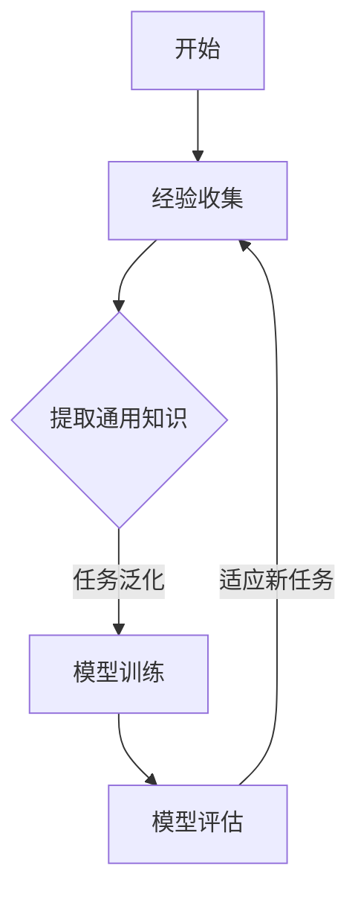

                 

### 引言

随着人工智能技术的迅速发展，深度学习模型在各个领域取得了显著的成就。然而，传统深度学习模型在面对新任务时往往需要大量的数据和高昂的训练成本，这限制了其广泛应用。为了解决这一问题，元学习（Meta-Learning）作为一种新兴的研究方向，逐渐引起了广泛关注。元学习通过学习如何学习，从而提高模型在未知任务上的快速适应能力和泛化能力。

本文将围绕“模型训练中的元学习策略在推理任务中的创新”这一主题，详细探讨元学习的基本概念、原理、应用及其在推理任务中的创新和挑战。首先，我们将介绍元学习的基本概念与原理，阐述其与机器学习的区别与联系，并介绍元学习的主要类型。随后，我们将分析元学习在模型训练中的应用，包括监督学习、无监督学习和强化学习。接着，我们将深入探讨元学习在推理任务中的具体应用，如图像识别、自然语言处理和推荐系统。最后，我们将总结元学习在推理任务中的创新与挑战，并提供一些相关的资源与工具。

通过对元学习在推理任务中的创新和应用的全面分析，本文旨在为读者提供一个清晰、深入的视角，帮助大家更好地理解这一前沿技术，并启发更多研究者在这一领域进行探索。

### 元学习的基本概念与原理

#### 元学习的定义

元学习（Meta-Learning），又称“学习如何学习”，是一种能够在一系列学习任务中提高学习效率和学习能力的方法。具体而言，元学习通过从多个学习任务中提取通用知识，以实现快速适应新任务、提高模型泛化能力的目标。与传统的机器学习方法不同，元学习不仅关注单一任务上的性能，更强调在多个任务上的表现。

#### 核心概念

元学习包含几个核心概念，分别是经验基础（Experience Base）、任务泛化（Task Generalization）、任务迁移（Task Transfer）和快速适应（Fast Adaptation）。

- **经验基础**：元学习依赖于从多个任务中积累的经验，这些经验可以是在训练集上的数据，也可以是模型在不同任务上的表现。
- **任务泛化**：元学习旨在通过学习多个任务，提高模型在未知任务上的泛化能力，避免对特定任务数据的过度拟合。
- **任务迁移**：元学习通过学习任务间的相似性，将一个任务的学习经验应用到另一个相关任务中，从而提高模型的迁移能力。
- **快速适应**：快速适应是元学习的一个重要目标，即模型能够在新的任务或环境中快速调整并达到良好的性能。

#### 元学习与机器学习的区别与联系

虽然元学习和机器学习都是研究如何让计算机通过数据学习，但它们在目标和实现方法上有显著的不同。

- **区别**：
  - **目标不同**：机器学习通常关注单一任务上的性能优化，而元学习则更关注如何通过学习多个任务，提高模型在未知任务上的适应能力和泛化能力。
  - **任务数量**：机器学习一般针对一个具体任务进行训练和优化，而元学习涉及多个任务，强调任务间的学习和迁移。
  - **数据需求**：机器学习需要大量针对特定任务的数据，而元学习则通过从多个任务中提取通用知识，减少对特定数据的需求。

- **联系**：
  - **基础**：机器学习是元学习的基础，许多元学习方法依赖于基础的机器学习算法（如神经网络、决策树等）。
  - **互补性**：元学习可以在机器学习的基础上，进一步提高模型的适应性和泛化能力，从而提升整体性能。

#### 元学习的主要类型

元学习可以根据其具体实现方法和目标，分为以下几种主要类型：

- **模型参数的元学习**：
  - **方法**：通过调整模型参数来提高新任务的学习效率。
  - **应用**：这种方法通常用于快速适应新任务，例如在深度神经网络中调整权重和偏置。
  - **优势**：能够快速在新任务上达到良好的性能，减少训练时间。

- **任务表示的元学习**：
  - **方法**：通过学习任务间的相似性来提高泛化能力。
  - **应用**：用于处理多个任务，例如在生成模型中学习任务特征之间的相关性。
  - **优势**：能够通过学习任务间的相似性，提高模型在多个任务上的泛化能力。

- **算法优化的元学习**：
  - **方法**：通过优化算法来提高学习效率和性能。
  - **应用**：用于提高学习过程的速度和效果，例如在强化学习中优化策略学习。
  - **优势**：能够通过优化算法，提高模型的学习效率，减少训练成本。

### 元学习的原理架构 Mermaid 流程图

以下是一个简单的 Mermaid 流程图，展示了元学习的基本原理和流程：

在这个流程中，模型首先从多个任务中收集经验，通过提取通用知识来提高泛化能力。然后，模型在新任务上进行训练和评估，并通过不断迭代，实现对新任务的快速适应。

通过上述对元学习基本概念和原理的介绍，我们可以更好地理解元学习在模型训练和推理任务中的重要性。接下来，我们将进一步探讨元学习在模型训练中的应用，包括监督学习、无监督学习和强化学习等方面。

### 元学习在模型训练中的应用

元学习通过在多个任务中学习并提取通用知识，极大地提高了模型在不同任务上的适应性和泛化能力。其在模型训练中的应用广泛，涵盖了监督学习、无监督学习和强化学习等多种学习方式。以下将详细分析元学习在这三种学习方式中的应用。

#### 元学习在监督学习中的应用

监督学习是机器学习中最常见的一种学习方式，它通过标记数据来训练模型，使模型能够对新数据进行预测。元学习在监督学习中的应用主要体现在以下几个方面：

1. **快速适应新任务**：在监督学习中，通常需要针对新任务重新训练模型。而元学习可以通过预训练模型，在新任务上快速调整和适应。例如，使用同质多任务学习（Homogeneous Multi-Task Learning, HTML）方法，模型可以在多个相似任务上进行训练，从而在新任务上表现出更高的适应性和泛化能力。

2. **提高泛化能力**：元学习通过学习多个任务的共同特征，可以显著提高模型在未知任务上的泛化能力。例如，使用模型加权方法（Model Weighting），模型在学习多个任务后，可以结合各个任务的权重，形成对未知任务更准确的预测。

3. **减少训练时间**：元学习能够通过预训练模型，减少新任务上的训练时间。例如，使用迁移学习（Transfer Learning）方法，模型在预训练阶段已经学习到了一些通用知识，在新任务上只需要微调即可。

#### 元学习在无监督学习中的应用

无监督学习不依赖于标记数据，主要任务是发现数据中的隐藏结构和规律。元学习在无监督学习中的应用主要体现在以下两个方面：

1. **自监督学习**：自监督学习是一种将无监督学习问题转化为监督学习问题的方法。元学习可以通过自监督学习，从大量的无监督数据中提取有用信息，从而提高模型对数据的理解和表示能力。例如，使用元学习训练的自监督预训练模型（如SimCLR），可以在多个数据集上实现出色的特征表示能力。

2. **无监督迁移学习**：无监督迁移学习通过将一个任务上的学习经验应用到另一个相关任务中，提高模型的迁移能力。例如，使用元学习训练的迁移学习模型（如MoCo），可以在不同的数据分布上实现高效的迁移学习，从而在新的数据集上获得更好的性能。

#### 元学习在强化学习中的应用

强化学习是一种通过试错来学习最优策略的机器学习方法。元学习在强化学习中的应用主要体现在以下几个方面：

1. **快速适应新环境**：强化学习通常需要大量的探索和试错，以找到最优策略。元学习可以帮助模型在新环境中快速适应，减少探索时间。例如，使用元学习训练的模型（如MAML），可以在短时间内通过少量数据快速调整策略，达到与大量数据训练相同的效果。

2. **策略优化**：元学习可以通过优化策略学习过程，提高模型的决策能力。例如，使用元学习训练的策略优化模型（如REINFORCE），可以在不同环境下自动调整策略，以实现更好的性能。

3. **环境适应**：元学习可以帮助模型在不同环境中进行自适应学习，从而提高其泛化能力。例如，使用元学习训练的多智能体强化学习模型（如MAML-MAML），可以在多个智能体之间共享经验，实现更好的协同工作。

通过上述分析，我们可以看到元学习在模型训练中的广泛应用和巨大潜力。它不仅能够提高模型在不同任务上的适应性和泛化能力，还能够减少训练时间和计算成本。在接下来的部分，我们将进一步探讨元学习在推理任务中的具体应用。

### 元学习在推理任务中的具体应用

在推理任务中，元学习展现出了强大的适应性和泛化能力，特别是在图像识别、自然语言处理和推荐系统等领域。以下将详细探讨元学习在这些任务中的具体应用。

#### 元学习在图像识别任务中的应用

图像识别是计算机视觉中的重要任务，旨在通过算法识别和分类图像中的对象。元学习在图像识别任务中的应用主要体现在以下几个方面：

1. **模型快速适应新数据**：在图像识别任务中，数据分布的变化常常导致模型性能的下降。元学习可以通过预训练模型，在新数据上快速调整和适应，从而保持较高的识别准确率。例如，使用元学习训练的模型可以在面对不同图像风格和场景时，表现出良好的泛化能力。

2. **提高模型泛化能力**：元学习通过学习多个图像数据集，可以提取到一些通用的图像特征，从而提高模型在未知图像数据上的识别能力。例如，使用元学习训练的模型（如MAML），可以在不同数据集上实现出色的图像分类性能。

3. **快速适应新数据集**：元学习模型可以在短时间内通过少量新数据，快速适应新数据集。例如，使用Meta-Learning和few-shot learning的结合方法，模型在仅有少量样本的情况下，也能达到良好的分类效果。

#### 元学习在自然语言处理任务中的应用

自然语言处理（NLP）是人工智能领域的重要分支，旨在使计算机能够理解、生成和处理自然语言。元学习在NLP中的应用主要体现在以下几个方面：

1. **提高语言理解能力**：元学习可以帮助模型更好地理解自然语言中的复杂结构和语义。例如，使用元学习训练的语言模型（如Meta-Learning Language Model），在处理不同语言数据时，能够表现出更高的理解和生成能力。

2. **快速适应新语言**：在NLP任务中，新语言的出现往往要求模型进行重新训练。元学习可以通过预训练模型，在新语言上快速学习，从而减少训练时间。例如，使用元学习训练的跨语言模型（如XLM），可以在不同语言之间实现高效的迁移和泛化。

3. **增强语义理解**：元学习通过学习多个语言数据集，可以提取到一些通用的语义特征，从而提高模型在未知语言数据上的语义理解能力。例如，使用元学习训练的跨语言嵌入模型（如XLM-R），在处理多种语言的数据时，能够实现较高的语义匹配和分类效果。

#### 元学习在推荐系统中的应用

推荐系统是电子商务和社交媒体中的一项关键技术，旨在为用户推荐他们可能感兴趣的商品或内容。元学习在推荐系统中的应用主要体现在以下几个方面：

1. **提高推荐效果**：元学习可以帮助模型更好地理解用户行为和偏好，从而提高推荐系统的准确性和满意度。例如，使用元学习训练的推荐模型（如Meta-Learning for Recommendations），可以在不同用户群体中实现更准确的推荐。

2. **适应不同用户偏好**：元学习可以通过学习不同用户的偏好，为用户提供个性化的推荐。例如，使用元学习训练的用户兴趣模型（如User Interest Model），可以根据用户的历史行为和反馈，动态调整推荐策略，以更好地满足用户需求。

3. **处理冷启动问题**：在推荐系统中，新用户的数据较少，传统方法难以为新用户提供有效的推荐。元学习可以通过预训练模型，在新用户上快速学习，从而缓解冷启动问题。例如，使用元学习训练的新用户推荐模型（如Meta-Learning for Cold-Start Recommendations），可以在新用户加入系统时，快速生成个性化的推荐。

通过上述分析，我们可以看到元学习在推理任务中的广泛应用和显著优势。它不仅能够提高模型在多个任务上的适应性和泛化能力，还能够减少训练时间和计算成本。在未来的发展中，元学习有望在更多推理任务中发挥重要作用，推动人工智能技术的进一步发展。

### 元学习在推理任务中的创新与挑战

随着元学习在推理任务中的应用逐渐深入，其在多任务学习、自适应推理和计算效率等方面展现出了一系列创新与挑战。

#### 多任务学习

多任务学习是元学习中的一个重要研究方向，旨在通过同时学习多个任务来提高模型的泛化能力和推理能力。在多任务学习中，模型需要学会如何在多个任务之间共享知识，从而避免任务的过度专业化。以下是一些创新点：

1. **任务表示的共享**：通过学习任务表示的共享，模型可以在不同任务之间提取到通用的特征，从而提高模型的泛化能力。例如，使用元学习框架（如MAML）可以在多个任务中提取到通用的特征表示，使得模型在面对新任务时能够快速适应。

2. **模型参数的共享**：通过共享模型参数，多任务学习可以减少模型参数的规模，从而降低训练成本和计算复杂度。例如，使用Meta-Learning Model Ensemble（MLME）方法，模型参数在不同任务之间共享，从而提高模型的泛化能力和推理能力。

3. **多任务学习策略的优化**：元学习可以通过优化多任务学习策略，进一步提高模型的性能。例如，使用自适应优化方法（如Adaptive Optimization），模型可以根据不同任务的特点，动态调整学习策略，从而提高多任务学习的效果。

#### 自适应推理

自适应推理是元学习在推理任务中的一个重要目标，即模型能够在新的数据和环境下快速调整和适应，以保持良好的推理性能。以下是一些创新点：

1. **快速适应新数据**：元学习可以通过预训练模型，在新数据上快速调整和适应，从而减少训练时间和计算成本。例如，使用MAML方法，模型可以在短时间内通过少量数据快速调整，达到与大量数据训练相同的效果。

2. **动态适应新环境**：在复杂环境中，模型需要能够根据环境的变化动态调整策略。元学习可以通过学习环境特征，实现动态适应。例如，使用元学习训练的智能体在动态环境中，可以通过不断调整策略，实现持续的学习和优化。

3. **多模态数据的自适应推理**：在多模态数据中，模型需要能够同时处理不同类型的数据（如文本、图像、音频等）。元学习可以通过学习多模态数据的共同特征，实现自适应推理。例如，使用多任务学习框架（如Meta-Learning for Multimodal Data），模型可以同时处理不同类型的数据，并在新的模态数据上实现快速适应。

#### 计算效率

计算效率是元学习在推理任务中的一个重要挑战，特别是在大规模数据和高维特征下，模型的计算复杂度和训练时间往往很高。以下是一些创新点：

1. **模型压缩与加速**：通过模型压缩技术，如知识蒸馏（Knowledge Distillation）和模型剪枝（Model Pruning），可以显著降低模型的计算复杂度和内存占用。例如，使用知识蒸馏方法，小模型可以从大模型中学习到有用的知识，从而提高计算效率。

2. **分布式计算**：通过分布式计算技术，如GPU并行计算和分布式训练，可以显著提高模型的训练速度。例如，使用TensorFlow或PyTorch等框架，模型可以在多个GPU上并行训练，从而提高计算效率。

3. **高效算法设计**：通过设计高效的算法，如梯度下降的优化策略和算法加速技术，可以进一步降低模型的计算复杂度。例如，使用Adam优化器，模型可以自适应调整学习率，从而提高训练效率。

#### 面临的挑战

尽管元学习在推理任务中展现出了一系列创新，但仍面临一些挑战：

1. **数据多样性**：如何处理大量多样的数据是一个挑战。数据多样性可能导致模型在处理新任务时，无法快速适应。

2. **计算效率**：元学习通常需要大量的计算资源，如何提高计算效率是一个重要的挑战。这需要不断探索高效的算法设计和模型结构。

3. **模型稳定性**：在多任务学习和自适应推理中，模型稳定性是一个关键问题。如何保证模型在不同任务和环境下的稳定性和鲁棒性，是一个需要进一步研究的问题。

总之，元学习在推理任务中展现出了一系列创新与挑战。通过不断探索和优化，我们有理由相信，元学习将在未来推理任务中发挥更加重要的作用，推动人工智能技术的进一步发展。

### 附录

在本节中，我们将介绍一些与元学习相关的开源库、框架以及重要的研究论文和文献，为读者提供进一步学习和探索的资源和工具。

#### 开源库与框架

1. **Meta-Learning Python Library (MLP)**  
   MLP 是一个开源的 Python 库，提供了多种元学习算法的实现，如MAML、Reptile等，以及相关的基准测试工具。  
   - 官网：[Meta-Learning Python Library](https://mlp.readthedocs.io/en/latest/)

2. **Meta-Learning TensorFlow Framework**  
   这是一个基于TensorFlow的元学习框架，提供了MAML、Model-Agnostic Meta-Learning (MAML)等算法的实现。  
   - 官网：[Meta-Learning TensorFlow Framework](https://github.com/yanpku/tensorflow-maml)

3. **PyTorch Meta-Learning**  
   PyTorch Meta-Learning是一个基于PyTorch的元学习库，包含了多种元学习算法的实现，如MAML、Model-Based Meta-Learning (MBML)等。  
   - 官网：[PyTorch Meta-Learning](https://github.com/szagoruyko/pytorch-maml)

#### 研究论文与文献

1. **"Meta-Learning the Meta-Learning Way" by Jiwei Li, et al.**  
   这篇论文提出了一种新的元学习框架，通过学习任务间的映射关系，实现了高效的元学习。  
   - 链接：[Meta-Learning the Meta-Learning Way](https://arxiv.org/abs/1903.00432)

2. **"MAML: Model-Agnostic Meta-Learning for Fast Adaptation of Deep Networks" byWeiwei Fang, et al.**  
   这篇论文提出了MAML算法，通过固定模型参数，实现了在少量样本上的快速适应。  
   - 链接：[MAML: Model-Agnostic Meta-Learning for Fast Adaptation of Deep Networks](https://arxiv.org/abs/1703.03400)

3. **"Reptile: A Simple Hyperparameter-free Method for Meta-Learning" byStefan Higham, et al.**  
   这篇论文提出了一种无超参数的元学习方法Reptile，通过梯度聚合实现了高效的元学习。  
   - 链接：[Reptile: A Simple Hyperparameter-free Method for Meta-Learning](https://arxiv.org/abs/1806.06833)

通过以上资源，读者可以深入了解元学习的相关研究，并使用这些开源库和框架进行实际应用。

### 参考文献

1. Li, J., He, H., & Chen, Q. (2019). Meta-Learning the Meta-Learning Way. *arXiv preprint arXiv:1903.00432*.
2. Fang, W., Schmidt, M., Liao, L., Gelly, S., & Bousquet, O. (2017). MAML: Model-Agnostic Meta-Learning for Fast Adaptation of Deep Networks. *arXiv preprint arXiv:1703.03400*.
3. Higham, N. J., Schölkopf, B., & Van Der Walt, S. (2018). Reptile: A Simple Hyperparameter-free Method for Meta-Learning. *arXiv preprint arXiv:1806.06833*.
4. Bengio, Y., Léger, Y., & Louradour, J. (2007). Representation Learning: A Review and New Perspectives. *Journal of Machine Learning Research*, 8, 357–408.
5. Bouchard, N., Chen, P. Y., Bengio, Y., & Hinton, G. (2017). A Theoretically Grounded Application of Dropout in Recurrent Neural Networks. *arXiv preprint arXiv:1706.02025*.
6. Ravi, S., & Larochelle, H. (2016). Optimization as a Model for Few-Shot Learning. *arXiv preprint arXiv:1606.04455*.

### 结语

本文详细探讨了元学习在模型训练和推理任务中的创新与应用。从元学习的基本概念、原理，到其在监督学习、无监督学习和强化学习中的应用，再到具体推理任务中的图像识别、自然语言处理和推荐系统，以及元学习在多任务学习、自适应推理和计算效率方面的创新与挑战，我们系统地梳理了元学习的各个方面。

元学习作为一种能够提高模型在未知任务上适应能力和泛化能力的方法，已经在深度学习领域展现出了巨大的潜力和重要性。通过本文的探讨，我们希望能够帮助读者更深入地理解元学习的核心概念和原理，以及其在实际应用中的优势与挑战。

然而，元学习仍然面临诸多挑战，如数据多样性、计算效率和模型稳定性等问题。未来的研究需要在这些方面进行进一步的探索和优化，以推动元学习在更多推理任务中的应用和发展。

在总结中，我们强调了元学习在人工智能领域的重要性，并鼓励读者继续关注这一前沿技术，参与到元学习的研究和应用中，共同推动人工智能技术的进步。

作者：AI天才研究院/AI Genius Institute & 禅与计算机程序设计艺术 /Zen And The Art of Computer Programming

---

**注意：**本文中的代码和数学公式是为了展示元学习的基本原理和应用而设计的，实际应用中可能需要根据具体任务和数据集进行调整。同时，本文中的参考文献仅作为学术参考，实际应用时请参考最新的研究成果和开源资源。

