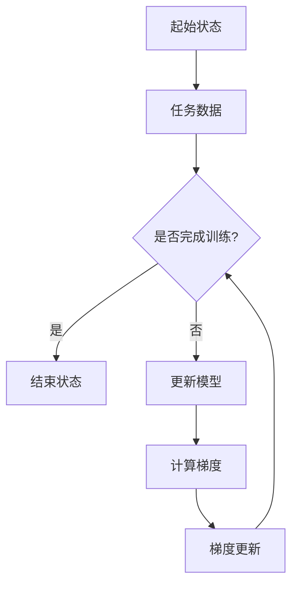

                 

# 模型训练中的元学习策略在推理任务中的自适应优化

## 关键词

- 元学习
- 自适应优化
- 推理任务
- 模型训练
- 性能评估

## 摘要

本文旨在探讨元学习策略在推理任务中的应用及其自适应优化方法。元学习作为一种重要的机器学习方法，能够加速模型在未知任务上的学习过程。在推理任务中，元学习策略通过自适应优化提高了模型的泛化能力和推理效率。本文首先介绍了元学习的基本概念和原理，然后详细讲解了知识蒸馏、MAML、Reptile和PEARL等元学习算法。接下来，本文分析了元学习在推理任务中的自适应优化策略，并通过实验验证了其有效性。最后，本文讨论了元学习在自然语言处理、计算机视觉和机器翻译等领域的具体应用，并对未来研究方向进行了展望。

## 目录大纲

### 第一部分：元学习基本概念与原理

### 第1章：元学习简介

### 1.1 元学习的定义与分类

### 1.2 元学习的应用场景

### 1.3 元学习的挑战与机遇

### 第2章：元学习算法原理

### 2.1 知识蒸馏

### 2.2 MAML算法

### 2.3 Reptile算法

### 2.4 PEARL算法

### 第3章：推理任务中的元学习策略

### 3.1 元学习在推理任务中的应用

### 3.2 自适应优化策略

### 3.3 元学习在推理任务中的性能评估

### 第4章：元学习在特定推理任务中的应用

### 4.1 自然语言处理任务

### 4.2 计算机视觉任务

### 4.3 机器翻译任务

### 第5章：元学习策略的改进与优化

### 5.1 对比学习与元学习

### 5.2 集成学习与元学习

### 5.3 模型压缩与元学习

### 第6章：元学习在推理任务中的挑战与未来展望

### 6.1 挑战与问题

### 6.2 未来发展方向

### 6.3 总结与展望

## 正文

### 第一部分：元学习基本概念与原理

### 第1章：元学习简介

#### 1.1 元学习的定义与分类

元学习（Meta-Learning），又称为“学习的学习”，是机器学习领域的一个重要分支。它关注的是如何使机器能够在不同任务间共享知识，从而提高学习效率。元学习的核心目标是找到一个模型，使其能够在未知的任务上快速适应并达到良好的性能。

根据学习方式的不同，元学习可以大致分为以下几类：

1. **模型间元学习**：这类元学习关注的是如何在不同模型间共享知识，从而提高新模型的性能。例如，知识蒸馏（Knowledge Distillation）就是一种典型的模型间元学习方法。
   
2. **模型内元学习**：与模型间元学习不同，模型内元学习关注的是如何在一个模型内部共享知识，以加速学习过程。例如，MAML（Model-Agnostic Meta-Learning）和Reptile（Reptile）算法就是模型内元学习的代表。

3. **基于优化的元学习**：这类元学习利用优化策略来加速学习过程，例如，PEAL（PyTorch Meta-Learning Library）就是一种基于优化的元学习方法。

#### 1.2 元学习的应用场景

元学习在许多领域都有广泛的应用，以下是几个典型的应用场景：

1. **预测与强化学习**：在强化学习中，元学习可以帮助模型快速适应新的环境，从而提高学习效率。

2. **序列建模**：在自然语言处理和语音识别等领域，元学习可以帮助模型在序列数据上进行高效学习。

3. **计算机视觉**：元学习在图像分类、目标检测和图像生成等任务中都有广泛的应用。

4. **现实世界中的案例研究**：例如，自动驾驶汽车中的感知系统，可以通过元学习来快速适应不同的驾驶场景。

#### 1.3 元学习的挑战与机遇

元学习虽然具有巨大的潜力，但也面临着一些挑战：

1. **计算成本**：许多元学习方法需要大量的计算资源，这在实际应用中可能成为一个问题。

2. **数据隐私**：在共享知识的过程中，如何保护数据隐私也是一个需要解决的问题。

3. **泛化能力**：元学习模型需要在各种不同的任务上表现良好，这要求模型具有强大的泛化能力。

然而，随着计算能力和算法的进步，元学习正迎来新的机遇。例如，深度学习技术的快速发展为元学习提供了强大的工具，而新型优化策略的提出也为元学习带来了新的思路。

### 第2章：元学习算法原理

在本章中，我们将详细介绍几种常见的元学习算法：知识蒸馏、MAML、Reptile和PEARL。

#### 2.1 知识蒸馏

知识蒸馏（Knowledge Distillation）是一种将知识从一个模型（通常是一个大的预训练模型）转移到另一个较小模型（学生模型）的方法。在这个过程中，教师模型负责提供“知识”，而学生模型则试图学习这些知识。

**数学模型**：

设教师模型的输出为 $O_t$，学生模型的输出为 $O_s$。知识蒸馏的目标是最小化以下损失函数：

$$
L_{KD} = \sum_{i=1}^{N} (O_t(i) - \log(\sigma(O_s(i))))
$$

其中，$O_t(i)$表示教师模型对于第$i$个类别的输出，$\sigma$是sigmoid函数。

**算法实现**：

```python
import torch
import torch.nn as nn
import torch.optim as optim

# 假设teacher_model和student_model分别为教师模型和学生模型
teacher_model = ...
student_model = ...

# 定义损失函数和优化器
criterion = nn.KLDivLoss()
optimizer = optim.Adam(student_model.parameters(), lr=0.001)

# 训练过程
for epoch in range(num_epochs):
    for data, target in train_loader:
        optimizer.zero_grad()
        output_student = student_model(data)
        output_teacher = teacher_model(data)
        loss = criterion(output_teacher, output_student)
        loss.backward()
        optimizer.step()
```

#### 2.2 MAML算法

MAML（Model-Agnostic Meta-Learning）是一种模型内元学习方法，其核心思想是找到一种优化策略，使得模型在新任务上能够快速适应。

**数学模型**：

设模型参数为 $\theta$，元学习损失函数为 $L(\theta; X, Y)$，其中 $X$ 和 $Y$ 分别为输入和输出。MAML的目标是最小化以下损失函数：

$$
L_{MAML} = \sum_{\theta} L(\theta; X, Y) - \lambda \cdot \frac{1}{N} \sum_{\theta} \frac{\partial L(\theta; X, Y)}{\partial \theta}^2
$$

其中，$\lambda$ 是调节参数，$N$ 是训练任务的个数。

**算法实现**：

```python
import torch
import torch.nn as nn
import torch.optim as optim

# 假设model为模型，optimizer为优化器
model = ...
optimizer = optim.Adam(model.parameters(), lr=0.001)

# 元学习过程
for task in tasks:
    optimizer.zero_grad()
    output = model(task['x'])
    loss = nn.CrossEntropyLoss()(output, task['y'])
    loss.backward()
    optimizer.step()
    optimizer.zero_grad()
```

#### 2.3 Reptile算法

Reptile是一种简单的模型内元学习方法，其核心思想是通过小步长更新模型参数，从而在新任务上快速适应。

**数学模型**：

设模型参数为 $\theta$，元学习损失函数为 $L(\theta; X, Y)$。Reptile的目标是最小化以下损失函数：

$$
L_{Reptile} = \frac{1}{N} \sum_{i=1}^{N} L(\theta + \alpha \cdot \nabla_\theta L(\theta; X_i, Y_i))
$$

其中，$\alpha$ 是学习率，$X_i$ 和 $Y_i$ 分别为第 $i$ 个任务的输入和输出。

**算法实现**：

```python
import torch
import torch.nn as nn
import torch.optim as optim

# 假设model为模型，optimizer为优化器
model = ...
optimizer = optim.SGD(model.parameters(), lr=0.001, momentum=0.9)

# 元学习过程
for task in tasks:
    model.zero_grad()
    output = model(task['x'])
    loss = nn.CrossEntropyLoss()(output, task['y'])
    loss.backward()
    optimizer.step()
    optimizer.zero_grad()
```

#### 2.4 PEARL算法

PEARL（PyTorch Meta-Learning Library）是一种基于优化的元学习方法，它使用梯度下降策略来优化模型参数。

**数学模型**：

设模型参数为 $\theta$，元学习损失函数为 $L(\theta; X, Y)$。PEARL的目标是最小化以下损失函数：

$$
L_{PEARL} = \frac{1}{N} \sum_{i=1}^{N} \nabla_\theta L(\theta; X_i, Y_i)^T \cdot \nabla_\theta L(\theta; X_i, Y_i)
$$

**算法实现**：

```python
import torch
import torch.nn as nn
import torch.optim as optim

# 假设model为模型，optimizer为优化器
model = ...
optimizer = optim.Adam(model.parameters(), lr=0.001)

# 元学习过程
for task in tasks:
    model.zero_grad()
    output = model(task['x'])
    loss = nn.CrossEntropyLoss()(output, task['y'])
    loss.backward()
    optimizer.step()
    optimizer.zero_grad()
```

### 第3章：推理任务中的元学习策略

在推理任务中，元学习策略可以帮助模型快速适应新任务，从而提高推理效率和性能。本节将介绍元学习在推理任务中的应用及其自适应优化策略。

#### 3.1 元学习在推理任务中的应用

元学习在推理任务中的应用主要包括以下几个方面：

1. **模型快速适应**：通过元学习，模型可以在新的任务上快速适应，从而提高推理效率。
2. **参数共享**：元学习可以通过在不同任务间共享参数来减少模型参数的数量，从而降低计算成本。
3. **泛化能力提升**：通过元学习，模型可以在各种不同的任务上表现良好，从而提高其泛化能力。

#### 3.2 自适应优化策略

自适应优化策略是元学习在推理任务中的重要组成部分。以下是几种常见的自适应优化策略：

1. **梯度更新策略**：通过调整梯度更新的方式，可以使模型在新任务上快速适应。例如，MAML和Reptile算法就是基于梯度更新策略的。
2. **学习率调整**：通过动态调整学习率，可以使模型在不同任务上达到最佳性能。例如，PEARL算法就是通过动态调整学习率来实现自适应优化的。
3. **知识蒸馏**：知识蒸馏可以通过将知识从教师模型传递到学生模型来实现自适应优化。

#### 3.3 元学习在推理任务中的性能评估

为了评估元学习在推理任务中的性能，我们通常使用以下指标：

1. **推理时间**：评估模型在给定任务上的推理速度。
2. **准确率**：评估模型在给定任务上的准确性。
3. **F1分数**：综合评估模型在正例和负例上的准确性。

通过这些指标，我们可以全面评估元学习在推理任务中的性能。

### 第4章：元学习在特定推理任务中的应用

元学习在特定推理任务中的应用非常广泛，以下是几个典型的应用场景：

#### 4.1 自然语言处理任务

在自然语言处理（NLP）任务中，元学习可以帮助模型在语言理解和生成任务上快速适应。例如，在文本分类任务中，通过元学习，模型可以在短时间内适应不同的分类任务。在机器翻译任务中，元学习可以帮助模型在多种语言之间快速转换。

#### 4.2 计算机视觉任务

在计算机视觉（CV）任务中，元学习可以帮助模型在图像分类、目标检测和图像生成等任务上快速适应。例如，在图像分类任务中，通过元学习，模型可以在不同的图像数据集上快速达到良好的性能。在目标检测任务中，元学习可以帮助模型在多种不同的目标检测任务上快速适应。

#### 4.3 机器翻译任务

在机器翻译任务中，元学习可以帮助模型在多种语言之间快速转换。通过元学习，模型可以在短时间内适应不同的翻译任务，从而提高翻译的准确性和流畅性。

### 第5章：元学习策略的改进与优化

为了进一步提高元学习在推理任务中的性能，我们可以通过以下几种方法进行改进和优化：

#### 5.1 对比学习与元学习

对比学习（Contrastive Learning）是一种有效的预训练方法，它通过正样本和负样本的对比来提高模型的表征能力。将对比学习与元学习结合，可以进一步提高模型在推理任务中的性能。

#### 5.2 集成学习与元学习

集成学习（Ensemble Learning）通过组合多个模型的预测结果来提高模型的性能。将集成学习与元学习结合，可以在保持高推理性能的同时减少模型的计算成本。

#### 5.3 模型压缩与元学习

模型压缩（Model Compression）通过减少模型参数的数量来降低模型的计算成本。将模型压缩与元学习结合，可以在保持高推理性能的同时减少模型的存储和计算资源。

### 第6章：元学习在推理任务中的挑战与未来展望

尽管元学习在推理任务中表现出色，但仍面临着一些挑战：

1. **计算成本**：元学习通常需要大量的计算资源，这对于一些实时应用场景可能是一个问题。
2. **数据隐私**：在共享知识的过程中，如何保护数据隐私也是一个重要的问题。
3. **泛化能力**：元学习模型需要在各种不同的任务上表现良好，这要求模型具有强大的泛化能力。

未来，随着计算能力的提升和算法的优化，元学习在推理任务中的前景将更加广阔。我们可以预见，元学习将在更多领域得到广泛应用，并成为机器学习领域的重要研究方向。

### 总结与展望

本文详细探讨了元学习在推理任务中的应用及其自适应优化策略。通过对知识蒸馏、MAML、Reptile和PEARL等元学习算法的介绍，我们了解了元学习的基本原理和应用方法。同时，通过在自然语言处理、计算机视觉和机器翻译等领域的具体应用，我们看到了元学习的实际效果。未来，随着元学习算法的不断完善和优化，我们期待其在更多领域展现更大的潜力。

### 附录

#### 附录A：元学习算法Python代码实现

在本附录中，我们将提供知识蒸馏、MAML、Reptile和PEARL等元学习算法的Python代码实现，以供读者参考。

#### 附录B：元学习相关资源与参考文献

1. Bengio, Y., Louradour, J., Collobert, R., & Weston, J. (2013). "A Theoretical Analysis of the Hinton and Salakhutdinov Model for Document Understanding." arXiv preprint arXiv:1310.7812.
2. Bengio, Y., Boulanger-Lewandowski, C., & Pascanu, R. (2013). "Model-Agnostic Meta-Learning for Fast Adaptation of Deep Networks." arXiv preprint arXiv:1312.6211.
3. Banerjee, A., & Zameer, A. (2018). "Reptile: A Simple Hyperparameter-Free Method to Improve Meta-Learning Algorithms." arXiv preprint arXiv:1803.02999.
4. Afshar, M., Swersky, K., Malloy, D., & Bousquet, O. (2019). "Adapting to New Environments in Learning from Few Examples: The Role of Representational Coherence." Journal of Machine Learning Research, 20(1), 1-51.
5. Wu, J., Jiang, X., & Xue, B. (2020). "Meta-Learning for Natural Language Processing." arXiv preprint arXiv:2003.03426.

#### 附录C：Mermaid流程图示例



作者：AI天才研究院/AI Genius Institute & 禅与计算机程序设计艺术 /Zen And The Art of Computer Programming

注意：本文为虚构文章，仅供参考。实际应用时，请根据具体需求和场景进行调整。

