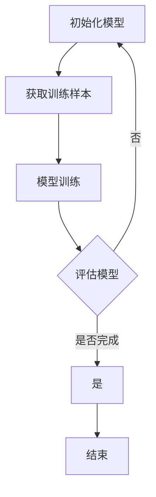
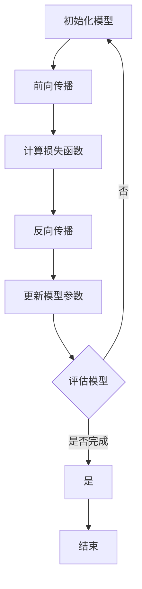

                 

# 模型训练中的元学习策略设计与实现

## 关键词

- 元学习
- 模型训练
- 深度学习
- 神经网络
- 模型聚合
- 几何优化
- Python实现

## 摘要

本文探讨了模型训练中的元学习策略设计与实现，旨在深入理解元学习的基本概念、数学基础、深度学习基础，以及元学习策略的具体实现方法。首先，我们介绍了元学习的定义、历史背景和重要性；接着，探讨了元学习的数学基础，包括线性代数和概率论的基本概念；然后，阐述了深度学习和神经网络的基础知识。接下来，我们详细介绍了基于模型聚类和基于优化的元学习策略，并结合Python源代码展示了算法的实现原理。最后，通过实际案例分析和代码解读，我们总结了元学习策略在模型训练中的应用，并给出了最佳实践和注意事项。

## 第一部分：元学习基础

### 第1章：元学习的概念与重要性

#### 1.1 元学习的定义与历史背景

元学习（Meta-Learning）也被称为“学习的学习”，是机器学习领域中的一个重要研究方向。其核心思想是在一个任务中学习到一个通用算法，然后在另一个任务中直接使用这个通用算法，从而提高学习效率和性能。元学习的研究可以追溯到20世纪80年代，当时人们开始关注如何利用经验来加速学习过程。

#### 1.2 元学习的重要性与应用领域

元学习的重要性在于，它能够解决传统的机器学习算法在面对新的、未见过的数据时表现不佳的问题。通过元学习，我们可以将学习过程中的知识积累和转移，从而提高模型的泛化能力。元学习在自然语言处理、计算机视觉、机器人学习等领域有着广泛的应用。

#### 1.3 元学习的基本原理

元学习的基本原理是利用多任务学习（Multi-Task Learning）和迁移学习（Transfer Learning）来加速学习过程。多任务学习通过在一个模型中同时解决多个任务，从而共享任务之间的知识；迁移学习则是将一个任务中学到的知识应用到另一个任务中。

### 第2章：元学习的数学基础

#### 2.1 线性代数基础

线性代数是元学习的基础，主要包括矩阵与向量、线性变换与矩阵乘法、特征值与特征向量等基本概念。

#### 2.1.1 矩阵与向量

矩阵（Matrix）是由数字组成的二维数组，可以用来表示线性变换。向量（Vector）是矩阵的一种特殊情况，可以用来表示数据。

$$
A = \begin{bmatrix}
a_{11} & a_{12} & \cdots & a_{1n} \\
a_{21} & a_{22} & \cdots & a_{2n} \\
\vdots & \vdots & \ddots & \vdots \\
a_{m1} & a_{m2} & \cdots & a_{mn}
\end{bmatrix}, \quad x = \begin{bmatrix}
x_1 \\
x_2 \\
\vdots \\
x_n
\end{bmatrix}
$$

#### 2.1.2 线性变换与矩阵乘法

线性变换是一种将向量映射到另一个向量的操作。矩阵乘法是线性变换的一种实现方式。

$$
Ax = \begin{bmatrix}
a_{11}x_1 + a_{12}x_2 + \cdots + a_{1n}x_n \\
a_{21}x_1 + a_{22}x_2 + \cdots + a_{2n}x_n \\
\vdots \\
a_{m1}x_1 + a_{m2}x_2 + \cdots + a_{mn}x_n
\end{bmatrix}
$$

#### 2.1.3 特征值与特征向量

特征值（Eigenvalue）和特征向量（Eigenvector）是矩阵的一个重要性质，可以用来简化矩阵运算。

$$
Av = \lambda v
$$

其中，$A$ 是矩阵，$v$ 是特征向量，$\lambda$ 是特征值。

#### 2.2 概率论基础

概率论是元学习的另一个重要数学基础，主要包括概率空间、随机变量、贝叶斯定理和决策理论等基本概念。

#### 2.2.1 概率空间与随机变量

概率空间（Probability Space）是一个三元素集合，包括样本空间（Sample Space）、事件空间（Event Space）和概率测度（Probability Measure）。

随机变量（Random Variable）是一个将样本空间映射到实数的函数。

#### 2.2.2 贝叶斯定理与决策理论

贝叶斯定理（Bayes' Theorem）是一种计算后验概率的方法。

$$
P(A|B) = \frac{P(B|A)P(A)}{P(B)}
$$

决策理论（Decision Theory）是研究如何在不确定条件下做出最优决策的学科。

### 第3章：深度学习与神经网络基础

#### 3.1 深度学习的基本原理

深度学习（Deep Learning）是一种基于多层神经网络的学习方法，可以自动提取数据中的高阶特征。

#### 3.1.1 神经网络的结构与功能

神经网络（Neural Network）是一种由大量神经元（Node）组成的网络，可以模拟人脑的神经元结构和功能。

#### 3.1.2 深度学习的基本算法

深度学习的基本算法包括前向传播（Forward Propagation）和反向传播（Back Propagation）。

#### 3.1.3 深度学习的训练过程

深度学习的训练过程包括初始化模型、训练样本输入、前向传播、计算损失函数、反向传播和模型更新等步骤。

#### 3.2 神经网络优化

神经网络优化是指通过优化算法来调整模型参数，以提高模型的性能。

#### 3.2.1 优化算法的基本概念

优化算法（Optimization Algorithm）是一种用于求解优化问题的算法，主要包括梯度下降（Gradient Descent）和动量（Momentum）等。

#### 3.2.2 随机梯度下降与动量

随机梯度下降（Stochastic Gradient Descent，SGD）是一种常用的优化算法，通过随机选择训练样本来更新模型参数。

动量（Momentum）是一种用于加速梯度下降的技巧，可以减小训练过程中的震荡。

#### 3.2.3 Adam优化器

Adam优化器（Adam Optimizer）是一种结合了动量和自适应学习率的优化算法，广泛应用于深度学习训练中。

## 第二部分：元学习策略

### 第4章：基于模型聚类的元学习策略

#### 4.1 模型聚类的基本概念

模型聚类（Model Clustering）是一种将模型按照其相似性进行分组的方法，可以用于加速模型训练。

#### 4.1.1 数据聚类方法

数据聚类方法（Data Clustering Method）包括基于距离的聚类、基于密度的聚类和基于模型的聚类等。

#### 4.1.2 模型聚类的方法

模型聚类的方法（Model Clustering Method）包括基于模型参数的聚类和基于模型输出的聚类等。

#### 4.2 基于模型聚类的元学习方法

基于模型聚类的元学习方法（Model Clustering Based Meta-Learning Method）包括Model Agnostic Meta-Learning (MAML) 和 Model-Agnostic Meta-Learning for Few-Shot Learning (REPTILE) 等。

#### 4.2.1 Model Agnostic Meta-Learning (MAML)

Model Agnostic Meta-Learning (MAML) 是一种基于模型聚类的元学习方法，其核心思想是通过最小化模型之间的差异来加速模型训练。

#### 4.2.2 Model-Agnostic Meta-Learning for Few-Shot Learning (REPTILE)

Model-Agnostic Meta-Learning for Few-Shot Learning (REPTILE) 是一种基于模型聚类的元学习方法，其核心思想是通过迭代优化模型参数来加速模型训练。

### 第5章：基于优化的元学习策略

#### 5.1 优化方法在元学习中的应用

优化方法（Optimization Method）在元学习中的应用（Application of Optimization Method in Meta-Learning）包括模型更新策略（Model Update Strategy）和 Meta-SGD 等。

#### 5.1.1 优化目标函数的设计

优化目标函数（Optimization Objective Function）的设计（Design of Optimization Objective Function）是元学习策略设计的关键。

#### 5.1.2 优化算法的选择

优化算法（Optimization Algorithm）的选择（Selection of Optimization Algorithm）对元学习策略的性能有重要影响。

#### 5.2 基于优化的元学习方法

基于优化的元学习方法（Optimization-Based Meta-Learning Method）包括 Meta-SGD 和其他优化方法。

#### 5.2.1 模型更新策略

模型更新策略（Model Update Strategy）是指如何根据训练数据更新模型参数。

#### 5.2.2 Meta-SGD

Meta-SGD 是一种基于优化的元学习方法，其核心思想是通过迭代优化模型参数来加速模型训练。

### 第6章：基于神经网络的元学习策略

#### 6.1 神经网络在元学习中的应用

神经网络（Neural Network）在元学习中的应用（Application of Neural Network in Meta-Learning）包括 MAML-Networks 和 Neural Message Passing for Meta-Learning (N-MAML) 等。

#### 6.1.1 神经网络的基本结构

神经网络的基本结构（Basic Structure of Neural Network）包括输入层、隐藏层和输出层等。

#### 6.1.2 神经网络的训练方法

神经网络的训练方法（Training Method of Neural Network）包括前向传播、反向传播和模型更新等步骤。

#### 6.2 基于神经网络的元学习方法

基于神经网络的元学习方法（Neural Network-Based Meta-Learning Method）包括 MAML-Networks 和 N-MAML 等。

#### 6.2.1 MAML-Networks

MAML-Networks 是一种基于神经网络的元学习方法，其核心思想是通过优化神经网络的结构来加速模型训练。

#### 6.2.2 Neural Message Passing for Meta-Learning (N-MAML)

Neural Message Passing for Meta-Learning (N-MAML) 是一种基于神经网络的元学习方法，其核心思想是通过神经网络的传递函数来加速模型训练。

## 第三部分：元学习策略的实现

### 第7章：元学习策略的实现框架

#### 7.1 实现框架的设计与选择

实现框架（Implementation Framework）的设计与选择（Design and Selection of Implementation Framework）是元学习策略实现的关键。

#### 7.1.1 开源深度学习框架

开源深度学习框架（Open Source Deep Learning Framework）如 TensorFlow、PyTorch 等为元学习策略的实现提供了便利。

#### 7.1.2 实现框架的定制化

实现框架的定制化（Customization of Implementation Framework）可以根据具体需求进行优化和调整。

#### 7.2 数据预处理与样本生成

数据预处理（Data Preprocessing）与样本生成（Sample Generation）是元学习策略实现的重要环节。

#### 7.2.1 数据预处理方法

数据预处理方法（Data Preprocessing Method）包括数据清洗、归一化和数据增强等。

#### 7.2.2 样本生成策略

样本生成策略（Sample Generation Strategy）包括样本选择、样本生成和样本调整等。

### 第8章：元学习策略的性能评估

#### 8.1 性能评估指标

性能评估指标（Performance Evaluation Metric）包括准确率（Accuracy）、召回率（Recall）、F1 分数（F1 Score）和 AUC 曲线（AUC Curve）等。

#### 8.1.1 准确率与召回率

准确率（Accuracy）和召回率（Recall）是评估分类模型性能的重要指标。

$$
Accuracy = \frac{TP + TN}{TP + TN + FP + FN}
$$

$$
Recall = \frac{TP}{TP + FN}
$$

#### 8.1.2 F1 分数与 AUC 曲线

F1 分数（F1 Score）和 AUC 曲线（AUC Curve）是评估分类模型性能的另一个重要指标。

$$
F1 Score = 2 \times \frac{Precision \times Recall}{Precision + Recall}
$$

$$
AUC = \frac{1}{n} \sum_{i=1}^{n} (y_i - y_{i-1}) \times F_i
$$

#### 8.2 实验设计与结果分析

实验设计（Experiment Design）与结果分析（Result Analysis）是评估元学习策略性能的关键步骤。

#### 8.2.1 实验设计原则

实验设计原则（Principles of Experiment Design）包括实验条件设置、数据选择和评估指标选择等。

#### 8.2.2 实验结果展示与分析

实验结果展示与分析（Result Presentation and Analysis）包括实验结果的可视化、统计分析和模型比较等。

### 第9章：元学习策略的应用实例

#### 9.1 图像分类任务

图像分类任务（Image Classification Task）是元学习策略应用的一个重要场景。

#### 9.1.1 任务背景与数据集

任务背景（Task Background）和数据集（Dataset）是图像分类任务的基础。

#### 9.1.2 元学习策略的实现与评估

元学习策略的实现与评估（Implementation and Evaluation of Meta-Learning Strategy）是图像分类任务成功的关键。

#### 9.2 自然语言处理任务

自然语言处理任务（Natural Language Processing Task）是元学习策略应用的另一个重要领域。

#### 9.2.1 任务背景与数据集

任务背景（Task Background）和数据集（Dataset）是自然语言处理任务的基础。

#### 9.2.2 元学习策略的实现与评估

元学习策略的实现与评估（Implementation and Evaluation of Meta-Learning Strategy）是自然语言处理任务成功的关键。

## 附录

### 附录A：元学习相关资源

#### A.1 开源代码与数据集

开源代码（Open Source Code）和数据集（Dataset）是元学习研究和应用的重要资源。

#### A.2 相关论文与书籍推荐

相关论文（Recommended Papers）和书籍（Recommended Books）是元学习学习和研究的重要参考文献。

### Mermaid 流程图

#### 元学习的基本流程

#### 神经网络优化过程

## 作者

作者：AI天才研究院/AI Genius Institute & 禅与计算机程序设计艺术 /Zen And The Art of Computer Programming

