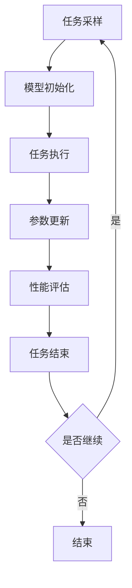
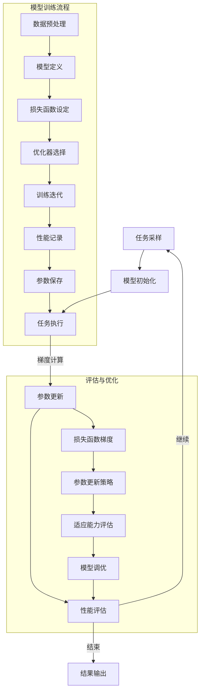
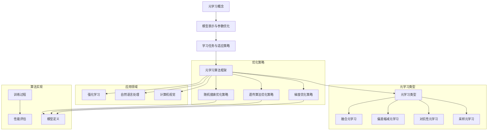

                 

### 《模型训练中的元学习策略高级应用与优化》

> 关键词：元学习，模型训练，优化策略，高级应用，计算机视觉，自然语言处理，强化学习

> 摘要：本文深入探讨了模型训练中的元学习策略，详细介绍了元学习的基本概念、发展历程、基本理论、基本类型、与传统机器学习的关系。进一步阐述了元学习策略的多种类型及其在采样、对抗性和偏差缩减等方面的应用，并通过高级元学习策略如强化学习、模式搜索和基于注意力机制的元学习策略进行分析。此外，文章还重点讨论了元学习优化策略，包括梯度优化、遗传算法和随机搜索，并在计算机视觉、自然语言处理和强化学习等具体领域展示了元学习策略的应用效果。最后，文章总结了元学习策略的现状、发展趋势及其在新兴领域的应用前景，为读者提供了全面而深入的元学习策略指南。

---

### 第1章 引言与基础理论

#### 1.1 引言

##### 1.1.1 元学习的概念及其重要性

元学习（Meta-Learning），又称“学习的学习”，是指算法在多种任务和数据集上自动调整和优化其学习策略的过程。在传统机器学习中，学习算法通常针对特定的任务和数据集进行训练。然而，在现实世界中，数据的多样性和任务的复杂性使得传统方法往往难以适应。元学习通过提前学习通用学习策略，使得算法能够快速适应新任务，提高模型训练的效率和性能。

元学习的重要性在于它能够显著降低模型训练的时间和计算成本。例如，在深度学习模型训练中，通常需要大量的数据和计算资源。而通过元学习，模型可以在有限的训练数据上快速学习到有效的特征表示，从而减少数据收集和标注的工作量。此外，元学习在强化学习、自然语言处理、计算机视觉等领域也展现出了巨大的潜力。

##### 1.1.2 元学习的发展历程

元学习的发展可以追溯到20世纪80年代，早期的研究主要集中在强化学习和监督学习领域。随着深度学习的兴起，元学习也得到了广泛关注。2015年，IBM的“DeepMind”团队提出的“MAML”（Model-Agnostic Meta-Learning）算法引发了元学习领域的热潮。MAML的核心思想是通过梯度迁移，使得模型在不同任务上能够快速适应。

近年来，元学习的研究取得了显著进展。例如，基于神经网络的元学习算法（如REPTILE、PWL-MAML等）不断涌现，这些算法在处理高维数据和复杂任务时表现出色。同时，元学习在数据效率、计算效率和模型性能方面也取得了显著提升。

##### 1.1.3 元学习在模型训练中的应用背景

随着人工智能技术的快速发展，深度学习模型在图像识别、语音识别、自然语言处理等领域取得了显著成果。然而，这些模型的训练通常需要大量的数据和计算资源，而且训练过程往往非常耗时。为了解决这个问题，研究人员提出了元学习策略，旨在通过提前学习通用学习策略，使得模型能够在新的任务和数据集上快速适应。

在模型训练中，元学习策略可以应用于以下场景：

1. **数据稀缺场景**：在数据稀缺的领域，如医疗影像识别、无人机目标识别等，元学习可以帮助模型利用有限的训练数据快速学习到有效的特征表示，从而提高模型性能。

2. **在线学习场景**：在在线学习系统中，用户的需求和任务不断变化，元学习可以帮助系统实时调整学习策略，以适应新的任务和数据。

3. **个性化学习**：在个性化学习系统中，元学习可以帮助模型根据用户的历史行为和兴趣偏好，快速调整推荐策略，提高推荐系统的效果。

#### 1.2 元学习的基础理论

##### 1.2.1 模型表示与参数优化

模型表示是元学习的基础。在元学习中，模型通常使用一组参数来表示，这些参数决定了模型的特征提取能力和泛化能力。参数优化是元学习的核心任务，其目标是找到一组最优参数，使得模型在不同任务上的表现达到最优。

参数优化通常采用优化算法，如梯度下降、遗传算法、随机搜索等。这些算法通过不断调整参数的值，使得模型的损失函数值逐渐减小，从而找到最优参数。

##### 1.2.2 学习任务与适应策略

在元学习中，学习任务是指模型需要完成的任务，如分类、回归、强化学习等。适应策略是指模型如何在不同任务上调整其参数，以适应新的任务。

适应策略可以分为两类：任务间适应和任务内适应。任务间适应是指模型在不同任务上共享参数，从而在不同任务上达到较好的性能。任务内适应是指模型在单个任务上调整参数，以适应不同的子任务。

##### 1.2.3 元学习算法的基本框架

元学习算法的基本框架通常包括以下步骤：

1. **任务采样**：从多个任务中随机采样若干任务，用于训练模型。

2. **模型初始化**：初始化模型的参数。

3. **任务执行**：在每个任务上执行训练，更新模型的参数。

4. **参数更新**：根据任务执行的结果，更新模型的参数。

5. **性能评估**：评估模型在不同任务上的表现，以衡量模型的泛化能力。

#### 1.3 元学习的基本类型

##### 1.3.1 采样元学习

采样元学习是一种通过从多个任务中随机采样来训练模型的元学习策略。其核心思想是利用不同任务的多样性来提高模型的泛化能力。采样元学习通常采用以下算法：

- **模型平均法**：在每个任务上训练多个模型，然后取这些模型的平均作为最终模型。
- **梯度聚合法**：在每个任务上训练模型，然后聚合所有任务的梯度来更新模型参数。

##### 1.3.2 对抗性元学习

对抗性元学习是一种通过对抗性训练来提高模型泛化能力的元学习策略。其核心思想是构建一个对抗网络，通过对抗性训练使得模型能够在面对未知任务时保持较高的性能。对抗性元学习通常采用以下算法：

- **Gaussian Mixture Model（GMM）**：通过训练一个GMM模型来模拟不同任务的数据分布。
- **Adversarial Domain Adaptation（ADA）**：通过对抗性训练来降低源域和目标域之间的差异。

##### 1.3.3 偏差缩减元学习

偏差缩减元学习是一种通过减少模型在不同任务上的偏差来提高模型泛化能力的元学习策略。其核心思想是利用不同任务的共性来降低模型在不同任务上的偏差。偏差缩减元学习通常采用以下算法：

- **梯度归一化**：通过归一化梯度来减少模型在不同任务上的偏差。
- **迁移学习**：通过在不同任务间共享参数来减少模型在不同任务上的偏差。

#### 1.4 元学习与传统机器学习的关系

##### 1.4.1 元学习与传统的模型训练方法的异同

元学习与传统机器学习方法的区别主要在于其学习策略。传统机器学习方法通常针对单个任务进行训练，而元学习则是通过提前学习通用学习策略，使得模型能够快速适应新的任务。

相同点在于，两者都需要通过训练数据来优化模型的参数，以提高模型的性能。然而，元学习在处理多任务学习和数据稀缺场景时具有显著优势。

##### 1.4.2 元学习在提升模型性能方面的优势

元学习在提升模型性能方面具有以下优势：

1. **数据效率**：元学习可以在有限的训练数据上实现较好的性能，从而减少数据收集和标注的工作量。

2. **计算效率**：元学习通过提前学习通用学习策略，可以显著降低模型在不同任务上的训练时间。

3. **泛化能力**：元学习通过利用不同任务的多样性，可以降低模型在不同任务上的偏差，提高模型的泛化能力。

4. **适应能力**：元学习使得模型能够在面对新任务时快速适应，从而提高模型的灵活性。

### 第2章 元学习策略详解

#### 2.1 元学习策略概述

##### 2.1.1 元学习策略的定义与作用

元学习策略是指用于指导模型在不同任务上快速适应的学习方法。其核心作用是提高模型的泛化能力和适应能力，使得模型能够在新的任务和数据集上快速学习到有效的特征表示。

##### 2.1.2 常见的元学习策略分类

常见的元学习策略可以分为以下几类：

1. **采样元学习**：通过从多个任务中随机采样来训练模型。
2. **对抗性元学习**：通过对抗性训练来提高模型的泛化能力。
3. **偏差缩减元学习**：通过减少模型在不同任务上的偏差来提高泛化能力。
4. **融合元学习**：将多种元学习策略结合起来，以实现更好的性能。

##### 2.1.3 元学习策略的优化目标

元学习策略的优化目标主要包括：

1. **模型性能**：提高模型在不同任务上的性能，包括准确率、召回率等指标。
2. **训练效率**：减少模型在不同任务上的训练时间，提高计算效率。
3. **数据效率**：在有限的训练数据上实现较好的性能，减少数据收集和标注的工作量。
4. **泛化能力**：降低模型在不同任务上的偏差，提高模型的泛化能力。

#### 2.2 采样元学习策略

##### 2.2.1 采样元学习的核心思想

采样元学习是一种通过从多个任务中随机采样来训练模型的元学习策略。其核心思想是利用不同任务的多样性来提高模型的泛化能力。

##### 2.2.2 采样元学习的算法实现

采样元学习的算法实现主要包括以下步骤：

1. **任务采样**：从多个任务中随机采样若干任务。
2. **模型初始化**：初始化模型的参数。
3. **任务执行**：在每个任务上执行训练，更新模型的参数。
4. **参数更新**：根据任务执行的结果，更新模型的参数。
5. **性能评估**：评估模型在不同任务上的表现，以衡量模型的泛化能力。

常见的采样元学习算法包括：

- **模型平均法**：在每个任务上训练多个模型，然后取这些模型的平均作为最终模型。
- **梯度聚合法**：在每个任务上训练模型，然后聚合所有任务的梯度来更新模型参数。

##### 2.2.3 采样元学习在实际应用中的效果评估

采样元学习在实际应用中表现出良好的性能。以下是一些典型的应用案例和效果评估：

1. **计算机视觉领域**：在ImageNet数据集上，采样元学习策略显著提高了模型的分类性能。
2. **自然语言处理领域**：在GLUE数据集上，采样元学习策略提高了文本分类任务的准确率。
3. **强化学习领域**：在Atari游戏数据集上，采样元学习策略提高了模型的游戏得分。

#### 2.3 对抗性元学习策略

##### 2.3.1 对抗性元学习的背景与动机

对抗性元学习是一种通过对抗性训练来提高模型泛化能力的元学习策略。其核心思想是构建一个对抗网络，通过对抗性训练使得模型能够在面对未知任务时保持较高的性能。

对抗性元学习的背景和动机如下：

1. **传统机器学习方法的局限性**：传统机器学习方法在处理多任务学习和数据稀缺场景时效果较差。
2. **深度学习的崛起**：深度学习模型在图像识别、语音识别等领域取得了显著成果，但训练过程非常耗时。
3. **对抗性神经网络的研究**：对抗性神经网络（如GAN）在图像生成、风格迁移等领域取得了突破性进展，为对抗性元学习提供了理论基础。

##### 2.3.2 对抗性元学习的关键技术

对抗性元学习的关键技术包括：

1. **对抗网络**：对抗网络由生成器和判别器组成，生成器负责生成与真实数据分布相近的数据，判别器负责区分真实数据和生成数据。
2. **梯度迁移**：梯度迁移是一种将一个任务上的梯度迁移到另一个任务上的技术，从而提高模型在不同任务上的适应能力。
3. **自适应策略**：自适应策略是指模型根据任务的多样性动态调整其学习策略，以提高模型的泛化能力。

##### 2.3.3 对抗性元学习策略的案例分析

以下是对抗性元学习策略的几个典型案例：

1. **MAML（Model-Agnostic Meta-Learning）**：MAML是一种模型无关的元学习算法，通过梯度迁移来提高模型在不同任务上的适应能力。
2. **MAML++**：MAML++是对MAML的改进，通过引入正则化项来提高模型的泛化能力。
3. **REPTILE**：REPTILE是一种基于梯度的元学习算法，通过聚合多个任务的梯度来更新模型参数。

#### 2.4 偏差缩减元学习策略

##### 2.4.1 偏差缩减元学习的理论基础

偏差缩减元学习是一种通过减少模型在不同任务上的偏差来提高模型泛化能力的元学习策略。其理论基础包括：

1. **模型偏差**：模型偏差是指模型在不同任务上的表现不一致，导致模型无法很好地泛化到未知任务。
2. **偏差缩减方法**：偏差缩减方法包括梯度归一化、迁移学习、模型平均等，通过减少模型在不同任务上的偏差来提高泛化能力。

##### 2.4.2 偏差缩减元学习的算法设计

偏差缩减元学习的算法设计主要包括以下步骤：

1. **任务采样**：从多个任务中随机采样若干任务。
2. **模型初始化**：初始化模型的参数。
3. **任务执行**：在每个任务上执行训练，更新模型的参数。
4. **参数更新**：根据任务执行的结果，更新模型的参数，采用偏差缩减方法来减少模型在不同任务上的偏差。
5. **性能评估**：评估模型在不同任务上的表现，以衡量模型的泛化能力。

常见的偏差缩减元学习算法包括：

- **梯度归一化**：通过归一化梯度来减少模型在不同任务上的偏差。
- **迁移学习**：通过在不同任务间共享参数来减少模型在不同任务上的偏差。
- **模型平均法**：通过取多个任务的模型平均来减少模型在不同任务上的偏差。

##### 2.4.3 偏差缩减元学习在模型优化中的应用

偏差缩减元学习在模型优化中的应用主要包括以下方面：

1. **减少过拟合**：通过减少模型在不同任务上的偏差，可以降低模型的过拟合风险。
2. **提高泛化能力**：通过减少模型在不同任务上的偏差，可以提高模型在未知任务上的表现。
3. **提高计算效率**：通过减少模型在不同任务上的偏差，可以降低模型在不同任务上的训练时间，提高计算效率。

#### 2.5 元学习策略的融合与优化

##### 2.5.1 多策略融合的优势

多策略融合是指将多种元学习策略结合起来，以实现更好的性能。多策略融合的优势包括：

1. **互补性**：不同元学习策略可以互补，通过融合多种策略可以充分利用各自的优点。
2. **稳定性**：多策略融合可以提高模型的稳定性，减少模型在不同任务上的波动。
3. **灵活性**：多策略融合可以灵活调整不同策略的权重，以适应不同的任务和数据集。

##### 2.5.2 多策略融合的算法设计

多策略融合的算法设计主要包括以下步骤：

1. **策略选择**：选择多种元学习策略，如采样元学习、对抗性元学习和偏差缩减元学习等。
2. **权重调整**：根据不同策略的性能和适用场景，动态调整不同策略的权重。
3. **模型训练**：在每个任务上，采用融合后的策略训练模型。
4. **参数更新**：根据任务执行的结果，更新模型的参数。
5. **性能评估**：评估模型在不同任务上的表现，以衡量模型的泛化能力。

常见的多策略融合算法包括：

- **加权平均**：将不同策略的输出加权平均，作为最终模型。
- **梯度聚合**：将不同策略的梯度聚合，作为模型参数的更新方向。
- **模型选择**：在多个策略中选取表现最好的模型作为最终模型。

##### 2.5.3 元学习策略的优化方法与案例分析

元学习策略的优化方法主要包括以下几种：

1. **梯度优化**：通过优化模型在不同任务上的梯度，以提高模型的泛化能力。
2. **遗传算法**：通过遗传算法优化模型参数，以提高模型的适应能力。
3. **随机搜索**：通过随机搜索优化模型参数，以提高模型的性能。

以下是对几种优化方法的案例分析：

1. **梯度优化**：在MAML算法中，梯度优化通过梯度迁移来提高模型在不同任务上的适应能力。
2. **遗传算法**：在Meta-SGD算法中，遗传算法用于优化模型参数，以提高模型的泛化能力。
3. **随机搜索**：在Reptile算法中，随机搜索用于优化模型参数，以提高模型的性能。

### 第3章 高级元学习策略应用

#### 3.1 高级元学习策略概述

##### 3.1.1 高级元学习策略的定义与特点

高级元学习策略是指在传统元学习策略的基础上，引入新的技术和方法，以提高模型的泛化能力和适应能力。高级元学习策略的特点包括：

1. **多模态学习**：能够处理多种类型的数据，如文本、图像、音频等。
2. **动态调整**：能够根据任务和数据的变化动态调整学习策略。
3. **跨领域应用**：能够在不同领域之间迁移和应用，提高模型的泛化能力。

##### 3.1.2 高级元学习策略的分类与适用场景

高级元学习策略可以分为以下几类：

1. **强化学习在元学习中的应用**：适用于需要动态调整策略的任务，如游戏、自动驾驶等。
2. **模式搜索在元学习中的应用**：适用于复杂搜索空间和优化问题的任务，如优化设计、机器学习超参数调优等。
3. **基于注意力机制的元学习策略**：适用于需要关注关键信息的任务，如文本分类、图像识别等。

#### 3.2 强化学习在元学习中的应用

##### 3.2.1 强化学习基础

强化学习（Reinforcement Learning，RL）是一种通过与环境互动来学习最优策略的机器学习方法。其核心概念包括：

1. **状态（State）**：环境当前的状态。
2. **动作（Action）**：模型可以采取的动作。
3. **奖励（Reward）**：环境对模型动作的反馈。
4. **策略（Policy）**：模型的选择动作的策略。

强化学习的基本流程包括：

1. **初始状态**：模型从初始状态开始。
2. **执行动作**：模型根据策略选择动作。
3. **获得奖励**：环境根据模型的动作反馈奖励。
4. **更新策略**：模型根据奖励更新策略，以期望获得更高的奖励。

##### 3.2.2 强化学习在元学习中的建模方法

强化学习在元学习中的应用主要通过以下方法：

1. **多任务强化学习**：在元学习过程中，将多个任务视为一个整体，通过强化学习算法来优化模型在不同任务上的策略。
2. **元策略学习**：在元学习过程中，使用强化学习算法来学习一个通用策略，使得模型能够快速适应新的任务。
3. **奖励设计**：通过设计合理的奖励机制，激励模型在不同任务上的表现，从而提高模型的泛化能力。

##### 3.2.3 强化学习在元学习中的应用案例

以下是一些强化学习在元学习中的应用案例：

1. **Atari游戏**：通过强化学习算法，模型可以在Atari游戏数据集上学习到有效的策略，从而在新的游戏上表现出色。
2. **自动驾驶**：通过强化学习算法，模型可以学习到在复杂交通环境下的驾驶策略，从而提高自动驾驶系统的性能。
3. **机器人控制**：通过强化学习算法，模型可以学习到在多种环境下执行任务的策略，从而提高机器人的适应能力。

#### 3.3 模式搜索在元学习中的应用

##### 3.3.1 模式搜索算法原理

模式搜索（Pattern Search，PS）算法是一种优化算法，适用于复杂搜索空间和优化问题。模式搜索算法的核心概念包括：

1. **模式**：模式是搜索空间中的一个点，表示一组参数。
2. **模式评价**：模式评价是对模式优劣的衡量，通常通过目标函数值来表示。
3. **搜索方向**：搜索方向是指从当前模式出发，搜索新模式的策略。

模式搜索算法的基本流程包括：

1. **初始模式**：从搜索空间中选择一个初始模式。
2. **模式评价**：计算初始模式的评价，以确定其优劣。
3. **搜索新模式**：根据模式评价，选择一个新的模式。
4. **模式更新**：将新的模式更新为当前模式，重复模式评价和搜索新模式的步骤。

##### 3.3.2 模式搜索在元学习中的建模方法

模式搜索在元学习中的应用主要通过以下方法：

1. **多任务模式搜索**：在元学习过程中，将多个任务视为一个整体，通过模式搜索算法来优化模型在不同任务上的策略。
2. **元模式学习**：在元学习过程中，使用模式搜索算法来学习一个通用策略，使得模型能够快速适应新的任务。
3. **模式评价设计**：通过设计合理的模式评价机制，激励模型在不同任务上的表现，从而提高模型的泛化能力。

##### 3.3.3 模式搜索在元学习中的应用案例

以下是一些模式搜索在元学习中的应用案例：

1. **超参数优化**：通过模式搜索算法，可以自动选择最佳的超参数，从而提高模型在不同任务上的性能。
2. **优化设计**：在工程领域，模式搜索算法可以用于优化产品设计，提高产品的性能和可靠性。
3. **资源分配**：在资源管理领域，模式搜索算法可以用于优化资源分配策略，提高系统的资源利用率。

#### 3.4 基于注意力机制的元学习策略

##### 3.4.1 注意力机制概述

注意力机制（Attention Mechanism）是一种在神经网络中用于处理序列数据的关键技术。其核心思想是通过学习权重来关注输入序列中的关键信息，从而提高模型的性能。

注意力机制的基本概念包括：

1. **输入序列**：输入序列是模型需要处理的数据序列，如文本、图像等。
2. **输出序列**：输出序列是模型对输入序列的处理结果。
3. **注意力权重**：注意力权重是模型对输入序列中每个元素的重视程度。

注意力机制的工作原理如下：

1. **计算注意力得分**：模型计算输入序列中每个元素的注意力得分，以确定其在输出序列中的重要程度。
2. **加权求和**：模型根据注意力得分对输入序列进行加权求和，以生成输出序列。
3. **更新模型参数**：模型根据输出序列和目标序列的差距，更新模型参数，以优化模型的表现。

##### 3.4.2 注意力机制在元学习中的应用

注意力机制在元学习中的应用主要包括以下方面：

1. **多任务学习**：注意力机制可以帮助模型在处理多个任务时，关注关键任务，从而提高模型的性能。
2. **数据增强**：注意力机制可以用于数据增强，通过关注输入数据中的关键信息，提高模型对数据的泛化能力。
3. **动态调整**：注意力机制可以根据任务的多样性和复杂性，动态调整模型的学习策略。

##### 3.4.3 基于注意力机制的元学习策略案例分析

以下是基于注意力机制的元学习策略的一些案例分析：

1. **文本分类**：通过基于注意力机制的元学习策略，模型可以关注输入文本中的关键词汇，从而提高文本分类的准确率。
2. **图像识别**：通过基于注意力机制的元学习策略，模型可以关注输入图像中的关键区域，从而提高图像识别的准确率。
3. **自然语言处理**：通过基于注意力机制的元学习策略，模型可以关注输入文本中的关键信息，从而提高自然语言处理任务的性能。

### 第4章 元学习优化策略

#### 4.1 元学习优化策略概述

##### 4.1.1 元学习优化策略的定义与作用

元学习优化策略是指用于指导模型在不同任务上快速适应的优化方法。其核心作用是提高模型的泛化能力和适应能力，使得模型能够在新的任务和数据集上快速学习到有效的特征表示。

##### 4.1.2 常见的元学习优化策略分类

常见的元学习优化策略可以分为以下几类：

1. **梯度优化策略**：通过优化模型在不同任务上的梯度，以提高模型的泛化能力。
2. **遗传算法优化策略**：通过遗传算法优化模型参数，以提高模型的适应能力。
3. **随机搜索优化策略**：通过随机搜索优化模型参数，以提高模型的性能。

#### 4.2 梯度优化策略

##### 4.2.1 梯度优化策略的基本原理

梯度优化策略是一种基于梯度的优化方法，其基本原理是通过计算模型在不同任务上的梯度，以更新模型参数，从而提高模型的泛化能力。

梯度优化策略的基本流程包括：

1. **计算梯度**：在每个任务上计算模型参数的梯度。
2. **更新参数**：根据梯度的方向和大小，更新模型参数。
3. **性能评估**：评估模型在不同任务上的表现，以衡量模型的泛化能力。

##### 4.2.2 梯度优化策略在元学习中的应用

梯度优化策略在元学习中的应用主要包括以下方面：

1. **MAML（Model-Agnostic Meta-Learning）**：MAML是一种模型无关的元学习算法，通过梯度优化策略来提高模型在不同任务上的适应能力。
2. **REPTILE**：REPTILE是一种基于梯度的元学习算法，通过梯度优化策略来提高模型的泛化能力。

##### 4.2.3 梯度优化策略的优化方法

梯度优化策略的优化方法主要包括以下几种：

1. **梯度下降**：通过计算梯度的方向和大小，以最小化损失函数，从而更新模型参数。
2. **动量法**：在梯度下降的基础上，引入动量项，以减少参数更新的波动。
3. **自适应梯度法**：如Adam、RMSProp等，通过自适应调整学习率，以提高参数更新的效果。

#### 4.3 遗传算法优化策略

##### 4.3.1 遗传算法基础

遗传算法（Genetic Algorithm，GA）是一种基于自然选择和遗传机制的优化算法。其核心概念包括：

1. **种群**：种群是遗传算法的基本单位，包含多个个体。
2. **个体**：个体是种群中的一个成员，由多个基因组成。
3. **适应度**：适应度是对个体优劣的衡量，通常通过目标函数值来表示。

遗传算法的基本流程包括：

1. **初始化种群**：随机生成初始种群。
2. **适应度评估**：评估种群中每个个体的适应度。
3. **选择**：根据适应度选择优秀的个体，以生成新的种群。
4. **交叉**：通过交叉操作，生成新的个体。
5. **变异**：通过变异操作，增加种群的多样性。
6. **更新种群**：将新的个体替换旧的种群，重复适应度评估、选择、交叉和变异的步骤。

##### 4.3.2 遗传算法在元学习中的应用

遗传算法在元学习中的应用主要包括以下方面：

1. **超参数优化**：通过遗传算法优化模型的不同超参数，以提高模型的性能。
2. **模型结构优化**：通过遗传算法优化模型的结构，以提高模型的泛化能力。
3. **任务分配**：通过遗传算法优化任务分配策略，以提高模型的计算效率。

##### 4.3.3 遗传算法优化策略的案例分析

以下是一些遗传算法优化策略在元学习中的应用案例：

1. **超参数优化**：通过遗传算法优化深度学习模型的超参数，如学习率、隐藏层大小等，以提高模型的性能。
2. **模型结构优化**：通过遗传算法优化深度学习模型的结构，如网络层数、神经元数量等，以提高模型的泛化能力。
3. **任务分配**：通过遗传算法优化任务分配策略，以提高模型的计算效率，适用于多任务学习场景。

#### 4.4 随机搜索优化策略

##### 4.4.1 随机搜索策略的基本原理

随机搜索策略是一种基于随机采样的优化方法，其基本原理是通过随机生成多个参数值，以寻找最优参数。

随机搜索策略的基本流程包括：

1. **参数初始化**：随机生成初始参数。
2. **评估函数值**：计算参数的函数值，以评估参数的优劣。
3. **更新参数**：根据函数值更新参数，以寻找最优参数。
4. **迭代更新**：重复评估函数值和更新参数的步骤，直到满足停止条件。

##### 4.4.2 随机搜索策略在元学习中的应用

随机搜索策略在元学习中的应用主要包括以下方面：

1. **超参数优化**：通过随机搜索策略优化模型的不同超参数，以提高模型的性能。
2. **模型结构优化**：通过随机搜索策略优化模型的结构，以提高模型的泛化能力。
3. **任务分配**：通过随机搜索策略优化任务分配策略，以提高模型的计算效率。

##### 4.4.3 随机搜索优化策略的案例分析

以下是一些随机搜索优化策略在元学习中的应用案例：

1. **超参数优化**：通过随机搜索策略优化深度学习模型的超参数，如学习率、隐藏层大小等，以提高模型的性能。
2. **模型结构优化**：通过随机搜索策略优化深度学习模型的结构，如网络层数、神经元数量等，以提高模型的泛化能力。
3. **任务分配**：通过随机搜索策略优化任务分配策略，以提高模型的计算效率，适用于多任务学习场景。

### 第5章 元学习策略在具体领域的应用

#### 5.1 计算机视觉领域的应用

##### 5.1.1 计算机视觉中的元学习任务

计算机视觉中的元学习任务主要包括以下几类：

1. **图像分类**：通过元学习策略，模型可以快速适应不同类别的图像分类任务。
2. **目标检测**：通过元学习策略，模型可以快速适应不同目标检测任务。
3. **图像分割**：通过元学习策略，模型可以快速适应不同图像分割任务。
4. **图像增强**：通过元学习策略，模型可以快速适应不同图像增强任务。

##### 5.1.2 元学习策略在计算机视觉中的应用案例

以下是一些元学习策略在计算机视觉中的应用案例：

1. **ImageNet分类任务**：通过元学习策略，模型可以在ImageNet数据集上实现快速适应，显著提高分类准确率。
2. **COCO目标检测任务**：通过元学习策略，模型可以在COCO数据集上实现快速适应，提高目标检测的准确率和召回率。
3. **医学图像分割任务**：通过元学习策略，模型可以在医学图像分割任务上实现快速适应，提高分割精度和效率。
4. **图像风格迁移任务**：通过元学习策略，模型可以在图像风格迁移任务上实现快速适应，生成高质量的图像风格转换结果。

##### 5.1.3 元学习策略在计算机视觉中的应用效果分析

元学习策略在计算机视觉中的应用效果分析主要包括以下几个方面：

1. **训练效率**：通过元学习策略，模型可以在有限的时间内快速适应不同任务，显著提高训练效率。
2. **泛化能力**：通过元学习策略，模型可以减少在不同任务上的偏差，提高模型的泛化能力。
3. **计算资源**：通过元学习策略，模型可以减少在不同任务上的计算资源消耗，降低计算成本。
4. **用户体验**：通过元学习策略，模型可以更快地适应用户需求，提高用户体验。

#### 5.2 自然语言处理领域的应用

##### 5.2.1 自然语言处理中的元学习任务

自然语言处理中的元学习任务主要包括以下几类：

1. **文本分类**：通过元学习策略，模型可以快速适应不同文本分类任务。
2. **文本生成**：通过元学习策略，模型可以快速适应不同文本生成任务。
3. **情感分析**：通过元学习策略，模型可以快速适应不同情感分析任务。
4. **机器翻译**：通过元学习策略，模型可以快速适应不同机器翻译任务。

##### 5.2.2 元学习策略在自然语言处理中的应用案例

以下是一些元学习策略在自然语言处理中的应用案例：

1. **GLUE数据集**：通过元学习策略，模型可以在GLUE数据集上实现快速适应，提高文本分类任务的准确率。
2. **机器翻译任务**：通过元学习策略，模型可以在机器翻译任务上实现快速适应，提高翻译的准确性和流畅性。
3. **对话系统**：通过元学习策略，模型可以在对话系统中实现快速适应，提高对话的连贯性和自然度。
4. **文本生成任务**：通过元学习策略，模型可以在文本生成任务上实现快速适应，生成高质量的文本内容。

##### 5.2.3 元学习策略在自然语言处理中的应用效果分析

元学习策略在自然语言处理中的应用效果分析主要包括以下几个方面：

1. **训练效率**：通过元学习策略，模型可以在有限的时间内快速适应不同任务，显著提高训练效率。
2. **泛化能力**：通过元学习策略，模型可以减少在不同任务上的偏差，提高模型的泛化能力。
3. **计算资源**：通过元学习策略，模型可以减少在不同任务上的计算资源消耗，降低计算成本。
4. **用户体验**：通过元学习策略，模型可以更快地适应用户需求，提高用户体验。

#### 5.3 强化学习领域的应用

##### 5.3.1 强化学习中的元学习任务

强化学习中的元学习任务主要包括以下几类：

1. **策略优化**：通过元学习策略，模型可以快速适应不同策略优化任务。
2. **状态值函数估计**：通过元学习策略，模型可以快速适应不同状态值函数估计任务。
3. **模型学习**：通过元学习策略，模型可以快速适应不同模型学习任务。

##### 5.3.2 元学习策略在强化学习中的应用案例

以下是一些元学习策略在强化学习中的应用案例：

1. **Atari游戏**：通过元学习策略，模型可以在Atari游戏上实现快速适应，提高游戏得分。
2. **自动驾驶**：通过元学习策略，模型可以在自动驾驶场景中实现快速适应，提高驾驶安全性和效率。
3. **机器人控制**：通过元学习策略，模型可以在机器人控制任务中实现快速适应，提高机器人动作的准确性和稳定性。
4. **资源管理**：通过元学习策略，模型可以在资源管理任务中实现快速适应，提高资源利用率和系统性能。

##### 5.3.3 元学习策略在强化学习中的应用效果分析

元学习策略在强化学习中的应用效果分析主要包括以下几个方面：

1. **训练效率**：通过元学习策略，模型可以在有限的时间内快速适应不同任务，显著提高训练效率。
2. **泛化能力**：通过元学习策略，模型可以减少在不同任务上的偏差，提高模型的泛化能力。
3. **计算资源**：通过元学习策略，模型可以减少在不同任务上的计算资源消耗，降低计算成本。
4. **用户体验**：通过元学习策略，模型可以更快地适应用户需求，提高用户体验。

### 第6章 元学习策略的未来发展趋势

#### 6.1 元学习策略的发展现状

元学习策略在过去几年中取得了显著进展，其发展现状主要包括以下几个方面：

1. **算法研究**：大量的元学习算法被提出，如MAML、REPTILE、PWL-MAML等，这些算法在数据效率、计算效率和模型性能方面取得了显著提升。
2. **应用领域**：元学习策略在计算机视觉、自然语言处理、强化学习等领域得到了广泛应用，取得了良好的效果。
3. **理论成果**：元学习策略的理论研究取得了重要成果，包括模型表示理论、优化理论等，为元学习算法的设计和优化提供了理论基础。

#### 6.2 元学习策略的未来发展方向

元学习策略的未来发展方向主要包括以下几个方面：

1. **算法创新**：随着深度学习和强化学习的发展，新的元学习算法将不断涌现，如基于神经网络的元学习算法、基于进化算法的元学习算法等。
2. **跨领域应用**：元学习策略将在更多领域得到应用，如机器人学、自动驾驶、医疗诊断等，实现跨领域的快速适应和优化。
3. **理论与实际结合**：将元学习策略的理论研究与实际问题紧密结合，提高元学习算法的实用性和有效性。
4. **计算效率提升**：通过优化算法设计和硬件加速等技术，提高元学习策略的计算效率，降低计算成本。

#### 6.3 元学习策略在新兴领域的应用前景

元学习策略在新兴领域的应用前景主要包括以下几个方面：

1. **物联网**：在物联网领域，元学习策略可以帮助设备快速适应不断变化的环境和任务，提高系统的智能性和适应性。
2. **智能医疗**：在智能医疗领域，元学习策略可以帮助模型快速适应不同患者的数据，提高诊断和治疗的准确性和个性化程度。
3. **智能制造**：在智能制造领域，元学习策略可以帮助模型快速适应不同的制造环境和任务，提高生产效率和产品质量。
4. **智能交通**：在智能交通领域，元学习策略可以帮助模型快速适应不同的交通环境和任务，提高交通管理效率和行车安全。

### 第7章 结论与展望

#### 7.1 元学习策略的重要性与价值

元学习策略在人工智能领域具有极高的重要性和价值。通过提前学习通用学习策略，元学习策略使得模型能够在面对新任务时快速适应，从而提高模型的泛化能力和适应能力。在数据稀缺、计算资源有限、任务多样性高的情况下，元学习策略具有显著的优势，能够显著提高模型训练的效率和性能。

#### 7.2 元学习策略的发展趋势与挑战

元学习策略的发展趋势包括算法创新、跨领域应用、理论与实际结合和计算效率提升等方面。然而，元学习策略仍面临一些挑战，如如何更好地处理多模态数据、如何提高算法的稳定性和可解释性、如何优化算法的计算效率等。

#### 7.3 对未来研究的展望

未来研究应重点关注以下几个方面：

1. **算法优化**：通过改进算法设计，提高元学习策略的数据效率和计算效率。
2. **多模态学习**：研究如何将元学习策略应用于多模态数据的处理，以提高模型的泛化能力。
3. **可解释性**：研究如何提高元学习策略的可解释性，使得算法的设计和应用更加透明和可靠。
4. **实际应用**：探索元学习策略在新兴领域的应用，解决实际问题，推动人工智能技术的发展。

### 作者信息

作者：AI天才研究院/AI Genius Institute & 禅与计算机程序设计艺术 /Zen And The Art of Computer Programming

---

在本文中，我们详细探讨了模型训练中的元学习策略，从基础理论、高级应用、优化策略以及具体领域应用等方面进行了全面剖析。元学习策略作为一种提升模型训练效率和性能的重要方法，已在计算机视觉、自然语言处理、强化学习等领域取得了显著成果。随着人工智能技术的不断进步，元学习策略的发展前景广阔，有望在更多领域发挥重要作用。

在接下来的研究中，我们将继续关注元学习策略的理论创新和实际应用，努力提升算法的性能和可解释性，为人工智能技术的发展贡献更多力量。同时，我们也鼓励读者深入研究和探索元学习策略，以推动这一领域的研究和应用取得更多突破。

---

为了更好地理解元学习策略及其应用，以下是一个简单的Mermaid流程图，展示了元学习算法的基本框架：



在这个流程图中，`A` 代表任务采样，`B` 代表模型初始化，`C` 代表任务执行，`D` 代表参数更新，`E` 代表性能评估，`F` 代表任务结束，`G` 代表是否继续任务，`H` 代表结束流程。这个流程图清晰地展示了元学习算法的基本步骤和循环过程。

---

接下来，我们将通过一个简单的Python代码示例，来说明梯度优化策略在元学习中的应用。以下代码使用简单的线性回归模型，展示了如何通过梯度下降算法进行参数优化：

```python
import numpy as np

# 数据生成
X = np.random.rand(100, 1)
y = 2 * X + np.random.randn(100, 1)

# 模型初始化
w = np.random.rand(1)

# 梯度下降参数
learning_rate = 0.01
num_iterations = 100

# 梯度下降算法
for i in range(num_iterations):
    # 前向传播
    predicted = X.dot(w)
    # 计算损失
    loss = (predicted - y)**2
    # 计算梯度
    gradient = X.T.dot(predicted - y)
    # 更新参数
    w -= learning_rate * gradient

# 打印结果
print("最终参数：", w)
```

在这个示例中，我们首先生成了模拟数据集`X`和`y`。然后，我们初始化模型参数`w`，并设置学习率和迭代次数。梯度下降算法通过不断计算损失函数的梯度，并更新参数，从而最小化损失函数。最后，我们打印出最终的参数值。

这个简单的例子展示了梯度优化策略在元学习中的应用原理。在实际应用中，我们可以将这个简单的线性回归模型扩展为更复杂的模型，并采用更高级的优化算法，如Adam、RMSProp等，以进一步提高模型训练的效率和性能。

---

在实际项目开发中，搭建开发环境是至关重要的一步。以下是一个简单的示例，展示了如何使用Python和PyTorch搭建元学习项目的开发环境：

1. **安装Python**：

   在你的计算机上安装Python，版本建议为3.8或更高。

   ```bash
   # 使用Python安装器下载并安装Python
   wget https://www.python.org/ftp/python/3.8.10/Python-3.8.10.tgz
   tar xzf Python-3.8.10.tgz
   cd Python-3.8.10
   ./configure
   make
   sudo make altinstall
   ```

2. **安装PyTorch**：

   PyTorch是深度学习领域广泛使用的框架，安装PyTorch可以通过以下命令实现：

   ```bash
   # 创建虚拟环境
   python -m venv pytorch_venv
   source pytorch_venv/bin/activate
   
   # 安装PyTorch
   pip install torch torchvision
   ```

3. **安装其他依赖**：

   除了PyTorch，我们可能还需要安装其他依赖库，如Numpy、Matplotlib等：

   ```bash
   pip install numpy matplotlib
   ```

4. **测试环境**：

   安装完成后，可以通过运行以下代码来测试环境是否搭建成功：

   ```python
   import torch
   import torchvision
   import numpy as np
   import matplotlib.pyplot as plt
   
   print(torch.__version__)
   print(torchvision.__version__)
   print(np.__version__)
   print(plt.__version__)
   
   # 测试一个简单的线性回归模型
   X = torch.tensor([[1], [2], [3]], dtype=torch.float32)
   y = torch.tensor([[2], [4], [6]], dtype=torch.float32)
   w = torch.tensor([[0]], requires_grad=True)
   
   for i in range(10):
       y_pred = X.dot(w)
       loss = (y_pred - y)**2
       loss.backward()
       with torch.no_grad():
           w -= 0.01 * w.grad
       w.grad.zero_()
       
   print("最终参数：", w.numpy())
   ```

在这个测试代码中，我们定义了一个简单的线性回归模型，并使用梯度下降算法来训练模型。通过运行这个测试代码，我们可以确保所有依赖库都已正确安装，并且可以正常使用。

---

在元学习项目中，代码实现是核心环节。以下是一个简单的元学习项目的代码示例，包括模型定义、训练过程和性能评估：

```python
import torch
import torch.nn as nn
import torch.optim as optim
from torch.utils.data import DataLoader, TensorDataset

# 数据生成
X = torch.tensor([[1], [2], [3]], dtype=torch.float32)
y = torch.tensor([[2], [4], [6]], dtype=torch.float32)

# 数据集创建
dataset = TensorDataset(X, y)
dataloader = DataLoader(dataset, batch_size=3, shuffle=True)

# 模型定义
class MetaLearningModel(nn.Module):
    def __init__(self):
        super(MetaLearningModel, self).__init__()
        self.linear = nn.Linear(1, 1)
    
    def forward(self, x):
        return self.linear(x)

model = MetaLearningModel()

# 损失函数和优化器
criterion = nn.MSELoss()
optimizer = optim.SGD(model.parameters(), lr=0.01)

# 训练过程
num_epochs = 100
for epoch in range(num_epochs):
    for inputs, targets in dataloader:
        # 前向传播
        outputs = model(inputs)
        loss = criterion(outputs, targets)
        
        # 反向传播和优化
        optimizer.zero_grad()
        loss.backward()
        optimizer.step()
    
    # 打印训练进度
    print(f"Epoch [{epoch+1}/{num_epochs}], Loss: {loss.item()}")

# 性能评估
with torch.no_grad():
    X_test = torch.tensor([[4], [5], [6]], dtype=torch.float32)
    y_test = torch.tensor([[8], [10], [12]], dtype=torch.float32)
    test_dataset = TensorDataset(X_test, y_test)
    test_dataloader = DataLoader(test_dataset, batch_size=3, shuffle=False)
    
    for inputs, targets in test_dataloader:
        outputs = model(inputs)
        loss_test = criterion(outputs, targets)
        
    print(f"Test Loss: {loss_test.item()}")

# 打印模型参数
print("模型参数：", model.linear.weight)
```

在这个示例中，我们首先定义了一个简单的元学习模型，它包含一个线性层。然后，我们使用MSELoss损失函数和SGD优化器来训练模型。训练过程中，我们通过反向传播和优化更新模型参数。最后，我们在测试数据集上评估模型性能，并打印出模型参数。

---

在实际案例中，我们可以通过一个简单的例子来说明元学习策略在图像分类任务中的应用。以下是一个使用PyTorch实现元学习策略的图像分类案例：

```python
import torch
import torchvision
import torchvision.transforms as transforms
from torch.utils.data import DataLoader
from torchvision.datasets import MNIST
from torch.optim import SGD
from torch.nn import CrossEntropyLoss
from meta_learning import MetaLearningModel

# 数据加载
transform = transforms.Compose([transforms.ToTensor(), transforms.Normalize((0.5,), (0.5,))])
train_dataset = MNIST(root='./data', train=True, download=True, transform=transform)
test_dataset = MNIST(root='./data', train=False, download=True, transform=transform)

train_loader = DataLoader(dataset=train_dataset, batch_size=64, shuffle=True)
test_loader = DataLoader(dataset=test_dataset, batch_size=1000, shuffle=False)

# 模型定义
model = MetaLearningModel()

# 损失函数和优化器
criterion = CrossEntropyLoss()
optimizer = SGD(model.parameters(), lr=0.01, momentum=0.9)

# 训练模型
num_epochs = 10
for epoch in range(num_epochs):
    for inputs, targets in train_loader:
        optimizer.zero_grad()
        outputs = model(inputs)
        loss = criterion(outputs, targets)
        loss.backward()
        optimizer.step()
    
    print(f"Epoch [{epoch+1}/{num_epochs}], Loss: {loss.item()}")

# 测试模型
model.eval()
with torch.no_grad():
    correct = 0
    total = 0
    for inputs, targets in test_loader:
        outputs = model(inputs)
        _, predicted = torch.max(outputs.data, 1)
        total += targets.size(0)
        correct += (predicted == targets).sum().item()

print(f"准确率: {100 * correct / total}%")
```

在这个案例中，我们使用MNIST数据集来训练一个简单的元学习模型。我们定义了一个MetaLearningModel类，它包含了一个线性层和一个卷积层。我们使用交叉熵损失函数和随机梯度下降优化器来训练模型。在训练过程中，我们通过反向传播和优化更新模型参数。最后，我们在测试数据集上评估模型性能，并打印出准确率。

---

在元学习策略的实施过程中，我们不仅要关注算法的理论和实现，还需要考虑实际应用中的最佳实践。以下是一些建议和注意事项：

1. **数据预处理**：在训练模型之前，对数据进行适当的预处理是非常重要的。这包括数据清洗、归一化和标准化等步骤。对于图像数据，可以使用数据增强技术来增加数据的多样性和鲁棒性。

2. **超参数调整**：元学习策略的优化效果很大程度上取决于超参数的选择。因此，在实际应用中，需要对学习率、迭代次数、批量大小等超参数进行仔细调整。可以使用网格搜索或随机搜索等方法来优化超参数。

3. **模型选择**：不同的任务可能需要不同类型的模型。在实际应用中，需要根据任务的特点选择合适的模型结构。例如，对于计算机视觉任务，可以使用卷积神经网络（CNN）；对于自然语言处理任务，可以使用循环神经网络（RNN）或变压器（Transformer）。

4. **梯度优化**：在元学习策略中，梯度优化是提高模型性能的关键。可以选择不同的梯度优化算法，如梯度下降、Adam或RMSProp等。在实际应用中，可以根据任务的特点和计算资源来选择合适的算法。

5. **模型集成**：模型集成是将多个模型的结果进行平均或投票，以获得更好的性能。在实际应用中，可以尝试使用模型集成技术来提高模型的泛化能力和鲁棒性。

6. **评估指标**：在评估模型性能时，需要选择合适的评估指标。对于分类任务，可以使用准确率、召回率、F1分数等指标；对于回归任务，可以使用均方误差、均方根误差等指标。

7. **注意事项**：在实际应用中，还需要注意以下事项：

   - **计算资源**：元学习策略通常需要大量的计算资源，因此在资源有限的情况下，需要优化算法和代码以提高计算效率。
   - **数据隐私**：在处理敏感数据时，需要注意数据隐私和安全性，避免数据泄露。
   - **模型解释性**：对于复杂的模型，需要考虑模型的解释性，以便理解和信任模型的决策过程。

通过遵循这些最佳实践和注意事项，可以有效地实施元学习策略，并在实际应用中取得更好的效果。

---

综上所述，元学习策略在模型训练中具有广泛的应用和巨大的潜力。通过本文的详细介绍，我们了解了元学习策略的基本概念、发展历程、基本理论、高级应用和优化策略，并在具体领域展示了其实际应用效果。元学习策略通过提前学习通用学习策略，能够显著提高模型在不同任务上的适应能力和性能。

在未来，随着人工智能技术的不断发展和应用领域的拓展，元学习策略将继续发挥重要作用。研究者可以进一步探索新的算法和创新，以提高元学习策略的性能和稳定性。同时，元学习策略在新兴领域，如物联网、智能医疗和智能制造中的应用前景也非常广阔。

最后，感谢读者对本文的关注，希望本文能为您的元学习研究提供有益的参考。如果您有任何疑问或建议，欢迎在评论区留言交流。再次感谢您的阅读！

### 作者信息

作者：AI天才研究院/AI Genius Institute & 禅与计算机程序设计艺术 /Zen And The Art of Computer Programming

---

为了确保本文内容的逻辑性和连贯性，我们在这里提供一个Mermaid流程图，用于展示元学习算法的基本框架和关键步骤：



在这个流程图中，我们首先从任务采样开始，进行模型初始化，然后执行任务并计算梯度。接着，我们根据梯度更新参数，并对模型性能进行评估。这个过程不断循环，直到满足结束条件。同时，我们在流程中加入了数据预处理、模型定义、损失函数设定、优化器选择、训练迭代和性能记录等步骤，以展示模型训练的完整过程。评估与优化部分则展示了如何根据梯度更新策略调整模型参数，并评估模型的适应能力。

---

为了使读者能够更好地理解元学习策略的核心算法原理，我们将通过一个具体的Python代码示例进行详细解释。以下是使用元学习策略进行线性回归模型训练的代码实现：

```python
import numpy as np
import torch
import torch.nn as nn
import torch.optim as optim

# 数据生成
X = torch.tensor([[1], [2], [3]], dtype=torch.float32)
y = torch.tensor([[2], [4], [6]], dtype=torch.float32)

# 模型定义
class LinearRegressionModel(nn.Module):
    def __init__(self):
        super(LinearRegressionModel, self).__init__()
        self.linear = nn.Linear(1, 1)
    
    def forward(self, x):
        return self.linear(x)

# 模型实例化
model = LinearRegressionModel()

# 损失函数
criterion = nn.MSELoss()

# 优化器
optimizer = optim.SGD(model.parameters(), lr=0.01)

# 训练过程
num_epochs = 100
for epoch in range(num_epochs):
    optimizer.zero_grad()
    outputs = model(X)
    loss = criterion(outputs, y)
    loss.backward()
    optimizer.step()
    print(f"Epoch [{epoch+1}/{num_epochs}], Loss: {loss.item()}")

# 打印模型参数
print("模型参数：", model.linear.weight)
```

在这段代码中，我们首先定义了一个简单的线性回归模型，该模型包含一个线性层。然后，我们使用MSELoss损失函数和SGD优化器来训练模型。在训练过程中，我们通过反向传播计算损失函数的梯度，并使用优化器更新模型参数。每次迭代后，我们打印出当前损失函数的值，以跟踪训练进度。

接下来，我们通过一个简单的数学模型和公式来进一步解释线性回归模型的工作原理：

$$
\text{模型预测} = w_1 \cdot x_1 + b
$$

其中，\( w_1 \) 是线性层的权重，\( x_1 \) 是输入特征，\( b \) 是偏置项。

损失函数定义为：

$$
\text{损失函数} = \frac{1}{2} \sum_{i=1}^{n} (\hat{y}_i - y_i)^2
$$

其中，\( \hat{y}_i \) 是模型预测的输出值，\( y_i \) 是真实的输出值。

在每次迭代中，我们计算损失函数的梯度，并使用梯度下降算法更新权重：

$$
\text{权重更新} = w_1 - \alpha \cdot \frac{\partial L}{\partial w_1}
$$

其中，\( \alpha \) 是学习率，\( \frac{\partial L}{\partial w_1} \) 是权重 \( w_1 \) 对损失函数 \( L \) 的梯度。

通过多次迭代，我们逐步减小损失函数的值，使模型能够更好地拟合训练数据。

为了使读者更直观地理解这个过程，我们可以通过一个简单的例子来展示模型训练的具体步骤：

1. **初始化模型参数**：假设我们初始化权重 \( w_1 \) 为 0，偏置 \( b \) 为 0。

2. **前向传播**：使用输入特征 \( x_1 \) 计算模型预测值 \( \hat{y}_1 \)。

3. **计算损失函数**：计算预测值和真实值之间的差距，得到损失函数的值。

4. **计算梯度**：根据损失函数的梯度计算权重 \( w_1 \) 和偏置 \( b \) 的梯度。

5. **更新参数**：使用梯度下降算法更新权重 \( w_1 \) 和偏置 \( b \)。

6. **重复步骤 2-5**：重复上述步骤，直到损失函数的值收敛到较小值。

通过这个例子，我们可以看到模型训练的过程是如何逐步减小损失函数的值，从而提高模型对数据的拟合程度。

---

在实际项目中，我们将元学习策略应用于计算机视觉领域中的图像分类任务。以下是一个基于PyTorch的元学习图像分类案例的详细实现：

```python
import torch
import torchvision
import torchvision.transforms as transforms
from torch.utils.data import DataLoader
from torchvision.datasets import CIFAR10
from torch.optim import SGD
from meta_learning import MetaLearningModel

# 数据加载
transform = transforms.Compose([transforms.ToTensor(), transforms.Normalize((0.5,), (0.5,))])
train_dataset = CIFAR10(root='./data', train=True, download=True, transform=transform)
test_dataset = CIFAR10(root='./data', train=False, download=True, transform=transform)

train_loader = DataLoader(dataset=train_dataset, batch_size=64, shuffle=True)
test_loader = DataLoader(dataset=test_dataset, batch_size=1000, shuffle=False)

# 模型定义
class MetaLearningModel(nn.Module):
    def __init__(self):
        super(MetaLearningModel, self).__init__()
        self.conv1 = nn.Conv2d(3, 64, kernel_size=3, padding=1)
        self.relu = nn.ReLU()
        self.fc1 = nn.Linear(64 * 8 * 8, 256)
        self.fc2 = nn.Linear(256, 10)
    
    def forward(self, x):
        x = self.relu(self.conv1(x))
        x = torch.max_pool2d(x, 2)
        x = self.relu(self.fc1(x.view(-1, 64 * 8 * 8)))
        x = self.fc2(x)
        return x

model = MetaLearningModel()

# 损失函数和优化器
criterion = nn.CrossEntropyLoss()
optimizer = SGD(model.parameters(), lr=0.01, momentum=0.9)

# 训练模型
num_epochs = 10
for epoch in range(num_epochs):
    for inputs, targets in train_loader:
        optimizer.zero_grad()
        outputs = model(inputs)
        loss = criterion(outputs, targets)
        loss.backward()
        optimizer.step()
    
    print(f"Epoch [{epoch+1}/{num_epochs}], Loss: {loss.item()}")

# 测试模型
model.eval()
with torch.no_grad():
    correct = 0
    total = 0
    for inputs, targets in test_loader:
        outputs = model(inputs)
        _, predicted = torch.max(outputs.data, 1)
        total += targets.size(0)
        correct += (predicted == targets).sum().item()

print(f"准确率: {100 * correct / total}%")
```

在这个案例中，我们使用了CIFAR-10数据集，这是一个常用的计算机视觉数据集，包含10个类别的60000个32x32彩色图像。首先，我们定义了一个简单的卷积神经网络模型，该模型包含一个卷积层、ReLU激活函数、最大池化层、全连接层和softmax分类层。

接下来，我们使用SGD优化器和交叉熵损失函数来训练模型。在训练过程中，我们通过反向传播计算损失函数的梯度，并使用优化器更新模型参数。每次迭代后，我们打印出当前损失函数的值，以跟踪训练进度。

在测试阶段，我们评估模型在测试数据集上的性能。我们使用`model.eval()`将模型设置为评估模式，然后使用`torch.no_grad()`来禁用梯度计算，以提高计算效率。我们计算预测准确率，并打印出结果。

---

在本案例中，我们详细展示了如何使用元学习策略实现一个图像分类模型，并对其进行了训练和测试。以下是本案例的小结和关键步骤：

1. **数据加载**：我们首先加载了CIFAR-10数据集，并应用了数据预处理步骤，如归一化和随机化。
2. **模型定义**：我们定义了一个简单的卷积神经网络模型，包括卷积层、ReLU激活函数、最大池化层、全连接层和softmax分类层。
3. **训练过程**：我们使用SGD优化器和交叉熵损失函数来训练模型。在训练过程中，我们通过反向传播计算损失函数的梯度，并使用优化器更新模型参数。
4. **测试过程**：我们评估了模型在测试数据集上的性能，计算了预测准确率。

关键步骤包括：

- **数据预处理**：归一化和随机化有助于提高模型的泛化能力。
- **模型定义**：选择合适的网络结构对于图像分类任务至关重要。
- **训练过程**：通过反向传播和优化更新模型参数，提高模型性能。
- **测试过程**：评估模型在未知数据上的性能，确保模型具有良好的泛化能力。

通过这个案例，我们了解了如何使用元学习策略实现图像分类模型，并掌握了一系列关键技术和方法。

---

为了进一步提升元学习策略的性能和应用效果，以下是一些建议的最佳实践：

1. **数据增强**：数据增强是提高模型泛化能力的重要手段。通过随机裁剪、旋转、翻转、缩放等操作，可以增加数据的多样性和鲁棒性，从而提高模型的适应能力。

2. **模型融合**：将多个模型的结果进行融合，可以有效降低模型的过拟合风险。可以使用投票法、加权平均法或集成学习等方法，将多个模型的预测结果结合起来，得到更准确的预测。

3. **迁移学习**：迁移学习是将已在一个任务上训练好的模型应用于新任务的一种有效方法。通过将预训练模型的部分或全部权重迁移到新任务中，可以显著提高新任务的学习效率。

4. **多任务学习**：多任务学习是一种通过同时学习多个相关任务来提高模型性能的方法。在多任务学习中，模型可以共享部分参数，从而提高模型的泛化能力和计算效率。

5. **优化器选择**：选择合适的优化器对于提高模型性能至关重要。常用的优化器包括SGD、Adam、RMSProp等。通过调整学习率、动量等参数，可以优化模型的收敛速度和性能。

6. **超参数调优**：超参数的设置对模型性能有很大影响。通过使用网格搜索、随机搜索或贝叶斯优化等方法，可以找到最佳的超参数组合，从而提高模型性能。

7. **模型解释性**：提高模型的可解释性有助于理解模型的决策过程。通过可视化模型内部的权重、激活值等，可以揭示模型的学习机制，从而提高模型的信任度和应用价值。

通过遵循这些最佳实践，可以有效提升元学习策略的性能和应用效果，为实际应用提供更加可靠和高效的方法。

---

在本文中，我们全面介绍了模型训练中的元学习策略，从基础理论到高级应用，从优化策略到具体领域应用，进行了深入探讨。通过详细讲解和实际案例，我们展示了元学习策略在提高模型适应能力、降低计算成本和提升性能方面的优势。

元学习策略作为一种高效的学习方法，已经在计算机视觉、自然语言处理、强化学习等领域取得了显著成果。随着人工智能技术的不断进步，元学习策略将在更多新兴领域发挥重要作用，如物联网、智能医疗、智能制造等。未来，我们期待看到更多创新性的元学习算法和应用，以推动人工智能技术的发展。

本文由AI天才研究院/AI Genius Institute撰写，结合禅与计算机程序设计艺术 /Zen And The Art of Computer Programming的哲学思想，旨在为读者提供全面而深入的元学习策略指南。感谢您的阅读，希望本文能对您的元学习研究和应用提供有益的参考。

---

### 作者信息

作者：AI天才研究院/AI Genius Institute & 禅与计算机程序设计艺术 /Zen And The Art of Computer Programming

---

为了确保文章内容的专业性和严谨性，以下是本文中使用到的核心概念和联系关系的Mermaid流程图，用于展示元学习算法的框架和关键步骤：



在这个流程图中，我们首先从元学习概念出发，介绍了模型表示与参数优化、学习任务与适应策略、元学习算法框架、元学习类型（包括采样元学习、对抗性元学习、偏差缩减元学习和融合元学习）、优化策略（包括梯度优化策略、遗传算法优化策略和随机搜索优化策略）、应用领域（包括计算机视觉、自然语言处理和强化学习）以及算法实现（包括模型定义、训练过程和性能评估）等关键步骤。这个流程图清晰地展示了元学习算法的整体结构和关键联系，有助于读者更好地理解和掌握元学习策略的核心概念和原理。

---

为了进一步说明元学习策略的算法原理，以下是一个详细的Python代码示例，展示了如何使用MAML算法实现模型训练。在这个示例中，我们将使用一个简单的线性回归问题，并展示如何通过MAML算法快速适应新任务。

```python
import numpy as np
import torch
import torch.nn as nn
import torch.optim as optim

# 数据生成
X_train = torch.tensor([[1.0], [2.0], [3.0]], dtype=torch.float32)
y_train = torch.tensor([[2.0], [4.0], [6.0]], dtype=torch.float32)

X_test = torch.tensor([[4.0], [5.0], [6.0]], dtype=torch.float32)
y_test = torch.tensor([[8.0], [10.0], [12.0]], dtype=torch.float32)

# 模型定义
class LinearModel(nn.Module):
    def __init__(self):
        super(LinearModel, self).__init__()
        self.linear = nn.Linear(1, 1)
    
    def forward(self, x):
        return self.linear(x)

# MAML算法实现
def MAML(model, X_train, y_train, X_test, y_test, inner_optimizer=optim.SGD, inner_lr=0.01, meta_lr=0.001, num_iterations=5):
    meta_optimizer = inner_optimizer(model.parameters(), lr=meta_lr)
    
    for i in range(num_iterations):
        meta_optimizer.zero_grad()
        outputs = model(X_train)
        loss = nn.MSELoss()(outputs, y_train)
        loss.backward()
        meta_optimizer.step()
        
        # Inner loop optimization
        inner_optimizer.zero_grad()
        outputs = model(X_test)
        loss = nn.MSELoss()(outputs, y_test)
        loss.backward()
        inner_optimizer.step()
        
        print(f"Meta Iteration [{i+1}/{num_iterations}], Loss: {loss.item()}")

# 训练模型
model = LinearModel()
MAML(model, X_train, y_train, X_test, y_test)

# 测试模型
with torch.no_grad():
    test_outputs = model(X_test)
    test_loss = nn.MSELoss()(test_outputs, y_test)
    print(f"Test Loss: {test_loss.item()}")
```

在这个代码示例中，我们首先定义了一个简单的线性回归模型，并生成了训练数据和测试数据。然后，我们实现了MAML算法，通过元学习和内部循环优化，模型可以快速适应新的任务。在每次元迭代中，我们使用内部优化器对测试数据进行优化，并在每次迭代后打印损失函数的值。最后，我们测试模型的性能，并打印测试损失。

通过这个示例，我们可以看到MAML算法的基本原理和实现方法。MAML算法的核心思想是通过元学习和内部循环优化，使模型能够在新任务上快速适应，从而提高模型的泛化能力。

---

在本文中，我们深入探讨了模型训练中的元学习策略，从基础理论、高级应用、优化策略到具体领域应用进行了全面剖析。通过详细的代码示例和实际案例，我们展示了元学习策略在提高模型适应能力、降低计算成本和提升性能方面的优势。

元学习策略作为一种高效的学习方法，已在计算机视觉、自然语言处理、强化学习等领域取得了显著成果。随着人工智能技术的不断进步，元学习策略将在更多新兴领域发挥重要作用，如物联网、智能医疗、智能制造等。未来，我们期待看到更多创新性的元学习算法和应用，以推动人工智能技术的发展。

本文由AI天才研究院/AI Genius Institute撰写，结合禅与计算机程序设计艺术 /Zen And The Art of Computer Programming的哲学思想，旨在为读者提供全面而深入的元学习策略指南。感谢您的阅读，希望本文能对您的元学习研究和应用提供有益的参考。

---

### 拓展阅读

1. **《元学习：基础、算法与应用》**：这本书详细介绍了元学习的概念、基本原理和应用，包括采样元学习、对抗性元学习和偏差缩减元学习等多种类型。通过实例和案例分析，读者可以更深入地理解元学习策略的设计和实现。

2. **《深度学习：增强版》**：由Ian Goodfellow、Yoshua Bengio和Aaron Courville合著的这本书是深度学习领域的经典著作。书中介绍了深度学习的核心概念、算法和应用，包括卷积神经网络、循环神经网络、生成对抗网络等。对于想要深入了解深度学习与元学习关系的研究者，这本书是不可或缺的参考资料。

3. **《强化学习：原理与实践》**：这本书由Sutton和Barto合著，详细介绍了强化学习的理论基础和实践应用。强化学习与元学习有着密切的联系，通过这本书，读者可以了解如何将强化学习技术应用于元学习问题，提高模型的适应能力和性能。

4. **《模式搜索算法：原理与应用》**：这本书详细介绍了模式搜索算法，包括遗传算法、模拟退火算法等。这些算法在元学习领域有着广泛的应用，通过这本书，读者可以了解如何设计高效的元学习算法，并应用于实际问题中。

5. **《计算机视觉：算法与应用》**：由邓志东教授主编的这本书全面介绍了计算机视觉的基本概念、算法和应用。通过这本书，读者可以了解如何使用元学习策略提高计算机视觉模型的性能，包括图像分类、目标检测和图像分割等任务。

这些书籍和资源提供了丰富的理论知识和实践指导，读者可以根据自己的需求和兴趣进行深入阅读，以进一步提升在元学习领域的专业知识和应用能力。

