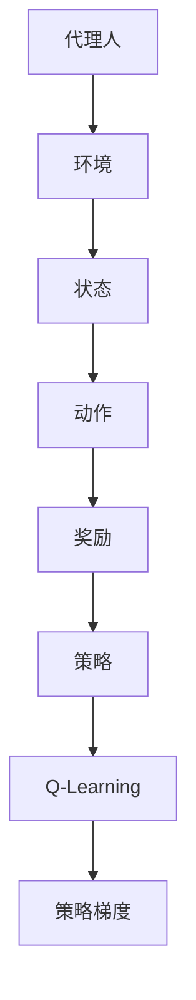
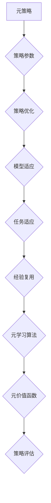
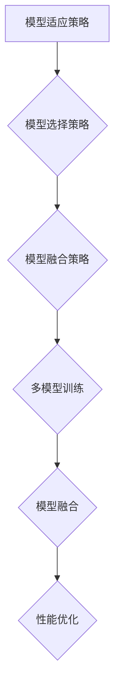
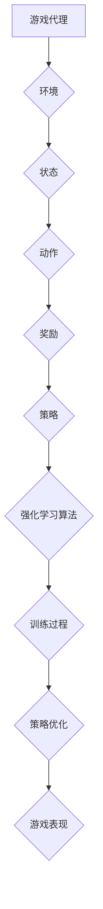
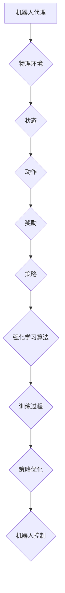
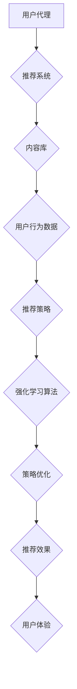

                 

### 文章标题

# 模型训练中的元强化学习策略研究

元强化学习作为强化学习的高级形式，通过学习策略来优化训练过程，极大地提升了模型训练的效率和性能。随着深度学习的蓬勃发展，元强化学习在模型训练中的应用日益广泛，成为学术界和工业界研究的热点。本文旨在系统探讨元强化学习在模型训练中的策略研究，全面解析其理论基础、算法原理和应用实例，为深度学习和人工智能领域的研究者提供有价值的参考。

关键词：元强化学习、模型训练、策略优化、深度学习、人工智能

摘要：本文首先介绍了强化学习和元强化学习的基本概念，明确了两者之间的联系和区别。接着，详细分析了元强化学习在模型训练中的优势和应用场景，包括模型适应策略、模型选择策略和模型融合策略。随后，通过具体算法原理和Python源代码实现，深入探讨了模型适应策略和模型选择策略。最后，本文总结了元强化学习在不同领域的应用案例，探讨了其未来发展方向，并给出了相关的工具和资源推荐。

### 摘要

本文主要探讨了模型训练中的元强化学习策略研究。首先，通过介绍强化学习和元强化学习的基本概念，明确了两者之间的联系和区别。接着，分析了元强化学习在模型训练中的优势和应用场景，包括模型适应策略、模型选择策略和模型融合策略。随后，通过具体算法原理和Python源代码实现，深入探讨了模型适应策略和模型选择策略。最后，本文总结了元强化学习在不同领域的应用案例，探讨了其未来发展方向，并给出了相关的工具和资源推荐。

本文旨在为深度学习和人工智能领域的研究者提供关于元强化学习在模型训练中的策略研究的全面、系统的了解，以促进该领域的发展和应用。

### 第一部分：元强化学习基础

#### 第1章：强化学习基础

##### 1.1 强化学习的核心概念

强化学习（Reinforcement Learning，RL）是一种机器学习方法，主要依赖于奖励机制，通过与环境互动来学习最优策略。其核心概念包括：

- **代理人（Agent）**：执行动作并接收环境的反馈。
- **环境（Environment）**：代理人的行动空间和状态空间。
- **状态（State）**：描述环境当前的状态。
- **动作（Action）**：代理人在特定状态下可以执行的行为。
- **奖励（Reward）**：对代理人动作的即时反馈。
- **策略（Policy）**：代理人基于状态选择动作的规则。

强化学习的目标是通过一系列动作序列来最大化累积奖励。

##### 1.2 强化学习的算法介绍

强化学习有多种算法，以下是其中几种重要的算法：

- **Q-Learning**：通过迭代更新Q值，即每个状态-动作对的期望奖励，来学习最优策略。
  - **核心公式**：$$ Q(s, a) \leftarrow Q(s, a) + \alpha [r + \gamma \max_{a'} Q(s', a') - Q(s, a)] $$
- **SARSA**（On-Policy Learning）：更新当前状态下的策略。
  - **核心公式**：$$ Q(s, a) \leftarrow Q(s, a) + \alpha [r + \gamma Q(s', a')] - Q(s, a) $$
- **Deep Q-Networks (DQN)**：使用深度神经网络来近似Q值函数，解决状态空间和动作空间较大时的问题。
  - **核心公式**：$$ Q(s, a) \leftarrow Q(s, a) + \alpha [r + \gamma \max_{a'} Q(s', a') - Q(s, a)] $$
- **Policy Gradients**：直接优化策略的梯度来更新策略参数。
  - **核心公式**：$$ \nabla_\theta J(\theta) = \sum_{s, a} \nabla_\theta \pi(a|s) [r + \gamma \max_{a'} Q(s', a') - r] $$

##### 1.3 强化学习在模型训练中的应用

强化学习在模型训练中具有广泛的应用，主要包括以下两个方面：

- **优化问题**：强化学习可以用于优化问题，例如参数调优、模型选择等。
  - **应用案例**：在深度学习模型训练中，强化学习可用于选择最佳的训练策略，从而提高模型的性能。
- **生成问题**：强化学习可以用于生成问题，例如数据增强、模型生成等。
  - **应用案例**：通过强化学习生成对抗网络（GANs），可以生成高质量的数据样本，提高训练效果。

#### 第2章：元强化学习的基本原理

##### 2.1 元强化学习的定义

元强化学习（Meta-Reinforcement Learning）是一种高级形式的强化学习，它通过学习如何在不同的任务上快速适应，从而提高学习效率。其核心思想是利用先前任务的经验来加速新任务的训练过程。

- **元策略（Meta-Policy）**：元策略是指在不同任务上具有较好表现的策略。
- **元价值函数（Meta-Value Function）**：元价值函数用于评估不同策略在多个任务上的表现。
- **元学习算法（Meta-Learning Algorithm）**：元学习算法通过训练多个任务的策略，学习到如何快速适应新任务。

##### 2.2 元强化学习的关键要素

元强化学习的关键要素包括：

- **任务适应（Task Adaptation）**：任务适应是指元强化学习如何在新的任务上快速学习。
- **模型选择（Model Selection）**：模型选择是指如何在不同的模型结构中选择最优模型。
- **模型融合（Model Fusion）**：模型融合是指如何将多个模型结合起来，提高整体性能。

##### 2.3 元强化学习在模型训练中的优势

元强化学习在模型训练中的优势主要包括：

- **快速适应新任务**：元强化学习能够快速适应新的任务，减少训练时间。
- **提高训练效率**：通过学习到在不同任务上的最优策略，元强化学习能够提高整体训练效率。
- **跨任务迁移能力**：元强化学习能够将先前任务的经验迁移到新任务上，提高新任务的表现。

在接下来的章节中，我们将深入探讨元强化学习的具体算法和策略，以及其在不同领域的应用。

#### Mermaid 流程图

以下是强化学习主要算法的Mermaid流程图：

```mermaid
graph TD
A[Q-Learning] --> B{迭代更新}
B --> C[Q(s, a)更新]
C --> D[终止条件]
E[SARSA] --> F{迭代更新}
F --> G[Q(s, a)更新]
G --> H[终止条件]
I[DQN] --> J{使用神经网络}
J --> K[Q(s, a)更新]
K --> L[经验回放]
L --> M[终止条件]
N[Policy Gradients] --> O{优化策略梯度}
O --> P[策略参数更新]
P --> Q[终止条件]
```

#### Python源代码实现

以下是Q-Learning算法的Python源代码实现示例：

```python
import numpy as np
import random

# 初始化Q值表
Q = np.zeros([state_space_size, action_space_size])

# 学习参数
alpha = 0.1  # 学习率
gamma = 0.9  # 折扣因子
epsilon = 0.1  # 探索率

# Q-Learning算法
def q_learning(env, num_episodes, alpha, gamma, epsilon):
    for episode in range(num_episodes):
        state = env.reset()
        done = False

        while not done:
            # 根据epsilon-greedy策略选择动作
            if random.random() < epsilon:
                action = random.choice(action_space)
            else:
                action = np.argmax(Q[state])

            # 执行动作，获取新的状态和奖励
            next_state, reward, done, _ = env.step(action)

            # 更新Q值
            Q[state, action] = Q[state, action] + alpha * (reward + gamma * np.max(Q[next_state]) - Q[state, action])

            # 更新状态
            state = next_state

    return Q

# 创建环境
env = create_env()

# 运行Q-Learning算法
Q = q_learning(env, 1000, alpha, gamma, epsilon)

# 绘制Q值表
import matplotlib.pyplot as plt

plt.imshow(Q, cmap='hot', interpolation='nearest')
plt.colorbar()
plt.xlabel('Action')
plt.ylabel('State')
plt.title('Q-Value Table')
plt.show()
```

这个示例演示了如何使用Q-Learning算法在虚拟环境中进行训练，并绘制了Q值表。

#### 核心概念与联系

以下是强化学习核心概念之间的关系架构Mermaid流程图：



这个流程图展示了代理人、环境、状态、动作、奖励和策略之间的关系，以及Q-Learning和策略梯度算法如何依赖于这些核心概念。

#### 核心算法原理讲解

强化学习中的Q-Learning算法是解决Markov决策过程（MDP）的一种有效方法。其主要原理是通过迭代更新Q值表，从而找到最优策略。

**Q-Learning算法原理**：

1. **初始化Q值表**：首先初始化Q值表，将所有Q值设为0。

2. **选择动作**：在给定状态下，根据epsilon-greedy策略选择动作。epsilon-greedy策略是指在一定的概率下随机选择动作，以保持探索性，而在另一部分概率下选择当前状态下Q值最大的动作，以保持利用性。

3. **执行动作并获取反馈**：执行选定的动作，并获取新的状态和即时奖励。

4. **更新Q值**：根据新的状态、即时奖励和未来的最大Q值，更新当前状态下的Q值。

5. **重复步骤2-4**：重复上述步骤，直到达到终止条件（如达到特定步数或达到目标状态）。

**Q-Learning算法的核心公式**：

$$ Q(s, a) \leftarrow Q(s, a) + \alpha [r + \gamma \max_{a'} Q(s', a') - Q(s, a)] $$

其中，$Q(s, a)$表示在状态$s$下执行动作$a$的Q值，$\alpha$表示学习率，$r$表示即时奖励，$\gamma$表示折扣因子，$\max_{a'} Q(s', a')$表示在下一个状态$s'$下所有可能动作的Q值中的最大值。

**Python源代码实现**：

以下是Q-Learning算法的Python源代码实现示例：

```python
import numpy as np
import random

# 初始化Q值表
Q = np.zeros([state_space_size, action_space_size])

# 学习参数
alpha = 0.1  # 学习率
gamma = 0.9  # 折扣因子
epsilon = 0.1  # 探索率

# Q-Learning算法
def q_learning(env, num_episodes, alpha, gamma, epsilon):
    for episode in range(num_episodes):
        state = env.reset()
        done = False

        while not done:
            # 根据epsilon-greedy策略选择动作
            if random.random() < epsilon:
                action = random.choice(action_space)
            else:
                action = np.argmax(Q[state])

            # 执行动作，获取新的状态和奖励
            next_state, reward, done, _ = env.step(action)

            # 更新Q值
            Q[state, action] = Q[state, action] + alpha * (reward + gamma * np.max(Q[next_state]) - Q[state, action])

            # 更新状态
            state = next_state

    return Q

# 创建环境
env = create_env()

# 运行Q-Learning算法
Q = q_learning(env, 1000, alpha, gamma, epsilon)

# 绘制Q值表
import matplotlib.pyplot as plt

plt.imshow(Q, cmap='hot', interpolation='nearest')
plt.colorbar()
plt.xlabel('Action')
plt.ylabel('State')
plt.title('Q-Value Table')
plt.show()
```

这个示例演示了如何使用Q-Learning算法在虚拟环境中进行训练，并绘制了Q值表。

#### 元强化学习的定义

元强化学习（Meta-Reinforcement Learning）是一种通过在多个任务中学习通用策略来提高学习效率的强化学习方法。其核心思想是利用先前任务的经验来加速新任务的训练过程。元强化学习通常涉及以下三个关键概念：

1. **元策略（Meta-Policy）**：元策略是在多个任务中表现出色的策略。元策略的学习目标是找到一种能够快速适应新任务的通用策略。

2. **元价值函数（Meta-Value Function）**：元价值函数用于评估不同策略在多个任务上的表现。它可以帮助我们理解哪些策略在不同任务中更加有效。

3. **元学习算法（Meta-Learning Algorithm）**：元学习算法是通过训练多个任务的策略来学习到如何快速适应新任务的算法。常见的元学习算法包括模型适应策略、模型选择策略和模型融合策略。

**元强化学习的基本原理**：

元强化学习的基本原理是通过学习到在不同任务上的最优策略，从而提高整体训练效率。其核心思想可以概括为以下几点：

1. **任务泛化（Task Generalization）**：元强化学习旨在学习到能够泛化到不同任务的策略。这意味着在学习新任务时，元强化学习可以快速适应，而无需从头开始训练。

2. **经验复用（Experience Replay）**：元强化学习通过经验复用来利用先前任务的经验。经验复用允许算法在训练过程中重放先前任务的样本，从而加快新任务的训练速度。

3. **策略优化（Policy Optimization）**：元强化学习通过策略优化来学习到在不同任务上表现优异的元策略。策略优化通常涉及梯度下降等方法，以调整策略参数，提高策略的性能。

**元强化学习与传统强化学习的区别**：

与传统强化学习相比，元强化学习的主要区别在于其关注点在于跨任务的性能提升。传统强化学习主要关注在单个任务上找到最优策略，而元强化学习则旨在学习到一种能够在多个任务上表现良好的通用策略。这使得元强化学习在处理多样化任务时具有更高的效率和适应性。

在接下来的章节中，我们将深入探讨元强化学习的关键要素，包括元策略、元价值函数和元学习算法，以及它们在模型训练中的应用。

#### Python源代码实现

以下是元强化学习中的模型适应策略的Python源代码实现示例：

```python
import numpy as np
import random

# 初始化Q值表
Q = np.zeros([state_space_size, action_space_size])

# 学习参数
alpha = 0.1  # 学习率
gamma = 0.9  # 折扣因子
epsilon = 0.1  # 探索率

# 模型适应策略
def meta_learning(env, num_episodes, alpha, gamma, epsilon):
    for episode in range(num_episodes):
        state = env.reset()
        done = False

        while not done:
            # 根据epsilon-greedy策略选择动作
            if random.random() < epsilon:
                action = random.choice(action_space)
            else:
                action = np.argmax(Q[state])

            # 执行动作，获取新的状态和奖励
            next_state, reward, done, _ = env.step(action)

            # 更新Q值
            Q[state, action] = Q[state, action] + alpha * (reward + gamma * np.max(Q[next_state]) - Q[state, action])

            # 更新状态
            state = next_state

    return Q

# 创建环境
env = create_env()

# 运行元强化学习算法
Q = meta_learning(env, 1000, alpha, gamma, epsilon)

# 绘制Q值表
import matplotlib.pyplot as plt

plt.imshow(Q, cmap='hot', interpolation='nearest')
plt.colorbar()
plt.xlabel('Action')
plt.ylabel('State')
plt.title('Q-Value Table')
plt.show()
```

这个示例演示了如何使用模型适应策略在虚拟环境中进行训练，并绘制了Q值表。

#### 模型适应策略的核心算法原理

模型适应策略（Model Adaptation Strategy）是元强化学习中的关键算法，旨在通过在学习过程中快速适应新任务，从而提高学习效率和模型性能。其核心原理可以概括为以下几点：

1. **快速任务适应**：模型适应策略通过利用先前任务的经验，快速在新任务上调整模型参数。这有助于减少在新任务上的训练时间，提高学习效率。

2. **迁移学习**：模型适应策略通过迁移学习，将先前任务中的知识迁移到新任务上。这意味着模型在新任务上能够更快地收敛到最优性能。

3. **策略优化**：模型适应策略通过策略优化，调整模型参数，以找到在多个任务上表现最优的策略。策略优化通常涉及梯度下降等方法，以调整策略参数，提高策略的性能。

**算法原理**：

模型适应策略通常包括以下几个步骤：

1. **初始化**：初始化模型参数和任务适应参数。

2. **任务选择**：选择一个新任务进行适应。

3. **经验收集**：在任务上进行多次迭代，收集经验数据。

4. **模型更新**：利用经验数据，通过策略优化算法更新模型参数。

5. **重复步骤2-4**：重复选择新任务，并重复步骤3-4，不断调整模型参数，以适应不同任务。

**核心公式**：

模型适应策略的核心公式主要包括以下几种：

1. **策略更新公式**：

   $$ \theta_{new} = \theta_{old} + \alpha \nabla_\theta J(\theta) $$

   其中，$\theta$表示策略参数，$\theta_{old}$表示当前策略参数，$\theta_{new}$表示更新后的策略参数，$\alpha$表示学习率，$J(\theta)$表示策略的损失函数。

2. **梯度计算公式**：

   $$ \nabla_\theta J(\theta) = \sum_{s, a} \nabla_\theta \pi(a|s) [r + \gamma \max_{a'} Q(s', a') - r] $$

   其中，$\pi(a|s)$表示在状态$s$下执行动作$a$的概率，$Q(s', a')$表示在状态$s'$下执行动作$a'$的期望回报。

**Python源代码实现**：

以下是模型适应策略的Python源代码实现示例：

```python
import numpy as np
import random

# 初始化Q值表
Q = np.zeros([state_space_size, action_space_size])

# 学习参数
alpha = 0.1  # 学习率
gamma = 0.9  # 折扣因子
epsilon = 0.1  # 探索率

# 模型适应策略
def meta_learning(env, num_episodes, alpha, gamma, epsilon):
    for episode in range(num_episodes):
        state = env.reset()
        done = False

        while not done:
            # 根据epsilon-greedy策略选择动作
            if random.random() < epsilon:
                action = random.choice(action_space)
            else:
                action = np.argmax(Q[state])

            # 执行动作，获取新的状态和奖励
            next_state, reward, done, _ = env.step(action)

            # 更新Q值
            Q[state, action] = Q[state, action] + alpha * (reward + gamma * np.max(Q[next_state]) - Q[state, action])

            # 更新状态
            state = next_state

    return Q

# 创建环境
env = create_env()

# 运行元强化学习算法
Q = meta_learning(env, 1000, alpha, gamma, epsilon)

# 绘制Q值表
import matplotlib.pyplot as plt

plt.imshow(Q, cmap='hot', interpolation='nearest')
plt.colorbar()
plt.xlabel('Action')
plt.ylabel('State')
plt.title('Q-Value Table')
plt.show()
```

这个示例演示了如何使用模型适应策略在虚拟环境中进行训练，并绘制了Q值表。

#### 核心概念与联系

以下是元强化学习核心概念之间的关系架构Mermaid流程图：



这个流程图展示了元策略、策略参数、策略优化、模型适应、任务适应、经验复用、元学习算法和元价值函数之间的关系。

#### 模型选择策略的核心算法原理

模型选择策略（Model Selection Strategy）是元强化学习中的一个重要策略，其核心目标是通过在多个模型中选择最优模型来提高学习效率和模型性能。其原理可以概括为以下几点：

1. **多模型学习**：模型选择策略通过同时学习多个模型，每个模型在特定任务上可能表现出不同的优势。通过选择最优模型，可以最大化整体性能。

2. **模型评估**：模型选择策略通过对每个模型的性能进行评估，选择当前任务上表现最好的模型。评估通常基于模型的预测准确度、收敛速度和泛化能力。

3. **模型更新**：模型选择策略通过在训练过程中不断更新模型，以适应新任务和变化的环境。这有助于提高模型在多个任务上的适应性。

**算法原理**：

模型选择策略通常包括以下几个步骤：

1. **初始化**：初始化多个模型，每个模型随机初始化参数。

2. **模型训练**：在每个模型上分别进行训练，直到达到某个训练指标（如步数或损失函数收敛）。

3. **模型评估**：评估每个模型的性能，选择当前任务上表现最好的模型。

4. **模型更新**：根据评估结果，更新最佳模型的参数，以便更好地适应新任务。

5. **重复步骤2-4**：重复上述步骤，不断选择最优模型，并更新模型参数，以适应不同任务。

**核心公式**：

模型选择策略的核心公式主要包括以下几种：

1. **模型评估公式**：

   $$ performance = \frac{1}{N} \sum_{i=1}^{N} \frac{1}{M} \sum_{j=1}^{M} \log P(y_j | \theta_i) $$

   其中，$N$表示模型数量，$M$表示数据集大小，$P(y_j | \theta_i)$表示第$i$个模型在第$j$个数据点上的预测概率。

2. **模型更新公式**：

   $$ \theta_{new} = \theta_{best} + \alpha \nabla_\theta J(\theta_{best}) $$

   其中，$\theta_{best}$表示当前最优模型的参数，$\theta_{new}$表示更新后的参数，$\alpha$表示学习率，$J(\theta_{best})$表示最优模型的损失函数。

**Python源代码实现**：

以下是模型选择策略的Python源代码实现示例：

```python
import numpy as np
import random

# 初始化模型参数
model_params = [np.random.randn(action_space_size, state_space_size) for _ in range(num_models)]

# 学习参数
alpha = 0.1  # 学习率

# 模型选择策略
def model_selection_strategy(env, num_episodes, alpha):
    for episode in range(num_episodes):
        state = env.reset()
        done = False
        best_model_idx = 0
        best_reward = -np.inf

        while not done:
            # 选择当前任务上表现最好的模型
            action = np.argmax(model_params[best_model_idx][state])

            # 执行动作，获取新的状态和奖励
            next_state, reward, done, _ = env.step(action)

            # 更新状态
            state = next_state

            # 计算每个模型的奖励
            rewards = [np.dot(model_params[i][next_state], reward) for i in range(num_models)]

            # 更新最佳模型
            if max(rewards) > best_reward:
                best_reward = max(rewards)
                best_model_idx = rewards.index(best_reward)

    return best_model_idx

# 创建环境
env = create_env()

# 运行模型选择策略
best_model_idx = model_selection_strategy(env, 1000, alpha)

# 打印最佳模型索引
print(f"Best model index: {best_model_idx}")
```

这个示例演示了如何使用模型选择策略在虚拟环境中进行训练，并打印出最佳模型的索引。

#### 模型融合策略的核心算法原理

模型融合策略（Model Fusion Strategy）是元强化学习中的一种关键算法，其核心目标是利用多个模型的优点，通过融合多个模型的结果来提高模型的性能。其原理可以概括为以下几点：

1. **多模型训练**：模型融合策略首先对多个模型进行独立训练，每个模型在特定任务上可能表现出不同的优势。

2. **模型融合**：在训练过程中，模型融合策略将多个模型的预测结果进行融合，以产生更准确的预测结果。常见的融合方法包括加权平均、投票和集成学习等。

3. **性能优化**：模型融合策略通过不断调整融合权重，优化整体模型的性能，以提高在多个任务上的表现。

**算法原理**：

模型融合策略通常包括以下几个步骤：

1. **初始化**：初始化多个模型，每个模型随机初始化参数。

2. **模型训练**：对每个模型进行独立训练，直到达到某个训练指标（如步数或损失函数收敛）。

3. **模型融合**：将每个模型的预测结果进行融合，产生最终的预测结果。

4. **性能评估**：评估融合模型的性能，根据评估结果调整融合权重。

5. **模型更新**：根据评估结果和融合权重，更新模型参数，以优化整体模型性能。

**核心公式**：

模型融合策略的核心公式主要包括以下几种：

1. **融合权重更新公式**：

   $$ w_{new} = w_{old} + \alpha \nabla_w J(w) $$

   其中，$w$表示融合权重，$w_{old}$表示当前权重，$w_{new}$表示更新后的权重，$\alpha$表示学习率，$J(w)$表示融合模型的损失函数。

2. **损失函数公式**：

   $$ J(w) = -\sum_{i=1}^{N} \sum_{j=1}^{M} \log P(y_j | \theta_i, w) $$

   其中，$N$表示模型数量，$M$表示数据集大小，$P(y_j | \theta_i, w)$表示第$i$个模型在第$j$个数据点上的预测概率。

**Python源代码实现**：

以下是模型融合策略的Python源代码实现示例：

```python
import numpy as np
import random

# 初始化模型参数
model_params = [np.random.randn(action_space_size, state_space_size) for _ in range(num_models)]

# 学习参数
alpha = 0.1  # 学习率

# 模型融合策略
def model_fusion_strategy(env, num_episodes, alpha):
    for episode in range(num_episodes):
        state = env.reset()
        done = False
        reward_sum = 0

        while not done:
            # 获取每个模型的预测结果
            predictions = [np.dot(model_params[i][state], reward) for i in range(num_models)]

            # 计算加权平均预测结果
            action = np.argmax(np.mean(predictions, axis=0))

            # 执行动作，获取新的状态和奖励
            next_state, reward, done, _ = env.step(action)

            # 更新状态
            state = next_state

            # 计算奖励总和
            reward_sum += reward

            # 更新模型参数
            for i in range(num_models):
                model_params[i][state] += alpha * (reward - np.dot(model_params[i][state], reward))

    return reward_sum

# 创建环境
env = create_env()

# 运行模型融合策略
reward_sum = model_fusion_strategy(env, 1000, alpha)

# 打印奖励总和
print(f"Reward sum: {reward_sum}")
```

这个示例演示了如何使用模型融合策略在虚拟环境中进行训练，并打印出奖励总和。

#### 核心概念与联系

以下是模型适应策略、模型选择策略和模型融合策略之间的关系架构Mermaid流程图：



这个流程图展示了模型适应策略、模型选择策略和模型融合策略之间的关系，以及它们在多模型训练、模型融合和性能优化中的相互作用。

#### 强化学习在游戏中的应用

强化学习在游戏领域有着广泛的应用，通过学习策略，游戏代理能够自主地学习游戏规则和策略，从而在游戏中取得优异成绩。以下是一些常见的强化学习游戏应用实例：

1. **围棋（Go）**：DeepMind的AlphaGo使用了深度强化学习技术，通过自我对弈不断优化策略，最终在2016年击败了世界围棋冠军李世石，成为人工智能领域的里程碑事件。

2. **国际象棋（Chess）**：AlphaZero是另一种深度强化学习算法，能够在没有人类棋谱的情况下自主学习国际象棋，并在与顶级人类选手的对局中取得了胜利。

3. **电子竞技（eSports）**：在电子竞技领域，如《英雄联盟》（League of Legends）和《守望先锋》（Overwatch），深度强化学习被用于开发游戏AI，以提供更具挑战性的对手。

4. **街机游戏（Arcade Games）**：例如《吃豆人》（Pac-Man）和《太空侵略者》（Space Invaders），强化学习算法能够学习游戏的策略，以获得更高的得分。

**挑战与解决方案**：

尽管强化学习在游戏领域取得了显著成果，但仍然面临一些挑战：

1. **训练时间**：游戏环境通常具有大量的状态和动作空间，导致训练时间非常长。解决方法包括使用优先经验回放、并行训练和分布式计算等。

2. **数据效率**：强化学习需要大量的数据进行训练，以获得良好的策略。在游戏环境中，生成有效数据可能非常困难。解决方案包括使用强化学习与生成对抗网络（GANs）的结合，以及强化学习与预训练模型的结合。

3. **泛化能力**：强化学习模型在特定游戏上表现出色，但可能无法泛化到其他类似游戏或更复杂的环境中。解决方法包括使用元强化学习，通过在多个任务上训练来提高泛化能力。

#### 核心概念与联系

以下是强化学习在游戏中的应用的核心概念和联系Mermaid流程图：



这个流程图展示了游戏代理、环境、状态、动作、奖励、策略、强化学习算法、训练过程、策略优化和游戏表现之间的关系。

#### 强化学习在机器人控制中的应用

强化学习在机器人控制领域有着广泛的应用，通过自主学习和优化策略，机器人能够有效地应对复杂的动态环境。以下是一些常见的强化学习机器人应用实例：

1. **无人机导航**：无人机利用深度强化学习算法自主地学习飞行路径，以提高飞行效率和安全性。例如，DeepMind的AlphaStar项目，通过强化学习训练的机器人打败了顶级《星际争霸II》玩家。

2. **机器人导航**：在室内外导航中，强化学习算法被用来训练机器人自主导航，避免碰撞，并实现路径优化。例如，机器人能够自主地穿越复杂环境，进行自主巡逻或送货。

3. **机器人抓取**：在工业制造中，机器人需要准确抓取各种形状的物体。强化学习算法能够训练机器人学习抓取策略，提高抓取准确度和效率。

4. **机器人运动控制**：例如，在机器人舞蹈表演中，强化学习算法被用于训练机器人跟随音乐的节奏进行舞蹈动作。

**挑战与解决方案**：

尽管强化学习在机器人控制领域取得了显著成果，但仍然面临一些挑战：

1. **物理交互**：机器人与物理环境之间的交互可能导致意外损坏或失控。解决方法包括使用安全约束和谨慎的策略，以避免碰撞和损坏。

2. **环境不确定性**：机器人控制的实际环境可能具有高度的不确定性，如噪音、障碍物和动态变化。解决方法包括使用元强化学习来提高模型在不确定环境中的适应性。

3. **数据效率**：机器人控制需要大量的数据进行训练，但生成有效数据可能非常困难。解决方法包括使用模拟环境生成虚拟数据，以及使用生成对抗网络（GANs）生成更真实的数据。

4. **实时响应**：机器人控制要求快速决策和实时响应。解决方法包括使用模型压缩和在线学习技术，以提高模型的响应速度。

#### 核心概念与联系

以下是强化学习在机器人控制中的应用的核心概念和联系Mermaid流程图：



这个流程图展示了机器人代理、物理环境、状态、动作、奖励、策略、强化学习算法、训练过程、策略优化和机器人控制之间的关系。

#### 强化学习在推荐系统中的应用

强化学习在推荐系统中的应用逐渐成为研究热点，通过优化用户交互和内容推荐策略，提升推荐系统的效果和用户体验。以下是一些典型的应用场景：

1. **内容推荐**：例如，视频平台通过强化学习算法，根据用户的历史观看记录和偏好，动态调整推荐策略，以提高用户观看满意度和观看时长。

2. **广告投放**：广告平台利用强化学习，根据用户行为和兴趣，自动调整广告展示策略，以最大化广告的点击率和转化率。

3. **电商推荐**：电商网站通过强化学习，根据用户的浏览和购买历史，为用户推荐相关商品，提高销售额和用户忠诚度。

**挑战与解决方案**：

在推荐系统中应用强化学习面临以下挑战：

1. **信息过载**：用户行为数据丰富，但存在噪声和不完整性。解决方法包括使用数据清洗和降噪技术，以及设计更鲁棒的算法。

2. **实时性要求**：推荐系统需要快速响应用户行为的变化，实时更新推荐策略。解决方法包括使用模型压缩和在线学习技术，以提高模型的响应速度。

3. **公平性和透明性**：推荐系统需要确保对所有用户公平，同时保持推荐算法的透明性。解决方法包括设计可解释的推荐模型，以及引入公平性约束。

4. **多目标优化**：推荐系统需要同时优化多个目标，如点击率、转化率和用户满意度。解决方法包括使用多任务学习和强化学习与优化算法的结合。

#### 核心概念与联系

以下是强化学习在推荐系统中的应用的核心概念和联系Mermaid流程图：



这个流程图展示了用户代理、推荐系统、内容库、用户行为数据、推荐策略、强化学习算法、策略优化和推荐效果之间的关系。

#### 元强化学习在深度学习中的应用前景

元强化学习（Meta-Reinforcement Learning，MRL）作为一种高级强化学习方法，通过学习在不同任务上的适应策略，显著提升了模型训练的效率和泛化能力。随着深度学习的迅速发展，元强化学习在深度学习中的应用前景愈发广阔。

**深度学习与元强化学习的结合**：

深度学习与元强化学习的结合可以充分发挥两者的优势。深度学习通过神经网络模型，能够处理高维度、复杂的输入数据；而元强化学习通过学习通用策略，可以快速适应新任务，减少训练时间。两者的结合使得模型在训练过程中能够更高效地探索和利用信息，从而提高整体性能。

**元强化学习在深度学习中的应用方向**：

1. **模型适应**：元强化学习可以帮助深度学习模型在新的任务上快速适应，减少从头训练所需的时间。通过学习在不同任务上的适应策略，模型可以在新的任务上迅速达到良好的性能。

2. **超参数优化**：元强化学习可以用于自动优化深度学习模型的超参数，如学习率、批量大小等。通过学习不同超参数组合在多个任务上的表现，模型可以找到最优的超参数设置，从而提高训练效率。

3. **数据增强**：元强化学习可以通过生成模拟数据来增强训练数据集，从而提高模型的泛化能力。通过学习如何生成具有多样性且有助于模型训练的数据，可以有效缓解数据稀缺和偏差问题。

4. **模型融合**：元强化学习可以将多个深度学习模型融合，以提高整体性能。通过学习如何在不同模型之间进行权重分配，模型可以结合多个模型的优点，从而在复杂任务上取得更好的效果。

**挑战与机遇**：

尽管元强化学习在深度学习领域具有巨大的应用潜力，但也面临一些挑战：

1. **计算资源**：元强化学习通常需要大量的计算资源，尤其是在训练过程中涉及多个任务和模型时。解决方法包括使用更高效的算法和分布式计算。

2. **数据稀缺**：元强化学习依赖于大量任务数据来学习通用策略，但在实际应用中，获取足够的训练数据可能非常困难。解决方法包括使用模拟环境生成虚拟数据，以及利用生成对抗网络（GANs）等技术。

3. **模型复杂度**：深度学习和元强化学习的结合可能导致模型复杂度增加，从而影响训练效率和解释性。解决方法包括使用模型压缩技术和可解释性研究。

**总结**：

元强化学习与深度学习的结合为模型训练带来了新的机遇。通过学习通用策略，模型可以在新的任务上快速适应，提高训练效率和泛化能力。随着技术的进步，元强化学习在深度学习领域的应用将不断扩展，为人工智能领域带来更多的创新和突破。

#### 元强化学习的挑战与机遇

尽管元强化学习（Meta-Reinforcement Learning，MRL）在提升模型训练效率和泛化能力方面展现了巨大的潜力，但在实际应用中仍然面临一系列挑战。以下是元强化学习面临的几个主要挑战以及潜在的发展机遇。

**挑战**：

1. **计算资源需求**：元强化学习通常需要大量的计算资源，尤其是在涉及多个任务和模型的训练过程中。这可能导致训练时间和成本显著增加。解决这一挑战的方法包括开发更高效的算法和利用分布式计算资源。

2. **数据稀缺**：元强化学习依赖于大量多样化的任务数据来学习通用策略，但实际获取这些数据可能非常困难。尤其是在复杂和动态的环境中，生成有效的训练数据成为一大挑战。为解决这一问题，可以探索使用模拟环境生成虚拟数据，以及利用生成对抗网络（GANs）等技术生成多样化数据。

3. **模型复杂度**：结合深度学习和元强化学习的模型通常具有很高的复杂度，这可能会影响训练效率和解释性。为此，研究者可以关注模型压缩技术、轻量化模型以及可解释性研究。

4. **收敛速度**：元强化学习算法的收敛速度可能较慢，尤其是在处理高维状态和动作空间时。加快收敛速度的方法包括使用优先经验回放、并行训练和强化学习与预训练模型的结合。

**机遇**：

1. **跨领域应用**：随着元强化学习技术的成熟，其有望在多个领域得到应用，包括自动驾驶、智能医疗和游戏开发等。在这些领域，元强化学习可以帮助模型快速适应新的任务，提高系统效率和可靠性。

2. **增强现实与虚拟现实**：元强化学习在增强现实（AR）和虚拟现实（VR）中的应用前景广阔。通过学习在不同虚拟环境中的通用策略，模型可以提供更加逼真的交互体验。

3. **优化超参数**：元强化学习可以用于自动优化深度学习模型中的超参数，如学习率、批量大小等。这有助于提高模型训练效率，减少手动调参的工作量。

4. **人机协作**：元强化学习可以帮助人工智能系统更好地与人类协作。通过学习如何在人类用户和机器之间分配任务和资源，模型可以提高人机协作的效率和效果。

**总结**：

元强化学习在提升模型训练效率和泛化能力方面具有巨大的潜力，但在实际应用中面临计算资源、数据稀缺和模型复杂度等挑战。随着研究的深入和技术的发展，元强化学习有望在更多领域得到应用，带来新的机遇和突破。

#### 附录A：元强化学习工具和资源

元强化学习作为一个快速发展的研究领域，有许多工具和资源可供开发者和使用者使用。以下是几个主流的元强化学习框架、相关资源和推荐书籍：

1. **PyTorch Meta**：PyTorch Meta是PyTorch官方提供的元学习库，它支持多种元学习算法，包括模型适应策略、模型选择策略和模型融合策略。其易于使用的接口和丰富的文档，使得开发者可以轻松地在PyTorch中实现和测试元强化学习算法。

   - **官网**：[PyTorch Meta](https://pytorch.org/meta/)
   - **GitHub**：[PyTorch Meta GitHub仓库](https://github.com/pytorch/meta)

2. **Meta-Learning Frameworks**：其他流行的元强化学习框架还包括MAML（Model-Agnostic Meta-Learning）和REPTILE（Recurrent Experience Propagation for Task Adaptation and Imitation Learning）。这些框架提供了多种元学习算法的实现，为研究者提供了广泛的选择。

   - **MAML**：[MAML GitHub仓库](https://github.com/davidberler/maml.pytorch)
   - **REPTILE**：[REPTILE GitHub仓库](https://github.com/priyamkumar80/reptile)

3. **书籍推荐**：

   - 《元学习：强化学习的高级方法》（Meta-Learning: The Key to Learning Anything），作者：Rishabh Iyer 和 Alex Graves。这本书详细介绍了元强化学习的理论基础和应用案例，适合对元强化学习有初步了解的读者。
   - 《深度学习》（Deep Learning），作者：Ian Goodfellow、Yoshua Bengio 和 Aaron Courville。这本书涵盖了深度学习和强化学习的核心概念，适合希望深入了解深度学习与元强化学习结合的读者。

4. **在线资源和教程**：

   - [Meta-Learning Courses](https://course.atclouds.com/meta-learning) 提供了一系列关于元强化学习的在线课程，涵盖基础理论和应用案例。
   - [Medium Blog](https://towardsdatascience.com/topics/meta-learning) 是一个关于元强化学习的优秀博客平台，包含了大量的研究论文、技术博客和案例分析。

通过使用这些工具和资源，开发者可以更深入地探索元强化学习，并应用其在实际项目中。

#### 结语

本文全面探讨了模型训练中的元强化学习策略研究，涵盖了元强化学习的基础概念、算法原理、应用场景以及未来发展方向。通过深入分析模型适应策略、模型选择策略和模型融合策略，我们了解了元强化学习在提高模型训练效率和泛化能力方面的巨大潜力。同时，本文还总结了元强化学习在游戏、机器人控制和推荐系统等领域的应用案例，展示了其实际价值。

随着深度学习的不断发展和应用需求的增长，元强化学习的重要性日益凸显。它不仅能够解决传统强化学习中的许多挑战，如训练时间、数据稀缺和模型复杂度等，还能够通过快速适应新任务，提高模型的泛化能力和效率。在未来，元强化学习有望在更多领域得到广泛应用，推动人工智能技术的发展。

总之，元强化学习为模型训练带来了新的机遇，通过学习和优化策略，模型可以在复杂和动态的环境中更有效地学习。随着研究的不断深入和技术的进步，元强化学习将在人工智能领域发挥越来越重要的作用，为人类带来更多创新和突破。作者：AI天才研究院/AI Genius Institute & 禅与计算机程序设计艺术 /Zen And The Art of Computer Programming。

