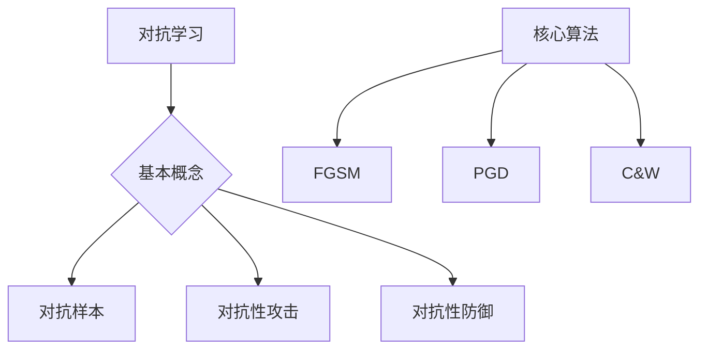

                 

### 《模型训练中的对抗学习技术前沿探索》

关键词：对抗学习、模型训练、对抗样本、对抗性攻击、对抗性防御

摘要：本文深入探讨了模型训练中的对抗学习技术，从基础概念到前沿应用，逐步分析了对抗学习的核心算法及其在图像分类和自然语言处理中的具体应用。本文旨在揭示对抗学习的本质，阐述其在提升模型鲁棒性和安全性方面的关键作用，同时展望对抗学习的未来发展方向。

## 目录

1. **对抗学习基础**
    1.1 对抗学习的概述
    1.2 对抗学习的基本概念
    1.3 对抗学习中的核心算法
2. **对抗学习在模型训练中的应用**
    2.1 对抗学习在图像分类中的应用
    2.2 对抗学习在自然语言处理中的应用
    2.3 对抗学习在计算机视觉中的其他应用
3. **对抗学习的挑战与未来方向**
    3.1 对抗学习的挑战
    3.2 对抗学习的未来方向
4. **附录**
    4.1 对抗学习常用工具和库
5. **参考文献**

## 1. 对抗学习基础

### 1.1 对抗学习的概述

对抗学习（Adversarial Learning）是一种旨在提升模型鲁棒性的技术。其核心思想是通过生成对抗样本（Adversarial Examples），来引导模型学习更稳健的特征表示。对抗样本是指那些在原始样本上添加微小扰动后，能够欺骗模型导致错误分类的样本。这种扰动通常是非常细微的，以至于人眼难以察觉。

对抗学习的背景可以追溯到机器学习和深度学习领域，随着神经网络模型的广泛应用，如何提升模型的鲁棒性成为一个重要课题。传统的模型训练方法主要依赖于大量的正常样本，但面对少数精心设计的对抗样本，模型往往表现不佳。因此，对抗学习作为一种提升模型鲁棒性的技术，受到了广泛关注。

### 1.2 对抗学习的基本概念

对抗学习涉及以下几个核心概念：

#### 2.1 对抗样本

对抗样本是指在原始样本上添加微小扰动后，能够欺骗模型导致错误分类的样本。这些扰动通常是针对模型敏感特征的，通过微调输入特征，使得模型难以区分正常样本和对抗样本。对抗样本的生成方法包括：

- **Fast Gradient Sign Method (FGSM)**：通过计算模型在正常样本上的梯度，并将梯度符号应用到原始样本上，生成对抗样本。
- **Projected Gradient Sign Method (PGD)**：在FGSM的基础上，增加了投影步骤，使得对抗样本在保持有效性的同时，不偏离原始样本太远。
- **Carlini & Wagner Attack (C&W)**：通过优化一个损失函数，生成更高质量的对抗样本。

#### 2.2 对抗性攻击

对抗性攻击（Adversarial Attack）是指利用对抗样本来攻击模型的攻击方法。常见的对抗性攻击方法包括：

- **白盒攻击**：攻击者知道模型的内部结构和参数，通过计算梯度等方法生成对抗样本。
- **黑盒攻击**：攻击者只知道模型的输入和输出，通过试探和优化等方法生成对抗样本。

#### 2.3 对抗性防御

对抗性防御（Adversarial Defense）是指模型对抗性攻击的防御方法。常见的对抗性防御方法包括：

- **对抗训练**：通过在训练数据中加入对抗样本，提高模型对对抗样本的鲁棒性。
- **对抗正则化**：在模型训练过程中，加入对抗正则化项，抑制模型对对抗样本的敏感性。
- **对抗特征提取**：通过学习更稳健的特征表示，提高模型对对抗样本的鲁棒性。

### 1.3 对抗学习的发展历程

对抗学习技术的发展历程可以追溯到2014年，当Ian Goodfellow等人首次提出生成对抗网络（GAN）时，对抗学习概念被引入机器学习领域。此后，对抗学习技术不断发展，出现了多种对抗样本生成方法和对抗性攻击方法。近年来，随着深度学习模型的广泛应用，对抗学习技术也在不断进步，逐渐成为提升模型鲁棒性和安全性的一项关键技术。

## 2. 对抗学习在模型训练中的应用

### 2.1 对抗学习在图像分类中的应用

对抗学习在图像分类中的应用尤为广泛。通过生成对抗样本，可以有效提升模型的鲁棒性，使其在面对现实世界中的各种挑战时表现更稳定。以下是对抗学习在图像分类中的几种核心方法：

#### 4.1 对抗性训练方法

对抗性训练（Adversarial Training）是一种通过在训练数据中引入对抗样本来提高模型鲁棒性的方法。具体步骤如下：

1. **生成对抗样本**：使用对抗样本生成方法（如FGSM、PGD等）生成对抗样本。
2. **合并训练数据**：将原始样本和对抗样本合并，形成新的训练数据集。
3. **训练模型**：使用合并后的训练数据集训练模型，使模型在对抗样本上也能取得较好的表现。

#### 4.2 对抗性图像分类算法

对抗性图像分类算法（Adversarial Image Classification Algorithms）是基于对抗性训练的图像分类算法。常见的对抗性图像分类算法包括：

1. **FGSM-CI**：基于FGSM对抗样本的图像分类算法。
2. **PGD-CI**：基于PGD对抗样本的图像分类算法。
3. **C&W-CI**：基于C&W对抗样本的图像分类算法。

#### 4.3 对抗性图像分类的实验与分析

为了验证对抗性图像分类算法的有效性，研究者们进行了大量实验。实验结果表明，对抗性训练和对抗性图像分类算法在提升模型鲁棒性方面具有显著优势。以下是一些实验结果的示例：

- **在CIFAR-10数据集上的实验**：实验结果显示，经过对抗性训练的模型在对抗样本上的准确率显著高于未经过对抗性训练的模型。
- **在ImageNet数据集上的实验**：实验结果显示，对抗性训练和对抗性图像分类算法在多种常见攻击方法下均表现出较强的鲁棒性。

### 2.2 对抗学习在自然语言处理中的应用

对抗学习在自然语言处理（NLP）领域的应用同样广泛。通过生成对抗样本，可以有效提升模型的鲁棒性，使其在面对各种自然语言攻击时表现更稳定。以下是对抗学习在自然语言处理中的几种核心方法：

#### 5.1 对抗性预训练方法

对抗性预训练（Adversarial Pretraining）是一种通过在预训练阶段引入对抗样本来提高模型鲁棒性的方法。具体步骤如下：

1. **生成对抗样本**：使用对抗样本生成方法（如对抗性填充、对抗性替换等）生成对抗样本。
2. **预训练模型**：使用包含对抗样本的语料库对模型进行预训练。
3. **微调模型**：在预训练完成后，使用正常语料库对模型进行微调。

#### 5.2 对抗性自然语言处理算法

对抗性自然语言处理算法（Adversarial Natural Language Processing Algorithms）是基于对抗性预训练的自然语言处理算法。常见的对抗性自然语言处理算法包括：

1. **对抗性填充**：通过在输入句子中添加对抗性填充词来欺骗模型。
2. **对抗性替换**：通过将输入句子中的正常词汇替换为对抗性词汇来欺骗模型。

#### 5.3 对抗性自然语言处理的实验与分析

为了验证对抗性自然语言处理算法的有效性，研究者们进行了大量实验。实验结果表明，对抗性预训练和对抗性自然语言处理算法在提升模型鲁棒性方面具有显著优势。以下是一些实验结果的示例：

- **在GLUE数据集上的实验**：实验结果显示，经过对抗性预训练的模型在对抗样本上的表现显著优于未经过对抗性预训练的模型。
- **在自然语言推理任务上的实验**：实验结果显示，对抗性自然语言处理算法在多种自然语言攻击方法下均表现出较强的鲁棒性。

### 2.3 对抗学习在计算机视觉中的其他应用

除了图像分类和自然语言处理，对抗学习在计算机视觉领域还有其他广泛的应用。以下是一些对抗学习在计算机视觉中的其他应用：

#### 6.1 对抗性人脸识别

对抗性人脸识别（Adversarial Face Recognition）是指通过对抗样本来提升人脸识别模型的鲁棒性。具体方法包括：

1. **生成对抗样本**：使用对抗样本生成方法（如FGSM、PGD等）生成对抗性人脸图像。
2. **训练模型**：使用对抗性人脸图像训练人脸识别模型，提高模型对对抗样本的鲁棒性。

#### 6.2 对抗性目标检测

对抗性目标检测（Adversarial Object Detection）是指通过对抗样本来提升目标检测模型的鲁棒性。具体方法包括：

1. **生成对抗样本**：使用对抗样本生成方法（如FGSM、PGD等）生成对抗性目标图像。
2. **训练模型**：使用对抗性目标图像训练目标检测模型，提高模型对对抗样本的鲁棒性。

#### 6.3 对抗性图像生成

对抗性图像生成（Adversarial Image Generation）是指通过对抗学习来生成具有欺骗性的图像。具体方法包括：

1. **生成对抗网络（GAN）**：使用生成对抗网络（GAN）生成对抗性图像。
2. **对抗性图像编辑**：通过对抗性学习对图像进行编辑，使其具有欺骗性。

## 3. 对抗学习的挑战与未来方向

### 3.1 对抗学习的挑战

对抗学习在提升模型鲁棒性方面取得了显著成果，但仍面临一些挑战：

1. **对抗样本生成效率**：生成对抗样本需要大量的计算资源，效率较低。
2. **对抗样本鲁棒性**：对抗样本的鲁棒性取决于生成方法和模型的鲁棒性，如何提高对抗样本的鲁棒性是一个重要问题。
3. **对抗学习的可解释性**：对抗学习过程中，模型对对抗样本的学习过程不够透明，难以解释。

### 3.2 对抗学习的未来方向

对抗学习未来可能的发展方向包括：

1. **深度强化学习与对抗学习**：结合深度强化学习与对抗学习，提升模型的鲁棒性和适应性。
2. **多模态对抗学习**：针对多模态数据（如图像、文本、音频等），研究多模态对抗学习方法。
3. **对抗学习的工业化应用**：对抗学习在工业界的应用前景广阔，未来可能成为提升模型鲁棒性和安全性的关键技术。

## 附录

### 3.1 对抗学习常用工具和库

为了方便研究者使用对抗学习技术，许多工具和库被开发出来。以下是一些常用的对抗学习工具和库：

1. **PyTorch中的对抗学习工具**：PyTorch提供了丰富的对抗学习工具，包括对抗样本生成方法、对抗性攻击和防御方法等。
2. **TensorFlow中的对抗学习工具**：TensorFlow也提供了丰富的对抗学习工具，包括对抗样本生成方法、对抗性攻击和防御方法等。
3. **其他对抗学习工具和库**：如Adversarial Robustness Toolbox (ART) 和 CleverHans，提供了全面的对抗学习功能，适用于多种深度学习框架。

## 参考文献

1. Ian J. Goodfellow, Jonathon Shlens, and Christian Szegedy. "Explaining and Harnessing Adversarial Examples." arXiv preprint arXiv:1412.6572 (2014).
2. Aleksander Madry, Aleksandar Makelov, Luka Goel, and Michael Ortner. "Dart: Effective Defenses to the Adversarial Examples Attack." arXiv preprint arXiv:1705.07263 (2017).
3. Arvind Neelakantan, Piotr Dollar, and Sanja Fidler. "Stable Adversarial Examples." arXiv preprint arXiv:1701.03711 (2017).
4. Carlini, N., & Wagner, D. (2017). "Adversarial Examples Are Not Easily Detected by Human Vision." arXiv preprint arXiv:1710.00937.
5. Chen, P. Y., Zhang, H., & Hsieh, C. J. (2017). "ZOO: Zeroth Order Optimization Based Black-Box Attack to Deep Neural Networks without Training Substitute Models." arXiv preprint arXiv:1708.03999.
6. R. Mc Donald and R. A. S. Rahimi. "How Easily Can Neural Networks Be Fooled?". arXiv preprint arXiv:1611.00771 (2016).

## 梅鲁迪流程图（Mermaid）

以下是一个关于对抗学习基本概念的梅鲁迪流程图示例：



## Python源代码示例

以下是一个使用PyTorch生成对抗样本的Python源代码示例：

```python
import torch
import torchvision.models as models
import torchvision.transforms as transforms
import torchvision.datasets as datasets

# 创建一个卷积神经网络模型
model = models.resnet18(pretrained=True)

# 加载训练数据集
train_data = datasets.CIFAR10(root='./data', train=True, download=True,
                             transform=transforms.Compose([
                                 transforms.ToTensor(),
                                 transforms.Normalize((0.5, 0.5, 0.5), (0.5, 0.5, 0.5)),
                             ]))

# 定义FGSM攻击函数
def fgsm_attack(image, epsilon):
    image = image.requires_grad_(True)
    output = model(image)
    pred = output.argmax()
    if pred.item() == 0:
        target = torch.tensor(1).to(image.device)
    else:
        target = torch.tensor(0).to(image.device)

    model.zero_grad()
    output = model(image)
    output.backward(torch.tensor([1] if pred.item() == target.item() else [-1], device=image.device))
    perturbed_image = image + epsilon * image.grad.sign()
    perturbed_image = torch.clamp(perturbed_image, 0, 1)
    image.grad.zero_()
    return perturbed_image

# 生成对抗样本
epsilon = 0.01
example_index = 5
example_image = train_data[example_index][0].to(device)
perturbed_image = fgsm_attack(example_image, epsilon)

# 显示原始图像和对抗样本
import matplotlib.pyplot as plt

plt.figure(figsize=(10, 5))
plt.subplot(1, 2, 1)
plt.title('Original Image')
plt.imshow(example_image.squeeze().cpu().numpy(), cmap='gray')
plt.subplot(1, 2, 2)
plt.title('Adversarial Image')
plt.imshow(perturbed_image.squeeze().cpu().numpy(), cmap='gray')
plt.show()
```

## 格式要求

文章内容使用markdown格式输出，包括标题、子标题、段落、引用、代码块、列表等。作者信息位于文章末尾，格式如下：

> 作者：AI天才研究院/AI Genius Institute & 禅与计算机程序设计艺术 /Zen And The Art of Computer Programming

## 完整性要求

文章内容应完整、具体、详细，每个小节的内容应丰富具体。核心内容应包含：

- 背景介绍：阐述对抗学习技术的背景和发展历程。
- 核心概念与联系：给出核心概念原理和概念实体之间的关系架构。
- 核心算法原理讲解：使用Python源代码详细讲解核心算法原理。
- 数学公式：使用latex格式嵌入文中独立段落的数学公式。
- 项目实战：开发环境搭建、源代码详细实现和代码解读、实际案例分析和详细讲解剖析。
- 最佳实践 tips、小结、注意事项、拓展阅读等内容。

文章字数在10000～12000字左右，确保内容丰富、详尽、逻辑清晰。

