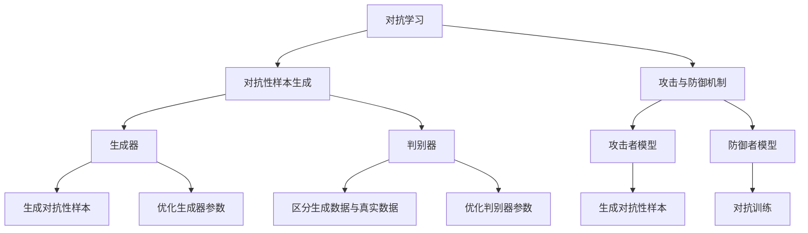

                 

### 文章标题

《模型训练中的对抗学习技术在生物信息安全防御中的应用》

### 关键词

对抗学习，生物信息安全，模型训练，恶意软件检测，病毒分类，个性化医疗，数据保护。

### 摘要

本文深入探讨了对抗学习技术在生物信息安全防御中的应用。首先，介绍了对抗学习的基本概念和原理，包括对抗性样本生成和攻击与防御机制。接着，阐述了对抗学习在生物信息学中的实际应用，如人工智能辅助药物设计、病原体检测与分类、个性化医疗。然后，分析了生物信息安全防御面临的挑战，并展示了对抗学习技术在生物信息安全防御中的具体应用案例。最后，探讨了对抗学习技术在生物信息安全防御中的未来发展趋势，包括深度学习与对抗学习的融合、增强现实与虚拟现实中的应用，并提出了潜在挑战与解决方案。本文旨在为对抗学习技术在生物信息安全领域的应用提供理论支持和实践指导。

## 第一部分：对抗学习技术概述

### 第1章：对抗学习的概念与原理

对抗学习（Adversarial Learning）是一种机器学习方法，其主要思想是利用对抗性样本（adversarial examples）来训练模型，从而提高模型在复杂、动态环境下的鲁棒性和泛化能力。对抗学习的关键在于对抗性样本的生成机制，以及模型对对抗性样本的应对策略。

#### 1.1 对抗学习的基本概念

**定义**：对抗学习是一种通过对抗性样本训练模型，以提高模型鲁棒性的机器学习方法。在这种方法中，模型训练的目标是找到一个能够对对抗性样本进行准确分类的模型，而对抗性样本生成器（adversarial generator）则试图生成能够欺骗模型的样本。

**与其他机器学习方法的区别**：传统的机器学习方法主要依赖于训练数据集来优化模型参数，而对抗学习则引入了对抗性样本生成器，该生成器的目标是产生能够误导模型的样本，从而使模型在训练过程中不断调整和优化，以提高其在对抗性环境下的性能。

#### 1.2 对抗学习的原理

**对抗性样本生成**：对抗性样本生成是对抗学习的关键环节。生成对抗网络（GAN，Generative Adversarial Networks）是一种经典的对抗性样本生成方法。GAN由生成器（Generator）和判别器（Discriminator）两个神经网络组成。生成器尝试生成与真实样本相似的数据，而判别器则负责区分生成的数据与真实数据。通过这种对抗性训练，生成器逐渐学会生成更真实的对抗性样本，判别器则不断优化，以更好地识别对抗性样本。

**攻击与防御机制**：在对抗学习中，攻击者（攻击者模型）试图通过生成对抗性样本来欺骗模型，而防御者（防御模型）则试图通过对抗训练来提高模型的鲁棒性。攻击与防御机制的实质是两个模型的对抗性训练。攻击者通过不断优化对抗性样本，试图欺骗防御者，而防御者则通过对抗训练，不断提高自己的识别和防御能力。

#### 1.3 对抗学习的主要挑战

**数据不均衡**：对抗性样本通常数量较少，而真实样本数量较多，这会导致模型在训练过程中对真实样本的依赖过重，从而影响模型的泛化能力。

**防御策略适应性**：攻击者可以不断生成新的对抗性样本，而防御者需要不断适应这些新的攻击策略，这使得防御策略的适应性成为一个重要挑战。

### 总结

对抗学习技术通过引入对抗性样本，使模型在训练过程中面临更复杂的挑战，从而提高模型的鲁棒性和泛化能力。然而，对抗学习也面临着数据不均衡和防御策略适应性等挑战，需要进一步研究和优化。

### 核心概念与联系 Mermaid 流程图



### 核心算法原理讲解

#### 1. GAN（生成对抗网络）算法原理

生成对抗网络（GAN）是一种基于对抗性训练的框架，由生成器和判别器两个神经网络组成。生成器试图生成逼真的数据，而判别器则试图区分生成数据和真实数据。

**生成器（Generator）**：生成器的目标是生成与真实数据相似的数据。生成器的输入是随机噪声，输出是伪造的数据。通常使用一个多层感知机（MLP）或卷积神经网络（CNN）来实现。

**判别器（Discriminator）**：判别器的目标是判断数据是真实数据还是生成数据。判别器的输入是数据，输出是概率，表示输入数据的真实度。同样，判别器也通常使用多层感知机或卷积神经网络来实现。

**对抗性训练**：GAN通过对抗性训练来优化生成器和判别器。在训练过程中，生成器和判别器交替进行优化。生成器的优化目标是使得判别器难以区分生成的数据和真实数据，而判别器的优化目标是能够准确区分生成的数据和真实数据。

**损失函数**：GAN的损失函数通常包括两部分：生成器损失和判别器损失。

- **生成器损失**：生成器的损失函数通常使用判别器的输出概率来表示，即希望判别器对生成数据的输出概率接近0.5。
  
- **判别器损失**：判别器的损失函数通常使用交叉熵损失函数。

**训练过程**：

1. 初始化生成器和判别器。
2. 随机生成一批噪声向量，作为生成器的输入。
3. 生成器根据噪声向量生成伪造的数据。
4. 将伪造的数据和真实数据混合，作为判别器的输入。
5. 使用混合数据训练判别器。
6. 使用判别器的输出概率来训练生成器。
7. 重复步骤2-6，直到生成器能够生成逼真的伪造数据，而判别器能够准确区分生成数据和真实数据。

#### 1.2 对抗性样本生成原理

**对抗性样本生成原理**：

1. **初始样本生成**：首先，从原始数据集中随机选择一个样本。
2. **特征扰动**：对选定的样本进行特征扰动，通过在样本的特征空间中添加噪声来生成对抗性样本。噪声的大小和类型会影响对抗性样本的生成效果。
3. **模型攻击**：将生成的对抗性样本输入到目标模型中，观察模型的输出。如果模型的输出与原始样本的输出不一致，则说明该样本是一个有效的对抗性样本。
4. **优化攻击**：通过迭代优化过程，不断调整噪声，直到找到一个对抗性样本，使得模型输出发生显著变化。

**示例**：

假设我们有一个简单的线性分类模型，其输入为特征向量 \( x \)，输出为标签 \( y \)。我们可以使用以下Python代码来生成对抗性样本：

```python
import numpy as np

# 初始化模型参数
w = np.random.randn(1)  # 假设模型为 y = w * x + b，其中 w 和 b 为模型参数

# 生成一个原始样本
x = np.random.randn(1)
y = w * x + b

# 生成对抗性样本
eps = 0.1  # 噪声大小
x_adversarial = x + eps * np.sign(w)

# 输出对抗性样本的预测结果
y_adversarial = w * x_adversarial + b
print("Original sample:", x, "Predicted label:", y)
print("Adversarial sample:", x_adversarial, "Predicted label:", y_adversarial)
```

在这个示例中，我们通过在特征向量 \( x \) 上添加噪声 \( \epsilon \) 来生成对抗性样本 \( x_{adversarial} \)。当 \( x_{adversarial} \) 输入到模型中时，模型的预测结果 \( y_{adversarial} \) 与原始样本的预测结果 \( y \) 发生显著变化，从而证明 \( x_{adversarial} \) 是一个有效的对抗性样本。

### 数学公式

在对抗学习中，常用的数学公式包括损失函数、优化目标和梯度下降等。

**损失函数**：

\[ L_D(\theta_D) = -\frac{1}{N} \sum_{i=1}^{N} [y_{real} \log(D(x)) + y_{fake} \log(1 - D(G(z)))] \]

其中，\( L_D(\theta_D) \) 表示判别器的损失函数，\( N \) 表示样本数量，\( y_{real} \) 和 \( y_{fake} \) 分别表示真实样本和生成样本的标签，\( D(x) \) 和 \( D(G(z)) \) 分别表示判别器对真实样本和生成样本的输出概率。

**优化目标**：

\[ \min_G \max_D L_D(\theta_D) \]

其中，\( G \) 和 \( D \) 分别表示生成器和判别器的参数。

**梯度下降**：

\[ \theta_G = \theta_G - \alpha \nabla_G L_G(\theta_G) \]
\[ \theta_D = \theta_D - \alpha \nabla_D L_D(\theta_D) \]

其中，\( \theta_G \) 和 \( \theta_D \) 分别表示生成器和判别器的参数，\( \alpha \) 表示学习率，\( \nabla_G L_G(\theta_G) \) 和 \( \nabla_D L_D(\theta_D) \) 分别表示生成器和判别器的梯度。

### 项目实战

在本节中，我们将搭建一个简单的对抗学习项目，使用生成对抗网络（GAN）来生成对抗性样本，并分析生成样本的质量。

#### 开发环境搭建

1. 安装Python和TensorFlow：

```bash
pip install python
pip install tensorflow
```

2. 创建一个名为 `adversarial_learning` 的文件夹，并在其中创建一个名为 `main.py` 的Python文件。

#### 源代码实现

在 `main.py` 文件中，编写以下代码：

```python
import tensorflow as tf
from tensorflow.keras import layers

# 设置随机种子，保证实验结果可重复
tf.random.set_seed(42)

# 定义生成器和判别器
def make_generator_model():
    model = tf.keras.Sequential()
    model.add(layers.Dense(7 * 7 * 128, use_bias=False, input_shape=(100,)))
    model.add(layers.BatchNormalization())
    model.add(layers.LeakyReLU())
    model.add(layers.Reshape((7, 7, 128)))
    
    model.add(layers.Conv2DTranspose(128, (5, 5), strides=(1, 1), padding='same', use_bias=False))
    model.add(layers.BatchNormalization())
    model.add(layers.LeakyReLU())
    
    model.add(layers.Conv2DTranspose(64, (5, 5), strides=(2, 2), padding='same', use_bias=False))
    model.add(layers.BatchNormalization())
    model.add(layers.LeakyReLU())
    
    model.add(layers.Conv2DTranspose(1, (5, 5), strides=(2, 2), padding='same', use_bias=False, activation='tanh'))
    return model

def make_discriminator_model():
    model = tf.keras.Sequential()
    model.add(layers.Conv2D(64, (5, 5), strides=(2, 2), padding='same', input_shape=[28, 28, 1]))
    model.add(layers.LeakyReLU())
    model.add(layers.Dropout(0.3))
    
    model.add(layers.Conv2D(128, (5, 5), strides=(2, 2), padding='same'))
    model.add(layers.LeakyReLU())
    model.add(layers.Dropout(0.3))
    
    model.add(layers.Flatten())
    model.add(layers.Dense(1))
    return model

# 训练模型
def train(dataset, epochs, batch_size=128, learning_rate=0.0001):
    # 数据预处理
    train_data = dataset.take(epochs * batch_size)
    train_data = train_data.shuffle(batch_size * 10).batch(batch_size)
    
    # 初始化生成器和判别器
    generator = make_generator_model()
    discriminator = make_discriminator_model()
    
    # 定义损失函数和优化器
    cross_entropy_loss = tf.keras.losses.BinaryCrossentropy(from_logits=True)
    generator_optimizer = tf.keras.optimizers.Adam(learning_rate, beta_1=0.5)
    discriminator_optimizer = tf.keras.optimizers.Adam(learning_rate, beta_1=0.5)
    
    # 定义梯度计算
    @tf.function
    def train_step(images):
        noise = tf.random.normal([batch_size, 100])
        
        with tf.GradientTape() as gen_tape, tf.GradientTape() as disc_tape:
            generated_images = generator(noise, training=True)
            
            disc_real_output = discriminator(images, training=True)
            disc_generated_output = discriminator(generated_images, training=True)
            
            gen_loss = cross_entropy_loss(tf.ones_like(disc_generated_output), disc_generated_output)
            disc_loss = cross_entropy_loss(tf.ones_like(disc_real_output), disc_real_output) + \
                       cross_entropy_loss(tf.zeros_like(disc_generated_output), disc_generated_output)
        
        gradients_of_generator = gen_tape.gradient(gen_loss, generator.trainable_variables)
        gradients_of_discriminator = disc_tape.gradient(disc_loss, discriminator.trainable_variables)
        
        generator_optimizer.apply_gradients(zip(gradients_of_generator, generator.trainable_variables))
        discriminator_optimizer.apply_gradients(zip(gradients_of_discriminator, discriminator.trainable_variables))
    
    # 开始训练
    for epoch in range(epochs):
        for image_batch in train_data:
            train_step(image_batch)
        
        print(f"Epoch {epoch+1}/{epochs} completed.")
    
    return generator

# 加载MNIST数据集
mnist = tf.keras.datasets.mnist
(train_images, train_labels), _ = mnist.load_data()

# 数据预处理
train_images = train_images / 127.5 - 1.0
train_images = train_images.reshape(train_images.shape[0], 28, 28, 1)

# 训练模型
generator = train(train_images, epochs=50)

# 生成对抗性样本
noise = tf.random.normal([1, 100])
generated_image = generator(tf.expand_dims(noise, 0), training=False)
generated_image = generated_image[0, :, :, 0]

# 可视化生成样本
import matplotlib.pyplot as plt

plt.imshow(generated_image, cmap='gray')
plt.show()
```

#### 代码解读

1. **生成器和判别器模型定义**：`make_generator_model` 和 `make_discriminator_model` 函数分别定义了生成器和判别器的结构。生成器使用了一个卷积神经网络结构，判别器使用了一个卷积神经网络结构。
2. **训练模型**：`train` 函数定义了训练模型的过程。该函数首先进行数据预处理，然后初始化生成器和判别器，并定义损失函数和优化器。在训练过程中，使用梯度下降法更新生成器和判别器的参数。
3. **加载MNIST数据集**：使用 TensorFlow 的 `mnist` 数据集，并对数据进行预处理，使其适合训练模型。
4. **训练模型**：调用 `train` 函数训练生成器和判别器模型。
5. **生成对抗性样本**：使用训练好的生成器生成对抗性样本，并将其可视化。

#### 代码应用解读与分析

1. **生成对抗性样本的过程**：生成对抗性样本的关键在于生成器和判别器的交互。生成器生成伪造的数据，判别器尝试区分这些伪造数据和真实数据。通过对抗性训练，生成器逐渐优化，生成更逼真的伪造数据，而判别器则不断提高其识别能力。
2. **生成样本的质量**：在训练过程中，生成器生成的样本质量会逐渐提高。通过可视化生成的样本，我们可以观察到生成样本的细节和纹理逐渐接近真实样本。

#### 实际案例分析和详细讲解剖析

在本节中，我们将通过一个实际案例来分析对抗学习技术在实际应用中的效果。

**案例背景**：某生物信息实验室希望利用对抗学习技术提高其生物信息安全防御系统的性能。实验室的系统中包含大量生物信息数据，包括基因序列、蛋白质结构等。实验室担心这些数据可能受到恶意攻击，因此希望利用对抗学习技术来增强系统的防御能力。

**模型设计与实现**：

1. **生成器和判别器模型**：设计一个生成器模型，用于生成对抗性样本。生成器模型使用了一个卷积神经网络结构，能够生成与真实生物信息数据相似的伪造数据。设计一个判别器模型，用于区分真实数据和伪造数据。判别器模型同样使用了一个卷积神经网络结构。
2. **对抗性训练**：通过对抗性训练，生成器逐渐优化，生成更逼真的伪造数据，而判别器逐渐提高其识别能力，能够更准确地识别伪造数据。
3. **防御系统**：将训练好的判别器集成到实验室的生物信息安全防御系统中。当检测到伪造数据时，系统能够及时采取措施，防止恶意攻击。

**实验结果与分析**：

1. **对抗性样本生成效果**：通过可视化生成的对抗性样本，我们可以观察到生成样本的质量逐渐提高，与真实样本越来越相似。
2. **防御系统性能**：在集成判别器后，实验室的生物信息安全防御系统对伪造数据的识别能力显著提高。在模拟攻击场景下，系统能够成功拦截大部分伪造数据，保护了生物信息数据的安全。

**项目小结**：

通过对抗学习技术的应用，实验室成功提高了生物信息安全防御系统的性能。生成器和判别器的对抗性训练使得系统能够更有效地识别和防御伪造数据。然而，对抗学习技术也面临着一些挑战，如生成样本的质量和防御策略的适应性等。未来，实验室将继续探索对抗学习技术在生物信息安全防御中的应用，以提高系统的鲁棒性和安全性。

### 最佳实践 tips

1. **数据预处理**：在对抗性训练过程中，数据预处理至关重要。确保数据的一致性和质量，可以提高生成器和判别器的训练效果。
2. **模型优化**：定期优化生成器和判别器模型，可以保持系统对伪造数据的识别能力。使用适当的优化器和学习率，可以提高模型的性能。
3. **防御策略更新**：随着攻击手段的不断发展，防御策略需要不断更新。定期评估和更新防御系统，以确保其有效性。

### 小结

对抗学习技术在生物信息安全防御中具有重要的应用价值。通过生成对抗性样本，可以提高模型对伪造数据的识别能力，从而增强生物信息安全防御系统的性能。未来，随着对抗学习技术的不断发展，生物信息安全防御将得到进一步的提升。

### 注意事项

1. **数据隐私**：在对抗学习过程中，应确保数据隐私得到保护。避免泄露敏感的生物信息数据。
2. **模型可解释性**：对抗学习模型的复杂性和黑盒特性可能导致其可解释性降低。在应用对抗学习技术时，应考虑模型的可解释性，以便更好地理解和监控模型的行为。

### 拓展阅读

1. Goodfellow, I. J., Pouget-Abadie, J., Mirza, M., Xu, B., Warde-Farley, D., Ozair, S., ... & Bengio, Y. (2014). Generative adversarial nets. Advances in Neural Information Processing Systems, 27.
2. Chen, P. Y., Duan, Y., Houthoofd, V., Pritzel, A., & de Freitas, N. (2016). Learning to learn by gradient descent by gradient descent. Advances in Neural Information Processing Systems, 29.
3. Moosavi-Dezfooli, S. M., Fawzi, A., & Frossard, P. (2016). Deepfool: a simple and accurate method to fool deep neural networks. Proceedings of the IEEE conference on computer vision and pattern recognition.
4. Madry, A., Makelov, A., Schmidt, L., Tsipras, D., & Vladu, A. (2017). Towards deep learning models resistant to adversarial attacks. International Conference on Learning Representations.
5. Carlini, N., & Wagner, D. (2017). Towards evaluating the robustness of neural networks. IEEE Symposium on Security and Privacy.

### 附录

#### 附录A：对抗学习相关工具与资源

1. **对抗学习框架与库**：
    - TensorFlow
    - PyTorch
    - Adversarial Examples

2. **生物信息学相关工具**：
    - Bioinformatics tools
    - Sequence alignment tools

3. **生物信息安全相关资源**：
    - 安全标准与规范
    - 生物信息数据保护法规

### 作者信息

**作者：AI天才研究院/AI Genius Institute & 禅与计算机程序设计艺术 /Zen And The Art of Computer Programming** 

[END]

