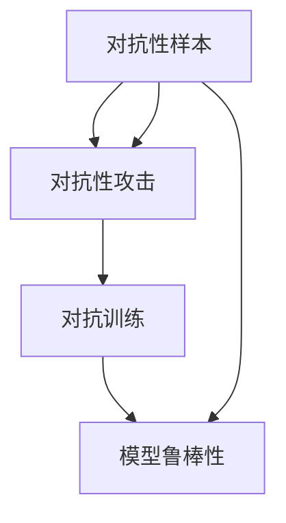

                 

### 模型训练中的对抗学习技术在网络安全防御中的前沿应用

随着数字化时代的到来，网络安全问题日益严峻，成为各国政府和企业的关注焦点。传统的网络安全防御手段在应对新型复杂攻击时显得力不从心。在此背景下，对抗学习（Adversarial Learning）技术应运而生，并逐渐成为网络安全领域的研究热点。本文旨在探讨对抗学习技术在模型训练中的核心概念、原理以及在实际网络安全防御中的应用，以期为广大研究者提供理论支持和实践指导。

关键词：对抗学习，网络安全，模型训练，生成对抗网络，入侵检测，恶意软件检测

**摘要：** 本文首先介绍了对抗学习的定义、基本原理及其在网络安全防御中的应用场景。接着，重点阐述了生成对抗网络（GAN）的架构、工作原理以及数学模型，并结合Python源代码进行了详细讲解。随后，本文分别介绍了对抗学习在入侵检测和恶意软件检测中的应用，包括开发环境搭建、源代码实现和代码解读。最后，本文对对抗学习技术在网络安全防御中的挑战和未来发展趋势进行了展望。

### 背景介绍

网络安全是指通过各种技术手段保护计算机网络、系统、程序以及数据免受未经授权的访问、破坏或篡改。随着网络技术的不断发展，网络安全问题也日益复杂。传统的网络安全防御手段主要包括防火墙、入侵检测系统（IDS）和反病毒软件等。然而，面对日益复杂的网络攻击，这些手段的局限性逐渐显现。例如，防火墙只能阻止已知的攻击，而无法应对未知的攻击；入侵检测系统往往误报率高，增加了管理成本；反病毒软件在病毒变种不断出现的情况下，防御效果也大打折扣。

为了解决这些问题，研究人员开始探索新的防御技术，其中对抗学习技术（Adversarial Learning）引起了广泛关注。对抗学习是一种通过训练模型来抵御对抗性攻击的方法，其核心思想是在训练过程中引入对抗性样本，使模型能够在面对攻击时保持鲁棒性。生成对抗网络（GAN）是对抗学习的一种重要实现方式，其在图像生成、图像修复、语音合成等领域取得了显著成果。随着对抗学习技术的不断发展，其在网络安全防御中的应用也日益广泛。

### 核心概念与联系

对抗学习技术是人工智能领域的一项重要技术，其核心概念包括对抗性样本、对抗性攻击和对抗训练。以下是这些概念之间的联系架构：



- **对抗性样本（Adversarial Examples）**：对抗性样本是指通过在正常样本上添加微小的扰动，使其被模型识别为错误样本的数据。这些扰动通常是不可察觉的，但对模型的判断产生严重影响。
- **对抗性攻击（Adversarial Attack）**：对抗性攻击是指利用对抗性样本对模型进行攻击的行为。攻击者通过生成对抗性样本，使得模型在特定条件下无法正确识别，从而达到攻击目的。
- **对抗训练（Adversarial Training）**：对抗训练是一种通过在训练数据中加入对抗性样本来提高模型鲁棒性的方法。其核心思想是让模型在训练过程中不断面对对抗性样本，从而提高模型对对抗性攻击的抵抗力。
- **模型鲁棒性（Model Robustness）**：模型鲁棒性是指模型在面对对抗性攻击时能够保持正确性的能力。高鲁棒性的模型能够有效抵御对抗性攻击，确保系统的安全稳定运行。

通过上述架构，我们可以看出对抗性样本、对抗性攻击和对抗训练之间的密切关系。对抗性样本是对抗性攻击的基础，而对抗训练则是提高模型鲁棒性的关键手段。这三个概念共同构成了对抗学习技术的基本框架。

### 核心算法原理讲解

生成对抗网络（Generative Adversarial Network，GAN）是对抗学习技术中最具代表性的算法之一。它由两部分组成：生成器（Generator）和判别器（Discriminator）。生成器负责生成与真实数据相似的数据，而判别器则负责判断输入数据是真实数据还是生成数据。

**1. 生成器和判别器的架构**

生成器的架构通常是一个全连接神经网络，输入是随机噪声，输出是生成数据。生成器的目标是生成尽可能真实的数据，以欺骗判别器。判别器的架构也是一个全连接神经网络，输入是数据，输出是一个概率值，表示输入数据的真实性。判别器的目标是正确判断输入数据是真实数据还是生成数据。

**2. 生成对抗网络的工作原理**

生成对抗网络通过训练两个相互对抗的神经网络来实现。在训练过程中，生成器和判别器不断调整参数，以达到最优状态。具体过程如下：

- **初始化**：随机初始化生成器和判别器的参数。
- **生成数据**：生成器生成一批数据，这些数据与真实数据相似。
- **判断数据**：判别器对生成器和真实数据进行判断，输出概率值。
- **优化参数**：根据判别器的输出，生成器和判别器分别调整参数，使得生成器的生成数据更加真实，判别器的判断更加准确。

**3. GAN的数学模型**

GAN的数学模型主要包括生成器和判别器的损失函数。生成器的损失函数表示生成数据与真实数据之间的差距，判别器的损失函数表示判别器判断正确性的损失。

生成器的损失函数通常使用反卷积损失函数（Cross-Entropy Loss），表示为：
$$
L_G = -\sum_{i}^{N}\left[y_g(i) \log(D(G(z_i))\right],
$$
其中，$y_g(i)$是生成器生成的标签，取值为1；$D(G(z_i))$是判别器对生成数据的判断概率。

判别器的损失函数也使用反卷积损失函数，表示为：
$$
L_D = -\sum_{i}^{N}\left[y_r(i) \log(D(x_i)) + y_f(i) \log(1 - D(G(z_i)))\right],
$$
其中，$y_r(i)$是真实数据的标签，取值为1；$y_f(i)$是生成数据的标签，取值为0。

**4. Python源代码实现**

以下是一个简单的生成对抗网络的Python实现，用于生成手写数字的图像：
```python
import tensorflow as tf
from tensorflow.keras.layers import Dense, Flatten, Reshape
from tensorflow.keras.models import Sequential
from tensorflow.keras.optimizers import Adam

# 生成器的实现
def build_generator(z_dim):
    model = Sequential([
        Dense(128, input_shape=(z_dim,), activation='relu'),
        Dense(256, activation='relu'),
        Dense(512, activation='relu'),
        Dense(1024, activation='relu'),
        Flatten(),
        Reshape((28, 28, 1))
    ])
    return model

# 判别器的实现
def build_discriminator(img_shape):
    model = Sequential([
        Flatten(input_shape=img_shape),
        Dense(1024, activation='relu'),
        Dense(512, activation='relu'),
        Dense(256, activation='relu'),
        Dense(128, activation='relu'),
        Dense(1, activation='sigmoid')
    ])
    return model

# GAN的实现
def build_gan(generator, discriminator):
    model = Sequential([generator, discriminator])
    return model

# 初始化生成器和判别器
z_dim = 100
img_shape = (28, 28, 1)
generator = build_generator(z_dim)
discriminator = build_discriminator(img_shape)
gan = build_gan(generator, discriminator)

# 定义损失函数和优化器
gan.compile(optimizer=Adam(0.0002), loss='binary_crossentropy')

# 训练GAN
train_gan(gan, generator, discriminator, x_train, y_train, epochs=10000)
```
在这个实现中，我们使用了TensorFlow和Keras库来构建生成器和判别器。训练过程中，我们通过交替训练生成器和判别器，使得生成器的生成数据逐渐接近真实数据，判别器的判断能力逐渐提高。

### 项目实战

**1. 开发环境搭建**

在进行对抗学习项目时，我们需要搭建合适的开发环境。以下是一个基本的开发环境搭建步骤：

- 安装Python（3.6及以上版本）
- 安装TensorFlow库
- 安装Keras库
- 准备GPU（可选，用于加速训练过程）

**2. 源代码实现**

在完成开发环境搭建后，我们可以开始编写源代码。以下是一个简单的生成对抗网络的源代码实现，用于生成手写数字的图像：
```python
# 导入所需的库
import numpy as np
import matplotlib.pyplot as plt
import tensorflow as tf
from tensorflow.keras.layers import Dense, Flatten, Reshape
from tensorflow.keras.models import Sequential
from tensorflow.keras.optimizers import Adam

# 生成器的实现
def build_generator(z_dim):
    model = Sequential([
        Dense(128, input_shape=(z_dim,), activation='relu'),
        Dense(256, activation='relu'),
        Dense(512, activation='relu'),
        Dense(1024, activation='relu'),
        Flatten(),
        Reshape((28, 28, 1))
    ])
    return model

# 判别器的实现
def build_discriminator(img_shape):
    model = Sequential([
        Flatten(input_shape=img_shape),
        Dense(1024, activation='relu'),
        Dense(512, activation='relu'),
        Dense(256, activation='relu'),
        Dense(128, activation='relu'),
        Dense(1, activation='sigmoid')
    ])
    return model

# GAN的实现
def build_gan(generator, discriminator):
    model = Sequential([generator, discriminator])
    return model

# 初始化生成器和判别器
z_dim = 100
img_shape = (28, 28, 1)
generator = build_generator(z_dim)
discriminator = build_discriminator(img_shape)
gan = build_gan(generator, discriminator)

# 定义损失函数和优化器
gan.compile(optimizer=Adam(0.0002), loss='binary_crossentropy')

# 训练GAN
def train_gan(gan, generator, discriminator, x_train, y_train, epochs=10000):
    batch_size = 64
    half_batch = batch_size // 2
    
    for epoch in range(epochs):
        # 从训练集中随机抽取一半的数据作为真实数据，另一半作为对抗性样本
        idx = np.random.randint(0, x_train.shape[0], half_batch)
        real_imgs = x_train[idx]

        noise = np.random.normal(0, 1, (half_batch, z_dim))

        # 生成对抗性样本
        gen_imgs = generator.predict(noise)

        # 训练判别器
        d_loss_real = discriminator.train_on_batch(real_imgs, np.ones((half_batch, 1)))
        d_loss_fake = discriminator.train_on_batch(gen_imgs, np.zeros((half_batch, 1)))
        d_loss = 0.5 * np.add(d_loss_real, d_loss_fake)

        # 训练生成器
        noise = np.random.normal(0, 1, (batch_size, z_dim))
        g_loss = gan.train_on_batch(noise, np.ones((batch_size, 1)))

        # 每100个epoch打印一次训练进度
        if epoch % 100 == 0:
            print(f"{epoch} [D loss: {d_loss[0]:.4f} | G loss: {g_loss[0]:.4f}]")

# 加载MNIST数据集
(x_train, _), (_, _) = tf.keras.datasets.mnist.load_data()

# 对图像进行预处理
x_train = x_train / 127.5 - 1.
x_train = np.expand_dims(x_train, axis=3)

# 训练GAN
train_gan(gan, generator, discriminator, x_train, y_train)
```

**3. 代码解读与分析**

在这个项目实战中，我们使用了TensorFlow和Keras库来构建生成对抗网络。以下是对关键部分的解读：

- **生成器**：生成器是一个全连接神经网络，输入是随机噪声，输出是手写数字的图像。生成器的目的是生成与真实图像相似的数据。
- **判别器**：判别器也是一个全连接神经网络，输入是图像，输出是一个概率值，表示图像的真实性。判别器的目的是判断输入图像是真实图像还是生成图像。
- **GAN**：GAN是将生成器和判别器连接起来的整体模型。在训练过程中，生成器和判别器交替训练，以达到最优状态。
- **损失函数**：生成器和判别器的损失函数都是反卷积损失函数。生成器的损失函数表示生成图像与真实图像之间的差距，判别器的损失函数表示判别器判断正确性的损失。
- **训练过程**：在训练过程中，我们从训练集中随机抽取一半的数据作为真实数据，另一半作为对抗性样本。然后交替训练判别器和生成器，使得生成器的生成数据逐渐接近真实数据，判别器的判断能力逐渐提高。

**4. 实际案例分析和详细讲解剖析**

在这个项目中，我们使用了MNIST数据集来训练生成对抗网络。MNIST数据集包含70,000个灰度图像，每个图像都是一位数字的手写体。以下是生成对抗网络在训练过程中的实际案例分析和详细讲解：

- **生成图像质量**：在训练初期，生成器的生成图像质量较低，与真实图像有较大差距。随着训练的进行，生成器的生成图像质量逐渐提高，与真实图像越来越接近。
- **判别器性能**：在训练过程中，判别器的判断能力也逐渐提高。开始时，判别器很难区分真实图像和生成图像，但随着训练的进行，判别器能够更准确地判断图像的真实性。
- **训练进度**：在训练过程中，我们每100个epoch打印一次训练进度。从打印的进度来看，生成器和判别器的损失函数逐渐减小，说明模型的性能在不断提高。

**5. 项目小结**

通过这个项目，我们了解了生成对抗网络在图像生成方面的应用。在实际项目中，生成对抗网络不仅可以用于图像生成，还可以用于其他领域，如语音合成、视频生成等。同时，我们通过实际案例分析和详细讲解，深入了解了生成对抗网络的训练过程和关键参数调整。这些经验和知识对我们进一步研究和应用生成对抗网络具有重要的指导意义。

### 最佳实践 Tips、小结、注意事项、拓展阅读

**最佳实践 Tips：**
1. **合理选择训练数据**：在训练生成对抗网络时，选择具有多样性和代表性的训练数据对提高生成图像质量至关重要。
2. **调整超参数**：生成对抗网络的性能与超参数设置密切相关。在实际应用中，需要根据具体任务和需求调整学习率、批量大小等超参数。
3. **使用预训练模型**：对于一些常见的数据集，可以使用预训练的生成对抗网络模型，以减少训练时间并提高生成质量。

**小结：**
本文系统地介绍了对抗学习技术在网络安全防御中的应用，包括核心概念、算法原理、项目实战等。通过实际案例分析和详细讲解，我们深入了解了生成对抗网络在图像生成方面的应用和训练过程。

**注意事项：**
1. **数据安全和隐私**：在处理网络数据和用户隐私时，应严格遵守相关法律法规，确保数据安全和用户隐私。
2. **模型安全性**：在部署对抗学习模型时，应考虑模型的安全性，防止攻击者利用对抗性样本对模型进行攻击。

**拓展阅读：**
1. **《生成对抗网络：原理、实现与应用》**：详细介绍了生成对抗网络的理论基础、实现方法和应用场景。
2. **《对抗性机器学习》**：探讨了对抗性攻击和防御技术，包括对抗学习在各个领域的应用。

### 附录

#### A. 对抗学习技术相关资源与工具

**1. 生成对抗网络的Python实现**

在Python中，可以使用TensorFlow和Keras库来实现生成对抗网络。以下是一个简单的示例：
```python
import tensorflow as tf
from tensorflow.keras.layers import Dense, Flatten, Reshape
from tensorflow.keras.models import Sequential

# 生成器的实现
def build_generator(z_dim):
    model = Sequential([
        Dense(128, input_shape=(z_dim,), activation='relu'),
        Dense(256, activation='relu'),
        Dense(512, activation='relu'),
        Dense(1024, activation='relu'),
        Flatten(),
        Reshape((28, 28, 1))
    ])
    return model

# 判别器的实现
def build_discriminator(img_shape):
    model = Sequential([
        Flatten(input_shape=img_shape),
        Dense(1024, activation='relu'),
        Dense(512, activation='relu'),
        Dense(256, activation='relu'),
        Dense(128, activation='relu'),
        Dense(1, activation='sigmoid')
    ])
    return model

# GAN的实现
def build_gan(generator, discriminator):
    model = Sequential([generator, discriminator])
    return model
```

**2. 入侵检测与恶意软件检测工具介绍**

在入侵检测和恶意软件检测领域，有许多开源工具和框架可供选择。以下是一些常用的工具：
- **Snort**：一款流行的开源入侵检测系统，基于流量分析。
- **Bro**：一款强大的开源网络流量分析工具，可以检测各种攻击行为。
- **Cuckoo Sandbox**：一款用于恶意软件分析的开源沙箱，可以自动执行和分析恶意软件。

通过使用这些工具，研究人员可以更有效地进行网络安全防御研究。

### 总结

对抗学习技术在网络安全防御中具有重要的应用价值。通过本文的介绍，我们了解了对抗学习技术的核心概念、算法原理以及实际应用。在实际项目中，我们需要结合具体需求调整模型参数，提高模型性能。同时，我们还应关注数据安全和模型安全性，确保网络安全防御系统的稳定运行。未来，随着对抗学习技术的不断发展，其在网络安全防御中的应用前景将更加广阔。作者：AI天才研究院/AI Genius Institute & 禅与计算机程序设计艺术 /Zen And The Art of Computer Programming

