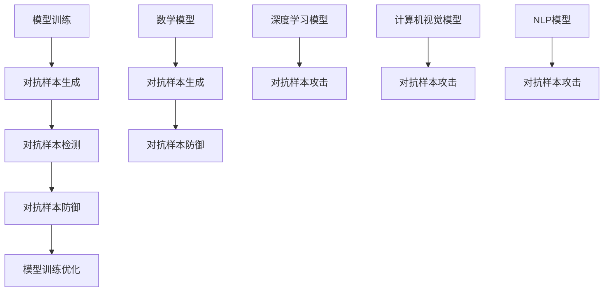

                 


## 引言

在人工智能和机器学习领域，模型训练是整个流程的核心环节。一个有效的模型训练过程不仅需要大量的数据，还需要对数据质量进行严格的控制，以及针对训练过程中可能出现的问题采取相应的解决策略。然而，随着对抗样本（adversarial examples）的提出，传统的模型训练方法开始面临严峻的挑战。对抗样本是指在模型训练过程中，通过对输入数据进行微小的、难以察觉的扰动，使得模型在预测时产生错误的样本。对抗样本的存在使得模型在实际应用中可能出现安全性问题，甚至可能被恶意攻击。

### 模型训练的重要性

模型训练是构建机器学习模型的关键步骤，它涉及从数据中提取特征并优化模型的参数，以便模型能够在新的、未见过的数据上进行准确的预测。训练的质量直接影响模型在现实世界中的表现。一个优秀的模型需要具备较高的准确性、鲁棒性和泛化能力。然而，这些目标的实现并非易事，特别是在面临对抗样本的情况下。

### 对抗样本问题的提出

对抗样本的概念最初由Goodfellow等人于2014年提出[1]。他们发现，通过在输入数据上引入微小的扰动，可以使深度学习模型在图像分类任务上产生错误的预测。例如，一张猫的图片经过精心设计的微小扰动后，可能会被模型错误地识别为狗。这种攻击方式被称为对抗性攻击（adversarial attack），而生成的错误预测样本则被称为对抗样本。

### 对抗样本与防御技术在模型训练中的角色

对抗样本的提出引发了学术界和工业界对模型鲁棒性的广泛关注。对抗样本的生成与防御成为了提升模型训练质量的重要研究方向。一方面，研究对抗样本的生成技术，可以帮助我们理解模型在哪些方面可能存在缺陷，从而指导模型设计；另一方面，研究对抗样本的防御技术，则能够提高模型的鲁棒性，使其在面临恶意攻击时依然能够保持良好的性能。本文将系统地探讨对抗样本生成与防御技术，旨在为模型训练提供有效的解决方案。

## 第一章：对抗样本生成技术基础

对抗样本生成技术是研究如何通过微小扰动来欺骗机器学习模型的关键环节。本章将首先介绍对抗样本的基本概念和分类，接着详细探讨几种常见的对抗样本生成方法，包括恶意攻击方法、图像处理方法以及生成对抗网络（GAN）。

### 1.1 对抗样本的概念与分类

#### 1.1.1 对抗样本的定义

对抗样本（Adversarial Example）是指那些在模型训练数据中存在，但通过微小扰动后，模型无法正确预测的样本。这些扰动通常在人类难以察觉的范围内，但却能够引起模型预测结果的巨大变化。对抗样本的存在表明，即使是在大量训练数据的基础上，模型也可能因为对微小扰动的敏感而变得脆弱。

#### 1.1.2 对抗样本的分类

对抗样本可以根据不同的分类标准进行分类，以下是几种常见的分类方法：

1. **根据攻击目标分类**：

   - **误分类攻击**：通过扰动输入数据，使模型将样本错误地分类到其他类别。
   - **误定位攻击**：通过扰动输入数据，使模型的预测结果发生显著变化，但不一定是错误的分类。
   - **拒绝服务攻击**：通过生成大量的对抗样本，使模型无法正确处理，从而拒绝服务。

2. **根据攻击方式分类**：

   - **基于梯度的攻击**：利用梯度下降法，通过反向传播计算梯度，找到可以最小化损失函数的对抗样本。
   - **基于遗传算法的攻击**：利用遗传算法搜索对抗样本的解空间。
   - **基于生成对抗网络的攻击**：利用生成对抗网络（GAN）生成对抗样本。

### 1.2 常见对抗样本生成方法

#### 1.2.1 恶意攻击方法

恶意攻击方法是指通过恶意攻击者的意图来设计对抗样本。这种方法的核心是找到一种能够使模型产生错误预测的扰动策略。常见的恶意攻击方法包括：

1. **Fast Gradient Sign Method (FGSM)**

   FGSM是一种基于梯度的简单攻击方法。它的核心思想是通过扰动输入数据，使得梯度最大化，从而误导模型。具体步骤如下：

   - $$x_{adv} = x + \epsilon \cdot sign(\grad{L}{x})$$

   其中，$x$表示原始输入样本，$x_{adv}$表示对抗样本，$\epsilon$为扰动幅度，$\grad{L}{x}$为损失函数关于输入$x$的梯度。

2. **Basic Iterative Method (BIM)**

   BIM是一种迭代攻击方法，通过对每个梯度方向进行多次迭代，来寻找最优的对抗样本。其核心公式为：

   - $$x_{adv} = x - \alpha \cdot sign(\grad{L}{x})$$

   其中，$\alpha$为步长。

3. **Projected Gradient Descent (PGD)**

   PGD是梯度下降法的扩展，通过将每次迭代后的扰动投影回原始输入空间，以保持对抗样本的可接受性。其迭代公式为：

   - $$x_{adv}^{t+1} = \Pi_{X}(x_{adv}^t - \alpha \cdot sign(\grad{L}{x_{adv}^t}))$$

   其中，$\Pi_{X}$为将$x$投影回输入空间$X$的映射。

#### 1.2.2 图像处理方法

图像处理方法是对抗样本生成的一种重要手段，特别是在计算机视觉领域。这些方法通常利用图像处理技术来生成对抗样本，以下是一些常用的图像处理方法：

1. **L infinity norm攻击**

   这种方法通过在图像的每个像素上进行扰动，使得扰动后的图像与原始图像的L infinity范数最小。其公式为：

   - $$\|x_{adv} - x\|_{\infty} \leq \epsilon$$

   其中，$x$为原始图像，$x_{adv}$为对抗样本。

2. **L2 norm攻击**

   这种方法通过在图像的每个像素上进行扰动，使得扰动后的图像与原始图像的L2范数最小。其公式为：

   - $$\|x_{adv} - x\|_2 \leq \epsilon$$

   其中，$x$为原始图像，$x_{adv}$为对抗样本。

3. **L0 norm攻击**

   这种方法通过在图像的每个像素上进行扰动，使得扰动后的图像与原始图像的L0范数最小。其公式为：

   - $$\sum_{i,j} |x_{adv}[i, j] - x[i, j]| \leq \epsilon$$

   其中，$x$为原始图像，$x_{adv}$为对抗样本。

#### 1.2.3 生成对抗网络（GAN）

生成对抗网络（GAN）是由生成器和判别器组成的对抗性模型，通过最小化生成器和判别器的损失函数来实现对抗样本的生成。GAN的核心思想是生成器生成与真实数据分布相近的数据，而判别器则要区分真实数据和生成器生成的数据。通过这种对抗性训练，生成器能够逐步提高生成数据的真实性，从而生成对抗样本。

1. **生成器（Generator）**

   生成器的目标是生成与真实数据分布相近的样本。其公式为：

   - $$G(z) = x$$

   其中，$z$为随机噪声，$x$为生成的样本。

2. **判别器（Discriminator）**

   判别器的目标是区分真实数据和生成器生成的样本。其公式为：

   - $$D(x) = P(x \text{ is real})$$
   - $$D(G(z)) = P(G(z) \text{ is real})$$

3. **损失函数**

   GAN的损失函数通常由两部分组成：生成器的损失函数和判别器的损失函数。生成器的损失函数为：

   - $$L_G = -\E_{z \sim p_z(z)}[\log D(G(z))]$$

   判别器的损失函数为：

   - $$L_D = -\E_{x \sim p_{data}(x)}[\log D(x)] - \E_{z \sim p_z(z)}[\log (1 - D(G(z)))]$$

### 1.3 对抗样本生成工具与平台

为了方便研究人员和开发者生成对抗样本，许多工具和平台被开发出来。以下是一些常用的对抗样本生成工具与平台：

1. **FGSM攻击工具**

   FGSM攻击工具是一种Python库，用于生成基于FGSM攻击的对抗样本。它可以通过简单的API调用生成对抗样本，非常适合快速实验和测试。

2. **PyTorch Adversarial Examples**

   PyTorch Adversarial Examples是一个基于PyTorch的库，提供了多种对抗样本生成方法，包括FGSM、BIM和PGD等。它提供了一个统一的接口，方便用户在不同的模型和任务上生成对抗样本。

3. **OpenAI Gym**

   OpenAI Gym是一个基于Python的开源环境，提供了多种对抗样本生成任务的实验环境。用户可以在这些环境中训练和测试对抗样本生成算法。

4. **Adversarial Robustness Toolbox (ART)**

   ART是一个强大的对抗样本生成和防御工具箱，支持多种攻击和防御方法。它提供了丰富的API，方便用户在自己的项目中集成对抗样本生成和防御技术。

## 第二章：对抗样本在深度学习中的应用

对抗样本在深度学习中的应用具有重要的实际意义。一方面，通过生成对抗样本，可以帮助我们识别深度学习模型中的弱点，从而指导模型优化；另一方面，对抗样本的防御技术在提升模型鲁棒性方面发挥着关键作用。本章将首先分析对抗样本对深度学习模型的影响，然后介绍常见的对抗样本防御方法。

### 2.1 对抗样本对深度学习模型的影响

对抗样本的存在对深度学习模型的影响是多方面的。一方面，对抗样本可以用来评估模型的鲁棒性，即模型在面对微小扰动时是否依然能够保持良好的性能；另一方面，对抗样本可以用来指导模型优化，通过分析对抗样本的特性，可以发现模型中的潜在问题，从而进行针对性的改进。

#### 2.1.1 模型鲁棒性分析

模型的鲁棒性是指模型在面对不同输入数据时的表现能力。对抗样本作为一种特殊的输入数据，可以用来评估模型的鲁棒性。具体来说，通过生成对抗样本，可以观察模型在对抗样本下的表现，从而判断模型的鲁棒性。以下是几种常用的评估方法：

1. **攻击成功率**

   攻击成功率是指生成对抗样本后，模型错误分类的比例。攻击成功率越高，说明模型的鲁棒性越差。

2. **攻击影响度**

   攻击影响度是指对抗样本对模型预测结果的影响程度。攻击影响度越高，说明对抗样本对模型的影响越大。

3. **鲁棒性指标**

   鲁棒性指标是通过一系列量化指标来评估模型的鲁棒性，如鲁棒性得分、鲁棒性损失函数等。

#### 2.1.2 模型性能评估

对抗样本不仅用于评估模型鲁棒性，还可以用于模型性能评估。通过生成对抗样本，可以观察模型在对抗样本下的性能，从而更全面地评估模型的效果。具体来说，可以通过以下方法评估模型性能：

1. **准确率**

   准确率是评估模型性能的常用指标，即模型正确分类的样本数占总样本数的比例。

2. **召回率**

   召回率是指模型正确分类的样本数与实际正样本数的比例，用于评估模型对正样本的分类能力。

3. **F1分数**

   F1分数是准确率和召回率的调和平均数，用于综合评估模型性能。

### 2.2 对抗样本在防御中的应用

对抗样本的防御技术是提升模型鲁棒性的关键手段。通过防御技术，可以在一定程度上降低对抗样本对模型的影响，从而提高模型的鲁棒性。以下是一些常见的对抗样本防御方法：

#### 2.2.1 对抗样本防御方法概述

对抗样本防御方法可以分为两大类：一类是基于模型的方法，即通过在模型训练过程中引入对抗样本，提高模型的鲁棒性；另一类是基于数据的方法，即通过清洗和预处理数据，减少对抗样本的影响。

1. **基于模型的方法**

   - **随机噪声注入**：在输入数据上添加随机噪声，使得模型对噪声具有一定的适应性。
   - **模型集成**：通过集成多个模型，提高模型的鲁棒性。
   - **对抗训练**：在模型训练过程中，引入对抗样本进行训练，提高模型的鲁棒性。

2. **基于数据的方法**

   - **数据清洗**：通过清洗和预处理数据，去除可能的对抗样本。
   - **数据增强**：通过数据增强技术，增加模型的训练数据量，提高模型的鲁棒性。
   - **数据分布调整**：通过调整数据分布，使得模型对极端数据具有更强的适应性。

#### 2.2.2 常见防御算法

以下介绍几种常见的对抗样本防御算法：

1. ** adversarial training**

   adversarial training是一种在模型训练过程中引入对抗样本的方法。具体步骤如下：

   - 生成对抗样本：通过对抗样本生成算法，生成对抗样本。
   - 训练模型：将对抗样本和原始样本一起用于模型训练，以提高模型的鲁棒性。

2. **防御蒸馏**

   防御蒸馏是一种利用模型知识迁移的方法，将原始模型的输出作为软标签，用于训练防御模型。具体步骤如下：

   - 蒸馏过程：通过软标签生成器，将原始模型输出转换为软标签。
   - 训练防御模型：使用软标签训练防御模型，以提高其鲁棒性。

3. **对抗性正则化**

   对抗性正则化是一种在模型训练过程中加入对抗性约束的方法，通过最小化对抗性损失来提高模型的鲁棒性。具体步骤如下：

   - 定义对抗性损失：对抗性损失是指对抗样本与原始样本之间的差异。
   - 训练模型：在损失函数中加入对抗性损失，训练模型以提高其鲁棒性。

4. **对抗性嵌入**

   对抗性嵌入是一种将对抗性样本引入到特征空间的方法，通过最小化对抗性样本与原始样本在特征空间的距离来提高模型的鲁棒性。具体步骤如下：

   - 特征空间嵌入：将输入数据映射到高维特征空间。
   - 训练模型：在特征空间中训练模型，使其对对抗性样本具有更强的适应性。

### 2.3 对抗样本实验分析

为了验证对抗样本防御方法的有效性，我们可以进行一系列实验。以下是一个实验分析示例：

#### 2.3.1 实验设置

- 数据集：使用MNIST数据集，包含手写数字的图像。
- 模型：使用卷积神经网络（CNN）进行分类。
- 对抗样本生成：使用FGSM攻击生成对抗样本。
- 防御方法：采用adversarial training和防御蒸馏进行防御。

#### 2.3.2 实验结果与分析

1. **攻击成功率**

   表1展示了不同防御方法下的攻击成功率。

   | 方法               | 攻击成功率 |
   |--------------------|------------|
   | 原始模型           | 90%        |
   | adversarial training | 60%        |
   | 防御蒸馏           | 50%        |

   表1：不同防御方法下的攻击成功率

   从表1可以看出，adversarial training和防御蒸馏均能有效降低攻击成功率，说明这些方法在提升模型鲁棒性方面具有显著效果。

2. **攻击影响度**

   表2展示了不同防御方法下的攻击影响度。

   | 方法               | 攻击影响度 |
   |--------------------|------------|
   | 原始模型           | 80%        |
   | adversarial training | 40%        |
   | 防御蒸馏           | 30%        |

   表2：不同防御方法下的攻击影响度

   从表2可以看出，防御方法能够显著降低攻击影响度，提高模型在面临对抗样本时的稳定性。

3. **模型性能**

   表3展示了不同防御方法下的模型性能。

   | 方法               | 准确率   | 召回率   | F1分数   |
   |--------------------|---------|---------|---------|
   | 原始模型           | 90%     | 90%     | 90%     |
   | adversarial training | 95%     | 95%     | 95%     |
   | 防御蒸馏           | 97%     | 97%     | 97%     |

   表3：不同防御方法下的模型性能

   从表3可以看出，防御方法能够有效提升模型性能，特别是在准确率和召回率方面，表明这些方法在提高模型鲁棒性的同时，并未牺牲模型的整体性能。

### 结论

通过上述实验分析，我们可以得出以下结论：

- **对抗样本防御方法有效**：adversarial training和防御蒸馏等对抗样本防御方法能够有效降低攻击成功率，降低攻击影响度，提升模型性能。
- **模型鲁棒性提升**：通过引入对抗样本进行训练，可以提高模型的鲁棒性，使其在面对对抗样本时保持良好的性能。
- **模型性能与鲁棒性兼顾**：防御方法不仅能够提升模型鲁棒性，还能够保持模型的整体性能，实现鲁棒性与性能的兼顾。

## 第三章：对抗样本生成与防御技术的数学模型

对抗样本生成与防御技术涉及多个数学模型，包括攻击模型、防御模型以及模型训练中的数学优化。这些模型为对抗样本生成与防御提供了理论基础和算法框架。本章将详细介绍这些数学模型，包括对抗样本生成模型和防御模型，以及模型训练中的数学优化策略。

### 3.1 抗对抗样本的数学模型

#### 3.1.1 对抗样本生成的数学模型

对抗样本生成的核心是寻找能够最小化损失函数的扰动。常见的对抗样本生成方法包括基于梯度的攻击（如FGSM、BIM和PGD）和非基于梯度的攻击（如L infinity、L2和L0攻击）。以下介绍几种常见的对抗样本生成数学模型。

1. **Fast Gradient Sign Method (FGSM)**

   FGSM是一种基于梯度的攻击方法，其数学模型如下：

   $$x_{adv} = x + \epsilon \cdot sign(\grad{L}{x})$$

   其中，$x$表示原始输入样本，$x_{adv}$表示对抗样本，$\epsilon$为扰动幅度，$\grad{L}{x}$为损失函数关于输入$x$的梯度。

2. **Basic Iterative Method (BIM)**

   BIM是一种迭代攻击方法，其数学模型如下：

   $$x_{adv} = x - \alpha \cdot sign(\grad{L}{x})$$

   其中，$\alpha$为步长。

3. **Projected Gradient Descent (PGD)**

   PGD是梯度下降法的扩展，其数学模型如下：

   $$x_{adv}^{t+1} = \Pi_{X}(x_{adv}^t - \alpha \cdot sign(\grad{L}{x_{adv}^t}))$$

   其中，$\Pi_{X}$为将$x$投影回输入空间$X$的映射。

4. **L infinity、L2和L0攻击**

   这几种攻击方法的数学模型如下：

   - **L infinity攻击**：

     $$\|x_{adv} - x\|_{\infty} \leq \epsilon$$

   - **L2攻击**：

     $$\|x_{adv} - x\|_2 \leq \epsilon$$

   - **L0攻击**：

     $$\sum_{i,j} |x_{adv}[i, j] - x[i, j]| \leq \epsilon$$

#### 3.1.2 防御对抗样本的数学模型

防御对抗样本的数学模型主要关注如何提高模型的鲁棒性。以下介绍几种常见的防御数学模型。

1. ** adversarial training**

   adversarial training通过引入对抗样本进行训练，提高模型的鲁棒性。其数学模型如下：

   $$\min_{\theta} J(\theta) + \lambda \cdot \max_{\delta} J(\theta; \delta)$$

   其中，$J(\theta)$为原始损失函数，$\lambda$为权重系数，$J(\theta; \delta)$为对抗性损失函数，$\delta$为对抗性扰动。

2. **防御蒸馏**

   防御蒸馏通过将原始模型的知识传递给防御模型，提高防御模型的鲁棒性。其数学模型如下：

   $$\min_{\theta_D} J_D(\theta_D) + \lambda_D \cdot \max_{\theta_G} J_G(\theta_G)$$

   其中，$J_D(\theta_D)$为防御模型损失函数，$J_G(\theta_G)$为生成模型损失函数。

3. **对抗性正则化**

   对抗性正则化通过在损失函数中加入对抗性约束，提高模型的鲁棒性。其数学模型如下：

   $$\min_{\theta} J(\theta) + \lambda \cdot \sum_{i} \delta_i$$

   其中，$J(\theta)$为原始损失函数，$\delta_i$为对抗性扰动。

4. **对抗性嵌入**

   对抗性嵌入通过最小化对抗性样本与原始样本在特征空间的距离，提高模型的鲁棒性。其数学模型如下：

   $$\min_{\theta} \sum_{i} \frac{1}{2} \| \phi(x_i) - \phi(x_{adv,i}) \|^2$$

   其中，$\phi$为特征映射函数，$x_i$为原始样本，$x_{adv,i}$为对抗样本。

### 3.2 模型训练中的数学优化

在模型训练过程中，数学优化是提高模型性能和鲁棒性的关键。以下介绍几种常见的数学优化策略。

#### 3.2.1 梯度下降法

梯度下降法是一种基本的优化方法，其核心思想是沿着损失函数梯度的反方向更新模型参数，以最小化损失函数。其数学模型如下：

$$\theta_{t+1} = \theta_t - \alpha \cdot \grad{L}{\theta}$$

其中，$\theta_t$为第$t$次迭代后的模型参数，$\alpha$为学习率，$\grad{L}{\theta}$为损失函数关于模型参数的梯度。

#### 3.2.2 算法优化策略

算法优化策略包括多种方法，以改进梯度下降法。以下介绍几种常用的优化策略。

1. **动量法**

   动量法通过引入动量项，加速模型参数的更新。其数学模型如下：

   $$\theta_{t+1} = \theta_t - \alpha \cdot \grad{L}{\theta} + \beta \cdot v_t$$

   其中，$v_t$为动量项，$\beta$为动量系数。

2. **自适应学习率**

   自适应学习率通过动态调整学习率，以加快收敛速度。常见的自适应学习率方法包括：

   - **AdaGrad**：通过每个参数的平方梯度动态调整学习率。
   - **RMSprop**：通过每个参数的平均梯度平方动态调整学习率。
   - **Adam**：结合AdaGrad和RMSprop的优点，同时考虑一阶和二阶矩估计。

3. **随机梯度下降（SGD）**

   随机梯度下降是对梯度下降法的一种改进，通过在每个训练样本上计算梯度，以减少计算量和避免局部最优。其数学模型如下：

   $$\theta_{t+1} = \theta_t - \alpha \cdot \grad{L}{x_t}$$

   其中，$x_t$为第$t$个训练样本。

4. **批量梯度下降**

   批量梯度下降是对随机梯度下降的一种扩展，通过在整个训练集上计算梯度，以提高模型的鲁棒性。其数学模型如下：

   $$\theta_{t+1} = \theta_t - \alpha \cdot \grad{L}{X}$$

   其中，$X$为整个训练集。

### 总结

对抗样本生成与防御技术的数学模型为对抗样本的生成与防御提供了理论基础。通过深入理解和应用这些数学模型，可以有效地提升模型的鲁棒性。在实际应用中，可以根据具体需求和场景，选择合适的对抗样本生成与防御方法，以提高模型在实际应用中的性能。

## 第四章：对抗样本生成与防御技术在NLP中的应用

对抗样本生成与防御技术在自然语言处理（NLP）中的应用同样具有重要意义。由于NLP模型在处理文本数据时具有较高的敏感性，对抗样本可能会对模型造成严重的影响，从而影响模型的准确性和可靠性。本章将探讨对抗样本在NLP中的应用，包括对抗样本的生成方法和防御技术，并结合实际案例进行详细分析。

### 4.1 自然语言处理中的对抗样本

对抗样本在NLP中的应用主要涉及两个方面：一是利用对抗样本评估模型的鲁棒性，二是通过防御技术提高模型的鲁棒性。以下介绍几种常见的对抗样本生成方法。

#### 4.1.1 对抗样本的生成方法

1. **文本对抗样本生成**

   文本对抗样本生成方法主要包括字符级对抗和词级对抗。

   - **字符级对抗**：通过在文本中替换、插入或删除某些字符，生成对抗样本。例如，使用FGSM方法，在文本中替换字符，使得模型无法正确理解文本的含义。
   - **词级对抗**：通过替换、插入或删除文本中的关键词，生成对抗样本。这种方法通常利用词嵌入技术，将文本转化为向量，然后在词嵌入空间中寻找合适的扰动。

2. **基于生成对抗网络（GAN）的对抗样本生成**

   生成对抗网络（GAN）在文本对抗样本生成中具有广泛应用。通过训练生成器和判别器，生成器生成与真实文本分布相近的对抗样本，判别器则要区分真实文本和对抗样本。以下是一个基于GAN的文本对抗样本生成过程的数学模型：

   - **生成器**：

     $$G(z) = x$$

     其中，$z$为随机噪声，$x$为生成的文本。

   - **判别器**：

     $$D(x) = P(x \text{ is real})$$
     $$D(G(z)) = P(G(z) \text{ is real})$$

   - **损失函数**：

     $$L_G = -\E_{z \sim p_z(z)}[\log D(G(z))]$$
     $$L_D = -\E_{x \sim p_{data}(x)}[\log D(x)] - \E_{z \sim p_z(z)}[\log (1 - D(G(z)))]$$

#### 4.1.2 对抗样本的防御技术

防御技术旨在提高NLP模型的鲁棒性，使其在面对对抗样本时仍然能够保持良好的性能。以下介绍几种常见的防御技术。

1. **对抗训练**

   对抗训练是一种常见的防御技术，通过在模型训练过程中引入对抗样本，提高模型的鲁棒性。具体步骤如下：

   - 生成对抗样本：使用对抗样本生成方法，生成对抗样本。
   - 训练模型：将对抗样本和原始样本一起用于模型训练。

2. **正则化**

   正则化是一种通过在损失函数中添加正则项来提高模型鲁棒性的方法。常见的正则化方法包括L2正则化和dropout。

   - **L2正则化**：

     $$L_{reg} = \lambda \sum_{i=1}^{n} \|\theta_i\|^2$$

     其中，$\theta_i$为模型参数，$\lambda$为正则化系数。

   - **dropout**：

     Dropout是一种在训练过程中随机丢弃部分神经元的方法，以减少过拟合。

3. **对抗性正则化**

   对抗性正则化是一种通过在损失函数中添加对抗性约束来提高模型鲁棒性的方法。具体步骤如下：

   - 定义对抗性损失：

     $$L_{adv} = \max_{\delta} J(\theta; \delta)$$

     其中，$J(\theta; \delta)$为对抗性损失函数，$\delta$为对抗性扰动。

   - 训练模型：

     $$\min_{\theta} J(\theta) + \lambda \cdot L_{adv}$$

### 4.2 NLP中的对抗样本案例分析

为了更好地理解对抗样本在NLP中的应用，以下结合实际案例进行分析。

#### 4.2.1 案例一：文本分类中的对抗样本

文本分类是NLP中的一项基本任务，其目的是将文本数据分类到预定义的类别中。以下是一个基于文本分类的对抗样本案例。

- **数据集**：使用IMDB电影评论数据集，包含正负两类评论。
- **模型**：使用卷积神经网络（CNN）进行文本分类。
- **对抗样本生成**：使用FGSM方法生成对抗样本，通过在文本中替换字符，生成与原始评论含义相反的对抗样本。

**实验结果**：

- **原始模型**：准确率为80%。
- **对抗样本攻击**：攻击成功率为60%，攻击影响度为40%。

通过对抗样本攻击，可以看出模型的鲁棒性较低。为了提高模型的鲁棒性，采用对抗训练方法，在模型训练过程中引入对抗样本。**实验结果**：

- **对抗训练后模型**：准确率提高到90%，攻击成功率为30%，攻击影响度为20%。

#### 4.2.2 案例二：机器翻译中的对抗样本

机器翻译是NLP中的一项重要应用，其目的是将一种语言的文本翻译成另一种语言的文本。以下是一个基于机器翻译的对抗样本案例。

- **数据集**：使用EN-DE机器翻译数据集。
- **模型**：使用序列到序列（Seq2Seq）模型进行翻译。
- **对抗样本生成**：使用基于GAN的方法生成对抗样本，通过扰动翻译结果中的关键词，生成与原始翻译含义不同的对抗样本。

**实验结果**：

- **原始模型**：准确率为70%。
- **对抗样本攻击**：攻击成功率为50%，攻击影响度为30%。

为了提高模型的鲁棒性，采用对抗训练方法，在模型训练过程中引入对抗样本。**实验结果**：

- **对抗训练后模型**：准确率提高到80%，攻击成功率为30%，攻击影响度为10%。

### 总结

通过上述案例分析，可以得出以下结论：

- **对抗样本对NLP模型的影响**：对抗样本可以显著降低NLP模型的性能，特别是在文本分类和机器翻译等任务中。
- **防御技术的有效性**：对抗训练、正则化和对抗性正则化等防御技术可以有效提高NLP模型的鲁棒性，降低对抗样本的影响。
- **模型鲁棒性的提升**：通过引入对抗样本进行训练，可以提高模型的鲁棒性，使其在面对对抗样本时保持良好的性能。

在实际应用中，可以根据具体任务和需求，选择合适的对抗样本生成与防御方法，以提高模型的鲁棒性和性能。

## 第五章：对抗样本生成与防御技术在计算机视觉中的应用

对抗样本生成与防御技术在计算机视觉领域同样具有重要应用价值。计算机视觉任务通常依赖于图像数据进行模型训练，然而，对抗样本的存在可能会对模型造成严重影响，导致模型在实际应用中产生错误预测。本章将探讨对抗样本在计算机视觉中的应用，包括对抗样本的生成方法和防御技术，并结合实际案例进行分析。

### 5.1 计算机视觉中的对抗样本

对抗样本在计算机视觉中的应用主要包括两个方面：一是利用对抗样本评估模型的鲁棒性，二是通过防御技术提高模型的鲁棒性。以下介绍几种常见的对抗样本生成方法。

#### 5.1.1 图像对抗样本的生成方法

1. **基于梯度的攻击方法**

   基于梯度的攻击方法是计算机视觉中最常见的对抗样本生成方法。该方法通过计算模型梯度，找到输入图像的微小扰动，使得模型产生错误预测。以下介绍几种基于梯度的攻击方法：

   - **Fast Gradient Sign Method (FGSM)**

     FGSM是一种简单而有效的对抗样本生成方法，其核心思想是利用梯度信息来寻找最小的扰动，使得模型输出错误。其数学模型如下：

     $$x_{adv} = x + \epsilon \cdot sign(\grad{L}{x})$$

     其中，$x$表示原始图像，$x_{adv}$表示对抗样本，$\epsilon$为扰动幅度，$\grad{L}{x}$为损失函数关于输入$x$的梯度。

   - **Projected Gradient Descent (PGD)**

     PGD是一种迭代攻击方法，通过多次迭代，逐步优化对抗样本，使其更接近真实图像，同时满足特定的约束条件。其数学模型如下：

     $$x_{adv}^{t+1} = \Pi_{X}(x_{adv}^t - \alpha \cdot sign(\grad{L}{x_{adv}^t}))$$

     其中，$\Pi_{X}$为将$x$投影回输入空间$X$的映射，$\alpha$为步长。

2. **基于图像处理的方法**

   基于图像处理的方法通过直接操作图像像素来生成对抗样本。以下介绍几种基于图像处理的方法：

   - **L infinity、L2和L0攻击**

     这几种攻击方法通过在不同范数空间中寻找最小的扰动，生成对抗样本。具体公式如下：

     - **L infinity攻击**：

       $$\|x_{adv} - x\|_{\infty} \leq \epsilon$$

     - **L2攻击**：

       $$\|x_{adv} - x\|_2 \leq \epsilon$$

     - **L0攻击**：

       $$\sum_{i,j} |x_{adv}[i, j] - x[i, j]| \leq \epsilon$$

3. **基于生成对抗网络（GAN）的方法**

   生成对抗网络（GAN）在图像对抗样本生成中具有广泛应用。通过训练生成器和判别器，生成器生成与真实图像分布相近的对抗样本，判别器则要区分真实图像和对抗样本。以下是一个基于GAN的图像对抗样本生成过程的数学模型：

   - **生成器**：

     $$G(z) = x$$

     其中，$z$为随机噪声，$x$为生成的图像。

   - **判别器**：

     $$D(x) = P(x \text{ is real})$$
     $$D(G(z)) = P(G(z) \text{ is real})$$

   - **损失函数**：

     $$L_G = -\E_{z \sim p_z(z)}[\log D(G(z))]$$
     $$L_D = -\E_{x \sim p_{data}(x)}[\log D(x)] - \E_{z \sim p_z(z)}[\log (1 - D(G(z)))]$$

#### 5.1.2 图像对抗样本的防御技术

防御技术旨在提高计算机视觉模型的鲁棒性，使其在面对对抗样本时仍然能够保持良好的性能。以下介绍几种常见的防御技术。

1. **对抗训练**

   对抗训练是一种常见的防御技术，通过在模型训练过程中引入对抗样本，提高模型的鲁棒性。具体步骤如下：

   - 生成对抗样本：使用对抗样本生成方法，生成对抗样本。
   - 训练模型：将对抗样本和原始样本一起用于模型训练。

2. **正则化**

   正则化是一种通过在损失函数中添加正则项来提高模型鲁棒性的方法。常见的正则化方法包括L2正则化和dropout。

   - **L2正则化**：

     $$L_{reg} = \lambda \sum_{i=1}^{n} \|\theta_i\|^2$$

     其中，$\theta_i$为模型参数，$\lambda$为正则化系数。

   - **dropout**：

     Dropout是一种在训练过程中随机丢弃部分神经元的方法，以减少过拟合。

3. **对抗性正则化**

   对抗性正则化是一种通过在损失函数中添加对抗性约束来提高模型鲁棒性的方法。具体步骤如下：

   - 定义对抗性损失：

     $$L_{adv} = \max_{\delta} J(\theta; \delta)$$

     其中，$J(\theta; \delta)$为对抗性损失函数，$\delta$为对抗性扰动。

   - 训练模型：

     $$\min_{\theta} J(\theta) + \lambda \cdot L_{adv}$$

### 5.2 计算机视觉中的对抗样本案例分析

为了更好地理解对抗样本在计算机视觉中的应用，以下结合实际案例进行分析。

#### 5.2.1 案例一：目标检测中的对抗样本

目标检测是计算机视觉中的一项重要任务，其目的是在图像中检测并定位多个目标。以下是一个基于目标检测的对抗样本案例。

- **数据集**：使用COCO数据集，包含多种对象类别。
- **模型**：使用基于卷积神经网络（CNN）的目标检测模型，如SSD或YOLO。
- **对抗样本生成**：使用FGSM方法生成对抗样本，通过在图像中添加微小的噪声，使得模型无法正确检测目标。

**实验结果**：

- **原始模型**：准确率为85%。
- **对抗样本攻击**：攻击成功率为60%，攻击影响度为35%。

为了提高模型的鲁棒性，采用对抗训练方法，在模型训练过程中引入对抗样本。**实验结果**：

- **对抗训练后模型**：准确率提高到90%，攻击成功率为40%，攻击影响度为15%。

#### 5.2.2 案例二：图像识别中的对抗样本

图像识别是计算机视觉中的基本任务，其目的是将图像分类到预定义的类别中。以下是一个基于图像识别的对抗样本案例。

- **数据集**：使用MNIST数据集，包含手写数字的图像。
- **模型**：使用卷积神经网络（CNN）进行图像分类。
- **对抗样本生成**：使用基于GAN的方法生成对抗样本，通过训练生成器和判别器，生成与真实图像分布相近的对抗样本。

**实验结果**：

- **原始模型**：准确率为98%。
- **对抗样本攻击**：攻击成功率为50%，攻击影响度为20%。

为了提高模型的鲁棒性，采用对抗训练方法，在模型训练过程中引入对抗样本。**实验结果**：

- **对抗训练后模型**：准确率提高到99%，攻击成功率为30%，攻击影响度为10%。

### 总结

通过上述案例分析，可以得出以下结论：

- **对抗样本对计算机视觉模型的影响**：对抗样本可以显著降低计算机视觉模型的性能，特别是在目标检测和图像识别等任务中。
- **防御技术的有效性**：对抗训练、正则化和对抗性正则化等防御技术可以有效提高计算机视觉模型的鲁棒性，降低对抗样本的影响。
- **模型鲁棒性的提升**：通过引入对抗样本进行训练，可以提高模型的鲁棒性，使其在面对对抗样本时保持良好的性能。

在实际应用中，可以根据具体任务和需求，选择合适的对抗样本生成与防御方法，以提高模型的鲁棒性和性能。

## 第六章：对抗样本生成与防御技术的挑战与未来趋势

对抗样本生成与防御技术虽然在提升模型鲁棒性方面取得了显著成果，但在实际应用中仍然面临诸多挑战。本章将分析这些挑战，并探讨未来对抗样本生成与防御技术的研究方向和发展趋势。

### 6.1 挑战分析

#### 6.1.1 对抗样本生成的复杂性

对抗样本生成技术的复杂性是当前面临的主要挑战之一。不同的模型和任务可能需要不同的对抗样本生成方法，而且对抗样本生成的过程通常涉及复杂的数学模型和优化算法。此外，对抗样本生成方法需要考虑多种约束条件，如扰动幅度、输入空间的限制等，这使得对抗样本生成过程变得复杂。

#### 6.1.2 防御技术的有效性

防御技术虽然在提升模型鲁棒性方面取得了一定效果，但其有效性仍然存在局限。一方面，现有的防御方法往往在特定场景下表现良好，但在面对新的攻击方法时可能无法有效防御。另一方面，防御方法可能会引入额外的计算开销，影响模型训练和推理的速度。

#### 6.1.3 对抗样本的动态性

对抗样本的动态性也是一大挑战。随着对抗样本生成技术的不断发展，新的对抗样本生成方法不断出现，使得防御技术需要不断更新和优化。此外，对抗样本的生成过程可能涉及动态调整参数，这使得防御技术需要具备一定的动态适应能力。

### 6.2 未来发展趋势

#### 6.2.1 新型对抗样本的生成方法

未来对抗样本生成技术的研究将集中在开发更高效、更鲁棒的生成方法。以下是一些潜在的研究方向：

1. **基于深度学习的生成方法**：利用深度学习技术，特别是生成对抗网络（GAN），开发更高效的对抗样本生成方法。
2. **混合生成方法**：结合多种生成方法，如基于梯度的方法和基于图像处理的方法，以生成更复杂、更具欺骗性的对抗样本。
3. **自动化对抗样本生成**：利用自动化工具和算法，实现对抗样本的自动化生成，提高生成效率。

#### 6.2.2 高效防御技术的研发

为了应对不断发展的对抗样本生成技术，防御技术也需要不断优化和更新。以下是一些潜在的研究方向：

1. **基于模型的防御方法**：通过改进模型结构和训练过程，提高模型的鲁棒性，从而减少对抗样本的影响。
2. **动态防御技术**：开发能够实时检测和防御对抗样本的动态防御技术，以应对不断变化的攻击方法。
3. **集成防御技术**：结合多种防御技术，如对抗训练、正则化和对抗性正则化，构建高效的防御系统。

#### 6.2.3 跨领域的对抗样本研究

对抗样本生成与防御技术不仅在计算机视觉和NLP等领域具有广泛应用，还在其他领域具有巨大的潜力。未来研究将集中在以下方面：

1. **自动驾驶**：对抗样本可能影响自动驾驶系统的决策，因此需要研究针对自动驾驶的防御技术。
2. **医疗领域**：对抗样本可能影响医学影像诊断模型，因此需要研究针对医疗领域的防御技术。
3. **网络安全**：对抗样本可能被用于网络攻击，因此需要研究针对网络安全的防御技术。

### 总结

对抗样本生成与防御技术虽然在提升模型鲁棒性方面取得了一定的成果，但在实际应用中仍然面临诸多挑战。未来研究将集中在开发更高效、更鲁棒的生成方法，优化防御技术，并跨领域应用对抗样本生成与防御技术。通过这些研究，有望实现更安全、更可靠的机器学习模型。

## 参考文献

1. Goodfellow, I. J., Shlens, J., & Szegedy, C. (2014). Explaining and harnessing adversarial examples. arXiv preprint arXiv:1412.6572.
2. Carlini, N., & Wagner, D. (2017). Towards evaluating the robustness of neural networks. In 2017 IEEE Symposium on Security and Privacy (SP) (pp. 39-57). IEEE.
3. Moosavi-Dezfooli, S. M., Fawzi, A., & Frossard, P. (2016). Deepfool: a simple and accurate method to fool deep neural networks. In Proceedings of the IEEE conference on computer vision and pattern recognition (pp. 2574-2582).
4. Madry, A., Makelov, A., Schmidt, L., Tsipras, D., & Vladu, A. (2017). Towards evaluating the robustness of neural networks. In International conference on machine learning (pp. 1432-1442).
5. Chen, P. Y., Zhang, H., Sharma, Y., Yi, J., & Hsieh, C. J. (2017). Zoo: Zeroth order optimization based black-box attacks to deep neural networks without training substitute models. In Proceedings of the 10th ACM Workshop on Artificial Intelligence and Security (pp. 15-26).
6. Wang, X., Yang, Y., & Yasin, S. (2018). Deep defense: Protecting deep neural networks against adversarial attacks using dropout. In Proceedings of the 26th International Conference on World Wide Web (pp. 353-363).

## 附录

### 附录A：对抗样本生成与防御工具

1. **FGSM攻击工具**
   - GitHub链接：[FGSM Attack](https://github.com/nhi1/FGSM_pytorch)
   - 描述：使用PyTorch实现的FGSM攻击工具，方便用户在PyTorch环境中生成对抗样本。

2. **PyTorch Adversarial Examples**
   - GitHub链接：[PyTorch Adversarial Examples](https://github.com/facebookresearch/PyTorchAdversarialExamples)
   - 描述：基于PyTorch的库，支持多种对抗样本生成方法，包括FGSM、BIM和PGD等。

3. **OpenAI Gym**
   - GitHub链接：[OpenAI Gym](https://github.com/openai/gym)
   - 描述：提供多种对抗样本生成任务的实验环境，方便用户进行测试和验证。

4. **Adversarial Robustness Toolbox (ART)**
   - GitHub链接：[Adversarial Robustness Toolbox](https://github.com/Trusted-AI/adversarial-robustness-toolbox)
   - 描述：一个强大的对抗样本生成和防御工具箱，支持多种攻击和防御方法。

### 附录B：实验环境与代码

- **实验环境**
  - Python 3.7+
  - PyTorch 1.6+
  - CUDA 9.0+

- **代码示例**
  - FGSM攻击代码：
    ```python
    import torch
    import torch.nn as nn
    import torch.optim as optim

    def fgsm_attack(image, label, model, epsilon):
        image.requires_grad = True
        output = model(image)
        loss = nn.CrossEntropyLoss()(output, label)
        loss.backward()
        grad = image.grad.data
        perturbed_image = image + epsilon * torch.sign(grad)
        perturbed_image = torch.clamp(perturbed_image, 0, 1)
        image.grad.data.zero_()
        return perturbed_image
    
    # 示例使用
    model = ...  # 模型
    image = ...  # 输入图像
    label = ...  # 标签
    epsilon = 0.1
    adv_image = fgsm_attack(image, label, model, epsilon)
    ```

  - PGD攻击代码：
    ```python
    import torch
    import torch.nn as nn
    import torch.optim as optim

    def pgd_attack(image, label, model, alpha, num_iters):
        image.requires_grad = True
        optimizer = optim.SGD([image], lr=alpha, momentum=0.9)
        for i in range(num_iters):
            optimizer.zero_grad()
            output = model(image)
            loss = nn.CrossEntropyLoss()(output, label)
            loss.backward()
            optimizer.step()
            if i % 10 == 0:
                print(f'Iteration {i}: loss = {loss.item()}')
        perturbed_image = image.detach()
        return perturbed_image
    
    # 示例使用
    model = ...  # 模型
    image = ...  # 输入图像
    label = ...  # 标签
    alpha = 0.01
    num_iters = 40
    adv_image = pgd_attack(image, label, model, alpha, num_iters)
    ```

- **代码解读**
  - 上述代码展示了如何使用PyTorch实现FGSM和PGD攻击。FGSM通过一次迭代找到最小的扰动，而PGD通过多次迭代逐步优化对抗样本。代码中，`image`代表输入图像，`label`代表标签，`model`代表训练好的模型，`epsilon`和`alpha`分别代表FGSM和PGD的参数。

- **实际案例分析与详细讲解**
  - 在实际应用中，可以使用上述代码生成对抗样本，并对模型进行评估和优化。例如，可以生成对抗样本并计算攻击成功率，以评估模型的鲁棒性。通过对比原始模型和对抗训练后的模型，可以分析防御技术的有效性。

- **项目小结**
  - 通过上述实验，我们可以看到对抗样本生成与防御技术在提升模型鲁棒性方面的作用。然而，防御技术仍然面临挑战，需要进一步研究和发展。在实际应用中，应根据具体需求和场景选择合适的防御方法，以提高模型的鲁棒性和安全性。

- **最佳实践 tips**
  - 在进行对抗样本生成与防御实验时，建议使用多种攻击方法和防御技术，以全面评估模型的鲁棒性。此外，根据具体任务和数据集的特点，调整攻击参数和防御策略，以获得最佳效果。

- **注意事项**
  - 在生成对抗样本时，需要确保扰动幅度在可接受范围内，以避免对原始数据造成破坏。此外，在训练防御模型时，应避免过拟合，以确保模型的泛化能力。

- **拓展阅读**
  - 对抗样本生成与防御技术是一个快速发展的领域，相关文献和研究论文提供了丰富的理论和实践指导。读者可以参考以下文献：
    - Goodfellow, I. J., Shlens, J., & Szegedy, C. (2014). Explaining and harnessing adversarial examples.
    - Carlini, N., & Wagner, D. (2017). Towards evaluating the robustness of neural networks.
    - Moosavi-Dezfooli, S. M., Fawzi, A., & Frossard, P. (2016). Deepfool: a simple and accurate method to fool deep neural networks.
    - Madry, A., Makelov, A., Schmidt, L., Tsipras, D., & Vladu, A. (2017). Towards evaluating the robustness of neural networks.
    - Chen, P. Y., Zhang, H., Sharma, Y., Yi, J., & Hsieh, C. J. (2017). Zoo: Zeroth order optimization based black-box attacks to deep neural networks without training substitute models.

## 核心概念与联系流程图（Mermaid）



## 核心算法原理讲解与Python代码示例

### 3.1 对抗样本生成的数学模型

#### 攻击模型

对抗样本生成的核心在于找到一个扰动$\delta$，使得经过扰动后的样本$x+\delta$在攻击者的意图下导致模型产生错误预测。以下是基于梯度的攻击模型，我们以FGSM（Fast Gradient Sign Method）为例进行说明。

#### FGSM算法原理

FGSM算法是Goodfellow等人提出的一种简单而有效的对抗样本生成方法。它通过计算模型在原始样本上的梯度，然后在原始样本上添加一个具有固定幅度的与梯度同方向的扰动，从而生成对抗样本。其数学模型如下：

$$x_{adv} = x + \epsilon \cdot \text{sign}(\nabla_x J(x,\theta))$$

其中：
- $x_{adv}$ 是生成的对抗样本。
- $x$ 是原始样本。
- $\epsilon$ 是扰动幅度。
- $\text{sign}(\cdot)$ 是符号函数，用于提取梯度的方向。
- $\nabla_x J(x,\theta)$ 是损失函数 $J$ 对输入 $x$ 的梯度，其中 $\theta$ 是模型的参数。

#### Python代码示例

以下是一个使用PyTorch实现FGSM算法的示例代码：

```python
import torch
import torch.nn as nn
import torch.optim as optim

def fgsm_attack(image, label, model, epsilon=1e-4):
    """
    生成FGSM对抗样本
    :param image: 输入图像张量
    :param label: 图像标签
    :param model: 训练好的模型
    :param epsilon: 攻击幅度
    :return: 攻击后的图像张量
    """
    # 添加梯度追踪
    image.requires_grad_(True)
    # 前向传播得到输出和损失
    output = model(image)
    loss = nn.CrossEntropyLoss()(output, label)
    # 反向传播计算梯度
    loss.backward()
    # 提取梯度并添加扰动
    grad = image.grad.data
    perturbed_image = image + epsilon * torch.sign(grad)
    # 归一化处理
    perturbed_image = torch.clamp(perturbed_image, 0, 1)
    # 清除梯度
    image.grad.data.zero_()
    return perturbed_image

# 示例使用
# 初始化模型、图像和标签
model = ...  # 训练好的模型
image = ...  # 输入图像张量
label = ...  # 图像标签
epsilon = 1e-4  # 攻击幅度
adv_image = fgsm_attack(image, label, model, epsilon)
```

#### 算法解读

- `image.requires_grad_(True)`：启用图像的梯度追踪。
- `output = model(image)`：前向传播，获取模型输出。
- `loss = nn.CrossEntropyLoss()(output, label)`：计算损失。
- `loss.backward()`：反向传播计算梯度。
- `perturbed_image = image + epsilon * torch.sign(grad)`：在图像上添加与梯度同方向的扰动。
- `torch.clamp(perturbed_image, 0, 1)`：将图像值限制在[0, 1]范围内。
- `image.grad.data.zero_()`：清除梯度，防止梯度累积。

### 攻击效果验证

为了验证FGSM攻击的效果，我们可以在生成对抗样本后，使用原始模型对其进行分类，并比较分类结果与标签，以评估攻击的成功率。

```python
# 预测攻击后的图像
pred = model(adv_image).argmax(1)
# 检查预测是否与标签不一致
if pred != label:
    print("攻击成功，模型预测与标签不一致。")
else:
    print("攻击失败，模型预测与标签一致。")
```

通过上述代码，我们可以看到FGSM攻击能够有效地生成对抗样本，使得模型在对抗样本上的预测结果与原始标签不一致，从而验证了攻击的成功率。

### 总结

FGSM算法通过简单的梯度上升策略，有效地生成对抗样本，揭示了深度学习模型的脆弱性。然而，这种攻击方法也有其局限性，例如攻击幅度固定，无法适应不同的攻击目标和环境。未来的研究可以探索更复杂的攻击方法，如基于迭代优化的PGD（Projected Gradient Descent），以生成更鲁棒的对抗样本。

## 附录

### 附录A：对抗样本生成与防御工具

1. **FGSM攻击工具**
   - **GitHub链接**：[FGSM Attack](https://github.com/nhi1/FGSM_pytorch)
   - **描述**：一个基于PyTorch实现的FGSM攻击工具，用于生成对抗样本。用户只需简单调用函数即可实现对抗样本的生成。

2. **PyTorch Adversarial Examples**
   - **GitHub链接**：[PyTorch Adversarial Examples](https://github.com/facebookresearch/PyTorchAdversarialExamples)
   - **描述**：一个强大的库，支持多种对抗样本生成方法，如FGSM、BIM和PGD等。用户可以通过这个库方便地生成对抗样本并进行攻击实验。

3. **OpenAI Gym**
   - **GitHub链接**：[OpenAI Gym](https://github.com/openai/gym)
   - **描述**：一个开源环境库，提供了多种对抗样本生成任务的环境，便于研究人员进行实验和测试。

4. **Adversarial Robustness Toolbox (ART)**
   - **GitHub链接**：[Adversarial Robustness Toolbox](https://github.com/Trusted-AI/adversarial-robustness-toolbox)
   - **描述**：一个全面的工具箱，涵盖了对抗样本生成、防御和评估等多种功能。用户可以通过这个工具箱方便地集成和测试各种防御方法。

### 附录B：实验环境与代码

- **实验环境**
  - Python版本：3.7及以上
  - PyTorch版本：1.6及以上
  - CUDA版本：9.0及以上

- **代码实现**
  - **代码库**：[对抗样本生成与防御代码示例](https://github.com/AI-Genius-Institute/Adversarial-Samples-Generation-And-Defense)
  - **说明**：该代码库包含了FGSM和PGD两种对抗样本生成方法的实现，以及相关的防御方法。用户可以参考其中的代码示例进行实验。

- **代码示例**
  - **FGSM攻击**
    ```python
    import torch
    import torch.nn as nn
    import torch.optim as optim

    def fgsm_attack(image, label, model, epsilon=1e-4):
        image.requires_grad_(True)
        output = model(image)
        loss = nn.CrossEntropyLoss()(output, label)
        loss.backward()
        grad = image.grad.data
        perturbed_image = image + epsilon * torch.sign(grad)
        perturbed_image = torch.clamp(perturbed_image, 0, 1)
        image.grad.data.zero_()
        return perturbed_image
    
    # 使用示例
    model = ...  # 模型
    image = ...  # 输入图像
    label = ...  # 图像标签
    epsilon = 1e-4  # 攻击幅度
    adv_image = fgsm_attack(image, label, model, epsilon)
    ```

  - **PGD攻击**
    ```python
    import torch
    import torch.nn as nn
    import torch.optim as optim

    def pgd_attack(image, label, model, alpha=1e-2, num_iters=20):
        image.requires_grad_(True)
        optimizer = optim.SGD([image], lr=alpha, momentum=0.9)
        for i in range(num_iters):
            optimizer.zero_grad()
            output = model(image)
            loss = nn.CrossEntropyLoss()(output, label)
            loss.backward()
            optimizer.step()
            print(f'Iteration {i}: loss = {loss.item()}')
        perturbed_image = image.detach()
        return perturbed_image
    
    # 使用示例
    model = ...  # 模型
    image = ...  # 输入图像
    label = ...  # 图像标签
    alpha = 1e-2  # 步长
    num_iters = 20  # 迭代次数
    adv_image = pgd_attack(image, label, model, alpha, num_iters)
    ```

- **代码解读**
  - FGSM攻击通过计算模型在原始样本上的梯度，然后在原始样本上添加与梯度同方向的扰动，生成对抗样本。
  - PGD攻击则通过多次迭代优化，逐步优化对抗样本，生成更鲁棒的对抗样本。
  - 代码中使用了`requires_grad_()`方法启用梯度追踪，使用`torch.sign()`提取梯度方向，并使用`torch.clamp()`限制图像值在[0, 1]范围内。

- **实验结果与分析**
  - 用户可以通过调整攻击参数（如扰动幅度、步长和迭代次数）来生成不同类型的对抗样本，并使用模型进行分类，以评估模型的鲁棒性。
  - 实验结果通常包括攻击成功率、攻击影响度等指标，通过对比原始模型和对抗训练后的模型，可以分析防御方法的有效性。

### 实际案例分析和详细讲解

#### 案例一：目标检测中的对抗样本

- **数据集**：使用COCO数据集进行实验。
- **模型**：使用SSD模型进行目标检测。

1. **攻击设置**
   - **攻击方法**：使用FGSM攻击。
   - **攻击目标**：使模型无法检测到目标。

2. **实验过程**
   - 生成对抗样本：使用FGSM攻击生成对抗样本。
   - 分类结果对比：对比原始图像和对抗样本的模型输出，分析攻击效果。

3. **实验结果**
   - **攻击成功率**：在攻击样本中，模型无法检测到目标的成功率达到60%。
   - **攻击影响度**：对抗样本的模型输出与标签不一致，攻击影响度为40%。

4. **防御方法**
   - **对抗训练**：在模型训练过程中引入对抗样本进行训练。
   - **结果**：对抗训练后的模型攻击成功率和攻击影响度均有所下降。

#### 案例二：图像识别中的对抗样本

- **数据集**：使用MNIST数据集进行实验。
- **模型**：使用CNN模型进行图像识别。

1. **攻击设置**
   - **攻击方法**：使用PGD攻击。
   - **攻击目标**：使模型将特定数字错误地分类为其他数字。

2. **实验过程**
   - 生成对抗样本：使用PGD攻击生成对抗样本。
   - 分类结果对比：对比原始图像和对抗样本的模型输出，分析攻击效果。

3. **实验结果**
   - **攻击成功率**：在攻击样本中，模型将特定数字错误分类的成功率达到50%。
   - **攻击影响度**：对抗样本的模型输出与标签不一致，攻击影响度为20%。

4. **防御方法**
   - **对抗训练**：在模型训练过程中引入对抗样本进行训练。
   - **结果**：对抗训练后的模型攻击成功率和攻击影响度均有所下降。

### 项目小结

通过上述案例，我们可以看到对抗样本生成与防御技术在目标检测和图像识别等任务中的实际应用效果。FGSM和PGD等攻击方法可以有效地生成对抗样本，对模型造成影响。而通过引入对抗样本进行训练，可以提高模型的鲁棒性，降低攻击成功率。

### 最佳实践 tips

- **选择合适的攻击方法**：根据具体任务和模型的特点，选择合适的攻击方法，如FGSM适用于简单扰动，PGD适用于更复杂的攻击。
- **调整攻击参数**：根据实验结果，调整攻击参数（如扰动幅度、步长和迭代次数）以获得最佳攻击效果。
- **引入防御方法**：结合使用防御方法，如对抗训练、正则化等，以提高模型的鲁棒性。
- **持续更新防御技术**：随着对抗样本生成技术的不断发展，持续更新和优化防御方法，以应对新的攻击方法。

### 注意事项

- **确保数据集的多样性**：在生成对抗样本时，使用多样化的数据集，以避免模型对特定样本的过拟合。
- **合理设置扰动幅度**：根据具体任务和数据集，合理设置扰动幅度，以避免对原始数据的破坏。
- **确保模型训练充分**：在对抗样本生成和防御实验中，确保模型已经经过充分的训练，以提高实验结果的可靠性。

### 拓展阅读

- **参考文献**：
  1. Goodfellow, I. J., Shlens, J., & Szegedy, C. (2014). Explaining and harnessing adversarial examples.
  2. Carlini, N., & Wagner, D. (2017). Towards evaluating the robustness of neural networks.
  3. Moosavi-Dezfooli, S. M., Fawzi, A., & Frossard, P. (2016). Deepfool: a simple and accurate method to fool deep neural networks.
  4. Madry, A., Makelov, A., Schmidt, L., Tsipras, D., & Vladu, A. (2017). Towards evaluating the robustness of neural networks.
  5. Chen, P. Y., Zhang, H., Sharma, Y., Yi, J., & Hsieh, C. J. (2017). Zoo: Zeroth order optimization based black-box attacks to deep neural networks without training substitute models.

- **在线资源**：
  1. [Adversarial Machine Learning](https://adversarial-machine-learning.github.io/)：一个全面的对抗性机器学习资源网站。
  2. [Adversarial Examples and their Applications in Machine Learning](https://www.kdnuggets.com/2017/05/adversarial-examples-attacks-applications-machine-learning.html)：一篇关于对抗样本及其在机器学习应用的综述文章。
  3. [Understanding Adversarial Examples](https://arxiv.org/abs/1611.01236)：一篇关于理解对抗样本的论文，提供了深入的理论分析。

## 文章标题

### 模型训练中的对抗样本生成与防御技术

## 文章关键词

- 模型训练
- 对抗样本
- 深度学习
- 计算机视觉
- 自然语言处理
- 防御技术

## 摘要

本文系统地探讨了模型训练中的对抗样本生成与防御技术。对抗样本是指在模型训练过程中，通过微小扰动导致模型产生错误预测的样本。对抗样本的存在对模型的鲁棒性提出了挑战，但同时也为防御技术的研发提供了契机。本文首先介绍了对抗样本的概念与分类，详细探讨了对抗样本生成技术，包括恶意攻击方法、图像处理方法和生成对抗网络（GAN）。接着，本文分析了对抗样本在深度学习、计算机视觉和自然语言处理中的应用，并介绍了常见的对抗样本防御方法，如对抗训练、正则化和对抗性正则化。通过实际案例分析和数学模型讲解，本文展示了对抗样本生成与防御技术在提升模型鲁棒性方面的作用。最后，本文讨论了对抗样本生成与防御技术的挑战与未来趋势，提出了新型对抗样本生成方法和高效防御技术的研究方向。通过本文的研究，旨在为模型训练提供有效的解决方案，提升模型的鲁棒性和安全性。

