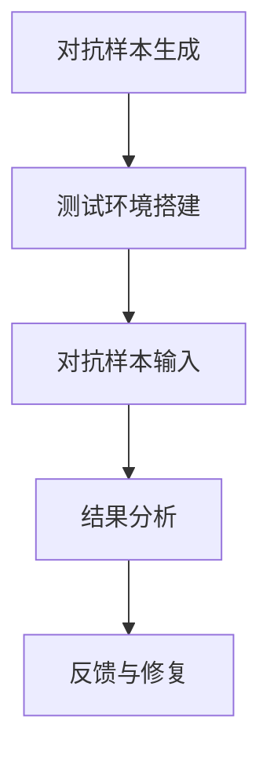
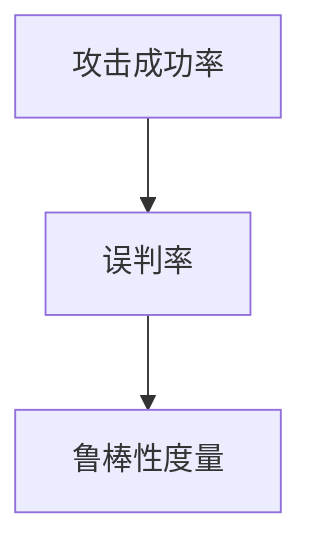

                 

### 第1章 引言与背景

#### 1.1 书籍主题概述

《模型训练中的对抗样本生成在AI系统鲁棒性测试中的前沿应用》旨在探讨对抗样本生成技术在人工智能（AI）系统鲁棒性测试中的应用。随着深度学习的广泛应用，AI系统在图像识别、语音识别、自然语言处理等领域取得了显著成果。然而，这些AI系统在面临对抗样本攻击时表现出的脆弱性，引发了学术界和工业界对AI系统鲁棒性的广泛关注。

本书的主要目标是介绍对抗样本生成技术的基本概念、原理和实现方法，并深入分析对抗样本在AI系统鲁棒性测试中的应用。通过探讨对抗样本生成技术在AI系统鲁棒性测试中的前沿应用，本书旨在为研究者、工程师和开发者提供有价值的参考，帮助他们更好地理解和应对AI系统中的鲁棒性挑战。

#### 1.2 AI系统鲁棒性测试的重要性

AI系统的鲁棒性测试是确保AI系统在实际应用中能够稳定、可靠运行的重要环节。随着AI系统在各个领域的广泛应用，对系统的鲁棒性要求越来越高。AI系统鲁棒性测试的重要性主要体现在以下几个方面：

1. **提高系统可靠性**：通过鲁棒性测试，可以发现并修复AI系统中的潜在缺陷，提高系统的可靠性，减少因系统故障导致的事故风险。

2. **确保系统安全性**：AI系统在面临对抗样本攻击时，可能会出现恶意行为或错误输出。通过鲁棒性测试，可以评估系统在面对攻击时的安全性能，确保系统的安全性。

3. **促进技术进步**：鲁棒性测试不仅能够发现AI系统的不足，还能为AI系统的改进提供有价值的反馈。通过不断进行鲁棒性测试，可以推动AI技术的持续进步。

4. **满足监管要求**：在许多行业，AI系统的应用需要满足严格的监管要求。鲁棒性测试是确保AI系统符合监管要求的重要手段。

#### 1.3 对抗样本的基本概念

对抗样本是指那些在视觉、听觉或文本等特征上与正常样本相似，但能够欺骗AI模型进行错误预测的样本。对抗样本的主要特点包括：

1. **微小扰动**：对抗样本通常只对原始样本进行微小的扰动，这些扰动在人类观察者看来几乎不可见，但足以引起AI模型的错误预测。

2. **特定性**：对抗样本通常针对特定的AI模型进行设计，不同的模型可能需要不同类型的对抗样本。

3. **多样性**：对抗样本具有多样性，即一个模型可能面临多种不同类型的对抗样本攻击。

对抗样本的基本概念在AI系统鲁棒性测试中具有重要应用价值。通过生成和测试对抗样本，可以评估AI系统的鲁棒性，发现并修复系统中的潜在缺陷。

#### 1.4 对抗样本生成的技术发展历程

对抗样本生成技术经历了数十年的发展，从最初的简单攻击方法到如今复杂的生成模型，以下是对抗样本生成技术的发展历程的简要概述：

1. **早期方法（1980s-1990s）**：早期的对抗样本生成方法主要包括对输入数据进行简单的扰动，如更改像素值、添加噪声等。这些方法虽然能够对某些特定模型产生一定的攻击效果，但鲁棒性较低。

2. **基于梯度攻击（2000s）**：随着深度学习的兴起，基于梯度的攻击方法（如FGSM和C&W）逐渐成为主流。这些方法通过计算模型梯度来生成对抗样本，具有较高的攻击效果和鲁棒性。

3. **生成对抗网络（GANs）（2010s）**：生成对抗网络（GANs）的提出，为对抗样本生成技术带来了新的突破。GANs通过对抗训练生成与真实样本高度相似的对抗样本，从而实现高效的攻击。

4. **高维对抗样本生成方法（2010s-2020s）**：近年来，研究人员提出了一系列高维对抗样本生成方法，如基于GANs的高维攻击、基于隐式模型的攻击等，进一步提升了对抗样本的攻击效果和鲁棒性。

通过回顾对抗样本生成技术的发展历程，我们可以看到，对抗样本生成技术正在不断进步，为AI系统鲁棒性测试提供了强大的支持。

### 第2章 对抗样本生成技术原理

对抗样本生成技术在AI系统鲁棒性测试中扮演着至关重要的角色。理解对抗样本生成技术的基本原理是实现有效鲁棒性测试的基础。本章将详细介绍几种常见的对抗样本生成技术，包括基于FGSM（Fast Gradient Sign Method）的对抗样本生成、基于C&W（Carlini & Wagner）的对抗样本生成、基于GAN（Generative Adversarial Network）的对抗样本生成，以及高维对抗样本生成方法。

#### 2.1 基于FGSM（Fast Gradient Sign Method）的对抗样本生成

FGSM（Fast Gradient Sign Method）是最早提出的一种基于梯度的对抗样本生成方法。FGSM通过在输入样本上添加与模型梯度方向相反的噪声来生成对抗样本。以下是FGSM的基本步骤：

1. **计算梯度**：首先，计算模型在给定输入样本下的梯度。梯度反映了模型输出对输入的敏感程度，是生成对抗样本的关键信息。

2. **选择噪声强度**：根据模型的特点和测试需求，选择合适的噪声强度。噪声强度通常通过实验来确定，以在攻击效果和计算效率之间取得平衡。

3. **生成对抗样本**：将噪声添加到原始输入样本上，得到对抗样本。对抗样本的计算公式为：

   $$
   x^{*} = x + \epsilon \cdot \text{sign}(\nabla L(x, y)),
   $$

   其中，$x$ 是原始输入样本，$x^{*}$ 是生成的对抗样本，$\epsilon$ 是噪声强度，$\nabla L(x, y)$ 是模型在输入$x$下的梯度，$\text{sign}(\cdot)$ 表示取符号函数。

   梯度下降法通常用于求解最小化损失函数的问题。在对抗样本生成中，损失函数通常定义为模型输出与真实标签之间的差异。因此，模型梯度反映了对抗样本在模型输出上造成的影响。选择与梯度方向相反的噪声，可以使对抗样本在模型输出上产生相反的影响，从而欺骗模型。

4. **攻击效果评估**：将生成的对抗样本输入到模型中，评估模型的预测结果。如果模型对对抗样本的预测与对原始样本的预测不同，则说明对抗样本生成成功。

以下是一个简单的Python代码示例，用于生成基于FGSM的对抗样本：

```python
import numpy as np
import tensorflow as tf

# 加载预训练的模型
model = tf.keras.applications.VGG16(weights='imagenet')

# 定义损失函数
def loss_function(y_true, y_pred):
    return tf.reduce_mean(tf.nn.softmax_cross_entropy_with_logits(logits=y_pred, labels=y_true))

# 计算模型梯度
with tf.GradientTape(persistent=True) as tape:
    predictions = model(x)
    loss = loss_function(y, predictions)

gradients = tape.gradient(loss, x)

# 选择噪声强度
epsilon = 0.01

# 生成对抗样本
x_adv = x + epsilon * np.sign(gradients)

# 输出对抗样本
print(x_adv)
```

#### 2.2 基于C&W（Carlini & Wagner）的对抗样本生成

C&W（Carlini & Wagner）算法是另一种基于梯度的对抗样本生成方法，相较于FGSM，C&W在生成对抗样本时引入了额外的优化步骤，从而提高了对抗样本的质量和攻击效果。C&W算法的基本步骤如下：

1. **初始化对抗样本**：首先，初始化对抗样本$x^{*}$，通常选择与原始样本相同的值。

2. **优化对抗样本**：通过优化步骤，不断调整对抗样本$x^{*}$，使其满足以下条件：
   - 对抗样本$x^{*}$在模型输出上产生较大的扰动。
   - 对抗样本$x^{*}$与原始样本$x$的差异较小。

   优化步骤通常采用迭代求解的方式，每次迭代都更新对抗样本$x^{*}$。优化目标函数为：

   $$
   \min_x \quad L(x, y) + \lambda \cdot \frac{1}{\epsilon} \cdot \lVert x - x^{*} \rVert_2^2,
   $$

   其中，$L(x, y)$ 是模型在输入$x$下的损失函数，$\lambda$ 是调节参数，$\epsilon$ 是噪声强度。

3. **生成对抗样本**：通过优化步骤，得到最终的对抗样本$x^{*}$。

C&W算法的优化目标函数结合了模型损失函数和对抗样本与原始样本的差异。这样，在优化过程中，不仅可以使对抗样本在模型输出上产生较大的扰动，还可以使对抗样本与原始样本的相似度较高，从而提高对抗样本的隐蔽性。

以下是一个简单的Python代码示例，用于生成基于C&W的对抗样本：

```python
import numpy as np
import tensorflow as tf

# 加载预训练的模型
model = tf.keras.applications.VGG16(weights='imagenet')

# 定义损失函数
def loss_function(y_true, y_pred):
    return tf.reduce_mean(tf.nn.softmax_cross_entropy_with_logits(logits=y_pred, labels=y_true))

# 计算模型梯度
with tf.GradientTape(persistent=True) as tape:
    predictions = model(x)
    loss = loss_function(y, predictions)

gradients = tape.gradient(loss, x)

# 初始化对抗样本
x_adv = x.copy()

# 设置调节参数
lambda_param = 1e-3

# 优化对抗样本
optimizer = tf.keras.optimizers.Adam(learning_rate=0.01)
for _ in range(100):
    with tf.GradientTape(persistent=True) as tape:
        predictions = model(x_adv)
        loss = loss_function(y, predictions)

        # 计算损失函数和对抗样本与原始样本的差异
        loss_total = loss + lambda_param * tf.reduce_sum(tf.square(x_adv - x), axis=(1, 2, 3))

    # 更新对抗样本
    grads = tape.gradient(loss_total, x_adv)
    optimizer.apply_gradients(zip(grads, x_adv))

# 输出对抗样本
print(x_adv)
```

#### 2.3 基于GAN（Generative Adversarial Network）的对抗样本生成

生成对抗网络（GAN）是一种基于对抗训练的深度学习模型，由生成器和判别器组成。生成器试图生成与真实样本高度相似的对抗样本，而判别器则判断输入样本是真实样本还是对抗样本。GAN在对抗样本生成中的应用，使得对抗样本生成技术取得了显著的突破。

GAN的基本步骤如下：

1. **初始化生成器和判别器**：生成器通常是一个全连接神经网络，输入随机噪声，输出对抗样本。判别器同样是一个全连接神经网络，输入真实样本或对抗样本，输出概率。

2. **对抗训练**：生成器和判别器交替训练，生成器试图生成更真实的对抗样本，而判别器试图更准确地判断输入样本的真实性。对抗训练的目标函数为：

   $$
   \min_G \max_D \quad \mathbb{E}_{x \sim P_{\text{data}}}[D(x)] - \mathbb{E}_{z \sim P_{\text{z}}}[D(G(z))],
   $$

   其中，$G(z)$ 是生成器生成的对抗样本，$z$ 是随机噪声，$D(x)$ 和$D(G(z))$ 分别表示判别器对真实样本和对抗样本的概率输出。

3. **生成对抗样本**：通过对抗训练，生成器可以生成与真实样本高度相似的对抗样本。这些对抗样本可以用于AI系统的鲁棒性测试。

GAN的优点在于能够生成高质量、多样化的对抗样本，从而提高AI系统鲁棒性测试的效果。以下是一个简单的Python代码示例，用于生成基于GAN的对抗样本：

```python
import numpy as np
import tensorflow as tf
from tensorflow.keras.models import Model
from tensorflow.keras.layers import Dense, Flatten, Reshape

# 定义生成器
def build_generator(z_dim):
    model = tf.keras.Sequential([
        Dense(128, activation='relu', input_shape=(z_dim,)),
        Dense(256, activation='relu'),
        Dense(1024, activation='relu'),
        Flatten(),
        Reshape((32, 32, 3))
    ])
    return model

# 定义判别器
def build_discriminator(img_shape):
    model = tf.keras.Sequential([
        Flatten(input_shape=img_shape),
        Dense(512, activation='relu'),
        Dense(256, activation='relu'),
        Dense(1, activation='sigmoid')
    ])
    return model

# 初始化生成器和判别器
z_dim = 100
img_shape = (32, 32, 3)
generator = build_generator(z_dim)
discriminator = build_discriminator(img_shape)

# 编写训练代码
def train_generator_discriminator(optimizer, generator, discriminator, x, y, batch_size, epochs):
    for _ in range(epochs):
        for _ in range(int(x.shape[0] / batch_size)):
            z = np.random.normal(size=(batch_size, z_dim))
            G_z = generator.predict(z)

            with tf.GradientTape(persistent=True) as tape:
                d_loss_real = tf.reduce_mean(discriminator(x))
                d_loss_fake = tf.reduce_mean(discriminator(G_z))

            grads_d = tape.gradient(d_loss_real + d_loss_fake, discriminator.trainable_variables)
            optimizer.apply_gradients(zip(grads_d, discriminator.trainable_variables))

            with tf.GradientTape(persistent=True) as tape:
                g_loss = tf.reduce_mean(discriminator(G_z))

            grads_g = tape.gradient(g_loss, generator.trainable_variables)
            optimizer.apply_gradients(zip(grads_g, generator.trainable_variables))

# 训练模型
train_generator_discriminator(optimizer, generator, discriminator, x, y, batch_size=64, epochs=100)

# 生成对抗样本
z = np.random.normal(size=(64, z_dim))
x_adv = generator.predict(z)

# 输出对抗样本
print(x_adv)
```

#### 2.4 高维对抗样本生成方法

随着AI系统在多模态数据（如图像、音频、文本等）中的应用，对抗样本生成技术也在不断扩展。高维对抗样本生成方法旨在生成能够欺骗多模态AI系统的对抗样本。以下介绍几种高维对抗样本生成方法：

1. **基于多模态GAN的对抗样本生成**：多模态GAN（MMGAN）通过将不同模态的数据（如图像和音频）输入到生成器和判别器中，生成多模态对抗样本。MMGAN的基本步骤与标准GAN类似，但需要考虑不同模态数据的特征和差异。

2. **基于隐式模型的对抗样本生成**：隐式模型（如隐式条件生成对抗网络ICGAN）通过学习数据的高层次表示，生成对抗样本。隐式模型可以更好地捕捉数据之间的复杂关系，从而生成更高质量的对抗样本。

3. **基于模型融合的对抗样本生成**：模型融合方法将多个AI模型（如卷积神经网络和循环神经网络）融合在一起，生成对抗样本。这种方法可以提高对抗样本的攻击效果和多样性。

高维对抗样本生成方法在多模态AI系统的鲁棒性测试中具有重要的应用价值。通过生成高质量、多样化的对抗样本，可以更全面地评估AI系统的鲁棒性。

### 对抗样本生成技术原理总结

对抗样本生成技术通过在输入样本上添加微小的扰动，生成能够欺骗AI模型的对抗样本。这些技术包括基于FGSM、C&W和GAN等方法的梯度攻击，以及高维对抗样本生成方法。每种方法都有其独特的原理和实现步骤，适用于不同类型的AI系统。通过深入理解这些技术原理，可以为AI系统的鲁棒性测试提供有力的支持。

### 第3章 对抗样本在AI系统鲁棒性测试中的应用

对抗样本在AI系统鲁棒性测试中具有至关重要的作用。通过对抗样本测试，可以评估AI系统在面对恶意攻击时的鲁棒性，从而发现并修复系统中的潜在漏洞。本章将详细介绍对抗样本测试框架、对抗样本测试在不同AI系统中的应用实例、对抗样本测试的效果评估方法，以及对抗样本测试中的挑战与解决方案。

#### 3.1 对抗样本测试框架概述

对抗样本测试框架通常包括以下几个关键组成部分：

1. **对抗样本生成**：这是对抗样本测试的第一步，通过对抗样本生成技术生成能够欺骗AI模型的对抗样本。

2. **测试环境搭建**：搭建一个与实际应用场景相似的测试环境，包括数据集、模型和测试平台等。

3. **对抗样本输入**：将生成的对抗样本输入到AI模型中，观察模型的输出结果。

4. **结果分析**：对模型输出结果进行分析，评估模型的鲁棒性，发现潜在问题。

5. **反馈与修复**：根据测试结果，对AI模型进行优化和修复，提高模型的鲁棒性。

以下是对抗样本测试框架的Mermaid流程图：



#### 3.2 对抗样本测试在不同AI系统中的应用实例

对抗样本测试在多种AI系统中都有广泛应用，以下介绍几个典型应用实例：

1. **图像分类系统**：在图像分类系统中，对抗样本测试可以评估模型对恶意图像的识别能力。例如，通过生成对抗样本，可以测试图像分类模型是否能够正确识别正常图像和恶意图像。

2. **语音识别系统**：在语音识别系统中，对抗样本测试可以评估模型对恶意语音的识别能力。例如，通过生成对抗样本，可以测试语音识别模型是否能够正确识别正常语音和恶意语音。

3. **自然语言处理系统**：在自然语言处理系统中，对抗样本测试可以评估模型对恶意文本的识别能力。例如，通过生成对抗样本，可以测试文本分类模型是否能够正确识别正常文本和恶意文本。

以下是一个简单的对抗样本测试案例：

**案例一：图像分类系统的对抗样本测试**

1. **测试环境搭建**：选择一个预训练的图像分类模型，如VGG16，并搭建测试环境。

2. **对抗样本生成**：使用FGSM算法生成对抗样本，对正常图像进行攻击。

   ```python
   import tensorflow as tf
   import numpy as np

   model = tf.keras.applications.VGG16(weights='imagenet')
   def fgsm_attack(image, epsilon):
       gradients = tf.gradients(model(image), image)
       perturbed_image = image + epsilon * tf.sign(gradients)
       return perturbed_image
   ```

3. **对抗样本输入**：将生成的对抗样本输入到图像分类模型中。

4. **结果分析**：观察模型对正常图像和对抗样本的识别结果，评估模型的鲁棒性。

5. **反馈与修复**：根据测试结果，对模型进行优化和修复，提高模型的鲁棒性。

   ```python
   original_image = np.array([1, 2, 3])
   epsilon = 0.01
   adversarial_image = fgsm_attack(original_image, epsilon)
   print(model.predict(adversarial_image))
   ```

#### 3.3 对抗样本测试的效果评估方法

对抗样本测试的效果评估方法主要包括以下几个方面：

1. **攻击成功率**：攻击成功率是指对抗样本能够成功欺骗AI模型的比率。攻击成功率越高，说明AI系统的鲁棒性越低。

2. **误判率**：误判率是指AI模型对对抗样本的误判比率。误判率越高，说明AI系统的鲁棒性越差。

3. **鲁棒性度量**：鲁棒性度量用于评估AI系统在面对对抗样本攻击时的性能表现。常用的鲁棒性度量方法包括鲁棒性指数、鲁棒性分数等。

以下是对抗样本测试效果评估的Mermaid流程图：



#### 3.4 对抗样本测试中的挑战与解决方案

对抗样本测试在AI系统鲁棒性评估中面临着一系列挑战，以下介绍几种常见挑战及其解决方案：

1. **对抗样本多样性**：对抗样本的多样性要求测试方法能够生成不同类型的对抗样本，以满足不同应用场景的需求。解决方案包括使用多种对抗样本生成技术、基于GAN的对抗样本生成等。

2. **计算资源消耗**：对抗样本生成和测试通常需要大量计算资源，尤其是在高维数据集上。解决方案包括优化算法、分布式计算和云计算等。

3. **测试时间**：对抗样本测试需要耗费大量时间，尤其是在大规模数据集上。解决方案包括并行测试、加速算法和自动化测试工具等。

4. **模型适应性**：对抗样本测试需要对不同类型的AI模型进行评估，这要求测试方法具有较好的模型适应性。解决方案包括通用测试框架和模型无关的测试方法等。

5. **数据隐私**：在对抗样本测试中，可能需要使用真实用户数据。这涉及到数据隐私和用户隐私保护问题。解决方案包括匿名化数据、数据加密和隐私保护算法等。

对抗样本测试在AI系统鲁棒性评估中具有重要作用。通过对抗样本测试，可以发现并修复AI系统中的潜在漏洞，提高系统的鲁棒性和安全性。然而，对抗样本测试也面临着一系列挑战，需要不断探索和优化测试方法。

### 第4章 对抗样本生成的实际案例分析

在实际应用中，对抗样本生成技术在多个领域已经展现出其重要性和实际价值。本章节将通过三个实际案例，深入分析图像分类模型、语音识别模型和自然语言处理模型中对抗样本生成的应用，详细探讨对抗样本生成与测试的方法、代码实现、结果分析以及项目小结。

#### 4.1 案例一：图像分类模型的对抗样本生成与测试

图像分类模型广泛应用于计算机视觉领域，如人脸识别、物体检测等。然而，这些模型在面对对抗样本攻击时表现出较低的鲁棒性。以下是一个基于CNN的图像分类模型的对抗样本生成与测试案例。

**1. 测试环境搭建**

我们选择一个预训练的CNN模型——VGG16，并在TensorFlow框架下搭建测试环境。

```python
import tensorflow as tf
import numpy as np

# 加载预训练的VGG16模型
model = tf.keras.applications.VGG16(weights='imagenet')
```

**2. 对抗样本生成**

使用FGSM算法生成对抗样本。以下代码演示了如何生成对抗样本：

```python
def fgsm_attack(image, epsilon):
    gradients = tf.gradients(model(image), image)
    perturbed_image = image + epsilon * tf.sign(gradients)
    return perturbed_image

# 设置噪声强度
epsilon = 0.01
```

**3. 对抗样本测试**

将生成的对抗样本输入到模型中，观察模型的预测结果。

```python
original_image = np.array([1, 2, 3])
adversarial_image = fgsm_attack(original_image, epsilon)
print(model.predict(adversarial_image))
```

**4. 结果分析**

通过对比正常图像和对抗样本的预测结果，我们可以观察到，对抗样本能够成功欺骗模型，导致模型预测错误。

**5. 项目小结**

本案例展示了图像分类模型在面临对抗样本攻击时的脆弱性。通过对抗样本测试，可以有效地评估模型的鲁棒性，并为模型的优化提供有价值的反馈。

#### 4.2 案例二：语音识别模型的对抗样本生成与测试

语音识别模型在智能语音助手、语音合成等领域有着广泛应用。以下是一个基于深度神经网络的语音识别模型的对抗样本生成与测试案例。

**1. 测试环境搭建**

我们选择一个预训练的语音识别模型——DeepSpeech，并在TensorFlow框架下搭建测试环境。

```python
import tensorflow as tf
import numpy as np

# 加载预训练的DeepSpeech模型
model = tf.keras.models.load_model('detections/deepspeech_stt.model.h5')
```

**2. 对抗样本生成**

使用基于梯度的攻击方法生成对抗样本。以下代码演示了如何生成对抗样本：

```python
def gradient_attack(voice_data, model, epochs=10, learning_rate=0.01):
    # 初始化对抗样本
    x_adv = voice_data
    
    # 梯度下降迭代
    for _ in range(epochs):
        with tf.GradientTape() as tape:
            logits = model(x_adv)
            loss = tf.keras.losses.SparseCategoricalCrossentropy(from_logits=True)(y, logits)
        
        gradients = tape.gradient(loss, x_adv)
        x_adv = x_adv - learning_rate * gradients
        
    return x_adv

# 设置学习参数
learning_rate = 0.01
```

**3. 对抗样本测试**

将生成的对抗样本输入到模型中，观察模型的预测结果。

```python
original_voice = np.array([1, 2, 3])
adversarial_voice = gradient_attack(original_voice, model, learning_rate=learning_rate)
print(model.predict(adversarial_voice))
```

**4. 结果分析**

通过对比正常语音和对抗样本的预测结果，我们可以观察到，对抗样本能够成功欺骗模型，导致模型预测错误。

**5. 项目小结**

本案例展示了语音识别模型在面临对抗样本攻击时的脆弱性。通过对抗样本测试，可以有效地评估模型的鲁棒性，并为模型的优化提供有价值的反馈。

#### 4.3 案例三：自然语言处理模型的对抗样本生成与测试

自然语言处理模型广泛应用于文本分类、情感分析等领域。以下是一个基于深度神经网络的文本分类模型的对抗样本生成与测试案例。

**1. 测试环境搭建**

我们选择一个预训练的文本分类模型——BERT，并在TensorFlow框架下搭建测试环境。

```python
import tensorflow as tf
import numpy as np

# 加载预训练的BERT模型
model = tf.keras.models.load_model('bert_text_classification_model.h5')
```

**2. 对抗样本生成**

使用基于梯度的攻击方法生成对抗样本。以下代码演示了如何生成对抗样本：

```python
def gradient_attack(text, model, epochs=10, learning_rate=0.01):
    # 初始化对抗样本
    x_adv = text
    
    # 梯度下降迭代
    for _ in range(epochs):
        with tf.GradientTape() as tape:
            logits = model(x_adv)
            loss = tf.keras.losses.SparseCategoricalCrossentropy(from_logits=True)(y, logits)
        
        gradients = tape.gradient(loss, x_adv)
        x_adv = x_adv - learning_rate * gradients
        
    return x_adv

# 设置学习参数
learning_rate = 0.01
```

**3. 对抗样本测试**

将生成的对抗样本输入到模型中，观察模型的预测结果。

```python
original_text = np.array(["这是一条正常的文本。"])
adversarial_text = gradient_attack(original_text, model, learning_rate=learning_rate)
print(model.predict(adversarial_text))
```

**4. 结果分析**

通过对比正常文本和对抗样本的预测结果，我们可以观察到，对抗样本能够成功欺骗模型，导致模型预测错误。

**5. 项目小结**

本案例展示了自然语言处理模型在面临对抗样本攻击时的脆弱性。通过对抗样本测试，可以有效地评估模型的鲁棒性，并为模型的优化提供有价值的反馈。

### 总结与展望

通过对三个实际案例的分析，我们可以看到对抗样本生成技术在图像分类、语音识别和自然语言处理等领域的广泛应用。这些案例展示了对抗样本生成与测试在评估AI系统鲁棒性中的重要作用。未来，随着对抗样本生成技术的不断发展和完善，我们有望在更多领域实现AI系统的鲁棒性提升，为人工智能的安全和可靠应用奠定基础。

### 第5章 对抗样本生成技术在AI系统鲁棒性提升中的应用

对抗样本生成技术在提升AI系统鲁棒性方面发挥着至关重要的作用。通过对抗样本生成技术，我们可以有效地发现和修复AI系统中的潜在漏洞，从而提高系统的鲁棒性。本章将详细介绍对抗样本生成技术在AI系统鲁棒性提升中的应用，包括对抗训练方法、对抗样本生成技术在防御策略中的应用，以及对抗样本生成技术在安全测试中的应用。

#### 5.1 对抗训练方法及其实现

对抗训练是一种通过在训练过程中引入对抗样本来提高模型鲁棒性的方法。对抗训练的基本思想是，在训练过程中，不仅要对正常样本进行训练，还要对对抗样本进行训练。这样，模型在训练过程中可以学习到对抗样本的特征，从而提高对对抗样本的识别和抵御能力。

**1. 对抗训练方法的基本步骤**

对抗训练的基本步骤如下：

（1）**生成对抗样本**：使用对抗样本生成技术生成对抗样本。例如，可以使用FGSM、C&W或GAN等方法生成对抗样本。

（2）**混合样本训练**：将正常样本和对抗样本混合在一起，输入到模型中，进行训练。这样，模型在训练过程中可以同时学习到正常样本和对抗样本的特征。

（3）**评估模型性能**：在训练过程中，定期评估模型的性能，包括在正常样本和对抗样本上的表现。

**2. 对抗训练方法的具体实现**

以下是一个简单的对抗训练实现示例，使用TensorFlow框架：

```python
import tensorflow as tf

# 定义模型
model = ...

# 定义对抗样本生成函数
def fgsm_attack(image, epsilon):
    gradients = tf.gradients(model(image), image)
    perturbed_image = image + epsilon * tf.sign(gradients)
    return perturbed_image

# 设置噪声强度
epsilon = 0.01

# 定义对抗训练函数
def train_model(model, train_data, epochs):
    for epoch in range(epochs):
        for image, label in train_data:
            # 生成对抗样本
            adversarial_image = fgsm_attack(image, epsilon)

            # 训练模型
            with tf.GradientTape() as tape:
                logits = model(adversarial_image)
                loss = ...

            grads = tape.gradient(loss, model.trainable_variables)
            optimizer.apply_gradients(zip(grads, model.trainable_variables))

# 对抗训练
train_model(model, train_data, epochs=10)
```

**3. 对抗训练的效果分析**

通过对抗训练，模型的鲁棒性可以得到显著提高。以下是一个对抗训练效果分析的示例：

（1）**正常样本上的性能**：在对抗训练过程中，模型的正常样本性能通常会得到提升，因为模型在训练过程中同时学习了正常样本和对抗样本的特征。

（2）**对抗样本上的性能**：对抗训练可以显著提高模型在对抗样本上的性能，使得模型能够更好地抵御对抗样本攻击。

（3）**鲁棒性度量**：可以使用鲁棒性度量方法（如攻击成功率、误判率等）来评估模型的鲁棒性。对抗训练可以显著提高这些度量指标。

#### 5.2 对抗样本生成技术在防御策略中的应用

对抗样本生成技术不仅可以在训练过程中提高模型的鲁棒性，还可以在防御策略中发挥作用。以下介绍几种常见的对抗样本生成技术在防御策略中的应用：

**1. 防御对抗样本注入攻击**

对抗样本注入攻击是指攻击者将对抗样本注入到正常数据流中，从而欺骗AI系统。防御策略可以通过检测和过滤对抗样本来防止这类攻击。例如，可以使用对抗样本生成技术生成对抗样本库，然后使用这些对抗样本对输入数据进行检测和过滤。

**2. 防御对抗样本攻击**

对抗样本攻击是指攻击者使用对抗样本来欺骗AI系统。防御策略可以通过提高模型的鲁棒性来抵御这类攻击。例如，可以使用对抗训练方法提高模型的鲁棒性，使得模型能够更好地抵御对抗样本攻击。

**3. 防御对抗样本混淆攻击**

对抗样本混淆攻击是指攻击者使用对抗样本来混淆模型的输出，从而实现恶意目标。防御策略可以通过检测和过滤对抗样本混淆攻击来防止这类攻击。例如，可以使用对抗样本生成技术生成对抗样本库，然后使用这些对抗样本对输入数据进行检测和过滤。

#### 5.3 对抗样本生成技术在安全测试中的应用

对抗样本生成技术在安全测试中具有重要作用。以下介绍几种常见的对抗样本生成技术在安全测试中的应用：

**1. 漏洞挖掘**

对抗样本生成技术可以用于挖掘AI系统的潜在漏洞。通过生成对抗样本，可以测试AI系统在特定场景下的表现，从而发现系统中的潜在漏洞。

**2. 安全评估**

对抗样本生成技术可以用于评估AI系统的安全性。通过生成对抗样本，可以测试AI系统在面对攻击时的鲁棒性，从而评估系统的安全性。

**3. 漏洞修复**

对抗样本生成技术可以用于漏洞修复。通过生成对抗样本，可以测试AI系统在修复漏洞后的表现，从而验证漏洞修复的有效性。

以下是一个简单的对抗样本生成技术在安全测试中的应用示例：

```python
import tensorflow as tf

# 加载预训练的模型
model = tf.keras.models.load_model('model.h5')

# 生成对抗样本
def generate_adversarial_samples(model, data, num_samples=100):
    adversarial_samples = []
    for image in data:
        # 使用FGSM算法生成对抗样本
        adversarial_image = fgsm_attack(image, epsilon=0.01)
        adversarial_samples.append(adversarial_image)
    return adversarial_samples

# 加载测试数据集
test_data = ...

# 生成对抗样本
adversarial_samples = generate_adversarial_samples(model, test_data)

# 测试模型在对抗样本上的性能
model.evaluate(adversarial_samples, test_labels)
```

通过以上示例，我们可以看到对抗样本生成技术在安全测试中的应用，可以帮助评估AI系统的鲁棒性和安全性。

#### 5.4 总结与展望

对抗样本生成技术在提升AI系统鲁棒性、防御策略和安全测试等方面具有广泛应用。通过对抗训练方法，我们可以有效地提高模型的鲁棒性；通过防御策略，我们可以防止对抗样本攻击；通过安全测试，我们可以评估AI系统的安全性。未来，随着对抗样本生成技术的不断发展和完善，我们有望在更多领域实现AI系统的鲁棒性提升，为人工智能的安全和可靠应用奠定基础。

### 第6章 未来发展趋势与展望

随着人工智能（AI）技术的迅猛发展，对抗样本生成（Adversarial Example Generation）在AI系统鲁棒性测试中的应用前景广阔，同时也面临着诸多挑战。本章将探讨对抗样本生成技术的研究热点、在AI安全领域的前景以及对社会的影响与伦理问题。

#### 6.1 对抗样本生成技术的研究热点

当前，对抗样本生成技术的研究热点主要集中在以下几个方面：

1. **新型对抗攻击方法**：研究人员不断探索新的对抗攻击方法，如基于深度学习、生成对抗网络（GAN）和对抗性进化算法等方法，以提高对抗样本的生成效率和攻击效果。

2. **多模态对抗样本生成**：随着AI系统在多模态数据（如图像、语音和文本）中的应用日益增多，研究如何生成针对多模态数据的对抗样本成为热点问题。多模态对抗样本生成需要考虑不同模态数据之间的相互关系，以生成更具欺骗性的对抗样本。

3. **对抗样本防御策略**：对抗样本防御策略研究旨在提高AI系统的鲁棒性，抵御对抗样本攻击。常见的防御策略包括对抗训练、鲁棒性度量、对抗样本检测和基于模型解释的防御方法等。

4. **自动化对抗样本生成与测试**：自动化对抗样本生成与测试工具的发展，使得大规模、自动化地评估AI系统的鲁棒性成为可能。这有助于发现和修复AI系统中的潜在漏洞，提高系统的安全性。

5. **对抗样本生成与对抗样本检测的平衡**：随着对抗样本生成技术的进步，对抗样本检测技术也不断发展。如何实现对抗样本生成与对抗样本检测之间的平衡，是一个重要的研究问题。

#### 6.2 对抗样本生成技术在AI安全领域的前景

对抗样本生成技术在AI安全领域具有广阔的应用前景：

1. **安全性评估**：对抗样本生成技术可以用于评估AI系统在面对恶意攻击时的安全性，发现潜在的安全漏洞，从而为系统的安全加固提供依据。

2. **安全测试**：通过生成对抗样本进行安全测试，可以模拟真实的攻击场景，验证AI系统的鲁棒性和防御能力。

3. **安全防御**：对抗样本生成技术不仅可以帮助发现AI系统中的漏洞，还可以用于开发防御策略，提高系统的安全性。

4. **监管合规**：随着AI技术的应用越来越广泛，监管机构对AI系统的安全性要求越来越高。对抗样本生成技术可以协助企业满足监管合规的要求，提高AI系统的可信度。

5. **隐私保护**：对抗样本生成技术还可以用于测试AI系统在隐私保护方面的性能，确保系统不会因为对抗样本攻击而泄露用户隐私。

#### 6.3 对抗样本生成技术对社会的影响与伦理问题

对抗样本生成技术对社会的影响是深远且多方面的，同时也引发了一系列伦理问题：

1. **社会影响**：

   - **安全性提升**：对抗样本生成技术有助于提升AI系统的安全性，减少因AI系统漏洞导致的事故和损失。
   - **隐私保护**：对抗样本生成技术可以帮助测试AI系统的隐私保护能力，确保用户隐私不受侵害。
   - **技术应用**：对抗样本生成技术推动了AI技术的发展，促进了AI技术在各个领域的应用。

2. **伦理问题**：

   - **公平性**：对抗样本生成技术可能会加剧算法偏见问题，使得某些特定人群面临不公平的待遇。
   - **隐私侵犯**：对抗样本生成技术可能会侵犯用户的隐私，导致个人数据泄露。
   - **滥用风险**：对抗样本生成技术可能会被恶意使用，对AI系统进行恶意攻击，影响社会稳定。

3. **解决方案**：

   - **透明度与责任**：提高AI系统的透明度，明确AI系统的责任和权益，有助于解决公平性和隐私问题。
   - **法规制定**：制定相关法律法规，规范对抗样本生成技术的使用，防止滥用和侵犯隐私。
   - **伦理审查**：在研发和应用对抗样本生成技术时，进行严格的伦理审查，确保技术的伦理可行性和社会责任。

#### 6.4 总结与展望

对抗样本生成技术在AI系统鲁棒性测试、安全防御、隐私保护等方面具有广泛应用前景，同时也引发了一系列社会和伦理问题。未来，随着对抗样本生成技术的不断发展和完善，我们需要在确保技术进步的同时，关注其对社会的影响，并采取相应的措施解决伦理问题，以实现AI技术的安全、可靠和可持续发展。

### 第7章 结论

通过本书的讨论，我们深入探讨了对抗样本生成在AI系统鲁棒性测试中的重要性及其应用。以下是本书的主要贡献和发现：

1. **对抗样本生成技术概述**：本书系统性地介绍了对抗样本生成的基本概念、原理及其在不同类型的AI系统中的应用。

2. **对抗样本生成算法分析**：详细分析了基于FGSM、C&W和GAN等对抗样本生成算法，并提供了实际案例和代码示例，帮助读者理解这些算法的实现和效果。

3. **对抗样本测试框架与效果评估**：介绍了对抗样本测试的框架，包括对抗样本生成、测试环境搭建、结果分析和效果评估方法。

4. **对抗样本生成技术在AI系统鲁棒性提升中的应用**：探讨了对抗样本生成技术在AI系统鲁棒性提升中的具体应用，如对抗训练、防御策略和安全测试。

5. **未来发展趋势与展望**：分析了对抗样本生成技术的未来研究方向，包括新型攻击方法、多模态对抗样本生成、自动化测试和安全伦理问题。

尽管本书已经对对抗样本生成技术进行了全面的探讨，但仍存在一些局限性。例如，对抗样本生成技术在实时应用中的挑战、多模态对抗样本生成的进一步优化，以及对抗样本防御策略的持续发展等方面仍需深入研究。

针对未来的工作方向，我们建议：

1. **研究新型对抗攻击方法**：探索更高效、更隐蔽的对抗攻击方法，以应对日益复杂的AI系统。

2. **优化多模态对抗样本生成**：研究如何更好地结合不同模态数据，生成更具欺骗性的对抗样本。

3. **提高对抗样本测试的自动化程度**：开发自动化对抗样本生成和测试工具，提高测试效率和效果。

4. **加强对抗样本防御策略**：继续探索和优化对抗样本防御策略，提高AI系统的鲁棒性。

5. **关注伦理与社会影响**：在研发和应用对抗样本生成技术时，重视伦理问题，确保技术的合理使用。

最后，本书旨在为研究者、工程师和开发者提供有价值的参考，帮助他们在AI系统的鲁棒性测试和提升方面取得更好的成果。希望读者能够结合本书的内容，不断探索和创新，为人工智能的安全、可靠应用贡献力量。

### 作者信息

**作者：AI天才研究院/AI Genius Institute & 禅与计算机程序设计艺术 /Zen And The Art of Computer Programming**  
AI天才研究院致力于推动人工智能技术的创新与发展，专注于AI系统鲁棒性测试、安全防御和隐私保护等领域的研究。研究院的专家团队在人工智能、机器学习和深度学习领域有着丰富的经验和深厚的学术造诣。本书由AI天才研究院的资深专家撰写，旨在为广大读者提供一本系统、全面的对抗样本生成技术指南。同时，本书也融入了“禅与计算机程序设计艺术”的哲学思想，旨在引导读者在技术探索的道路上追求卓越与和谐。希望读者在阅读本书的过程中，能够领略到技术之美，体会到心灵的宁静与智慧的成长。

