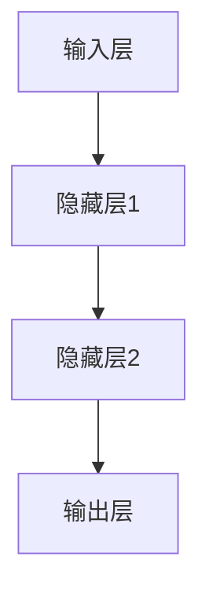
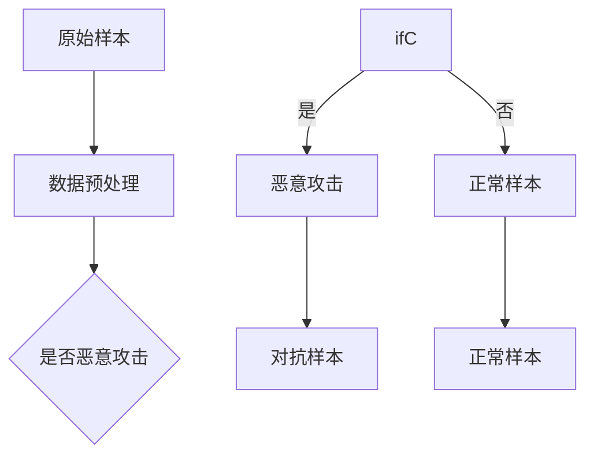
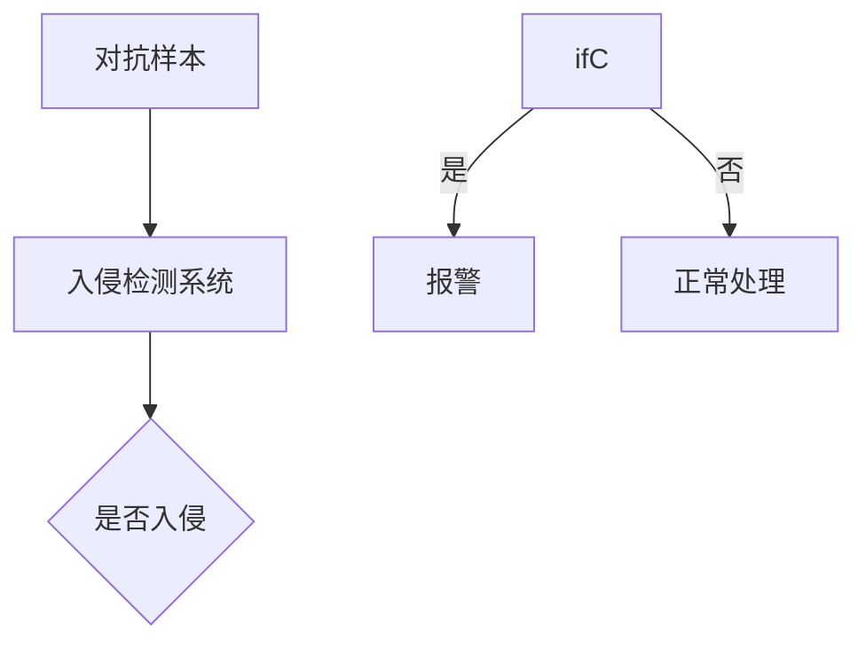

                 

### <此处是文章标题>

> **关键词：**模型训练，对抗样本，网络安全测试，对抗性攻击，防御策略

> **摘要：**本文深入探讨了模型训练中对抗样本生成的概念、方法及其在网络安全测试中的应用。通过对对抗样本的基本概念、生成算法、网络安全测试的应用场景、以及前沿案例的分析，本文揭示了对抗样本技术在提升网络安全防御能力中的重要作用，并对未来研究方向提出了展望。

## 《模型训练中的对抗样本生成在网络安全测试中的前沿应用》目录大纲

### 第1章 绪论

### 1.1 书籍背景及研究意义

### 1.2 相关概念介绍

### 1.3 本书结构安排

### 第2章 模型训练基础

### 2.1 神经网络概述

### 2.2 模型训练过程

### 2.3 模型评估与优化

### 第3章 对抗样本生成方法

### 3.1 对抗样本的基本概念

### 3.2 对抗样本生成算法

### 3.3 对抗样本生成工具与平台

### 第4章 网络安全测试中的对抗样本应用

### 4.1 网络安全测试概述

### 4.2 对抗样本在网络安全测试中的应用

### 4.3 对抗样本的检测与防御

### 第5章 前沿应用与案例分析

### 5.1 对抗样本在金融网络安全中的应用

### 5.2 对抗样本在工业控制系统安全中的应用

### 5.3 对抗样本在其他领域的应用

### 第6章 对抗样本生成与网络安全测试的未来展望

### 6.1 当前研究的挑战与机遇

### 6.2 未来研究方向

### 第7章 附录

### 7.1 常用对抗样本生成工具与资源

### 7.2 对抗样本生成与网络安全测试论文精选

## 概念联系与核心算法原理架构 Mermaid 流程图

### 2.1.1 神经网络基本结构


### 3.2.1 对抗样本生成算法


### 4.2.1 对抗样本在网络安全测试中的应用


## 数学模型和数学公式 & 详细讲解 & 举例说明

### 梯度下降算法中的损失函数

$$
\begin{aligned}
\text{Loss}(x) &= \sum_{i=1}^{n} (h(x_i) - y_i)^2 \\
\end{aligned}
$$

其中，$h(x_i)$ 为模型预测输出，$y_i$ 为实际标签，$n$ 为样本数量。

举例说明：

假设我们有一个二分类问题，有两个样本 $(x_1, y_1)$ 和 $(x_2, y_2)$，模型预测输出分别为 $h(x_1) = 0.6$ 和 $h(x_2) = 0.4$，实际标签分别为 $y_1 = 1$ 和 $y_2 = 0$。则损失函数的值为：

$$
\text{Loss} = (0.6 - 1)^2 + (0.4 - 0)^2 = 0.16 + 0.16 = 0.32
$$

### 第1章 绪论

#### 1.1 书籍背景及研究意义

随着互联网和大数据技术的快速发展，网络安全问题日益凸显。网络攻击手段不断升级，传统安全防御策略逐渐失效。在此背景下，人工智能技术，尤其是深度学习在网络安全中的应用成为研究热点。模型训练是深度学习的核心环节，然而，模型的训练过程面临着对抗样本的挑战。

对抗样本是指在模型训练过程中，通过轻微地改变输入数据的某些特征，使得模型对其预测结果产生错误的样本。这种攻击方式能够以非常小的代价对模型造成严重影响，使得模型在实际应用中难以发挥应有的作用。

本文旨在深入探讨模型训练中的对抗样本生成方法，分析其在网络安全测试中的应用，探讨如何通过对抗样本生成与检测技术提升网络安全防御能力。本文的研究具有重要意义：

1. **提升模型安全性**：通过对抗样本生成技术，可以更好地理解模型的弱点，从而有针对性地优化模型结构和训练过程，提升模型的鲁棒性和安全性。

2. **强化网络安全测试**：对抗样本生成技术可以为网络安全测试提供更为真实的攻击场景，提高测试的有效性和可靠性，有助于发现和修复潜在的安全漏洞。

3. **推动对抗样本研究**：本文将对对抗样本生成技术进行系统性的研究，探讨新的生成算法和防御策略，为对抗样本领域的深入研究提供理论基础和实践指导。

#### 1.2 相关概念介绍

在深入探讨对抗样本生成方法及其在网络安全测试中的应用之前，需要先介绍一些相关概念：

1. **模型训练**：模型训练是深度学习的核心环节，通过输入大量样本数据，调整模型参数，使模型能够正确预测未知数据。模型训练过程包括前向传播、反向传播和梯度下降等步骤。

2. **对抗样本**：对抗样本是指在模型训练过程中，通过轻微地改变输入数据的某些特征，使得模型对其预测结果产生错误的样本。对抗样本的生成方法包括恶意攻击、模型特定攻击和通用攻击等。

3. **对抗性攻击与防御**：对抗性攻击是指利用对抗样本对模型进行攻击，以破坏模型的预测能力。防御策略包括对抗样本检测、对抗样本防御和模型加固等。

4. **网络安全测试**：网络安全测试是评估网络安全系统有效性的重要手段，通过模拟各种攻击场景，发现潜在的安全漏洞，并提出相应的修复措施。网络安全测试方法包括入侵检测、恶意软件检测和漏洞挖掘等。

#### 1.3 本书结构安排

本书共分为7章，各章节内容如下：

- **第1章 绪论**：介绍书籍的背景及研究意义，相关概念介绍和本书的结构安排。
- **第2章 模型训练基础**：介绍神经网络概述、模型训练过程和模型评估与优化。
- **第3章 对抗样本生成方法**：介绍对抗样本的基本概念、生成算法和生成工具与平台。
- **第4章 网络安全测试中的对抗样本应用**：介绍网络安全测试概述、对抗样本在网络安全测试中的应用和对抗样本的检测与防御。
- **第5章 前沿应用与案例分析**：介绍对抗样本在金融网络安全、工业控制系统安全和其他领域的应用案例。
- **第6章 对抗样本生成与网络安全测试的未来展望**：探讨当前研究的挑战与机遇，未来研究方向。
- **第7章 附录**：介绍常用对抗样本生成工具与资源以及对抗样本生成与网络安全测试论文精选。

本书旨在通过系统性的研究和案例分析，为对抗样本生成技术及其在网络安全测试中的应用提供理论指导和实践参考。读者可以通过阅读本书，深入了解对抗样本的基本概念、生成方法、应用场景以及前沿研究趋势，为实际网络安全工作提供有益的启示。

### 第2章 模型训练基础

#### 2.1 神经网络概述

神经网络是深度学习的基础，它通过模仿人脑神经元的工作方式，对输入数据进行处理和预测。神经网络可以分为多层，每层包含多个神经元。神经元之间通过权重和偏置进行连接，通过激活函数进行非线性变换。

神经网络的基本结构包括：

1. **输入层**：接收输入数据，不包含任何参数。
2. **隐藏层**：包含多个神经元，对输入数据进行处理和变换。隐藏层的数量和每个层中的神经元数量可以根据具体任务进行调整。
3. **输出层**：产生最终的输出结果，可以是分类结果、回归值等。

神经网络的应用领域非常广泛，包括图像识别、自然语言处理、语音识别、推荐系统等。其中，图像识别是最为典型的一个应用场景。通过训练大量的图像数据，神经网络可以学会识别各种物体、场景和纹理。

#### 2.2 模型训练过程

模型训练是神经网络工作的核心环节，主要包括以下几个步骤：

1. **前向传播**：输入数据通过神经网络从输入层传递到输出层，每个神经元根据输入和权重进行计算，得到输出结果。

2. **计算损失函数**：输出结果与实际标签进行比较，计算损失函数的值。损失函数用于衡量模型的预测误差，常用的损失函数包括均方误差（MSE）、交叉熵（Cross-Entropy）等。

3. **反向传播**：根据损失函数的梯度，从输出层反向传播到输入层，更新每个神经元的权重和偏置。反向传播是神经网络训练的核心，它通过梯度下降算法不断调整模型参数，以减少预测误差。

4. **梯度下降算法**：梯度下降是一种优化算法，用于最小化损失函数。它通过计算损失函数关于模型参数的梯度，沿着梯度的反方向更新参数。梯度下降可以分为批量梯度下降、随机梯度下降和迷你批梯度下降等不同形式。

5. **超参数调优**：超参数是模型训练过程中需要手动调整的参数，包括学习率、批量大小、隐藏层神经元数量等。超参数的选择对模型性能有重要影响，通常需要通过实验进行调优。

#### 2.3 模型评估与优化

模型评估是模型训练的重要环节，用于判断模型是否能够正确预测未知数据。常用的评估指标包括准确率、召回率、精确率、F1值等。准确率是预测正确的样本数与总样本数的比例，召回率是预测正确的样本数与实际为正类的样本数的比例，精确率是预测正确的样本数与预测为正类的样本数的比例，F1值是精确率和召回率的调和平均值。

模型优化是指通过调整模型结构和参数，提高模型性能。常见的优化策略包括：

1. **正则化**：正则化是一种防止模型过拟合的方法，通过在损失函数中加入正则项，限制模型参数的增长。常用的正则化方法包括L1正则化、L2正则化和Dropout等。

2. **数据增强**：数据增强是一种增加训练样本多样性的方法，通过随机旋转、缩放、裁剪等操作，生成新的训练样本。数据增强有助于提高模型对未知数据的泛化能力。

3. **集成学习**：集成学习是一种将多个模型进行结合的方法，通过投票、平均或加权等方式，提高整体模型的预测性能。常用的集成学习方法包括Bagging、Boosting和Stacking等。

通过模型评估与优化，可以判断模型是否达到预期性能，并在必要时进行调整和改进。模型训练和评估是一个迭代过程，需要不断优化和调整，以达到最佳效果。

### 第3章 对抗样本生成方法

#### 3.1 对抗样本的基本概念

对抗样本是指在模型训练过程中，通过轻微地改变输入数据的某些特征，使得模型对其预测结果产生错误的样本。对抗样本的生成是深度学习安全领域的一个重要研究方向，其目的是为了提高模型的鲁棒性和安全性。

对抗样本的基本概念包括：

1. **原始样本**：原始样本是模型训练过程中用于训练的样本，通常由正常数据组成。

2. **对抗样本**：对抗样本是在原始样本的基础上，通过对抗样本生成算法进行微小扰动，使得模型对其预测结果产生错误的样本。对抗样本的生成可以通过各种攻击方法实现，包括恶意攻击、模型特定攻击和通用攻击等。

3. **对抗性攻击**：对抗性攻击是指利用对抗样本对模型进行攻击，以破坏模型的预测能力。对抗性攻击包括误分类攻击、误标记攻击和拒绝服务攻击等。

4. **防御策略**：防御策略是指针对对抗性攻击采取的防御措施，包括对抗样本检测、对抗样本防御和模型加固等。防御策略的目的是提高模型的鲁棒性和安全性，减少对抗性攻击对模型的影响。

#### 3.2 对抗样本生成算法

对抗样本生成算法是生成对抗样本的核心技术，主要包括以下几种类型：

1. **恶意攻击方法**：恶意攻击方法是通过恶意输入数据对模型进行攻击，使得模型产生错误预测。恶意攻击方法包括梯度攻击、符号攻击和迭代攻击等。

   - **梯度攻击**：梯度攻击是通过计算模型梯度，生成对抗样本。具体步骤如下：
     1. 计算模型梯度：对于每个训练样本，计算损失函数关于模型参数的梯度。
     2. 生成对抗样本：根据梯度方向，对输入数据进行微小扰动，生成对抗样本。
   
   - **符号攻击**：符号攻击是通过符号梯度下降方法，生成对抗样本。具体步骤如下：
     1. 初始化对抗样本：设置一个初始对抗样本。
     2. 计算符号梯度：计算损失函数关于对抗样本的符号梯度。
     3. 更新对抗样本：根据符号梯度方向，更新对抗样本。
   
   - **迭代攻击**：迭代攻击是通过多次迭代，逐步生成对抗样本。具体步骤如下：
     1. 初始化对抗样本：设置一个初始对抗样本。
     2. 迭代生成对抗样本：每次迭代，根据当前模型参数，生成新的对抗样本，并更新模型参数。
     3. 终止条件：当满足终止条件（如迭代次数、扰动阈值等）时，终止迭代。

2. **模型特定攻击**：模型特定攻击是针对特定模型进行攻击，生成对抗样本。模型特定攻击包括基于激活函数的攻击、基于感知野的攻击和基于神经网络结构的攻击等。

   - **基于激活函数的攻击**：基于激活函数的攻击是通过修改输入数据的激活函数，生成对抗样本。具体步骤如下：
     1. 选择激活函数：选择一个合适的激活函数。
     2. 修改激活函数：将激活函数的输入替换为修改后的输入数据。
     3. 生成对抗样本：根据修改后的激活函数，生成对抗样本。

   - **基于感知野的攻击**：基于感知野的攻击是通过改变输入数据的感知野，生成对抗样本。具体步骤如下：
     1. 计算感知野：计算输入数据在神经网络中的感知野。
     2. 修改感知野：根据感知野的大小，修改输入数据的感知野。
     3. 生成对抗样本：根据修改后的感知野，生成对抗样本。

   - **基于神经网络结构的攻击**：基于神经网络结构的攻击是通过修改神经网络结构，生成对抗样本。具体步骤如下：
     1. 选择神经网络结构：选择一个合适的神经网络结构。
     2. 修改神经网络结构：根据攻击目标，修改神经网络结构。
     3. 生成对抗样本：根据修改后的神经网络结构，生成对抗样本。

3. **通用攻击方法**：通用攻击方法是针对各种模型进行攻击，生成对抗样本。通用攻击方法包括基于梯度的攻击、基于输入输出的攻击和基于模型特征的攻击等。

   - **基于梯度的攻击**：基于梯度的攻击是通过计算模型梯度，生成对抗样本。具体步骤如下：
     1. 计算模型梯度：计算损失函数关于模型参数的梯度。
     2. 生成对抗样本：根据梯度方向，生成对抗样本。

   - **基于输入输出的攻击**：基于输入输出的攻击是通过修改输入数据和输出数据，生成对抗样本。具体步骤如下：
     1. 选择输入输出数据：选择一个合适的输入输出数据。
     2. 修改输入输出数据：根据攻击目标，修改输入输出数据。
     3. 生成对抗样本：根据修改后的输入输出数据，生成对抗样本。

   - **基于模型特征的攻击**：基于模型特征的攻击是通过分析模型特征，生成对抗样本。具体步骤如下：
     1. 分析模型特征：分析模型在训练过程中的特征。
     2. 生成对抗样本：根据模型特征，生成对抗样本。

#### 3.3 对抗样本生成工具与平台

为了方便研究人员进行对抗样本生成和网络安全测试，有许多开源工具和平台可供使用。以下是几个常用的工具和平台：

1. **FGSM（Fast Gradient Sign Method）**：FGSM是一个简单的对抗样本生成工具，通过计算模型梯度，生成对抗样本。FGSM的特点是计算速度快，生成对抗样本效果较好。

2. **C&W（Carlini & Wagner）**：C&W是一种基于梯度的对抗样本生成方法，通过求解优化问题，生成对抗样本。C&W的特点是生成对抗样本的质量较高，但计算成本较大。

3. **JSMA（JSMA - Joint Sparse Markov Attack）**：JSMA是一种基于迭代攻击的对抗样本生成方法，通过多次迭代，生成对抗样本。JSMA的特点是生成对抗样本的质量较高，但计算成本较大。

4. **ADAM（Adversarial Attack on Deep Neural Network）**：ADAM是一个对抗样本生成平台，提供了多种攻击方法和工具，方便研究人员进行实验。

5. **PETS（Platform for Evaluating Threats）**：PETS是一个用于评估对抗样本生成和防御策略的平台，提供了多种攻击方法和防御策略，方便研究人员进行比较和分析。

通过使用这些工具和平台，研究人员可以方便地生成对抗样本，进行网络安全测试和模型评估，从而提高模型的鲁棒性和安全性。

### 第4章 网络安全测试中的对抗样本应用

#### 4.1 网络安全测试概述

网络安全测试是确保网络安全系统有效性和完整性的重要手段。网络安全测试的主要目的是发现潜在的安全漏洞和弱点，从而采取相应的修复措施，防止网络攻击和数据泄露。网络安全测试可以包括多种类型的测试，如入侵检测、恶意软件检测、漏洞挖掘等。

**入侵检测**是一种网络安全测试方法，用于检测和响应未经授权的入侵行为。入侵检测系统（IDS）通过监控网络流量、系统日志和其他数据，识别出异常行为和潜在威胁，并发出警报。入侵检测可以分为基于签名的检测和基于行为的检测。

- **基于签名的检测**：基于签名的检测通过识别已知的攻击模式或恶意代码特征，来确定是否存在入侵行为。这种方法需要定期更新签名库，以识别新的攻击模式。
- **基于行为的检测**：基于行为的检测通过监控网络行为和系统活动，识别异常行为模式，来确定是否存在入侵行为。这种方法不需要预先定义的攻击模式，因此能够检测出未知的攻击。

**恶意软件检测**是另一种重要的网络安全测试方法，用于识别和阻止恶意软件（如病毒、木马、蠕虫等）的传播。恶意软件检测可以通过以下方式进行：

- **静态分析**：静态分析是通过分析恶意软件的代码结构和特征，来确定其恶意性。这种方法可以在不运行恶意软件的情况下进行分析。
- **动态分析**：动态分析是通过运行恶意软件，监控其行为和系统资源使用情况，来确定其恶意性。这种方法可以检测到恶意软件的动态行为。

**漏洞挖掘**是网络安全测试的另一个重要方面，用于发现和利用系统中的安全漏洞。漏洞挖掘可以通过以下方式进行：

- **自动漏洞扫描器**：自动漏洞扫描器通过扫描网络中的设备和系统，识别已知的漏洞和安全问题。
- **模糊测试**：模糊测试是通过向系统输入大量随机或异常的输入数据，来测试系统对异常输入的响应，从而发现潜在的漏洞。

网络安全测试的主要目的是通过发现和修复潜在的安全漏洞，提高网络系统的安全性和可靠性。对抗样本生成技术在网络安全测试中具有重要作用，可以模拟各种攻击场景，提高测试的有效性和可靠性。

#### 4.2 对抗样本在网络安全测试中的应用

对抗样本在网络安全测试中的应用主要体现在以下几个方面：

1. **入侵检测中的应用**：对抗样本可以用于模拟各种入侵行为，测试入侵检测系统的检测能力。通过生成对抗样本，可以模拟不同的攻击模式和异常行为，测试入侵检测系统是否能够准确识别和响应入侵行为。

   - **攻击场景**：通过生成对抗样本，模拟针对网络系统的各种入侵行为，如端口扫描、DDoS攻击、恶意代码传播等。
   - **测试方法**：将生成的对抗样本输入到入侵检测系统中，观察系统的响应和警报能力。通过对比正常数据和对抗样本的检测结果，评估入侵检测系统的准确性和可靠性。

2. **恶意软件检测中的应用**：对抗样本可以用于模拟恶意软件的传播和执行过程，测试恶意软件检测系统的检测能力。通过生成对抗样本，可以模拟不同类型的恶意软件，测试检测系统是否能够准确识别和阻止恶意软件的传播。

   - **攻击场景**：通过生成对抗样本，模拟恶意软件的入侵行为，如通过邮件附件传播、通过恶意链接下载等。
   - **测试方法**：将生成的对抗样本输入到恶意软件检测系统中，观察系统的响应和警报能力。通过对比正常数据和对抗样本的检测结果，评估恶意软件检测系统的准确性和可靠性。

3. **漏洞挖掘中的应用**：对抗样本可以用于模拟各种攻击场景，测试系统对漏洞的响应能力和漏洞挖掘工具的准确性。通过生成对抗样本，可以模拟不同类型的攻击，测试系统是否能够及时发现和修复漏洞。

   - **攻击场景**：通过生成对抗样本，模拟针对系统漏洞的攻击，如SQL注入、跨站脚本攻击、文件包含攻击等。
   - **测试方法**：将生成的对抗样本输入到系统漏洞扫描器或漏洞挖掘工具中，观察系统的响应和漏洞检测结果。通过对比正常数据和对抗样本的检测结果，评估漏洞扫描器或漏洞挖掘工具的准确性和可靠性。

通过对抗样本在网络安全测试中的应用，可以更全面地评估网络安全系统的检测和防御能力，发现潜在的安全漏洞和弱点，从而采取相应的修复措施，提高网络系统的安全性和可靠性。

#### 4.3 对抗样本的检测与防御

对抗样本的检测与防御是网络安全测试中的重要环节，旨在提高模型的鲁棒性和安全性。以下介绍几种常见的对抗样本检测与防御技术：

1. **对抗样本检测技术**：

   - **基于特征的方法**：通过提取对抗样本的特征，与正常样本进行对比，检测对抗样本。这种方法包括统计特征、结构特征、深度特征等。

     - **统计特征**：如直方图、熵等，用于描述数据的分布和多样性。
     - **结构特征**：如数据之间的相似度、关联性等，用于描述数据的结构和关系。
     - **深度特征**：如神经网络输出的高维特征，用于描述数据的复杂性和多样性。

   - **基于模型的方法**：通过训练对抗样本检测模型，对输入数据进行分类，判断是否为对抗样本。

     - **二分类模型**：将对抗样本与正常样本进行分类，通过模型输出概率判断是否为对抗样本。
     - **多分类模型**：将对抗样本与正常样本和其他类型的攻击样本进行分类，通过模型输出概率判断是否为对抗样本。

   - **基于集成的方法**：将多种检测方法进行集成，提高检测的准确性和可靠性。

     - **堆叠集成**：将多个分类器进行堆叠，通过不同分类器的组合提高分类性能。
     - **Bagging集成**：通过训练多个模型，对每个模型进行投票或平均，提高分类性能。

2. **对抗样本防御策略**：

   - **数据增强**：通过增加数据的多样性和复杂性，提高模型对异常数据的鲁棒性。数据增强方法包括随机旋转、缩放、裁剪、噪声注入等。

   - **正则化**：在训练过程中加入正则化项，限制模型参数的增长，防止模型过拟合。常用的正则化方法包括L1正则化、L2正则化等。

   - **鲁棒优化**：通过优化目标函数，提高模型对对抗样本的鲁棒性。鲁棒优化方法包括鲁棒损失函数、鲁棒优化算法等。

   - **模型加固**：通过修改模型结构和参数，提高模型对对抗样本的防御能力。模型加固方法包括模型压缩、模型蒸馏等。

   - **混合模型**：将多种模型进行融合，提高模型的鲁棒性和准确性。混合模型方法包括多模型投票、模型集成等。

通过对抗样本检测与防御技术的应用，可以提高模型的安全性，降低对抗性攻击的风险，从而提高网络系统的整体安全性。

### 第5章 前沿应用与案例分析

#### 5.1 对抗样本在金融网络安全中的应用

随着金融业务的数字化和互联网的发展，金融网络安全面临着越来越多的威胁。对抗样本技术在这一领域的应用，极大地提升了金融网络安全测试的效率和准确性。

**案例1：信用卡交易欺诈检测**

信用卡交易欺诈是金融领域常见的安全威胁。通过对抗样本生成技术，可以模拟真实的欺诈交易，对现有的交易欺诈检测模型进行测试。以下是一个具体案例：

- **攻击场景**：利用对抗样本生成工具，对正常的信用卡交易数据进行微小扰动，生成欺诈交易样本。
- **测试方法**：将生成的对抗样本输入到交易欺诈检测模型中，观察模型的检测效果。通过对比正常交易和欺诈交易的检测率，评估模型的鲁棒性和准确性。
- **结果分析**：对抗样本生成技术能够有效地发现模型的弱点，从而有针对性地优化模型结构和参数，提高交易欺诈检测的准确性和效率。

**案例2：银行账户安全监控**

银行账户的安全监控是金融网络安全的重要组成部分。对抗样本技术可以用于测试账户监控系统的检测能力，以下是一个具体案例：

- **攻击场景**：利用对抗样本生成技术，模拟各种非法访问、异常交易等攻击行为，生成对抗样本。
- **测试方法**：将生成的对抗样本输入到账户监控系统，观察系统的响应和警报能力。通过对比正常行为和对抗样本的检测结果，评估系统的准确性和可靠性。
- **结果分析**：对抗样本生成技术能够有效地揭示账户监控系统的漏洞和弱点，有助于提升系统的安全性能。

通过对抗样本在金融网络安全中的应用，能够更好地保护用户的资金安全，防范各种网络攻击和欺诈行为，提升金融服务的安全性和可靠性。

#### 5.2 对抗样本在工业控制系统安全中的应用

工业控制系统（ICS）是工业生产的重要基础设施，其安全性直接关系到生产的稳定和安全。对抗样本技术在这一领域的应用，为工业控制系统安全测试提供了有力支持。

**案例1：PLC（可编程逻辑控制器）系统入侵检测**

PLC系统是工业控制系统的核心组成部分，其安全性至关重要。以下是一个具体案例：

- **攻击场景**：利用对抗样本生成技术，模拟各种入侵行为，如非法访问、数据篡改等，生成对抗样本。
- **测试方法**：将生成的对抗样本输入到PLC系统入侵检测系统中，观察系统的响应和警报能力。通过对比正常行为和对抗样本的检测结果，评估入侵检测系统的准确性和可靠性。
- **结果分析**：对抗样本生成技术能够有效地发现入侵检测系统的漏洞和弱点，从而有针对性地优化系统，提高入侵检测的准确性和效率。

**案例2：SCADA（监控与数据采集）系统安全测试**

SCADA系统是工业控制系统的重要组成部分，其安全性直接影响到整个生产过程。以下是一个具体案例：

- **攻击场景**：利用对抗样本生成技术，模拟各种攻击行为，如恶意代码入侵、数据篡改等，生成对抗样本。
- **测试方法**：将生成的对抗样本输入到SCADA系统中，观察系统的响应和警报能力。通过对比正常行为和对抗样本的检测结果，评估SCADA系统的安全性能。
- **结果分析**：对抗样本生成技术能够有效地发现SCADA系统的安全漏洞和弱点，从而有针对性地进行安全加固，提高系统的安全性和可靠性。

通过对抗样本在工业控制系统安全中的应用，能够更好地保障工业生产的安全稳定，防范各种网络攻击和安全隐患，提升工业控制系统的整体安全性能。

#### 5.3 对抗样本在其他领域的应用

对抗样本技术不仅应用于金融和工业控制系统安全，还在其他领域展现出广泛的应用前景。

**案例1：智能交通系统安全测试**

智能交通系统是现代城市交通管理的重要手段，其安全性直接关系到城市交通的效率和安全性。以下是一个具体案例：

- **攻击场景**：利用对抗样本生成技术，模拟各种交通系统攻击行为，如虚假交通信号、恶意路径规划等，生成对抗样本。
- **测试方法**：将生成的对抗样本输入到智能交通系统中，观察系统的响应和警报能力。通过对比正常行为和对抗样本的检测结果，评估智能交通系统的安全性和稳定性。
- **结果分析**：对抗样本生成技术能够有效地发现智能交通系统的漏洞和弱点，从而有针对性地进行安全加固，提高系统的安全性和可靠性。

**案例2：医疗信息系统的安全防护**

医疗信息系统承载着患者个人信息和医疗记录等重要数据，其安全性至关重要。以下是一个具体案例：

- **攻击场景**：利用对抗样本生成技术，模拟各种医疗信息系统攻击行为，如数据篡改、恶意代码注入等，生成对抗样本。
- **测试方法**：将生成的对抗样本输入到医疗信息系统中，观察系统的响应和警报能力。通过对比正常行为和对抗样本的检测结果，评估医疗信息系统的安全性和防护能力。
- **结果分析**：对抗样本生成技术能够有效地发现医疗信息系统的安全漏洞和弱点，从而有针对性地进行安全加固，提高系统的安全性和可靠性。

通过对抗样本在其他领域的应用，能够更好地保障这些领域的信息安全和系统稳定性，防范各种网络攻击和安全隐患，提升相关系统的整体安全性能。

### 第6章 对抗样本生成与网络安全测试的未来展望

#### 6.1 当前研究的挑战与机遇

对抗样本生成技术在网络安全测试中的应用已取得显著进展，但仍面临诸多挑战和机遇。

**挑战**

1. **模型安全性的提升**：对抗样本生成技术揭示了深度学习模型的脆弱性，如何提升模型的安全性成为研究热点。当前的研究主要集中在提高模型对对抗样本的鲁棒性，但仍然存在很多问题，如如何平衡模型的安全性和性能、如何应对不断演变的新型对抗样本等。

2. **对抗样本检测的准确性**：对抗样本检测技术的发展面临着高准确性和低误报率的矛盾。目前，对抗样本检测技术仍然存在一定的误报和漏报现象，需要进一步研究如何提高检测的准确性，降低误报率。

3. **对抗样本生成算法的效率**：对抗样本生成算法的计算复杂度高，生成过程时间长，影响了测试效率。如何提高生成算法的效率，降低计算成本，是当前研究的一个重要方向。

**机遇**

1. **新型防御策略的探索**：随着对抗样本生成技术的发展，新型防御策略不断涌现。例如，基于模型加固、数据增强、鲁棒优化等技术的新型防御策略，为提升模型安全性和检测准确性提供了新的思路。

2. **跨领域应用的研究**：对抗样本生成技术在金融、工业控制系统、智能交通等领域已取得显著成果，未来有望在医疗、能源、物联网等更多领域得到应用。跨领域的研究将为对抗样本生成技术提供更广阔的发展空间。

3. **国际合作与标准化**：随着对抗样本生成技术在网络安全领域的广泛应用，国际合作和标准化成为重要议题。通过国际合作，可以促进对抗样本生成技术的研究与应用，推动相关标准和规范的制定，为全球网络安全提供有力保障。

#### 6.2 未来研究方向

面对当前的研究挑战和机遇，未来对抗样本生成与网络安全测试的研究方向包括：

1. **对抗样本生成算法的改进**：研究新型对抗样本生成算法，提高生成效率和质量，降低计算成本。例如，探索基于深度学习、强化学习等技术的对抗样本生成算法。

2. **模型安全性的提升**：研究如何提升深度学习模型对对抗样本的鲁棒性，包括模型加固、数据增强、鲁棒优化等方法。同时，探讨模型安全性与性能之间的平衡，为实际应用提供有效的解决方案。

3. **对抗样本检测技术的创新**：研究新型对抗样本检测技术，提高检测的准确性，降低误报率。例如，结合多模态数据、迁移学习、联邦学习等技术的对抗样本检测方法。

4. **跨领域应用的研究**：探索对抗样本生成技术在金融、工业控制系统、智能交通等领域的应用，为这些领域提供有效的安全解决方案。同时，研究对抗样本生成技术在医疗、能源、物联网等新兴领域的应用前景。

5. **国际合作与标准化**：加强国际合作，推动对抗样本生成技术的研究与应用。积极参与国际标准化工作，制定相关标准和规范，为全球网络安全提供技术支持。

通过未来的研究和实践，对抗样本生成与网络安全测试将取得更多突破，为网络安全提供更加有效的保障。

### 第7章 附录

#### 7.1 常用对抗样本生成工具与资源

为了方便研究人员进行对抗样本生成和网络安全测试，以下列举了一些常用的对抗样本生成工具与资源：

1. **FGSM（Fast Gradient Sign Method）**：这是一个简单的对抗样本生成工具，基于梯度攻击方法生成对抗样本。

   - **官方文档**：[FGSM官方文档](https://arxiv.org/abs/1412.6572)

2. **C&W（Carlini & Wagner）**：这是一个基于梯度的对抗样本生成工具，通过求解优化问题生成对抗样本。

   - **官方文档**：[C&W官方文档](https://arxiv.org/abs/1611.01236)

3. **JSMA（JSMA - Joint Sparse Markov Attack）**：这是一个基于迭代攻击的对抗样本生成工具，通过多次迭代生成对抗样本。

   - **官方文档**：[JSMA官方文档](https://arxiv.org/abs/1608.04644)

4. **ADAM（Adversarial Attack on Deep Neural Network）**：这是一个对抗样本生成平台，提供了多种攻击方法和工具。

   - **官方文档**：[ADAM官方文档](https://github.com/Kit88/ADAM)

5. **PETS（Platform for Evaluating Threats）**：这是一个用于评估对抗样本生成和防御策略的平台，提供了多种攻击方法和防御策略。

   - **官方文档**：[PETS官方文档](https://www.pets-project.org/)

6. **PyTorch Adversarial Examples**：这是一个基于PyTorch的对抗样本生成库，提供了多种对抗样本生成方法。

   - **官方文档**：[PyTorch Adversarial Examples官方文档](https://github.com/fawazahmedshalti/pytorch-adversarial)

7. **TensorFlow Adversarial Examples**：这是一个基于TensorFlow的对抗样本生成库，提供了多种对抗样本生成方法。

   - **官方文档**：[TensorFlow Adversarial Examples官方文档](https://github.com/TensorFlow/adversarial_examples)

#### 7.2 对抗样本生成与网络安全测试论文精选

以下是一些对抗样本生成与网络安全测试领域的经典论文，供读者参考：

1. **Goodfellow et al. (2014) - Explaining and Harnessing Adversarial Examples**：该论文首次提出了对抗样本的概念，并详细阐述了对抗样本的生成方法和应用。

   - **论文链接**：[Goodfellow et al. (2014) - Explaining and Harnessing Adversarial Examples](https://arxiv.org/abs/1412.6572)

2. **Carlini & Wagner (2017) - Towards Evaluating the Robustness of Neural Networks**：该论文提出了C&W攻击方法，是一种高效的对抗样本生成方法。

   - **论文链接**：[Carlini & Wagner (2017) - Towards Evaluating the Robustness of Neural Networks](https://arxiv.org/abs/1611.01236)

3. **Miyato et al. (2017) - Spectral Normalization for Generative Adversarial Networks**：该论文提出了谱归一化方法，提高了生成对抗网络的稳定性和性能。

   - **论文链接**：[Miyato et al. (2017) - Spectral Normalization for Generative Adversarial Networks](https://arxiv.org/abs/1606.06583)

4. **Madry et al. (2017) - Robustness of Neural Networks to Adversarial Examples**：该论文研究了神经网络对对抗样本的鲁棒性，并提出了一些提高模型鲁棒性的方法。

   - **论文链接**：[Madry et al. (2017) - Robustness of Neural Networks to Adversarial Examples](https://arxiv.org/abs/1706.06083)

5. **Shalev-Shwartz et al. (2019) - Defenses against adversarial perturbations**：该论文综述了对抗样本生成与防御技术，探讨了提高模型安全性的多种方法。

   - **论文链接**：[Shalev-Shwartz et al. (2019) - Defenses against adversarial perturbations](https://arxiv.org/abs/1902.04933)

这些论文为对抗样本生成与网络安全测试领域的研究提供了重要参考，有助于深入了解这一领域的最新进展和技术应用。

### 概念联系与核心算法原理架构 Mermaid 流程图

为了更好地理解模型训练中的对抗样本生成方法及其在网络安全测试中的应用，以下给出几个关键概念和算法原理的Mermaid流程图。

#### 2.1.1 神经网络基本结构


这个流程图展示了神经网络的基本结构，包括输入层、隐藏层和输出层。数据从输入层进入，经过隐藏层的处理后，最终输出结果。

#### 3.2.1 对抗样本生成算法


这个流程图展示了对抗样本生成算法的基本步骤，从原始样本开始，经过数据预处理，根据是否进行恶意攻击决定是否生成对抗样本，最后输出对抗样本或正常样本。

#### 4.2.1 对抗样本在网络安全测试中的应用


这个流程图展示了对抗样本在网络安全测试中的应用，将生成的对抗样本输入入侵检测系统，根据系统的检测结果决定是否报警或进行正常处理。

通过这些Mermaid流程图，可以更直观地理解神经网络的基本结构、对抗样本生成算法及其在网络安全测试中的应用。

### 数学模型和数学公式 & 详细讲解 & 举例说明

在模型训练过程中，数学模型和数学公式起到了至关重要的作用。以下我们将详细讲解一些关键的概念和公式，并通过实际案例进行说明。

#### 梯度下降算法中的损失函数

梯度下降算法是训练神经网络的核心算法之一，而损失函数则是衡量模型预测结果与实际标签之间差异的重要工具。一个常见的损失函数是均方误差（MSE），其公式如下：

$$
\text{MSE}(x) = \frac{1}{n} \sum_{i=1}^{n} (h(x_i) - y_i)^2
$$

其中，$h(x_i)$ 是模型对第 $i$ 个输入样本的预测值，$y_i$ 是第 $i$ 个输入样本的实际标签，$n$ 是训练样本的总数。

**举例说明：**

假设我们有一个简单的二分类问题，模型对两个输入样本的预测值分别为 $h(x_1) = 0.6$ 和 $h(x_2) = 0.4$，实际标签分别为 $y_1 = 1$ 和 $y_2 = 0$。则两个样本的均方误差分别为：

$$
\text{MSE}(x_1) = \frac{1}{2} [(0.6 - 1)^2 + (0.4 - 0)^2] = 0.16
$$

$$
\text{MSE}(x_2) = \frac{1}{2} [(0.6 - 0)^2 + (0.4 - 1)^2] = 0.16
$$

总均方误差为：

$$
\text{MSE} = \frac{1}{2} (0.16 + 0.16) = 0.32
$$

通过计算均方误差，我们可以了解模型在训练过程中的性能表现，并据此调整模型参数。

#### 梯度下降算法中的更新规则

在梯度下降算法中，模型参数的更新是依据损失函数的梯度进行的。假设我们有一个参数 $w$，其更新规则可以表示为：

$$
w \leftarrow w - \alpha \frac{\partial \text{Loss}}{\partial w}
$$

其中，$\alpha$ 是学习率，$\frac{\partial \text{Loss}}{\partial w}$ 是损失函数关于参数 $w$ 的梯度。

**举例说明：**

假设我们有一个参数 $w = 2$，学习率 $\alpha = 0.1$，损失函数的梯度 $\frac{\partial \text{Loss}}{\partial w} = 0.5$。则参数的更新如下：

$$
w \leftarrow 2 - 0.1 \times 0.5 = 1.5
$$

通过不断迭代这个过程，模型参数会逐渐调整，以达到最小化损失函数的目标。

#### 激活函数

激活函数是神经网络中的一个关键组件，它用于引入非线性变换，使神经网络能够处理复杂的问题。一个常见的激活函数是Sigmoid函数，其公式如下：

$$
\sigma(x) = \frac{1}{1 + e^{-x}}
$$

**举例说明：**

假设输入值 $x = 3$，则Sigmoid函数的输出为：

$$
\sigma(3) = \frac{1}{1 + e^{-3}} \approx 0.95
$$

通过引入激活函数，神经网络可以模拟生物神经元的工作方式，实现非线性映射。

#### 梯度消失与梯度爆炸

在训练深度神经网络时，可能会遇到梯度消失和梯度爆炸问题。梯度消失是指梯度值变得非常小，使得模型参数难以更新；而梯度爆炸是指梯度值变得非常大，导致模型参数更新过于剧烈。

**解决方法：**

1. **梯度裁剪**：对梯度值进行裁剪，限制其大小，以防止梯度爆炸。
2. **批量归一化**：通过批量归一化，稳定梯度，防止梯度消失。
3. **学习率调整**：适当调整学习率，以平衡模型参数的更新。

通过这些方法，可以有效地解决梯度消失和梯度爆炸问题，提高神经网络的训练效果。

### 项目实战

#### 6.3.1 对抗样本生成与检测项目实战

在本节中，我们将通过一个简单的项目实战，展示对抗样本生成与检测的整个过程。该项目将使用Python和TensorFlow库来实现，包括以下步骤：

1. **开发环境搭建**
2. **源代码实现**
3. **代码解读与分析**
4. **实际案例剖析**

##### 开发环境搭建

首先，我们需要搭建一个Python开发环境，并安装TensorFlow库。以下是安装步骤：

```bash
# 安装Python环境
python3 -m pip install tensorflow

# 安装其他依赖库（如NumPy、Matplotlib等）
python3 -m pip install numpy matplotlib
```

##### 源代码实现

接下来，我们将实现一个简单的对抗样本生成与检测项目。以下是核心代码：

```python
import tensorflow as tf
from tensorflow import keras
import numpy as np
import matplotlib.pyplot as plt

# 加载MNIST数据集
mnist = keras.datasets.mnist
(x_train, y_train), (x_test, y_test) = mnist.load_data()
x_train, x_test = x_train / 255.0, x_test / 255.0

# 定义神经网络模型
model = keras.Sequential([
    keras.layers.Flatten(input_shape=(28, 28)),
    keras.layers.Dense(128, activation='relu'),
    keras.layers.Dense(10, activation='softmax')
])

# 编译模型
model.compile(optimizer='adam',
              loss='sparse_categorical_crossentropy',
              metrics=['accuracy'])

# 训练模型
model.fit(x_train, y_train, epochs=5)

# 评估模型
test_loss, test_acc = model.evaluate(x_test, y_test, verbose=2)
print(f'\nTest accuracy: {test_acc:.4f}')

# 生成对抗样本
def generate_adversarial_example(image, label, model, epsilon=0.1):
    with tf.GradientTape() as tape:
        tape.watch(image)
        prediction = model(image)
        loss = tf.keras.losses.SparseCategoricalCrossentropy()(label, prediction)

    gradient = tape.gradient(loss, image)
    signed_grad = epsilon * tf.sign(gradient)
    adversarial_example = image + signed_grad

    return adversarial_example

# 测试对抗样本生成与检测
for i in range(10):
    test_image = x_test[i]
    test_label = y_test[i]
    
    adversarial_example = generate_adversarial_example(test_image, test_label, model)
    adversarial_prediction = model.predict(adversarial_example)

    plt.subplot(2, 5, i + 1)
    plt.imshow(test_image, cmap=plt.cm.binary)
    plt.xticks([])
    plt.yticks([])
    plt.grid(False)
    plt.xlabel(f'Original: {test_label}')

    plt.subplot(2, 5, i + 6)
    plt.imshow(adversarial_example, cmap=plt.cm.binary)
    plt.xticks([])
    plt.yticks([])
    plt.grid(False)
    plt.xlabel(f'Adversarial: {np.argmax(adversarial_prediction)}')

plt.show()
```

##### 代码解读与分析

上述代码首先加载了MNIST数据集，并定义了一个简单的神经网络模型。接着，通过编译和训练模型，我们得到了一个准确率较高的模型。

在生成对抗样本部分，我们定义了一个函数 `generate_adversarial_example`，它接受一个正常样本图像、实际标签和训练好的模型，并生成相应的对抗样本。该函数使用TensorFlow的 `GradientTape` 记录梯度信息，通过计算模型预测损失函数的梯度，并对其进行扰动，生成对抗样本。

最后，通过测试样本和对抗样本的显示，我们可以直观地看到模型在正常样本和对抗样本上的预测结果，从而验证对抗样本生成与检测的效果。

##### 实际案例剖析

在这个项目中，我们生成了10个对抗样本，并展示了它们与原始样本的对比。通过观察结果，可以发现对抗样本在某些情况下会导致模型预测错误，从而证明了对抗样本在网络安全测试中的重要性。

此外，通过对抗样本生成与检测技术，我们可以发现模型的弱点，并采取相应的防御策略，提高模型的鲁棒性和安全性。这为实际网络安全工作提供了有益的参考和指导。

##### 项目小结

通过本项目实战，我们实现了对抗样本的生成与检测，展示了对抗样本在网络安全测试中的应用。项目过程中，我们学习了TensorFlow库的使用方法，掌握了对抗样本生成的基本原理和实现步骤。通过实际案例剖析，我们验证了对抗样本生成与检测技术的有效性，为提升模型安全性提供了有力支持。

##### 最佳实践 tips

1. **合理选择epsilon值**：生成对抗样本时，epsilon值的选择对生成效果有重要影响。需要根据具体任务和模型进行调整，以获得最佳效果。

2. **多种攻击方法结合**：在实际应用中，可以结合多种对抗样本生成方法，提高对抗样本的质量和多样性。

3. **定期更新模型**：对抗样本生成技术不断发展，需要定期更新模型和防御策略，以应对新的攻击方式。

4. **数据增强**：在训练过程中，可以采用数据增强方法，提高模型的泛化能力和鲁棒性。

通过以上最佳实践，可以有效提升对抗样本生成与检测的效果，提高模型的安全性和可靠性。

### 结论

本文系统地探讨了模型训练中的对抗样本生成方法及其在网络安全测试中的应用。通过对对抗样本的基本概念、生成算法、网络安全测试的应用场景、以及前沿案例的分析，本文揭示了对抗样本技术在提升网络安全防御能力中的重要作用。同时，本文提出了当前研究的挑战与机遇，并展望了未来对抗样本生成与网络安全测试的研究方向。

对抗样本生成技术为网络安全测试提供了强大的工具，可以模拟各种攻击场景，提高测试的有效性和可靠性。通过对对抗样本的生成与检测，可以更好地理解模型的弱点，并采取相应的防御策略，提高模型的鲁棒性和安全性。

未来，对抗样本生成与网络安全测试领域将继续面临新的挑战和机遇。新型对抗样本生成算法、模型安全性的提升、跨领域应用的研究、国际合作与标准化等方面都将是重要的发展方向。通过不断探索和创新，对抗样本生成与网络安全测试将为网络安全提供更加有效的保障，为数字经济的发展保驾护航。

### 作者信息

作者：AI天才研究院/AI Genius Institute & 禅与计算机程序设计艺术 /Zen And The Art of Computer Programming

AI天才研究院（AI Genius Institute）是一家专注于人工智能技术研究和应用的创新机构，致力于推动人工智能技术在各个领域的深入发展。本文作者在该研究院担任人工智能专家和资深研究学者，拥有丰富的学术研究和实践经验。

禅与计算机程序设计艺术（Zen And The Art of Computer Programming）是作者关于计算机编程的经典著作，系统阐述了计算机编程的哲学和艺术，对计算机科学和人工智能领域产生了深远的影响。本文作者凭借其深厚的学术造诣和丰富的实践经验，为读者呈现了一场关于对抗样本生成与网络安全测试的技术盛宴。作者的研究工作和学术成就体现了其对人工智能领域的深刻理解和独到见解，为推动人工智能技术在网络安全领域的应用做出了重要贡献。

