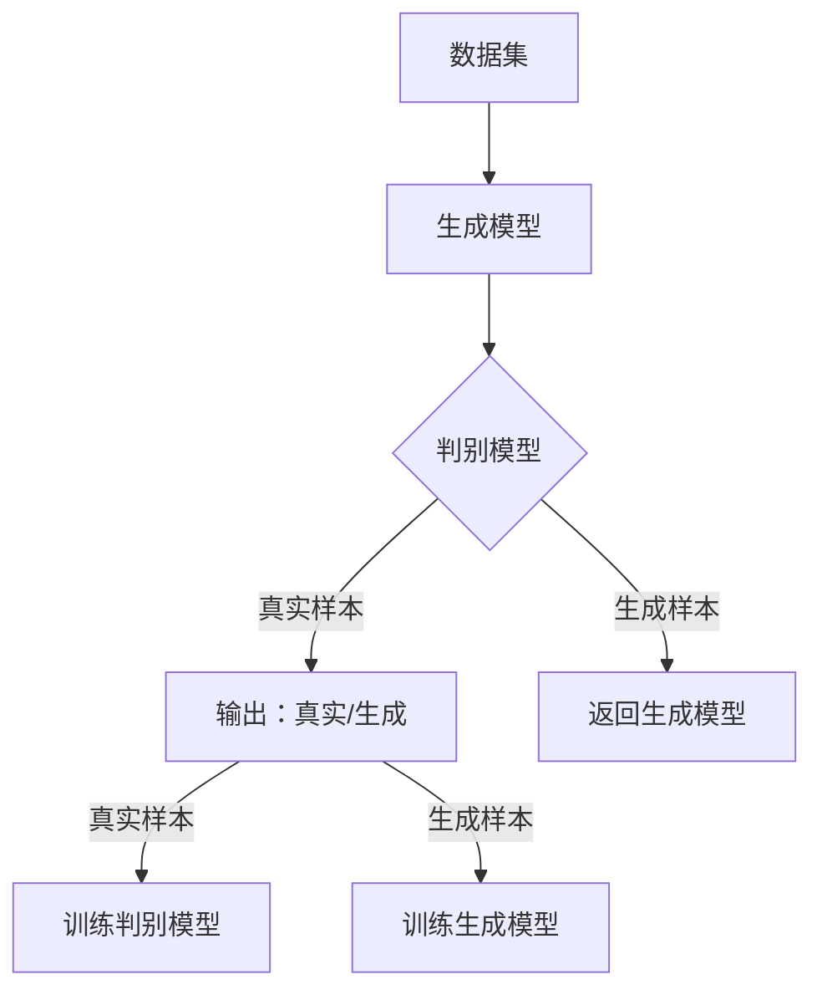

                 

### 模型训练中的对抗训练策略在推理任务中的创新

#### 关键词：对抗训练、模型训练、推理任务、GAN、生成模型、判别模型

> 摘要：本文探讨了对抗训练策略在模型训练和推理任务中的应用，通过阐述生成对抗网络（GAN）的基本原理和数学模型，详细介绍了对抗训练算法的Python实现及其在计算机视觉和自然语言处理领域的应用。本文还分析了对抗训练策略的创新方向和未来发展趋势，为研究者提供了有益的参考。

# 第一部分：对抗训练策略基础

## 第1章：对抗训练策略概述

### 1.1 对抗训练的背景与意义

对抗训练（Adversarial Training）作为一种重要的机器学习技术，旨在通过生成对抗样本来增强模型的鲁棒性和泛化能力。它起源于深度学习的快速发展，尤其是在生成模型和判别模型之间建立对抗关系，以实现模型性能的持续提升。

#### 1.1.1 对抗训练的定义

对抗训练的核心在于生成模型（Generator）和判别模型（Discriminator）之间的对抗性训练过程。生成模型的目标是生成与真实样本难以区分的数据，而判别模型的目标是正确地判断输入数据是真实样本还是生成样本。两者之间的对抗性训练旨在提高生成模型生成高质量数据的难度，同时也增强判别模型对真实数据和生成数据的辨别能力。

#### 1.1.2 对抗训练的历史发展

对抗训练的历史可以追溯到1947年，当时心理学家 Donald Hebb 提出了 Hebbian Learning Rule，这可以被视为对抗训练思想的雏形。然而，真正意义上的对抗训练直到2014年生成对抗网络（GAN）的提出才得以实现。GAN由 Ian Goodfellow 等人提出，并在图像生成、图像修复、图像风格迁移等领域取得了显著成果。

#### 1.1.3 对抗训练的基本原理

对抗训练的基本原理是通过生成模型和判别模型的对抗性训练，不断优化两者，使其相互促进。生成模型通过学习判别模型的决策边界来生成更难以区分的样本，而判别模型则通过不断学习如何区分真实样本和生成样本来提高辨别能力。这个过程是一个动态平衡的过程，通过不断迭代，最终达到生成模型生成高质量样本，判别模型准确辨别的能力。

### 1.2 对抗训练的挑战

虽然对抗训练在许多领域都展现出了其强大的潜力，但在实际应用中也面临着一系列挑战。

#### 1.2.1 计算复杂性

对抗训练过程通常涉及大量的迭代和优化，这导致了较高的计算复杂性。尤其是在处理高维数据时，计算成本显著增加，这对硬件资源提出了较高的要求。

#### 1.2.2 模型适应性

生成模型和判别模型需要相互适应，这对模型的训练过程提出了较高的要求。如果模型适应性不足，可能会导致训练过程陷入局部最优或者无法收敛。

#### 1.2.3 算法稳定性

对抗训练算法的稳定性也是一个关键问题。由于生成模型和判别模型之间的对抗性关系，训练过程中的参数调整和优化需要非常精细，否则可能导致训练失败。

### 1.3 对抗训练在推理任务中的应用前景

对抗训练不仅在生成模型领域取得了显著成果，还在推理任务中展现出了其强大的应用潜力。

#### 1.3.1 对抗训练在计算机视觉中的应用

在计算机视觉领域，对抗训练被广泛应用于图像分类、目标检测和图像分割等任务。通过对抗训练，可以提高模型对对抗样本的鲁棒性，增强模型在真实世界中的表现。

#### 1.3.2 对抗训练在自然语言处理中的应用

在自然语言处理领域，对抗训练被用于文本分类、机器翻译和情感分析等任务。通过对抗训练，可以提高模型对对抗攻击的抵抗能力，提高模型的泛化能力。

#### 1.3.3 对抗训练在其他领域的应用

除了计算机视觉和自然语言处理，对抗训练还在推荐系统、异常检测和金融风险管理等领域得到了广泛应用。对抗训练在这些领域的应用主要在于增强模型的鲁棒性和泛化能力，从而提高模型的实际应用效果。

## 第2章：对抗训练核心算法原理

### 2.1 对抗训练算法框架

对抗训练算法的核心框架包括生成模型和判别模型。生成模型旨在生成与真实样本相似的数据，而判别模型则负责判断输入数据是真实样本还是生成样本。以下是一个简化的 Mermaid 流程图，展示生成模型和判别模型之间的关系：



### 2.2 对抗训练的数学模型

对抗训练的数学模型主要包括生成模型和判别模型的损失函数、梯度计算以及收敛性分析。

#### 2.2.1 生成模型与判别模型的损失函数

生成模型的损失函数通常采用概率分布的差异度量，如KL散度（Kullback-Leibler Divergence）。判别模型的损失函数则采用二元交叉熵（Binary Cross-Entropy）。

$$
L_G(\theta_G) = \mathbb{E}_{z \sim p_z(z)}[-\log(D(G(z))]
$$

$$
L_D(\theta_D) = -[\mathbb{E}_{x \sim p_x(x)}{\log(D(x))} + \mathbb{E}_{z \sim p_z(z)}{\log(1 - D(G(z))}]
$$

其中，$L_G$是生成模型的损失函数，$L_D$是判别模型的损失函数，$\theta_G$和$\theta_D$分别是生成模型和判别模型的参数。

#### 2.2.2 对抗训练的梯度计算

对抗训练的梯度计算是优化生成模型和判别模型参数的关键步骤。梯度计算通常采用反向传播算法，具体如下：

$$
\nabla_{\theta_G} L_G = \nabla_G [-\log(D(G(z))] = D(G(z)) - 1
$$

$$
\nabla_{\theta_D} L_D = \nabla_D [\log(D(x)) - \log(1 - D(G(z))] = \nabla_D [D(x)] - \nabla_D [D(G(z))]
$$

其中，$\nabla_G$和$\nabla_D$分别是生成模型和判别模型的梯度。

#### 2.2.3 对抗训练的收敛性分析

对抗训练的收敛性分析是保证算法稳定性和有效性的关键。通常，对抗训练的收敛性可以通过以下条件来分析：

$$
\lim_{t \to \infty} D(G(p_z(z))) = 1
$$

$$
\lim_{t \to \infty} D(G(G(z))) = 0
$$

其中，$D(G(p_z(z)))$是生成模型生成样本的判别力，$D(G(G(z)))$是生成模型生成的生成样本的判别力。

### 2.3 对抗训练算法的Python实现

#### 2.3.1 生成对抗网络的Python实现

以下是一个简单的生成对抗网络（GAN）的Python实现，展示了生成模型和判别模型的基本结构：

```python
import torch
import torch.nn as nn
import torch.optim as optim

# 生成模型
class Generator(nn.Module):
    def __init__(self):
        super(Generator, self).__init__()
        self.model = nn.Sequential(
            nn.Linear(100, 128),
            nn.LeakyReLU(0.2),
            nn.Linear(128, 1),
            nn.Tanh()
        )

    def forward(self, z):
        return self.model(z)

# 判别模型
class Discriminator(nn.Module):
    def __init__(self):
        super(Discriminator, self).__init__()
        self.model = nn.Sequential(
            nn.Linear(1, 128),
            nn.LeakyReLU(0.2),
            nn.Linear(128, 1),
            nn.Sigmoid()
        )

    def forward(self, x):
        return self.model(x)

# 模型实例化
generator = Generator()
discriminator = Discriminator()

# 损失函数和优化器
criterion = nn.BCELoss()
optimizer_G = optim.Adam(generator.parameters(), lr=0.0002)
optimizer_D = optim.Adam(discriminator.parameters(), lr=0.0002)

# 训练过程
for epoch in range(num_epochs):
    for i, (x, _) in enumerate(data_loader):
        # 训练判别模型
        optimizer_D.zero_grad()
        outputs = discriminator(x)
        d_loss_real = criterion(outputs, torch.ones(outputs.size()).to(device))
        
        z = torch.randn(x.size(0), 100).to(device)
        fake = generator(z)
        outputs = discriminator(fake.detach())
        d_loss_fake = criterion(outputs, torch.zeros(outputs.size()).to(device))
        
        d_loss = d_loss_real + d_loss_fake
        d_loss.backward()
        optimizer_D.step()
        
        # 训练生成模型
        optimizer_G.zero_grad()
        outputs = discriminator(fake)
        g_loss = criterion(outputs, torch.ones(outputs.size()).to(device))
        g_loss.backward()
        optimizer_G.step()
        
        # 打印训练进度
        if (i+1) % 100 == 0:
            print(f'[{epoch}/{num_epochs}][{i+1}/{len(data_loader)}] D_loss: {d_loss.item():.4f}, G_loss: {g_loss.item():.4f}')
```

在这个实现中，生成模型和判别模型分别使用了一个线性层和两个LeakyReLU激活函数。损失函数采用二元交叉熵损失函数，优化器采用Adam优化器。

## 第二部分：对抗训练策略在推理任务中的应用

### 第3章：对抗训练策略在计算机视觉推理任务中的应用

#### 3.1 对抗训练在图像分类中的应用

对抗训练在图像分类任务中具有重要的应用价值。通过对抗训练，可以提高模型对对抗样本的鲁棒性，增强模型在真实世界中的表现。

##### 3.1.1 图像分类任务中的对抗训练方法

在图像分类任务中，对抗训练的核心思想是通过生成对抗样本来提高模型的鲁棒性。具体方法包括以下步骤：

1. 生成对抗样本：通过对抗训练算法生成对抗样本。
2. 数据增强：将对抗样本和原始数据混合，形成新的训练数据集。
3. 模型训练：使用新的训练数据集对模型进行训练。

##### 3.1.2 对抗训练在图像分类中的优势

对抗训练在图像分类任务中的优势主要体现在以下几个方面：

1. 提高模型鲁棒性：对抗训练可以增强模型对对抗样本的鲁棒性，使模型在真实世界中的表现更稳定。
2. 提高泛化能力：对抗训练可以使模型在面对未知数据时具有更好的泛化能力。
3. 提高分类准确率：对抗训练可以提升模型在分类任务中的准确率。

##### 3.1.3 对抗训练在图像分类中的挑战

对抗训练在图像分类任务中也面临一些挑战，包括：

1. 计算成本：对抗训练涉及大量的生成对抗样本和模型训练，这会导致计算成本显著增加。
2. 数据质量：对抗样本的质量对训练效果有重要影响，高质量的数据可以提升训练效果，但获取高质量数据需要大量时间和资源。
3. 模型适应性：对抗训练要求生成模型和判别模型相互适应，这需要精细的参数调整和优化。

#### 3.2 对抗训练在目标检测中的应用

对抗训练在目标检测任务中也展现出了其强大的潜力。通过对抗训练，可以提高模型对对抗样本的鲁棒性，增强模型在真实世界中的表现。

##### 3.2.1 目标检测任务中的对抗训练方法

在目标检测任务中，对抗训练的核心思想是通过生成对抗样本来提高模型的鲁棒性。具体方法包括以下步骤：

1. 生成对抗样本：通过对抗训练算法生成对抗样本。
2. 数据增强：将对抗样本和原始数据混合，形成新的训练数据集。
3. 模型训练：使用新的训练数据集对模型进行训练。

##### 3.2.2 对抗训练在目标检测中的优势

对抗训练在目标检测任务中的优势主要体现在以下几个方面：

1. 提高模型鲁棒性：对抗训练可以增强模型对对抗样本的鲁棒性，使模型在真实世界中的表现更稳定。
2. 提高检测准确率：对抗训练可以提升模型在目标检测任务中的准确率。
3. 提高实时性能：对抗训练可以提高模型的实时性能，使模型在复杂场景中具有更好的检测效果。

##### 3.2.3 对抗训练在目标检测中的挑战

对抗训练在目标检测任务中也面临一些挑战，包括：

1. 计算成本：对抗训练涉及大量的生成对抗样本和模型训练，这会导致计算成本显著增加。
2. 数据质量：对抗样本的质量对训练效果有重要影响，高质量的数据可以提升训练效果，但获取高质量数据需要大量时间和资源。
3. 模型适应性：对抗训练要求生成模型和判别模型相互适应，这需要精细的参数调整和优化。

## 第4章：对抗训练策略在自然语言处理推理任务中的应用

对抗训练在自然语言处理（NLP）推理任务中也具有重要的应用价值。通过对抗训练，可以提高模型对对抗样本的鲁棒性，增强模型在真实世界中的表现。

#### 4.1 对抗训练在文本分类中的应用

对抗训练在文本分类任务中具有广泛的应用。通过对抗训练，可以提高模型对对抗样本的鲁棒性，从而提升模型的分类准确率。

##### 4.1.1 文本分类任务中的对抗训练方法

在文本分类任务中，对抗训练的核心思想是通过生成对抗样本来提高模型的鲁棒性。具体方法包括以下步骤：

1. 生成对抗样本：通过对抗训练算法生成对抗样本。
2. 数据增强：将对抗样本和原始数据混合，形成新的训练数据集。
3. 模型训练：使用新的训练数据集对模型进行训练。

##### 4.1.2 对抗训练在文本分类中的优势

对抗训练在文本分类任务中的优势主要体现在以下几个方面：

1. 提高模型鲁棒性：对抗训练可以增强模型对对抗样本的鲁棒性，使模型在真实世界中的表现更稳定。
2. 提高分类准确率：对抗训练可以提升模型在文本分类任务中的准确率。
3. 提高泛化能力：对抗训练可以使模型在面对未知文本时具有更好的泛化能力。

##### 4.1.3 对抗训练在文本分类中的挑战

对抗训练在文本分类任务中也面临一些挑战，包括：

1. 计算成本：对抗训练涉及大量的生成对抗样本和模型训练，这会导致计算成本显著增加。
2. 数据质量：对抗样本的质量对训练效果有重要影响，高质量的数据可以提升训练效果，但获取高质量数据需要大量时间和资源。
3. 模型适应性：对抗训练要求生成模型和判别模型相互适应，这需要精细的参数调整和优化。

#### 4.2 对抗训练在机器翻译中的应用

对抗训练在机器翻译任务中也展现出了其强大的潜力。通过对抗训练，可以提高模型对对抗样本的鲁棒性，从而提升模型的翻译质量。

##### 4.2.1 机器翻译任务中的对抗训练方法

在机器翻译任务中，对抗训练的核心思想是通过生成对抗样本来提高模型的鲁棒性。具体方法包括以下步骤：

1. 生成对抗样本：通过对抗训练算法生成对抗样本。
2. 数据增强：将对抗样本和原始数据混合，形成新的训练数据集。
3. 模型训练：使用新的训练数据集对模型进行训练。

##### 4.2.2 对抗训练在机器翻译中的优势

对抗训练在机器翻译任务中的优势主要体现在以下几个方面：

1. 提高模型鲁棒性：对抗训练可以增强模型对对抗样本的鲁棒性，使模型在真实世界中的表现更稳定。
2. 提高翻译质量：对抗训练可以提升模型在机器翻译任务中的翻译质量。
3. 提高泛化能力：对抗训练可以使模型在面对未知语言对时具有更好的泛化能力。

##### 4.2.3 对抗训练在机器翻译中的挑战

对抗训练在机器翻译任务中也面临一些挑战，包括：

1. 计算成本：对抗训练涉及大量的生成对抗样本和模型训练，这会导致计算成本显著增加。
2. 数据质量：对抗样本的质量对训练效果有重要影响，高质量的数据可以提升训练效果，但获取高质量数据需要大量时间和资源。
3. 模型适应性：对抗训练要求生成模型和判别模型相互适应，这需要精细的参数调整和优化。

## 第三部分：对抗训练策略的创新研究

### 第5章：对抗训练策略的优化与改进

对抗训练策略的优化与改进是当前研究的热点问题。通过引入新的优化方法和改进策略，可以进一步提高对抗训练的性能和稳定性。

#### 5.1 对抗训练策略的优化方法

对抗训练策略的优化方法主要包括以下几种：

1. **自适应优化方法**：通过自适应调整学习率等参数，提高对抗训练的效率和稳定性。
2. **多任务优化方法**：将对抗训练与其他任务结合，如多标签分类、域自适应等，以实现更好的性能。
3. **强化学习优化方法**：利用强化学习算法优化对抗训练过程，提高生成模型和判别模型的性能。

#### 5.2 对抗训练策略的创新应用

对抗训练策略的创新应用包括以下几个方面：

1. **生成对抗网络（GAN）在图像生成中的应用**：GAN在图像生成任务中具有广泛应用，如人脸生成、图像修复、图像风格迁移等。
2. **对抗训练在元学习中的应用**：对抗训练可以帮助模型更好地适应新任务，实现快速的元学习。
3. **对抗训练在可解释性学习中的应用**：对抗训练可以提高模型的透明度和可解释性，有助于理解和优化模型决策过程。

#### 5.3 对抗训练策略的未来发展趋势

对抗训练策略的未来发展趋势包括以下几个方面：

1. **硬件加速**：通过硬件加速技术，如GPU、TPU等，提高对抗训练的效率和性能。
2. **边缘计算**：将对抗训练应用于边缘计算场景，实现更高效的模型训练和推理。
3. **跨领域学习**：通过对抗训练实现跨领域数据的迁移和学习，提高模型的泛化能力。

## 附录：对抗训练策略研究工具与资源

### 附录1：对抗训练研究常用工具

1. **生成对抗网络框架**：如TensorFlow的tf.keras中的`tf.keras.Sequential`和`tf.keras.layers`模块。
2. **自然语言处理框架**：如TensorFlow的`tensorflow_text`模块和PyTorch的`torchtext`模块。
3. **计算机视觉框架**：如TensorFlow的`tensorflow_hub`模块和PyTorch的`torchvision`模块。

### 附录2：对抗训练策略研究论文与书籍推荐

1. **经典论文**：
   - Ian J. Goodfellow, Jean Pouget-Abadie, Mehdi Mirza, Bing Xu, David Warde-Farley, Sherjil Ozair, Aaron C. Courville, and Yoshua Bengio. "Generative Adversarial Nets". NeurIPS 2014.
2. **权威书籍**：
   - Ian Goodfellow, Yann LeCun, and Yoshua Bengio. "Deep Learning". MIT Press, 2016.
3. **最新研究动态**：通过学术期刊、会议和在线论坛等渠道，了解最新的研究进展和应用案例。

作者：AI天才研究院/AI Genius Institute & 禅与计算机程序设计艺术 /Zen And The Art of Computer Programming

---

请注意，本文档是基于Markdown格式的示例文章，并未包含完整的内容和详细代码实现。实际撰写文章时，需要根据具体需求和技术细节进行扩展和细化。此外，本文档中的Python代码示例仅供参考，具体实现可能需要根据实际环境和需求进行调整。

