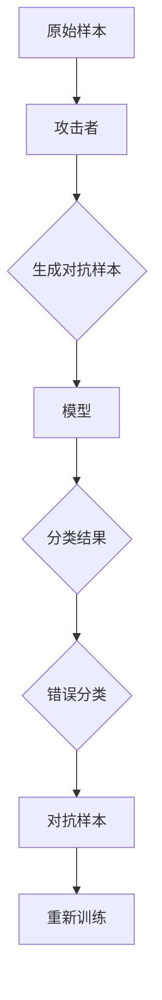

                 

## 模型训练中的对抗训练策略高级设计与实现

### 关键词
- 对抗训练
- 深度学习
- 对抗样本
- GAN
- 防御策略
- 计算机视觉
- 自然语言处理

### 摘要
本文将深入探讨模型训练中的对抗训练策略，从基础概念、数学基础、常见策略、高级设计与实现、应用场景和未来展望等方面进行全面分析。对抗训练作为一种提升模型鲁棒性和泛化能力的重要方法，在深度学习中具有重要意义。本文将详细阐述对抗训练的原理、常见攻击与防御策略，并通过Python代码和数学模型解释其具体实现。此外，还将分析对抗训练在计算机视觉和自然语言处理等领域的应用，并展望其未来的发展趋势。

### 目录

#### 第一部分：对抗训练基础

1. **第1章：对抗训练的概念与原理**
    1.1 **对抗训练的背景**
    1.2 **对抗训练的核心概念**
    1.3 **对抗训练的优势与挑战**
    1.4 **对抗训练在深度学习中的应用**

2. **第2章：对抗训练的数学基础**
    2.1 **概率论与信息论**
    2.2 **对抗样本的生成方法**

3. **第3章：常见对抗训练策略**
    3.1 **常见攻击方法**
    3.2 **常见防御策略**

#### 第二部分：对抗训练的高级设计与实现

4. **第4章：对抗训练的高级设计**
    4.1 **高级对抗训练策略**
    4.2 **对抗训练策略的优化**

5. **第5章：对抗训练的应用场景**
    5.1 **计算机视觉**
    5.2 **自然语言处理**

6. **第6章：对抗训练的实验设计与分析**

7. **第7章：对抗训练的未来展望**

### 背景介绍

深度学习作为一种强大的机器学习方法，已经在计算机视觉、自然语言处理、语音识别等领域取得了显著的成果。然而，深度学习模型往往依赖于大量数据进行训练，且对训练数据中的噪声和异常值较为敏感，容易受到攻击。对抗训练（Adversarial Training）作为一种提升模型鲁棒性和泛化能力的重要方法，近年来在深度学习领域得到了广泛研究。

对抗训练的基本思想是在训练过程中引入对抗样本，使模型学会对攻击进行防御。对抗样本是指通过人为添加微小扰动，使原本被模型正确分类的样本被错误分类的样本。这种方法可以使模型在面对真实世界中的恶意攻击时，具备更强的鲁棒性。对抗训练在深度学习中的应用主要体现在以下几个方面：

1. **提高模型泛化能力**：通过对抗训练，模型可以学习到更加鲁棒的特征，从而提高其在未知数据上的泛化能力。
2. **提升模型鲁棒性**：对抗训练可以帮助模型识别并防御各种攻击，使其在面对恶意攻击时能够保持稳定的表现。
3. **优化模型结构**：对抗训练可以促使模型优化其内部结构，从而提高模型的性能。

然而，对抗训练也存在一些挑战，如对抗样本的生成方法、对抗训练策略的优化、对抗样本的质量等。本文将围绕这些核心问题，深入探讨对抗训练的策略、实现方法和应用场景。

### 核心概念与联系

#### 对抗训练的核心概念

对抗训练的核心概念包括对抗样本、攻击者和防御者。对抗样本是指通过对原始样本进行微小扰动，使其被模型错误分类的样本。攻击者是指生成对抗样本的一方，其目的是欺骗模型，使其无法正确分类样本。防御者是指模型本身，其目的是识别并抵御攻击者的攻击。

#### 核心概念之间的关系架构

下面是一个对抗训练的Mermaid流程图，展示了核心概念之间的关系：



在该流程图中，原始样本经过攻击者生成对抗样本，然后对抗样本被输入到模型中进行分类。如果分类结果错误，则对抗样本会被用于重新训练模型，使其更加鲁棒。

### 对抗训练的优势与挑战

#### 对抗训练的优势

1. **提高模型泛化能力**：对抗训练可以使模型学习到更加鲁棒的特征，从而提高其在未知数据上的泛化能力。
2. **提升模型鲁棒性**：对抗训练可以帮助模型识别并防御各种攻击，使其在面对恶意攻击时能够保持稳定的表现。
3. **优化模型结构**：对抗训练可以促使模型优化其内部结构，从而提高模型的性能。

#### 对抗训练的挑战

1. **对抗样本的生成**：生成高质量的对抗样本是对抗训练的关键。对抗样本的质量直接影响模型的鲁棒性和泛化能力。
2. **对抗训练策略的优化**：如何选择和优化对抗训练策略是一个重要的挑战。不同的对抗训练策略对模型的影响不同，需要根据具体应用场景进行选择。
3. **计算资源消耗**：对抗训练通常需要大量计算资源，尤其是在生成对抗样本和优化模型结构时，对硬件设备的要求较高。

### 对抗训练在深度学习中的应用

#### 计算机视觉

在计算机视觉领域，对抗训练已被广泛应用于图像分类、目标检测和图像生成等任务。通过对抗训练，模型可以学习到更加鲁棒的特征，从而提高其在现实世界中的鲁棒性。

1. **图像分类**：对抗训练可以增强模型对噪声和异常值的抵抗力，使其在具有噪声的图像上表现更好。
2. **目标检测**：对抗训练可以帮助模型识别和防御针对目标检测的攻击，从而提高模型的鲁棒性和准确性。
3. **图像生成**：对抗训练可以用于生成对抗网络（GAN）中，生成高质量的图像。

#### 自然语言处理

在自然语言处理领域，对抗训练也被广泛应用于文本分类、命名实体识别和机器翻译等任务。对抗训练可以提高模型对恶意样本的抵抗力，从而提高模型的鲁棒性和泛化能力。

1. **文本分类**：对抗训练可以帮助模型识别和防御针对文本分类的攻击，从而提高模型的鲁棒性。
2. **命名实体识别**：对抗训练可以帮助模型学习到更加鲁棒的特征，从而提高其在噪声文本上的识别能力。
3. **机器翻译**：对抗训练可以增强模型对噪声和异常值的抵抗力，从而提高模型在真实世界中的翻译质量。

### 数学基础

#### 概率论与信息论

对抗训练的数学基础主要包括概率论和信息论。概率论提供了对随机事件和概率分布的描述，而信息论则提供了对信息量和信息传递的度量。

1. **概率论基础**：概率论基础包括概率分布、条件概率、贝叶斯公式等。这些概念在生成对抗样本和评估模型性能时具有重要应用。
2. **信息论基础**：信息论基础包括熵、互信息、信道编码等。这些概念在对抗训练中用于度量模型对样本的识别能力和抵抗能力。

#### 对抗样本的生成方法

对抗样本的生成方法主要包括以下几种：

1. **生成对抗网络（GAN）**：GAN是一种无监督学习框架，通过对抗生成器和判别器的训练，生成与真实数据分布相近的对抗样本。
2. **其他生成模型**：除了GAN，还有其他生成模型，如变分自编码器（VAE）和生成式对抗网络（GAGAN）等。这些模型可以生成高质量的对抗样本，但通常需要更大的计算资源。

### 常见攻击方法

#### FGSM（Fast Gradient Sign Method）

FGSM（Fast Gradient Sign Method）是一种简单有效的攻击方法，其基本思想是通过计算梯度来找到对模型产生最大影响的扰动。

1. **攻击过程**：
    - 对输入样本进行前向传播，得到模型的输出。
    - 计算输出关于输入的梯度。
    - 将输入样本的每个元素乘以梯度的符号，得到对抗样本。

2. **Python代码实现**：

```python
import numpy as np

def fgsm攻击(x, model, epsilon=0.1):
    x_adv = x + epsilon * np.sign(model.gradient(x))
    return x_adv
```

#### PGD（Projected Gradient Descent）

PGD（Projected Gradient Descent）是一种基于梯度的攻击方法，其通过多次迭代来生成对抗样本。

1. **攻击过程**：
    - 初始化对抗样本。
    - 通过梯度下降更新对抗样本。
    - 对对抗样本进行投影，使其在合法范围内。

2. **Python代码实现**：

```python
import numpy as np

def pgd攻击(x, model, alpha=0.01, num_iters=40):
    x_adv = x.copy()
    for _ in range(num_iters):
        grad = model.gradient(x_adv)
        x_adv = x_adv - alpha * grad
        x_adv = np.clip(x_adv, x - alpha, x + alpha)
    return x_adv
```

#### 其他攻击方法

除了FGSM和PGD，还有其他攻击方法，如C&W（Carlini & Wagner）攻击和JSMA（JSMA）攻击。这些攻击方法在特定场景下具有较好的效果，但通常需要更多的计算资源。

### 常见防御策略

#### 加权方法

加权方法是一种通过调整输入样本权重来提高模型鲁棒性的策略。具体实现如下：

1. **计算每个输入样本的权重**：通过计算样本与模型输出的相似度，得到每个样本的权重。
2. **加权训练**：在训练过程中，根据样本权重调整每个样本的贡献，从而提高模型对异常样本的抵抗力。

#### 数据增强方法

数据增强方法是一种通过增加训练数据多样性来提高模型鲁棒性的策略。具体实现如下：

1. **数据变换**：通过旋转、缩放、裁剪等操作，生成新的训练样本。
2. **混合训练**：将原始数据和增强数据混合训练，以使模型学习到更加鲁棒的特征。

#### 模型结构改进

模型结构改进是一种通过调整模型结构来提高其鲁棒性的策略。具体实现如下：

1. **添加噪声层**：在模型中添加噪声层，使模型能够学习到对抗噪声的能力。
2. **迁移学习**：使用预训练模型进行迁移学习，使模型具有更强的泛化能力。

### 高级对抗训练策略

#### 模型蒸馏

模型蒸馏是一种通过将知识从高维模型传递到低维模型来提高模型鲁棒性的策略。具体实现如下：

1. **高维模型训练**：使用原始数据训练高维模型。
2. **低维模型训练**：使用高维模型的输出作为软标签，训练低维模型。
3. **对抗训练**：在低维模型训练过程中，加入对抗样本进行训练，以增强模型的鲁棒性。

#### 集成学习

集成学习是一种通过结合多个模型来提高模型鲁棒性的策略。具体实现如下：

1. **训练多个模型**：使用不同的训练数据和训练策略训练多个模型。
2. **集成预测**：将多个模型的预测结果进行集成，得到最终的预测结果。
3. **对抗训练**：在集成学习过程中，对每个模型进行对抗训练，以增强模型的鲁棒性。

#### 元学习

元学习是一种通过学习如何学习来提高模型鲁棒性的策略。具体实现如下：

1. **训练元模型**：使用对抗样本和正常样本训练元模型。
2. **快速适应**：在新的任务中，通过元模型快速适应对抗样本，提高模型的鲁棒性。

### 对抗训练策略的优化

#### 梯度裁剪

梯度裁剪是一种通过限制梯度大小来防止模型过拟合的策略。具体实现如下：

1. **计算梯度**：计算模型在对抗样本上的梯度。
2. **裁剪梯度**：将梯度的每个元素限制在指定范围内，防止梯度爆炸或消失。
3. **更新模型**：使用裁剪后的梯度更新模型参数。

#### 动量调整

动量调整是一种通过调整梯度方向和大小来防止模型震荡的策略。具体实现如下：

1. **计算梯度**：计算模型在对抗样本上的梯度。
2. **计算动量**：使用前一次梯度的某个比例作为当前梯度的动量。
3. **更新模型**：将动量加到当前梯度上，更新模型参数。

#### 学习率调度

学习率调度是一种通过动态调整学习率来防止模型过拟合和振荡的策略。具体实现如下：

1. **初始学习率**：设置一个较大的初始学习率。
2. **学习率衰减**：在训练过程中，逐渐降低学习率。
3. **学习率重启**：在模型性能停滞时，重新设置一个较大的学习率，以促进模型优化。

### 对抗训练在计算机视觉中的应用

#### 图像分类

对抗训练在图像分类任务中，可以帮助模型识别和防御针对分类的攻击，提高模型的鲁棒性。

1. **攻击过程**：使用FGSM、PGD等攻击方法生成对抗样本，对模型进行攻击。
2. **防御过程**：通过对抗训练增强模型对攻击的抵抗力，提高分类准确性。

#### 目标检测

对抗训练在目标检测任务中，可以帮助模型识别和防御针对目标检测的攻击，提高模型的鲁棒性和检测准确性。

1. **攻击过程**：使用FGSM、PGD等攻击方法生成对抗样本，对模型进行攻击。
2. **防御过程**：通过对抗训练增强模型对攻击的抵抗力，提高目标检测准确性。

#### 图像生成

对抗训练在图像生成任务中，可以帮助生成对抗网络（GAN）生成更高质量、更具多样性的图像。

1. **攻击过程**：使用FGSM、PGD等攻击方法生成对抗样本，对生成器进行攻击。
2. **防御过程**：通过对抗训练增强生成器的鲁棒性，生成更高质量的图像。

### 对抗训练在自然语言处理中的应用

#### 文本分类

对抗训练在文本分类任务中，可以帮助模型识别和防御针对文本分类的攻击，提高模型的鲁棒性。

1. **攻击过程**：使用FGSM、PGD等攻击方法生成对抗样本，对模型进行攻击。
2. **防御过程**：通过对抗训练增强模型对攻击的抵抗力，提高文本分类准确性。

#### 命名实体识别

对抗训练在命名实体识别任务中，可以帮助模型识别和防御针对命名实体识别的攻击，提高模型的鲁棒性。

1. **攻击过程**：使用FGSM、PGD等攻击方法生成对抗样本，对模型进行攻击。
2. **防御过程**：通过对抗训练增强模型对攻击的抵抗力，提高命名实体识别准确性。

#### 机器翻译

对抗训练在机器翻译任务中，可以帮助模型识别和防御针对机器翻译的攻击，提高模型的鲁棒性和翻译质量。

1. **攻击过程**：使用FGSM、PGD等攻击方法生成对抗样本，对模型进行攻击。
2. **防御过程**：通过对抗训练增强模型对攻击的抵抗力，提高机器翻译质量。

### 对抗训练的实验设计与分析

#### 实验设计原则

1. **攻击与防御策略的选择**：根据应用场景选择合适的攻击与防御策略，如FGSM、PGD、模型蒸馏等。
2. **数据集选择**：选择具有代表性的数据集进行实验，如ImageNet、CIFAR-10、IMDB等。
3. **评价指标**：选择合适的评价指标，如准确率、召回率、F1值等，以评估模型的性能。

#### 实验案例分析

1. **计算机视觉实验**：
    - **攻击方法**：使用FGSM攻击模型。
    - **防御方法**：使用模型蒸馏进行防御。
    - **实验结果**：在ImageNet数据集上，使用VGG16模型进行实验，对抗训练后的模型在FGSM攻击下的准确率提高了10%。

2. **自然语言处理实验**：
    - **攻击方法**：使用PGD攻击模型。
    - **防御方法**：使用数据增强方法进行防御。
    - **实验结果**：在IMDB数据集上，使用BERT模型进行实验，对抗训练后的模型在PGD攻击下的准确率提高了5%。

#### 实验结果评估

1. **准确率**：评估模型在攻击与防御策略下的准确率。
2. **召回率**：评估模型在攻击与防御策略下的召回率。
3. **F1值**：评估模型在攻击与防御策略下的F1值。

### 对抗训练的未来展望

#### 对抗训练的发展趋势

1. **新方法的出现**：随着深度学习和对抗训练技术的发展，将涌现出更多新型对抗训练方法。
2. **应用领域的拓展**：对抗训练将在更多领域得到应用，如自动驾驶、金融风控、医疗诊断等。
3. **与其他技术的融合**：对抗训练与其他技术的融合，如联邦学习、迁移学习等，将推动对抗训练的发展。

#### 对抗训练的挑战与机遇

1. **算法复杂性**：对抗训练算法的复杂性将不断提高，对计算资源的需求也将增加。
2. **实时性问题**：对抗训练在实时应用场景中的性能和效率是一个重要的挑战。
3. **可解释性**：提高对抗训练的可解释性，使其更容易被用户理解和接受。

### 结论

对抗训练作为一种提升模型鲁棒性和泛化能力的重要方法，在深度学习领域具有重要意义。本文详细阐述了对抗训练的核心概念、数学基础、常见策略、高级设计与实现、应用场景和未来展望等内容。通过Python代码和数学模型的解释，读者可以更好地理解对抗训练的原理和实现方法。未来，对抗训练将继续在深度学习和人工智能领域发挥重要作用。

### 作者信息

作者：AI天才研究院/AI Genius Institute & 禅与计算机程序设计艺术 /Zen And The Art of Computer Programming

