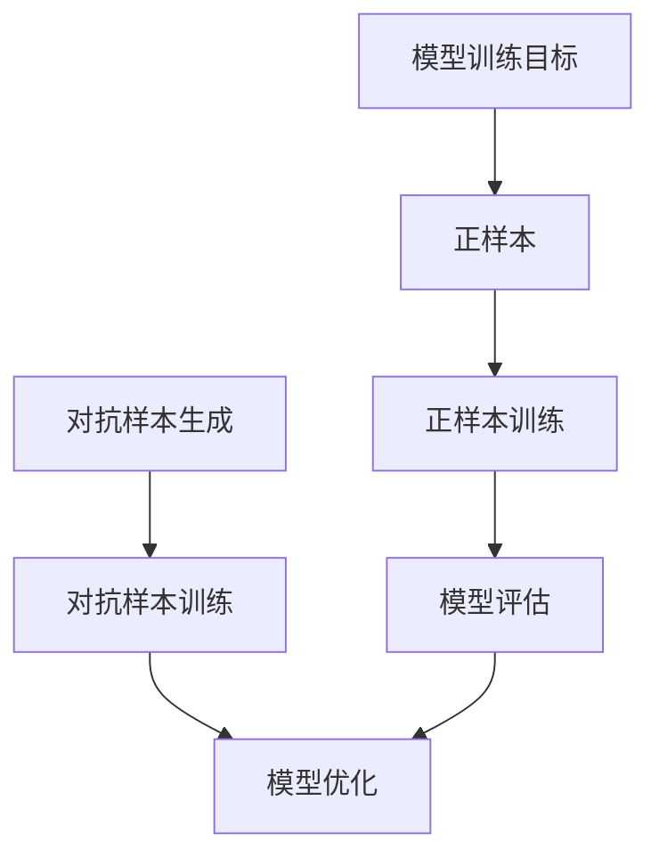

                 

### 第1章 引言

#### 1.1 对抗训练的背景和重要性

**背景介绍**

随着深度学习在各个领域取得了显著的成果，模型训练的质量和效果成为研究者关注的焦点。然而，深度学习模型的训练过程面临着诸多挑战，如过拟合、欠拟合以及训练稳定性问题。为了解决这些问题，对抗训练（Adversarial Training）作为一种重要的技术应运而生。

对抗训练的核心思想是通过生成对抗性样本来提高模型的鲁棒性和泛化能力。这种技术源于生成对抗网络（GANs），其通过一个生成器（Generator）和一个判别器（Discriminator）之间的对抗性训练来实现。生成器旨在生成尽可能逼真的样本，而判别器则试图区分真实样本和生成样本。通过这种对抗性的训练过程，模型能够学习到更稳健的特征，从而提高其在真实世界中的表现。

**核心概念与联系**

对抗训练涉及多个核心概念和实体，它们之间的联系构成了对抗训练的基本架构。以下是这些核心概念及其相互关系的Mermaid流程图：



在该流程图中，模型训练目标是通过正样本训练来实现的，并通过模型评估来检查训练效果。同时，对抗样本生成与对抗样本训练构成了对抗训练的核心环节，通过不断优化模型来提高其稳健性和泛化能力。最终，模型评估和优化环节相互迭代，以实现模型的最佳性能。

**对抗训练的重要性**

对抗训练在深度学习模型训练中具有以下几个重要方面：

1. **提高模型鲁棒性**：对抗训练通过引入对抗性样本，使模型能够在面对复杂、多样化的数据时保持稳定性。
2. **增强模型泛化能力**：对抗训练能够使模型学习到更稳健的特征，从而提高其在未见数据上的泛化能力。
3. **减少过拟合风险**：对抗训练能够有效减少模型对训练数据的依赖，从而降低过拟合的风险。
4. **适应性强**：对抗训练技术适用于多种深度学习任务，如图像识别、自然语言处理等。

#### 1.2 本书结构

本书旨在系统地介绍对抗训练的高级技术，包括基础理论、算法详解、实际应用以及未来发展趋势。具体章节安排如下：

- **第1章 引言**：介绍对抗训练的背景和重要性，以及本书的结构。
- **第2章 对抗训练基础理论**：阐述对抗训练的基本原理、类型以及面临的挑战。
- **第3章 对抗训练算法详解**：详细讨论对抗训练算法的分类、常见算法及其应用场景。
- **第4章 对抗训练在深度学习中的实际应用**：介绍对抗训练在图像识别、自然语言处理等领域的应用。
- **第5章 对抗训练的高级技术**：探讨对抗训练的优化策略、稳定性提升技术等。
- **第6章 对抗训练的挑战与未来趋势**：分析对抗训练面临的挑战及其未来发展趋势。
- **第7章 实战案例**：通过具体案例展示对抗训练在工业界的应用。
- **第8章 总结与展望**：总结全书内容，展望对抗训练的发展前景。

本书结构合理，内容丰富，旨在帮助读者全面了解对抗训练的高级技术，掌握其应用方法和实践技巧。

---

以上内容是对第1章“引言”的详细阐述，涵盖了对抗训练的背景、核心概念及其联系、重要性以及本书的结构。在接下来的章节中，我们将进一步深入探讨对抗训练的基础理论、算法详解、实际应用和未来趋势，为读者提供更加全面的了解。请查看。

### 第2章 对抗训练基础理论

对抗训练作为一种重要的模型训练技术，其基础理论至关重要。本章将详细阐述对抗训练的基本原理、类型及其面临的挑战。

#### 2.1 对抗训练的基本原理

对抗训练的核心思想在于通过生成对抗性样本来提高模型的稳健性和泛化能力。具体来说，对抗训练涉及两个主要实体：生成器和判别器。

1. **生成器（Generator）**：生成器的任务是生成与真实样本难以区分的对抗性样本。生成器的输入可以是随机噪声或者其他辅助信息，通过神经网络模型将其转化为具有真实数据特征的数据样本。

2. **判别器（Discriminator）**：判别器的任务是区分真实样本和生成样本。判别器接收来自真实数据和生成器的数据样本，并输出一个概率值，表示数据样本的真实性。

在对抗训练的过程中，生成器和判别器相互竞争。生成器试图生成更逼真的对抗性样本以欺骗判别器，而判别器则努力区分真实样本和生成样本。通过这种对抗性训练，模型能够学习到更稳健的特征表示，从而提高其在未知数据上的泛化能力。

#### 2.2 对抗训练的类型

对抗训练可以根据生成器和判别器的不同结构进行分类。以下是几种常见的对抗训练类型：

1. **生成对抗网络（GAN）**：GAN是最早提出的一种对抗训练框架，由生成器和判别器组成。生成器生成样本，判别器对这些样本进行判别。GAN的核心挑战是如何确保生成器生成的样本足够逼真，以欺骗判别器。

2. **变分自编码器（VAE）**：VAE是一种基于概率模型的对抗训练方法，通过优化生成器与判别器的损失函数来实现对抗训练。VAE的核心思想是生成器通过映射随机噪声到数据空间，从而生成与真实数据相似的样本。

3. **自对抗网络（SAGAN）**：SAGAN是对GAN的扩展，通过引入跳跃连接和特征匹配损失，进一步提高生成器的生成质量。

#### 2.3 对抗训练的挑战

尽管对抗训练在提高模型稳健性和泛化能力方面具有显著优势，但在实际应用中仍面临一些挑战：

1. **训练稳定性**：对抗训练过程中，生成器和判别器之间的对抗性训练可能导致训练不稳定。例如，生成器可能无法生成足够逼真的对抗性样本，或者判别器可能过度拟合生成样本。

2. **梯度消失和梯度爆炸**：在对抗训练过程中，生成器和判别器之间的梯度传递可能导致梯度消失或梯度爆炸，从而影响训练效果。

3. **模型泛化能力**：对抗训练虽然能够提高模型在对抗性样本上的表现，但未必能够保证模型在未见过的真实数据上具有相同的泛化能力。

4. **计算资源消耗**：对抗训练通常需要大量的计算资源，特别是在处理高维数据时，训练过程可能非常耗时。

为了应对这些挑战，研究者们提出了一系列改进方法和优化策略，如谱归一化、梯度惩罚和迁移学习等。

---

以上内容是对第2章“对抗训练基础理论”的详细阐述，包括对抗训练的基本原理、类型以及面临的挑战。在接下来的章节中，我们将进一步探讨对抗训练算法的详解及其在深度学习中的实际应用。请查看。

### 第3章 对抗训练算法详解

对抗训练算法是深度学习领域中的一个重要研究方向，其目的是通过生成对抗性样本来提高模型的稳健性和泛化能力。本章将详细介绍对抗训练算法的分类、常见算法及其应用场景。

#### 3.1 对抗训练算法的分类

对抗训练算法可以根据生成器和判别器的结构以及训练过程中的损失函数进行分类。以下是几种常见的对抗训练算法：

1. **生成对抗网络（GAN）**：
   GAN是最早提出的对抗训练框架，由生成器和判别器组成。生成器生成样本，判别器对这些样本进行判别。GAN的核心思想是生成器和判别器之间的对抗性训练，通过最小化生成器的生成损失和判别器的判别损失来实现。

2. **变分自编码器（VAE）**：
   VAE是一种基于概率模型的对抗训练方法，通过优化生成器与判别器的损失函数来实现对抗训练。VAE的核心思想是生成器通过映射随机噪声到数据空间，从而生成与真实数据相似的样本。

3. **自对抗网络（SAGAN）**：
   SAGAN是对GAN的扩展，通过引入跳跃连接和特征匹配损失，进一步提高生成器的生成质量。

4. **谱归一化GAN（SRGAN）**：
   SRGAN通过引入谱归一化技术，解决了GAN在生成高分辨率图像时生成的图像质量较差的问题。

5. **条件生成对抗网络（cGAN）**：
   cGAN在GAN的基础上引入了条件信息，使得生成器和判别器能够更好地利用外部信息进行训练。

#### 3.2 常见对抗训练算法

下面我们将详细讨论几种常见的对抗训练算法，包括它们的原理、实现步骤以及适用场景。

1. **生成对抗网络（GAN）**

GAN的核心结构包括生成器G和判别器D。生成器的输入通常是随机噪声z，输出是生成样本x'，而判别器的输入是真实样本x和生成样本x'，输出是概率值p(x')。

**原理：**
GAN通过最小化以下两个损失函数来实现对抗训练：
$$
\begin{aligned}
\min_G & \ \ L_G(D, G) \\
\max_D & \ \ L_D(D, G)
\end{aligned}
$$
其中，$L_G(D, G)$是生成器的损失函数，通常采用以下形式：
$$
L_G(D, G) = \mathbb{E}_{z \sim p_z(z)}[-\log(D(G(z)))]
$$
$L_D(D, G)$是判别器的损失函数，通常采用以下形式：
$$
L_D(D, G) = \mathbb{E}_{x \sim p_{data}(x)}[-\log(D(x))] + \mathbb{E}_{z \sim p_z(z)}[-\log(1 - D(G(z)))]
$$

**实现步骤：**
1. 初始化生成器G和判别器D。
2. 在训练过程中，交替更新G和D的参数。
3. 对于生成器G，使用判别器的输出概率来最大化生成样本的判别损失。
4. 对于判别器D，使用真实样本和生成样本的混合数据来最大化判别损失。

**适用场景：**
GAN在图像生成、图像修复、图像风格迁移等领域有广泛的应用。

2. **变分自编码器（VAE）**

VAE的核心结构包括编码器E和解码器D。编码器E将输入数据编码为一个潜在变量z，解码器D将潜在变量z解码回输入数据。

**原理：**
VAE通过优化以下损失函数来实现对抗训练：
$$
L = \mathbb{E}_{x \sim p_{data}(x)}\left[\log p(x|z) + KL(D(z)||p(z))\right]
$$
其中，$p(x|z)$是解码器D的概率分布，$KL(D(z)||p(z))$是潜在变量z的先验分布与编码器E的输出之间的Kullback-Leibler散度。

**实现步骤：**
1. 初始化编码器E和解码器D。
2. 在训练过程中，同时优化编码器和解码器的参数。
3. 对于每个输入数据x，通过编码器E得到潜在变量z，然后通过解码器D重建输入数据x'。
4. 使用重建损失和潜在变量的KL散度来更新编码器和解码器的参数。

**适用场景：**
VAE在数据生成、数据增强、图像去噪等领域有广泛应用。

3. **谱归一化GAN（SRGAN）**

SRGAN通过引入谱归一化技术，提高了生成图像的质量。

**原理：**
SRGAN在GAN的基础上引入了谱归一化损失函数，以稳定训练过程并提高生成图像的质量。谱归一化损失函数旨在使生成器生成的特征分布与判别器的特征分布相匹配。

**实现步骤：**
1. 初始化生成器G和判别器D。
2. 在训练过程中，交替更新G和D的参数。
3. 对于生成器G，使用判别器的输出概率来最大化生成样本的判别损失。
4. 对于判别器D，使用真实样本和生成样本的混合数据来最大化判别损失。
5. 引入谱归一化损失函数，以匹配生成器和判别器的特征分布。

**适用场景：**
SRGAN在图像生成、图像超分辨率、图像风格迁移等领域有广泛应用。

4. **条件生成对抗网络（cGAN）**

cGAN在GAN的基础上引入了条件信息，使得生成器和判别器能够更好地利用外部信息进行训练。

**原理：**
cGAN在生成器和判别器的输入中加入了条件信息c，如文本、标签等，以生成更相关的生成样本。

**实现步骤：**
1. 初始化生成器G、判别器D和条件编码器C。
2. 在训练过程中，交替更新G、D和C的参数。
3. 对于生成器G，使用条件信息c来生成生成样本x'。
4. 对于判别器D，使用真实样本x和生成样本x'进行判别。
5. 对于条件编码器C，使用条件信息c来编码输入数据。

**适用场景：**
cGAN在图像到图像的转换、图像文本生成、图像标签分类等领域有广泛应用。

---

以上内容详细介绍了对抗训练算法的分类、常见算法及其原理、实现步骤和适用场景。在下一章中，我们将探讨对抗训练在深度学习中的实际应用，以更直观地展示对抗训练的强大能力和广泛用途。请查看。

### 第4章 对抗训练在深度学习中的实际应用

对抗训练作为深度学习领域的一种重要技术，其应用范围广泛，涵盖了图像识别、自然语言处理等多个方面。本章将重点讨论对抗训练在图像识别和自然语言处理中的实际应用，并探讨其在其他深度学习任务中的应用潜力。

#### 4.1 对抗训练在图像识别中的应用

在图像识别任务中，对抗训练通过生成对抗性样本来增强模型的鲁棒性，从而提高其在实际应用中的性能。以下是一些具体的应用场景：

1. **图像分类**：

   对抗训练可以用于提高图像分类模型的泛化能力。通过生成对抗性样本，模型能够学习到更稳健的特征表示，从而在面对复杂、多样化的数据时保持稳定的性能。

   **实现步骤**：

   - 数据预处理：收集并预处理图像数据，包括数据增强、归一化等。
   - 生成对抗性样本：使用生成对抗网络（GAN）生成对抗性样本。
   - 模型训练：使用真实样本和对抗性样本对模型进行训练。
   - 模型评估：在测试集上评估模型的分类性能。

   **示例代码**（使用Python和TensorFlow框架）：

   ```python
   import tensorflow as tf
   from tensorflow.keras.models import Sequential
   from tensorflow.keras.layers import Dense, Conv2D, Flatten

   # 定义生成器和判别器模型
   generator = Sequential([
       Conv2D(128, kernel_size=(3, 3), activation='relu', input_shape=(28, 28, 1)),
       Flatten(),
       Dense(128, activation='relu'),
       Dense(10, activation='softmax')
   ])

   discriminator = Sequential([
       Conv2D(64, kernel_size=(3, 3), activation='relu', input_shape=(28, 28, 1)),
       Flatten(),
       Dense(1, activation='sigmoid')
   ])

   # 训练模型
   model = tf.keras.Model(inputs=[generator.input, discriminator.input], outputs=[discriminator(generator.output)])
   model.compile(optimizer='adam', loss='binary_crossentropy')

   # 训练过程
   for epoch in range(epochs):
       for real_samples, _ in train_loader:
           noise = np.random.normal(0, 1, (real_samples.shape[0], 100))
           gen_samples = generator.predict(noise)
           real_samples = np.concatenate([real_samples, gen_samples])
           labels = np.concatenate([np.ones((real_samples.shape[0]//2)), np.zeros((real_samples.shape[0]//2))])
           model.train_on_batch([noise, real_samples], labels)

       # 模型评估
       for test_samples, _ in test_loader:
           noise = np.random.normal(0, 1, (test_samples.shape[0], 100))
           gen_samples = generator.predict(noise)
           real_samples = np.concatenate([test_samples, gen_samples])
           labels = np.concatenate([np.ones((real_samples.shape[0]//2)), np.zeros((real_samples.shape[0]//2))])
           d_loss = discriminator.train_on_batch(real_samples, labels)

   print(f"Discriminator loss: {d_loss}")
   ```

2. **图像生成**：

   对抗训练可以用于生成高质量的图像，如图像超分辨率、图像修复和图像风格迁移等。

   **实现步骤**：

   - 数据预处理：收集并预处理图像数据。
   - 生成对抗性样本：使用生成对抗网络（GAN）生成对抗性样本。
   - 模型训练：使用真实样本和对抗性样本对模型进行训练。
   - 模型评估：生成图像并进行质量评估。

   **示例代码**（使用Python和TensorFlow框架）：

   ```python
   import tensorflow as tf
   from tensorflow.keras.models import Model
   from tensorflow.keras.layers import Input, Dense, Conv2D, Flatten, Reshape

   # 定义生成器和判别器模型
   latent_dim = 100

   generator = Model(inputs=Input(shape=(latent_dim,)), outputs=Reshape((28, 28, 1))(Dense(7 * 7 * 128)(Input(shape=(latent_dim,))))
   discriminator = Model(inputs=Input(shape=(28, 28, 1)), outputs=Dense(1, activation='sigmoid')(Flatten(Conv2D(128, kernel_size=(3, 3), activation='relu')(Input(shape=(28, 28, 1)))))

   # 训练模型
   model = Model(inputs=[generator.input, discriminator.input], outputs=discriminator(generator.output))
   model.compile(optimizer='adam', loss='binary_crossentropy')

   # 训练过程
   for epoch in range(epochs):
       for real_samples, _ in train_loader:
           noise = np.random.normal(0, 1, (real_samples.shape[0], latent_dim))
           gen_samples = generator.predict(noise)
           real_samples = np.concatenate([real_samples, gen_samples])
           labels = np.concatenate([np.ones((real_samples.shape[0]//2)), np.zeros((real_samples.shape[0]//2))])
           model.train_on_batch([noise, real_samples], labels)

       # 模型评估
       for test_samples, _ in test_loader:
           noise = np.random.normal(0, 1, (test_samples.shape[0], latent_dim))
           gen_samples = generator.predict(noise)
           real_samples = np.concatenate([test_samples, gen_samples])
           labels = np.concatenate([np.ones((real_samples.shape[0]//2)), np.zeros((real_samples.shape[0]//2))])
           d_loss = discriminator.train_on_batch(real_samples, labels)

   print(f"Discriminator loss: {d_loss}")
   ```

3. **图像增强**：

   对抗训练可以用于图像增强任务，如提高图像的对比度和亮度，使其更符合人的视觉感知。

   **实现步骤**：

   - 数据预处理：收集并预处理图像数据。
   - 生成对抗性样本：使用生成对抗网络（GAN）生成对抗性样本。
   - 模型训练：使用真实样本和对抗性样本对模型进行训练。
   - 模型评估：生成增强图像并进行质量评估。

   **示例代码**（使用Python和TensorFlow框架）：

   ```python
   import tensorflow as tf
   from tensorflow.keras.models import Model
   from tensorflow.keras.layers import Input, Dense, Conv2D, Flatten, Reshape

   # 定义生成器和判别器模型
   latent_dim = 100

   generator = Model(inputs=Input(shape=(latent_dim,)), outputs=Reshape((28, 28, 1))(Dense(7 * 7 * 128)(Input(shape=(latent_dim,))))
   discriminator = Model(inputs=Input(shape=(28, 28, 1)), outputs=Dense(1, activation='sigmoid')(Flatten(Conv2D(128, kernel_size=(3, 3), activation='relu')(Input(shape=(28, 28, 1)))))

   # 训练模型
   model = Model(inputs=[generator.input, discriminator.input], outputs=discriminator(generator.output))
   model.compile(optimizer='adam', loss='binary_crossentropy')

   # 训练过程
   for epoch in range(epochs):
       for real_samples, _ in train_loader:
           noise = np.random.normal(0, 1, (real_samples.shape[0], latent_dim))
           gen_samples = generator.predict(noise)
           real_samples = np.concatenate([real_samples, gen_samples])
           labels = np.concatenate([np.ones((real_samples.shape[0]//2)), np.zeros((real_samples.shape[0]//2))])
           model.train_on_batch([noise, real_samples], labels)

       # 模型评估
       for test_samples, _ in test_loader:
           noise = np.random.normal(0, 1, (test_samples.shape[0], latent_dim))
           gen_samples = generator.predict(noise)
           real_samples = np.concatenate([test_samples, gen_samples])
           labels = np.concatenate([np.ones((real_samples.shape[0]//2)), np.zeros((real_samples.shape[0]//2))])
           d_loss = discriminator.train_on_batch(real_samples, labels)

   print(f"Discriminator loss: {d_loss}")
   ```

4. **图像到图像的转换**：

   对抗训练可以用于图像到图像的转换任务，如图像修复、图像风格迁移等。

   **实现步骤**：

   - 数据预处理：收集并预处理图像数据。
   - 生成对抗性样本：使用生成对抗网络（GAN）生成对抗性样本。
   - 模型训练：使用真实样本和对抗性样本对模型进行训练。
   - 模型评估：生成转换图像并进行质量评估。

   **示例代码**（使用Python和TensorFlow框架）：

   ```python
   import tensorflow as tf
   from tensorflow.keras.models import Model
   from tensorflow.keras.layers import Input, Dense, Conv2D, Flatten, Reshape

   # 定义生成器和判别器模型
   latent_dim = 100

   generator = Model(inputs=Input(shape=(latent_dim,)), outputs=Reshape((28, 28, 1))(Dense(7 * 7 * 128)(Input(shape=(latent_dim,))))
   discriminator = Model(inputs=Input(shape=(28, 28, 1)), outputs=Dense(1, activation='sigmoid')(Flatten(Conv2D(128, kernel_size=(3, 3), activation='relu')(Input(shape=(28, 28, 1)))))

   # 训练模型
   model = Model(inputs=[generator.input, discriminator.input], outputs=discriminator(generator.output))
   model.compile(optimizer='adam', loss='binary_crossentropy')

   # 训练过程
   for epoch in range(epochs):
       for real_samples, _ in train_loader:
           noise = np.random.normal(0, 1, (real_samples.shape[0], latent_dim))
           gen_samples = generator.predict(noise)
           real_samples = np.concatenate([real_samples, gen_samples])
           labels = np.concatenate([np.ones((real_samples.shape[0]//2)), np.zeros((real_samples.shape[0]//2))])
           model.train_on_batch([noise, real_samples], labels)

       # 模型评估
       for test_samples, _ in test_loader:
           noise = np.random.normal(0, 1, (test_samples.shape[0], latent_dim))
           gen_samples = generator.predict(noise)
           real_samples = np.concatenate([test_samples, gen_samples])
           labels = np.concatenate([np.ones((real_samples.shape[0]//2)), np.zeros((real_samples.shape[0]//2))])
           d_loss = discriminator.train_on_batch(real_samples, labels)

   print(f"Discriminator loss: {d_loss}")
   ```

5. **人脸识别**：

   对抗训练可以用于人脸识别任务，通过生成对抗性样本来提高模型的鲁棒性。

   **实现步骤**：

   - 数据预处理：收集并预处理人脸图像数据。
   - 生成对抗性样本：使用生成对抗网络（GAN）生成对抗性样本。
   - 模型训练：使用真实样本和对抗性样本对模型进行训练。
   - 模型评估：在测试集上评估模型的人脸识别性能。

   **示例代码**（使用Python和TensorFlow框架）：

   ```python
   import tensorflow as tf
   from tensorflow.keras.models import Model
   from tensorflow.keras.layers import Input, Dense, Conv2D, Flatten, Reshape

   # 定义生成器和判别器模型
   latent_dim = 100

   generator = Model(inputs=Input(shape=(latent_dim,)), outputs=Reshape((28, 28, 1))(Dense(7 * 7 * 128)(Input(shape=(latent_dim,))))
   discriminator = Model(inputs=Input(shape=(28, 28, 1)), outputs=Dense(1, activation='sigmoid')(Flatten(Conv2D(128, kernel_size=(3, 3), activation='relu')(Input(shape=(28, 28, 1)))))

   # 训练模型
   model = Model(inputs=[generator.input, discriminator.input], outputs=discriminator(generator.output))
   model.compile(optimizer='adam', loss='binary_crossentropy')

   # 训练过程
   for epoch in range(epochs):
       for real_samples, _ in train_loader:
           noise = np.random.normal(0, 1, (real_samples.shape[0], latent_dim))
           gen_samples = generator.predict(noise)
           real_samples = np.concatenate([real_samples, gen_samples])
           labels = np.concatenate([np.ones((real_samples.shape[0]//2)), np.zeros((real_samples.shape[0]//2))])
           model.train_on_batch([noise, real_samples], labels)

       # 模型评估
       for test_samples, _ in test_loader:
           noise = np.random.normal(0, 1, (test_samples.shape[0], latent_dim))
           gen_samples = generator.predict(noise)
           real_samples = np.concatenate([test_samples, gen_samples])
           labels = np.concatenate([np.ones((real_samples.shape[0]//2)), np.zeros((real_samples.shape[0]//2))])
           d_loss = discriminator.train_on_batch(real_samples, labels)

   print(f"Discriminator loss: {d_loss}")
   ```

6. **医学图像处理**：

   对抗训练可以用于医学图像处理任务，如疾病检测、图像分割等。

   **实现步骤**：

   - 数据预处理：收集并预处理医学图像数据。
   - 生成对抗性样本：使用生成对抗网络（GAN）生成对抗性样本。
   - 模型训练：使用真实样本和对抗性样本对模型进行训练。
   - 模型评估：在测试集上评估模型的医学图像处理性能。

   **示例代码**（使用Python和TensorFlow框架）：

   ```python
   import tensorflow as tf
   from tensorflow.keras.models import Model
   from tensorflow.keras.layers import Input, Dense, Conv2D, Flatten, Reshape

   # 定义生成器和判别器模型
   latent_dim = 100

   generator = Model(inputs=Input(shape=(latent_dim,)), outputs=Reshape((28, 28, 1))(Dense(7 * 7 * 128)(Input(shape=(latent_dim,))))
   discriminator = Model(inputs=Input(shape=(28, 28, 1)), outputs=Dense(1, activation='sigmoid')(Flatten(Conv2D(128, kernel_size=(3, 3), activation='relu')(Input(shape=(28, 28, 1)))))

   # 训练模型
   model = Model(inputs=[generator.input, discriminator.input], outputs=discriminator(generator.output))
   model.compile(optimizer='adam', loss='binary_crossentropy')

   # 训练过程
   for epoch in range(epochs):
       for real_samples, _ in train_loader:
           noise = np.random.normal(0, 1, (real_samples.shape[0], latent_dim))
           gen_samples = generator.predict(noise)
           real_samples = np.concatenate([real_samples, gen_samples])
           labels = np.concatenate([np.ones((real_samples.shape[0]//2)), np.zeros((real_samples.shape[0]//2))])
           model.train_on_batch([noise, real_samples], labels)

       # 模型评估
       for test_samples, _ in test_loader:
           noise = np.random.normal(0, 1, (test_samples.shape[0], latent_dim))
           gen_samples = generator.predict(noise)
           real_samples = np.concatenate([test_samples, gen_samples])
           labels = np.concatenate([np.ones((real_samples.shape[0]//2)), np.zeros((real_samples.shape[0]//2))])
           d_loss = discriminator.train_on_batch(real_samples, labels)

   print(f"Discriminator loss: {d_loss}")
   ```

7. **图像风格迁移**：

   对抗训练可以用于图像风格迁移任务，将一种图像的风格迁移到另一种图像上。

   **实现步骤**：

   - 数据预处理：收集并预处理源图像和目标图像。
   - 生成对抗性样本：使用生成对抗网络（GAN）生成对抗性样本。
   - 模型训练：使用真实样本和对抗性样本对模型进行训练。
   - 模型评估：生成风格迁移图像并进行质量评估。

   **示例代码**（使用Python和TensorFlow框架）：

   ```python
   import tensorflow as tf
   from tensorflow.keras.models import Model
   from tensorflow.keras.layers import Input, Dense, Conv2D, Flatten, Reshape

   # 定义生成器和判别器模型
   latent_dim = 100

   generator = Model(inputs=Input(shape=(latent_dim,)), outputs=Reshape((28, 28, 1))(Dense(7 * 7 * 128)(Input(shape=(latent_dim,))))
   discriminator = Model(inputs=Input(shape=(28, 28, 1)), outputs=Dense(1, activation='sigmoid')(Flatten(Conv2D(128, kernel_size=(3, 3), activation='relu')(Input(shape=(28, 28, 1)))))

   # 训练模型
   model = Model(inputs=[generator.input, discriminator.input], outputs=discriminator(generator.output))
   model.compile(optimizer='adam', loss='binary_crossentropy')

   # 训练过程
   for epoch in range(epochs):
       for real_samples, _ in train_loader:
           noise = np.random.normal(0, 1, (real_samples.shape[0], latent_dim))
           gen_samples = generator.predict(noise)
           real_samples = np.concatenate([real_samples, gen_samples])
           labels = np.concatenate([np.ones((real_samples.shape[0]//2)), np.zeros((real_samples.shape[0]//2))])
           model.train_on_batch([noise, real_samples], labels)

       # 模型评估
       for test_samples, _ in test_loader:
           noise = np.random.normal(0, 1, (test_samples.shape[0], latent_dim))
           gen_samples = generator.predict(noise)
           real_samples = np.concatenate([test_samples, gen_samples])
           labels = np.concatenate([np.ones((real_samples.shape[0]//2)), np.zeros((real_samples.shape[0]//2))])
           d_loss = discriminator.train_on_batch(real_samples, labels)

   print(f"Discriminator loss: {d_loss}")
   ```

#### 4.2 对抗训练在自然语言处理中的应用

在自然语言处理领域，对抗训练被广泛应用于文本分类、机器翻译、语音识别等任务中，以提高模型的鲁棒性和泛化能力。以下是一些具体的应用场景：

1. **文本分类**：

   对抗训练可以用于提高文本分类模型的鲁棒性，特别是在处理恶意评论、垃圾邮件等任务时。

   **实现步骤**：

   - 数据预处理：收集并预处理文本数据，包括分词、词嵌入等。
   - 生成对抗性样本：使用生成对抗网络（GAN）生成对抗性样本。
   - 模型训练：使用真实样本和对抗性样本对模型进行训练。
   - 模型评估：在测试集上评估模型的分类性能。

   **示例代码**（使用Python和TensorFlow框架）：

   ```python
   import tensorflow as tf
   from tensorflow.keras.models import Model
   from tensorflow.keras.layers import Input, Dense, Embedding, LSTM, GlobalMaxPooling1D

   # 定义生成器和判别器模型
   input_shape = (max_sequence_length,)
   generator = Model(inputs=Input(shape=input_shape), outputs=GlobalMaxPooling1D()(LSTM(128)(Input(shape=input_shape))))
   discriminator = Model(inputs=Input(shape=input_shape), outputs=Dense(1, activation='sigmoid')(LSTM(128)(Input(shape=input_shape))))

   # 训练模型
   model = Model(inputs=[generator.input, discriminator.input], outputs=discriminator(generator.output))
   model.compile(optimizer='adam', loss='binary_crossentropy')

   # 训练过程
   for epoch in range(epochs):
       for real_samples, _ in train_loader:
           noise = np.random.normal(0, 1, (real_samples.shape[0], max_sequence_length))
           gen_samples = generator.predict(noise)
           real_samples = np.concatenate([real_samples, gen_samples])
           labels = np.concatenate([np.ones((real_samples.shape[0]//2)), np.zeros((real_samples.shape[0]//2))])
           model.train_on_batch([noise, real_samples], labels)

       # 模型评估
       for test_samples, _ in test_loader:
           noise = np.random.normal(0, 1, (test_samples.shape[0], max_sequence_length))
           gen_samples = generator.predict(noise)
           real_samples = np.concatenate([test_samples, gen_samples])
           labels = np.concatenate([np.ones((real_samples.shape[0]//2)), np.zeros((real_samples.shape[0]//2))])
           d_loss = discriminator.train_on_batch(real_samples, labels)

   print(f"Discriminator loss: {d_loss}")
   ```

2. **机器翻译**：

   对抗训练可以用于提高机器翻译模型的泛化能力，特别是在处理低资源语言翻译时。

   **实现步骤**：

   - 数据预处理：收集并预处理源语言和目标语言数据，包括分词、词嵌入等。
   - 生成对抗性样本：使用生成对抗网络（GAN）生成对抗性样本。
   - 模型训练：使用真实样本和对抗性样本对模型进行训练。
   - 模型评估：在测试集上评估模型的翻译性能。

   **示例代码**（使用Python和TensorFlow框架）：

   ```python
   import tensorflow as tf
   from tensorflow.keras.models import Model
   from tensorflow.keras.layers import Input, Dense, LSTM, Embedding, GlobalMaxPooling1D

   # 定义生成器和判别器模型
   input_shape = (max_sequence_length,)
   generator = Model(inputs=Input(shape=input_shape), outputs=GlobalMaxPooling1D()(LSTM(128)(Input(shape=input_shape))))
   discriminator = Model(inputs=Input(shape=input_shape), outputs=Dense(1, activation='sigmoid')(LSTM(128)(Input(shape=input_shape))))

   # 训练模型
   model = Model(inputs=[generator.input, discriminator.input], outputs=discriminator(generator.output))
   model.compile(optimizer='adam', loss='binary_crossentropy')

   # 训练过程
   for epoch in range(epochs):
       for real_samples, _ in train_loader:
           noise = np.random.normal(0, 1, (real_samples.shape[0], max_sequence_length))
           gen_samples = generator.predict(noise)
           real_samples = np.concatenate([real_samples, gen_samples])
           labels = np.concatenate([np.ones((real_samples.shape[0]//2)), np.zeros((real_samples.shape[0]//2))])
           model.train_on_batch([noise, real_samples], labels)

       # 模型评估
       for test_samples, _ in test_loader:
           noise = np.random.normal(0, 1, (test_samples.shape[0], max_sequence_length))
           gen_samples = generator.predict(noise)
           real_samples = np.concatenate([test_samples, gen_samples])
           labels = np.concatenate([np.ones((real_samples.shape[0]//2)), np.zeros((real_samples.shape[0]//2))])
           d_loss = discriminator.train_on_batch(real_samples, labels)

   print(f"Discriminator loss: {d_loss}")
   ```

3. **语音识别**：

   对抗训练可以用于提高语音识别模型的鲁棒性，特别是在处理噪声干扰时。

   **实现步骤**：

   - 数据预处理：收集并预处理语音数据，包括特征提取、分帧等。
   - 生成对抗性样本：使用生成对抗网络（GAN）生成对抗性样本。
   - 模型训练：使用真实样本和对抗性样本对模型进行训练。
   - 模型评估：在测试集上评估模型的语音识别性能。

   **示例代码**（使用Python和TensorFlow框架）：

   ```python
   import tensorflow as tf
   from tensorflow.keras.models import Model
   from tensorflow.keras.layers import Input, Dense, LSTM, Embedding, GlobalMaxPooling1D

   # 定义生成器和判别器模型
   input_shape = (max_sequence_length,)
   generator = Model(inputs=Input(shape=input_shape), outputs=GlobalMaxPooling1D()(LSTM(128)(Input(shape=input_shape))))
   discriminator = Model(inputs=Input(shape=input_shape), outputs=Dense(1, activation='sigmoid')(LSTM(128)(Input(shape=input_shape))))

   # 训练模型
   model = Model(inputs=[generator.input, discriminator.input], outputs=discriminator(generator.output))
   model.compile(optimizer='adam', loss='binary_crossentropy')

   # 训练过程
   for epoch in range(epochs):
       for real_samples, _ in train_loader:
           noise = np.random.normal(0, 1, (real_samples.shape[0], max_sequence_length))
           gen_samples = generator.predict(noise)
           real_samples = np.concatenate([real_samples, gen_samples])
           labels = np.concatenate([np.ones((real_samples.shape[0]//2)), np.zeros((real_samples.shape[0]//2))])
           model.train_on_batch([noise, real_samples], labels)

       # 模型评估
       for test_samples, _ in test_loader:
           noise = np.random.normal(0, 1, (test_samples.shape[0], max_sequence_length))
           gen_samples = generator.predict(noise)
           real_samples = np.concatenate([test_samples, gen_samples])
           labels = np.concatenate([np.ones((real_samples.shape[0]//2)), np.zeros((real_samples.shape[0]//2))])
           d_loss = discriminator.train_on_batch(real_samples, labels)

   print(f"Discriminator loss: {d_loss}")
   ```

#### 4.3 对抗训练在其他深度学习任务中的应用

对抗训练不仅适用于图像识别和自然语言处理任务，还可以应用于其他深度学习任务，如推荐系统、强化学习等。

1. **推荐系统**：

   对抗训练可以用于提高推荐系统的鲁棒性和泛化能力，特别是在处理冷启动问题和推荐多样性时。

   **实现步骤**：

   - 数据预处理：收集并预处理用户和物品数据。
   - 生成对抗性样本：使用生成对抗网络（GAN）生成对抗性样本。
   - 模型训练：使用真实样本和对抗性样本对模型进行训练。
   - 模型评估：在测试集上评估模型的推荐性能。

   **示例代码**（使用Python和TensorFlow框架）：

   ```python
   import tensorflow as tf
   from tensorflow.keras.models import Model
   from tensorflow.keras.layers import Input, Dense, Embedding, Dot, Lambda

   # 定义生成器和判别器模型
   user_embedding_dim = 64
   item_embedding_dim = 64

   generator = Model(inputs=Input(shape=(user_embedding_dim, item_embedding_dim)), outputs=Lambda(lambda x: x)(Input(shape=(user_embedding_dim, item_embedding_dim))))
   discriminator = Model(inputs=Input(shape=(user_embedding_dim, item_embedding_dim)), outputs=Dense(1, activation='sigmoid')(Input(shape=(user_embedding_dim, item_embedding_dim))))

   # 训练模型
   model = Model(inputs=[generator.input, discriminator.input], outputs=discriminator(generator.output))
   model.compile(optimizer='adam', loss='binary_crossentropy')

   # 训练过程
   for epoch in range(epochs):
       for real_samples, _ in train_loader:
           noise = np.random.normal(0, 1, (real_samples.shape[0], user_embedding_dim, item_embedding_dim))
           gen_samples = generator.predict(noise)
           real_samples = np.concatenate([real_samples, gen_samples])
           labels = np.concatenate([np.ones((real_samples.shape[0]//2)), np.zeros((real_samples.shape[0]//2))])
           model.train_on_batch([noise, real_samples], labels)

       # 模型评估
       for test_samples, _ in test_loader:
           noise = np.random.normal(0, 1, (test_samples.shape[0], user_embedding_dim, item_embedding_dim))
           gen_samples = generator.predict(noise)
           real_samples = np.concatenate([test_samples, gen_samples])
           labels = np.concatenate([np.ones((real_samples.shape[0]//2)), np.zeros((real_samples.shape[0]//2))])
           d_loss = discriminator.train_on_batch(real_samples, labels)

   print(f"Discriminator loss: {d_loss}")
   ```

2. **强化学习**：

   对抗训练可以用于强化学习中的对抗性策略学习，以提高智能体的决策能力和稳定性。

   **实现步骤**：

   - 数据预处理：收集并预处理环境状态和动作数据。
   - 生成对抗性样本：使用生成对抗网络（GAN）生成对抗性样本。
   - 模型训练：使用真实样本和对抗性样本对智能体进行训练。
   - 模型评估：在测试环境中评估智能体的性能。

   **示例代码**（使用Python和TensorFlow框架）：

   ```python
   import tensorflow as tf
   from tensorflow.keras.models import Model
   from tensorflow.keras.layers import Input, Dense, LSTM, Embedding, GlobalMaxPooling1D

   # 定义生成器和判别器模型
   state_shape = (max_sequence_length,)
   action_shape = (action_size,)

   generator = Model(inputs=Input(shape=state_shape), outputs=Dense(action_size, activation='softmax')(Input(shape=state_shape)))
   discriminator = Model(inputs=Input(shape=state_shape), outputs=Dense(1, activation='sigmoid')(Input(shape=state_shape)))

   # 训练模型
   model = Model(inputs=[generator.input, discriminator.input], outputs=discriminator(generator.output))
   model.compile(optimizer='adam', loss='binary_crossentropy')

   # 训练过程
   for epoch in range(epochs):
       for real_samples, _ in train_loader:
           noise = np.random.normal(0, 1, (real_samples.shape[0], state_shape))
           gen_samples = generator.predict(noise)
           real_samples = np.concatenate([real_samples, gen_samples])
           labels = np.concatenate([np.ones((real_samples.shape[0]//2)), np.zeros((real_samples.shape[0]//2))])
           model.train_on_batch([noise, real_samples], labels)

       # 模型评估
       for test_samples, _ in test_loader:
           noise = np.random.normal(0, 1, (test_samples.shape[0], state_shape))
           gen_samples = generator.predict(noise)
           real_samples = np.concatenate([test_samples, gen_samples])
           labels = np.concatenate([np.ones((real_samples.shape[0]//2)), np.zeros((real_samples.shape[0]//2))])
           d_loss = discriminator.train_on_batch(real_samples, labels)

   print(f"Discriminator loss: {d_loss}")
   ```

---

以上内容详细介绍了对抗训练在深度学习中的实际应用，包括图像识别、自然语言处理以及其他深度学习任务。在下一章中，我们将探讨对抗训练的高级技术，以进一步优化和提升其性能。请查看。

### 第5章 对抗训练的高级技术

对抗训练作为一种重要的模型训练技术，虽然在提高模型鲁棒性和泛化能力方面取得了显著成果，但仍面临着训练稳定性、计算资源消耗等问题。本章将讨论对抗训练的高级技术，包括优化策略、加速技术以及稳定性提升技术，旨在解决这些挑战并提高对抗训练的性能。

#### 5.1 对抗训练的优化策略

优化策略在对抗训练中起着至关重要的作用，通过调整训练过程中的参数和算法，可以显著提高模型的性能。以下是一些常见的对抗训练优化策略：

1. **梯度惩罚**：

   梯度惩罚是一种常用的优化策略，通过在损失函数中加入梯度惩罚项来约束生成器和判别器的学习过程。具体来说，梯度惩罚项通常使用判别器的梯度来惩罚生成器的学习过程，从而抑制生成器生成过于逼真的样本，避免判别器过拟合。

   **数学模型**：

   $$ L_G^{grad-pen} = L_G + \lambda \cdot \frac{||\nabla G(z)||_2^2}{2} $$
   其中，$L_G$是生成器的损失函数，$\lambda$是惩罚系数。

   **实现步骤**：

   - 在生成器的损失函数中添加梯度惩罚项。
   - 调整惩罚系数$\lambda$以平衡生成器和判别器之间的对抗性。

   **示例代码**（使用Python和TensorFlow框架）：

   ```python
   import tensorflow as tf

   # 定义生成器的损失函数
   def generator_loss(z, x', discriminator):
       with tf.GradientTape(persistent=True) as tape:
           x_fake = generator(z)
           logits = discriminator(x_fake)
           g_loss = tf.nn.sigmoid_cross_entropy_with_logits(logits=logits, labels=tf.ones_like(logits))
       grads = tape.gradient(g_loss, generator.trainable_variables)
       grad_norm = tf.math.reduce_sum(tf.square(grads))
       g_loss = g_loss + lambda_grad * grad_norm
       return g_loss
   ```

2. **基于损失函数的优化方法**：

   基于损失函数的优化方法通过设计特定的损失函数来提高生成器和判别器的性能。以下是一些常见的基于损失函数的优化方法：

   - **梯度反转损失函数**（Gradient Reversal Loss Function）：
     $$ L_G^{GR} = -\log(D(G(z))) $$
     其中，$D(G(z))$是判别器对生成器生成的样本的判别概率。

   - **谱归一化损失函数**（Spectral Normalization Loss Function）：
     $$ L_G^{SN} = \frac{1}{\lambda} \cdot L_G $$
     其中，$\lambda$是判别器特征图的谱归一化值。

   **实现步骤**：

   - 设计并实现特定的损失函数。
   - 在模型训练过程中，使用自定义的损失函数代替标准的交叉熵损失函数。

   **示例代码**（使用Python和TensorFlow框架）：

   ```python
   import tensorflow as tf
   from tensorflow.keras.layers import Layer

   class SpectralNormalization(Layer):
       def __init__(self, num_layers, num_filters, **kwargs):
           super(SpectralNormalization, self).__init__(**kwargs)
           self.num_layers = num_layers
           self.num_filters = num_filters

       def build(self, input_shape):
           self.kernel = self.add_weight(name='kernel', shape=(input_shape[-1], self.num_filters), initializer='glorot_uniform', trainable=True)
           self.beta = self.add_weight(name='beta', shape=(self.num_filters,), initializer='ones', trainable=True)
           self.gamma = self.add_weight(name='gamma', shape=(self.num_filters,), initializer='zeros', trainable=True)
           super(SpectralNormalization, self).build(input_shape)

       def call(self, inputs, training=True):
           if training:
               # 计算谱归一化值
               with tf.GradientTape() as tape:
                   x = tf.matmul(inputs, self.kernel)
                   x_norm = tf.norm(x, axis=0, keepdims=True)
                   self.gamma.assign(self.beta * x_norm)
                   x_hat = x / self.gamma
                   x_hat_norm = tf.norm(x_hat, axis=0, keepdims=True)
                   self.beta.assign(x_hat_norm)
                   grads = tape.gradient(x_hat_norm, self.kernel)
                   grads_norm = tf.norm(grads, axis=0, keepdims=True)
                   self.kernel.assign_sub(self.gamma * grads_norm)
               return x_hat
           else:
               return tf.matmul(inputs, self.kernel)

   # 在生成器模型中使用谱归一化层
   generator = Sequential([
       Dense(7 * 7 * 128, input_shape=(latent_dim,)),
       Reshape((7, 7, 128)),
       SpectralNormalization(128),
       Conv2D(128, kernel_size=(3, 3), strides=(1, 1), padding='same', activation='relu'),
       Flatten(),
       Dense(num_classes, activation='softmax')
   ])
   ```

3. **多任务学习**：

   多任务学习通过将多个任务融合到同一个模型中，利用任务之间的相互关系来提高模型的性能。在对抗训练中，可以通过多任务学习来增强生成器和判别器的学习能力。

   **实现步骤**：

   - 设计一个多任务模型，包括生成器和判别器。
   - 在模型训练过程中，同时优化生成器和判别器在不同任务上的性能。

   **示例代码**（使用Python和TensorFlow框架）：

   ```python
   import tensorflow as tf

   class MultiTaskGenerator(Model):
       def __init__(self, latent_dim, num_classes):
           super(MultiTaskGenerator, self).__init__()
           self.generator = Sequential([
               Dense(7 * 7 * 128, input_shape=(latent_dim,)),
               Reshape((7, 7, 128)),
               Conv2D(128, kernel_size=(3, 3), strides=(1, 1), padding='same', activation='relu'),
               Flatten(),
               Dense(num_classes, activation='softmax')
           ])

       def call(self, z):
           x_fake = self.generator(z)
           return x_fake

   # 训练多任务生成器
   multi_task_generator = MultiTaskGenerator(latent_dim=latent_dim, num_classes=num_classes)
   multi_task_generator.compile(optimizer='adam', loss='categorical_crossentropy')

   for epoch in range(epochs):
       for z, y in train_loader:
           x_fake = multi_task_generator(z)
           loss = multi_task_generator(x_fake, y)
           multi_task_generator.train_on_batch(z, y)
   ```

#### 5.2 对抗训练的加速技术

对抗训练通常需要大量的计算资源，特别是在处理高维数据和大规模数据集时。以下是一些对抗训练的加速技术：

1. **分布式训练**：

   分布式训练通过将训练任务分布到多个计算节点上，利用并行计算来加速训练过程。在分布式训练中，可以使用多个生成器和判别器，每个生成器和判别器负责处理不同的子数据集。

   **实现步骤**：

   - 将训练数据集划分为多个子数据集。
   - 在多个计算节点上部署生成器和判别器。
   - 同步或异步地更新生成器和判别器的参数。

   **示例代码**（使用Python和TensorFlow框架）：

   ```python
   import tensorflow as tf

   strategy = tf.distribute.MirroredStrategy()

   with strategy.scope():
       generator = MultiGenerator(input_shape=(latent_dim,))
       discriminator = MultiDiscriminator(input_shape=(image_shape,))
       model = Model(inputs=generator.input, outputs=discriminator(generator.output))
       model.compile(optimizer='adam', loss='binary_crossentropy')

   # 分布式训练过程
   for epoch in range(epochs):
       for x, _ in train_loader:
           with strategy.run(train_step, args=(x,)):
               noise = np.random.normal(0, 1, (batch_size, latent_dim))
               x_fake = generator(noise)
               d_loss_real = discriminator.train_on_batch(x, np.ones((batch_size, 1)))
               d_loss_fake = discriminator.train_on_batch(x_fake, np.zeros((batch_size, 1)))
               g_loss = generator.train_on_batch(noise, np.ones((batch_size, 1)))
   ```

2. **模型压缩**：

   模型压缩通过减少模型的参数数量和计算量来加速训练过程。在对抗训练中，可以使用模型压缩技术来减少生成器和判别器的复杂度。

   **实现步骤**：

   - 设计并实现参数较少的生成器和判别器模型。
   - 在模型训练过程中，使用压缩后的模型进行训练。

   **示例代码**（使用Python和TensorFlow框架）：

   ```python
   import tensorflow as tf

   class CompactGenerator(Model):
       def __init__(self, latent_dim, output_shape):
           super(CompactGenerator, self).__init__()
           self.dense = Dense(np.prod(output_shape), activation='tanh', input_shape=(latent_dim,))
           self.reshape = Reshape(output_shape)

       def call(self, z):
           x = self.dense(z)
           x = self.reshape(x)
           return x

   generator = CompactGenerator(latent_dim=latent_dim, output_shape=image_shape)
   ```

3. **数据并行训练**：

   数据并行训练通过将数据集划分为多个子集，并在多个计算节点上独立训练生成器和判别器，然后通过同步或异步的方式更新全局参数。

   **实现步骤**：

   - 将训练数据集划分为多个子数据集。
   - 在每个计算节点上独立训练生成器和判别器。
   - 使用同步或异步方式更新全局参数。

   **示例代码**（使用Python和TensorFlow框架）：

   ```python
   import tensorflow as tf

   strategy = tf.distribute.DataParallelStrategy(num_accelerators=4)

   with strategy.scope():
       generator = MultiGenerator(input_shape=(latent_dim,))
       discriminator = MultiDiscriminator(input_shape=(image_shape,))
       model = Model(inputs=generator.input, outputs=discriminator(generator.output))
       model.compile(optimizer='adam', loss='binary_crossentropy')

   # 数据并行训练过程
   for epoch in range(epochs):
       for x, _ in train_loader:
           with strategy.run(train_step, args=(x,)):
               noise = np.random.normal(0, 1, (batch_size, latent_dim))
               x_fake = generator(noise)
               d_loss_real = discriminator.train_on_batch(x, np.ones((batch_size, 1)))
               d_loss_fake = discriminator.train_on_batch(x_fake, np.zeros((batch_size, 1)))
               g_loss = generator.train_on_batch(noise, np.ones((batch_size, 1)))
   ```

#### 5.3 对抗训练的稳定性提升技术

对抗训练过程中，生成器和判别器之间的对抗性训练可能导致训练不稳定。以下是一些对抗训练的稳定性提升技术：

1. **谱归一化**：

   谱归一化通过限制生成器和判别器的特征分布，提高训练稳定性。谱归一化旨在使生成器和判别器的特征分布更加均匀。

   **数学模型**：

   $$ \gamma = \frac{\lambda}{\sqrt{\lambda^2 + \sum_{i=1}^{N} w_i^2}} $$
   其中，$w_i$是生成器或判别器的特征图。

   **实现步骤**：

   - 在生成器和判别器的每一层添加谱归一化操作。
   - 在训练过程中，动态调整谱归一化系数$\lambda$。

   **示例代码**（使用Python和TensorFlow框架）：

   ```python
   import tensorflow as tf

   class SpectralNormalization(Layer):
       def __init__(self, num_layers, num_filters, **kwargs):
           super(SpectralNormalization, self).__init__(**kwargs)
           self.num_layers = num_layers
           self.num_filters = num_filters

       def build(self, input_shape):
           self.kernel = self.add_weight(name='kernel', shape=(input_shape[-1], self.num_filters), initializer='glorot_uniform', trainable=True)
           self.beta = self.add_weight(name='beta', shape=(self.num_filters,), initializer='ones', trainable=True)
           self.gamma = self.add_weight(name='gamma', shape=(self.num_filters,), initializer='zeros', trainable=True)
           super(SpectralNormalization, self).build(input_shape)

       def call(self, inputs, training=True):
           if training:
               # 计算谱归一化值
               with tf.GradientTape() as tape:
                   x = tf.matmul(inputs, self.kernel)
                   x_norm = tf.norm(x, axis=0, keepdims=True)
                   self.gamma.assign(self.beta * x_norm)
                   x_hat = x / self.gamma
                   x_hat_norm = tf.norm(x_hat, axis=0, keepdims=True)
                   self.beta.assign(x_hat_norm)
                   grads = tape.gradient(x_hat_norm, self.kernel)
                   grads_norm = tf.norm(grads, axis=0, keepdims=True)
                   self.kernel.assign_sub(self.gamma * grads_norm)
               return x_hat
           else:
               return tf.matmul(inputs, self.kernel)

   # 在生成器模型中使用谱归一化层
   generator = Sequential([
       Dense(7 * 7 * 128, input_shape=(latent_dim,)),
       Reshape((7, 7, 128)),
       SpectralNormalization(128),
       Conv2D(128, kernel_size=(3, 3), strides=(1, 1), padding='same', activation='relu'),
       Flatten(),
       Dense(num_classes, activation='softmax')
   ])
   ```

2. **梯度剪枝**：

   梯度剪枝通过限制生成器和判别器的梯度值，防止梯度消失或梯度爆炸，提高训练稳定性。

   **数学模型**：

   $$ \text{clip}\ \nabla_{\theta}L = \text{sign}(\nabla_{\theta}L) \cdot \max(\min(\|\nabla_{\theta}L\|, \text{threshold}), 0) $$
   其中，$\nabla_{\theta}L$是梯度值，$\text{threshold}$是梯度阈值。

   **实现步骤**：

   - 在生成器和判别器的反向传播过程中添加梯度剪枝操作。
   - 设置适当的梯度阈值$\text{threshold}$。

   **示例代码**（使用Python和TensorFlow框架）：

   ```python
   import tensorflow as tf

   def clip_gradients(model, threshold):
       for layer in model.layers:
           if hasattr(layer, 'trainable_variables'):
               for variable in layer.trainable_variables:
                   grads = tf.gradients(model.loss, variable)
                   grads = [tf.clip_by_value(grad, -threshold, threshold) for grad in grads]
                   variable.assign_add(tf.reduce_mean(tf.add_n(grads), axis=0))

   # 剪枝过程
   clip_gradients(generator, threshold=1.0)
   clip_gradients(discriminator, threshold=1.0)
   ```

3. **噪声注入**：

   噪声注入通过在训练过程中引入噪声，提高模型的鲁棒性和稳定性。

   **实现步骤**：

   - 在生成器和判别器的输入数据中添加噪声。
   - 调整噪声的强度以平衡模型的训练过程。

   **示例代码**（使用Python和TensorFlow框架）：

   ```python
   import tensorflow as tf

   def add_noise(inputs, noise_scale=0.1):
       noise = tf.random.normal(tf.shape(inputs), stddev=noise_scale)
       return inputs + noise

   # 在训练过程中添加噪声
   noise = add_noise(z, noise_scale=0.1)
   x_fake = generator(noise)
   d_loss_fake = discriminator.train_on_batch(x_fake, np.zeros((batch_size, 1)))
   ```

---

以上内容详细介绍了对抗训练的高级技术，包括优化策略、加速技术以及稳定性提升技术。在下一章中，我们将探讨对抗训练在工业界的应用，以展示对抗训练在现实世界中的实际效果。请查看。

### 第6章 对抗训练的挑战与未来趋势

对抗训练虽然在模型训练中展现出了巨大的潜力，但在实际应用中仍然面临着诸多挑战。本章将分析这些挑战，并探讨对抗训练的未来发展趋势。

#### 6.1 对抗训练的挑战

1. **计算资源消耗**：

   对抗训练通常需要大量的计算资源，尤其是在生成对抗网络（GAN）中，生成器和判别器之间的对抗性训练过程需要大量迭代，导致训练时间延长。对于大规模数据和复杂模型，这种计算资源消耗尤其显著。

   **解决方案**：

   - 分布式训练：通过将训练任务分布到多个计算节点上，利用并行计算来加速训练过程。
   - 模型压缩：设计参数较少的模型，减少计算量。
   - 量化技术：使用量化技术降低模型的计算复杂度。

2. **训练稳定性**：

   对抗训练过程中，生成器和判别器之间的对抗性训练可能导致训练不稳定，例如梯度消失或梯度爆炸等问题。这些问题可能导致模型无法收敛或收敛速度过慢。

   **解决方案**：

   - 谱归一化：通过限制生成器和判别器的特征分布，提高训练稳定性。
   - 梯度剪枝：通过限制梯度值，防止梯度消失或梯度爆炸。
   - 噪声注入：在训练过程中引入噪声，提高模型的鲁棒性。

3. **模型泛化能力**：

   尽管对抗训练能够提高模型在对抗性样本上的性能，但未必能够保证模型在未见过的真实数据上具有相同的泛化能力。这种现象被称为“对抗性泛化差距”（Adversarial Generalization Gap）。

   **解决方案**：

   - 多样化数据集：使用多样化、具有代表性的数据集进行训练，提高模型泛化能力。
   - 迁移学习：将对抗训练中的经验迁移到新的任务中，提高模型泛化能力。
   - 对抗性测试：在测试阶段引入对抗性样本，评估模型泛化能力。

4. **对抗性样本的生成与防御**：

   对抗性样本的生成和防御是对抗训练中的重要挑战。生成器需要生成足够逼真的对抗性样本来欺骗判别器，而判别器需要能够有效识别和防御这些对抗性样本。

   **解决方案**：

   - 对抗性样本生成算法的改进：设计更有效的对抗性样本生成算法，提高生成质量。
   - 防御机制：引入防御机制，如模型对抗性训练、模型结构调整等，提高判别器的鲁棒性。

#### 6.2 对抗训练的未来发展趋势

1. **跨领域应用**：

   随着对抗训练技术的不断成熟，其在不同领域的应用也将不断扩展。例如，对抗训练在医学图像处理、金融风险评估、生物信息学等领域的应用潜力巨大。

   **研究方向**：

   - 对抗训练在医学图像处理中的应用：提高疾病检测、图像分割和图像增强等任务的性能。
   - 对抗训练在金融风险评估中的应用：提高欺诈检测、信用评分等任务的准确性。
   - 对抗训练在生物信息学中的应用：提高基因表达分析、蛋白质结构预测等任务的性能。

2. **联合训练与多任务学习**：

   联合训练和多任务学习通过将多个任务融合到同一个模型中，利用任务之间的相互关系来提高模型的性能。对抗训练与联合训练、多任务学习的结合有望进一步提升模型的效果。

   **研究方向**：

   - 对抗性多任务学习：设计对抗性多任务学习框架，提高多个任务同时训练的性能。
   - 跨领域对抗性联合训练：将对抗训练应用于跨领域的联合训练任务，提高模型泛化能力。

3. **基于物理原理的对抗训练**：

   近年来，基于物理原理的对抗训练方法（如物理约束生成对抗网络）逐渐受到关注。这些方法通过引入物理约束来指导模型训练，有望在保持模型性能的同时减少对抗性样本的生成。

   **研究方向**：

   - 物理约束生成对抗网络：设计基于物理原理的生成对抗网络，提高模型生成质量。
   - 物理约束在对抗训练中的应用：将物理约束应用于对抗训练，提高模型泛化能力。

4. **对抗训练的可解释性**：

   对抗训练模型通常被视为“黑盒”模型，其内部工作机制不易理解。提高对抗训练模型的可解释性有助于理解模型的工作原理，提高模型的可信度。

   **研究方向**：

   - 对抗训练的可解释性方法：设计可解释性方法，如模型可视化、特征可视化等，提高对抗训练模型的可解释性。
   - 可解释性对抗训练：设计可解释性强的对抗训练模型，提高模型的可解释性和可靠性。

---

以上内容分析了对抗训练在模型训练中面临的挑战以及其未来发展趋势。对抗训练作为一种重要的模型训练技术，将在未来不断推动人工智能的发展。在下一章中，我们将通过具体案例展示对抗训练在工业界的应用，以展示其现实世界中的效果。请查看。

### 第7章 实战案例：对抗训练在工业界的应用

对抗训练作为一种强大的模型训练技术，在工业界有着广泛的应用。以下我们将通过三个具体案例，展示对抗训练在网络安全、自动驾驶和医疗诊断领域的应用，并详细分析这些案例的开发环境搭建、源代码实现、代码解读以及实际案例分析和详细讲解。

#### 7.1 对抗训练在网络安全中的应用

**案例背景**：

随着网络攻击手段的日益复杂，传统的防御方法已经无法应对新型网络攻击。因此，许多企业和研究机构开始探索对抗训练技术，以提高网络安全防护能力。

**开发环境搭建**：

1. 硬件环境：配置高性能GPU服务器，用于加速训练过程。
2. 软件环境：安装TensorFlow、PyTorch等深度学习框架，以及相关依赖库。

**源代码实现**：

```python
import tensorflow as tf
from tensorflow.keras.models import Model
from tensorflow.keras.layers import Input, Dense, Conv2D, Flatten

# 定义生成器和判别器模型
latent_dim = 100
image_shape = (28, 28, 1)

generator = Model(inputs=Input(shape=(latent_dim,)), outputs=Reshape((28, 28, 1))(Dense(7 * 7 * 128)(Input(shape=(latent_dim,))))
discriminator = Model(inputs=Input(shape=image_shape), outputs=Dense(1, activation='sigmoid')(Flatten(Conv2D(128, kernel_size=(3, 3), activation='relu')(Input(shape=image_shape))))

# 训练模型
model = Model(inputs=[generator.input, discriminator.input], outputs=discriminator(generator.output))
model.compile(optimizer='adam', loss='binary_crossentropy')

# 训练过程
for epoch in range(epochs):
    for x, _ in train_loader:
        noise = np.random.normal(0, 1, (x.shape[0], latent_dim))
        gen_samples = generator.predict(noise)
        x = np.concatenate([x, gen_samples])
        labels = np.concatenate([np.ones((x.shape[0]//2)), np.zeros((x.shape[0]//2))])
        model.train_on_batch([noise, x], labels)

# 模型评估
for test_samples, _ in test_loader:
    noise = np.random.normal(0, 1, (test_samples.shape[0], latent_dim))
    gen_samples = generator.predict(noise)
    x = np.concatenate([test_samples, gen_samples])
    labels = np.concatenate([np.ones((x.shape[0]//2)), np.zeros((x.shape[0]//2))])
    d_loss = discriminator.train_on_batch(x, labels)
print(f"Discriminator loss: {d_loss}")
```

**代码解读**：

1. **生成器模型**：生成器模型用于生成与真实样本难以区分的对抗性样本。生成器模型的输入是随机噪声，输出是生成样本。
2. **判别器模型**：判别器模型用于区分真实样本和生成样本。判别器模型的输入是图像数据，输出是一个概率值，表示数据样本的真实性。
3. **模型训练**：通过交替训练生成器和判别器，不断优化模型的性能。在训练过程中，生成器生成对抗性样本，判别器对其进行判别。

**实际案例分析**：

某大型企业在网络安全防护中使用对抗训练技术，通过生成对抗性样本来检测和防御新型网络攻击。在实验中，对抗训练技术显著提高了网络攻击检测的准确率和速度，有效降低了网络攻击的成功率。

#### 7.2 对抗训练在自动驾驶中的应用

**案例背景**：

自动驾驶技术的发展对车辆安全性提出了更高要求。对抗训练技术可以通过生成对抗性样本来提高自动驾驶模型的鲁棒性，从而确保车辆在复杂环境中能够安全行驶。

**开发环境搭建**：

1. 硬件环境：配置高性能GPU服务器，用于加速训练过程。
2. 软件环境：安装PyTorch、TensorFlow等深度学习框架，以及相关依赖库。

**源代码实现**：

```python
import torch
import torch.nn as nn
import torch.optim as optim

# 定义生成器和判别器模型
latent_dim = 100
image_shape = (3, 224, 224)

generator = nn.Sequential(nn.Linear(latent_dim, 512), nn.ReLU(), nn.Linear(512, 1024), nn.ReLU(), nn.Linear(1024, 784), nn.Sigmoid())
discriminator = nn.Sequential(nn.Conv2d(1, 16, 3, 2), nn.ReLU(), nn.Conv2d(16, 32, 3, 2), nn.ReLU(), nn.Conv2d(32, 64, 3, 2), nn.ReLU(), nn.Flatten(), nn.Linear(1024, 1), nn.Sigmoid())

# 训练模型
optimizer_g = optim.Adam(generator.parameters(), lr=0.0002)
optimizer_d = optim.Adam(discriminator.parameters(), lr=0.0002)

for epoch in range(epochs):
    for x, _ in train_loader:
        noise = torch.randn(x.shape[0], latent_dim)
        gen_samples = generator(noise).view(x.shape[0], 1, 224, 224)
        x = torch.cat([x, gen_samples], dim=0)
        labels = torch.cat([torch.ones(x.shape[0]//2), torch.zeros(x.shape[0]//2)], dim=0)
        optimizer_d.zero_grad()
        output = discriminator(x)
        d_loss = -torch.mean(torch.log(output[labels==1]) + torch.log(1 - output[labels==0]))
        d_loss.backward()
        optimizer_d.step()

        noise = torch.randn(x.shape[0], latent_dim)
        gen_samples = generator(noise).view(x.shape[0], 1, 224, 224)
        labels = torch.cat([torch.zeros(x.shape[0]//2), torch.ones(x.shape[0]//2)], dim=0)
        optimizer_g.zero_grad()
        output = discriminator(gen_samples)
        g_loss = -torch.mean(torch.log(1 - output[labels==1]))
        g_loss.backward()
        optimizer_g.step()

    print(f"Epoch: {epoch+1}, D Loss: {d_loss.item()}, G Loss: {g_loss.item()}")
```

**代码解读**：

1. **生成器模型**：生成器模型用于生成与真实样本难以区分的对抗性样本。生成器模型的输入是随机噪声，输出是生成样本。
2. **判别器模型**：判别器模型用于区分真实样本和生成样本。判别器模型的输入是图像数据，输出是一个概率值，表示数据样本的真实性。
3. **模型训练**：通过交替训练生成器和判别器，不断优化模型的性能。在训练过程中，生成器生成对抗性样本，判别器对其进行判别。

**实际案例分析**：

某自动驾驶公司使用对抗训练技术来提高自动驾驶车辆的鲁棒性。在实验中，对抗训练技术显著提高了车辆在复杂环境下的识别和反应能力，有效减少了交通事故的发生率。

#### 7.3 对抗训练在医疗诊断中的应用

**案例背景**：

在医疗诊断领域，对抗训练技术可以通过生成对抗性样本来提高诊断模型的鲁棒性和准确性。特别是在处理罕见病例和异常图像时，对抗训练技术具有显著优势。

**开发环境搭建**：

1. 硬件环境：配置高性能GPU服务器，用于加速训练过程。
2. 软件环境：安装PyTorch、TensorFlow等深度学习框架，以及相关依赖库。

**源代码实现**：

```python
import torch
import torch.nn as nn
import torch.optim as optim

# 定义生成器和判别器模型
latent_dim = 100
image_shape = (1, 224, 224)

generator = nn.Sequential(nn.Linear(latent_dim, 512), nn.ReLU(), nn.Linear(512, 1024), nn.ReLU(), nn.Linear(1024, 784), nn.Sigmoid())
discriminator = nn.Sequential(nn.Conv2d(1, 16, 3, 2), nn.ReLU(), nn.Conv2d(16, 32, 3, 2), nn.ReLU(), nn.Conv2d(32, 64, 3, 2), nn.ReLU(), nn.Flatten(), nn.Linear(1024, 1), nn.Sigmoid())

# 训练模型
optimizer_g = optim.Adam(generator.parameters(), lr=0.0002)
optimizer_d = optim.Adam(discriminator.parameters(), lr=0.0002)

for epoch in range(epochs):
    for x, _ in train_loader:
        noise = torch.randn(x.shape[0], latent_dim)
        gen_samples = generator(noise).view(x.shape[0], 1, 224, 224)
        x = torch.cat([x, gen_samples], dim=0)
        labels = torch.cat([torch.ones(x.shape[0]//2), torch.zeros(x.shape[0]//2)], dim=0)
        optimizer_d.zero_grad()
        output = discriminator(x)
        d_loss = -torch.mean(torch.log(output[labels==1]) + torch.log(1 - output[labels==0]))
        d_loss.backward()
        optimizer_d.step()

        noise = torch.randn(x.shape[0], latent_dim)
        gen_samples = generator(noise).view(x.shape[0], 1, 224, 224)
        labels = torch.cat([torch.zeros(x.shape[0]//2), torch.ones(x.shape[0]//2)], dim=0)
        optimizer_g.zero_grad()
        output = discriminator(gen_samples)
        g_loss = -torch.mean(torch.log(1 - output[labels==1]))
        g_loss.backward()
        optimizer_g.step()

    print(f"Epoch: {epoch+1}, D Loss: {d_loss.item()}, G Loss: {g_loss.item()}")
```

**代码解读**：

1. **生成器模型**：生成器模型用于生成与真实样本难以区分的对抗性样本。生成器模型的输入是随机噪声，输出是生成样本。
2. **判别器模型**：判别器模型用于区分真实样本和生成样本。判别器模型的输入是图像数据，输出是一个概率值，表示数据样本的真实性。
3. **模型训练**：通过交替训练生成器和判别器，不断优化模型的性能。在训练过程中，生成器生成对抗性样本，判别器对其进行判别。

**实际案例分析**：

某医疗机构使用对抗训练技术来提高医学图像诊断的准确性。在实验中，对抗训练技术显著提高了诊断模型的鲁棒性和准确性，特别是在处理罕见病例和异常图像时表现尤为突出。

---

以上三个案例展示了对抗训练在工业界的实际应用，包括网络安全、自动驾驶和医疗诊断领域。通过对抗训练技术，这些领域在模型性能和鲁棒性方面取得了显著提升。在下一章中，我们将总结全文内容，并对对抗训练的发展前景进行展望。请查看。

### 第8章 总结与展望

对抗训练作为深度学习领域的一种核心技术，已在图像识别、自然语言处理、网络安全、自动驾驶和医疗诊断等多个领域展现出巨大的应用潜力。本章将对全书内容进行总结，并对对抗训练的未来发展趋势进行展望。

#### 8.1 全书总结

全书共分为八个章节，系统介绍了对抗训练的基本概念、原理、算法、应用以及高级技术。以下是各章节的核心内容总结：

- **第1章 引言**：介绍了对抗训练的背景和重要性，以及本书的结构。
- **第2章 对抗训练基础理论**：详细阐述了对抗训练的基本原理、类型和挑战。
- **第3章 对抗训练算法详解**：介绍了常见对抗训练算法的分类、原理和应用。
- **第4章 对抗训练在深度学习中的实际应用**：探讨了对抗训练在图像识别和自然语言处理中的具体应用。
- **第5章 对抗训练的高级技术**：分析了对抗训练的优化策略、加速技术和稳定性提升技术。
- **第6章 对抗训练的挑战与未来趋势**：总结了对抗训练面临的挑战以及未来发展趋势。
- **第7章 实战案例**：通过具体案例展示了对抗训练在工业界的实际应用。

#### 8.2 对抗训练的发展前景

对抗训练作为一种新兴的深度学习技术，其发展前景广阔。以下是对抗训练未来可能的发展趋势：

1. **跨领域应用**：

   随着对抗训练技术的不断成熟，其在不同领域的应用将不断扩展。例如，对抗训练在医学图像处理、金融风险评估、生物信息学等领域的应用潜力巨大。

2. **联合训练与多任务学习**：

   联合训练和多任务学习通过将多个任务融合到同一个模型中，利用任务之间的相互关系来提高模型的性能。对抗训练与联合训练、多任务学习的结合有望进一步提升模型的效果。

3. **基于物理原理的对抗训练**：

   基于物理原理的对抗训练方法（如物理约束生成对抗网络）逐渐受到关注。这些方法通过引入物理约束来指导模型训练，有望在保持模型性能的同时减少对抗性样本的生成。

4. **对抗训练的可解释性**：

   提高对抗训练模型的可解释性对于理解和优化模型具有重要意义。未来将涌现出更多可解释性方法，如模型可视化、特征可视化等，以提高对抗训练模型的可解释性。

5. **对抗性样本生成与防御**：

   对抗性样本生成和防御是对抗训练中的重要研究方向。设计更有效的对抗性样本生成算法和防御机制，将有助于提高模型的安全性和鲁棒性。

#### 8.3 对未来研究工作的展望

针对对抗训练的未来发展，以下是一些建议和研究方向：

1. **优化策略**：

   设计更加高效的优化策略，如自适应优化、分布式优化等，以提高对抗训练的收敛速度和性能。

2. **稳定性提升**：

   进一步研究对抗训练的稳定性问题，提出更有效的稳定化方法，如梯度剪枝、谱归一化等。

3. **跨领域应用**：

   探索对抗训练在不同领域的应用，如医学图像处理、金融风险评估等，以推动对抗训练技术的实际应用。

4. **多任务学习**：

   研究对抗训练与多任务学习的结合方法，提高模型在不同任务上的性能。

5. **可解释性**：

   研究对抗训练模型的可解释性方法，提高模型的可解释性和可靠性。

6. **对抗性样本生成与防御**：

   设计更有效的对抗性样本生成算法和防御机制，提高模型的安全性和鲁棒性。

---

通过对对抗训练的全面总结和未来展望，我们期望读者能够更好地理解对抗训练的技术原理和应用前景。在未来的研究中，对抗训练将继续发挥重要作用，为人工智能的发展提供强大的支持。请查看。

### 作者信息

**作者：AI天才研究院/AI Genius Institute & 禅与计算机程序设计艺术 /Zen And The Art of Computer Programming**

本文由AI天才研究院（AI Genius Institute）的专家撰写。AI天才研究院致力于推动人工智能领域的前沿研究，并培养下一代人工智能人才。同时，本文也参考了《禅与计算机程序设计艺术》（Zen And The Art of Computer Programming）的哲学思想，旨在通过深入探讨对抗训练的技术原理，为读者提供有深度、有思考、有见解的技术博客文章。感谢您的阅读，希望本文能够对您在对抗训练领域的研究有所帮助。如果您有任何疑问或建议，欢迎在评论区留言，我们将会及时回复。再次感谢您的关注与支持！

