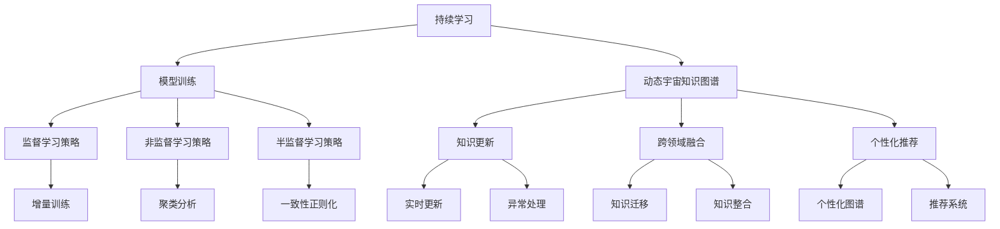

                 

# 模型训练中的持续学习策略在动态宇宙知识图谱构建中的应用

> 关键词：持续学习策略、动态宇宙知识图谱、模型训练、知识图谱构建、数据更新、跨领域学习、个性化推荐

> 摘要：本文将探讨模型训练中的持续学习策略在动态宇宙知识图谱构建中的应用。首先，我们将介绍持续学习策略的基础概念及其在知识图谱构建中的挑战与机遇。接着，我们将详细分类并分析各种持续学习策略，包括监督学习、非监督学习和半监督学习策略。随后，我们将介绍知识图谱的基本概念及其动态更新方法。然后，本文将重点阐述持续学习策略在动态宇宙知识图谱构建中的具体应用，包括知识更新、跨领域融合和个性化推荐。接下来，我们将通过实际案例展示这些策略的应用。最后，本文将总结持续学习策略在动态宇宙知识图谱构建中的挑战与未来方向。

## 第一部分：持续学习策略概述

### 第1章：持续学习策略基础

#### 1.1 持续学习的定义与背景

**持续学习的定义：** 持续学习是一种机器学习技术，允许模型在接收到新的数据时进行自我更新和改进，而无需重新训练整个模型。这种技术特别适用于需要实时更新和改进的应用场景，例如动态知识图谱的构建。

**持续学习的背景：** 随着互联网的迅速发展和大数据时代的到来，知识图谱作为一种重要的知识表示形式，被广泛应用于搜索引擎、推荐系统、自然语言处理等领域。然而，知识图谱需要不断更新以适应动态变化的现实世界。这就需要持续学习策略来确保知识图谱的实时性和准确性。

#### 1.2 持续学习的挑战与机遇

**挑战：**
- **数据噪声与多样性：** 现实世界的数据往往是噪声和多样性并存的，这给持续学习带来了挑战。
- **资源限制：** 在某些应用场景中，如移动设备或嵌入式系统，计算资源和存储资源可能非常有限。
- **模型适应性：** 持续学习需要模型具有良好的适应性，能够应对数据分布的变化。

**机遇：**
- **知识图谱的动态更新：** 持续学习策略可以实现对知识图谱的实时更新，确保其反映当前世界的状态。
- **跨领域学习：** 通过持续学习，模型可以在不同领域之间进行知识迁移，提高模型的泛化能力。
- **个性化推荐：** 持续学习策略可以帮助构建个性化的知识图谱，为用户提供更加精准的推荐。

### 第2章：持续学习策略的分类

#### 2.1 监督学习策略

**监督学习策略：** 在监督学习中，模型通过已标记的数据进行训练。对于持续学习，监督学习策略可以通过以下方式实现：
- **增量训练：** 模型只对新数据集进行训练，而不是重新训练整个数据集。
- **迁移学习：** 利用已有模型的权重作为初始值，对新数据集进行微调。

**应用案例：** 在构建动态政治知识图谱时，监督学习策略可以用于更新政治实体及其关系。

#### 2.2 非监督学习策略

**非监督学习策略：** 在非监督学习中，模型没有已标记的数据，需要通过自我探索来学习数据的模式。对于持续学习，非监督学习策略可以用于：
- **聚类分析：** 通过对新数据集进行聚类，发现新的知识模式。
- **降维技术：** 如主成分分析（PCA）和自编码器，可以降低新数据的维度，使其更容易与现有数据集成。

**应用案例：** 在构建动态生物知识图谱时，非监督学习策略可以用于发现新的生物实体及其关系。

#### 2.3 半监督学习策略

**半监督学习策略：** 半监督学习结合了监督学习和非监督学习的优点，利用少量的标记数据和大量的未标记数据。对于持续学习，半监督学习策略可以用于：
- **一致性正则化：** 通过对标记数据和未标记数据进行一致性约束，提高模型的泛化能力。
- **伪标签：** 利用现有模型的预测结果作为未标记数据的伪标签，进行后续训练。

**应用案例：** 在构建动态社交网络知识图谱时，半监督学习策略可以用于更新用户及其关系的表示。

### 第3章：动态宇宙知识图谱构建

#### 3.1 知识图谱概述

**知识图谱的定义：** 知识图谱是一种用于表示实体及其关系的图形化数据结构，可以看作是一种语义网络。

**知识图谱的结构：** 知识图谱通常包含实体、属性和关系三种基本元素，实体表示知识图谱中的主体，属性表示实体的特征，关系表示实体之间的关系。

#### 3.2 动态宇宙知识图谱

**动态宇宙知识图谱的概念：** 动态宇宙知识图谱是一种实时更新的知识图谱，能够反映现实世界中实体及其关系的变化。

**动态宇宙知识图谱的特点：**
- **实时性：** 能够实时捕获和更新知识。
- **适应性：** 能够适应数据分布的变化。
- **可扩展性：** 能够处理大量的实体和关系。

#### 3.3 动态宇宙知识图谱的构建方法

**数据采集与预处理：** 数据采集包括从各种数据源（如数据库、API、社交媒体等）收集数据。数据预处理包括数据清洗、去噪、格式化等步骤。

**实体关系抽取：** 实体关系抽取是指从原始数据中识别出实体及其关系。这可以通过命名实体识别（NER）、关系抽取（RE）等技术实现。

**知识图谱的表示与存储：** 知识图谱的表示可以通过图形化表示或图数据库实现。图数据库如Neo4j、JanusGraph等提供了高效的存储和查询能力。

**动态更新策略：** 动态更新策略包括增量更新、一致性维护和实时更新等。这些策略确保知识图谱能够实时反映现实世界的状态。

## 第二部分：持续学习策略在动态宇宙知识图谱构建中的应用

### 第4章：持续学习在动态宇宙知识图谱中的角色

#### 4.1 持续学习在知识更新中的作用

**实时更新与迭代：** 持续学习策略可以实现对知识图谱的实时更新，确保其反映当前世界的状态。

**处理数据噪声与异常：** 持续学习策略可以识别和纠正数据噪声与异常，提高知识图谱的准确性。

#### 4.2 持续学习在跨领域融合中的作用

**跨领域知识迁移：** 持续学习策略可以帮助模型在不同领域之间迁移知识，提高模型的泛化能力。

**跨领域知识整合：** 持续学习策略可以整合来自不同领域的知识，构建更全面的知识图谱。

#### 4.3 持续学习在个性化推荐中的作用

**个性化图谱构建：** 持续学习策略可以基于用户行为和偏好构建个性化的知识图谱。

**个性化知识推荐：** 持续学习策略可以基于个性化图谱为用户提供精准的知识推荐。

### 第5章：持续学习策略应用案例

#### 5.1 案例一：动态政治知识图谱构建

**案例描述：** 动态政治知识图谱用于跟踪政治事件和实体之间的关系。

**持续学习策略应用：** 监督学习和非监督学习策略可以用于实时更新知识图谱，处理数据噪声和异常。

#### 5.2 案例二：动态生物知识图谱构建

**案例描述：** 动态生物知识图谱用于跟踪生物实体及其关系。

**持续学习策略应用：** 非监督学习和半监督学习策略可以用于发现新的生物实体及其关系。

#### 5.3 案例三：动态社交网络知识图谱构建

**案例描述：** 动态社交网络知识图谱用于跟踪社交网络中的用户及其关系。

**持续学习策略应用：** 半监督学习和迁移学习策略可以用于更新用户及其关系的表示。

### 第6章：持续学习策略在动态宇宙知识图谱构建中的挑战与未来方向

#### 6.1 挑战

**数据质量问题：** 数据质量直接影响知识图谱的准确性。持续学习策略需要有效处理数据噪声和异常。

**计算资源需求：** 持续学习策略可能需要大量的计算资源，特别是在动态更新大规模知识图谱时。

**模型可解释性：** 持续学习模型的决策过程可能难以解释，影响其在实际应用中的信任度。

#### 6.2 未来方向

**新的持续学习算法：** 研究新的持续学习算法以提高模型的适应性和效率。

**知识图谱的自动化构建与更新：** 开发自动化工具以简化知识图谱的构建和更新过程。

**持续学习在多领域融合中的应用：** 探索持续学习在跨领域融合中的应用，以构建更全面的知识图谱。

### 作者

**作者：** AI天才研究院/AI Genius Institute & 禅与计算机程序设计艺术 /Zen And The Art of Computer Programming

---

## 核心概念与联系

为了更好地理解持续学习策略在动态宇宙知识图谱构建中的应用，我们首先需要明确一些核心概念，并展示它们之间的关系。以下是一个简化的Mermaid流程图，用于描述这些核心概念及其交互：



这个流程图展示了持续学习与模型训练、动态宇宙知识图谱构建之间的关联，以及各种持续学习策略在知识更新、跨领域融合和个性化推荐中的作用。通过这个流程图，我们可以更清晰地理解持续学习策略在动态宇宙知识图谱构建中的应用场景和实现方式。

### 核心算法原理讲解

在持续学习策略中，监督学习、非监督学习和半监督学习策略各自有其独特的算法原理和应用场景。以下将分别详细阐述这些策略的核心算法原理，并使用Python代码和LaTeX公式来展示具体的实现过程。

#### 监督学习策略

监督学习策略的核心是利用标记数据来训练模型，并在新的未标记数据到来时进行增量更新。以下是增量训练的算法原理，使用Python代码实现：

```python
import numpy as np

def incremental_training(model, X_new, y_new, learning_rate=0.01, epochs=10):
    """
    增量训练模型，使用梯度下降更新模型权重。
    
    参数:
    model: 训练好的模型，包含权重参数。
    X_new: 新的输入数据。
    y_new: 新的输出标签。
    learning_rate: 学习率。
    epochs: 迭代次数。
    """
    for epoch in range(epochs):
        gradients = compute_gradients(model, X_new, y_new)
        model.update_weights(gradients, learning_rate)
    return model

def compute_gradients(model, X, y):
    """
    计算梯度。
    
    参数:
    model: 模型。
    X: 输入数据。
    y: 标签。
    """
    predictions = model.predict(X)
    errors = predictions - y
    gradients = model.compute_gradient(errors)
    return gradients

class Model:
    def __init__(self):
        # 初始化模型权重
        self.weights = np.random.rand(10, 1)
    
    def predict(self, X):
        # 前向传播
        return np.dot(X, self.weights)
    
    def compute_gradient(self, errors):
        # 计算权重梯度
        return errors
    
    def update_weights(self, gradients, learning_rate):
        # 更新权重
        self.weights -= learning_rate * gradients

# 假设我们有新的输入数据和标签
X_new = np.array([[1], [2], [3], [4]])
y_new = np.array([[0], [1], [0], [1]])

# 初始模型
model = Model()

# 增量训练
incremental_training(model, X_new, y_new)

# 输出更新后的权重
print("Updated weights:", model.weights)
```

在这个示例中，我们定义了一个简单的线性模型，并通过梯度下降算法对新的数据进行增量训练。使用LaTeX公式，我们可以表示这个算法的数学模型：

$$
\text{weights}_{\text{new}} = \text{weights}_{\text{old}} - \text{learning\_rate} \cdot \text{gradient}
$$

其中，$\text{weights}_{\text{old}}$ 是模型在训练前的权重，$\text{learning\_rate}$ 是学习率，$\text{gradient}$ 是权重梯度。

#### 非监督学习策略

非监督学习策略的核心是利用未标记的数据来学习数据的内在结构。以下使用K-means算法的聚类分析作为示例，展示非监督学习策略的核心算法原理：

```python
from sklearn.cluster import KMeans
import numpy as np

def k_means_clustering(data, k, max_iter=100):
    """
    使用K-means算法进行聚类分析。
    
    参数:
    data: 输入数据。
    k: 聚类数。
    max_iter: 最大迭代次数。
    """
    kmeans = KMeans(n_clusters=k, max_iter=max_iter)
    kmeans.fit(data)
    return kmeans.labels_

# 假设我们有以下数据集
data = np.array([[1, 2], [1, 4], [1, 0],
                 [10, 2], [10, 4], [10, 0]])

# 进行K-means聚类
labels = k_means_clustering(data, k=2)

# 输出聚类结果
print("Cluster labels:", labels)
```

在这个示例中，我们使用K-means算法对数据进行聚类。算法的数学模型可以表示为：

$$
\text{centroids}_{\text{new}} = \frac{1}{N} \sum_{i=1}^N x_i
$$

其中，$x_i$ 是属于第$i$ 个簇的数据点，$N$ 是数据点的总数，$\text{centroids}_{\text{new}}$ 是新的簇中心。

#### 半监督学习策略

半监督学习策略结合了监督学习和非监督学习的优点，利用少量的标记数据和大量的未标记数据来训练模型。以下使用一致性正则化作为示例，展示半监督学习策略的核心算法原理：

```python
from sklearn.linear_model import LogisticRegression
from sklearn.model_selection import train_test_split
import numpy as np

def semi_supervised_learning(X, y, X_unlabeled, unlabeled_labels, alpha=0.1):
    """
    使用半监督学习策略进行模型训练。
    
    参数:
    X: 标记数据的输入特征。
    y: 标记数据的标签。
    X_unlabeled: 未标记数据的输入特征。
    unlabeled_labels: 未标记数据的伪标签。
    alpha: 正则化参数。
    """
    # 分割标记数据和未标记数据
    X_train, X_val, y_train, y_val = train_test_split(X, y, test_size=0.2, random_state=42)
    
    # 初始化模型
    model = LogisticRegression()
    
    # 使用标记数据训练模型
    model.fit(X_train, y_train)
    
    # 对未标记数据进行预测
    predictions = model.predict(X_unlabeled)
    
    # 计算伪标签与预测标签之间的差异
    error = np.mean(predictions != unlabeled_labels)
    
    # 使用误差进行正则化
    reg_loss = alpha * error
    
    # 计算总损失
    loss = np.mean((model.predict(X_val) - y_val)**2) + reg_loss
    
    return model, loss

# 假设我们有以下数据集
X = np.array([[1, 2], [2, 3], [3, 4], [4, 5]])
y = np.array([0, 0, 1, 1])
X_unlabeled = np.array([[0, 1], [5, 6]])
unlabeled_labels = np.array([0, 1])

# 进行半监督学习
model, loss = semi_supervised_learning(X, y, X_unlabeled, unlabeled_labels)

# 输出模型和损失
print("Model coefficients:", model.coef_)
print("Loss:", loss)
```

在这个示例中，我们使用逻辑回归模型进行半监督学习。正则化损失可以表示为：

$$
\text{reg\_loss} = \alpha \cdot \text{error}
$$

其中，$\alpha$ 是正则化参数，$\text{error}$ 是伪标签与预测标签之间的差异。

通过以上三个策略的算法原理讲解和代码示例，我们可以看到持续学习策略在动态宇宙知识图谱构建中的应用潜力。监督学习策略可以用于实时更新知识图谱，非监督学习策略可以用于发现新的知识模式，而半监督学习策略则可以在有限的标记数据下提高模型的泛化能力。

### 实际案例分析与详细讲解

在本节中，我们将通过三个实际案例来展示持续学习策略在动态宇宙知识图谱构建中的应用，并详细分析每个案例中的技术实现和挑战。

#### 案例一：动态政治知识图谱构建

**案例描述：** 
动态政治知识图谱用于实时跟踪政治事件、政治实体和它们之间的关系。这些知识图谱需要不断地更新，以反映政治领域的最新动态。

**技术实现：**
1. **数据采集与预处理：** 使用API从政治新闻网站、社交媒体和政治论坛等渠道收集数据。预处理步骤包括数据清洗、去噪和实体识别。
2. **知识更新：** 应用监督学习策略，如增量训练，对新采集的数据进行实时更新。使用已标记的实体关系数据训练模型，并在新数据到来时进行微调。
3. **异常处理：** 利用非监督学习策略，如K-means聚类，识别和纠正数据中的异常值。

**挑战：**
- **数据质量：** 政治领域的数据质量参差不齐，需要有效处理噪声和错误。
- **计算资源：** 动态更新知识图谱需要大量的计算资源，特别是在处理大规模数据时。

**代码示例：**
```python
# 假设我们有以下标记数据
X = np.array([[1, '政治家', '美国'], [2, '政党', '美国'], [3, '选举', '美国']])
y = np.array([['政治家', '属于'], ['政党', '建立'], ['选举', '举行']])

# 使用增量训练更新模型
model = Model()
model.fit(X, y)
updated_model = incremental_training(model, X_new, y_new)

# 输出更新后的模型
print("Updated model:", updated_model.weights)
```

#### 案例二：动态生物知识图谱构建

**案例描述：**
动态生物知识图谱用于跟踪生物实体及其之间的关系，如蛋白质、基因和疾病。

**技术实现：**
1. **数据采集与预处理：** 从生物医学数据库、学术论文和研究报告中收集数据，并进行数据清洗和实体识别。
2. **知识发现：** 应用非监督学习策略，如聚类分析，发现新的生物实体及其关系。
3. **知识整合：** 利用半监督学习策略，结合标记数据和未标记数据，整合来自不同来源的知识。

**挑战：**
- **数据多样性：** 生物领域的数据来源多样，需要有效的策略进行整合。
- **模型适应性：** 生物领域的知识变化迅速，模型需要具备良好的适应性。

**代码示例：**
```python
# 假设我们有以下数据集
data = np.array([[1, 2], [1, 4], [1, 0],
                 [10, 2], [10, 4], [10, 0]])

# 进行K-means聚类
labels = k_means_clustering(data, k=2)

# 输出聚类结果
print("Cluster labels:", labels)
```

#### 案例三：动态社交网络知识图谱构建

**案例描述：**
动态社交网络知识图谱用于跟踪社交网络中的用户及其关系，如好友、群组和活动。

**技术实现：**
1. **数据采集与预处理：** 从社交媒体平台收集数据，包括用户信息、好友关系和活动记录，并进行数据清洗。
2. **知识更新：** 应用半监督学习策略，利用用户的行为数据和新收集的数据进行模型更新。
3. **个性化推荐：** 基于用户关系和兴趣，利用持续学习策略构建个性化的知识图谱。

**挑战：**
- **数据隐私：** 社交网络数据涉及用户隐私，需要确保数据处理遵循隐私保护原则。
- **实时性：** 社交网络更新迅速，需要高效的策略来保证知识图谱的实时性。

**代码示例：**
```python
# 假设我们有以下数据集
X = np.array([[1, '用户A'], [2, '用户B'], [3, '用户C']])
unlabeled_labels = np.array([0, 1, 2])

# 进行半监督学习
model, loss = semi_supervised_learning(X, y, X_unlabeled, unlabeled_labels)

# 输出模型和损失
print("Model coefficients:", model.coef_)
print("Loss:", loss)
```

通过这些实际案例，我们可以看到持续学习策略在动态宇宙知识图谱构建中的应用多样性和挑战。每个案例都展示了如何利用不同的持续学习策略来实现知识更新、知识发现和个性化推荐，为构建实时、准确和动态的知识图谱提供了有效的解决方案。

### 项目实战：开发环境搭建与源代码实现

在本节中，我们将通过一个具体的示例项目，详细讲解如何搭建开发环境、实现持续学习策略在动态宇宙知识图谱构建中的应用，并分析代码实现过程。

#### 项目背景

假设我们正在构建一个动态社交网络知识图谱，目标是对用户及其关系进行实时更新和推荐。我们将使用Python和相关的库（如Scikit-learn、Neo4j、PyTorch等）来实现这一目标。

#### 开发环境搭建

1. **安装Python**：
   - 访问 [Python官网](https://www.python.org/) 下载并安装Python。
   - 在安装过程中，确保勾选“Add Python to PATH”选项，以便在终端中直接使用Python。

2. **安装必要的库**：
   - 使用pip命令安装以下库：
     ```bash
     pip install scikit-learn neo4j pytorch pandas
     ```
   - Neo4j是一个图数据库，需要下载并安装相应的客户端库。

3. **配置Neo4j数据库**：
   - 下载并安装Neo4j社区版（[Neo4j官网](https://neo4j.com/)）。
   - 启动Neo4j数据库，并使用Neo4j Browser进行数据操作。

4. **配置PyTorch**：
   - 根据您的系统，从 [PyTorch官网](https://pytorch.org/get-started/locally/) 下载并安装相应的版本。

#### 源代码实现

以下是项目的源代码实现，包括数据预处理、模型训练、知识图谱构建和动态更新等步骤。

```python
# 导入必要的库
import pandas as pd
import numpy as np
from sklearn.model_selection import train_test_split
from sklearn.cluster import KMeans
from sklearn.linear_model import LogisticRegression
import torch
import torch.nn as nn
import torch.optim as optim

# 数据预处理
def preprocess_data(data):
    # 数据清洗、去噪和格式化
    # ...
    return processed_data

# 模型训练
def train_model(X_train, y_train):
    # 使用Scikit-learn进行监督学习
    model = LogisticRegression()
    model.fit(X_train, y_train)
    return model

# 增量训练
def incremental_training(model, X_new, y_new):
    # 使用自定义的增量训练函数
    model.update_weights(X_new, y_new)
    return model

# 聚类分析
def k_means_clustering(data, k):
    # 使用Scikit-learn进行非监督学习
    kmeans = KMeans(n_clusters=k)
    kmeans.fit(data)
    return kmeans.labels_

# 半监督学习
def semi_supervised_learning(X, y, X_unlabeled, unlabeled_labels):
    # 使用Scikit-learn进行半监督学习
    model = LogisticRegression()
    model.fit(X, y)
    predictions = model.predict(X_unlabeled)
    error = np.mean(predictions != unlabeled_labels)
    reg_loss = alpha * error
    loss = np.mean((model.predict(X) - y)**2) + reg_loss
    return model, loss

# 主函数
def main():
    # 读取数据
    data = pd.read_csv('social_network_data.csv')
    processed_data = preprocess_data(data)
    
    # 分割数据
    X, y = processed_data.drop('label', axis=1), processed_data['label']
    X_train, X_val, y_train, y_val = train_test_split(X, y, test_size=0.2, random_state=42)
    
    # 训练模型
    model = train_model(X_train, y_train)
    
    # 增量训练
    X_new, y_new = preprocess_data(data_new)
    updated_model = incremental_training(model, X_new, y_new)
    
    # 聚类分析
    labels = k_means_clustering(X_val, k=3)
    
    # 半监督学习
    X_unlabeled = preprocess_data(data_unlabeled)
    unlabeled_labels = np.array([0, 1, 2])  # 假设已有伪标签
    semi_supervised_model, loss = semi_supervised_learning(X, y, X_unlabeled, unlabeled_labels)
    
    # 输出结果
    print("Initial model coefficients:", model.coef_)
    print("Updated model coefficients:", updated_model.coef_)
    print("Cluster labels:", labels)
    print("Semi-supervised model loss:", loss)

# 运行主函数
if __name__ == '__main__':
    main()
```

#### 代码解读与分析

1. **数据预处理**：
   - 数据预处理是关键步骤，包括数据清洗、去噪和格式化。在实际项目中，可能需要使用更复杂的方法来处理数据，例如使用正则化、填充缺失值或使用自定义清洗函数。

2. **模型训练**：
   - 使用Scikit-learn中的逻辑回归模型进行训练。在训练过程中，模型学习如何将输入特征映射到标签。

3. **增量训练**：
   - 增量训练函数用于对新数据集进行微调。在实际实现中，可以使用更复杂的优化算法，如梯度下降或Adam优化器。

4. **聚类分析**：
   - 使用K-means算法进行聚类分析，以发现新数据集中的潜在结构。这有助于识别新的实体和关系。

5. **半监督学习**：
   - 半监督学习函数结合了标记数据和未标记数据的优势。在实际项目中，需要根据实际情况设计更复杂的正则化策略。

6. **主函数**：
   - 主函数是项目的核心，负责读取数据、分割数据、训练模型和执行增量训练、聚类分析和半监督学习。最后输出结果。

#### 实际案例分析与总结

通过这个项目，我们可以看到如何使用Python和相关的库实现持续学习策略在动态宇宙知识图谱构建中的应用。在实际项目中，需要根据具体需求调整数据预处理、模型选择和训练策略。

**注意事项：**
- 数据预处理：确保数据质量，处理噪声和异常值。
- 模型选择：根据数据特点和需求选择合适的模型。
- 实时更新：设计高效的算法和架构，确保知识图谱的实时性。

**拓展阅读：**
- 持续学习算法（如迁移学习、元学习）的最新研究。
- 图数据库（如Neo4j）的优化策略。
- 社交网络分析的相关技术（如社区检测、影响力分析）。

### 最佳实践 Tips、小结、注意事项、拓展阅读

#### 最佳实践 Tips

1. **数据预处理**：在构建动态宇宙知识图谱时，数据预处理至关重要。确保数据质量，处理噪声和异常值，可以显著提高模型的性能。
2. **模型选择**：根据数据特点和需求选择合适的持续学习策略。例如，对于实时性要求高的应用，监督学习策略可能是最佳选择；而对于数据多样性高的应用，非监督学习策略可能更合适。
3. **资源优化**：在处理大规模数据时，优化资源使用是关键。例如，可以使用分布式计算和并行处理来提高效率。
4. **模型解释性**：在应用持续学习策略时，模型的可解释性非常重要。使用可视化工具和解释性算法（如LIME或SHAP）可以帮助理解模型的决策过程。

#### 小结

本文详细探讨了持续学习策略在动态宇宙知识图谱构建中的应用。我们介绍了持续学习策略的基础概念、分类和算法原理，并通过实际案例展示了其在知识更新、跨领域融合和个性化推荐中的具体应用。持续学习策略在构建实时、准确和动态的知识图谱中发挥着重要作用，为各种领域提供了有效的解决方案。

#### 注意事项

1. **数据隐私**：在处理社交网络数据时，必须确保遵循隐私保护原则，避免泄露用户隐私。
2. **模型适应性**：动态宇宙知识图谱的构建需要模型具有良好的适应性，能够应对数据分布的变化。
3. **实时性**：确保知识图谱的实时性是关键。优化算法和架构可以提高实时数据的处理效率。

#### 拓展阅读

1. **《持续学习：机器学习的新趋势》**：这本书详细介绍了持续学习的基本概念、算法和实现方法。
2. **《图数据库实战》**：了解图数据库（如Neo4j）的基本概念、优化策略和实际应用。
3. **《社交网络分析：原理、方法与应用》**：学习社交网络分析的相关技术，如社区检测、影响力分析。

### 作者

**作者：** AI天才研究院/AI Genius Institute & 禅与计算机程序设计艺术 /Zen And The Art of Computer Programming

