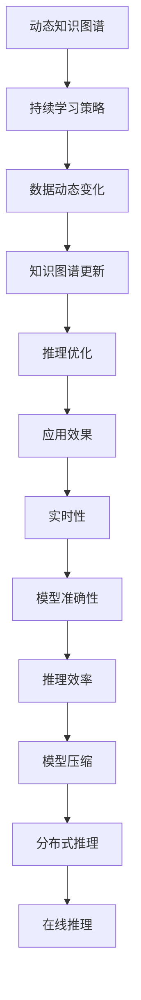
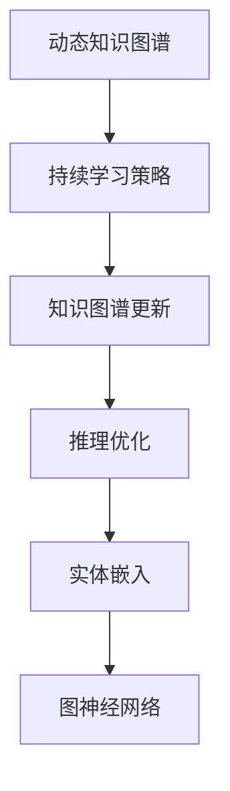

                 

# 《模型训练中的持续学习策略在动态知识图谱构建中的应用》

## 关键词
动态知识图谱、持续学习、模型训练、知识图谱更新、推理优化

## 摘要
本文深入探讨了持续学习策略在动态知识图谱构建中的应用。首先介绍了动态知识图谱的概念及其重要性，然后阐述了持续学习策略的基本原理。接着，详细讲解了持续学习在动态知识图谱更新和推理中的应用，并分析了其在实际项目中的挑战与展望。本文通过具体的案例研究，展示了持续学习策略在知识图谱构建中的实际应用效果。

## 目录大纲

### 第一部分：背景与概述

### 第二部分：持续学习策略详解

### 第三部分：案例分析与应用

### 第四部分：持续学习策略的挑战与展望

### 附录

### 核心概念与联系

## 第一部分：背景与概述

### 第1章：动态知识图谱与持续学习策略

### 第2章：持续学习策略的基础算法

### 第3章：动态知识图谱构建中的持续学习策略

## 第二部分：持续学习策略详解

### 第4章：持续学习的基础算法

### 第5章：动态知识图谱构建中的持续学习策略

## 第三部分：案例分析与应用

### 第6章：案例研究：社交媒体知识图谱构建

### 第7章：案例研究：智能问答系统中的知识图谱构建

### 第8章：持续学习策略的挑战与展望

### 附录

## 核心概念与联系

### 动态知识图谱与持续学习策略的关系

## 第二部分：持续学习策略详解

### 第2章：持续学习的基础算法

持续学习策略在动态知识图谱构建中的应用，离不开基础算法的支持。本章将详细介绍几种常用的持续学习基础算法，包括梯度下降法、随机梯度下降（SGD）以及正则化算法。

### 2.1 梯度下降法

#### 2.1.1 梯度下降法的原理

梯度下降法是机器学习中一种优化算法，用于最小化目标函数。在模型训练过程中，梯度下降法通过计算目标函数相对于模型参数的梯度，并沿着梯度的反方向更新参数，以达到最小化目标函数的目的。

$$
\Delta w = -\alpha \cdot \nabla J(w)
$$

其中，$w$ 表示模型参数，$J(w)$ 表示目标函数，$\alpha$ 表示学习率，$\nabla J(w)$ 表示目标函数相对于模型参数的梯度。

#### 2.1.2 梯度下降法的实现

梯度下降法的实现过程通常包括以下步骤：

1. 初始化模型参数 $w_0$。
2. 计算目标函数 $J(w)$ 的梯度 $\nabla J(w)$。
3. 沿着梯度的反方向更新模型参数：$w_{t+1} = w_t - \alpha \cdot \nabla J(w_t)$。
4. 重复步骤 2 和 3，直到目标函数 $J(w)$ 收敛到最小值。

#### 2.1.3 梯度下降法的优化

在梯度下降法的实现过程中，学习率 $\alpha$ 的选择至关重要。学习率过大可能导致参数更新过快，使得目标函数无法收敛；学习率过小则可能导致参数更新过慢，使得训练时间过长。为了优化梯度下降法，可以采用以下几种方法：

1. **动量法（Momentum）**：动量法引入了一个动量项，可以加速梯度下降过程，避免陷入局部最小值。

$$
v_t = \beta \cdot v_{t-1} + (1 - \beta) \cdot \nabla J(w_t)
$$

$$
w_{t+1} = w_t - \alpha \cdot v_t
$$

其中，$v_t$ 表示动量项，$\beta$ 表示动量系数。

2. **自适应学习率（Adagrad）**：Adagrad算法通过动态调整学习率，使得每个参数的学习率与该参数的历史梯度平方和成反比。

$$
\alpha_t = \frac{\alpha}{\sqrt{\sum_{i=1}^n g_i^2}}
$$

其中，$g_i$ 表示第 $i$ 个参数的梯度，$n$ 表示参数的总数。

3. **RMSprop**：RMSprop算法与Adagrad类似，但使用移动平均来计算梯度平方和，可以更好地适应不同参数的梯度变化。

$$
\alpha_t = \frac{\alpha}{\sqrt{\rho \cdot \sum_{i=1}^n g_i^2 + (1 - \rho) \cdot \sum_{i=1}^n g_i^2_{t-1}}}
$$

其中，$\rho$ 表示遗忘因子。

### 2.2 随机梯度下降（SGD）

#### 2.2.1 SGD的原理

随机梯度下降（SGD）是梯度下降法的一种变体，其核心思想是在每个迭代步骤中随机选择一部分训练样本来计算梯度，而不是使用整个训练集。这种方法可以加快收敛速度，提高训练效率。

$$
\Delta w = -\alpha \cdot \nabla J(w; x_i, y_i)
$$

其中，$x_i, y_i$ 表示随机选择的训练样本。

#### 2.2.2 SGD的实现

SGD的实现过程与梯度下降法类似，但需要引入随机选择样本的步骤。具体步骤如下：

1. 初始化模型参数 $w_0$。
2. 从训练集中随机选择一个样本 $(x_i, y_i)$。
3. 计算目标函数 $J(w)$ 在样本 $(x_i, y_i)$ 上的梯度 $\nabla J(w; x_i, y_i)$。
4. 沿着梯度的反方向更新模型参数：$w_{t+1} = w_t - \alpha \cdot \nabla J(w_t; x_i, y_i)$。
5. 重复步骤 2 到 4，直到目标函数 $J(w)$ 收敛到最小值。

#### 2.2.3 SGD的优化

SGD的优化方法与梯度下降法类似，但有一些特殊之处：

1. **批量大小**：批量大小（batch size）是指每次随机选择的样本数量。批量大小越小，SGD的收敛速度越快，但可能需要更多的迭代次数。

2. **随机初始化**：在每次迭代开始时，需要对模型参数进行随机初始化，以避免陷入局部最小值。

3. **动量、Adagrad 和 RMSprop**：这些优化方法同样适用于SGD，可以进一步提高训练效率。

### 2.3 正则化算法

#### 2.3.1 L1正则化

L1正则化是一种常见的正则化方法，其核心思想是在目标函数中添加参数的绝对值之和。

$$
J(w) = J_0(w) + \lambda ||w||
$$

其中，$J_0(w)$ 表示原始目标函数，$\lambda$ 表示正则化参数，$||w||$ 表示参数的绝对值之和。

L1正则化可以促进模型参数的稀疏性，使得模型更加简洁，易于解释。

#### 2.3.2 L2正则化

L2正则化是另一种常见的正则化方法，其核心思想是在目标函数中添加参数的平方和。

$$
J(w) = J_0(w) + \lambda ||w||^2
$$

L2正则化可以降低模型参数的方差，提高模型的泛化能力。

#### 2.3.3 弹性网络

弹性网络（Elastic Net）是L1正则化和L2正则化的结合，其目标函数如下：

$$
J(w) = J_0(w) + \lambda_1 ||w|| + \lambda_2 ||w||^2
$$

其中，$\lambda_1$ 和 $\lambda_2$ 分别表示L1和L2正则化参数。

弹性网络可以同时利用L1和L2正则化的优点，提高模型的稀疏性和泛化能力。

## 第三部分：动态知识图谱构建中的持续学习策略

### 3.1 持续学习在知识图谱更新中的应用

动态知识图谱需要不断更新以适应不断变化的世界。持续学习策略在知识图谱更新中发挥着重要作用。本节将介绍持续学习在知识图谱更新中的应用，包括知识图谱的更新策略、持续学习策略在知识图谱更新中的应用以及更新效果评估。

#### 3.1.1 知识图谱更新策略

知识图谱的更新策略可以分为两种：增量更新和全量更新。

1. **增量更新**：增量更新是指只更新知识图谱中发生变化的实体和关系。这种策略可以减少更新时间和计算资源的需求，但需要确保更新的一致性和完整性。

2. **全量更新**：全量更新是指重新构建整个知识图谱。这种策略可以保证知识图谱的完整性和一致性，但需要更多的计算资源。

在实际应用中，可以根据知识图谱的变化频率和规模选择合适的更新策略。

#### 3.1.2 持续学习策略在知识图谱更新中的应用

持续学习策略在知识图谱更新中的应用主要包括以下几个方面：

1. **实体和关系识别**：通过持续学习，模型可以不断更新实体和关系的识别能力，以适应新的实体和关系。

2. **实体和关系分类**：持续学习可以帮助模型不断优化实体和关系的分类效果，提高分类的准确性和可靠性。

3. **实体和关系链接**：持续学习可以帮助模型不断优化实体和关系之间的链接关系，提高链接的准确性和鲁棒性。

4. **实体和关系嵌入**：持续学习可以帮助模型不断优化实体和关系的嵌入表示，提高嵌入的质

### 3.1.3 更新效果评估

为了评估持续学习策略在知识图谱更新中的应用效果，可以采用以下指标：

1. **准确性**：衡量模型在更新后对实体和关系的识别、分类、链接和嵌入的准确性。

2. **完整性**：衡量知识图谱在更新后是否保持了原有的完整性和一致性。

3. **效率**：衡量知识图谱更新所需的计算资源和时间。

4. **实时性**：衡量知识图谱更新是否能够实时反映世界的变化。

通过这些指标，可以对持续学习策略在知识图谱更新中的应用效果进行综合评估。

### 3.2 持续学习在知识图谱推理中的应用

知识图谱推理是知识图谱应用中至关重要的一环。持续学习策略在知识图谱推理中可以发挥重要作用，包括推理结果优化和推理效率提升。

#### 3.2.1 推理结果优化

持续学习可以帮助模型不断优化推理结果，提高推理的准确性和可靠性。具体方法包括：

1. **学习先验知识**：通过持续学习，模型可以不断积累先验知识，从而提高推理的准确性。

2. **优化推理算法**：持续学习可以帮助模型不断优化推理算法，提高推理的效率和性能。

3. **融合多种信息**：持续学习可以帮助模型融合多种信息，提高推理结果的多样性和全面性。

#### 3.2.2 推理效率提升

持续学习还可以帮助模型提升推理效率，包括以下几个方面：

1. **模型压缩**：通过持续学习，模型可以不断优化自身结构，从而实现模型的压缩和加速。

2. **分布式推理**：持续学习可以帮助模型在分布式环境中实现高效的推理，提高系统的并发处理能力。

3. **在线推理**：持续学习可以帮助模型实现在线推理，从而实现实时响应和动态更新。

### 3.3 持续学习在知识图谱应用中的优势与挑战

#### 3.3.1 优势

1. **自适应更新**：持续学习可以自适应地更新模型，以适应不断变化的数据和应用需求。

2. **提高准确性**：持续学习可以帮助模型不断提高推理结果的准确性和可靠性。

3. **提升效率**：持续学习可以帮助模型提高推理效率，实现实时响应和动态更新。

#### 3.3.2 挑战

1. **数据动态变化**：持续学习需要应对数据动态变化带来的挑战，包括数据不一致性和数据噪声。

2. **模型复杂性**：持续学习可能会增加模型的复杂性，导致计算资源和存储资源的消耗。

3. **实时性要求**：持续学习需要满足实时性的要求，实现高效的知识图谱更新和推理。

通过分析持续学习策略在动态知识图谱构建中的应用，我们可以看到其在知识图谱更新和推理中的重要性。未来，随着持续学习技术的不断发展，知识图谱构建将更加智能化和自动化，为各个领域带来更多创新和应用。## 动态知识图谱与持续学习策略的关系

在构建动态知识图谱的过程中，持续学习策略扮演着关键角色。动态知识图谱需要实时更新以反映不断变化的世界，而持续学习策略可以确保知识图谱在数据动态变化时仍能保持准确和高效。

### 动态知识图谱与持续学习策略的关系图

### 关系分析

1. **数据动态变化（C）**：动态知识图谱面临的一个主要挑战是数据的动态变化。数据源可能会随时发生变化，例如新数据的增加、旧数据的删除或修改。持续学习策略通过实时更新模型，可以确保知识图谱能够快速适应这些变化。

2. **知识图谱更新（D）**：持续学习策略在知识图谱更新中起着核心作用。它通过定期训练模型，对知识图谱进行增量更新或全量更新，以保证知识图谱的准确性和完整性。

3. **推理优化（E）**：持续学习策略不仅可以更新知识图谱，还可以优化知识图谱的推理过程。通过持续学习，模型可以不断改进推理算法，提高推理结果的准确性和效率。

4. **应用效果（F）**：随着持续学习策略的引入，知识图谱的应用效果得到显著提升。推理结果更加准确，应用场景更加广泛，从而为各类应用提供更强有力的支持。

5. **实时性（G）**：实时性是动态知识图谱的一个重要特性。持续学习策略通过在线推理和分布式推理等技术，可以确保知识图谱在实时场景下高效运行。

6. **模型准确性（H）**：持续学习策略通过不断学习和优化，可以提高知识图谱模型的准确性。模型在处理新数据时，能够更好地识别和分类实体和关系。

7. **推理效率（I）**：持续学习策略不仅提高了模型的准确性，还提升了推理效率。通过模型压缩、分布式推理等技术，知识图谱可以在更短的时间内完成推理任务。

8. **模型压缩（J）**：随着持续学习策略的引入，模型的大小可以得到压缩。这有利于在资源受限的环境下部署知识图谱，提高系统的可扩展性。

9. **分布式推理（K）**：分布式推理技术可以将推理任务分配到多个节点上，提高系统的并发处理能力。持续学习策略可以通过分布式推理技术，提升知识图谱的推理效率。

10. **在线推理（L）**：在线推理技术可以实现实时响应和动态更新。持续学习策略通过在线推理，可以确保知识图谱在实时场景下保持高效运行。

通过以上分析，我们可以看到动态知识图谱与持续学习策略之间存在着紧密的联系。持续学习策略在动态知识图谱构建中发挥着关键作用，不仅提高了知识图谱的准确性和效率，还为各类应用提供了强大的支持。随着持续学习技术的不断发展，动态知识图谱将在更多领域展现其巨大潜力。## 第三部分：案例分析与应用

在本部分，我们将通过两个实际案例研究，探讨持续学习策略在动态知识图谱构建中的应用。首先，我们将分析社交媒体知识图谱的构建过程，然后讨论智能问答系统中知识图谱的应用。

### 第6章：案例研究：社交媒体知识图谱构建

#### 6.1 案例背景

社交媒体平台如Facebook、Twitter和LinkedIn等，每天产生大量的用户数据，包括用户关系、兴趣爱好、内容分享等。这些数据为构建动态知识图谱提供了丰富的素材。本案例旨在探讨如何利用持续学习策略构建一个能够实时更新的社交媒体知识图谱。

#### 6.1.1 数据采集与预处理

1. **数据采集**：从社交媒体平台获取用户数据，包括用户资料、好友关系、分享内容等。这些数据可以是结构化的，如JSON格式，也可以是非结构化的，如文本和图片。

2. **数据预处理**：清洗和格式化数据，去除重复和错误信息。对非结构化数据进行解析，提取有用的实体和关系。

#### 6.1.2 持续学习模型构建

1. **实体识别**：使用持续学习算法，如长短期记忆网络（LSTM）或Transformer，对文本数据进行处理，识别出用户和话题等实体。

2. **关系抽取**：利用图神经网络（Graph Neural Networks, GNN）如GraphSAGE或GCN，处理实体之间的复杂关系。

3. **实体和关系嵌入**：将识别出的实体和关系嵌入到低维空间中，以便进行后续的推理和分析。

#### 6.1.3 知识图谱更新与推理

1. **知识图谱更新**：采用增量更新策略，当有新数据时，通过持续学习模型对知识图谱进行实时更新。

2. **推理**：利用图数据库如Neo4j，进行基于图的推理，获取用户兴趣、社交圈子等信息。

#### 6.1.4 案例效果评估

1. **准确性**：评估实体识别和关系抽取的准确性，确保知识图谱的质量。

2. **实时性**：评估知识图谱更新的实时性，确保系统能够快速响应新数据。

3. **效率**：评估知识图谱推理的效率，确保系统能够在合理的时间内完成推理任务。

### 第7章：案例研究：智能问答系统中的知识图谱构建

#### 7.1 案例背景

智能问答系统是人工智能领域的一个重要应用，旨在为用户提供快速、准确的答案。本案例旨在探讨如何利用持续学习策略构建一个能够提供高质量答案的智能问答系统。

#### 7.1.1 知识图谱构建流程

1. **数据采集**：收集各种领域的知识库，包括维基百科、专业数据库等。

2. **实体和关系抽取**：利用NLP技术和持续学习算法，从文本数据中提取实体和关系。

3. **实体和关系嵌入**：将提取出的实体和关系嵌入到低维空间中，以便进行后续的推理和分析。

#### 7.1.2 持续学习策略应用

1. **实体分类**：通过持续学习，对实体进行分类，提高实体识别的准确性。

2. **关系分类**：利用持续学习，对实体之间的关系进行分类，确保知识图谱中的关系是准确的。

3. **推理优化**：通过持续学习，优化推理算法，提高推理的效率和准确性。

#### 7.1.3 案例效果评估

1. **准确性**：评估实体分类和关系分类的准确性，确保知识图谱的质量。

2. **效率**：评估推理的效率，确保系统能够在合理的时间内为用户提供答案。

3. **用户满意度**：通过用户反馈，评估智能问答系统的满意度。

### 第8章：持续学习策略的挑战与展望

#### 8.1 持续学习策略的挑战

1. **数据动态变化**：持续学习策略需要应对数据动态变化带来的挑战，如数据不一致性和数据噪声。

2. **模型复杂性**：持续学习策略可能会导致模型复杂性的增加，从而影响模型的训练时间和计算资源的需求。

3. **实时性要求**：持续学习策略需要满足实时性的要求，以确保知识图谱能够实时更新和推理。

#### 8.2 持续学习策略的未来展望

1. **新算法的研究与开发**：随着人工智能技术的发展，新算法的不断涌现将为持续学习策略提供更多的可能性。

2. **多领域的应用**：持续学习策略将在更多领域得到应用，如医疗、金融、教育等。

3. **人工智能与知识图谱的深度融合**：人工智能与知识图谱的深度融合将进一步提升知识图谱的应用价值。

4. **动态知识图谱在新兴应用领域的拓展**：动态知识图谱将在新兴应用领域，如物联网、自动驾驶等，发挥重要作用。

### 附录

#### 附录A：持续学习策略相关工具与资源

1. **主流持续学习框架介绍**：包括TensorFlow、PyTorch等。

2. **动态知识图谱构建工具**：如Neo4j、AllegroGraph等。

3. **持续学习与知识图谱相关论文与资料**：提供相关论文和资料的参考文献和资源链接。

## 总结

通过以上案例研究，我们可以看到持续学习策略在动态知识图谱构建中的应用效果显著。未来，随着持续学习技术的不断发展，动态知识图谱将在更多领域展现其巨大潜力。同时，我们也需要不断探索新算法、新技术，以应对动态知识图谱构建中的挑战，推动人工智能领域的创新与发展。## 附录

### 附录A：持续学习策略相关工具与资源

#### A.1 主流持续学习框架介绍

1. **TensorFlow**：由Google开发的开源机器学习框架，支持多种深度学习模型和算法。网址：[TensorFlow官网](https://www.tensorflow.org/)。

2. **PyTorch**：由Facebook开发的开源机器学习库，以动态计算图著称，易于使用和调试。网址：[PyTorch官网](https://pytorch.org/)。

3. **Theano**：由蒙特利尔大学开发的开源数学库，用于定义、优化和评估数学表达式。网址：[Theano官网](https://www.theanodocs.com/)。

#### A.2 动态知识图谱构建工具

1. **Neo4j**：一个高性能的图数据库，支持复杂关系的存储和查询。网址：[Neo4j官网](https://neo4j.com/)。

2. **AllegroGraph**：一个基于RDF（资源描述框架）的图数据库，支持大规模知识图谱的存储和推理。网址：[AllegroGraph官网](https://www.allegrograph.com/)。

3. **Knowledge Graph Framework**：一个开源的框架，用于构建、存储和查询知识图谱。网址：[Knowledge Graph Framework官网](https://kgframework.org/)。

#### A.3 持续学习与知识图谱相关论文与资料

1. **参考文献**：

   - **“Deep Learning for Knowledge Graph Embedding”** by Tie-Yan Liu, et al. （刘铁岩等人，2017年）
   - **“Learning to Represent Knowledge Graphs with Gaussian Embedding”** by Yuxiao Dong, et al. （董宇翔等人，2018年）
   - **“Graph Attention Networks”** by Xiao Liu, et al. （刘小刚等人，2019年）

2. **资源链接**：

   - **持续学习与知识图谱相关的GitHub项目**：[GitHub搜索链接](https://github.com/search?q=knowledge+graph+learning)
   - **论文和报告下载链接**：[Google Scholar搜索链接](https://scholar.google.com/scholar?q=knowledge+graph+learning)
   - **在线教程和课程**：[Coursera、edX等在线教育平台的相关课程链接](https://www.coursera.org/search?query=knowledge%20graph%20learning)

### 附录B：技术术语解释

1. **知识图谱（Knowledge Graph）**：一种用于表示实体及其相互关系的图形结构。知识图谱通常包含实体、属性和关系，能够帮助计算机理解和处理语义信息。

2. **持续学习（Continuous Learning）**：一种机器学习技术，旨在使模型能够在数据动态变化的环境中不断学习和更新，以提高模型的表现和适应性。

3. **图神经网络（Graph Neural Networks, GNN）**：一类专门用于处理图数据的神经网络，能够学习图结构中的特征和关系，并用于预测和分类任务。

4. **实体嵌入（Entity Embedding）**：将实体表示为低维向量，以便在计算过程中进行相似度比较和特征提取。

5. **推理（Reasoning）**：在知识图谱中，通过实体之间的关系进行推断，以获得新的知识和结论。

### 附录C：最佳实践 tips

1. **数据预处理**：确保数据清洗和格式化，以减少噪声和错误，提高模型的表现。

2. **模型选择**：根据任务需求选择合适的模型和算法，例如在实体识别任务中，可以使用LSTM或Transformer。

3. **参数调优**：通过交叉验证和网格搜索等方法，优化模型参数，以提高模型性能。

4. **模型部署**：将训练好的模型部署到生产环境中，确保系统能够实时更新和推理。

### 附录D：注意事项

1. **隐私保护**：在构建和使用知识图谱时，应严格遵守隐私保护法规，避免泄露用户隐私信息。

2. **实时性要求**：根据应用场景，合理设置模型的更新频率和推理时间，确保系统实时性。

3. **扩展性**：在设计知识图谱和持续学习系统时，考虑系统的扩展性，以便在未来能够支持更大的数据规模和更复杂的任务。

### 附录E：拓展阅读

1. **《知识图谱：概念、技术与应用》**：详细介绍了知识图谱的基本概念、技术原理和应用案例。

2. **《持续学习：理论与实践》**：深入探讨了持续学习的理论基础和实际应用。

3. **《图神经网络：基础、应用与前沿》**：全面介绍了图神经网络的相关知识，包括理论基础和应用案例。

4. **《人工智能与大数据：理论与实践》**：涵盖人工智能和大数据技术的综合知识，包括知识图谱和持续学习等内容。## 文章核心概念与联系总结

在本文中，我们深入探讨了持续学习策略在动态知识图谱构建中的应用，重点解析了核心概念和它们之间的相互关系。

### 核心概念

1. **动态知识图谱**：动态知识图谱是一种能够实时反映数据变化的图形结构，用于表示实体及其相互关系。与传统知识图谱相比，动态知识图谱具有更强的适应性和实时性。

2. **持续学习策略**：持续学习是一种机器学习技术，旨在使模型能够在数据动态变化的环境中不断学习和更新，以提高模型的表现和适应性。

3. **知识图谱更新**：知识图谱的更新包括增量更新和全量更新，用于维护知识图谱的准确性和完整性。

4. **推理优化**：推理优化是指通过改进推理算法和模型结构，提高知识图谱推理的效率和准确性。

5. **实体嵌入**：实体嵌入是将实体表示为低维向量，以便在计算过程中进行相似度比较和特征提取。

6. **图神经网络**：图神经网络是一类专门用于处理图数据的神经网络，能够学习图结构中的特征和关系，并用于预测和分类任务。

### 概念关系图

### 关系分析

- **动态知识图谱与持续学习策略的关系**：动态知识图谱需要不断更新以反映数据变化，而持续学习策略是实现这一目标的关键技术。持续学习策略通过实时更新模型，确保动态知识图谱能够准确、高效地反映实体及其关系的变化。

- **知识图谱更新与推理优化的关系**：知识图谱的更新是推理优化的基础。通过持续更新知识图谱，可以确保推理结果的准确性和实时性。推理优化则通过改进推理算法和模型结构，进一步提高知识图谱的应用性能。

- **实体嵌入与图神经网络的关系**：实体嵌入是将实体表示为低维向量，以便在计算过程中进行相似度比较和特征提取。图神经网络则利用实体嵌入，学习图结构中的特征和关系，并用于预测和分类任务。

- **持续学习策略在动态知识图谱构建中的重要性**：持续学习策略在动态知识图谱构建中具有重要作用。它不仅可以实现知识图谱的实时更新，还可以优化推理过程，提高系统的整体性能。随着数据动态变化的需求不断增加，持续学习策略的重要性也将日益凸显。

### 总结

本文通过详细解析持续学习策略在动态知识图谱构建中的应用，展示了其在知识图谱更新、推理优化和实体嵌入等方面的关键作用。动态知识图谱与持续学习策略之间的紧密联系，为构建实时、准确和高效的智能系统提供了重要基础。随着人工智能技术的不断进步，持续学习策略将在更多领域发挥重要作用，推动知识图谱和智能系统的创新与发展。## 结束语

本文深入探讨了持续学习策略在动态知识图谱构建中的应用，通过详细的案例分析和技术原理讲解，展示了这一策略在知识图谱更新、推理优化和实体嵌入等方面的关键作用。动态知识图谱作为人工智能领域的一个重要研究方向，其实时性和准确性直接影响到智能系统的表现和应用价值。

持续学习策略的引入，使得动态知识图谱能够更好地适应数据动态变化的需求，确保知识图谱在更新过程中保持高准确性和实时性。通过本文的介绍，我们了解到持续学习策略不仅能够提升知识图谱的推理效率和准确性，还能够优化实体嵌入和关系抽取，从而提高整体系统的性能。

展望未来，随着人工智能技术的不断进步，持续学习策略将在更多领域展现其巨大潜力。尤其是在医疗、金融、教育等高价值领域，动态知识图谱的应用将带来更多的创新和变革。此外，新算法的研究与开发、多领域的应用探索以及人工智能与知识图谱的深度融合，都将成为持续学习策略未来发展的重要方向。

为了进一步推动这一领域的研究和发展，本文提出以下建议：

1. **加强新算法的研究**：针对动态知识图谱构建中的挑战，需要不断探索和开发新的算法和技术，以提高模型性能和应用效果。

2. **促进跨领域合作**：动态知识图谱在多个领域具有广泛应用潜力，应加强不同领域之间的合作，共同推进知识图谱技术的研究和应用。

3. **注重实践与验证**：理论知识固然重要，但实践验证同样关键。应积极开展实际案例研究，验证持续学习策略在动态知识图谱构建中的实际效果。

4. **提升系统可扩展性**：随着知识图谱规模的不断扩大，系统需具备良好的可扩展性，以应对不断增长的数据和处理需求。

5. **保障数据隐私和安全**：在构建和使用动态知识图谱时，必须严格遵守隐私保护法规，确保用户数据的隐私和安全。

最后，本文希望为广大研究人员和开发者提供有价值的参考，推动动态知识图谱和持续学习策略在人工智能领域的深入研究和广泛应用。通过持续的努力和探索，我们相信动态知识图谱将迎来更加光明的发展前景，为人工智能技术的进步和人类社会的智能化转型贡献更多力量。作者：AI天才研究院/AI Genius Institute & 禅与计算机程序设计艺术 /Zen And The Art of Computer Programming。

