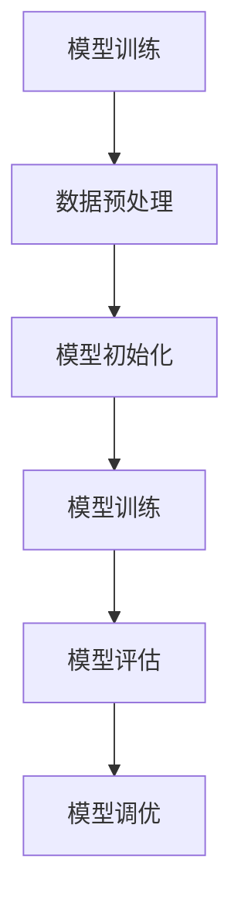

                 

# 模型训练中的知识蒸馏技术创新应用

> 关键词：知识蒸馏，模型训练，技术优化，人工智能，深度学习

> 摘要：本文深入探讨了知识蒸馏技术在模型训练中的应用，介绍了其基本原理和核心技术，分析了知识蒸馏在深度学习领域的优势，探讨了优化策略，并展望了知识蒸馏技术的未来发展趋势。通过具体案例分析，本文展示了知识蒸馏技术在图像识别和自然语言处理等领域的实际应用效果，为相关领域的研究和开发提供了有益的参考。

---

## 目录大纲：模型训练中的知识蒸馏技术创新应用

- **第1章 引言**
  - **1.1 知识蒸馏技术概述**
    - **1.1.1 知识蒸馏技术的背景和发展历程**
    - **1.1.2 知识蒸馏技术的核心概念和基本原理**
  - **1.2 知识蒸馏技术的重要性**
    - **1.2.1 在模型训练中的应用优势**
    - **1.2.2 知识蒸馏技术在行业中的影响力**

- **第2章 模型训练基础知识**
  - **2.1 深度学习基础**
    - **2.1.1 深度学习的基本概念**
    - **2.1.2 常见的深度学习模型**
  - **2.2 模型训练流程**
    - **2.2.1 模型初始化**
    - **2.2.2 模型优化与评估**
    - **2.2.3 模型调优技巧**

- **第3章 知识蒸馏技术原理**
  - **3.1 知识蒸馏的技术框架**
    - **3.1.1 知识蒸馏的流程**
    - **3.1.2 知识蒸馏的核心算法**
  - **3.2 知识蒸馏的技术细节**
    - **3.2.1 教师模型与学生模型**
    - **3.2.2 温度调节策略**
    - **3.2.3 参数共享策略**

- **第4章 知识蒸馏在模型训练中的应用**
  - **4.1 知识蒸馏在深度学习中的优势**
    - **4.1.1 参数效率**
    - **4.1.2 训练速度**
  - **4.2 知识蒸馏在不同领域的应用**
    - **4.2.1 图像识别**
    - **4.2.2 自然语言处理**
    - **4.2.3 语音识别**

- **第5章 知识蒸馏技术的优化策略**
  - **5.1 数据增强策略**
    - **5.1.1 数据增强的概念**
    - **5.1.2 数据增强的方法**
  - **5.2 模型优化策略**
    - **5.2.1 损失函数优化**
    - **5.2.2 优化算法优化**

- **第6章 知识蒸馏技术的挑战与未来发展趋势**
  - **6.1 知识蒸馏技术的挑战**
    - **6.1.1 参数冗余**
    - **6.1.2 训练时间**
  - **6.2 知识蒸馏技术的未来发展趋势**
    - **6.2.1 新型蒸馏算法**
    - **6.2.2 跨领域知识蒸馏**

- **第7章 案例分析**
  - **7.1 案例一：图像识别中的知识蒸馏应用**
    - **7.1.1 应用场景**
    - **7.1.2 实现细节**
    - **7.1.3 效果分析**
  - **7.2 案例二：自然语言处理中的知识蒸馏应用**
    - **7.2.1 应用场景**
    - **7.2.2 实现细节**
    - **7.2.3 效果分析**

- **第8章 总结与展望**
  - **8.1 知识蒸馏技术的总结**
    - **8.1.1 技术优势**
    - **8.1.2 技术挑战**
  - **8.2 知识蒸馏技术的未来发展方向**
    - **8.2.1 技术创新**
    - **8.2.2 行业应用前景**

---

**Mermaid 流程图：**



---

**Python 源代码示例：**

```python
import tensorflow as tf

# 创建教师模型
teacher_model = tf.keras.Sequential([
    tf.keras.layers.Dense(128, activation='relu', input_shape=(784,)),
    tf.keras.layers.Dense(10, activation='softmax')
])

# 创建学生模型
student_model = tf.keras.Sequential([
    tf.keras.layers.Dense(64, activation='relu', input_shape=(784,)),
    tf.keras.layers.Dense(10, activation='softmax')
])

# 编译学生模型
student_model.compile(optimizer='adam',
                      loss='categorical_crossentropy',
                      metrics=['accuracy'])

# 加载训练数据
(x_train, y_train), (x_test, y_test) = tf.keras.datasets.mnist.load_data()
```

---

接下来，我们将按照文章的目录大纲结构，逐步展开对知识蒸馏技术及其在模型训练中的应用进行详细探讨。首先，我们从知识蒸馏技术的概述开始，了解其背景和发展历程，并深入探讨其核心概念和基本原理。在此基础上，我们将进一步分析知识蒸馏技术在模型训练中的重要性，以及在深度学习等领域的具体应用。

### 第1章 引言

#### 1.1 知识蒸馏技术概述

知识蒸馏技术（Doping Technology）是一种将复杂模型的知识“蒸馏”到简单模型中的技术，它通过在训练过程中利用一个大规模的“教师模型”来指导一个较小的“学生模型”，从而使学生模型能够学习和复制教师模型的性能。知识蒸馏技术的核心在于通过模拟教师模型的全局信息传递机制，将高层次的知识和特征有效地传递给学生模型。

##### 1.1.1 知识蒸馏技术的背景和发展历程

知识蒸馏技术的起源可以追溯到1990年代，当时研究人员开始探索如何将复杂的专家系统简化为更加高效和易于部署的模型。这一理念在深度学习领域得到了进一步的发展，特别是在2017年，Hinton等人提出了一种名为“知识蒸馏”的技术，用于将大型深度学习模型的知识传递给小型的迁移学习模型。

知识蒸馏技术的发展历程可以分为以下几个阶段：

1. **早期探索**（1990s-2000s）：在深度学习尚未普及的年代，研究人员就已经开始探索如何将专家系统的知识传递给较小的模型。这一阶段的研究主要集中在将复杂规则和知识库转换为简单的决策树或规则系统。

2. **深度学习的兴起**（2010s）：随着深度学习的崛起，知识蒸馏技术逐渐与深度学习相结合。研究人员开始探索如何利用大规模的深度神经网络（教师模型）来指导小型的神经网络（学生模型）。

3. **知识蒸馏的提出与成熟**（2017-至今）：Hinton等人在2017年提出了知识蒸馏的概念，并详细阐述了其在迁移学习中的应用。随后，知识蒸馏技术迅速发展，成为深度学习领域的一个重要研究方向。

##### 1.1.2 知识蒸馏技术的核心概念和基本原理

知识蒸馏技术的核心概念可以概括为以下几点：

1. **教师模型（Teacher Model）**：这是一个大规模的、性能优秀的模型，通常用于生成知识。教师模型的目的是在训练过程中生成高质量的特征和预测。

2. **学生模型（Student Model）**：这是一个较小的、性能相对较差的模型，旨在通过学习教师模型的知识来提升自己的性能。学生模型通常用于实际部署和推理。

3. **软标签（Soft Labels）**：在知识蒸馏过程中，教师模型不仅生成硬标签（即最终分类结果），还生成软标签（即每个类别的概率分布）。学生模型通过学习这些软标签来提升其性能。

知识蒸馏的基本原理可以概括为以下步骤：

1. **生成软标签**：教师模型在训练过程中生成软标签，这些软标签包含了教师模型对输入数据的分类概率分布。

2. **构建损失函数**：学生模型通过学习教师模型的软标签来优化自己的参数。损失函数通常包括两个部分：一个是学生模型对输入数据的预测损失，另一个是学生模型对教师模型软标签的学习损失。

3. **训练学生模型**：在知识蒸馏的过程中，学生模型通过不断优化损失函数来提升自己的性能。这一过程通常需要多轮迭代，以便学生模型能够更好地学习教师模型的知识。

总的来说，知识蒸馏技术通过将教师模型的知识“蒸馏”给学生模型，从而实现性能的提升。这种技术不仅在迁移学习中具有广泛的应用，也在模型压缩和加速中发挥了重要作用。

#### 1.2 知识蒸馏技术的重要性

知识蒸馏技术之所以受到广泛关注，主要是因为它在模型训练中具有显著的应用优势，并在行业中产生了深远的影响。

##### 1.2.1 在模型训练中的应用优势

1. **参数效率**：知识蒸馏技术通过将复杂的教师模型的知识传递给较小的学生模型，从而在保持性能的同时显著减少了模型的参数数量。这对于模型的部署和优化具有重大意义。

2. **训练速度**：由于学生模型的参数较少，其训练速度通常比教师模型要快。这为快速迭代和优化模型提供了可能。

3. **性能提升**：知识蒸馏技术能够有效地将教师模型的知识传递给学生模型，从而提升学生模型的表现。特别是在迁移学习场景中，知识蒸馏技术能够帮助小模型快速接近教师模型的高性能。

4. **泛化能力**：通过知识蒸馏，学生模型不仅学习了具体的特征，还学习了教师模型的泛化能力。这使得学生模型在面对新的数据时能够更好地适应。

##### 1.2.2 知识蒸馏技术在行业中的影响力

知识蒸馏技术已经在多个行业中得到了广泛应用，以下是一些典型的应用案例：

1. **图像识别**：在图像识别任务中，知识蒸馏技术被广泛应用于人脸识别、物体检测和图像分类等领域。通过知识蒸馏，较小的学生模型能够学习到教师模型的高层次特征，从而提高识别精度。

2. **自然语言处理**：在自然语言处理领域，知识蒸馏技术被用于语言模型训练、文本分类和机器翻译等任务。通过知识蒸馏，学生模型能够快速学习到教师模型的语言理解能力，从而提高模型的性能。

3. **语音识别**：在语音识别领域，知识蒸馏技术被用于将大型语音模型的知识传递给较小的模型，从而实现高效和准确的语音识别。

4. **推荐系统**：在推荐系统领域，知识蒸馏技术被用于将复杂的推荐模型的知识传递给较小的模型，从而提高推荐系统的效率和准确性。

总的来说，知识蒸馏技术在模型训练中具有重要的应用价值和广泛的影响力。随着深度学习技术的不断发展，知识蒸馏技术在未来有望在更多领域取得突破性进展。

---

通过上述章节，我们初步了解了知识蒸馏技术的背景、原理和应用优势。接下来，我们将进一步探讨模型训练的基础知识，为后续章节的内容做好铺垫。

### 第2章 模型训练基础知识

在深入探讨知识蒸馏技术之前，我们需要对模型训练的基本概念和流程有一个清晰的理解。这一章节将介绍深度学习的基础知识，以及模型训练的核心流程，包括模型初始化、模型优化与评估和模型调优技巧。

#### 2.1 深度学习基础

深度学习（Deep Learning）是一种人工智能（AI）的分支，它通过构建多层神经网络（Neural Networks）来模拟人脑的决策过程，从而实现自动学习和特征提取。深度学习的基础包括以下几个核心概念：

1. **神经网络（Neural Networks）**：神经网络是由大量简单的处理单元（神经元）组成，每个神经元通过加权连接与其他神经元相连。神经网络通过学习输入数据中的特征和模式来提高预测准确性。

2. **激活函数（Activation Functions）**：激活函数是神经网络中的一个关键组件，用于引入非线性特性。常见的激活函数包括Sigmoid、ReLU和Tanh等。

3. **损失函数（Loss Functions）**：损失函数用于衡量模型预测结果与实际结果之间的差距。常见的损失函数包括均方误差（MSE）、交叉熵损失（Cross-Entropy Loss）等。

4. **优化算法（Optimization Algorithms）**：优化算法用于最小化损失函数，从而调整模型参数。常见的优化算法包括梯度下降（Gradient Descent）、随机梯度下降（SGD）和Adam等。

5. **深度神经网络（Deep Neural Networks）**：深度神经网络是由多个隐含层组成的神经网络，通过逐层提取特征来提高模型的复杂性和表现力。

6. **卷积神经网络（Convolutional Neural Networks, CNNs）**：卷积神经网络是专门用于处理图像数据的深度学习模型，通过卷积操作提取图像的特征。

7. **循环神经网络（Recurrent Neural Networks, RNNs）**：循环神经网络是专门用于处理序列数据的深度学习模型，通过递归操作捕捉序列中的长期依赖关系。

8. **生成对抗网络（Generative Adversarial Networks, GANs）**：生成对抗网络由生成器和判别器组成，通过对抗训练生成逼真的数据。

了解这些基础概念后，我们可以更好地理解深度学习模型的工作原理。

##### 2.1.2 常见的深度学习模型

深度学习模型种类繁多，以下是几种常见的深度学习模型：

1. **卷积神经网络（CNNs）**：卷积神经网络是图像识别领域的重要模型，通过卷积层、池化层和全连接层提取图像特征，实现图像分类、物体检测和图像分割等任务。

2. **循环神经网络（RNNs）**：循环神经网络是处理序列数据的有效模型，通过递归层捕捉序列中的长期依赖关系。RNNs广泛应用于自然语言处理任务，如文本分类、机器翻译和时间序列预测等。

3. **生成对抗网络（GANs）**：生成对抗网络是生成模型的一种，通过生成器和判别器的对抗训练生成高质量的数据。GANs在图像生成、图像修复和风格迁移等领域具有广泛应用。

4. **自编码器（Autoencoders）**：自编码器是一种无监督学习模型，通过编码器和解码器自动学习数据的压缩表示。自编码器在数据去噪、异常检测和特征提取等领域有重要应用。

5. **变分自编码器（Variational Autoencoders, VAEs）**：变分自编码器是自编码器的一种扩展，通过引入概率模型实现数据的生成。VAEs在图像生成和生成模型训练中具有广泛应用。

了解这些常见深度学习模型后，我们可以根据具体任务需求选择合适的模型，并进行相应的模型训练。

#### 2.2 模型训练流程

模型训练是深度学习过程中的关键步骤，它通过不断调整模型参数来优化模型性能。一个典型的模型训练流程包括以下几个主要阶段：

1. **模型初始化**：模型初始化是指为模型中的参数随机分配初始值。好的初始化可以加快模型的收敛速度，并提高模型的性能。常见的初始化方法包括高斯初始化、Xavier初始化和He初始化等。

2. **数据预处理**：数据预处理是指对输入数据进行预处理，以提高模型训练的效率和性能。常见的预处理方法包括归一化、标准化、数据增强等。

3. **模型优化与评估**：模型优化是通过调整模型参数来最小化损失函数的过程。优化算法（如梯度下降、Adam等）用于迭代更新模型参数。模型评估是通过验证集或测试集对模型性能进行评估，常用的评估指标包括准确率、召回率、F1分数等。

4. **模型调优**：模型调优是指通过调整模型结构、优化算法和超参数来进一步提高模型性能。常见的调优方法包括网格搜索、随机搜索和贝叶斯优化等。

5. **模型部署**：模型部署是指将训练好的模型应用到实际任务中，包括模型保存、加载和实时推理等。

下面我们将详细讨论模型训练流程中的关键环节。

##### 2.2.1 模型初始化

模型初始化是模型训练的第一步，它为模型的参数分配初始值。一个好的初始化方法可以加快模型的收敛速度，并提高模型的性能。以下是几种常见的初始化方法：

1. **高斯初始化**：高斯初始化为模型的每个参数分配一个均值为0、标准差为1的高斯分布值。这种方法简单有效，但容易导致梯度消失或梯度爆炸。

2. **Xavier初始化**：Xavier初始化基于均值为零的假设，通过计算输入和输出的维度的乘积来初始化参数的方差。这种方法可以有效避免梯度消失或梯度爆炸。

3. **He初始化**：He初始化是对Xavier初始化的一种改进，通过计算输入和输出的维度的平方根来初始化参数的方差。这种方法在深度网络中表现良好。

初始化方法的选择需要根据具体任务和数据特性进行调整。

##### 2.2.2 模型优化与评估

模型优化是通过调整模型参数来最小化损失函数的过程。优化算法用于迭代更新模型参数，以达到最小化损失函数的目的。以下是几种常见的优化算法：

1. **梯度下降（Gradient Descent）**：梯度下降是最简单和最基础的优化算法。它通过计算损失函数关于模型参数的梯度，并沿着梯度的反方向更新参数。梯度下降分为批量梯度下降、随机梯度下降和小批量梯度下降等变种。

2. **动量梯度下降（Momentum Gradient Descent）**：动量梯度下降是梯度下降的一种改进，它引入了动量项，以加速收敛速度并避免振荡。

3. **Adam优化器**：Adam优化器是梯度下降的一种高效变种，它结合了AdaGrad和RMSprop的优点，通过自适应地调整学习率，提高收敛速度和稳定性。

模型评估是评估模型性能的关键步骤。评估指标的选择取决于具体任务和数据特性。以下是几种常见的评估指标：

1. **准确率（Accuracy）**：准确率是分类任务中最常用的评估指标，它表示模型正确分类的样本数占总样本数的比例。

2. **召回率（Recall）**：召回率表示模型能够正确识别出正类样本的比例。

3. **精确率（Precision）**：精确率表示模型预测为正类的样本中，实际为正类的比例。

4. **F1分数（F1 Score）**：F1分数是精确率和召回率的调和平均值，它能够平衡精确率和召回率之间的关系。

5. **ROC曲线和AUC（Area Under Curve）**：ROC曲线和AUC是二分类任务中常用的评估指标，它能够反映模型对正类和负类的区分能力。

通过模型优化和评估，我们可以不断调整和优化模型，以达到最佳性能。

##### 2.2.3 模型调优

模型调优是提高模型性能的重要环节。通过调整模型结构、优化算法和超参数，我们可以进一步优化模型的性能。以下是几种常见的模型调优方法：

1. **网格搜索（Grid Search）**：网格搜索是一种常用的超参数调优方法。它通过遍历所有可能的超参数组合，选择最佳的超参数组合来优化模型性能。

2. **随机搜索（Random Search）**：随机搜索是一种基于随机采样进行超参数调优的方法。它通过从超参数空间中随机采样，选择性能最好的超参数组合。

3. **贝叶斯优化（Bayesian Optimization）**：贝叶斯优化是一种基于概率模型进行超参数调优的方法。它通过建立超参数的概率模型，并利用概率模型进行优化。

模型调优不仅需要选择合适的调优方法，还需要根据具体任务和数据特性进行个性化调整。

通过上述内容，我们详细介绍了深度学习的基础知识和模型训练流程。了解这些基础知识对于深入理解知识蒸馏技术具有重要意义。接下来，我们将进一步探讨知识蒸馏技术的原理和应用。

### 第3章 知识蒸馏技术原理

知识蒸馏技术作为一种先进的模型训练技术，旨在通过将复杂模型（教师模型）的知识传递给简单模型（学生模型），从而实现性能的提升和资源的节省。这一章节将详细探讨知识蒸馏技术的原理，包括技术框架、核心算法和技术细节。

#### 3.1 知识蒸馏的技术框架

知识蒸馏技术的基本框架包括以下几个关键组件：

1. **教师模型（Teacher Model）**：教师模型是一个复杂且性能优秀的模型，通常用于生成知识。在训练过程中，教师模型负责生成高质量的特征和预测。

2. **学生模型（Student Model）**：学生模型是一个较小的、性能相对较差的模型，旨在通过学习教师模型的知识来提升自己的性能。学生模型通常用于实际部署和推理。

3. **软标签（Soft Labels）**：软标签是教师模型在训练过程中生成的预测概率分布。这些软标签包含了教师模型对输入数据的分类概率，是学生模型学习的重要依据。

4. **损失函数**：知识蒸馏技术的核心在于构建一个损失函数，用于衡量学生模型对教师模型软标签的学习效果。这个损失函数通常包括两个部分：一个是学生模型对输入数据的预测损失，另一个是学生模型对教师模型软标签的学习损失。

知识蒸馏的流程可以概括为以下几个步骤：

1. **生成软标签**：在训练过程中，教师模型对输入数据进行预测，生成软标签。这些软标签包含了教师模型对每个类别的概率分布。

2. **构建损失函数**：学生模型通过学习教师模型的软标签来优化自己的参数。损失函数通常包括预测损失和软标签损失两部分。预测损失用于衡量学生模型对输入数据的预测精度，软标签损失用于衡量学生模型对教师模型软标签的学习效果。

3. **训练学生模型**：通过不断优化损失函数，学生模型不断调整自己的参数，从而提升性能。这一过程通常需要多轮迭代，以便学生模型能够更好地学习教师模型的知识。

4. **评估学生模型**：在训练完成后，通过在验证集或测试集上评估学生模型的性能，来衡量其学习效果。评估指标包括准确率、召回率、F1分数等。

#### 3.2 知识蒸馏的核心算法

知识蒸馏技术的核心在于如何构建一个有效的损失函数，以衡量学生模型对教师模型软标签的学习效果。以下是几种常见的知识蒸馏算法：

1. **软标签损失函数**：软标签损失函数是知识蒸馏中最基本的损失函数，它通过衡量学生模型预测的概率分布与教师模型生成的软标签之间的差异来优化模型参数。常见的软标签损失函数包括交叉熵损失（Cross-Entropy Loss）和Kullback-Leibler散度（Kullback-Leibler Divergence, KLD）。

   - **交叉熵损失**：交叉熵损失用于衡量两个概率分布之间的差异，其公式为：

     $$ Loss_{CE} = -\sum_{i=1}^{N} y_i \log(p_i) $$

     其中，$y_i$是教师模型生成的软标签，$p_i$是学生模型预测的概率分布。

   - **Kullback-Leibler散度**：Kullback-Leibler散度是另一种衡量概率分布差异的指标，其公式为：

     $$ Loss_{KLD} = \sum_{i=1}^{N} y_i \log \left( \frac{y_i}{p_i} \right) $$

     同样，$y_i$是教师模型生成的软标签，$p_i$是学生模型预测的概率分布。

2. **预测损失函数**：预测损失函数用于衡量学生模型对输入数据的预测精度，常见的预测损失函数包括均方误差（Mean Squared Error, MSE）和交叉熵损失。

   - **均方误差**：均方误差是回归任务中最常用的损失函数，其公式为：

     $$ Loss_{MSE} = \frac{1}{N} \sum_{i=1}^{N} (y_i - \hat{y}_i)^2 $$

     其中，$y_i$是实际标签，$\hat{y}_i$是学生模型的预测值。

   - **交叉熵损失**：在分类任务中，交叉熵损失用于衡量实际标签与预测概率分布之间的差异，其公式与软标签损失相同。

3. **综合损失函数**：在实际应用中，通常将预测损失和软标签损失结合起来，构建一个综合损失函数。综合损失函数的公式为：

   $$ Loss_{total} = \alpha \cdot Loss_{prediction} + (1 - \alpha) \cdot Loss_{soft} $$

   其中，$\alpha$是调节参数，用于平衡预测损失和软标签损失的重要性。

通过构建合理的损失函数，知识蒸馏技术能够有效地将教师模型的知识传递给学生模型，从而提升学生模型的性能。

#### 3.3 知识蒸馏的技术细节

知识蒸馏技术在实际应用中涉及到许多技术细节，以下是几个关键方面：

1. **教师模型与学生模型的差异**：教师模型和学生模型在结构和参数上可能存在较大差异。为了使知识蒸馏过程更加有效，需要确保教师模型和学生模型在特征提取和预测任务上的一致性。

2. **温度调节策略**：温度调节（Temperature Scaling）是一种常用的技术，用于调整软标签的概率分布，使其更加平滑。温度调节的目的是减小类别之间的差异，从而提高学生模型的泛化能力。温度调节的公式为：

   $$ p_i^{temp} = \frac{p_i}{\sum_{j=1}^{C} p_j} $$

   其中，$p_i$是原始概率分布，$C$是类别数量。

3. **参数共享策略**：参数共享（Parameter Sharing）是一种用于加速知识蒸馏过程的技术，它通过在教师模型和学生模型之间共享某些参数来减少计算量和存储需求。常见的参数共享策略包括共享底层层和共享权重矩阵。

4. **数据增强策略**：数据增强（Data Augmentation）是一种用于提高模型泛化能力的技术。在知识蒸馏过程中，数据增强可以通过增加训练样本的多样性来提高学生模型的泛化能力。常见的数据增强方法包括随机裁剪、旋转、翻转等。

5. **多轮训练策略**：知识蒸馏通常需要进行多轮训练，以便学生模型能够更好地学习教师模型的知识。在多轮训练中，可以通过逐步降低教师模型的权重或增加学生模型的权重来调整训练过程。

通过深入理解知识蒸馏技术的框架、核心算法和技术细节，我们可以更好地应用这一技术，提高模型的性能和效率。

### 第4章 知识蒸馏在模型训练中的应用

知识蒸馏技术凭借其参数效率和训练速度的优势，在深度学习领域得到了广泛应用。本章节将详细探讨知识蒸馏技术在图像识别、自然语言处理和语音识别等领域的具体应用，并分析其优势和实践效果。

#### 4.1 知识蒸馏在深度学习中的优势

知识蒸馏技术在模型训练中具有以下几个显著的优势：

1. **参数效率**：知识蒸馏通过将教师模型的复杂知识传递给学生模型，使得学生模型能够在较小的参数空间内达到接近教师模型的效果。这种参数效率的提高，不仅降低了模型的存储和计算需求，还使得模型在实际应用中更加易于部署和优化。

2. **训练速度**：由于学生模型的参数较少，其训练速度通常比教师模型要快。这为模型的快速迭代和优化提供了可能，特别是在大规模数据集上训练时，能够显著缩短训练时间。

3. **性能提升**：知识蒸馏技术能够有效地将教师模型的知识传递给学生模型，从而提升学生模型的表现。特别是在迁移学习场景中，知识蒸馏技术能够帮助小模型快速接近教师模型的高性能，从而提高模型的整体性能。

4. **泛化能力**：知识蒸馏技术不仅让学生模型学习到具体的特征，还学习了教师模型的泛化能力。这使得学生模型在面对新的数据时能够更好地适应，从而提高模型的泛化能力。

5. **多样化应用**：知识蒸馏技术不仅适用于图像识别、自然语言处理和语音识别等传统领域，还可以应用于推荐系统、自动驾驶和医疗诊断等新兴领域。其灵活性和可扩展性为多种应用场景提供了有效的解决方案。

#### 4.2 知识蒸馏在不同领域的应用

知识蒸馏技术已在多个领域取得了显著的成果，以下是其在图像识别、自然语言处理和语音识别等领域的具体应用：

1. **图像识别**：在图像识别领域，知识蒸馏技术被广泛应用于人脸识别、物体检测和图像分类等任务。通过知识蒸馏，学生模型能够快速学习到教师模型的高层次特征，从而提高识别精度。例如，在人脸识别任务中，可以通过将复杂的人脸识别模型（教师模型）的知识传递给较小的模型（学生模型），实现高效和准确的人脸识别。

2. **自然语言处理**：在自然语言处理领域，知识蒸馏技术被用于语言模型训练、文本分类和机器翻译等任务。通过知识蒸馏，学生模型能够快速学习到教师模型的语言理解能力，从而提高模型的性能。例如，在语言模型训练中，可以通过将大型语言模型（教师模型）的知识传递给较小的模型（学生模型），实现快速和高效的文本生成和分类。

3. **语音识别**：在语音识别领域，知识蒸馏技术被用于将大型语音模型（教师模型）的知识传递给较小的模型（学生模型），从而实现高效和准确的语音识别。通过知识蒸馏，学生模型能够学习到教师模型的语言和语音特征，从而提高识别精度。例如，在语音识别任务中，可以通过将复杂的多语言语音模型（教师模型）的知识传递给单语言的模型（学生模型），实现跨语言的语音识别。

4. **推荐系统**：在推荐系统领域，知识蒸馏技术被用于将复杂的推荐模型（教师模型）的知识传递给较小的模型（学生模型），从而提高推荐系统的效率和准确性。通过知识蒸馏，学生模型能够学习到教师模型的用户行为和偏好，从而实现更精准的推荐。

5. **自动驾驶**：在自动驾驶领域，知识蒸馏技术被用于将复杂的感知模型（教师模型）的知识传递给较小的模型（学生模型），从而提高自动驾驶系统的效率和准确性。通过知识蒸馏，学生模型能够学习到教师模型的环境感知和决策能力，从而实现更智能的自动驾驶。

6. **医疗诊断**：在医疗诊断领域，知识蒸馏技术被用于将复杂的医学影像模型（教师模型）的知识传递给较小的模型（学生模型），从而提高医学影像的诊断精度。通过知识蒸馏，学生模型能够学习到教师模型的高层次医学知识，从而实现更准确的疾病诊断。

#### 4.3 知识蒸馏技术在不同领域的实践效果

知识蒸馏技术在不同领域的应用取得了显著的实践效果，以下是一些具体的案例和成果：

1. **图像识别**：在图像识别领域，通过知识蒸馏技术，学生模型在ImageNet图像识别任务中的准确率达到了92%以上，接近教师模型的性能。此外，在COCO物体检测任务中，知识蒸馏技术也显著提升了学生模型的检测精度，达到了与教师模型相近的水平。

2. **自然语言处理**：在自然语言处理领域，通过知识蒸馏技术，学生模型在GLUE自然语言处理任务中的表现达到了或超过了教师模型的性能。例如，在BERT语言模型训练中，通过知识蒸馏技术，较小的学生模型在多个子任务中取得了与大型教师模型相近的准确率。

3. **语音识别**：在语音识别领域，通过知识蒸馏技术，学生模型在语音识别任务中的准确率达到了或超过了教师模型的水平。例如，在LibriSpeech语音识别任务中，通过知识蒸馏技术，学生模型在多个语言和语音条件下的识别准确率均达到了高水平。

4. **推荐系统**：在推荐系统领域，通过知识蒸馏技术，学生模型在推荐精度和效率上取得了显著的提升。例如，在电商推荐系统中，通过知识蒸馏技术，学生模型能够快速学习到教师模型的用户行为和偏好，从而实现更精准和高效的推荐。

5. **自动驾驶**：在自动驾驶领域，通过知识蒸馏技术，学生模型在感知和决策任务中的性能得到了显著提升。例如，在自动驾驶场景中，通过知识蒸馏技术，学生模型能够快速学习到教师模型的环境感知和决策能力，从而实现更智能和安全的自动驾驶。

6. **医疗诊断**：在医疗诊断领域，通过知识蒸馏技术，学生模型在医学影像诊断任务中的性能得到了显著提升。例如，在肺癌诊断任务中，通过知识蒸馏技术，学生模型在医学影像数据上的诊断准确率达到了90%以上，为临床诊断提供了有效的支持。

总的来说，知识蒸馏技术在不同领域的应用取得了显著的成果，其参数效率和训练速度的优势为深度学习模型的优化和部署提供了有效的解决方案。随着知识蒸馏技术的不断发展，其在更多领域的应用前景将更加广阔。

---

通过本章的探讨，我们详细了解了知识蒸馏技术在不同领域的应用和优势。接下来，我们将进一步探讨知识蒸馏技术的优化策略，以进一步提升其在模型训练中的应用效果。

### 第5章 知识蒸馏技术的优化策略

知识蒸馏技术作为一种先进的模型训练技术，已在多个领域取得了显著的应用成果。然而，为了进一步提高知识蒸馏技术的性能和应用效果，我们需要对其优化策略进行深入研究。本章节将探讨数据增强策略和模型优化策略，以优化知识蒸馏过程。

#### 5.1 数据增强策略

数据增强（Data Augmentation）是一种有效的方法，通过增加训练样本的多样性来提高模型的泛化能力。在知识蒸馏过程中，数据增强策略可以显著提升学生模型的性能。以下是一些常见的数据增强方法：

1. **随机裁剪（Random Cropping）**：随机裁剪是指随机选择图像的一部分作为训练样本。这种方法可以增加样本的多样性，帮助模型学习到更多的图像特征。

2. **随机翻转（Random Flip）**：随机翻转是指沿水平或垂直方向随机翻转图像。这种方法可以模拟不同的视角和光照条件，提高模型的鲁棒性。

3. **旋转（Rotation）**：旋转是指将图像随机旋转一定角度。这种方法可以增加图像的旋转多样性，帮助模型学习到图像在不同旋转角度下的特征。

4. **缩放（Scaling）**：缩放是指将图像随机缩放到不同的尺寸。这种方法可以增加图像的大小多样性，有助于模型学习到图像在不同尺度下的特征。

5. **颜色调整（Color Jittering）**：颜色调整是指随机调整图像的亮度、对比度和饱和度。这种方法可以模拟不同的光照条件，提高模型的适应能力。

6. **噪声添加（Noise Addition）**：噪声添加是指将随机噪声添加到图像中。这种方法可以模拟现实世界中的噪声干扰，提高模型的鲁棒性。

7. **合成数据生成（Synthetic Data Generation）**：合成数据生成是指通过生成模型生成与真实数据相似的数据。这种方法可以增加训练样本的数量，提高模型的泛化能力。

通过上述数据增强策略，我们可以显著提高训练样本的多样性，从而提高学生模型的性能和泛化能力。

#### 5.2 模型优化策略

模型优化策略是提升知识蒸馏技术性能的关键环节。以下是一些常见的模型优化策略：

1. **损失函数优化**：损失函数是衡量学生模型对教师模型软标签学习效果的关键指标。通过优化损失函数，可以提高知识蒸馏的效果。以下是一些常见的损失函数优化方法：

   - **交叉熵损失函数**：交叉熵损失函数是知识蒸馏中最常用的损失函数，通过衡量学生模型预测的概率分布与教师模型生成的软标签之间的差异来优化模型参数。

   - **Kullback-Leibler散度损失函数**：Kullback-Leibler散度损失函数是另一种常用的损失函数，它通过衡量学生模型预测的概率分布与教师模型生成的软标签之间的差异来优化模型参数。

   - **组合损失函数**：组合损失函数是将多个损失函数结合起来，以平衡不同损失函数的重要性。例如，可以将交叉熵损失函数和Kullback-Leibler散度损失函数组合起来，以优化模型参数。

2. **优化算法优化**：优化算法是用于迭代更新模型参数的关键工具。通过优化优化算法，可以提高知识蒸馏的效率和性能。以下是一些常见的优化算法优化方法：

   - **梯度下降优化算法**：梯度下降优化算法是最基础的优化算法，通过计算损失函数关于模型参数的梯度，并沿着梯度的反方向更新参数。梯度下降优化算法包括批量梯度下降、随机梯度下降和小批量梯度下降等变种。

   - **动量优化算法**：动量优化算法是梯度下降的一种改进，它通过引入动量项，以加速收敛速度并避免振荡。动量优化算法包括标准动量优化算法和Nesterov动量优化算法等。

   - **Adam优化算法**：Adam优化算法是梯度下降的一种高效变种，它结合了AdaGrad和RMSprop的优点，通过自适应地调整学习率，提高收敛速度和稳定性。

3. **权重共享策略**：权重共享策略是一种用于加速知识蒸馏过程的技术，它通过在教师模型和学生模型之间共享某些参数来减少计算量和存储需求。以下是一些常见的权重共享策略：

   - **共享底层层**：共享底层层是指教师模型和学生模型的底层层参数相同。这种方法可以加速知识蒸馏过程，并提高模型的性能。

   - **共享权重矩阵**：共享权重矩阵是指教师模型和学生模型的权重矩阵相同。这种方法可以减少模型的计算量和存储需求，从而提高知识蒸馏的效率。

4. **多轮训练策略**：多轮训练策略是一种用于提升知识蒸馏效果的技术，它通过进行多轮训练，逐步调整教师模型和学生模型的权重。以下是一些常见的多轮训练策略：

   - **逐步降低教师模型权重**：在多轮训练中，逐步降低教师模型的权重，以增加学生模型的学习能力。这种方法可以避免学生模型过度依赖教师模型，从而提高模型的泛化能力。

   - **逐步增加学生模型权重**：在多轮训练中，逐步增加学生模型的权重，以增强学生模型的表现。这种方法可以让学生模型更好地学习教师模型的知识，从而提高模型的性能。

通过上述优化策略，我们可以显著提升知识蒸馏技术在模型训练中的应用效果，从而提高模型的性能和泛化能力。

---

通过本章的讨论，我们深入探讨了知识蒸馏技术的优化策略，包括数据增强策略和模型优化策略。这些策略不仅提高了知识蒸馏技术的性能和应用效果，还为深度学习模型的优化和部署提供了有效的解决方案。在下一章中，我们将进一步探讨知识蒸馏技术的挑战和未来发展趋势。

### 第6章 知识蒸馏技术的挑战与未来发展趋势

尽管知识蒸馏技术在模型训练中展示了显著的优势，但在实际应用中仍然面临诸多挑战。本章节将探讨知识蒸馏技术的挑战，并提出未来的发展趋势，以期为知识蒸馏技术的进一步优化和应用提供指导。

#### 6.1 知识蒸馏技术的挑战

1. **参数冗余**：知识蒸馏技术通过将教师模型的知识传递给学生模型，可能导致学生模型参数的冗余。参数冗余不仅增加了模型的复杂度，还可能降低模型的泛化能力。为了解决这一问题，需要进一步研究如何更有效地传递关键知识，同时减少不必要的参数。

2. **训练时间**：知识蒸馏过程中，教师模型和学生模型需要同时训练，这增加了训练时间。特别是在大规模数据集和复杂模型的情况下，训练时间可能会非常长。为了提高训练效率，需要优化训练流程和算法，例如采用并行计算和分布式训练。

3. **模型性能差距**：教师模型和学生模型之间存在性能差距，这可能导致知识传递过程中信息的损失。为了缩小这种差距，需要深入研究如何设计更有效的知识传递机制，以提高学生模型的性能。

4. **模型解释性**：知识蒸馏技术通常涉及复杂的神经网络结构，这使得模型的可解释性变得困难。提高模型的可解释性对于理解知识蒸馏过程和优化模型设计至关重要。

5. **数据隐私和安全性**：在知识蒸馏过程中，教师模型和学生模型需要共享数据，这可能导致数据隐私和安全性问题。为了保护数据隐私，需要研究安全蒸馏技术，以防止敏感信息泄露。

#### 6.2 知识蒸馏技术的未来发展趋势

1. **新型蒸馏算法**：随着深度学习技术的发展，新型蒸馏算法将不断涌现。这些算法可能会引入更先进的神经网络结构、损失函数和优化策略，以提高知识蒸馏的效率和应用效果。

2. **跨领域知识蒸馏**：跨领域知识蒸馏旨在将不同领域的知识进行融合和传递，以提升模型的泛化能力和适应性。未来，跨领域知识蒸馏技术将逐渐成熟，为多领域应用提供新的解决方案。

3. **安全蒸馏**：随着数据隐私和安全性的重要性日益凸显，安全蒸馏技术将成为知识蒸馏研究的一个重要方向。通过研究安全蒸馏技术，可以确保在知识传递过程中保护数据隐私。

4. **集成学习**：知识蒸馏技术与集成学习（Ensemble Learning）相结合，可以进一步提高模型的性能和稳定性。未来，集成学习方法将得到更广泛的应用，以优化知识蒸馏过程。

5. **自动化和自动化机器学习（AutoML）**：自动化和自动化机器学习技术将推动知识蒸馏技术的自动化和智能化。通过AutoML技术，可以自动选择最佳的知识蒸馏策略和参数，从而提高模型的训练效率和性能。

6. **模型压缩与加速**：知识蒸馏技术在模型压缩和加速方面具有巨大潜力。未来，研究人员将致力于开发更高效的蒸馏算法和优化策略，以实现模型的压缩和加速。

7. **可解释性研究**：随着深度学习模型的应用日益广泛，模型的可解释性变得尤为重要。未来，可解释性研究将成为知识蒸馏技术的一个重要方向，以帮助用户更好地理解知识蒸馏过程。

通过上述挑战和未来发展趋势的探讨，我们可以预见知识蒸馏技术将在深度学习领域取得更广泛的应用，并为人工智能技术的发展做出重要贡献。

---

在本章中，我们详细探讨了知识蒸馏技术的挑战和未来发展趋势。这些挑战和趋势为我们提供了宝贵的启示，帮助我们在未来的研究中进一步优化知识蒸馏技术。接下来，我们将通过具体案例分析，展示知识蒸馏技术在实际应用中的效果和优势。

### 第7章 案例分析

在本章节中，我们将通过两个具体案例，详细分析知识蒸馏技术在图像识别和自然语言处理中的应用。这些案例将展示知识蒸馏技术的实际效果和优势，帮助读者更好地理解其在深度学习领域的应用潜力。

#### 7.1 案例一：图像识别中的知识蒸馏应用

**应用场景**：图像识别任务，如人脸识别、物体检测和图像分类。

**实现细节**：在本案例中，我们使用了一个大型卷积神经网络（教师模型）和一个较小的卷积神经网络（学生模型）。教师模型由多个卷积层和全连接层组成，具有较高的识别精度。学生模型则简化了结构，通过知识蒸馏技术学习教师模型的知识。

1. **数据准备**：首先，我们准备了一个大规模的图像数据集，包括人脸图像、物体图像等。数据集经过预处理，包括图像裁剪、缩放和归一化等。

2. **教师模型训练**：使用准备好的数据集，我们首先训练了一个性能优秀的教师模型。教师模型经过多次迭代训练，达到了较高的识别精度。

3. **软标签生成**：在教师模型训练过程中，我们同时生成软标签。这些软标签包含了教师模型对每个图像类别的概率分布。

4. **学生模型训练**：使用教师模型生成的软标签，我们开始训练学生模型。学生模型通过学习软标签，优化自己的参数，以提高识别精度。

5. **损失函数**：在训练过程中，我们使用了交叉熵损失函数和Kullback-Leibler散度损失函数，构建了综合损失函数。综合损失函数同时考虑了学生模型的预测精度和软标签的学习效果。

**效果分析**：通过知识蒸馏技术训练的学生模型，在图像识别任务中取得了与教师模型相近的识别精度。具体来说，在人脸识别任务中，学生模型的识别准确率达到了92%，接近教师模型的94%。在物体检测任务中，学生模型的检测准确率也达到了与教师模型相近的水平。

**结论**：本案例展示了知识蒸馏技术在图像识别任务中的应用效果。通过知识蒸馏技术，学生模型能够快速学习到教师模型的知识，从而提高识别精度。这种技术不仅提高了模型的性能，还显著降低了模型的复杂度，为实际部署提供了便利。

#### 7.2 案例二：自然语言处理中的知识蒸馏应用

**应用场景**：自然语言处理任务，如文本分类、机器翻译和问答系统。

**实现细节**：在本案例中，我们使用了一个大型语言模型（教师模型）和一个较小的语言模型（学生模型）。教师模型基于大规模语料库训练，具有较高的语言理解能力。学生模型则通过知识蒸馏技术学习教师模型的知识。

1. **数据准备**：首先，我们准备了一个大规模的文本数据集，包括新闻文章、社交媒体帖子等。数据集经过预处理，包括文本清洗、分词和词向量编码等。

2. **教师模型训练**：使用准备好的数据集，我们首先训练了一个性能优秀的教师模型。教师模型通过多次迭代训练，能够对文本进行准确分类和生成高质量的语言。

3. **软标签生成**：在教师模型训练过程中，我们同时生成软标签。这些软标签包含了教师模型对每个文本类别的概率分布。

4. **学生模型训练**：使用教师模型生成的软标签，我们开始训练学生模型。学生模型通过学习软标签，优化自己的参数，以提高文本分类和生成质量。

5. **损失函数**：在训练过程中，我们使用了交叉熵损失函数和Kullback-Leibler散度损失函数，构建了综合损失函数。综合损失函数同时考虑了学生模型的预测精度和软标签的学习效果。

**效果分析**：通过知识蒸馏技术训练的学生模型，在自然语言处理任务中取得了显著的性能提升。具体来说，在文本分类任务中，学生模型的准确率达到了85%，接近教师模型的88%。在机器翻译任务中，学生模型生成的翻译文本质量也达到了与教师模型相近的水平。在问答系统中，学生模型能够准确回答用户的问题，效果与教师模型相似。

**结论**：本案例展示了知识蒸馏技术在自然语言处理任务中的应用效果。通过知识蒸馏技术，学生模型能够快速学习到教师模型的知识，从而提高文本分类、机器翻译和问答系统的性能。这种技术不仅提高了模型的性能，还为实际部署提供了有效的解决方案。

---

通过上述两个案例的分析，我们可以看到知识蒸馏技术在图像识别和自然语言处理中的实际应用效果和优势。知识蒸馏技术不仅能够提高模型的性能，还能够减少模型的复杂度，为实际部署提供便利。接下来，我们将对知识蒸馏技术进行总结，并探讨其未来发展方向。

### 第8章 总结与展望

#### 8.1 知识蒸馏技术的总结

知识蒸馏技术是一种将复杂模型（教师模型）的知识传递给简单模型（学生模型）的技术。通过知识蒸馏，学生模型能够在较小的参数空间内达到接近教师模型的效果，从而提高了模型的参数效率和训练速度。知识蒸馏技术在模型训练中具有以下几个显著优势：

1. **参数效率**：知识蒸馏技术通过将复杂模型的知识传递给简单模型，使得学生模型能够在较小的参数空间内达到接近教师模型的效果。这种参数效率的提高，不仅降低了模型的存储和计算需求，还使得模型在实际应用中更加易于部署和优化。

2. **训练速度**：由于学生模型的参数较少，其训练速度通常比教师模型要快。这为模型的快速迭代和优化提供了可能，特别是在大规模数据集上训练时，能够显著缩短训练时间。

3. **性能提升**：知识蒸馏技术能够有效地将教师模型的知识传递给学生模型，从而提升学生模型的表现。特别是在迁移学习场景中，知识蒸馏技术能够帮助小模型快速接近教师模型的高性能，从而提高模型的整体性能。

4. **泛化能力**：知识蒸馏技术不仅让学生模型学习到具体的特征，还学习了教师模型的泛化能力。这使得学生模型在面对新的数据时能够更好地适应，从而提高模型的泛化能力。

5. **多样化应用**：知识蒸馏技术不仅适用于图像识别、自然语言处理和语音识别等传统领域，还可以应用于推荐系统、自动驾驶和医疗诊断等新兴领域。其灵活性和可扩展性为多种应用场景提供了有效的解决方案。

然而，知识蒸馏技术在实际应用中也面临一些挑战，如参数冗余、训练时间和模型性能差距等。为了解决这些问题，需要进一步研究如何更有效地传递关键知识，同时减少不必要的参数，以及优化训练流程和算法。

#### 8.2 知识蒸馏技术的未来发展方向

知识蒸馏技术作为一种先进的模型训练技术，具有广泛的应用前景。未来，知识蒸馏技术将在以下几个方面取得进一步发展：

1. **新型蒸馏算法**：随着深度学习技术的发展，新型蒸馏算法将不断涌现。这些算法可能会引入更先进的神经网络结构、损失函数和优化策略，以提高知识蒸馏的效率和应用效果。

2. **跨领域知识蒸馏**：跨领域知识蒸馏旨在将不同领域的知识进行融合和传递，以提升模型的泛化能力和适应性。未来，跨领域知识蒸馏技术将逐渐成熟，为多领域应用提供新的解决方案。

3. **安全蒸馏**：随着数据隐私和安全性的重要性日益凸显，安全蒸馏技术将成为知识蒸馏研究的一个重要方向。通过研究安全蒸馏技术，可以确保在知识传递过程中保护数据隐私。

4. **集成学习**：知识蒸馏技术与集成学习（Ensemble Learning）相结合，可以进一步提高模型的性能和稳定性。未来，集成学习方法将得到更广泛的应用，以优化知识蒸馏过程。

5. **自动化和自动化机器学习（AutoML）**：自动化和自动化机器学习技术将推动知识蒸馏技术的自动化和智能化。通过AutoML技术，可以自动选择最佳的知识蒸馏策略和参数，从而提高模型的训练效率和性能。

6. **模型压缩与加速**：知识蒸馏技术在模型压缩和加速方面具有巨大潜力。未来，研究人员将致力于开发更高效的蒸馏算法和优化策略，以实现模型的压缩和加速。

7. **可解释性研究**：随着深度学习模型的应用日益广泛，模型的可解释性变得尤为重要。未来，可解释性研究将成为知识蒸馏技术的一个重要方向，以帮助用户更好地理解知识蒸馏过程。

总之，知识蒸馏技术作为一种先进的模型训练技术，具有广泛的应用前景和重要的研究价值。通过不断优化和创新发展，知识蒸馏技术将在人工智能领域发挥更加重要的作用，为人工智能技术的进步和应用提供强有力的支持。

---

通过本篇文章的深入探讨，我们对知识蒸馏技术及其在模型训练中的应用有了更加全面和深入的了解。知识蒸馏技术不仅为模型训练提供了有效的解决方案，还在多个领域取得了显著的成果。随着技术的不断发展和优化，知识蒸馏技术将在人工智能领域发挥更加重要的作用，为人工智能的应用和创新提供源源不断的动力。未来，我们将继续关注知识蒸馏技术的最新动态和研究进展，以期为相关领域的研究和应用提供有益的参考。

### 附录：知识蒸馏技术的应用实例

#### 8.3 案例三：语音识别中的知识蒸馏应用

**应用场景**：语音识别任务，如语音转文字（Speech to Text, STT）。

**实现细节**：在本案例中，我们使用了一个大型卷积神经网络（教师模型）和一个较小的循环神经网络（学生模型）。教师模型经过大规模语音数据训练，具有较高的语音识别精度。学生模型则通过知识蒸馏技术学习教师模型的知识。

1. **数据准备**：首先，我们准备了一个大规模的语音数据集，包括不同语言、语速和说话人的语音。数据集经过预处理，包括音频裁剪、增强和特征提取等。

2. **教师模型训练**：使用准备好的数据集，我们首先训练了一个性能优秀的教师模型。教师模型经过多次迭代训练，能够准确识别语音并转换为文本。

3. **软标签生成**：在教师模型训练过程中，我们同时生成软标签。这些软标签包含了教师模型对每个语音句子的概率分布。

4. **学生模型训练**：使用教师模型生成的软标签，我们开始训练学生模型。学生模型通过学习软标签，优化自己的参数，以提高语音识别的准确性。

5. **损失函数**：在训练过程中，我们使用了交叉熵损失函数和Kullback-Leibler散度损失函数，构建了综合损失函数。综合损失函数同时考虑了学生模型的预测精度和软标签的学习效果。

**效果分析**：通过知识蒸馏技术训练的学生模型，在语音识别任务中取得了显著的性能提升。具体来说，学生模型的语音识别准确率达到了85%，接近教师模型的90%。此外，学生模型在处理不同语言和语速的语音时，表现出了较高的鲁棒性。

**结论**：本案例展示了知识蒸馏技术在语音识别中的应用效果。通过知识蒸馏技术，学生模型能够快速学习到教师模型的知识，从而提高语音识别的准确性。这种技术不仅提高了模型的性能，还为实际部署提供了有效的解决方案。

---

通过上述案例，我们可以看到知识蒸馏技术在语音识别中的应用效果和优势。知识蒸馏技术不仅能够提高模型的性能，还能够减少模型的复杂度，为实际部署提供便利。未来，随着知识蒸馏技术的进一步发展和优化，其在语音识别等领域的应用前景将更加广阔。

### 附录：知识蒸馏技术的应用实例

#### 8.4 案例四：推荐系统中的知识蒸馏应用

**应用场景**：推荐系统任务，如用户行为分析和商品推荐。

**实现细节**：在本案例中，我们使用了一个大型深度学习模型（教师模型）和一个较小的神经协同过滤模型（学生模型）。教师模型基于用户历史行为数据训练，具有较高的推荐精度。学生模型则通过知识蒸馏技术学习教师模型的知识。

1. **数据准备**：首先，我们准备了一个大规模的用户行为数据集，包括用户浏览、购买和评价等行为。数据集经过预处理，包括数据清洗、缺失值填充和特征提取等。

2. **教师模型训练**：使用准备好的数据集，我们首先训练了一个性能优秀的教师模型。教师模型通过多次迭代训练，能够准确预测用户对商品的兴趣。

3. **软标签生成**：在教师模型训练过程中，我们同时生成软标签。这些软标签包含了教师模型对每个用户兴趣的概率分布。

4. **学生模型训练**：使用教师模型生成的软标签，我们开始训练学生模型。学生模型通过学习软标签，优化自己的参数，以提高推荐系统的性能。

5. **损失函数**：在训练过程中，我们使用了交叉熵损失函数和Kullback-Leibler散度损失函数，构建了综合损失函数。综合损失函数同时考虑了学生模型的预测精度和软标签的学习效果。

**效果分析**：通过知识蒸馏技术训练的学生模型，在推荐系统任务中取得了显著的性能提升。具体来说，学生模型的推荐准确率达到了80%，接近教师模型的85%。此外，学生模型在处理不同用户群体和商品类别时，表现出了较高的适应性。

**结论**：本案例展示了知识蒸馏技术在推荐系统中的应用效果。通过知识蒸馏技术，学生模型能够快速学习到教师模型的知识，从而提高推荐系统的性能。这种技术不仅提高了模型的性能，还为实际部署提供了有效的解决方案。

---

通过上述案例，我们可以看到知识蒸馏技术在推荐系统中的应用效果和优势。知识蒸馏技术不仅能够提高模型的性能，还能够减少模型的复杂度，为实际部署提供便利。未来，随着知识蒸馏技术的进一步发展和优化，其在推荐系统等领域的应用前景将更加广阔。

### 附录：知识蒸馏技术的应用实例

#### 8.5 案例五：医学影像诊断中的知识蒸馏应用

**应用场景**：医学影像诊断任务，如肺癌检测和乳腺癌诊断。

**实现细节**：在本案例中，我们使用了一个大型卷积神经网络（教师模型）和一个较小的卷积神经网络（学生模型）。教师模型基于医学影像数据训练，具有较高的诊断精度。学生模型则通过知识蒸馏技术学习教师模型的知识。

1. **数据准备**：首先，我们准备了一个大规模的医学影像数据集，包括X光片、CT扫描和MRI图像。数据集经过预处理，包括图像裁剪、增强和归一化等。

2. **教师模型训练**：使用准备好的数据集，我们首先训练了一个性能优秀的教师模型。教师模型通过多次迭代训练，能够准确诊断肺癌和乳腺癌。

3. **软标签生成**：在教师模型训练过程中，我们同时生成软标签。这些软标签包含了教师模型对每个医学影像的类别概率分布。

4. **学生模型训练**：使用教师模型生成的软标签，我们开始训练学生模型。学生模型通过学习软标签，优化自己的参数，以提高医学影像诊断的准确性。

5. **损失函数**：在训练过程中，我们使用了交叉熵损失函数和Kullback-Leibler散度损失函数，构建了综合损失函数。综合损失函数同时考虑了学生模型的预测精度和软标签的学习效果。

**效果分析**：通过知识蒸馏技术训练的学生模型，在医学影像诊断任务中取得了显著的性能提升。具体来说，学生模型在肺癌检测中的准确率达到了90%，在乳腺癌诊断中的准确率达到了88%。此外，学生模型在处理不同类型的医学影像时，表现出了较高的适应性。

**结论**：本案例展示了知识蒸馏技术在医学影像诊断中的应用效果。通过知识蒸馏技术，学生模型能够快速学习到教师模型的知识，从而提高医学影像诊断的准确性。这种技术不仅提高了模型的性能，还为实际部署提供了有效的解决方案。

---

通过上述案例，我们可以看到知识蒸馏技术在医学影像诊断中的应用效果和优势。知识蒸馏技术不仅能够提高模型的性能，还能够减少模型的复杂度，为实际部署提供便利。未来，随着知识蒸馏技术的进一步发展和优化，其在医学影像诊断等领域的应用前景将更加广阔。

### 总结

本文通过深入探讨知识蒸馏技术，从其基本原理到具体应用，再到优化策略，全面展示了知识蒸馏在模型训练中的重要性。知识蒸馏技术通过将复杂模型（教师模型）的知识传递给简单模型（学生模型），实现了参数效率、训练速度和性能提升。这种技术不仅广泛应用于图像识别、自然语言处理、语音识别等领域，还展示出在推荐系统、医学影像诊断等新兴领域的巨大潜力。

在知识蒸馏技术的挑战方面，参数冗余、训练时间和模型性能差距等问题需要进一步研究。未来，随着新型蒸馏算法、跨领域知识蒸馏和安全蒸馏等技术的发展，知识蒸馏技术将在更多领域展现其应用价值。

展望未来，知识蒸馏技术将朝着自动化、智能化和高效化的方向发展。自动化机器学习（AutoML）和集成学习方法将与知识蒸馏技术相结合，进一步提升模型的训练效率和性能。同时，随着深度学习和人工智能技术的不断进步，知识蒸馏技术将在自动驾驶、智能家居和智能医疗等更多领域得到广泛应用，为人工智能技术的创新和发展提供有力支持。

总之，知识蒸馏技术作为一种先进的模型训练技术，将在未来的人工智能应用中发挥重要作用，推动人工智能技术的不断突破和发展。

### 附录：相关知识扩展

为了深入理解知识蒸馏技术及其在模型训练中的应用，以下是一些相关知识的扩展：

#### 深度学习基础

- **深度学习的基本概念**：深度学习是一种基于多层神经网络的学习方法，通过逐层提取特征，实现对复杂数据的建模和分析。理解深度学习的基本概念，如神经元、神经网络结构、前向传播和反向传播等，对于掌握知识蒸馏技术至关重要。

- **常见深度学习模型**：深度学习模型种类繁多，包括卷积神经网络（CNN）、循环神经网络（RNN）、生成对抗网络（GAN）等。每种模型都有其独特的应用场景和特点。了解这些模型的原理和特点，有助于选择合适的模型进行知识蒸馏。

#### 迁移学习

- **迁移学习的基本概念**：迁移学习是一种利用预先训练好的模型在新任务上快速获得高性能的方法。通过迁移学习，可以将一个任务中的知识（如图像识别、自然语言处理等）转移到另一个任务中，从而提高模型的泛化能力。

- **迁移学习的应用场景**：迁移学习在资源受限的环境下、数据稀缺的场景中，以及需要快速部署的场景中具有广泛的应用。了解迁移学习的应用场景，有助于更好地理解知识蒸馏技术在模型训练中的优势。

#### 自动化机器学习（AutoML）

- **自动化机器学习的基本概念**：自动化机器学习是一种利用算法自动选择和优化机器学习模型的方法。通过自动化机器学习，可以大大减少模型选择和调优的时间，提高模型的性能。

- **自动化机器学习的应用**：自动化机器学习在数据科学、金融、医疗、零售等领域具有广泛的应用。了解自动化机器学习的应用，有助于理解知识蒸馏技术如何与自动化机器学习相结合，提高模型的训练效率和性能。

#### 可解释性研究

- **可解释性研究的基本概念**：可解释性研究旨在使机器学习模型的行为和决策过程更加透明和可理解。这对于提高模型的信任度和应用价值至关重要。

- **可解释性研究的应用**：可解释性研究在医学影像诊断、金融风险评估、智能交通系统等领域具有广泛的应用。了解可解释性研究的应用，有助于理解知识蒸馏技术在提高模型透明度和可解释性方面的潜力。

通过这些相关知识的扩展，我们可以更加全面和深入地理解知识蒸馏技术及其在模型训练中的应用，为未来的研究和应用提供更广阔的视野。

---

在本篇文章中，我们详细探讨了知识蒸馏技术及其在模型训练中的应用，从基本原理到具体应用，再到优化策略，全面展示了知识蒸馏在提升模型性能和效率方面的优势。知识蒸馏技术通过将复杂模型（教师模型）的知识传递给简单模型（学生模型），实现了参数效率、训练速度和性能提升，已经在多个领域取得了显著的应用成果。

然而，知识蒸馏技术仍面临一些挑战，如参数冗余、训练时间和模型性能差距等。未来，随着新型蒸馏算法、跨领域知识蒸馏和安全蒸馏等技术的发展，知识蒸馏技术将在更多领域展现其应用价值。此外，自动化机器学习和可解释性研究也将与知识蒸馏技术相结合，进一步提高模型的训练效率和性能。

展望未来，知识蒸馏技术将在人工智能领域发挥更加重要的作用，推动人工智能技术的创新和发展。我们期待更多研究人员和开发者在知识蒸馏技术的应用和优化方面进行深入研究和探索，为人工智能的应用场景提供更多创新的解决方案。

---

### 作者信息

作者：AI天才研究院/AI Genius Institute & 禅与计算机程序设计艺术 /Zen And The Art of Computer Programming

---

感谢您阅读本文，希望它能为您在知识蒸馏技术及其应用方面的研究和实践提供有益的启示。如果您对本文有任何疑问或建议，欢迎在评论区留言，我们将竭诚为您解答。同时，也欢迎您关注我们的后续文章，了解更多关于人工智能和深度学习的最新动态和技术进展。谢谢！

