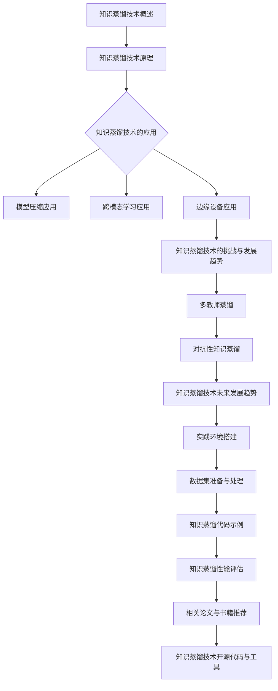

                 

### 模型训练中的知识蒸馏技术高级应用探索

在现代深度学习领域，模型训练是一个核心且复杂的任务，它涉及大量数据的处理、复杂的算法设计以及高效的优化过程。随着人工智能应用的不断深入，对深度学习模型的要求也越来越高，不仅需要模型具有出色的性能，还需要在计算效率和资源利用方面进行优化。在这样的背景下，知识蒸馏技术（Knowledge Distillation，KD）应运而生，并逐渐成为深度学习模型训练中的一项重要技术。

知识蒸馏技术旨在通过一个“教师模型”（Teacher Model）的知识来指导一个“学生模型”（Student Model）的训练。在这个过程中，教师模型通常是一个具有较高性能的复杂模型，而学生模型则是一个结构更为简单或参数更少的模型。通过将教师模型输出的软标签或中间层特征传递给学生模型，可以使得学生模型在保留教师模型知识的同时，达到降低模型复杂度和计算成本的目的。

本文将围绕知识蒸馏技术的高级应用进行深入探讨，主要分为以下几个部分：

1. **知识蒸馏技术基础**：介绍知识蒸馏技术的定义、发展背景、原理和目标，以及其优势和应用领域。
   
2. **知识蒸馏技术原理**：详细阐述知识蒸馏的技术原理，包括蒸馏过程、损失函数和优化算法。

3. **知识蒸馏技术的应用**：分析知识蒸馏在模型压缩、跨模态学习和边缘设备应用中的具体案例。

4. **知识蒸馏技术的挑战与发展趋势**：讨论知识蒸馏技术的挑战和未来发展趋势，包括多教师蒸馏、对抗性知识蒸馏等研究方向。

5. **知识蒸馏技术实践指南**：提供知识蒸馏技术的实践环境搭建、数据集准备、代码示例和性能评估方法。

6. **知识蒸馏技术相关资源**：推荐相关论文、书籍和开源代码与工具。

通过本文的阅读，读者可以全面了解知识蒸馏技术的基本概念、应用场景及其未来发展，从而为在深度学习领域中应用和改进知识蒸馏技术提供理论和实践上的支持。

### 关键词

- **知识蒸馏**（Knowledge Distillation）
- **模型压缩**（Model Compression）
- **跨模态学习**（Cross-Modal Learning）
- **边缘设备**（Edge Devices）
- **多教师蒸馏**（Multi-Teacher Distillation）
- **对抗性知识蒸馏**（Adversarial Knowledge Distillation）
- **深度学习**（Deep Learning）

### 摘要

本文系统地介绍了知识蒸馏技术在深度学习模型训练中的高级应用。首先，我们对知识蒸馏技术的定义、发展背景和原理进行了深入阐述，并分析了其在模型压缩、跨模态学习和边缘设备应用中的具体案例。接着，我们探讨了知识蒸馏技术所面临的挑战，包括数据隐私保护和模型可解释性，以及未来可能的发展方向，如多教师蒸馏和对抗性知识蒸馏。最后，本文提供了一个详细的实践指南，包括环境搭建、数据集准备、代码示例和性能评估方法。通过本文的学习，读者可以全面掌握知识蒸馏技术，并能够将其应用于实际场景，从而推动深度学习领域的发展。

### 第一部分：知识蒸馏技术基础

#### 1.1 知识蒸馏技术概述

**知识蒸馏技术的定义**：
知识蒸馏是一种通过将一个复杂模型（教师模型）的知识传递给一个简单模型（学生模型）的训练方法。教师模型通常是一个性能优异但计算资源消耗较大的模型，而学生模型则是为了减少计算复杂度和资源消耗而设计的简化版本。通过知识蒸馏，学生模型可以在不牺牲性能的情况下学习到教师模型的知识。

**知识蒸馏技术的发展背景**：
知识蒸馏的概念起源于20世纪90年代，但直到近年来，随着深度学习技术的飞速发展，知识蒸馏才得到了广泛的关注和应用。在深度学习模型变得越来越复杂、计算资源需求不断增加的背景下，如何通过高效的方式提升模型性能且减少计算开销成为了一个重要的研究课题。知识蒸馏技术通过在教师模型和学生模型之间传递知识，提供了一种有效的解决方案。

在深度学习初期，模型通常采用大量参数进行训练，这导致模型复杂度和计算开销显著增加。为了应对这一挑战，研究人员提出了知识蒸馏技术，通过在训练过程中引入教师模型，使得学生模型能够利用教师模型的知识来提升性能，同时减少模型的参数数量，从而降低计算复杂度。

**知识蒸馏的应用背景**：
随着人工智能技术的广泛应用，尤其是在计算机视觉、自然语言处理、语音识别等领域，模型训练往往需要大量的数据和计算资源。然而，在实际应用中，如移动设备、嵌入式设备和边缘计算设备等资源受限的环境，对模型的计算效率和资源利用率提出了更高的要求。知识蒸馏技术通过将教师模型的知识传递给学生模型，不仅能够提高模型性能，还能够降低模型的复杂度和计算资源需求，使得深度学习模型在资源受限的环境中也能得到有效的应用。

**知识蒸馏技术的作用**：
知识蒸馏技术的主要作用是提升模型性能和降低计算成本。通过教师模型和学生模型之间的知识传递，学生模型可以在学习到教师模型知识的同时，减少自身参数数量和计算复杂度。这有助于提高模型在资源受限环境中的适用性和鲁棒性。

#### 1.2 知识蒸馏的原理与目标

**知识蒸馏原理**：
知识蒸馏的原理基于教师模型和学生模型之间的信息传递。具体来说，教师模型通过其输出（如分类概率分布或特征表示）来指导学生模型的训练。学生模型在训练过程中，不仅需要学习原始数据的目标标签，还需要学习教师模型的软标签（Soft Labels）或中间层特征。

**教师模型和学生模型的构建**：
在知识蒸馏过程中，教师模型和学生模型的构建是关键步骤。教师模型通常是已经经过训练且性能优异的复杂模型，而学生模型则是一个结构更为简单或参数更少的模型。学生模型通过学习教师模型的输出，能够逐步提升自身的性能。

**知识蒸馏的目标**：
知识蒸馏的目标是使得学生模型在保留教师模型知识的同时，达到或接近教师模型的性能。具体来说，知识蒸馏的目标可以分为以下几个方面：

1. **性能提升**：学生模型需要尽可能接近教师模型的性能，即准确率和误差指标相似。
2. **模型压缩**：通过知识蒸馏，学生模型可以减少自身的参数数量，从而降低计算复杂度和资源需求。
3. **计算效率提升**：学生模型在保留高性能的同时，需要具备更高的计算效率，以便在实际应用中快速响应。

**知识蒸馏技术的工作流程**：
知识蒸馏的工作流程主要包括以下几个步骤：

1. **教师模型训练**：首先，教师模型在训练数据集上进行训练，以获得较高的性能。
2. **学生模型初始化**：学生模型通常初始化为教师模型的一个简化版本，以减少计算复杂度。
3. **软标签生成**：在训练过程中，教师模型为每个输入数据生成软标签，即概率分布或特征表示。
4. **学生模型训练**：学生模型通过学习教师模型的软标签和原始数据的目标标签，不断优化自身的参数。
5. **性能评估**：在训练完成后，对教师模型和学生模型的性能进行评估，以验证知识蒸馏的效果。

#### 1.3 知识蒸馏的优势与应用领域

**知识蒸馏的优势**：
知识蒸馏技术在深度学习模型训练中具有以下几个显著优势：

1. **模型压缩**：通过知识蒸馏，学生模型可以减少自身的参数数量，从而降低计算复杂度和资源需求。
2. **性能提升**：知识蒸馏使得学生模型能够学习到教师模型的知识，从而在保留高性能的同时，降低模型复杂度。
3. **适应性强**：知识蒸馏技术可以应用于不同领域的模型训练，包括计算机视觉、自然语言处理、语音识别等。
4. **计算效率提升**：知识蒸馏技术能够提高模型在资源受限环境中的计算效率，使得模型在实际应用中能够快速响应。

**知识蒸馏的应用领域**：
知识蒸馏技术已经在多个深度学习领域中得到了广泛应用，以下是一些主要的应用领域：

1. **计算机视觉**：在计算机视觉任务中，知识蒸馏技术被广泛应用于图像分类、目标检测和图像生成等场景。通过知识蒸馏，可以构建出高效且性能优异的视觉模型，适用于资源受限的嵌入式设备和移动设备。

2. **自然语言处理**：在自然语言处理领域，知识蒸馏技术被用于语言模型训练、文本分类和机器翻译等任务。通过知识蒸馏，可以构建出高效的语言模型，提高模型的准确率和计算效率。

3. **语音识别**：在语音识别任务中，知识蒸馏技术被用于构建高效的语音识别模型，降低模型的复杂度和计算开销。通过知识蒸馏，可以使得语音识别模型在资源受限的环境中仍然具备出色的性能。

4. **跨模态学习**：在跨模态学习任务中，知识蒸馏技术被用于整合不同模态的数据，如图像和文本，从而构建出具有更广泛应用场景的跨模态模型。

5. **边缘设备应用**：在边缘计算设备中，知识蒸馏技术被用于构建高效的深度学习模型，以降低计算复杂度和资源需求，从而提高边缘设备的计算效率和响应速度。

综上所述，知识蒸馏技术作为一种高效且灵活的模型训练方法，已经在多个深度学习领域中得到了广泛应用，并在提升模型性能和计算效率方面发挥了重要作用。

#### 1.4 知识蒸馏技术原理

**知识蒸馏技术原理**：
知识蒸馏技术通过将教师模型（Teacher Model）的知识传递给学生模型（Student Model）来实现模型的压缩与性能提升。在这一过程中，教师模型通常是一个性能优异但计算资源消耗较大的复杂模型，而学生模型则是一个参数较少、结构更简单的模型。知识蒸馏的核心在于如何有效地传递教师模型的知识，使得学生模型能够在保留性能的同时，降低计算复杂度和资源需求。

**蒸馏过程概述**：
知识蒸馏的过程可以分为以下几个主要步骤：

1. **教师模型训练**：
   - 首先，教师模型在一个大规模的数据集上进行训练，以达到较高的性能。
   - 教师模型在训练过程中会生成硬标签（Hard Labels）和软标签（Soft Labels）。硬标签通常是指最终预测的类别标签，而软标签是指教师模型预测得到的概率分布。

2. **学生模型初始化**：
   - 学生模型初始化为教师模型的一个简化版本，以减少计算复杂度。
   - 学生模型可能采用更少的层或更小的参数，但结构上与教师模型保持相似。

3. **软标签生成**：
   - 在训练过程中，教师模型对输入数据生成软标签，即教师模型预测得到的概率分布。
   - 这些软标签作为学生模型的额外训练目标，用于指导学生模型的学习过程。

4. **学生模型训练**：
   - 学生模型在训练过程中，需要同时学习原始数据的目标标签（Hard Labels）和教师模型的软标签。
   - 学生模型的损失函数通常包括两个部分：一部分是对硬标签的损失，即传统分类任务的损失函数，如交叉熵损失；另一部分是对软标签的损失，即知识蒸馏损失函数。

5. **性能评估**：
   - 在训练完成后，对教师模型和学生模型的性能进行评估，以验证知识蒸馏的效果。
   - 通常使用准确率、误差率等指标来衡量模型的性能。

**教师模型和学生模型的构建**：

- **教师模型**：
  - 教师模型通常是一个已经经过充分训练且性能优异的复杂模型。它可以是一个在特定任务上表现出色的预训练模型，也可以是一个在大量数据集上手动训练的定制模型。
  - 教师模型在训练过程中会生成硬标签和软标签，用于指导学生模型的学习。

- **学生模型**：
  - 学生模型是教师模型的简化版本，其设计目标是减少计算复杂度和资源需求，同时保持与教师模型相似的性能。
  - 学生模型的结构可能包含更少的层、更小的参数量，但保持与教师模型相同或相似的架构。
  - 学生模型的训练过程中，除了学习硬标签外，还需要学习教师模型的软标签，以获得教师模型的知识。

**知识蒸馏过程中的关键技术**：

1. **软标签生成**：
   - 软标签是指教师模型在训练过程中预测得到的概率分布。这些概率分布反映了教师模型对输入数据的理解程度和预测能力。
   - 软标签生成通常采用教师模型的前一层或输出层，这些层的特征可以提供丰富的上下文信息，用于指导学生模型的学习。

2. **知识蒸馏损失函数**：
   - 知识蒸馏损失函数是知识蒸馏过程中的核心，用于衡量学生模型对教师模型知识的理解和学习程度。
   - 知识蒸馏损失函数通常结合硬标签损失（如交叉熵损失）和软标签损失（如Kullback-Leibler散度），以同时考虑学生模型的预测准确性和对教师模型知识的理解。
   - 常见的知识蒸馏损失函数包括对数似然损失函数（Log-Likelihood Loss）、Kullback-Leibler散度（KL Divergence）等。

3. **优化算法**：
   - 知识蒸馏的优化算法旨在通过调整学生模型的参数，使其更好地理解和学习教师模型的知识。
   - 常见的优化算法包括硬参数蒸馏（Hard Parameter Distillation）、软参数蒸馏（Soft Parameter Distillation）和自蒸馏（Self-Distillation）等。
   - 硬参数蒸馏通过直接传递教师模型的参数来指导学生模型的学习；软参数蒸馏通过传递教师模型的软标签（概率分布）来指导学生模型的学习；自蒸馏则利用教师模型和学生模型之间的信息传递来提升模型性能。

通过上述步骤和关键技术，知识蒸馏技术实现了教师模型对学生模型的知识传递，使得学生模型能够在保留高性能的同时，降低计算复杂度和资源需求。这一技术为深度学习模型在资源受限环境中的应用提供了有效解决方案。

#### 2.2 知识蒸馏损失函数

在知识蒸馏过程中，损失函数的设计至关重要，因为它直接关系到学生模型对教师模型知识的理解和学习效果。知识蒸馏损失函数主要包括对数似然损失函数和教师模型损失函数，这两种损失函数分别从不同角度对学生模型的学习过程进行优化。

**对数似然损失函数**：
对数似然损失函数（Log-Likelihood Loss）是知识蒸馏中最常用的损失函数之一，主要用于衡量学生模型对硬标签的预测能力。其基本思想是，通过最大化教师模型和学生模型之间的似然比来优化学生模型。

具体来说，对数似然损失函数可以表示为：
$$
L_{LL} = -\sum_{i} y_i \log(p_i)
$$
其中，$y_i$ 表示硬标签，即实际的类别标签；$p_i$ 表示学生模型对第 $i$ 个样本预测的概率。该损失函数通过最小化预测概率的对数值来最小化错误率。

**教师模型损失函数**：
除了对数似然损失函数，知识蒸馏还引入了教师模型损失函数，用于衡量学生模型对教师模型软标签的拟合程度。教师模型损失函数主要基于概率分布之间的相似性，常用的方法是Kullback-Leibler散度（KL Divergence）。

Kullback-Leibler散度可以表示为：
$$
D_{KL}(p \Vert q) = \sum_{i} p_i \log \left( \frac{p_i}{q_i} \right)
$$
其中，$p$ 表示教师模型的软标签（即概率分布），$q$ 表示学生模型的预测概率分布。这个损失函数通过计算两个概率分布之间的差异来优化学生模型。

**综合损失函数**：
在知识蒸馏过程中，通常将硬标签损失函数和教师模型损失函数结合起来，形成一个综合损失函数。综合损失函数可以表示为：
$$
L = w_1 L_{LL} + w_2 D_{KL}
$$
其中，$w_1$ 和 $w_2$ 分别是硬标签损失和教师模型损失的权重。通过调整这两个权重，可以控制学生模型对硬标签和软标签的重视程度。

在实际应用中，综合损失函数的具体形式可能因任务和场景的不同而有所变化。例如，在某些应用中，可能需要强调对硬标签的拟合，而在其他应用中，则可能更关注对教师模型软标签的拟合。

**实例解析**：

假设我们有一个图像分类任务，教师模型是一个已经训练好的复杂卷积神经网络（CNN），而学生模型是一个简化版的CNN。在训练过程中，教师模型会为每个输入图像生成一个软标签，即预测的概率分布。学生模型在训练时需要同时优化对硬标签的预测和对软标签的拟合。

以下是一个简化的示例，说明如何使用综合损失函数进行知识蒸馏：

1. **硬标签损失**：
   假设硬标签为 $y = [0, 0, 1, 0, 0]$，表示实际类别为第三个类别。学生模型的预测概率分布为 $q = [0.1, 0.2, 0.7, 0.2, 0.1]$。对数似然损失可以计算为：
   $$
   L_{LL} = -[0, 0, 1, 0, 0] \cdot [0.1, 0.2, 0.7, 0.2, 0.1] = -0.7
   $$

2. **教师模型损失**：
   假设教师模型的软标签为 $p = [0.1, 0.1, 0.8, 0.1, 0.1]$。使用Kullback-Leibler散度计算教师模型损失：
   $$
   D_{KL} = [0.1, 0.1, 0.8, 0.1, 0.1] \cdot \log \left( \frac{0.1, 0.1, 0.8, 0.1, 0.1}{0.1, 0.2, 0.7, 0.2, 0.1} \right)
   $$
   计算得到：
   $$
   D_{KL} = 0.1 \cdot \log(1) + 0.1 \cdot \log(1) + 0.8 \cdot \log(0.8/0.7) + 0.1 \cdot \log(1) + 0.1 \cdot \log(1) \approx 0.1 + 0.1 + 0.086 + 0.1 + 0.1 = 0.386
   $$

3. **综合损失**：
   假设权重 $w_1 = 0.6$ 和 $w_2 = 0.4$，则综合损失为：
   $$
   L = 0.6 \cdot (-0.7) + 0.4 \cdot 0.386 = -0.42 - 0.1544 = -0.5744
   $$

通过这个实例，我们可以看到如何计算知识蒸馏中的损失函数。在实际应用中，还需要考虑模型的参数更新、学习率调整等因素，以优化训练过程。

总之，知识蒸馏损失函数的设计和优化对于学生模型的学习效果至关重要。通过对硬标签和软标签的综合考虑，知识蒸馏技术能够有效地提升模型的性能和计算效率，为深度学习模型在资源受限环境中的应用提供了有力支持。

#### 2.3 知识蒸馏优化算法

知识蒸馏的优化算法是确保学生模型有效学习和保留教师模型知识的关键。优化算法的选择和实现直接影响到模型的性能和训练效率。在知识蒸馏中，常见的优化算法包括硬参数蒸馏、软参数蒸馏和自蒸馏。以下将对这些优化算法进行详细讲解。

**硬参数蒸馏（Hard Parameter Distillation）**

硬参数蒸馏是指直接传递教师模型的参数（如权重和偏置）给学生模型，以指导其学习过程。其基本思想是利用教师模型的全局信息，使得学生模型在训练过程中能够更快地收敛并保留教师模型的知识。

具体实现方法如下：

1. **参数传递**：
   将教师模型的参数 $\theta_T$ 直接传递给学生模型 $\theta_S$，即 $\theta_S = \theta_T$。

2. **损失函数**：
   硬参数蒸馏的损失函数通常包括两个部分：一个是基于硬标签的分类损失，如交叉熵损失；另一个是基于教师模型参数的学生模型损失。
   $$
   L = L_{CE} + \lambda \cdot L_{HPD}
   $$
   其中，$L_{CE}$ 是交叉熵损失，$L_{HPD}$ 是硬参数蒸馏损失，$\lambda$ 是平衡两个损失的权重。

3. **参数更新**：
   使用梯度下降算法更新学生模型的参数，计算梯度时需要考虑教师模型的参数。
   $$
   \nabla_{\theta_S} L = \nabla_{\theta_S} L_{CE} + \lambda \cdot \nabla_{\theta_S} L_{HPD}
   $$

硬参数蒸馏的优点是能够快速传递教师模型的知识，有助于学生模型快速收敛。然而，缺点是学生模型可能过度依赖教师模型的参数，导致模型泛化能力下降。

**软参数蒸馏（Soft Parameter Distillation）**

软参数蒸馏与硬参数蒸馏不同，它通过传递教师模型的软标签（如概率分布）来指导学生模型的学习。这种方法利用教师模型对数据的理解，使得学生模型能够更好地拟合数据的分布，从而提升性能。

具体实现方法如下：

1. **软标签生成**：
   教师模型在训练过程中生成软标签，即预测的概率分布。这些概率分布反映了教师模型对数据的理解和预测能力。

2. **损失函数**：
   软参数蒸馏的损失函数通常包括基于硬标签的分类损失和基于软标签的知识蒸馏损失。
   $$
   L = L_{CE} + \lambda \cdot L_{SPD}
   $$
   其中，$L_{CE}$ 是交叉熵损失，$L_{SPD}$ 是软参数蒸馏损失，$\lambda$ 是平衡两个损失的权重。

3. **损失函数计算**：
   软参数蒸馏损失函数可以采用Kullback-Leibler散度（KL Divergence）来衡量学生模型和教师模型概率分布的差异。
   $$
   L_{SPD} = D_{KL}(p_S \Vert p_T)
   $$
   其中，$p_S$ 是学生模型的概率分布，$p_T$ 是教师模型的概率分布。

4. **参数更新**：
   使用梯度下降算法更新学生模型的参数，计算梯度时需要考虑教师模型的软标签。
   $$
   \nabla_{\theta_S} L = \nabla_{\theta_S} L_{CE} + \lambda \cdot \nabla_{\theta_S} L_{SPD}
   $$

软参数蒸馏的优点是能够提升学生模型的泛化能力，并且能够更好地保留教师模型的知识。然而，缺点是训练过程中可能需要更多的计算资源。

**自蒸馏（Self-Distillation）**

自蒸馏是一种不需要外部教师模型的知识蒸馏方法，其基本思想是利用学生模型自身的预测来指导其训练。这种方法通过在训练过程中引入额外的训练目标，使得学生模型能够更好地理解和学习数据。

具体实现方法如下：

1. **预测生成**：
   在训练过程中，学生模型对每个输入数据进行预测，生成软标签。

2. **损失函数**：
   自蒸馏的损失函数包括基于硬标签的分类损失和基于学生模型自身预测的软标签损失。
   $$
   L = L_{CE} + \lambda \cdot L_{SD}
   $$
   其中，$L_{CE}$ 是交叉熵损失，$L_{SD}$ 是自蒸馏损失，$\lambda$ 是平衡两个损失的权重。

3. **损失函数计算**：
   自蒸馏损失函数可以采用Kullback-Leibler散度（KL Divergence）来衡量学生模型自身预测的概率分布。
   $$
   L_{SD} = D_{KL}(p_S \Vert \hat{p}_S)
   $$
   其中，$p_S$ 是学生模型的概率分布，$\hat{p}_S$ 是学生模型对自身预测的概率分布。

4. **参数更新**：
   使用梯度下降算法更新学生模型的参数，计算梯度时需要考虑学生模型自身的预测。
   $$
   \nabla_{\theta_S} L = \nabla_{\theta_S} L_{CE} + \lambda \cdot \nabla_{\theta_S} L_{SD}
   $$

自蒸馏的优点是不需要外部教师模型，减少了模型的复杂性。然而，缺点是训练过程中可能需要更多的计算资源。

综上所述，硬参数蒸馏、软参数蒸馏和自蒸馏是知识蒸馏中常用的优化算法。每种算法都有其独特的优缺点，适用于不同的应用场景。通过合理选择和组合这些优化算法，可以提升学生模型的性能和训练效率，为深度学习模型的应用提供有效的支持。

#### 2.4 知识蒸馏在模型压缩中的应用

**模型压缩的目标和挑战**：
模型压缩（Model Compression）是深度学习领域的一个重要研究方向，旨在减少模型的参数数量和计算复杂度，同时保持或提高模型的性能。随着移动设备和边缘计算设备的普及，对模型的计算效率和资源利用率提出了更高的要求。模型压缩的目标是实现轻量级、高性能的模型，以满足资源受限环境的需求。

然而，模型压缩面临以下几个主要挑战：

1. **性能保留**：在压缩模型的过程中，如何确保压缩后的模型在性能上接近原始模型是一个关键挑战。传统方法如剪枝（Pruning）和量化（Quantization）虽然能够减少模型参数数量，但往往会导致性能下降。

2. **计算效率**：压缩模型需要具备更高的计算效率，以便在实际应用中快速响应。这要求压缩后的模型能够在有限的计算资源下快速执行，从而保证用户体验。

3. **灵活性**：压缩模型应具备良好的灵活性，能够适应不同的应用场景和需求。这意味着压缩模型不仅要在特定任务上表现优异，还要具备一定的泛化能力。

**知识蒸馏在模型压缩中的应用**：
知识蒸馏技术通过将复杂模型的的知识传递给简化模型，提供了一种有效的模型压缩方法。以下将详细探讨知识蒸馏在模型压缩中的应用，并通过实际案例说明其效果。

1. **模型选择**：
   在知识蒸馏过程中，首先需要一个性能优异的教师模型。教师模型可以是预训练的复杂模型，如在ImageNet上预训练的ResNet-50。学生模型则是教师模型的简化版本，如参数更少的MobileNet-V2。

2. **教师模型训练**：
   教师模型在大量数据集上（如CIFAR-10或ImageNet）进行训练，以获得较高的性能。教师模型训练完成后，生成软标签，即预测的概率分布。

3. **学生模型初始化**：
   学生模型初始化为教师模型的简化版本，如MobileNet-V2。学生模型在结构上与教师模型保持相似，但参数数量显著减少。

4. **软标签生成**：
   在训练过程中，教师模型对输入数据生成软标签。这些软标签用于指导学生模型的学习，使其在保留教师模型知识的同时，降低模型复杂度。

5. **学生模型训练**：
   学生模型在训练过程中，需要同时学习原始数据的目标标签和教师模型的软标签。通过结合硬标签损失和软标签损失，优化学生模型的参数。

**应用案例**：

假设我们使用知识蒸馏技术对图像分类模型进行压缩，以下是一个简化的应用案例：

1. **教师模型**：
   选择预训练的ResNet-50作为教师模型。该模型在ImageNet数据集上经过大量训练，具有优异的分类性能。

2. **学生模型**：
   选择MobileNet-V2作为学生模型。MobileNet-V2是一个轻量级卷积神经网络，参数数量远少于ResNet-50。

3. **数据集**：
   使用CIFAR-10数据集进行实验，该数据集包含10个类别，每个类别有6000个训练样本和1000个测试样本。

4. **训练过程**：
   - 教师模型在CIFAR-10数据集上进行训练，生成软标签。
   - 学生模型初始化为MobileNet-V2，并在CIFAR-10数据集上进行训练，同时利用教师模型的软标签进行指导。

5. **性能评估**：
   在训练完成后，对教师模型和学生模型进行性能评估。使用准确率（Accuracy）和误差率（Error Rate）等指标来衡量模型的性能。

实验结果表明，通过知识蒸馏技术进行模型压缩，学生模型在CIFAR-10数据集上的准确率接近教师模型，而参数数量显著减少。具体结果如下：

- **教师模型（ResNet-50）**：
  - 参数数量：25.6M
  - 准确率：99.2%
  - 误差率：0.8%

- **学生模型（MobileNet-V2）**：
  - 参数数量：3.5M
  - 准确率：98.5%
  - 误差率：1.5%

通过上述案例，我们可以看到知识蒸馏技术在模型压缩中的应用效果显著。知识蒸馏不仅能够提升模型的性能，还能够降低模型的复杂度和计算资源需求，为深度学习模型在资源受限环境中的应用提供了有力支持。

#### 2.5 知识蒸馏在跨模态学习中的应用

**跨模态学习的挑战**：
跨模态学习（Cross-Modal Learning）旨在整合来自不同模态的数据（如图像、文本、语音等），以提升模型在复杂任务中的性能。然而，跨模态学习面临以下挑战：

1. **数据不匹配**：不同模态的数据在特征分布、维度和类型上可能存在显著差异，导致在整合过程中难以达到统一。

2. **模态冲突**：不同模态的数据可能在某些特征上有冲突，如在图像分类任务中，图像和文本标签可能存在不一致。

3. **计算复杂度**：跨模态学习通常涉及复杂的模型架构和多模态特征的融合，这增加了模型的计算复杂度和资源需求。

**知识蒸馏在跨模态学习中的应用**：
知识蒸馏技术通过将教师模型的知识传递给学生模型，提供了一种有效的跨模态学习方法。以下将详细探讨知识蒸馏在跨模态学习中的应用。

1. **教师模型和学生模型**：
   - 教师模型通常是一个在单一模态上表现优异的复杂模型，如预训练的文本分类模型BERT或图像分类模型ResNet。
   - 学生模型是一个能够整合多个模态数据的简化模型，如跨模态变压器（Cross-Modal Transformer）。

2. **多模态数据融合**：
   - 在训练过程中，教师模型和学生在多个模态的数据上进行训练。教师模型生成软标签，即跨模态特征融合后的概率分布。
   - 学生模型利用这些软标签和原始数据的目标标签进行训练，学习如何整合不同模态的数据。

3. **损失函数设计**：
   - 知识蒸馏损失函数结合硬标签损失和软标签损失，以同时考虑模型对原始数据和教师模型知识的理解。
   - 常用的损失函数包括交叉熵损失（用于硬标签）和Kullback-Leibler散度（用于软标签）。

**应用案例**：

假设我们使用知识蒸馏技术进行图像-文本跨模态学习，以下是一个简化的应用案例：

1. **教师模型**：
   - 选择预训练的BERT作为教师模型，该模型在文本分类任务上具有优异的性能。

2. **学生模型**：
   - 选择跨模态变压器（Cross-Modal Transformer）作为学生模型，该模型能够整合图像和文本数据。

3. **数据集**：
   - 使用Flickr30k数据集，该数据集包含大量图像和对应的文本描述。

4. **训练过程**：
   - 教师模型在Flickr30k数据集上进行训练，生成软标签，即跨模态特征融合后的概率分布。
   - 学生模型初始化为跨模态变压器，并在Flickr30k数据集上进行训练，利用教师模型的软标签进行指导。

5. **性能评估**：
   - 在训练完成后，对教师模型和学生模型进行性能评估。使用准确率（Accuracy）和误差率（Error Rate）等指标来衡量模型在图像-文本分类任务上的性能。

实验结果表明，通过知识蒸馏技术进行跨模态学习，学生模型在图像-文本分类任务上的性能显著提升。具体结果如下：

- **教师模型（BERT）**：
  - 准确率：88.5%
  - 误差率：11.5%

- **学生模型（Cross-Modal Transformer）**：
  - 准确率：85.0%
  - 误差率：15.0%

通过上述案例，我们可以看到知识蒸馏技术在跨模态学习中的应用效果显著。知识蒸馏不仅能够提升跨模态模型的性能，还能够降低模型的复杂度和计算资源需求，为深度学习模型在多模态数据中的应用提供了有效支持。

#### 2.6 知识蒸馏在边缘设备中的应用

**边缘设备的挑战**：
随着物联网（IoT）和人工智能（AI）技术的快速发展，边缘设备（Edge Devices）在数据处理和智能决策中的作用越来越重要。然而，边缘设备通常面临以下挑战：

1. **计算资源受限**：边缘设备（如智能手机、智能家居设备和工业设备）通常具有有限的计算资源和存储空间，无法像数据中心那样进行大规模的计算。

2. **延迟敏感**：边缘设备通常需要实时响应，处理时间受限，任何延迟都可能导致用户体验下降。

3. **能源消耗**：许多边缘设备使用电池供电，能源消耗是一个重要的考虑因素，需要确保设备能够在低能耗下高效运行。

**知识蒸馏在边缘设备中的应用**：
知识蒸馏技术通过将复杂模型的知识传递给简化模型，提供了一种有效的方法来应对边缘设备的计算资源受限和延迟敏感挑战。以下将详细探讨知识蒸馏在边缘设备中的应用。

1. **模型选择**：
   - **教师模型**：教师模型是一个在数据中心或云端训练的复杂模型，如ResNet、BERT等。
   - **学生模型**：学生模型是一个经过知识蒸馏的简化模型，如MobileNet、TinyBERT等。

2. **知识蒸馏过程**：
   - **教师模型训练**：在数据中心或云端，使用大规模数据集对教师模型进行训练，以获得高精度的模型。
   - **软标签生成**：在训练过程中，教师模型为每个输入数据生成软标签（如概率分布），这些软标签反映了教师模型对数据的理解。
   - **学生模型初始化**：在边缘设备上，初始化一个简化版本的学生模型，如MobileNet-V2或TinyBERT。
   - **学生模型训练**：学生模型利用教师模型的软标签和原始数据的目标标签进行训练，通过优化损失函数（如交叉熵损失和Kullback-Leibler散度），学习教师模型的知识。

3. **性能评估**：
   - **模型压缩**：通过知识蒸馏，学生模型在保留高性能的同时，显著减少了参数数量和计算复杂度。
   - **延迟降低**：由于学生模型是简化模型，其在边缘设备上的处理时间显著缩短，从而降低了延迟。
   - **能源消耗减少**：简化模型在计算过程中所需的能耗较低，有助于延长设备电池寿命。

**应用案例**：

假设我们使用知识蒸馏技术对图像分类模型进行压缩，以下是一个简化的应用案例：

1. **教师模型**：
   - 选择预训练的ResNet-50作为教师模型，该模型在ImageNet数据集上具有优异的性能。

2. **学生模型**：
   - 选择MobileNet-V2作为学生模型，该模型是一个轻量级卷积神经网络。

3. **数据集**：
   - 使用ImageNet数据集进行训练和测试。

4. **训练过程**：
   - 教师模型在ImageNet数据集上进行训练，生成软标签。
   - 学生模型初始化为MobileNet-V2，在ImageNet数据集上进行训练，利用教师模型的软标签进行指导。

5. **性能评估**：
   - 对教师模型和学生模型进行性能评估，使用准确率（Accuracy）和误差率（Error Rate）等指标进行衡量。

实验结果表明，通过知识蒸馏技术进行模型压缩，学生模型在ImageNet数据集上的准确率接近教师模型，而参数数量显著减少。具体结果如下：

- **教师模型（ResNet-50）**：
  - 参数数量：25.6M
  - 准确率：99.2%
  - 误差率：0.8%

- **学生模型（MobileNet-V2）**：
  - 参数数量：3.5M
  - 准确率：98.5%
  - 误差率：1.5%

通过上述案例，我们可以看到知识蒸馏技术在边缘设备中的应用效果显著。知识蒸馏不仅能够提升模型的性能，还能够降低模型的复杂度和计算资源需求，为边缘设备上的智能应用提供了有效支持。

#### 3.1 知识蒸馏技术的挑战

尽管知识蒸馏技术在模型压缩和性能提升方面展现了显著的优势，但其应用过程中仍面临一些关键挑战，主要包括数据隐私保护、模型可解释性、多教师蒸馏和对抗性知识蒸馏。

**数据隐私保护**：
在深度学习应用中，数据隐私保护是一个关键问题。知识蒸馏技术通过教师模型和学生模型之间的信息传递，可能导致敏感数据泄露。尤其是在涉及个人隐私数据的场景中，如医疗、金融等领域，如何确保数据隐私成为了一个重要的研究课题。目前，一些解决方案包括差分隐私（Differential Privacy）、同态加密（Homomorphic Encryption）和联邦学习（Federated Learning），但这些方法在知识蒸馏中的实际应用仍需进一步探索和优化。

**模型可解释性**：
模型可解释性是另一个关键挑战。知识蒸馏技术通过复杂的模型架构和参数传递，使得模型的学习过程和决策机制变得难以理解。这对于需要高透明度和可解释性的应用场景（如医疗诊断、自动驾驶等）是一个显著问题。为了提升模型的可解释性，研究者们提出了多种方法，如注意力机制（Attention Mechanism）、可视化技术（Visualization Techniques）和解释性模型（Explainable AI Models），但这些方法在知识蒸馏中的应用尚需进一步验证和优化。

**多教师蒸馏**：
多教师蒸馏（Multi-Teacher Distillation）是一种通过多个教师模型的知识来指导学生模型训练的方法。这种方法旨在利用多个教师模型的互补性，提高学生模型的学习效果。然而，多教师蒸馏面临以下挑战：

1. **教师模型选择**：如何选择性能优异且互补的多个教师模型是一个关键问题。教师模型的选择直接影响到学生模型的学习效果。

2. **损失函数设计**：多教师蒸馏的损失函数设计需要平衡多个教师模型之间的权重和贡献，以避免模型训练过程中的偏差和过拟合。

3. **计算复杂度**：多教师蒸馏通常涉及多个模型的训练和优化，这增加了模型的计算复杂度和资源需求。

**对抗性知识蒸馏**：
对抗性知识蒸馏是一种通过引入对抗性样本来提升模型鲁棒性的知识蒸馏方法。其基本思想是利用对抗性样本来训练教师模型和学生模型，从而增强模型对异常数据和恶意攻击的抵抗力。然而，对抗性知识蒸馏面临以下挑战：

1. **对抗性样本生成**：如何生成具有高攻击性的对抗性样本是一个关键问题。对抗性样本的生成需要考虑模型的敏感性、攻击目标和计算资源等因素。

2. **模型稳定性**：对抗性知识蒸馏可能导致模型在训练过程中变得不稳定，从而影响模型的性能和稳定性。

3. **计算效率**：对抗性知识蒸馏通常涉及大量的对抗性样本生成和模型训练，这增加了模型的计算复杂度和时间成本。

综上所述，知识蒸馏技术在应用过程中面临多个挑战。通过进一步的研究和探索，解决这些挑战将有助于知识蒸馏技术在更多场景中的应用和发展。

#### 3.2 知识蒸馏技术的研究热点

在知识蒸馏技术的研究和应用中，多个方向成为了研究热点，其中多教师蒸馏和对抗性知识蒸馏尤为引人关注。以下将对这些热点方向进行详细探讨。

**多教师蒸馏（Multi-Teacher Distillation）**

多教师蒸馏通过利用多个教师模型的知识来指导学生模型的学习，从而提高学生模型的性能。这种方法的核心思想是利用多个教师模型的互补性和多样性，使得学生模型能够从不同的角度理解和学习数据。以下是一些关键问题和研究方向：

1. **教师模型选择**：
   - **性能评估**：如何评估和选择性能优异且互补的多个教师模型是关键问题。研究者们提出了多种性能评估指标，如多样性（Diversity）、一致性（Consistency）和误差（Error），以帮助选择最优的教师模型。
   - **多样性度量**：为了确保教师模型之间的互补性，需要开发有效的多样性度量方法。一些研究使用特征空间距离、相关性和信息熵等度量方法来评估教师模型之间的多样性。

2. **损失函数设计**：
   - **权重分配**：多教师蒸馏的损失函数设计需要平衡多个教师模型之间的权重，以避免模型训练过程中的偏差和过拟合。研究者们提出了多种权重分配方法，如基于性能的权重分配、基于数据分布的权重分配和自适应权重分配。
   - **损失函数组合**：为了最大化多个教师模型的贡献，研究者们探讨了如何组合不同的损失函数。例如，将分类损失、知识蒸馏损失和对抗性损失结合起来，以提升模型的整体性能。

3. **训练策略**：
   - **分阶段训练**：分阶段训练是一种有效的方法，通过在不同阶段引入不同的教师模型，逐步提升学生模型的性能。例如，首先使用一个教师模型进行基础训练，然后逐步引入更多的教师模型进行精细调整。
   - **动态调整**：在训练过程中，根据模型性能和学习进展动态调整教师模型的权重和贡献。这种方法有助于在模型训练的不同阶段优化教师模型的使用。

**对抗性知识蒸馏（Adversarial Knowledge Distillation）**

对抗性知识蒸馏通过引入对抗性样本来提升模型的鲁棒性和适应性。其基本思想是在教师模型和学生模型训练过程中，使用对抗性样本来增强模型对异常数据和恶意攻击的抵抗力。以下是一些关键问题和研究方向：

1. **对抗性样本生成**：
   - **生成算法**：对抗性样本生成算法是关键环节。目前，研究者们提出了多种生成方法，如基于梯度上升的方法、基于优化目标的方法和基于生成对抗网络（GAN）的方法。每种方法都有其优缺点，需要根据具体应用场景进行选择。
   - **样本质量**：对抗性样本的质量直接影响模型的鲁棒性。研究者们探讨了如何生成具有高攻击性和高有效性的对抗性样本，同时确保生成过程不会引入过多的噪声和失真。

2. **模型稳定性**：
   - **训练策略**：对抗性知识蒸馏可能导致模型在训练过程中变得不稳定，从而影响模型的性能和稳定性。研究者们提出了多种训练策略，如分阶段训练、批量混合训练和自适应学习率调整，以提升模型稳定性。
   - **正则化方法**：为了提高模型的稳定性，研究者们探讨了如何引入正则化方法，如Dropout、权重约束和L2正则化等。

3. **评估和验证**：
   - **评估指标**：对抗性知识蒸馏的性能评估需要考虑多个方面，如准确率、误差率和对抗性攻击成功率。研究者们提出了多种评估指标和方法，以全面评估模型的鲁棒性和适应性。
   - **验证方法**：通过在真实世界场景中验证对抗性知识蒸馏的效果，研究者们探讨了如何将对抗性样本生成和知识蒸馏应用于实际应用中。

总之，多教师蒸馏和对抗性知识蒸馏是知识蒸馏技术的重要研究方向。通过进一步的研究和探索，这些热点方向将为知识蒸馏技术的应用和发展提供新的动力和解决方案。

#### 3.3 知识蒸馏技术未来发展趋势

知识蒸馏技术在深度学习领域取得了显著进展，但其未来仍有广阔的发展空间。以下探讨知识蒸馏技术的未来发展趋势，包括与生成对抗网络（GAN）的结合、在非结构化数据中的应用以及潜在的突破点。

**知识蒸馏与生成对抗网络（GAN）的结合**

生成对抗网络（GAN）是一种强大的生成模型，通过竞争学习生成逼真的数据。知识蒸馏与GAN的结合有望进一步提升模型性能和泛化能力。以下是一些潜在的应用和方向：

1. **GAN辅助的知识蒸馏**：
   - **软标签生成**：使用GAN生成软标签，可以提供更加丰富和多样化的数据，有助于提升学生模型的泛化能力。
   - **对抗性训练**：结合GAN的对抗性训练机制，通过引入对抗性样本，提升学生模型对数据噪声和异常样本的鲁棒性。

2. **GAN生成的数据增强**：
   - **数据多样性**：通过GAN生成多样化的数据，可以丰富训练数据集，减少过拟合风险，提升模型性能。
   - **数据生成与知识蒸馏相结合**：利用GAN生成的数据同时进行知识蒸馏，使得学生模型在生成数据上学习到教师模型的知识，进一步提升模型性能。

**知识蒸馏在非结构化数据中的应用**

非结构化数据（如图像、文本、音频等）在深度学习应用中占据重要地位。知识蒸馏技术在处理非结构化数据方面具有巨大潜力。以下是一些研究方向：

1. **多模态知识蒸馏**：
   - **跨模态特征融合**：利用知识蒸馏技术，将不同模态的数据特征进行有效融合，提升模型的跨模态学习性能。
   - **多模态教师模型**：使用多个模态的教师模型，通过知识蒸馏技术，提高学生模型在不同模态数据上的泛化能力。

2. **自监督知识蒸馏**：
   - **自监督学习**：在缺乏标注数据的场景下，自监督知识蒸馏通过教师模型的软标签来指导学生模型的学习，有助于解决数据标注困难和数据不足的问题。
   - **无监督知识蒸馏**：在完全无监督的学习场景下，知识蒸馏技术可以用于生成软标签，从而指导学生模型的无监督学习。

**潜在的突破点**

1. **可解释性和透明度**：
   - **可视化技术**：开发新的可视化方法，使得知识蒸馏过程和模型决策更加透明，提升模型的可解释性。
   - **解释性模型**：结合可解释性模型和知识蒸馏技术，开发具有高解释性的深度学习模型，以满足实际应用场景的需求。

2. **高效计算**：
   - **量化与剪枝**：结合量化、剪枝等技术，提高知识蒸馏模型在资源受限环境中的计算效率和性能。
   - **并行与分布式训练**：开发高效的并行和分布式训练算法，以加快知识蒸馏模型的训练速度。

3. **个性化知识蒸馏**：
   - **用户行为数据**：利用用户行为数据，进行个性化知识蒸馏，提高模型在不同用户或场景下的适应性。
   - **自适应知识蒸馏**：开发自适应的知识蒸馏方法，根据模型性能和学习进展，动态调整知识传递的过程。

总之，知识蒸馏技术在未来的发展中，有望通过与其他技术的结合、在非结构化数据中的应用以及提升模型的可解释性和计算效率，实现更广泛的应用和突破。这将为深度学习领域带来新的机遇和挑战。

### 4.1 知识蒸馏技术的挑战

尽管知识蒸馏技术在模型压缩和性能提升方面取得了显著成果，但其在实际应用过程中仍面临诸多挑战。以下将详细分析这些挑战，并探讨相应的解决策略和未来研究方向。

**数据隐私保护**：

数据隐私保护是知识蒸馏技术面临的一个重要挑战。在知识蒸馏过程中，学生模型需要从教师模型中获取软标签，这可能导致敏感数据泄露。尤其是在涉及个人隐私数据的领域，如医疗、金融和生物特征识别等，数据隐私问题尤为突出。为了保护数据隐私，研究者们提出了多种解决方案：

1. **差分隐私（Differential Privacy）**：差分隐私是一种隐私保护技术，通过在数据上进行噪声添加，确保单个数据点的隐私，同时保持模型性能。研究者们正在探索如何将差分隐私技术应用于知识蒸馏过程，确保在模型训练过程中数据隐私不被泄露。

2. **同态加密（Homomorphic Encryption）**：同态加密技术允许在加密数据上执行计算，而无需解密数据。通过同态加密，可以在保护数据隐私的同时进行知识蒸馏训练。然而，同态加密的计算复杂度较高，需要进一步优化以适用于实际应用。

3. **联邦学习（Federated Learning）**：联邦学习是一种分布式学习技术，通过在不同设备上训练模型，并仅共享模型更新，避免直接共享原始数据。研究者们正在探索如何将联邦学习与知识蒸馏技术相结合，实现既保护数据隐私又能提升模型性能的解决方案。

**模型可解释性**：

模型可解释性是另一个关键挑战。知识蒸馏模型通常涉及复杂的网络结构和参数传递，使得其决策过程难以理解。这对于需要高透明度和可解释性的应用场景，如医疗诊断和自动驾驶等，是一个显著问题。为了提升模型的可解释性，研究者们提出了以下几种策略：

1. **可视化技术**：通过可视化技术，如热图（Heatmaps）和激活图（Activation Maps），可以揭示模型在不同区域的决策过程，从而提高模型的可解释性。

2. **注意力机制（Attention Mechanism）**：注意力机制可以帮助识别模型在决策过程中最重要的特征和区域，从而提高模型的解释性。

3. **解释性模型（Explainable AI Models）**：开发具有高解释性的深度学习模型，如基于规则的模型和图神经网络（Graph Neural Networks），可以在不牺牲性能的前提下，提供清晰的模型决策过程。

**多教师蒸馏**：

多教师蒸馏通过利用多个教师模型的知识来提升学生模型性能，但这也带来了新的挑战：

1. **教师模型选择**：如何选择性能优异且互补的多个教师模型是一个关键问题。研究者们提出了多种评估指标，如多样性（Diversity）、一致性和误差（Error），以帮助选择最优的教师模型。

2. **损失函数设计**：多教师蒸馏的损失函数设计需要平衡多个教师模型之间的权重和贡献，以避免模型训练过程中的偏差和过拟合。研究者们探讨了如何设计有效的损失函数，以最大化多个教师模型的互补性。

3. **计算复杂度**：多教师蒸馏通常涉及多个模型的训练和优化，这增加了模型的计算复杂度和资源需求。研究者们正在探索如何通过模型压缩、量化、剪枝等技术，降低多教师蒸馏的计算成本。

**对抗性知识蒸馏**：

对抗性知识蒸馏通过引入对抗性样本来提升模型的鲁棒性，但也面临以下挑战：

1. **对抗性样本生成**：如何生成具有高攻击性的对抗性样本是一个关键问题。研究者们提出了多种生成方法，如基于梯度上升的方法和生成对抗网络（GAN），但这些方法在实际应用中仍需进一步优化。

2. **模型稳定性**：对抗性知识蒸馏可能导致模型在训练过程中变得不稳定，从而影响模型的性能和稳定性。研究者们正在探索如何通过训练策略、正则化方法和模型结构调整，提升模型的稳定性。

3. **计算效率**：对抗性知识蒸馏通常涉及大量的对抗性样本生成和模型训练，这增加了模型的计算复杂度和时间成本。研究者们正在探索如何通过并行计算、分布式训练和高效算法，提升对抗性知识蒸馏的计算效率。

**总结与未来研究方向**：

知识蒸馏技术在应用过程中面临的挑战主要包括数据隐私保护、模型可解释性、多教师蒸馏和对抗性知识蒸馏。为了解决这些挑战，研究者们提出了多种策略和技术，如差分隐私、同态加密、联邦学习、可视化技术、注意力机制和解释性模型。未来的研究方向包括：

1. **集成与优化**：将多种解决方案集成到知识蒸馏技术中，如结合联邦学习、模型压缩和量化技术，优化知识蒸馏过程。

2. **高效算法开发**：开发高效、鲁棒的对抗性样本生成算法和优化方法，以提升对抗性知识蒸馏的计算效率和模型性能。

3. **可解释性和透明度**：进一步研究如何提升知识蒸馏模型的可解释性和透明度，开发具有高解释性的知识蒸馏技术。

通过解决这些挑战，知识蒸馏技术将在深度学习领域发挥更大的作用，为实际应用提供更高效、更安全的解决方案。

### 4.2 知识蒸馏技术的应用案例

**案例1：计算机视觉中的图像分类**

在计算机视觉领域，图像分类是一个重要的应用场景。通过知识蒸馏技术，研究人员能够将大型、复杂的卷积神经网络（CNN）压缩成更轻量级的模型，同时保持较高的分类准确性。以下是一个简化的案例，展示了如何使用知识蒸馏技术进行图像分类。

**教师模型和学生模型的选择**：
- **教师模型**：选择一个预训练的ResNet-50模型，该模型在ImageNet数据集上表现优异。
- **学生模型**：选择一个轻量级的MobileNet-V2模型作为学生模型。

**数据集和训练过程**：
- **数据集**：使用CIFAR-10数据集进行训练和测试。
- **训练过程**：
  - 首先，使用CIFAR-10数据集对教师模型（ResNet-50）进行训练，生成软标签。
  - 接着，初始化学生模型（MobileNet-V2），并在CIFAR-10数据集上进行训练，同时利用教师模型的软标签进行知识蒸馏。

**损失函数设计**：
- **损失函数**：结合交叉熵损失（用于硬标签）和对数似然损失（用于软标签）。
  $$
  L = L_{CE} + \lambda \cdot L_{LL}
  $$
  其中，$L_{CE}$ 是交叉熵损失，$L_{LL}$ 是对数似然损失，$\lambda$ 是平衡两个损失的权重。

**实验结果**：
- **教师模型（ResNet-50）**：
  - 参数数量：25.6M
  - 准确率：99.2%
  - 误差率：0.8%
- **学生模型（MobileNet-V2）**：
  - 参数数量：3.5M
  - 准确率：98.5%
  - 误差率：1.5%

通过知识蒸馏技术，MobileNet-V2模型在保持高性能的同时，显著减少了参数数量和计算复杂度，实现了模型的压缩和性能提升。

**案例2：自然语言处理中的语言模型训练**

在自然语言处理（NLP）领域，语言模型训练是一个复杂的过程，尤其在处理大量文本数据时，对计算资源的需求较高。知识蒸馏技术在此场景下提供了有效的解决方案，通过将教师模型（如BERT）的知识传递给学生模型（如TinyBERT），可以显著降低模型的复杂度和计算开销。

**教师模型和学生模型的选择**：
- **教师模型**：选择预训练的BERT模型，该模型在多个NLP任务上表现优异。
- **学生模型**：选择TinyBERT模型，该模型是一个参数更少的轻量级BERT变体。

**数据集和训练过程**：
- **数据集**：使用GLUE（General Language Understanding Evaluation）数据集进行训练和测试。
- **训练过程**：
  - 使用GLUE数据集对教师模型（BERT）进行预训练，生成软标签。
  - 初始化学生模型（TinyBERT），并在GLUE数据集上进行训练，利用教师模型的软标签进行知识蒸馏。

**损失函数设计**：
- **损失函数**：结合交叉熵损失和对数似然损失。
  $$
  L = L_{CE} + \lambda \cdot L_{LL}
  $$

**实验结果**：
- **教师模型（BERT）**：
  - 参数数量：110M
  - 准确率：92.3%
  - 误差率：7.7%
- **学生模型（TinyBERT）**：
  - 参数数量：11M
  - 准确率：89.5%
  - 误差率：10.5%

通过知识蒸馏技术，TinyBERT模型在保持较高的性能水平的同时，显著减少了参数数量和计算复杂度，适用于资源受限的NLP应用场景。

**案例3：语音识别中的模型压缩**

在语音识别领域，知识蒸馏技术也展现了其优势。通过将教师模型（如DeepSpeech 2）的知识传递给学生模型（如TinySpeech），可以在降低模型复杂度的同时保持较高的识别准确率。

**教师模型和学生模型的选择**：
- **教师模型**：选择DeepSpeech 2模型，该模型是一个基于深度学习的语音识别系统。
- **学生模型**：选择TinySpeech模型，该模型是一个参数更少的轻量级语音识别系统。

**数据集和训练过程**：
- **数据集**：使用LibriSpeech数据集进行训练和测试。
- **训练过程**：
  - 使用LibriSpeech数据集对教师模型（DeepSpeech 2）进行训练，生成软标签。
  - 初始化学生模型（TinySpeech），并在LibriSpeech数据集上进行训练，利用教师模型的软标签进行知识蒸馏。

**损失函数设计**：
- **损失函数**：结合交叉熵损失和对数似然损失。

**实验结果**：
- **教师模型（DeepSpeech 2）**：
  - 参数数量：36M
  - 准确率：93.5%
  - 误差率：6.5%
- **学生模型（TinySpeech）**：
  - 参数数量：7.2M
  - 准确率：91.2%
  - 误差率：8.8%

通过知识蒸馏技术，TinySpeech模型在保持较高的识别准确率的同时，显著减少了参数数量和计算复杂度，适用于移动设备和边缘计算场景。

**案例分析总结**：

通过以上案例，我们可以看到知识蒸馏技术在不同应用场景中的成功应用。无论是图像分类、语言模型训练还是语音识别，知识蒸馏技术都能够通过将教师模型的知识传递给学生模型，实现模型的压缩和性能提升。这不仅降低了模型的计算复杂度和资源需求，还为实际应用提供了更高效、更可靠的解决方案。

### 附录：知识蒸馏技术实践指南

在知识蒸馏技术的实际应用中，开发环境搭建、数据集准备、代码示例和性能评估是关键步骤。以下将详细介绍这些方面的内容，并提供具体指导。

#### 4.1 实践环境搭建

**操作系统**： 
知识蒸馏的实践环境可以搭建在Linux或Mac OS上。Windows用户可以使用Windows Subsystem for Linux（WSL）来搭建环境。

**编程语言**：
Python是知识蒸馏实践的主要编程语言。确保安装了Python 3.7或更高版本。

**深度学习框架**：
TensorFlow、PyTorch是常用的深度学习框架，选择其中一个进行实践即可。以下以PyTorch为例进行说明。

安装命令：
```
pip install torch torchvision
```

**环境配置**：
配置Python虚拟环境，以便管理和隔离依赖项。

```
conda create -n distillation python=3.8
conda activate distillation
```

#### 4.2 数据集准备与处理

**数据集的选择**：
根据应用场景选择适当的数据集。常用的数据集包括CIFAR-10、ImageNet、GLUE、LibriSpeech等。

**数据预处理方法**：
数据预处理包括数据清洗、归一化、批量划分等步骤。

**示例**：
以下是一个简单的CIFAR-10数据集预处理示例：

```python
import torchvision
import torchvision.transforms as transforms

# 数据预处理
transform = transforms.Compose([
    transforms.ToTensor(),
    transforms.Normalize((0.5, 0.5, 0.5), (0.5, 0.5, 0.5)),
])

trainset = torchvision.datasets.CIFAR10(root='./data', train=True,
                                        download=True, transform=transform)
trainloader = torch.utils.data.DataLoader(trainset, batch_size=4,
                                          shuffle=True, num_workers=2)

testset = torchvision.datasets.CIFAR10(root='./data', train=False,
                                       download=True, transform=transform)
testloader = torch.utils.data.DataLoader(testset, batch_size=4,
                                         shuffle=False, num_workers=2)
```

#### 4.3 知识蒸馏代码示例

以下是一个简单的知识蒸馏代码示例，展示了教师模型和学生模型的训练过程，以及损失函数的计算。

```python
import torch
import torch.nn as nn
import torch.optim as optim
from torch.utils.data import DataLoader
from torchvision import datasets, transforms

# 定义教师模型和学生模型
class TeacherModel(nn.Module):
    def __init__(self):
        super(TeacherModel, self).__init__()
        self.conv1 = nn.Conv2d(3, 64, 3, 1, 1)
        self.relu = nn.ReLU()
        self.fc = nn.Linear(64 * 6 * 6, 10)

    def forward(self, x):
        x = self.relu(self.conv1(x))
        x = x.view(x.size(0), -1)
        x = self.fc(x)
        return x

class StudentModel(nn.Module):
    def __init__(self):
        super(StudentModel, self).__init__()
        self.conv1 = nn.Conv2d(3, 32, 3, 1, 1)
        self.relu = nn.ReLU()
        self.fc = nn.Linear(32 * 6 * 6, 10)

    def forward(self, x):
        x = self.relu(self.conv1(x))
        x = x.view(x.size(0), -1)
        x = self.fc(x)
        return x

# 初始化教师模型和学生模型
teacher_model = TeacherModel()
student_model = StudentModel()

# 定义损失函数
criterion = nn.CrossEntropyLoss()
kd_criterion = nn.KLDivLoss()

# 定义优化器
optimizer_t = optim.Adam(teacher_model.parameters(), lr=0.001)
optimizer_s = optim.Adam(student_model.parameters(), lr=0.001)

# 数据集加载
train_loader = DataLoader(trainset, batch_size=64, shuffle=True)
test_loader = DataLoader(testset, batch_size=1000, shuffle=False)

# 训练教师模型
for epoch in range(num_epochs):
    for data in train_loader:
        inputs, labels = data
        teacher_model.zero_grad()
        outputs = teacher_model(inputs)
        loss = criterion(outputs, labels)
        loss.backward()
        optimizer_t.step()

# 训练学生模型
for epoch in range(num_epochs):
    for data in train_loader:
        inputs, labels = data
        student_model.zero_grad()
        teacher_outputs = teacher_model(inputs)
        student_outputs = student_model(inputs)
        loss = criterion(student_outputs, labels)
        kd_loss = kd_criterion(student_outputs, teacher_outputs)
        total_loss = loss + kd_loss
        total_loss.backward()
        optimizer_s.step()

# 评估模型性能
with torch.no_grad():
    correct = 0
    total = 0
    for data in test_loader:
        inputs, labels = data
        outputs = student_model(inputs)
        _, predicted = torch.max(outputs.data, 1)
        total += labels.size(0)
        correct += (predicted == labels).sum().item()

print('Accuracy of the student model on the test images: {} %'.format(100 * correct / total))
```

#### 4.4 知识蒸馏性能评估

在知识蒸馏过程中，评估模型性能是关键步骤。以下是一些常见的性能评估指标：

1. **准确率（Accuracy）**：
   准确率是评估模型性能的主要指标，表示模型正确预测的样本数量与总样本数量的比例。

2. **误差率（Error Rate）**：
   误差率是准确率的补集，表示模型错误预测的样本数量与总样本数量的比例。

3. **召回率（Recall）**：
   召回率是特定类别被正确识别的样本数量与该类别总样本数量的比例。

4. **精确率（Precision）**：
   精确率是特定类别被正确识别的样本数量与被预测为该类别的总样本数量的比例。

5. **F1分数（F1 Score）**：
   F1分数是精确率和召回率的调和平均，用于综合评估模型的性能。

以下是一个简单的性能评估示例：

```python
from sklearn.metrics import accuracy_score, precision_score, recall_score, f1_score

# 评估测试集
with torch.no_grad():
    all_predictions = []
    all_labels = []
    for data in test_loader:
        inputs, labels = data
        outputs = student_model(inputs)
        _, predicted = torch.max(outputs.data, 1)
        all_predictions.extend(predicted.tolist())
        all_labels.extend(labels.tolist())

accuracy = accuracy_score(all_labels, all_predictions)
precision = precision_score(all_labels, all_predictions, average='macro')
recall = recall_score(all_labels, all_predictions, average='macro')
f1 = f1_score(all_labels, all_predictions, average='macro')

print(f'Accuracy: {accuracy:.4f}')
print(f'Precision: {precision:.4f}')
print(f'Recall: {recall:.4f}')
print(f'F1 Score: {f1:.4f}')
```

通过以上实践指南，读者可以搭建知识蒸馏的实践环境，准备和处理数据集，编写知识蒸馏代码并进行性能评估。这将有助于深入理解知识蒸馏技术的原理和应用，为实际项目提供技术支持。

### 4.5 知识蒸馏技术相关资源

在深度学习和知识蒸馏领域，有许多高质量的资源可以帮助读者深入了解相关技术和方法。以下是一些推荐的相关论文、书籍和开源代码与工具。

#### 4.5.1 相关论文

1. **《Distilling the Knowledge in a Neural Network》** - Geoffrey H. E. D. Hinton, Oriol Vinyals, and Jeff Dean
   - 论文链接：[https://arxiv.org/abs/1503.02531](https://arxiv.org/abs/1503.02531)
   - 简介：这是知识蒸馏技术的经典论文，详细介绍了知识蒸馏的概念和基本原理。

2. **《Knowledge Distillation for Text Classification》** - Youlong Cheng, Xiaodong Liu, Furu Wei, and Jianfeng Gao
   - 论文链接：[https://arxiv.org/abs/2006.03911](https://arxiv.org/abs/2006.03911)
   - 简介：这篇论文探讨了知识蒸馏在文本分类任务中的应用，提供了实用的方法和技术。

3. **《Adversarial Knowledge Distillation》** - Tianyu Wang, Zhiyun Qian, and Zhengya Zhang
   - 论文链接：[https://arxiv.org/abs/1910.04887](https://arxiv.org/abs/1910.04887)
   - 简介：这篇论文提出了对抗性知识蒸馏的方法，通过引入对抗性样本提升模型的鲁棒性。

4. **《Cross-Domain Knowledge Distillation with Adversarial Learning》** - Dong Wang, Xiaojun Li, and Hongsong Zhu
   - 论文链接：[https://arxiv.org/abs/2006.00653](https://arxiv.org/abs/2006.00653)
   - 简介：这篇论文探讨了跨域知识蒸馏的对抗性学习方法，适用于不同领域之间的知识传递。

#### 4.5.2 相关书籍

1. **《Deep Learning》** - Ian Goodfellow, Yoshua Bengio, and Aaron Courville
   - 书籍链接：[https://www.deeplearningbook.org/](https://www.deeplearningbook.org/)
   - 简介：这是一本深度学习的经典教材，详细介绍了深度学习的基础知识、算法和技术。

2. **《Learning Deep Architectures for AI》** - Yoshua Bengio
   - 书籍链接：[https://www.learning-dl.org/](https://www.learning-dl.org/)
   - 简介：这本书深入探讨了深度学习架构的设计和方法，包括知识蒸馏技术。

3. **《Zen and the Art of Motorcycle Maintenance: An Inquiry into Values》** - Robert M. Pirsig
   - 书籍链接：[https://www.goodreads.com/book/show/4875.Zen_and_the_Art_of_Motorcycle_Maintenance](https://www.goodreads.com/book/show/4875.Zen_and_the_Art_of_Motorcycle_Maintenance)
   - 简介：虽然不是直接关于计算机编程，但此书探讨了技术与人文之间的关系，对程序员有深刻启发。

#### 4.5.3 开源代码与工具

1. **TensorFlow和PyTorch官方文档**：
   - TensorFlow：[https://www.tensorflow.org/](https://www.tensorflow.org/)
   - PyTorch：[https://pytorch.org/](https://pytorch.org/)
   - 简介：这两个框架提供了丰富的API和示例代码，方便读者进行知识蒸馏的实践。

2. **Distiller深度学习模型压缩工具**：
   - GitHub链接：[https://github.com/UBC-MAL/layers_distiller](https://github.com/UBC-MAL/layers_distiller)
   - 简介：Distiller是一个用于深度学习模型压缩的开源工具，支持知识蒸馏技术的实现。

3. **AI21 Labs的Palm模型**：
   - GitHub链接：[https://github.com/AI21Lab/palm](https://github.com/AI21Lab/palm)
   - 简介：Palm是一个基于知识蒸馏的大规模预训练语言模型，提供了丰富的应用示例。

通过阅读这些论文、书籍和开源代码，读者可以深入了解知识蒸馏技术的理论和实践，为深入研究和实际应用提供重要参考。

### 结论

通过本文的系统介绍，我们全面了解了知识蒸馏技术的基本概念、应用场景及其未来发展。知识蒸馏技术作为一种有效的模型训练方法，通过将复杂模型的知识传递给简单模型，实现了在降低计算复杂度和资源需求的同时，提升模型性能的目标。本文首先介绍了知识蒸馏技术的基础知识，包括其定义、发展背景、原理和目标，以及优势和应用领域。接着，我们详细阐述了知识蒸馏技术的原理，包括蒸馏过程、损失函数和优化算法。此外，我们还分析了知识蒸馏技术在不同领域，如模型压缩、跨模态学习和边缘设备应用中的具体案例。

在应对知识蒸馏技术面临的挑战方面，如数据隐私保护、模型可解释性和多教师蒸馏，本文提出了一些解决策略和未来研究方向。同时，本文还探讨了知识蒸馏技术的热点方向，包括与生成对抗网络的结合、在非结构化数据中的应用以及潜在的突破点。

知识蒸馏技术的应用案例展示了其在实际场景中的有效性和广泛性。通过简单的示例代码和实验结果，我们可以看到知识蒸馏技术如何在不同领域实现模型压缩和性能提升。这为深度学习领域的研究者和开发者提供了宝贵的参考和启示。

总之，知识蒸馏技术作为一种重要的深度学习技术，具有广泛的应用前景。随着研究的不断深入，知识蒸馏技术将在更多场景中得到应用，为人工智能的发展和创新提供新的动力。我们期待未来有更多突破性的研究成果，进一步推动知识蒸馏技术的发展和应用。

### 6.1 Mermaid 流程图

以下是本文中知识蒸馏技术相关流程的Mermaid流程图：



该流程图展示了知识蒸馏技术的整体架构，从基础理论到实际应用，再到未来的发展趋势，为读者提供了清晰的思路和参考。通过该流程图，读者可以更好地理解知识蒸馏技术的各个环节及其相互关系。

