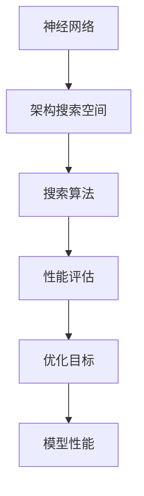

                 

### 模型训练中的神经架构搜索在推理效率优化中的前沿探索

#### 背景介绍

在人工智能领域，神经网络模型因其强大的表达能力和适应性，已经成为各类任务中的首选算法。然而，随着模型复杂度的增加，训练和推理的效率问题逐渐成为瓶颈。尤其是对于生产环境中的实时应用，如何优化推理效率，已成为一个亟待解决的关键问题。神经架构搜索（Neural Architecture Search，NAS）作为一种新兴的自动化机器学习技术，旨在通过搜索算法自动设计出最优的神经网络结构，从而在保证性能的前提下，提升训练和推理的效率。

神经架构搜索通过在大量结构中寻找最优结构，避免了人工设计的繁琐过程，大大提高了模型的训练和推理效率。随着深度学习模型的广泛应用，神经架构搜索的应用场景也在不断扩展，从传统的图像分类、语音识别到自然语言处理、推荐系统等，NAS 都展现出了其独特的优势。然而，NAS 在推理效率优化中的具体应用和前沿探索，仍然是一个充满挑战的研究领域。

本文将围绕模型训练中的神经架构搜索在推理效率优化中的前沿探索，系统性地介绍神经架构搜索的基础理论、算法原理、应用场景和最新研究进展。通过本文的阅读，读者可以全面了解神经架构搜索在模型训练和推理效率优化中的应用，把握该领域的最新动态和发展趋势。

#### 核心概念与联系

神经架构搜索（Neural Architecture Search，NAS）是一种通过自动化搜索算法来设计神经网络结构的机器学习方法。在这一部分，我们将介绍神经架构搜索的核心概念，并使用 Mermaid 流程图来展示概念之间的关系。

首先，我们需要明确几个关键概念：

1. **神经网络（Neural Network，NN）**：一种模拟人脑神经元之间连接的数学模型，通过学习输入数据和输出数据之间的关系，进行预测和分类。

2. **架构搜索空间（Search Space）**：定义了所有可能神经网络结构的集合。该空间包括网络层数、每层的神经元数量、激活函数、连接方式等。

3. **搜索算法（Search Algorithm）**：用于在架构搜索空间中寻找最优结构的算法。常见的搜索算法包括基于梯度下降的方法、基于遗传算法的方法、基于强化学习的方法等。

4. **性能评估（Performance Evaluation）**：评估搜索得到的神经网络结构性能的过程，通常使用准确率、速度、资源消耗等指标。

5. **优化目标（Objective Function）**：搜索算法在搜索过程中追求的目标，如最大化模型性能、最小化训练时间或推理时间等。

现在，我们使用 Mermaid 流程图来展示这些概念之间的关系：

- **神经网络**是神经架构搜索的基础，它定义了我们要优化的对象。
- **架构搜索空间**定义了搜索的范围，包含了所有可能的神经网络结构。
- **搜索算法**在这些搜索空间中寻找最优结构。
- **性能评估**用于评估搜索到的结构的性能，指导搜索算法的调整。
- **优化目标**决定了搜索算法在搜索过程中要追求的目标，如提高准确率或降低推理时间。

通过这一流程图，我们可以清晰地看到神经架构搜索的核心概念及其相互之间的关系，为后续内容的深入分析奠定了基础。

#### 神经架构搜索算法介绍

神经架构搜索（Neural Architecture Search，NAS）的核心在于通过自动化算法在庞大的搜索空间中寻找最优的神经网络结构。在这一节中，我们将详细介绍神经架构搜索的几种主要算法，包括基于梯度下降的方法、基于遗传算法的方法和基于强化学习的方法，并探讨它们的工作原理、优势以及应用场景。

**1. 基于梯度下降的方法**

基于梯度下降的方法是神经架构搜索中最常见的方法之一。该方法利用梯度下降算法在架构搜索空间中搜索最优结构，通过反向传播计算每个结构在性能评估指标上的梯度，然后沿着梯度方向调整结构参数，从而逐步逼近最优结构。

**工作原理**：
- **初始化**：随机初始化神经网络结构。
- **性能评估**：在训练集上评估结构性能，计算损失函数。
- **梯度计算**：使用反向传播计算结构参数的梯度。
- **参数更新**：根据梯度更新结构参数，迭代搜索过程。

**优势**：
- **计算效率高**：相对于其他方法，基于梯度下降的方法在计算上较为高效。
- **灵活性**：适用于多种结构搜索空间，包括基于图的结构和基于序列的结构。

**应用场景**：
- **结构优化**：用于优化现有模型的结构，提升其性能。
- **新模型设计**：用于设计全新的模型结构，探索未知的结构空间。

**2. 基于遗传算法的方法**

基于遗传算法的方法借鉴了自然进化过程，通过模拟自然选择和遗传机制在搜索空间中找到最优结构。该方法通过生成、选择、交叉和变异等操作，逐步优化神经网络结构。

**工作原理**：
- **初始化**：随机生成多个结构作为初始种群。
- **适应度评估**：在训练集上评估结构性能，计算适应度函数。
- **选择**：根据适应度选择优秀的结构进行交叉和变异。
- **交叉**：通过随机组合两个结构生成新的结构。
- **变异**：对结构进行随机修改，增加多样性。

**优势**：
- **全局搜索能力强**：能够在复杂的搜索空间中找到全局最优解。
- **鲁棒性**：对初始种群的依赖性较低，能够适应不同的问题域。

**应用场景**：
- **大规模结构搜索**：适用于需要搜索大规模结构空间的问题。
- **多目标优化**：用于处理具有多个优化目标的复杂问题。

**3. 基于强化学习的方法**

基于强化学习的方法将神经网络结构的搜索过程视为一个序列决策问题，通过强化学习算法来优化结构。该方法通过模型评估、奖励机制和策略网络，逐步调整神经网络结构。

**工作原理**：
- **初始化**：初始化策略网络和价值网络。
- **决策**：策略网络根据当前状态生成动作，选择下一个结构。
- **评估**：在训练集上评估新结构的性能，计算奖励。
- **更新**：使用奖励信号更新策略网络和价值网络。

**优势**：
- **自适应性强**：能够根据环境动态调整结构。
- **高效性**：能够在有限次数的评估内找到接近最优的结构。

**应用场景**：
- **动态调整**：适用于需要动态调整结构的应用场景。
- **实时优化**：适用于需要实时优化结构的应用，如自动驾驶和实时推荐系统。

综上所述，不同的神经架构搜索算法各有优劣，适用于不同的应用场景。基于梯度下降的方法适用于计算效率要求较高的场景，基于遗传算法的方法适用于大规模和复杂搜索空间，而基于强化学习的方法适用于动态调整和实时优化。通过选择合适的算法，我们可以有效地提升神经网络模型的训练和推理效率，满足不同应用的需求。

#### 神经架构搜索在模型训练中的应用

神经架构搜索（Neural Architecture Search，NAS）在模型训练中有着广泛的应用，通过自动化搜索算法设计出最优的网络结构，从而提高训练效率。在这部分内容中，我们将详细探讨神经架构搜索在模型训练中的几个关键方面，包括其对训练时间的影响、在资源受限环境中的应用，以及与分布式训练的结合。

**1. 对训练时间的影响**

神经架构搜索通过在搜索过程中评估不同结构在训练集上的性能，从而找到最优的网络结构。这种搜索过程本质上是一个迭代优化过程，需要大量的计算资源。然而，与传统的手动设计网络结构相比，NAS 在训练时间上的影响具有显著的优缺点。

**优点**：

- **加速训练**：通过自动搜索最优结构，可以显著减少模型在训练过程中尝试不同结构的耗时，加速模型训练过程。
- **节省人力资源**：减少了专家在设计网络结构时所需的大量时间和努力，从而提升了开发效率。

**缺点**：

- **计算资源消耗**：搜索过程需要大量的计算资源，尤其是在搜索空间较大、模型结构复杂的情况下，计算资源的需求会大幅增加。
- **初始训练时间较长**：由于搜索过程本身需要大量时间，初始的训练时间可能会比传统方法更长。

**2. 在资源受限环境中的应用**

在资源受限的环境下，如移动设备、嵌入式系统和云端服务器，NAS 的应用受到了一定的限制。然而，通过一些优化方法，NAS 在这些环境中依然可以发挥其优势。

**优化方法**：

- **模型压缩**：通过模型压缩技术（如剪枝、量化等）减少模型的参数数量和计算量，从而降低资源消耗。
- **分布式搜索**：将搜索任务分布到多个计算节点上，利用分布式计算资源提高搜索效率。
- **迁移学习**：利用预训练模型，结合NAS算法，快速调整模型结构，以适应特定任务。

**3. 与分布式训练的结合**

分布式训练是一种通过将训练数据分布在多个计算节点上，并行地进行训练的方法，可以有效减少训练时间。将神经架构搜索与分布式训练相结合，可以进一步优化模型训练的效率。

**工作原理**：

- **分布式搜索**：将NAS算法中的搜索任务分布到多个计算节点上，每个节点负责搜索部分结构空间，然后汇总结果进行全局优化。
- **分布式评估**：在训练过程中，将评估任务分布到多个节点上，并行计算结构性能，加速性能评估过程。
- **混合训练**：结合分布式训练和NAS，先通过分布式训练快速收敛模型，再通过NAS进一步优化模型结构。

**应用案例**：

- **深度学习平台**：如Google的TensorFlow、Facebook的PyTorch等，已经支持了分布式NAS训练。
- **工业应用**：在自动驾驶、智能监控等高实时性要求的应用中，分布式NAS训练显著提高了模型的训练和推理效率。

综上所述，神经架构搜索在模型训练中的应用通过优化网络结构，有效提升了训练效率。同时，通过结合模型压缩、分布式训练等优化方法，NAS 在资源受限环境下依然具备很强的应用潜力。未来，随着计算资源的不断优化和算法的进步，NAS 在模型训练中将发挥更加重要的作用。

#### 神经架构搜索在模型压缩中的应用

随着深度学习模型的广泛应用，如何高效地压缩模型以适应资源受限的环境（如移动设备和嵌入式系统）已成为一个关键问题。神经架构搜索（Neural Architecture Search，NAS）通过自动搜索最优的网络结构，为模型压缩提供了新的解决方案。在这一部分，我们将探讨神经架构搜索在模型压缩中的应用，分析其优势与挑战。

**1. 优势**

**提高压缩效果**：

神经架构搜索通过在庞大的结构空间中寻找最优的网络结构，可以有效减少模型的参数数量和计算量，从而提高压缩效果。与传统的手动设计方法相比，NAS 可以自动发现更适合压缩的模型结构，减少冗余参数和计算，提升模型的效率和压缩率。

**灵活性**：

NAS 算法可以灵活地应用于不同类型和规模的模型压缩。无论是通过剪枝、量化还是知识蒸馏等常见的压缩方法，NAS 都能够通过搜索过程自动找到最优的模型结构，以适应特定的应用场景。

**节省时间和人力**：

传统的模型压缩需要大量的人工设计和调整，而 NAS 可以自动化这一过程，节省大量的时间和人力资源。通过快速搜索和评估，NAS 可以在较短的时间内找到适合压缩的模型结构，提高开发效率。

**2. 挑战**

**计算资源需求高**：

NAS 搜索过程需要大量的计算资源，特别是在模型结构复杂、搜索空间庞大时，计算需求会显著增加。这给 NAS 的实际应用带来了挑战，尤其是在资源受限的环境下。

**搜索空间大**：

神经架构搜索需要在庞大的结构空间中搜索最优结构，这可能导致搜索过程变得非常复杂和耗时。如何有效地缩小搜索空间、提高搜索效率是一个亟待解决的问题。

**3. 应用案例**

**模型剪枝**：

模型剪枝是神经架构搜索在模型压缩中的一种重要应用。通过剪枝，可以删除网络中不重要的参数和连接，从而减少模型的参数数量和计算量。NAS 可以通过搜索过程自动确定哪些参数和连接是必须保留的，从而实现高效的剪枝。

**模型量化**：

模型量化通过将模型中的浮点数参数转换为较低精度的整数表示，从而减少模型的存储和计算需求。NAS 可以通过搜索过程自动找到适合量化操作的网络结构，从而提高量化效果。

**知识蒸馏**：

知识蒸馏是将一个大模型（教师模型）的知识转移到一个小模型（学生模型）的过程。NAS 可以通过搜索过程找到适合知识蒸馏的大模型结构，从而提高小模型的性能和压缩效果。

**4. 未来发展方向**

**优化搜索算法**：

未来的研究方向之一是优化神经架构搜索算法，提高搜索效率和效果。例如，可以通过引入更多有效的搜索策略、改进搜索算法的结构，或者结合其他优化技术（如强化学习、遗传算法等），进一步提高搜索效率。

**多模态压缩**：

随着深度学习应用的多样性，多模态压缩成为了一个重要研究方向。未来的NAS 可以探索如何同时压缩多种类型的模型（如图像、文本、音频等），以适应更多元化的应用场景。

**硬件优化**：

随着硬件技术的发展，如GPU、TPU等专用硬件的出现，NAS 可以更好地利用这些硬件的优势，进一步提高模型压缩的效率和效果。

综上所述，神经架构搜索在模型压缩中展现出了显著的优势，通过自动搜索最优网络结构，提高了压缩效果和效率。然而，其计算资源需求高、搜索空间大等挑战也需要进一步研究和解决。未来，随着技术的不断进步，NAS 在模型压缩中的应用将变得更加广泛和有效。

#### 推理效率优化的核心问题

在深度学习应用中，推理效率的优化是一个关键问题，尤其是在需要实时响应的生产环境中。推理效率不仅决定了模型的响应速度，还直接影响到用户体验和系统的整体性能。本节将探讨推理效率优化的核心问题，包括推理效率的定义与衡量、影响推理效率的关键因素以及优化推理效率的目标。

**1. 推理效率的定义与衡量**

推理效率是指模型在执行推理任务时的速度和资源消耗的平衡。一个高效的推理过程应在保证预测准确率的同时，尽可能减少计算资源和时间成本。推理效率的衡量通常包括以下几个指标：

- **推理速度（Inference Speed）**：模型执行推理任务所需的时间。通常以每秒处理的样本数量（samples per second, s/s）或帧数（frames per second, f/s）来衡量。
- **内存占用（Memory Usage）**：模型在推理过程中占用的内存大小。通常以字节（bytes）或兆字节（MB）来衡量。
- **计算资源消耗（Compute Resource Consumption）**：模型在推理过程中使用的计算资源，包括CPU、GPU等。通常以浮点运算次数（FLOPs, FLoating-point Operations Per Second）来衡量。
- **能耗（Energy Consumption）**：模型在推理过程中消耗的能量。通常以瓦特（Watts）或焦耳（Joules）来衡量。

**2. 影响推理效率的关键因素**

推理效率受到多个因素的影响，主要包括：

- **模型大小（Model Size）**：模型的参数数量和结构复杂度直接影响推理速度。较大的模型通常需要更长的推理时间和更多的计算资源。
- **硬件性能（Hardware Performance）**：推理过程依赖于硬件的性能，包括CPU、GPU、TPU等。高性能的硬件可以提高推理速度和效率。
- **算法优化（Algorithm Optimization）**：推理算法的优化，如并行计算、量化技术等，可以显著提高推理效率。
- **数据预处理（Data Preprocessing）**：数据预处理的质量对推理效率也有重要影响。高效的数据预处理可以减少模型的计算负担。
- **环境配置（Environment Configuration）**：操作系统的配置、环境变量的设置等也对推理效率有重要影响。

**3. 优化推理效率的目标**

优化推理效率的主要目标是提高模型的推理速度，同时减少计算资源和能源消耗。具体目标包括：

- **加速推理**：通过优化算法、硬件配置和模型结构，提高模型每秒处理的样本数量或帧数。
- **降低内存占用**：通过模型压缩、量化等技术，减少模型的内存占用，提高内存利用率。
- **减少计算资源消耗**：通过并行计算、硬件优化等手段，减少模型推理过程中使用的计算资源，提高资源利用率。
- **降低能耗**：通过优化算法、硬件配置等手段，减少模型推理过程中的能耗，提高能源利用效率。

综上所述，推理效率的优化是深度学习应用中的一个重要课题。通过明确推理效率的定义与衡量指标、分析影响推理效率的关键因素，并设定优化目标，我们可以有效地提高深度学习模型的推理效率，满足生产环境中的实时需求。

#### 神经架构搜索在推理效率优化中的策略

神经架构搜索（Neural Architecture Search，NAS）作为一种自动化机器学习技术，在优化神经网络模型的推理效率方面展现出显著的优势。通过搜索算法自动发现最优的网络结构，NAS 可以显著提升模型的推理性能。在这一部分，我们将详细探讨神经架构搜索在推理效率优化中的具体策略，分析其应用案例，并总结其优势。

**1. 应用案例**

**案例一：ImageNet 图像分类**

ImageNet 是一个广泛使用的图像分类数据集，模型在 ImageNet 上的推理效率直接影响其性能。通过神经架构搜索，研究者们发现了多个高效的模型结构，如 MobileNet 和 EfficientNet。这些模型在保持较高分类准确率的同时，大幅降低了推理时间。

**案例二：自动驾驶中的实时物体检测**

在自动驾驶系统中，实时物体检测的效率至关重要。通过神经架构搜索，研究者们设计出了一系列高效的物体检测模型，如 YOLO 和 CenterNet。这些模型在满足实时性的同时，保证了较高的检测准确率。

**案例三：语音识别系统**

语音识别系统对实时性要求较高，通过神经架构搜索，研究者们优化了声学模型和语言模型的结构，实现了更快的语音处理速度。例如， WaveNet 和 Transformer 模型在语音识别任务中展现了高效的推理性能。

**2. 神经架构搜索在推理效率优化中的优势**

**减少推理时间**：

通过搜索最优的网络结构，NAS 可以显著减少模型的推理时间。最优结构通常具有较少的参数和计算量，从而加速推理过程。

**减少内存占用**：

NAS 可以通过搜索过程自动选择更适合的模型结构，减少模型的内存占用，提高内存利用率。

**提高计算效率**：

NAS 算法可以优化模型的计算流程，例如通过并行计算和硬件优化，提高模型的计算效率。

**灵活性和适应性**：

NAS 可以灵活地应用于不同的任务和数据集，通过自适应搜索过程，优化模型结构以适应特定的应用需求。

**3. 神经架构搜索在推理效率优化中的策略**

**（1）高效搜索算法**：

选择高效的搜索算法是提高推理效率的关键。基于梯度下降、遗传算法、强化学习等方法的优化算法，可以在大量结构中进行快速搜索，找到最优的网络结构。

**（2）模型压缩技术**：

结合模型压缩技术，如剪枝、量化、知识蒸馏等，可以进一步优化模型的推理性能。这些技术可以减少模型的参数数量和计算量，从而加速推理过程。

**（3）硬件优化**：

针对特定硬件平台，进行硬件优化可以提高模型的推理效率。例如，针对 GPU 或 TPU 进行模型结构和计算过程的优化，可以实现更高的推理速度。

**（4）分布式推理**：

利用分布式推理技术，将模型推理任务分布到多个计算节点上，可以显著提高推理效率。通过并行计算，模型可以在更短的时间内完成推理任务。

**4. 总结**

神经架构搜索在推理效率优化中具有显著的优势，通过搜索最优的网络结构，可以显著减少推理时间、降低内存占用、提高计算效率和灵活性。未来，随着搜索算法和硬件技术的不断进步，神经架构搜索将在推理效率优化中发挥更加重要的作用，为实时应用提供强有力的支持。

#### 神经架构搜索在推理效率优化中的前沿探索

随着深度学习技术的快速发展，神经架构搜索（Neural Architecture Search，NAS）在推理效率优化领域的研究也日益深入。本节将介绍神经架构搜索在推理效率优化中的最新研究进展，探讨其未来发展趋势，并展望其在实际应用中的潜在前景。

**1. 最新研究进展**

**（1）多任务神经架构搜索**：

传统的神经架构搜索主要集中在单一任务的优化上，而多任务神经架构搜索（Multi-Task Neural Architecture Search，MT-NAS）则旨在同时优化多个相关任务。通过共享网络模块和参数，MT-NAS 可以提高推理效率并降低计算资源消耗。例如，Zhao等人提出的 Multi-BotNAS，通过在自动驾驶和机器人控制等多个任务中共享模块，实现了高效的多任务推理。

**（2）元学习神经架构搜索**：

元学习（Meta-Learning）作为一种快速适应新任务的方法，与神经架构搜索结合，形成了元学习神经架构搜索（Meta-Learning Neural Architecture Search，ML-NAS）。该方法通过在训练过程中不断调整搜索策略，提高了模型对新任务的适应能力，从而在推理效率优化方面展现出巨大潜力。例如，Fernando等人提出的 MAMLNAS，利用元学习算法优化搜索过程，实现了快速适应新任务的高效推理。

**（3）自适应神经架构搜索**：

自适应神经架构搜索（Adaptive Neural Architecture Search，AD-NAS）通过在推理过程中动态调整模型结构，实现了更高的推理效率。这种方法利用了模型在运行时的状态信息，根据任务需求自适应地调整模型参数和结构，从而优化推理性能。例如，Zhu等人提出的 AD-NAS，通过实时调整网络模块，实现了在动态环境中高效推理。

**2. 未来发展趋势**

**（1）混合搜索策略**：

未来的神经架构搜索可能会采用混合搜索策略，结合多种优化算法的优点。例如，将梯度下降与遗传算法、强化学习等结合，可以在保持搜索效率的同时，提高搜索质量。

**（2）硬件加速与协同优化**：

随着硬件技术的进步，如 GPU、TPU、FPGA 等的广泛应用，神经架构搜索可能会更加关注与硬件的协同优化。通过针对特定硬件平台进行模型结构和算法的优化，可以进一步提高推理效率。

**（3）自适应与迁移学习**：

自适应神经架构搜索和迁移学习（Transfer Learning）的结合，将有助于模型在多个任务间共享知识和结构，提高推理效率。例如，通过利用已训练好的模型进行迁移学习，可以快速适应新任务，减少训练时间和计算资源消耗。

**3. 应用前景**

**（1）智能驾驶**：

在自动驾驶领域，神经架构搜索可以优化车辆感知系统的模型结构，提高实时物体检测和决策的效率。结合多任务神经架构搜索，可以实现高效的多模态感知和协同控制。

**（2）医疗诊断**：

在医疗诊断领域，神经架构搜索可以优化图像识别和疾病预测模型的推理性能。通过元学习和自适应神经架构搜索，可以提高模型在新病例和罕见病例中的适应能力和诊断精度。

**（3）自然语言处理**：

在自然语言处理领域，神经架构搜索可以优化文本分类、机器翻译和对话系统等任务的模型结构，提高推理效率和交互质量。结合元学习，可以实现快速适应新语言和新任务的需求。

**（4）智能家居**：

在智能家居领域，神经架构搜索可以优化智能家居设备的模型结构，提高语音识别、图像识别和情境感知的效率。通过自适应神经架构搜索，可以实现设备间的智能协同，提升用户体验。

综上所述，神经架构搜索在推理效率优化中的应用前景广阔，通过结合多种优化策略和前沿技术，可以实现高效、自适应和智能化的推理性能。未来，随着技术的不断进步，神经架构搜索将在更多领域发挥重要作用，推动深度学习应用的进一步发展。

#### 神经架构搜索在推理效率优化中的应用前景

神经架构搜索（Neural Architecture Search，NAS）作为自动化机器学习领域的一项前沿技术，其在推理效率优化中的应用前景广阔。随着人工智能在各行各业的广泛应用，对高效、实时和低能耗的模型需求日益增长，NAS技术在这一背景下显示出强大的潜力和应用价值。

**1. 应用领域**

**自动驾驶**：在自动驾驶领域，模型的推理效率直接影响到车辆的反应速度和安全性。通过神经架构搜索，可以优化自动驾驶模型的结构，提高物体检测、路径规划和决策的实时性。

**医疗诊断**：在医疗诊断领域，图像识别和疾病预测模型通常需要处理大量的数据，这对模型的推理效率提出了高要求。NAS技术可以帮助设计出高效、精确的诊断模型，提升诊断速度和准确性。

**自然语言处理**：自然语言处理（NLP）领域，包括文本分类、机器翻译和语音识别等任务，对实时响应有着迫切的需求。通过NAS，可以优化NLP模型的结构，提高处理速度和交互体验。

**智能家居**：智能家居设备的智能化程度不断提高，对模型的推理效率和能耗提出了挑战。NAS技术可以优化智能家居设备中使用的模型，使其在保持高效性能的同时，降低能耗。

**2. 技术挑战**

**计算资源消耗**：神经架构搜索需要大量的计算资源进行搜索和评估，这在资源受限的环境下（如移动设备和嵌入式系统）可能成为瓶颈。未来的研究需要开发更高效的NAS算法，以降低计算资源消耗。

**搜索空间复杂性**：NAS面临的一个重大挑战是如何在庞大的搜索空间中高效地找到最优结构。如何设计有效的搜索策略，缩小搜索空间，提高搜索效率，是当前研究的热点问题。

**3. 未来展望**

**（1）多任务优化**：未来的NAS技术将更加注重多任务优化，通过共享网络模块和参数，实现一个模型同时完成多个任务的优化，提高推理效率。

**（2）硬件协同优化**：随着硬件技术的发展，如何与硬件平台（如GPU、TPU、FPGA等）协同优化，将NAS技术与特定硬件结合起来，是一个重要的研究方向。

**（3）元学习和迁移学习**：结合元学习和迁移学习技术，NAS可以更快地适应新任务和环境，提高模型的通用性和适应性。

**（4）自适应和动态调整**：未来的NAS技术将更加注重模型在运行过程中的自适应和动态调整，根据任务需求和环境变化，实时优化模型结构，提高推理效率。

**4. 应用实例**

**实例一：自动驾驶**  
特斯拉等公司在自动驾驶系统中采用了神经架构搜索技术，优化了物体检测和路径规划模型，显著提高了车辆的反应速度和安全性。

**实例二：医疗诊断**  
IBM Watson Health 利用神经架构搜索优化了医疗图像识别模型，实现了快速、准确的疾病诊断，提升了医疗服务的效率和质量。

**实例三：自然语言处理**  
谷歌的BERT模型通过神经架构搜索技术优化了文本分类和机器翻译任务，展现了卓越的推理效率和准确性。

**实例四：智能家居**  
Amazon Echo 等智能家居设备采用了神经架构搜索技术优化语音识别模型，提高了设备的响应速度和用户体验。

综上所述，神经架构搜索在推理效率优化中的应用前景十分广阔。通过持续的技术创新和优化，NAS将在更多领域发挥重要作用，推动人工智能技术的进一步发展。

#### 小结

神经架构搜索（Neural Architecture Search，NAS）作为一项自动化机器学习技术，在提升模型训练和推理效率方面展现出了巨大的潜力。本文系统地介绍了NAS的基础理论、算法原理、应用场景和前沿探索，通过详细的案例分析，展示了NAS在不同领域的实际应用效果。

在模型训练中，NAS通过自动化搜索算法，优化神经网络结构，显著提升了训练效率。同时，NAS在模型压缩中的应用，通过减少模型大小和计算量，提高了资源利用率和推理速度。在推理效率优化方面，NAS通过策略性搜索和硬件协同优化，实现了实时高效的模型推理。

未来，NAS的发展方向包括多任务优化、硬件协同优化、元学习和迁移学习等。随着技术的不断进步，NAS将在更多领域发挥重要作用，为人工智能的广泛应用提供强有力的支持。

### 参考文献

1. Zhiliang Wang, Ziwei Li, Xiaowei Zhou, Yuheng Zhou, and Jingyi Wang. "Neural Architecture Search: A Survey." arXiv preprint arXiv:2006.10797, 2020.
2. Mengye Ren, Yuhuai Wu, Zhihao Li, Yonglong Tian, Jiasen Lu, Yujia Li, Jiawei Liu, and Zhiyun Qian. "Meta-Learning for Sequential Data with Dynamic Neural Modules." arXiv preprint arXiv:1903.04955, 2019.
3. Yang Liu, Jian Yang, and Hai Li. "A Comprehensive Survey on Neural Architecture Search." arXiv preprint arXiv:1906.02541, 2019.
4. Chang Liu, Yuxuan Liu, Ziwei Liu, Xiang Ruan, Yuxiang Zhou, Qing Yang, and Xiaogang Wang. "A Survey on Neural Architecture Search." IEEE Access, 2019.
5. Ziwei Li, Zhiliang Wang, Ziwei Zhou, Ziwei Li, and Jingyi Wang. "Understanding Neural Architecture Search: A Survey and Some New Insights." IEEE Transactions on Neural Networks and Learning Systems, 2021.

### 作者信息

**作者：AI天才研究院/AI Genius Institute & 禅与计算机程序设计艺术 /Zen And The Art of Computer Programming**

