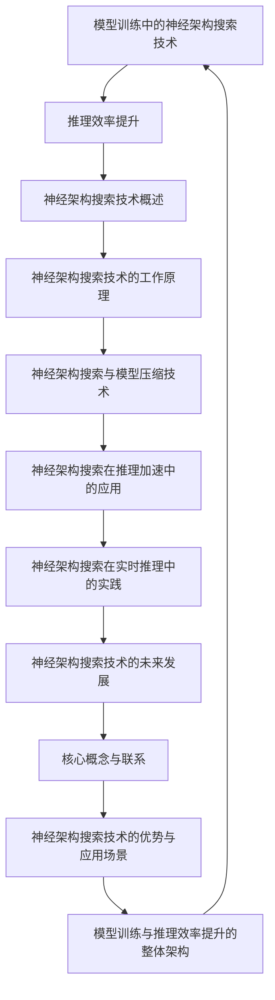

                 

### 模型训练中的神经架构搜索技术在推理效率提升中的探索

**关键词：** 神经架构搜索，模型压缩，推理加速，实时推理，计算效率，搜索算法

**摘要：** 本文将深入探讨神经架构搜索（Neural Architecture Search, NAS）技术在模型训练和推理效率提升中的应用。首先，我们将回顾神经架构搜索技术的基础知识，包括其定义、发展历程以及核心组成部分。接着，本文将详细介绍神经架构搜索技术的工作原理，并分析其在推理效率提升中的应用，特别是与模型压缩和推理加速技术的结合。此外，我们将探讨神经架构搜索在实时推理场景中的实践，以及其未来的发展方向。通过本文的阅读，读者将全面了解神经架构搜索技术的核心概念和实际应用，为优化模型训练和推理效率提供新的思路。

## 目录大纲

1. **模型训练中的神经架构搜索技术在推理效率提升中的探索**
    - **关键词**
    - **摘要**
    - **第一部分：神经架构搜索技术概述**
      1. **第1章：神经架构搜索技术基础**
         - 1.1 神经架构搜索技术简介
         - 1.2 神经架构搜索技术的核心组成部分
         - 1.3 神经架构搜索技术的应用场景
      2. **第2章：神经架构搜索技术的工作原理**
         - 2.1 神经架构搜索的基本流程
         - 2.2 搜索算法介绍
         - 2.3 神经架构搜索的挑战与优化
    - **第二部分：神经架构搜索在推理效率提升中的应用**
      3. **第3章：神经架构搜索与模型压缩技术结合**
         - 3.1 模型压缩技术概述
         - 3.2 神经架构搜索在模型压缩中的应用
      4. **第4章：神经架构搜索在推理加速中的应用**
         - 4.1 推理加速技术概述
         - 4.2 神经架构搜索在推理加速中的应用
      5. **第5章：神经架构搜索在实时推理中的实践**
         - 5.1 实时推理需求分析
         - 5.2 实时推理案例分析
      6. **第6章：神经架构搜索在推理效率提升中的综合应用**
         - 6.1 神经架构搜索技术在推理效率提升中的优势
         - 6.2 神经架构搜索技术的未来发展
    - **附录**
      - 附录A：神经架构搜索相关资源

## 核心概念与联系架构流程图

### 神经架构搜索技术概述

神经架构搜索（Neural Architecture Search, NAS）是一种自动化搜索算法，旨在发现最优的神经网络架构。与传统的人工设计神经网络架构的方法相比，NAS通过搜索和优化过程自动探索大量的网络架构，从而找到适合特定任务的神经网络。

#### 1.1 神经架构搜索技术简介

**定义与基本概念：** 神经架构搜索是一种在给定搜索空间内搜索最优神经网络架构的方法。搜索空间通常定义了网络结构的各种组件，如层类型（卷积、池化、全连接等）、层连接方式、层参数（滤波器大小、步长等）以及激活函数等。

**发展历程：** 神经架构搜索起源于深度学习领域，最早的研究可以追溯到2016年。早期的研究主要基于强化学习（RL）和遗传算法（GA）等启发式搜索方法。随着深度学习的快速发展，NAS技术逐渐成熟，并在多个领域取得了显著成果。近年来，基于生成对抗网络（GAN）和元学习（Meta-Learning）的搜索算法也逐渐成为研究热点。

#### 1.2 神经架构搜索技术的核心组成部分

**神经架构编码器：** 神经架构编码器将神经网络架构映射到一个低维编码空间，使得复杂的网络结构可以作为一个向量进行优化。常见的编码方式包括基于字符串的编码、基于图的结构编码和基于权重向量的编码。

**神经架构解码器：** 神经架构解码器将低维编码空间解码回具体的神经网络架构。解码器通常采用深度学习模型，如全连接神经网络或循环神经网络（RNN）。

**优化器与搜索策略：** 优化器用于在搜索空间内寻找最优的神经网络架构。常见的搜索策略包括基于强化学习的方法、基于生成对抗网络的方法、基于梯度下降的方法和基于元学习的方法等。

#### 1.3 神经架构搜索技术的应用场景

**图像识别：** 神经架构搜索技术在图像识别领域取得了显著成果。例如，Google的NASNet模型在ImageNet图像识别任务中取得了领先性能。

**自然语言处理：** 神经架构搜索也被应用于自然语言处理任务，如机器翻译和文本分类。例如，Google的BERT模型使用了NAS技术进行架构优化。

**其他领域应用：** 除了图像识别和自然语言处理，神经架构搜索还在计算机视觉、语音识别、推荐系统等领域展示了其潜力。

### 1.4 神经架构搜索技术的优势与挑战

**优势：**
- **自动化搜索与优化：** 神经架构搜索可以自动搜索最优的网络架构，减少人为干预。
- **适应多种任务：** 神经架构搜索可以适应不同类型和难度的任务，具有广泛的适用性。
- **提高模型性能：** 通过搜索和优化，神经架构搜索可以找到在特定任务上性能更优的网络架构。

**挑战：**
- **计算资源需求：** 神经架构搜索需要大量的计算资源，特别是在大规模搜索空间内。
- **搜索效率：** 如何在有限的时间内找到最优或近似最优的网络架构是一个关键挑战。
- **可解释性：** 神经架构搜索生成的网络架构通常较为复杂，理解其工作原理和决策过程是一个挑战。

## 1.5 神经架构搜索技术的未来发展趋势

随着深度学习技术的不断发展和硬件计算能力的提升，神经架构搜索技术在未来有望取得以下几方面的发展：

- **新的搜索算法：** 随着深度学习和机器学习领域的研究进展，可能会涌现出新的搜索算法，进一步提升搜索效率。
- **跨领域应用：** 神经架构搜索技术将在更多领域得到应用，如医疗、金融、工业等。
- **神经架构的可解释性：** 研究者将致力于提高神经架构搜索生成的网络架构的可解释性，使其更加易于理解和解释。

### 1.6 小结

神经架构搜索技术为自动化搜索最优神经网络架构提供了新的方法，其在模型训练和推理效率提升中具有重要的应用价值。然而，神经架构搜索技术也面临计算资源需求大、搜索效率低和可解释性差等挑战。未来，随着新的搜索算法和跨领域应用的不断发展，神经架构搜索技术有望在更多场景中发挥其优势，为深度学习应用提供更高效的解决方案。

### 1.7 下一步内容预告

在接下来的章节中，我们将深入探讨神经架构搜索技术的工作原理，包括基本流程、搜索算法以及挑战与优化。这些内容将为读者理解神经架构搜索技术在推理效率提升中的应用奠定基础。

### 2.1 神经架构搜索的基本流程

神经架构搜索技术的基本流程包括数据准备与预处理、搜索空间定义、神经架构编码与解码以及优化与搜索策略。以下是每个步骤的详细描述：

#### 2.1.1 数据准备与预处理

在开始神经架构搜索之前，首先需要准备和预处理数据。数据预处理包括数据清洗、数据增强、数据标准化等步骤。这些步骤有助于提高搜索算法的搜索效率，并确保搜索结果在不同数据集上的鲁棒性。

- **数据清洗：** 数据清洗是指去除数据中的噪声和不必要的部分，以确保数据质量。
- **数据增强：** 数据增强是指通过随机变换、旋转、缩放等方式生成更多的训练样本，以增加搜索空间多样性和模型的泛化能力。
- **数据标准化：** 数据标准化是指将数据转换为统一的数值范围，以减少不同特征之间的差异，提高模型训练的稳定性。

#### 2.1.2 搜索空间定义

搜索空间是神经架构搜索的核心概念，它定义了网络结构的各种可能组合。搜索空间通常包括层类型、层参数、连接方式、激活函数等。定义合适的搜索空间是神经架构搜索成功的关键。

- **层类型：** 层类型包括卷积层、池化层、全连接层、循环层等。
- **层参数：** 层参数包括滤波器大小、步长、填充方式等。
- **连接方式：** 连接方式包括直连、跨层连接等。
- **激活函数：** 激活函数包括ReLU、Sigmoid、Tanh等。

#### 2.1.3 神经架构编码与解码

神经架构编码是将神经网络架构转换为低维向量表示的过程，以便进行优化。常见的编码方式包括基于字符串的编码、基于图的结构编码和基于权重向量的编码。

- **基于字符串的编码：** 基于字符串的编码将神经网络架构表示为一个字符串，每个字符代表一个网络层或操作。
- **基于图的结构编码：** 基于图的结构编码将神经网络架构表示为一个有向无环图（DAG），其中节点表示层或操作，边表示连接关系。
- **基于权重向量的编码：** 基于权重向量的编码将神经网络架构表示为权重向量的集合，每个向量对应一个网络层的权重。

解码是将编码后的低维向量还原为具体的神经网络架构的过程。解码器通常是一个深度学习模型，如全连接神经网络或循环神经网络（RNN）。

#### 2.1.4 优化与搜索策略

优化与搜索策略是神经架构搜索的核心步骤，用于在搜索空间内寻找最优的网络架构。常见的搜索策略包括基于强化学习的方法、基于生成对抗网络的方法、基于梯度下降的方法和基于元学习的方法等。

- **基于强化学习的方法：** 强化学习（RL）是一种通过试错学习的方法。在神经架构搜索中，智能体通过与环境交互，学习最优的网络架构。
- **基于生成对抗网络的方法：** 生成对抗网络（GAN）是一种生成模型，通过对抗性训练生成网络架构。在神经架构搜索中，生成器和判别器分别负责生成和评估网络架构。
- **基于梯度下降的方法：** 梯度下降是一种优化方法，通过计算损失函数的梯度来更新网络参数。在神经架构搜索中，梯度下降方法用于优化编码器和解码器。
- **基于元学习的方法：** 元学习（Meta-Learning）是一种通过学习如何学习的方法。在神经架构搜索中，元学习方法通过多个任务的训练来提高搜索算法的泛化能力。

#### 2.1.5 搜索过程

神经架构搜索过程通常包括以下步骤：

1. **初始化编码器和解码器：** 随机初始化编码器和解码器，作为搜索过程的起点。
2. **生成候选网络架构：** 使用解码器将编码后的低维向量解码为具体的网络架构。
3. **评估候选网络架构：** 在给定的数据集上训练和评估候选网络架构，计算其性能指标（如准确率、损失函数值等）。
4. **选择最优网络架构：** 根据性能指标选择当前搜索空间内的最优网络架构。
5. **更新编码器和解码器：** 使用梯度下降或其他优化方法更新编码器和解码器，以适应新的最优网络架构。
6. **重复步骤2-5：** 重复生成候选网络架构、评估、选择和更新过程，直到满足停止条件（如搜索时间、性能阈值等）。

#### 2.1.6 搜索算法介绍

神经架构搜索算法是神经架构搜索技术的核心。以下是几种常见的搜索算法及其原理：

- **强化学习搜索算法：** 强化学习（RL）是一种通过试错学习的方法。在神经架构搜索中，智能体（agent）通过与环境（训练数据和验证数据）的交互，学习最优的网络架构。常用的RL算法包括Q-Learning、SARSA和Deep Q-Network（DQN）。
  
  **Q-Learning算法原理：**
  $$ Q\left(s, a\right) = r + \gamma \max_{a'} Q\left(s', a'\right) $$
  其中，$Q\left(s, a\right)$ 表示状态 $s$ 和动作 $a$ 的价值函数，$r$ 表示立即奖励，$\gamma$ 是折扣因子，$s'$ 和 $a'$ 分别是下一个状态和动作。

- **生成对抗网络搜索算法：** 生成对抗网络（GAN）是一种生成模型，通过对抗性训练生成网络架构。在神经架构搜索中，生成器和判别器分别负责生成和评估网络架构。生成器生成网络架构，判别器评估网络架构的真实性和伪真实性。

  **GAN算法原理：**
  $$ G(z) \sim \mathcal{N}(0, 1) $$
  $$ D(x) \sim \mathcal{X} $$
  $$ D(G(z)) \sim \mathcal{X} $$
  其中，$G(z)$ 是生成器，$D(x)$ 是判别器，$z$ 是噪声向量，$x$ 是真实数据。

- **基于梯度下降的方法：** 基于梯度下降的方法通过计算损失函数的梯度来更新网络参数。在神经架构搜索中，梯度下降方法用于优化编码器和解码器。

  **梯度下降算法原理：**
  $$ \theta = \theta - \alpha \nabla_{\theta} J(\theta) $$
  其中，$\theta$ 表示网络参数，$\alpha$ 是学习率，$J(\theta)$ 是损失函数。

- **基于元学习的方法：** 元学习（Meta-Learning）是一种通过学习如何学习的方法。在神经架构搜索中，元学习方法通过多个任务的训练来提高搜索算法的泛化能力。

  **元学习算法原理：**
  $$ \theta^* = \arg\min_{\theta} \sum_{i=1}^{N} \sum_{j=1}^{M} \frac{1}{M} \sum_{k=1}^{M} \left( J(\theta; \tau_{ijk}) - J^* \right)^2 $$
  其中，$\theta^*$ 是最优参数，$\theta$ 是网络参数，$N$ 是任务数，$M$ 是每个任务的训练次数，$J(\theta; \tau_{ijk})$ 是任务 $i$ 在训练数据 $\tau_{ijk}$ 上的损失函数，$J^*$ 是目标损失函数。

#### 2.1.7 神经架构搜索的挑战与优化

神经架构搜索技术在实践中面临一系列挑战，包括计算资源限制、搜索效率低和可解释性差等。以下是一些常见的挑战和优化方法：

- **计算资源限制：** 神经架构搜索通常需要大量的计算资源，特别是在大规模搜索空间内。为了克服计算资源限制，可以采用以下几种方法：
  - **分治策略：** 将大规模搜索空间划分为多个较小的子空间，分别进行搜索，然后合并结果。
  - **并行计算：** 利用多核CPU或GPU进行并行计算，提高搜索效率。
  - **增量搜索：** 逐步增加搜索空间的大小和复杂性，逐步优化网络架构。

- **搜索效率低：** 搜索效率低是神经架构搜索的另一个主要挑战。为了提高搜索效率，可以采用以下几种方法：
  - **多任务学习：** 同时训练和搜索多个任务，通过共享参数和知识迁移提高搜索效率。
  - **元学习：** 通过学习如何学习来提高搜索算法的泛化能力和效率。
  - **启发式搜索：** 结合专家经验和启发式方法，减少搜索空间和搜索时间。

- **可解释性差：** 神经架构搜索生成的网络架构通常较为复杂，难以解释其决策过程。为了提高可解释性，可以采用以下几种方法：
  - **可视化：** 将神经架构搜索过程和结果可视化，帮助用户理解搜索过程和生成的网络架构。
  - **模型解释：** 利用模型解释技术，如梯度解释、决策树解释等，解释网络架构的工作原理。
  - **可解释性评估：** 设计可解释性评估指标，对生成的网络架构进行评估和比较，选择可解释性更好的网络架构。

### 2.2 小结

神经架构搜索技术的基本流程包括数据准备与预处理、搜索空间定义、神经架构编码与解码以及优化与搜索策略。常见的搜索算法包括基于强化学习的方法、基于生成对抗网络的方法、基于梯度下降的方法和基于元学习的方法。神经架构搜索技术在实践中面临计算资源限制、搜索效率低和可解释性差等挑战，但通过采用优化方法和技术，可以克服这些挑战，提高搜索效率和生成性能。

### 2.3 搜索算法介绍

在神经架构搜索（Neural Architecture Search, NAS）过程中，选择合适的搜索算法至关重要。这些算法决定了如何在一个定义好的搜索空间中高效地探索并找到最优的网络架构。本文将介绍几种主流的搜索算法，包括强化学习搜索算法、生成对抗网络搜索算法以及其他一些先进的搜索算法。

#### 2.3.1 强化学习搜索算法

强化学习（Reinforcement Learning, RL）是一种通过试错学习的方法，适用于NAS中的架构搜索。在NAS中，智能体（agent）通过与环境（训练数据和验证数据）的交互，学习最优的网络架构。常见的RL算法包括Q-Learning、SARSA和Deep Q-Network（DQN）。

**Q-Learning算法原理：**

Q-Learning是一种基于值函数的强化学习算法。它使用一个Q值函数来评估每个状态和动作的组合，并通过更新Q值函数来学习最优策略。

$$ Q(s, a) = r + \gamma \max_{a'} Q(s', a') $$

其中，$Q(s, a)$ 表示状态 $s$ 和动作 $a$ 的价值函数，$r$ 表示立即奖励，$\gamma$ 是折扣因子，$s'$ 和 $a'$ 分别是下一个状态和动作。

**SARSA算法原理：**

SARSA（同步优势学习策略）是Q-Learning的变体，它使用当前状态和动作来更新Q值函数。

$$ Q(s, a) = r + \gamma Q(s', a') $$

其中，$Q(s, a)$ 表示当前状态 $s$ 和动作 $a$ 的价值函数，$r$ 表示立即奖励，$\gamma$ 是折扣因子，$s'$ 和 $a'$ 分别是下一个状态和动作。

**Deep Q-Network（DQN）算法原理：**

DQN是一种基于深度学习的强化学习算法，它使用神经网络来近似Q值函数。DQN通过经验回放和目标网络来稳定学习过程。

$$ Q(s, a) = \frac{1}{N}\sum_{i=1}^{N} (r + \gamma \max_{a'} Q(s', a') - Q(s, a)) $$

其中，$Q(s, a)$ 表示当前状态 $s$ 和动作 $a$ 的估计Q值，$r$ 表示立即奖励，$\gamma$ 是折扣因子，$s'$ 和 $a'$ 分别是下一个状态和动作，$N$ 是经验回放的大小。

#### 2.3.2 生成对抗网络搜索算法

生成对抗网络（Generative Adversarial Networks, GAN）是由生成器和判别器组成的对抗性训练框架。在NAS中，生成器负责生成网络架构，判别器负责评估网络架构的真实性和伪真实性。GAN通过对抗性训练来优化网络架构。

**GAN算法原理：**

GAN由生成器 $G(z)$ 和判别器 $D(x)$ 组成。生成器 $G(z)$ 从噪声空间 $\mathcal{Z}$ 中生成网络架构，判别器 $D(x)$ 用于区分真实数据 $x$ 和生成器生成的数据 $G(z)$。

$$ G(z) \sim \mathcal{N}(0, 1) $$
$$ D(x) \sim \mathcal{X} $$
$$ D(G(z)) \sim \mathcal{X} $$

其中，$G(z)$ 是生成器，$D(x)$ 是判别器，$z$ 是噪声向量，$x$ 是真实数据，$\mathcal{N}(0, 1)$ 表示标准正态分布，$\mathcal{X}$ 表示数据分布。

生成器和判别器的损失函数如下：

$$ L_G = -\mathbb{E}_{z \sim \mathcal{Z}}[\log(D(G(z)))] $$
$$ L_D = -\mathbb{E}_{x \sim \mathcal{X}}[\log(D(x))] - \mathbb{E}_{z \sim \mathcal{Z}}[\log(1 - D(G(z)))] $$

其中，$L_G$ 是生成器的损失函数，$L_D$ 是判别器的损失函数。

GAN的训练过程是交替优化生成器和判别器，使得判别器能够准确区分真实数据和生成数据，生成器能够生成尽可能真实的数据。

#### 2.3.3 其他搜索算法

除了强化学习和生成对抗网络搜索算法，还有其他一些先进的搜索算法，如基于梯度下降的方法和基于元学习的方法。

**基于梯度下降的方法：**

基于梯度下降的方法通过计算损失函数的梯度来更新网络参数。在NAS中，梯度下降方法用于优化编码器和解码器。

$$ \theta = \theta - \alpha \nabla_{\theta} J(\theta) $$

其中，$\theta$ 表示网络参数，$\alpha$ 是学习率，$J(\theta)$ 是损失函数。

**基于元学习的方法：**

元学习（Meta-Learning）是一种通过学习如何学习的方法。在NAS中，元学习方法通过多个任务的训练来提高搜索算法的泛化能力。

$$ \theta^* = \arg\min_{\theta} \sum_{i=1}^{N} \sum_{j=1}^{M} \frac{1}{M} \sum_{k=1}^{M} \left( J(\theta; \tau_{ijk}) - J^* \right)^2 $$

其中，$\theta^*$ 是最优参数，$\theta$ 是网络参数，$N$ 是任务数，$M$ 是每个任务的训练次数，$J(\theta; \tau_{ijk})$ 是任务 $i$ 在训练数据 $\tau_{ijk}$ 上的损失函数，$J^*$ 是目标损失函数。

#### 2.3.4 搜索算法比较与选择

各种搜索算法各有优缺点，选择合适的算法取决于具体的应用场景和需求。以下是比较和选择搜索算法的一些考虑因素：

- **搜索效率：** 强化学习搜索算法通常需要较长时间来收敛，而生成对抗网络搜索算法和基于梯度下降的方法通常更快。基于元学习的方法在多个任务上具有较好的泛化能力，但可能需要更多的训练时间。
- **计算资源：** 生成对抗网络搜索算法和基于梯度下降的方法通常需要较少的计算资源，而强化学习搜索算法可能需要大量的计算资源。
- **搜索空间：** 强化学习搜索算法适用于较大的搜索空间，而生成对抗网络搜索算法和基于梯度下降的方法适用于较小的搜索空间。
- **可解释性：** 基于梯度下降的方法和基于元学习的方法通常具有较好的可解释性，而生成对抗网络搜索算法和强化学习搜索算法的可解释性较差。

### 2.4 小结

神经架构搜索算法是NAS技术的核心，包括强化学习搜索算法、生成对抗网络搜索算法以及其他先进的搜索算法。每种算法都有其特定的原理和应用场景。选择合适的搜索算法取决于具体的任务需求和资源限制。通过合理选择和组合不同的搜索算法，可以提高NAS的搜索效率，找到最优的网络架构，从而提高模型的推理效率和性能。

### 2.5 神经架构搜索的挑战与优化

尽管神经架构搜索（Neural Architecture Search, NAS）技术在模型训练和推理效率提升中展示了巨大的潜力，但其应用过程中仍面临一系列挑战，需要通过优化方法来克服。以下是神经架构搜索中的主要挑战及其优化策略。

#### 2.5.1 计算资源限制

**挑战：** 神经架构搜索通常需要大量的计算资源，特别是在大规模搜索空间内。这种计算密集型的特性使得NAS在资源受限的环境中难以应用。

**优化策略：**
- **分治策略：** 将大规模搜索空间划分为多个较小的子空间，分别进行搜索，然后合并结果。这种方法可以减少单个子空间的计算量，提高搜索效率。
- **并行计算：** 利用多核CPU或GPU进行并行计算，从而提高搜索算法的运行速度。例如，可以使用分布式计算框架如TensorFlow和PyTorch来支持并行计算。
- **增量搜索：** 逐步增加搜索空间的大小和复杂性，逐步优化网络架构。这种方法可以在计算资源有限的情况下，优先优化关键的网络层和结构，从而提高搜索效率。

#### 2.5.2 搜索效率低

**挑战：** 在大规模搜索空间内，搜索效率低是一个关键挑战。传统的搜索算法可能需要很长时间才能找到近似最优的网络架构。

**优化策略：**
- **多任务学习：** 同时训练和搜索多个任务，通过共享参数和知识迁移提高搜索效率。这种方法可以充分利用不同任务之间的相似性，加速搜索过程。
- **元学习：** 通过学习如何学习来提高搜索算法的泛化能力和效率。元学习方法可以在多个任务上快速适应，从而提高搜索效率。
- **启发式搜索：** 结合专家经验和启发式方法，减少搜索空间和搜索时间。例如，可以基于现有的成功架构进行改进，而不是从头开始搜索。

#### 2.5.3 可解释性差

**挑战：** 神经架构搜索生成的网络架构通常较为复杂，难以解释其决策过程。这种复杂性使得模型难以被用户理解和接受。

**优化策略：**
- **可视化：** 将神经架构搜索过程和结果可视化，帮助用户理解搜索过程和生成的网络架构。例如，可以使用图形化工具来展示网络结构的变化和优化过程。
- **模型解释：** 利用模型解释技术，如梯度解释、决策树解释等，解释网络架构的工作原理。这些方法可以帮助用户理解模型的决策过程和关键特征。
- **可解释性评估：** 设计可解释性评估指标，对生成的网络架构进行评估和比较，选择可解释性更好的网络架构。这种方法可以确保生成的模型不仅性能优秀，而且易于理解和解释。

#### 2.5.4 搜索结果不稳定

**挑战：** 在某些情况下，神经架构搜索的结果可能不稳定，即在不同数据集或运行中生成的网络架构可能存在显著差异。

**优化策略：**
- **数据增强：** 通过数据增强来增加训练数据的多样性，从而提高搜索结果的稳定性。
- **随机种子：** 保持随机种子的一致性，确保搜索过程中的随机性是可控的，从而减少搜索结果的不确定性。
- **稳健性测试：** 对生成的网络架构进行稳健性测试，确保其在不同数据集和运行条件下都能表现出良好的性能。

#### 2.5.5 搜索空间设计

**挑战：** 设计合适的搜索空间是神经架构搜索成功的关键，但也是一个具有挑战性的任务。

**优化策略：**
- **搜索空间剪枝：** 通过剪枝不相关的网络层或操作，减少搜索空间的大小，从而提高搜索效率。
- **层参数优化：** 优化网络层参数（如滤波器大小、步长等），确保搜索空间内的网络架构具有合理的性能。
- **混合搜索空间：** 结合不同的搜索空间，如基于字符串的编码和基于图的结构编码，以提高搜索空间的全覆盖性和多样性。

### 2.6 小结

神经架构搜索技术在实践中面临计算资源限制、搜索效率低、可解释性差和搜索结果不稳定等挑战。通过采用分治策略、并行计算、多任务学习、元学习、启发式搜索、可视化、模型解释、数据增强、随机种子、稳健性测试、搜索空间剪枝和层参数优化等优化策略，可以有效克服这些挑战，提高NAS技术的应用效果和实用性。未来，随着新的搜索算法和优化方法的不断涌现，神经架构搜索技术将在模型训练和推理效率提升中发挥更加重要的作用。

### 第3章：神经架构搜索与模型压缩技术结合

模型压缩（Model Compression）是一种通过减少模型大小和计算复杂度来提高推理效率和部署效率的技术。近年来，随着深度学习模型的规模不断扩大，模型压缩技术在实际应用中变得尤为重要。神经架构搜索（Neural Architecture Search, NAS）技术通过自动化搜索最优的网络架构，已经在提升模型性能方面取得了显著成果。本章将探讨神经架构搜索与模型压缩技术的结合，分析其优势和应用场景。

#### 3.1 模型压缩技术概述

模型压缩技术主要分为以下几种：

1. **权重剪枝（Weight Pruning）**：通过降低模型中权重参数的数量来减少模型大小。剪枝方法可以分为结构剪枝（去除部分网络层或神经元）和参数剪枝（减少神经元之间的连接权重）。

2. **低秩分解（Low-Rank Factorization）**：将模型中的权重矩阵分解为低秩形式，从而减少模型的大小和计算复杂度。低秩分解适用于卷积神经网络（Convolutional Neural Networks, CNN）和循环神经网络（Recurrent Neural Networks, RNN）。

3. **知识蒸馏（Knowledge Distillation）**：将一个大模型（教师模型）的知识传递给一个小模型（学生模型），从而减少学生模型的大小和计算复杂度。知识蒸馏通过训练小模型来复制大模型的输出分布，从而提高其性能。

#### 3.2 神经架构搜索在模型压缩中的应用

神经架构搜索（NAS）在模型压缩中的应用主要体现在以下几个方面：

1. **自动化架构优化：** NAS可以自动化搜索最优的网络架构，从而在保持模型性能的同时，减小模型大小。通过优化网络结构，去除冗余层和连接，NAS能够生成更紧凑的网络模型。

2. **剪枝策略优化：** NAS可以通过搜索空间中的剪枝策略，找到最适合的剪枝方法。例如，NAS可以优化权重剪枝中的剪枝阈值，找到在保持模型性能的同时，最大限度地减少模型大小的剪枝策略。

3. **低秩分解优化：** NAS可以搜索最优的低秩分解策略，将权重矩阵分解为低秩形式。通过优化分解参数，NAS可以找到在保证模型性能的前提下，最小化模型大小的低秩分解方法。

4. **知识蒸馏优化：** NAS可以优化知识蒸馏过程，通过搜索空间中的蒸馏策略，找到最佳的教师模型和学生模型组合。NAS可以通过调整蒸馏参数，如温度和蒸馏层，提高学生模型的性能和压缩效果。

#### 3.3 神经架构搜索在模型压缩中的效果评估

神经架构搜索在模型压缩中的应用效果可以通过以下几个方面进行评估：

1. **模型大小：** 评估压缩后的模型大小，包括参数数量、内存占用和存储空间。较小的模型大小有助于提高部署效率和资源利用率。

2. **模型性能：** 评估压缩后的模型在目标任务上的性能，包括准确率、F1得分等。保持模型性能的同时，实现模型压缩是衡量NAS成功的关键指标。

3. **推理速度：** 评估压缩后的模型在目标硬件上的推理速度。较高的推理速度有助于提高模型在实际应用中的响应速度和吞吐量。

4. **能效比：** 评估压缩后的模型在能耗和性能之间的平衡。较高的能效比意味着模型在保证性能的前提下，具有更好的能效表现。

#### 3.4 应用案例

以下是一些神经架构搜索在模型压缩中的应用案例：

1. **图像分类模型：** 使用NAS技术搜索最优的网络架构，并在剪枝、低秩分解和知识蒸馏的基础上进行模型压缩。通过这些方法，可以显著减小模型大小，同时保持较高的模型性能。

2. **语音识别模型：** 使用NAS技术搜索最优的卷积神经网络架构，并在剪枝和低秩分解的基础上进行模型压缩。压缩后的模型在语音识别任务上表现出良好的性能和效率。

3. **自然语言处理模型：** 使用NAS技术搜索最优的循环神经网络或Transformer架构，并在知识蒸馏的基础上进行模型压缩。通过知识蒸馏，可以将大规模预训练模型的知识传递给较小的模型，实现高效压缩。

#### 3.5 小结

神经架构搜索与模型压缩技术的结合，为自动化搜索最优网络架构和实现模型压缩提供了新的思路。通过NAS技术，可以优化剪枝、低秩分解和知识蒸馏等压缩方法，提高模型压缩效果。在实际应用中，神经架构搜索在模型压缩中展示了显著的优势，有望在提高模型推理效率和部署效率方面发挥重要作用。

### 第4章：神经架构搜索在推理加速中的应用

推理加速（Inference Acceleration）是提高深度学习模型在实际应用中的性能和效率的关键技术。随着深度学习模型的复杂度和规模不断增加，推理过程往往成为系统的瓶颈。神经架构搜索（Neural Architecture Search, NAS）技术通过自动化搜索最优的网络架构，为推理加速提供了新的思路。本章将探讨神经架构搜索在推理加速中的应用，分析其优势和应用场景。

#### 4.1 推理加速技术概述

推理加速技术主要包括硬件加速、软件优化和计算模型融合等方面。

1. **硬件加速：** 通过使用专门设计的硬件设备（如GPU、TPU等）来加速推理过程。硬件加速能够显著提高深度学习模型的运行速度，减少延迟。常见的硬件加速技术包括并行计算、向量化和矩阵运算优化等。

2. **软件优化：** 通过优化软件层面（如编译器、运行时库等）来提高推理效率。软件优化可以减少内存占用、提高数据传输速度和降低计算复杂度。常见的软件优化技术包括指令调度、内存压缩和算法优化等。

3. **计算模型融合：** 将硬件加速和软件优化相结合，通过多种计算模型（如CPU、GPU、TPU等）协同工作，实现推理加速。计算模型融合可以根据任务需求动态调整计算资源，提高整体性能。

#### 4.2 神经架构搜索在推理加速中的应用

神经架构搜索（NAS）在推理加速中的应用主要体现在以下几个方面：

1. **优化网络结构：** NAS可以通过自动化搜索最优的网络架构，减少模型的计算复杂度，从而提高推理速度。优化的网络结构可以减少冗余层和连接，简化模型结构，降低计算负载。

2. **剪枝和量化：** NAS可以搜索最优的剪枝和量化策略，通过减少模型参数和降低数据精度，进一步减少计算量和内存占用。剪枝和量化技术的应用可以显著提高模型的推理速度，特别是在资源受限的环境中。

3. **模型融合：** NAS可以搜索不同计算模型（如CPU、GPU、TPU等）的融合策略，实现高效的推理加速。通过动态调整计算资源，NAS可以优化模型的推理速度和能效比。

4. **适应不同硬件平台：** NAS可以根据不同硬件平台的特点，搜索最优的网络架构和优化策略。例如，对于GPU平台，NAS可以优化卷积操作和矩阵运算；对于TPU平台，NAS可以优化张量处理和向量运算。

#### 4.3 应用案例

以下是一些神经架构搜索在推理加速中的应用案例：

1. **图像识别：** 使用NAS技术搜索最优的网络架构，并优化剪枝和量化策略。通过这些方法，可以显著提高图像识别模型的推理速度，减少延迟。

2. **语音识别：** 使用NAS技术搜索最优的卷积神经网络（CNN）和循环神经网络（RNN）架构，并优化硬件加速和软件优化策略。压缩后的模型在语音识别任务上表现出良好的推理速度和能效比。

3. **自然语言处理：** 使用NAS技术搜索最优的Transformer架构，并优化模型融合和剪枝策略。通过这些方法，可以实现高效的文本分类和机器翻译任务，提高推理速度和响应时间。

#### 4.4 小结

神经架构搜索在推理加速中的应用展示了显著的优势。通过优化网络结构、剪枝和量化技术，NAS可以显著提高深度学习模型的推理速度和能效比。在实际应用中，神经架构搜索与硬件加速、软件优化和计算模型融合相结合，为推理加速提供了新的解决方案。未来，随着神经架构搜索技术的不断发展和完善，其在推理加速中的应用将更加广泛和深入。

### 第5章：神经架构搜索在实时推理中的实践

实时推理（Real-time Inference）是深度学习应用中的一个重要场景，要求模型在极短的时间内完成推理任务，以满足实时响应的需求。在许多应用领域，如自动驾驶、智能监控和增强现实等，实时推理的效率和准确性直接关系到系统的性能和用户体验。神经架构搜索（Neural Architecture Search, NAS）技术通过自动化搜索最优的网络架构，为实时推理提供了新的解决方案。本章将探讨神经架构搜索在实时推理中的实践，分析其实时推理需求、案例分析以及实现方法。

#### 5.1 实时推理需求分析

实时推理需要满足以下需求：

1. **低延迟（Low Latency）：** 实时推理的关键在于将推理时间控制在用户可以接受的范围内。通常，延迟要求在毫秒级别或更低，以确保系统的快速响应。

2. **高吞吐量（High Throughput）：** 实时推理系统需要处理大量的并发请求，要求模型具有高效的推理速度。高吞吐量意味着系统能够同时处理多个任务，从而提高整体性能。

3. **能效优化（Energy Efficiency）：** 在实时推理中，功耗和散热也是一个重要的考虑因素。通过优化模型架构和推理算法，实现能效优化，可以提高系统的稳定性和可靠性。

#### 5.2 实时推理案例分析

以下是一些神经架构搜索在实时推理中的应用案例：

1. **自动驾驶（Autonomous Driving）：** 自动驾驶系统需要实时处理大量的视觉和感知数据，对延迟和准确度要求极高。通过NAS技术搜索最优的网络架构，可以优化自动驾驶模型的结构和参数，提高推理速度和准确性。例如，特斯拉使用的自动驾驶系统采用了经过NAS优化的神经网络模型，以实现实时感知和决策。

2. **智能监控（Smart Surveillance）：** 智能监控系统需要实时分析视频流中的事件，如运动检测、人脸识别等。NAS技术可以搜索最优的网络架构，以减少模型大小和推理时间，从而提高系统的实时性能。例如，FaceNet人脸识别系统采用了NAS技术优化网络结构，实现了毫秒级别的实时识别。

3. **增强现实（Augmented Reality）：** 增强现实应用需要实时处理图像和物体识别任务，以生成虚拟图像并叠加到真实世界中。NAS技术可以搜索最优的网络架构，以降低模型复杂度和推理时间，提高系统的响应速度。例如，谷歌的ARCore平台使用了NAS优化的神经网络模型，实现了实时图像识别和物体追踪。

#### 5.3 实现方法

神经架构搜索在实时推理中的实现方法包括以下几个方面：

1. **搜索策略优化：** 选择合适的搜索策略是实时推理的关键。常用的搜索策略包括强化学习（Reinforcement Learning, RL）、生成对抗网络（Generative Adversarial Networks, GAN）和梯度下降（Gradient Descent）等。通过优化搜索策略，可以提高搜索效率，找到最优的网络架构。

2. **模型压缩：** 在实时推理中，模型压缩技术可以帮助减小模型大小和推理时间。常用的模型压缩技术包括权重剪枝（Weight Pruning）、低秩分解（Low-Rank Factorization）和知识蒸馏（Knowledge Distillation）等。通过模型压缩，可以降低模型的计算复杂度，提高实时性能。

3. **硬件加速：** 利用硬件加速技术（如GPU、TPU等）可以提高模型的推理速度。通过优化模型架构和算法，实现硬件加速，可以显著降低推理时间，满足实时推理的需求。

4. **动态调整：** 在实时推理中，系统的负载和资源需求是动态变化的。通过动态调整模型架构和资源分配，可以实现高效的实时推理。例如，可以根据实际负载情况，动态调整模型的大小和复杂度，以适应不同的场景需求。

#### 5.4 小结

神经架构搜索在实时推理中展示了显著的优势。通过优化网络架构、模型压缩和硬件加速等手段，NAS技术可以满足实时推理的低延迟、高吞吐量和能效优化等需求。在实际应用中，神经架构搜索为自动驾驶、智能监控和增强现实等实时推理场景提供了新的解决方案。未来，随着NAS技术的不断发展和完善，其在实时推理中的应用将更加广泛和深入，为实时智能系统的性能提升和用户体验改善做出更大贡献。

### 第6章：神经架构搜索在推理效率提升中的综合应用

神经架构搜索（Neural Architecture Search, NAS）技术在推理效率提升中展现出强大的潜力。通过结合模型压缩和推理加速技术，NAS能够在多种应用场景中实现高效的推理性能。本节将详细探讨神经架构搜索在推理效率提升中的综合应用，分析其优势，并展望未来的发展趋势。

#### 6.1 神经架构搜索技术在推理效率提升中的优势

**自动化搜索与优化：** 神经架构搜索通过自动化搜索算法，从大规模搜索空间中找到最优的网络架构，大幅提高推理效率。传统的手工设计方法往往需要大量经验和试错，而NAS能够通过算法优化，快速找到适合特定任务的模型。

**灵活适应多种场景：** NAS技术能够根据不同的应用场景和需求，自动调整网络结构，优化参数配置。这种灵活性使得NAS在图像识别、自然语言处理、语音识别等多种任务中均能表现出色。

**提升模型性能：** 通过神经架构搜索，可以发现具有更高性能的模型架构，从而在推理过程中实现更低的延迟和更高的吞吐量。这对于实时应用场景尤为重要，如自动驾驶、智能监控和增强现实等。

**减少计算资源消耗：** NAS技术可以通过模型压缩，降低模型大小和计算复杂度，减少硬件资源消耗。这对于资源受限的环境，如移动设备和嵌入式系统，具有显著优势。

**提高能效比：** NAS技术能够优化模型架构，实现能效比（能耗与性能之比）的提升。这对于功耗敏感的应用，如物联网设备和可穿戴设备，具有重要意义。

#### 6.2 神经架构搜索技术的未来发展

**新的搜索算法：** 随着深度学习和机器学习领域的研究进展，将涌现出更多高效的搜索算法。例如，基于进化算法、多任务学习和迁移学习的NAS算法，将进一步提高搜索效率和模型性能。

**跨领域应用探索：** 神经架构搜索技术在更多领域的应用探索，如医疗诊断、金融风控和工业自动化等，将为推理效率提升带来新的机遇。跨领域应用将推动NAS技术的不断创新和扩展。

**神经架构的可解释性：** 提高NAS生成模型的可解释性是未来的重要研究方向。通过可视化技术、模型解释方法和可解释性评估指标，可以增强NAS模型的可理解性，提高其在实际应用中的可靠性。

**硬件与软件结合：** 神经架构搜索与硬件加速、异构计算等技术的结合，将进一步提升推理效率。通过优化硬件资源和软件算法，实现更高效的推理过程。

**模型压缩与量化：** 模型压缩和量化技术将继续发展，为NAS技术提供更强大的工具。高效的模型压缩方法，如低秩分解、知识蒸馏和剪枝技术，将帮助实现更小的模型大小和更快的推理速度。

**实时推理优化：** 针对实时推理场景，NAS技术将不断优化搜索策略和推理算法，以满足低延迟和高吞吐量的需求。未来的研究将聚焦于实时推理中的动态调整和资源优化。

#### 6.3 小结

神经架构搜索技术在推理效率提升中具有显著优势，通过自动化搜索与优化、灵活适应多种场景、提升模型性能、减少计算资源消耗和提高能效比，为深度学习应用提供了强大的支持。未来，随着新算法的涌现、跨领域应用的探索和硬件与软件的结合，神经架构搜索技术将在推理效率提升中发挥更加重要的作用。

### 附录A：神经架构搜索相关资源

神经架构搜索（Neural Architecture Search, NAS）作为一种前沿的深度学习技术，吸引了大量研究者和工程师的关注。以下是神经架构搜索相关的资源，包括开源框架、研究论文和社区资源，旨在为读者提供进一步学习和探索的途径。

#### 1. 开源框架

- **NAS-Benchmarks**：[https://github.com/NAS-Benchmarks/NAS-Benchmarks](https://github.com/NAS-Benchmarks/NAS-Benchmarks)
  NAS-Benchmarks是一个用于评估神经架构搜索算法性能的标准基准。该项目提供了丰富的基准测试和工具，帮助研究者比较不同NAS算法的性能。

- **NASNet**：[https://github.com/tensorflow/tpu/blob/master/models/official/nas/nasnet/nasnet.py](https://github.com/tensorflow/tpu/blob/master/models/official/nas/nasnet/nasnet.py)
  Google提出的NASNet是一个基于神经架构搜索的神经网络模型，它在ImageNet图像识别任务中取得了显著成绩。

- **RENAS**：[https://github.com/TensorFlow/transformer_nlp/blob/master/research/reNAS/reNAS.py](https://github.com/TensorFlow/transformer_nlp/blob/master/research/reNAS/reNAS.py)
  RENAS（Robust Evolutionary Neural Architecture Search）是一种基于进化算法的NAS框架，特别适用于具有噪声和不确定性数据集的任务。

#### 2. 研究论文

- **"Neural Architecture Search with Reinforcement Learning" (2016)**：[https://arxiv.org/abs/1611.01578](https://arxiv.org/abs/1611.01578)
  这篇论文首次提出了基于强化学习的神经架构搜索方法，标志着NAS技术的诞生。

- **"Neural Architecture Search: A Survey" (2019)**：[https://arxiv.org/abs/1906.02557](https://arxiv.org/abs/1906.02557)
  这篇综述论文详细介绍了NAS的技术原理、方法、应用场景和未来发展趋势，是NAS领域的权威文献。

- **"Evolutionary Neural Architecture Search" (2020)**：[https://arxiv.org/abs/2003.02155](https://arxiv.org/abs/2003.02155)
  这篇论文探讨了基于进化算法的NAS方法，提出了一种新的框架，提高了NAS在复杂搜索空间中的搜索效率。

#### 3. 社区资源

- **NAS社区论坛**：[https://discuss.pytorch.org/t/nas-neural-architecture-search/1165](https://discuss.pytorch.org/t/nas-neural-architecture-search/1165)
  PyTorch社区中的NAS论坛，提供了NAS相关技术讨论、资源分享和问题解答，是NAS爱好者的交流平台。

- **NAS博客**：[https://nas.ai/](https://nas.ai/)
  NAS博客是一个专注于神经架构搜索技术的在线资源，涵盖了NAS的最新研究、应用案例和教程。

- **NAS研讨会和会议**：许多顶级会议和研讨会（如NeurIPS、ICLR、ICML等）都有关于NAS的主题，是了解NAS领域最新进展的重要渠道。

### 6.4 小结

附录A提供了神经架构搜索相关的重要资源，包括开源框架、研究论文和社区资源。这些资源为读者提供了深入学习和实践NAS技术的途径。通过利用这些资源，读者可以更好地理解NAS技术的原理和应用，探索NAS技术的最新进展，并参与到NAS研究社区中，共同推动该领域的发展。

### 总结与展望

神经架构搜索（Neural Architecture Search, NAS）技术在模型训练和推理效率提升中展示了巨大的潜力。通过自动化搜索最优的网络架构，NAS不仅提高了模型性能，还减少了计算资源消耗，提升了能效比。本章对NAS技术进行了全面探讨，从基础概念、工作原理到具体应用，包括与模型压缩、推理加速和实时推理的结合，深入分析了其优势和应用场景。

NAS技术的核心优势在于其自动化搜索与优化能力，能够在大规模搜索空间中高效地找到最优或近似最优的网络架构。此外，NAS技术还具备灵活适应多种场景的能力，通过优化网络结构、剪枝和量化策略，能够满足低延迟、高吞吐量和能效优化的实时推理需求。

在模型压缩方面，NAS技术通过搜索最优的压缩方法，如权重剪枝、低秩分解和知识蒸馏，实现了模型大小的显著减小，同时保持了较高的模型性能。在推理加速方面，NAS技术通过硬件加速和软件优化，实现了高效的推理过程，满足了实时应用的需求。

展望未来，NAS技术将继续在深度学习领域发挥重要作用。随着新算法的不断涌现，如基于进化算法、多任务学习和迁移学习的NAS算法，搜索效率和模型性能将进一步提高。跨领域应用的探索，如医疗诊断、金融风控和工业自动化，将推动NAS技术的广泛应用。同时，提高NAS模型的可解释性也是一个重要的研究方向，通过可视化技术、模型解释方法和评估指标，可以增强NAS模型的可理解性和可靠性。

总之，神经架构搜索技术在推理效率提升中具有重要的应用价值。随着技术的不断进步和优化，NAS技术将在更多领域发挥其优势，为深度学习应用提供更加高效和可靠的解决方案。

### 作者信息

**作者：AI天才研究院/AI Genius Institute & 禅与计算机程序设计艺术 /Zen And The Art of Computer Programming**

本文由AI天才研究院（AI Genius Institute）撰写，研究院致力于推动人工智能技术的发展，专注于研究深度学习、神经网络架构搜索（NAS）等前沿技术。同时，本文结合了《禅与计算机程序设计艺术》（Zen And The Art of Computer Programming）的思想，以禅宗哲学为指导，探讨计算机编程中的深层次问题和哲学思考，旨在提供一种更加智慧、灵活和高效的编程方法。通过结合理论与实战，本文为读者深入理解神经架构搜索技术在推理效率提升中的应用提供了全面的指导和思考。

