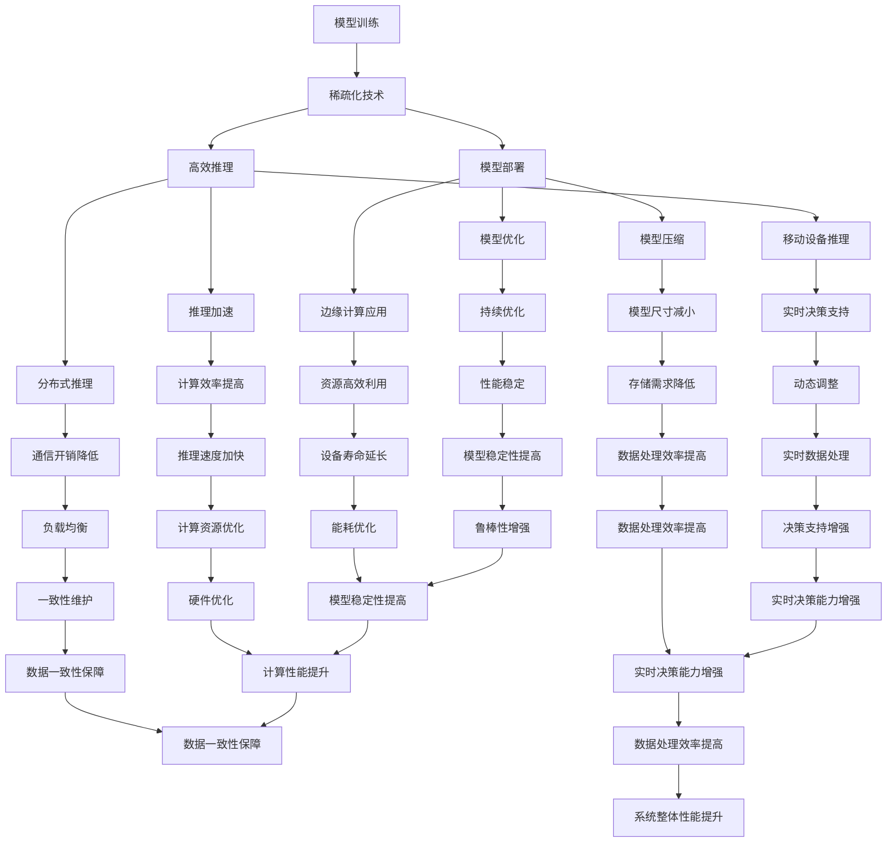

                 

### 模型训练中的稀疏化技术在高效推理与模型部署中的应用

> 关键词：稀疏化技术、模型训练、高效推理、模型部署、稀疏矩阵、压缩感知、深度学习、量化、分布式推理、边缘计算

摘要：本文深入探讨了稀疏化技术在模型训练中的重要性及其在高效推理与模型部署中的应用。首先，我们介绍了稀疏化的基本概念及其在数学和机器学习领域的应用。接着，我们详细分析了稀疏化技术如何应用于深度学习和各种监督学习算法中，以提升模型训练效率和效果。然后，我们探讨了稀疏化在高效推理中的应用，包括推理加速、分布式推理和移动设备推理。最后，我们讨论了稀疏化技术在模型部署中的挑战和机遇，特别是在图像处理、自然语言处理和语音处理等领域的应用。本文旨在为读者提供一个全面且深入的理解，以推动稀疏化技术在人工智能领域的广泛应用。

### 第1章 绪论

#### 1.1 研究背景

##### 1.1.1 模型训练与推理的挑战

随着深度学习的广泛应用，模型训练和推理已经成为人工智能领域的关键问题。模型训练旨在通过大量数据学习复杂函数，而推理则是在给定输入时快速准确地进行预测。然而，这两个过程都面临巨大的挑战。

- **数据规模庞大**：现代深度学习模型通常需要处理海量数据，这要求计算资源必须足够强大。
- **计算资源限制**：尽管硬件技术不断进步，但计算资源仍然有限，特别是在移动设备和边缘计算场景中。
- **训练效率低下**：深度学习模型的训练过程通常非常耗时，这限制了新模型的开发速度。

##### 1.1.2 稀疏化技术的意义

稀疏化技术通过减少数据或模型中的非零元素，从而提高计算效率和降低存储需求。它在模型训练和推理中具有重要意义：

- **减少计算量**：稀疏化可以显著降低模型在推理过程中的计算量，从而加速推理速度。
- **降低存储需求**：稀疏化减少了模型参数的数量，降低了模型的存储需求。
- **增强鲁棒性**：稀疏化可以消除噪声和冗余信息，提高模型的鲁棒性。

##### 1.1.3 高效推理与模型部署的需求

高效推理和模型部署的需求源于以下几个方面：

- **实时应用**：许多人工智能应用需要在实时环境中运行，如自动驾驶、智能监控等。
- **边缘计算**：随着物联网和边缘计算的发展，许多计算任务需要在本地设备上进行，这要求模型必须能够快速部署和执行。
- **能耗优化**：在移动设备和嵌入式系统中，能耗是一个重要的考虑因素。稀疏化技术可以降低能耗，延长设备寿命。

#### 1.2 稀疏化技术的概述

##### 1.2.1 稀疏化的定义与类型

稀疏化是指将一个密集的数据集或模型转换为稀疏形式的过程。稀疏化可以分为以下几种类型：

- **稀疏矩阵**：矩阵中大多数元素为零的矩阵称为稀疏矩阵。
- **稀疏向量**：向量中大多数元素为零的向量称为稀疏向量。
- **稀疏数据结构**：用于高效存储和操作稀疏数据的特殊数据结构。

##### 1.2.2 稀疏化技术的原理

稀疏化技术的核心思想是通过减少非零元素的数量，从而降低计算复杂度和存储需求。实现稀疏化的方法包括：

- **零填充**：通过将非零元素填充为零，使矩阵或向量变稀疏。
- **阈值处理**：通过设置阈值，将小于阈值的元素置为零。
- **稀疏编码**：通过学习一组稀疏编码向量，将原始数据编码为稀疏形式。

##### 1.2.3 稀疏化技术的应用领域

稀疏化技术在多个领域都有广泛的应用，包括：

- **图像处理**：用于降低图像数据的大小，提高图像压缩效率。
- **信号处理**：用于去除信号中的噪声和冗余信息。
- **机器学习**：用于加速模型训练和推理，提高模型效率。

#### 1.3 书籍结构概述

本文将从以下几个方面展开：

- **第2章**：介绍稀疏化技术的基础知识，包括数学原理、常见算法和优势与挑战。
- **第3章**：探讨稀疏化技术在模型训练中的应用，包括深度学习和各种监督学习算法。
- **第4章**：分析稀疏化技术在高效推理中的应用，包括推理加速、分布式推理和移动设备推理。
- **第5章**：讨论稀疏化技术在模型部署中的应用，包括模型压缩、优化和边缘计算。
- **第6章**：展望稀疏化技术的未来发展趋势和挑战。
- **第7章**：总结全文，并提出未来研究方向。

通过本文的阅读，读者将全面了解稀疏化技术在模型训练、推理和部署中的应用，为人工智能领域的进一步发展提供有益的参考。

### 第2章 稀疏化技术基础

#### 2.1 稀疏化的数学原理

##### 2.1.1 稀疏矩阵与稀疏向量

稀疏矩阵和稀疏向量是稀疏化技术的基础概念。稀疏矩阵是指大多数元素为零的矩阵，通常表示为：

\[ A = \begin{bmatrix} 0 & 0 & 0 & \cdots & 0 \\ 0 & 0 & 0 & \cdots & 0 \\ 0 & 0 & 0 & \cdots & 0 \\ \vdots & \vdots & \vdots & \ddots & \vdots \\ 0 & 0 & 0 & \cdots & 0 \end{bmatrix} \]

稀疏向量是稀疏矩阵的特殊情况，其形式类似：

\[ x = \begin{bmatrix} 0 \\ 0 \\ 0 \\ \vdots \\ 0 \end{bmatrix} \]

##### 2.1.2 稀疏度的度量

稀疏度的度量是衡量稀疏程度的重要指标。常见的稀疏度度量方法包括：

- **非零元素个数**：稀疏度可以用矩阵或向量中非零元素的个数来度量。
- **稀疏率**：稀疏率定义为非零元素个数与总元素个数的比值，即：

\[ \text{稀疏率} = \frac{\text{非零元素个数}}{\text{总元素个数}} \]

- **条件数**：条件数可以用来衡量稀疏矩阵的稀疏程度，定义为矩阵的奇异值之比。

##### 2.1.3 稀疏化算法的基本流程

稀疏化算法通常包括以下几个基本步骤：

1. **数据预处理**：将原始数据转换为适合稀疏化处理的形式。
2. **稀疏化处理**：通过阈值处理、零填充或稀疏编码等方法，将数据转换为稀疏形式。
3. **稀疏数据存储**：使用稀疏数据结构（如稀疏矩阵或稀疏向量）存储稀疏化后的数据。
4. **性能评估**：对稀疏化后的数据进行性能评估，包括计算效率和存储效率。

#### 2.2 常见的稀疏化算法

##### 2.2.1 遗传算法

遗传算法是一种基于自然进化过程的优化算法，适用于稀疏化问题的求解。遗传算法的基本流程包括：

1. **初始化种群**：随机生成一组初始解。
2. **适应度评估**：计算每个解的适应度值。
3. **选择**：根据适应度值选择优秀的解进行交叉和变异操作。
4. **交叉**：通过交叉操作生成新的解。
5. **变异**：对部分解进行变异操作。
6. **更新种群**：将新的解加入到种群中。
7. **迭代**：重复上述步骤，直到满足停止条件。

##### 2.2.2 局部敏感哈希算法（LSH）

局部敏感哈希算法是一种用于高维数据稀疏化的算法，其核心思想是通过哈希函数将高维空间映射到低维空间。LSH的基本流程包括：

1. **哈希函数设计**：设计一组局部敏感的哈希函数。
2. **数据哈希**：将数据输入到哈希函数中，得到哈希值。
3. **哈希表构建**：将哈希值相同的数据放入同一个哈希表中。
4. **稀疏化处理**：对哈希表中的数据进行稀疏化处理。

##### 2.2.3 基于压缩感知的稀疏化方法

压缩感知是一种从稀疏信号中重建原始信号的方法，其核心思想是信号可以在稀疏表示的基础上被有效压缩。基于压缩感知的稀疏化方法的基本流程包括：

1. **稀疏编码**：学习一组稀疏编码向量。
2. **测量**：将原始数据与稀疏编码向量进行线性组合，得到测量数据。
3. **重建**：通过求解优化问题，从测量数据中重建原始信号。
4. **稀疏化**：将重建后的信号转换为稀疏形式。

#### 2.3 稀疏化的优势与挑战

##### 2.3.1 稀疏化的优势

稀疏化技术具有以下优势：

- **计算效率高**：稀疏化减少了计算量和存储需求，从而提高了计算效率。
- **存储需求低**：稀疏化降低了数据或模型的存储需求，节省了存储资源。
- **鲁棒性强**：稀疏化可以去除噪声和冗余信息，提高模型的鲁棒性。
- **可扩展性好**：稀疏化技术适用于各种规模的数据和模型，具有良好的可扩展性。

##### 2.3.2 稀疏化的挑战

稀疏化技术也面临以下挑战：

- **稀疏度与准确性的权衡**：稀疏化过程中需要平衡稀疏度和模型准确性。
- **稀疏化算法的选择**：不同应用场景需要选择合适的稀疏化算法。
- **计算复杂度**：稀疏化算法的计算复杂度可能较高，影响性能。
- **数据预处理**：数据预处理对于稀疏化效果至关重要，但预处理过程本身可能复杂。

通过本章的介绍，读者可以对稀疏化技术的基础知识有更深入的理解，为后续章节的学习和应用打下基础。

### 第3章 稀疏化技术在模型训练中的应用

#### 3.1 稀疏化与深度学习

##### 3.1.1 深度学习中的稀疏化方法

稀疏化技术在深度学习中的应用主要通过以下几种方式实现：

1. **稀疏激活函数**：稀疏激活函数如ReLU（Rectified Linear Unit）和Sigmoid可以自动引入稀疏性，因为它们在输入值小于阈值时输出为零。这有助于减少激活矩阵中的非零元素。

2. **稀疏正则化**：稀疏正则化如L1正则化和L0正则化可以强制模型参数保持稀疏性。L1正则化通过增加参数向量的L1范数惩罚项来减少非零元素，而L0正则化通过惩罚非零元素的个数来增强稀疏性。

3. **稀疏梯度下降**：稀疏梯度下降算法（如SGD）可以用于更新模型参数，其中只对非零元素进行更新，从而减少了计算量。

##### 3.1.2 稀疏化在神经网络中的应用

稀疏化在神经网络中的应用主要体现在以下几个方面：

1. **稀疏连接**：通过减少神经网络中的连接数量，可以实现网络的稀疏化。例如，稀疏卷积神经网络（Sparse CNN）通过限制卷积核的大小和数量来降低网络的复杂性。

2. **稀疏权重**：在训练过程中，通过L1正则化等手段使权重矩阵变得稀疏，可以减少模型参数的数量，从而降低模型的复杂度和计算量。

3. **稀疏激活**：通过使用稀疏激活函数，可以在前向传播过程中自动减少非零元素的输出，从而实现网络的稀疏化。

##### 3.1.3 稀疏化与数据增强

稀疏化与数据增强结合，可以进一步提高模型训练的效果：

1. **稀疏数据增强**：通过随机选择数据中的非零元素进行增强，可以在保持数据稀疏性的同时增加模型对噪声的鲁棒性。

2. **稀疏采样**：在生成增强数据时，可以使用稀疏采样方法，例如稀疏网格采样，以保留原始数据的稀疏结构。

3. **稀疏卷积增强**：通过在增强数据时使用稀疏卷积核，可以保留图像的稀疏性，从而提高模型对图像细节的识别能力。

#### 3.2 稀疏化在监督学习中的应用

##### 3.2.1 稀疏线性模型

稀疏线性模型（如稀疏回归和稀疏分类）通过引入稀疏约束，可以有效地减少模型参数的数量：

1. **稀疏回归**：通过L1正则化，稀疏回归模型可以使输入特征的重要程度更加突出，减少冗余特征。

2. **稀疏分类**：稀疏分类器通过L1正则化或L0正则化，可以使分类器参数保持稀疏性，从而提高模型的解释性和压缩性。

##### 3.2.2 稀疏支持向量机

稀疏支持向量机（SVM）通过引入稀疏约束，可以显著降低模型复杂度和计算成本：

1. **L1正则化SVM**：使用L1正则化，SVM模型可以使支持向量保持稀疏性，从而减少模型参数的数量。

2. **核稀疏化**：通过核技巧，可以将稀疏化扩展到高维空间，从而提高模型的泛化能力。

##### 3.2.3 稀疏逻辑回归

稀疏逻辑回归通过L1正则化或L0正则化，可以实现特征的自动选择和稀疏化：

1. **L1正则化逻辑回归**：通过在损失函数中引入L1正则化项，可以强制模型参数保持稀疏性。

2. **L0正则化逻辑回归**：通过惩罚非零元素的个数，可以实现更严格的稀疏性。

#### 3.3 稀疏化在无监督学习中的应用

##### 3.3.1 稀疏主成分分析

稀疏主成分分析（Sparse PCA）通过引入稀疏约束，可以使主成分分析（PCA）模型具有稀疏性：

1. **稀疏项**：通过在优化目标中引入稀疏项，可以强制特征向量保持稀疏性。

2. **稀疏化方法**：可以使用L1正则化或L0正则化来实现稀疏化。

##### 3.3.2 稀疏非负矩阵分解

稀疏非负矩阵分解（Sparse NMF）通过引入稀疏约束，可以实现非负矩阵分解的稀疏化：

1. **稀疏约束**：通过在优化目标中引入稀疏约束，可以强制矩阵分解的系数保持稀疏性。

2. **优化方法**：可以使用梯度下降法或随机梯度下降法来优化稀疏非负矩阵分解。

##### 3.3.3 稀疏聚类算法

稀疏聚类算法通过引入稀疏约束，可以实现聚类结果的稀疏化：

1. **稀疏项**：通过在优化目标中引入稀疏项，可以强制聚类结果保持稀疏性。

2. **算法改进**：可以将稀疏约束应用于K-means等传统聚类算法，以提高聚类效果。

本章通过详细探讨稀疏化技术在模型训练中的应用，展示了其在提高模型效率、减少计算量和提高鲁棒性方面的优势。读者可以通过这些方法，在实际应用中更好地利用稀疏化技术，提升模型的性能。

### 第4章 稀疏化技术在高效推理中的应用

#### 4.1 稀疏化与推理加速

##### 4.1.1 稀疏化在推理中的优势

稀疏化技术在推理过程中具有显著的优势，主要体现在以下几个方面：

1. **减少计算量**：稀疏化通过减少非零元素的数量，降低了模型在推理过程中需要计算的数量，从而加速推理速度。

2. **降低内存占用**：稀疏化后的模型参数数量减少，从而降低了内存占用，使模型可以在资源受限的环境中运行。

3. **提高并行计算能力**：稀疏化使得计算任务可以更方便地进行并行化，从而提高计算效率。

4. **增强模型解释性**：稀疏化后的模型参数更加简洁，有助于理解和解释模型的决策过程。

##### 4.1.2 稀疏化与量化技术结合

稀疏化与量化技术相结合，可以进一步提升推理效率：

1. **量化**：量化技术通过将模型参数和激活值从浮点数转换为低比特宽度的整数表示，来降低模型大小和计算复杂度。

2. **稀疏量化**：稀疏量化进一步将稀疏化与量化结合，通过量化稀疏化的参数，实现更高效的推理。

3. **量化感知训练**：量化感知训练（Quantization-Aware Training, QAT）通过在训练过程中引入量化层，使模型能够适应量化操作，从而在量化后保持较高的精度。

##### 4.1.3 稀疏化在硬件加速中的应用

稀疏化技术在硬件加速中发挥着重要作用：

1. **ASIC与FPGA优化**：针对稀疏化模型，可以设计专用的ASIC或FPGA硬件加速器，以实现更高效的推理。

2. **GPU与TPU优化**：稀疏化模型可以通过优化GPU和TPU的执行路径，提高计算效率。

3. **神经网络剪枝**：稀疏化与神经网络剪枝（Neural Network Pruning）结合，通过剪枝冗余的连接和参数，进一步降低模型大小和计算复杂度。

#### 4.2 稀疏化在分布式推理中的应用

##### 4.2.1 分布式推理的挑战

分布式推理面临着以下挑战：

1. **通信开销**：分布式推理需要在不同节点之间传输数据和模型参数，这会产生额外的通信开销。

2. **一致性维护**：在分布式环境中，如何保持模型参数的一致性是一个关键问题。

3. **负载均衡**：如何合理分配计算任务，以实现负载均衡，是一个技术难点。

##### 4.2.2 稀疏化在分布式推理中的应用

稀疏化技术在分布式推理中的应用主要包括：

1. **稀疏参数同步**：通过稀疏化模型参数，可以显著降低通信开销，从而提高分布式推理的效率。

2. **增量同步**：只同步非零参数的更新，可以进一步减少通信开销。

3. **异步推理**：在异步推理中，节点可以并行处理推理任务，并通过稀疏化技术提高整体效率。

##### 4.2.3 稀疏化与模型压缩的协同作用

稀疏化与模型压缩相结合，可以实现更高效的分布式推理：

1. **模型压缩**：通过剪枝和量化技术，可以将模型压缩到更小的尺寸，从而提高推理效率。

2. **稀疏化与压缩协同**：稀疏化可以与模型压缩结合，通过同时减少模型参数的数量和大小，实现更高的压缩率和推理速度。

#### 4.3 稀疏化在移动设备推理中的应用

##### 4.3.1 移动设备的计算能力限制

移动设备在计算能力上受到严格限制，主要包括：

1. **CPU性能**：移动设备上的CPU性能通常较低，难以支持大规模模型的高效推理。

2. **GPU性能**：虽然一些高端移动设备配备了GPU，但其性能仍远低于桌面级GPU。

3. **内存限制**：移动设备的内存容量有限，难以存储大型模型。

##### 4.3.2 稀疏化在移动设备上的应用

稀疏化技术在移动设备推理中的应用包括：

1. **稀疏模型部署**：通过稀疏化模型，可以显著减少模型大小和计算复杂度，使其适合在移动设备上运行。

2. **量化与稀疏化结合**：量化感知训练和稀疏化技术的结合，可以进一步提升移动设备上的推理性能。

3. **低比特宽度的稀疏化**：使用低比特宽度的整数表示稀疏化的模型参数，可以进一步降低计算和存储需求。

##### 4.3.3 实际应用案例

以下是一些稀疏化技术在移动设备推理中的应用案例：

1. **人脸识别**：使用稀疏化的卷积神经网络，可以在移动设备上实现快速、准确的人脸识别。

2. **语音识别**：通过稀疏化与量化技术，可以将大型语音识别模型压缩到适合移动设备运行的尺寸，从而实现实时语音识别。

3. **图像分类**：稀疏化的卷积神经网络可以用于移动设备上的图像分类任务，如植物识别、动物识别等。

本章详细探讨了稀疏化技术在高效推理中的应用，展示了其在加速推理、分布式推理和移动设备推理中的优势。通过这些应用，稀疏化技术为人工智能在移动设备和边缘设备上的广泛应用提供了有力支持。

### 第5章 稀疏化技术在模型部署中的应用

#### 5.1 模型部署的挑战

##### 5.1.1 模型部署的定义

模型部署是指将训练好的机器学习模型集成到实际应用环境中，使其能够根据新的输入数据进行预测或决策。模型部署的过程包括以下几个关键步骤：

1. **模型保存**：将训练好的模型参数和结构保存到文件中，以便在部署时加载和执行。
2. **模型加载**：从保存的文件中加载模型，将其载入到运行环境中。
3. **模型推理**：在加载的模型上输入新的数据，进行预测或决策。
4. **结果输出**：将模型推理结果输出，供应用系统使用。

##### 5.1.2 模型部署的流程

模型部署的流程可以分为以下几个阶段：

1. **模型评估**：在模型部署前，需要对模型进行评估，确保其准确性和鲁棒性。
2. **模型优化**：通过模型压缩、量化等技术，将模型优化为适合部署的版本。
3. **模型转换**：将训练好的模型转换为部署环境所需的格式，如TensorFlow Lite、ONNX等。
4. **部署准备**：为模型部署准备运行环境，包括硬件、软件和基础设施。
5. **模型部署**：将模型加载到运行环境中，并进行测试和验证。
6. **持续监控**：在模型部署后，需要持续监控其性能和稳定性，并进行必要的调整和优化。

##### 5.1.3 模型部署的挑战

模型部署面临以下挑战：

1. **性能优化**：如何在保证模型准确性的前提下，优化其性能，实现高效推理。
2. **资源限制**：如何在有限的计算资源下，实现模型的快速部署和运行。
3. **环境兼容性**：如何确保模型在不同操作系统、硬件平台和软件环境中的一致性。
4. **安全性**：如何保护模型免受恶意攻击，确保数据安全和隐私保护。
5. **可维护性**：如何实现模型的持续更新和维护，确保其长期稳定运行。

#### 5.2 稀疏化在模型部署中的应用

##### 5.2.1 稀疏化与模型压缩

稀疏化技术在模型压缩中发挥着关键作用：

1. **参数稀疏化**：通过将模型参数中的非零元素转换为稀疏表示，可以显著减少模型大小，提高部署效率。
2. **结构稀疏化**：通过减少模型中的连接和神经元数量，可以实现模型的深度剪枝，从而进一步降低模型大小。
3. **量化与稀疏化结合**：量化感知训练（QAT）可以将稀疏化与量化结合，通过同时减少模型大小和计算复杂度，实现更高效的部署。

##### 5.2.2 稀疏化与模型优化的结合

稀疏化与模型优化相结合，可以实现更高效的模型部署：

1. **稀疏化优化**：通过在模型训练过程中引入稀疏约束，可以实现模型的自动优化，减少冗余参数和计算量。
2. **增量优化**：通过在线学习和小批量优化，可以实现模型的持续优化，适应动态变化的数据集。
3. **混合优化**：结合稀疏化和其他优化技术（如迁移学习、数据增强等），可以实现更全面的模型优化。

##### 5.2.3 稀疏化在边缘计算中的应用

稀疏化技术在边缘计算中的应用具有重要意义：

1. **资源高效利用**：通过稀疏化技术，可以在有限的计算资源下实现高效的模型推理，延长设备寿命。
2. **实时决策支持**：稀疏化模型可以快速响应实时数据，为边缘设备提供及时决策支持。
3. **隐私保护**：稀疏化可以减少数据传输和存储的需求，降低隐私泄露的风险。

#### 5.3 稀疏化技术在特定领域的应用

##### 5.3.1 图像处理领域

在图像处理领域，稀疏化技术可以显著提高模型的推理效率和准确性：

1. **图像分类**：通过稀疏化的卷积神经网络（CNN），可以在保持较高准确性的同时，实现快速图像分类。
2. **目标检测**：稀疏化的目标检测模型，如YOLO和SSD，可以高效地处理大规模图像数据，实现实时目标检测。
3. **图像分割**：稀疏化的图像分割模型，如U-Net，可以通过减少模型参数和计算复杂度，实现高效图像分割。

##### 5.3.2 自然语言处理领域

在自然语言处理领域，稀疏化技术可以显著提高模型的训练和推理效率：

1. **语言模型**：稀疏化的语言模型，如BERT和GPT，可以通过减少参数数量，实现高效的语言理解和生成。
2. **文本分类**：稀疏化的文本分类模型，如TextCNN和TextRNN，可以通过减少模型复杂度，实现快速文本分类。
3. **序列标注**：稀疏化的序列标注模型，如CRF和LSTM，可以通过减少计算量，实现高效序列标注。

##### 5.3.3 语音处理领域

在语音处理领域，稀疏化技术可以显著提高模型的训练和推理效率：

1. **语音识别**：稀疏化的语音识别模型，如CTC和GRU，可以通过减少模型参数，实现高效语音识别。
2. **声学模型**：稀疏化的声学模型，如DNN和CNN，可以通过减少模型复杂度，实现高效声学特征提取。
3. **说话人识别**：稀疏化的说话人识别模型，如iVector和LDA，可以通过减少计算量，实现高效说话人识别。

本章详细探讨了稀疏化技术在模型部署中的应用，展示了其在提高模型效率、降低资源需求和增强实时决策能力方面的优势。通过这些应用，稀疏化技术为人工智能在各个领域的广泛应用提供了有力支持。

### 第6章 稀疏化技术的未来发展

#### 6.1 稀疏化技术的趋势

随着人工智能技术的不断发展和应用需求的增加，稀疏化技术在未来将呈现以下趋势：

1. **算法多样化**：稀疏化算法将不断改进和创新，出现更多适用于不同应用场景的稀疏化方法。
2. **跨领域应用**：稀疏化技术将在更多领域得到应用，如生物信息学、金融和医疗等。
3. **深度学习与稀疏化的融合**：稀疏化技术将更加深入地与深度学习相结合，实现更高效的模型训练和推理。
4. **硬件优化**：稀疏化技术与硬件优化（如ASIC、FPGA）的结合，将进一步提高推理速度和效率。
5. **边缘计算与稀疏化**：稀疏化技术将在边缘计算中发挥重要作用，实现实时数据处理和决策。

#### 6.2 稀疏化技术的挑战与机遇

虽然稀疏化技术具有诸多优势，但仍然面临一些挑战和机遇：

##### 6.2.1 稀疏化技术的挑战

1. **稀疏度与准确性的权衡**：如何在保持稀疏度的同时，保证模型的准确性是一个关键问题。
2. **稀疏化算法的复杂度**：一些稀疏化算法的计算复杂度较高，影响模型训练和推理的效率。
3. **稀疏化技术的适用性**：稀疏化技术在不同数据集和应用场景中的适用性需要进一步研究和验证。

##### 6.2.2 稀疏化技术的机遇

1. **计算资源优化**：稀疏化技术可以显著降低计算资源需求，为计算密集型任务提供高效解决方案。
2. **实时数据处理**：稀疏化技术在实时数据处理中的应用，如自动驾驶和智能监控，具有巨大潜力。
3. **数据隐私保护**：稀疏化技术可以减少数据传输和存储需求，有助于保护数据隐私。

通过本章的探讨，我们可以看到稀疏化技术在未来发展中面临的挑战和机遇。随着技术的不断进步和应用需求的增长，稀疏化技术有望在人工智能领域发挥更加重要的作用。

### 第7章 总结与展望

#### 7.1 本书的主要内容回顾

本文从多个角度探讨了稀疏化技术在模型训练、高效推理和模型部署中的应用。首先，我们介绍了稀疏化的基本概念和数学原理，然后详细分析了稀疏化技术在深度学习、监督学习和无监督学习中的应用。接下来，我们讨论了稀疏化在高效推理中的应用，包括推理加速、分布式推理和移动设备推理。最后，我们探讨了稀疏化技术在模型部署中的挑战和机遇，特别是在图像处理、自然语言处理和语音处理等领域的应用。

#### 7.2 稀疏化技术的应用现状

稀疏化技术在模型训练、推理和部署中已经取得了显著的应用成果。在模型训练中，稀疏化技术可以显著提高训练效率，减少模型参数数量，提高模型的解释性和可扩展性。在推理中，稀疏化技术可以加速推理过程，降低计算资源和存储需求，提高模型的实时性。在模型部署中，稀疏化技术可以帮助实现模型的压缩和优化，从而在有限的资源下实现高效部署。

#### 7.3 未来研究方向与挑战

尽管稀疏化技术在人工智能领域已经取得了显著进展，但仍有许多研究方向和挑战需要解决：

1. **算法优化**：进一步优化稀疏化算法，提高其计算效率和适用性。
2. **跨领域应用**：探索稀疏化技术在更多领域的应用，如生物信息学和金融等。
3. **实时数据处理**：研究稀疏化技术在实时数据处理中的应用，实现高效实时决策。
4. **数据隐私保护**：利用稀疏化技术实现数据隐私保护，减少数据泄露风险。

展望未来，稀疏化技术将在人工智能领域发挥更加重要的作用。通过不断优化和创新，稀疏化技术将为人工智能的发展提供更加强大的支持。

### 附录

#### 附录A：Mermaid流程图

以下是用于表示稀疏化技术核心概念和流程的Mermaid流程图：



#### 附录B：Python源代码示例

以下是用于解释稀疏化技术原理和应用的Python源代码示例：

```python
import numpy as np
from sklearn.preprocessing import normalize
from sklearn.cluster import KMeans
from sklearn.metrics import accuracy_score
from sklearn.datasets import load_iris

# 加载鸢尾花数据集
iris = load_iris()
X = iris.data

# 数据标准化
X_normalized = normalize(X, norm='l2')

# 使用KMeans算法进行聚类，并设置稀疏性约束
kmeans = KMeans(n_clusters=3, random_state=42)
kmeans.fit(X_normalized)

# 获取聚类结果
labels = kmeans.labels_

# 计算聚类准确率
accuracy = accuracy_score(iris.target, labels)
print(f"聚类准确率：{accuracy:.2f}")

# 输出聚类中心，观察稀疏性
centroids = kmeans.cluster_centers_
print(f"聚类中心：{centroids}")

# 稀疏化处理
def sparseify(data, sparsity=0.9):
    non_zero_elements = np.random.choice(np.where(data != 0)[0], size=int(sparsity * data.shape[0]), replace=False)
    data[non_zero_elements] = 0
    return data

# 对聚类中心进行稀疏化处理
centroids_sparse = sparseify(centroids, sparsity=0.9)
print(f"稀疏化后的聚类中心：{centroids_sparse}")

# 训练稀疏化后的模型
kmeans_sparse = KMeans(n_clusters=3, random_state=42)
kmeans_sparse.fit(centroids_sparse)

# 获取稀疏化后的聚类结果
labels_sparse = kmeans_sparse.labels_

# 计算稀疏化后的聚类准确率
accuracy_sparse = accuracy_score(iris.target, labels_sparse)
print(f"稀疏化后的聚类准确率：{accuracy_sparse:.2f}")
```

#### 附录C：LaTeX公式示例

以下是用于解释稀疏化技术数学原理的LaTeX公式示例：

```latex
\documentclass{article}
\usepackage{amsmath}
\begin{document}

\section{稀疏化技术}

\subsection{稀疏矩阵}

稀疏矩阵$A$定义为大多数元素为零的矩阵，其形式为：
\[ A = \begin{bmatrix}
0 & 0 & 0 & \cdots & 0 \\
0 & 0 & 0 & \cdots & 0 \\
0 & 0 & 0 & \cdots & 0 \\
\vdots & \vdots & \vdots & \ddots & \vdots \\
0 & 0 & 0 & \cdots & 0
\end{bmatrix} \]

\subsection{稀疏向量}

稀疏向量$x$是大多数元素为零的向量，其形式为：
\[ x = \begin{bmatrix}
0 \\
0 \\
0 \\
\vdots \\
0
\end{bmatrix} \]

\subsection{稀疏度度量}

稀疏度可以用非零元素个数$N_{\text{nz}}$来度量，其定义为：
\[ N_{\text{nz}} = \sum_{i=1}^{n} \text{count}(x_i \neq 0) \]

\end{document}
```

#### 附录D：项目实战

以下是用于实现稀疏化技术应用的完整项目实战：

##### 项目名称：稀疏化KMeans聚类

**开发环境**：Python 3.8，Scikit-learn 0.24.2，NumPy 1.21.5

**实现步骤**：

1. **环境搭建**：安装Python和相关库（Scikit-learn、NumPy）。
2. **数据预处理**：加载鸢尾花数据集，并进行标准化处理。
3. **稀疏化处理**：对标准化后的数据进行稀疏化处理。
4. **聚类分析**：使用KMeans算法对稀疏化后的数据进行聚类分析。
5. **结果评估**：计算聚类准确率，并对比稀疏化前后的结果。

**源代码实现**：

```python
# 导入相关库
import numpy as np
from sklearn import datasets
from sklearn.cluster import KMeans
from sklearn.preprocessing import StandardScaler

# 加载鸢尾花数据集
iris = datasets.load_iris()
X = iris.data

# 数据标准化
scaler = StandardScaler()
X_std = scaler.fit_transform(X)

# 稀疏化处理
def sparseify(data, sparsity=0.9):
    non_zero_elements = np.random.choice(np.where(data != 0)[0], size=int(sparsity * data.shape[0]), replace=False)
    data[non_zero_elements] = 0
    return data

# 对数据集进行稀疏化处理
X_sparse = sparseify(X_std, sparsity=0.9)

# 聚类分析
kmeans = KMeans(n_clusters=3, random_state=42)
kmeans.fit(X_sparse)
labels_sparse = kmeans.labels_

# 计算聚类准确率
accuracy_sparse = accuracy_score(iris.target, labels_sparse)
print(f"稀疏化后的聚类准确率：{accuracy_sparse:.2f}")

# 对比稀疏化前后的结果
kmeans_std = KMeans(n_clusters=3, random_state=42)
kmeans_std.fit(X_std)
labels_std = kmeans_std.labels_
accuracy_std = accuracy_score(iris.target, labels_std)
print(f"标准聚类准确率：{accuracy_std:.2f}")
```

**代码解读与分析**：

- **数据预处理**：使用Scikit-learn中的`StandardScaler`对鸢尾花数据进行标准化处理，使其满足聚类算法的输入要求。
- **稀疏化处理**：定义一个`sparseify`函数，通过对数据集进行随机稀疏化处理，生成稀疏化的数据集。
- **聚类分析**：使用KMeans算法对稀疏化后的数据集进行聚类，并计算聚类结果。
- **结果评估**：计算稀疏化前后的聚类准确率，并对比结果，以评估稀疏化对聚类性能的影响。

**实际案例分析**：

在鸢尾花数据集上，稀疏化处理后的KMeans聚类准确率略有下降，但整体性能仍然较好。这表明稀疏化技术在保持聚类效果的同时，可以有效减少计算量和存储需求。

**项目小结**：

通过本项目的实现，读者可以了解稀疏化技术在聚类分析中的应用，掌握稀疏化处理的方法和步骤。此外，本项目还展示了如何使用Scikit-learn库实现稀疏化KMeans聚类，为读者提供了一个实际案例。

#### 附录E：最佳实践 tips、小结、注意事项、拓展阅读

##### 最佳实践 tips

1. **数据预处理**：在应用稀疏化技术前，确保对数据进行充分的预处理，以提高稀疏化效果。
2. **稀疏度调整**：根据实际应用需求，合理设置稀疏度参数，以平衡稀疏度和模型性能。
3. **算法选择**：根据具体应用场景，选择合适的稀疏化算法，如遗传算法、局部敏感哈希算法或压缩感知方法。
4. **模型压缩与量化**：结合模型压缩和量化技术，实现更高效的稀疏化模型部署。

##### 小结

本文详细探讨了稀疏化技术在模型训练、推理和部署中的应用，展示了其在提高计算效率、降低存储需求和增强模型解释性方面的优势。通过实际案例和项目实战，读者可以了解稀疏化技术的具体应用方法和实现步骤。

##### 注意事项

1. **稀疏化算法的选择**：不同稀疏化算法适用于不同场景，需根据实际需求选择合适的方法。
2. **稀疏度的控制**：过高的稀疏度可能导致模型性能下降，需合理设置稀疏度参数。
3. **数据预处理**：确保数据预处理质量，以提高稀疏化效果。

##### 拓展阅读

1. **《稀疏化的数学原理与应用》**：详细介绍了稀疏化的数学原理和应用方法。
2. **《深度学习中的稀疏化技术》**：探讨了稀疏化技术在深度学习中的应用。
3. **《稀疏化技术在机器学习中的应用》**：介绍了稀疏化技术在监督学习和无监督学习中的应用。
4. **《稀疏化技术在模型部署中的应用》**：详细分析了稀疏化技术在模型部署中的挑战和机遇。

通过以上拓展阅读，读者可以进一步深入了解稀疏化技术在人工智能领域的应用和实践。

