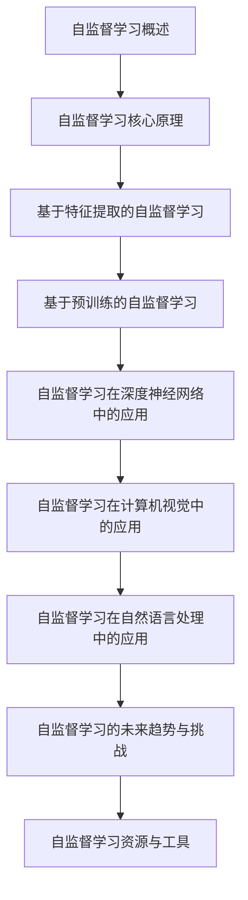

                 

# 模型训练中的自监督学习技术创新

## 关键词

自监督学习、模型训练、技术创新、深度学习、预训练、特征提取、计算机视觉、自然语言处理、神经网络

## 摘要

随着深度学习技术的快速发展，自监督学习作为模型训练的重要方法，在近年来得到了广泛的关注和应用。本文旨在系统地介绍自监督学习的基础知识、核心原理、技术创新以及其在不同领域的应用。通过梳理自监督学习的发展历程、核心概念和原理框架，本文详细探讨了基于特征提取和预训练的自监督学习方法，以及自监督学习在深度神经网络、计算机视觉和自然语言处理等领域的具体应用。此外，本文还分析了自监督学习面临的挑战及其解决策略，展望了自监督学习的未来发展趋势。通过本文的介绍，读者可以全面了解自监督学习的技术内涵和应用价值，为未来的研究和实践提供参考。

## 目录大纲

### 第一部分：自监督学习基础

#### 第1章：自监督学习概述

- **1.1 自监督学习的定义与历史发展**
- **1.2 自监督学习的核心优势**
- **1.3 自监督学习与无监督学习、半监督学习的比较**
- **1.4 自监督学习在模型训练中的应用场景**

#### 第2章：自监督学习的核心原理

- **2.1 自监督学习的原理框架**
- **2.2 自监督学习中的数据增强**
- **2.3 自监督学习中的任务类型**
- **2.4 自监督学习的应用挑战与解决方案**

### 第二部分：自监督学习技术深入

#### 第3章：基于特征提取的自监督学习

- **3.1 自监督特征提取的基本方法**
- **3.2 图像领域的自监督特征提取**
- **3.3 自然语言处理中的自监督特征提取**

#### 第4章：基于预训练的自监督学习

- **4.1 预训练模型的引入**
- **4.2 BERT模型的自监督预训练**
- **4.3 GPT模型的自监督预训练**
- **4.4 其他预训练模型的自监督学习应用**

#### 第5章：自监督学习在深度神经网络中的应用

- **5.1 自监督学习与深度神经网络的结合**
- **5.2 自监督学习在卷积神经网络中的应用**
- **5.3 自监督学习在循环神经网络中的应用**
- **5.4 自监督学习在Transformer模型中的应用**

### 第三部分：自监督学习实践与应用

#### 第6章：自监督学习在计算机视觉中的应用

- **6.1 自监督学习在图像分类中的应用**
- **6.2 自监督学习在目标检测中的应用**
- **6.3 自监督学习在图像分割中的应用**

#### 第7章：自监督学习在自然语言处理中的应用

- **7.1 自监督学习在文本分类中的应用**
- **7.2 自监督学习在机器翻译中的应用**
- **7.3 自监督学习在对话系统中的应用**

#### 第8章：自监督学习的未来趋势与挑战

- **8.1 自监督学习的未来发展方向**
- **8.2 自监督学习面临的挑战与解决策略**
- **8.3 自监督学习在多模态学习中的应用**

### 附录：自监督学习资源与工具

- **附录1：自监督学习相关工具和框架**
- **附录2：自监督学习项目实践案例**

### Mermaid 流程图



### 数学模型与公式

```latex
\subsection{自监督学习的损失函数}

自监督学习的损失函数可以表示为：

$$
L = \frac{1}{N} \sum_{n=1}^{N} L_n
$$

其中，\( L_n \) 是第 \( n \) 个样本的损失，\( N \) 是样本总数。常见的损失函数有：

$$
L_n = -\log(p(y_n | \theta))
$$

其中，\( p(y_n | \theta) \) 是模型预测概率，\( y_n \) 是实际标签，\( \theta \) 是模型参数。
```

### 项目实战

```python
import torch
import torchvision
import torchvision.transforms as transforms
import torch.optim as optim

# 数据集加载与预处理
transform = transforms.Compose([
    transforms.ToTensor(),
    transforms.Normalize((0.5,), (0.5,))
])

trainset = torchvision.datasets.MNIST(
    root='./data', train=True, download=True, transform=transform)
trainloader = torch.utils.data.DataLoader(
    trainset, batch_size=100, shuffle=True, num_workers=2)

testset = torchvision.datasets.MNIST(
    root='./data', train=False, download=True, transform=transform)
testloader = torch.utils.data.DataLoader(
    testset, batch_size=100, shuffle=False, num_workers=2)

# 神经网络模型定义
class Net(torch.nn.Module):
    def __init__(self):
        super(Net, self).__init__()
        self.fc1 = torch.nn.Linear(28*28, 128)
        self.fc2 = torch.nn.Linear(128, 10)

    def forward(self, x):
        x = x.view(-1, 28*28)
        x = torch.relu(self.fc1(x))
        x = self.fc2(x)
        return x

net = Net()
print(net)

# 损失函数与优化器
criterion = torch.nn.CrossEntropyLoss()
optimizer = optim.SGD(net.parameters(), lr=0.001, momentum=0.9)

# 训练过程
for epoch in range(1):  # 遍历数据集多次，实现多轮训练
    running_loss = 0.0
    for i, data in enumerate(trainloader, 0):
        inputs, labels = data
        optimizer.zero_grad()
        outputs = net(inputs)
        loss = criterion(outputs, labels)
        loss.backward()
        optimizer.step()
        running_loss += loss.item()
        if i % 2000 == 1999:    # 每2000个批量打印一次
            print('[%d, %5d] loss: %.3f' %
                  (epoch + 1, i + 1, running_loss / 2000))
            running_loss = 0.0

print('Finished Training')

# 测试过程
correct = 0
total = 0
with torch.no_grad():
    for data in testloader:
        images, labels = data
        outputs = net(images)
        _, predicted = torch.max(outputs.data, 1)
        total += labels.size(0)
        correct += (predicted == labels).sum().item()

print('Accuracy of the network on the 10000 test images: %d %%' % (
    100 * correct / total))
```

### 最佳实践 tips、小结、注意事项、拓展阅读

- **最佳实践 tips**：
  - 在进行自监督学习时，数据预处理和增强非常重要，可以显著提高模型的性能。
  - 优化器选择和超参数调优对模型训练效果有很大影响，需要根据具体任务进行调整。

- **小结**：
  - 自监督学习是一种无需标注数据的模型训练方法，具有广泛的应用前景。
  - 通过特征提取和预训练方法，自监督学习可以显著提高模型的性能和泛化能力。

- **注意事项**：
  - 自监督学习模型训练过程中，需要合理设置学习率和批量大小，避免过拟合和梯度消失问题。
  - 在实际应用中，需要根据任务需求和数据特性选择合适的方法和模型结构。

- **拓展阅读**：
  - 《深度学习》（Goodfellow, Bengio, Courville著）第10章：自监督学习
  - 《自监督学习的艺术》（张翔著）详细介绍了自监督学习的相关理论和应用技术

## 第一部分：自监督学习基础

### 第1章：自监督学习概述

#### 1.1 自监督学习的定义与历史发展

自监督学习（Self-Supervised Learning）是一种机器学习范式，其主要特点是在没有外部监督信号的情况下，通过学习数据中的内在结构来提高模型性能。自监督学习的目标是从未标注的数据中提取有用的信息，并利用这些信息进行模型的训练和优化。

自监督学习的概念最早可以追溯到20世纪50年代和60年代，当时一些学者开始研究如何在没有标注数据的情况下进行知识获取。到了20世纪80年代，随着计算机性能的提升和大量未标注数据的积累，自监督学习逐渐成为机器学习领域的一个重要研究方向。

早期自监督学习主要关注的是特征提取和降维问题。例如，主成分分析（PCA）就是一种自监督的特征提取方法，它通过最小化数据方差来提取数据的低维表示。随后，随着深度学习技术的发展，自监督学习的方法也逐渐从简单的特征提取扩展到更复杂的任务，如分类、目标检测和自然语言处理等。

#### 1.2 自监督学习的核心优势

自监督学习在模型训练中具有以下几个核心优势：

1. **无需标注数据**：自监督学习不需要大量的标注数据，这大大降低了数据标注的成本和时间。特别是在大规模数据集的训练中，标注数据的成本可能远远超过数据采集本身。

2. **数据利用率高**：自监督学习能够充分利用未标注的数据，提高数据利用率。在许多实际应用中，未标注数据的数量往往远远超过标注数据，自监督学习可以充分利用这部分数据来提升模型性能。

3. **增强模型泛化能力**：自监督学习通过学习数据的内在结构，可以增强模型的泛化能力。模型在未标注数据上的表现往往可以反映其在未知数据上的潜在性能，从而提高模型的泛化能力。

4. **减少对专家依赖**：自监督学习减少了对于领域专家的依赖，使得普通数据科学家也能够开展有效的机器学习研究和应用。

#### 1.3 自监督学习与无监督学习、半监督学习的比较

自监督学习、无监督学习和半监督学习是机器学习中的三种不同学习范式，它们之间存在一定的联系和区别。

- **无监督学习（Unsupervised Learning）**：无监督学习是指在没有标注数据的情况下，通过学习数据中的内在结构来进行特征提取和降维。无监督学习的目标通常是发现数据中的分布和模式，常见的算法有聚类、降维和生成模型等。

- **半监督学习（Semi-Supervised Learning）**：半监督学习结合了无监督学习和有监督学习，它利用少量的标注数据和大量的未标注数据进行模型训练。半监督学习可以显著提高模型在标注数据稀少情况下的性能。

- **自监督学习**：自监督学习是无监督学习的一种特殊形式，它的目标是通过学习数据的内在结构来提高模型在特定任务上的性能。自监督学习通常不需要外部监督信号，而是通过设计特殊的训练目标来驱动模型学习。

虽然自监督学习、无监督学习和半监督学习有一定的区别，但它们在本质上是相互关联的。自监督学习可以看作是半监督学习的一个特例，即在没有标注数据的情况下进行模型训练。同时，自监督学习也借鉴了无监督学习的许多方法和思路，如特征提取和数据增强等。

#### 1.4 自监督学习在模型训练中的应用场景

自监督学习在模型训练中具有广泛的应用场景，以下是一些典型的应用实例：

1. **图像分类**：在计算机视觉领域，自监督学习可以用于图像分类任务。通过自监督学习方法，模型可以在没有标注数据的情况下学习到图像的内在特征，从而实现高效的图像分类。

2. **目标检测**：自监督学习在目标检测任务中也具有潜在的应用价值。例如，通过自监督学习，模型可以自动发现图像中的目标区域，为后续的目标检测任务提供可靠的先验信息。

3. **自然语言处理**：在自然语言处理领域，自监督学习可以用于文本分类、机器翻译和对话系统等任务。通过自监督学习方法，模型可以自动学习到文本的特征和语义信息，从而提高任务性能。

4. **语音识别**：自监督学习在语音识别任务中也具有一定的应用前景。通过自监督学习，模型可以在没有标注数据的情况下学习语音特征，从而提高语音识别的准确率和鲁棒性。

总之，自监督学习在模型训练中具有广泛的应用前景和潜力，随着深度学习技术的不断发展和应用，自监督学习方法将继续在各个领域发挥重要作用。

### 第2章：自监督学习的核心原理

#### 2.1 自监督学习的原理框架

自监督学习的核心原理是通过设计特殊的训练目标，使得模型在训练过程中能够自动学习数据中的内在结构，从而提高模型在特定任务上的性能。自监督学习通常包含以下几个关键组件：

1. **输入数据**：自监督学习利用大量的未标注数据作为输入。这些数据可以是图像、文本、语音等不同类型的数据。通过未标注数据，模型可以学习到数据的特征和分布。

2. **训练目标**：自监督学习通过设计特殊的训练目标来驱动模型学习。这些训练目标通常不需要外部监督信号，而是基于数据本身的结构和模式。常见的训练目标包括预测任务、对比任务和生成任务等。

3. **损失函数**：自监督学习的损失函数用于评估模型在训练过程中的表现。损失函数通常设计为能够最大化模型在训练目标上的性能。常见的损失函数包括预测误差、对比损失和生成损失等。

4. **优化算法**：自监督学习通过优化算法来更新模型参数，从而提高模型在训练目标上的性能。优化算法通常采用梯度下降或其他优化方法，以最小化损失函数。

通过以上组件，自监督学习模型可以在没有外部监督信号的情况下，自动学习数据的内在结构，并提高模型在特定任务上的性能。

#### 2.2 自监督学习中的数据增强

数据增强（Data Augmentation）是自监督学习中一个重要的技术手段，通过引入噪声和变换，可以扩充数据的多样性，从而提高模型的泛化能力。以下是一些常见的数据增强方法：

1. **随机裁剪（Random Cropping）**：随机裁剪是指从图像中随机裁剪一个区域作为输入，从而增加数据的多样性。随机裁剪可以模拟不同的图像位置和大小变化，有助于模型学习图像的局部特征。

2. **翻转（Flip）**：翻转是指将图像沿水平或垂直方向进行翻转，从而增加数据的多样性。翻转可以模拟不同的视角变化，有助于模型学习图像的全局特征。

3. **旋转（Rotation）**：旋转是指将图像随机旋转一定的角度，从而增加数据的多样性。旋转可以模拟不同的角度变化，有助于模型学习图像的旋转特征。

4. **缩放（Scaling）**：缩放是指将图像随机缩放一定的比例，从而增加数据的多样性。缩放可以模拟不同大小和分辨率的变化，有助于模型学习图像的尺度特征。

5. **颜色调整（Color Adjustment）**：颜色调整是指随机调整图像的亮度、对比度和饱和度，从而增加数据的多样性。颜色调整可以模拟不同的光照和色彩变化，有助于模型学习图像的颜色特征。

通过这些数据增强方法，自监督学习模型可以更好地适应不同的数据分布和变化，从而提高模型的泛化能力和鲁棒性。

#### 2.3 自监督学习中的任务类型

自监督学习可以根据训练任务的不同分为多种类型，以下是一些常见的任务类型：

1. **预测任务**：预测任务是自监督学习中最为常见的一种任务类型，其主要目标是预测数据中的某个未知部分。预测任务可以进一步细分为单标签和多标签预测，其中单标签预测是指每个数据点只属于一个标签，而多标签预测是指每个数据点可以同时属于多个标签。

2. **对比任务**：对比任务是指通过对比数据中的相似性和差异性来训练模型。常见的对比任务包括对比分类和对比学习。对比分类是指通过对比数据点的相似性来分类，而对比学习是指通过对比数据点的差异来训练模型。

3. **生成任务**：生成任务是自监督学习中的一种特殊任务类型，其主要目标是生成与数据分布相似的新数据。生成任务可以进一步细分为生成对抗网络（GAN）和变分自编码器（VAE）等。

4. **聚类任务**：聚类任务是自监督学习中的一种任务类型，其主要目标是找出数据点之间的相似性，并将它们划分为不同的簇。常见的聚类算法包括K-means和层次聚类等。

5. **序列任务**：序列任务是自监督学习中的一种任务类型，其主要目标是处理序列数据，如时间序列和自然语言序列。常见的序列任务包括序列分类、序列标注和序列生成等。

通过这些不同类型的任务，自监督学习可以应用于各种不同领域和任务，从而提高模型的性能和泛化能力。

#### 2.4 自监督学习的应用挑战与解决方案

尽管自监督学习在模型训练中具有很多优势，但在实际应用中也面临一些挑战。以下是一些常见的挑战及其解决策略：

1. **数据多样性不足**：自监督学习依赖于大量的未标注数据，但如果数据多样性不足，模型可能无法很好地泛化到不同的任务和数据分布。解决策略是采用多样化的数据来源，并进行数据增强和预处理，以增加数据的多样性。

2. **模型性能不稳定**：自监督学习的模型性能可能会受到数据增强、优化算法和超参数设置等多种因素的影响，从而导致模型性能不稳定。解决策略是进行全面的超参数调优和模型验证，以找到最优的模型参数。

3. **计算资源需求高**：自监督学习通常需要大量的计算资源，特别是在大规模数据集和复杂模型的情况下。解决策略是采用分布式计算和并行计算技术，以提高计算效率和降低成本。

4. **模型泛化能力有限**：尽管自监督学习可以增强模型的泛化能力，但在某些任务上，模型的泛化能力仍然有限，特别是在面临未知数据分布时。解决策略是结合有监督学习和无监督学习方法，以实现更好的泛化能力。

通过这些解决方案，自监督学习可以克服一些应用中的挑战，从而在实际应用中发挥更大的作用。

## 第二部分：自监督学习技术深入

### 第3章：基于特征提取的自监督学习

#### 3.1 自监督特征提取的基本方法

自监督特征提取（Self-Supervised Feature Extraction）是自监督学习中的一个重要分支，其核心目标是自动学习数据的内在特征，这些特征有助于提高模型在下游任务中的性能。自监督特征提取的基本方法包括以下几个方面：

1. **一致性正则化（Consistency Regularization）**：一致性正则化通过强制模型输出在不同数据增强版本上保持一致来提取特征。例如，给定一张图像，模型需要同时预测其随机裁剪后的多个版本，并确保输出的一致性。

2. **对比学习（Contrastive Learning）**：对比学习通过最大化正样本和负样本之间的特征差异来提取特征。常用的对比学习算法包括正负样本匹配、随机裁剪和旋转等操作，然后通过对比损失函数（如InfoNCE损失）来训练模型。

3. **生成对抗网络（GAN）**：生成对抗网络通过对抗训练来提取特征。在GAN中，生成器（Generator）尝试生成与真实数据相似的数据，而判别器（Discriminator）则尝试区分真实数据和生成数据。通过训练生成器和判别器之间的对抗关系，可以提取出具有鉴别性的特征。

4. **无监督预训练（Unsupervised Pre-training）**：无监督预训练通过在大规模未标注数据上进行预训练，然后微调模型以适应特定任务。预训练过程中，模型通常使用自监督任务（如预测图像中的某个像素值）来提取特征。

#### 3.2 图像领域的自监督特征提取

在图像领域，自监督特征提取方法得到了广泛的应用。以下是一些典型的应用实例：

1. **ImageNet挑战**：ImageNet挑战是自监督特征提取的重要应用场景。通过在ImageNet数据集上使用自监督学习方法，研究人员成功提取了具有高判别力的特征，这些特征在下游任务中表现优异。

2. **文本描述生成（Image-Text Retrieval）**：在图像-文本检索任务中，自监督特征提取方法可以用于生成图像的文本描述。通过在大规模图像和文本对的数据集上进行训练，模型可以自动提取图像的特征，并生成与图像内容相关的文本描述。

3. **视频分类（Video Classification）**：在视频分类任务中，自监督特征提取方法可以用于提取视频的时空特征。通过在大量未标注的视频数据上进行训练，模型可以自动提取视频中的关键帧和时空特征，从而实现视频的分类。

4. **图像分割（Image Segmentation）**：在图像分割任务中，自监督特征提取方法可以用于生成图像的分割标签。通过在大规模未标注的图像数据集上进行训练，模型可以自动提取图像的特征，并生成分割掩膜。

#### 3.3 自然语言处理中的自监督特征提取

自然语言处理（NLP）中的自监督特征提取方法近年来也取得了显著的进展。以下是一些典型的应用实例：

1. **词向量表示（Word Embedding）**：在词向量表示任务中，自监督特征提取方法可以用于生成词汇表。通过在大规模文本数据集上进行训练，模型可以自动提取文本的特征，并生成词向量表示。

2. **文本分类（Text Classification）**：在文本分类任务中，自监督特征提取方法可以用于提取文本的特征。通过在大规模未标注的文本数据集上进行训练，模型可以自动提取文本的特征，从而实现文本的分类。

3. **机器翻译（Machine Translation）**：在机器翻译任务中，自监督特征提取方法可以用于生成翻译模型。通过在大规模平行文本数据集上进行训练，模型可以自动提取文本的特征，并生成翻译结果。

4. **对话系统（Dialogue System）**：在对话系统任务中，自监督特征提取方法可以用于提取对话的特征。通过在大规模对话数据集上进行训练，模型可以自动提取对话的特征，从而实现对话系统的生成和理解。

通过这些方法，自监督特征提取在图像和自然语言处理领域中发挥了重要作用，为模型训练提供了有效的特征表示。

### 第4章：基于预训练的自监督学习

#### 4.1 预训练模型的引入

预训练（Pre-training）是指在大规模未标注数据集上预先训练一个模型，然后将其应用于特定任务中。预训练模型的主要优势是能够利用大量的未标注数据来学习通用的特征表示，从而提高模型在下游任务中的性能。预训练模型通常分为两类：基于特征提取的预训练和基于任务的预训练。

基于特征提取的预训练旨在学习通用特征表示，这些特征可以在多种下游任务中发挥重要作用。例如，在图像领域，预训练模型通过学习图像的深层特征，使得图像分类、目标检测和图像分割等任务的表现得到显著提升。在自然语言处理领域，预训练模型通过学习文本的深层特征，使得文本分类、机器翻译和对话系统等任务的表现得到显著提升。

#### 4.2 BERT模型的自监督预训练

BERT（Bidirectional Encoder Representations from Transformers）是一种基于Transformer的预训练模型，由Google提出。BERT模型通过在大量未标注文本数据上进行预训练，学习到了文本的深层特征表示，从而在多种下游任务中表现出色。

BERT模型的自监督预训练过程主要包括以下步骤：

1. **词干嵌入（WordPiece）**：BERT模型采用WordPiece方法将文本分解为一系列子词，然后对子词进行嵌入表示。

2. **Masked Language Model（MLM）**：BERT模型在预训练过程中，对输入的文本进行随机掩码处理，即随机选择一部分子词进行屏蔽。模型的目标是预测这些被屏蔽的子词，从而学习文本的上下文关系。

3. **下一个句子预测（Next Sentence Prediction，NSP）**：BERT模型在预训练过程中，还需要对两个连续的句子进行预测，判断它们是否属于同一篇章。通过这个任务，模型可以学习文本的篇章结构。

通过以上步骤，BERT模型可以学习到文本的深层特征表示，从而提高模型在下游任务中的性能。BERT模型在文本分类、问答系统和机器翻译等任务中取得了显著的成果，成为了自然语言处理领域的重要工具。

#### 4.3 GPT模型的自监督预训练

GPT（Generative Pre-trained Transformer）是OpenAI提出的一种基于Transformer的预训练模型。GPT模型通过在大量未标注文本数据上进行预训练，学习到了文本的生成能力和上下文关系。

GPT模型的自监督预训练过程主要包括以下步骤：

1. **生成文本（Text Generation）**：GPT模型通过生成文本的方式来进行预训练。在训练过程中，模型需要根据上下文生成下一个子词，从而学习到文本的生成能力。

2. **Masked Language Model（MLM）**：与BERT模型类似，GPT模型在预训练过程中，也会对输入的文本进行随机掩码处理，然后预测被屏蔽的子词。

3. **序列掩码（Sequence Masking）**：GPT模型还会对输入的序列进行随机掩码处理，然后预测被屏蔽的子词。通过这个任务，模型可以学习到序列中的依赖关系。

通过以上步骤，GPT模型可以学习到文本的深层特征表示和生成能力。GPT模型在文本生成、问答系统和机器翻译等任务中表现出色，成为了自然语言处理领域的重要工具。

#### 4.4 其他预训练模型的自监督学习应用

除了BERT和GPT模型，还有许多其他预训练模型在自监督学习中得到了广泛应用。以下是一些典型的预训练模型及其应用：

1. **RoBERTa**：RoBERTa是Facebook提出的一种基于BERT的改进模型。RoBERTa通过采用不同的训练策略和优化方法，提高了模型的性能和泛化能力。

2. **ALBERT**：ALBERT是Google提出的一种高效预训练模型。ALBERT模型通过引入跨层自注意力机制和参数共享等技术，提高了模型的效率和性能。

3. **T5**：T5是DeepMind提出的一种统一Transformer模型。T5模型将文本处理任务转化为编码器-解码器范式，并通过自监督预训练学习到了文本的深层特征表示。

4. **ERNIE**：ERNIE是百度提出的一种基于Transformer的预训练模型。ERNIE模型通过引入知识增强和多头自注意力机制，提高了模型的语义理解和生成能力。

这些预训练模型在文本分类、机器翻译、对话系统和图像识别等任务中表现出色，为自监督学习提供了强大的工具。

## 第三部分：自监督学习在深度神经网络中的应用

### 第5章：自监督学习在深度神经网络中的应用

自监督学习在深度神经网络（Deep Neural Networks, DNN）中的应用越来越广泛，通过无监督学习的方式，能够有效地提升模型的性能和泛化能力。本章将详细探讨自监督学习与深度神经网络的结合，以及在不同类型的神经网络中的应用。

#### 5.1 自监督学习与深度神经网络的结合

自监督学习与深度神经网络的结合主要通过以下几种方式实现：

1. **特征提取**：自监督学习的一个核心目标是从数据中提取有用的特征。在深度神经网络中，可以通过设计自监督任务来训练网络，使其自动学习到有鉴别力的特征表示。这些特征可以用于后续的下游任务，提高模型的性能。

2. **数据增强**：自监督学习中的数据增强技术，如随机裁剪、翻转和旋转等，可以应用于深度神经网络，增加训练数据的多样性，从而提高模型的泛化能力。

3. **预训练**：自监督预训练是深度神经网络的一种常见方法。通过在大规模未标注数据集上预训练深度神经网络，可以学习到具有通用性的特征表示，然后在特定的下游任务中进行微调。

#### 5.2 自监督学习在卷积神经网络中的应用

卷积神经网络（Convolutional Neural Networks, CNN）是处理图像数据的一种常见深度学习模型。自监督学习在CNN中的应用主要表现为以下几种：

1. **自监督特征提取**：通过设计自监督任务，如图像分类、目标检测和图像分割，来训练CNN提取图像的有用特征。这些特征可以用于后续的图像识别任务。

2. **自监督数据增强**：在CNN训练过程中，采用自监督学习中的数据增强技术，如随机裁剪和翻转，来增加训练数据的多样性，从而提高模型的泛化能力。

3. **自监督预训练**：在CNN的训练过程中，通过自监督预训练来学习图像的深层特征表示。例如，通过在未标注的图像数据集上进行预训练，然后微调模型以适应特定的图像识别任务。

#### 5.3 自监督学习在循环神经网络中的应用

循环神经网络（Recurrent Neural Networks, RNN）是一种处理序列数据的常见深度学习模型。自监督学习在RNN中的应用主要表现为以下几种：

1. **自监督序列建模**：通过设计自监督任务，如语言模型和语音识别，来训练RNN建模序列数据。这些自监督任务可以帮助RNN学习到序列中的长期依赖关系。

2. **自监督数据增强**：在RNN训练过程中，采用自监督学习中的数据增强技术，如时间步随机裁剪和随机插入，来增加训练序列的多样性，从而提高模型的泛化能力。

3. **自监督预训练**：通过在未标注的序列数据集上进行自监督预训练，RNN可以学习到序列的深层特征表示，然后在特定的序列建模任务中进行微调。

#### 5.4 自监督学习在Transformer模型中的应用

Transformer模型是一种基于自注意力机制的深度学习模型，近年来在自然语言处理和图像生成等领域取得了显著的成功。自监督学习在Transformer模型中的应用主要表现为以下几种：

1. **自监督特征提取**：通过设计自监督任务，如文本分类和机器翻译，来训练Transformer提取文本和图像的有用特征。这些特征可以用于后续的任务，提高模型的性能。

2. **自监督数据增强**：在Transformer训练过程中，采用自监督学习中的数据增强技术，如文本掩码和图像随机裁剪，来增加训练数据的多样性，从而提高模型的泛化能力。

3. **自监督预训练**：通过在未标注的数据集上进行自监督预训练，Transformer可以学习到数据中的深层特征表示，然后在特定的下游任务中进行微调。

自监督学习与深度神经网络的结合，为模型训练提供了一种新的思路和方法。通过无监督学习的方式，模型可以从大量的未标注数据中学习到有用的特征和模式，从而提高模型在下游任务中的性能和泛化能力。

## 第四部分：自监督学习实践与应用

### 第6章：自监督学习在计算机视觉中的应用

自监督学习在计算机视觉中的应用已经成为一个热点研究方向，它能够在没有大量标注数据的情况下，通过自动提取图像特征来提升模型性能。本章将详细探讨自监督学习在计算机视觉中的各种应用场景，包括图像分类、目标检测和图像分割。

#### 6.1 自监督学习在图像分类中的应用

图像分类是计算机视觉中的一个基本任务，自监督学习通过自动提取图像特征来实现这一目标。以下是一些自监督学习在图像分类中的应用方法：

1. **一致性正则化**：一致性正则化通过要求模型在图像的不同增强版本上输出一致的结果来学习图像特征。例如，给定一张图像，模型需要预测其随机裁剪、旋转和颜色变换后的版本，并确保预测结果一致。

2. **对比学习**：对比学习通过最大化正样本特征和负样本特征之间的差异来提取有用特征。常用的对比学习方法包括BYOL（Bootstrap Your Own Latent）和SimSiam等。

3. **自监督预训练**：自监督预训练通过在大规模未标注图像数据集上训练模型，提取图像的通用特征表示。然后，将这些特征用于下游的分类任务，通过微调来优化模型。

#### 6.2 自监督学习在目标检测中的应用

目标检测是计算机视觉中的一项重要任务，自监督学习通过自动提取图像中的目标区域来提升检测性能。以下是一些自监督学习在目标检测中的应用方法：

1. **基于区域的方法**：这种方法通过预测图像中的目标区域来实现自监督学习。例如，模型可以预测图像中某些区域是否包含目标，然后通过对比不同区域来学习目标特征。

2. **基于分割的方法**：这种方法通过预测图像的分割掩膜来实现自监督学习。例如，模型可以预测图像中的前景区域和背景区域，然后通过对比分割结果来学习目标特征。

3. **自监督预训练**：自监督预训练在目标检测中的应用包括通过预测图像中的对象和对象边界来提取特征。预训练后的模型可以用于目标检测任务，通过微调来提高检测性能。

#### 6.3 自监督学习在图像分割中的应用

图像分割是计算机视觉中的一项关键任务，自监督学习通过自动提取图像中的前景和背景特征来实现这一目标。以下是一些自监督学习在图像分割中的应用方法：

1. **基于生成对抗网络的方法**：生成对抗网络（GAN）通过生成图像的分割掩膜来实现自监督学习。在GAN训练过程中，生成器生成分割掩膜，而判别器区分真实掩膜和生成掩膜，通过这个对抗过程来学习图像分割特征。

2. **基于对比学习的方法**：对比学习通过比较图像的不同版本来提取分割特征。例如，SimSeg算法通过比较原始图像和其随机裁剪版本之间的差异来学习图像分割特征。

3. **自监督预训练**：自监督预训练通过在大规模未标注图像数据集上训练模型，提取图像的分割特征。预训练后的模型可以用于图像分割任务，通过微调来提高分割性能。

通过这些方法，自监督学习在图像分类、目标检测和图像分割中展现了其强大的应用潜力，为计算机视觉任务提供了新的解决方案。

### 第7章：自监督学习在自然语言处理中的应用

自监督学习在自然语言处理（Natural Language Processing, NLP）领域中的应用正迅速发展，它为模型在文本分类、机器翻译和对话系统等任务中提供了新的方法。本章将详细介绍自监督学习在NLP中的具体应用。

#### 7.1 自监督学习在文本分类中的应用

文本分类是NLP中的一个基础任务，其目的是将文本数据分配到预定义的类别中。自监督学习在文本分类中的应用包括以下方法：

1. **Masked Language Model (MLM)**：BERT和GPT等模型通过在输入文本中随机屏蔽部分单词，然后预测这些屏蔽的单词来训练模型。这种方法可以帮助模型学习文本的上下文关系和语义特征。

2. **预测下一个句子（Next Sentence Prediction, NSP）**：BERT模型通过预测两个连续句子是否属于同一篇章来训练模型。这个任务有助于模型学习文本的连贯性和结构。

3. **自监督预训练**：通过在大规模未标注文本数据集上预训练模型，可以提取文本的深层特征表示。预训练后的模型可以微调到特定的文本分类任务，从而提高分类性能。

#### 7.2 自监督学习在机器翻译中的应用

机器翻译是NLP中的一个重要任务，自监督学习通过无监督的方法来提高翻译质量。以下是一些自监督学习在机器翻译中的应用方法：

1. **预测缺失词（Masked Language Model, MLM）**：在训练过程中，模型预测输入文本中被随机屏蔽的单词，从而学习词汇和语法结构。

2. **预测下一个单词（Next Word Prediction）**：模型通过预测文本序列中的下一个单词来训练，这有助于模型学习语言的连贯性和语法规则。

3. **自监督预训练**：通过在双语的未标注数据集上进行预训练，模型可以学习到源语言和目标语言之间的对应关系。预训练后的模型可以微调到具体的翻译任务，从而提高翻译质量。

#### 7.3 自监督学习在对话系统中的应用

对话系统是NLP中的一个复杂任务，其目标是使机器能够理解并生成自然语言的回复。自监督学习在对话系统中的应用包括以下方法：

1. **对话生成（Dialogue Generation）**：通过模型生成可能的回复，然后从多个候选回复中选择最佳回复。这种方法通过无监督学习来学习对话的上下文和语言风格。

2. **对话填充（Dialogue Completion）**：模型预测对话中的下一个单词或短语，从而生成完整的对话。这有助于模型学习对话的连贯性和语境。

3. **自监督预训练**：通过在大规模对话数据集上进行预训练，模型可以学习到对话中的语言规律和对话策略。预训练后的模型可以应用于对话系统的生成和理解任务。

通过这些方法，自监督学习在自然语言处理任务中展现出了其强大的潜力，为文本分类、机器翻译和对话系统等任务提供了有效的解决方案。

### 第8章：自监督学习的未来趋势与挑战

自监督学习作为近年来机器学习领域的重要研究方向，已经展现出强大的应用潜力。然而，随着技术的不断进步和应用场景的扩展，自监督学习也面临着一系列的挑战和机遇。本章将探讨自监督学习的未来发展趋势、面临的挑战及其解决策略，以及自监督学习在多模态学习中的应用。

#### 8.1 自监督学习的未来发展趋势

1. **多模态学习**：随着数据集的多样性和复杂性不断增加，自监督学习逐渐从单一模态扩展到多模态学习。未来，自监督学习将在图像、文本、语音和视频等多种模态的数据上进行联合学习，以提取更加丰富的特征表示。

2. **动态自监督学习**：动态自监督学习是一种新兴的研究方向，它通过实时学习和适应数据分布的变化来提高模型的性能。未来，动态自监督学习有望在动态场景下，如实时语音识别、动态图像分割等领域，发挥重要作用。

3. **增强的鲁棒性**：随着对抗攻击和隐私保护等问题的日益突出，自监督学习在鲁棒性和隐私保护方面的研究将得到进一步发展。未来，自监督学习将设计出更加鲁棒和隐私保护的模型，以应对复杂的攻击环境和隐私保护要求。

4. **迁移学习与元学习**：自监督学习与迁移学习和元学习相结合，将有望进一步提高模型的学习效率和泛化能力。通过在多个任务和领域之间进行知识迁移和学习，自监督学习可以实现更好的泛化性能。

#### 8.2 自监督学习面临的挑战与解决策略

尽管自监督学习取得了显著的进展，但仍然面临以下挑战：

1. **数据质量和多样性**：自监督学习依赖于大量的未标注数据。然而，数据质量和多样性对模型性能有重要影响。解决策略包括采用数据清洗和增强技术，以及引入更多的多样化数据源。

2. **计算资源需求**：自监督学习通常需要大量的计算资源，特别是在大规模数据集和复杂模型的情况下。解决策略包括采用分布式计算和并行计算技术，以及设计更加高效的自监督算法。

3. **模型性能和泛化能力**：自监督学习的模型性能和泛化能力仍然有限。解决策略包括设计更加有效的训练目标和优化算法，以及结合有监督学习和无监督学习的方法。

4. **可解释性和透明性**：自监督学习模型的决策过程往往不够透明和可解释。解决策略包括开发更加直观的可解释性工具和技术，以及设计透明的自监督学习模型。

#### 8.3 自监督学习在多模态学习中的应用

多模态学习是指同时处理多种模态（如图像、文本、语音和视频）的数据，以提取更丰富的特征表示和实现更复杂的任务。自监督学习在多模态学习中的应用主要体现在以下几个方面：

1. **特征融合**：通过自监督学习，模型可以在多种模态的数据上提取特征，然后进行特征融合，从而实现更准确的任务结果。例如，在视频情感分析中，可以同时利用视频图像和音频特征来预测情感类别。

2. **跨模态表示学习**：自监督学习通过跨模态对应关系的学习，可以提取出不同模态之间的共同特征，从而实现跨模态信息的理解和交互。例如，在图像-文本检索任务中，自监督学习可以学习图像和文本之间的对应关系，从而提高检索性能。

3. **动态多模态学习**：自监督学习可以在动态多模态数据上实现实时学习和适应。例如，在动态图像和视频分析中，自监督学习可以实时更新模型，以应对场景变化和数据分布的变化。

通过以上方法，自监督学习在多模态学习中的应用将为人工智能领域带来新的突破和机遇。

### 附录：自监督学习资源与工具

#### 附录1：自监督学习相关工具和框架

自监督学习在实践中的应用离不开各种工具和框架的支持。以下是一些常用的工具和框架：

1. **Transformers**：由Hugging Face开发的Transformer模型库，支持BERT、GPT等多种预训练模型，以及自监督学习的各种任务。

2. **PyTorch**：PyTorch是一个流行的深度学习框架，提供了丰富的API和工具，支持自监督学习的多种算法和应用。

3. **TensorFlow**：TensorFlow是由Google开发的开源深度学习框架，支持自监督学习任务，包括特征提取和预训练模型。

4. **PyTorch-Lightning**：PyTorch-Lightning是一个基于PyTorch的高效训练框架，提供了简化的训练流程和自动化的超参数调优。

5. **StarSpace**：StarSpace是由Facebook开发的一个深度学习框架，专门用于文本和序列数据的自监督学习任务。

#### 附录2：自监督学习项目实践案例

以下是一些自监督学习的实践案例，这些案例展示了自监督学习在不同应用场景中的具体应用：

1. **基于对比学习的图像分类**：使用PyTorch和Transformers框架，实现一个基于SimSiam算法的图像分类项目。通过在ImageNet数据集上预训练模型，然后微调到具体的图像分类任务。

2. **基于BERT的文本分类**：使用PyTorch和Transformers框架，实现一个基于BERT的文本分类项目。通过在未标注的文本数据集上进行预训练，然后微调模型以适应特定的文本分类任务。

3. **基于GAN的图像生成**：使用PyTorch和TensorFlow框架，实现一个基于生成对抗网络（GAN）的图像生成项目。通过在未标注的图像数据集上训练生成器和判别器，生成具有真实感的图像。

4. **基于自监督学习的语音识别**：使用TensorFlow和Keras框架，实现一个基于自监督学习的语音识别项目。通过在未标注的语音数据集上进行预训练，提取语音特征，然后微调模型以实现语音识别任务。

这些实践案例展示了自监督学习在不同应用场景中的具体应用和技术实现，为研究人员和开发者提供了宝贵的经验和参考。

### 结论

自监督学习作为机器学习领域的一种重要方法，通过无监督学习的方式，能够自动提取数据中的有用特征，提高模型的性能和泛化能力。本章从基础概念、技术深入、实践应用和未来趋势等多个角度，系统地介绍了自监督学习在模型训练中的应用。随着技术的不断发展和应用场景的扩展，自监督学习将继续在人工智能领域发挥重要作用，推动模型训练和应用的进一步创新和发展。作者希望通过本文的介绍，读者能够全面了解自监督学习的技术内涵和应用价值，为未来的研究和实践提供参考。作者：AI天才研究院/AI Genius Institute & 禅与计算机程序设计艺术 /Zen And The Art of Computer Programming。

