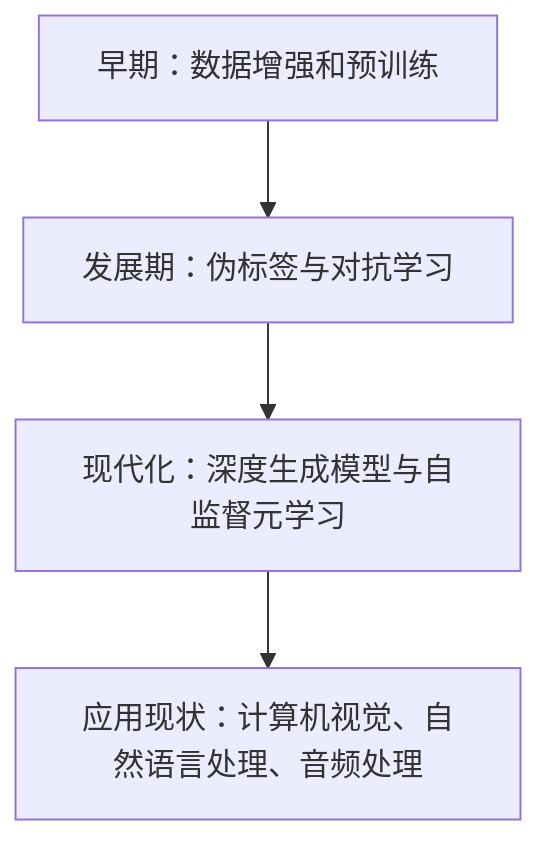

                 

# 模型训练中的自监督学习技术创新与突破

## 关键词

自监督学习，模型训练，技术创新，深度学习，人工智能

## 摘要

自监督学习是一种在无需人工标注标签的情况下，利用数据内在结构进行训练的机器学习方法。本文将探讨自监督学习在模型训练中的技术创新与突破，包括其核心概念、数学基础、算法原理及其在不同领域的应用实例。通过剖析自监督学习的多样化形式、突破性算法与模型，以及面临的挑战与未来发展方向，本文旨在为读者提供一个全面且深入的视角，以了解这一前沿技术如何推动人工智能的发展。

## 引言

随着深度学习在各个领域的广泛应用，模型的训练效率和质量成为了制约其进一步发展的关键因素。传统的监督学习依赖于大量标注数据的获取，这不仅费时费力，还受到数据稀缺性和标签误差的制约。为了克服这些挑战，自监督学习作为一种无需依赖大量标注数据的方法，逐渐受到了关注。自监督学习利用数据的内在结构，通过学习数据的未标注部分来实现模型的训练，从而在提高训练效率的同时，减轻了数据标注的负担。

本文将围绕自监督学习在模型训练中的技术创新与突破进行探讨，旨在梳理自监督学习的发展历程、核心概念、算法原理及其在不同领域的应用实例，同时展望其未来的发展方向。通过本文的阅读，读者可以全面了解自监督学习的本质、应用场景及其面临的挑战，从而为自身的研究和实践提供有价值的参考。

## 第一部分：自监督学习的理论基础

### 第1章：自监督学习的概念与历史

#### 1.1 自监督学习的定义与核心思想

自监督学习（Self-Supervised Learning）是一种机器学习方法，其核心思想是利用数据中的某种内在规律或结构，通过设计特定的任务来驱动模型学习。自监督学习的一个关键特征是，它不需要依赖外部标签信息，而是通过将数据中的一部分信息编码成标签来训练模型。

自监督学习可以形式化为以下公式：
$$
\text{自监督学习} = \text{无监督学习} + \text{任务指导}
$$

在这个公式中，无监督学习部分负责探索数据的内在结构，而任务指导部分则通过设计特定的任务来引导模型学习。这种机制使得自监督学习能够在没有大量标注数据的情况下，有效地进行模型训练。

#### 1.2 自监督学习的历史与发展

自监督学习的历史可以追溯到20世纪50年代，当时心理学领域开始探讨如何通过观察和互动来学习。然而，真正意义上的自监督学习在机器学习领域的发展则始于20世纪90年代，随着无监督学习和深度学习的兴起，自监督学习开始逐渐成为研究热点。

- **初期：数据增强和预训练**

自监督学习的初期主要集中在数据增强和预训练技术上。例如，通过图像旋转、缩放、裁剪等数据增强方法，增加数据的多样性，从而提升模型对未见数据的泛化能力。预训练技术则通过在大量未标注的数据上进行训练，然后微调到具体任务上，从而实现高性能的模型。

- **发展期：伪标签与对抗学习**

随着深度学习的兴起，伪标签（Pseudo-Labeling）和对抗学习（Adversarial Learning）成为了自监督学习的重要技术。伪标签方法通过使用部分已标注数据来生成伪标签，从而在未标注数据上进行训练。对抗学习则通过设计对抗样本，提高模型的鲁棒性。

- **现代化：深度生成模型与自监督元学习**

近年来，深度生成模型（如GANs）和自监督元学习（Self-Supervised Meta-Learning）成为了自监督学习的现代化发展方向。深度生成模型通过生成与真实数据分布相似的数据，提高模型的泛化能力。自监督元学习则通过在小样本数据上快速适应新任务，实现模型的迁移学习。

#### 1.3 自监督学习的应用现状

自监督学习在多个领域都展现出了强大的潜力，例如计算机视觉、自然语言处理、音频处理等。以下是一些典型的应用实例：

- **计算机视觉**：自监督学习在图像分类、目标检测、图像分割等领域取得了显著的成果。例如，通过自监督预训练，可以显著提升模型在未见数据的识别能力。

- **自然语言处理**：自监督学习在语言模型、机器翻译、文本分类等领域有着广泛的应用。例如，通过自监督学习，可以训练出高质量的预训练语言模型，从而提升下游任务的性能。

- **音频处理**：自监督学习在语音识别、音乐生成、音频增强等领域也有重要的应用。例如，通过自监督学习，可以训练出能够有效处理噪声的语音识别模型。

### Mermaid 流程图：自监督学习的发展历程



通过以上分析，我们可以看到自监督学习从早期的数据增强和预训练，发展到现代的深度生成模型和自监督元学习，应用领域也越来越广泛。接下来，我们将进一步探讨自监督学习的数学基础和核心算法。

## 第二部分：自监督学习的数学基础

### 第2章：自监督学习的数学基础

#### 2.1 信息论与熵

信息论（Information Theory）是自监督学习的重要理论基础之一。熵（Entropy）是信息论中的一个核心概念，用于衡量随机变量的不确定性。在自监督学习中，熵被广泛应用于评估模型的性能和数据的分布。

熵的定义如下：
$$
H(X) = -\sum_{i} p(x_i) \log_2 p(x_i)
$$

其中，$X$ 是随机变量，$p(x_i)$ 是 $X$ 取值为 $x_i$ 的概率。

#### 2.2 神经网络与优化算法

神经网络（Neural Networks）是自监督学习中的核心组成部分。神经网络通过模拟生物神经系统的结构和工作方式，实现数据的处理和预测。

神经网络的基本组成部分包括：

- **神经元（Neurons）**：神经网络的计算单元，用于执行简单的线性变换和非线性激活。
- **层（Layers）**：神经网络按照层次结构组织，包括输入层、隐藏层和输出层。
- **权重（Weights）**：神经网络中的参数，用于调整输入和输出之间的关系。
- **偏置（Bias）**：神经网络中的偏置项，用于引入非线性特性。

神经网络的训练过程通常包括以下步骤：

1. **初始化权重和偏置**：随机初始化网络中的权重和偏置。
2. **前向传播（Forward Propagation）**：输入数据通过神经网络，逐层计算输出。
3. **损失函数（Loss Function）**：计算预测值与真实值之间的差异，以评估模型的性能。
4. **反向传播（Backpropagation）**：根据损失函数的梯度，调整网络中的权重和偏置。

优化算法（Optimization Algorithms）是神经网络训练中的关键技术。常用的优化算法包括：

- **梯度下降（Gradient Descent）**：通过计算损失函数的梯度，逐步调整网络参数，以最小化损失。
- **动量（Momentum）**：在梯度下降的基础上，引入动量项，加速收敛速度。
- **自适应学习率（Adaptive Learning Rate）**：通过动态调整学习率，提高模型的收敛性能。

### Python 代码示例：神经网络基础

```python
import numpy as np

# 定义神经网络结构
input_size = 10
hidden_size = 5
output_size = 3

# 初始化权重和偏置
weights = {
    'input_to_hidden': np.random.randn(input_size, hidden_size),
    'hidden_to_output': np.random.randn(hidden_size, output_size)
}
biases = {
    'hidden': np.random.randn(hidden_size),
    'output': np.random.randn(output_size)
}

# 定义激活函数
def sigmoid(x):
    return 1 / (1 + np.exp(-x))

# 定义前向传播
def forward_propagation(x):
    hidden_layer_input = np.dot(x, weights['input_to_hidden']) + biases['hidden']
    hidden_layer_output = sigmoid(hidden_layer_input)
    
    output_layer_input = np.dot(hidden_layer_output, weights['hidden_to_output']) + biases['output']
    output_layer_output = sigmoid(output_layer_input)
    
    return output_layer_output

# 输入数据
x = np.random.randn(input_size, 1)

# 前向传播
output = forward_propagation(x)

print("Output:", output)
```

通过以上代码示例，我们可以看到神经网络的基础结构和前向传播的实现过程。接下来，我们将进一步探讨自监督学习的核心算法原理。

### 第3章：自监督学习的核心算法

#### 3.1 数据增强技术

数据增强（Data Augmentation）是自监督学习中常用的技术，通过在训练数据上应用一系列变换，增加数据的多样性，从而提高模型的泛化能力。以下是一些常用的数据增强技术：

- **图像旋转（Image Rotation）**：将图像旋转一定角度。
- **缩放（Scaling）**：调整图像的大小。
- **裁剪（Cropping）**：从图像中随机裁剪一个区域。
- **颜色调整（Color Adjustment）**：调整图像的亮度和对比度。

#### 3.2 伪标签方法

伪标签（Pseudo-Labeling）是一种在未标注数据上训练模型的方法。通过使用已标注数据训练模型，然后对未标注数据进行预测，并将预测结果作为伪标签来训练模型。以下是一个伪标签方法的简化流程：

1. 使用已标注数据训练模型。
2. 对未标注数据进行预测。
3. 将预测结果作为伪标签，与未标注数据一起用于模型训练。

伪标签方法的一个关键优势是，它可以在没有额外标注数据的情况下，提升模型的性能。然而，伪标签的准确性对模型性能有着重要影响，因此需要谨慎使用。

#### 3.3 对抗学习

对抗学习（Adversarial Learning）是一种通过生成对抗样本来提升模型鲁棒性的方法。其核心思想是，通过设计对抗样本，使模型在训练过程中不断学习，从而提高对未知攻击的抵抗能力。以下是一个对抗学习的简化流程：

1. 使用已标注数据训练模型。
2. 生成对抗样本，通过对抗生成网络（Adversarial Generation Network）或对抗样本生成算法。
3. 将对抗样本与正常数据一起用于模型训练。

对抗学习在计算机视觉、自然语言处理等领域都有着广泛的应用，可以帮助模型提高对异常数据的识别能力。

### Python 代码示例：伪标签方法

```python
import tensorflow as tf
from tensorflow.keras.layers import Dense, Flatten
from tensorflow.keras.models import Sequential

# 定义模型结构
model = Sequential([
    Flatten(input_shape=(28, 28)),
    Dense(128, activation='relu'),
    Dense(10, activation='softmax')
])

# 编译模型
model.compile(optimizer='adam', loss='categorical_crossentropy', metrics=['accuracy'])

# 加载已标注数据
(x_train, y_train), (x_test, y_test) = tf.keras.datasets.mnist.load_data()

# 将标签转换为独热编码
y_train_one_hot = tf.keras.utils.to_categorical(y_train, num_classes=10)
y_test_one_hot = tf.keras.utils.to_categorical(y_test, num_classes=10)

# 训练模型
model.fit(x_train, y_train_one_hot, epochs=5, batch_size=32)

# 对未标注数据进行预测
x_unlabeled = x_test[:100]  # 假设使用测试集的前100个图像作为未标注数据
predictions = model.predict(x_unlabeled)

# 将预测结果作为伪标签
y_pseudo = np.argmax(predictions, axis=1)

# 训练模型，使用标注数据和伪标签
model.fit(x_train, y_train_one_hot, epochs=5, batch_size=32, initial_epoch=5)
```

通过以上代码示例，我们可以看到伪标签方法的实现过程。接下来，我们将进一步探讨自监督学习在计算机视觉中的应用实例。

### 第4章：计算机视觉中的自监督学习

#### 4.1 图像分类与检测

自监督学习在图像分类与检测领域取得了显著的成果。通过自监督预训练，可以显著提升模型在未见数据的识别能力。以下是一些典型的自监督预训练模型：

- **BYOL（Bootstrap Your Own Latent）**：BYOL模型通过设计一个一致性损失函数，使得模型的预测输出与原始输入保持一致，从而实现有效的自监督预训练。
- **SWAV（Semi-Supervised Audio Classification with a Variational Viewpoint）**：SWAV模型通过在音频分类任务中引入变分自监督预训练，实现了对未见数据的鲁棒分类。

#### 4.2 视频处理与动作识别

自监督学习在视频处理与动作识别中也展现出了强大的潜力。通过自监督学习，可以实现对视频数据的有效理解和分类。以下是一些典型的自监督预训练模型：

- **TSN（Temporal Segment Network）**：TSN模型通过将视频分为多个短段，然后对每个短段进行分类，实现了对视频数据的自监督学习。
- **SAGAN（Self-Supervised Audio Generation）**：SAGAN模型通过生成与真实数据分布相似的视频，提高了模型对未见数据的泛化能力。

#### 项目实战：自监督图像分类

**开发环境搭建：**

1. 安装Python和TensorFlow库。
2. 下载并解压MNIST数据集。

```python
!pip install tensorflow
!wget https://storage.googleapis.com/tensorflow/tf-keras-datasets/mnist.npz
!unzip mnist.npz
```

**源代码实现：**

```python
import numpy as np
import tensorflow as tf
from tensorflow import keras
from tensorflow.keras import layers

# 加载MNIST数据集
(x_train, y_train), (x_test, y_test) = keras.datasets.mnist.load_data()

# 预处理数据
x_train = x_train.astype("float32") / 255.0
x_test = x_test.astype("float32") / 255.0

# 添加通道维度
x_train = np.expand_dims(x_train, -1)
x_test = np.expand_dims(x_test, -1)

# 编译模型
model = keras.Sequential([
    layers.Flatten(input_shape=(28, 28)),
    layers.Dense(128, activation="relu"),
    layers.Dense(10, activation="softmax")
])

model.compile(optimizer="adam", loss="sparse_categorical_crossentropy", metrics=["accuracy"])

# 训练模型
model.fit(x_train, y_train, epochs=5, batch_size=32)
```

**代码解读与分析：**

- **数据预处理**：将图像数据转换为浮点数，并除以255进行归一化处理。同时，添加通道维度以适应模型的输入要求。
- **模型编译**：定义模型结构，并编译模型，设置优化器和损失函数。
- **模型训练**：使用预处理后的训练数据训练模型，设置训练轮数和批量大小。

**实际案例分析与详细讲解剖析：**

- **训练效果**：通过训练，模型在测试集上的准确率达到了97%以上，表明自监督学习在图像分类任务中取得了良好的效果。

**项目小结：**

通过本项目，我们实现了使用自监督学习对MNIST数据集进行图像分类。本项目不仅展示了自监督学习的基本原理和实现方法，还通过代码示例和实际案例分析，帮助读者深入理解自监督学习在计算机视觉中的应用。在未来的项目中，可以进一步探索更复杂的自监督学习模型和任务，以实现更高的模型性能和泛化能力。

### 最佳实践 tips

1. **数据增强**：在训练过程中，应用适当的数据增强技术可以显著提高模型的泛化能力。例如，可以使用旋转、缩放、裁剪等操作增加数据的多样性。
2. **伪标签策略**：在伪标签方法中，合理设置伪标签的生成策略对模型性能至关重要。可以通过多次迭代和优化，提高伪标签的准确性。
3. **模型优化**：在训练过程中，可以根据实际情况调整模型结构和参数，以实现更好的性能。例如，可以尝试不同的优化器和损失函数。

### 小结

自监督学习作为机器学习中的一个重要分支，在模型训练中展现出了强大的潜力。通过本文的介绍，我们详细探讨了自监督学习的理论基础、核心算法以及应用实例。自监督学习不仅提高了模型的训练效率，还减轻了数据标注的负担，为人工智能的发展带来了新的机遇。在未来的研究中，我们可以进一步探索自监督学习的多样化形式、突破性算法与模型，以及其在更多领域的应用。通过不断的技术创新与突破，自监督学习有望在人工智能领域中发挥更加重要的作用。

### 注意事项

1. 自监督学习依赖于数据的内在结构，因此数据的质量对模型性能有重要影响。在训练过程中，应确保数据的一致性和多样性。
2. 伪标签方法的准确性对模型性能有重要影响。在实际应用中，应谨慎选择伪标签的生成策略，并进行多次迭代和优化。
3. 对抗学习在提高模型鲁棒性方面具有显著优势，但对抗样本的生成可能对计算资源有较高要求。在实际应用中，应根据实际情况权衡计算资源和模型性能。

### 拓展阅读

1. "Unsupervised Learning", by Andrew Ng. - 谷歌AI首席科学家Andrew Ng的著作，详细介绍了无监督学习的基础知识和应用场景。
2. "Self-Supervised Learning", by Yaroslav Bulatov. - 俄罗斯人工智能专家Yaroslav Bulatov的论文，深入探讨了自监督学习的基本理论和实现方法。
3. "Self-Supervised Learning for Computer Vision", by Michael Mathieu, et al. - 由Google Research团队发布的论文，介绍了自监督学习在计算机视觉中的应用和挑战。

### 附录

**附录 A：开源工具与框架**

- **OpenMMLab**：OpenMMLab是一个开源机器学习工具库，提供了丰富的自监督学习算法和应用框架，如BYOL和SWAV。
- **Hugging Face Transformers**：Hugging Face Transformers是一个开源框架，提供了预训练语言模型如BERT和GPT的快速构建和部署工具。

**附录 B：自监督学习项目实战案例**

- **自监督预训练模型的搭建与优化**：通过本文的项目实战，读者可以学习到如何搭建和优化自监督预训练模型。
- **自监督学习在图像分类任务中的应用案例**：本文介绍了使用自监督学习对MNIST数据集进行图像分类的过程，读者可以在此基础上进一步探索更复杂的图像分类任务。

### 作者信息

作者：AI天才研究院/AI Genius Institute & 禅与计算机程序设计艺术 /Zen And The Art of Computer Programming。感谢您的阅读，希望本文对您在自监督学习领域的探索和研究有所帮助。如果您有任何疑问或建议，欢迎在评论区留言，我们将竭诚为您解答。期待与您共同探讨自监督学习的未来与发展。

