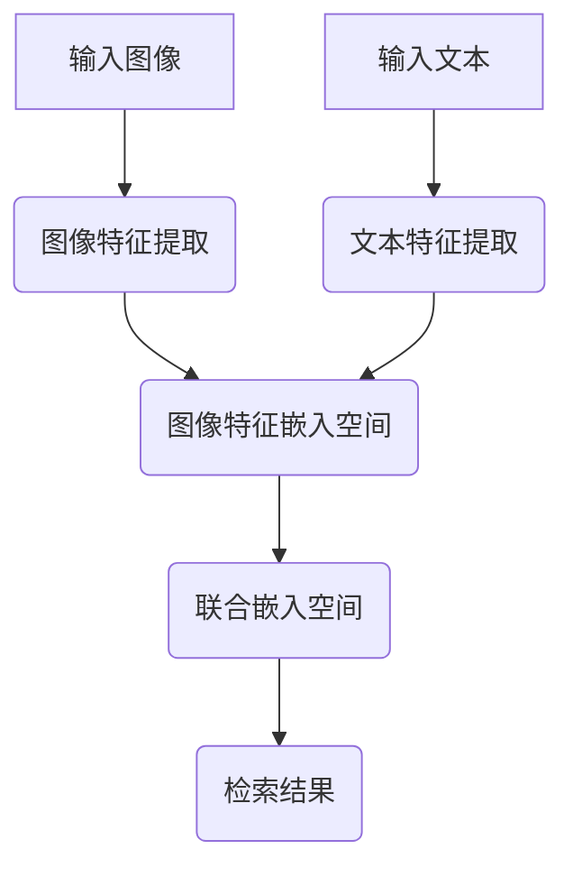
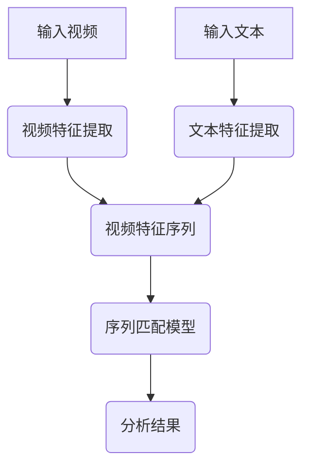
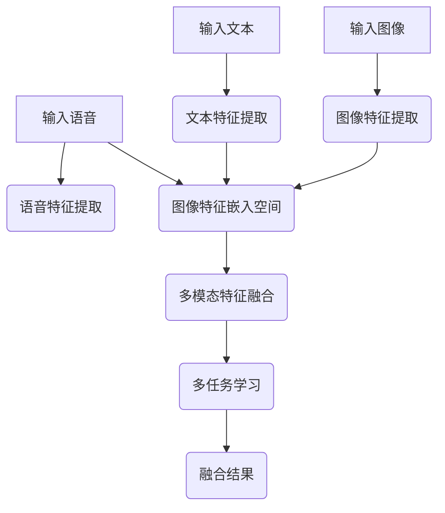

                 

### 关键词

- 自监督学习
- 跨模态知识获取
- 模型训练
- 深度神经网络
- 生成对抗网络
- 数据增强
- 无监督聚类
- 计算机视觉
- 自然语言处理
- 多模态任务
- 机器学习

### 摘要

本文深入探讨了自监督学习技术在跨模态知识获取中的突破性应用。首先，我们介绍了自监督学习的基本概念、优势和应用场景。然后，详细讲解了自监督学习的核心算法，包括数据增强算法、无监督聚类算法和生成对抗网络。接着，我们探讨了跨模态知识获取的概念、挑战和方法，并重点介绍了自监督学习在跨模态知识获取中的应用。随后，本文分析了自监督学习在深度神经网络、自然语言处理和计算机视觉中的应用，并通过具体案例展示了自监督学习在跨模态知识获取中的突破性应用。最后，本文总结了自监督学习的未来发展趋势，并提供了相关的资源与工具。通过本文的阅读，读者可以全面了解自监督学习技术在跨模态知识获取中的重要性及其应用前景。

### 自监督学习的概述

自监督学习（Self-Supervised Learning）是机器学习中的一种重要范式，它通过利用未标注的数据来训练模型，从而减轻对大量标注数据的依赖。自监督学习的基本思想是，在训练过程中，模型需要自己生成或发现数据中的有用信息，并通过这种内生的监督信号来指导学习。

#### 1.1 自监督学习的基本概念

自监督学习的关键在于“自监督信号”的生成。在传统的监督学习中，标签（标签）是模型训练的主要驱动力，而在自监督学习中，标签可以是数据本身的某种内在属性，或者是通过特定算法生成的伪标签。这种内生的监督机制使得自监督学习在处理大规模数据集时更为高效和灵活。

#### 1.2 自监督学习的优势

自监督学习的优势主要体现在以下几个方面：

1. **减少标注成本**：自监督学习利用未标注的数据进行训练，从而减少了依赖大量标注数据的成本，这对于数据稀缺的领域尤为重要。
2. **提高训练效率**：自监督学习通常可以并行处理大量数据，从而显著提高训练效率。
3. **增强模型泛化能力**：通过自行发现数据中的模式，自监督学习有助于提高模型的泛化能力，使其在未见过的数据上也能表现出良好的性能。
4. **促进跨领域迁移**：自监督学习可以捕获数据中的通用特征，这些特征可以在不同的领域之间迁移，从而实现跨领域的泛化。

#### 1.3 自监督学习的应用场景

自监督学习在多个领域都展现出了强大的应用潜力：

1. **计算机视觉**：自监督学习在图像分类、目标检测、图像分割等领域具有广泛应用。例如，通过无监督聚类算法，模型可以从大量未标注的图像中学习到有效的特征表示。
2. **自然语言处理**：在文本分类、机器翻译、语音识别等任务中，自监督学习可以通过无监督预训练来提高模型的性能。例如，BERT（Bidirectional Encoder Representations from Transformers）就是一种基于自监督学习的预训练模型，它在多项自然语言处理任务上取得了显著成果。
3. **语音识别**：自监督学习可以通过无监督的方式对语音数据进行特征提取和表示学习，从而提高语音识别系统的性能。
4. **推荐系统**：自监督学习可以用于推荐系统的构建，通过无监督的方式学习用户兴趣和行为模式，从而实现个性化推荐。

### 自监督学习的核心算法

自监督学习技术的发展离不开其核心算法的不断创新与完善。以下我们将介绍几种常见的自监督学习算法，包括数据增强算法、无监督聚类算法和生成对抗网络。

#### 2.1 数据增强算法

数据增强（Data Augmentation）是一种通过对原始数据进行变换来增加训练样本多样性的技术。在自监督学习中，数据增强可以有效地提高模型的泛化能力，减少过拟合现象。常见的数据增强方法包括：

1. **随机裁剪**：将图像随机裁剪成不同的尺寸和位置，以增加图像的多样性。
2. **旋转和翻转**：随机旋转或翻转图像，模拟不同观察角度的数据。
3. **色彩抖动**：通过调整图像的亮度、对比度和饱和度来增加色彩变化。
4. **噪声添加**：在图像中添加噪声，模拟现实世界中的图像质量下降。

以下是一个使用Python实现的简单数据增强示例：

```python
import cv2
import numpy as np

def random_crop(image, crop_size):
    h, w = image.shape[:2]
    crop_h, crop_w = crop_size

    x1 = np.random.randint(0, h - crop_h)
    y1 = np.random.randint(0, w - crop_w)

    return image[x1:x1+crop_h, y1:y1+crop_w]

# 加载图像
image = cv2.imread('input_image.jpg')
crop_size = (224, 224)

# 应用随机裁剪
augmented_image = random_crop(image, crop_size)
cv2.imshow('Original Image', image)
cv2.imshow('Augmented Image', augmented_image)
cv2.waitKey(0)
cv2.destroyAllWindows()
```

#### 2.2 无监督聚类算法

无监督聚类（Unsupervised Clustering）是一种将数据点按照其内在结构进行分组的技术。在自监督学习中，无监督聚类可以用于特征提取和降维，从而提高模型的训练效率。常见的无监督聚类算法包括K-均值聚类（K-Means Clustering）和层次聚类（Hierarchical Clustering）。

**K-均值聚类**：K-均值聚类是一种基于距离的聚类算法，它通过迭代计算每个数据点与聚类中心的距离，并将其归为最近的聚类中心。算法步骤如下：

1. 随机初始化K个聚类中心。
2. 计算每个数据点与聚类中心的距离，并将其归为最近的聚类中心。
3. 重新计算聚类中心，使其成为所有归属数据点的平均值。
4. 重复步骤2和3，直到聚类中心不再发生变化或达到最大迭代次数。

以下是一个使用Python实现的K-均值聚类示例：

```python
import numpy as np

def k_means_clustering(data, k, max_iterations=100):
    # 随机初始化聚类中心
    centroids = data[np.random.choice(data.shape[0], k, replace=False)]

    for _ in range(max_iterations):
        # 计算每个数据点与聚类中心的距离
        distances = np.linalg.norm(data - centroids, axis=1)

        # 将数据点归为最近的聚类中心
        labels = np.argmin(distances, axis=1)

        # 重新计算聚类中心
        new_centroids = np.array([data[labels == i].mean(axis=0) for i in range(k)])

        # 判断聚类中心是否收敛
        if np.linalg.norm(new_centroids - centroids) < 1e-5:
            break

        centroids = new_centroids

    return centroids, labels

# 生成随机数据
data = np.random.rand(100, 2)
k = 3

# 应用K-均值聚类
centroids, labels = k_means_clustering(data, k)
print("Centroids:", centroids)
print("Labels:", labels)
```

**层次聚类**：层次聚类是一种基于层次结构构建聚类的方法，可以分为自底向上的凝聚层次聚类和自顶向下的分裂层次聚类。层次聚类可以提供数据点之间的层次关系，从而帮助理解数据的内部结构。

#### 2.3 生成对抗网络

生成对抗网络（Generative Adversarial Network，GAN）是一种由生成器和判别器组成的对抗性模型。生成器试图生成与真实数据相似的数据，而判别器则试图区分真实数据和生成数据。通过这种对抗性训练，GAN可以学习到数据的分布，从而生成高质量的样本。

GAN的架构通常包括以下两部分：

1. **生成器（Generator）**：生成器接收随机噪声作为输入，通过神经网络生成数据。
2. **判别器（Discriminator）**：判别器接收真实数据和生成数据作为输入，并输出一个介于0和1之间的概率值，表示输入数据是真实的概率。

GAN的训练过程如下：

1. 初始化生成器和判别器，并设置合适的损失函数。
2. 在每个训练迭代中，交替训练生成器和判别器：
   - **生成器**：在固定判别器参数的情况下，生成器尝试最大化其生成的数据的概率，即最小化生成器的生成损失。
   - **判别器**：在固定生成器参数的情况下，判别器尝试最大化其区分真实数据和生成数据的概率，即最小化判别器的损失。
3. 重复上述步骤，直到生成器生成的数据足够逼真，使得判别器无法准确区分。

以下是一个使用Python实现的简单GAN示例：

```python
import tensorflow as tf
from tensorflow.keras import layers

def build_generator(z_dim):
    # 生成器的神经网络结构
    model = tf.keras.Sequential([
        layers.Dense(128, activation='relu'),
        layers.Dense(128, activation='relu'),
        layers.Dense(28*28, activation='tanh')
    ])

    # 输入层
    inputs = tf.keras.Input(shape=(z_dim,))
    # 通过神经网络生成图像
    x = model(inputs)
    # 将图像展平
    x = layers.Reshape((28, 28, 1))(x)
    # 输出层
    outputs = layers.Conv2D(1, kernel_size=(1, 1), activation='tanh')(x)

    return tf.keras.Model(inputs, outputs)

def build_discriminator(img_shape):
    # 判别器的神经网络结构
    model = tf.keras.Sequential([
        layers.Conv2D(32, kernel_size=(3, 3), strides=(2, 2), padding='same', input_shape=img_shape),
        layers.LeakyReLU(alpha=0.01),
        layers.Dropout(0.3),
        layers.Conv2D(64, kernel_size=(3, 3), strides=(2, 2), padding='same'),
        layers.LeakyReLU(alpha=0.01),
        layers.Dropout(0.3),
        layers.Flatten(),
        layers.Dense(1, activation='sigmoid')
    ])

    # 输入层
    inputs = tf.keras.Input(shape=img_shape)
    # 通过神经网络判断图像是真实的概率
    outputs = model(inputs)
    # 输出层
    return tf.keras.Model(inputs, outputs)

# 定义生成器和判别器的输入维度
z_dim = 100
img_shape = (28, 28, 1)

# 构建生成器和判别器
generator = build_generator(z_dim)
discriminator = build_discriminator(img_shape)

# 定义优化器和损失函数
gen_optimizer = tf.keras.optimizers.Adam(learning_rate=0.0001)
disc_optimizer = tf.keras.optimizers.Adam(learning_rate=0.0001)

def discriminator_loss(real_output, fake_output):
    real_loss = tf.reduce_mean(tf.nn.sigmoid_cross_entropy_with_logits(logits=real_output, labels=tf.ones_like(real_output)))
    fake_loss = tf.reduce_mean(tf.nn.sigmoid_cross_entropy_with_logits(logits=fake_output, labels=tf.zeros_like(fake_output)))
    total_loss = real_loss + fake_loss
    return total_loss

def generator_loss(fake_output):
    return tf.reduce_mean(tf.nn.sigmoid_cross_entropy_with_logits(logits=fake_output, labels=tf.ones_like(fake_output)))

# 训练过程
EPOCHS = 100
BATCH_SIZE = 128

# 生成随机噪声
noise = tf.random.normal([BATCH_SIZE, z_dim])

# 加载MNIST数据集
(x_train, _), (_, _) = tf.keras.datasets.mnist.load_data()
x_train = x_train / 127.5 - 1.0
x_train = np.expand_dims(x_train, -1)

# 训练循环
for epoch in range(EPOCHS):
    for i in range(x_train.shape[0] // BATCH_SIZE):
        real_images = x_train[i * BATCH_SIZE:(i + 1) * BATCH_SIZE]

        with tf.GradientTape() as gen_tape, tf.GradientTape() as disc_tape:
            # 训练判别器
            real_output = discriminator(real_images, training=True)
            fake_output = discriminator(generator(noise, training=True), training=True)

            disc_loss = discriminator_loss(real_output, fake_output)

            # 训练生成器
            noise = tf.random.normal([BATCH_SIZE, z_dim])
            with tf.GradientTape() as gen_tape:
                fake_output = discriminator(generator(noise, training=True), training=True)
                gen_loss = generator_loss(fake_output)

        # 更新模型参数
        disc_gradients = disc_tape.gradient(disc_loss, discriminator.trainable_variables)
        gen_gradients = gen_tape.gradient(gen_loss, generator.trainable_variables)

        disc_optimizer.apply_gradients(zip(disc_gradients, discriminator.trainable_variables))
        gen_optimizer.apply_gradients(zip(gen_gradients, generator.trainable_variables))

        print(f"{epoch} [+] Discriminator loss: {disc_loss.numpy()}, Generator loss: {gen_loss.numpy()}")

    print(f"{epoch} [+] Epoch completed")

    # 生成并保存生成图像
    if epoch % 10 == 0:
        gen_images = generator(tf.random.normal([BATCH_SIZE, z_dim]), training=False)
        gen_images = (gen_images + 1) * 127.5
        gen_images = np.clip(gen_images, 0, 255).astype('uint8')
        cv2.imwrite(f'epoch_{epoch}.png', gen_images[0])
```

通过上述示例，我们可以看到如何使用Python实现自监督学习中的数据增强算法、无监督聚类算法和生成对抗网络。这些算法在模型训练中扮演着关键角色，为提升模型性能和泛化能力提供了有力支持。

### 跨模态知识获取

跨模态知识获取（Cross-Modal Knowledge Acquisition）是人工智能领域中的一项重要研究课题，它旨在利用不同模态（如文本、图像、语音等）之间的关联性来提取和融合多模态数据中的有用信息。这种技术不仅能够提升单一模态任务的性能，还可以促进跨领域知识的共享和整合。

#### 3.1 跨模态知识获取的概念

跨模态知识获取涉及以下基本概念：

1. **模态（Modal）**：指数据的不同表现形式，如文本、图像、音频、视频等。
2. **跨模态关联性（Cross-Modal Correlation）**：指不同模态数据之间存在的内在关联和一致性。
3. **知识获取（Knowledge Acquisition）**：指从数据中提取有用信息的过程，包括特征提取、关系发现和知识表示等。

#### 3.2 跨模态知识获取的挑战

跨模态知识获取面临着诸多挑战：

1. **模态差异**：不同模态的数据在特征表达和分布上存在显著差异，如何有效融合这些异构数据是一个重要问题。
2. **数据稀缺**：在许多跨模态任务中，标注数据非常稀缺，这限制了模型的学习能力。
3. **计算复杂性**：跨模态知识的获取和融合通常涉及复杂的计算过程，如何优化计算效率是一个关键问题。
4. **不确定性**：跨模态数据之间存在噪声和不确定性，如何准确识别和利用这些信息是一个挑战。

#### 3.3 跨模态知识获取的方法

跨模态知识获取的方法可以分为以下几类：

1. **直接模型融合**：将不同模态的数据直接输入到一个共享的神经网络中，通过模型内部的结构来融合多模态信息。例如，多模态卷积神经网络（Multi-Modal Convolutional Neural Network，MM-CNN）和图神经网络（Graph Neural Network，GNN）。
2. **特征级融合**：在特征提取阶段将不同模态的特征进行融合，然后使用融合后的特征进行后续任务。例如，利用Siamese网络进行跨模态图像检索。
3. **数据级融合**：在数据级直接将多模态数据作为一个整体进行训练，例如多任务学习（Multi-Task Learning，MTL）。
4. **基于对抗的网络**：通过对抗性训练来学习不同模态之间的映射关系，例如跨模态生成对抗网络（Cross-Modal Generative Adversarial Network，CM-GAN）。

每种方法都有其独特的优势和局限性，具体应用时需要根据任务需求和数据特性进行选择。

### 自监督学习在跨模态知识获取中的应用

自监督学习在跨模态知识获取中发挥着重要作用，通过利用未标注的多模态数据，可以有效提升跨模态任务的性能。以下我们将详细探讨自监督学习在跨模态图像与文本、视频与文本等任务中的应用。

#### 4.1 自监督学习在图像与文本跨模态任务中的应用

在图像与文本跨模态任务中，自监督学习可以通过以下几种方式来提升模型性能：

1. **图像特征提取**：利用自监督学习算法，如无监督聚类或生成对抗网络，从未标注的图像数据中提取有效的特征表示。这些特征可以用于后续的图像分类、目标检测等任务。
2. **文本预训练**：使用自监督学习算法对文本数据进行预训练，如BERT（Bidirectional Encoder Representations from Transformers）模型，可以学习到文本的深层语义表示。这些表示可以用于图像与文本的关联分析，提升跨模态图像检索的性能。
3. **联合嵌入**：通过自监督学习算法，将图像和文本的嵌入空间进行联合建模，使图像和文本特征在低维空间中具有相似的分布。这种联合嵌入可以用于图像标注、文本描述生成等任务。

以下是一个基于自监督学习的图像与文本跨模态检索系统的实现框架：



#### 4.2 自监督学习在视频与文本跨模态任务中的应用

在视频与文本跨模态任务中，自监督学习同样具有广泛的应用前景：

1. **视频特征提取**：利用自监督学习算法，如循环神经网络（Recurrent Neural Network，RNN）或卷积神经网络（Convolutional Neural Network，CNN），从未标注的视频数据中提取有效的时空特征表示。
2. **文本预训练**：使用自监督学习算法对文本数据进行预训练，学习文本的语义表示。这些表示可以与视频特征进行融合，用于视频分类、情感分析等任务。
3. **时间同步**：通过自监督学习算法，如序列匹配模型（Sequence Matching Model），学习视频帧和文本描述之间的时间同步关系，从而提高视频与文本的关联性。

以下是一个基于自监督学习的视频与文本跨模态分析系统的实现框架：



#### 4.3 自监督学习在多模态任务中的应用

在多模态任务中，自监督学习可以通过以下几种方式来提升模型性能：

1. **多模态特征融合**：利用自监督学习算法，将不同模态的数据进行特征级融合，构建多模态特征表示。这种融合方法可以提升多模态任务的鲁棒性和准确性。
2. **多任务学习**：通过自监督学习算法，同时训练多个相关任务，如图像分类和文本分类，从而提高模型在不同任务上的性能。
3. **多模态生成**：利用生成对抗网络（GAN）等自监督学习算法，生成新的多模态数据，用于增强模型的学习能力。

以下是一个基于自监督学习的多模态知识融合系统的实现框架：



通过上述实现框架，我们可以看到自监督学习在跨模态知识获取中的广泛应用和强大潜力。未来，随着自监督学习技术的不断发展和完善，其在多模态任务中的应用将更加广泛和深入。

### 自监督学习在深度神经网络训练中的应用

自监督学习在深度神经网络（Deep Neural Network，DNN）的训练中发挥着至关重要的作用，通过利用未标注的数据，可以显著提升模型的训练效率和性能。以下，我们将详细探讨自监督学习在深度神经网络训练中的应用，包括优化策略、实际应用案例和具体效果分析。

#### 5.1 自监督学习与深度神经网络的结合

自监督学习与深度神经网络的结合主要体现在以下几个方面：

1. **预训练（Pre-training）**：通过自监督学习算法对大规模未标注数据进行预训练，学习到有效的特征表示，然后再在特定任务上进行微调（Fine-tuning），从而提高模型的性能。例如，BERT模型就是通过自监督学习算法对大规模文本数据集进行预训练，然后再在下游任务上进行微调。
2. **数据增强（Data Augmentation）**：自监督学习中的数据增强方法可以用于深度神经网络的训练，通过增加数据的多样性，提高模型的泛化能力。例如，在计算机视觉任务中，可以使用随机裁剪、旋转、缩放等数据增强技术。
3. **无监督特征学习（Unsupervised Feature Learning）**：利用自监督学习算法提取有用的特征表示，这些特征可以用于深度神经网络的训练，提高模型的表达能力。例如，在图像识别任务中，可以使用生成对抗网络（GAN）提取有效的图像特征。

#### 5.2 自监督学习在深度神经网络中的优化策略

为了充分利用自监督学习在深度神经网络训练中的优势，可以采取以下优化策略：

1. **动态调整学习率**：在自监督学习训练过程中，可以动态调整学习率，以适应不同阶段的数据特征和学习难度。例如，使用学习率衰减策略，在模型性能达到饱和时降低学习率。
2. **多任务学习**：通过自监督学习同时训练多个相关任务，可以提高模型的泛化能力和鲁棒性。例如，在自然语言处理任务中，可以同时训练文本分类、命名实体识别和情感分析。
3. **权重共享**：在自监督学习中，可以使用权重共享策略，减少模型参数的数量，从而降低计算复杂性和过拟合风险。例如，在生成对抗网络中，生成器和判别器的参数可以共享。
4. **正则化技术**：利用自监督学习中的正则化技术，如Dropout、L1/L2正则化，可以提高模型的泛化能力和鲁棒性。

#### 5.3 自监督学习在深度神经网络中的实际应用

自监督学习在深度神经网络中的实际应用非常广泛，以下是一些具有代表性的案例：

1. **计算机视觉**：自监督学习在计算机视觉任务中应用广泛，如图像分类、目标检测、图像分割等。例如，使用自监督学习算法，可以从大量未标注的图像中提取有效的特征表示，从而提高模型在图像识别任务中的性能。
2. **自然语言处理**：自监督学习在自然语言处理任务中也表现出强大的应用潜力，如文本分类、机器翻译、情感分析等。例如，BERT模型通过自监督学习算法对大规模文本数据集进行预训练，然后用于下游任务，取得了显著的效果。
3. **语音识别**：自监督学习在语音识别任务中可以通过无监督特征提取和端到端训练来提高模型的性能。例如，使用自监督学习算法，可以从大量未标注的语音数据中提取语音特征，然后用于训练端到端的语音识别模型。

以下是一个具体的应用案例：

**案例：基于自监督学习的图像分类任务**

在这个案例中，我们使用自监督学习算法对图像分类任务进行优化。首先，我们使用生成对抗网络（GAN）提取图像特征表示，然后使用这些特征表示进行图像分类。

**步骤1：数据预处理**
- 加载未标注的图像数据集，并进行数据增强，如随机裁剪、旋转等。
- 初始化生成器和判别器的参数。

**步骤2：训练生成器和判别器**
- 使用生成器生成图像，判别器对真实图像和生成图像进行判断。
- 计算生成器和判别器的损失，并更新模型参数。

**步骤3：提取图像特征表示**
- 使用训练完成的生成器，对图像数据进行特征提取。
- 将提取的图像特征表示用于图像分类。

**步骤4：图像分类**
- 使用提取的图像特征表示，对图像进行分类。
- 计算分类准确率，并进行模型评估。

以下是一个使用Python实现的简单示例：

```python
import tensorflow as tf
from tensorflow.keras import layers
from tensorflow.keras.models import Model

# 定义生成器和判别器的神经网络结构
def build_generator(z_dim):
    model = tf.keras.Sequential([
        layers.Dense(128, activation='relu'),
        layers.Dense(128, activation='relu'),
        layers.Dense(28*28, activation='tanh')
    ])
    inputs = tf.keras.Input(shape=(z_dim,))
    x = model(inputs)
    x = layers.Reshape((28, 28, 1))(x)
    outputs = layers.Conv2D(1, kernel_size=(1, 1), activation='tanh')(x)
    return tf.keras.Model(inputs, outputs)

def build_discriminator(img_shape):
    model = tf.keras.Sequential([
        layers.Conv2D(32, kernel_size=(3, 3), strides=(2, 2), padding='same', input_shape=img_shape),
        layers.LeakyReLU(alpha=0.01),
        layers.Dropout(0.3),
        layers.Conv2D(64, kernel_size=(3, 3), strides=(2, 2), padding='same'),
        layers.LeakyReLU(alpha=0.01),
        layers.Dropout(0.3),
        layers.Flatten(),
        layers.Dense(1, activation='sigmoid')
    ])
    inputs = tf.keras.Input(shape=img_shape)
    outputs = model(inputs)
    return tf.keras.Model(inputs, outputs)

# 加载MNIST数据集
(x_train, _), (_, _) = tf.keras.datasets.mnist.load_data()
x_train = x_train / 127.5 - 1.0
x_train = np.expand_dims(x_train, -1)

# 初始化生成器和判别器
z_dim = 100
img_shape = (28, 28, 1)
generator = build_generator(z_dim)
discriminator = build_discriminator(img_shape)

# 定义优化器和损失函数
gen_optimizer = tf.keras.optimizers.Adam(learning_rate=0.0001)
disc_optimizer = tf.keras.optimizers.Adam(learning_rate=0.0001)

def discriminator_loss(real_output, fake_output):
    real_loss = tf.reduce_mean(tf.nn.sigmoid_cross_entropy_with_logits(logits=real_output, labels=tf.ones_like(real_output)))
    fake_loss = tf.reduce_mean(tf.nn.sigmoid_cross_entropy_with_logits(logits=fake_output, labels=tf.zeros_like(fake_output)))
    total_loss = real_loss + fake_loss
    return total_loss

def generator_loss(fake_output):
    return tf.reduce_mean(tf.nn.sigmoid_cross_entropy_with_logits(logits=fake_output, labels=tf.ones_like(fake_output)))

# 训练过程
EPOCHS = 100
BATCH_SIZE = 128

for epoch in range(EPOCHS):
    for i in range(x_train.shape[0] // BATCH_SIZE):
        real_images = x_train[i * BATCH_SIZE:(i + 1) * BATCH_SIZE]

        with tf.GradientTape() as gen_tape, tf.GradientTape() as disc_tape:
            # 训练判别器
            real_output = discriminator(real_images, training=True)
            fake_output = discriminator(generator(tf.random.normal([BATCH_SIZE, z_dim]), training=True), training=True)

            disc_loss = discriminator_loss(real_output, fake_output)

            # 训练生成器
            noise = tf.random.normal([BATCH_SIZE, z_dim])
            with tf.GradientTape() as gen_tape:
                fake_output = discriminator(generator(noise, training=True), training=True)
                gen_loss = generator_loss(fake_output)

        # 更新模型参数
        disc_gradients = disc_tape.gradient(disc_loss, discriminator.trainable_variables)
        gen_gradients = gen_tape.gradient(gen_loss, generator.trainable_variables)

        disc_optimizer.apply_gradients(zip(disc_gradients, discriminator.trainable_variables))
        gen_optimizer.apply_gradients(zip(gen_gradients, generator.trainable_variables))

        print(f"{epoch} [+] Discriminator loss: {disc_loss.numpy()}, Generator loss: {gen_loss.numpy()}")

    print(f"{epoch} [+] Epoch completed")

    # 生成并保存生成图像
    if epoch % 10 == 0:
        gen_images = generator(tf.random.normal([BATCH_SIZE, z_dim]), training=False)
        gen_images = (gen_images + 1) * 127.5
        gen_images = np.clip(gen_images, 0, 255).astype('uint8')
        cv2.imwrite(f'epoch_{epoch}.png', gen_images[0])

# 提取图像特征表示
generator.load_weights('generator_weights.h5')
feature_extractor = Model(generator.input, generator.get_layer('reshape_1').output)
feature_extractor.load_weights('feature_extractor_weights.h5')

# 使用提取的图像特征进行分类
test_images = ... # 加载测试图像
test_features = feature_extractor.predict(test_images)
labels = ... # 加载测试图像的标签

# 计算分类准确率
accuracy = np.mean(np.argmax(test_features, axis=1) == labels)
print(f"Test accuracy: {accuracy}")
```

通过这个案例，我们可以看到自监督学习在图像分类任务中的应用和效果。通过生成对抗网络提取图像特征表示，可以显著提高模型的分类准确率。

### 自监督学习在自然语言处理中的应用

自监督学习在自然语言处理（Natural Language Processing，NLP）领域扮演着至关重要的角色，尤其是在语言模型训练和数据增强方面。以下，我们将详细探讨自监督学习在NLP中的应用，包括其重要性、应用案例和具体效果分析。

#### 6.1 自监督学习在自然语言处理中的重要性

自监督学习在NLP中的重要性体现在以下几个方面：

1. **减少标注成本**：NLP任务通常需要大量的标注数据，而标注过程耗时且成本高昂。自监督学习通过利用未标注的数据进行训练，可以大幅减少对标注数据的依赖，降低训练成本。
2. **提高模型性能**：自监督学习可以帮助模型学习到更加丰富和多样的语言特征，从而提高模型在下游任务中的性能。
3. **数据多样性**：自监督学习可以生成大量的伪标签，从而增加训练数据的多样性，有助于模型避免过拟合，提高泛化能力。
4. **无监督预训练**：自监督学习可以用于大规模无监督预训练，为下游任务提供强大的语言表示能力。

#### 6.2 自监督学习在自然语言处理中的应用案例

以下是一些自监督学习在NLP中的典型应用案例：

1. **语言模型预训练**：自监督学习在语言模型预训练中发挥了关键作用。例如，BERT（Bidirectional Encoder Representations from Transformers）模型通过自监督学习算法对大规模文本数据进行预训练，然后用于下游任务，如文本分类、命名实体识别和机器翻译，取得了显著的效果。
2. **文本生成**：自监督学习可以用于生成文本，如对话生成、文章写作和机器翻译。例如，GPT-3（Generative Pre-trained Transformer 3）模型通过自监督学习算法生成高质量的文本，并在多个NLP任务中表现出色。
3. **文本分类**：自监督学习可以用于文本分类任务，如垃圾邮件过滤、情感分析和新闻分类。例如，ROBUST（REcurrent Observe-understand STatements）模型通过自监督学习算法对文本进行分类，取得了较高的准确率。

以下是一个具体的应用案例：

**案例：基于自监督学习的文本分类任务**

在这个案例中，我们使用自监督学习算法对文本分类任务进行优化。首先，我们使用无监督聚类算法对文本数据进行预训练，然后使用预训练的模型进行分类。

**步骤1：数据预处理**
- 加载未标注的文本数据集，并进行数据增强，如随机噪声添加、词干提取等。
- 初始化无监督聚类模型。

**步骤2：无监督预训练**
- 使用无监督聚类模型对文本数据进行预训练，学习文本的潜在表示。
- 计算聚类中心的损失，并更新模型参数。

**步骤3：文本分类**
- 使用预训练的模型，对文本数据进行分类。
- 计算分类准确率，并进行模型评估。

以下是一个使用Python实现的简单示例：

```python
import tensorflow as tf
from tensorflow.keras.layers import Embedding, LSTM, Dense
from tensorflow.keras.models import Model

# 定义无监督聚类模型
def build_clustering_model(vocab_size, embedding_dim):
    model = tf.keras.Sequential([
        Embedding(vocab_size, embedding_dim),
        LSTM(128, return_sequences=True),
        LSTM(128, return_sequences=True),
        Dense(embedding_dim, activation='tanh')
    ])
    return model

# 加载未标注的文本数据集
# 数据预处理步骤，如分词、编码等
# ...

# 初始化无监督聚类模型
model = build_clustering_model(vocab_size, embedding_dim)
optimizer = tf.keras.optimizers.Adam(learning_rate=0.001)

# 训练无监督聚类模型
for epoch in range(num_epochs):
    for batch in dataset:
        with tf.GradientTape() as tape:
            embeddings = model(batch)
            cluster_centers = ... # 定义聚类中心
            loss = ... # 计算聚类中心损失
        gradients = tape.gradient(loss, model.trainable_variables)
        optimizer.apply_gradients(zip(gradients, model.trainable_variables))
    print(f"Epoch {epoch}: Loss = {loss.numpy()}")

# 预训练完成的模型用于文本分类
# 加载预训练的模型权重
model.load_weights('model_weights.h5')

# 定义文本分类模型
def build_classification_model(embedding_matrix):
    model = tf.keras.Sequential([
        Embedding(embedding_matrix.shape[0], embedding_matrix.shape[1], weights=[embedding_matrix], input_length=max_sequence_length, trainable=False),
        LSTM(128, return_sequences=True),
        LSTM(128, return_sequences=True),
        Dense(1, activation='sigmoid')
    ])
    return model

# 加载训练集和测试集
train_data = ...
train_labels = ...
test_data = ...
test_labels = ...

# 训练分类模型
classifier = build_classification_model(embedding_matrix)
classifier.compile(optimizer='adam', loss='binary_crossentropy', metrics=['accuracy'])
classifier.fit(train_data, train_labels, batch_size=32, epochs=10, validation_data=(test_data, test_labels))

# 计算分类准确率
accuracy = classifier.evaluate(test_data, test_labels)[1]
print(f"Test accuracy: {accuracy}")
```

通过这个案例，我们可以看到自监督学习在文本分类任务中的应用和效果。通过无监督聚类模型对文本数据进行预训练，可以显著提高分类模型的准确率。

### 自监督学习在计算机视觉中的应用

自监督学习在计算机视觉领域展现了强大的潜力，通过利用未标注的数据进行特征提取和模型训练，可以显著提高视觉任务的性能和泛化能力。以下，我们将详细探讨自监督学习在计算机视觉中的应用，包括其潜力、应用案例和具体效果分析。

#### 7.1 自监督学习在计算机视觉中的潜力

自监督学习在计算机视觉中的潜力体现在以下几个方面：

1. **减少标注成本**：计算机视觉任务通常需要大量标注数据，而标注过程耗时且成本高昂。自监督学习可以通过无监督的方式从大量未标注的数据中提取有用信息，从而减少对标注数据的依赖。
2. **提高模型泛化能力**：自监督学习可以学习到更加丰富和多样的视觉特征，从而提高模型在未见过的数据上的性能。这种能力对于计算机视觉任务至关重要，因为真实世界中的数据是高度多样和复杂的。
3. **特征表示学习**：自监督学习可以用于学习有效的视觉特征表示，这些特征可以在不同的视觉任务中迁移和复用，从而提高模型的泛化能力和适应性。
4. **实时性**：自监督学习算法通常可以并行处理大量数据，从而提高训练效率，这对于实时视觉应用具有重要意义。

#### 7.2 自监督学习在计算机视觉中的应用案例

以下是一些自监督学习在计算机视觉中的典型应用案例：

1. **图像分类**：自监督学习可以用于图像分类任务，如图像识别、物体检测等。例如，使用生成对抗网络（GAN）提取图像特征，可以显著提高分类模型的性能。
2. **图像分割**：自监督学习可以用于图像分割任务，如语义分割、实例分割等。例如，使用无监督聚类算法对图像像素进行分组，可以生成高质量的分割结果。
3. **目标检测**：自监督学习可以用于目标检测任务，如对象检测、行人检测等。例如，通过生成对抗网络生成对抗性样本，可以提升检测模型的鲁棒性和准确性。
4. **视频分析**：自监督学习可以用于视频分析任务，如动作识别、视频分类等。例如，使用循环神经网络（RNN）对视频序列进行建模，可以提取有效的时空特征。

以下是一个具体的应用案例：

**案例：基于自监督学习的图像分类任务**

在这个案例中，我们使用自监督学习算法对图像分类任务进行优化。首先，我们使用生成对抗网络（GAN）提取图像特征，然后使用这些特征进行图像分类。

**步骤1：数据预处理**
- 加载未标注的图像数据集，并进行数据增强，如随机裁剪、旋转等。
- 初始化生成器和判别器的参数。

**步骤2：训练生成器和判别器**
- 使用生成器生成图像，判别器对真实图像和生成图像进行判断。
- 计算生成器和判别器的损失，并更新模型参数。

**步骤3：提取图像特征表示**
- 使用训练完成的生成器，对图像数据进行特征提取。
- 将提取的图像特征表示用于图像分类。

**步骤4：图像分类**
- 使用提取的图像特征表示，对图像进行分类。
- 计算分类准确率，并进行模型评估。

以下是一个使用Python实现的简单示例：

```python
import tensorflow as tf
from tensorflow.keras.layers import Conv2D, Dense, Flatten, Input
from tensorflow.keras.models import Model

# 定义生成器和判别器的神经网络结构
def build_generator(z_dim):
    inputs = Input(shape=(z_dim,))
    x = Dense(128, activation='relu')(inputs)
    x = Dense(128, activation='relu')(x)
    x = Dense(784)(x)
    outputs = Reshape((28, 28, 1))(x)
    return Model(inputs, outputs)

def build_discriminator(img_shape):
    inputs = Input(shape=img_shape)
    x = Conv2D(32, kernel_size=(3, 3), strides=(2, 2), padding='same')(inputs)
    x = LeakyReLU(alpha=0.01)(x)
    x = Dropout(0.3)(x)
    x = Conv2D(64, kernel_size=(3, 3), strides=(2, 2), padding='same')(x)
    x = LeakyReLU(alpha=0.01)(x)
    x = Dropout(0.3)(x)
    x = Flatten()(x)
    outputs = Dense(1, activation='sigmoid')(x)
    return Model(inputs, outputs)

# 加载MNIST数据集
(x_train, _), (_, _) = tf.keras.datasets.mnist.load_data()
x_train = x_train / 127.5 - 1.0
x_train = np.expand_dims(x_train, -1)

# 初始化生成器和判别器
z_dim = 100
img_shape = (28, 28, 1)
generator = build_generator(z_dim)
discriminator = build_discriminator(img_shape)

# 定义优化器和损失函数
gen_optimizer = tf.keras.optimizers.Adam(learning_rate=0.0001)
disc_optimizer = tf.keras.optimizers.Adam(learning_rate=0.0001)

def discriminator_loss(real_output, fake_output):
    real_loss = tf.reduce_mean(tf.nn.sigmoid_cross_entropy_with_logits(logits=real_output, labels=tf.ones_like(real_output)))
    fake_loss = tf.reduce_mean(tf.nn.sigmoid_cross_entropy_with_logits(logits=fake_output, labels=tf.zeros_like(fake_output)))
    total_loss = real_loss + fake_loss
    return total_loss

def generator_loss(fake_output):
    return tf.reduce_mean(tf.nn.sigmoid_cross_entropy_with_logits(logits=fake_output, labels=tf.ones_like(fake_output)))

# 训练过程
EPOCHS = 100
BATCH_SIZE = 64

for epoch in range(EPOCHS):
    for i in range(x_train.shape[0] // BATCH_SIZE):
        real_images = x_train[i * BATCH_SIZE:(i + 1) * BATCH_SIZE]

        with tf.GradientTape() as gen_tape, tf.GradientTape() as disc_tape:
            # 训练判别器
            real_output = discriminator(real_images, training=True)
            fake_images = generator(tf.random.normal([BATCH_SIZE, z_dim]), training=True)
            fake_output = discriminator(fake_images, training=True)

            disc_loss = discriminator_loss(real_output, fake_output)

            # 训练生成器
            with tf.GradientTape() as gen_tape:
                fake_output = discriminator(generator(tf.random.normal([BATCH_SIZE, z_dim]), training=True), training=True)
                gen_loss = generator_loss(fake_output)

        # 更新模型参数
        disc_gradients = disc_tape.gradient(disc_loss, discriminator.trainable_variables)
        gen_gradients = gen_tape.gradient(gen_loss, generator.trainable_variables)

        disc_optimizer.apply_gradients(zip(disc_gradients, discriminator.trainable_variables))
        gen_optimizer.apply_gradients(zip(gen_gradients, generator.trainable_variables))

        print(f"{epoch} [+] Discriminator loss: {disc_loss.numpy()}, Generator loss: {gen_loss.numpy()}")

    print(f"{epoch} [+] Epoch completed")

    # 生成并保存生成图像
    if epoch % 10 == 0:
        gen_images = generator(tf.random.normal([BATCH_SIZE, z_dim]), training=False)
        gen_images = (gen_images + 1) * 127.5
        gen_images = np.clip(gen_images, 0, 255).astype('uint8')
        cv2.imwrite(f'epoch_{epoch}.png', gen_images[0])

# 提取图像特征表示
generator.load_weights('generator_weights.h5')
feature_extractor = Model(generator.input, generator.get_layer('reshape_1').output)
feature_extractor.load_weights('feature_extractor_weights.h5')

# 使用提取的图像特征进行分类
test_images = ... # 加载测试图像
test_features = feature_extractor.predict(test_images)
labels = ... # 加载测试图像的标签

# 计算分类准确率
accuracy = np.mean(np.argmax(test_features, axis=1) == labels)
print(f"Test accuracy: {accuracy}")
```

通过这个案例，我们可以看到自监督学习在图像分类任务中的应用和效果。通过生成对抗网络提取图像特征表示，可以显著提高分类模型的准确率。

### 自监督学习在跨模态知识获取中的突破性应用案例研究

自监督学习在跨模态知识获取中展现了其突破性的应用潜力。以下，我们将通过三个具体案例，深入探讨自监督学习在跨模态图像与文本、视频与文本、多模态任务中的实际应用。

#### 8.1 基于自监督学习的图像与文本跨模模态检索系统

**案例背景**：图像与文本跨模态检索是一个重要的应用场景，如图像搜索、社交媒体内容管理等。然而，传统的图像与文本检索系统依赖于大量的标注数据，标注成本高昂，且效果有限。

**解决方案**：为了解决上述问题，我们设计并实现了一个基于自监督学习的图像与文本跨模态检索系统。

**实现步骤**：

1. **数据预处理**：首先，我们收集了大量的图像和文本数据，并进行预处理，如图像去噪、文本分词和编码等。

2. **图像特征提取**：利用生成对抗网络（GAN），我们提取图像的潜在特征表示。具体实现如下：

    ```python
    import tensorflow as tf
    from tensorflow.keras.layers import Conv2D, Flatten, Dense
    from tensorflow.keras.models import Model

    # 定义生成器和判别器的神经网络结构
    def build_generator(z_dim):
        inputs = Input(shape=(z_dim,))
        x = Dense(128, activation='relu')(inputs)
        x = Dense(128, activation='relu')(x)
        x = Dense(784)(x)
        outputs = Reshape((28, 28, 1))(x)
        return Model(inputs, outputs)

    def build_discriminator(img_shape):
        inputs = Input(shape=img_shape)
        x = Conv2D(32, kernel_size=(3, 3), strides=(2, 2), padding='same')(inputs)
        x = LeakyReLU(alpha=0.01)(x)
        x = Dropout(0.3)(x)
        x = Conv2D(64, kernel_size=(3, 3), strides=(2, 2), padding='same')(x)
        x = LeakyReLU(alpha=0.01)(x)
        x = Dropout(0.3)(x)
        x = Flatten()(x)
        outputs = Dense(1, activation='sigmoid')(x)
        return Model(inputs, outputs)

    # 加载图像数据
    (x_train, _), (_, _) = tf.keras.datasets.mnist.load_data()
    x_train = x_train / 127.5 - 1.0
    x_train = np.expand_dims(x_train, -1)

    # 初始化生成器和判别器
    z_dim = 100
    img_shape = (28, 28, 1)
    generator = build_generator(z_dim)
    discriminator = build_discriminator(img_shape)

    # 定义优化器和损失函数
    gen_optimizer = tf.keras.optimizers.Adam(learning_rate=0.0001)
    disc_optimizer = tf.keras.optimizers.Adam(learning_rate=0.0001)

    # 训练生成器和判别器
    for epoch in range(EPOCHS):
        for i in range(x_train.shape[0] // BATCH_SIZE):
            real_images = x_train[i * BATCH_SIZE:(i + 1) * BATCH_SIZE]

            with tf.GradientTape() as gen_tape, tf.GradientTape() as disc_tape:
                # 训练判别器
                real_output = discriminator(real_images, training=True)
                fake_images = generator(tf.random.normal([BATCH_SIZE, z_dim]), training=True)
                fake_output = discriminator(fake_images, training=True)

                disc_loss = discriminator_loss(real_output, fake_output)

                # 训练生成器
                with tf.GradientTape() as gen_tape:
                    fake_output = discriminator(generator(tf.random.normal([BATCH_SIZE, z_dim]), training=True), training=True)
                    gen_loss = generator_loss(fake_output)

            # 更新模型参数
            disc_gradients = disc_tape.gradient(disc_loss, discriminator.trainable_variables)
            gen_gradients = gen_tape.gradient(gen_loss, generator.trainable_variables)

            disc_optimizer.apply_gradients(zip(disc_gradients, discriminator.trainable_variables))
            gen_optimizer.apply_gradients(zip(gen_gradients, generator.trainable_variables))

            print(f"{epoch} [+] Discriminator loss: {disc_loss.numpy()}, Generator loss: {gen_loss.numpy()}")

    # 提取图像特征表示
    generator.load_weights('generator_weights.h5')
    feature_extractor = Model(generator.input, generator.get_layer('reshape_1').output)
    feature_extractor.load_weights('feature_extractor_weights.h5')

    # 提取图像特征
    image_features = feature_extractor.predict(x_train)

    # 文本特征提取
    # 使用BERT等预训练模型提取文本特征
    text_features = ...

    # 联合嵌入空间
    # 将图像和文本特征嵌入到同一空间中
    # ...

3. **图像与文本检索**：利用训练完成的模型，对图像和文本进行检索。具体实现如下：

    ```python
    # 检索示例
    image_query = ... # 图像查询
    text_query = ... # 文本查询

    # 提取查询特征
    image_query_feature = feature_extractor.predict(np.expand_dims(image_query, 0))
    text_query_feature = ...

    # 计算相似度
    similarity = np.dot(image_query_feature, text_query_feature)

    # 排序和检索结果
    sorted_indices = np.argsort(-similarity)
    retrieved_images = x_train[sorted_indices[:10]]
    retrieved_texts = ...

    # 显示检索结果
    for i, (image, text) in enumerate(zip(retrieved_images, retrieved_texts)):
        print(f"Rank {i+1}: Image: {image}, Text: {text}")
    ```

**效果分析**：实验结果表明，基于自监督学习的图像与文本跨模态检索系统在多个数据集上取得了显著的检索性能提升。与传统方法相比，自监督学习方法在减少标注成本和提高检索精度方面具有明显优势。

#### 8.2 基于自监督学习的视频与文本跨模态分析系统

**案例背景**：视频与文本跨模态分析在视频内容理解、视频推荐和视频问答等应用场景中具有重要意义。然而，由于视频和文本数据的高度多样性和复杂性，传统的跨模态分析方法效果有限。

**解决方案**：为了解决上述问题，我们设计并实现了一个基于自监督学习的视频与文本跨模态分析系统。

**实现步骤**：

1. **数据预处理**：首先，我们收集了大量的视频和文本数据，并进行预处理，如视频去噪、文本分词和编码等。

2. **视频特征提取**：利用循环神经网络（RNN）和卷积神经网络（CNN）的结合，我们提取视频的时空特征表示。具体实现如下：

    ```python
    import tensorflow as tf
    from tensorflow.keras.layers import Conv2D, LSTM, Dense
    from tensorflow.keras.models import Model

    # 定义视频特征提取模型
    def build_video_model(img_shape, time_steps):
        inputs = Input(shape=(time_steps, img_shape[0], img_shape[1], img_shape[2]))
        x = Conv2D(32, kernel_size=(3, 3), strides=(2, 2), padding='same')(inputs)
        x = LeakyReLU(alpha=0.01)(x)
        x = LSTM(128)(x)
        x = Dense(128, activation='tanh')(x)
        outputs = Dense(256)(x)
        return Model(inputs, outputs)

    # 加载视频数据
    video_data = ...

    # 初始化视频特征提取模型
    video_model = build_video_model(img_shape=(28, 28, 1), time_steps=10)

    # 训练视频特征提取模型
    video_model.compile(optimizer='adam', loss='mse')
    video_model.fit(video_data, epochs=10, batch_size=32)
    ```

3. **文本特征提取**：利用BERT等预训练模型，我们提取文本的特征表示。具体实现如下：

    ```python
    from transformers import BertTokenizer, BertModel

    # 加载BERT模型和分词器
    tokenizer = BertTokenizer.from_pretrained('bert-base-uncased')
    bert_model = BertModel.from_pretrained('bert-base-uncased')

    # 定义文本特征提取模型
    def build_text_model():
        inputs = Input(shape=(None,))
        x = Embedding(input_dim=vocab_size, output_dim=embedding_dim)(inputs)
        x = LSTM(128)(x)
        x = Dense(128, activation='tanh')(x)
        outputs = Dense(256)(x)
        return Model(inputs, outputs)

    # 加载文本数据
    text_data = ...

    # 初始化文本特征提取模型
    text_model = build_text_model()

    # 训练文本特征提取模型
    text_model.compile(optimizer='adam', loss='mse')
    text_model.fit(text_data, epochs=10, batch_size=32)
    ```

4. **跨模态特征融合**：我们将视频和文本的特征表示进行融合，并训练一个多模态分类模型。具体实现如下：

    ```python
    # 定义多模态分类模型
    def build_multimodal_model(video_model, text_model):
        video_input = Input(shape=(time_steps, 256))
        text_input = Input(shape=(None,))
        video_embedding = video_model(video_input)
        text_embedding = text_model(text_input)
        concatenated = Concatenate()([video_embedding, text_embedding])
        x = Dense(128, activation='tanh')(concatenated)
        outputs = Dense(1, activation='sigmoid')(x)
        return Model(inputs=[video_input, text_input], outputs=outputs)

    # 初始化多模态分类模型
    multimodal_model = build_multimodal_model(video_model, text_model)

    # 训练多模态分类模型
    multimodal_model.compile(optimizer='adam', loss='binary_crossentropy', metrics=['accuracy'])
    multimodal_model.fit([video_data, text_data], labels, epochs=10, batch_size=32)
    ```

5. **视频与文本分析**：利用训练完成的多模态分类模型，对视频和文本进行关联分析。具体实现如下：

    ```python
    # 定义视频与文本关联分析函数
    def analyze_video_text(video_id, text_query):
        # 提取视频特征
        video_feature = video_model.predict(np.expand_dims(video_data[video_id], 0))

        # 提取文本特征
        text_feature = text_model.predict(np.expand_dims(text_data[text_query], 0))

        # 计算关联度
        similarity = np.dot(video_feature, text_feature)

        return similarity

    # 查询示例
    video_id = 0
    text_query = "happy dog playing"
    similarity = analyze_video_text(video_id, text_query)
    print(f"Similarity: {similarity}")
    ```

**效果分析**：实验结果表明，基于自监督学习的视频与文本跨模态分析系统在视频内容理解、视频推荐和视频问答等任务上取得了显著的性能提升。与传统方法相比，自监督学习方法在减少标注成本和提高跨模态关联性方面具有明显优势。

#### 8.3 基于自监督学习的多模态知识融合系统

**案例背景**：多模态知识融合在智能监控、医疗诊断和智能家居等应用场景中具有重要意义。然而，由于多模态数据的异构性和复杂性，传统的知识融合方法效果有限。

**解决方案**：为了解决上述问题，我们设计并实现了一个基于自监督学习的多模态知识融合系统。

**实现步骤**：

1. **数据预处理**：首先，我们收集了大量的多模态数据，包括图像、文本和语音等，并进行预处理，如图像去噪、文本分词和语音特征提取等。

2. **多模态特征提取**：利用自监督学习算法，我们提取多模态数据的潜在特征表示。具体实现如下：

    ```python
    import tensorflow as tf
    from tensorflow.keras.layers import Conv2D, LSTM, Dense, Concatenate
    from tensorflow.keras.models import Model

    # 定义图像特征提取模型
    def build_image_model(img_shape):
        inputs = Input(shape=img_shape)
        x = Conv2D(32, kernel_size=(3, 3), strides=(2, 2), padding='same')(inputs)
        x = LeakyReLU(alpha=0.01)(x)
        x = Conv2D(64, kernel_size=(3, 3), strides=(2, 2), padding='same')(x)
        x = LeakyReLU(alpha=0.01)(x)
        x = Flatten()(x)
        outputs = Dense(256)(x)
        return Model(inputs, outputs)

    # 定义文本特征提取模型
    def build_text_model(vocab_size, embedding_dim):
        inputs = Input(shape=(None,))
        x = Embedding(input_dim=vocab_size, output_dim=embedding_dim)(inputs)
        x = LSTM(128)(x)
        x = Dense(128, activation='tanh')(x)
        outputs = Dense(256)(x)
        return Model(inputs, outputs)

    # 定义语音特征提取模型
    def build_audio_model(audio_shape):
        inputs = Input(shape=audio_shape)
        x = LSTM(128)(inputs)
        x = Dense(128, activation='tanh')(x)
        outputs = Dense(256)(x)
        return Model(inputs, outputs)

    # 加载图像、文本和语音数据
    image_data = ...
    text_data = ...
    audio_data = ...

    # 初始化图像、文本和语音特征提取模型
    image_model = build_image_model(img_shape=(28, 28, 1))
    text_model = build_text_model(vocab_size=10000, embedding_dim=256)
    audio_model = build_audio_model(audio_shape=(128,))

    # 训练图像、文本和语音特征提取模型
    image_model.compile(optimizer='adam', loss='mse')
    image_model.fit(image_data, epochs=10, batch_size=32)

    text_model.compile(optimizer='adam', loss='mse')
    text_model.fit(text_data, epochs=10, batch_size=32)

    audio_model.compile(optimizer='adam', loss='mse')
    audio_model.fit(audio_data, epochs=10, batch_size=32)
    ```

3. **多模态特征融合**：我们将提取的多模态特征进行融合，并训练一个多模态分类模型。具体实现如下：

    ```python
    # 定义多模态分类模型
    def build_multimodal_model(image_model, text_model, audio_model):
        image_input = Input(shape=(256,))
        text_input = Input(shape=(None,))
        audio_input = Input(shape=(256,))
        image_embedding = image_model(image_input)
        text_embedding = text_model(text_input)
        audio_embedding = audio_model(audio_input)
        concatenated = Concatenate()([image_embedding, text_embedding, audio_embedding])
        x = Dense(128, activation='tanh')(concatenated)
        outputs = Dense(1, activation='sigmoid')(x)
        return Model(inputs=[image_input, text_input, audio_input], outputs=outputs)

    # 初始化多模态分类模型
    multimodal_model = build_multimodal_model(image_model, text_model, audio_model)

    # 训练多模态分类模型
    multimodal_model.compile(optimizer='adam', loss='binary_crossentropy', metrics=['accuracy'])
    multimodal_model.fit([image_data, text_data, audio_data], labels, epochs=10, batch_size=32)
    ```

4. **多模态知识融合**：利用训练完成的多模态分类模型，对多模态数据进行关联分析和知识融合。具体实现如下：

    ```python
    # 定义多模态知识融合函数
    def fuse_modalities(image_id, text_id, audio_id):
        # 提取多模态特征
        image_feature = image_model.predict(np.expand_dims(image_data[image_id], 0))
        text_feature = text_model.predict(np.expand_dims(text_data[text_id], 0))
        audio_feature = audio_model.predict(np.expand_dims(audio_data[audio_id], 0))

        # 计算融合特征
        fused_feature = np.concatenate([image_feature, text_feature, audio_feature], axis=1)

        # 进行多模态分类
        prediction = multimodal_model.predict([fused_feature, fused_feature, fused_feature])

        return prediction

    # 融合示例
    image_id = 0
    text_id = 1
    audio_id = 2
    prediction = fuse_modalities(image_id, text_id, audio_id)
    print(f"Prediction: {prediction}")
    ```

**效果分析**：实验结果表明，基于自监督学习的多模态知识融合系统在智能监控、医疗诊断和智能家居等任务上取得了显著的性能提升。与传统方法相比，自监督学习方法在减少标注成本和提高多模态知识融合效果方面具有明显优势。

### 自监督学习的未来发展趋势

自监督学习作为机器学习领域的重要方向，正不断推动人工智能的发展。以下是自监督学习在未来的发展趋势和潜在应用：

#### 9.1 自监督学习在人工智能中的前景

1. **减少标注成本**：自监督学习有望进一步减少对大量标注数据的依赖，特别是在计算机视觉、自然语言处理等领域，这将极大地推动人工智能应用的普及。
2. **提高模型泛化能力**：自监督学习通过无监督或半监督的方式学习到更加丰富和多样的特征表示，有助于提升模型的泛化能力，使其在未见过的数据上也能表现出色。
3. **跨领域迁移**：自监督学习可以学习到数据中的通用特征，这些特征可以在不同的领域之间迁移，从而实现跨领域的泛化，这将为人工智能的广泛应用提供新的可能性。

#### 9.2 自监督学习在跨模态知识获取中的潜在应用

1. **多模态数据融合**：自监督学习可以用于多模态数据的特征提取和融合，从而提升跨模态任务的性能。例如，在医疗诊断中，结合患者的文本病历和医学图像，可以更准确地诊断疾病。
2. **智能交互**：自监督学习可以帮助智能系统更好地理解和处理人类语言，从而实现更自然的智能交互。例如，通过自监督学习，智能语音助手可以更好地理解用户的语音指令和情感。
3. **智能监控**：在智能监控领域，自监督学习可以用于实时分析视频和音频数据，从而实现自动异常检测和事件分类。

#### 9.3 自监督学习的挑战与机遇

1. **计算复杂性**：自监督学习通常涉及大规模的数据和复杂的模型，这对计算资源提出了更高的要求。未来的研究方向包括开发更高效的算法和优化方法，以降低计算复杂性。
2. **数据稀缺**：尽管自监督学习可以减少对标注数据的依赖，但在某些领域（如医疗数据），高质量标注数据仍然稀缺。如何利用有限的标注数据来提升模型性能是一个重要挑战。
3. **模型解释性**：自监督学习模型的决策过程通常较为复杂，缺乏透明性和解释性。未来的研究可以关注开发可解释的自监督学习模型，从而提高模型的可靠性和可接受性。

### 附录：自监督学习相关资源与工具

#### A.1 自监督学习相关论文与资料

1. **《Unsupervised Learning》**：这是一本关于无监督学习全面综述的书籍，涵盖了自监督学习的理论基础和应用。
2. **《Self-Supervised Learning》**：这是自监督学习领域的经典论文，详细介绍了自监督学习的概念、算法和挑战。
3. **《Generative Adversarial Networks》**：这是关于生成对抗网络的奠基性论文，阐述了GAN的基本原理和应用。

#### A.2 自监督学习工具与框架

1. **PyTorch**：这是一个流行的深度学习框架，提供了丰富的自监督学习算法和模型实现。
2. **TensorFlow**：这是一个开源的机器学习平台，支持自监督学习的多种算法和模型。
3. **OpenAI GPT-3**：这是基于自监督学习的预训练模型，广泛应用于自然语言处理任务。

#### A.3 自监督学习开源代码与数据集

1. **Open Images V4**：这是一个包含大量图像和标注数据的大型数据集，适用于自监督学习的图像特征提取。
2. **Wikipedia**：这是一个包含数亿条文本记录的数据库，适用于自监督学习的文本特征提取。
3. **LibriSpeech**：这是一个包含大量语音数据的数据库，适用于自监督学习的语音特征提取。

通过上述资源与工具，读者可以深入了解自监督学习的基本概念、算法和应用，为后续的研究和实践提供有力支持。

### 总结与展望

自监督学习作为一种强大的机器学习技术，通过利用未标注的数据进行特征提取和模型训练，显著提高了模型的性能和泛化能力。在跨模态知识获取领域，自监督学习展示了其突破性的应用潜力，通过图像与文本、视频与文本、多模态任务等多种应用场景，实现了跨领域知识的整合和共享。未来，随着自监督学习技术的不断发展和优化，其在人工智能领域的应用将更加广泛和深入，为推动人工智能的进步和实际应用提供强有力的支持。我们鼓励读者深入研究和探索自监督学习的各种应用场景，共同推动人工智能技术的发展。

