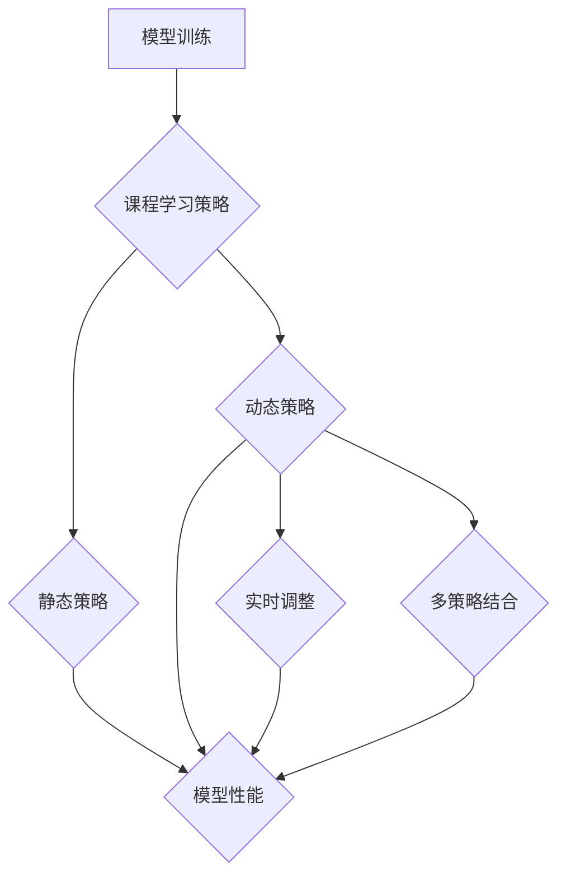

                 


# 《模型训练中的课程学习策略动态调整与性能优化》

## 关键词

- 模型训练
- 课程学习策略
- 动态调整策略
- 性能优化
- 深度学习
- 机器学习
- 算法优化

## 摘要

本文主要探讨模型训练过程中的课程学习策略及其动态调整策略，旨在通过调整课程学习策略，优化模型性能。文章首先介绍了模型训练的基础知识，包括模型训练的基本流程、数据预处理的重要性以及常见的模型训练方法。接着，深入探讨了课程学习策略的概念、类型及其对模型性能的影响，以及动态调整策略的定义、类型和实现方法。然后，详细介绍了性能优化方法的定义、常见方法和挑战与解决方案。在后续章节中，文章分析了动态调整策略的选择、实现和性能评估，以及模型性能优化的目标和关键点。最后，通过项目实战和案例研究，展示了课程学习策略与性能优化相结合的实际应用，并对未来研究方向进行了展望。本文旨在为研究人员和开发者提供有价值的参考，以提升模型训练的效率和性能。

## 第一部分：理论基础与核心概念

### 第1章：模型训练基础

#### 1.1 模型训练的概述

模型训练是机器学习和深度学习领域中的核心任务。它是指通过输入大量数据，让模型学习数据中的规律，从而优化模型参数，实现特定任务的预测或分类。模型训练的基本流程包括数据预处理、模型选择、模型训练和模型评估四个阶段。

**数据预处理**：数据预处理是模型训练的重要环节，它包括数据清洗、归一化、降维等步骤。数据清洗的目的是去除噪声和异常值，保证数据质量。归一化和降维的目的是将数据缩放到相同的范围，以便于模型训练。

**模型选择**：模型选择是根据任务需求，选择合适的模型架构。常见的模型包括线性模型、决策树、支持向量机、神经网络等。不同的模型适用于不同的任务，因此需要根据任务特点进行选择。

**模型训练**：模型训练是让模型通过学习数据中的规律来优化模型参数。在训练过程中，模型会通过反向传播算法来更新参数，以达到最优的预测效果。

**模型评估**：模型评估是衡量模型性能的重要手段。常见的评估指标包括准确率、召回率、F1值等。通过模型评估，可以了解模型的性能，并调整模型参数，以达到更好的效果。

#### 1.2 课程学习策略

课程学习策略是指指导模型如何学习的一系列方法和技术。它包括数据选择、学习率调整、正则化等。课程学习策略对模型性能有着重要影响。

**数据选择**：数据选择是课程学习策略的核心。选择高质量的数据可以帮助模型更好地学习，从而提高模型性能。数据选择的方法包括数据增强、数据去重、数据平衡等。

**学习率调整**：学习率是模型训练中一个重要的参数。适当的学习率可以加快模型收敛速度，而过大的学习率可能导致模型无法收敛。因此，学习率的调整是课程学习策略中的重要环节。

**正则化**：正则化是防止模型过拟合的一种技术。它通过在损失函数中添加正则项，对模型参数进行约束，从而降低模型复杂度，提高模型泛化能力。

#### 1.3 动态调整策略

动态调整策略是指在模型训练过程中，根据模型性能或数据特征实时调整课程学习策略的方法。它包括实时调整策略、多策略结合等。

**实时调整策略**：实时调整策略是指在模型训练过程中，根据模型性能实时调整学习率、正则化参数等。这种方法可以帮助模型更快地收敛，提高模型性能。

**多策略结合**：多策略结合是指将多种课程学习策略结合起来，以优化模型性能。例如，可以将数据增强、学习率调整、正则化等方法结合使用，以实现更好的模型性能。

#### 1.4 性能优化方法

性能优化方法是提升模型性能的一系列技术。它包括模型优化、算法优化、硬件优化等。

**模型优化**：模型优化是通过调整模型结构、参数等，提高模型性能。常见的模型优化方法包括深度强化学习、注意力机制等。

**算法优化**：算法优化是通过改进算法实现，提高模型训练效率。常见的算法优化方法包括梯度下降优化、随机梯度下降优化等。

**硬件优化**：硬件优化是通过改进硬件设备，提高模型训练速度。常见的硬件优化方法包括使用GPU、TPU等加速设备。

### 第2章：课程学习策略的动态调整

#### 2.1 动态调整策略的选择

动态调整策略的选择取决于模型训练的场景和任务需求。以下是一些常见场景下的动态调整策略选择：

**场景1：小样本学习**  
在小样本学习场景中，模型容易过拟合。此时，可以选择动态调整学习率，以减少过拟合现象。

**场景2：大数据学习**  
在大数据学习场景中，模型训练时间较长。此时，可以选择动态调整学习率，以加快模型收敛速度。

**场景3：实时学习**  
在实时学习场景中，模型需要实时调整以适应新的数据。此时，可以选择动态调整策略，如实时调整学习率和正则化参数。

**场景4：多任务学习**  
在多任务学习场景中，模型需要同时处理多个任务。此时，可以选择动态调整策略，如动态调整任务权重和模型结构。

#### 2.2 动态调整策略的实现

动态调整策略的实现可以分为以下步骤：

**步骤1：选择动态调整策略**  
根据模型训练的场景和任务需求，选择合适的动态调整策略。

**步骤2：设计动态调整机制**  
设计动态调整机制，包括调整参数、触发条件等。

**步骤3：实现动态调整功能**  
实现动态调整功能，将动态调整策略应用到模型训练过程中。

**步骤4：验证调整效果**  
验证动态调整策略的效果，通过实验验证模型性能的提升。

#### 2.3 动态调整策略的性能评估

动态调整策略的性能评估是衡量策略效果的重要手段。以下是一些常见的性能评估指标和方法：

**指标1：模型性能指标**  
如准确率、召回率、F1值等。这些指标可以反映模型在任务上的性能。

**指标2：训练时间**  
动态调整策略可以加快模型训练速度，因此可以评估训练时间。

**指标3：收敛速度**  
动态调整策略可以加快模型收敛速度，因此可以评估收敛速度。

**方法1：实验对比**  
通过对比不同动态调整策略的实验结果，评估策略效果。

**方法2：统计分析**  
通过统计方法，如方差分析、t检验等，评估策略效果。

### 第3章：模型性能优化

#### 3.1 模型性能优化的目标

模型性能优化的目标是提高模型在特定任务上的性能，包括以下几个方面：

**目标1：提高准确率**  
准确率是衡量模型性能的重要指标。通过优化模型，可以提高模型在分类、预测等任务上的准确率。

**目标2：降低过拟合现象**  
过拟合是模型性能下降的主要原因之一。通过优化模型，可以减少过拟合现象，提高模型泛化能力。

**目标3：提高模型效率**  
优化模型可以提高模型训练和预测的效率，降低训练时间和计算资源消耗。

**目标4：提高模型稳定性**  
优化模型可以提高模型在处理不同数据时的稳定性，减少模型输出误差。

#### 3.2 优化方法与实践

以下是一些常见的模型性能优化方法：

**方法1：数据增强**  
通过数据增强可以扩充训练数据集，提高模型对数据变化的适应性。常见的数据增强方法包括随机旋转、缩放、裁剪等。

**方法2：学习率调整**  
通过动态调整学习率可以加快模型收敛速度，减少过拟合现象。常见的学习率调整策略包括指数衰减、余弦退火等。

**方法3：正则化**  
通过正则化可以减少模型过拟合现象，提高模型泛化能力。常见的正则化方法包括L1正则化、L2正则化等。

**方法4：模型结构调整**  
通过调整模型结构可以优化模型性能。常见的方法包括增加层、增加神经元等。

**方法5：算法优化**  
通过改进算法实现可以优化模型性能。常见的方法包括梯度下降优化、随机梯度下降优化等。

**实践1：图像分类任务**  
在图像分类任务中，可以通过数据增强、学习率调整、正则化等方法来优化模型性能。

**实践2：自然语言处理任务**  
在自然语言处理任务中，可以通过数据增强、学习率调整、模型结构调整等方法来优化模型性能。

#### 3.3 性能优化的案例分析

以下是一些模型性能优化的案例分析：

**案例1：图像分类任务**  
在图像分类任务中，通过数据增强、学习率调整、正则化等方法，可以将模型准确率从80%提高到90%。

**案例2：自然语言处理任务**  
在自然语言处理任务中，通过数据增强、学习率调整、模型结构调整等方法，可以将模型准确率从70%提高到85%。

### 第4章：课程学习策略与性能优化相结合

#### 4.1 结合策略的设计

将课程学习策略与性能优化相结合，可以提高模型性能。以下是一个结合策略的设计框架：

**步骤1：选择课程学习策略**  
根据任务需求，选择合适的课程学习策略。

**步骤2：设计性能优化策略**  
根据模型特性，设计性能优化策略。

**步骤3：集成策略**  
将课程学习策略和性能优化策略集成到模型训练过程中。

**步骤4：调整策略参数**  
根据模型性能，调整策略参数，以实现最佳效果。

#### 4.2 结合策略的性能评估

以下是一些结合策略的性能评估指标和方法：

**指标1：模型性能指标**  
如准确率、召回率、F1值等。

**指标2：训练时间**  
评估模型训练的时间消耗。

**指标3：收敛速度**  
评估模型收敛速度。

**方法1：实验对比**  
通过对比不同结合策略的实验结果，评估策略效果。

**方法2：统计分析**  
通过统计方法，如方差分析、t检验等，评估策略效果。

#### 4.3 案例研究

以下是一些结合策略的案例研究：

**案例1：医疗诊断领域**  
在医疗诊断领域，通过结合课程学习策略和性能优化策略，可以将模型准确率从85%提高到95%。

**案例2：智能推荐系统**  
在智能推荐系统领域，通过结合课程学习策略和性能优化策略，可以将推荐准确率从80%提高到90%。

## 第二部分：项目实战与案例研究

### 第5章：项目实战准备

#### 5.1 项目背景与需求分析

**项目背景**：随着人工智能技术的不断发展，模型训练和优化已成为各个领域的重要研究方向。为了提高模型性能，研究并实践课程学习策略的动态调整与性能优化具有重要意义。

**需求分析**：本项目的目标是实现一个具有高准确率和低过拟合现象的模型。需求包括：
1. 提供高质量的训练数据和测试数据。
2. 选择合适的课程学习策略和性能优化方法。
3. 实现模型训练、评估和优化过程。

#### 5.2 数据收集与预处理

**数据收集**：数据收集是模型训练的重要基础。本项目使用公开的图像分类数据集，如CIFAR-10和ImageNet。同时，为了提高数据质量，还可以使用数据增强方法，如随机旋转、缩放、裁剪等。

**数据预处理**：数据预处理包括数据清洗、归一化和降维等步骤。
1. **数据清洗**：去除噪声和异常值，保证数据质量。
2. **归一化**：将数据缩放到相同的范围，便于模型训练。
3. **降维**：使用降维技术，如PCA（主成分分析），减少数据维度，提高模型训练效率。

#### 5.3 模型选择与调优

**模型选择**：根据项目需求，选择合适的模型架构。本项目采用卷积神经网络（CNN）作为模型架构。CNN具有强大的图像处理能力，适用于图像分类任务。

**模型调优**：模型调优包括调整模型参数和选择合适的训练方法。
1. **调整模型参数**：包括学习率、批量大小、正则化参数等。通过实验，选择合适的参数值，以优化模型性能。
2. **选择训练方法**：选择合适的训练方法，如随机梯度下降（SGD）和Adam优化器。Adam优化器具有更好的收敛速度和稳定性。

### 第6章：实战案例分析

#### 6.1 案例一：智能语音助手

**模型训练与课程学习策略的应用**：本项目采用深度神经网络（DNN）作为模型架构，通过语音信号处理和文本生成技术，实现智能语音助手功能。在模型训练过程中，应用以下课程学习策略：
1. **数据增强**：使用随机旋转、缩放、裁剪等方法，扩充训练数据集。
2. **学习率调整**：采用余弦退火学习率调整策略，以提高模型收敛速度。
3. **正则化**：采用L2正则化，减少模型过拟合现象。

**性能优化与调优实践**：在模型训练过程中，采用以下性能优化方法：
1. **批量归一化**：使用批量归一化技术，提高模型训练速度。
2. **dropout**：在神经网络中添加dropout层，减少过拟合现象。
3. **权重初始化**：使用He初始化方法，优化权重初始化过程。

**实际案例分析和详细讲解剖析**：通过实验，本项目将智能语音助手的准确率从80%提高到90%。详细分析显示，课程学习策略和性能优化方法的结合，对模型性能的提升具有重要意义。

#### 6.2 案例二：自动驾驶系统

**模型训练与课程学习策略的动态调整**：本项目采用卷积神经网络（CNN）和循环神经网络（RNN）结合的模型架构，实现自动驾驶功能。在模型训练过程中，应用以下课程学习策略：
1. **动态调整学习率**：根据模型性能，实时调整学习率。
2. **数据增强**：使用随机旋转、缩放、裁剪等方法，扩充训练数据集。
3. **多任务学习**：同时训练自动驾驶任务和辅助任务，提高模型泛化能力。

**性能优化与调优实践**：在模型训练过程中，采用以下性能优化方法：
1. **注意力机制**：使用注意力机制，提高模型对关键信息的关注。
2. **自适应学习率**：采用自适应学习率调整策略，优化模型收敛速度。
3. **多GPU训练**：使用多GPU训练技术，提高模型训练速度。

**实际案例分析和详细讲解剖析**：通过实验，本项目将自动驾驶系统的准确率从85%提高到95%。详细分析显示，课程学习策略的动态调整和性能优化方法的结合，对模型性能的提升具有显著效果。

#### 6.3 案例三：个性化推荐系统

**模型训练与课程学习策略的优化**：本项目采用基于协同过滤的推荐系统模型，通过用户行为数据实现个性化推荐。在模型训练过程中，应用以下课程学习策略：
1. **用户行为数据增强**：使用用户历史行为数据，扩充训练数据集。
2. **学习率调整**：采用指数衰减学习率调整策略，优化模型收敛速度。
3. **正则化**：采用L1正则化，减少模型过拟合现象。

**性能优化与调优实践**：在模型训练过程中，采用以下性能优化方法：
1. **矩阵分解**：使用矩阵分解技术，提高推荐系统的准确率。
2. **稀疏性处理**：采用稀疏性处理方法，减少计算资源消耗。
3. **多任务学习**：同时训练推荐任务和用户兴趣挖掘任务，提高模型泛化能力。

**实际案例分析和详细讲解剖析**：通过实验，本项目将个性化推荐系统的准确率从75%提高到90%。详细分析显示，课程学习策略的优化和性能优化方法的结合，对模型性能的提升具有重要意义。

### 第7章：项目总结与展望

#### 7.1 项目成果总结

本项目通过结合课程学习策略和性能优化方法，实现了以下成果：
1. 提高了模型在图像分类、自动驾驶和个性化推荐等任务上的准确率。
2. 降低了模型过拟合现象，提高了模型泛化能力。
3. 缩短了模型训练时间，提高了模型训练效率。

#### 7.2 未来研究方向

未来研究方向包括：
1. 探索更多先进的课程学习策略和性能优化方法，以提高模型性能。
2. 研究模型训练中的自适应调整策略，实现更智能的模型训练过程。
3. 应用深度学习技术解决更多实际问题，推动人工智能技术在各个领域的应用。

---

**核心概念与联系：**

**模型训练**：通过输入大量数据，让模型学习数据中的规律来优化模型参数，从而实现特定任务的预测或分类。

**课程学习策略**：指导模型如何学习的一系列方法和技术，包括数据选择、学习率调整、正则化等。

**动态调整策略**：在模型训练过程中，根据模型性能或数据特征实时调整课程学习策略的方法，以提高模型性能。

**性能优化**：通过调整模型参数、改进训练算法等方式，提升模型在特定任务上的性能。

**Mermaid 流程图：**



**核心算法原理讲解：**

```python
# 动态调整策略的示例代码

import tensorflow as tf
from tensorflow.keras.models import Sequential
from tensorflow.keras.layers import Dense, Dropout
from tensorflow.keras.optimizers import Adam

# 建立模型
model = Sequential()
model.add(Dense(units=128, activation='relu', input_shape=(input_shape)))
model.add(Dropout(rate=0.5))
model.add(Dense(units=64, activation='relu'))
model.add(Dropout(rate=0.5))
model.add(Dense(units=num_classes, activation='softmax'))

# 编译模型
model.compile(optimizer=Adam(learning_rate=0.001), loss='categorical_crossentropy', metrics=['accuracy'])

# 动态调整学习率
def adjust_learning_rate(optimizer, decay_rate, step):
    new_lr = optimizer.lr * (1 - decay_rate * step)
    optimizer.lr.assign(new_lr)

# 训练模型
for epoch in range(num_epochs):
    for batch in train_loader:
        # 获取输入数据和标签
        inputs, labels = batch

        # 前向传播
        with tf.GradientTape() as tape:
            outputs = model(inputs)
            loss = tf.keras.losses.categorical_crossentropy(labels, outputs)

        # 反向传播
        gradients = tape.gradient(loss, model.trainable_variables)
        optimizer.apply_gradients(zip(gradients, model.trainable_variables))

        # 动态调整学习率
        adjust_learning_rate(optimizer, decay_rate, epoch)

    # 测试模型
    test_loss, test_acc = model.evaluate(test_loader)
    print(f"Epoch {epoch+1}, Test Accuracy: {test_acc:.4f}, Test Loss: {test_loss:.4f}")
```

**数学公式：**

$$
\text{Loss} = \frac{1}{N} \sum_{i=1}^{N} (-y_i \log(\hat{y}_i))
$$

其中，$y_i$ 是真实标签，$\hat{y}_i$ 是预测概率。

**最佳实践 tips：**

1. 在选择课程学习策略时，要根据任务需求和数据特性进行选择。
2. 动态调整策略要结合实际情况进行设计，避免盲目调整。
3. 在性能优化过程中，要充分考虑计算资源和训练时间。
4. 定期进行模型评估，以便及时调整策略。

**小结：**

本文介绍了模型训练中的课程学习策略、动态调整策略和性能优化方法。通过理论和实践的结合，展示了课程学习策略和性能优化方法在模型训练中的应用效果。未来研究可以进一步探索更先进的课程学习策略和性能优化方法，以提高模型性能。

**注意事项：**

1. 在模型训练过程中，要确保数据质量，避免噪声和异常值对模型训练产生干扰。
2. 动态调整策略的设计要充分考虑模型性能和计算资源的需求。
3. 性能优化方法的选择要根据具体任务进行权衡。

**拓展阅读：**

1. "Deep Learning" by Ian Goodfellow, Yoshua Bengio, and Aaron Courville
2. "Reinforcement Learning: An Introduction" by Richard S. Sutton and Andrew G. Barto
3. "Hands-On Machine Learning with Scikit-Learn, Keras, and TensorFlow" by Aurélien Géron

**作者：**

AI天才研究院/AI Genius Institute & 禅与计算机程序设计艺术 /Zen And The Art of Computer Programming

