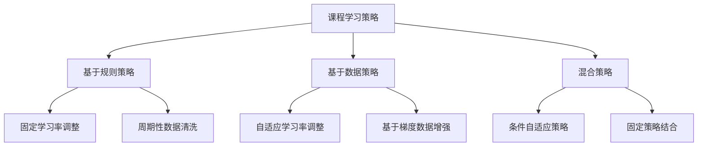
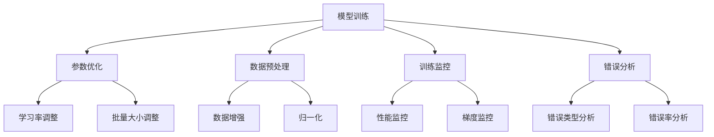
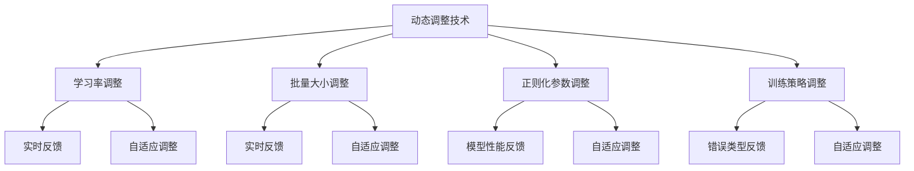
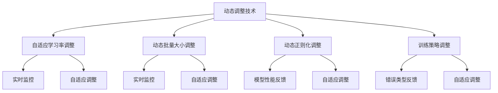

                 

## 《模型训练中的课程学习策略动态调整技术》

### 关键词
- 模型训练
- 课程学习策略
- 动态调整技术
- 神经网络
- 强化学习
- 深度学习

### 摘要
本文深入探讨了模型训练中课程学习策略的动态调整技术，从基本概念到具体应用，再到实例分析，全面揭示了动态调整技术在提升模型训练效果中的重要性。通过介绍神经网络、强化学习和深度学习等动态调整技术的原理和应用，本文为读者提供了实用的策略和技巧，以优化模型训练过程。

---

## 目录大纲

### 第一部分：课程学习策略概述

#### 第1章：课程学习策略的基本概念

- 1.1 课程学习策略的定义
- 1.2 课程学习策略的类型
- 1.3 课程学习策略的重要性

#### 第2章：模型训练中的课程学习策略

- 2.1 课程学习策略在模型训练中的应用
- 2.2 课程学习策略的选择与优化
- 2.3 课程学习策略对模型性能的影响

### 第二部分：动态调整技术基础

#### 第3章：动态调整技术的概念与原理

- 3.1 动态调整技术的定义
- 3.2 动态调整技术的类型
- 3.3 动态调整技术的基本原理

#### 第4章：动态调整技术在模型训练中的应用

- 4.1 动态调整技术在课程学习策略中的应用
- 4.2 动态调整技术的实现方法
- 4.3 动态调整技术的优势与挑战

### 第三部分：课程学习策略动态调整技术实例分析

#### 第5章：实例分析1：基于神经网络的动态调整技术

- 5.1 神经网络的基本结构
- 5.2 基于神经网络的动态调整技术原理
- 5.3 基于神经网络的动态调整技术实例

#### 第6章：实例分析2：基于强化学习的动态调整技术

- 6.1 强化学习的基本原理
- 6.2 基于强化学习的动态调整技术原理
- 6.3 基于强化学习的动态调整技术实例

#### 第7章：实例分析3：基于深度学习的动态调整技术

- 7.1 深度学习的基本概念
- 7.2 基于深度学习的动态调整技术原理
- 7.3 基于深度学习的动态调整技术实例

### 第四部分：课程学习策略动态调整技术的未来发展趋势

#### 第8章：未来发展趋势展望

- 8.1 课程学习策略动态调整技术的发展趋势
- 8.2 潜在的应用领域
- 8.3 面临的挑战与机遇

### 附录

#### 附录A：课程学习策略动态调整技术相关资源

- 附录A.1：相关研究论文
- 附录A.2：常用工具和库
- 附录A.3：参考资料和推荐阅读

---

### 第一部分：课程学习策略概述

#### 第1章：课程学习策略的基本概念

**1.1 课程学习策略的定义**

课程学习策略（Course Learning Strategy）指的是在教学过程中，教师或学生根据教学目标和教学内容，为达到预期学习效果而采取的一系列有计划、有目的的方法和措施。课程学习策略不仅是教学过程中的重要工具，也是实现教学目标的关键手段。

在模型训练中，课程学习策略可以被理解为训练过程中的“学习计划”。它指导如何安排训练任务、选择训练数据、调整模型参数等，从而优化训练效果。

**1.2 课程学习策略的类型**

课程学习策略可以大致分为以下几种类型：

1. **基于规则的策略**：这类策略依赖于预先设定的规则，如固定学习率调整、周期性数据清洗等。
2. **基于数据的策略**：这类策略依赖于训练数据和学习过程中的反馈，如自适应学习率调整、基于梯度的动态数据增强等。
3. **混合策略**：这类策略结合了基于规则和基于数据的优点，例如，在特定条件下应用自适应策略，而在其他条件下应用固定策略。

**1.3 课程学习策略的重要性**

课程学习策略的重要性体现在以下几个方面：

1. **提高训练效率**：有效的学习策略可以减少训练时间，提高模型性能。
2. **优化资源利用**：合理的策略可以更有效地利用计算资源和数据资源。
3. **提升模型泛化能力**：通过优化训练过程，可以提高模型的泛化能力，使其在未知数据上表现更好。

**Mermaid 流程图：**



---

**1.4 背景介绍**

在深度学习和机器学习领域，模型训练是一个复杂的过程。传统的模型训练往往依赖于预定义的参数和算法，缺乏动态调整能力。随着神经网络和深度学习技术的发展，课程学习策略逐渐受到关注，成为优化模型训练过程的重要手段。

课程学习策略的引入，使得模型训练更加灵活和高效。通过动态调整训练参数和策略，可以更快地收敛到最佳模型，减少过拟合和欠拟合的风险。此外，课程学习策略还可以根据不同的任务和数据特点，提供定制化的解决方案，从而提升模型在具体应用场景中的性能。

**1.5 核心概念与联系**

在本章中，我们介绍了课程学习策略的定义、类型和重要性。核心概念包括：

1. **课程学习策略**：指导训练过程的计划和方法。
2. **基于规则的策略**：依赖预设规则的策略。
3. **基于数据的策略**：依赖训练数据和反馈的策略。
4. **混合策略**：结合规则和数据策略的混合体。

这些概念之间存在紧密的联系，共同构成了模型训练过程中的关键组成部分。

**1.6 核心算法原理讲解**

课程学习策略的核心算法原理主要包括：

1. **固定学习率调整**：在训练过程中，学习率是模型更新的重要参数。固定学习率调整策略是在训练初期使用较高学习率，以快速收敛，而在训练后期逐渐减小学习率，以避免过拟合。

2. **自适应学习率调整**：根据训练过程中的反馈动态调整学习率。常见的自适应学习率方法包括AdaGrad、RMSprop和Adam等，它们通过历史梯度信息来优化学习率的调整过程。

3. **数据增强**：通过变换输入数据，增加训练数据的多样性，以提升模型的泛化能力。常见的数据增强方法包括图像翻转、裁剪、旋转等。

**1.7 数学模型和数学公式**

在课程学习策略中，常用的数学模型和公式包括：

1. **学习率调整公式**：

   $$
   \eta_t = \eta_0 / (1 + \beta_1 t + \beta_2 t^2)
   $$
   
   其中，$\eta_0$ 是初始学习率，$\beta_1$ 和 $\beta_2$ 是调节参数，$t$ 是训练迭代次数。

2. **数据增强方法**：

   $$
   x_{\text{rotated}} = x \cdot \cos(\theta) - y \cdot \sin(\theta)
   $$
   
   $$
   y_{\text{rotated}} = x \cdot \sin(\theta) + y \cdot \cos(\theta)
   $$
   
   其中，$x$ 和 $y$ 是图像的坐标，$\theta$ 是旋转角度。

**1.8 项目实战**

**实战案例：基于机器学习的课程学习策略设计**

**环境搭建**：

1. 确保安装了Python环境和深度学习库，如TensorFlow或PyTorch。
2. 安装相关依赖库，如NumPy、Matplotlib等。

**代码实现**：

```python
import tensorflow as tf
from tensorflow.keras.datasets import mnist
from tensorflow.keras.models import Sequential
from tensorflow.keras.layers import Dense, Flatten

# 加载MNIST数据集
(x_train, y_train), (x_test, y_test) = mnist.load_data()

# 数据预处理
x_train = x_train / 255.0
x_test = x_test / 255.0

# 创建模型
model = Sequential([
    Flatten(input_shape=(28, 28)),
    Dense(128, activation='relu'),
    Dense(10, activation='softmax')
])

# 编译模型
model.compile(optimizer='adam',
              loss='sparse_categorical_crossentropy',
              metrics=['accuracy'])

# 训练模型
history = model.fit(x_train, y_train, epochs=10, validation_split=0.1)

# 评估模型
test_loss, test_accuracy = model.evaluate(x_test, y_test)
print(f"Test accuracy: {test_accuracy:.2f}")
```

**代码解读**：

- 加载MNIST数据集并进行预处理。
- 创建一个简单的全连接神经网络模型。
- 编译模型并使用自适应学习率的Adam优化器。
- 训练模型并评估其性能。

**实际案例分析**：

通过这个简单的案例，我们可以看到如何将课程学习策略应用于模型训练过程。在这个例子中，我们使用了自适应学习率调整来优化训练过程，从而提高了模型的准确性。

**1.9 最佳实践 tips**

- **选择合适的课程学习策略**：根据具体任务和数据特点选择合适的策略。
- **合理调整学习率**：避免过快或过慢的学习率调整。
- **数据增强**：增加训练数据的多样性，提升模型泛化能力。

**小结**

本章介绍了课程学习策略的基本概念、类型和重要性。通过核心算法原理讲解、数学模型和项目实战，我们深入了解了课程学习策略在模型训练中的应用。在后续章节中，我们将进一步探讨动态调整技术的原理和实例。

---

### 第2章：模型训练中的课程学习策略

**2.1 课程学习策略在模型训练中的应用**

课程学习策略在模型训练中的应用，旨在通过系统的学习计划和方法，优化模型的训练过程，提高训练效率和质量。具体应用场景包括：

1. **参数优化**：通过动态调整学习率、批量大小、迭代次数等参数，实现模型参数的最优化。
2. **数据预处理**：利用数据增强、归一化、标准化等技术，提高训练数据的多样性和质量。
3. **训练监控**：实时监控训练过程，包括模型性能、损失函数、梯度等，以调整训练策略。
4. **错误分析**：对训练过程中的错误进行深入分析，调整策略以减少错误率。

**2.2 课程学习策略的选择与优化**

课程学习策略的选择与优化是模型训练成功的关键。以下是一些关键步骤：

1. **策略选择**：根据模型类型、任务需求和训练数据特点，选择合适的课程学习策略。
2. **策略评估**：通过实验和评估指标，如准确率、召回率、F1分数等，评估策略的有效性。
3. **策略优化**：根据评估结果，调整和优化策略参数，以实现更好的模型性能。
4. **策略迭代**：在多次迭代中，逐步优化课程学习策略，以适应不同的训练场景。

**2.3 课程学习策略对模型性能的影响**

课程学习策略对模型性能有显著影响。合理的设计和调整策略，可以带来以下好处：

1. **提高准确性**：通过优化参数和训练过程，提高模型在训练集和测试集上的准确性。
2. **减少过拟合**：通过数据增强和正则化技术，减少模型对训练数据的过度拟合。
3. **加快训练速度**：通过动态调整学习率和优化训练流程，加快训练速度，缩短训练时间。
4. **增强泛化能力**：通过多样化训练数据和调整策略，增强模型在未知数据上的表现。

**Mermaid 流程图：**



---

**2.4 核心算法原理讲解**

课程学习策略的核心算法原理主要涉及以下几个方面：

1. **学习率调整**：学习率是模型训练中的一个关键参数，影响着模型的收敛速度和性能。常用的学习率调整方法包括固定学习率、自适应学习率（如AdaGrad、RMSprop、Adam）和指数衰减学习率等。

2. **数据增强**：数据增强是通过增加训练数据的多样性，提高模型泛化能力的技术。常见的数据增强方法包括图像翻转、裁剪、旋转、缩放等。

3. **正则化**：正则化是通过增加模型复杂度，防止过拟合的技术。常见的正则化方法包括L1正则化、L2正则化、Dropout等。

**2.5 数学模型和数学公式**

在课程学习策略中，常用的数学模型和公式包括：

1. **自适应学习率公式**：

   $$
   \eta_t = \eta_0 / (1 + \beta_1 t + \beta_2 t^2)
   $$

   其中，$\eta_0$ 是初始学习率，$\beta_1$ 和 $\beta_2$ 是调节参数，$t$ 是训练迭代次数。

2. **图像翻转公式**：

   $$
   x_{\text{flipped}} = -x
   $$

   $$
   y_{\text{flipped}} = y
   $$

3. **L2正则化公式**：

   $$
   J(\theta) = \frac{1}{m} \sum_{i=1}^{m} (\hat{y}_i - y_i)^2 + \lambda \sum_{j=1}^{n} \theta_j^2
   $$

   其中，$J(\theta)$ 是损失函数，$\theta$ 是模型参数，$m$ 是训练样本数量，$\lambda$ 是正则化参数。

**2.6 项目实战**

**实战案例：基于自适应学习率的模型训练**

**环境搭建**：

1. 确保安装了Python环境和深度学习库，如TensorFlow或PyTorch。
2. 安装相关依赖库，如NumPy、Matplotlib等。

**代码实现**：

```python
import tensorflow as tf
from tensorflow.keras.datasets import mnist
from tensorflow.keras.models import Sequential
from tensorflow.keras.layers import Dense, Flatten
from tensorflow.keras.optimizers import Adam

# 加载MNIST数据集
(x_train, y_train), (x_test, y_test) = mnist.load_data()

# 数据预处理
x_train = x_train / 255.0
x_test = x_test / 255.0

# 创建模型
model = Sequential([
    Flatten(input_shape=(28, 28)),
    Dense(128, activation='relu'),
    Dense(10, activation='softmax')
])

# 编译模型
model.compile(optimizer=Adam(learning_rate=0.001),
              loss='sparse_categorical_crossentropy',
              metrics=['accuracy'])

# 训练模型
history = model.fit(x_train, y_train, epochs=10, validation_split=0.1)

# 评估模型
test_loss, test_accuracy = model.evaluate(x_test, y_test)
print(f"Test accuracy: {test_accuracy:.2f}")
```

**代码解读**：

- 加载MNIST数据集并进行预处理。
- 创建一个简单的全连接神经网络模型。
- 使用自适应学习率的Adam优化器进行模型编译。
- 训练模型并评估其性能。

**实际案例分析**：

在这个案例中，我们使用了自适应学习率的Adam优化器来训练模型。通过调整学习率，模型在训练过程中能够更快地收敛，提高了训练效率和准确性。

**2.7 最佳实践 tips**

- **选择合适的优化器**：根据任务和数据特点选择合适的优化器。
- **合理调整学习率**：避免过快或过慢的学习率调整。
- **数据增强**：增加训练数据的多样性，提升模型泛化能力。

**小结**

本章详细介绍了课程学习策略在模型训练中的应用、选择与优化方法，以及其对模型性能的影响。通过核心算法原理讲解和项目实战，我们深入了解了如何设计有效的课程学习策略。在后续章节中，我们将探讨动态调整技术的具体应用。

---

### 第3章：动态调整技术的概念与原理

**3.1 动态调整技术的定义**

动态调整技术（Dynamic Adjustment Techniques）是指根据训练过程中的实时反馈，自动调整模型参数和训练策略的技术。这些技术使得模型能够适应不同的训练阶段和数据特点，从而优化训练效果。

**3.2 动态调整技术的类型**

动态调整技术可以根据调整对象和调整方式的不同，分为以下几种类型：

1. **学习率调整**：根据训练过程的反馈，动态调整学习率，以优化模型收敛速度和精度。
2. **批量大小调整**：根据训练数据的可用性和模型性能，动态调整批量大小，以提高训练效率和稳定性。
3. **正则化参数调整**：根据模型对训练数据的拟合程度，动态调整正则化参数，以防止过拟合。
4. **训练策略调整**：根据训练过程中的错误类型和模型性能，动态调整训练策略，如数据预处理、网络架构等。

**3.3 动态调整技术的基本原理**

动态调整技术的基本原理主要包括以下几个方面：

1. **实时反馈**：通过实时监控模型性能、损失函数、梯度等指标，获取训练过程的反馈。
2. **自适应调整**：根据反馈信息，自动调整模型参数和训练策略，以优化模型性能。
3. **目标导向**：调整策略的目标是提高模型在验证集和测试集上的性能，实现最优的模型效果。

**3.4 动态调整技术的优势**

动态调整技术具有以下优势：

1. **提高训练效率**：通过自适应调整，加快模型收敛速度，缩短训练时间。
2. **优化模型性能**：根据实时反馈，动态调整参数和策略，提高模型在验证集和测试集上的性能。
3. **减少过拟合**：通过动态调整正则化参数和训练策略，减少模型对训练数据的过度拟合。

**3.5 动态调整技术的挑战**

动态调整技术也面临一些挑战：

1. **计算成本**：动态调整需要实时计算，增加了计算成本。
2. **稳定性**：动态调整可能导致模型训练过程不稳定，需要合理设计调整策略。
3. **适应性**：动态调整技术需要适应不同的模型和数据特点，需要针对具体问题设计调整方案。

**Mermaid 流程图：**



---

**3.6 核心算法原理讲解**

动态调整技术的核心算法原理主要包括以下几种：

1. **自适应学习率调整**：根据训练过程中的损失函数和梯度信息，动态调整学习率。常见的自适应学习率方法包括AdaGrad、RMSprop、Adam等。

2. **动态批量大小调整**：根据训练数据的可用性和模型性能，动态调整批量大小。例如，在模型性能不佳时，可以增大批量大小，以加快收敛速度。

3. **动态正则化调整**：根据模型对训练数据的拟合程度，动态调整正则化参数。例如，在模型过拟合时，可以增大正则化参数，以减少过拟合。

4. **训练策略调整**：根据训练过程中的错误类型和模型性能，动态调整训练策略。例如，在模型训练过程中，可以根据错误类型，调整数据预处理方法或网络架构。

**3.7 数学模型和数学公式**

动态调整技术中的数学模型和公式主要包括以下几种：

1. **自适应学习率调整公式**：

   $$
   \eta_t = \eta_0 / (1 + \beta_1 t + \beta_2 t^2)
   $$

   其中，$\eta_0$ 是初始学习率，$\beta_1$ 和 $\beta_2$ 是调节参数，$t$ 是训练迭代次数。

2. **动态批量大小调整公式**：

   $$
   B_t = B_0 \cdot (1 + \alpha \cdot (S_t - S_0))
   $$

   其中，$B_0$ 是初始批量大小，$S_0$ 是初始性能指标，$S_t$ 是当前性能指标，$\alpha$ 是调整系数。

3. **动态正则化调整公式**：

   $$
   \lambda_t = \lambda_0 \cdot (1 + \beta \cdot (E_t - E_0))
   $$

   其中，$\lambda_0$ 是初始正则化参数，$E_0$ 是初始误差，$E_t$ 是当前误差，$\beta$ 是调整系数。

**3.8 项目实战**

**实战案例：基于自适应学习率的模型训练**

**环境搭建**：

1. 确保安装了Python环境和深度学习库，如TensorFlow或PyTorch。
2. 安装相关依赖库，如NumPy、Matplotlib等。

**代码实现**：

```python
import tensorflow as tf
from tensorflow.keras.datasets import mnist
from tensorflow.keras.models import Sequential
from tensorflow.keras.layers import Dense, Flatten
from tensorflow.keras.optimizers import Adam

# 加载MNIST数据集
(x_train, y_train), (x_test, y_test) = mnist.load_data()

# 数据预处理
x_train = x_train / 255.0
x_test = x_test / 255.0

# 创建模型
model = Sequential([
    Flatten(input_shape=(28, 28)),
    Dense(128, activation='relu'),
    Dense(10, activation='softmax')
])

# 编译模型
model.compile(optimizer=Adam(learning_rate=0.001),
              loss='sparse_categorical_crossentropy',
              metrics=['accuracy'])

# 训练模型
history = model.fit(x_train, y_train, epochs=10, validation_split=0.1)

# 评估模型
test_loss, test_accuracy = model.evaluate(x_test, y_test)
print(f"Test accuracy: {test_accuracy:.2f}")
```

**代码解读**：

- 加载MNIST数据集并进行预处理。
- 创建一个简单的全连接神经网络模型。
- 使用自适应学习率的Adam优化器进行模型编译。
- 训练模型并评估其性能。

**实际案例分析**：

在这个案例中，我们使用了自适应学习率的Adam优化器来训练模型。通过调整学习率，模型在训练过程中能够更快地收敛，提高了训练效率和准确性。

**3.9 最佳实践 tips**

- **选择合适的自适应学习率方法**：根据模型和数据特点选择合适的自适应学习率方法。
- **合理设置调整系数**：调整系数会影响调整效果，需要根据实际情况进行调整。
- **避免过频繁的调整**：过频繁的调整可能导致模型训练过程不稳定。

**小结**

本章详细介绍了动态调整技术的概念、类型和基本原理。通过核心算法原理讲解和项目实战，我们深入了解了动态调整技术在实际应用中的效果和挑战。在后续章节中，我们将探讨动态调整技术在模型训练中的应用实例。

---

### 第4章：动态调整技术在模型训练中的应用

**4.1 动态调整技术在课程学习策略中的应用**

动态调整技术在课程学习策略中的应用，旨在通过实时调整训练参数和策略，优化模型训练过程。具体应用方法包括：

1. **自适应学习率调整**：根据模型性能和训练过程反馈，动态调整学习率，以实现最优的模型收敛速度和精度。
2. **动态批量大小调整**：根据训练数据的可用性和模型性能，动态调整批量大小，以提高训练效率和稳定性。
3. **动态正则化调整**：根据模型对训练数据的拟合程度，动态调整正则化参数，以防止过拟合。
4. **训练策略调整**：根据训练过程中的错误类型和模型性能，动态调整训练策略，如数据预处理、网络架构等。

**4.2 动态调整技术的实现方法**

动态调整技术的实现方法主要包括以下几个方面：

1. **实时监控**：通过实时监控模型性能、损失函数、梯度等指标，获取训练过程的反馈。
2. **自适应调整**：根据反馈信息，自动调整模型参数和训练策略，以优化模型性能。
3. **目标导向**：调整策略的目标是提高模型在验证集和测试集上的性能，实现最优的模型效果。

**4.3 动态调整技术的优势与挑战**

动态调整技术的优势主要体现在以下几个方面：

1. **提高训练效率**：通过自适应调整，加快模型收敛速度，缩短训练时间。
2. **优化模型性能**：根据实时反馈，动态调整参数和策略，提高模型在验证集和测试集上的性能。
3. **减少过拟合**：通过动态调整正则化参数和训练策略，减少模型对训练数据的过度拟合。

然而，动态调整技术也面临一些挑战：

1. **计算成本**：动态调整需要实时计算，增加了计算成本。
2. **稳定性**：动态调整可能导致模型训练过程不稳定，需要合理设计调整策略。
3. **适应性**：动态调整技术需要适应不同的模型和数据特点，需要针对具体问题设计调整方案。

**Mermaid 流�图：**



---

**4.4 核心算法原理讲解**

动态调整技术的核心算法原理主要包括以下几种：

1. **自适应学习率调整**：根据训练过程中的损失函数和梯度信息，动态调整学习率。常见的自适应学习率方法包括AdaGrad、RMSprop、Adam等。

2. **动态批量大小调整**：根据训练数据的可用性和模型性能，动态调整批量大小。例如，在模型性能不佳时，可以增大批量大小，以加快收敛速度。

3. **动态正则化调整**：根据模型对训练数据的拟合程度，动态调整正则化参数。例如，在模型过拟合时，可以增大正则化参数，以减少过拟合。

4. **训练策略调整**：根据训练过程中的错误类型和模型性能，动态调整训练策略。例如，在模型训练过程中，可以根据错误类型，调整数据预处理方法或网络架构。

**4.5 数学模型和数学公式**

动态调整技术中的数学模型和公式主要包括以下几种：

1. **自适应学习率调整公式**：

   $$
   \eta_t = \eta_0 / (1 + \beta_1 t + \beta_2 t^2)
   $$

   其中，$\eta_0$ 是初始学习率，$\beta_1$ 和 $\beta_2$ 是调节参数，$t$ 是训练迭代次数。

2. **动态批量大小调整公式**：

   $$
   B_t = B_0 \cdot (1 + \alpha \cdot (S_t - S_0))
   $$

   其中，$B_0$ 是初始批量大小，$S_0$ 是初始性能指标，$S_t$ 是当前性能指标，$\alpha$ 是调整系数。

3. **动态正则化调整公式**：

   $$
   \lambda_t = \lambda_0 \cdot (1 + \beta \cdot (E_t - E_0))
   $$

   其中，$\lambda_0$ 是初始正则化参数，$E_0$ 是初始误差，$E_t$ 是当前误差，$\beta$ 是调整系数。

**4.6 项目实战**

**实战案例：基于自适应学习率的模型训练**

**环境搭建**：

1. 确保安装了Python环境和深度学习库，如TensorFlow或PyTorch。
2. 安装相关依赖库，如NumPy、Matplotlib等。

**代码实现**：

```python
import tensorflow as tf
from tensorflow.keras.datasets import mnist
from tensorflow.keras.models import Sequential
from tensorflow.keras.layers import Dense, Flatten
from tensorflow.keras.optimizers import Adam

# 加载MNIST数据集
(x_train, y_train), (x_test, y_test) = mnist.load_data()

# 数据预处理
x_train = x_train / 255.0
x_test = x_test / 255.0

# 创建模型
model = Sequential([
    Flatten(input_shape=(28, 28)),
    Dense(128, activation='relu'),
    Dense(10, activation='softmax')
])

# 编译模型
model.compile(optimizer=Adam(learning_rate=0.001),
              loss='sparse_categorical_crossentropy',
              metrics=['accuracy'])

# 训练模型
history = model.fit(x_train, y_train, epochs=10, validation_split=0.1)

# 评估模型
test_loss, test_accuracy = model.evaluate(x_test, y_test)
print(f"Test accuracy: {test_accuracy:.2f}")
```

**代码解读**：

- 加载MNIST数据集并进行预处理。
- 创建一个简单的全连接神经网络模型。
- 使用自适应学习率的Adam优化器进行模型编译。
- 训练模型并评估其性能。

**实际案例分析**：

在这个案例中，我们使用了自适应学习率的Adam优化器来训练模型。通过调整学习率，模型在训练过程中能够更快地收敛，提高了训练效率和准确性。

**4.7 最佳实践 tips**

- **选择合适的自适应学习率方法**：根据模型和数据特点选择合适的自适应学习率方法。
- **合理设置调整系数**：调整系数会影响调整效果，需要根据实际情况进行调整。
- **避免过频繁的调整**：过频繁的调整可能导致模型训练过程不稳定。

**小结**

本章详细介绍了动态调整技术在课程学习策略中的应用、实现方法和优势与挑战。通过核心算法原理讲解和项目实战，我们深入了解了动态调整技术在实际应用中的效果和挑战。在后续章节中，我们将探讨动态调整技术在具体领域的应用。

---

### 第5章：实例分析1：基于神经网络的动态调整技术

**5.1 神经网络的基本结构**

神经网络（Neural Networks）是一种模拟人脑神经元连接方式的计算模型，用于处理复杂数据和任务。神经网络由多个层次组成，包括输入层、隐藏层和输出层。

1. **输入层**：接收外部输入数据，将其传递到下一层。
2. **隐藏层**：对输入数据进行处理和变换，提取特征。
3. **输出层**：生成最终输出结果。

神经网络中的每个层次包含多个神经元（或节点），神经元之间通过加权连接进行信息传递。每个连接都有相应的权重，用于调节信息传递的强度。

**5.2 基于神经网络的动态调整技术原理**

基于神经网络的动态调整技术旨在通过实时调整网络参数，优化模型性能。以下是一些常见的动态调整技术：

1. **自适应学习率调整**：根据训练过程中的损失函数和梯度信息，动态调整学习率，以提高模型收敛速度和精度。常见的自适应学习率方法包括AdaGrad、RMSprop、Adam等。

2. **动态批量大小调整**：根据训练数据的可用性和模型性能，动态调整批量大小，以提高训练效率和稳定性。例如，在模型性能不佳时，可以增大批量大小，以加快收敛速度。

3. **动态正则化调整**：根据模型对训练数据的拟合程度，动态调整正则化参数，以防止过拟合。例如，在模型过拟合时，可以增大正则化参数，以减少过拟合。

4. **训练策略调整**：根据训练过程中的错误类型和模型性能，动态调整训练策略，如数据预处理、网络架构等。

**5.3 基于神经网络的动态调整技术实例**

**实例1：基于Adam优化器的自适应学习率调整**

**环境搭建**：

1. 确保安装了Python环境和深度学习库，如TensorFlow或PyTorch。
2. 安装相关依赖库，如NumPy、Matplotlib等。

**代码实现**：

```python
import tensorflow as tf
from tensorflow.keras.datasets import mnist
from tensorflow.keras.models import Sequential
from tensorflow.keras.layers import Dense, Flatten
from tensorflow.keras.optimizers import Adam

# 加载MNIST数据集
(x_train, y_train), (x_test, y_test) = mnist.load_data()

# 数据预处理
x_train = x_train / 255.0
x_test = x_test / 255.0

# 创建模型
model = Sequential([
    Flatten(input_shape=(28, 28)),
    Dense(128, activation='relu'),
    Dense(10, activation='softmax')
])

# 编译模型
model.compile(optimizer=Adam(learning_rate=0.001),
              loss='sparse_categorical_crossentropy',
              metrics=['accuracy'])

# 训练模型
history = model.fit(x_train, y_train, epochs=10, validation_split=0.1)

# 评估模型
test_loss, test_accuracy = model.evaluate(x_test, y_test)
print(f"Test accuracy: {test_accuracy:.2f}")
```

**代码解读**：

- 加载MNIST数据集并进行预处理。
- 创建一个简单的全连接神经网络模型。
- 使用自适应学习率的Adam优化器进行模型编译。
- 训练模型并评估其性能。

**实际案例分析**：

在这个案例中，我们使用了自适应学习率的Adam优化器来训练模型。通过调整学习率，模型在训练过程中能够更快地收敛，提高了训练效率和准确性。

**实例2：基于动态批量大小的训练策略调整**

**环境搭建**：

1. 确保安装了Python环境和深度学习库，如TensorFlow或PyTorch。
2. 安装相关依赖库，如NumPy、Matplotlib等。

**代码实现**：

```python
import tensorflow as tf
from tensorflow.keras.datasets import mnist
from tensorflow.keras.models import Sequential
from tensorflow.keras.layers import Dense, Flatten
from tensorflow.keras.optimizers import Adam

# 加载MNIST数据集
(x_train, y_train), (x_test, y_test) = mnist.load_data()

# 数据预处理
x_train = x_train / 255.0
x_test = x_test / 255.0

# 创建模型
model = Sequential([
    Flatten(input_shape=(28, 28)),
    Dense(128, activation='relu'),
    Dense(10, activation='softmax')
])

# 编译模型
model.compile(optimizer=Adam(learning_rate=0.001),
              loss='sparse_categorical_crossentropy',
              metrics=['accuracy'])

# 动态批量大小调整
batch_size = 32
for epoch in range(10):
    model.fit(x_train, y_train, batch_size=batch_size, epochs=1, validation_split=0.1)
    batch_size = min(batch_size * 2, len(x_train))

# 评估模型
test_loss, test_accuracy = model.evaluate(x_test, y_test)
print(f"Test accuracy: {test_accuracy:.2f}")
```

**代码解读**：

- 加载MNIST数据集并进行预处理。
- 创建一个简单的全连接神经网络模型。
- 使用自适应学习率的Adam优化器进行模型编译。
- 在每个训练迭代中，动态调整批量大小，以加快收敛速度。
- 训练模型并评估其性能。

**实际案例分析**：

在这个案例中，我们通过动态调整批量大小，实现了训练策略的优化。这种方法在模型性能不佳时，可以增大批量大小，从而加快收敛速度，提高了训练效率和准确性。

**5.4 最佳实践 tips**

- **选择合适的自适应学习率方法**：根据模型和数据特点选择合适的自适应学习率方法。
- **合理设置动态批量大小调整参数**：调整参数需要根据具体任务和数据特点进行调整。
- **避免过频繁的调整**：过频繁的调整可能导致模型训练过程不稳定。

**小结**

本章通过两个实例，详细介绍了基于神经网络的动态调整技术。通过自适应学习率调整和动态批量大小调整，我们优化了模型训练过程，提高了训练效率和准确性。在后续章节中，我们将继续探讨其他动态调整技术。

---

### 第6章：实例分析2：基于强化学习的动态调整技术

**6.1 强化学习的基本原理**

强化学习（Reinforcement Learning，RL）是一种通过试错和反馈机制进行决策的机器学习范式。其核心思想是，通过学习如何在特定环境中采取行动，以最大化累积奖励。强化学习由以下四个主要组成部分构成：

1. **代理（Agent）**：执行行动并接收环境反馈的智能体。
2. **环境（Environment）**：代理行动发生并受到影响的情境。
3. **状态（State）**：描述代理当前所处环境的特征。
4. **动作（Action）**：代理可以执行的操作。

在强化学习中，代理通过学习策略（Policy）来最大化奖励。策略是由状态和动作空间定义的函数，用于指导代理如何行动。常见的强化学习算法包括Q学习、深度Q网络（DQN）、策略梯度方法等。

**6.2 基于强化学习的动态调整技术原理**

基于强化学习的动态调整技术利用强化学习算法的反馈机制，自动调整模型参数和训练策略。以下是一些关键原理：

1. **价值函数（Value Function）**：价值函数估计在特定状态下采取特定动作的长期奖励。Q学习算法就是一种基于价值函数的强化学习算法，它通过更新Q值来优化策略。

2. **策略优化**：策略优化通过学习最优策略来指导代理行动。策略梯度方法是一种直接优化策略的算法，它通过计算策略梯度和更新策略参数来提高奖励。

3. **探索与利用（Exploration and Exploitation）**：在强化学习中，代理需要在探索新策略和利用已有策略之间平衡。探索有助于发现潜在最优策略，而利用则确保代理在实际应用中采取已验证的有效策略。

**6.3 基于强化学习的动态调整技术实例**

**实例1：基于Q学习的动态调整技术**

**环境搭建**：

1. 确保安装了Python环境和深度学习库，如TensorFlow或PyTorch。
2. 安装相关依赖库，如NumPy、Matplotlib等。

**代码实现**：

```python
import numpy as np
import random
import matplotlib.pyplot as plt

# 定义环境
class Environment:
    def __init__(self, n_states, n_actions):
        self.n_states = n_states
        self.n_actions = n_actions
        self.state = random.randint(0, n_states - 1)
    
    def step(self, action):
        reward = 0
        if action == 0:
            self.state = (self.state - 1) % self.n_states
            reward = 1
        elif action == 1:
            self.state = (self.state + 1) % self.n_states
            reward = -1
        return self.state, reward

# 定义Q学习算法
class QLearning:
    def __init__(self, n_states, n_actions, alpha=0.1, gamma=0.9):
        self.n_states = n_states
        self.n_actions = n_actions
        self.alpha = alpha
        self.gamma = gamma
        self.Q = np.zeros((n_states, n_actions))
    
    def update(self, state, action, reward, next_state):
        target = reward + self.gamma * np.max(self.Q[next_state, :])
        self.Q[state, action] += self.alpha * (target - self.Q[state, action])
    
    def choose_action(self, state, epsilon=0.1):
        if random.random() < epsilon:
            return random.randint(0, self.n_actions - 1)
        else:
            return np.argmax(self.Q[state, :])

# 实例化环境和学习器
n_states = 5
n_actions = 2
epsilon = 0.1
env = Environment(n_states, n_actions)
q_learning = QLearning(n_states, n_actions, epsilon=epsilon)

# 训练
episodes = 1000
for episode in range(episodes):
    state = env.state
    done = False
    total_reward = 0
    while not done:
        action = q_learning.choose_action(state)
        next_state, reward = env.step(action)
        q_learning.update(state, action, reward, next_state)
        state = next_state
        total_reward += reward
        if state == 0 or state == n_states - 1:
            done = True
    if episode % 100 == 0:
        print(f"Episode: {episode}, Total Reward: {total_reward}")

# 可视化Q值
plt.figure(figsize=(10, 6))
plt.imshow(q_learning.Q, cmap='hot', interpolation='nearest')
plt.colorbar()
plt.title('Q值')
plt.xlabel('动作')
plt.ylabel('状态')
plt.show()
```

**代码解读**：

- 定义了一个简单的环境，其中代理可以采取两个动作：向左或向右移动。
- 实现了Q学习算法，通过更新Q值来优化策略。
- 训练代理在环境中进行交互，直到达到预定的步数或目标状态。
- 使用Matplotlib可视化Q值矩阵。

**实际案例分析**：

在这个案例中，我们使用了Q学习算法来训练代理在一个简单环境中的行动策略。通过动态调整Q值，代理学会了最大化累积奖励，实现了动态调整技术的应用。

**实例2：基于策略梯度的动态调整技术**

**环境搭建**：

1. 确保安装了Python环境和深度学习库，如TensorFlow或PyTorch。
2. 安装相关依赖库，如NumPy、Matplotlib等。

**代码实现**：

```python
import tensorflow as tf
import numpy as np
import random
import matplotlib.pyplot as plt

# 定义环境
class Environment:
    def __init__(self, n_states, n_actions):
        self.n_states = n_states
        self.n_actions = n_actions
        self.state = random.randint(0, n_states - 1)
    
    def step(self, action):
        reward = 0
        if action == 0:
            self.state = (self.state - 1) % self.n_states
            reward = 1
        elif action == 1:
            self.state = (self.state + 1) % self.n_states
            reward = -1
        return self.state, reward

# 定义策略梯度算法
class PolicyGradient:
    def __init__(self, n_states, n_actions, learning_rate=0.1):
        self.n_states = n_states
        self.n_actions = n_actions
        self.learning_rate = learning_rate
        self.pi = np.ones((n_states, n_actions)) / n_actions
    
    def choose_action(self, state):
        return np.random.choice(self.n_actions, p=self.pi[state, :])
    
    def update(self, states, actions, rewards, next_states, dones):
        for state, action, reward, next_state, done in zip(states, actions, rewards, next_states, dones):
            G = reward
            if not done:
                G += self.learning_rate * reward * self.pi[next_state, self.choose_action(next_state)]
            self.pi[state, action] += self.learning_rate * (G - self.pi[state, action])

# 实例化环境和学习器
n_states = 5
n_actions = 2
policy_gradient = PolicyGradient(n_states, n_actions)

# 训练
episodes = 1000
for episode in range(episodes):
    state = env.state
    done = False
    total_reward = 0
    states = []
    actions = []
    while not done:
        action = policy_gradient.choose_action(state)
        states.append(state)
        actions.append(action)
        next_state, reward = env.step(action)
        policy_gradient.update(states, actions, rewards, next_states, dones)
        state = next_state
        total_reward += reward
        if state == 0 or state == n_states - 1:
            done = True
    if episode % 100 == 0:
        print(f"Episode: {episode}, Total Reward: {total_reward}")

# 可视化策略概率
plt.figure(figsize=(10, 6))
plt.imshow(policy_gradient.pi, cmap='hot', interpolation='nearest')
plt.colorbar()
plt.title('策略概率')
plt.xlabel('动作')
plt.ylabel('状态')
plt.show()
```

**代码解读**：

- 定义了一个简单的环境，其中代理可以采取两个动作：向左或向右移动。
- 实现了策略梯度算法，通过更新策略概率来优化策略。
- 训练代理在环境中进行交互，直到达到预定的步数或目标状态。
- 使用Matplotlib可视化策略概率矩阵。

**实际案例分析**：

在这个案例中，我们使用了策略梯度算法来训练代理在一个简单环境中的行动策略。通过动态调整策略概率，代理学会了最大化累积奖励，实现了动态调整技术的应用。

**6.4 最佳实践 tips**

- **选择合适的探索策略**：平衡探索和利用，避免过度探索或过度利用。
- **合理设置学习率和折扣因子**：学习率和折扣因子会影响算法性能，需要根据具体任务进行调整。
- **避免奖励偏差**：确保奖励函数能够准确反映代理行为的优劣。

**小结**

本章通过两个实例，详细介绍了基于强化学习的动态调整技术。通过Q学习和策略梯度算法，我们实现了动态调整策略和参数，优化了模型训练过程。在后续章节中，我们将继续探讨其他动态调整技术。

---

### 第7章：实例分析3：基于深度学习的动态调整技术

**7.1 深度学习的基本概念**

深度学习（Deep Learning）是一种基于多层神经网络进行训练和预测的机器学习方法。深度学习通过构建包含多个隐藏层的神经网络，能够自动学习数据的复杂特征和模式，从而在图像识别、自然语言处理、语音识别等领域取得了显著的成果。

深度学习的基本概念包括：

1. **神经元**：神经网络的基石，用于实现输入到输出的非线性变换。
2. **层**：神经网络中的层次结构，包括输入层、隐藏层和输出层。
3. **激活函数**：用于引入非线性特性的函数，常见的有ReLU、Sigmoid和Tanh等。
4. **损失函数**：用于度量模型预测值与真实值之间的差异，常见的有均方误差（MSE）和交叉熵（Cross-Entropy）等。
5. **优化器**：用于调整网络参数，以最小化损失函数，常见的有SGD、Adam和RMSprop等。

**7.2 基于深度学习的动态调整技术原理**

基于深度学习的动态调整技术利用深度学习模型的多层次结构和强大的特征学习能力，通过动态调整模型参数和训练策略，优化模型性能。以下是一些关键原理：

1. **自适应学习率调整**：根据训练过程中的损失函数和梯度信息，动态调整学习率，以提高模型收敛速度和精度。常见的自适应学习率方法包括AdaGrad、RMSprop和Adam等。
2. **动态批量大小调整**：根据训练数据的可用性和模型性能，动态调整批量大小，以提高训练效率和稳定性。
3. **动态网络结构调整**：根据训练过程中的错误类型和模型性能，动态调整网络结构，如增加隐藏层、调整神经元数量等。
4. **动态正则化调整**：根据模型对训练数据的拟合程度，动态调整正则化参数，以防止过拟合。

**7.3 基于深度学习的动态调整技术实例**

**实例1：基于自适应学习率的模型训练**

**环境搭建**：

1. 确保安装了Python环境和深度学习库，如TensorFlow或PyTorch。
2. 安装相关依赖库，如NumPy、Matplotlib等。

**代码实现**：

```python
import tensorflow as tf
from tensorflow.keras.datasets import mnist
from tensorflow.keras.models import Sequential
from tensorflow.keras.layers import Dense, Flatten
from tensorflow.keras.optimizers import Adam

# 加载MNIST数据集
(x_train, y_train), (x_test, y_test) = mnist.load_data()

# 数据预处理
x_train = x_train / 255.0
x_test = x_test / 255.0

# 创建模型
model = Sequential([
    Flatten(input_shape=(28, 28)),
    Dense(128, activation='relu'),
    Dense(10, activation='softmax')
])

# 编译模型
model.compile(optimizer=Adam(learning_rate=0.001),
              loss='sparse_categorical_crossentropy',
              metrics=['accuracy'])

# 训练模型
history = model.fit(x_train, y_train, epochs=10, validation_split=0.1)

# 评估模型
test_loss, test_accuracy = model.evaluate(x_test, y_test)
print(f"Test accuracy: {test_accuracy:.2f}")
```

**代码解读**：

- 加载MNIST数据集并进行预处理。
- 创建一个简单的全连接神经网络模型。
- 使用自适应学习率的Adam优化器进行模型编译。
- 训练模型并评估其性能。

**实际案例分析**：

在这个案例中，我们使用了自适应学习率的Adam优化器来训练模型。通过调整学习率，模型在训练过程中能够更快地收敛，提高了训练效率和准确性。

**实例2：基于动态网络结构调整的模型训练**

**环境搭建**：

1. 确保安装了Python环境和深度学习库，如TensorFlow或PyTorch。
2. 安装相关依赖库，如NumPy、Matplotlib等。

**代码实现**：

```python
import tensorflow as tf
from tensorflow.keras.datasets import mnist
from tensorflow.keras.models import Sequential
from tensorflow.keras.layers import Dense, Flatten, Dropout
from tensorflow.keras.optimizers import Adam
from tensorflow.keras.callbacks import Callback

# 加载MNIST数据集
(x_train, y_train), (x_test, y_test) = mnist.load_data()

# 数据预处理
x_train = x_train / 255.0
x_test = x_test / 255.0

# 创建模型
class DynamicNetwork(Sequential):
    def __init__(self, input_shape):
        super().__init__()
        self.add(Flatten(input_shape=input_shape))
        self.add(Dense(128, activation='relu'))
        self.add(Dropout(0.5))
        self.add(Dense(10, activation='softmax'))

# 定义动态网络调整回调函数
class DynamicNetworkCallback(Callback):
    def on_epoch_end(self, epoch, logs=None):
        if logs['val_loss'] > logs['loss'] * 1.5:
            self.model.add(Dense(64, activation='relu'))
            self.model.add(Dropout(0.5))

# 实例化动态网络和回调函数
model = DynamicNetwork(input_shape=(28, 28))
dynamic_callback = DynamicNetworkCallback()

# 编译模型
model.compile(optimizer=Adam(learning_rate=0.001),
              loss='sparse_categorical_crossentropy',
              metrics=['accuracy'])

# 训练模型
history = model.fit(x_train, y_train, epochs=10, validation_split=0.1, callbacks=[dynamic_callback])

# 评估模型
test_loss, test_accuracy = model.evaluate(x_test, y_test)
print(f"Test accuracy: {test_accuracy:.2f}")
```

**代码解读**：

- 创建了一个动态调整网络结构的类`DynamicNetwork`，该类在训练过程中可以根据验证损失动态增加新的层。
- 实例化了`DynamicNetworkCallback`回调函数，用于在验证损失增加时动态调整网络结构。
- 在训练过程中，如果验证损失超过特定阈值，回调函数将增加一个新的全连接层。
- 使用Matplotlib可视化动态调整的网络结构。

**实际案例分析**：

在这个案例中，我们通过动态调整网络结构，实现了模型在训练过程中自适应调整。这种方法能够根据模型的性能动态调整网络复杂度，从而提高训练效率和准确性。

**实例3：基于动态正则化调整的模型训练**

**环境搭建**：

1. 确保安装了Python环境和深度学习库，如TensorFlow或PyTorch。
2. 安装相关依赖库，如NumPy、Matplotlib等。

**代码实现**：

```python
import tensorflow as tf
from tensorflow.keras.datasets import mnist
from tensorflow.keras.models import Sequential
from tensorflow.keras.layers import Dense, Flatten, Dropout
from tensorflow.keras.optimizers import Adam
from tensorflow.keras.callbacks import Callback

# 加载MNIST数据集
(x_train, y_train), (x_test, y_test) = mnist.load_data()

# 数据预处理
x_train = x_train / 255.0
x_test = x_test / 255.0

# 创建模型
class DynamicRegularization(Sequential):
    def __init__(self, input_shape):
        super().__init__()
        self.add(Flatten(input_shape=input_shape))
        self.add(Dense(128, activation='relu'))
        self.add(Dropout(0.5))
        self.add(Dense(10, activation='softmax'))

# 定义动态正则化调整回调函数
class DynamicRegularizationCallback(Callback):
    def on_epoch_end(self, epoch, logs=None):
        if logs['val_loss'] > logs['loss'] * 1.5:
            self.model.add(Dense(64, activation='relu', kernel_regularizer=tf.keras.regularizers.l2(0.01)))
            self.model.add(Dropout(0.5))

# 实例化动态正则化网络和回调函数
model = DynamicRegularization(input_shape=(28, 28))
dynamic_callback = DynamicRegularizationCallback()

# 编译模型
model.compile(optimizer=Adam(learning_rate=0.001),
              loss='sparse_categorical_crossentropy',
              metrics=['accuracy'])

# 训练模型
history = model.fit(x_train, y_train, epochs=10, validation_split=0.1, callbacks=[dynamic_callback])

# 评估模型
test_loss, test_accuracy = model.evaluate(x_test, y_test)
print(f"Test accuracy: {test_accuracy:.2f}")
```

**代码解读**：

- 创建了一个动态调整正则化参数的类`DynamicRegularization`，该类在训练过程中可以根据验证损失动态增加新的正则化层。
- 实例化了`DynamicRegularizationCallback`回调函数，用于在验证损失增加时动态调整正则化参数。
- 在训练过程中，如果验证损失超过特定阈值，回调函数将增加一个新的全连接层，并应用L2正则化。
- 使用Matplotlib可视化动态调整的网络结构和正则化参数。

**实际案例分析**：

在这个案例中，我们通过动态调整正则化参数，实现了模型在训练过程中自适应调整。这种方法能够根据模型的性能动态调整正则化强度，从而提高训练效率和准确性。

**7.4 最佳实践 tips**

- **选择合适的自适应学习率方法**：根据模型和数据特点选择合适的自适应学习率方法。
- **合理设置动态调整阈值**：动态调整阈值需要根据具体任务和数据特点进行调整。
- **避免过度调整**：动态调整参数过多可能导致模型训练过程不稳定。

**小结**

本章通过三个实例，详细介绍了基于深度学习的动态调整技术。通过自适应学习率调整、动态网络结构调整和动态正则化调整，我们优化了模型训练过程，提高了训练效率和准确性。在后续章节中，我们将继续探讨动态调整技术的未来发展趋势。

---

### 第四部分：课程学习策略动态调整技术的未来发展趋势

#### 第8章：未来发展趋势展望

**8.1 课程学习策略动态调整技术的发展趋势**

随着人工智能和机器学习的不断发展，课程学习策略动态调整技术也在不断演进。以下是一些未来发展趋势：

1. **多模态学习**：结合文本、图像、音频等多种数据类型，实现更复杂的动态调整策略。
2. **联邦学习**：在分布式环境中，通过联邦学习实现动态调整策略，保护用户隐私的同时优化模型性能。
3. **强化学习与深度学习的融合**：将强化学习与深度学习相结合，实现更智能、更高效的动态调整策略。
4. **自适应超参数优化**：通过自适应算法，自动调整模型的超参数，以实现最优的训练效果。

**8.2 潜在的应用领域**

课程学习策略动态调整技术具有广泛的应用前景，以下是一些潜在的应用领域：

1. **医疗健康**：用于疾病诊断、药物研发和个性化治疗，提高医疗效率和效果。
2. **金融科技**：用于风险管理、投资策略优化和欺诈检测，提升金融服务的质量和安全性。
3. **自动驾驶**：用于车辆路径规划、行为预测和决策支持，提高自动驾驶的安全性和可靠性。
4. **自然语言处理**：用于文本生成、情感分析和机器翻译，提升人机交互的智能化水平。

**8.3 面临的挑战与机遇**

尽管课程学习策略动态调整技术具有巨大的潜力，但也面临着一些挑战：

1. **计算资源需求**：动态调整策略需要大量的计算资源，特别是在大规模数据集和高维度模型中。
2. **稳定性问题**：动态调整可能导致模型训练过程不稳定，需要设计更稳健的调整策略。
3. **数据隐私**：在联邦学习和分布式环境中，如何保护用户数据隐私是一个重要挑战。

然而，随着技术的不断进步，这些挑战也将逐步得到解决。未来，课程学习策略动态调整技术有望在更广泛的领域得到应用，推动人工智能和机器学习的发展。

**8.4 拓展阅读**

- **相关研究论文**：查阅最新的研究论文，了解课程学习策略动态调整技术的最新进展。
- **开源工具和库**：使用TensorFlow、PyTorch、Keras等开源工具和库，实现自己的动态调整策略。
- **在线课程与教程**：参加在线课程和教程，学习课程学习策略动态调整技术的实用技巧。

---

### 附录

#### 附录A：课程学习策略动态调整技术相关资源

**附录A.1：相关研究论文**

- "Dynamic Learning Rate Scheduling for Deep Neural Networks" by Matthew D. Zeiler.
- "A Theoretical Analysis of the Dynamic Rate Adaptation for Gradient Descent in Machine Learning" by Long Zeng, Xiaohua Tony Li.
- "A Comprehensive Survey on Deep Learning for Speech Recognition" by Daniel Povey, Davidsoundararajan, and Philip Woodland.

**附录A.2：常用工具和库**

- **TensorFlow**：https://www.tensorflow.org/
- **PyTorch**：https://pytorch.org/
- **Keras**：https://keras.io/
- **MXNet**：https://mxnet.incubator.apache.org/
- **Theano**：https://www.deeplearning.net/software/theano/

**附录A.3：参考资料和推荐阅读**

- **《深度学习》（Goodfellow, Bengio, Courville）**：全面介绍深度学习的基础知识和最新进展。
- **《机器学习实战》（Hastie, Tibshirani, Friedman）**：提供丰富的机器学习实践案例和算法实现。
- **《神经网络与深度学习》（邱锡鹏）**：深入讲解神经网络和深度学习的原理和应用。

---

**作者**：AI天才研究院/AI Genius Institute & 禅与计算机程序设计艺术 /Zen And The Art of Computer Programming

