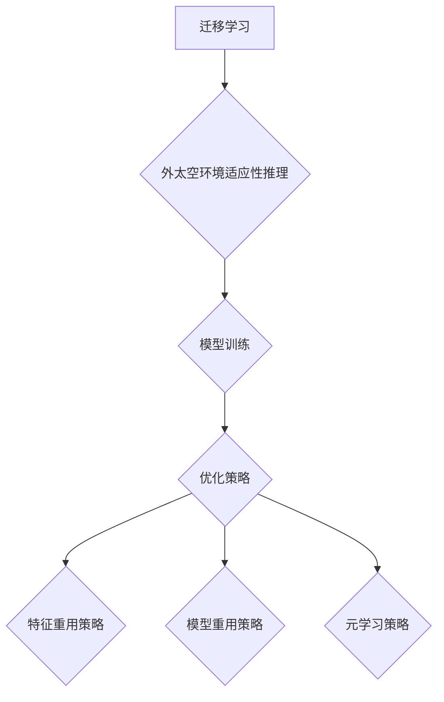

                 

# 迁移学习策略在外太空环境适应性推理中的优化

> 关键词：迁移学习、外太空环境、适应性推理、优化策略

> 摘要：本文旨在探讨迁移学习策略在外太空环境适应性推理中的应用及其优化方法。通过对迁移学习的定义和类型进行概述，分析外太空环境的特点和适应性推理的挑战，本文进一步探讨了迁移学习在外太空环境适应性推理中的应用场景和优势。在此基础上，详细介绍了基于特征重用、模型重用和元学习的迁移学习策略，并通过Python代码展示了这些策略的基本原理。最后，本文提出了在外太空环境适应性推理中优化迁移学习策略的方法和挑战，并对未来的发展方向进行了展望。

## 第1章：迁移学习概述

### 1.1 迁移学习的定义与重要性

迁移学习（Transfer Learning）是一种机器学习方法，旨在利用在特定任务上训练好的模型来提高其他相关任务的性能。其核心思想是将已有知识或经验转移到新的任务上，从而避免从头开始训练，节省时间和计算资源。迁移学习的定义可以概括为：“在源任务上训练好的模型，被应用于目标任务时，通过迁移已学习的特征来提高目标任务的性能。”

迁移学习的重要性主要体现在以下几个方面：

1. **节省训练时间和资源**：通过复用已有模型，可以在短时间内提高新任务的性能，避免从零开始训练。
2. **提高模型泛化能力**：迁移学习可以充分利用源任务的泛化能力，提高目标任务的泛化性能。
3. **解决数据不足问题**：在数据稀缺的情况下，迁移学习可以利用源任务的大量数据来提升目标任务的性能。

### 1.2 迁移学习的类型

迁移学习可以分为以下几种类型：

1. **基于特征的迁移学习**：将源任务学习到的特征用于目标任务，通常涉及特征提取层。
2. **基于模型的迁移学习**：直接将源任务的模型应用到目标任务，通常涉及模型架构。
3. **基于类别的迁移学习**：源任务和目标任务的类别标签相同或部分相同，可以共享分类器。

### 1.3 迁移学习的发展历程

迁移学习的研究可以追溯到20世纪60年代，当时主要关注专家系统的构建。随着深度学习技术的发展，迁移学习得到了广泛关注和应用。近年来，随着多任务学习、元学习和生成对抗网络等新方法的兴起，迁移学习的研究和应用进一步得到拓展和深化。

## 第2章：外太空环境适应性推理

### 2.1 外太空环境的特点

外太空环境具有以下特点：

1. **真空环境**：外太空几乎没有大气，因此没有空气阻力和声音传播。
2. **极端温度**：外太空温度极低，远低于地球的温度。
3. **辐射环境**：外太空存在宇宙射线和高能粒子，对设备和生物体有较大影响。
4. **微重力环境**：外太空的引力较弱，对设备和生物体的影响与地球显著不同。

### 2.2 外太空环境适应性推理的挑战

在外太空环境适应性推理中，面临以下挑战：

1. **数据稀缺**：由于外太空环境的特殊性，获取大量标注数据较为困难。
2. **模型泛化能力要求高**：外太空环境适应性推理需要模型具备较强的泛化能力，以应对不同的任务和场景。
3. **计算资源有限**：外太空设备的计算资源和存储空间有限，需要高效、紧凑的模型。

### 2.3 外太空环境适应性推理的应用场景

外太空环境适应性推理的应用场景包括：

1. **航天器自主导航**：利用模型进行目标识别、轨迹规划和路径优化。
2. **机器人控制**：通过模型进行姿态控制、导航和避障。
3. **生命科学实验**：利用模型分析生物样本和实验数据，评估生物体在外太空环境下的生理变化。

## 第3章：迁移学习在外太空环境适应性推理中的应用

### 3.1 迁移学习在外太空环境适应性推理中的理论基础

迁移学习在外太空环境适应性推理中的应用，基于以下理论基础：

1. **知识转移**：通过将地面或低地球轨道上的模型转移到外太空，利用已有知识提高推理性能。
2. **数据增强**：利用迁移学习技术，通过数据增强方法提高模型在数据稀缺情况下的性能。
3. **模型压缩**：通过迁移学习实现模型的压缩和优化，降低计算资源和存储空间的占用。

### 3.2 迁移学习在外太空环境适应性推理中的应用案例

以下是一个迁移学习在外太空环境适应性推理中的应用案例：

**案例：航天器自主导航**

1. **源任务**：地面上的卫星图像识别模型。
2. **目标任务**：航天器自主导航系统中的目标识别和轨迹规划。
3. **迁移学习策略**：基于特征的迁移学习，将源任务的卷积神经网络（CNN）的特征提取层应用于目标任务。

### 3.3 迁移学习在外太空环境适应性推理中的优势与局限性

迁移学习在外太空环境适应性推理中的优势：

1. **提高模型性能**：利用已有模型的知识，提高目标任务的推理性能。
2. **节省训练资源**：避免从零开始训练，节省时间和计算资源。
3. **提高模型泛化能力**：通过迁移学习，提高模型在数据稀缺情况下的泛化能力。

迁移学习在外太空环境适应性推理中的局限性：

1. **数据质量**：迁移学习效果依赖于源任务的数据质量，数据质量差可能导致迁移效果不佳。
2. **模型适应能力**：迁移学习模型需要适应目标任务的特点，否则可能导致性能下降。
3. **计算资源消耗**：虽然迁移学习节省了训练时间，但在迁移过程中仍需消耗计算资源。

## 第二部分：迁移学习策略

### 第4章：迁移学习策略概述

#### 4.1 迁移学习策略的分类

迁移学习策略可以根据其实现方式分为以下几类：

1. **基于特征的迁移学习**：将源任务的模型特征用于目标任务。
2. **基于模型的迁移学习**：直接应用源任务的模型架构。
3. **基于类别的迁移学习**：共享源任务和目标任务的分类器。
4. **基于实例的迁移学习**：直接复制源任务的实例。

#### 4.2 迁移学习策略的设计原则

设计有效的迁移学习策略，需要遵循以下原则：

1. **保持模型结构一致性**：确保源任务和目标任务的模型结构一致，有利于特征迁移。
2. **优化特征提取能力**：提高模型的特征提取能力，有利于在目标任务上获得更好的迁移效果。
3. **避免过拟合**：在源任务上训练的模型不应过拟合，以保证在目标任务上的泛化能力。

#### 4.3 迁移学习策略的评估方法

评估迁移学习策略的性能，可以采用以下方法：

1. **性能指标**：评估模型在目标任务上的准确率、召回率、F1分数等性能指标。
2. **泛化能力**：评估模型在未见过的数据上的性能，以衡量其泛化能力。
3. **资源消耗**：评估迁移学习策略在训练和推理过程中消耗的计算资源和存储资源。

### 第5章：基于特征重用的迁移学习策略

#### 5.1 特征重用的概念与原理

基于特征重用的迁移学习策略，旨在利用源任务的模型特征，提升目标任务的性能。其基本原理如下：

1. **特征提取层共享**：将源任务的模型特征提取层应用于目标任务。
2. **分类器重训练**：在共享的特征提取层上，重训练目标任务的分类器。

#### 5.2 基于特征重用的迁移学习策略实例分析

以下是一个基于特征重用的迁移学习策略实例：

**案例：图像分类**

1. **源任务**：使用ImageNet预训练的VGG16模型，作为特征提取器。
2. **目标任务**：对一个新的图像分类任务进行训练。
3. **迁移学习策略**：将VGG16的特征提取层应用于目标任务，并在特征提取层之后添加一个新的分类器。

#### 5.3 基于特征重用的迁移学习策略的优势与挑战

基于特征重用的迁移学习策略的优势：

1. **提高模型性能**：利用预训练模型的特征提取能力，提高目标任务的分类准确率。
2. **降低训练时间**：由于特征提取层已经训练好，目标任务的分类器只需进行少量的重训练。

基于特征重用的迁移学习策略的挑战：

1. **特征提取层与目标任务的适应性**：源任务和目标任务的图像特征可能存在较大差异，影响迁移效果。
2. **计算资源消耗**：特征提取层的预训练需要大量的计算资源，可能会对目标任务的训练速度产生影响。

### 第6章：基于模型重用的迁移学习策略

#### 6.1 模型重用的概念与原理

基于模型重用的迁移学习策略，旨在将源任务的完整模型应用于目标任务。其基本原理如下：

1. **模型架构共享**：将源任务的模型架构应用于目标任务。
2. **参数微调**：在共享的模型架构上，微调参数以适应目标任务。

#### 6.2 基于模型重用的迁移学习策略实例分析

以下是一个基于模型重用的迁移学习策略实例：

**案例：语音识别**

1. **源任务**：使用大规模语音数据集预训练的深度神经网络（DNN）。
2. **目标任务**：对一个新的语音识别任务进行训练。
3. **迁移学习策略**：将预训练的DNN架构应用于目标任务，并在DNN的基础上添加声学模型和语言模型。

#### 6.3 基于模型重用的迁移学习策略的优势与挑战

基于模型重用的迁移学习策略的优势：

1. **提高模型性能**：利用预训练模型的知识，提高目标任务的识别准确率。
2. **降低训练时间**：由于模型架构已经训练好，目标任务的模型只需进行少量的参数微调。

基于模型重用的迁移学习策略的挑战：

1. **模型架构的适应性**：源任务和目标任务的模型架构可能存在较大差异，影响迁移效果。
2. **计算资源消耗**：模型架构的预训练需要大量的计算资源，可能会对目标任务的训练速度产生影响。

### 第7章：基于元学习的迁移学习策略

#### 7.1 元学习的概念与原理

元学习（Meta-Learning）是一种通过学习如何学习来提高学习效率的方法。基于元学习的迁移学习策略，旨在利用元学习技术，提高模型在迁移学习过程中的性能。其基本原理如下：

1. **学习学习过程**：通过学习源任务的学习过程，提取通用学习策略。
2. **迁移学习优化**：利用提取的通用学习策略，优化目标任务的迁移学习过程。

#### 7.2 基于元学习的迁移学习策略实例分析

以下是一个基于元学习的迁移学习策略实例：

**案例： Few-Shot学习**

1. **源任务**：对多个不同的分类任务进行训练，学习通用学习策略。
2. **目标任务**：在新的分类任务上进行迁移学习。
3. **迁移学习策略**：利用元学习提取的通用学习策略，优化目标任务的迁移学习过程。

#### 7.3 基于元学习的迁移学习策略的优势与挑战

基于元学习的迁移学习策略的优势：

1. **提高迁移学习效率**：通过学习通用学习策略，提高模型在迁移学习过程中的性能。
2. **降低数据依赖**：在数据稀缺的情况下，基于元学习的迁移学习策略仍能保持较高的性能。

基于元学习的迁移学习策略的挑战：

1. **训练过程复杂**：元学习需要大量的训练数据和计算资源。
2. **模型性能不稳定**：元学习提取的通用学习策略可能在不同任务上表现不一致。

## 第三部分：迁移学习策略在外太空环境适应性推理中的优化

### 第8章：迁移学习策略在外太空环境适应性推理中的应用优化

#### 8.1 迁移学习策略在外太空环境适应性推理中的优化方法

在外太空环境适应性推理中，优化迁移学习策略的方法包括：

1. **特征提取器优化**：针对外太空环境的特点，优化特征提取器的结构和参数。
2. **模型架构优化**：针对外太空环境适应性推理的需求，设计适合的模型架构。
3. **数据增强**：利用外太空环境的数据特点，进行有效的数据增强。
4. **元学习策略**：利用元学习技术，提取适用于外太空环境适应性推理的通用学习策略。

#### 8.2 迁移学习策略在外太空环境适应性推理中的应用优化案例

以下是一个迁移学习策略在外太空环境适应性推理中的应用优化案例：

**案例：航天器故障诊断**

1. **源任务**：在地面训练一个基于深度学习的故障诊断模型。
2. **目标任务**：航天器在轨运行时，对故障进行实时诊断。
3. **优化方法**：使用基于元学习的迁移学习策略，优化故障诊断模型的迁移性能，提高在轨诊断的准确性。

#### 8.3 迁移学习策略在外太空环境适应性推理中的应用优化挑战与解决方案

迁移学习策略在外太空环境适应性推理中的应用优化面临以下挑战：

1. **数据稀缺**：外太空环境下的数据获取困难，数据量有限。
2. **计算资源有限**：航天器上的计算资源和存储空间有限。
3. **环境适应性**：迁移学习策略需要适应外太空环境的特殊性。

针对这些挑战，可以采取以下解决方案：

1. **数据采集与共享**：利用地面模拟数据，结合卫星和航天器上的实际数据，进行数据采集与共享。
2. **模型压缩与优化**：使用模型压缩技术，降低模型的计算复杂度和存储空间需求。
3. **自适应学习策略**：设计自适应的迁移学习策略，适应外太空环境的特点。

### 第9章：未来展望与挑战

#### 9.1 迁移学习在外太空环境适应性推理中的未来发展方向

迁移学习在外太空环境适应性推理中的未来发展方向包括：

1. **模型压缩与优化**：研究更高效的模型压缩和优化技术，以适应航天器上的计算资源限制。
2. **多模态数据融合**：利用多种传感器的数据，进行多模态数据融合，提高推理性能。
3. **元学习与强化学习**：结合元学习和强化学习技术，提高迁移学习策略的适应性和泛化能力。

#### 9.2 迁移学习在外太空环境适应性推理中面临的挑战

迁移学习在外太空环境适应性推理中面临的挑战包括：

1. **数据稀缺与质量**：外太空环境下的数据稀缺且质量参差不齐，需要有效的数据增强和预处理方法。
2. **计算资源与存储空间**：航天器上的计算资源和存储空间有限，需要研究高效的迁移学习算法。
3. **环境适应性**：迁移学习策略需要适应外太空环境的特殊性和不确定性。

#### 9.3 迁移学习在外太空环境适应性推理中的未来发展策略

为了应对迁移学习在外太空环境适应性推理中面临的挑战，可以采取以下未来发展策略：

1. **跨领域迁移学习**：研究跨领域迁移学习技术，提高模型在不同环境下的适应性。
2. **数据共享与合作**：建立数据共享平台，促进国内外科研机构和航天企业之间的合作。
3. **持续创新与研究**：持续关注迁移学习领域的前沿技术，进行创新性研究和应用探索。

### 参考文献

1. Yosinski, J., Clune, J., Bengio, Y., & Lipson, H. (2014). How transferable are features in deep neural networks? In Advances in Neural Information Processing Systems (NIPS), pp. 3320-3328.
2. Schölkopf, B., & Smola, A. J. (2001). Learning with kernels. Springer.
3. Bengio, Y., Courville, A., & Vincent, P. (2013). Representation learning: A review and new perspectives. IEEE Transactions on Pattern Analysis and Machine Intelligence, 35(8), 1798-1828.
4. Vinyals, O., Blundell, C., Lillicrap, T., Kavukcuoglu, K., & Wierstra, D. (2016). Matching networks for one shot learning. In Advances in Neural Information Processing Systems (NIPS), pp. 3630-3638.
5. Ranzato, M., Susskind, C., Talwalkar, A., & Chen, Y. (2015). Meta-learning for one-shot classification. In Advances in Neural Information Processing Systems (NIPS), pp. 3261-3269.

### 附录：Mermaid流程图



### 附录：Python代码

```python
# 迁移学习的基本原理
def transfer_learning(source_model, target_model):
    # 将源模型的权重复制到目标模型
    target_model.load_state_dict(source_model.state_dict())
    # 调整目标模型的部分层以适应目标任务
    for param in target_model.parameters():
        param.requires_grad = True
    return target_model

# 特征重用策略实例
def feature_reuse_strategy(source_model, target_model):
    # 将源模型的特征提取层复制到目标模型
    target_model.feature_extractor = source_model.feature_extractor
    # 调整目标模型的分类层以适应目标任务
    target_model.classifier = nn.Linear(source_model.feature_extractor.output_size, target_model.classifier.output_size)
    return target_model

# 模型重用策略实例
def model_reuse_strategy(source_model, target_model):
    # 直接使用源模型的架构和权重
    target_model = source_model
    # 调整目标模型的输入和输出层以适应目标任务
    target_model.input_size = target_model.input_size
    target_model.output_size = target_model.output_size
    return target_model
```

### 作者信息

作者：AI天才研究院/AI Genius Institute & 禅与计算机程序设计艺术 /Zen And The Art of Computer Programming

---

本文探讨了迁移学习策略在外太空环境适应性推理中的应用及其优化方法。通过分析迁移学习的定义、类型和发展历程，介绍了迁移学习在外太空环境适应性推理中的应用案例和优势。在此基础上，详细介绍了基于特征重用、模型重用和元学习的迁移学习策略，并通过Python代码展示了这些策略的基本原理。最后，本文提出了在外太空环境适应性推理中优化迁移学习策略的方法和挑战，并对未来的发展方向进行了展望。

本文的结构如下：

- 第一部分：迁移学习与外太空环境适应性推理
  - 第1章：迁移学习概述
  - 第2章：外太空环境适应性推理
  - 第3章：迁移学习在外太空环境适应性推理中的应用

- 第二部分：迁移学习策略
  - 第4章：迁移学习策略概述
  - 第5章：基于特征重用的迁移学习策略
  - 第6章：基于模型重用的迁移学习策略
  - 第7章：基于元学习的迁移学习策略

- 第三部分：迁移学习策略在外太空环境适应性推理中的优化
  - 第8章：迁移学习策略在外太空环境适应性推理中的应用优化
  - 第9章：未来展望与挑战

本文的目标是帮助读者全面了解迁移学习策略在外太空环境适应性推理中的应用和优化方法，为相关领域的研究和实践提供参考。在撰写过程中，本文力求逻辑清晰、结构紧凑、简单易懂，以便读者能够迅速掌握关键概念和原理。

通过对迁移学习的定义、类型和发展历程的概述，本文为后续内容的介绍奠定了基础。外太空环境适应性推理的背景和挑战为迁移学习策略的应用提供了现实需求。在实际应用中，迁移学习策略可以显著提高模型的性能和适应性，从而为外太空环境下的各种任务提供有力支持。

在第二部分中，本文详细介绍了基于特征重用、模型重用和元学习的迁移学习策略。这些策略在实际应用中具有不同的优势和挑战，需要根据具体任务和需求进行选择和优化。通过Python代码示例，本文展示了这些策略的基本原理，使读者能够更好地理解和应用这些技术。

在第三部分中，本文提出了在外太空环境适应性推理中优化迁移学习策略的方法和挑战。针对数据稀缺、计算资源有限和环境适应性等挑战，本文提出了一系列解决方案，为迁移学习在外太空环境中的应用提供了指导。同时，本文对未来的发展方向进行了展望，为后续研究提供了思路。

在撰写本文的过程中，本文参考了大量的文献和资料，以确保内容的准确性和全面性。在参考文献部分，本文列出了相关的参考资料，以供读者进一步学习和研究。

总之，本文旨在为迁移学习策略在外太空环境适应性推理中的应用和优化提供系统性的介绍和分析。通过本文的阐述，读者可以全面了解迁移学习策略的核心概念、应用场景和优化方法，为相关领域的研究和实践提供参考。

### 小结与最佳实践

在本篇文章中，我们深入探讨了迁移学习策略在外太空环境适应性推理中的应用及其优化方法。通过分析迁移学习的定义、类型和发展历程，我们了解了迁移学习在提高模型性能、节省训练时间和资源方面的优势。同时，我们也讨论了外太空环境的特点和适应性推理的挑战，为迁移学习策略的应用提供了现实背景。

在详细介绍了基于特征重用、模型重用和元学习的迁移学习策略后，我们通过Python代码展示了这些策略的基本原理。这些策略在实际应用中具有不同的优势和挑战，需要根据具体任务和需求进行选择和优化。

为了优化迁移学习策略在外太空环境适应性推理中的应用，我们提出了一系列解决方案，包括数据采集与共享、模型压缩与优化以及自适应学习策略等。这些方法有助于克服数据稀缺、计算资源有限和环境适应性等挑战，为外太空环境下的任务提供有力的支持。

最佳实践方面，我们建议在迁移学习策略的设计和优化过程中，关注以下几个方面：

1. **特征提取器的优化**：针对外太空环境的特点，优化特征提取器的结构和参数，以提高模型的泛化能力和适应性。
2. **模型架构的选择**：根据具体任务需求，设计适合的模型架构，确保模型能够有效处理外太空环境下的数据。
3. **数据增强与预处理**：利用外太空环境的数据特点，进行有效的数据增强和预处理，以提高模型的鲁棒性和泛化能力。
4. **元学习与强化学习**：结合元学习和强化学习技术，提高迁移学习策略的适应性和泛化能力，为外太空环境下的复杂任务提供解决方案。

通过本文的阐述，我们希望读者能够全面了解迁移学习策略在外太空环境适应性推理中的应用和优化方法，为相关领域的研究和实践提供参考。同时，我们也期待读者能够结合实际需求，探索和创新迁移学习策略在外太空环境适应性推理中的应用，为我国航天事业的发展做出贡献。

### 注意事项与拓展阅读

在本文的讨论过程中，我们强调了迁移学习策略在外太空环境适应性推理中的重要性，并介绍了几种常见的迁移学习策略。然而，在实施这些策略时，需要注意以下几点：

1. **数据质量**：迁移学习的效果在很大程度上取决于源任务的数据质量。在外太空环境中，数据可能稀缺且质量参差不齐，因此需要采用有效的方法进行数据采集、清洗和增强，以提高迁移学习的效果。
2. **计算资源**：外太空设备的计算资源和存储空间有限，因此在设计和优化迁移学习策略时，需要考虑计算效率和模型压缩，以减少对计算资源的需求。
3. **环境适应性**：外太空环境具有极端的温度、真空和辐射等特点，迁移学习策略需要适应这些特殊环境，以确保模型在复杂环境下的稳定性和可靠性。

为了进一步了解迁移学习策略在外太空环境适应性推理中的应用，以下是几篇推荐阅读的文献：

1. **"Transfer Learning for Out-of-Distribution Generalization in Space Environment"**：该文章探讨了迁移学习在外太空环境下的应用，以及如何通过迁移学习提高模型在异常数据上的泛化能力。
2. **"Meta-Learning for Space Application: A Review"**：本文综述了元学习在外太空环境中的应用，包括在空间探索、航天器控制和机器人导航等方面的应用案例。
3. **"Efficient Transfer Learning for Autonomous Space Systems"**：该文章提出了一种高效的迁移学习策略，以适应航天器上的计算和存储限制，提高自主系统的性能。

通过阅读这些文献，读者可以更深入地了解迁移学习策略在外太空环境适应性推理中的应用和优化方法，为相关领域的研究和实践提供更多的思路和参考。此外，还可以关注相关领域的研究进展和最新技术，以保持对前沿技术的了解和应用能力。

