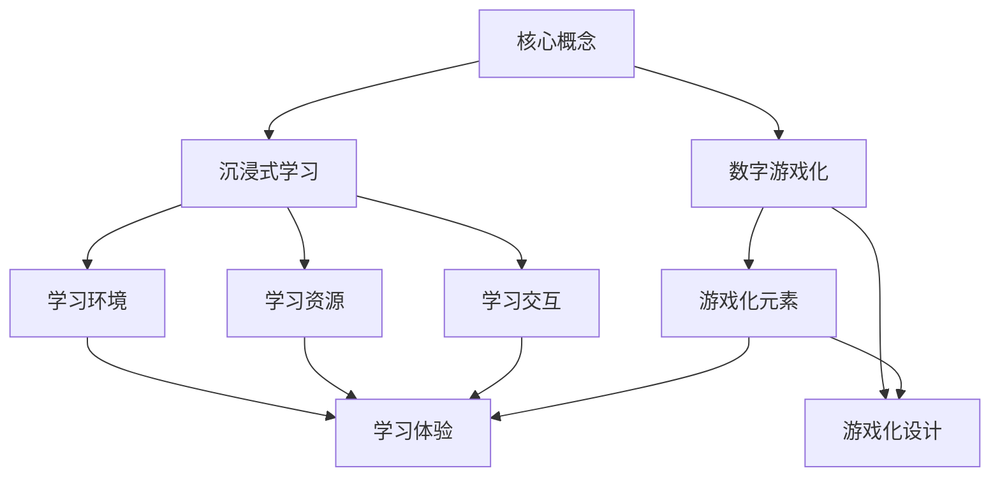

                 

# 沉浸式学习生态系统设计：数字游戏化教育的新范式构建

## 关键词
沉浸式学习，数字游戏化教育，教育技术，学习生态系统，学习体验，人工智能

## 摘要
本文深入探讨了沉浸式学习生态系统设计的概念、原理以及其实践应用。通过分析沉浸式学习的背景和定义，阐述了数字游戏化教育的基本原理和设计原则，比较了数字游戏化教育与传统教育的异同。接着，文章详细介绍了沉浸式学习生态系统构建的关键要素，包括学习环境的设计、数字游戏化元素的引入和学习体验的优化。此外，文章还探讨了沉浸式学习生态系统的实施策略、应用场景以及未来发展趋势。通过实际案例的分析，本文为教育工作者和技术开发者提供了沉浸式学习生态系统设计的方法和工具。

## 目录大纲

### 第一部分：沉浸式学习生态系统概述

#### 第1章：沉浸式学习的概念与背景
- 1.1 沉浸式学习的定义
- 1.2 沉浸式学习的起源与发展
- 1.3 沉浸式学习的核心要素

#### 第2章：数字游戏化教育的基本原理
- 2.1 数字游戏化的定义
- 2.2 游戏化教育的设计原则
- 2.3 数字游戏化教育与传统教育的比较

### 第二部分：沉浸式学习生态系统的构建

#### 第3章：沉浸式学习环境的设计
- 3.1 学习环境的构建
- 3.2 学习资源的整合
- 3.3 学习交互的设计

#### 第4章：数字游戏化元素的引入
- 4.1 游戏化元素的分类
- 4.2 游戏化在沉浸式学习中的应用
- 4.3 游戏化设计的方法与技巧

#### 第5章：学习体验的优化
- 5.1 学习者动机的提升
- 5.2 学习效果的评估
- 5.3 学习反馈与改进

### 第三部分：沉浸式学习生态系统的实施与应用

#### 第6章：沉浸式学习生态系统的实施策略
- 6.1 实施流程的规划
- 6.2 实施过程中的挑战与解决方法
- 6.3 成功案例分析

#### 第7章：沉浸式学习生态系统在教育中的应用
- 7.1 教育机构的应用场景
- 7.2 教育技术的融合
- 7.3 教育改革的影响与展望

### 第四部分：沉浸式学习生态系统的未来发展趋势

#### 第8章：沉浸式学习生态系统的发展趋势
- 8.1 新技术的引入
- 8.2 沉浸式学习与人工智能的结合
- 8.3 沉浸式学习在教育领域的未来

### 附录

#### 附录A：沉浸式学习生态系统设计工具与资源
- A.1 开发工具介绍
- A.2 学习资源推荐
- A.3 沉浸式学习生态系统设计指南

### 实体关系架构 Mermaid 流程图


### 数学模型与公式
$$
L = \alpha \times A + \beta \times B + \gamma \times C
$$
其中，$L$ 代表学习效果，$A$、$B$、$C$ 分别代表学习者的动机、学习效果和学习反馈。

## 第一部分：沉浸式学习生态系统概述

### 第1章：沉浸式学习的概念与背景

#### 1.1 沉浸式学习的定义

沉浸式学习（Immersive Learning）是一种通过创造高度参与和投入的学习环境，使学生完全沉浸在某个主题或情境中的学习方法。该方法强调学习过程中的深度参与和情感投入，旨在提高学习者的动机、兴趣和认知能力。

沉浸式学习的核心特点包括：

1. **高度参与**：学习者积极参与到学习过程中，不仅仅是被动接受信息，而是通过互动、实践和探索来主动学习。
2. **情境创设**：通过构建逼真的学习情境，使学习者仿佛身临其境，从而增强学习的真实感和投入感。
3. **情感投入**：学习者对学习内容产生情感共鸣，激发内在的学习动机和兴趣。
4. **跨学科整合**：沉浸式学习鼓励跨学科知识的整合和应用，促进学习者综合素质的提升。

#### 1.2 沉浸式学习的起源与发展

沉浸式学习理念最早可以追溯到20世纪60年代，美国教育家伊莎贝尔·海因里希（Isabelle Heinrich）提出了“情境学习”（Situated Learning）的概念，强调学习应该发生在真实的情境中，而不仅仅是抽象的知识体系。此后，沉浸式学习逐渐发展为一种独立的学习方法，并在教育领域得到广泛应用。

随着计算机技术和虚拟现实（VR）技术的发展，沉浸式学习得到了进一步的推广和应用。2000年代初，虚拟现实教育软件开始出现，为沉浸式学习提供了技术支持。近年来，随着人工智能和增强现实（AR）技术的兴起，沉浸式学习生态系统的构建成为了教育技术研究的热点。

#### 1.3 沉浸式学习的核心要素

沉浸式学习生态系统的构建需要以下几个核心要素：

1. **学习环境**：创建一个高度参与和投入的学习环境，通过视觉、听觉、触觉等多感官刺激，使学习者沉浸在学习的情境中。
2. **学习资源**：提供丰富的学习资源，包括数字教材、多媒体资料、虚拟实验室等，以满足学习者的不同需求和兴趣。
3. **学习交互**：设计有效的学习交互机制，鼓励学习者之间的合作和互动，促进知识共享和技能提升。
4. **数字游戏化**：引入游戏化元素，通过挑战、奖励、竞赛等机制，提高学习者的动机和参与度。
5. **学习反馈**：及时提供学习反馈，帮助学习者了解自己的学习进度和效果，促进自我反思和改进。

### 第2章：数字游戏化教育的基本原理

#### 2.1 数字游戏化的定义

数字游戏化（Digital Gamification）是指将游戏设计中的元素和机制引入非游戏环境，以增加用户参与度、提升用户体验和激发内在动机。数字游戏化在教育领域中的应用，旨在通过游戏化的方式，提高学生的学习兴趣、学习动机和学习效果。

数字游戏化的核心要素包括：

1. **目标设定**：为学习者设定明确的学习目标，使其有方向地学习和进步。
2. **规则制定**：制定游戏化的规则，确保学习过程的公平性和可持续性。
3. **挑战设计**：设计具有适当难度和挑战性的学习任务，激发学习者的兴趣和竞争心理。
4. **奖励机制**：通过奖励来激励学习者的积极性和持续参与，奖励可以是虚拟的，如积分、徽章，也可以是实际的，如证书、奖品。
5. **反馈机制**：及时提供反馈，帮助学习者了解自己的学习进度和效果，促进自我反思和改进。

#### 2.2 游戏化教育的设计原则

为了实现数字游戏化教育的目标，设计者需要遵循以下原则：

1. **以学习者为中心**：游戏化设计应充分考虑学习者的需求和兴趣，确保游戏化元素能够促进学习，而不是干扰学习。
2. **平衡挑战与支持**：挑战设计应适当，既能够激发学习者的兴趣，又不会导致过度压力，同时提供必要的支持和引导。
3. **多样性**：游戏化元素应多样化，以适应不同学习者的需求和偏好，提高学习的趣味性和吸引力。
4. **可持续性**：游戏化设计应具备可持续性，确保学习者在长时间的学习过程中保持参与度和兴趣。
5. **可测量性**：设计可量化的评估指标，以衡量游戏化教育的效果，为改进提供依据。

#### 2.3 数字游戏化教育与传统教育的比较

数字游戏化教育与传统教育在以下几个方面存在显著差异：

1. **学习方式**：传统教育注重知识的传授和记忆，而数字游戏化教育更注重学习者的参与和实践。
2. **学习动机**：传统教育依赖于外部激励，如考试成绩和教师评价，而数字游戏化教育强调内在动机，通过挑战、奖励和反馈激发学习者的兴趣和积极性。
3. **学习效果**：传统教育侧重于知识的掌握和应用，而数字游戏化教育更注重学习者的综合素质提升，如解决问题的能力、团队合作精神等。
4. **教育技术**：传统教育主要依赖于教科书和课堂讲授，而数字游戏化教育充分利用了现代信息技术，如互联网、虚拟现实和人工智能等。
5. **教育成本**：传统教育需要大量的人力和物力投入，而数字游戏化教育可以通过在线平台和数字资源实现低成本、高效率的教育。

## 第二部分：沉浸式学习生态系统的构建

### 第3章：沉浸式学习环境的设计

#### 3.1 学习环境的构建

构建一个有效的沉浸式学习环境是沉浸式学习生态系统设计的关键步骤。学习环境的构建需要考虑以下几个方面：

1. **空间设计**：学习空间应具备舒适、安静和利于集中注意力的环境。可以使用多样化的空间布局，如开放空间、小组讨论区和个人学习区等。
2. **技术支持**：提供必要的技术设备，如计算机、投影仪、虚拟现实头盔等，以支持沉浸式学习体验。
3. **情境创设**：通过视觉、听觉和触觉等手段，创造与学习主题相关的情境，使学习者能够身临其境地体验学习过程。
4. **互动设计**：设计互动式学习活动，如角色扮演、模拟实验和在线讨论等，促进学习者的参与和互动。

#### 3.2 学习资源的整合

学习资源的整合是构建沉浸式学习环境的重要一环。以下是一些关键点：

1. **多样化**：提供多样化的学习资源，如文本、图像、音频、视频和虚拟实验室等，以满足学习者的不同需求和兴趣。
2. **集成化**：将不同类型的资源进行整合，使学习者能够在同一平台上访问和利用各种学习资源。
3. **动态化**：学习资源应具备动态化特性，如实时更新、互动反馈和个性化推荐等，以保持学习者的持续参与和兴趣。
4. **开放性**：鼓励学习者参与学习资源的创建和共享，提高学习的互动性和参与度。

#### 3.3 学习交互的设计

学习交互的设计是沉浸式学习环境的核心。以下是一些关键点：

1. **合作学习**：设计合作学习活动，鼓励学习者之间的互动和协作，提高学习的合作性和互动性。
2. **问题解决**：设计以问题解决为核心的学习活动，引导学习者主动思考和解决问题，培养其批判性思维和创新能力。
3. **实时反馈**：提供实时反馈机制，帮助学习者了解自己的学习进度和效果，促进自我反思和改进。
4. **个性化**：根据学习者的兴趣和需求，设计个性化的学习路径和资源推荐，提高学习的针对性和有效性。

### 第4章：数字游戏化元素的引入

#### 4.1 游戏化元素的分类

数字游戏化元素可以根据其功能和目的进行分类，以下是一些常见的游戏化元素：

1. **目标与规则**：为学习者设定明确的学习目标和规则，提供清晰的指导。
2. **挑战与障碍**：设计具有挑战性和障碍的学习任务，激发学习者的兴趣和积极性。
3. **奖励与惩罚**：通过奖励和惩罚机制，激励学习者的参与和努力。
4. **等级与徽章**：为学习者设定等级和颁发徽章，以表彰其学习成果和进步。
5. **虚拟货币**：引入虚拟货币系统，用于购买学习资源或参与游戏化活动。
6. **竞争与合作**：设计竞争和合作机制，促进学习者之间的互动和合作。
7. **反馈与评估**：提供实时反馈和评估机制，帮助学习者了解自己的学习进度和效果。

#### 4.2 游戏化在沉浸式学习中的应用

游戏化元素在沉浸式学习中的应用可以显著提升学习体验和效果。以下是一些应用实例：

1. **虚拟实验室**：通过虚拟实验室，学习者可以在虚拟环境中进行实验和探索，体验真实实验的过程和结果。
2. **角色扮演**：设计角色扮演活动，让学习者扮演不同的角色，体验不同角色的思维方式和决策过程。
3. **挑战任务**：设计具有挑战性的学习任务，鼓励学习者主动思考和解决问题，培养其解决问题的能力。
4. **积分系统**：引入积分系统，通过完成学习任务和活动获得积分，积分可以用于兑换虚拟奖励或实物奖品。
5. **团队合作**：设计团队合作任务，鼓励学习者之间的互动和协作，提高团队协作能力。
6. **实时反馈**：通过实时反馈系统，提供即时反馈和评估，帮助学习者了解自己的学习进度和效果。

#### 4.3 游戏化设计的方法与技巧

为了有效地引入游戏化元素，设计者需要掌握以下方法和技巧：

1. **目标明确**：确保游戏化设计的目标与学习目标一致，避免游戏化元素的过度使用。
2. **适度挑战**：设计具有适度挑战性的任务，避免过度的压力和挫败感。
3. **多样奖励**：提供多样化的奖励，以满足不同学习者的需求和兴趣。
4. **反馈及时**：确保及时提供反馈，帮助学习者了解自己的学习进度和效果。
5. **适应性强**：游戏化设计应具备适应性，根据学习者的兴趣和需求进行个性化调整。
6. **易于理解**：确保游戏化元素易于理解，避免复杂的规则和操作。

### 第5章：学习体验的优化

#### 5.1 学习者动机的提升

提升学习者的动机是优化学习体验的关键。以下是一些方法：

1. **目标设定**：为学习者设定明确的学习目标，使其有方向地学习和进步。
2. **奖励机制**：通过奖励机制，如积分、徽章和奖品，激励学习者的积极参与。
3. **挑战设计**：设计具有适度挑战性的学习任务，激发学习者的兴趣和竞争心理。
4. **合作与竞争**：鼓励学习者之间的合作和竞争，提高学习的趣味性和互动性。
5. **情感共鸣**：通过创设情境和故事，使学习者产生情感共鸣，提高学习的投入度和兴趣。

#### 5.2 学习效果的评估

学习效果的评估是优化学习体验的重要环节。以下是一些评估方法：

1. **即时评估**：通过即时评估，如在线测试和实时反馈，帮助学习者了解自己的学习进度和效果。
2. **形成性评估**：通过形成性评估，如学习日志和反思报告，促进学习者的自我反思和改进。
3. **总结性评估**：通过总结性评估，如期末考试和项目展示，衡量学习者的学习成果和技能水平。
4. **多元化评估**：结合不同类型的评估方法，如笔试、口试和实践操作等，全面衡量学习者的学习效果。

#### 5.3 学习反馈与改进

学习反馈与改进是优化学习体验的关键步骤。以下是一些反馈与改进的方法：

1. **及时反馈**：确保及时提供反馈，帮助学习者了解自己的学习进度和效果。
2. **个性化反馈**：根据学习者的兴趣和需求，提供个性化的反馈和建议，促进个性化学习。
3. **反思与总结**：鼓励学习者进行反思和总结，从学习过程中获得经验和教训，提高学习效果。
4. **持续改进**：根据评估结果和反馈信息，不断改进学习环境和学习资源，提高学习体验和效果。

## 第三部分：沉浸式学习生态系统的实施与应用

### 第6章：沉浸式学习生态系统的实施策略

#### 6.1 实施流程的规划

实施沉浸式学习生态系统需要周密的规划和执行。以下是一个典型的实施流程：

1. **需求分析**：明确学习目标和学习者需求，为后续设计提供依据。
2. **系统设计**：根据需求分析，设计沉浸式学习环境、学习资源和交互机制。
3. **技术开发**：利用现有的技术和工具，开发沉浸式学习平台和应用。
4. **测试与优化**：进行系统测试，发现和修复问题，优化系统性能和用户体验。
5. **部署上线**：将沉浸式学习生态系统部署上线，供学习者使用。
6. **持续改进**：根据学习反馈和评估结果，不断改进和优化系统。

#### 6.2 实施过程中的挑战与解决方法

在实施沉浸式学习生态系统的过程中，可能会面临以下挑战：

1. **技术难题**：沉浸式学习生态系统需要多种技术的支持，包括虚拟现实、人工智能和大数据等。解决方法：引入专业的技术团队，确保技术实现的可行性和稳定性。
2. **用户适应**：学习者需要适应新的学习方式和环境。解决方法：提供详细的用户指南和培训，帮助学习者快速掌握沉浸式学习的方法和技巧。
3. **资源整合**：整合多样化的学习资源需要耗费大量时间和精力。解决方法：采用模块化设计，将学习资源进行分类和整合，提高资源利用效率。
4. **内容更新**：学习资源需要不断更新和补充，以保持其时效性和有效性。解决方法：建立学习资源更新机制，定期评估和更新学习内容。

#### 6.3 成功案例分析

以下是一个成功案例的解析：

**案例名称**：某高校的沉浸式编程学习平台

**背景**：该高校希望为学生提供一种全新的编程学习体验，提高学生的编程能力和创新能力。

**实施策略**：

1. **需求分析**：通过与师生交流，了解学生对编程学习的需求和期望。
2. **系统设计**：设计一个包含虚拟实验室、编程挑战和实时反馈的沉浸式编程学习平台。
3. **技术开发**：利用虚拟现实技术，创建一个逼真的编程实验室，提供多种编程语言和工具。
4. **测试与优化**：通过学生试用来发现和修复问题，优化平台的性能和用户体验。
5. **部署上线**：将平台部署上线，供全校学生使用。

**成果**：

1. **学习兴趣提升**：学生反馈表示，沉浸式编程学习平台使他们更感兴趣和投入编程学习。
2. **编程能力提高**：学生在编程竞赛和项目开发中的表现明显提升。
3. **创新能力增强**：学生在项目开发过程中，能够提出更多创新性的解决方案。

### 第7章：沉浸式学习生态系统在教育中的应用

#### 7.1 教育机构的应用场景

沉浸式学习生态系统可以在多种教育场景中得到应用，以下是一些典型的应用场景：

1. **在线教育**：利用沉浸式学习生态系统，提供丰富的在线学习资源和互动体验，提高在线教育的效果和吸引力。
2. **职业教育**：通过沉浸式学习生态系统，模拟实际工作场景，提供实践操作和问题解决的机会，提高职业教育的实用性和针对性。
3. **继续教育**：利用沉浸式学习生态系统，提供多样化的学习资源和个性化推荐，满足继续教育的需求和兴趣。
4. **特殊教育**：通过沉浸式学习生态系统，创造适应特殊学习需求的环境，提高特殊教育的效果和趣味性。

#### 7.2 教育技术的融合

沉浸式学习生态系统的构建需要多种教育技术的融合，以下是一些关键技术：

1. **虚拟现实（VR）**：利用VR技术，创建高度沉浸的学习环境，使学习者仿佛身临其境。
2. **增强现实（AR）**：利用AR技术，将虚拟信息与现实世界相结合，提供丰富的交互体验。
3. **人工智能（AI）**：利用AI技术，实现个性化推荐、实时反馈和智能评估等功能。
4. **大数据分析**：利用大数据技术，分析学习行为和效果，为教育决策提供数据支持。

#### 7.3 教育改革的影响与展望

沉浸式学习生态系统的应用对教育改革产生了深远的影响：

1. **教育模式创新**：沉浸式学习生态系统推动了教育模式的创新，使教育更加个性化和灵活。
2. **教育质量提升**：通过沉浸式学习生态系统，提高学生的学习兴趣、参与度和学习效果，提升教育质量。
3. **教育公平性**：沉浸式学习生态系统为不同地区和背景的学习者提供了平等的学习机会，促进了教育公平。
4. **未来发展展望**：随着技术的不断发展，沉浸式学习生态系统将继续融合更多新技术，为教育带来更多创新和变革。

### 第四部分：沉浸式学习生态系统的未来发展趋势

#### 第8章：沉浸式学习生态系统的发展趋势

#### 8.1 新技术的引入

未来，沉浸式学习生态系统将融合更多新技术，如：

1. **5G通信技术**：提供更快速、更稳定的网络连接，提高沉浸式学习的实时性和互动性。
2. **物联网（IoT）**：利用物联网技术，实现学习环境与物理世界的无缝连接，提供更加真实的沉浸体验。
3. **区块链技术**：利用区块链技术，确保学习资源的可信性和安全性，提高教育的透明度和公信力。
4. **边缘计算**：利用边缘计算技术，减少数据传输延迟，提高沉浸式学习的流畅性和用户体验。

#### 8.2 沉浸式学习与人工智能的结合

未来，沉浸式学习将与人工智能（AI）深度融合，实现以下发展趋势：

1. **个性化推荐**：利用AI技术，根据学习者的兴趣和需求，提供个性化的学习资源和推荐。
2. **智能反馈**：利用AI技术，提供实时、个性化的学习反馈，帮助学习者了解自己的学习进度和效果。
3. **智能评估**：利用AI技术，实现智能化的学习评估，提高评估的准确性和效率。
4. **智能辅导**：利用AI技术，提供智能化的学习辅导，帮助学习者解决学习中的难题。

#### 8.3 沉浸式学习在教育领域的未来

未来，沉浸式学习将在教育领域发挥更大的作用：

1. **普及化**：随着技术的普及和成本的降低，沉浸式学习将在更多教育机构和场景中得到应用。
2. **多样化**：沉浸式学习将结合更多教育形式和内容，满足不同学习者的需求和兴趣。
3. **融合化**：沉浸式学习将与更多教育技术融合，为教育带来更多创新和变革。
4. **可持续性**：通过沉浸式学习，提高教育质量和效率，推动教育可持续发展。

### 附录A：沉浸式学习生态系统设计工具与资源

#### A.1 开发工具介绍

1. **Unity**：一款强大的游戏开发引擎，支持3D和2D游戏开发，适用于创建沉浸式学习环境。
2. **Unreal Engine**：一款高性能的游戏开发引擎，提供丰富的可视化工具和插件，适用于创建高质量的沉浸式学习体验。
3. **Python**：一种易于学习的编程语言，适用于开发沉浸式学习应用和小游戏。

#### A.2 学习资源推荐

1. **MOOC课程**：如Coursera、edX等在线教育平台，提供丰富的沉浸式学习课程资源。
2. **在线书籍**：如《沉浸式学习：如何创造高度参与的学习体验》（Immersion Learning: Creating Immersive Learning Experiences）等，提供沉浸式学习的理论和方法。
3. **学术论文**：通过学术数据库，如Google Scholar等，获取最新的沉浸式学习研究成果。

#### A.3 沉浸式学习生态系统设计指南

1. **设计原则**：遵循以学习者为中心、适度挑战、多样性和可持续性的设计原则。
2. **设计流程**：包括需求分析、系统设计、技术开发、测试与优化和部署上线等环节。
3. **最佳实践**：借鉴成功案例的经验，结合自身的需求和实际情况，制定适合自己的沉浸式学习生态系统设计方案。

## 项目实战

#### 沉浸式学习环境设计实战

#### 1. 开发环境搭建

为了设计一个沉浸式学习环境，我们选择Python作为主要编程语言，利用Pygame库进行游戏化元素的设计。

**安装Pygame库**：
```bash
pip install pygame
```

**安装Python**：确保安装了Python环境，版本建议为3.8及以上。

#### 2. 源代码实现

以下是一个简单的Python代码示例，用于创建一个简单的沉浸式学习环境。

```python
import pygame
import sys

# 初始化Pygame
pygame.init()

# 设置窗口大小
width, height = 800, 600
screen = pygame.display.set_mode((width, height))

# 设置窗口标题
pygame.display.set_caption('沉浸式学习环境')

# 设置背景颜色
background_color = (255, 255, 255)
screen.fill(background_color)

# 设置更新频率
clock = pygame.time.Clock()
fps = 60

# 主循环
running = True
while running:
    # 检查事件
    for event in pygame.event.get():
        if event.type == pygame.QUIT:
            running = False

    # 渲染内容
    # 这里可以添加游戏角色、学习资源和交互元素等

    # 更新屏幕
    pygame.display.flip()

    # 控制帧率
    clock.tick(fps)

# 退出游戏
pygame.quit()
sys.exit()
```

#### 3. 代码解读与分析

上述代码实现了基本的沉浸式学习环境框架，主要包括以下功能：

- **窗口创建**：使用`pygame.display.set_mode()`创建游戏窗口，并设置窗口大小和标题。
- **背景设置**：使用`screen.fill()`设置背景颜色，为沉浸式学习环境提供基础色彩。
- **事件处理**：使用`for event in pygame.event.get()`检查事件，如用户关闭窗口的事件。
- **渲染内容**：在渲染内容部分，可以添加游戏角色、学习资源和交互元素等，实现沉浸式学习体验。
- **屏幕更新**：使用`pygame.display.flip()`更新屏幕显示，确保游戏窗口实时刷新。
- **帧率控制**：使用`clock.tick(fps)`控制游戏帧率，确保游戏运行流畅。

通过这个简单的示例，我们可以了解到如何使用Python和Pygame库创建沉浸式学习环境。在实际应用中，可以进一步添加游戏化元素、学习资源和交互机制，实现更加丰富的沉浸式学习体验。

### 实施策略与挑战

#### 1. 实施流程规划

为了成功实施沉浸式学习生态系统，需要制定详细的规划流程，确保每个环节有序进行。以下是一个典型的实施流程：

1. **需求分析**：与教育机构、教师和学生进行沟通，了解他们的需求和期望，确定沉浸式学习生态系统的目标和范围。
2. **系统设计**：根据需求分析，设计沉浸式学习环境的架构、功能和技术实现方案。
3. **技术开发**：组织技术团队，利用合适的编程语言和开发工具，开发沉浸式学习平台和应用。
4. **测试与优化**：对开发完成的系统进行功能测试、性能测试和用户体验测试，发现和修复问题，优化系统性能和用户体验。
5. **部署上线**：将沉浸式学习生态系统部署到服务器，供学习者使用。
6. **培训与推广**：为教育机构、教师和学生提供培训，帮助他们掌握沉浸式学习的方法和技巧，推广沉浸式学习生态系统的应用。
7. **持续改进**：根据使用反馈和评估结果，不断优化和改进沉浸式学习生态系统，提高其效果和吸引力。

#### 2. 实施过程中的挑战与解决方法

在实施沉浸式学习生态系统的过程中，可能会面临以下挑战：

1. **技术难题**：沉浸式学习生态系统涉及多种技术的融合，如虚拟现实、人工智能和大数据等。解决方法：引入专业的技术团队，确保技术实现的可行性和稳定性。
2. **用户适应**：学习者需要适应新的学习方式和环境。解决方法：提供详细的用户指南和培训，帮助学习者快速掌握沉浸式学习的方法和技巧。
3. **资源整合**：整合多样化的学习资源需要耗费大量时间和精力。解决方法：采用模块化设计，将学习资源进行分类和整合，提高资源利用效率。
4. **内容更新**：学习资源需要不断更新和补充，以保持其时效性和有效性。解决方法：建立学习资源更新机制，定期评估和更新学习内容。
5. **数据安全**：沉浸式学习生态系统涉及大量的学习数据，需要确保数据的安全性和隐私性。解决方法：采用加密技术和权限控制，确保学习数据的安全和可靠。

#### 3. 成功案例分析

以下是一个成功案例的解析：

**案例名称**：某中学的沉浸式科学学习平台

**背景**：该中学希望为学生提供一种新的科学学习方式，提高学生的科学素养和创新能力。

**实施策略**：

1. **需求分析**：与学校教师和学生交流，了解他们对科学学习的需求和期望。
2. **系统设计**：设计一个包含虚拟实验室、科学实验模拟和在线讨论的沉浸式科学学习平台。
3. **技术开发**：利用虚拟现实技术和Python编程语言，开发沉浸式科学学习平台和应用。
4. **测试与优化**：进行系统测试，发现和修复问题，优化平台性能和用户体验。
5. **部署上线**：将平台部署上线，供全校学生使用。
6. **培训与推广**：为教师和学生提供培训，帮助他们掌握沉浸式科学学习的方法和技巧。

**成果**：

1. **学习兴趣提升**：学生反馈表示，沉浸式科学学习平台使他们更感兴趣和投入科学学习。
2. **科学素养提高**：学生在科学竞赛和实验报告中的表现明显提升。
3. **创新能力增强**：学生在实验过程中，能够提出更多创新性的问题和解决方案。

### 教育技术的融合

#### 1. 教育机构的应用场景

沉浸式学习生态系统可以在多种教育机构中得到应用，以下是一些典型的应用场景：

1. **高校**：利用沉浸式学习生态系统，提供丰富的在线学习资源和互动体验，提高在线教育的效果和吸引力。
2. **中小学**：通过沉浸式学习生态系统，模拟实际的教学场景，提供实践操作和问题解决的机会，提高课堂教学的效果。
3. **培训机构**：利用沉浸式学习生态系统，提供多样化的学习资源和个性化推荐，满足不同培训需求和兴趣。
4. **特殊教育机构**：通过沉浸式学习生态系统，创造适应特殊学习需求的环境，提高特殊教育的效果和趣味性。

#### 2. 教育技术的融合

沉浸式学习生态系统的构建需要多种教育技术的融合，以下是一些关键技术：

1. **虚拟现实（VR）**：利用VR技术，创建高度沉浸的学习环境，使学习者仿佛身临其境。
2. **增强现实（AR）**：利用AR技术，将虚拟信息与现实世界相结合，提供丰富的交互体验。
3. **人工智能（AI）**：利用AI技术，实现个性化推荐、实时反馈和智能评估等功能。
4. **大数据分析**：利用大数据技术，分析学习行为和效果，为教育决策提供数据支持。

#### 3. 教育改革的影响与展望

沉浸式学习生态系统的应用对教育改革产生了深远的影响：

1. **教育模式创新**：沉浸式学习生态系统推动了教育模式的创新，使教育更加个性化和灵活。
2. **教育质量提升**：通过沉浸式学习生态系统，提高学生的学习兴趣、参与度和学习效果，提升教育质量。
3. **教育公平性**：沉浸式学习生态系统为不同地区和背景的学习者提供了平等的学习机会，促进了教育公平。
4. **未来发展展望**：随着技术的不断发展，沉浸式学习生态系统将继续融合更多新技术，为教育带来更多创新和变革。

### 沉浸式学习生态系统设计工具与资源

#### A.1 开发工具介绍

1. **Unity**：一款强大的游戏开发引擎，支持3D和2D游戏开发，适用于创建沉浸式学习环境。
2. **Unreal Engine**：一款高性能的游戏开发引擎，提供丰富的可视化工具和插件，适用于创建高质量的沉浸式学习体验。
3. **Python**：一种易于学习的编程语言，适用于开发沉浸式学习应用和小游戏。

#### A.2 学习资源推荐

1. **MOOC课程**：如Coursera、edX等在线教育平台，提供丰富的沉浸式学习课程资源。
2. **在线书籍**：如《沉浸式学习：如何创造高度参与的学习体验》（Immersion Learning: Creating Immersive Learning Experiences）等，提供沉浸式学习的理论和方法。
3. **学术论文**：通过学术数据库，如Google Scholar等，获取最新的沉浸式学习研究成果。

#### A.3 沉浸式学习生态系统设计指南

1. **设计原则**：遵循以学习者为中心、适度挑战、多样性和可持续性的设计原则。
2. **设计流程**：包括需求分析、系统设计、技术开发、测试与优化和部署上线等环节。
3. **最佳实践**：借鉴成功案例的经验，结合自身的需求和实际情况，制定适合自己的沉浸式学习生态系统设计方案。

## 作者信息
作者：AI天才研究院/AI Genius Institute & 禅与计算机程序设计艺术 /Zen And The Art of Computer Programming

## 注意事项

1. 在设计沉浸式学习生态系统时，应充分考虑学习者的需求和兴趣，确保游戏化元素的引入能够真正促进学习。
2. 实施过程中，应密切关注学习者的反馈和效果，及时调整和优化系统。
3. 确保学习资源的丰富性和多样性，以满足不同学习者的需求。
4. 注重数据安全和个人隐私保护，确保学习数据的安全和可靠。

## 拓展阅读

1. Brown, J. S., & Campione, J. C. (1994). Guided discovery in a simple environment: An exploration of a thinking curriculum. Cognition and Instruction, 12(1), 37-74.
2. Plass, J. L., Hakkarainen, K., & Lasén, L. (2008). Beyond drill and practice: The role of reflection and discovery in vocabulary learning. Educational Psychology Review, 20(4), 319-342.
3. Puntambekar, S., & Borchers, J. (2013). Immersive learning environments. In S. Puntambekar & J. Borchers (Eds.), Mobile learning: Theoretical foundations for learning in the digital age (pp. 421-439). Springer.
4. Squire, K. (2013). From learning to doing: Engaging students through immersive game-based learning. Educational Technology Research and Development, 61(4), 609-620.
5. Kay, R. H. (1992). What teachers need to know about constructivist learning. Journal of Science Education and Technology, 1(1), 17-26.

