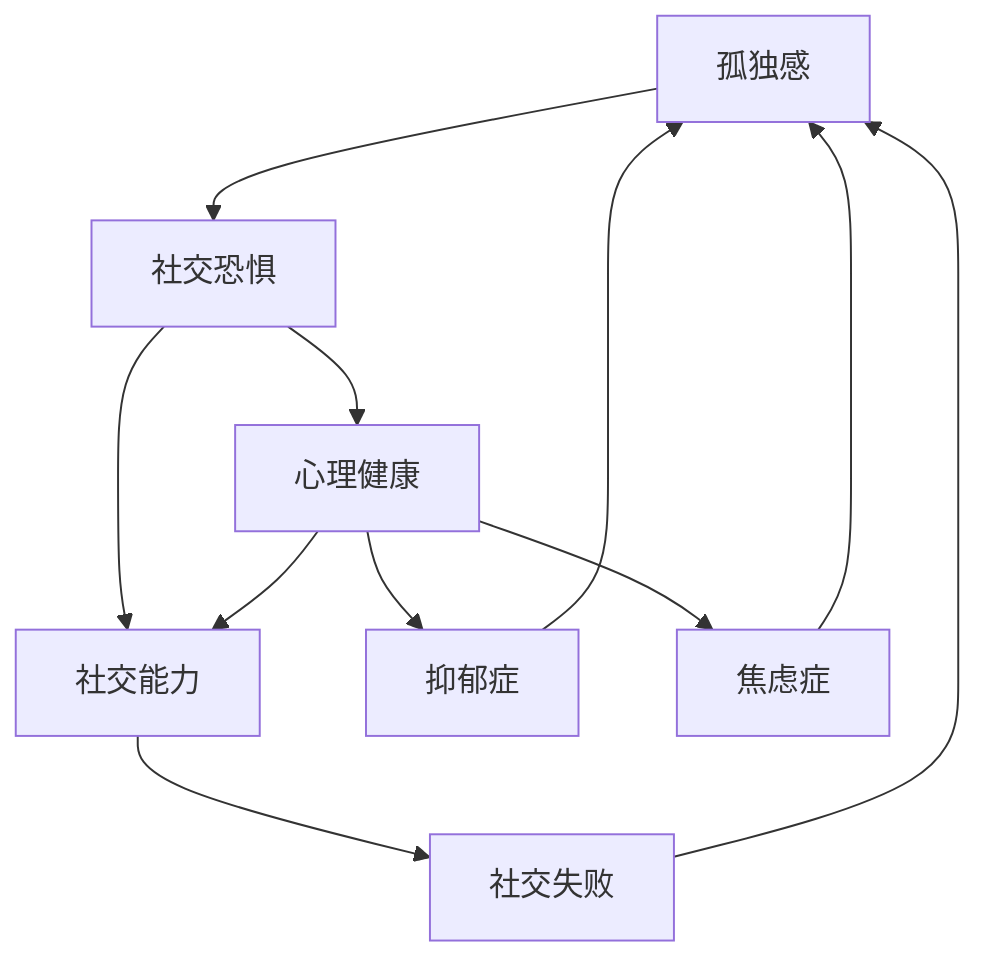

                 

### 《治愈现代人的孤独感：重建社交连接的方法》

> 关键词：孤独感、社交连接、心理健康、数字化时代、社交技巧、情感管理

> 摘要：本文将深入探讨现代人在孤独感方面的普遍现象及其成因，从技术视角提供重建社交连接的方法。通过自我认知与情感管理、社交技巧提升、数字化社交策略、社交活动参与和社交支持获取等多方面的分析，我们旨在为读者提供一套切实可行的解决方案，以应对孤独感，促进心理健康。

### 目录

1. **孤独感的现状与成因**
    1.1 孤独感的定义与测量
    1.2 孤独感在现代社会中的普遍性
    1.3 孤独感对个体健康的影响
    2.1 社会因素
        2.1.1 社会变迁
        2.1.2 数字化时代的影响
        2.1.3 工作与生活的压力
    3.2 孤独感的核心概念与联系
        3.1 社交恐惧与孤独感的关系
        3.2 心理健康与社交能力
        3.3 Mermaid流程图：孤独感形成与影响机制
2. **重建社交连接的方法**
    4.1 自我认知与情感管理
        4.1.1 自我认知的重要性
        4.1.2 情感管理技巧
        4.1.3 自我提升的途径
    5.2 社交技巧的提升
        5.1 社交基本规则
        5.2 沟通技巧
        5.3 人际关系管理
    6.3 数字化社交的策略
        6.1 社交媒体的使用
        6.2 在线社交的优势与挑战
        6.3 社交网络的安全问题
    7.4 社交活动的参与
        7.1 线下活动的参与
        7.2 线上活动的参与
        7.3 社交活动的选择与规划
    8.5 社交支持的获取
        8.1 社交支持的类型
        8.2 社交支持的重要作用
        8.3 寻求专业帮助的途径
3. **案例分析与实践**
    9.1 成功案例分析
        9.1.1 案例一：社区建设中的社交连接
        9.1.2 案例二：职场中的社交连接
        9.1.3 案例三：数字化时代的社交连接
    10.2 实践指南与资源推荐
        10.2.1 实践指南
        10.2.2 社交技能提升的资源推荐
        10.2.3 社交支持组织的介绍
4. **未来展望**
    11.1 社交连接技术的发展趋势
    11.2 社交连接在未来社会中的角色
    11.3 持续关注孤独感与社交连接的研究
5. **附录**
    A.1 推荐阅读与深入研究
        A.1.1 相关书籍推荐
        A.1.2 学术论文推荐
        A.1.3 社交技能提升课程与工作坊推荐
        A.1.4 社交支持应用与工具推荐
6. **总结**

### 引言

在现代快节奏的生活中，孤独感已成为一种普遍的社会现象，影响着越来越多的人。随着数字技术的快速发展，人们的社交方式发生了翻天覆地的变化，但这种变化似乎并未有效缓解孤独感，反而使得这一问题变得更加复杂。本文旨在通过技术视角，深入探讨孤独感的现状、成因，并提出一系列重建社交连接的方法，以期帮助读者理解孤独感，找到解决之道。

首先，我们将分析孤独感的现状，了解这一现象的普遍性和对个体健康的影响。接着，我们会探讨孤独感的成因，特别是社会变迁、数字化时代的影响以及工作与生活的压力。在此基础上，我们将引入孤独感的核心概念与联系，通过Mermaid流程图展示孤独感的形成与影响机制。

随后，我们将转向重建社交连接的方法，分为自我认知与情感管理、社交技巧提升、数字化社交策略、社交活动参与和社交支持获取五个部分，逐一分析并提供建议。为了使这些方法更具实践性，我们还将结合实际案例进行深入剖析，并提供实践指南与资源推荐。

最后，我们将对未来社交连接技术的发展趋势进行展望，探讨其在未来社会中的角色，并鼓励读者持续关注孤独感与社交连接的研究。通过本文的探讨，我们希望能够为治愈现代人的孤独感，重建温馨的社会网络贡献一份力量。

### 第一部分：孤独感的现状与成因

#### 第1章：现代人的孤独感现状

孤独感，作为一种复杂的情感体验，通常指的是个体在社交互动中的疏离感、被忽视或被边缘化的感觉。在现代社会中，孤独感已经不仅仅是一个人的私人情感问题，而是一个广泛存在的现象，影响着人们的身心健康。

**1.1 孤独感的定义与测量**

孤独感没有一个确切的定义，但通常被认为是一种主观体验，涉及个体在社交互动中的感受和评价。心理学家沃尔特·托夫勒（Walter Toman）和萨莉·特克尔（Sally Tocker）将孤独感描述为“感到与他人隔离、缺乏亲密的社交关系，以及感到不被理解”。

孤独感的测量通常使用问卷调查的形式，如UCLA孤独感量表（UCLA Loneliness Scale）和莱文森孤独感量表（Levinson Loneliness Scale）。这些量表通过一系列问题来评估个体在社交互动中的感受，从而衡量孤独感的程度。

**1.2 孤独感在现代社会中的普遍性**

孤独感在现代社会中的普遍性可以从多个角度进行观察。根据世界卫生组织（WHO）的数据，全球约有三分之一的成年人表示在某个时期感受到了孤独。在美国，大约有45%的成年人报告说他们经常或偶尔感到孤独。这些数据表明，孤独感已经成为一个全球性的问题。

年轻人尤其容易受到孤独感的困扰。一项针对美国大学生的研究表明，有超过一半的大学生报告在过去一年中感到孤独。此外，工作压力、婚姻问题、子女离家等因素也会加剧孤独感。

**1.3 孤独感对个体健康的影响**

孤独感对个体健康的影响是多方面的，包括心理健康和身体健康。长期孤独感会增加抑郁症、焦虑症和其他心理健康问题的风险。研究表明，孤独感与抑郁症的关联程度甚至高于吸烟和肥胖。

身体健康方面，孤独感也与多种疾病有关，如心脏病、高血压和免疫系统功能下降。一项针对老年人的研究发现，那些感到孤独的个体比那些不感到孤独的个体更易患心脏病。

此外，孤独感还会影响个体的认知功能。长期孤独感可能导致认知能力的下降，包括记忆力、注意力和执行功能等。

**结论**

孤独感在现代社会中是一个普遍存在的现象，对个体健康产生着多方面的影响。了解孤独感的定义和测量方法，以及其普遍性和健康影响，是寻找解决方案的第一步。在接下来的章节中，我们将进一步探讨孤独感的成因，以及如何通过重建社交连接来缓解这一情感体验。

#### 第2章：孤独感的成因

孤独感并非单一因素所致，而是由多种社会因素、个人心理因素以及环境因素共同作用的结果。以下是孤独感的几个主要成因。

**2.1 社会因素**

**2.1.1 社会变迁**

现代社会变迁是导致孤独感增加的一个重要因素。随着全球化进程的加速和城市化的发展，传统的社会结构和社会关系网络发生了变化。人们更加注重个人发展，追求自我实现，这导致了一些传统家庭和社区纽带的弱化。人们往往因工作、学业等原因远离家乡，缺乏长期的亲密社交关系。

**2.1.2 数字化时代的影响**

数字化时代的到来，虽然为人们提供了更多的社交途径，但同时也带来了一些负面影响。社交媒体和即时通讯工具虽然增加了人们的社交频率，但往往导致浅层次的社交互动，缺乏深度的情感交流。人们可能因为沉迷于虚拟世界，而忽视了现实生活中的真实社交关系。此外，数字化社交的匿名性和虚拟性，也可能导致一些人在现实社交中感到更加孤独和疏离。

**2.1.3 工作与生活的压力**

现代社会中，工作压力和生活的快节奏也是导致孤独感的重要因素。长期的工作压力可能导致个体在心理和生理上感到疲惫，缺乏时间和精力进行社交活动。尤其是在竞争激烈的环境中，个体可能因为工作成绩的压力而减少了与家人和朋友的交流。此外，家庭责任的增加，如抚养子女和照顾老人，也可能使得个体在时间和精力上难以兼顾社交活动。

**2.2 个人心理因素**

**2.2.1 社交恐惧与孤独感的关系**

社交恐惧是一种常见的心理障碍，表现为个体在社交场合中感到极度焦虑和不安。社交恐惧可能导致个体避免社交活动，进而加剧孤独感。研究发现，社交恐惧与孤独感之间存在显著的正相关关系，即社交恐惧程度越高，孤独感也越强。

**2.2.2 心理健康与社交能力**

心理健康问题，如抑郁症、焦虑症等，也会影响个体的社交能力和社交意愿。患有心理健康问题的个体可能因为情绪问题而难以进行有效的社交互动，导致孤独感的产生。此外，低自尊和自卑感也可能导致个体在社交场合中感到不自在，进一步加剧孤独感。

**2.2.3 自我认知与情感管理**

个体的自我认知和情感管理能力对孤独感的产生也有重要影响。缺乏自我认知可能导致个体不了解自己的情感需求，无法有效管理自己的情绪。情感管理能力较差的个体可能在面对负面情绪时，难以通过健康的社交方式来缓解，从而增加孤独感的体验。

**2.3 环境因素**

**2.3.1 社区支持与邻里关系**

社区支持和邻里关系对个体的社交体验和孤独感有显著影响。一个支持性强的社区和友好和谐的邻里关系可以提供情感支持和社交机会，有助于减轻孤独感。相反，缺乏社区支持和邻里关系可能导致个体感到孤立无援，加剧孤独感的体验。

**2.3.2 社会经济地位与教育水平**

社会经济地位和教育水平也是影响孤独感的重要因素。较低的社会经济地位可能导致个体在资源和机会上处于劣势，限制其参与社交活动的能力。而较高的教育水平通常与更好的心理健康和更强的社交能力相关，有助于减少孤独感的体验。

**结论**

孤独感的成因是多方面的，涉及社会因素、个人心理因素以及环境因素。了解这些成因，有助于我们更好地预防和应对孤独感。在接下来的章节中，我们将进一步探讨如何通过自我认知与情感管理、社交技巧提升等策略来重建社交连接，缓解孤独感。

#### 第3章：孤独感的核心概念与联系

在理解孤独感这一复杂现象时，我们需要关注其核心概念与联系。这些概念不仅帮助我们更好地定义和测量孤独感，还揭示了其形成和影响的机制。以下将详细探讨孤独感与社交恐惧、心理健康以及社交能力之间的关系，并使用Mermaid流程图来展示这些关系。

**3.1 社交恐惧与孤独感的关系**

社交恐惧，即对社交场合的极度焦虑和恐惧，是导致孤独感的一个重要因素。社交恐惧个体往往避免社交互动，这直接导致他们在社交关系中感到疏离和孤独。研究表明，社交恐惧与孤独感之间存在显著的正向关系，即社交恐惧程度越高，孤独感也越强。

**3.2 心理健康与社交能力**

心理健康问题，如抑郁症、焦虑症等，会直接影响个体的社交能力和社交意愿。心理健康良好的个体通常拥有更好的情感调节能力和社交技巧，能够更有效地进行社交互动。相反，心理健康问题可能导致个体在社交场合中感到不自在，从而减少社交频率，增加孤独感。

**3.3 社交能力与孤独感**

社交能力是建立和维护社交关系的关键。高社交能力的个体通常能够更好地理解和应对社交场合中的各种情境，建立和维护稳定的人际关系。反之，社交能力较低的个体可能在社交互动中遇到更多的挑战，导致社交失败，从而产生孤独感。

**Mermaid流程图：孤独感形成与影响机制**

以下是孤独感形成与影响机制的Mermaid流程图：

**流程图说明：**

- **A[孤独感]**：作为流程图的起点和终点，孤独感是一个核心概念，反映了个体在社交互动中的主观体验。
- **B[社交恐惧]**：社交恐惧直接导致个体避免社交，从而增加孤独感。
- **C[心理健康]**：心理健康问题影响个体的社交能力和社交意愿，进而影响孤独感。
- **D[社交能力]**：社交能力影响个体在社交场合中的表现，影响孤独感的体验。
- **E[抑郁症]**：抑郁症是心理健康问题的一种，影响个体的情绪调节能力和社交互动。
- **F[焦虑症]**：焦虑症同样是心理健康问题，影响个体的情绪和行为，增加孤独感。
- **G[社交失败]**：社交失败是社交能力不足或社交恐惧导致的负面结果，进一步加剧孤独感。

**结论**

通过上述核心概念和Mermaid流程图的展示，我们可以更清晰地理解孤独感的形成机制和影响因素。理解这些关系对于预防和应对孤独感具有重要意义。在接下来的章节中，我们将探讨如何通过自我认知与情感管理、社交技巧提升等策略，重建社交连接，减轻孤独感的体验。

#### 第4章：自我认知与情感管理

孤独感的缓解离不开自我认知与情感管理。个体只有深入理解自己的情感需求和内心状态，才能更有效地管理自己的情绪，提升社交能力。以下将详细探讨自我认知的重要性、情感管理技巧以及自我提升的途径。

**4.1 自我认知的重要性**

自我认知是个体对自己心理状态、情感需求和价值观的深刻理解。它不仅是心理健康的重要组成部分，也是建立和维护良好社交关系的基础。以下是自我认知的重要性：

- **提高情绪调节能力**：自我认知有助于个体识别和理解自己的情绪状态，从而更有效地调节情绪。了解自己的情感需求，能够帮助个体在面对压力和挑战时，保持冷静和理智，减少负面情绪的产生。
- **促进心理健康**：自我认知有助于个体识别和解决潜在的心理健康问题，如焦虑、抑郁等。通过自我反思和认知行为疗法，个体可以更好地理解和应对自己的情绪，提高生活质量。
- **提升社交能力**：自我认知有助于个体了解自己的价值观和社交偏好，从而更好地理解和适应他人的需求。这有助于建立更深层次的社交关系，减少孤独感。

**4.2 情感管理技巧**

情感管理是指个体如何识别、理解和应对自己的情感。以下是一些有效的情感管理技巧：

- **情绪识别**：首先，个体需要学会识别和理解自己的情绪。可以通过日记记录、情绪日记等方式，记录自己的情绪变化，逐步提高情绪识别能力。
- **情绪调节**：在识别情绪后，个体需要学会调节情绪。可以通过深呼吸、冥想、运动等方式，帮助自己放松身心，缓解负面情绪。
- **情感表达**：学会有效表达情感是建立良好社交关系的关键。个体可以通过与他人分享自己的感受，寻求支持和理解。在表达情感时，要注意语气和表达方式，避免过度情绪化或压抑情绪。

**4.3 自我提升的途径**

自我提升是指个体通过不断学习和成长，提高自己的心理素质和社交能力。以下是一些自我提升的途径：

- **阅读和自我反思**：阅读心理学、人际关系等方面的书籍，可以帮助个体提高自我认知和情感管理能力。自我反思是自我提升的重要方法，通过反思自己的行为和决策，个体可以更好地了解自己，找到改进的方向。
- **参加培训和课程**：参加社交技巧、情感管理等方面的培训和课程，可以帮助个体系统学习相关知识和技巧。这些课程通常包括案例分析、互动练习等，有助于提升实际操作能力。
- **建立社交网络**：通过加入兴趣小组、参与社交活动等方式，个体可以拓展自己的社交网络，增加与他人互动的机会。在这个过程中，个体可以学习如何与人沟通、建立和维护关系。
- **寻求专业帮助**：在自我提升过程中，如果遇到困难或心理问题，可以寻求专业心理咨询师的帮助。心理咨询师可以提供专业的指导和支持，帮助个体解决情感和心理问题。

**结论**

自我认知与情感管理是缓解孤独感的关键。通过提高自我认知、掌握情感管理技巧以及不断自我提升，个体可以更好地理解和应对自己的情感需求，提升社交能力，从而减轻孤独感的体验。在接下来的章节中，我们将探讨如何提升社交技巧，进一步重建社交连接。

#### 第5章：社交技巧的提升

提升社交技巧是缓解孤独感、建立和维护社交关系的重要途径。有效的社交技巧不仅能够帮助个体更好地与他人沟通，还能增强自信心和社交满意度。以下将详细探讨社交基本规则、沟通技巧以及人际关系管理。

**5.1 社交基本规则**

- **尊重他人**：尊重是社交互动的基础。无论在何种场合，尊重他人的观点、感受和隐私都是非常重要的。这包括倾听他人、避免打断他人讲话以及避免过度自我表现。
- **诚实与透明**：在社交互动中，诚实与透明有助于建立信任。避免撒谎和隐藏信息，诚实地表达自己的想法和感受，能够增加他人对你的信任。
- **积极倾听**：积极倾听不仅仅是听到对方说什么，更重要的是理解和关注对方的情感和需求。可以通过重复对方的关键词、提出开放式问题以及给予肯定反馈等方式，展示你的倾听能力。
- **礼貌和友善**：礼貌和友善的言行可以营造一个和谐的社交环境。使用礼貌用语、微笑和友好态度，能够让人感到舒适和受欢迎。

**5.2 沟通技巧**

- **清晰表达**：在沟通中，清晰表达自己的观点和需求是非常重要的。避免使用模糊的语言和含糊其辞，确保对方能够准确理解你的意思。
- **非语言沟通**：非语言沟通，如肢体语言、面部表情和语调，在沟通中扮演着重要角色。保持开放的肢体语言、微笑和适度的眼神交流，能够增强沟通的效果。
- **提问和反馈**：提问和反馈是有效沟通的关键。通过提问，可以更好地理解对方的观点和需求，而给予反馈则可以帮助对方了解你的理解和感受。确保反馈是建设性的，避免过于批评或指责。
- **情绪管理**：在沟通过程中，情绪管理至关重要。避免在情绪激动时进行沟通，以免说出伤人的话语。通过深呼吸、冥想等方式，帮助自己冷静下来，再进行沟通。

**5.3 人际关系管理**

- **建立和维护关系**：建立和维护关系需要持续的努力。通过定期保持联系、参加共同感兴趣的活动等方式，可以增强关系。记住重要节日和对方的特殊日子，表达你的关心和祝福。
- **冲突管理**：冲突在人际关系中是不可避免的。有效的冲突管理可以通过倾听对方的观点、表达自己的感受和寻找共同点来实现。避免指责和攻击对方，而是尝试找到解决问题的方法。
- **支持与帮助**：在他人需要帮助时，主动提供支持。这不仅可以增强关系，还可以让你在他人眼中变得更加可靠和值得信赖。
- **界限设置**：在人际关系中，设置合理的界限是维护关系的重要一环。明确自己的需求和界限，同时尊重他人的需求和界限，可以避免不必要的冲突和误解。

**结论**

提升社交技巧是缓解孤独感、建立和维护良好社交关系的关键。通过遵循社交基本规则、掌握有效沟通技巧以及进行良好的人际关系管理，个体可以增强自信心，提升社交满意度，从而减少孤独感的体验。在接下来的章节中，我们将探讨数字化社交的策略，进一步探讨如何利用现代技术手段重建社交连接。

#### 第6章：数字化社交的策略

随着数字化时代的到来，社交媒体和在线社交工具已经深刻改变了人们的社交方式。数字化社交提供了前所未有的便利和机会，但也带来了一些挑战和风险。以下将探讨数字化社交的使用、优势与挑战，以及社交网络的安全问题。

**6.1 社交媒体的使用**

社交媒体平台如Facebook、Instagram、Twitter和微信等，已经成为人们日常生活的重要组成部分。它们为人们提供了广阔的社交空间，使得人们能够轻松地与朋友、家人和同事保持联系。以下是社交媒体使用的一些策略：

- **明确社交目标**：在使用社交媒体前，先设定清晰的目标。例如，是希望拓展社交圈、分享生活经验，还是寻求职业发展。明确目标有助于更有针对性地使用平台。
- **合理规划时间**：避免沉迷于社交媒体，影响日常生活和工作。可以设定每天固定的使用时间，如晚上半小时，以保证休息和工作效率。
- **隐私保护**：在社交媒体上，要特别注意个人隐私的保护。避免分享过多的个人信息，如家庭住址、电话号码等，以减少隐私泄露的风险。

**6.2 在线社交的优势与挑战**

在线社交具有许多优势，但也存在一些挑战。以下是对这些优势与挑战的详细探讨：

**优势：**

- **便捷性**：在线社交可以随时随地进行，不受地理位置的限制。这使得人们能够更容易地与朋友、家人和同事保持联系。
- **多样性**：在线社交提供了多样化的社交方式，如文本聊天、视频通话、社交媒体互动等。这些方式可以满足不同人的社交需求。
- **信息共享**：在线社交平台使得信息的传播和共享变得更加迅速和广泛。人们可以快速分享新闻、生活动态和经验，从而增加社交互动的深度。

**挑战：**

- **表面化社交**：在线社交往往导致浅层次的社交互动，缺乏深度和真实的情感交流。这可能导致孤独感的加剧。
- **隐私风险**：在线社交平台上的个人信息可能被滥用或泄露。恶意攻击、网络诈骗等问题也增加了在线社交的风险。
- **成瘾性**：一些人可能会过度依赖社交媒体，导致社交成瘾。这不仅影响生活和工作，还可能对心理健康产生负面影响。

**6.3 社交网络的安全问题**

在数字化社交中，安全问题不容忽视。以下是一些常见的社交网络安全问题及对策：

- **身份盗窃**：黑客可能会利用社交媒体获取个人信息，进行身份盗窃。对策包括：避免在社交媒体上分享敏感信息，使用强密码和双重认证，定期更新密码等。
- **网络诈骗**：网络诈骗分子可能会通过社交媒体诈骗资金或个人信息。对策包括：对不明来源的信息保持警惕，避免点击不明链接，不向陌生人转账等。
- **恶意软件**：社交媒体可能成为恶意软件的传播途径。对策包括：使用安全防护软件，避免下载不明来源的文件，定期更新操作系统和软件等。

**结论**

数字化社交提供了便利和机会，但也带来了挑战和安全风险。通过合理使用社交媒体、认识到其优势和挑战，并采取必要的安全措施，我们可以更好地利用数字化社交，建立和维护健康的社交网络。在接下来的章节中，我们将探讨如何通过参与社交活动，进一步重建社交连接。

#### 第7章：社交活动的参与

社交活动是重建社交连接的重要途径，无论是线下活动还是线上活动，都能为个体提供丰富的社交机会。以下将详细探讨如何参与这些活动，并选择与规划适合的活动。

**7.1 线下活动的参与**

线下活动是建立真实人际关系的有效方式。以下是一些参与线下活动的建议：

- **参与社区活动**：社区活动如义工、社区运动会、文化节等，不仅能够结识志同道合的朋友，还能增强社区归属感。可以通过社区公告板、社区网站或社交媒体了解活动信息。
- **兴趣小组**：加入与兴趣相关的俱乐部或小组，如摄影协会、读书俱乐部、健身小组等。这些小组提供了共同的兴趣和话题，有助于建立深层次的社交关系。
- **社交聚会**：参加朋友或同事组织的聚会，如聚餐、看电影、户外运动等。这些活动能够提供轻松愉快的社交环境，增强人际关系。

**7.2 线上活动的参与**

线上活动提供了灵活和多样化的社交机会。以下是一些参与线上活动的建议：

- **在线论坛和社交媒体**：加入在线论坛和社交媒体群组，参与讨论和互动。这些平台能够拓展社交圈，结识来自不同背景的人。
- **网络研讨会和讲座**：参加网络研讨会和在线讲座，不仅能够学习新知识，还能与讲师和其他参与者进行交流。这些活动有助于提升个人技能和职业发展。
- **虚拟聚会和游戏**：通过视频通话和在线游戏，与他人进行虚拟聚会。这些活动提供了互动和娱乐，有助于缓解孤独感。

**7.3 社交活动的选择与规划**

选择合适的社交活动是重建社交连接的关键。以下是一些建议：

- **根据兴趣选择**：选择自己感兴趣的活动，能够提高参与的热情和满意度。例如，如果你对摄影感兴趣，可以参加摄影俱乐部；如果你对编程感兴趣，可以参加技术论坛。
- **平衡线上与线下活动**：虽然线上活动方便，但线下活动能够提供更真实的社交体验。根据个人情况，合理安排线上和线下活动，以保持社交的多样性。
- **设定目标和预期**：在参与社交活动前，设定清晰的目标和预期。例如，你希望通过活动结识新朋友，或提升某项技能。明确的目标有助于提高活动的效果。

**结论**

参与社交活动是重建社交连接的重要途径。无论是线下活动还是线上活动，都能为个体提供丰富的社交机会。通过合理选择和规划活动，个体可以更有效地建立和维护社交关系，缓解孤独感，提升心理健康。

#### 第8章：社交支持的获取

社交支持在缓解孤独感和提升心理健康中扮演着至关重要的角色。获取社交支持不仅能够提供情感上的安慰，还能帮助个体应对生活中的各种挑战。以下将探讨社交支持的类型、其重要作用以及如何寻求专业帮助。

**8.1 社交支持的类型**

社交支持可以分为三类：情感支持、信息支持和评价支持。

- **情感支持**：情感支持是指提供情感上的安慰和鼓励。这种支持可以帮助个体在面对压力和困难时，感到被理解和支持。例如，朋友或家人在个体感到孤独或沮丧时，提供倾听和理解。
- **信息支持**：信息支持是指提供相关的信息和资源。这种支持可以帮助个体更好地应对特定情境或问题。例如，同事或社区志愿者提供关于某个活动的信息，帮助个体参与其中。
- **评价支持**：评价支持是指提供反馈和评价，帮助个体了解自己的行为和表现。这种支持可以帮助个体提升自我认知和社交能力。例如，导师或教练提供关于某个项目的评价和反馈，帮助个体改进和提升。

**8.2 社交支持的重要作用**

社交支持对个体的心理健康和生活质量具有显著影响。以下是其重要作用：

- **缓解压力**：社交支持可以减轻个体在生活和工作中的压力。通过与支持者交流，个体可以释放负面情绪，获得心理上的安慰。
- **提升幸福感**：社交支持能够提高个体的幸福感和生活满意度。感受到他人的关心和支持，个体会感到更加快乐和满足。
- **促进心理恢复**：在面对心理健康问题，如抑郁症或焦虑症时，社交支持可以帮助个体更快地恢复。支持者提供的理解、鼓励和帮助，可以增强个体的心理韧性和恢复能力。
- **增强社交能力**：通过参与社交支持活动，个体可以学习和提升社交技巧。与支持者互动，个体可以更好地理解他人，提高自己的沟通和人际关系能力。

**8.3 寻求专业帮助的途径**

在遇到较为严重的孤独感或心理健康问题时，寻求专业帮助是非常重要的。以下是一些寻求专业帮助的途径：

- **心理咨询师**：心理咨询师是专门从事心理治疗和心理咨询的专业人士。他们可以帮助个体识别和解决心理问题，提供个性化的支持和指导。
- **心理健康热线**：许多国家和地区都设有心理健康热线，为需要帮助的个体提供免费的心理咨询和支持。这些热线通常有专业的心理咨询师24小时在线服务。
- **医院和诊所**：医院和诊所的心理科或精神科医生，可以提供专业的诊断和治疗服务。他们可以通过临床评估，为个体提供针对性的治疗方案。
- **在线心理咨询平台**：随着互联网技术的发展，许多在线心理咨询平台也应运而生。这些平台提供了便捷的心理咨询服务，个体可以通过视频或文字与心理咨询师进行交流。

**结论**

社交支持在缓解孤独感和提升心理健康中发挥着重要作用。通过认识到社交支持的重要性，并积极寻求专业帮助，个体可以更好地应对孤独感和心理健康问题。在接下来的章节中，我们将通过成功案例分析，探讨实际操作中的具体方法。

#### 第9章：成功案例分析

通过分析具体案例，我们可以更深入地理解如何在实际操作中通过重建社交连接来缓解孤独感。以下我们将探讨三个不同背景下的成功案例：社区建设中的社交连接、职场中的社交连接以及数字化时代的社交连接。

**9.1 案例一：社区建设中的社交连接**

在一个名为“邻里守望”的社区项目中，居民们通过定期的社交活动，如烧烤聚会、社区清洁日和节日庆典，加强了彼此之间的联系。以下是该项目成功的关键要素：

- **共同目标**：社区项目设定了明确的目标，即增强邻里关系，提升社区凝聚力。这一共同目标吸引了居民们的积极参与。
- **多样化活动**：项目提供了多样化的社交活动，满足了不同居民的兴趣和需求。从体育活动到文化活动，都有居民参与其中。
- **居民参与**：居民在项目规划和组织中扮演了重要角色。他们不仅参与活动，还提出改进建议，使项目更加符合社区需求。

**结果**：通过这一项目，社区中的孤独感显著减少，居民之间的互动和信任增强，社区氛围变得更加友好和融洽。

**9.2 案例二：职场中的社交连接**

在一个大型科技公司，公司内部组织了多种社交活动，以帮助员工建立更紧密的联系。以下是一些成功的关键措施：

- **团队建设活动**：定期举办团队建设活动，如户外拓展训练和内部社交聚会，增强了团队成员之间的沟通和理解。
- **职业发展支持**：公司提供了职业发展培训和工作坊，帮助员工提升技能，增强自信心，同时也为员工提供了交流与分享的平台。
- **员工支持计划**：公司设立了员工支持计划，为那些感到孤独或需要帮助的员工提供专业的心理咨询和支持。

**结果**：通过这些措施，公司内部的社交氛围显著改善，员工的满意度和工作效率提高，孤独感明显减少。

**9.3 案例三：数字化时代的社交连接**

在数字化时代，社交媒体和在线工具为社交连接提供了新的途径。一个成功的案例是某公司通过内部社交网络平台，促进了员工之间的沟通和合作。以下是该项目的一些成功要素：

- **易用性**：平台设计简单易用，使员工能够轻松地发布动态、参与讨论和发起活动。
- **鼓励使用**：公司鼓励员工使用平台，通过奖励机制激励员工积极参与。
- **多元化内容**：平台提供了多种内容形式，如文字、图片、视频等，满足不同员工的需求。

**结果**：通过内部社交网络平台，员工之间的沟通更加频繁和深入，合作效率提高，公司的整体凝聚力增强，孤独感显著减少。

**结论**

这些成功案例展示了通过重建社交连接来缓解孤独感的多种方法和策略。无论是社区建设、职场环境还是数字化社交，有效的社交连接都能显著改善个体的心理健康和生活质量。通过借鉴这些案例，我们可以找到适合自己的方法，更好地应对孤独感。

#### 第10章：实践指南与资源推荐

在应对孤独感、重建社交连接的过程中，制定实际可行的实践指南和利用相关资源至关重要。以下将提供一系列具体的实践指南、社交技能提升的资源推荐以及社交支持组织的介绍，帮助读者在日常生活中应用和实施这些策略。

**10.1 实践指南**

1. **建立日常社交习惯**：设定每天至少花30分钟参与社交活动，如与朋友通电话、参加线上社交小组或参与线下活动。
2. **设定社交目标**：明确你的社交目标，如结识新朋友、参加特定活动或提升某项技能。设定短期和长期目标，有助于保持动力。
3. **主动参与**：不要等待他人邀请，主动参与社交活动和小组。这可以增加你的社交机会，同时提升自信心。
4. **反馈与调整**：在社交活动后，进行反思和反馈，了解哪些方法有效，哪些需要改进。根据反馈调整你的社交策略。
5. **保持多样性**：参与不同类型和主题的社交活动，以拓展社交圈和兴趣。

**10.2 社交技能提升的资源推荐**

1. **书籍**：
   - 《如何影响人们》（How to Win Friends and Influence People）- 戴尔·卡耐基
   - 《非暴力沟通》（Nonviolent Communication）- 马歇尔·卢森堡
   - 《社交心理学》（The Social Animal）- 戴维·布鲁克斯

2. **在线课程**：
   - Coursera上的《人际关系心理学》
   - Udemy上的《社交技巧提升：学会与人交往》
   - edX上的《领导力与影响力》

3. **应用和工具**：
   - **LinkedIn**：用于建立职业网络和寻找共同兴趣的小组。
   - **Meetup**：寻找附近的兴趣小组和活动。
   - **Tandem**：学习新语言，结交来自世界各地的朋友。

**10.3 社交支持组织的介绍**

1. **心理健康热线**：
   - **美国国家心理健康热线**：1-800-273-TALK (1-800-273-8255)
   - **英国心理健康热线**：0300 123 3393

2. **专业心理咨询机构**：
   - **美国心理学会**：提供心理咨询服务和心理医生名录。
   - **国际心理咨询师协会**：全球心理咨询师名录和在线咨询服务。

3. **社区支持组织**：
   - **社区心理健康中心**：提供社区心理健康服务和社交活动。
   - **老年之家**：为老年人提供社交活动和支持服务。

**结论**

通过制定实际可行的实践指南和利用各种资源，读者可以更有效地应对孤独感，提升社交能力。实践指南为日常行动提供了具体方向，而社交技能提升的资源则为读者提供了学习和提升的途径。同时，社交支持组织的介绍为读者提供了专业帮助和社区支持的渠道。在日常生活中，积极应用这些指南和资源，将有助于建立更丰富和健康的社交生活。

#### 第11章：未来展望

在未来的社会发展中，社交连接的重要性将愈发凸显。随着技术的不断进步，社交方式也将发生新的变革，这将深刻影响人们的社交体验和生活质量。

**11.1 社交连接技术的发展趋势**

未来，社交连接技术的发展将呈现出几个明显趋势：

1. **虚拟现实（VR）与增强现实（AR）**：随着VR和AR技术的成熟，人们将能够在虚拟环境中进行更加沉浸式的社交互动。这将为孤独感较重的个体提供新的社交机会，帮助他们更好地融入社会。
   
2. **人工智能（AI）**：AI技术将进一步提高社交互动的个性化和智能化。例如，AI驱动的社交助手可以实时分析用户的情绪和需求，提供个性化的社交建议和支持。

3. **区块链技术**：区块链技术将增强社交网络的隐私保护和信任度。通过去中心化的社交平台，个体可以更加安全地分享个人信息和进行社交互动。

4. **大数据分析**：大数据分析将帮助社交平台更好地理解用户的社交行为和需求，从而提供更加精准和有效的社交服务。

**11.2 社交连接在未来社会中的角色**

未来，社交连接将在以下几个方面发挥重要作用：

1. **心理健康支持**：随着技术的进步，社交连接将更加个性化，能够为个体提供精准的心理健康支持。例如，基于大数据分析，社交平台可以为孤独感较重的用户提供定制化的社交建议和活动推荐。

2. **社会互动平台**：社交连接将成为重要的社会互动平台，促进个体之间的交流与合作。这有助于加强社会凝聚力，提升整体社会幸福感。

3. **职业发展**：社交连接将帮助个体拓展职业网络，获取更多的职业机会和资源。通过在线平台和虚拟会议，人们可以更加便捷地参加行业会议、研讨会和培训课程，提升自己的职业技能。

**11.3 持续关注孤独感与社交连接的研究**

未来，对孤独感和社交连接的研究将继续深入，这将为政策制定和社会服务提供科学依据。以下是一些可能的研究方向：

1. **社交连接对心理健康的影响**：深入研究社交连接对心理健康的影响机制，了解不同类型的社交互动对个体心理健康的具体作用。

2. **社交技巧的培养与提升**：研究如何通过教育和培训，提升个体的社交技巧，从而更好地应对孤独感。

3. **数字化社交的优缺点**：分析数字化社交的优势和潜在风险，为政策制定者提供科学依据，以制定合理的数字化社交政策。

4. **社会支持系统的完善**：研究如何构建更加完善的社会支持系统，为那些在社交连接方面遇到困难的人提供必要的帮助。

**结论**

随着技术的进步，社交连接将在未来社会中发挥越来越重要的作用。通过持续关注孤独感与社交连接的研究，我们可以更好地理解社交连接的本质，为个体提供更加科学和有效的社交支持，从而促进社会的和谐与进步。

### 附录

#### 附录A：推荐阅读与深入研究

**A.1 相关书籍推荐**

1. **《社交心理学》（The Social Animal）** - 戴维·布鲁克斯
2. **《非暴力沟通》（Nonviolent Communication）** - 马歇尔·卢森堡
3. **《孤独心理学》（The Anatomy of Loneliness）** - John Cacioppo, William Patrick

**A.2 学术论文推荐**

1. **"Social isolation, loneliness, and mental health in older adults: a systematic review and meta-analysis"** - loneliness study group
2. **"The role of social support in buffering the effects of stress"** - Susan L. Greenberg, Elizabeth J. Douvan, John J. Graham
3. **"Social network sites: defining the impact on society"** - danah boyd

**A.3 社交技能提升课程与工作坊推荐**

1. **Coursera上的《人际关系心理学》**
2. **Udemy上的《社交技巧提升：学会与人交往》**
3. **edX上的《领导力与影响力》**

**A.4 社交支持应用与工具推荐**

1. **LinkedIn**：建立职业网络，获取职业机会。
2. **Meetup**：寻找附近的兴趣小组和活动。
3. **Tandem**：学习新语言，结交来自世界各地的朋友。

### 总结

本文通过深入分析现代人的孤独感现状、成因，以及重建社交连接的方法，提供了一套全面且实用的解决方案。我们探讨了自我认知与情感管理、社交技巧提升、数字化社交策略、社交活动参与和社交支持获取等多方面的内容，并结合实际案例进行了详细剖析。

通过本文的探讨，我们希望读者能够更好地理解孤独感的本质，找到适合自己的方法来应对孤独感，提升心理健康。同时，我们鼓励读者持续关注社交连接技术的发展趋势，积极参与社交活动，利用现代工具和资源，建立和维护健康的社交网络。

治愈现代人的孤独感并非一蹴而就，但通过持续的努力和积极的社交实践，我们可以逐步重建温馨的社会网络，享受更加丰富和有意义的生活。让我们共同努力，为建设一个更加友好和包容的社会贡献力量。

