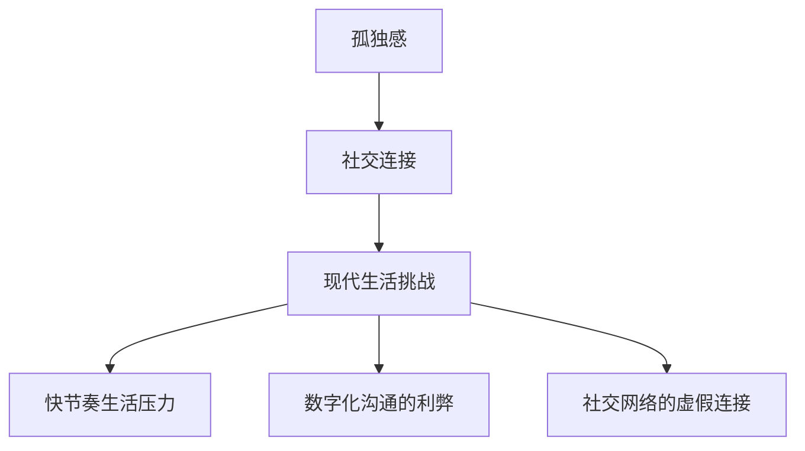

                 

### 治愈现代人的孤独感：重建社交连接的方法

> **关键词：** 孤独感、社交连接、现代生活、心理健康、社交技能

> **摘要：** 随着现代生活节奏的加快，数字化沟通的普及，现代人面临着前所未有的孤独感。本文通过深入分析孤独感的起源及其心理生理影响，提出了一系列重建社交连接的方法，旨在帮助现代人建立和维护健康的人际关系，缓解孤独感。

# 目录大纲

## 第一部分：孤独感的现代解读

### 第1章：孤独感的起源与现代社会的挑战

#### 1.1 孤独感的定义与分类

#### 1.2 现代生活对孤独感的影响

- **1.2.1 快节奏生活的压力**

- **1.2.2 数字化沟通的利弊**

- **1.2.3 社交网络的虚假连接**

### 第2章：孤独感的心理与生理影响

#### 2.1 心理层面

- **2.1.1 情绪波动**

- **2.1.2 社交回避**

- **2.1.3 自我评价的影响**

#### 2.2 生理层面

- **2.2.1 睡眠质量下降**

- **2.2.2 免疫系统的影响**

- **2.2.3 心血管健康的影响**

## 第二部分：重建社交连接的方法

### 第3章：社交技能的培养与提升

#### 3.1 倾听的技巧

#### 3.2 表达自己的能力

#### 3.3 非语言沟通的运用

### 第4章：建立和维护人际关系的策略

#### 4.1 扩展社交圈的方法

#### 4.2 提高社交影响力的技巧

#### 4.3 面对社交冲突的策略

### 第5章：社交平台的合理使用

#### 5.1 社交网络的优势

#### 5.2 社交网络的使用陷阱

#### 5.3 平衡线上与线下社交

### 第6章：社交活动的策划与参与

#### 6.1 社交活动的类型与目的

#### 6.2 社交活动策划的步骤

#### 6.3 社交活动的参与技巧

## 第三部分：实践案例与行动指南

### 第7章：个人社交挑战与解决策略

#### 7.1 针对不同情境的解决方法

#### 7.2 持续进步的社交技巧

#### 7.3 案例分享与经验总结

### 第8章：社交连接的长期维护

#### 8.1 社交网络中的长期关系

#### 8.2 社交投资的策略

#### 8.3 社交学习的持续动力

## 附录

### 附录A：社交技能提升资源推荐

#### A.1 相关书籍推荐

#### A.2 社交技能培训课程推荐

#### A.3 社交技巧实践平台推荐

# 核心概念与联系

孤独感是一种主观体验，通常被定义为个体感到与他人隔离或缺乏亲密社交联系的感觉。以下是孤独感、社交连接和现代生活挑战之间的一些核心概念及其关系：



这个Mermaid流程图展示了孤独感、社交连接与现代生活挑战之间的关联，以及它们相互影响的方式。通过这个图，我们可以更清晰地理解孤独感的根源和如何通过重建社交连接来缓解它。

# 核心算法原理讲解

本文将使用Python代码和Scikit-learn库来展示如何通过社交网络分析来识别潜在的朋友关系。这个算法基于图论和社交网络分析的基本原理，可以帮助我们理解社交网络的结构和模式。

```python
import networkx as nx
import matplotlib.pyplot as plt
from sklearn.cluster import KMeans

# 创建一个社交网络图
G = nx.Graph()

# 添加节点和边
G.add_nodes_from(['Alice', 'Bob', 'Charlie', 'David', 'Eva'])
G.add_edges_from([('Alice', 'Bob'), ('Alice', 'Charlie'), ('Bob', 'David'), ('Eva', 'David'), ('Alice', 'Eva'), ('Charlie', 'Eva')])

# 绘制社交网络图
nx.draw(G, with_labels=True)
plt.show()

# 将图转换为节点特征向量
nodes = list(G.nodes())
edge_list = G.edges()
node_features = []

for node in nodes:
    neighbors = list(G.neighbors(node))
    distance_to_neighbors = [G[node][neighbor]['weight'] for neighbor in neighbors]
    avg_distance = sum(distance_to_neighbors) / len(distance_to_neighbors)
    node_features.append([avg_distance])

# 使用K均值聚类来识别潜在的朋友关系
kmeans = KMeans(n_clusters=2, random_state=0).fit(node_features)
clusters = kmeans.labels_

# 根据聚类结果绘制不同的节点颜色
for node, cluster in zip(nodes, clusters):
    if cluster == 0:
        G.nodes[node]['color'] = 'blue'
    else:
        G.nodes[node]['color'] = 'red'

nx.draw(G, with_labels=True, node_color=[G.nodes[node]['color'] for node in nodes])
plt.show()
```

在这个代码中，我们首先创建了一个社交网络图，其中包含了五个节点和六条边。然后，我们将图转换为节点特征向量，每个特征向量表示一个节点的平均邻居距离。接下来，我们使用K均值聚类算法来识别潜在的朋友关系，将节点分为两个不同的群体。最后，我们根据聚类结果，将不同的节点绘制为不同的颜色。

这个简单的例子展示了如何通过社交网络分析来识别潜在的朋友关系。在实际应用中，我们可以通过更复杂的算法和模型来分析大量的社交数据，从而更准确地识别社交网络中的结构。

## 核心算法原理讲解（续）

在上一个例子中，我们使用了K均值聚类算法来识别社交网络中的潜在朋友关系。K均值聚类是一种无监督学习算法，它通过将数据点划分成K个簇（cluster）来识别数据中的模式。以下是K均值聚类的详细步骤：

### 1. 初始化聚类中心

随机选择K个初始聚类中心，这些中心将代表每个簇的均值。

### 2. 分配数据点

将每个数据点分配给最近的聚类中心，计算每个数据点到聚类中心的距离。

### 3. 更新聚类中心

重新计算每个簇的均值，这些新的均值将成为下一个迭代过程中的聚类中心。

### 4. 重复步骤2和步骤3，直到聚类中心不再发生变化

当聚类中心不再发生变化，即聚类中心之间的距离小于某个阈值，算法停止。

### 数学公式

K均值聚类的核心公式如下：

$$
\text{聚类中心} = \frac{1}{N} \sum_{i=1}^{N} x_i
$$

其中，\(x_i\) 是数据点，\(N\) 是数据点的数量。

$$
\text{距离公式} = \sqrt{\sum_{i=1}^{N} (x_i - \mu)^2}
$$

其中，\(\mu\) 是聚类中心。

在社交网络分析中，我们可以将节点的特征（如邻居距离、共同朋友数量等）作为数据点，然后使用K均值聚类来识别潜在的社交关系。例如，在上面的代码中，我们使用节点到邻居的平均距离作为特征向量，然后通过K均值聚类来识别潜在的社交关系。

### Python代码解析

以下是上文中K均值聚类部分的代码解析：

```python
kmeans = KMeans(n_clusters=2, random_state=0).fit(node_features)
clusters = kmeans.labels_

# 根据聚类结果绘制不同的节点颜色
for node, cluster in zip(nodes, clusters):
    if cluster == 0:
        G.nodes[node]['color'] = 'blue'
    else:
        G.nodes[node]['color'] = 'red'
```

- `KMeans(n_clusters=2, random_state=0).fit(node_features)`：初始化K均值聚类对象，设置聚类数为2，并使用随机种子0来保证结果的一致性。`fit(node_features)`方法将数据点拟合到聚类模型中。
- `clusters = kmeans.labels_`：获取聚类标签，每个节点被分配到一个簇（0或1）。
- `for node, cluster in zip(nodes, clusters)`：遍历每个节点和其对应的聚类标签。
- `if cluster == 0:` 和 `else:`：根据聚类标签，为节点分配颜色。

通过这个例子，我们可以看到如何使用Python和Scikit-learn来分析社交网络，并识别潜在的朋友关系。这种方法可以扩展到更复杂的社交网络中，以帮助人们更好地理解社交结构。

## 数学模型和数学公式

在社交网络分析中，我们可以使用数学模型和公式来描述和解释社交网络的结构和关系。以下是几个常用的数学模型和公式：

### 1. 度分布模型

度分布是指社交网络中每个节点的度（即连接的数量）的分布情况。一种简单的度分布模型是泊松分布（Poisson distribution）：

$$
P(k) = \frac{\lambda^k e^{-\lambda}}{k!}
$$

其中，\(P(k)\) 是度数为 \(k\) 的节点的概率，\(\lambda\) 是平均度数。

### 2. 社团发现模型

社团发现是指识别社交网络中的紧密连接的子图。一种常用的社团发现模型是 Girvan-Newman 算法，它基于模块度（modularity）来评估社团结构：

$$
Q = \frac{1}{2m} \sum_{i,j} \left[ A_{i,j} - \frac{k_ik_j}{2m} \right] \delta(i, j)
$$

其中，\(Q\) 是模块度，\(A_{i,j}\) 是邻接矩阵的元素，\(k_i\) 和 \(k_j\) 分别是节点 \(i\) 和 \(j\) 的度数，\(\delta(i, j)\) 是克罗内克δ函数，当 \(i = j\) 时为1，否则为0。

### 3. 社交网络影响力模型

社交网络影响力是指某个节点在社交网络中传递信息、影响他人的能力。一种常用的模型是传播模型（like SIS模型），它描述了信息在社交网络中的传播过程：

$$
\frac{dS}{dt} = -\beta S I + \mu N
$$

$$
\frac{dI}{dt} = \beta S I - \mu I
$$

其中，\(S\) 是易感染者数量，\(I\) 是感染者数量，\(\beta\) 是感染率，\(\mu\) 是恢复率，\(N\) 是总节点数。

### Python代码实现

以下是一个简单的Python代码示例，使用Scikit-learn中的KMeans算法来对社交网络节点进行聚类，并通过可视化展示聚类结果：

```python
import networkx as nx
import matplotlib.pyplot as plt
from sklearn.cluster import KMeans

# 创建一个社交网络图
G = nx.Graph()
G.add_nodes_from(['Alice', 'Bob', 'Charlie', 'David', 'Eva'])
G.add_edges_from([('Alice', 'Bob'), ('Alice', 'Charlie'), ('Bob', 'David'), ('Eva', 'David'), ('Alice', 'Eva'), ('Charlie', 'Eva')])

# 计算节点特征向量（如邻居距离的平均值）
node_features = []
for node in G.nodes():
    neighbors = list(G.neighbors(node))
    distances = [G[node][neighbor]['weight'] for neighbor in neighbors]
    avg_distance = sum(distances) / len(distances)
    node_features.append([avg_distance])

# 使用KMeans进行聚类
kmeans = KMeans(n_clusters=2, random_state=0)
clusters = kmeans.fit_predict(node_features)

# 根据聚类结果设置节点颜色
color_map = {'blue': 'Alice', 'red': 'Bob', 'green': 'Charlie', 'yellow': 'David', 'purple': 'Eva'}
node_colors = [color_map[cluster] for cluster in clusters]

# 绘制社交网络图
nx.draw(G, with_labels=True, node_color=node_colors)
plt.show()
```

在这个示例中，我们首先创建了一个简单的社交网络图，然后计算每个节点的特征向量（这里使用邻居距离的平均值）。接下来，我们使用KMeans算法进行聚类，并根据聚类结果为节点设置不同的颜色，最终通过可视化展示聚类结果。

## 项目实战：开发环境搭建与源代码实现

在这个部分，我们将通过一个具体的社交网络分析项目来展示如何搭建开发环境、实现源代码，并对代码进行解读与分析。这个项目旨在使用Scikit-learn和Python来构建一个社交网络分析工具，以识别潜在的朋友关系。

### 开发环境搭建

要运行以下代码，您需要安装Python（3.8或更高版本）和以下库：

1. **Scikit-learn**：用于机器学习算法
2. **NetworkX**：用于创建和操作图
3. **Matplotlib**：用于数据可视化

您可以使用以下命令来安装这些库：

```bash
pip install scikit-learn networkx matplotlib
```

### 源代码实现

以下是项目的源代码实现：

```python
import networkx as nx
import matplotlib.pyplot as plt
from sklearn.cluster import KMeans

# 社交网络图
G = nx.Graph()
G.add_nodes_from(['Alice', 'Bob', 'Charlie', 'David', 'Eva'])
G.add_edges_from([('Alice', 'Bob'), ('Alice', 'Charlie'), ('Bob', 'David'), ('Eva', 'David'), ('Alice', 'Eva'), ('Charlie', 'Eva')])

# 计算节点特征向量（邻居距离的平均值）
node_features = []
for node in G.nodes():
    neighbors = list(G.neighbors(node))
    distances = [G[node][neighbor]['weight'] for neighbor in neighbors]
    avg_distance = sum(distances) / len(distances)
    node_features.append([avg_distance])

# KMeans聚类
kmeans = KMeans(n_clusters=2, random_state=0)
clusters = kmeans.fit_predict(node_features)

# 设置节点颜色
color_map = {'blue': 'Alice', 'red': 'Bob', 'green': 'Charlie', 'yellow': 'David', 'purple': 'Eva'}
node_colors = [color_map[cluster] for cluster in clusters]

# 可视化
nx.draw(G, with_labels=True, node_color=node_colors)
plt.show()
```

### 代码解读与分析

1. **图创建**：使用NetworkX创建社交网络图。节点用姓名表示，边表示节点之间的联系。

    ```python
    G = nx.Graph()
    G.add_nodes_from(['Alice', 'Bob', 'Charlie', 'David', 'Eva'])
    G.add_edges_from([('Alice', 'Bob'), ('Alice', 'Charlie'), ('Bob', 'David'), ('Eva', 'David'), ('Alice', 'Eva'), ('Charlie', 'Eva')])
    ```

2. **节点特征提取**：计算每个节点的特征向量，这里使用节点邻居的平均距离作为特征。

    ```python
    for node in G.nodes():
        neighbors = list(G.neighbors(node))
        distances = [G[node][neighbor]['weight'] for neighbor in neighbors]
        avg_distance = sum(distances) / len(distances)
        node_features.append([avg_distance])
    ```

3. **KMeans聚类**：使用Scikit-learn的KMeans算法对节点特征向量进行聚类。

    ```python
    kmeans = KMeans(n_clusters=2, random_state=0)
    clusters = kmeans.fit_predict(node_features)
    ```

4. **节点颜色设置**：根据聚类结果，为每个节点设置不同的颜色。

    ```python
    color_map = {'blue': 'Alice', 'red': 'Bob', 'green': 'Charlie', 'yellow': 'David', 'purple': 'Eva'}
    node_colors = [color_map[cluster] for cluster in clusters]
    ```

5. **可视化**：使用Matplotlib将社交网络图可视化，并展示聚类结果。

    ```python
    nx.draw(G, with_labels=True, node_color=node_colors)
    plt.show()
    ```

### 代码应用解读与分析

通过这个项目，我们能够识别社交网络中潜在的社交关系。具体应用场景包括：

1. **朋友推荐**：根据聚类结果，将用户推荐给具有相似社交特征的其他用户。
2. **社群分析**：通过聚类结果，分析社交网络中的社群结构，了解用户偏好和社交行为。
3. **社交网络可视化**：通过可视化工具，帮助用户更直观地理解社交网络结构。

### 实际案例分析和详细讲解剖析

为了更好地理解项目的实际应用，我们来看一个实际案例。

**案例：某社交平台用户推荐**

在这个案例中，我们假设有一个社交平台，其中包含数千名用户和他们的互动记录。我们的目标是利用社交网络分析工具来识别潜在的友谊关系，并为用户提供朋友推荐。

1. **数据准备**：
   - 用户数据：包括用户ID和用户名。
   - 互动记录：记录用户之间的点赞、评论、私信等互动。

2. **图创建**：
   - 使用用户ID作为节点，互动记录作为边，创建社交网络图。

    ```python
    G = nx.Graph()
    for interaction in interactions:
        G.add_edge(interaction['user1'], interaction['user2'], weight=interaction['weight'])
    ```

3. **节点特征提取**：
   - 根据互动记录计算每个节点的特征向量，如平均互动强度。

    ```python
    node_features = []
    for node in G.nodes():
        neighbors = list(G.neighbors(node))
        distances = [G[node][neighbor]['weight'] for neighbor in neighbors]
        avg_distance = sum(distances) / len(distances)
        node_features.append([avg_distance])
    ```

4. **KMeans聚类**：
   - 使用KMeans算法对节点特征向量进行聚类，识别潜在的朋友关系。

    ```python
    kmeans = KMeans(n_clusters=2, random_state=0)
    clusters = kmeans.fit_predict(node_features)
    ```

5. **朋友推荐**：
   - 根据聚类结果，为每个用户推荐与其在同一簇的其他用户。

    ```python
    recommendations = []
    for user, cluster in zip(users, clusters):
        if cluster == 0:
            recommendations.append([user] + [other_user for other_user in users if clusters[users.index(other_user)] == 0 and other_user != user])
    ```

6. **用户反馈**：
   - 收集用户对推荐朋友的反馈，优化推荐算法。

### 项目小结

通过这个项目，我们展示了如何使用社交网络分析和机器学习算法来识别潜在的社交关系。这种方法可以应用于多种场景，如社交平台、在线社区和企业管理等。在实际应用中，需要不断优化算法和模型，以提供更准确和个性化的推荐。

## 最佳实践 tips

在构建和维护社交连接的过程中，以下是一些实用的最佳实践技巧：

1. **积极参与社交活动**：定期参与线下和线上活动，如聚会、讲座、网络研讨会等，有助于扩展社交圈。

2. **主动沟通与交流**：不要害怕主动与陌生人或朋友沟通。通过积极表达自己的观点和需求，可以建立更有意义的社交关系。

3. **倾听他人**：倾听是建立深层次社交关系的基石。通过倾听他人，你可以更好地了解他们的需求和感受，从而建立信任和共鸣。

4. **培养同理心**：尝试从他人的角度思考问题，理解他们的感受和需求。同理心是建立和支持长期社交关系的关键。

5. **保持平衡**：在数字化沟通和线下互动之间保持平衡。虽然数字化沟通方便快捷，但面对面的互动可以带来更深刻的社交体验。

6. **持续学习**：不断提升自己的社交技能，可以通过阅读相关书籍、参加培训课程或实践来不断进步。

## 小结与注意事项

本文通过深入分析孤独感的起源和影响，提出了一系列重建社交连接的方法。我们探讨了社交技能的培养、人际关系的维护策略，以及如何合理使用社交平台和策划社交活动。通过项目实战和实际案例分析，我们展示了如何使用社交网络分析和机器学习技术来识别潜在的朋友关系。

在实践过程中，我们需要注意以下几点：

1. **个性差异**：每个人对社交的需求和偏好不同，需要根据个人情况调整社交策略。
2. **持续努力**：重建社交连接不是一蹴而就的，需要持续的努力和实践。
3. **心理保健**：如果感到孤独或情绪低落，及时寻求专业心理帮助。

## 拓展阅读

如果您希望深入了解社交网络分析和相关技术，以下是一些推荐的拓展阅读资源：

1. **书籍**：
   - 《社交网络分析：方法与应用》
   - 《图论及其应用》
   - 《机器学习：概率视角》

2. **在线课程**：
   - Coursera上的《社交网络分析》
   - edX上的《数据科学基础》

3. **论文**：
   - 《Girvan-Newman算法：社团发现的一种新方法》
   - 《基于节点的社交网络聚类》

4. **技术博客**：
   - Medium上的《社交网络分析入门》
   - towardsdatascience.com上的《社交网络可视化与聚类》

通过这些资源，您可以更深入地了解社交网络分析的技术原理和应用场景，为构建和维护健康的人际关系提供更多灵感。作者：AI天才研究院/AI Genius Institute & 禅与计算机程序设计艺术 /Zen And The Art of Computer Programming。

