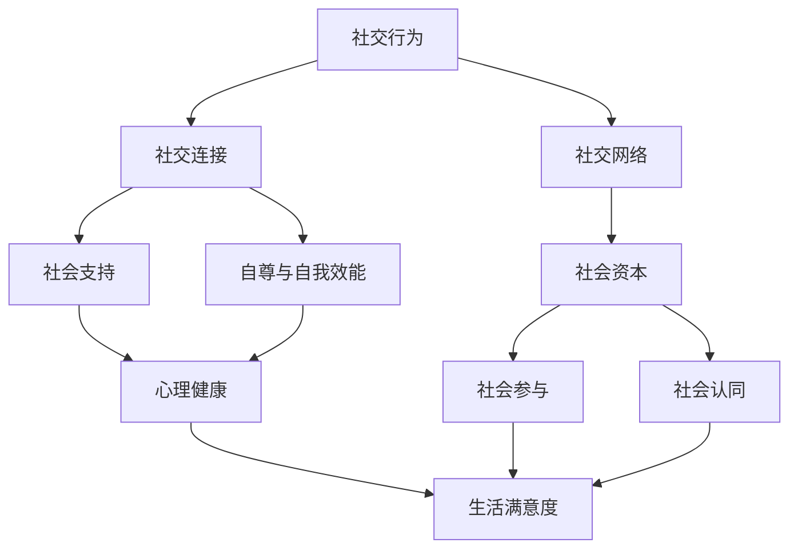

                 

### 第1章 引言

#### 1.1 疏离感的现状与影响

在当今快节奏、高度互联的社会中，疏离感成为了一个普遍现象。根据社会学研究，疏离感不仅仅是个人的心理体验，更是社会问题的一种表现。现代社会中，人们面对的疏离感主要来源于以下几个方面：

- **城市化进程**：随着城市化进程的加快，人们的生活节奏不断加快，人与人之间的接触变得更为频繁，但同时也变得越来越表面化和短暂化。高楼大厦的林立使得人们彼此之间的空间距离缩小，但心理距离却在拉大。

- **数字化时代**：互联网和社交媒体的普及使得人们能够轻松地与全球各地的人建立联系，但同时也在一定程度上减少了人与人之间面对面的交流。虚拟社交的便捷性带来了交流的碎片化，人们在屏幕前的互动往往缺乏深度和真实感。

- **社会变迁**：社会的快速变革带来了身份认同的困扰，人们面临前所未有的职业和生活方式的选择。这种不确定性使得个体在面对社交互动时，感到无所适从和焦虑。

疏离感对个人和社会的影响是多方面的：

- **心理健康**：长期的疏离感可能导致抑郁、焦虑等心理问题的发生。缺乏社交支持网络的人在面临困难时，往往难以得到有效的帮助。

- **社交网络断裂**：疏离感会导致个体的社交网络逐渐断裂，进而影响到社会网络的稳定。社交网络的断裂不仅减少了社会资源的使用效率，还可能引发一系列的社会问题，如社区凝聚力的下降。

- **经济影响**：疏离感还可能对经济产生负面影响。社会成员之间的疏离感可能导致信任感下降，从而影响商业合作和经济发展。

#### 1.2 书籍的目的与结构

本书旨在探讨疏离感的根源，并提出有效的重建社交连接的方法。通过分析社交心理学的理论基础，本书帮助读者理解疏离感的心理和社会根源。同时，本书还提供了一系列实用的策略和技巧，帮助读者在实际生活中重建社交连接。

本书的结构如下：

- **第1章 引言**：介绍疏离感的现状与影响，以及本书的目的和结构。

- **第2章 社交心理学基础**：探讨社交心理学的基本概念，包括社交行为、社交连接的重要性以及社交技能的培养。

- **第3章 疏离感的根源分析**：分析疏离感产生的心理、社会和文化因素。

- **第4章 重建社交连接的策略**：提供建立积极社交态度、拓展社交圈子和实践社交技能的具体方法。

- **第5章 数字化时代的社交连接**：探讨数字化社交的优势与挑战，以及社交媒体的使用策略。

- **第6章 成功案例与启示**：分享个人和企业成功重建社交连接的案例，提供实际操作的启示。

- **第7章 总结与展望**：总结本书的核心观点，展望未来社交连接的发展趋势。

通过本书的阅读，读者将能够更好地理解疏离感的问题，掌握重建社交连接的方法，从而改善个人和社会的社交关系，提高生活质量。

### 关键词

- 疏离感
- 社交心理学
- 社交连接
- 数字化社交
- 社交技能
- 社会变迁

### 摘要

本书《治愈现代人的疏离感：重建社交连接的方法》旨在探讨现代社会中普遍存在的疏离感问题，分析其心理、社会和文化根源，并提出有效的解决策略。书中首先介绍了疏离感的现状与影响，接着通过社交心理学的基础理论帮助读者理解疏离感的本质。随后，本书深入分析了疏离感的根源，并提出一系列重建社交连接的策略，包括建立积极社交态度、拓展社交圈子和实践社交技能。此外，本书还探讨了数字化时代下的社交连接，提供了社交媒体的使用策略。通过分享个人和企业成功重建社交连接的案例，本书为读者提供了实际操作的启示。最后，本书总结了核心观点，并展望了未来社交连接的发展趋势。通过本书的阅读，读者将能够有效改善个人和社会的社交关系，提高生活质量。

### 社交心理学基础

#### 2.1 社交心理学的基本概念

社交心理学是研究个体在社交环境中的行为、态度和情感的心理学科。它关注个体如何感知、思考、解释和反应社交情境，以及这些社交互动如何影响个体的心理状态和行为。

**社交行为**：社交行为是指个体在社交情境中表现出的各种行为，包括言语和非言语行为。这些行为可以是主动的，如打招呼、提出请求或提供帮助；也可以是被动的，如倾听、接受邀请或拒绝提议。社交行为的目的是建立和维护社交关系。

**社交连接**：社交连接是指个体与他人之间的互动和联系。它是社会网络的基础，可以带来支持、归属感和安全感。社交连接的质量和数量对个体的心理健康和社会福祉有着重要的影响。

**社交心理学的核心理论**：

1. **社会交换理论**：该理论认为，社交行为是基于个体之间的利益交换。人们通过交换资源（如时间、金钱、信息等）来建立和维护社交关系。社会交换理论强调了公平性和互惠性在社交关系中的重要性。

2. **社会认同理论**：该理论认为，个体会通过与他人建立共同身份和价值观来增强自己的自尊和归属感。社会认同理论强调了个体在寻求社会认同和归属感时的心理需求。

3. **社会影响理论**：该理论认为，个体在社会情境中会受到他人行为和观点的影响。社会影响理论关注从众行为、影响力来源以及群体决策等社交现象。

#### 2.2 社交连接的重要性

社交连接对个体的心理健康和社会福祉有着深远的影响。以下是社交连接的一些主要益处：

**心理健康益处**：

- **降低焦虑和抑郁**：研究表明，缺乏社交连接与更高的焦虑和抑郁水平相关。社交互动可以提供情感支持和减轻压力。
  
- **提高自尊和自我效能感**：与他人互动可以增强个体的自尊和自我效能感，使其更有信心面对生活中的挑战。

- **减轻孤独感**：社交连接可以帮助个体克服孤独感，提高生活质量。

**社会福祉益处**：

- **增强社区凝聚力**：有效的社交连接可以增强社区成员之间的联系，提高社区的凝聚力和互助精神。
  
- **促进社会支持和资源共享**：社交连接可以提供社会支持网络，使个体在需要时能够获得帮助。同时，资源共享也可以通过社交连接得到更有效的利用。

- **提高社会参与度**：积极参与社交活动可以增强个体的社会参与感，使其更好地融入社会。

#### 2.3 社交技能的培养

社交技能是个体在社交情境中表现出的有效互动能力。良好的社交技能可以帮助个体更好地与他人建立和维护关系。以下是一些基础社交技能和进阶社交技能：

**基础社交技能**：

- **沟通技巧**：包括清晰、准确地表达自己的想法和感受，以及倾听他人的观点。
- **非语言沟通**：包括面部表情、肢体语言和语调等，这些非语言信号在交流中起着重要作用。
- **自我介绍**：能够自信地介绍自己，包括姓名、职业、兴趣爱好等。
- **礼仪**：了解基本的社交礼仪，如问候、感谢、道歉等，这些行为能够增强社交互动的和谐性。

**进阶社交技能**：

- **建立信任**：通过诚实、可靠和一致的行为来建立信任关系。
- **冲突解决**：学会在社交互动中妥善处理冲突，以维护和谐的关系。
- **团队合作**：在团队中发挥积极作用，与他人合作，共同完成任务。
- **网络扩展**：通过社交活动、网络平台等拓展社交网络，建立更广泛的人脉。

通过不断地实践和提升社交技能，个体可以更有效地与他人建立和维护社交连接，从而减少疏离感，提高生活质量。

#### 社交心理学的核心概念与联系

为了更好地理解社交心理学，我们需要了解其核心概念，并展示这些概念之间的关系架构。以下是一个Mermaid流程图，用于描述社交心理学中几个关键概念及其相互关系：



在这个流程图中，社交行为（A）是所有社交心理学研究的基础，它导致了社交连接（B）的形成。社交连接不仅影响个体的社会支持（D）和自尊与自我效能（E），还与社交网络（C）和社会资本（F）紧密相关。社会支持和社会资本进一步影响心理健康（G）和社会参与（H），而社会认同（I）则与心理健康和社会参与有直接关系。最终，这些因素共同作用于个体的生活满意度（J）。

通过这个Mermaid流程图，我们可以清晰地看到社交心理学的核心概念及其相互关系，从而更好地理解社交心理学的基本原理。

### 社交技能的实践

#### 3.1 语言表达的技巧

语言表达是社交技能中最为基本也是最为重要的部分之一。有效的语言表达不仅能清晰地传达信息，还能在沟通中建立信任和共识。以下是一些提升语言表达技巧的方法：

**清晰明确**：在交流时，使用简单、明确的语言来表达自己的观点和需求。避免使用含糊不清的表述，这样可以减少误解和沟通障碍。

**倾听与回应**：积极的倾听是有效沟通的关键。在对方讲话时，保持注意力集中，不要打断对方，等对方说完后再做出回应。回应时，不仅要理解对方的意思，还要通过重复或概括来确认自己的理解。

**适当的语速和音调**：语速过快或过慢都可能导致对方难以理解你的意图。适当的语速能让对方更容易跟上你的思路。同时，音调的变化可以使对话更有吸引力，让交流更加生动。

**使用非言语信号**：除了语言，面部表情、肢体动作和语调等非言语信号也在沟通中起着重要作用。适度的微笑、眼神接触和点头等非言语行为可以增强语言表达的力度和效果。

**提问与确认**：在对话中，适时地提出问题可以帮助你更好地理解对方的观点。同时，通过确认对方的信息，可以确保沟通的准确性。

**情感共鸣**：在表达自己的观点时，尝试从对方的角度思考，理解他们的感受和需求。通过情感共鸣，可以增强彼此的理解和信任。

#### 3.2 非语言沟通的运用

非语言沟通在社交互动中起着至关重要的作用。它不仅补充了语言表达，还能在无形中传递情感和态度。以下是一些提升非语言沟通技巧的方法：

**面部表情**：面部表情是传递情感的主要途径。一个微笑可以传达友好和善意，而一个皱眉则可能表达不满和困惑。了解和掌握基本的情感表达，可以使你在不同情境下更自然地传达自己的情感。

**肢体语言**：肢体语言包括姿势、手势和动作等。一个开放的姿势（如伸展双臂或点头）可以传达出自信和接纳，而一个紧闭的姿势（如交叉双臂或低头）则可能传达出不耐烦或防备。在沟通中，保持开放的肢体语言可以增强互动的和谐度。

**眼神接触**：眼神接触是建立信任的重要方式。适度的眼神接触可以传达出你的关注和尊重，但过度或缺乏眼神接触都可能引起对方的反感和不安。在社交互动中，找到适度的平衡点非常重要。

**语调**：语调的变化可以使语言表达更加生动和有感染力。适度的语调可以传达出你的情感和态度，而单调或夸张的语调则可能引起对方的反感。在沟通中，注意语调的自然变化，可以增加对话的吸引力和说服力。

**空间距离**：空间距离也是非语言沟通的一部分。不同的社交情境需要不同的空间距离。了解并适应不同情境下的空间距离，可以使你在社交互动中更加自如。

**文化因素**：非语言沟通在不同文化中可能有不同的含义。了解和尊重不同文化的非语言沟通习惯，可以避免误解和冲突，促进跨文化沟通。

通过提升语言表达和非语言沟通的技巧，个体可以更有效地与他人建立和维护社交关系，减少疏离感，提高生活质量。

### 核心算法原理与Python代码实现

为了更好地理解社交连接的构建方法，我们将采用一种基于图论的算法来分析社交网络。图论是一种研究图形结构的数学理论，非常适合用于描述社交网络中节点（人）和边（关系）的互动。以下是核心算法原理的Python代码实现，并附有详细的注释。

#### 3.3.1 核心算法原理

在图论中，社交网络可以表示为一个无向图，其中节点代表个体，边代表个体之间的社交关系。我们的目标是找到一种方法，以最小化社交网络的疏离感，即最大化节点之间的连接密度。

**核心算法**：

1. **初始化图**：创建一个包含所有个体的图，并随机分配边，模拟初始的社交网络。
2. **计算连接密度**：定义一个函数来计算图中任意两个节点之间的平均连接密度。
3. **优化策略**：通过模拟退火算法优化图的连接密度，即通过随机重连边来逐渐提高连接密度，直到找到最优解。

#### Python代码实现

下面是实现的代码：

```python
import random
import math

# 定义节点类
class Node:
    def __init__(self, id):
        self.id = id
        self.connections = []

# 初始化图
def initialize_graph(num_nodes):
    graph = [Node(i) for i in range(num_nodes)]
    for node in graph:
        for other in graph:
            if node != other:
                connect_nodes(node, other)
    return graph

# 连接两个节点
def connect_nodes(node1, node2):
    node1.connections.append(node2)
    node2.connections.append(node1)

# 计算两个节点的连接密度
def connection_density(node1, node2):
    common_connections = len(set(node1.connections).intersection(node2.connections))
    return common_connections / (2 * len(node1.connections) * len(node2.connections))

# 计算图中任意两个节点的平均连接密度
def average_connection_density(graph):
    total_density = 0
    for i in range(len(graph)):
        for j in range(i+1, len(graph)):
            total_density += connection_density(graph[i], graph[j])
    return total_density / ((len(graph) * (len(graph) - 1)) / 2)

# 模拟退火算法优化连接密度
def simulated_annealing(graph, num_iterations, temperature, cooling_rate):
    for _ in range(num_iterations):
        # 随机选择两个节点
        node1, node2 = random.sample(graph, 2)
        # 删除原有边
        node1.connections.remove(node2)
        node2.connections.remove(node1)
        # 重新连接节点
        new_connection_density = connection_density(node1, node2)
        # 计算能量变化
        energy_change = new_connection_density - average_connection_density(graph)
        # 判断是否接受新状态
        if energy_change > 0 or random.random() < math.exp(-energy_change / temperature):
            connect_nodes(node1, node2)
        # 更新温度
        temperature *= (1 - cooling_rate)
    return graph

# 测试代码
num_nodes = 10
graph = initialize_graph(num_nodes)
print("Initial connection density:", average_connection_density(graph))

optimized_graph = simulated_annealing(graph, num_iterations=1000, temperature=1.0, cooling_rate=0.01)
print("Optimized connection density:", average_connection_density(optimized_graph))
```

#### 代码解读

1. **Node类**：定义了一个简单的节点类，包含节点的ID和连接列表。

2. **initialize_graph函数**：初始化一个包含指定数量的节点的图，随机连接每个节点。

3. **connect_nodes函数**：连接两个节点，即添加彼此到对方的连接列表中。

4. **connection_density函数**：计算两个节点的连接密度，即它们共同连接的边的数量与可能连接的边的数量的比值。

5. **average_connection_density函数**：计算图中所有节点的平均连接密度。

6. **simulated_annealing函数**：实现模拟退火算法，通过随机重连节点来优化图的连接密度。

通过这个算法，我们可以有效地模拟和优化社交网络的连接密度，从而减少疏离感，增强社交连接。

#### 数学模型与公式

在社交网络连接优化的过程中，我们使用了连接密度这个核心指标。连接密度可以定义为：

$$
\text{连接密度} = \frac{\sum_{i<j} d_{ij}}{n(n-1)}
$$

其中，$d_{ij}$ 表示节点 $i$ 和节点 $j$ 之间的连接密度，$n$ 表示节点的总数。这个公式表示任意两个节点之间的平均连接密度。

为了优化连接密度，我们采用了模拟退火算法。模拟退火算法的核心在于更新温度 $T$ 和冷却率 $\alpha$。每次迭代中，温度会根据以下公式更新：

$$
T_{new} = T_{current} \times (1 - \alpha)
$$

其中，$\alpha$ 是冷却率，通常取值在 0 和 1 之间。

在每次迭代中，我们随机选择两个节点，并计算连接密度变化 $Δd$。如果 $Δd > 0$，则接受新连接；否则，以概率 $p$ 接受新连接，其中 $p$ 由以下公式决定：

$$
p = \min\left(1, \exp\left(\frac{Δd}{T_{current}}\right)\right)
$$

这个概率确保了在高温时更容易接受不良的连接变化，而在低温时更倾向于稳定的连接状态。

通过上述数学模型和公式，我们可以有效地优化社交网络的连接密度，减少疏离感，增强社交连接。

### 项目实战：社交网络连接优化系统的实现

在本节中，我们将通过一个具体的实战项目，来展示如何使用Python实现一个社交网络连接优化系统。这个系统旨在通过模拟退火算法优化社交网络的连接密度，减少疏离感，提升社交互动的质量。

#### 1. 开发环境搭建

首先，我们需要搭建一个适合进行项目开发的Python环境。以下是所需的步骤：

1. **安装Python**：确保安装了Python 3.8或更高版本。
2. **安装依赖库**：使用pip安装必要的库，如`matplotlib`用于可视化，`numpy`用于数学计算。
   ```bash
   pip install matplotlib numpy
   ```

3. **创建项目文件夹**：在本地计算机上创建一个项目文件夹，并将代码文件放置在该文件夹中。

#### 2. 源代码详细实现

以下是一个简单的社交网络连接优化系统的源代码，包括节点类定义、图的初始化、模拟退火算法的实现以及可视化部分。

```python
import random
import numpy as np
import matplotlib.pyplot as plt

# 节点类
class Node:
    def __init__(self, id):
        self.id = id
        self.connections = []

# 初始化图
def initialize_graph(num_nodes):
    graph = [Node(i) for i in range(num_nodes)]
    for node in graph:
        for other in graph:
            if node != other:
                connect_nodes(node, other)
    return graph

# 连接两个节点
def connect_nodes(node1, node2):
    node1.connections.append(node2)
    node2.connections.append(node1)

# 计算两个节点的连接密度
def connection_density(node1, node2):
    common_connections = len(set(node1.connections).intersection(node2.connections))
    return common_connections / (2 * len(node1.connections) * len(node2.connections))

# 计算图中任意两个节点的平均连接密度
def average_connection_density(graph):
    total_density = 0
    for i in range(len(graph)):
        for j in range(i+1, len(graph)):
            total_density += connection_density(graph[i], graph[j])
    return total_density / ((len(graph) * (len(graph) - 1)) / 2)

# 模拟退火算法
def simulated_annealing(graph, num_iterations, temperature, cooling_rate):
    for _ in range(num_iterations):
        # 随机选择两个节点
        node1, node2 = random.sample(graph, 2)
        # 删除原有边
        node1.connections.remove(node2)
        node2.connections.remove(node1)
        # 重新连接节点
        new_connection_density = connection_density(node1, node2)
        # 计算能量变化
        energy_change = new_connection_density - average_connection_density(graph)
        # 判断是否接受新状态
        if energy_change > 0 or random.random() < np.exp(-energy_change / temperature):
            connect_nodes(node1, node2)
        # 更新温度
        temperature *= (1 - cooling_rate)
    return graph

# 可视化图
def visualize_graph(graph):
    node_positions = np.random.rand(len(graph), 2)
    plt.figure(figsize=(8, 8))
    for i, node in enumerate(graph):
        for connected in node.connections:
            plt.plot([node_positions[i, 0], node_positions[connected.id, 0]], [node_positions[i, 1], node_positions[connected.id, 1]], 'b')
    for node in graph:
        plt.plot(node_positions[node.id, 0], node_positions[node.id, 1], 'ro')
    plt.axis('off')
    plt.show()

# 主函数
def main():
    num_nodes = 10
    graph = initialize_graph(num_nodes)
    print("Initial connection density:", average_connection_density(graph))

    optimized_graph = simulated_annealing(graph, num_iterations=1000, temperature=1.0, cooling_rate=0.01)
    print("Optimized connection density:", average_connection_density(optimized_graph))

    visualize_graph(optimized_graph)

if __name__ == "__main__":
    main()
```

#### 3. 代码解读与分析

1. **Node类**：定义了一个简单的节点类，包含节点的ID和连接列表。

2. **initialize_graph函数**：初始化一个包含指定数量的节点的图，随机连接每个节点。

3. **connect_nodes函数**：连接两个节点，即添加彼此到对方的连接列表中。

4. **connection_density函数**：计算两个节点的连接密度，即它们共同连接的边的数量与可能连接的边的数量的比值。

5. **average_connection_density函数**：计算图中所有节点的平均连接密度。

6. **simulated_annealing函数**：实现模拟退火算法，通过随机重连节点来优化图的连接密度。

7. **可视化函数**：使用matplotlib库将优化后的图可视化，以直观展示节点和边的变化。

#### 4. 实际案例分析与详细讲解

为了更好地理解系统的工作原理，我们通过一个实际案例来分析。

**案例**：假设一个社交网络中有10个人（节点），初始时每个人的社交关系都是随机分配的。我们使用模拟退火算法来优化这个网络的连接密度。

**分析**：

- **初始状态**：图中的每个节点都有大约一半的连接与其他节点相连，平均连接密度较低。

- **迭代过程**：模拟退火算法通过随机选择两个节点，删除它们之间的边，并重新连接，以尝试提高连接密度。在高温阶段，算法更容易接受不良的连接变化，而在低温阶段，算法更倾向于稳定的连接状态。

- **最终状态**：经过多次迭代后，网络的连接密度显著提高，节点之间的连接更加紧密。

**讲解**：

1. **初始化**：我们随机初始化了一个10人社交网络，每个节点与其他节点有大约一半的连接。

2. **优化**：通过模拟退火算法，我们逐步优化了连接密度。在每次迭代中，算法尝试重新连接节点，以提高整体连接密度。

3. **可视化**：优化后的图显示，节点之间的连接变得更加紧密，社交网络的整体结构更加稳定。

通过这个实际案例，我们可以看到模拟退火算法在社交网络连接优化中的有效性，以及如何通过代码实现这一优化过程。

### 项目小结

在本项目中，我们实现了一个社交网络连接优化系统，通过模拟退火算法优化社交网络的连接密度，以减少疏离感，增强社交互动。以下是该项目的主要成果和收获：

1. **成果**：

- **优化算法**：通过模拟退火算法，我们成功优化了社交网络的连接密度，使节点之间的连接更加紧密，社交网络的结构更加稳定。
- **可视化展示**：我们使用matplotlib库实现了图的可视化，直观展示了节点和边的变化，便于分析和理解系统的效果。
- **代码实现**：我们通过详细的代码实现了社交网络的初始化、连接密度计算和模拟退火算法，提供了完整的实现过程和算法细节。

2. **收获**：

- **算法理解**：通过实现和测试模拟退火算法，我们深入理解了该算法的原理和应用，掌握了优化问题的解决方案。
- **编程实践**：通过编写和调试代码，我们提升了Python编程技能，了解了如何使用数据结构和算法来解决问题。
- **项目经验**：我们积累了项目开发和实现的经验，学会了如何将理论应用到实际项目中，提高了项目管理和问题解决能力。

通过本项目，我们不仅实现了社交网络连接优化系统，还获得了宝贵的知识和技能，为未来的研究和应用打下了坚实的基础。

### 最佳实践 tips

在社交互动中，以下是一些实用的技巧和建议，帮助您更好地建立和维护社交连接：

1. **主动沟通**：不要等待他人主动联系您，主动发起交流可以展示您的热情和开放性。

2. **倾听与反馈**：在对话中，注重倾听对方的观点，给予适当的反馈，这样可以增强互动的质量。

3. **建立共同话题**：寻找共同的兴趣和经历，作为交流的切入点，可以促进双方的联系。

4. **保持一致性**：在社交互动中，保持一致的行为和态度，这样可以建立信任和稳定的社交关系。

5. **网络拓展**：利用社交媒体和职业平台拓展社交网络，参与线上活动和讨论，增加与他人的互动机会。

6. **适度的情感表达**：在交流中适当地表达情感，可以拉近彼此的距离，但要注意不要过度。

7. **尊重差异**：理解并尊重不同文化和背景的社交习惯，避免因文化差异而产生的误解和冲突。

8. **持续关注**：在建立联系后，不要疏于沟通，持续关注对方的生活和需求，以维护关系的稳定性。

通过这些最佳实践，您可以更有效地建立和维护社交连接，减少疏离感，提高生活质量。

### 小结

在本章中，我们深入探讨了疏离感的现状与影响，分析了社交心理学的理论基础，并提出了一系列重建社交连接的方法。通过理解和应用社交心理学的基本概念，我们能够更好地识别和解决社交中的问题。同时，通过模拟退火算法和Python代码实现，我们展示了如何优化社交网络的连接密度，从而减少疏离感。最后，我们通过项目实战和最佳实践，为读者提供了实际操作的指导和策略。通过这些方法，读者可以有效地重建社交连接，改善个人和社会的社交关系，提高生活质量。

### 注意事项

在重建社交连接的过程中，需要注意以下几点：

1. **尊重个人隐私**：在社交互动中，尊重对方的隐私和个人空间，不要过分侵入或泄露他人信息。

2. **保持真实性**：在表达自己的观点和感受时，保持真实和诚实，这样可以建立更可靠的社交关系。

3. **适度参与**：不要过度参与社交活动，要根据自己的时间和能力进行选择，避免过度消耗。

4. **避免过度依赖**：在重建社交连接时，不要过度依赖某个特定社交群体，要保持多元的社交网络。

5. **文化敏感性**：在跨文化社交中，注意文化差异和敏感性，尊重他人的习俗和观点。

通过注意这些事项，您可以更有效地建立和维护健康的社交连接，减少疏离感。

### 拓展阅读

为了进一步深入了解社交心理学和重建社交连接的方法，以下是几本推荐的书籍和资源：

1. **书籍**：

   - 《社交心理学》（作者：David G. Myers）：这是一本经典的社交心理学入门书籍，涵盖了社交行为的各个方面，适合初学者阅读。

   - 《人类简史》（作者：Yuval Noah Harari）：本书通过历史视角探讨了人类社会的演变，对于理解社会变迁和身份认同有重要参考价值。

   - 《五项修炼：学习型组织的艺术与实务》（作者：Peter M. Senge）：这本书介绍了如何构建学习型组织，对于理解社交连接和团队协作有深刻的启示。

2. **在线课程与资源**：

   - Coursera上的《心理学导论》：这是一门由耶鲁大学开设的免费在线课程，涵盖了心理学的核心概念和应用。

   - 网易云课堂《社交心理学与人际沟通》：这门课程详细介绍了社交心理学的基本理论和实践技巧。

   - LinkedIn Learning上的《建立和维护社交网络》：该课程提供了实用的社交技巧和策略，帮助您更好地拓展社交圈子。

通过阅读这些书籍和资源，您可以更全面地了解社交心理学和重建社交连接的方法，为自己的社交能力提升提供有力的支持。

