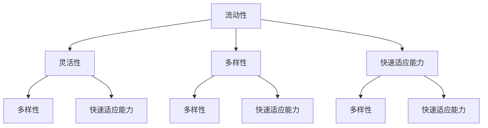

                 

### 文章标题

“流动的时代：重新定义人生价值”

> 关键词：流动时代，人生价值，职业规划，个人成长，社会变革

摘要：本文将探讨在流动时代背景下，如何重新定义人生价值。通过分析流动时代的起源、特点及其影响，重构人生价值观念，提供职业规划和个人成长的新思维，最后探讨流动时代对社会的影响及未来展望。

---

### 目录大纲

#### 第一部分：流动时代的到来

- **第1章：流动时代的概念与特点**
  - 1.1 流动时代的起源与发展
  - 1.2 流动时代的核心特点
  - 1.3 流动时代的影响

- **第2章：流动时代下的人生价值重构**
  - 2.1 人生价值的传统观念
  - 2.2 流动时代下的人生价值重构

#### 第二部分：流动时代下的职业规划

- **第3章：流动时代下的职业规划**
  - 3.1 职业规划的新思维
  - 3.2 职业规划的实践方法
  - 3.3 职业规划的成功案例

#### 第三部分：流动时代下的个人成长

- **第4章：终身学习与知识更新**
  - 4.1 终身学习的必要性
  - 4.2 学习方法的创新
  - 4.3 个人成长案例

- **第5章：人际关系与社交网络**
  - 5.1 人际关系的重要性
  - 5.2 社交网络的运用
  - 5.3 社交网络案例

- **第6章：流动时代下的心理健康**
  - 6.1 心理健康的重要性
  - 6.2 心理健康的维护
  - 6.3 心理健康案例

#### 第四部分：流动时代下的社会影响

- **第7章：流动时代下的社会变革**
  - 7.1 社会结构的调整
  - 7.2 社会规范的演变
  - 7.3 社会问题与挑战

- **第8章：流动时代下的未来展望**
  - 8.1 流动时代的未来趋势
  - 8.2 人类社会的未来

## 附录

- **附录A：流动时代下的资源与工具**
  - A.1 学习资源推荐
  - A.2 职业规划工具
  - A.3 社交网络平台

---

### 第一部分：流动时代的到来

#### 第1章：流动时代的概念与特点

**1.1 流动时代的起源与发展**

在过去的几个世纪里，人类社会经历了多次重大的变革，从农业革命到工业革命，再到信息革命，每一次变革都深刻地影响了人类的生活方式和价值观念。然而，进入21世纪，我们正处在一个全新的时代——流动时代。

**起源**：流动时代的起源可以追溯到20世纪末，随着互联网和移动通信技术的发展，全球信息流动的速度和范围达到了前所未有的高度。这一变革不仅改变了信息的传递方式，也改变了人们的生活方式和工作方式。

**发展**：进入21世纪，全球化、数字化和智能化成为推动流动时代发展的主要力量。全球化使得各国之间的经济、文化和社会联系更加紧密，数字化则极大地提高了信息处理和传播的效率，智能化则使得各种设备和系统能够更加智能地运行。

**核心特点**

- **灵活性**：在流动时代，人们的工作和生活方式变得更加灵活。远程工作、灵活工作时间、兼职工作等新型就业模式不断涌现，人们可以根据自己的需求和能力选择更适合自己的工作方式。

- **多样性**：流动时代带来了职业和生活方式的多样性。人们可以选择在多个领域工作，也可以在不同的国家生活和工作。这种多样性不仅为个人提供了更多的机会，也为社会带来了更多的创新和活力。

- **快速变化**：在流动时代，知识和技术的更新速度越来越快，传统的行业和职业不断被新兴行业和职业所取代。这种快速变化要求人们必须具备快速学习和适应能力，以应对不断变化的环境。

- **全球化与本地化**：全球化使得各国之间的交流和合作更加频繁，但同时也带来了本地化的需求。在全球化的大背景下，人们更加注重本土文化和价值观的传承，因此如何在全球化与本地化之间找到平衡成为一个重要课题。

**影响**

- **对个人生活的影响**：流动时代改变了人们的生活方式。人们可以更加自由地选择居住地和工作地点，这为个人的生活提供了更多的选择和机会。

- **对职业发展的影响**：流动时代对职业发展带来了新的挑战和机遇。传统的职业发展路径可能不再适用，人们需要不断更新自己的知识和技能，以适应快速变化的市场需求。

**1.2 流动时代的核心特点**

在详细讨论流动时代的核心特点之前，我们先引入几个核心概念，以便更好地理解这些特点：

- **流动性**：指人们在物理位置、职业角色、社交网络等方面的移动和变化。
- **灵活性**：指人们在工作方式、生活节奏、职业规划等方面的可变性和适应性。
- **多样性**：指在社会、文化、经济等多个层面上的多样性。
- **快速变化**：指知识、技术、社会结构等方面的快速更新和转变。
- **全球化与本地化**：指在全球范围内进行经济、文化和社会活动的同时，保持和传承本土文化和价值观。

**流动性**：流动性是流动时代最显著的特点之一。它不仅体现在人们跨国、跨地区的迁移，还体现在职业角色的快速变化。例如，随着远程工作和远程教育的普及，人们可以轻松地在不同的城市或国家工作、学习。此外，数字货币和在线支付等技术的兴起，使得人们可以在全球范围内进行金融交易，进一步加速了流动性。

**灵活性**：灵活性体现在人们在工作方式和生活方式上的自主选择。在传统的工业时代，工作通常具有固定的地点和时间，而流动时代则打破了这种限制。人们可以根据自己的需求和兴趣选择灵活的工作时间、工作地点和工作方式。例如，自由职业者、远程工作者和兼职工作者等各类新兴就业模式，都是流动时代灵活性的体现。

**多样性**：多样性是流动时代带来的另一大特点。全球化使得各国之间的文化交流更加频繁，文化多样性成为常态。与此同时，随着技术的进步和社会的发展，职业多样性也在增加。从程序员到数据科学家，从市场营销到人工智能，各种新兴职业不断涌现，为人们提供了更多的职业选择。

**快速变化**：在流动时代，知识和技术更新的速度非常快。新兴技术和行业不断出现，传统的行业和职业逐渐被淘汰。这种快速变化要求人们具备快速学习和适应能力。例如，区块链技术、人工智能、大数据等新兴领域的发展，不仅为行业带来了新的机遇，也对从业者的技能提出了更高的要求。

**全球化与本地化**：全球化使得各国之间的交流和合作更加紧密，但同时也带来了本地化的需求。在全球化的大背景下，人们更加注重本土文化和价值观的传承。因此，如何在全球化与本地化之间找到平衡，成为了一个重要课题。例如，跨国企业需要在全球化经营的同时，尊重和融入当地文化，而本地企业则需要在全球化的浪潮中保持自身特色。

**1.3 流动时代的影响**

流动时代不仅改变了人们的生活方式和职业发展，也对整个社会产生了深远的影响。

**对个人生活的影响**：首先，流动时代使得人们的生活更加多样化。人们可以更加自由地选择居住地和工作地点，这为个人的生活提供了更多的选择和机会。其次，流动时代也带来了生活节奏的加快。随着工作和生活方式的灵活性增加，人们需要更好地管理时间和资源，以应对快速变化的环境。

**对职业发展的影响**：流动时代对职业发展的影响尤为显著。首先，传统职业发展路径可能不再适用，人们需要不断更新自己的知识和技能，以适应快速变化的市场需求。其次，流动时代带来了职业的多样性和灵活性，为人们提供了更多的职业选择和机会。例如，自由职业者、远程工作者和兼职工作者等各类新兴就业模式，都是流动时代职业发展的新趋势。

**社会变革**：流动时代也推动了社会的变革。全球化使得各国之间的经济、文化和社会联系更加紧密，促进了国际合作和交流。与此同时，本地化的需求也使得人们更加关注本土文化和价值观的传承。这种全球化与本地化的平衡，成为社会变革的重要方向。

**1.4 流动时代的挑战**

尽管流动时代带来了诸多机遇，但同时也带来了一系列挑战。

**个人挑战**：首先，流动性可能导致个人身份的不确定性和焦虑感。人们可能面临工作不稳定、社交圈断裂等问题。其次，快速变化要求人们具备更高的适应能力和学习能力，这对个人的心理和生理健康提出了挑战。

**社会挑战**：流动时代也对社会带来了挑战。首先，社会不平等问题可能加剧，因为流动性和灵活性使得收入差距和社会阶层固化。其次，社会规范和伦理观念可能面临挑战，如何在全球化与本地化之间找到平衡成为一个难题。

**1.5 流动时代的应对策略**

面对流动时代的挑战，我们需要采取一系列应对策略。

**个人策略**：首先，提高适应能力和学习能力，以应对快速变化的环境。其次，注重心理健康，保持积极的心态和健康的生活方式。最后，建立稳固的社交网络，以应对身份不确定性和社交圈断裂等问题。

**社会策略**：首先，推动教育改革，提高人们的综合素质和创新能力。其次，完善社会保障体系，减少社会不平等。最后，加强国际合作，促进全球化与本地化的平衡。

**1.6 小结**

流动时代是一个充满机遇和挑战的时代。通过重构人生价值观念，适应流动时代的要求，我们可以更好地应对这些挑战，实现个人和社会的可持续发展。

---

### 第二部分：流动时代下的人生价值重构

**第2章：流动时代下的人生价值重构**

在流动时代，传统的价值观念受到了前所未有的冲击。传统的价值观念往往强调稳定性、确定性和单一的职业路径，而在流动时代，这些观念显得越来越不适应。因此，重构人生价值观念成为当务之急。

**2.1 传统的人生价值观念**

传统的人生价值观念主要围绕以下几个核心概念：

- **稳定性**：传统的价值观念强调稳定的生活和职业。人们追求的是长期的职业稳定性和家庭生活的稳定。
- **确定性**：在传统的观念中，人们期望生活有一个明确的、可以预见的未来。例如，一份稳定的工作、一个稳定的家庭和一个明确的职业规划。
- **单一职业路径**：传统观念认为一个人应该选择一个职业，并在这个职业上深耕，追求职业生涯的长期发展。

**优点与缺点**

- **优点**：传统的价值观念有助于人们建立稳定的生活和职业基础，减少不确定性带来的焦虑和不安。
- **缺点**：然而，这种稳定性也带来了一些负面影响。首先，它限制了人们的自由和选择，使得人们难以适应快速变化的环境。其次，它可能导致职业倦怠，因为长时间从事同一工作可能会使人们感到乏味和失去动力。

**2.2 流动时代下的人生价值重构**

在流动时代，我们需要重新思考人生价值的定义和实现方式。以下是一些关键的概念和原则：

- **灵活性**：在流动时代，灵活性成为人生价值的重要体现。人们应该更加重视工作方式、生活节奏和职业规划的灵活性，以适应快速变化的环境。
- **多样性**：流动时代带来了职业和生活方式的多样性。人们应该追求多样性的价值，不断探索新的领域和机会，以丰富自己的人生经历。
- **快速适应能力**：在流动时代，快速适应能力成为个人成功的关键。人们需要不断更新知识和技能，以应对快速变化的市场需求。
- **个人成长**：流动时代不仅是一个职业发展的时代，也是一个个人成长的时代。人们应该注重个人成长，不断提升自己的能力和素质。

**重构的核心概念与联系**

为了更好地理解流动时代下的人生价值重构，我们引入以下几个核心概念，并分析它们之间的关系：

- **流动性**：指人们在物理位置、职业角色、社交网络等方面的移动和变化。流动性是流动时代最显著的特点之一，它使得人们可以更加自由地选择工作和生活方式。
- **灵活性**：指人们在工作方式、生活节奏、职业规划等方面的可变性和适应性。灵活性是流动性的一种体现，它使人们能够更好地适应快速变化的环境。
- **多样性**：指在社会、文化、经济等多个层面上的多样性。多样性是流动时代带来的另一大特点，它为人们提供了更多的职业选择和生活选择。
- **快速适应能力**：指人们应对快速变化的能力。快速适应能力是个人在流动时代取得成功的关键。

这些概念之间的关系可以用以下Mermaid流程图表示：

**重构的方法与步骤**

要实现人生价值观念的重构，我们可以采取以下方法：

1. **自我认知与评估**：首先，我们需要进行自我认知和评估，了解自己的兴趣、优势和价值观。这有助于我们找到适合自己的职业和生活方式。
2. **终身学习**：在流动时代，终身学习变得至关重要。我们需要不断更新知识和技能，以适应快速变化的环境。通过参加培训、阅读书籍、参加线上课程等方式，不断提升自己的能力。
3. **灵活规划**：在职业规划方面，我们应该更加注重灵活性。不再追求一成不变的职业生涯，而是根据市场需求和个人兴趣进行灵活调整。
4. **多元化探索**：在职业和生活方式上，我们应该追求多样性。不断探索新的领域和机会，丰富自己的人生经历。
5. **快速适应**：在面对变化时，我们要保持积极的心态，快速适应新的环境和要求。这种快速适应能力将帮助我们抓住机遇，实现个人成长。

**2.3 适应流动时代的人生价值重构**

为了更好地适应流动时代，我们需要重构传统的人生价值观念，并采取一系列具体的行动。

**1. 价值观的历史演变**

在人类历史上，价值观一直在不断演变。从农业社会到工业社会，再到信息社会，每一次重大变革都带来了价值观的深刻变化。

- **农业社会**：在农业社会，稳定性和确定性是主要的价值观。人们追求的是长期的土地耕作和家庭稳定。这种价值观强调家庭、社区和土地的重要性。
- **工业社会**：在工业社会，稳定性和效率成为主要的价值观。人们追求的是长期的职业稳定和高效的工作。这种价值观强调专业分工、标准化和制度化。
- **信息社会**：在信息社会，灵活性和多样性成为主要的价值观。人们追求的是自由选择、多样性和创新。这种价值观强调个性、自由和创造力。

**2. 传统人生价值观念的优缺点**

传统的人生价值观念在特定的历史背景下有其合理性，但也存在一些缺点。

- **优点**：稳定性使人们能够建立长期的生活和职业基础，减少不确定性带来的焦虑。确定性使人们能够预见未来，制定明确的计划。单一职业路径有助于人们深入学习和精通某一领域，提升职业竞争力。
- **缺点**：然而，稳定性也可能导致职业倦怠和缺乏挑战。确定性可能使人们无法适应快速变化的环境，错失新的机遇。单一职业路径可能限制人们的职业选择和发展空间。

**3. 流动时代下的人生价值重构**

在流动时代，我们需要重构传统的人生价值观念，以适应新的环境。

- **灵活性**：灵活性和适应能力成为新的核心价值观。人们应该更加重视工作方式、生活节奏和职业规划的灵活性，以适应快速变化的环境。
- **多样性**：多样性和探索精神成为新的核心价值观。人们应该追求多样性的职业和生活方式，不断探索新的领域和机会。
- **快速适应能力**：快速适应能力成为新的核心价值观。人们需要具备快速学习和适应变化的能力，以应对快速变化的市场需求。

**4. 如何适应流动时代**

为了适应流动时代，我们可以采取以下行动：

- **终身学习**：终身学习是适应流动时代的关键。通过不断学习新知识和技能，我们可以保持竞争力，抓住新的机遇。
- **灵活规划**：在职业规划方面，我们应该更加注重灵活性。不再追求一成不变的职业生涯，而是根据市场需求和个人兴趣进行灵活调整。
- **多元化探索**：在职业和生活方式上，我们应该追求多样性。不断探索新的领域和机会，丰富自己的人生经历。
- **快速适应**：在面对变化时，我们要保持积极的心态，快速适应新的环境和要求。这种快速适应能力将帮助我们抓住机遇，实现个人成长。

**5. 小结**

流动时代带来了新的挑战和机遇。通过重构传统的人生价值观念，适应流动时代的要求，我们可以更好地应对这些挑战，实现个人和社会的可持续发展。

---

### 第三部分：流动时代下的职业规划

**第3章：流动时代下的职业规划**

在流动时代，职业规划面临着前所未有的挑战和机遇。传统的职业规划模式可能不再适用，我们需要采取新的思维和方法，以更好地应对快速变化的环境。本章将探讨流动时代下职业规划的新思维、实践方法和成功案例。

**3.1 职业规划的新思维**

在流动时代，职业规划的新思维主要体现在以下几个方面：

**1. 职业角色的灵活性**

传统的职业规划往往强调长期稳定的工作和职业发展，而在流动时代，灵活性成为关键。人们可以选择多种职业角色，如兼职、自由职业者、远程工作者等，以适应不同的生活阶段和市场需求。

**2. 职业发展的多样化**

在流动时代，职业发展的渠道和方向变得更加多样化。人们不再局限于传统的职业路径，而是可以根据自己的兴趣和能力，选择不同的领域和行业，实现跨界发展。

**3. 终身学习与技能更新**

随着技术的快速进步，知识和技能的更新速度越来越快。在流动时代，终身学习成为职业规划的重要部分。人们需要不断更新自己的知识和技能，以适应不断变化的市场需求。

**4. 个人成长与职业发展的平衡**

在流动时代，个人成长和职业发展的平衡成为职业规划的重要目标。人们不仅要追求职业的成功，还要注重个人成长和幸福感。

**3.2 职业规划的实践方法**

为了更好地适应流动时代，我们可以采取以下职业规划的实践方法：

**1. 自我认知与评估**

首先，进行自我认知和评估，了解自己的兴趣、优势和价值观。这有助于我们找到适合自己的职业方向和发展路径。

**2. 目标设定**

明确职业发展的目标，设定短期和长期的职业目标。这些目标应该具有明确性和可衡量性，以便我们能够更好地跟踪和评估自己的进步。

**3. 路径规划**

制定详细的职业发展路径，包括所需的技能、经验和教育背景。在路径规划过程中，要充分考虑流动时代的特点，灵活调整自己的发展方向。

**4. 持续学习**

在流动时代，持续学习变得至关重要。通过参加培训、阅读书籍、参加线上课程等方式，不断提升自己的知识和技能。

**5. 网络建设**

建立稳固的社交网络，与他人建立联系，获取职业发展的机会和资源。在流动时代，人际关系和社交网络对职业发展具有重要影响。

**3.3 职业规划的成功案例**

以下是一些流动时代下职业规划的成功案例，供我们参考和学习：

**案例1：自由职业者的成功转型**

某位程序员在经历了多年的传统工作后，决定成为自由职业者。他利用自己的编程技能，通过远程工作和兼职项目，实现了收入的稳定增长。在这个过程中，他不断学习新技能，拓展自己的业务领域，最终成为了一名成功的自由职业者。

**案例2：跨界发展的成功案例**

某位市场营销专业人士在传统市场营销领域取得了显著成绩后，决定跨界进入数据科学领域。他通过参加在线课程和培训，学习数据分析技能，并成功转型为一名数据科学家。在这个过程中，他不仅实现了职业发展，还提升了自身的综合素质。

**案例3：终身学习的典范**

某位IT专家在职业生涯的早期，就意识到终身学习的重要性。他通过参加各种培训和研讨会，不断提升自己的技能和知识。随着技术的进步，他不断学习新的技术和领域，始终保持职业生涯的活力和竞争力。

**3.4 小结**

在流动时代，职业规划面临着新的挑战和机遇。通过采取灵活的职业规划思维和实践方法，我们可以更好地应对这些挑战，实现个人职业发展的目标。

---

### 第四部分：流动时代下的个人成长

**第4章：终身学习与知识更新**

在流动时代，终身学习和知识更新成为个人成长的关键。随着技术的快速发展和社会的变革，新的知识和技能不断涌现，个人必须具备快速学习和适应变化的能力，以保持竞争力。本章将探讨终身学习的必要性、创新的学习方法以及个人成长案例。

**4.1 终身学习的必要性**

在流动时代，终身学习具有以下几个方面的必要性：

**1. 知识更新的速度**

技术的快速发展使得知识和技能的更新速度越来越快。传统的教育体系可能无法及时提供最新的知识和技能，而终身学习则能够帮助个人紧跟时代潮流，保持与市场需求的同步。

**2. 职业发展的需求**

职业发展需要不断更新和提升个人的知识和技能。在流动时代，职业发展路径更加多样化，个人需要具备多种技能，以适应不同的职业角色和市场需求。终身学习是实现职业发展的关键。

**3. 个人成长的追求**

终身学习不仅是为了职业发展，也是为了个人成长。通过不断学习，个人可以拓宽视野，提升思维能力和创造力，实现自我价值的提升。

**4.2 学习方法的创新**

在流动时代，学习方法也在不断创新，以适应个人学习和职业发展的需求。以下是一些创新的学习方法：

**1. 互联网学习资源**

互联网提供了丰富的学习资源，如在线课程、电子书籍、学术论文等。个人可以通过这些资源进行自主学习和深度研究，提升自己的知识和技能。

**2. 线上学习平台**

各种在线学习平台，如Coursera、edX、Udemy等，提供了丰富的课程和培训项目。个人可以根据自己的需求和兴趣，选择合适的课程进行学习，并获得认证。

**3. 社交学习**

通过社交媒体和在线论坛，个人可以与全球的同行和专家进行交流和讨论，分享经验和知识。这种社交学习方式不仅可以扩大个人的知识面，还可以建立专业网络，为职业发展提供支持。

**4.3 个人成长案例**

以下是一些终身学习的成功案例，展示了个人如何通过终身学习实现成长和成功：

**案例1：程序员的成功转型**

某位程序员在经历了多年的编程工作后，意识到自己的技能需要更新。他通过参加在线课程和培训，学习了人工智能和机器学习等新技能，并成功转型为一名数据科学家。在这个过程中，他不仅提升了专业技能，还实现了职业发展的重大突破。

**案例2：市场营销专业人士的成长**

某位市场营销专业人士在职业生涯中，不断学习新的营销策略和技术。他通过参加各种线上课程和研讨会，学习了数字营销、社交媒体营销等新技能，并成功将其应用于自己的工作中。这些新技能不仅提升了他的个人能力，也为他的公司带来了显著的业绩增长。

**案例3：创业者的持续学习**

某位创业者深知终身学习的重要性。他在创业过程中，不断学习管理、财务、市场营销等领域的知识，并参加各种培训项目和研讨会。这些知识帮助他更好地管理公司，应对市场变化，实现公司的持续增长。

**4.4 小结**

终身学习和知识更新是流动时代个人成长的关键。通过采取创新的学习方法，个人可以不断提升自己的知识和技能，实现职业发展和个人成长的共同目标。

---

### 第5章：人际关系与社交网络

在流动时代，人际关系和社交网络对个人成长和职业发展具有至关重要的作用。良好的社交能力和强大的社交网络不仅能够为个人提供职业发展的机会，还能够帮助个人在快速变化的环境中保持稳定和成长。本章将探讨人际关系的重要性、社交网络的运用以及成功案例。

**5.1 人际关系的重要性**

人际关系是指个人在社会交往过程中建立的各种联系和关系，包括家庭关系、朋友关系、同事关系等。在流动时代，人际关系的重要性主要体现在以下几个方面：

**1. 职业发展的助力**

良好的社交能力能够帮助个人建立强大的职业网络，获取职业发展的机会和资源。在许多行业中，职业晋升和机会往往来自于人际关系网络中的推荐和合作。

**2. 个人成长的陪伴**

人际关系提供了情感支持和陪伴，帮助个人在职业和个人生活中应对挑战和困难。通过与他人的交流和互动，个人可以学习到新的知识和技能，提升自己的能力和素质。

**3. 信息和资源的获取**

社交网络为个人提供了获取信息和资源的渠道。通过与他人交流，个人可以了解到最新的行业动态、市场趋势以及政策变化，从而做出更明智的决策。

**5.2 社交网络的运用**

在流动时代，社交网络的运用变得更加重要和多样化。以下是一些有效的社交网络运用策略：

**1. 社交网络平台的选择**

个人可以根据自己的职业和兴趣，选择合适的社交网络平台。例如，LinkedIn是一个专业的职业社交平台，适合寻找职业机会和建立职业网络；Facebook和Twitter等社交媒体平台则适合建立更广泛的社交关系。

**2. 社交网络策略**

在社交网络中，个人需要制定有效的策略，以提升自己的影响力和人脉。这包括积极参与讨论、分享有价值的内容、主动与行业内的专家和同行建立联系等。

**3. 网络维护**

建立社交网络并非一蹴而就，需要长期维护和更新。个人应该定期与网络中的成员保持联系，分享信息，提供帮助，以维持和加深人际关系。

**5.3 社交网络案例**

以下是一些成功的社交网络案例，展示了个人如何通过运用社交网络实现职业发展和个人成长：

**案例1：职业晋升的助力**

某位工程师通过LinkedIn平台建立了广泛的职业网络，并在其中积极分享自己的专业知识和经验。在一次行业大会上，他通过LinkedIn与一位行业领袖建立了联系，并获得了该领袖的推荐，最终获得了梦寐以求的职位提升。

**案例2：创业的机遇**

某位创业者通过参加行业会议和社交媒体活动，建立了强大的社交网络。在一次创业活动中，他结识了一位潜在投资人，并通过社交网络的推荐获得了投资机会，从而成功创办了自己的公司。

**案例3：个人成长的陪伴**

某位职场新人在职业生涯初期，通过与同事、朋友和行业内的专家建立紧密的人际关系，获得了宝贵的职业建议和支持。这些关系不仅帮助他在工作中取得成功，还为他提供了情感支持和陪伴，使他在职业发展中更加自信和坚定。

**5.4 小结**

在流动时代，人际关系和社交网络对个人成长和职业发展具有重要作用。通过运用有效的社交网络策略，个人可以提升自己的职业竞争力，实现个人成长的目标。

---

### 第6章：流动时代下的心理健康

在流动时代，心理健康成为个人成长和职业发展的重要组成部分。快速变化的环境和高度的灵活性要求个人具备良好的心理素质和应对能力。本章将探讨心理健康的重要性、心理健康的维护方法以及成功案例。

**6.1 心理健康的重要性**

心理健康是指个体在认知、情感和行为方面处于良好的状态，能够有效应对生活中的压力和挑战。在流动时代，心理健康的重要性体现在以下几个方面：

**1. 应对压力的能力**

流动时代充满变化和不确定性，个人面临着诸多压力，如职业变动、人际关系冲突、生活节奏加快等。良好的心理健康能够帮助个人有效应对这些压力，保持积极的心态。

**2. 个人成长和发展的动力**

心理健康是个人成长和发展的基础。一个心理健康的人能够更好地面对挑战，发掘自身的潜力，实现个人目标和职业发展。

**3. 社会功能和人际关系**

心理健康对个人的社会功能和人际关系具有积极影响。心理健康的人能够更好地与他人沟通，建立良好的人际关系，从而促进社会和谐。

**6.2 心理健康的维护**

为了维护心理健康，个人可以采取以下方法：

**1. 压力管理**

有效的压力管理是维护心理健康的关键。个人可以通过以下方式管理压力：

- **时间管理**：合理安排时间，避免过度工作和疲劳。
- **情绪调节**：学会情绪调节技巧，如深呼吸、冥想、运动等。
- **寻求支持**：与家人、朋友和专业人士交流，寻求心理支持。

**2. 睡眠质量**

良好的睡眠质量对心理健康至关重要。个人应保持规律的作息时间，避免熬夜和长时间使用电子设备，以促进睡眠质量。

**3. 社交互动**

积极参与社交活动，与他人建立良好的关系，可以获得情感支持和社交满足感，有助于心理健康。

**6.3 心理健康案例**

以下是一些心理健康维护的成功案例：

**案例1：通过冥想缓解压力**

某位职场人士在职业生涯中承受着巨大的压力。通过学习冥想技巧，他学会了在繁忙的工作中找到内心的宁静，有效缓解了压力，提高了工作效率。

**案例2：寻求专业心理咨询**

某位创业者在创业过程中遇到了诸多困难和挑战，导致心理压力增大。他决定寻求专业心理咨询，通过心理咨询师的帮助，他学会了如何应对压力，调整心态，最终成功克服了创业中的困难。

**案例3：建立健康的社交网络**

某位职场人士意识到自己在社交方面的不足，通过参加社交活动，建立了广泛的社交网络。这不仅帮助他在职业发展中获得了更多机会，还为他提供了情感支持和陪伴，使他在职业和个人生活中更加自信和满意。

**6.4 小结**

在流动时代，心理健康对个人成长和职业发展至关重要。通过采取有效的心理健康维护方法，个人可以提升心理素质，更好地应对快速变化的环境，实现个人和职业的目标。

---

### 第四部分：流动时代下的社会影响

**第7章：流动时代下的社会变革**

流动时代不仅改变了个人生活和职业发展，也深刻影响了社会的各个方面。本章将探讨流动时代下的社会变革，包括社会结构的调整、社会规范的演变以及社会问题与挑战。

**7.1 社会结构的调整**

在流动时代，社会结构发生了显著的变化。以下是一些关键点：

**1. 劳动力市场的变化**

劳动力市场变得更加灵活和动态。传统的全职工作模式逐渐被兼职、远程工作和自由职业等新型就业模式所取代。这种变化带来了就业机会的多样性，但也增加了就业不稳定性和工作压力。

**2. 社会阶层的流动**

流动时代促进了社会阶层的流动。教育、技能和创业机会的增加使得更多人有机会进入中产阶级，从而改变了传统的阶级结构。然而，社会不平等问题依然存在，部分人仍然难以摆脱贫困和社会底层的束缚。

**3. 家庭结构的变化**

流动时代也对家庭结构产生了影响。越来越多的人选择单身、晚婚或不婚，同时，多代同堂的家庭结构逐渐减少。这种变化反映了个人价值观和社会观念的转变。

**7.2 社会规范的演变**

流动时代带来了社会规范的演变。以下是一些关键点：

**1. 伦理道德观念的变化**

随着全球化和社会变革，传统的伦理道德观念受到了挑战。例如，个人主义和多元化观念的兴起，使得人们对个人自由和权利的关注增加，同时也带来了道德和伦理观念的多元化。

**2. 社会规范的多样化**

在流动时代，社会规范变得更加多样化和灵活。不同的文化和价值观在全球化进程中相互碰撞和融合，导致了社会规范的多样化。这种变化既带来了社会进步，也带来了新的挑战和冲突。

**7.3 社会问题与挑战**

流动时代也带来了一系列社会问题与挑战。以下是一些关键点：

**1. 社会不平等问题**

尽管流动时代提供了更多的就业机会和发展空间，但社会不平等问题依然存在。部分人群由于教育、技能和经济资源的不均衡，难以适应快速变化的社会环境。

**2. 社会冲突的应对**

在流动时代，社会冲突的形式和原因变得更加复杂。种族、宗教和文化差异导致的冲突，以及经济利益和资源分配的矛盾，都需要社会各方共同努力来解决。

**3. 社会融合的挑战**

随着全球化和流动性的增加，社会融合成为一个重要的挑战。如何在不同文化和价值观之间找到平衡，如何促进社会的和谐与团结，是流动时代面临的重要课题。

**7.4 小结**

流动时代下的社会变革带来了新的机遇和挑战。通过调整社会结构、演变社会规范以及应对社会问题和挑战，我们可以更好地适应流动时代的要求，实现社会的可持续发展。

---

### 第8章：流动时代下的未来展望

**8.1 流动时代的未来趋势**

随着科技的不断进步和社会的持续变革，流动时代的未来趋势将更加显著和深远。以下是一些关键趋势：

**1. 技术进步的推动**

技术的快速发展将继续推动流动时代的发展。人工智能、物联网、区块链等新兴技术将进一步改变人们的生活方式和工作模式，提高信息流动的速度和效率。

**2. 全球化与本地化的平衡**

在全球化的大背景下，本地化的需求将日益增加。各国将更加注重本土文化和价值观的传承，同时在全球范围内进行经济、文化和社会活动的深度合作。

**3. 人类与机器的协同**

随着人工智能和自动化技术的发展，人类与机器的协同将成为未来的主流。人们将更多地依赖智能系统和机器人来完成复杂和重复性的工作，从而释放出更多的时间和精力专注于创新和创造性活动。

**8.2 人类社会的未来**

流动时代对人类社会的未来将产生深远的影响。以下是一些可能的未来场景：

**1. 社会融合与多元**

随着全球化和流动性的增强，人类社会将更加融合和多元化。不同文化和价值观的碰撞和融合将带来新的社会规范和道德观念，促进社会的和谐与进步。

**2. 人类与自然的和谐**

在流动时代，人类将更加重视环境保护和可持续发展。随着技术进步和意识觉醒，人们将找到更加环保和可持续的生活方式，实现人类与自然的和谐共生。

**3. 人类潜能的全面释放**

流动时代将提供更多的机会和平台，让每个人都能充分发挥自己的潜能。通过终身学习和个性化教育，人类将实现全面的发展，创造更加丰富和有意义的生活。

**8.3 小结**

流动时代的未来充满机遇和挑战。通过积极应对和适应这些变化，我们可以更好地塑造未来的社会，实现人类与科技的和谐共生，共同迎接流动时代的未来。

---

### 附录A：流动时代下的资源与工具

**附录A：流动时代下的资源与工具**

在流动时代，获取有效的资源和工具对于个人成长和职业发展至关重要。以下是一些推荐的资源与工具，涵盖学习资源、职业规划工具和社交网络平台，旨在帮助读者更好地适应流动时代的要求。

**A.1 学习资源推荐**

**1. 书籍**

- 《未来简史》（Yuval Noah Harari）：探讨科技如何改变人类社会的未来。
- 《智能时代》（吴军）：分析人工智能技术的发展及其对职业和社会的影响。
- 《终身学习》（安德斯·艾利克森）：阐述终身学习的重要性及其方法。

**2. 网络资源**

- Coursera：提供全球顶尖大学的在线课程，涵盖计算机科学、商业管理、心理学等多个领域。
- edX：由哈佛大学和麻省理工学院共同创立，提供丰富的在线课程和专项培训。
- Udemy：提供多样化的在线课程，涵盖编程、数据科学、营销等领域。

**A.2 职业规划工具**

**1. 评估工具**

- 16Personalities：提供个性测试，帮助了解自己的性格特点。
- StrengthsFinder：评估个人的优势，指导职业规划。

**2. 规划工具**

- LinkedIn：专业的职业社交平台，帮助建立职业网络，发现职业机会。
- CareerExplorer：提供职业信息库，帮助了解不同职业的薪资、工作内容和前景。

**A.3 社交网络平台**

**1. LinkedIn**

- 功能：建立职业网络，发现职业机会，分享专业知识和经验。
- 使用指南：完善个人资料，积极参与行业讨论，关注行业动态。

**2. Facebook**

- 功能：建立社交网络，分享生活和工作动态。
- 使用指南：保持专业形象，避免过度私人化，适当分享有价值的信息。

**3. Twitter**

- 功能：实时获取行业资讯，建立影响力，扩大社交网络。
- 使用指南：关注行业专家和重要机构，积极参与讨论，分享有深度和见解的内容。

**小结**

流动时代下的资源与工具为个人成长和职业发展提供了丰富的选择。通过合理利用这些资源和工具，个人可以更好地适应流动时代的要求，实现个人和职业的发展目标。希望本附录能为读者提供有价值的参考和指导。

