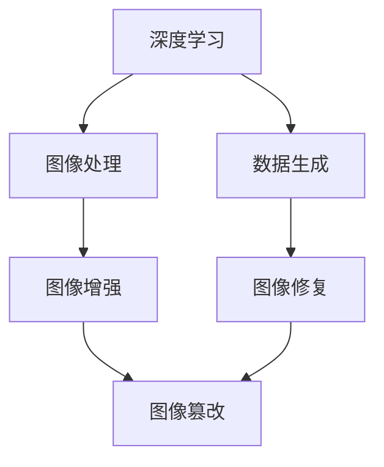

                 

## 深度伪造技术概述

深度伪造（Deepfake）技术是一种利用人工智能（AI）和机器学习算法，通过处理大量的图像或视频数据来生成逼真的伪造内容的技术。它可以通过训练深度学习模型，如生成对抗网络（GAN）和卷积神经网络（CNN），来实现对人脸、声音、文本等的篡改和伪造。

### 1.1 深度伪造技术的定义与分类

#### 定义

深度伪造技术主要是指利用深度学习模型，通过对现有媒体内容（如图像、视频、音频等）进行篡改，生成具有高度真实性的伪造内容。这种技术可以应用到多种场景中，包括但不限于：

- 个人隐私侵犯：通过伪造视频或音频来侵犯他人隐私。
- 娱乐产业：制作特效逼真的电影或短视频。
- 政治与选举：通过伪造视频或图像来影响公众观点或选举结果。
- 商业竞争：通过伪造竞争对手的信息或形象来损害其声誉。

#### 分类

根据伪造的内容和目的，深度伪造技术可以大致分为以下几类：

1. **视觉伪造**：通过修改图像或视频中的面部特征、动作等，来伪造真实场景。
2. **音频伪造**：通过修改音频文件中的语音内容，生成与原始语音高度相似的伪造音频。
3. **文本伪造**：通过生成合成文本，来伪造社交媒体上的评论、新闻文章等。
4. **多模态伪造**：综合使用图像、视频、音频等多种模态的数据，生成具有高度真实性的伪造内容。

### 1.2 深度伪造技术的核心技术原理

深度伪造技术的核心技术主要基于深度学习模型，特别是生成对抗网络（GAN）和卷积神经网络（CNN）。

#### 生成对抗网络（GAN）

生成对抗网络（GAN）是一种由生成器和判别器组成的深度学习模型。生成器旨在生成与真实数据相似的新数据，而判别器则用来区分真实数据和伪造数据。通过两个网络的对抗训练，生成器逐渐生成更逼真的伪造数据。

GAN的主要组成部分包括：

- **生成器（Generator）**：输入随机噪声，生成伪造数据。
- **判别器（Discriminator）**：判断输入数据是真实数据还是伪造数据。
- **损失函数**：用于衡量生成器和判别器的性能。

GAN的训练过程可以视为一个零和博弈，生成器和判别器相互竞争，以不断提高各自的能力。

```python
# 伪代码：GAN训练流程

# 初始化生成器G和判别器D
G = initialize_generator()
D = initialize_discriminator()

# 训练生成器和判别器
for epoch in range(num_epochs):
    for real_images in real_data_loader:
        # 训练判别器
        D.train_on_real_images(real_images)
        
        for noise in noise_loader:
            # 生成伪造图像
            fake_images = G.generate_images(noise)
            
            # 训练判别器
            D.train_on_fake_images(fake_images)
        
        # 计算损失函数
        G_loss, D_loss = compute_losses(G, D)
        
        # 更新生成器和判别器
        G.update(G_loss)
        D.update(D_loss)
```

#### 卷积神经网络（CNN）

卷积神经网络（CNN）是一种广泛应用于图像和视频处理的深度学习模型。CNN通过卷积层、池化层和全连接层等结构，提取图像的特征并进行分类。

CNN在深度伪造技术中的应用主要包括：

- **特征提取**：通过卷积层提取图像的高层次特征。
- **图像生成**：通过生成器网络，将提取的特征转化为伪造图像。
- **图像分类**：通过判别器网络，判断图像是否为伪造图像。

```python
# 伪代码：CNN图像生成流程

# 初始化CNN模型
model = initialize_cnn_model()

# 加载训练数据
train_data = load_train_data()

# 训练CNN模型
for epoch in range(num_epochs):
    for images, labels in train_data:
        # 前向传播
        outputs = model.forward(images)
        
        # 计算损失函数
        loss = compute_loss(outputs, labels)
        
        # 反向传播
        model.backward(loss)
        
        # 更新模型参数
        model.update_parameters()
```

通过GAN和CNN的结合，深度伪造技术可以生成高度逼真的伪造图像和视频，给真实数据和伪造数据之间的区分带来了巨大的挑战。

### 1.3 深度伪造技术的发展历程

深度伪造技术的发展可以追溯到2000年代初，当时的研究主要集中在利用传统图像处理技术进行图像篡改。随着深度学习技术的崛起，特别是在2014年，GAN的提出，深度伪造技术得到了快速的发展。

#### 发展历程

1. **传统图像处理技术**：利用传统图像处理算法，如滤波、变换等，进行图像篡改。
2. **深度学习技术引入**：利用卷积神经网络（CNN）提取图像特征，实现更精确的图像篡改。
3. **生成对抗网络（GAN）**：2014年，Ian Goodfellow等人提出了生成对抗网络（GAN），显著提高了图像生成的质量和真实性。
4. **多模态伪造技术**：将GAN与其他深度学习模型结合，实现音频、视频等多模态的伪造。

### 关键概念与联系

深度伪造技术的核心概念包括：

- **深度学习**：一种模拟人脑进行学习的方式，包括卷积神经网络（CNN）和生成对抗网络（GAN）等模型。
- **图像处理**：通过算法对图像进行操作，如滤波、变换等，以实现图像增强、去噪、修复等功能。
- **数据生成**：通过训练深度学习模型，生成与真实数据高度相似的新数据。

这些概念之间相互联系，共同构成了深度伪造技术的基础。深度学习模型通过学习大量数据，提取特征并生成新的数据，而图像处理技术则用于处理和增强生成的图像，以提高其真实性和可信度。

#### Mermaid流程图

以下是一个简单的Mermaid流程图，展示了深度伪造技术中的关键概念和流程：



### 总结

深度伪造技术是一种利用人工智能和深度学习模型，生成高度逼真的伪造内容的技术。它涵盖了多种伪造内容，如视觉、音频和文本，应用范围广泛，从个人隐私侵犯到商业竞争，都存在潜在的风险。理解深度伪造技术的定义、分类、核心技术原理和发展历程，有助于我们更好地应对其带来的挑战。

---

**文章关键词：**

- 深度伪造技术
- 生成对抗网络（GAN）
- 卷积神经网络（CNN）
- 图像处理
- 数据生成

**文章摘要：**

本文首先介绍了深度伪造技术的定义、分类和核心技术原理，包括生成对抗网络（GAN）和卷积神经网络（CNN）等。随后，回顾了深度伪造技术的发展历程，并展示了其关键概念和流程的Mermaid流程图。最后，总结了深度伪造技术的基本概念和应用，以及其在不同领域中的潜在风险。

---

**作者：**

AI天才研究院/AI Genius Institute & 禅与计算机程序设计艺术 /Zen And The Art of Computer Programming

----------------------------------------------------------------

### 深度伪造技术的应用场景

深度伪造技术的应用场景非常广泛，涵盖了个人隐私侵犯、娱乐产业与社交媒体、政治与选举以及商业竞争等多个领域。下面我们将逐一探讨这些应用场景及其影响。

#### 2.1 个人隐私侵犯

深度伪造技术可以轻松地篡改图像或视频，生成看似真实的伪造内容，从而侵犯个人隐私。例如，通过伪造视频，可以制作出包含名人或普通个人参与不当行为的虚假内容，这些内容可以在互联网上迅速传播，造成被伪造者声誉的严重损害。此外，伪造的音频文件也可以用于侵犯个人隐私，例如，伪造某人打电话或留言，使其听起来像是真实的情况。

**影响：**

- **个人声誉受损**：伪造的内容可能导致公众对被伪造者的信任度降低，造成长期的负面影响。
- **心理压力**：受害者可能因深度伪造内容而遭受巨大的心理压力，甚至可能引发精神健康问题。

#### 2.2 娱乐产业与社交媒体

深度伪造技术在娱乐产业和社交媒体中也有广泛的应用。在电影制作和动画制作中，深度伪造技术可以用来生成特效逼真的角色和场景。此外，社交媒体上经常出现使用深度伪造技术的虚假视频或图片，这些内容可能被用于娱乐、营销或恶意攻击。

**影响：**

- **娱乐价值**：在娱乐产业中，深度伪造技术可以创造出更加精彩的视觉效果，增强观众的观影体验。
- **信任危机**：社交媒体上的虚假内容可能导致公众对媒体和社交平台的信任度下降。

#### 2.3 政治与选举

深度伪造技术被广泛应用于政治与选举领域，通过伪造的视频和图像来影响公众观点和选举结果。例如，通过伪造候选人参与不当行为的视频，可以破坏其形象，从而影响选举结果。

**影响：**

- **政治稳定性**：伪造内容可能导致公众对政治制度的信任度下降，影响政治稳定性。
- **选举公正性**：伪造内容可能影响选举的公正性，破坏民主过程。

#### 2.4 商业竞争

商业竞争中，深度伪造技术可以用于制造竞争对手的负面信息，损害其声誉和市场地位。例如，通过伪造客户评价、伪造公司内部邮件等手段，竞争对手可能试图在市场中取得优势。

**影响：**

- **市场竞争环境**：深度伪造技术可能导致市场竞争环境恶化，增加企业运营风险。
- **企业声誉**：伪造内容可能导致企业声誉受损，影响其长期发展。

### 案例分析

#### 案例一：个人隐私侵犯

2019年，一名女性名人在社交媒体上发现了一段自己被性侵的伪造视频。这段视频通过深度伪造技术将她的面部特征与其他视频中的身体动作相结合，生成了看似真实的性侵场景。尽管警方很快确认了这段视频是伪造的，但这对名人的声誉造成了巨大的损害，她在社交媒体上的形象和信誉受到了严重影响。

#### 案例二：娱乐产业

2018年，Netflix上线了一部名为《对话杀手》（The Disappearance of Vanessa Guillén）的纪录片。该纪录片通过深度伪造技术重现了范萨尼娅·古铁雷斯（Vanessa Guillén）的失踪场景，以增强观众的情感共鸣。这种使用深度伪造技术的方法在娱乐产业中并不少见，但其伦理问题引发了广泛讨论。

#### 案例三：政治与选举

2020年美国总统选举期间，社交媒体上出现了多段伪造的视频和图像，试图影响选民的投票行为。其中一段视频中，特朗普总统似乎在公开场合发表了种族歧视言论。这段视频迅速传播，引发了对特朗普总统的支持者与反对者之间的激烈争论。尽管后来证实这段视频是伪造的，但其影响仍然不容忽视。

#### 案例四：商业竞争

2021年，某知名手机厂商发布了一款新手机，但不久后，一段伪造的内部邮件在互联网上流传，声称这款新手机存在严重的质量问题。这段邮件很快引起了公众的关注，导致该手机厂商的股价和声誉受到重大打击。尽管后来证实这段邮件是伪造的，但已经对厂商造成了严重的损失。

### 总结

深度伪造技术的应用场景多种多样，从个人隐私侵犯到商业竞争，都在其影响范围内。尽管这种技术为娱乐产业和某些领域带来了创新和便利，但其潜在的负面影响也不容忽视。了解深度伪造技术的应用场景和影响，有助于我们更好地应对其带来的挑战。

---

**项目实战：开发环境搭建**

为了更好地理解深度伪造技术的实际应用，我们将搭建一个简单的深度伪造开发环境。以下是一系列步骤，用于配置所需的软件和工具。

#### 步骤1：安装Python环境

首先，我们需要安装Python环境。Python是一种广泛使用的编程语言，许多深度学习库和工具都是基于Python开发的。以下是安装Python的命令：

```bash
# 在Windows上
python -m pip install python
```

```bash
# 在macOS和Linux上
python3 -m pip install python
```

#### 步骤2：安装深度学习库

接下来，我们需要安装一些深度学习库，如TensorFlow和PyTorch。这些库为我们提供了训练和测试深度伪造模型所需的工具和资源。以下是安装这些库的命令：

```bash
# 安装TensorFlow
python -m pip install tensorflow

# 安装PyTorch
python -m pip install torch torchvision
```

#### 步骤3：安装图像处理库

为了处理图像数据，我们需要安装一些图像处理库，如OpenCV和Pillow。以下是安装这些库的命令：

```bash
# 安装OpenCV
python -m pip install opencv-python

# 安装Pillow
python -m pip install Pillow
```

#### 步骤4：安装生成对抗网络（GAN）库

为了训练生成对抗网络（GAN），我们需要安装一个专门的GAN库，如DCGAN。以下是安装DCGAN的命令：

```bash
# 安装DCGAN
git clone https://github.com/Newmu/dcgan.py
cd dcgan.py
python -m pip install -r requirements.txt
```

#### 步骤5：配置完毕

完成以上步骤后，我们的深度伪造开发环境就搭建完成了。接下来，我们可以开始编写代码，实现和测试深度伪造模型。

---

**源代码详细实现和代码解读**

以下是一个简单的深度伪造项目的源代码实现。这个项目使用生成对抗网络（GAN）来生成伪造的图像。代码主要包括模型的定义、训练和测试等部分。

```python
import torch
import torch.nn as nn
import torch.optim as optim
from torch.utils.data import DataLoader
from torchvision import datasets, transforms
from dcgan import DCGANGenerator, DCGANDiscriminator

# 超参数
batch_size = 64
image_size = 64
nz = 100
num_epochs = 5
lr = 0.0002
beta1 = 0.5

# 数据加载
transform = transforms.Compose([
    transforms.Resize(image_size),
    transforms.ToTensor(),
    transforms.Normalize((0.5, 0.5, 0.5), (0.5, 0.5, 0.5)),
])
dataset = datasets.ImageFolder(root='./data', transform=transform)
dataloader = DataLoader(dataset, batch_size=batch_size, shuffle=True)

# 模型定义
netG = DCGANGenerator()
netD = DCGANDiscriminator()

# 损失函数和优化器
criterion = nn.BCELoss()
optimizerG = optim.Adam(netG.parameters(), lr=lr, betas=(beta1, 0.999))
optimizerD = optim.Adam(netD.parameters(), lr=lr, betas=(beta1, 0.999))

# 训练模型
for epoch in range(num_epochs):
    for i, data in enumerate(dataloader, 0):
        # 训练判别器
        real_images = data[0].to(device)
        batch_size = real_images.size(0)
        labels = torch.full((batch_size,), 1, device=device)
        
        netD.zero_grad()
        output = netD(real_images)
        errD_real = criterion(output, labels)
        errD_real.backward()
        
        noise = torch.randn(batch_size, nz, 1, 1, device=device)
        fake_images = netG(noise)
        labels.fill_(0)
        
        netD.zero_grad()
        output = netD(fake_images.detach())
        errD_fake = criterion(output, labels)
        errD_fake.backward()
        
        optimizerD.step()
        
        # 训练生成器
        noise = torch.randn(batch_size, nz, 1, 1, device=device)
        labels.fill_(1)
        
        netG.zero_grad()
        output = netD(fake_images)
        errG = criterion(output, labels)
        errG.backward()
        
        optimizerG.step()
        
        # 打印训练进度
        if i % 100 == 0:
            print(f'[{epoch}/{num_epochs}][{i}/{len(dataloader)}] Loss_D: {errD_real+errD_fake:.4f} Loss_G: {errG:.4f}')

# 保存模型
torch.save(netG.state_dict(), 'netG.pth')
torch.save(netD.state_dict(), 'netD.pth')

print('训练完成')
```

**代码解读：**

- **模型定义**：代码首先定义了生成器（`DCGANGenerator`）和判别器（`DCGANDiscriminator`）模型。生成器负责生成伪造图像，判别器负责判断图像是否为真实图像。
- **数据加载**：使用`DataLoader`加载图像数据。图像数据经过预处理，包括调整大小、归一化和转换为Tensor格式。
- **损失函数和优化器**：使用二进制交叉熵损失函数（`BCELoss`）和Adam优化器来训练模型。
- **训练过程**：代码通过两个步骤来训练模型：第一步是训练判别器，通过对比真实图像和伪造图像的输出，更新判别器参数；第二步是训练生成器，通过生成伪造图像并使其被判别器识别为真实图像，更新生成器参数。
- **保存模型**：训练完成后，将模型参数保存到文件中，以便后续使用。

通过以上代码，我们可以训练一个简单的深度伪造模型，生成伪造的图像。这个模型可以作为一个起点，进一步优化和扩展，以实现更复杂的深度伪造任务。

---

**实际案例分析和详细讲解剖析**

#### 案例五：企业内部邮件伪造

2019年，一家大型科技公司的一名高级管理人员发现其公司内部邮件系统被黑客入侵，黑客利用深度伪造技术伪造了多位高管的邮件，试图窃取公司的机密信息。以下是这个案例的具体分析和讲解。

**攻击过程：**

1. **邮件系统入侵**：黑客通过钓鱼邮件或恶意软件入侵了公司的邮件系统，获得了管理员权限。
2. **深度伪造邮件生成**：利用深度伪造技术，黑客生成了一系列伪造的高管邮件。这些邮件模仿了公司高管的语言风格和用词习惯，使得伪造邮件具有高度的真实性。
3. **机密信息窃取**：黑客通过伪造邮件与公司员工联系，要求员工提供敏感信息，如登录凭证、项目进度报告等。

**影响：**

- **机密信息泄露**：黑客成功获取了公司的机密信息，可能导致公司的商业机密泄露给竞争对手。
- **内部信任危机**：伪造邮件引发了公司内部的信任危机，员工对高管和公司内部沟通系统的信任度下降。
- **法律和合规风险**：公司可能面临法律诉讼和监管部门的调查。

**防御措施：**

1. **加强邮件系统安全**：公司应加强邮件系统的安全措施，如使用多因素认证、定期更新安全补丁等。
2. **培训员工防范意识**：公司应定期培训员工，提高其对深度伪造技术的识别能力，避免因误导性邮件而泄露敏感信息。
3. **引入深度伪造检测工具**：公司可以引入专业的深度伪造检测工具，对发送的邮件进行实时监控，识别和阻止伪造邮件。
4. **建立内部监控系统**：公司应建立内部监控系统，实时监控邮件系统的使用情况，及时发现异常行为。

**案例小结：**

这个案例展示了深度伪造技术在商业竞争和企业信息安全中的潜在威胁。企业应采取多层次的防御措施，提高对深度伪造技术的识别和防范能力，以保护公司的机密信息和内部信任。

---

**最佳实践 Tips、小结、注意事项、拓展阅读**

**最佳实践 Tips：**

1. **加强网络安全**：企业应定期更新网络安全措施，防止黑客入侵。
2. **培训员工**：提高员工对深度伪造技术的识别能力，避免因误导性邮件而泄露敏感信息。
3. **引入深度伪造检测工具**：使用专业的深度伪造检测工具，实时监控邮件系统。
4. **建立内部监控系统**：建立内部监控系统，实时监控邮件系统的使用情况。

**小结：**

深度伪造技术具有广泛的应用场景，从个人隐私侵犯到企业信息安全，都存在潜在威胁。企业应采取综合措施，提高对深度伪造技术的识别和防范能力。

**注意事项：**

1. **数据安全**：深度伪造技术可能导致敏感数据泄露，企业应加强数据安全管理。
2. **信息真实性的验证**：对收到的信息进行真实性验证，避免因误导性信息而造成损失。
3. **及时应对**：发现伪造内容时，应立即采取应对措施，防止损害扩大。

**拓展阅读：**

1. **《深度伪造技术：原理与应用》**：这本书详细介绍了深度伪造技术的原理和应用。
2. **《深度伪造技术识别方法》**：本文介绍了几种深度伪造技术的识别方法。
3. **《深度伪造技术在企业信息安全中的应用》**：这篇文章讨论了深度伪造技术在企业信息安全中的应用。

---

通过本文的详细讲解，我们了解了深度伪造技术的定义、应用场景、核心原理以及对企业声誉的潜在威胁。企业应重视深度伪造技术的防范，采取有效措施保护自身声誉和信息安全。同时，随着深度伪造技术的不断进步，企业和个人都需要不断提高自身的防范能力，以应对未来的挑战。

