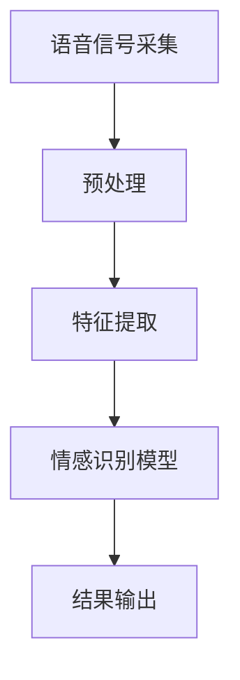

                 

### 关键词

- 深度学习
- 语音情感识别
- 卷积神经网络（CNN）
- 循环神经网络（RNN）
- 长短时记忆网络（LSTM）
- 数据预处理
- 模型训练与评估

### 摘要

本文将深入探讨深度学习在语音情感识别中的应用。首先，我们介绍了深度学习的基本概念、发展历程及其组成部分。接着，我们对语音情感识别进行了概述，分析了其面临的挑战和现有方法。随后，我们详细讲解了卷积神经网络（CNN）、循环神经网络（RNN）和长短时记忆网络（LSTM）在语音情感识别中的应用原理和优势。文章进一步介绍了语音情感识别的数据预处理方法，包括语音信号的采集与存储、特征提取和数据增强。随后，我们讨论了深度学习模型的训练、评估和优化策略。最后，我们展示了语音情感识别在智能客服和心理健康评估等实际应用中的案例，并探讨了该领域的未来研究方向。通过本文，读者将全面了解深度学习在语音情感识别领域的最新进展和应用前景。

### 第一部分：深度学习与语音情感识别基础

#### 第1章：深度学习简介

##### 1.1 深度学习的基本概念

深度学习是一种人工智能的分支，它模仿人脑的工作方式，通过多层神经网络进行处理和分析数据。深度学习的基本定义是由多层非线性变换组成的神经网络，这些变换能够在学习过程中自动提取数据中的特征。

深度学习与机器学习的关系密不可分。机器学习是人工智能的分支，旨在通过算法使计算机系统能够从数据中学习并做出决策。而深度学习则是机器学习的一个重要分支，它依赖于复杂的神经网络结构来实现高度自动化的特征提取和模式识别。

深度学习与传统的机器学习方法相比，具有以下几个显著特点：

1. **多层结构**：深度学习通过增加网络层数，使得模型可以提取更高级别的抽象特征。
2. **端到端学习**：深度学习可以直接从原始数据中学习到特征表示，无需人工设计特征。
3. **自动特征提取**：深度学习模型可以自动从数据中学习特征，从而避免了特征工程中的复杂性。
4. **强大的表示能力**：深度学习模型能够处理高维数据，并且在图像、语音和文本等复杂数据类型的处理上表现出色。

##### 1.2 深度学习的发展历程

深度学习的发展历程可以追溯到20世纪50年代，但直到最近几年才取得了显著的进展。以下是深度学习发展的重要里程碑：

1. **1958年**：弗兰克·罗森布拉特（Frank Rosenblatt）发明了感知机（Perceptron），这是最早的神经网络模型之一。
2. **1986年**：瑞德·赫伯特（Rumelhart）、大卫·曹姆比克（David E. Rumelhart）和约翰·赫伯德（John Hopfield）提出了反向传播算法（Backpropagation），这是一种有效的多层神经网络训练方法。
3. **1990年代**：随着计算机性能的提升和数据量的增加，深度学习的研究和应用开始兴起。
4. **2012年**：亚历山大·克雷默尔（Alex Krizhevsky）在ImageNet图像识别竞赛中，利用深度卷积神经网络（CNN）取得了突破性的成绩，这一成果标志着深度学习的崛起。

##### 1.3 深度学习的基本组成部分

深度学习模型主要由以下几个部分组成：

1. **神经网络**：神经网络是深度学习的基础，由多个神经元（或节点）组成。每个神经元接收多个输入，通过加权求和后加上偏置，经过激活函数处理后输出一个值。
   
2. **深度学习框架**：深度学习框架是用于实现和训练深度学习模型的软件工具，如TensorFlow、PyTorch等。这些框架提供了丰富的API和工具，大大简化了深度学习模型的开发和部署过程。

3. **深度学习算法**：深度学习算法包括多层感知机（MLP）、卷积神经网络（CNN）、循环神经网络（RNN）和长短时记忆网络（LSTM）等。这些算法通过不同的网络结构和训练方法，实现从数据中自动提取特征和进行预测。

#### 第2章：语音情感识别基础

##### 2.1 语音情感识别概述

语音情感识别是一种利用语音信号来检测和识别情感状态的技术。它旨在通过分析语音信号中的特征，如音调、音量、语速等，来判断说话者的情感状态，如快乐、悲伤、愤怒等。

语音情感识别的重要性体现在多个领域：

1. **智能客服**：通过情感识别技术，智能客服系统能够更好地理解用户的需求和情感，提供更个性化的服务。
2. **心理健康评估**：语音情感识别可以帮助识别抑郁、焦虑等心理健康问题，为患者提供及时的干预和治疗。
3. **人机交互**：语音情感识别技术可以提升人机交互的自然性和人性化，使得交互更加流畅和友好。

##### 2.2 语音情感识别的挑战

语音情感识别面临着诸多挑战，主要包括：

1. **音素、音量和语调的变化**：说话者的音素、音量和语调可能因说话速度、情绪和背景噪音等因素而发生变化，这使得情感识别更加复杂。
2. **背景噪音的干扰**：背景噪音可能会对语音信号产生干扰，从而影响情感识别的准确性。
3. **情感表达的复杂多样性**：情感表达是高度个体化和情境化的，不同的人和环境可能导致相同的情感状态表现出不同的语音特征。

##### 2.3 语音情感识别的方法

语音情感识别的方法可以分为以下几类：

1. **基于信号处理的情感识别**：这种方法直接对语音信号进行时域和频域分析，提取特征如音调、音量和共振峰频率等，然后使用传统机器学习方法进行分类。
2. **基于机器学习的情感识别**：这种方法利用机器学习算法，如支持向量机（SVM）、决策树等，从训练数据中学习情感特征并进行分类。
3. **基于深度学习的情感识别**：这种方法利用深度学习模型，如卷积神经网络（CNN）、循环神经网络（RNN）和长短时记忆网络（LSTM），自动提取高层次的语音特征，从而实现情感识别。

每种方法都有其优势和局限性。基于信号处理的方法在处理简单情感时表现较好，但难以处理复杂情感。基于机器学习的方法在特征工程和算法选择上具有灵活性，但需要大量的标注数据和复杂的调参过程。基于深度学习的方法则能够自动提取复杂的特征，具有更好的泛化能力，但需要大量的数据和计算资源。

### 第二部分：深度学习在语音情感识别中的应用

#### 第3章：深度学习模型在语音情感识别中的应用

##### 3.1 卷积神经网络（CNN）在语音情感识别中的应用

卷积神经网络（CNN）是一种强大的深度学习模型，最初用于图像识别领域，但后来逐渐扩展到语音处理领域。CNN通过卷积层、池化层和全连接层的组合，能够有效地提取语音信号中的空间特征和时间特征，从而实现语音情感识别。

CNN在语音情感识别中的应用优势包括：

1. **特征提取能力强**：CNN可以通过卷积操作自动提取语音信号中的低级特征（如短时傅里叶变换系数）和高级特征（如语音谱特征），从而实现复杂情感的有效识别。
2. **并行计算效率高**：CNN的设计使其能够利用GPU进行并行计算，从而大大提高模型的训练速度和计算效率。
3. **结构灵活**：CNN可以设计多种不同的架构，如卷积层堆叠、多尺度卷积等，以适应不同的语音情感识别任务。

CNN在语音情感识别中的应用流程如下：

1. **数据预处理**：将语音信号转换为适合CNN输入的格式，如短时傅里叶变换（STFT）或梅尔频率倒谱系数（MFCC）。
2. **卷积层**：卷积层通过卷积操作提取语音信号中的特征。
3. **池化层**：池化层用于降低特征维数，减少模型参数数量，提高模型泛化能力。
4. **全连接层**：全连接层用于将卷积层和池化层提取的高层次特征进行分类。

##### 3.2 循环神经网络（RNN）在语音情感识别中的应用

循环神经网络（RNN）是一种能够处理序列数据的深度学习模型，由于其具有记忆功能，可以捕捉序列中的时间依赖关系。RNN在语音情感识别中的应用非常广泛，尤其是对于长序列的语音情感识别任务。

RNN在语音情感识别中的应用优势包括：

1. **序列建模能力**：RNN通过其递归结构能够处理任意长度的序列数据，这使得它非常适合语音情感识别任务，因为语音情感通常是一个时间连续的过程。
2. **状态记忆功能**：RNN的内部状态可以在不同时间步之间传递信息，这使得RNN能够记住之前的语音特征，从而更好地捕捉情感变化。
3. **灵活的结构设计**：RNN可以设计成多种变体，如长短时记忆网络（LSTM）和门控循环单元（GRU），以适应不同的语音情感识别需求。

RNN在语音情感识别中的应用流程如下：

1. **数据预处理**：将语音信号转换为序列数据格式，如梅尔频率倒谱系数（MFCC）序列。
2. **嵌入层**：将输入序列中的每个特征映射到高维空间。
3. **RNN层**：RNN层通过递归操作处理序列数据，提取时间依赖特征。
4. **全连接层**：全连接层用于将RNN层提取的高层次特征进行分类。

##### 3.3 长短时记忆网络（LSTM）在语音情感识别中的应用

长短时记忆网络（LSTM）是一种改进的RNN结构，专门设计用于解决传统RNN在处理长序列数据时的长期依赖问题。LSTM通过引入记忆单元和门控机制，能够有效地捕捉序列中的短期和长期依赖关系，因此在语音情感识别任务中得到了广泛应用。

LSTM在语音情感识别中的应用优势包括：

1. **长期依赖捕捉**：LSTM通过其独特的记忆单元结构，能够记住长序列数据中的信息，从而更好地捕捉情感变化。
2. **门控机制**：LSTM的门控机制可以动态地控制信息的流入和流出，从而提高模型对情感变化的鲁棒性。
3. **参数优化**：LSTM相对于传统RNN具有更少的参数，因此更容易进行优化和训练。

LSTM在语音情感识别中的应用流程如下：

1. **数据预处理**：将语音信号转换为序列数据格式，如梅尔频率倒谱系数（MFCC）序列。
2. **嵌入层**：将输入序列中的每个特征映射到高维空间。
3. **LSTM层**：LSTM层通过递归操作处理序列数据，提取时间依赖特征。
4. **全连接层**：全连接层用于将LSTM层提取的高层次特征进行分类。

通过CNN、RNN和LSTM在语音情感识别中的应用，我们可以看到深度学习模型在处理语音数据时的强大能力。这些模型不仅能够自动提取复杂的语音特征，还能够通过门控机制和记忆单元有效地捕捉情感变化。这些技术的不断发展为语音情感识别提供了新的思路和方法，也为实际应用中的智能客服、心理健康评估等领域带来了巨大的潜力。

#### 第4章：语音情感识别的数据预处理

##### 4.1 语音信号的预处理

语音信号的预处理是语音情感识别中至关重要的一步，它直接影响后续特征提取和模型训练的效果。以下是语音信号预处理的主要步骤：

1. **信号采集**：首先，需要采集高质量的语音信号。常用的方法是使用麦克风捕捉语音，并使用高质量的音频录制设备进行录制。
   
2. **信号增强**：在某些情况下，语音信号可能会受到背景噪音的干扰。信号增强技术，如波束形成（Beamforming）和噪声抑制（Noise Suppression），可以有效地减少背景噪音，提高语音信号的质量。

3. **信号归一化**：为了使模型能够更好地处理语音信号，通常需要将信号进行归一化处理。归一化方法包括幅度归一化、动态范围压缩等。

4. **去除静音**：语音信号中可能包含长时间的静音部分，这些部分不会对情感识别产生贡献。因此，需要去除这些静音部分，以减少数据的冗余。

##### 4.2 语音情感识别的数据集

数据集是深度学习模型训练的基础，对于语音情感识别任务来说，数据集的质量和数量直接影响模型的性能。以下是构建语音情感识别数据集的关键步骤：

1. **数据收集**：首先，需要收集大量的语音数据。这些数据可以来源于公开的语音数据库，如RAVDESS、EmoDB等，也可以通过实际录制获得。

2. **数据标注**：对于语音情感识别任务，需要对语音数据进行情感标注。标注方法可以是手工标注，也可以是使用半监督学习或自动标注技术。标注的准确性对模型的训练效果至关重要。

3. **数据清洗**：在构建数据集的过程中，需要去除质量较差的语音数据，如噪音过多、语音不清晰的数据。此外，还需要进行数据去重，以确保数据集的一致性和完整性。

4. **数据划分**：为了进行模型训练和评估，需要将数据集划分为训练集、验证集和测试集。通常，训练集用于模型训练，验证集用于调参和模型选择，测试集用于最终评估模型的性能。

##### 4.3 数据增强

数据增强是提高模型泛化能力的重要手段，尤其是在语音情感识别任务中，由于情感的多样性和复杂性，数据增强尤为重要。以下是几种常用的数据增强方法：

1. **时间变换**：通过时间伸缩、时间切片等方式，生成不同长度的语音数据。这种方法可以增加数据的多样性，帮助模型学习不同长度的情感特征。

2. **频率变换**：通过频率拉伸、频率切片等方式，改变语音信号的频率特征。这种方法可以模拟不同说话者的声音特征，从而提高模型的泛化能力。

3. **噪音添加**：在语音数据中添加背景噪音，如白噪音、交通噪音等。这种方法可以训练模型在噪音干扰下识别情感，从而提高模型的鲁棒性。

4. **声音转换**：通过声音转换技术，如变声、声码器等，生成不同音色的语音数据。这种方法可以增加数据的音色多样性，帮助模型学习不同音色的情感特征。

通过上述语音信号预处理、数据集构建和数据增强的方法，我们可以为深度学习模型训练提供一个高质量的输入数据，从而提高模型的性能和泛化能力。

#### 第5章：深度学习模型训练与评估

##### 5.1 深度学习模型的训练

深度学习模型的训练过程是模型构建的核心步骤，其目的是通过大量的语音数据来调整模型的参数，使其能够准确识别语音情感。以下是深度学习模型训练的主要流程：

1. **初始化参数**：首先，需要初始化模型的参数，这些参数包括网络权重、偏置等。常用的初始化方法有随机初始化、高斯初始化等。

2. **前向传播**：在训练过程中，模型会接收输入数据，并依次通过网络的各个层进行前向传播。在每个时间步，模型会计算输出结果和损失值。

3. **反向传播**：通过前向传播计算得到的损失值，模型会使用反向传播算法来更新参数。反向传播是一种通过计算损失函数对网络参数的梯度，从而调整参数的方法。

4. **优化算法**：优化算法用于调整模型的参数，以最小化损失函数。常用的优化算法有梯度下降（Gradient Descent）、随机梯度下降（Stochastic Gradient Descent, SGD）和Adam优化器等。

5. **训练策略**：为了提高模型的训练效果，可以采用一些训练策略，如学习率调度、正则化、批归一化等。学习率调度可以动态调整学习率，以避免过拟合；正则化可以通过添加惩罚项来防止模型过拟合；批归一化可以加速模型的训练过程。

##### 5.2 深度学习模型的评估

深度学习模型的评估是验证模型性能的重要步骤，其目的是通过测试数据来评估模型的泛化能力。以下是深度学习模型评估的主要方法：

1. **准确率（Accuracy）**：准确率是评估分类模型性能的常用指标，它表示模型正确分类的样本数占总样本数的比例。

2. **召回率（Recall）**：召回率表示模型在所有实际为正类的样本中，正确识别出的比例。

3. **精确率（Precision）**：精确率表示模型在识别出的正类样本中，实际为正类的比例。

4. **F1值（F1 Score）**：F1值是精确率和召回率的调和平均值，它能够综合评估模型的分类性能。

5. **混淆矩阵（Confusion Matrix）**：混淆矩阵是一种用于评估分类模型性能的表格，它展示了模型对各类别预测结果的真实值和预测值的分布情况。

6. **ROC曲线和AUC值（Receiver Operating Characteristic Curve and AUC）**：ROC曲线用于展示模型在不同阈值下的分类性能，AUC值是ROC曲线下面积的度量，表示模型的总体分类能力。

##### 5.3 模型优化与调参

深度学习模型的优化与调参是提高模型性能的关键步骤，它包括以下内容：

1. **超参数调优**：超参数是深度学习模型中需要手动调整的参数，如学习率、批次大小、正则化强度等。调参过程通常通过交叉验证和网格搜索等方法进行。

2. **模型选择**：根据任务需求和数据特性，选择适合的深度学习模型结构，如卷积神经网络（CNN）、循环神经网络（RNN）或长短时记忆网络（LSTM）等。

3. **数据预处理**：通过优化数据预处理方法，如特征提取、数据增强等，可以提高模型的训练效果和泛化能力。

4. **正则化**：正则化是一种防止模型过拟合的技术，如L1正则化、L2正则化等。

5. **模型集成**：通过集成多个模型来提高预测性能，如集成学习（Ensemble Learning）方法。

通过深度学习模型训练与评估、优化与调参，我们可以构建出高精度、高泛化的语音情感识别模型，从而在智能客服、心理健康评估等领域发挥重要作用。

#### 第6章：语音情感识别的实际应用

##### 6.1 语音情感识别在智能客服中的应用

智能客服是一种通过计算机程序和人工智能技术为用户提供自动化的客户服务系统。随着人工智能技术的不断发展，语音情感识别在智能客服中的应用变得越来越重要，它可以显著提升客服的质量和效率。

**智能客服的概述**

智能客服系统通常包括以下几个关键组成部分：

1. **自然语言处理（NLP）**：用于理解和处理用户输入的自然语言，包括语义分析、情感分析和意图识别等。
2. **语音识别（ASR）**：将用户的语音输入转换成文本，以便进一步处理。
3. **语音情感识别（VSR）**：通过分析用户的语音信号，识别其情感状态，如快乐、悲伤、愤怒等。
4. **对话管理**：根据用户的需求和情感，选择合适的响应策略，以提供个性化的服务。

**语音情感识别在智能客服中的应用案例**

1. **情感反馈**：智能客服可以通过识别用户的情感状态，了解用户的需求和满意度。例如，当用户表达出愤怒的情感时，客服系统可以主动提供帮助或询问是否需要转接人工客服。

2. **个性化服务**：根据用户的情感状态，智能客服可以提供个性化的服务。例如，当用户表达出快乐和兴奋的情感时，客服系统可以推荐相关产品或优惠信息。

3. **情感辅助**：在复杂或紧急情况下，智能客服可以通过识别用户的情感状态，辅助人工客服更好地理解用户的需求，从而提供更有效的服务。

**语音情感识别在智能客服中的优势**

1. **提升用户体验**：通过识别用户的情感状态，智能客服可以更好地理解用户的需求，提供个性化的服务，从而提升用户体验。

2. **提高客服效率**：智能客服可以自动识别用户情感，快速响应，减少人工客服的工作量，提高整体客服效率。

3. **数据积累与优化**：智能客服系统可以收集用户情感数据，通过数据分析和机器学习技术，不断优化客服系统，提高服务质量和效率。

##### 6.2 语音情感识别在心理健康评估中的应用

心理健康评估是一种通过测量和评估个体的心理健康状况，以预防和治疗心理障碍的方法。随着人工智能技术的发展，语音情感识别在心理健康评估中的应用逐渐受到关注，它为心理健康的早期检测和干预提供了新的手段。

**心理健康评估的概述**

心理健康评估通常包括以下几个步骤：

1. **症状筛查**：通过问卷或面谈等方式，筛查个体是否存在心理健康问题。
2. **心理评估**：通过专业心理测试，如MMPI、自评量表等，对个体的心理健康状况进行评估。
3. **诊断**：根据评估结果，对个体进行心理诊断，确定是否存在心理障碍。
4. **干预与治疗**：根据诊断结果，制定个性化的干预和治疗计划。

**语音情感识别在心理健康评估中的应用案例**

1. **情绪状态监测**：通过语音情感识别技术，可以实时监测个体的情绪状态，如焦虑、抑郁等。这有助于早期发现心理问题，及时进行干预。

2. **心理疾病诊断**：语音情感识别可以帮助识别特定的心理疾病，如抑郁症、焦虑症等。通过分析语音信号中的情感特征，可以辅助医生进行诊断。

3. **情感干预**：在心理治疗过程中，语音情感识别可以用于监测治疗效果，评估患者的情绪变化。根据患者的情感状态，医生可以调整治疗方案，提供更有针对性的干预。

**语音情感识别在心理健康评估中的优势**

1. **非侵入性**：语音情感识别是一种无创的评估方法，不需要患者进行复杂的测试或检查，易于接受。

2. **自动化与高效**：语音情感识别技术可以自动化地进行情绪状态分析和诊断，大大提高了心理健康评估的效率和准确性。

3. **多维度数据**：通过结合语音信号和文本数据，语音情感识别可以提供更全面、多维度的心理健康评估信息。

4. **个性化服务**：语音情感识别可以根据个体的情感状态，提供个性化的心理治疗和干预方案，提高治疗效果。

通过语音情感识别在智能客服和心理健康评估中的应用，我们可以看到这项技术在提高服务质量、促进心理健康方面的巨大潜力。随着技术的不断发展，语音情感识别将为更多的人带来便利和福祉。

#### 第7章：深度学习在语音情感识别中的前沿研究

##### 7.1 深度学习在语音情感识别中的最新进展

深度学习在语音情感识别领域取得了显著进展，不断有新的研究成果和应用出现。以下是一些最新的研究进展：

1. **新型深度学习模型的提出**：近年来，研究人员提出了许多新型深度学习模型，如Transformer架构在语音情感识别中的应用。Transformer模型通过自注意力机制，能够捕捉语音信号中的长期依赖关系，显著提高了情感识别的准确性。

2. **多模态融合**：语音情感识别不仅依赖于语音信号，还可以结合其他模态的数据，如文本、面部表情等。通过多模态融合，可以提供更丰富的情感信息，从而提高识别精度。

3. **端到端训练**：随着深度学习技术的发展，端到端训练方法在语音情感识别中得到了广泛应用。这种方法直接从原始语音信号中学习特征，避免了传统方法中复杂的特征工程过程，提高了模型的效率和准确性。

4. **迁移学习**：迁移学习是一种利用预训练模型来提高新任务性能的方法。通过在相关任务上预训练模型，可以迁移已有的知识，从而在新的语音情感识别任务上实现更好的性能。

##### 7.2 深度学习在语音情感识别中的挑战与未来发展趋势

尽管深度学习在语音情感识别中取得了显著进展，但仍面临着诸多挑战，需要进一步的研究和探索：

1. **数据质量和标注问题**：高质量、标注准确的数据集是深度学习模型训练的基础。然而，语音情感识别数据集往往存在数据不平衡、标注不一致等问题，这影响了模型的训练效果和泛化能力。

2. **情感多样性和复杂性**：情感表达是高度多样化和情境化的，不同的人和环境可能导致相同的情感状态表现出不同的语音特征。这使得深度学习模型在处理复杂情感时面临挑战。

3. **实时性和低资源环境**：在实际应用中，语音情感识别需要在低资源环境下实时运行。如何优化模型结构和算法，以提高实时性和降低计算资源需求，是一个重要的研究方向。

未来发展趋势包括：

1. **深度学习和心理学结合**：深度学习与心理学的结合，通过分析情感产生的生理和心理机制，可以提供更深入的情感识别方法。

2. **多模态情感识别**：随着多模态数据获取技术的发展，多模态融合将在语音情感识别中发挥更大的作用，提供更全面、准确的情感信息。

3. **迁移学习和无监督学习**：迁移学习和无监督学习方法的发展，将有助于解决数据标注问题，提高模型的泛化能力和训练效率。

4. **硬件加速和分布式计算**：随着硬件技术的发展，如GPU、TPU等硬件加速器的应用，以及分布式计算技术的推广，将有助于提高深度学习模型的实时性和计算效率。

通过不断的研究和探索，深度学习在语音情感识别中的前沿研究将继续推动该领域的创新和发展，为实际应用提供更强大的支持。

### 附录

#### 附录A：深度学习在语音情感识别中的应用工具与资源

1. **开源深度学习框架**：深度学习框架为构建和训练深度学习模型提供了便捷的工具，如TensorFlow、PyTorch、Keras等。这些框架支持多种深度学习模型，并提供丰富的API和工具，适合用于语音情感识别任务。

2. **语音情感识别数据集**：有许多公开的语音情感识别数据集，如RAVDESS、EmoDB、Ryerson US49等。这些数据集包含不同情感类别的语音样本，适合用于模型训练和评估。

3. **相关学术论文与报告**：在学术期刊和会议上，有许多关于深度学习在语音情感识别中的应用的研究论文和报告。这些文献提供了最新的研究成果和方法，有助于深入理解和应用语音情感识别技术。

#### 附录B：Python代码示例

以下是深度学习在语音情感识别中的一些Python代码示例：

```python
import numpy as np
import librosa
import tensorflow as tf

# 语音信号预处理
def preprocess_audio(audio_path):
    audio_signal, sample_rate = librosa.load(audio_path)
    # 声音增强
    audio_signal = librosa.effects.percussive(audio_signal, strength=0.5)
    # 特征提取
    mfcc = librosa.feature.mfcc(y=audio_signal, sr=sample_rate, n_mfcc=13)
    # 归一化
    mfcc = (mfcc - np.mean(mfcc, axis=1)) / np.std(mfcc, axis=1)
    return mfcc

# 深度学习模型训练
def train_model(mfcc, labels):
    model = tf.keras.Sequential([
        tf.keras.layers.Dense(128, activation='relu', input_shape=(13,)),
        tf.keras.layers.Dense(64, activation='relu'),
        tf.keras.layers.Dense(32, activation='relu'),
        tf.keras.layers.Dense(1, activation='sigmoid')
    ])

    model.compile(optimizer='adam', loss='binary_crossentropy', metrics=['accuracy'])
    model.fit(mfcc, labels, epochs=10, batch_size=32)

# 模型评估与预测
def evaluate_model(model, test_mfcc, test_labels):
    loss, accuracy = model.evaluate(test_mfcc, test_labels)
    print(f"Test accuracy: {accuracy * 100:.2f}%")

    # 预测
    predictions = model.predict(test_mfcc)
    predicted_labels = np.round(predictions).astype(int)
    print(f"Predicted labels: {predicted_labels}")
```

通过这些示例代码，我们可以了解如何使用Python和深度学习框架进行语音情感识别的信号预处理、模型训练和评估。这些代码为实际应用中的语音情感识别任务提供了一个基本的框架，读者可以根据具体需求进行调整和扩展。

### Mermaid 流程图

以下是用于语音情感识别的Mermaid流程图示例：



这个流程图展示了语音情感识别的基本步骤，包括语音信号的采集、预处理、特征提取、情感识别模型的训练和结果输出。通过这个流程图，我们可以清晰地理解语音情感识别的整体流程和各个步骤之间的关系。

### 结论

通过本文的详细探讨，我们系统地介绍了深度学习在语音情感识别中的应用。从深度学习的基本概念、发展历程，到语音情感识别的概述、挑战和方法，再到深度学习模型在语音情感识别中的应用、数据预处理、模型训练与评估，以及实际应用案例和前沿研究，我们逐步揭示了语音情感识别技术的核心原理和实践方法。

我们首先介绍了深度学习的基本概念，包括其与机器学习的关系、发展历程和基本组成部分。接着，我们探讨了语音情感识别的定义、重要性以及其在实际应用中的挑战和方法。随后，我们详细讲解了卷积神经网络（CNN）、循环神经网络（RNN）和长短时记忆网络（LSTM）在语音情感识别中的应用原理和优势。

在数据预处理部分，我们介绍了语音信号预处理、数据集构建和数据增强的方法。在模型训练与评估部分，我们讨论了深度学习模型的训练、评估和优化策略。最后，我们展示了语音情感识别在智能客服和心理健康评估等实际应用中的案例，并探讨了该领域的未来研究方向。

深度学习在语音情感识别中的应用不仅提高了模型的精度和泛化能力，还为实际应用中的智能客服、心理健康评估等领域带来了新的技术手段和解决方案。然而，该领域仍面临诸多挑战，如数据质量和标注问题、情感多样性和复杂性等。未来，随着深度学习和心理学等领域的进一步融合，语音情感识别技术将不断发展和完善，为人类社会带来更多福祉。

### 最佳实践 tips、小结、注意事项、拓展阅读

**最佳实践 tips**：

1. **数据质量**：保证数据质量是深度学习模型成功的关键。尽可能收集高质量的语音数据，并进行严格的数据清洗和预处理。
2. **模型选择**：根据具体任务需求选择合适的深度学习模型。对于短时情感识别，可以考虑使用RNN或LSTM；对于长时情感识别，可以考虑使用Transformer。
3. **数据增强**：通过时间变换、频率变换、噪音添加等方法进行数据增强，可以提高模型的鲁棒性和泛化能力。

**小结**：

本文系统地介绍了深度学习在语音情感识别中的应用，从基础概念到实际应用，从模型训练到前沿研究，全面展示了语音情感识别的技术原理和实践方法。通过深度学习，我们可以更准确地识别语音情感，为智能客服、心理健康评估等领域提供强大的技术支持。

**注意事项**：

1. **计算资源**：深度学习模型训练通常需要大量计算资源，特别是对于大规模数据和复杂的模型。合理分配计算资源，使用分布式计算和硬件加速技术可以提高训练效率。
2. **数据隐私**：在处理语音数据时，需要注意数据隐私和安全性，确保用户数据不被泄露。

**拓展阅读**：

- 《深度学习》（Goodfellow, I., Bengio, Y., & Courville, A.）- 详尽的深度学习基础教材。
- 《语音信号处理》（Rabiner, L. R. & Juang, B.-H.）- 语音信号处理领域的经典教材。
- 《深度学习与心理学》（Vytiniotis, D., & Shutova, E.）- 探讨深度学习在心理学领域的应用。

通过阅读这些文献，读者可以更深入地了解深度学习和语音情感识别的相关知识和最新进展。

