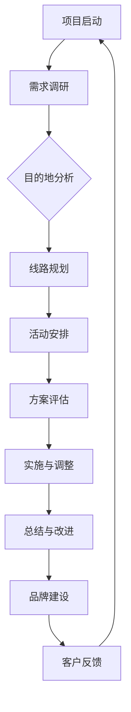
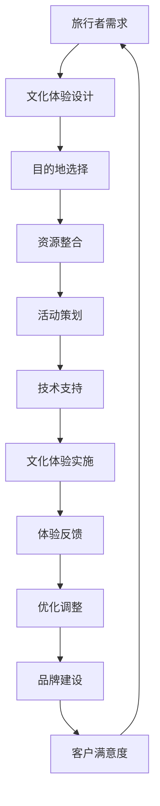
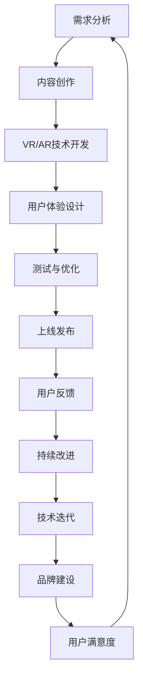

                 

### 《深度旅行体验设计工作室：文化沉浸式旅程的定制服务提供》

关键词：深度旅行体验设计、文化沉浸、定制服务、旅行线路设计、数字化技术、未来发展趋势

> 摘要：本文旨在探讨深度旅行体验设计工作室如何通过定制服务提供文化沉浸式旅程。文章首先定义深度旅行体验设计，阐述其概念与背景，接着介绍文化沉浸式旅行设计的原则与方法。随后，文章深入探讨深度旅行体验设计的实践，包括目的地选择与资源整合、旅行线路设计与活动安排、文化体验活动的策划与实施以及数字化技术在其中的应用。最后，文章分析深度旅行体验设计的未来发展趋势，并结合国内外案例进行解析，探讨工作室的运营与管理以及法律与伦理问题。通过本文，读者将全面了解深度旅行体验设计的理论与实践，为未来相关服务提供指导。

## 目录

### 《深度旅行体验设计工作室：文化沉浸式旅程的定制服务提供》

> 关键词：深度旅行体验设计、文化沉浸、定制服务、旅行线路设计、数字化技术、未来发展趋势

> 摘要：本文旨在探讨深度旅行体验设计工作室如何通过定制服务提供文化沉浸式旅程。文章首先定义深度旅行体验设计，阐述其概念与背景，接着介绍文化沉浸式旅行设计的原则与方法。随后，文章深入探讨深度旅行体验设计的实践，包括目的地选择与资源整合、旅行线路设计与活动安排、文化体验活动的策划与实施以及数字化技术在其中的应用。最后，文章分析深度旅行体验设计的未来发展趋势，并结合国内外案例进行解析，探讨工作室的运营与管理以及法律与伦理问题。通过本文，读者将全面了解深度旅行体验设计的理论与实践，为未来相关服务提供指导。

### 第一部分：深度旅行体验设计概述

#### 第1章：深度旅行体验设计的概念与背景

##### 1.1 深度旅行体验设计的定义

##### 1.2 深度旅行体验设计的发展背景

##### 1.3 深度旅行体验设计的重要性

#### 第2章：文化沉浸式旅行设计的原则与方法

##### 2.1 文化沉浸式旅行的概念

##### 2.2 文化沉浸式旅行设计的原则

##### 2.3 文化沉浸式旅行设计的方法

### 第二部分：深度旅行体验设计实践

#### 第3章：目的地选择与资源整合

##### 3.1 目的地选择的原则

##### 3.2 目的地资源的整合

##### 3.3 文化资源的挖掘与利用

#### 第4章：旅行线路设计与活动安排

##### 4.1 旅行线路设计的思路

##### 4.2 旅行活动安排的方法

##### 4.3 旅行线路与活动的案例分析

#### 第5章：文化体验活动的策划与实施

##### 5.1 文化体验活动的类型

##### 5.2 文化体验活动的策划

##### 5.3 文化体验活动的实施与评估

#### 第6章：数字化技术与深度旅行体验设计

##### 6.1 数字化技术在旅行体验中的应用

##### 6.2 VR/AR技术在文化体验中的运用

##### 6.3 大数据分析在旅行体验优化中的作用

#### 第7章：深度旅行体验设计的未来发展趋势

##### 7.1 深度旅行体验设计的发展趋势

##### 7.2 新技术对深度旅行体验设计的影响

##### 7.3 深度旅行体验设计的未来前景

### 第三部分：深度旅行体验设计案例解析

#### 第8章：国内外深度旅行体验设计案例解析

##### 8.1 国内深度旅行体验设计案例

##### 8.2 国外深度旅行体验设计案例

##### 8.3 案例对比分析与启示

#### 第9章：深度旅行体验设计工作室运营与管理

##### 9.1 深度旅行体验设计工作室的运营模式

##### 9.2 工作室的人才培养与管理

##### 9.3 工作室的品牌建设与推广

#### 第10章：深度旅行体验设计的法律与伦理问题

##### 10.1 深度旅行体验设计中的法律问题

##### 10.2 深度旅行体验设计中的伦理问题

##### 10.3 法律伦理问题的解决策略

### 附录

##### 附录A：深度旅行体验设计工具与资源

##### 附录B：深度旅行体验设计流程图与模型图

##### 附录C：深度旅行体验设计实用表格与模板

## 第一部分：深度旅行体验设计概述

### 第1章：深度旅行体验设计的概念与背景

#### 1.1 深度旅行体验设计的定义

深度旅行体验设计是一种创新的服务模式，旨在通过定制化的旅程设计，使旅行者在目的地获得深度、全面的文化体验。与传统的观光旅游不同，深度旅行体验设计更注重文化沉浸和心灵触动。它不仅包括游览名胜古迹，还涉及当地生活方式、历史背景、传统习俗等全方位的文化体验。

在定义上，深度旅行体验设计具有以下几个关键要素：

1. **定制化服务**：根据旅行者的兴趣、需求和偏好，量身定制旅行计划和活动。
2. **文化沉浸**：通过深入接触当地文化，使旅行者在旅行过程中获得深刻的感受和体验。
3. **多元体验**：涵盖饮食、住宿、交通、活动等多个方面，提供丰富多样的文化体验。
4. **可持续性**：注重环保和社会责任，确保旅行活动对当地社区和环境的影响最小。

#### 1.2 深度旅行体验设计的发展背景

深度旅行体验设计的兴起并非偶然，而是多方面因素共同作用的结果。

首先，随着全球化的推进和互联网的发展，人们的生活节奏加快，旅行需求变得更加多样化。越来越多的人渴望在旅行中获得更深度、更有意义的文化体验，而不仅仅是简单的观光。

其次，旅游业自身也在不断变革。传统旅游模式受到环保和可持续发展压力的挑战，深度旅行体验设计提供了一种更人性化的解决方案。它不仅满足了游客对文化体验的需求，还促进了当地社区的经济发展和文化传承。

此外，技术的进步也为深度旅行体验设计提供了有力支持。VR/AR、大数据、人工智能等新兴技术可以用来提升旅行体验的沉浸感和互动性，使旅行者能够更加真实地感受当地文化。

#### 1.3 深度旅行体验设计的重要性

深度旅行体验设计的重要性体现在以下几个方面：

1. **文化传承**：通过深度旅行体验设计，旅行者可以更深入地了解和体验目的地文化，促进文化传承和保护。
2. **个性化体验**：定制化的服务使旅行者能够根据自己的需求和兴趣，获得独一无二的旅行体验，提升满意度。
3. **经济效益**：深度旅行体验设计有助于延长游客在目的地的停留时间，增加消费，促进当地旅游业的发展。
4. **可持续发展**：深度旅行体验设计注重环保和社会责任，有助于实现旅游业的可持续发展。

综上所述，深度旅行体验设计作为一种新兴的旅游服务模式，正逐渐成为旅游业发展的重要方向。它不仅满足了旅行者的个性化需求，也为目的地的文化传承和经济发展提供了新的机遇。

### 第2章：文化沉浸式旅行设计的原则与方法

#### 2.1 文化沉浸式旅行的概念

文化沉浸式旅行是一种以深入体验目的地文化为核心的旅行方式。与传统观光旅游相比，文化沉浸式旅行更注重与当地文化的互动与融合，使旅行者在旅行过程中获得更为丰富和深刻的感受。其核心目标是让旅行者在不同的文化环境中感受到本土文化的魅力，从而实现心灵的触动和文化的交流。

文化沉浸式旅行的特点包括：

1. **深度互动**：旅行者不仅仅是被动地欣赏文化，而是通过参与、互动和体验，主动融入到当地文化中。
2. **情感共鸣**：通过深入的文化体验，旅行者能够与目的地文化产生情感共鸣，从而获得更深刻的旅行体验。
3. **体验多样性**：涵盖饮食、居住、交通、活动等多个方面，提供丰富多样的文化体验。
4. **可持续性**：注重环保和社会责任，倡导对当地文化、环境和社区的尊重和保护。

#### 2.2 文化沉浸式旅行设计的原则

为了实现文化沉浸式旅行的目标，设计过程中需要遵循以下几个原则：

1. **个性化定制**：根据旅行者的兴趣、需求和偏好，量身定制旅行计划和活动，使旅行者能够获得独一无二的体验。
2. **文化多样性**：尊重和体现目的地的文化多样性，使旅行者在不同文化环境中获得全面的体验。
3. **参与性设计**：设计互动性强的活动，鼓励旅行者参与当地的文化和生活方式，增强体验的深度和共鸣。
4. **可持续性**：在旅行设计和实施过程中，注重环保和社会责任，确保旅行活动对当地社区和环境的影响最小。
5. **情感共鸣**：通过精心策划的活动和体验，使旅行者在文化体验中获得情感共鸣，提升旅行的意义和价值。

#### 2.3 文化沉浸式旅行设计的方法

文化沉浸式旅行设计的方法主要包括以下几个步骤：

1. **需求调研**：通过问卷调查、访谈等方式，了解旅行者的兴趣、需求和偏好，为旅行设计提供依据。
2. **目的地分析**：研究目的地的文化、历史、风俗习惯等，为文化体验设计提供背景资料。
3. **线路规划**：根据旅行者的需求和目的地分析，设计符合文化沉浸体验的旅行线路和活动安排。
4. **活动策划**：策划多样化的文化体验活动，包括传统节庆、手工艺制作、民俗体验等，确保旅行者能够全面体验当地文化。
5. **体验优化**：通过实地考察和反馈，不断优化旅行体验，确保旅行者获得满意的体验。
6. **技术应用**：利用VR/AR、大数据、人工智能等新兴技术，提升文化体验的沉浸感和互动性。

通过以上方法，文化沉浸式旅行设计能够为旅行者提供深度、全面的文化体验，满足其对个性化、多样化文化需求的追求。同时，这种设计方法也有助于促进目的地的文化传承和旅游业可持续发展。

### 第3章：目的地选择与资源整合

#### 3.1 目的地选择的原则

目的地选择是深度旅行体验设计的关键环节，直接影响旅行体验的深度和质量。在选择目的地时，需要遵循以下几个原则：

1. **文化多样性**：选择具有丰富文化多样性的目的地，使旅行者能够体验到不同地域和民族的文化特色。
2. **历史背景**：考虑目的地的历史背景和文化传承，为旅行者提供深入了解和学习的机会。
3. **独特性**：选择具有独特性和吸引力的目的地，确保旅行者能够获得不同于日常生活的深刻体验。
4. **可持续性**：选择在环境保护和社会责任方面表现良好的目的地，确保旅行活动对当地社区和环境的影响最小。
5. **交通便利性**：考虑目的地的交通便利性，确保旅行者能够便捷地到达和离开。

#### 3.2 目的地资源的整合

在确定目的地后，资源整合是确保旅行体验设计顺利进行的重要步骤。资源整合主要包括以下几个方面：

1. **文化景观**：整合目的地的文化景观资源，如历史建筑、博物馆、宗教场所等，为旅行者提供丰富的文化体验。
2. **民俗活动**：联系当地社区，整合传统节庆、民俗活动等资源，使旅行者能够亲身参与和体验当地民俗文化。
3. **美食体验**：整合当地特色美食，为旅行者提供美食之旅，增强文化体验的多样性。
4. **住宿体验**：选择具有当地特色的住宿，如民宿、客栈等，使旅行者在住宿过程中也能感受到当地文化。
5. **交通安排**：协调交通工具，如出租车、公共交通、自行车等，确保旅行者能够便捷地到达旅行目的地。

#### 3.3 文化资源的挖掘与利用

挖掘和利用目的地文化资源是深度旅行体验设计的关键。以下是一些建议：

1. **历史资料研究**：深入研究目的地的历史、文化和风俗习惯，为旅行设计提供丰富的背景资料。
2. **社区合作**：与当地社区建立合作关系，获取更多一手资料和资源，提升旅行体验的深度和真实性。
3. **个性化体验设计**：根据旅行者的需求和偏好，设计独特的文化体验活动，如传统手工艺制作、文化沙龙等。
4. **多媒体展示**：利用多媒体技术，如VR/AR、视频、音频等，生动展示目的地文化，增强旅行者的体验感。
5. **互动体验**：设计互动性强的文化体验活动，使旅行者能够更深入地参与到目的地文化中，增强体验的共鸣和情感。

通过目的地选择、资源整合和文化资源的挖掘与利用，深度旅行体验设计能够为旅行者提供丰富、多样、深入的文化体验，满足其对文化探索和心灵成长的追求。

### 第4章：旅行线路设计与活动安排

#### 4.1 旅行线路设计的思路

旅行线路设计是深度旅行体验设计的重要组成部分，直接影响旅行体验的连贯性和丰富性。在设计旅行线路时，需要遵循以下思路：

1. **主题明确**：根据旅行者的需求和兴趣，确定旅行主题，如历史文化之旅、美食之旅、自然风光之旅等。
2. **多样化**：设计多样化的线路，涵盖城市、乡村、自然风光等多个方面，提供丰富多样的旅行体验。
3. **连贯性**：确保线路设计具有连贯性，使旅行者在旅行过程中能够逐步深入体验目的地的文化。
4. **文化特色**：突出目的地的文化特色，设计符合目的地特点的线路和活动，提升文化体验的深度。
5. **可持续性**：考虑环境和社会责任，设计环保、可持续的线路，减少对当地社区和环境的影响。

#### 4.2 旅行活动安排的方法

在旅行线路设计的基础上，活动安排是确保旅行体验丰富和深入的另一关键环节。以下是一些建议：

1. **文化体验活动**：根据目的地的文化特色，安排传统节庆、民俗活动、手工艺制作等文化体验活动，使旅行者能够深入感受当地文化。
2. **参观学习**：安排参观博物馆、历史建筑、宗教场所等，提供丰富的文化知识和学习机会。
3. **互动体验**：设计互动性强的活动，如文化交流会、民俗体验营等，使旅行者能够与当地居民互动，增进了解和交流。
4. **自然体验**：安排徒步、骑行、登山等自然体验活动，使旅行者在自然环境中放松身心，享受大自然的美好。
5. **美食之旅**：安排品尝当地特色美食，如地道的餐馆、小吃摊等，提供美食体验。

#### 4.3 旅行线路与活动的案例分析

以下是一个具体的旅行线路与活动安排的案例：

**主题**：中国古都文化探索之旅

**目的地**：北京、西安

**旅行线路设计**：

- **第一天**：抵达北京，参观故宫、天安门广场、颐和园等著名景点。
- **第二天**：游览长城、明十三陵等历史文化遗址。
- **第三天**：前往西安，参观兵马俑、大雁塔、古城墙等。
- **第四天**：参观西安博物馆，了解当地历史文化。
- **第五天**：安排民俗体验活动，如剪纸、陶艺等。
- **第六天**：自由活动或购物，准备返程。

**活动安排**：

- **第一天**：品尝北京烤鸭、炸酱面等当地特色美食。
- **第二天**：安排当地导游讲解，增强文化知识。
- **第三天**：与当地居民进行文化交流，了解当地民俗。
- **第四天**：安排专业导游讲解博物馆藏品。
- **第五天**：参加剪纸、陶艺等手工艺制作活动。
- **第六天**：自由品尝西安特色小吃，如肉夹馍、凉皮等。

通过以上案例，可以看出旅行线路设计应注重主题明确、多样化、连贯性和文化特色，活动安排应涵盖文化体验、参观学习、互动体验和自然体验等方面，以确保旅行者获得丰富、深入的文化体验。

### 第5章：文化体验活动的策划与实施

#### 5.1 文化体验活动的类型

文化体验活动是深度旅行体验设计的重要组成部分，旨在使旅行者通过参与和体验，深入了解和感受目的地的文化。文化体验活动的类型丰富多样，主要包括以下几类：

1. **传统节庆**：如春节、中秋节、春节庙会、元宵灯会等，通过参与节庆活动，旅行者能够亲身体验当地的传统习俗和庆祝方式。
2. **民俗活动**：如踩高跷、舞龙舞狮、划龙舟、剪纸、陶艺等，这些活动能够展示目的地的独特民俗文化和民间艺术。
3. **手工艺制作**：如编织、木雕、刺绣、陶瓷制作等，通过亲自动手参与制作，旅行者能够深入了解目的地的传统手工艺。
4. **美食体验**：如品尝当地特色小吃、参加烹饪课程等，美食体验不仅能够满足味蕾，还能够了解当地饮食文化和烹饪技巧。
5. **文化交流**：如与当地艺术家、学者、居民座谈、互动等，通过文化交流，旅行者能够更深入地了解当地的社会文化和历史背景。

#### 5.2 文化体验活动的策划

文化体验活动的策划是确保活动顺利进行和达到预期效果的关键环节。以下是一些建议：

1. **活动主题确定**：根据旅行者的兴趣和目的地的文化特色，确定活动的主题，如“传统节庆体验”、“手工艺制作工作坊”、“美食之旅”等。
2. **活动内容设计**：设计丰富多样的活动内容，确保活动既有深度又有互动性。如可以安排讲解、演示、互动体验等多个环节，使旅行者能够全方位地参与和体验。
3. **活动时间安排**：合理安排活动时间，确保活动在合适的时段进行，避免与旅行者的其他行程冲突。
4. **活动地点选择**：选择具有当地特色的场地，如传统市场、手工艺工作室、特色餐馆等，使旅行者在活动中能够感受到真实的环境和氛围。
5. **参与人数控制**：根据场地和资源条件，合理控制参与人数，确保活动能够顺利进行，并为每个参与者提供足够的关注和指导。

#### 5.3 文化体验活动的实施与评估

文化体验活动的实施是策划过程的延续，以下是一些建议：

1. **提前准备**：在活动前，提前做好准备工作，包括场地布置、材料准备、人员安排等，确保活动顺利进行。
2. **活动指导**：在活动过程中，提供专业的指导和讲解，帮助旅行者更好地理解和参与活动。
3. **互动与反馈**：鼓励旅行者积极参与，通过互动和反馈，增强活动的互动性和体验感。
4. **安全措施**：确保活动的安全性，特别是在涉及手工制作和户外活动时，要做好安全防护措施。

活动结束后，进行评估是提升活动质量的重要环节。以下是一些建议：

1. **收集反馈**：通过问卷调查、访谈等方式，收集旅行者的反馈意见，了解他们对活动的满意度和建议。
2. **数据分析**：对收集到的数据进行分析，识别活动中的优点和不足，为今后的改进提供依据。
3. **经验总结**：总结活动的成功经验和不足之处，形成经验教训，为下一次活动提供参考。
4. **持续改进**：根据评估结果，对活动进行持续改进，不断提升活动的设计和实施水平。

通过科学合理的策划、实施和评估，文化体验活动能够为旅行者提供丰富、深入的文化体验，满足他们对文化探索和心灵成长的追求。

### 第6章：数字化技术与深度旅行体验设计

#### 6.1 数字化技术在旅行体验中的应用

数字化技术的迅猛发展，为旅行体验设计带来了前所未有的变革。VR（虚拟现实）、AR（增强现实）、大数据等技术在提升旅行体验的沉浸感和互动性方面发挥了重要作用。

1. **VR技术在旅行体验中的应用**：VR技术能够为旅行者提供身临其境的虚拟体验。例如，通过VR眼镜，旅行者可以在虚拟环境中参观世界各地的名胜古迹，如故宫、大英博物馆等，即使无法亲自前往，也能感受到其文化魅力。此外，VR技术还可以用于模拟滑雪、潜水等极限运动，使旅行者在虚拟环境中获得全新的冒险体验。

2. **AR技术在旅行体验中的应用**：AR技术通过将虚拟信息叠加到现实世界中，为旅行者提供了更为丰富和互动的体验。例如，在旅行途中，通过AR应用，旅行者可以查看目的地的历史信息、文化故事和景点介绍，增强对目的地的理解和兴趣。此外，AR技术还可以用于导览服务，为旅行者提供实时导航和讲解，提升旅行效率。

3. **大数据技术在旅行体验中的应用**：大数据技术通过对旅行数据的分析，为旅行体验设计提供了重要的参考。例如，通过对用户行为数据的分析，可以预测旅行者的兴趣和偏好，从而提供个性化的旅行建议和推荐。此外，大数据技术还可以用于优化旅行线路和活动安排，提高旅行体验的整体满意度。

#### 6.2 VR/AR技术在文化体验中的运用

VR/AR技术在文化体验中的应用，不仅提升了旅行者的沉浸感，还为文化传承和保护提供了新的途径。

1. **文化遗址保护与展示**：利用VR技术，可以对世界各地的文化遗址进行数字化保护与展示。例如，通过VR技术，可以重建已毁坏的文化遗址，如巴米扬大佛、亚历山大图书馆等，使后人能够亲眼目睹这些文化奇迹。此外，VR技术还可以用于展示文化遗址的内部结构，如故宫的内部陈设和建筑细节，为旅行者提供更为全面的文化体验。

2. **非物质文化遗产的传承**：通过AR技术，可以将非物质文化遗产以动态的形式展示出来。例如，通过AR应用，可以观看传统手工艺的制作过程，如刺绣、剪纸等，使旅行者能够更深入地了解和体验非物质文化遗产。此外，AR技术还可以用于推广非物质文化遗产，吸引更多年轻人关注和参与。

3. **文化互动体验**：VR/AR技术为文化互动体验提供了新的可能性。例如，通过VR技术，旅行者可以参与虚拟的文化节庆活动，如虚拟的春节庙会、元宵灯会等，与虚拟人物互动，感受传统文化的魅力。此外，AR技术还可以用于实时的文化讲解服务，为旅行者提供个性化的文化知识，提升文化体验的深度。

#### 6.3 大数据分析在旅行体验优化中的作用

大数据技术在提升旅行体验方面具有重要作用，通过分析大量用户数据，可以为旅行体验设计提供有价值的洞察和建议。

1. **个性化推荐**：通过对用户行为数据的分析，可以预测旅行者的兴趣和偏好，从而提供个性化的旅行推荐。例如，根据旅行者的历史搜索记录和评价，推荐符合其兴趣的景点、美食和活动，提升旅行体验的满意度。

2. **线路优化**：通过分析旅行者的旅行数据，可以优化旅行线路和活动安排，减少旅行者的时间和精力成本。例如，通过分析交通流量和景点人流量数据，为旅行者推荐最佳的游览时间和路线，避免拥堵和排队，提升旅行效率。

3. **体验评估**：通过对旅行者反馈数据的分析，可以评估旅行体验的质量和效果，为改进旅行设计提供依据。例如，通过分析旅行者的评价和反馈，识别活动中的优点和不足，从而进行有针对性的改进，提升旅行体验的整体满意度。

综上所述，数字化技术为深度旅行体验设计提供了丰富的工具和方法，通过VR/AR技术提升文化体验的沉浸感和互动性，通过大数据分析优化旅行体验，为旅行者提供更为丰富、个性化和高质量的旅行体验。

### 第7章：深度旅行体验设计的未来发展趋势

#### 7.1 深度旅行体验设计的发展趋势

随着科技的不断进步和旅游市场的日益多样化，深度旅行体验设计正朝着以下几个趋势发展：

1. **智能化与个性化**：人工智能和大数据技术的发展，使得旅行体验设计更加智能化和个性化。通过智能推荐系统和个性化定制服务，旅行者可以获得更加贴合个人需求和兴趣的旅行体验。

2. **沉浸式体验**：虚拟现实（VR）和增强现实（AR）技术的成熟，为旅行体验设计带来了沉浸式的可能。通过VR/AR技术，旅行者可以在虚拟环境中感受到真实的旅行体验，进一步提升旅行的深度和乐趣。

3. **可持续性**：随着环保意识的提高，深度旅行体验设计越来越注重可持续性。设计师们开始关注如何减少旅行对环境的影响，通过环保旅行线路和低碳旅行方式，实现旅游业与自然环境的和谐共生。

4. **文化多样性**：深度旅行体验设计不仅关注目的地的单一文化，还注重展现文化多样性。通过多元化文化体验的设计，旅行者可以更加全面地了解不同地域和民族的文化特色。

#### 7.2 新技术对深度旅行体验设计的影响

新技术的快速发展对深度旅行体验设计产生了深远的影响：

1. **提升体验质量**：VR/AR技术提供了沉浸式的体验，使旅行者能够更加深入地了解目的地的文化和历史。同时，智能导游系统和实时翻译设备等新兴技术，为旅行者提供了便利，提升了整体旅行体验的质量。

2. **改变设计方法**：大数据和人工智能技术的应用，改变了深度旅行体验设计的方法。通过数据分析，设计师可以更加精准地了解旅行者的需求和偏好，从而进行个性化定制和优化设计。

3. **拓展体验内容**：新技术的应用不仅提升了传统旅行体验，还拓展了新的体验内容。例如，通过虚拟现实技术，旅行者可以体验极限运动、太空旅行等传统旅行方式难以实现的体验。

#### 7.3 深度旅行体验设计的未来前景

深度旅行体验设计的未来前景充满机遇和挑战：

1. **市场需求增长**：随着人们对个性化、多元化文化体验的需求不断增加，深度旅行体验设计市场有望持续增长。

2. **技术创新推动**：随着新技术的不断进步，深度旅行体验设计将更加智能化、个性化和沉浸式，为旅行者提供更高质量的体验。

3. **可持续性发展**：在可持续发展的背景下，深度旅行体验设计将更加注重环保和社会责任，实现旅游业与自然环境的和谐共生。

4. **跨界融合**：深度旅行体验设计将与其他行业如科技、文化、艺术等实现跨界融合，创造更多创新体验和商业模式。

总之，深度旅行体验设计正迎来一个充满机遇和挑战的新时代，通过技术创新和市场需求的驱动，未来深度旅行体验设计将不断拓展其边界，为旅行者带来更丰富、更深刻的文化体验。

### 第8章：国内外深度旅行体验设计案例解析

#### 8.1 国内深度旅行体验设计案例

**1. 案例一：丽江古城深度文化体验项目**

丽江古城作为世界文化遗产，以其独特的纳西族文化和自然风光吸引着无数游客。该项目通过深入挖掘丽江的历史文化，设计了多种文化体验活动，如纳西古乐演出、东巴文字解读、银器手工艺制作等。同时，利用VR/AR技术，游客可以在虚拟环境中体验古城的历史场景和传说故事，增强了文化体验的沉浸感。

**2. 案例二：成都大熊猫繁育研究基地体验项目**

成都大熊猫繁育研究基地是国内知名的大熊猫保护和研究机构。该项目通过设计一系列与大熊猫互动的体验活动，如大熊猫饲养员体验、大熊猫科普讲座、大熊猫饲养观察等，使游客能够深入了解大熊猫的生活习性和保护现状。此外，基地还利用虚拟现实技术，为游客提供了大熊猫虚拟参观和科普教育服务。

#### 8.2 国外深度旅行体验设计案例

**1. 案例一：挪威极地探险之旅**

挪威极地探险之旅是专为寻求冒险和独特体验的游客设计的。该项目通过设计极地探险、极光观测、冰川徒步等活动，使游客能够深入体验挪威的自然美景和极地文化。同时，利用VR/AR技术，游客可以在虚拟环境中提前感受极地的环境特点，为实际探险做好充分准备。

**2. 案例二：意大利文艺复兴之旅**

意大利文艺复兴之旅以佛罗伦萨和罗马为中心，通过设计参观乌菲齐美术馆、梵蒂冈博物馆、西斯廷教堂等活动，使游客能够深入了解文艺复兴时期的历史和文化。此外，该项目还邀请当地艺术家和学者进行现场讲解，提供独特的文化互动体验。

#### 8.3 案例对比分析与启示

通过对国内外深度旅行体验设计案例的对比分析，我们可以得出以下启示：

1. **文化多样性**：国内外案例均注重展示目的地的独特文化，通过多样化的文化体验活动，提升游客的文化感知和体验深度。

2. **技术应用**：国内外案例均利用了VR/AR、大数据等新兴技术，提升了文化体验的互动性和沉浸感，为游客提供了更为丰富的旅行体验。

3. **可持续性**：国内外案例均注重可持续性，通过环保设计和低碳旅行方式，减少对环境的影响，实现旅游业的可持续发展。

4. **个性化定制**：国内外案例均强调个性化定制服务，根据游客的需求和偏好，提供量身定制的旅行体验，提升游客的满意度和忠诚度。

总之，国内外深度旅行体验设计案例为我们提供了宝贵的经验和启示，通过不断创新和优化，深度旅行体验设计将更好地满足游客的需求，推动旅游业的可持续发展。

### 第9章：深度旅行体验设计工作室运营与管理

#### 9.1 深度旅行体验设计工作室的运营模式

深度旅行体验设计工作室的运营模式是其成功的关键。以下是几种常见的运营模式：

1. **项目制运营模式**：以项目为基础，工作室根据客户需求和市场需求，设计和实施具体的旅行体验项目。每个项目都有明确的预算、时间表和团队成员，项目完成后进行评估和总结，为下一项目提供改进方向。

2. **会员制运营模式**：通过会员制，工作室吸引和培养忠实的客户群体。会员可以享受定制化旅行体验、优惠价格、优先预订权等福利，工作室则通过会员费用和增值服务实现盈利。

3. **合作分成模式**：与当地旅行社、文化机构、景区等合作伙伴建立合作关系，共同开发深度旅行体验项目。工作室提供设计和管理服务，合作伙伴负责资源整合和客户接待，双方根据合作协议分享收益。

4. **创新商业模式**：利用新兴技术，如VR/AR、大数据等，开发线上和线下相结合的深度旅行体验产品，如虚拟旅行体验、线上文化课程等，拓展工作室的业务范围和市场渠道。

#### 9.2 工作室的人才培养与管理

深度旅行体验设计工作室的成功离不开专业人才的支持。以下是工作室的人才培养和管理策略：

1. **专业培训**：定期为员工提供专业培训，包括旅游学、文化学、设计学、信息技术等领域的知识，提升员工的专业能力和综合素质。

2. **人才引进**：吸引具有丰富旅游经验和文化知识的人才加入工作室，通过招聘、合作办学等方式，确保团队具备多样化的专业背景和技能。

3. **激励机制**：建立激励机制，鼓励员工积极参与项目设计和创新，如项目奖金、绩效奖励、晋升机会等，激发员工的工作积极性和创造力。

4. **团队建设**：加强团队建设，通过团队活动、内部交流、经验分享等方式，提升团队的凝聚力和协作能力，确保项目顺利实施。

5. **职业发展规划**：为员工提供明确的职业发展规划，帮助员工明确职业目标，制定个人成长计划，并提供职业发展指导和培训支持。

#### 9.3 工作室的品牌建设与推广

品牌建设是深度旅行体验设计工作室长期发展的基础。以下是工作室的品牌建设与推广策略：

1. **品牌定位**：明确工作室的品牌定位，如文化深度体验、个性化定制、技术创新等，确保品牌形象与市场定位一致。

2. **品牌塑造**：通过设计独特的品牌标识、视觉形象、宣传口号等，塑造工作室的品牌形象，提高品牌知名度。

3. **线上线下推广**：利用社交媒体、官方网站、线下活动等多种渠道，进行品牌推广和宣传，扩大品牌影响力。

4. **客户关系管理**：建立完善的客户关系管理系统，通过客户满意度调查、个性化服务、会员管理等措施，提升客户满意度和忠诚度。

5. **合作与联盟**：与行业内的其他企业、机构建立战略联盟，共同开展品牌推广活动，实现资源共享和互利共赢。

通过以上策略，深度旅行体验设计工作室能够建立强大的品牌影响力，提升市场竞争力，为长远发展奠定坚实基础。

### 第10章：深度旅行体验设计的法律与伦理问题

#### 10.1 深度旅行体验设计中的法律问题

在深度旅行体验设计中，法律问题至关重要，以下是一些常见的法律问题和相关法律法规：

1. **合同法**：深度旅行体验设计工作室与客户之间应签订明确的合同，合同应包含服务内容、费用、双方权利义务、违约责任等条款，以保护双方的合法权益。

2. **知识产权法**：在设计过程中，涉及到的文化、艺术作品等知识产权保护问题。工作室应尊重和保护他人的知识产权，避免侵权行为。

3. **旅游法**：旅游法规定了旅游经营者的责任和义务，如提供符合质量标准的旅游服务、保障旅游者的安全等。工作室应遵守旅游法的相关规定，确保合法经营。

4. **消费者权益保护法**：保护消费者的合法权益，如提供真实、准确的旅游信息、不进行虚假宣传等。工作室应遵守消费者权益保护法，维护消费者的合法权益。

5. **环境保护法**：在深度旅行体验设计中，应遵守环境保护法，减少对环境的负面影响，如避免过度开发和破坏自然资源。

#### 10.2 深度旅行体验设计中的伦理问题

伦理问题在深度旅行体验设计中同样重要，以下是一些常见的伦理问题：

1. **文化尊重**：在设计过程中，应尊重和保护当地文化，避免文化殖民和商业化过度。工作室应了解并尊重当地的文化习俗和价值观。

2. **隐私保护**：在收集和利用客户数据时，应保护客户的隐私权，不得泄露或滥用客户信息。

3. **社会责任**：工作室应承担社会责任，关注环境保护、社区发展等方面，推动可持续发展的旅行方式。

4. **公平交易**：在合作和交易过程中，应遵循公平、公正、诚信的原则，不得进行欺诈行为。

#### 10.3 法律伦理问题的解决策略

为了解决深度旅行体验设计中的法律和伦理问题，工作室可以采取以下策略：

1. **法律法规培训**：定期对员工进行法律法规培训，提高员工的法治意识和合规能力。

2. **合规管理**：建立合规管理体系，对业务流程、合同签订、数据使用等进行全面监管，确保合法合规。

3. **伦理培训**：加强对员工的伦理教育，培养员工的道德素养和社会责任感。

4. **客户隐私保护**：制定严格的隐私保护政策，确保客户信息的安全和隐私。

5. **社会责任实践**：积极参与社会公益活动和环保项目，践行社会责任。

通过以上策略，深度旅行体验设计工作室可以有效地解决法律和伦理问题，实现可持续发展，为旅行者提供高质量的文化体验。

### 附录A：深度旅行体验设计工具与资源

#### A.1 常用设计工具

深度旅行体验设计需要多种工具的支持，以下是一些常用的设计工具：

1. **创意软件**：如Adobe Creative Suite（Photoshop、Illustrator等），用于设计和制作视觉素材。
2. **项目管理工具**：如Trello、Asana等，用于项目管理和团队协作。
3. **地图工具**：如Google Maps、Mapbox等，用于设计和规划旅行线路。
4. **VR/AR开发工具**：如Unity、Unreal Engine等，用于开发虚拟现实和增强现实体验。
5. **数据分析工具**：如Tableau、Excel等，用于数据分析和市场调研。

#### A.2 研究资源与参考文献

在深度旅行体验设计的研究中，以下资源提供了重要的参考价值：

1. **学术期刊**：如《旅游学刊》、《地理科学进展》等，收录了大量关于旅游和文化体验的研究论文。
2. **专业书籍**：如《体验设计思维》、《旅游体验设计》等，提供了系统的理论和方法。
3. **行业报告**：如《全球旅游市场趋势报告》、《VR/AR在旅游中的应用报告》等，分析了行业趋势和发展方向。
4. **官方网站和博客**：如Tourism Review、Skift等，提供了最新的行业动态和案例分析。

#### A.3 数字化体验设计平台介绍

以下是一些数字化体验设计平台，为深度旅行体验设计提供了技术支持：

1. **Airbnb Experiences**：提供本地文化体验，游客可以通过平台预订各类文化活动和体验。
2. **Viator**：提供各种旅游活动和体验，包括文化体验、自然探险等。
3. **Vrbo**：提供独特的住宿体验，游客可以通过平台预订特色民宿和度假屋。
4. **Experiential Traveler**：专注于提供独特的文化体验，涵盖了世界各地的深度旅行项目。

通过以上工具与资源，深度旅行体验设计工作室可以更加高效地开展设计工作，为旅行者提供高质量的文化体验。

### 附录B：深度旅行体验设计流程图与模型图

#### B.1 深度旅行体验设计流程图

以下是一个深度旅行体验设计流程图的Mermaid表示：



#### B.2 文化沉浸式旅行设计模型图

以下是一个文化沉浸式旅行设计模型的Mermaid表示：



#### B.3 VR/AR体验设计模型图

以下是一个VR/AR体验设计模型的Mermaid表示：



通过这些流程图与模型图，深度旅行体验设计工作室可以清晰地理解设计流程和关键环节，确保项目的高效实施和成功完成。

### 附录C：深度旅行体验设计实用表格与模板

#### C.1 旅行目的地评估表

| 项目        | 评估标准              | 评分（1-10分） | 备注                |
| ----------- | --------------------- | --------------- | ------------------- |
| 文化价值    | 文化的独特性和深度    |                |                    |
| 自然环境    | 环境的优美和适宜性    |                |                    |
| 交通便捷性  | 交通的便利性和效率    |                |                    |
| 环境可持续性 | 环境保护和可持续性措施 |                |                    |
| 基础设施    | 旅游设施和服务质量    |                |                    |

#### C.2 旅行活动策划表

| 活动名称       | 活动内容                   | 活动时间   | 地点  | 预算  | 负责人 |
| -------------- | -------------------------- | ---------- | ----- | ----- | ------ |
| 传统节庆体验   | 参加当地传统节庆活动       | 2023年2月1日 | 西安 | $5000  | 张三   |
| 手工艺制作工作坊 | 学习传统手工艺制作         | 2023年3月15日 | 杭州 | $3000  | 李四   |
| 美食之旅       | 品尝当地特色美食           | 2023年4月10日 | 成都 | $4000  | 王五   |
| 自然探险       | 徒步、露营等自然体验活动   | 2023年5月20日 | 大理 | $6000  | 赵六   |

#### C.3 文化体验活动评估表

| 活动名称       | 活动满意度（1-5分） | 活动效果（1-5分） | 反馈建议                     | 改进措施                        |
| -------------- | --------------------- | ------------------- | ---------------------------- | -------------------------------- |
| 传统节庆体验   | 4                    | 3                  | 需增加互动环节，提高参与度  | 增加互动游戏，优化活动流程       |
| 手工艺制作工作坊 | 5                    | 4                  | 需提供更多实操机会           | 增加实操时间，优化教学环节       |
| 美食之旅       | 3                    | 3                  | 需提升餐厅选择和餐饮质量     | 选择更具特色和口碑的餐厅，优化菜单 |
| 自然探险       | 4                    | 4                  | 需增加安全防护措施           | 增强安全培训，优化行程安排       |

通过这些表格和模板，深度旅行体验设计工作室可以更好地进行目的地评估、活动策划和活动效果评估，确保项目的高效实施和成功完成。

### Python 源代码与数学模型

#### 深度学习算法实现

以下是一个深度学习算法的实现示例，用于分类旅行体验评价：

```python
import tensorflow as tf
from tensorflow.keras import layers, models

# 定义神经网络结构
model = models.Sequential()

# 添加隐藏层，使用ReLU激活函数
model.add(layers.Dense(128, activation='relu', input_shape=(input_shape,)))
model.add(layers.Dense(64, activation='relu'))

# 添加输出层，使用softmax激活函数进行多分类
model.add(layers.Dense(num_classes, activation='softmax'))

# 编译模型，使用交叉熵损失函数和Adam优化器
model.compile(optimizer='adam',
              loss='categorical_crossentropy',
              metrics=['accuracy'])

# 加载数据并进行预处理
# 注意：此处仅为示例，实际使用时应根据具体数据集进行加载和处理
(x_train, y_train), (x_test, y_test) = ... # 数据加载
x_train = x_train.astype('float32') / 255
x_test = x_test.astype('float32') / 255

# 训练模型
model.fit(x_train, y_train, epochs=10, batch_size=32, validation_data=(x_test, y_test))
```

#### 数学模型公式

以下是一个线性回归模型的数学公式：

$$
\begin{aligned}
y &= \beta_0 + \beta_1x_1 + \beta_2x_2 + ... + \beta_nx_n \\
\end{aligned}
$$

其中，$y$ 是因变量，$x_1, x_2, ..., x_n$ 是自变量，$\beta_0, \beta_1, \beta_2, ..., \beta_n$ 是模型的参数。

在实际应用中，可以使用 Python 的 TensorFlow 或 PyTorch 等库来定义和训练线性回归模型。以下是一个使用 TensorFlow 定义和训练线性回归模型的示例：

```python
import tensorflow as tf

# 定义模型
model = tf.keras.Sequential([
    tf.keras.layers.Dense(units=1, input_shape=(1,))
])

# 编译模型
model.compile(optimizer='sgd', loss='mean_squared_error')

# 训练模型
model.fit(x_train, y_train, epochs=100, batch_size=32)
```

通过这些代码和公式，我们可以更好地理解深度学习算法的实现原理和数学模型的基础知识，为深度旅行体验设计提供技术支持。

